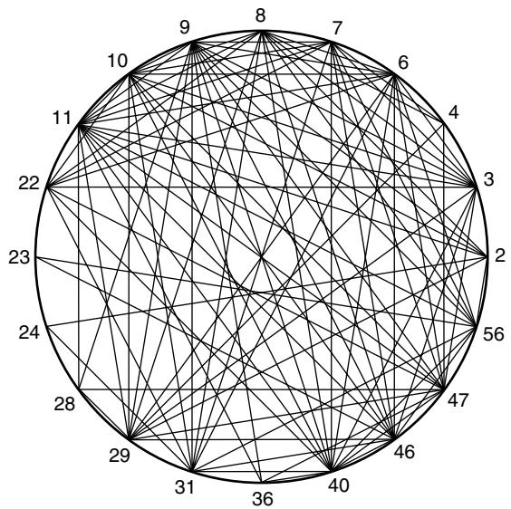
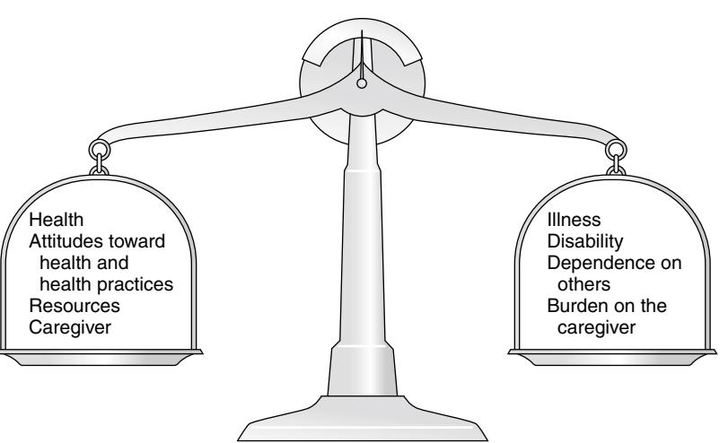
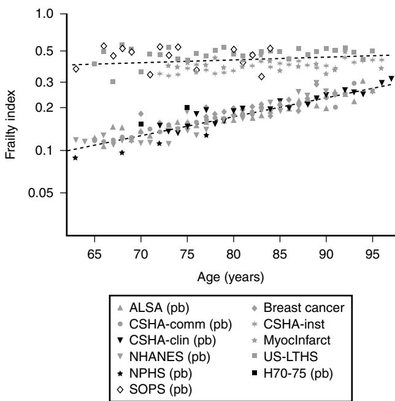
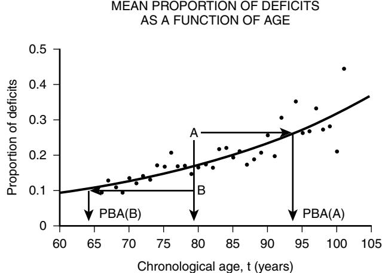

# A Clinico-Mathematical Model of Aging

# Kenneth Rockwood Arnold Mitnitski

# **INTRODUCTION**

# **Overview of frailty**

Geriatricians have an affinity for frail elderly people, or should. The complex care of elderly people who are frail is argued—including in the Foreword of this book—to be the very stuff of geriatric medicine.1 This chapter, building on recent reviews,2,3 addresses the issue of frailty in relation to complexity to argue that the formal assessment of complexity can usefully be employed to understand the scientific basis of the analyses of frailty, with insights for the practice of geriatric medicine.

Frail, elderly patients are at an increased risk—compared with others of the same chronologic age—as a consequence of having multiple, interacting, age-related physiologic impairments, some of which cross clinical thresholds to be recognized as diseases and others as disabilities. These impairments, diseases, and disabilities typically interact with various social vulnerability factors, which commonly travel with the frail to further increase the risk of adverse health outcomes.

The view of frailty as a multiple-determined at-risk state is reasonably noncontroversial.4–8 By contrast, how best to operationalize frailty is more controversial. As outlined in various reviews, some of the proposed operational definitions receive more widespread support than others. In particular, the "phenotypic" definition of frailty used in the Cardiovascular Health Study (CHS)9 has been endorsed at consensus conferences6,7 and employed by several groups.10–13 Indeed, it has even been claimed that the terms "frail" and "frailty" should be avoided except when used in the context of a CHS assessment.14

# **Overview of complexity**

The idea of complexity is proving to be one of the most important conceptual advances in science.15 Briefly, complexity arises from systems. Systems can be defined in many ways because there is an irreducible extent to which the definition of a system depends on the context in which it is considered. To start, it might work best to contrast a *system* with a *set of elements*. The elements of a set exist as members of the set because of some shared characteristic, but they do not become a system until there is interconnectedness between them. Interconnectedness exists when changes in one element result in changes in other elements, and these changes result in further changes, and so forth. It is the nature of the interrelated changes that defines complexity: complexity is the phenomenon of dynamic interactions in the elements of a system. The goal of complexity analyses is to quantify and summarize these changes.

The use of complexity analyses in aging has not been noncontroversial. For example, in 2002, an entire issue of *Neurobiology of Aging* was devoted to complexity. Some of the papers in the special issue gave examples in which complexity, as measured in one specific context, appeared to decrease with aging,16 whereas others gave opposite examples.17 Although some commentators despaired,18 this result is typical when complex systems are first investigated. Commonly, with better specification of the context, (e.g., specification of intrinsic dynamics or of the time scale under consideration) apparent contradictions resolve. Such specification can lead to the implementation of new interventions that are based on a better appreciation of changes in dynamic complexity of biologic variability, such as the application of subsensory noise to the feet to improve postural stability in older adults.19

It is evident that aging humans constitute aging systems, both as individuals and as groups, and that within the human organism, there are different organ systems, although their specification—where does the vascular system end and the immunologic system begin?—often results in some arbitrariness. Such arbitrariness is best not ignored when considering a phenomenon as all-encompassing as the passage of time. How to specify the interconnectedness of the organs in the body as people age is not clear. It is clear, however, that there is (there must be, if it is a system) interconnectedness of health characteristics (interdependence of variables). One way to specify the interconnectedness of health characteristics is by the use of connectivity graphs (Figure 10-1). Such graphs are constructed to represent interconnectedness between variables, so that a line between variables is portrayed when some specified level of connectivity—say a correlation >0.2 exists. As the graph illustrates, some variables are more highly connected than others (i.e., some have more lines between them than others do.20 (It is this high connectivity between some items more than others, that means that the items of the frailty index do not need to be weighted—an issue to which we will come.)

The connectivity graph illustrates two fundamental points about complex states, which are multiplicity and interconnectedness. Another way to think about interconnectedness is that a system is "more than a sum of its parts"; this is sometimes referred to as the system having "emergent properties." (The idea of emergent properties is controversial and need not be considered further here.) What will be evident is that an individual's state of health can be summarized by a single number—it is what we will refer to later as the frailty index—and that the properties or behavior of that number (for example, how the frailty index changes with age) can be considered as an area of investigation in and of itself. To continue that example, we have shown that the distribution of the frailty index with age has distinctive characteristics.21 These characteristics can be studied using network models, which offer an apparatus for such analyses, based on stochastic dynamics.22–28 One example is the idea that heterogeneity (here, of the distribution of the frailty index with age)21,26 arises as a consequence of the stochastic dynamics of complex systems. This approach to studying heterogeneity is readily summarizable using a network approach, and has had wide applicability from cortical networks in Alzheimer's disease29 to capital markets,30 to gas furnace pressures.31 Finally, the connectivity graph also shows that a complex system is summarizable. We will refer to this later, in terms of both the frailty index, and of the more general case of a clinical state variable. For now, we will simply note that a complex system can be summarized in ways that are not necessarily

Figure 10-1. Connectivity graph. Nodes indicate the deficits (codes correspond to the deficits listed in reference 20) and edges indicate statistically significant relationships between deficits (i.e., when the conditional probability of one deficit, given another is statistically different (p < 0.05; *t*-test) from the unconditional probability of the first deficit. It is clear that not all elements are equally well connected. *(Copyright A Mitnitski et al, used with permission.)*

complicated. That is the goal of the bulk of initiatives in bringing the tools of complexity analysis to studying what happens as people age and become frail. As a start, the simplicity of the output of these analyses is a good measure by which the merit of the analyses might be judged.

## **THE PHENOTYPIC DEFINITION OF FRAILTY**

A very popular approach to defining frailty is by means of a clinical phenotype. This operational definition, developed by a consensus and tested in the Cardiovascular Health Survey,9 has been validated in several studies12,13,32–39 and endorsed by several groups.6–8 The phenotypic definition concentrates on five clinical characteristics: a self-report of exhaustion, self or observer report of a decline in activity level, demonstrated or reported weight loss, impaired strength (commonly operationalized as impaired grip strength using a dynamometer), and slow gait (e.g., defined as the slowest 20% of the population was defined at baseline, based on time to walk 15 feet, adjusting for gender and standing height).9 People who have none of the five characteristics are said to be robust, and those with three or more are said to be frail. People who have only one or two problems are at an intermediate risk grade, referred to as being "prefrail." In several studies, the three groups have been shown to have ascending levels of risk of a number of adverse health outcomes, including worsening mobility, falls, disability, fracture, mortality, and institutionalization.9,12,32–35,37

A comprehensive series of studies have evaluated a wide range of markers that are seen in association with increasing grades of frailty. People who are frail have been found to have, among other impairments, higher levels of inflammatory markers,40–42 worse glucose control43 and lower antioxidant13 and hemoglobin44 levels.

The ready operationalization of the phenotypic definition, especially in epidemiologic studies, is a clear asset. So too has been the attempt to disentangle physical frailty from disability and comorbidity.45 On the other hand, the phenotype has been criticized for an artificial distinction between physical and cognitive (including affective) states,46 for requiring performance tests that can be impracticable in the clinical setting47 and for problems of both sensitivity and specificity in relation to both mortality prediction48 and to what many experienced clinicians would accept as frail.46

#### **Frailty in relation to deficit accumulation**

Our group has proposed that frailty can be understood in relation to deficit accumulation.49 The fundamental idea to this approach is that the more deficits that people have (the more things people have wrong with them), the more likely they are to be frail. We have been encouraged to continue with this approach by the insights that can be gained from the study of the frailty index itself. Our group, and others48,50 have described how the frailty index changes in characteristic ways. These changes are susceptible to precise analyses, which we will outline below, and which also appear to have useful clinical implications. In this way, we hope to move beyond cartoon models of frailty. For example, Figure 10-2 is one such cartoon model.51 It represents frailty as a state that arises from a dynamic interplay between a variety of factors. When people are well, their assets outweigh their deficits. As they experience illness, the balance can shift, but as this is a dynamic state, it can shift back. The model also suggests that people with, for example, many social assets, will be harder to tip into frailty than those with fewer social assets.

Although cartoon models have many uses, and the advantage of readily illustrating complicated ideas, they cannot offer the precision of formal, quantitative models, as depicted in Figure 10-3. 52 It demonstrates changes in frailty states, from having *n* deficits at baseline, to *k* deficits at follow-up. The formal model shows that these probabilities can be modeled as a modified Poisson distribution. Here is what the formula says: the chance of having *k* deficits at follow-up is a function of the number of deficits *n*, at baseline. First, we must consider that to have *k* deficits at follow-up, the person must be alive, so the chance of moving from *n* to *k* must be adjusted for the chance of surviving. The term *P*nd is the chance of dying during the interval between baseline and follow-up (or between any two consecutive assessments) so 1–*P*nd is the chance of surviving. For any given *n* state (e.g., *n* = 1, *n* = 2, etc.), the chance of having any *k* deficit proceeds in a highly ordered way, with incremental change (this is what is implied by the Poisson distribution). For example, for most baseline states, the single most likely number of deficits that an individual will have at follow-up is one more than they had at baseline. (Formally, this can be summarized as saying that the mode of *k* is *n* + 1.) There is a slightly smaller chance of staying the same and about the same chance of having two things wrong more than at baseline, a smaller chance again of improving and so on. The probabilities of achieving any given *k* therefore arise as a function of *n*, and follow an ordered set of changes. On average, *n* increases, but for virtually any value of *n*, there is a chance of improvement (or stabilization or decline). Large jumps in *n* to *k* states are uncommon; when large changes in the value of *n* do occur, they usually go from a low *n* state (i.e., few deficits, good health) to a high *k* state.

Two other points are especially of note. One is that the chance of moving from any given *n* state to any *k* state

Figure 10-2. The balance beam model of changes in frailty states. The beam illustrates a multicomponent, dynamic state. *(Copyright CMAJ and used with permission.)*

$$\mathcal{P}\_{nk} = \frac{\rho\_n^{\times k}}{k!} \exp(-\rho\_n)(1 - \mathcal{P}\_{nd})$$

Figure 10-3. A formal mode of changes in frailty states, expressed as the probability of a person with *n* deficits at baseline surviving to have *k* deficits at follow-up. *Pnd* is the chance of dying; *Pnd* = *P0d exp*(*b*2*n*). Note that {I}ρn = ρ0 + b1n{/I}; {I}ρ0 {/I} and *P0d* are the characteristic risks associated with no deficits. The two parameters *b1* and *b2* describe, respectively (given the current number of deficits, *n*), the increments of their expected change, and the risk of death. Note that the model can be elaborated to include the effects of specific covariates, such as age, sex, or social vulnerability. In that case, the antilog of the ratio of the regression coefficients associated with each covariate is an estimate of the relative risk associated with that coefficient.

depends on both the present value of *n*, and the general (or ambient, or background) changes in that environment. This is captured in the formula by saying that {I}ρn = ρ0 +b1n{/I}, where {I}ρ0 {/I} describes the chance of accumulating deficits for people who have nothing wrong at baseline (i.e., who at baseline are in the "zero [deficit] state.") The parameter *b*1 describes, given the current nonzero number of deficits, the increments of their expected change.25 Of course, the same obtains for the risk of death [i.e., *Pnd* = *P0d exp*(*b*2*n*)]; *P0d* is the chance of dying for people who have nothing wrong at baseline. Here, parameter *b*2 describes, again given the current (nonzero) number of deficits, the associated risk of death.25 In this way, it can be seen that the zero state appears to be informative about the environment in which a given population ages. Finally, we note that this is a simplified model, which can be adjusted to evaluate the impact of various covariates. For example, to understand the impact of high versus low level of education, we can evaluate its impact on {I}ρ0 {/I} and *Pnd*.

The move from the operationalization of the concepts of deficits in dynamic balance in Figure 10-2 to the terms specified in Figure 10-3 took place over some years, but each agrees on the following essential points: Frailty is a multiply with agreement on determined state of risk that is complex (component parts which interact in ways that are not always summarizable at the level of the individual parts) and dynamic (the interactions produce further interactions, and change with time). In Figure 10-2, items that relate to health are envisaged as weights on the balance beam. For example, various health assets, such as a positive health attitude53 or positive health practices such as exercise,54 fit on the left hand side of the balance, giving positive weight to assets. Others, such as illness, and the particular illness which gives rise to disabilities, and the particular disabilities that result in dependence on others are seen to weigh on the negative side. As more health deficits mount up and a person becomes more frail, the assets and deficits come into a precarious balance. In this context, an acute illness can be an important deficit, and can even "tip the balance" between assets and deficits. As attractive as this model is—it is easy to understand, accommodates multiple factors, and is complex and dynamic—unless and until it can be quantified, it cannot rise beyond the status of a metaphor. (In its earliest operationalization, the deficits were quantified as grades of disability, cognitive impairment, and poor health attitude.)55,56

By contrast, Figure 10-3 proposes that changes in health status—changes in grades of frailty—occur as a function of the number of things that people have wrong with them. It says that the chance that people with that number of things wrong with them will change their health status in relation to a known distribution of the range of chances. These changes can be stability, worsening, or improvement. The distribution suggests that most people do not change their health status that much (i.e., a person with *n* things wrong with them is most likely, when followed up, to have *n*+1 things wrong, or to show a slight worsening) but also could stay at just *n* things wrong, or improve to *n*−1 things wrong. For most people, the chance of improvement to *n*−1 is about the same as the chance of worsening to *n*+2 things wrong. But those discrete states (slightly better, the same, or 1 or 2 more things wrong) consist of over half of the possible outcomes. The model assigns all possible outcome states (better, same, worse, or dead) typically with high precision based on just four parameters—a staggering degree of dimensionality reduction compared with most multivariable models. As the equation shows, each of the four parameters becomes an object of investigation, in and of itself. So the motivation to continue this line of inquiry is very strong.

Even so, most readers—especially most medical readers, for whom the mathematics is stereotypically not their strong suit—will worry that whatever apparent precision in these estimates might be obtained by the quantitative model, it comes at a very high price of comprehensibility. The balance beam is much easier to understand. For now, we will make the claim that almost everything that is in the balance beam can be included in the quantitative model: the model helps us understand how to quantify what our clinical intuition tells us is the case. An important addendum—what compels us to say "almost everything" and not "everything" is that some elements that are important in the balance beam need a more elaborate model to achieve full specification. For example, the balance beam posits an interaction between so-called "medical" and "social" factors. As covered in a later chapter of this textbook on social vulnerability, social deficits appear to operate in a way that has much in common with frailty, but at a level that is separable from it.57

A useful way to understand the dynamics of deficit accumulation is to consider what Benjamin Gompertz quantified in 182558: the older people are, the more likely they are to die, as a precise function (+/− one or two error terms)59,60 of the logarithm of their age (see Figure 10-3). But it is not as though people suddenly drop dead as they age. Instead, before death, they accumulate deficits, and they accumulate them exponentially with age.61 In fact, it is the deficit count, more than chronologic age, which correlates most with the risk of death at any age.48,49,61,62 The deficits that we can see accumulate clinically—the symptoms, signs, diseases, disabilities, and laboratory abnormalities that we typically count in frailty indices—presumably begin as subcellular impairments.63 So the line of reasoning goes that barring sudden death or accidents, the more impairments people have, the more deficits they have; the more deficits they have, the more frail they are; and the more frail they are, the more likely they are to die.

## **DEVELOPMENT OF A FRAILTY INDEX BASED ON COMPREHENSIVE GERIATRIC ASSESSMENT**

We began work on the frailty index by counting deficits in existing databases, chiefly epidemiologic ones. Over the years, we have collaborated with several groups to build a frailty index in their databases, usually epidemiologic, not clinical ones. This has justifiably caused concern in some quarters about the clinical usefulness of the approach,64 especially as an optimal frailty index should contain no fewer than 30 to 40 items. (The lowest practical limit seems to be about 10, although at that point, selection of which items are to be counted becomes more important.)65 Most recently, we have begun to build a frailty index prospectively from the standardized comprehensive geriatric assessment form that is used on all clinical geriatric medicine services at the Capital District Health Authority in Halifax, Nova Scotia. The CGA form (Figure 10-4) is the basis of our consultation assessment on the consultation services, and of care planning on each of our inpatient services (acute and rehabilitation services) and the day hospital. It is worth noting that the form readily can count up to 50 items (+10 items relating to social vulnerability) but can still fit on a single page.

The frailty index that is derived from the CGA form is built like any other, which is to say that it counts deficits. (We have built other frailty index measures based on CGA.)66,67 In a recent open access journal publication, we have spelled out how to create a frailty index.68 A video is also available at http://geriatricresearch.medicine.dal.ca. By convention, we give any deficit a score of 1 if it is present and 0 if it is absent. On the CGA form, for example, under the section "Communication" we would give 1 point each for problems of vision, hearing, and speech. Similarly, we would give a point for impaired mobility or a recent fall. In addition, we count each of the comorbidities that an individual might have and score one point for each. We count additional deficits for every five medications prescribed beyond five (5 through 9 medications, one deficit; 10 through 14 medications, two deficits, and so on). Any asymptomatic risk factor where modification would have a mortality benefit (e.g., hypertension or antiplatelets in secondary vascular prevention) would be considered as a further deficit if left untreated.

An important point about the frailty index-CGA is that almost all deficits can be measured in every patient, so there should be few missing data—typically less than 5% for any given item. This requirement has the effect of excluding many performance-based measures from frailty index variables, at least from survey data in which they typically have considerably more than 5% missing data.47 If they are to be included, then it seems to be useful to assign missing data the score associated with worst performance status.47

#### **Validation of the frailty index**

The frailty index has been validated by our group and by others, typically using a three-part approach that considers content, construct, and criterion validity.69 The content validity of a measure that counts what people have wrong with them, and assumes that the more they have wrong with them, the more likely they are to be frail, seems secure. In addition, it offers the idea of grades of frailty. On the other hand, many commentators have been concerned about the idea that the frailty index weights all items equally. A common specific objection is that it seems implausible that both "cancer" and "skin disease" should have the same weights (i.e., "0" if absent and "1" if present). The usual rejoinder is that although cancer more often is more lethal than skin disease, not all cancers are lethal, and not all skin diseases are benign. When skin disease is lethal (e.g., psoriasis with vasculitis and skin breakdown), it will have more deficits associated with it. The same would hold for a cancer that impacted the overall state of health. This detection of multiple deficits has the effect of weighting more serious illness higher, regardless of the cause of the illness.

Construct validity has been tested chiefly by convergent construct correlation (i.e., by correlating the frailty index with other frailty measures, and measures of disability, cognitive impairment, and comorbidity).70 Correlations between the frailty index and other measures of frailty—including the phenotypic definition—typically run in the range of ~0.6 to 0.8. As reviewed elsewhere2,3 slightly lower correlations (in the range of ~0.4 to 0.6) typically are seen with global measures of function, comorbidity, and cognition.

One aspect of construct validation that lends some insight into the nature of frailty is the relationship between the frailty index and age (Figure 10-5). Consistently in epidemiologic samples, we have found that the average value of the frailty index is highly associated with age (correlation coefficients >0.95).2,3 Although the average value of the frailty index increases with age (typically about 3% per year on a log scale—see Figure 10-5, lower best fit line), individuals have variable numbers of deficits at any given age. People who have a large number of deficits (e.g., people with a frailty index score of more than 0.5,

|                                                                                                            | Comprehensive Geriatric Assessment Division of Geriatric Medicine, Dalhousie University |                                              |                                                                                                         |                            |                           |                            |                                                                      |                            |                                                     |               |                                                                                     |        |
|------------------------------------------------------------------------------------------------------------|--------------------------------------------------------------------------------------------|----------------------------------------------|---------------------------------------------------------------------------------------------------------|----------------------------|---------------------------|----------------------------|----------------------------------------------------------------------|----------------------------|-----------------------------------------------------|---------------|-------------------------------------------------------------------------------------|--------|
| Cognitive Status                                                                                           | WNL CIND/MCI                                                                            | Chief lifelong occupation:                   | Dementia Delirium                                                                                    | MMSE: FAST:             |                           |                            | Education (years):                                                   |                            |                                                     |               | Patient contact: (Pt.)                                                           |        |
| WNL ? Mood Depression Anxiety Fatigue Other Emotional Inpatient                       |                                                                                            |                                              |                                                                                                         |                            |                           |                            |                                                                      |                            |                                                     |               |                                                                                     |        |
| High Usual Low Health Attitude Excellent Good Fair Poor Couldn't say Motivation |                                                                                            |                                              |                                                                                                         |                            |                           |                            |                                                                      |                            |                                                     | Clinic GDH |                                                                                     |        |
| Speech WNL Impaired Hearing WNL Impaired Vision WNL Impaired Communication      |                                                                                            |                                              |                                                                                                         |                            |                           |                            |                                                                      |                            |                                                     |               |                                                                                     |        |
| NH Outreach Strength WNL Weak Upper: PROXIMAL DISTAL Lower: PROXIMAL DISTAL  |                                                                                            |                                              |                                                                                                         |                            |                           |                            |                                                                      |                            |                                                     |               |                                                                                     |        |
| Mobility                                                                                                   | Transfer Walking AID                                                                 | I I                                       | A A                                                                                                  | D D                     |                           | I I                     | A A                                                               | D D                     |                                                     |               | Home Assisted living ER Other                                              |        |
| Balance                                                                                                    | Balance Falls                                                                           | WNL N Y                                   | IMPAIRED Number                                                                                      |                            |                           | WNL N Y                 | IMPAIRED Number                                                   |                            |                                                     |               | How many months since last well?                                                 |        |
| Elimination                                                                                                | Bowel Bladder                                                                           | CONT CONT                                 | CONSTIP CATHETER                                                                                     | INCONT INCONT           |                           | CONSTIP CATHETER        | CONT CONT                                                         | INCONT INCONT           |                                                     |               |                                                                                     |        |
| Nutrition                                                                                                  | Weight Appetite                                                                         | GOOD WNL                                  | UNDER OVER FAIR                                                                                      | OBESE POOR              | CURRENT (today)           | STABLE WNL              | LOSS FAIR                                                         | GAIN POOR               | NOTES                                               |               | Current Frailty Score:                                                           |        |
| ADLs                                                                                                       | Feeding Bathing Dressing Toileting                                                | BASELINE (two weeks ago) I I I I | A A A A                                                                                        | D D D D           |                           | I I I I           | A A A A                                                     | D D D D           |                                                     |               | Score 1. Very fit 2. Well 3. Well c Rx'd co-morbid                      | Pt. CG |
| IADLs                                                                                                      | Cooking Cleaning Shopping Medications Driving Banking                       | I I I I I I                   | A A A A A A                                                                              | D D D D D D |                           | I I I I I I | A A A A A A                                           | D D D D D D |                                                     |               | disease 4. Apparently vulnerable 5. Mildly frail 6. Moderately frail |        |
| Sleep                                                                                                      | Normal                                                                                     | Disrupted                                    | Daytime drowsiness                                                                                      |                            |                           | Socially Engaged           |                                                                      | Freq.                      | Occ.                                                | Not           | 7. Severely frail                                                                |        |
| Social ACTION REQUIRED (check appropriate circles)                                                      | Married Divorced Widowed Single                                                   | Lives Alone Spouse Other            | Home House (levels___) Steps (number___) Apartment Assisted living Nursing home Other | None Req.               | Informal HCNS Other | Supports more support   | Caregiver relationship Spouse Sibling Offspring Other |                            | Caregiver stress None Low Moderate High |               | 8. Terminally ill Caregiver occupation:(CG)                                   |        |
| Problems:                                                                                                  |                                                                                            |                                              |                                                                                                         | Med adjust req.            |                           |                            |                                                                      |                            |                                                     |               | Associated medications: (*mark meds started in hospital with an asterisk)           |        |
| 1 RFR 2                                                                                              |                                                                                            |                                              |                                                                                                         |                            |                           |                            |                                                                      |                            |                                                     |               |                                                                                     |        |
| 3                                                                                                          |                                                                                            |                                              |                                                                                                         |                            |                           |                            |                                                                      |                            |                                                     |               |                                                                                     |        |
| 4                                                                                                          |                                                                                            |                                              |                                                                                                         |                            |                           |                            |                                                                      |                            |                                                     |               |                                                                                     |        |
| 5 6                                                                                                     |                                                                                            |                                              |                                                                                                         |                            |                           |                            |                                                                      |                            |                                                     |               |                                                                                     |        |
| 7                                                                                                          |                                                                                            |                                              |                                                                                                         |                            |                           |                            |                                                                      |                            |                                                     |               |                                                                                     |        |
| 8                                                                                                          |                                                                                            |                                              |                                                                                                         |                            |                           |                            |                                                                      |                            |                                                     |               |                                                                                     |        |
| 9                                                                                                          |                                                                                            |                                              |                                                                                                         |                            |                           |                            |                                                                      |                            |                                                     |               |                                                                                     |        |
| 10                                                                                                         |                                                                                            |                                              |                                                                                                         |                            |                           | Assessor/Physician:        |                                                                      |                            |                                                     | Date:         | YYYY / MM / DD                                                                      |        |

Figure 10-4. A standard Comprehensive Geriatric Assessment (CGA) form used at the Centre for Health Care of the Elderly, Capital Health, Halifax, Nova Scotia. The individual items on it can be scored to derive a frailty index based on the CGA (FI-CGA). *(Copyright Geriatric Medicine Research Unit, Dalhousie University, Halifax, Nova Scotia, Canada. Used with permission.)*

Figure 10-5. The relationship between the frailty index and age. Across several surveys, the frailty index accumulates in community dwelling older adults at a rate of about 3% per year, on a log scale (lower line). By contrast, in clinical samples and among institutionalized older adults, the values of the frailty index are much higher on average and show almost no accumulation with age.

and who had half or more of all deficits that were measured) typically show no mean accumulation with age; that is, they have, on average, about as many deficits as they can tolerate, so that if more deficits occur, they die. This is also typical of the mean value of people who come from clinical and institutional samples (see Figure 10-5, upper best fit line).61,71

Even though the average value of the frailty index increases with age, there is considerable individual variability, so that some people are well above and others well below the mean value. If the frailty index quantifies a risk state, then people with high frailty index values should have a higher risk of death than people with lower frailty index values. As noted, this is the case; it also holds for institutionalization, 65,72 health service use,67 and worse health status.52,73,74 In each case, the higher the frailty index count, the more likely the person is to experience an adverse outcome. The relationship between the frailty index and the risk of death, like the relationship between age and the risk of death, is also exponential.

# **The frailty index as a clinical state variable**

If variation in grades of the frailty index reflects variation in the risk of adverse health outcomes, then it is reasonable to suppose that these grades in the frailty index represent different states of health. To this end, we have proposed that the frailty index can be considered as a clinical state variable.2 A state variable is one that quantitatively summarizes the state of an entire system; a classic example is temperature, which can be measured has a single number on a graded scale. The number has a known meaning, as the average of the kinetic energies of the molecules which make up a given system. These individual kinetic energies are indeterminate. By contrast, temperature is more stable, and can behave in ways that can be known with precision. An important trait of a state variable is that it can be described using plain language descriptions. Temperature can be meaningfully communicated as, for example, hot, warm, cool, cold, or freezing. These descriptions can also be contextualized. In a biologic context, scalding would have a precise clinical meaning. These attributes appear to be particularly worthwhile in grading frailty and allow some precision to be brought to the question of what procedures might safely be entertained in a "frail" patient. This grading of risk in relation to the severity/ load of the intervention and the responsiveness/frailty of the individual is an active area of inquiry. For now, the interim answer seems to be to translate the frailty index into terms used. One aspect of the frailty index as a clinical state variable that has yet to be fully explored is its translation into plain language: what is the analog to "hot" versus "tepid" with respect to frailty? Pending this answer being fully worked out, the high correlation between the frailty index and the Canadian Study of Health and Aging Clinical Global Frailty Scale70 makes that measure seem to be a reasonable way to quickly grade degrees of fitness and frailty (Table 10-1).

Another consequence to flow from the idea that the frailty index defines discrete health states is that how these states change might be informative. As noted, this appears to be the case (see Figure 10-3). The probability for a given individual of a change in the number of deficits that they have depends on two factors. The first is the number of deficits that that individual has at baseline and the number of deficits that are accumulated, on average, by a person who has no deficits at baseline. Another notable feature of the reproducibility of the changes in health states represented by variable deficit counts/grades of frailty is that these estimates are very robust. The estimates noted above do not just come from different countries, but were developed using different versions of the frailty index, which typically has not been constructed in the same way in any two studies (see Figure 10-5). The examples quoted above employ iterations of the frailty index that use different types of variables (e.g., self-reported in the NPHS, clinically assessed [CSHA, H-70], or laboratory data H-70), and often different numbers of variables (from 39 in the NPHS to 70 in the CSHA to 100 in H-70).

The frailty index has often been referred to as a measure of biologic age.20,50,75 If we consider that biologic age derives its rationale not as time since birth—that is already well handled by chronologic age—but as the time to death, then the high correlation between the frailty index and mortality can be usefully exploited to calculate biologic age. Here is how. Consider two people ("A" and "B") of the same chronologic age, say 80 years old (Figure 10-6). One has a frailty index score of 0.11, which by interpolation we can see is the mean value on average of the frailty index at age 65. We can this say that this person has a biologic age of 65 years. The second person has a frailty index value of 0.28, which corresponds to the mean value of the frailty index at age 95, meaning that this person has a biologic age of 95. In multivariable models, which include both chronologic age and the frailty index, each contributes independently, but with more information typically coming from the frailty index.48,49 In addition, people who accumulate deficits more quickly have a higher mortality rate.

The frailty index-CGA is one instance of a clinical state variable, with a single number summarizing the overall clinical state of the individual. Other candidate clinical state variables can be considered. Recalling that a system is different from a set of elements by virtue of its interconnectedness,

#### **Table 10-1. Clinical Frailty Scale**

| Grade | Plain Language Descriptor              | Common Characteristics                                                                                                                                                                                                | Usual Frailty Index Values |
|-------|----------------------------------------|-----------------------------------------------------------------------------------------------------------------------------------------------------------------------------------------------------------------------|----------------------------|
| 1     | Very fit                               | Robust, active, energetic, well motivated, and fit; these people commonly exercise regularly and are in the fittest group for their age. Commonly describe their health as "excellent."                         | 0.09 (0.05)                |
| 2     | Well                                   | Without active/symptomatic disease, but less fit than people in category 1.                                                                                                                                        | 0.12 (0.05)                |
| 3     | Well, with treated comorbid disease | Disease symptoms are well controlled compared with those in category 4.                                                                                                                                            | 0.16 (0.07)                |
| 4     | Apparently vulnerable                  | Although not frankly dependent, these people commonly complain of being "slowed up" or have disease symptoms or self-rate health as "fair," at best. If cognitively impaired, do not meet dementia criteria. | 0.22 (0.08)                |
| 5     | Mildly frail                           | Shows limited dependence on others for instrumental activities of daily living.                                                                                                                                    | 0.27 (0.09)                |
| 6     | Moderately frail                       | Help is needed with both instrumental and some personal activities of daily living. Walking commonly is restricted.                                                                                                | 0.36 (0.09)                |
| 7     | Severely frail                         | Completely dependent on others for personal activities of daily living.                                                                                                                                            | 0.43 (0.08)                |
| 8     | Terminally ill                         | Terminally ill                                                                                                                                                                                                        |                            |

Figure 10-6. Personal biologic age. Because the mean value of the frailty index is so highly correlated with mortality (r2 typically >0.95), it can be used to estimate personal biologic age, understood as a measure of the proximity to death. Consider two men, each with the same (chronologic) age of 78 years. Person A has a value of the frailty index that corresponds to the mean frailty index value for 93-year-olds. In that sense he has a personal biologic age of 93 years. By contrast, person B has a value of the frailty Index that is seen, on average, at age 63 years. That person would have a mortality risk that corresponds to that of 63-year-olds.

clinical state variables need to integrate information about connectedness of the component parts. In this way, decline in connectivity can be considered as a manifestation of frailty, a point that can be illustrated with connectivity graphs.20 In this way too, it is evident that any clinical state variable should represent the functioning of a system, so from that standpoint must be high order. For humans, the evolutionary high order functions are upright bipedal ambulation, opposable thumbs, divided attention, and social interaction. In consequence, candidate clinical state variables logically can be sought in measures of mobility and balance, function, divided attention, and social withdrawal. Any geriatrician will recognize in this a short list of important "geriatric giants," those being impaired mobility ("taking to bed," "off legs"), falls, functional decline, and social withdrawal, or caregiver distress. This textbook has chapters on each topic and each is moving toward better quantification of the underlying phenomena. The valuation of mobility and balance appears to hold particular promise as a candidate for a clinical state variable that changes acutely.76 Recently, too, a frailty index has been employed using data available in the emergency department record.77

Good geriatric medicine has always had an intuitive grasp of the nature of complexity as manifest in the frail elderly patients for whom geriatricians are privileged to care. The intent in making the analysis of complexity explicit is to build on this intuition, not substitute for it. As has been argued, providing a scientific basis for the specialty of geriatric medicine, rather than it existing as a set of utilitarian values (we do these things because they seem to work), is essential to advancing the care of frail elderly patients with complex needs.78

#### KEY POINTS Models of Aging

- Frailty is an important issue for geriatricians; geriatric medicine chiefly consists in the complex care of elderly people who are frail.
- Frailty is a state of increased risk of adverse health outcomes.
- Operationalization of frailty is controversial, with three approaches to measurement: classification from preset descriptors; criteria based on the idea of common frailty phenotypes, and a count of deficits.
- An attractive feature of the deficit count approach is that it allows insights from formal analyses of complexity to be applied to clinical problems associated with frailty.
- One insight from complexity analyses is the notion of clinical state variables (i.e., single numbers that allow the overall clinical state to be summarized). The frailty index, a deficit count, is one example of the chronic health state. Mobility and balance, appropriately measured, appears to be another clinical state variable, more applicable for acute changes in health.
- Another idea that can be imported from complexity analyses is that instruments meant to convey information should be presented in ways that allow for easy pattern recognition.
- The formal analysis of complexity also makes clear why comprehensive geriatric assessment, and the evaluation of delirium, falls, and immobility are intrinsic to geriatric medicine. Each is a response to the analysis of complex systems at high risk for failure.

For a complete list of references, please visit online only at www.expertconsult.com