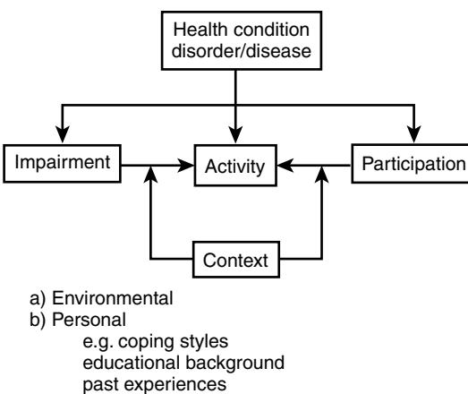
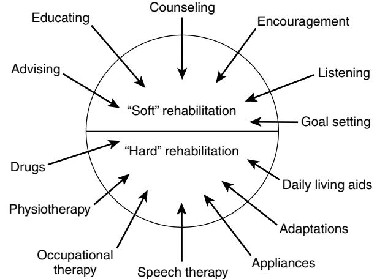

# Rehabilitation: General Principles

John Young

Rehabilitation, always at the heart of geriatric medicine, has a rich heritage that dates back in the United Kingdom to early pioneers such as Sheldon, Warren, and Adams. Their contributions were based on systematic observations, on common sense, and on simple principles, which we would still recognize today as central to the process of rehabilitation. In our modern health services, practitioners are nervous when challenged to justify the effectiveness of rehabilitation. Early evidence of the potential of rehabilitation in the United Kingdom was provided by Warren with the unblocking of chronic sick beds to such an extent that whole wards could be permanently closed. In one of her several inspiring papers, Warren described the factors that had led to her success.1 They included taking a positive approach, the importance of individual patient assessment and patient involvement, team-working, and the concept of promoting independence by optimizing the patient's environment and by special and general therapeutic techniques. Contemporary evidence of the continued success of these core processes of rehabilitation comes from a recent meta-analysis,2 demonstrating the superior effectiveness of "comprehensive geriatric assessment"—clearly a reassuring finding in the current climate of evidence-based practice. A more consistent application of the "Marjorie Warren" process across our contemporary medical and surgical wards, and in the community, would make a major contribution to the health of older patients. Indeed, it seems frustrating and perplexing that there has been a resistance to applying established rehabilitation concepts beyond elderly care departments. This has now been recognized in the United Kingdom and has stimulated the National Service Framework for Older People.3

This chapter describes the core principles of rehabilitation practice, and their underlying evidence-base. Additional detail for the specific rehabilitation techniques is also provided in this Chapter. Although the core principles of rehabilitation are generalizable to various health care settings in different countries, this chapter adopts a largely U.K. perspective. Chapter 123 provides a description of the rehabilitation services in the United States.

## **DEFINITIONS OF REHABILITATION**

Several definitions and explanations of rehabilitation have been proposed. Although the similarities between the definitions are considerable, the perceived diversity of view has contributed to a confusion over the purpose and process of rehabilitation. This apparent ambiguity, and the intangible qualities of rehabilitation, have been in contrast to the concrete "ologies" of contemporary organ-based medicine and has contributed to the vulnerability of rehabilitation in some hospital-based services. Some general definitions of rehabilitation include:

• "Rehabilitation comprises re-ablement—the acquisition of skills needed for independent life-and re-settlement, the restoration of the person to his (or her) own or to another environment."4

- "[Rehabilitation is the] restoration of the individual to his (or her) fullest physical, mental and social capability."5
- "[Rehabilitation is the] combined and co-ordinated use of medical, social, education, and vocation measures for training and retraining the individual to the highest level of functional ability."6
- "The primary objective of rehabilitation involves restoration (to the maximum degree possible) of either a function (physical or mental) or a role (within the family, social network or workforce)."7
- "Rehabilitation is a problem-solving and educational process aimed at reducing the disability and handicap experienced by someone as a result of disease, always within the limitations imposed both by the available resources and by the underlying disease."8
- "The primary objective of rehabilitation is to seek a role which is appropriate to the personality, functional ability and social position of the patient in the light of a realistic assessment of his (or her) functional prognosis; and to seek his (or her) co-operation and that of the professionals complementary to medicine in achieving this aim."9

Isaacs is one of the few authors to suggest what rehabilitation is not: "The aim of rehabilitation is not (although it is often assumed to be) the attainment of an objective appropriate to the needs of the service (i.e., an early discharge of the patient from hospital)."9

One common thread within these definitions appears to be a focus on restoration of function. However, frequently used terminology in elderly care distinguishes between active and maintenance rehabilitation. The former implies an expectation of improvement in function; and the latter, an expectation of prevention of deterioration where restoration does not readily apply.

The concept of frailty is a further complexity for an understanding of rehabilitation in respect of elderly people. Frailty is regarded as a disease- or age-related loss of physiologic reserve such that minor stress events result in disproportionate functional consequences. This has led to the notion of unstable disability,10 characterized by the marked fluctuations in functional abilities that are familiar to professionals working with "old-elderly" people.

In these definitions of rehabilitation, value judgment words such as "fullest" or "optimal" are used. This begs the question of whether results are being judged from the perspective of the doctor, the nurse, the therapist, or perhaps the patient or caregiver. In stroke, for example, a "good recovery" as far as the therapy team is concerned relates to the maximum impairment at stroke onset as the baseline against which recovery is judged. For the patient, however, the baseline is the prestroke lifestyle.11 A patient with a fractured neck of femur may not share the notion of a "successful" home discharge when returning to the prospect of a living room commode. Such ambiguities of perspective, commonly unvoiced, can smolder and lie at the heart of disability adjustment difficulties.

As with many complex issues, it is often rewarding to return to the beginning. Rehabilitation in the United Kingdom, at least for older people, emerged as a remedy for aged incurables: the bedridden chronic sick who languished in the Poor Law workhouses. The process was a holistic one in which the central theme was careful individual assessment "both for the establishment of a correct diagnosis and for full treatment" which was to be "undertaken by a (rehabilitation) team."1 The novelty lay in its emphasis on function—not of a body part (for example, surgical revascularization to preserve a limb), but at the level of the whole person set in the context of his or her personal circumstances: family, social, and home environment.

A further important distinction between rehabilitation and other health interventions is that patients are not the passive recipients of a treatment. Rather, rehabilitation is a highly energetic process in which the patient struggles against his or her disability with guidance from a rehabilitation team. The process is characterized by active, positive, and planned actions taken with the patient working at the extremes of physical and functional capabilities.

#### **OLDER AGE AND REHABILITATION NEED**

Between 7% and 10% of the world population are significantly affected by disablement, defined as the limiting consequences of chronic health conditions.12 Disablement affects persons of all ages but there is a strong association between older age and disablement so that most disability occurs in later life. The Office of Population Censuses and Surveys (OPCS) in the United Kingdom reported a near doubling of disability prevalence rates with each 10-year increment in age, from 7% of those aged 40 to 49, to 68% for those aged 80 and above.13 This most recent OPCS report caused a considerable upward revision in the estimated numbers of disabled people living in the United Kingdom. The figure now stands at more than 6 million and represents a substantial increase from the previous estimate of just more than 3 million. The recent survey used a more realistic and broader operational definition of disability, which took better account of restriction of function, and was therefore more reliable in the assessment of disability consequences for conditions such as arthritis and cardiorespiratory disease, which commonly affect locomotor function. For people in private households, arthritis is the commonest cause of disability, accounting for 48% of disability. It is second only to cognitive impairment in the disabling disorders seen in institutional care residents.

As far as older people in the United Kingdom are concerned, an estimated 4.3 million people over 60 years are disabled; this represents 70% of all disabled people and 46% of all older people. Most (more than 90%) older disabled people live in their own homes, and most (more than 80%) have only "mild" disability, but many have several types of disability. Indeed, these self-reported disability categories are more diverse than often appreciated (Table 103B-1) and have resource implications across nearly all health and social service departments. In the United Kingdom, people aged over 65 years constitute 14% of the population but consume nearly half of health14 and social service15 expenditure, and this is expected to rise by 3% a year.16

**Table 103B-1. Estimates of Prevalence of Disability Types, in Rate Per Thousand Population, for People Over 75 Years**

| Locomotion               | 464 |
|--------------------------|-----|
| Reaching and stretching  | 129 |
| Dexterity                | 180 |
| Seeing                   | 225 |
| Hearing                  | 307 |
| Personal care            | 263 |
| Continence               | 120 |
| Communication            | 112 |
| Behavior                 | 88  |
| Intellectual functioning | 107 |

Source: Office of Population Censuses and Surveys (1989).13

General disability surveys, and disease-specific epidemiologic surveys, provide quantitative information that is important for indicating the scale of disablement, and are valuable for service planning purposes. However, they provide little insight into the experience of disablement for the sufferer. This more human dimension to disablement requires qualitative research methods. Mildred Blaxter's work remains exemplary because of its rigor and clarity, and because it was a longitudinal observation of patients at several points through what Blaxter termed their "career in disability."17 The study followed 194 people after discharge from the hospital with new-onset disability. What emerged was a fairly universal feeling of intense frustration and unnecessary hardship experienced by these people. Blaxter demonstrated how the disabled person could be surrounded by a bewildering array of potentially helpful professions and agencies who lacked visibility, coordination, or an identifiable structure. This resulted in confusion for patients and caregivers and a consequent failure to access services. Blaxter demonstrated how interventions (for example, equipment provision) often occurred more by chance or as a result of the ruthless determination by a patient or caregiver than by the consequence of service engagement. In the succeeding quarter century, despite frequent changes and reorganizations, the experience of being old and disabled all too often remains one of frustration. A recent King's Fund review described the pressing requirements for an effective rehabilitation system most of which would be judged as disappointingly basic.18 The consequence of disability continues to be that of multiple waiting lists with poorly coordinated services.19 A person may wait separately and sequentially for a wheelchair assessment, and for wheelchair delivery, and then experience more waiting for an access ramp.20 There is no reason to expect that matters are better organized in many other countries.

#### **PREVENTION OF DISABLEMENT**

"Prevention is better than cure" is a familiar adage. But can disability be prevented in older people? This is an attractive notion to currently independent middle-aged and older people and to service funders (largely taxpayers) struggling to meet the steadily rising health and social care expenditure for age-related disability. Almost certainly much more could be done to minimize the disabling consequences of disease in elderly people: firstly, by better disease prevention, much of which could be quite simple (e.g., improved hypertension management to reduce stroke incidence);21 and secondly, by more widespread implementation of rehabilitation procedures and systems of proven effectiveness.22 Beyond the wider implementation of best clinical practices lies the issue of primary disability prevention.

The first step in tackling primary disability prevention/ limitation is a more profound understanding of proximal factors, particularly teasing out directional relationships (e.g., does depression predispose the physical disability, or does physical disability generate sufficient misery to trigger depression?). Cross-sectional studies are cheap (and therefore plentiful) but are limited by cohort effects and by ambiguous directional inferences. Longitudinal studies are complex and expensive (and therefore scarce) but allow baseline factors to be examined against future events, thereby more precisely locating cause and effect.

A recent systematic review brought together several longitudinal observational studies in which functional decline was the main outcome measure.23 The synthesis was carried out carefully, with transparent solutions to the testing problems of quality assessment and results formulation across diverse studies. The findings are interesting. First, a big surprise was the number of studies identified (78). The big disappointment was the meager contribution from Europe (United Kingdom, 2 studies; other European countries, 10 studies). The lion's share came from the United States (62, and hugely larger sample sizes). The review findings are largely comfortable in that they support rather than contest established thinking. The baseline risk factors associated with subsequent functional status decline in older people were: cognitive impairment; depression; disease burden (comorbidity); increased and decreased body mass index; lower-extremity functional limitation; low frequency of social contacts; low level of physical activity; no alcohol use compared with moderate use; poor self-perceived health; smoking; and vision impairment. Such observational relationships do not necessarily imply that risk factor modification will translate into desired disability reduction; only randomized controlled intervention trials can reliably establish this. Falls prevention/exercise programs have progressed to this level of evidence, even for frail older people,24 and the solid paradigm relating exercise to disability prevention/limitation should encourage action from practitioners and service providers.

On a wider, population scale, is there evidence of a reducing burden of disability? One aspect is the thesis of compression of morbidity: people living longer but with a shorter phase of late-life physical and/or mental decline.25 Some evidence is now available to support this thesis, with reports that older people have improved health reflecting a legacy of better childhood nutrition, less exposure to infection, and more education.26 However, the evidence is far from substantial, and the relative contributions of genetic factors, environmental lifestyle, and socioeconomic factors remain to be unraveled.

## **POLICY FRAMEWORK FOR REHABILITATION SERVICES FOR ELDERLY PEOPLE IN THE UNITED KINGDOM**

Health care policy is the mechanism by which local and national authorities can encourage a desired outcome from a service or services. It has been a crude and clumsy tool for rehabilitation. Rehabilitation relies heavily on culture ("the way we do things around here") and interprofessional and interagency relationships as key organizational attributes; none of which is easily orchestrated. Moreover, squabbles have broken out concerning cost-shifting (for example, faster hospital discharges have represented a cost burden to social services). And distracting, mundane arguments have occurred (for example, the differentiation of a "health" from a "social" bath). A special difficulty has been the entanglement of rehabilitation with long-term care.

The bedrock of evidence-based medicine as a foundation of clinical practice has led to demands for a similar standard of evidence-based health care policy.27 Unfortunately, much policy remains opinion-driven, largely because of the short time scale of the political cycle that imposes a demand for visible changes. There is therefore a temptation for largescale reforms rather than incremental learning from restricted pilot schemes. Moreover, there is a further temptation to avoid commissioning research for the fear that the findings might prove an embarrassment.28 Much of recent health care strategy for rehabilitation of older people is opinion-driven.

#### **The NHS and Community Care Act**

The 1980s witnessed a rapid expansion in private institutional care, fueled by the easy availability of social security payments, which were related to expressed rather than to assessed need.29 This represented an easy option for hardpressed hospitals that readily grasped an exit solution for "bed blockers" and with it an associated loss of impetus to maintain, let alone improve, the rehabilitation component of acute care. Expenditure increased dramatically and prompted the NHS and Community Care Act (1990), which was implemented in 1993. The Act required systematic needs assessment and case management, and made long-term care funding cost-limited. Local authority social services departments became the lead agency, resulting in fundamental changes to the traditional social worker role: it changed from that of adviser and counselor to one of a resource manager. However, the die was cast and insidious rehabilitation decline continued within acute hospitals.

The strategic shift of continuing care for elderly people from (free) NHS to (means-tested) social services was not to change. Rather too late it was recognized that this strategic shift had been too extreme and a readjustment was attempted in the form of a "guidance" document from the Department of Health to health authorities.30 Somewhat ambitiously, the "guidance" set out a clarification of continuing care in the much wider context of a respecification of all the services expected from the NHS for older people. The range of services was to embrace rehabilitation, continuing, palliative and respite care, community services and even special transport. However, no new money accompanied the initiative and implementation required disinvestment from elsewhere.31 In terms of political priorities in the NHS, little could compete with the obsession with the surgical waiting list, and, as a result, little changed.

#### **"The coming of age: improving care services for older people"**

In this influential report, the Audit Commission took stock and emphasized the accumulated damage to rehabilitation services.32 It was estimated that, in the 5 years 1989/90 to 1994/95, the average length of stay in elderly care in the hospital fell by 45%—from 36 to 20 days. Opportunities for recovery and rehabilitation therefore had probably diminished and there was a recognition that hospital provision of rehabilitation for older people was foundering.22 Moreover, there had been no compensatory increase in communitybased rehabilitation. Rather, the notion of a "vicious cycle of care" was promoted in which lack of community rehabilitation services stimulated increasing demand for hospital admission. There was an associated earlier discharge of incompletely recovered people; and this drove higher requirements for expensive residential and nursing home care. It was clear that the "magic remedy"—rehabilitation had withered in the hospital sector and had atrophied in the community.

#### **"Not because they are old"**

This was a critical report from the Health Advisory Service concerning the care of elderly people in 16 randomly selected acute hospitals across the United Kingdom (sample size: 71 patients; 59 relatives; 305 staff).33 Although the methods used were far from robust, the report was influential because it drew upon the prevailing concerns about hospital services and was a further stimulus to the urgent formulation of the National Service Framework for Older People. The survey identified that basic deficiencies in care were jeopardizing effective recovery and rehabilitation of elderly people. The physical environment of the wards was often poor, access to basic rehabilitation equipment such as chairs was chaotic, privacy and dignity for the patients was not sufficiently respected, and staff training was a low priority.

#### **National Beds Enquiry**

A succession of politically embarrassing winter NHS bed crises prompted the Department of Health to commission the National Beds Enquiry.34 This laid out facts that were already well known.35 Pressures caused by year-on-year rising emergency admissions36 and cost-driven bed closures had necessitated steadily reducing lengths of stay32; and rehabilitation, as a less visible component of care, had tended to become squeezed out.22

The National Beds Enquiry offered three possible scenarios to improve future service provision. The first option was essentially a status quo with a slight rise in bed capacity in the acute sector and moderate expansion of the primary and community care services. The second option was a larger expansion of the hospital sector with rehabilitation being predominantly provided in hospital settings. The third option, "care closer to home," was an active expansion and development of community health and social services into a new critical mass sufficient to address avoidable hospital admissions.

Although this was a consultative report, the Health Secretary signaled his preference strongly in favor of the third scenario and it has become accepted as the current health care policy for rehabilitation.37

## **A primary care-led NHS**

The current strategic policy framework for older people, including rehabilitation, is located within a primary careled NHS reflected in the new structure of the Primary Care Group/Trust (PCG/T).38 The PCG/T is expected

#### **Table 103B-2. Examples of Intermediate Care Services**

to have a strategic role in the planning, purchasing, and commissioning of a broad range of services. General practitioners, therefore, will be increasingly held responsible for local health services. Each PCG/T is intended to serve up to 100,000 patients, many of whom will be elderly and disabled and using resources disproportionately. A potential weakness is that most general practitioners have never worked in an elderly care department,39 and so their perceptions of service need may be influenced by the considerable demands made upon primary care from the private nursing and residential care home sector.40 Moreover, and encouraged by the limited public appeal of low technology health interventions,41 rehabilitation may again become a tempting target for financial cuts.

On the other hand, there are genuine opportunities for rehabilitation contained within the PCG/T and a primary care-led NHS. One obvious possibility is the development of locality-based rehabilitation teams working within the PCG. Such an approach would maximize the opportunities for rehabilitation at various points in the overall system of health and social care, and at various times in the "career" of older people with disability. Such an initiative would need careful coordination and implementation strategy by health authorities as part of their Health Improvement Programmes (HImPs).

## **Intermediate care services**

Clarity for a fresh strategic approach to rehabilitation for older people has consequently gradually emerged. It has been summarized using the umbrella term "intermediate care." The concept of intermediate care is therefore the final product of a policy cycle encompassing the last 1 to 2 decades.

Definitions of intermediate care have moved from the conceptual42 to the prescriptive43 (see box on Conceptual Definition of Intermediate Care), the shift reflecting genuine experience and learning.44 Examples of intermediate care (Table 103B-2) are, at first glance, comfortably familiar. For example, both the geriatric day hospital and the community hospital have long pedigrees. Rehabilitation in social settings such as residential care homes, however, is less familiar and is a recent development. This form of intermediate care was introduced partly as a response to the irritation felt by some social service departments forced into the position of taking older people discharged prematurely from acute wards. It was considered necessary to fill the rehabilitation gap created by inadequate health service provisions. However, these social service solutions to unmet rehabilitation need have now been put on a more collaborative and

## Conceptual Definition of Intermediate Care

That range of services designed to facilitate transition from the hospital, and from medical independence to functional independence, where the objects of care are not primarily medical, the patient's discharge destination is anticipated, and a clinical outcome of recovery (or restoration of health) is desired.42

#### **Prescriptive Definition of Intermediate Care**

Intermediate care should be regarded as describing services that meet all the following criteria:

- Targeted at people who would otherwise face unnecessarily prolonged hospital stays or inappropriate admission to acute inpatient care, long-term residential care, or continuing NHS inpatient care
- Provided on the basis of a comprehensive assessment, resulting in a structured individual care plan that involves active therapy, treatment and opportunity for recovery
- Having a planned outcome of maximizing independence and typically enabling patients/users to resume living at home
- Time-limited, normally no longer than 6 weeks, and frequently as little as 1–2 weeks or less
- Involving cross-professional working, with a single assessment framework, single professional records and shared protocols. (Based on Health Service Circular, 2001)43

consultative footing within the framework of Joint Investment Plans (JIPs).38 Indeed, JIPs provide insight into the real novelty of intermediate care services. They are not about the relaunching of old style services. There is an expectation that intermediate care services will become a platform to incorporate new patterns of working and new professional relationships both between disciplines and between agencies. It is an attempt to impose a strategic structure in the hitherto chaotic area of community care characterized by competing demands, conflicting pressures, and resource rationing. Unlike earlier community care initiatives, this one comes with a promised injection of resources, and on a large scale: \$1.3 billion (£900 million) by 2003/04.37 At present, however, the United Kingdom-wide implementation of intermediate care is a political initiative. The involvement of geriatricians is ambiguous and the PCG/T, as the lead agency to develop intermediate care services, is still relatively immature.

The concept of intermediate care has not been universally well received by U.K. elderly care specialists.45 However, the British Geriatrics Society has recommended that geriatricians should become involved with the planning and delivery of these services.46 This implies a greater commitment from geriatricians to community working in the future.47 In some areas, the medical input to intermediate care services will be discharged by a community geriatrician,48 but at present there is no training program for such a post. There is a wider issue of training as one practical implication of this service reconfiguration will be appropriate preparation of future consultant geriatricians to contribute to intermediate care services.49

The program of intermediate care service implementation now has a massive momentum.32,38 It is consistent with a primary care-led NHS and the imperative of joint working between health and social services. It has a self-evident role in postacute care for elderly people to complement the scaled-down district general hospital by reinstalling a timespace for rehabilitation and functional recovery. The main concern has been the additional proposed function of intermediate care for admission avoidance: to bypass, or delay access to, specialist district general hospital assessment and investigation facilities. Acute ill-health in elderly people typically presents in an ill-defined way. For example, an older person "found lying on the floor" might have simply rolled out of bed but, alternatively, may have a fractured neck of femur, pneumonia, or heart failure. Admission avoidance could easily become an institutional barrier in the expeditious assessment of sick older people. This worrying aspect of intermediate care has been reflected in its being referred to as "indeterminate care."46

## **UNDERSTANDING DISABILITY The disablement process**

The medical model concerns itself with diseases and their effects on the body. An abnormality of insulin production, release, or receptor binding causes varying degrees of hyperglycemia: the disease of diabetes. During the early stages, this may have no impact on well-being (no symptoms), and indeed the disease may be diagnosed only unexpectedly after a routine screening blood test. Diabetes is, however, an example of a progressive disease and eventually the chronic hyperglycemia will produce symptoms—sometimes, for example, nerve damage resulting in a peripheral neuropathy. At this stage, the person (in medical terminology now a patient) will find some previously routine everyday activities, such as walking to the shops, more difficult. The disease has now impacted on the person's daily life—a process of disablement has occurred, or the person has become disabled.

On this simple level disability is straightforward. However, a precise definition is elusive. Consider the different impact of the disease when the patient lives near to shops; or a similar diabetic patient already restricted by severe knee arthritis. In both cases the new disease of diabetes may have no noticeable additional impact. The disablement process needs therefore to describe how chronic and acute conditions affect specific physical and mental functions, and daily living activities, but also to account for the personal and environmental factors that have the potential to mediate the disablement process.50 Thus, the wider context of disability requires us to understand the process as a gap between personal capability and environmental demand. It would appear, therefore, that disability is a relative phenomenon and difficult to capture unequivocally in a simple description.

Consider another patient, a bilateral amputee living in a nursing home. He enjoys socializing, trips out, singing, and placing racing bets by telephone. He is clearly content and has a fulfilled life. Is there a process of disablement here? A further difficulty lies in the origins of the disease process. Disability tends to conjure up an image of physical insult. So how should we regard the restricted life of a person with agoraphobia? And how should we accommodate the degree or quantity of disability? Presumably there is a continuum from "mild" to "severe." This implies that some form of objective measure should apply, but should this be based upon an external judgment, or upon the patient's perception? Obvious inconsistencies arise, when, for example, a patient who is "slightly" disabled from an external "objective" assessment perceives a "severe" disability. Moreover, disability definition may take several forms: legal/administrative; medical; cultural; self-definition. Administrative disability is particularly confusing. A person may be administratively disabled and qualify for a special parking permit, but administratively not disabled and ineligible for the attendance allowance benefit, and disabled by virtue of age (over 75) and eligible for a free television license. The fog surrounding an adequate and agreed definition for disability has been summarized aptly by Townsend:

"Although society may have been sufficiently influenced in the past to seek to adopt scientific measures of disability, so as to admit people to institutions, or regard them as eligible for social security or occupational and social services, these measures may be applied in a distorted way, or may not be applied at all, or may be replaced by more subjective criteria by hard pressed administrators, doctors and others. At the least, there may be important variations between 'social' and 'objective' assessments of severity of handicap."51

#### **The WHO classification**

The complexities of disability demand some form of classification map capable of providing a systematic method to describe the disablement process at the level of an individual. This has been the purpose of the International Classification of Impairments, Diseases and Handicap (ICIDH), first published by the World Health Organization in 1980. It is generally regarded as a useful classification framework within which to consider the rehabilitation process. The framework relates illness to four levels: pathology, impairment, disability, and handicap:

- Pathology: the process of damage in an organ or organ system that results in disease
- Impairment: any loss or abnormality of psychological, physiologic, or anatomic structure or function
- Disability: any restriction or lack of ability (resulting from an impairment) to perform an activity in a manner or within a range considered normal
- Handicap: a disadvantage for a certain individual, resulting from an impairment or disability, that limits or prevents his or her fulfillment of a role that would be normal for that individual

The value of this classification in relation to older people is that it prompts the need to uncover a cause (pathology and impairment) for the disability when the person has, for example, a mobility problem; while also prompting examination of the consequences of the disease in functional terms (disability) and in relation to the lifestyle and environment of the individual patient (handicap). Thus a balanced approach is achieved between disease modification (usually drugs or surgery) and maximizing independence (physical treatments, aids, and adaptations). A common misunderstanding is to assume a progressive and proportional relationship between the four levels. The relationships are often discontinuous. For example, cerebral infarcts (pathology) are commonly found on head CT scans without associated impairments; severe knee osteoarthritis (pathology) may restrict a person to a wheelchair (mobility disability), and necessitate institutional care, but the individual may adjust, develop a new and contented lifestyle, and have a strong sense of purpose and well-being (minimal handicap). The variable relationship between the levels emphasizes the need for individual patient assessments that respectfully the perspective of the patient and close supporters.

#### **Illness or role rehabilitation**

To some, the ICIDH classification has represented an overmedicalized model of disability in which disablement is seen as located primarily within the individual.52 In the social model of disability, disablement is perceived less as an attribute of a person and more as a set of circumstances, many of which arise from the external environment.53 Handicap is caused by having steps into buildings and not just by difficulty in walking. Within this paradigm, "the disabled elderly" can be considered as a disadvantaged minority group, an argument that forms a component of a larger thesis concerning the social construction of old age.54 A continuation of this perspective is to discuss disablement in the language of social discrimination and oppression.55 Here, problems are located at the level of an individual but caused through a prevailing unhelpful attitude towards disablement by society as a whole. This underpins arguments for a more inclusive research agenda, which acknowledges more fully that disablement is a personal experience created as much by wider society as by the individual.55 The debate over the relative merits of the different models of disability continues,52,53,55,56 and it is the intention that both models will be encapsulated in the forthcoming revised version of the ICIDH (see later discussion).

The two competing rehabilitation paradigms—medical and social—translate to an illness (sickness) model and role (person) model. Illness rehabilitation is most apparent when it is tacked on to various medical specialties. Examples are cardiac or pulmonary rehabilitation programs. Although these programs have extended the spectrum of care available to patients, they have not usually been integral to the medical specialty concerned but generally require a purposeful secondary referral. However, it has become increasingly recognized that these disease-specific rehabilitation programs have tangible benefits.57–59 The lack of medical enthusiasm engendered by these programs can be located within our contemporary curative medical approach with its emphasis on brief interventions. Unfortunately, complexity appears integral to the effectiveness of rehabilitation programs,60 and it is far easier to introduce a novel drug than a novel rehabilitation program.

#### **The revised ICIDH model (ICIDH-2)**

The ICIDH has been criticized for its unwieldiness, and for the consequent unreliability of the codes arising from it.49,61–63 The original ICIDH included 1009 impairment items, 338 disability items, and 72 handicap items. However, it was designed as a comprehensive classification scheme, not as a measurement instrument in its own right. After 2 decades of use, the ICIDH is undergoing a major revision. The revision is prompted partly by the need for a more profound recognition of the social determinants of disability, and partly to

Figure 103B-1. The revised World Health Organization ICIDH model of illness.

reflect a positive description of health rather than the negative description of illness.

The new version, known as ICIDH-2, is described as a multipurpose classification designed to provide a common framework for understanding the dimensions of disablement and function at three different levels: body, person, and society. The wider application is its integration with the International Classification of Disease and it therefore uses a standardized common language permitting communication about health and health care across the world in various disciplines and sciences. Its use therefore goes beyond that of a practical clinical tool—for example, for service planning, policy development, and to progress human rights issues. As such, it attempts much and therefore can be criticized as being too all-embracing and unwieldy for the clinician. The general scheme of ICIDH-2 is given in Figure 103B-1. The definitions of the components of the framework model comprise:

- Impairment: a loss or abnormality of body structure or a physiologic or psychological function
- Activity: the nature and extent of functioning at the level of the person
- Participation: the nature and extent of a person's involvement in a life situation in relation to impairment, activities, health condition, and contextual factors

Activities may be limited in nature, duration, and quality (e.g., taking care of oneself, maintaining a job). Participation may be restricted in nature, duration, and quality (e.g., participation in community activities, obtaining a driving license).

Thus, as with ICIDH-1, there are four dimensions (with the inclusion of pathology), but with outcomes expressed as negative or positive levels of function. In effect, a continuum has been created between the expression of problems (e.g., impairment, activity limitation, or participation restrictions), summarized under the umbrella term disability; and, at the opposite end, nonproblematic (neutral) aspects of health and health-related states, summarized under the umbrella term function. However, the negative levels comprise impairments, activity limitation, and participation restriction, and in this respect ICIDH-2 appears no different from its deriving parent, other than the substitution of one word for another: disability becomes activity while handicap becomes participation. The disablement process is again illuminated by the consequence of the dynamics between the four levels. However, the changes implicit in the proposed new model are more profound than simple substitutions of more politically correct words. The emphasis is on contextual factors, which act as mediators between the levels of the model, thereby changing the process from one of general disablement to one that becomes highly individualized. The contextual mediators are subdivided into environmental and personal factors. Important examples of personal context factors are goals (what the person aspires to) and beliefs (the person's own explanation and understanding of his or her illness).64 These aspects are, in turn, influenced by personal educational and life experiences, by family and supporters, and by wider prevailing societal values.

How, and to what extent, the ICIDH-2 will impact on rehabilitation thinking—and indeed how clinical practice might change—is speculative. It will depend on whether the opportunities perceived are sufficiently attractive to overcome resistance to a more complex classification model. One view is that considerable change in rehabilitation practice may occur.64 The current version, ICIDH-2 beta-1, is undergoing field testing. The situation is clearly fluid with constant incremental change, which is best followed on the WHO Web site (www.who.ch/icidh).

#### **ASSESSMENT AND REHABILITATION POTENTIAL**

Many elderly people have several conditions of varying severity, and it can be challenging to unravel and identify the components and then to develop a personalized intervention plan. This process is called assessment and has been central to good practice since the inception of special services for older people.1 The process aims to determine impairments, disabilities, and handicap, and then to trigger selective interventions at one or more of these levels, followed by observation and evaluation of response.

There is reliable evidence that the process is effective in improving outcomes for elderly people, but with the common sense proviso that the assessment process is closely linked to interventions.65 The effectiveness studies have been summarized in a systematic review and meta-analysis.2 The studies included (15 in North America, 8 in the United Kingdom, and 5 others) are heterogeneous but have as a common thread an evaluation of "comprehensive geriatric assessment": a core process characterized by multidisciplinary assessment and treatment. The pooled estimates of effectiveness across a range of outcome measures were encouragingly positive (Table 103B-3). The best effects were obtained for comprehensive geriatric assessment delivered by hospital-based elderly care departments, in which the assessment process and subsequent interventions were integrated and when organized postdischarge follow-up was arranged. In a review of the literature, Wade concluded that successful assessment is more likely if the assessor is experienced and if multiple aspects are covered by the assessor(s), but that, at present, there is little evidence to guide the most appropriate or efficient methods of assessment.66

The process of assessment is self-evidently complex generally more so than determining a drug prescription or

#### **Table 103B-3. Outcomes of "Comprehensive Geriatric Assessment": Hospital Geriatric Unit Versus Alternative Care**

| Odds Ratio (and 95% Confidence Limits) at 6 Months |                  |  |
|----------------------------------------------------|------------------|--|
| Living at home                                     | 1.8 (1.28–2.53)  |  |
| Reduced mortality                                  | 0.68 (0.45–0.91) |  |
| Improved physical function                         | 1.63 (1.00–2.65) |  |
| Improved cognitive function                        | 2.0 (1.13–3.55)  |  |

Source: Stuck et al (1993).3

planning an elective operation. Part of the complexity arises from the nature of the clinical problems: their diversity, varying severity, and multiplicity. Moreover, the problems interact at the level of personhood, so that disentangling physical and psychological factors is challenging. In addition, there may be a close association with social and environmental factors, and the interventions used are themselves complex. Interventions are based on human skills and therefore subject to variation, and they rely considerably on active patient participation, which is also subject to variation.

## **Standardized assessment measures or professional assessment?**

The scientific basis of rehabilitation demands objective measurement.66 One problem has been the multitude and diversity of standardized measurement tools available,67described aptly as "a tower of Babel."68 The most important consideration in selecting a particular measure is whether it is appropriate to the task in hand.67 Additionally, measurement tools require research studies involving different patient groups in different settings and using advanced statistical methods to demonstrate various properties69:

- Validity: Does the instrument actually measure what it purports to measure?
- Reliability: Does the instrument give similar scores when used on the same patient by two observers, or when repeated on stable patients?
- Sensitivity: Does the instrument detect clinically important changes?
- Acceptability: Is the instrument simple and quick to apply, easy to understand, and easy for patients to complete (so that there is a high response rate)?

These instrument measurement properties are not independent and perfect scales do not exist. Compromises have to be achieved between, for example, sensitivity and reliability—a scale sensitive to small changes has low reliability.

In the United States, a task force established a uniform data system for medical rehabilitation, which incorporated the use of the functional independence measure.70 In the United Kingdom, the Royal College of Physicians and the British Geriatrics Society have jointly recommended six standardized assessment instruments for routine use when assessing older people (Table 103B-4).71 However, few of these instruments have been adopted in routine practice.

Indeed, in clinical rehabilitation practice, as opposed to research, debate continues over the balance between professional assessment and the use of objective standardized measures. Compared with professional assessment, standardized measures have the advantage of being less subject to bias, **Table 103B-4. Standardized Assessment Instruments Jointly Recommended By the Royal College of Physicians of London and the British Geriatrics Society for Routine Use When Assessing Elderly People**

| Domain of Interest   | Recommended Scale                          |
|----------------------|--------------------------------------------|
| ADL disability       | Barthel Index                              |
| Vision and hearing   | Lambeth Disability Screening Score         |
| Mental impairment    | Hodgkinson Abbreviated Mental Test         |
| Depression           | Geriatric Depression Score                 |
| Quality of life      | Philadelphia Geriatric Center Morale Scale |
| Social circumstances | Social Indicators Checklist                |

Source: RCP London (1992).71

more systematic, more communicable, and able to provide a numerical result. Further, they open up the possibility for postal or telephone disability assessment, or assessment by support staff rather than senior staff. On the other hand, a disadvantage is that the result from a measurement instrument is not easily related to an intervention. This is not surprising because rehabilitation measures have not been designed to do this. For example, a Barthel score of 16, although providing a useful disability profile summary, does not equate to a patient treatment strategy. To determine a treatment strategy requires an exploratory, discursive process that seeks to identify patient-related problems and their context. This is the antithesis of the pervasive reductionalism characterizing the conventional biomedical model. Rather, it is the bio-psycho-social model propounded by Engel,72 summarized as: "Do my doctors/therapists know who I am, who I have been, who I still want to be? Do they understand what I am going through, my suffering, my pain, my distress? Do they understand my hopes and aspirations, my fears and shames, my vulnerability and strengths, my needs and obligations and my values? Above all do they sense my personhood and my individuality?" It is impossible to achieve this level of understanding through standardized assessment instruments.

Isaacs9 has argued for a discursive approach to the assessment of elderly people, with a list of open questions designed to identify problems but located in the context of the patient's personal attributes, daily life, family, and friends. This type of semistructured format is a part of what has been described as narrative-based medicine.73–75 There is a concern that narrative-based medicine is becoming a lost tradition and should be revived in mainstream medical practice.75 Its special relevance lies in the series of unfolding events told, importantly, from the viewpoint of the patient. These events provide meaning, context, and perspective for the patient's predicaments. The attraction of the narrative approach is that it is both diagnostic and therapeutic. The telling of the story helps the patient make sense of events and, from the rehabilitation professional point of view, one outcome includes the possibility that novel and specific treatment options can be identified, or that a specific and especially valued element of information can be provided. One problem in practice is the difficulty in capturing adequately the richness of a narrative within the usual health care case records. This is one important reason why each multidisciplinary team member will wish to listen first-hand to a patient's account. This can appear frustratingly inefficient to health care managers, but it is in the small details that the special events and circumstances surrounding, for example, a fractured neck of femur emerge and change the commonplace (another admission with fractured neck of femur) to the particular narrative of an individual person with a fractured neck of femur.

#### **DETECTION OF DEPRESSION AND DEMENTIA**

It has been long recognized that depression and cognitive impairment can be significant barriers to successful rehabilitation.76 There is therefore a good argument for routinely assessing patients on these domains using standardized instruments. Depression is common in elderly people,77 but it can be difficult to detect because of overlap between the physical symptoms of organic disease, the vegetative symptoms of depression, and somatization of psychological distress.78 The short version of the self-report Geriatric Depression Scale79 can be used to screen for depression in medically ill older people and has a sensitivity and specificity of more than 70% when compared with formal psychiatric diagnosis.80 However, some of the questions (e.g., "Have you dropped many of your activities or interests?") have questionable face validity in the presence of a new condition, such as a fractured neck of femur or stroke. The Hospital Anxiety Depression Score81 is another commonly used mood scale. It is easy to use and encompasses both depression and anxiety in separate subscales. However, the validity and reliability of this instrument for frail elderly people remains to be established. Several brief cognitive screening tools are available, such as the Abbreviated Mental Test82 and the Mini Mental State Examination Score,83 and their routine use in rehabilitation involving older people has been recommended.

Significant aphasia and severe deafness may make formal assessment of mood and cognitive impairment difficult. Also, these screening tools are not diagnostic instruments: they merely indicate that cognitive impairment or depression may be present. For example, the Abbreviated Mental Test score has a false positive rate of up to 25%.84 Careful patient observation and information from supporters remain fundamental. This approach has been reinforced by the recently described observation-based rating scale for use by nurses or care staff in daily contact with the patient.85 It comprises six questions and has acceptable sensitivity and specificity for the identification of depression.

#### **Rehabilitation potential**

Part of the initial assessment process is to determine the rehabilitation potential of a patient. Although this is a nebulous concept, it is a common and challenging clinical task with an inherent self-fulfillment risk for the patient who is classified as possessing "limited rehabilitation potential". Caution is needed with a one-off, snapshot assessment, as there is evidence that agreement on rehabilitation potential even within a multidisciplinary team is unreliable.86 Repeated assessments or a "trial of rehabilitation" may be the preferred clinical approaches, but are not yet adequately researched.

## **ASSESSMENT OF MOBILITY**

Restriction of mobility is one of the most serious healthrelated problems. If an elderly person has insufficient mobility to be able easily to leave home, it follows that the person must be dependent on others for basic activities such as shopping, and there is also the important loss of social opportunities. Objective assessment of gait and mobility is therefore important.87

A gait laboratory is capable of describing and reporting many of the components of a gait cycle and is considered the gold standard in gait analysis—though it is too expensive, cumbersome, and time-consuming for use as a routine clinical tool.88 It is therefore gratifying to note that simple clinical observation of gait can be rewarding: in a study of frail elderly people at high risk of falls, those who were observed to "stop walking when talking" were at the highest risk of falling during the next 6 months.89 Unfortunately, though, gait assessment based on observation alone can be unreliable.90,91 There is no shortage of standardized approaches to assessment: a recent review identified 42 measures of balance and gait.92

## **The timed walking test**

The timed walking test is quick, needs little equipment (only a stopwatch and tape measure), and can be done easily in the clinic or at home. It has been described as "remarkably simple, reliable, valid, sensitive, communicable, useful, and relevant—almost the perfect measure."67 It involves timing patients using a stopwatch as they walk a measured 10-meter distance, or walk 5 meters and return (more applicable for home assessment). It has been found to correlate with recovery after stroke,93 and with other aspects of gait—such as a functional walking test and number of steps taken,94 balance,95 use of walking aids,96,97 falls,98 and extent of personal mobility.99 Gait speed measurement is suitable for routine use in geriatric day hospital practice.100 A practical point is that the first walk is often significantly slower than subsequent walks and should be regarded as a warm-up/practice measurement and excluded from gait speed measurement results.101

## **Selection of a walking aid**

An appropriate walking aid can lessen many gait impairments and reduce disability. The commonest aids are walking sticks102 and various types of walking frame. The introduction of the walking frame is ascribed to a 12-year-old Cincinnati boy who designed and constructed a frame for his aunt who had sustained a fractured neck of femur.103

There are now more than 40 types of frame available in the United Kingdom,104 including the Zimmer and various wheeled frames (e.g., the Delta Rollator). There are several disadvantages to the Zimmer frame because it promotes a slow and abnormal gait characterized by an intermittent stop/start or nonphysiologic stepping pattern. Wheeled walking frames, on the other hand, encourage a smooth, physiologic, striding type of gait pattern.

Comparison studies favor wheeled frames,105 but the clinical issue is to select the most helpful walking aid for an individual patient. The "S test" has been designed to fulfill this practical clinical task.106 It comprises a series of assessments in which the patient is asked to complete set maneuvers with different mobility aids. Patients are tested in their normal clothing and footwear in a carpeted area. Initially the therapist adjusts the aids usually to a height of the wrist crease and gives basic instruction. Subjects start the test seated in a chair and are then required to stand and walk a measured 5 m, which is timed by a stopwatch. They then make a 180-degree turn before walking a further 5 m. Finally they make a 180-degree left turn before reversing into the chair. The test is repeated with different walking aids and the preferred aid is determined by considering five factors: safety, stability, stance, step/stride pattern, and speed. It is surprising how often this test selects a wheeled frame as the preferred walking aid.

#### **Mobility handicap**

One system that readily depicts mobility handicap is based on the concept of "life spaces."99 Life spaces are divided into five concentric zones into which the individual can be placed: the bedroom, the rest of the dwelling, grounds surrounding the dwelling, the block, and the area across a traffic-bearing street. The system facilitates a better understanding of the relationship of the individual to his or her surroundings and stimulates an examination of barriers (i.e., why a person cannot move from one circle to the next).

In a community survey of arthritis sufferers, the availability of a car, the type of housing, and the distance to local shops emerged as the most restrictive barriers.107 Ease of access to shops is important for elderly people as it fosters independence and reinforces ties with friends and neighbors. It is an activity that might well be curtailed even in the face of modest mobility restriction if the environmental factors are hostile.

It is not just external environmental factors that are important. The internal architecture and distances between rooms are other important factors that can elevate a modest disability into a severe handicap. For example, in a survey of 15 "typical homes" in East Cumbria, 80% of the houses had their main living room separated from the nearest toilet by a distance of more than 20 m.91 For some elderly people, this might represent a handicapping distance. This may be one reason why accommodation that is more sympathetic to the needs of disabled older people, such as sheltered housing schemes, is associated with a reduction in mobility handicap.108

## **ASSESSMENT OF DISABILITY Activities of daily living**

"Activities of daily living" (ADLs) is a term commonly used by rehabilitation professionals. It reflects the disability level of disease consequence in the WHO classification model. ADLs include tasks such as washing, dressing, transferring, toileting, and mobility. These may initially appear as a disparate collection of activities that have been forcefitted together. However, ADLs can be considered as a unified construct and, importantly, performance is critical for elderly people struggling to maintain independent living.109 The systematic assessment of ADLs, therefore, is an important aspect of the overall assessment of elderly people. Once again, a multitude of standardized instruments has been developed—a testament both to the perceived importance of this area in rehabilitation practice, and to the difficulty in producing the optimal instrument. Fortunately, most ADL measures are remarkably similar, at least in item content.8,109

#### **The Barthel Index**

The Barthel Index has become widely adopted in routine clinical practice in British geriatric medicine and elsewhere. The popularity of the Barthel Index against the backdrop of numerous other rival ADL standardized instruments supports its clinical utility. The Barthel Index originated as an empirically derived measure for younger disabled adults.110 Its widespread adoption into routine practice owes much to Wade and colleagues111 who were the first to demonstrate its reliability and validity.112

The Barthel Index is an ordinal scale (as are most rehabilitation measures). Consequently, an improvement in score from, say, 5 to 6 does not represent the same clinical improvement as a score of 10 moving to 11. It assesses levels of independence or dependence for 10 ADL tasks with a score range of 0 (dependent) to 20 (independent):

- Dressing Bed/chair transfers
- Feeding Walking
- Grooming Stairs
- Toilet Bladder
- Bathing Bowels

The Barthel Index score correlates well with mortality,113 length of hospital stay,114 and requirement for institutional care.115 It is a simple measure that is easy to interpret in clinical practice, and it can both aid systematic disability assessment and also monitor rehabilitation progress if repeated at intervals.116 It is an independent indicator of nursing dependency levels.117

One disadvantage of the Barthel Index is that the steps on the scale are fairly large, so it is not very sensitive to small changes. Also, especially for disabled people living at home, there is a marked "ceiling" effect; patients can score the maximum 20 points and be "independent" according to the index, but still have daily living restrictions. This low ceiling effect limits its applicability for outpatient rehabilitation settings such as the day hospital.118

## **Extended activities of daily living**

One limitation of the ADL scales is the restricted range of the content items. Living independently at home requires a more extensive repertoire of skills—including kitchen, domestic, transport use, and leisure activities. These types of activities are referred to variously as "instrumental," "extended," social," or "advanced" activities of daily living. Although there is a conceptual understanding of instrumental activities of daily living, there is no agreement on the exact categories to be included in such measures.119 Examples of these measures include the Frenchay Activities Index120 and the Nottingham Extended Activities of Daily Living Scale.121 These measures are less reliable both in total scores and individual items than ADL scores, probably because they rely on recall of activities undertaken during the preceding weeks.122

#### **Assessment of handicap**

Handicap, the disadvantage to the individual as a result of ill-health, is from the patient's point of view the critical level at which to effect change. There is an increasing recognition that the ultimate goal of rehabilitation for older people should be reintegration into normal patterns of life.123 This involves placing the individual in the context of his or her home, local environment, and facilities, and the person's relationships, motivation, mood, and expectations. Unsurprisingly, the uniqueness of this context makes the development of a generic standardized assessment tool difficult. The development of robust measures of handicap has proved difficult,67 and has only recently been described for stroke. Even here it remains a research tool for assessing the outcome of services rather than assisting rehabilitation assessment.124

The World Health Organization's ICIDH contains six basic "survival roles" in the handicap section: orientation (including sight, hearing, and cognition); physical independence; mobility; occupation (including employment, domestic work, and recreation); social integration; and economic self-sufficiency. Its main limitation is that it is a classification system rather than an assessment tool. Alternatively, the Rankin scale is often cited as a handicap measure but is, in fact, a crude disability scale and moreover heavily biased towards mobility.125

Social activity is an important domain of handicap and an important aspect of the reintegration process.126 As there has been greater success in the development of measures of social activity, referred to above as "extended activities of daily living," these measures are the best current clinical compromise for a standardized approach to handicap assessment.

#### **Location of assessment**

Assessment was originally conceived as a hospital-based process, and the evidence for effectiveness is strongest for multidisciplinary teams working in the setting of hospitals. Emergency day-hospital assessment has been described as an alternative.127

Much less information is available on successful assessment of disabled elderly people at home. Here, the primary health care team is the main health contact for disabled older people working in collaboration with social service staff. The effectiveness of assessment of primary health care teams, and community rehabilitation teams, has become a more pressing concern following the introduction in the United Kingdom of intermediate care services. The first health care contact for elderly people struggling to cope at home is frequently the community nurse. Each year about half the population aged over 85 years is seen by a community nurse.128 Such nurses work closely with general practitioners to coordinate the care with social service staff and therapists, and to organize services such as respite care and day-center attendance. A recent comprehensive review conducted by the Audit Commission concluded that there was considerable scope to improve the service, with a specific recommendation for the introduction of improved standardized assessment methods accompanied by an associated training program.128

#### **The Easycare assessment**

Easycare was developed on behalf of the European Regional Office of the World Health Organization for use in Europe as a first-stage assessment of elderly people in primary or community-care settings. It is designed as a system for rapid assessment of an older person's physical, mental, and social well-being, and provides a broad picture of the person's needs. It focuses on quality of life rather than disease, and recognizes the roles of family and caregivers. It comprises a structured assessment of hearing, vision, and chewing; self-care and mobility; social functioning; and mood and cognition.

Provisional evaluation of Easycare has confirmed its usefulness as a combined medical and social assessment of elderly people in domiciliary settings.129 Completion time is between 14 and 40 minutes.130 However, the extent to which the Easycare system leads to improved outcomes for elderly people living at home has not yet been researched.

#### **Home assessment**

Home assessment shifts the rehabilitation orientation from disability to handicap. The U.K. College of Occupational Therapists defines a home visit as "a visit to the home of a hospital inpatient, which involves an occupational therapist in accompanying the consumer to assess his or her ability to function independently within the home environment or to assess the potential for the consumer to be as independent as possible with the support of caregivers.131" This is an overly narrow definition that ignores home assessment visits for elderly people who are not in hospital. Also, a home assessment should allow the patient and the rehabilitation team to obtain first-hand experience of the challenges faced in coping at home and thereby trigger new interventions and rehabilitation goals.

Like much in rehabilitation practice, the home assessment visit has become absorbed into mainstream practice in an uncritical way and its effectiveness is uncertain. Moreover, the function of the predischarge assessment visit has insidiously changed from a handicap assessment to inform the rehabilitation process, to an administrative component of the hospital discharge process. A systematic review of predischarge home assessment visits identified only five reports, of which two described retrospective surveys and three were descriptive surveys of current clinical practice.132 One randomized controlled trial involving 50 cases has since been published.133 It investigated the important but relatively specific issue of falls. Predischarge home assessment visits and subsequent environmental modifications resulted in a significant reduction in the fall rate during the 12 months of follow-up, but the treatment effect was confined to those high-risk patients with a history of falls in the preceding year. Another systematic review (15 studies) has examined the effectiveness of preventative home assessment visits and reported inconclusive findings for relatively low-risk elderly people at home.134

#### **TEAMWORK IN REHABILITATION**

The concept of teamwork, arguably formalized first in rehabilitation,1 is now familiar in most areas of health care: primary health care teams, surgical teams, cancer teams, palliative care teams, etc.135 However, working as a team in rehabilitation has two distinctive features. First, the team is built around the patient rather than a condition (such as a cancer or a surgical treatment). Second, the range of professional staff involved is exceptionally diverse in terms of professional backgrounds, and this necessitates careful coordination of each member's contribution.

#### **Multidisciplinary team care**

More has been written about successful and unsuccessful teamwork in the context of general management. A consistent finding has been that successful teams are made up of people with different styles and backgrounds who bring different angles to the issues at hand, rather than "clones" who are likely to adopt similar approaches.136 Creativity and successful problem-solving therefore require a mix of character styles and skills, albeit at the expense of some tension when inevitable differences arise. The multidisciplinary rehabilitation team structure for rehabilitation, therefore, may be ideally suited for the complex problem-solving required for elderly people with disabilities.

Rehabilitation staff generally endorse the team approach and it is regarded as established practice. There is evidence of its importance as up to 75% of disabilities may go unrecognized by hospital doctors;137 and although general practitioners are probably more aware, they still fail to recognize 40% of disabilities.138 Successful impairment and disability assessment requires separate assessments by each member of the multidisciplinary team if problems are not to be overlooked.86 However, there is little consensus and few empirical studies provide insight into the best methods to promote effective teamwork. Measurement of important aspects of team care, such as clinical and interpersonal skills, interprofessional relationships, and group dynamics are poorly developed. It has been suggested that effective teamwork requires at least three components: agreed and explicit aims; recognition of the contribution of different team members; and structures to facilitate collaborative working.139

Issues of role overlap are rarely addressed openly,140 and professional "tribalism" can occur with recurring conflicts caused by the failure to understand and value the contribution of other team members,141 resulting in arguments over professional boundary issues.141,142 There are both interprofessional and intraprofessional tensions. For example, one view is that physiotherapy has veered too far toward a biomedical reductionist approach with an emphasis on physical symptoms and the level of impairment, and too far from a more behavior/educational holistic approach.143 Also, status problems can develop,144 frequently resulting in jealousy and lack of cooperation.145 Autonomy of rehabilitation staff within a team structure is required to realize the full potential of the team, but needs careful nurturing.146 An effective team should be prepared to modify its approach in the light of emerging research, but relating practice to an evolving evidence base remains poor owing to insufficient time to read and discuss research literature.147

#### **Interdisciplinary team care**

Professional and clinical overlap inevitably occurs between members of a multidisciplinary rehabilitation team. Arguments have been advanced for a "generic therapist,"148 but separate therapy disciplines remain the norm in the United Kingdom and elsewhere. Some progress has been made with generic therapy assistants within vocational training programs, but complex professional regulations have presented daunting practical obstacles. Team overlap and areas of duplication have led to a greater emphasis on interdisciplinary working.141,149 This approach has been further promoted by limited resources and national shortfalls in trained rehabilitation staff, resulting in some rehabilitation disciplines being severely rationed or unevenly available—particularly clinical psychologists and speech and language therapists.

Interdisciplinary working is a higher order of team functioning than the traditional multidisciplinary approach. It involves acknowledging the overlap between disciplines, with greater sharing of duties and responsibilities. Formal strategies to promote interdisciplinary working are largely untested but include collaborative clinical records, shared goal-setting, and closer working practices. Interdisciplinary training programs may be one practical way of promoting this style of working. Such programs can be developed and implemented without additional resources and are associated with improvements in rehabilitation process, patient outcome, and a more positive attitude among nurses toward rehabilitation work.150–152

## **The role of the nurse in rehabilitation**

Literature reviews of stroke and elderly care nursing suggest there is a lack of clarity over the role of the nurse in multidisciplinary teams of sufficient degree to impede the effective functioning of those teams.140,153–155 It has been argued that nurses lack the confidence, knowledge, or skills to assume an appropriate role in rehabilitation,156 and findings from action research seem to confirm this.157

Previous work has drawn attention to competing models of care between the traditional caring/doing role of nurses and the encouraging/facilitating role more appropriate to rehabilitation.154,158,159 These competing models of nursing care are not simply of theoretical interest: they exist as observed practice.153,154,160 Addressing deficiencies in nurses' knowledge is believed to increase motivation to work with rehabilitation patients and improve team communication, coordination, and collaboration.157,159

It is clear, therefore, that nurses working in elderly care should receive additional training to enable them to incorporate some of the treatment concepts used by therapists as an integral component of their work. Training programs are now proposed in the United Kingdom by the Royal College of Nursing to underpin the new post of the gerontological nurse specialist.161

## **Promoting teamwork**

One strategy to promote coordination of rehabilitation teams is based on shared documentation. This has been considered as expected practice in the United Kingdom for new intermediate care services.43 One study involving the implementation of such an approach reported that patients made faster progress, with an associated increased rate of home discharge.162 The system under study was a relatively simple one of shared documentation for assessment and progress. There were weekly summary sheets on which treatment goals and patient expected progress were recorded. A particular difficulty with the generalizability of such documentation is disentangling the effects attributable to the documentation from the process undertaken by the local team in arriving at the documentation. The exercise inevitably involves team building and shared ownership of the final product, either of which may independently improve patient outcomes.

Teamwork can also be promoted by multidisciplinary ward rounds. In a trial (n = 1102) investigating multidisciplinary ward rounds (physician, nurse, pharmacist, nutritionist, and social worker), clinical outcomes were unchanged but there were useful resource benefits, including decreased length of hospital stay and associated lower hospital costs.163

#### **AN INTEGRATED CARE PATHWAY (ICP)**

This is a technique that uses a pro forma template to describe explicitly the content and timing of complex multidisciplinary care. It is overseen by a delegated professional, usually a nurse. Intuitively, ICPs should be of greatest value if the starting position is one of disorganization, and of least value in well-ordered settings. Thus they have been shown to reduce hospital length of stay when introduced for fractured neck of femur,164 but had no additional advantage in an established stroke unit where the care was already well organized.165

#### **THE CONTENT OF REHABILITATION**

The content of rehabilitation is of great concern to patients. It is, after all, what the patient and caregiver actually experience. In this sense, assessment, teamwork, goals, and rehabilitation professionals are collectively the vehicle to deliver the treatment elements that have the potential to improve functional abilities and health status. The vehicle has a daunting task, for the repertoire of rehabilitation treatments is enormous. Selecting the right interventions, in the right order, for the right patient, in the right circumstance, requires fine judgment. Moreover, negative experiences, or critical incidents, have lingering effects and impede disability adjustment.166

A recent report identified a staggering 35 systematic reviews for rehabilitation topics of relevance to older people.60 Reviews were available for back pain, neck pain, diabetes, fractured neck of femur, occupational therapy in nursing homes, chronic pulmonary disease, cardiac rehabilitation, falls, and stroke. However, these reviews disguise an important general deficiency in our knowledge. They largely describe the effects of complex interventions—sometimes called packages of care. The content of rehabilitation packages can appear chaotic and the relative contribution of an item, or items, is speculative. The term "black box" has become a fashionable concept to indicate our imprecise understanding of these rehabilitation packages. Some light has now been let in to the black box and, as anticipated, it contains individualized, dynamic, and multicomponent interventions.166–168

One approach that can be helpful in understanding and clarifying the components is to consider rehabilitation in terms of "hard" and "soft" elements (Figure 103B-2).169 Traditionally, rehabilitation has been described in terms of hard components. Many of these are described in this chapter. These are the tangible entities—aids, physical treatments, environmental adaptations—that can be observed, counted, and costed. However, patient descriptions of the experience of rehabilitation emphasize the importance and value of soft rehabilitation: talking to, listening, understanding, encouraging, and counseling.166–168 These are less visible components, harder to quantify and record, and easily neglected in hard-pressed services. Successful rehabilitation requires an appropriate and unique balance between the hard and soft components for each patient and his or her family.

#### **Rehabilitation goals**

Rehabilitation goals are highly focused statements of intent which result from a distillation of the assessment process.169 A helpful definition of a rehabilitation goal is "a future state that is desired and/or expected. The state might refer to relative changes or to an absolute achievement. It might refer to matters affecting the patient, the patient's environment, the family or any other party."170 Goal-setting is "the process of agreeing on goals, this agreement usually being between the

Figure 103B-2. The concept of "hard" and "soft" rehabilitation. *From Young J. Rehabilitation and older people. BMJ 1996;313:677–81.*

patient and all other interested parties. The process might include setting goals at various levels and in various time frames."170 A goal is not a vague statement (for example: "to improve mobility"), but is a clear, unambiguous, and measurable statement (for example: "Mrs. Brown will walk with her Zimmer frame without assistance six times each day").

The literature on goal-setting covers conceptual approaches,172 consideration of their applicability,171,172 direct practical advice on the use of goals,173 and the use of goalsetting as an outcome tool.174 Good descriptions of the importance and construction of rehabilitation goals are available.174 Research evidence has demonstrated that using goals improves rehabilitation outcome provided that there is significant patient involvement, that both short-term and long-term goals are developed, and that the planning of goals is supported with specific interventions.170 However, the research base is derived almost exclusively from studies of stable disability, generally in the context of outpatient work. The extent to which these studies generalize to the "frail" elderly population is speculative. Moreover, there is little consensus about how goal-setting should take place. Its implementation in practice varies considerably, and there appears to be no widely accepted method to promote patient and caregiver ownership of rehabilitation goals.175

Within the concept of goal-setting, there is often tension between idealized and actual practice, between negotiated/ patient-centered and more externally imposed goals, and between explicit (written) and implicit goals. The goalsetting process itself may highlight differences in expectations of patients and therapists.176 In essence, a delicate balance needs to be struck to present a meaningful challenge and thereby to promote recovery. Importantly, although goal-setting may be a recognized and established part of the rehabilitation process, an understanding of the term is not always shared by patients and caregivers.11 The process of negotiation and renegotiation of goals with patients and caregivers can be laborious but can avoid conflicts of interest and lead to improved relationships between patients and staff.177

#### **Patient motivation**

Patient motivation is a nebulous concept, referring to something that has a major impact on the outcome of rehabilitation. It is undoubtedly influenced by mood-state and by cognitive and perceptual impairments. However, motivation and rehabilitation goals dance around one another. "The well-motivated patient" will rise to challenging goals, and challenging goals can raise the motivation of a patient to improve. Conversely, "the poorly motivated patient" can be deflated by even unchallenging goals, and unchallenging goals can leave the unmotivated patient stalled.

Although rehabilitation professionals commonly believe that motivation of patients has an important role in determining outcome, there is a lack of shared understanding about the term "motivation."178 In an important qualitative study, Maclean et al179 investigated the factors affecting motivation for rehabilitation in stroke patients. Information about rehabilitation, favorable comparisons with other stroke patients, and the desire to leave the hospital were positive determinants of motivation; whereas overprotection by family members and professionals, lack of information, and the provision of mixed messages about rehabilitation, and unfavorable comparisons with other patients were negative determinants of motivation. It seems, therefore, that the wider context of motivation lies in the nature of the relationship between patient and professional. Indeed, Blaxter observed that problems in adjustment and rehabilitation were very likely when the patient's own view of his or her condition differed from that of the rehabilitation team.17

#### **Patient education programs**

A natural extension of patient involvement in the planning of goals is patient participation in chronic-disease educational programs. These should not be confused with the largely passive provision of information more commonly undertaken in rehabilitation. Simple provision of information to patients and caregivers may not influence outcome.180 With the emergence of chronic disease as the largest threat to health status and the largest reason for health care expenditure, the potential scope for patient self-management has assumed increased importance.

Much of the work on chronic-disease patient self-management programs has been conducted in the United States, where there are many examples of education programs for specific chronic conditions that have increased helpful behaviors, improved health status, and/or decreased health care costs of their participants. A bibliography of more than 400 such patient educational studies has been published.181 The components incorporated into such programs are diverse: cognitive symptom management; exercise; nutrition; fatigue and sleep management; use of community resources; use of medication; dealing with the emotions of fear, anger, and depression; communication with others, including health professionals; problem-solving; and decision making. These components can be specific to different chronic diseases. One study provided a self-management program for patients with heart disease, lung disease, stroke, or arthritis: improved outcomes in terms of health behaviors, health status, and health resource use resulted.182

#### **The caregivers**

Despite the wider recognition that a large component of support for disabled elderly people is provided by informal caregivers,183 the needs of caregivers are still frequently overlooked.184 The stated intention of the U.K. government as expressed in the National Strategy for Carers is to

"support people who choose to be carers."185 The reality, however, is that exercising such choice can be extremely difficult. Many caregivers either drift insidiously into their role or take up their duties in a state of "initial innocence."186 Caregivers who take on their role suddenly, or who feel poorly prepared, often experience higher levels of burden.187 It is therefore important to consider the preparation for caregiving.188

Since 1996, local authorities in the United Kingdom have had a statutory duty to recognize the needs of caregivers independently during a community-care assessment of a client.189 A focused approach with attention to four main areas is recommended: practical training for the physical aspects of care; preparing for the emotional aspects of care; learning how to deal with stress; and negotiating access to services.190 A systematic review of 31 studies addressing the issue of stroke and informal caregivers concluded that caregivers' ability to cope with stroke was enhanced both by the use of positive coping strategies (for example, self-control skills) and by more concrete measures (such as stroke information).191 Overall, the literature indicates that time should be allocated specifically to caregivers for separate needs assessment and appropriate supportive and practical interventions. Providing support routinely to caregivers of stroke patients appears well received and is effective.192,193

Undetected psychological and physical health problems in caregivers,194,195 and deficiencies in training in safe handling skills with consequent risk of injury,196 are particular concerns. The underprovision of aids and equipment leads some caregivers to improvise with potentially dangerous home-made gadgets designed to assist with transfers, toileting, and self-care.197

#### **Daily living aids and adaptations**

The use of aids and adaptations is an important component of rehabilitation content.198,199 When carefully and correctly identified, they have potential to close "the ecologic gap" between what the patient is able to do and what he or she is required to do. Unfortunately, inappropriate prescribing is common,200 and there is no substitute for individual assessment so that equipment meets a clearly defined objective within a wider rehabilitation program.

Walking aids,104 bath and toilet aids,201 chairs,202 and special kitchen equipment are commonly needed by elderly people with disabilities. Bathing difficulties are common, so it seems perverse that painful joints should be denied the helpful soothing of hot water because of the ergonomics of a "standard" bath. A home assessment visit by an occupational therapist to select and order the appropriate bathing aid, followed by a second visit after delivery for patient instruction, significantly improved the number of arthritic sufferers who were able to bath independently.203 This finding has special relevance in the light of a study reviewing the frequency with which elderly people get stuck in the bath—an unnerving and undignified situation.204

A range of simple aids (raised toilet seat, teapot tipper, tap turner, shoehorn, elastic laces, and double-handed saucepans) made a major impact in maintaining the independence of elderly people.205 For patients with rheumatoid arthritis, home-based occupational therapy advice, treatment, and aids provision resulted in a significant improvement in daily living skills.206

The provision and organization of even simple aids and adaptations is poor in the United Kingdom. The mean delay between requesting and fitting an access ramp for wheelchair users in one study was 14 weeks, with the longest delay reported of 11 months.20 Many patients experience multiple waiting lists for essential equipment and adaptations. Such waiting lists are less visible than the more politically sensitive surgical waiting lists. A global indicator that incorporates waiting times for aids and adaptations has been proposed as a mechanism to promote a more user-focused service.19 The current situation for the provision of aids and adaptations is clearly unsatisfactory, and a recent Audit Commission report was highly critical.207 It investigated the five equipment services that are the largest in terms of user numbers and cost: orthotics, prosthetics, wheelchair services, community equipment, and audiology. In some sites, and some services, the situation was well-organized; but for most it was shambolic and the main findings of the audit were: lack of involvement of users; low priority afforded by senior managers; underinvestment; and geographic variations in people eligible to receive services, in the range and quantity of equipment provided, in the time spent waiting for its delivery, and in the number of staff trained.207

#### **REHABILITATION SERVICES**

Rehabilitation is the most complex of all health interventions. There is no other type of service that is required to provide such highly individualized treatments on a scale dictated by the highly prevalent conditions that underlie disability. The complexity appears intrinsic to effectiveness—on the whole, single, or simple standardized rehabilitation interventions are unsuccessful.60 In the face of this process complexity, the structure of services becomes a critical issue. Structure is the cement that binds the process elements and prevents dissipation of effectiveness. The term "packages of care" can be misleading as it can give the impression of productionline sameness. It is the variability that needs to be stressed: each package should have a different content dictated by the needs of the individual elderly person. Structures that have facilitated the complexity and variability of the rehabilitation process for older people include day hospitals, stroke units, rehabilitation wards, and orthogeriatric units. In these examples, the structure is explicit in as much as patients are geographically brought together. For community rehabilitation teams, the structure is more virtual and arises through a common team purpose and shared service objectives.

#### **Location of rehabilitation**

Arguments between service providers or professionals about location of rehabilitation tend to be emotionally charged. The currently available research evidence (a systematic review of 45 trials) strongly favors hospital-based rehabilitation.208 Improved outcomes are reported for hospital strokeunit care compared with general medical wards (19 trials), and for geriatric assessment units compared with nonspecialist care (11 trials). Early discharge schemes provide similar outcomes to extended hospital stay but have associated hospital bed-releasing potential. The former group of trials (12 trials) include early discharge for surgical, orthopedic, and medical elderly patients, but the predominant evidence is for stroke (7 trials). Orthogeriatric units—where improved coordination between surgical, geriatric, and rehabilitation staff is the aim—have been widely promoted209 and are accepted as good practice.210 However, the overview evidence for effectiveness is inconclusive (7 studies).164 One reason may be the considerable variation in need of elderly patients with fractures. "Old age" spans three decades and patients range from relatively fit elders with single pathology (osteoporosis) to frail older people with multiple pathology. A systematic review demonstrated that depression, delirium, and dementia are common comorbidities in patients with a fractured neck of femur and have a detrimental effect on outcome.211 A single trial has reported that patients with dementia are a particular subgroup who may obtain improved outcomes from an orthogeriatric unit.212

One argument against hospital care for elderly people is the complexity of hospital health care pathways and systems. These fail routinely and regularly and constitute a greater hazard than we commonly acknowledge. Much of the evidence comes from North America and Australia, but a recent report in the United Kingdom by the Chief Medical Officer has openly accepted that similar circumstances apply to U.K. hospitals.213 The report estimates there could be 85,000 serious adverse health care events per year at a cost of more than \$2.9 billion (£2 billion). Half of these adverse events are considered preventable. This represents a genuine challenge for clinical governance. A rationale for services designed to avoid hospital admission for elderly people has been demonstrated214 but are not yet adequately investigated (three trials).208 There is only one randomized trial comparing the effectiveness of stroke unit against domiciliary care for early stroke rehabilitation.215 Stroke unit care was more effective in reducing mortality, the need for institutional care, and dependence. Thus best evidence continues to support the stroke unit to optimize outcomes following early stroke rehabilitation.216

Although the evidence base is stronger for hospital-based rehabilitation for elderly people, this is to simplify and polarize a complex service situation. The location of rehabilitation is not an either/or situation. The requirement is for the provision of rehabilitation opportunities for elderly people at whatever point they contact health and social care services.18 The best hospital-based rehabilitation should be multidisciplinary and intensive, and should offer 24-hour supportive care; but it is short-term, disability-orientated, and expensive. Home-based rehabilitation, on the other hand, is less intensive and more likely to be uniprofessional, but has the potential to be more handicap-orientated, involve caregivers more, take a longer-term perspective, and is cheaper. In a qualitative comparison study of patients treated at home or in a hospital, the major difference was that patients at home took the initiative and were more able to express and determine their own goals.217

#### **Home-based rehabilitation**

The general concept of home-based rehabilitation has attracted widespread support for many years, but it has remained a vague intent rather than a clearly developed set of services. There has recently been an important shift in emphasis from a begrudging alternative to hospital care to a greater recognition of the primacy of home rehabilitation within the wider context of community care. Thus the perception of home-based rehabilitation as a subsidiary, supporting role (for example, to allow patients to leave the hospital more quickly) is changing. It seems common sense that enabling disabled people to do more for themselves in their own homes is eminently more desirable than simply supplying ever-more supportive care; that a therapeutic approach is preferable to a prosthetic one.

Joseph Sheldon was arguably the first to recognize the potential of home-based rehabilitation.218 His insights were the product of the first systematic survey of disabled older people living in their own homes in which he observed their practical struggles and difficulties. Against this background he reflected on the most appropriate help and services and came to recognize the special relevance and applicability of home-based rehabilitation to address these problems. The United Kingdom has needed a full half-century of the National Health Service to endorse Sheldon's conclusions. Even 15 years ago, little home-based physiotherapy was available.219 Home-based rehabilitation could be relevant to most of the common disabling conditions facing older people.

A systematic review identified 36 randomized controlled trials, which evaluated interventions designed to reduce falls.24 These included short-term exercise programs and home environmental assessments. Clear conclusions were hampered by variability in the interventions and in the outcomes studied. However, there was "reasonable evidence" that exercise programs offer benefit in reducing risk of falls. How such programs should be implemented in routine practice requires more study; but given the recipient patient group, the coverage needed, and the nature of the exercise programs, locality-based services would be a practical way forward. Indeed, the review identified several trials in which the initial falls risk assessment was undertaken in the elderly person's home because this allowed an environmental appraisal and resulted in risk-reduction measures such as home safety modification. In general, the higher the risk of falling, and the more multifaceted the interventions, the greater the benefit.24

Osteoarthrosis of hip and knee is a major public health problem affecting elderly people in the United Kingdom, with many patients being referred to outpatient physiotherapy departments. However, it is clear from the literature that the main treatment emphasis should be on exercise programs that can readily be delivered in the patient's own home.220,221 These programs are easy, cheap, and effective; and there is no evidence that routinely used electrotherapies have additional advantages.222 The principal practical task is to encourage patients to comply with their exercise programs, as those who persevere do best.220

Given that hospital stroke unit care confers proven benefits,217 this model of care should be seen as the gold standard by service commissioners. Nevertheless, the need to continue the rehabilitation process beyond the hospital period has been recognized for many years.223 This important area has been considerably underresearched,224 but recent studies have shown that community rehabilitation does have an important role to play. Several studies225–230 have selected patients after discharge from a stroke unit where rehabilitation care is optimized and where it might be considered that additional function and improvements improbable. The natural phase of intrinsic, neuroplastic recovery should have long past. Yet, improvements in dressing ability,227

daily living skills,225,226 leisure activities,228 mobility,229 and reduced readmission225 have all been reported. However, one trial, the largest occupational therapy trial, reported no benefit.230

Perhaps the most surprising finding has been the modest levels of therapy input required. For example, between 15 and 20 home physiotherapy visits to a patient over the 6 months following discharge from the hospital appears to be a level of treatment associated with benefit.231 This modest intervention intensity supports the special relevance of home-based rehabilitation where individual patient and caregiver problems are more readily identified and addressed. The therapy team operates to minimize handicap and can maximally involve caregivers (formal and informal). This is in contrast to outpatient therapy when caregiver involvement is minimal (left at home) and the interventions are at the lower level of disability rather than handicap. Moreover, outpatient attendance for stroke patients has low acceptability.232

#### **The geriatric day hospital**

The first geriatric day hospital was opened in the United Kingdom in 1952.233 Day hospitals then developed rapidly during the 1960s as an important component of elderly care provision designed to complement inpatient services.234,235 The model has since been widely applied in New Zealand, Australia, Canada, the United States, and several European countries.

The objective of day hospital attendance has been succinctly summarized as "to facilitate prolonged independent living for the elderly in the community."236 There is a strong emphasis on rehabilitation, reflected in the multidisciplinary staffing structure. Reasonable amounts of therapy input can be achieved during a day hospital attendance and provided in repeated short sessions—a form of delivery particularly suitable to older people with decreased stamina and exercise tolerance.237,238 The service is sufficiently flexible to respond to a wide range of conditions and associated varying disabilities237 and needs239 of the attenders. Patients enjoy attending,240 and caregivers find the day hospital helpful.241 Indirect supportive evidence for the day hospital concept comes from instances of sudden day hospital closure precipitated by industrial action: a short-term closure produced only marginal effects,242 but a 16-week closure produced an appreciable increase in acute hospital admissions and deaths.243 A retrospective review estimated that day hospital attendance had shortened inpatient treatment in 8% of patients but had delayed or prevented admission in 42%.244

Day hospitals are an expensive form of patient care,244–247 and the National Audit Office has raised concerns about their cost-effectiveness.248 More than twice-weekly attendance may be more costly than inpatient care.249 Patients therefore need to be selected carefully so that only those with potential benefit are asked to attend. One study showed that up to 50% of general practitioner referrals to a day hospital could be managed by alternative and cheaper services.250 Another study showed that nearly half the day hospital attenders failed to complete their planned course of treatment.251 Up to 20% may be unable to attend owing to motion sickness.252

The day hospital trials have now been synthesized in a systematic review of 12 trials.253 It was concluded that day hospital care was an effective outpatient service for older people but was no more effective, and possibly more expensive, than other forms of well-organized elderly care. It appears to be less cost-effective than home-based physiotherapy for stroke aftercare.254 Attempts have been made to refocus the day hospital concept and use the multidisciplinary team structure to provide rapid assessment of elderly people and so avoid hospital admission.127 A continuing role for the day hospital is likely to depend on the development of more flexible operational policies to encompass rehabilitation outreach, brief outpatient attendance, and problem-based assessment clinics (e.g., falls, continence, movement disorders).255

#### **CONCLUSION**

Despite the impressive unraveling of the genetic and molecular pathophysiologic bases for disease, a simple fact remains that a large proportion of the ill-health faced by elderly people is not amenable to a "cure." Worse, these chronic and (usually) progressive conditions adversely impact on, and limit, personal independence. The role of rehabilitation is to use a diverse collection of interventions to reduce this impact and maximize independence.

#### **ACKNOWLEDGMENTS**

Material in this chapter contains contributions from the fifth edition, and we are grateful to the previous author for the work done.

Part of this chapter is based on Young, Brown, Forster, and Clare. An overview of rehabilitation for older people, reviews in clinical gerontology 1999;9:183–96, with permission from the coauthors, editor, and publisher.

## KEY POINTS

## Rehabilitation

- The burden of disability is considerable for elderly people, with an estimated 4.3 million people over 60 years in the United Kingdom reporting disability, which represents 46% of all older people.
- Rehabilitation is concerned with maximizing functional independence at the level of the whole person set in the context of his or her personal circumstances: family, social, and home environment.
- The World Health Organization's International Classification of Impairments, Disability and Handicap (ICIDH) is a useful model of disease consequence upon which to base the rehabilitation process.
- The practice of rehabilitation requires multidisciplinary assessment and teamwork with a mixture of "hard" approaches (e.g., physical treatments, daily living aids) and "soft" approaches (e.g., educational programs, counseling).

#### **References**

- 1. Warren M. Care of the chronic aged sick. Lancet 1946(i):841–3.
- 2. Department of Health: National service framework for older people.
- London, 2001, DoH. Available at www.doh.gov.uk/nsf/olderpeople.htm. 3. Stuck AE, Siu AL, Wieland GD, et al. Comprehensive geriatric
- assessment: a meta-analysis of controlled trials. Lancet 1993;342:1032–6. 4. Gompertz P, Ebrahim S. Of rehabilitation services. Rev Clin Gerontol 1992;2:329–43.
- 5. Mair A. Report of sub-committee of the standing medical advisory committee, Scottish Health Service Council on Medical Rehabilitation. Edinburgh: HMSO; 1972.
- 6. Aho K, Harmsen S, Marrquardsen J. Cerebrovascular diseases in the community: results of a WHO collaborative study. Bull World Health Organ 1980;58:113–30.
- 7. Nocan A, Baldwin S. Trends in rehabilitation policy. London: Audit Commission; 1998.
- 8. Wade DT. Measurement in neurological rehabilitation. Oxford, UK: Oxford University Press; 1992.
- 9. Isaacs B. Rehabilitation for the elderly. Int Rehabil Med 1984;6:v–viii.
- 10. Campbell AJ, Buchner DM. Unstable disability and the fluctuations of frailty. Age Ageing 1997;26:315–8.
- 11. Lawler J, Dowswell G, Hearn J, et al. Recovering from stroke: a qualitative investigation of the role of goal setting in late stroke recovery. J Adv Nurs 1999;30:401–19.
- 12. Thuriaux MC. Consequences of disease and their measurement: introduction. World Health Stat Q 1989;42:110–4.
- 13. Martin J, Meltzer H, Eliot D. The prevalence of disability among adults. London: HMSO; 1989.
- 14. Wistow G. The changing scene in Britain. In: Harding T, Meredith B, Wistow G, editors. Options for Long-Term Care. London: HMSO; 1996.
- 15. Wistow G. Increasing private provision of social care: implications of policy. In: Lewis B, editor. Care and Control: Personal Social Services and the Private Sector (Discussion Paper 15). London: Policy Studies Institute; 1987.
- 16. Robins A, Wittenberg R. The health of elderly people: economic aspects. London: HMSO; 1996.
- 17. Blaxter M. The meaning of disability. London: Heinemann; 1976.
- 18. Robinson J, Batstone G. Rehabilitation: a development challenge. London: King's Fund; 1996.
- 19. Young J, Turnock S. Community care waiting lists and older people. BMJ 2001;322:254.
- 20. Wanklyn P, Kearney M, Hart A, et al. The provision of ramps for wheelchair users. Clin Rehabil 1996;10:81–2.
- 21. Mulrow C, Lau J, Cornell J et al. Antihypertensive treatment in the elderly. Oxford, UK, The Cochrane Library. Issue 1. (update software 2000).
- 22. Young J, Robinson J, Dickinson E. Rehabilitation for older people. BMJ 1998;316:1108–9.
- 23. Stuck AE, Walthert JM, Nikolaus T, et al. Risk factors for functional status decline in community-living elderly people: a systematic literature review. Soc Sci Med 1999;48:445–69.
- 24. Effective Health Care. Preventing falls and subsequent injury in older people. NHS Centre for Reviews and Dissemination, York, UK: University of York; 1996.
- 25. Fries JF. Ageing, natural death, and a compression of morbidity. N Engl J Med 1980;303:130–5.
- 26. Grundy P. Ageing, ill-health and disability. In: Tallis R, editor. Increasing Longevity: Medical, Social and Political Implications. London: Royal College of Physicians of London; 1998.
- 27. Ham C, Hunter DJ, Robinson R. Evidence-based policy making. BMJ 1995;310:71–2.
- 28. Smith R. Scientific basis of health services. BMJ 1995;311:961–2.
- 29. Audit Commission. Making a reality of community care. London: HMSO; 1986.
- 30. Department of Health. NHS responsibilities for meeting continuing health care needs-HSG (98)8. London: DoH; 1995.
- 31. Pearson M, Wistow G. The boundary between health care and social care. BMJ 1995;311:208–9.
- 32. Audit Commission. The coming of age: improving care services for older people. London: HMSO; 1998.
- 33. Health Advisory Service. Not because they are old: an independent enquiry into the care of older people on acute wards at general hospitals. London: Health Advisory Service; 2000.
- 34. Department of Health. Shaping the future NHS: long term planning for hospital services. London: DoH; 2000.
- 35. Vetter NJ. Hospitals, Jim, but not as we know them. Rev Clin Gerontol 1997;7:195–7.
- 36. Capewell S. The continuing rise in emergency admissions. BMJ 1996;313:991–2.
- 37. Department of Health. The NHS plan: a plan for investment; a plan for reform. London: DoH; 2000.
- 38. Secretary of State for Health. The new NHS. London: HMSO; 1998.
- 39. British Geriatrics Society. General practitioner vocational training in geriatric medicine (compendium document F5). London: BGS; 1997.
- 40. Kavanagh S, Knapp M. The impact on general practitioners of the changing balance of care for elderly people living in institutions. BMJ 1998;317:322–7.
- 41. Dowling A. What people say about prioritising health services. London: King's Fund; 1993.
- 42. Steiner A. Intermediate care: a conceptual framework and review of the literature. London: King's Fund; 1997.
- 43. Health Service Circular 2001/01: LAC 2001/01.
- 44. Vaughan B, Lathlean J. Intermediate care: models in practice. London: King's Fund; 1999.
- 45. Grimley Evans J, Tallis R. A new beginning for care for elderly people? BMJ 2001;322:807–8.
- 46. British Geriatrics Society. Intermediate care: medical guidance for purchasers and providers (compendium document D4). London: BGS; 1998.
- 47. Young J, Philp I. Future directions for geriatric medicine. BMJ 2000;320:133–4.
- 48. Morris J. The case for a community geriatrician. BMJ 1994;308:1184.
- 49. Bansal A, Young J. A survey of community training experience for specialist registrars in elderly-care medicine. Age Ageing 2001;30:533–4.
- 50. Verbrugge LM, Jette AM. The disablement process. Soc Sci Med 1994;38(1):1–4.
- 51. Townsend P. Poverty in the United Kingdom. Harmondsworth, UK: Penguin; 1979.
- 52. Tennant A. Models of disability: a critical perspective. Disabil Rehabil 1997;19:478–9.
- 53. Marks D. Models of disability. Disabil Rehabil 1997;19:85–91.
- 54. Philipson C. Capitalism and the construction of old age. London: Macmillan; 1982.
- 55. Swain J, Finkelstein V, French S, editors. Disabling barriers-enabling environments. London: Sage; 1993.
- 56. Oliver M. The politics of disablement. London: Macmillan; 1990.
- 57. Sridhar MK. Pulmonary rehabilitation: improves quality of life in chronic lung disease, but evaluation must continue. BMJ 1997;314:1361.
- 58. Griffiths TL, Burr ML, Campbell IA, et al. Results at 1 year of outpatient multidisciplinary pulmonary rehabilitation: a randomised controlled trial. Lancet 2000;355:362–8.
- 59. de Bono DP. Models of cardiac rehabilitation. BMJ 1998;316:1329–30.
- 60. Sinclair A, Dickinson E. Effective practice in rehabilitation: the evidence of systematic reviews. London: King's Fund; 1998.
- 61. Prince M. The classification and measurement of disablement, with emphasis on depression, and its applications for clinical gerontology. Rev Clin Gerontol 1998;8:227–40.
- 62. Behrens E, Brambring M. Inter-rater reliability of the ICIDH of the World Health Organization. Int J Rehabil Res 1987;10:391–404.
- 63. Lankhorst GJ, Hoppener MG, van der Kaaij JE. Preliminary experiences with WHO's ICIDH; a user's report. Int Rehabil Med 1985;7:70–2.
- 64. Wade DT. Personal context as a focus for rehabilitation. Clin Rehabil 2000;14:115–8.
- 65. Tallis R. Measurement and the future of rehabilitation: the Marjorie Warren lecture 1988. Geriatr Med 1989;19:31–40.
- 66. Wade DT. Evidence relating to assessment in rehabilitation. Clin Rehabil 1998;12:183–6.
- 67. Wade DT. Measurement in neurological rehabilitation. Oxford, UK: Oxford University Press; 1995.
- 68. Barer D. Assessment in rehabilitation. Rev Clin Gerontol 1993;3:169–86.
- 69. Jones L. The standardised test. Clin Rehabil 1991;5:177–80.
- 70. Granger C, Brownscheidle C. Outcome measurement in medical rehabilitation. Technol Assess Health Care 1995;11:262–8.
- 71. Royal College of Physicians and British Geriatrics Society Joint Workshops. Standard assessment scales for elderly people. London: Royal College of Physicians; 1992.
- 72. Engel GL. How much longer must medicine's science be bounded by a seventeenth century world view? Psychother Psychosom 1992;57:3–16.
- 73. Greenhalgh T, Hurwitz B. Narrative based medicine: why study narrative? BMJ 1999;318:48–50.
- 74. Launer J. Narrative based medicine: a narrative approach to mental health in general practice. BMJ 1999;318:117–9.
- 75. Elwyn G, Gwyn R. Narrative based medicine: stories we hear and stories we tell-analysing talk in clinical practice. BMJ 1999;318:186–8.
- 76. Adams GF, Hurwitz LJ. Mental barriers to the recovery from stroke. Lancet 1963;(ii):533–7.
- 77. Burn WK, Davis KM, McKensie FR, et al. The prevalence of psychiatric illness in acute geriatric admissions. Int J Geriatr Psychiatry 1993;8: 171–4.
- 78. House A. Mood disorders in the physically ill: problems of definition and measurement. J Psychosom Res 1988;32:345–53.
- 79. D'Ath P, Cattonia P, Mullan P, et al. Screening, detection and management of depression in primary care attenders. 1: The acceptability and performance of the fifteen item geriatric depression scale and the development of shorter versions. Fam Pract 1994;11:260–6.
- 80. Shah A, Herbert R, Lewis, et al. Screening for depression among acutely ill geriatric in-patients with a short geriatric depression scale. Age Ageing 1997;26:217–21.
- 81. Zigmond AS, Snaith RP. The hospital and anxiety depression scale. Acta Psychiatr Scand 1983;67:361–70.
- 82. Hodkinson HM. Evaluation of a mental test score for assessment of mental impairment in the elderly. Age Ageing 1992;1:233–8.
- 83. Folstein MF, Folstein SE, "McHugh PR. Mini Mental State"-a practical method for grading the cognitive state of patients for the clinician. J Psychiatr Res 1975;12:89–98.
- 84. Harwood D, Hope T, Jacaby R. Cognitive impairment in medical inpatients. 1: Screening for dementia. Is history better than mental state? Age Ageing 1997;26:31–5.
- 85. Hammond MF, O'Keefe ST, Barer DH. Development and validation of a brief observer-rated screening scale for depression in elderly medical patients. Age Ageing 2000;29:511–5.
- 86. Cunningham C, Horgan F, O'Neill D. Clinical assessment of rehabilitation potential of the older patient: a pilot study. Clin Rehabil 2000;14:205–7.
- 87. Berman P, O'Reily SC. Gait disturbance in the elderly. Rev Clin Gerontol 1995;5:83–8.
- 88. Young JB, Perkins P, Chamberlain MA. Initial experience with a telemeterised gait analysis system. Clin Rehabil 1989;3:205–9.
- 89. Lundin-Olsson L, Nyberg L, Gustafson Y. "Stops walking when talking" as a predictor of falls in elderly people. Lancet 1997;349:617.
- 90. Goodkin R, Driller L. Reliability among physical therapists in diagnosis and treatment of gait deviations in hemiplegics. Percept Mot Skills 1973;37:727–34.
- 91. Chin PL, Rosie A, Irving M, et al. Studies in hemiplegic gait. In: Rose C, editor. Advances in Stroke Therapy. New York: Raven Press; 1982.
- 92. MacKnight C, Rockwood K. Assessing mobility in elderly people: a review of performance-based measures of balance, gait and mobility for bedside use. Rev Clin Gerontol 1995;5:464–86.
- 93. Brandstater ME, de Bruin H, Gowland C, et al. Hemiplegic gait: analysis of temporal variables. Arch Phys Med Rehabil 1983;64:583–7.
- 94. Witte US, Carlsson JY. Self-selected walking speed in patients with hemiparesis after stroke. Scand J Rehabil Med 1997;29:161–5.
- 95. Bohannon RW. Correlation of lower limb strengths and other variables with standing performance in stroke patients. Physiother Can 1989;41:198–202.
- 96. Holden MK, Gill KM, Maglizzi MR. Gait assessment for neurologically impaired patients. Phys Ther 1986;66:1530–9.
- 97. Wade DT, Wood VA, Heller A, et al. Walking after stroke: measurement and recovery over the first three months. Scand J Rehabil Med 1987;19:25–30.
- 98. Wolfson L, Whipple R, Amerman P, et al. Gait assessment in the elderly: a gait abnormality rating scale and its relation to falls. J Gerontol A Biol Sci Med Sci 1990;11:M12–9.
- 99. May D, Nayak USL, Isaacs B. The life-space diary: a measure of mobility in old people at home. Int Rehabil Med 1985;7(4):182–6.
- 100. Martin BJ, Cameron M. Evaluation of walking speed and functional ambulation categories in geriatric day hospital patients. Clin Rehabil 1996;10:44–6.
- 101. Green J, Forster A, Young J. Reliability of gait speed measured by a timed walking test in patients one year after stroke. Clin Rehabil 2002;16:306–14.
- 102. Mulley GP. Walking sticks. In: Mulley G, editor. Everyday Aids and Appliances. London: BMJ; 1989.
- 103. Dobrin L. Origin and evolution of the walkerette. Mt Sinai J Med 1980;47:172–4.
- 104. Mulley GP. Walking frames. In: Mulley G, editor. More Everyday Aids and Appliances. London: BMJ; 1991.
- 105. Malloney J, Euhardy RPT, Carnes M. A comparison of a two-wheeled walker and a three-wheeled walker in a geriatric population. J Am Geriatr Soc 1992;40:208–12.
- 106. Prajapati C, Watkins C, Cullen H, et al. The "S" test-a preliminary study of an instrument for selecting the most appropriate mobility aid. Clin Rehabil 1996;10:314–8.
- 107. Chamberlain MA. Mobility of the elderly arthritic. In: Wright V, editor. Bone and Joint Disease in the Elderly. Edinburgh: Churchill Livingstone; 1983.
- 108. Young JB. Sheltered housing for the elderly: too many unanswered questions. Arch Geriatr Gerontol 1991;12:13–23.
- 109. Liang MH, Larson MG, Cullen KE, et al. Comparative measurement efficiency and sensitivity of five health status instruments for arthritis research. Arthritis Rheum 1985;28:542–7.
- 110. Mahoney FI, Barthel DW. Functional evaluation: the Barthel Index. Md State Med J 1965;14:61–5.
- 111. Wade DT, Collin C. The Barthel ADL Index: a standard measure of physical disability. Int Disabil Stud 1988;10:64–7.
- 112. Collin C, Wade DT, Davies S, et al. The Barthel ADL Index: a reliability study. Int Disabil Stud 1988;10:61–3.
- 113. Wade DT, Hewer RL. Functional disabilities after stroke: measurement, natural history and prognosis. J Neurol Neurosurg Psychiatry 1987;50:172–82.
- 114. Wylie CM. Gauging the response of stroke patients to rehabilitation. J Am Geriatr Soc 1967;15:797–805.
- 115. Wade DT, Wood VA, Hewer RL. Hospital admission for acute stroke: who, for how long, and to what effect? J Epidemiol Community Health 1985;39:347–52.
- 116. Stone SP, Ali B, Auberleek I, et al. The Barthel Index in clinical practice: use on a rehabilitation ward for elderly people. J R Coll Physicians Lond 1994;28:419–23.
- 117. Al-Khawaja I, Wade DT, Turner F. The Barthel Index and its relationship to nursing dependency in rehabilitation. Clin Rehabil 1997;11:335–7.
- 118. Harwood RH, Ebrahim S. Measuring the outcomes of day hospital attendance: a comparison of the Barthel Index and London Handicap Scale. Clin Rehabil 2000;14:527–31.
- 119. Chong DK. Measurement of instrumental activities of daily living in stroke. Stroke 1995;26:1119–22.
- 120. Holbrook M, Skilbeck CE. An activities index for use with stroke patients. Age Ageing 1983;12:166–70.
- 121. Nouri FM, Lincoln NB. An extended activities of daily living scale for stroke patients. Clin Rehabil 1987;1:301–5.
- 122. Green J, Forster A, Young J. A test-retest reliability study of the Barthel Index, the Rivermead Mobility index, the Nottingham Extended Activities of Daily Living Scale, and the Frenchay Activities Index in stroke patients. Disabil Rehabil 2001;15:670–6.
- 123. Wood-Dauphine SL, Opzoomer MA, Williams JI, et al. Assessment of global function: the reintegration to normal living index. Arch Phys Med Rehabil 1988;69:583–90.
- 124. Harwood RH, Ebrahim S. Manual of the London Handicap Scale. Nottingham, UK: Dept of Health Care of the Elderly, University of Nottingham; 1998.
- 125. Van Swieten JC, Koudstaal PJ, Visser MC, et al. Inter-observer agreement for the assessment of handicap in stroke patients. Stroke 1988;19:604–7.
- 126. Trigg R, Wood VA, Langton-Hewer R. Social reintegration after stroke: the first stages in the development of the subjective index of physical and social outcome (SIPSO). Clin Rehabil 1999;13:341–53.
- 127. Black DA. Emergency day hospital assessments. Clin Rehabil 1997;11:344–6.
- 128. Audit Commission. First assessment: a review of district nursing service in England and Wales. London: HMSO; 1999.
- 129. Philp I. Can a medical and social assessment be combined? J R Soc Med 1997;90:11–3.
- 130. Philp I, Newton P, Rowse G, et al. Feasibility, cost and benefits of a standardised approach to the over-75 health checks in primary care. Final report of the SCOPE project. Sheffield, UK: University of Sheffield; 1999.
- 131. UK College of Occupational Therapists: Statement on home visiting with hospital in-patients (SPP 170). London: UK College of Occupational Therapists; 1990.
- 132. Patterson CJ, Mulley GP. The effectiveness of predischarge home assessment visits: a systematic review. Clin Rehabil 1999;13:101–4.
- 133. Cumming RG, Thomas M, Szonyi G, et al. Home visits by an occupational therapist for assessment and modification of environmental hazards: a randomised trial of falls prevention. J Am Geriatr Soc 1999;47:1397–402.
- 134. van Haastregt JCM, Diederiks JPM, van Rossum E, et al. Effects of preventative home visits to elderly people living in the community: a systematic review. BMJ 2000;320:754–8.
- 135. UK General Medical Council. Working in teams. Available at www.gmc. org.uk.
- 136. Belbin M. Management teams: why they succeed or fail. Oxford, UK: Heinemann; 1981.
- 137. Calkins DR, Rubenstein LV, Cleary PD. Failure of physicians to recognise functional disability in ambulatory patients. Ann Intern Med 1991;114:451–4.
- 138. Patrick DL, Peach H, Gregg I. Disablement and care: a comparison of patient views and general practitioner knowledge. J R Coll Gen Pract 1982;32:429–34.
- 139. McGrath JR, Davis AM. Rehabilitation: where are we going and how do we get there? Clin Rehabil 1992;6:225–35.
- 140. Waters KR, Luker KA. Staff perspectives on the role of the nurse in rehabilitation wards for elderly people. J Clin Nurs 1996;5:103–14.
- 141. Barnitt R, Pomery V. A holistic approach to rehabilitation. Br J Ther Rehabil 1995;2:87–92.
- 142. Strasser DC, Falconer JA, Martino-Saltzmann D. The rehabilitation team: staff perceptions of the hospital environment, the interdisciplinary team environment and interprofessional relations. Arch Phys Med Rehabil 1994;75:177–81.
- 143. Stachura K. Professional dilemmas facing physiotherapists. Physiotherapy 1994;80:357–60.
- 144. Neal LJ. The rehabilitation nursing team in the home health care setting. Rehabil Nurs 1995;20:32–6.
- 145. Benson L, Ducanies A. Nurses' perceptions of their role and role conflicts. Rehabil Nurs 1995;20:204–11.
- 146. Bergman B. Professional role and autonomy in physiotherapy: a study of Swedish physiotherapists. Scand J Rehabil Med 1990;22:79–84.
- 147. Pollock AS, Legg L, Langhorne P, et al. Barriers to achieving evidencebased stroke rehabilitation. Clin Rehabil 2000;14:611–7.
- 148. Andrews K, Brocklehurst JC. Provision of remedial therapists in geriatric medicine. BMJ 1984;289:661–3.
- 149. Davis A, Davis S, Moss N. First steps toward an interdisciplinary approach to rehabilitation. Clin Rehabil 1992;6:237–44.
- 150. Dowswell G, Forster A, Young J, et al. The development of a physiotherapist-led stroke training programme for nurses. J Clin Nurs 1999;8:743–52.
- 151. Forster A, Dowswell G, Young J, et al. Effect of a physiotherapist-led training programme on attitudes of nurses caring for patients after stroke. Clin Rehabil 1999;13:113–22.
- 152. Forster A, Dowswell G, Young J, et al. Effects of a physiotherapist-led stroke training programme for nurses. Age Ageing 1999;28:567–74.
- 153. O'Connor S. Nursing and rehabilitation: the interventions of nurses in stroke patient care. J Clin Nurs 1993;2:29–34.
- 154. Costello J. The role of the nurse in the multidisciplinary team. Rev Clin Gerontol 1994;4:169–76.
- 155. Nolan M, Nolan J. Nursing and rehabilitation: towards new horizons. Rev Clin Gerontol 1998;8:319–29.
- 156. Myco F. Stroke and its rehabilitation: the perceived role of the nurse in the medical and nursing literature. J Adv Nurs 1984;9:429–39.
- 157. Gibbon B, Little V. Improving stroke care through action research. J Clin Nurs 1995;4:93–100.
- 158. Wilden Holmqvist L, Wrethagen N. Education programmes for those involved in the total care of the stroke patient. In: Banks MA, editor. International Perspectives in Physical Therapy. Edinburgh: Churchill Livingstone; 1986.
- 159. Passarella PM. Integration of nursing and therapy: an educational approach. Rehabil Nurs 1983;8:32–5.
- 160. Booth J, Davidson I, Winstanley J, et al. Observing washing and dressing stroke patients: nursing intervention compared with occupational therapists. What is the difference? J Adv Nurs 2001;33(1):98–105.
- 161. Ford P, McCormack B. Future directions for gerontology: a nursing perspective. Nurse Educ Today 2000;20:389–94.
- 162. Rosenberg W, Parkes J, Jenkins A, et al. Making a rehabilitation hospital for the elderly work. Health Trends 1986;18:66–72.
- 163. Curley C, McEachern JE, Speroff T. A firm trial of interdisciplinary rounds on the inpatient medical wards: an intervention designed using continuous quality improvement. Med Care 1998;36:AS4–12.
- 164. Cameron I, Crotty M, Currie C. Geriatric rehabilitation following fractures in older people: a systematic review. Health Technol Assess 2000;4(2):1–111.
- 165. Sulch D, Perez I, Melbourne A, et al. Randomised controlled trial of integrated care pathway for stroke rehabilitation. Stroke 2000;31: 1929–34.
- 166. Pound P, Gompertz P. A patient-centred study of the consequences of stroke. Clin Rehabil 1998;12:338–47.
- 167. Dowswell G, Lawler J, Young J. Unpacking the "black box" of a nurse-led stroke support service. Clin Rehabil 2000;14:160–71.
- 168. Pound P, Bury M, Gompertz P, et al. Views of survivors of stroke on benefits of physiotherapy. Qual Health Care 1994;3:69–74.
- 169. Young J. Rehabilitation and older people. BMJ 1996;313:677–81.
- 170. Wade DT. Evidence related to goal planning in rehabilitation. Clin Rehabil 1998;12:273–5.
- 171. King I. The theory of goal attainment. In: Frey MA, Sieloff CL, editors. Advancing King's Systems Framework and Theory of Nursing. London: Sage; 1995.
- 172. Roy C, Andrews HA. The Roy adaptive model: the definitive statement. Norwalk, Conn: Appleton & Lange; 1991.
- 173. Kemp N, Richardson E. The nursing process and quality care. London: Arnold; 1994.
- 174. Rockwood K. Setting goals in geriatric rehabilitation and measuring their attainment. Rev Clin Gerontol 1994;4:141–9.
- 175. Playford ED, Dawson L, Limbert V, et al. Goal-setting in rehabilitation: report of a workshop to explore professionals' perceptions of goal-setting. Clin Rehabil 2000;14:491–6.
- 176. Reid A, Chesson R. Goal attainment scaling. Physiotherapy 1998;84:136–44.
- 177. Becker MC, Abrams KS, Onder J. Goal setting: a joint patient staff method. Arch Phys Med Rehabil 1974;55:87–9.
- 178. Maclean N, Pound P. A critical review of the concept of patient motivation in the literature on physical rehabilitation. Soc Sci Med 2000;50:495–506.
- 179. Maclean N, Pound P, Wolfe C, et al. Qualitative analysis of stroke patients' motivation for rehabilitation. BMJ 2000;321:1051–4.
- 180. Forster A, Smith J, Young J et al. A systematic review of information provision to stroke patients and carers. Oxford, UK, The Cochrane Library (update software 2001).
- 181. Center for the Advancement of Health. Center for Health Studies of Group Health Cooperative of Puget Sound: An indexed bibliography on self-management for people with chronic disease. ed 1 Washington, DC: CA Health; 1996.
- 182. Lorig KR, Sobel DS, Stewart AL. Evidence suggesting that a chronic disease self-management program can improve health status while reducing hospitalisation: a randomised trial. Med Care 1999;37(1):5–14.
- 183. Robins A, Wittenberg W. The health of elderly people: economic aspects in the health of elderly people-an epidemiological overview. London: HMSO; 1992.
- 184. Carers National Association. Carers National Association. London: Listen to Carers; 1992.
- 185. Department of Health. DoH. Caring about carers. London: a national strategy for carers; 1999.
- 186. Taraborrelli P. Exemplar A-becoming a carer. In: Gilbert N, editor. Researching Social Life. London: Sage; 1993.
- 187. Archbold PG, Stewert BJ, Greenlick MR, et al. The clinical assessment of mutuality and preparedness in family caregivers of frail older people. In: Funk SG, Tornquist EMT, Champagne MT, et al editors. Key Aspects of Elder Care: Managing Falls, Incontinence and Cognitive Impairment. New York: Springer; 1992.
- 188. Brereton L, Nolan M. You do know he's had a stroke, don't you?" Preparation for family care-giving - the neglected dimension. J Clin Nurs 2000;9:498–506.
- 189. Carers (Recognition and Services) Act 1995. London: HMSO; 1995.
- 190. Stewert BJ, Archbold PG, Harvath TA, et al. Role acquisition in family caregivers of older people who have been discharged from hospital. In: Funk SG, Tornquist EH, Champagne MT, et al editors. Key Aspects of Caring for the Chronically Ill: Hospital and Home. New York: Springer; 1993.
- 191. Low JTS, Payne S, Roderick P. The impact of stroke on informal carers: a literature review. Soc Sci Med 1999;49:711–25.
- 192. Dowswell G, Lawler J, Young J, et al. A qualitative study of specialist nurse support for stroke patients and care-givers at home. Clin Rehabil 1997;11:293–301.
- 193. Mant J, Wade D, Winner S. Family support for stroke: a randomised controlled trial. Lancet 2000;356:808–13.
- 194. Canwath TCM, Johnson DAW. Psychiatric morbidity among spouses of stroke. BMJ 1987;294:409–11.
- 195. Wade DT, Leigh-Smith J, Hewer RL. Effects of living with and looking after survivors of stroke. BMJ 1986;293:418–20.
- 196. Brown AR, Muley GP. Injuries sustained by caregivers of disabled elderly people. Age Ageing 1997;26:21–3.
- 197. Brown AR, Mulley GP. Do it yourself: home made aids for disabled elderly people. Disabil Rehabil 1997;19:20–5.
- 198. Chamberlain MA. Aids and the equipment for the arthritic. Practitioner 1980;224:65–71.
- 199. Cochrane G. Aids in the home. Br J Hosp Med 1983;29:121–6.
- 200. George J, Binns VE, Clayton AD, et al. Aids and adaptations for the elderly at home. BMJ 1988;296:1365–6.
- 201. Chamberlain MA, Thornley G, Wright V. Evaluation of aids and equipment for the bath and toilet. Rheumatol Rehabil 1978;17:187–94.
- 202. Ellis MI, Minston JS, Chamberlaine MA. Seating for the elderly and arthritic. London: DHSS; 1983.
- 203. Chamberlain MA, Thornley G, Stowe J, et al. Evaluation of aid and equipment for the bath. II: A possible solution to the problem. Rheumatol Rehabil 1981;20:38–43.
- 204. Gooptu C, Mulley GP. Survey of elderly people who get stuck in the bath. BMJ 1994;308:762.
- 205. Hart D, Bowling A, Ellis M, et al. Locomotor disability in very elderly people: value of a programme for screening and provision of aids for daily living. BMJ 1990;301:216–7.
- 206. Helewa A, Goldsmith CH, Lee P. Effects of occupational therapy home service on patients with rheumatoid arthritis. Lancet 1991;337:1453–6.
- 207. Audit Commission. Fully equipped. London: HMSO; 2000.
- 208. Parker G, Bhakta P, Katbamna S, et al. Best place of care for older people after acute and during subacute illness: a systematic review. J Health Serv Res Policy 2000;5(3):176–89.
- 209. Audit Commission. United they stand. London: HMSO; 1995.
- 210. Pearse M, Woolf A. Care of elderly people with fractured neck of femur. Health Trends 1992;24:134–6.
- 211. Holmes JD, House AO. Psychiatric illness in hip fracture. Age Ageing 2000;29:537–46.
- 212. Huusko TM, Karppi P, Avikainen V, et al. Randomised, clinically controlled trial of intensive geriatric rehabilitation in patients with hip fracture: subgroup analysis of patients with dementia. BMJ 2000;321:1107–11.
- 213. Expert Group on Learning from Adverse Events in the NHS: An organisation with a memory. London, 2000, Stationery Office. Available at www.doh.gov.uk/orgmemreport/index.htm.
- 214. Coast J, Inglis A, Morgan K, et al. The hospital admissions study in England: are there alternatives to emergency hospital admission? J Epidemiol Community Health 1995;49:194–9.
- 215. Kalra L, Evans A, Perez I, et al. Alternative strategies for stroke care: a prospective randomised controlled trial. Lancet 2000;356:894–9.
- 216. The Stroke Trialists' Collaboration: Collaborative systematic review of randomised trials of organised inpatient (stroke unit) care after stroke. BMJ 1997;314:1151–9.
- 217. von Koch L, Wottrich AW, Holmqvist LW. Rehabilitation in the home versus the hospital: the importance of context. Disabil Rehabil 1998;10:367–72.
- 218. Sheldon JH. The social medicine of old age. Oxford, UK: Oxford University Press; 1948.
- 219. Partridge CJ. Physiotherapy in the community. J R Coll Gen Pract 1987;37:194–5.
- 220. Chamberlain MA, Gore G, Hartfield B. Physiotherapy in OA knees. Int J Rehabil Med 1982;4:101–6.
- 221. Callaghan MJ, Oldham JA, Hunt J. An evaluation of exercise regimes for patients with osteoarthritis of the knee: a single blind randomised trial. Clin Rehabil 1995;9:213–8.
- 222. Young J. Rheumatological rehabilitation. Rev Clin Gerontol 1991;1: 283–96.
- 223. Garraway WM, Akhtar AJ, Hockey L, et al. Management of acute stroke in the elderly: follow-up of a controlled trial. BMJ 1980;281:827–9.
- 224. Young JB. Is stroke better managed in the community? BMJ 1994;309:1356–8.
- 225. Corr S, Bayer A. Occupational therapy for stroke patients after hospital discharge. Clin Rehabil 1995;9:291–6.
- 226. Logan PA, Gladman JRF, Lincoln NB. A randomised controlled trial of enhanced social service occupational therapy for stroke patients. Clin Rehabil 1997;11:107–13.
- 227. Walker MF, Drummond AER, Lincoln NB. Evaluation of dressing practice for stroke patients after discharge from hospital: a crossover design study. Clin Rehabil 1996;10:23–31.
- 228. Drummond AER, Walker MF. A randomised controlled trial of leisure rehabilitation after stroke. Clin Rehabil 1995;9:283–90.
- 229. Wade DT, Collen FM, Robb GF, et al. Physiotherapy intervention late after stroke. BMJ 1992;304:609–13.
- 230. Parker CJ, Gladman JRF, Drummond AER, et al. A multicentre randomised controlled trial of leisure therapy and conventional occupational therapy after stroke. Clin Rehabil 2001;15:42–52.
- 231. Gladman J, Forster A, Young J. Hospital and home based rehabilitation after discharge from hospital for stroke patients: analysis of two trials. Age Ageing 1995;24:49–53.
- 232. Smith DS, Goldenburg E, Ashburn A. Remedial therapy after stroke: a randomised controlled trial. BMJ 1981;282:517–20.
- 233. Farndale J. The day hospital movement in Great Britain. Oxford, UK: Pergamon Press; 1961.
- 234. Irvine RE. Geriatric day hospitals: present trends. Health Trends 1980;12:68–71.
- 235. Brocklehurst JC, Tucker JS. Progress in geriatric day care. London: King Edward's Hospital Fund; 1980.
- 236. Donaldson C, Wright KG, Maynard AK, et al. Day hospital for the elderly: utilisation and performance. Commun Med 1987;9:55–61.
- 237. Forster A, Young JB. Day hospital and stroke patients. Int Disabil Stud 1989;11:181–3.
- 238. Nolan MR. The future role of day hospitals for the elderly: the case for a nursing initiative. J Adv Nurs 1987;12:683–90.
- 239. McNicoll M, Comben S. Geriatric day hospital, remedial or social centre? Physiotherapy 1979;65:210–1.
- 240. Peach H, Pathy MS. Evaluation of patients' assessment of day hospital care. Br J Prev Soc Med 1977;31:209–10.
- 241. Anard KB, Thomas JH, Osbourne KL, et al. Cost effectiveness of a geriatric day hospital. J R Coll Physicians Lond 1982;16:53–6.
- 242. Bhattacharyya BK, Isherwood J, Sutcliffe RLG. Survey of elderly day hospital patients during a period of industrial action. Age Ageing 1980;9:106–11.
- 243. Berrey PNE. Increase in acute admissions and deaths after closing a geriatric day hospital. BMJ 1986;292:176–8.
- 244. MacFarlane JPR, Collings T, Graham K, et al. Day hospitals in modern clinical practice: cost benefit. Age Ageing 1979;8(Suppl):80–6.
- 245. Ross DN. Geriatric day hospitals: counting the cost compared to other methods of support. Age Ageing 1976;5:171–5.
- 246. Donaldson C, Wright KG, Maynard AK. Determining value for money in day hospital care for the elderly. Age Ageing 1986;15:1–7.
- 247. Forster A, Young JB. Cost analysis of geriatric day hospital care. J Clin Exp Gerontol 1991;13:247–62.
- 248. UK National Audit Office. National Health Service day hospitals for elderly people in England. London: HMSO; 1994.
- 249. Hildick-Smith M. Geriatric day hospitals: changing emphasis in costs. Age Ageing 1984;13:95–100.
- 250. George J, Young JB. General practitioners and the geriatric day hospital. Health Trends 1989;21:24–5.
- 251. Zeeli D, Isaacs B. The efficiency and effectiveness of geriatric day hospitals. Postgrad Med J 1988;64:683–6.
- 252. Stokoe D, Zuccollo G. Travel sickness in patients attending a geriatric day hospital. Age Ageing 1985;14:308–11.
- 253. Forster A, Langhorn P, Young J. Systematic review and meta-analysis of day hospital care for older people. BMJ 1999;318:837–41.
- 254. Young J, Forster A. Day hospital and home physiotherapy for stroke patients: a comparative cost effectiveness study. J R Coll Physicians Lond 1993;27:252–7.
- 255. Young J, Forster A. What should we do with our day hospitals? Geriatr Med Sep 1992:15–6.