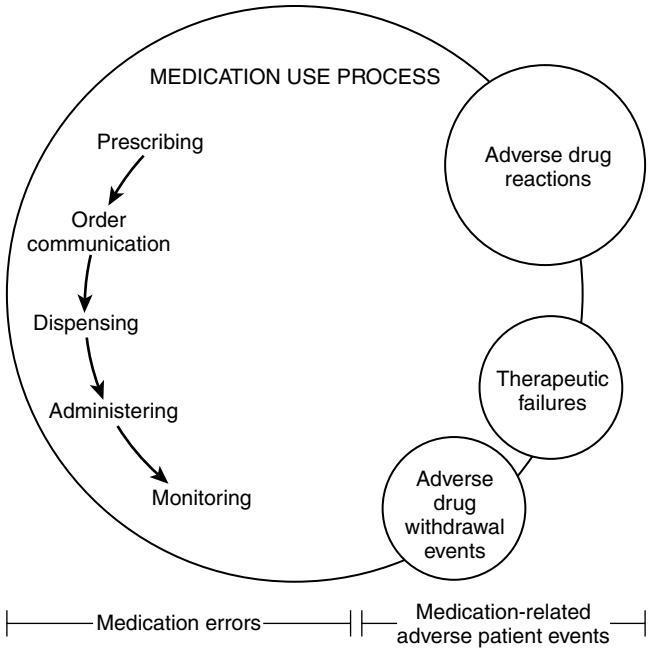

# Geriatric Pharmacotherapy and Polypharmacy

Joseph T. Hanlon Steven M. Handler Robert L. Maher Kenneth E. Schmader

# **INTRODUCTION**

Medications are the most frequently used and misused form of therapy for the medical problems of the aged. Geriatric health care professionals and their patients rely heavily on pharmacotherapy to palliate symptoms, improve functional status and quality of life, cure or manage diseases, and potentially prolong survival. There has been a major increase in our knowledge about the epidemiology and the clinical pharmacology of drugs in the elderly (see Chapter 23). This chapter examines efficacy and safety problems (including medication-related problems) of pharmacotherapy in aged populations, measures to reduce medication-related problems including polypharmacy in the elderly, and principles of optimal geriatric pharmacotherapy.

# **EFFICACY AND SAFETY OF PHARMACOTHERAPY FOR ELDERLY PATIENTS**

The evidence for the efficacy of medication therapy in elderly patients has been bolstered by a number of seminal randomized controlled clinical trials for geriatric conditions (e.g., behavioral complications with dementia) and diseases (e.g., hypertension).1,2 Moreover, a number of new and improved therapeutic medication entities have come to market and improved the ability of health care professionals to treat certain conditions (e.g., cholinesterase inhibitors for Alzheimer's disease, α-blockers for prostatic hyperplasia, and bisphosphonates for osteoporosis). In addition, the future seems bright for further medication discoveries that may benefit elderly people, as nearly 900 new medicines are currently in phase I to phase III testing.3

Despite these optimistic trends, there are still major limitations in our knowledge regarding the efficacy and safety of geriatric pharmacotherapy. Elderly patients are still underrepresented in premarketing clinical drug trials.4 Although regulatory authorities have developed guidelines for pharmaceutical companies regarding new molecular entities that are likely to have significant use in elderly patients, the full impact of these guidelines has yet to be realized.5 In addition, those trials that do include elders rarely include the "oldest-old" (i.e., 85+), those with multiple comorbidities, or those taking multiple medications.4 These exclusions raise questions about the generalizability of the results to frail elderly people. Moreover, there is a paucity of postmarketing studies designed to compare the *effectiveness* of two drugs in the treatment of common conditions (e.g., duloxetine vs. gabapentin in management of postherpetic neuralgia). In addition, formal postmarketing surveillance of medications to determine adverse effects varies from country to country, but usually it consists of case reports of potential adverse effects—reports written by practitioners and published in medical journals or spontaneous reports written by practitioners, patients, or pharmaceutical companies and submitted to regulatory agencies.6 These methods are limited by underreporting and the lack of denominator information about the population at risk. Thus, most safety information must come from formal postmarketing observational studies of specific therapeutic classes or conditions. This makes it difficult for prescribers to use evidence-based medicine to choose the "best" drug therapy for their frail elderly patients. Hopefully these deficiencies in pre- and postmarketing evaluation of efficacy and safety will be addressed in part by the Agency for Healthcare Research and Quality (funded by the University of Iowa), Older Adults Centers for Education and Research on Therapeutics in the United States (see www.iowacert.org for more details), and research utilizing national pharmacy dispensing data such as the Medicare Part D claims data in the United States (see http://www.cms.hhs.gov/PrescriptionDrug CovGenIn/08\_PartDData.asp for more details).

# **MEDICATION-RELATED PROBLEMS IN ELDERLY PATIENTS**

As mentioned previously, most information about medication-related problems must come from postmarketing observational studies of specific therapeutic classes or conditions. Problems commonly associated with medication use include medication errors and medication-related adverse events (Figure 104-1).7 Medication errors can be defined as "a preventable event that may cause or lead to inappropriate medication use or patient harm while the medication is in the control of the health care professional, patient, or consumer."7–9 These errors can occur at various stages of the medication use process—including the prescribing, order communication, dispensing, administering, and monitoring stages.

Medication errors may result in three different types of medication-related adverse patient events. The first type is an adverse drug reaction (ADR), which is defined as

*"a response to a drug that is noxious and unintended and occurs at doses normally used for the prophylaxis, diagnosis, or therapy of disease, or for modification of physiologic function,"10 pg. 289*

The second is an adverse drug withdrawal event (ADWE), defined as

*"a clinical set of symptoms or signs that are related to the removal of a drug,"6 pg. 30*

The third is a therapeutic failure (TF), defined as

*"a failure to accomplish the goals of treatment resulting from inadequate drug therapy and not related to the natural progression of disease (e.g., omission of necessary medication therapy, inadequate medication dose or duration, and medication non-adherence),"11 pg. 1092*

Figure 104-1. Conceptual model for medication-related problems in older adults. *(Adapted from Handler SM, Wright RM, Ruby CM, et al. Epidemiology of medication-related adverse events in nursing homes. Am J Geriatr Pharmacother 2006;4:264–72.)*

Medication-related patient adverse events were cited in an Institute of Medicine report as a major patient-safety concern in a variety of clinical settings including hospitals, ambulatory care, and nursing homes.8 Two cost-of-illness analyses done in the United States suggest that morbidity and mortality associated with drug-related problems cost an estimated \$177.4 billion per year in ambulatory patients and an estimated \$4 billion per year in nursing home residents.12,13 Next we describe the epidemiology of these three distinct medication-related adverse patient events.

#### **EPIDEMIOLOGY OF ADVERSE DRUG REACTIONS**

Several authors have reviewed the epidemiology of ADRs.6,7,14 Here we summarize some studies published most recently. One of the worst adverse consequences of pharmacotherapy is emergency department evaluation and hospitalization. Budnitz et al evaluated the frequency and characteristics of ADRs that lead to emergency department visits in the United States over a 2-year period.15 Using 21,298 ADR case reports, the authors concluded that 5.9% of all emergency department visits for adults over the age of 65 were for ADRs. Yee et al conducted a retrospective chart review of all older patients who visited the emergency department and found that 12.6% of all encounters were associated with an ADR.16 Pirmohamed et al conducted a prospective evaluation of 18,820 patients who presented to large general hospitals in England.17 The authors found that 6.5% (1225) of emergency department evaluations required hospital admission because of an ADR. The median age of a patient admitted for an ADR was 76 years, and the authors concluded that most ADRs were definitely or possibly avoidable.

Few investigators have studied ADRs in elderly outpatients or nursing home residents. In a large cohort study of older ambulatory adults, 5.5% (1523 of 27,617) experienced an ADR over a 12-month study period.18 Of those that experienced an ADR, 27.6% (421) were considered preventable. In a group of 808 frail elderly outpatients, Hanlon et al documented that 33% experienced an adverse drug event over a 1-year follow-up period.19 Of those that experienced an ADR, 37.6% (187/497) were considered preventable. Gurwitz et al studied the occurrence of ADRs in 18 Massachusetts nursing homes.20 Over a 1-year period, they found that 2916 nursing home residents had 546 ADRs, an incidence rate of 1.89 ADRs per 100 resident-months. Overall, nearly 44% of the ADRs were fatal, life threatening or serious, and 51% were preventable. In a more recent study, Gurwitz et al examined the combined incidence of ADRs in two academic nursing homes.21 In this 9-month prospective observational study, 815 ADRs were detected among 1247 nursing home residents, an incidence rate of 9.8 ADRs per 100 resident-months. As in their previous study, Gurwitz et al found that the majority (80%) of ADRs occurred at the monitoring stage of the medication-use process and a large proportion (42%) were considered preventable. Collectively, these studies from a variety of settings document that ADRs are a common phenomenon in elderly patients.

#### **ADVERSE DRUG REACTION RISK FACTORS**

Investigators have attempted to identify a uniform set of patient-level risk factors for the development of ADRs in order to direct prevention efforts at high-risk individuals.15–21

Only four risk factors were uniformly found to increase the likelihood of developing an ADR: presence of polypharmacy, use of central nervous system agents, anti-infectives, and anticoagulants. Multiple medication use or polypharmacy is an important factor because it is potentially modifiable. However, the reduction in number of medications in elderly patients with multiple diseases may be difficult because the diseases often require pharmacotherapy. It is also difficult to avoid the drug classes most associated with ADRs, because these drug classes are essential to the management of older persons.

Investigators have suspected that age-related alterations in pharmacokinetics and pharmacodynamics, fragmented medical care, suboptimal prescribing, suboptimal medication monitoring, and medication adherence influence the risk of ADRs.22–30 The latter three items are clinically important and will be discussed further in this chapter.

There are two major categories of suboptimal prescribing that may contribute to ADRs: (1) overuse or polypharmacy and (2) inappropriate use.26,27 Operational definitons of polypharmacy differ by clinical setting. One common defintion (9+ drugs) in U.S. nursing homes is found in nearly 60% of patients.31 There is limited information about polypharmacy defined as the administration of more medications than are clinically indicated.26,27 Two studies showed that between 44% and 59% of outpatients were prescribed more than one unnecessary drug.32,33

Inappropriate prescribing can be defined as prescribing a medication whose risks outweigh the benefits.26,27 A common medical standard that has been applied and studied in a variety of care settings has been the Beers explicit criteria.34–36 Results of recent epidemiologic studies suggest that the prevalence of prescribing a Beers criteria medication is 12% in the ambulatory care setting, 29% in the hospital setting, and 47% in the nursing home setting.37–39

Alternatively, inappropriate prescribing can be defined as prescribing that does not agree with accepted medical standards.26,27 Hanlon et al found that 91.9% of 365 elderly ambulatory patients in the United States had one or more prescribing problems as evaluated by the Medication Appropriateness Index (MAI).40 A study by Steinman et al found in a sample of 170 older patients very little concordance between those with polypharmacy (9+) drugs, or taking an inappropriate drug as per the Beers criteria, or taking an inappropriate drug as per the MAI.41 Of note, the MAI was the most comprehensive approach, missing only 10% of patients identified as having either polypharmacy or taking a Beers criteria drug.41

Studies are starting to emerge describing problems associated with suboptimal medication monitoring and its relationship to ADRs in a variety of care settings. For example, two thirds of the ADRs experienced by older adults in the emergency department were due to toxicity from a relatively small set of drugs for which regular monitoring is commonly required to prevent acute toxicity.15 In the ambulatory care setting, a substantial proportion of older adults do not receive appropriate laboratory monitoring while being prescribed chronic medications, which also leads to an increased risk of developing an ADR.28,29,42 Finally, as many as 70% of the ADRs in nursing homes are related to a failure to appropriately monitor medications.20,21

Medication adherence may also be a risk factor for ADRs. However, the contribution of medication nonadherence to ADRs is likely to be minor as elderly patients may be adherent with up to 75% of their total number of medications overall.30 Moreover, the most common type of medication adherence problems is underuse.30

#### **EPIDEMIOLOGY OF ADVERSE DRUG WITHDRAWAL EVENTS**

Adverse drug withdrawal events (ADWEs) are not formally examined in premarketing clinical trials so one must rely on clinical experience and published data in the postmarketing period to glean information about these problems. The clinical manifestation of ADWEs may appear either as a physiologic withdrawal reaction of the drug (e.g., β-blocker withdrawal syndrome) or as an exacerbation of the underlying disease itself.43,44 There have been few studies of this phenomenon in elderly patients. Gerety et al investigated ADWEs in a single nursing home in Texas over an 18-month time period and found that 62 nursing home patients experienced a total of 94 ADWEs (mean 0.54 per patient), corresponding to an incidence of 0.32 reactions per patient-month.45 Cardiovascular (37%), central nervous system (22%), and gastrointestinal drug classes were the most frequently associated with an ADWE. Over 27% of ADWEs were rated as severe. A study of ambulatory elderly patients by Graves et al in the United States investigated ADWEs in 124 patients and discovered that out of 238 drugs stopped, 62 (26%)

resulted in 72 ADWEs in 38 patients.46 Cardiovascular (42%) and central nervous system (18%) drug classes were the most frequently associated with an ADWE. In 26 of the ADWEs (36%), patients required hospitalization, emergency room admission, or urgent care clinic visits. Most of the ADWEs were exacerbations of an underlying disease, and some withdrawal events occurred up to 4 months after the medication was discontinued. Finally, in a study by Kennedy et al, ADWEs were investigated in the postoperative period in a single hospital.47 Of 1025 patients studied, 50% were over the age of 60 years. Thirty-four patients suffered postsurgical complications resulting from drug therapy withdrawal. Specific drug classes involved in ADWEs included antihypertensives (especially angiotensin-converting-enzyme inhibitors), antiparkinson medications (especially levodopa/ carbidopa), benzodiazepines, and antidepressants.

#### **ADVERSE DRUG WITHDRAWAL RISK FACTORS**

Little is known about the risk factors for ADWEs. In the study by Gerety et al, ADWEs were associated with multiple diagnoses, multiple medications, longer nursing home stays, and being hospitalized.45 Graves et al found that the number of medications stopped was a significant predictor of ADWEs.46 Analyses by Kennedy et al revealed that the risk of an ADWE increased as the length of time off the medication increased.47

#### **EPIDEMIOLOGY OF THERAPEUTIC FAILURE**

There have been few studies of this phenomenon in elderly patients. In a U.S. study of therapeutic failure leading to hospitalization, investigators used the reliable Therapeutic Failure Questionnarie (TFQ) to measure therapeutic failure in 106 frail older adults who were admitted to 11 Veterans Affairs hospitals.48 Eleven percent of these individuals had probable therapeutic failure leading to hospitalization. The most common conditions associated with therapeutic failure involved congestive heart failure and chronic obstructive pulmonary disease. In the emergency department, Italian investigators found that 6.8% of patients had evidence of therapeutic failure with nearly two thirds occurring in patients over the age of 65 years old.49 A U.S. investigation of drug-related emergency department visits in elderly patients found that 28% of drug-related visits were due to therapeutic failure.16

#### **THERAPEUTIC FAILURE RISK FACTORS**

Little is known about the risk factors for TFs. Reasons for therapeutic failure may include low prescribed dose, drug-drug interaction, drug resistance or nonresponse, inadequate therapeutic monitoring, nonadherence, or underprescrbing of necessary drug therapy. We discuss the latter two reasons next.

Nonadherence was the most common reason for therapeutic failure in the U.S. TFQ hospitalization study (58%) and in the U.S. emergency department visit study (66%).16,48 Older patients may not fill the prescription, not take a filled prescription, skip doses, take the drug erratically, or reduce doses. These behaviors may be intentional (e.g., adverse effects, health beliefs, concerns about taking too many drugs) or unintentional (e.g., cognitive impairment, poor vision or dexterity, lack of transportation).50 Cost-related nonadherence is a particularly important and prevalent subtype of intentional nonadherence among older adults with limited means.51,52

Another major factor related to therapeutic failure is the underprescribing of medications, which can be defined as the omission of drug therapy that is indicated for the treatment or prevention of a disease or condition.26,27 A study that applied the explict Assessing Care of Vulnerable Elders criteria found that 50% of 372 vulnerable adults were not prescribed an indicated medication.42 The most common problems were no gastroprotective agent for highrisk nonsteroidal anti-inflammatory drug (NSAID) users, no angiotensin-converting enzyme inhibitor (ACE-I) in diabetics with proteinuria, and no calcium or vitamin D for those with osteoporosis.42 A group of U.S. investigators using the Assessment of Underutilization of Medication (AOU) measure found evidence of underuse of medications in 62% of 384 frail elderly patients at hospital discharge.53 The necessary medication classes most likely to be omitted were cardiovascular (e.g., antianginal), blood modifiers (e.g., antiplatelet), vitamins (e.g., multivitamin), and central nervous system (e.g., antidepressant) agents. Patients with limited ability to perform basic activities of daily living and greater comorbidity were at higher risk for undertreatment. Clinical researchers have consistently detected underuse of medications for specific diseases or conditions in older adults, including congestive heart failure, myocardial infarction, hypertension, hyperlipidemia, osteoporosis, depression, diabetes mellitus, and pain. For example, one study found that only half of a large cohort of 21,138 elderly patients with diabetes who also had hypertension or proteinuria received recommended therapy with an angiotensin-converting enzyme (ACE) inhibitor or angiotensin receptor blocker (ARB) to retard progression of chronic kidney disease.54

# **MEASURES TO REDUCE MEDICATION-RELATED PROBLEMS IN ELDERLY PATIENTS**

Given that medication-related problems are common, costly, and clinically important, how can they be reduced? The specific answer to this question is surprisingly difficult because there are few health services intervention clinical trials in elderly patients that examine measures to reduce ADRs, ADWEs, or TFs. Therefore, health policy makers and clinicians must look to reasonable, empirical approaches that are based on existing epidemiologic and clinical information. These approaches, to be discussed here, include better health systems design, improved health services, and patient/caregiver education. Health professional education will be discussed in the last section on the principles of geriatric pharmacotherapy.

### **Health systems design**

Medication-related problems can be reduced by designing health care systems that make it difficult for individuals to do the wrong thing and easy to do the right thing.55 In the latest Institute of Medicine Report, *Reducing Medication Errors*, the authors provide a number of specific recommendations to improve medication safety.8 One recommendation is that all health care organizations should immediately make complete patient-information and decision-support tools available to clinicians and patients. Another recommendation is that health care systems should capture information on medication safety and use this information to improve safety. Health care organizations should also implement the appropriate systems to enable providers to have (1) access to comprehensive reference information concerning medications and related health data, (2) assess the safety of medication use through active monitoring and use these monitoring data to inform the implementation of prevention strategies, (3) write prescriptions electronically, and (4) subject prescriptions to evidence-based, current clinical decision support. A recent systematic review assessed the effects that computerized physician order entry and clinical decision support systems have on the quality, efficiency and cost of health care for elders.56,57 These studies suggest that although the amount of research available is limited, studies have been able to demonstrate improvements in the quality and efficiency of the medication use process. It is likely that the continued development and refinement of clinical decision support systems will lead to a reduction in medication errors and medication-related adverse events in a variety of care settings.

#### **Health services approaches**

Four reviews summarize clinical trials where two health services approaches, clinical pharmacist services and geriatric medicine services, have shown an improvment in suboptimal prescribing and medication adherence and reduced ADRs in older adults.26,27,58,59 Clinical pharmacy is a health science discipline that is concerned with the science and practice of rational medication use. One study by Leape et al showed that clinical pharmacist activities reduced ADRs in intensive care unit patients.60 Geriatric medicine services, also known as geriatric evaluation and management (GEM), utilizes a multidisciplinary team of specialists in geriatrics to manage patient care. The teams generally consist of a geriatrician, physician, nurse, social worker and pharmacist. An important component of GEM is the assessment and optimal management of medications. One study by Schmader et al showed that GEM care reduced the risk of serious ADRs in frail outpatients.61 Additonal large, multicenter controlled trials are needed to determine the effectiveness of these and other approaches to optimizing medication use in older adults on medication-related adverse patient events.

# **Patient/caregiver education**

Systematic education of patients and caregivers about ADRs may increase their ability to better report or avoid potential adverse drug events, thereby allowing clinicians to make medication changes before these adverse events become too serious. In addition, one study showed that when the pharmacist counsels patients about their medications upon hospital discharge, it can reduce the rate of adverse drug reactions.62 One review summarized randomized controlled trials designed to enhance medication adherence and related outcomes in the elderly.63 Patient education and compliance aids can improve medication adherence, which could potentially reduce therapeutic failure that may lead to hospitalization because of a patient or caregiver's decision to stop a beneficial medication.63 Although not definitively shown, it is sensible that patient and caregiver education about ADWEs could prevent a patient or caregiver from stopping a medication abruptly that should be withdrawn slowly.

#### **PRINCIPLES OF GERIATRIC PHARMACOTHERAPY**

Clinicians who care for elderly patients need to know and apply principles of geriatric pharmacotherapy in order to maximize the benefits of medications in their elderly patients and minimize medication-related problems (Table 104-1). The first step in prescribing is to decide whether medication therapy is really necessary, as many medical problems in elderly patients do not require a pharmacologic solution. If the clinician decides that a medication is indicated and its benefits outweigh its risks, then the choice of the medication must factor in the medication's pharmacokinetics, the patient's renal and hepatic function, the medication's main potential adverse effects, and the patient's other medications and diseases. The starting dose for most medications in

#### **Table 104-1. Principles of Geriatric Pharmacotherapy**

- 1. Consider whether medication therapy is necessary.
- 2. Know the pharmacology of the medication in relation to age.
- 3. Know the adverse effect profile of the medication in relation to
- the patient's other medication(s) and disease(s). 4. Choose initial dose, and adjust it carefully (doses will often need
- to be smaller in elderly people).
- 5. Select the least costly alternative.
- 6. Establish clear, feasible therapeutic end points.
- 7. Monitor for adverse drug reactions, an important cause of geriatric illness.
- 8. Slowly taper medications to prevent/minimize adverse drug withdrawal events (if possible).
- 9. Regularly review the need for chronic medications and discontinue unnecessary ones.
- 10. Assess whether there is omission of needed medication for the established diagnosis/condition.
- 11. Review adherence, simplify the medication regimen, if possible, and consider use of aids.

elderly patients must be lower, and the interval before modifying the dosage often must be extended. Cost and establishment of clear therapeutic end points are also important.

In the ongoing management of the patient and his or her medications, the clinician should monitor for potential ADRs via the history, physical examination, and, where appropriate, laboratory data.6 The identification of ADRs can be a challenging task in elderly patients because their ADRs may present in a vague or atypical fashion and the causal link can be difficult to establish. The first step is to consider ADRs in the differential diagnosis of most geriatric syndromes. If the adverse event is a known side effect of one or more of the patient's medications, the clinician can further enhance his or her confidence in establishing ADR causality by considering the temporal relationship of onset of medication use to onset of event, competing causes, rechallenge, dechallenge, and other factors.64 Nonetheless, in some cases, the clinician may find it difficult, and sometimes impossible, to establish the ADR causal link between medication effect and illness in elderly patients.

In patients who have recently stopped a medication, it is important to consider the possibility of an ADWE. ADWEs in elderly patients can be overlooked when the withdrawal event is mistaken for a patient's disease state. Common events that may happen in the everyday care of an elderly patient such as discontinuation of unwanted medications, intentional noncompliance, stopping medications before a surgical procedure, and managed care practices of medication substitution within classes of medications may lead to an ADWE. Table 104-2 lists medications commonly used by elderly patients that may be associated with withdrawal syndromes or exacerbation of the underlying disease.43–46,65 To prevent ADWEs, the clinician should take into account the dose of the medication, the length of therapy of the medication, and the pharmacokinetics of the medication. Risk can be minimized or eliminated by a slow, careful tapering of the medication over a period of time. This approach is similar to the time taken in the initiation and titration of a new medication. Unfortunately, precise tapering schedules have not been established for most medications.

#### **Table 104-2. Medications Associated With Adverse Drug Withdrawal Events in the Elderly**

| Medications                              | Type of Withdrawal* | Withdrawal Syndrome                                                   |
|------------------------------------------|---------------------|-----------------------------------------------------------------------|
| Alpha-antagonist antihypertensives       | P                   | Hypertension, palpitations, headache, agitation                       |
| Angiotensin-converting enzyme inhibitors | P, D                | Hypertension, heart failure                                           |
| Antianginal agents                       | D                   | Myocardial ischemia                                                   |
| Anticonvulsants                          | P, D                | Seizures                                                              |
| Antidepressants                          | P, D                | Akathisia, anxiety, irritability, gastrointestinal distress, malaise, |
|                                          |                     | myalgia, headache, coryza, chills, insomnia, recurrence of depression |
| Antiparkinson agents                     | P, D                | Rigidity, tremor, pulmonary embolism, psychosis, hypotension          |
| Antipsychotics                           | P                   | Nausea, restlessness, insomnia, dyskinesia                            |
| Baclofen                                 | P                   | Hallucinations, paranoia, insomnia, nightmares, mania, depression,    |
|                                          |                     | anxiety, agitation, confusion, seizures, hypertonia                   |
| Benzodiazepines                          | P                   | Agitation, confusion, delirium, seizures, insomnia                    |
| Beta-blockers                            | P                   | Angina, myocardial infarction, anxiety, tachycardia, hypertension     |
| Corticosteroids                          | P                   | Weakness, anorexia, nausea, hypotension                               |
| Digoxin                                  | D                   | Heart failure, palpitations                                           |
| Diuretics                                | D                   | Hypertension, heart failure                                           |
| Histamine-2 blockers                     | D                   | Recurrence of esophagitis and indigestion symptoms                    |
| Narcotic analgesics                      | P                   | Restlessness, anxiety, anger, insomnia, chills, abdominal cramping,   |
|                                          |                     | diarrhea, diaphoresis                                                 |
| Nonsteroidal anti-inflammatory drugs     | P                   | Recurrence of arthritis and gout inflammatory symptoms                |
| Sedative/hypnotics (e.g., barbiturates)  | P                   | Anxiety, muscle twitches, tremor, dizziness                           |

\*P, Physiologic withdrawal; D, exacerbation of underlying disease.

#### **Table 104-3. Medication Appropriateness Index**

#### **Questions to Ask About Each Individual Medication**

- 1. Is there an indication for the medication?
- 2. Is the medication effective for the condition?
- 3. Is the dosage correct?
- 4. Are the directions correct?
- 5. Are the directions practical?
- 6. Are there clinically significant drug-drug interactions?
- 7. Are there clinically significant drug-disease/condition interactions?
- 8. Is there unnecessary duplication with other medication(s)?
- 9. Is the duration of therapy acceptable?
- 10. Is this medication the least expensive alternative compared to others of equal utility?

At every visit, it is necessary to review and, if possible, simplify the patient's medication regimen. This may be achieved by altering the dosing schedule or discontinuing medicines that are no longer needed. To conduct the review when faced with an elderly patient taking multiple medications, the clinician can utilize any of the standardized approaches such as the Medication Appropriateness Index (MAI) (Table 104-3).66 The clinician should also consider whether necessary medications have been omitted. A standardized tool such as the Assessment of Underutilization of Medication (AOU) can be used, which requires having a health professional match the complete list of chronic medical conditions to the prescribed medications after reviewing the medical record.67 In this manner, one can determine whether there was an omission of a needed medication for an established disease or condition based on the scientific literature. For each condition, one of three ratings can be made: omission, marginal omission (e.g., have used appropriate nonpharmacologic approach), or no omission.

The clinician should also consider providing adherence aids for elderly patients. However, before providing the patient with methods to enhance adherence, it is important for the clinician to improve suboptimal prescribing and then to talk to the patient about how he or she takes the medications so that an individualized plan can be developed. It is also important to identify risk factors for poor adherence (e.g., impaired hearing, vision, and cognition).30 Health care professionals should also follow up with compliance recommendations by monitoring their patients. Some general methods to enhance adherence in elderly patients include simplifying regimens, providing written instructions, and considering generic formulations to reduce costs. More specifically, pill boxes, increased font size on prescription labels, calendars, easy-to-swallow dosage forms, pill cutters, oral dosing syringes, insulin syringe magnification, tube spacer for inhalers, and easy-open caps may increase adherence in elderly patients. There are also some electronic devices available as compliance aids (e.g., alarm watches with messages, automated pill delivery systems, medication bottles with alarms) that may prove to be beneficial. Finally, active patient and family involvement should be encouraged.

#### **SUMMARY**

Geriatric pharmacotherapy may greatly enhance the quality of life of elderly patients by effectively palliating, preventing, or treating many diseases and conditions in late life. The evidence for the efficacy of medications in elderly patients has significantly increased over past decades thanks to some clinical trials, and many more potentially beneficial medications are in development. However, clinical trial data may be limited by the underrepresentation of older patients in many trials, the exclusion of frail elderly or oldest-old patients, and the lack of postmarketing studies designed to assess the effectiveness of competing medications. In addition, the benefits of medication therapy can be offset by ADRs, ADWEs, and therapeutic failure. Although variable in their estimates of the frequency of these medication-related problems, many epidemiologic studies agree that these are common, costly, and clinically important problems in elderly patients. Potential solutions to these problems include better health systems design, health services approaches, and patient and caregiver education. More research is needed to determine the feasibility and effectiveness of these approaches. Clinicians who care for elderly patients need to know and apply principles of geriatric pharmacotherapy in order to maximize the benefits of medications and minimize medication-related problems.

# KEY POINTS

Geriatric Pharmacotherapy and Polypharmacy

- There are limitations in our knowledge about the efficacy and safety of medications in the elderly.
- Medication-related adverse patient events such as therapeutic failure, adverse drug withdrawal reactions, and adverse drug reactions are common and result in considerable morbidity in the elderly.
- Strategies to modify or reduce medication-related problems including polypharmacy will require that health systems design/ institute new approaches to delivering care to elders.
- Clinicians should strive to conduct periodic systematic reviews of elderly patients' medication regimens as well as adhere to other principles to optimize geriatric pharmacotherapy.

For a complete list of references, please visit online only at www.expertconsult.com