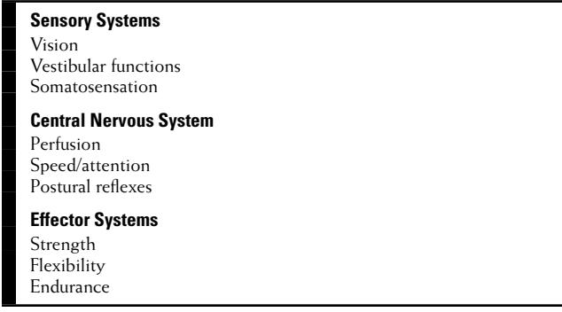
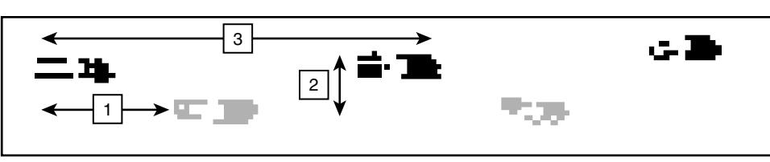

### **INTRODUCTION**

Falls are a major focus of geriatric medicine because they are common among older adults and have complex interacting causes, serious consequences, and require multiple disciplines for effective management. The goals of this chapter are to present the scope and impact of the problem, explore various perspectives on causation, provide guidance about clinical evaluation and treatment, and examine opportunities to implement programs across health care settings and communities.

### **EPIDEMIOLOGY**

Falls are common among older adults. Up to one third of community-dwelling persons over the age of 65 fall every year and about one fourth to one fifth of them will fall repeatedly.1 Falling is more common among women than men and increases in prevalence with advancing age. In acute care settings, falls are the most commonly reported adverse incident with rates varying from 3 to 13 falls per 1000 bed days.2 In chronic care settings, falls are so common that typically over half of residents are fallers and average rates can run from 1.5 falls per bed per year to two to six falls per resident per year.3 The most obvious adverse consequence of falls are injuries, which develop in about 10% of community fallers and 30% of fallers in acute and chronic care.1,2 Injuries are more likely in recurrent fallers.1 Falls can be fatal; they are the fifth leading cause of death among older adults.1 Falls are a major contributor to serious injuries, including not only hip fractures, but also other fractures, cervical spine injuries, and severe head trauma.4,5 Falls are a common precipitator of hospitalization and contribute to the need for long-term institutionalization.1,6 Falls in acute and chronic care institutions are also a source of complaints from families and even the source of litigation.7 Although injuries and health care use are serious concerns, falling also creates other serious problems for the older adult, including functional limitations, fear of falling, restricted activity, and social isolation.1,7 Falling can be a precipitator of a vicious cycle of failing health and function leading to death.

In the past, there has been no widely agreed-upon definition of falls. More recently, ProFaNE (Prevention of Falls Network Europe, www.profane.eu.org), a multinational work group dedicated to reducing falls and injuries through research and implementation of evidence-based interventions, has proposed the following as the most reliable and valid definition8:

*"A fall is an unexpected event in which the participant comes to rest on the ground, floor or lower level."*

Although this definition provides some consistency for reporting, there are still areas of confusion. It is not clear if it is appropriate to include in the definition of falls those events associated with loss of consciousness or overwhelming external forces such as being hit by a moving vehicle. Similarly, it may or may not be important to include events such as a "near" fall where the individual barely avoids a fall to the floor by suddenly grabbing for furniture or walls, or is caught by another person. Frequent near-falls, such as "stumbles" and "trips," are risk factors for future falls. There are also problems with fall reporting. Fall events may not be remembered retrospectively, especially if there were no injuries. Prospective monitoring improves accuracy but can be burdensome. Although falls in general are important, it is possible that the most clinically relevant concern is the recurrent faller or a fall injury. There are also serious healthrelated concerns for the population that does not actually fall because they have restricted their own activity. This group may also be at high risk for future falls, injuries, and social isolation.

# **CAUSATION**

Falling is considered a classic geriatric syndrome because it is often due to multiple interacting conditions that create an organism with reduced tolerance to any type of external stress. The evidence base that has been used to define the causes of falls is highly dependent on the perspective and priorities of the researchers, the definitions of falling and fallers, the time frame and approach to monitoring for falls, the characteristics of the population under study, what factors were measured, and how interactions between factors were assessed in the analyses. Whatever the focus of the research, it is clear that many fallers demonstrate multiple abnormalities, and that the interactions among these abnormalities influence fall risk.

### **Epidemiologic perspective**

Epidemiologic observational studies of older adults in community, acute, and chronic care institutions have identified risk factors for falls and all suggest that risk increases as the number of risk factors increases. Table 106-1 summarizes risk factor profiles by the setting in which older people were studied. Across settings, altered mobility and cognition are major risk factors for falls. Interestingly, it is possible to be too immobile to fall.9 For example, in one chronic care setting, residents with fair standing balance had the highest fall rates, those with good standing balance had intermediate fall rates, and persons with poor standing balance had the lowest

**Table 106-1. Predisposing Risk Factors for Falls in Older Persons in Three Types of Settings Based on Observational Studies**

| Community Dweller                                                                                                                                                                      | Acute Care                                                                                                               | Chronic Care                                                                                                                                |
|----------------------------------------------------------------------------------------------------------------------------------------------------------------------------------------|--------------------------------------------------------------------------------------------------------------------------|---------------------------------------------------------------------------------------------------------------------------------------------|
| Fall history Weakness Balance problem Gait problem Visual problem Mobility limitation Cognitive impairment Decreased functional status Postural hypotension | Gait instability Agitated confusion Urinary inconti nence/frequency Fall history High-risk medications | Cognitive impairment Visual impairment Weakness Neurologic problems Gait/balance problems Cardiovascular problem |

fall rates.10 Risk factor patterns and appropriate preventive interventions may differ substantially by overall mobility capacity; active older adults may experience falls and injuries for very different reasons than persons who stand and walk with difficulty, who in turn may fall for very different reasons than persons who cannot stand. Risk factors for injurious falls may differ from risk factors for all falls. In a recent study of older people in residential care facilities, fracture risk among fallers was higher in persons with better balance and no history of falls, perhaps suggesting that in some persons, activity increased the risk of producing sufficient force to fracture.11 Risk factor profiles are also limited in that they generally only identify chronic and stable risk factors, sometimes called predisposing risk factors. Many falls might occur because an individual with predisposing risk confronts additional acute precipitating factors.12 For example, an older adult with limited mobility and cognition might not become a faller until he or she develops diarrhea, becomes dehydrated and dizzy, and tries to rush to the bathroom. Because risk factor studies have rarely accounted for these more transient and dynamic precipitating contributors, much less is known about them.

Risk factors for falls overlap substantially with risk factors for other geriatric syndromes.13 Older age and impairments in cognition, mobility, and function are risk factors for falls, incontinence, delirium, and frailty.13 Thus there is a population of older adults with multiple impairments who are at risk for numerous geriatric syndromes, including falls and injuries. There may be other populations of older adults who are at risk for different types of falls; active older adults may fall and injure themselves during demanding activities, whereas very immobile older adults may fall out of bed and chairs or even be dropped by care providers. In the future, more distinct risk factor profiles might be defined based on overall mobility status.

Epidemiologic studies have also identified environmental risk factors for falls. Virtually all falls can be considered the result of interactions between a person and the environment. The individual has some level of ability to move and the environment has some level of challenge. The task of the moment is the context in which the person and the environment interact. The risk factors identified in Table 106-1 are sometimes called "intrinsic" factors because they relate to the individual. Risk factors associated with the environment are sometimes called "extrinsic" factors. The typical aged faller experiences a fall in an environment and while performing tasks that would not cause a healthy young person to fall. This phenomenon of falling under low challenge is the rationale for believing that many falls in older people are due largely to intrinsic factors. If an older adult has many intrinsic risk factors, it is possible that only modest problems with the environment or modest degrees of challenge in a task will precipitate a fall. Table 106-2 lists environmental risk factors for falls. Commonly reported indoor environmental factors are uneven walkways, loose rugs, absence of grab bars in the bathroom, and poor lighting.14,15 Outdoor hazards are less frequently assessed but might be important, especially for more active older adults. Other extrinsic elements, such as the availability of human help, may be an important factor in falls among persons living in the community, and are even more likely to contribute to falls in the institutional setting.10 Additional risk factors for falls include psychological and

#### **Table 106-2. Environmental Risk Factors for Falls**

| Indoor Falls                                                                                                                                                                                       | Outdoor Falls                                                                                                  |
|----------------------------------------------------------------------------------------------------------------------------------------------------------------------------------------------------|----------------------------------------------------------------------------------------------------------------|
| Poor lighting Loose or absent railings Throw rugs Trailing cords and wires Uneven transitions such as level change between rooms Lack of bars in the bathroom Slippery floors | Uneven and broken sidewalks Wet surfaces Poor lighting Irregular steps Unpredictable level changes |
| Cluttered walkways                                                                                                                                                                                 |                                                                                                                |

attitudinal characteristics such as risk preference.9,16 Other risk factors for injury include osteoporosis, low body weight, and fall direction.17

### **Physiologic perspective**

Contributors to falls can be examined from the perspective of physiologic systems that contribute to balance. The rationale for using a framework of organ-based physiologic systems that affect balance is founded in models of disablement. These models draw links between pathologic processes and altered organ system performance (termed impairments), which combine to affect body movements (termed functional or performance limitations), then affect functional abilities and disability, and ultimately interfere with social roles, such as homemaker or volunteer (termed handicap). There are several disablement models. When assessing causation of problems of aging, these multisystem physiologic approaches are helpful for several reasons. First such approaches can address interactions between systems. Second, they can include mild or subclinical impairments that might affect function without being individually clinically obvious. Third, well-functioning systems might actually serve to compensate for problems with other systems. Thus both individual organ systems and even overall functions such as balance exist on a continuum; they might be obviously abnormal, subclinically abnormal under usual conditions, abnormal only under stressful conditions, normal, or even have "back up" or "reserve" excess capacity.

From a physiologic perspective, balance dysfunction results from impairment in one or more of the following systems: *peripheral sensory receptors* for input, *central nervous system* structures for processing sensory input and planning motor output, and *effector organs* to carry out the movement plan (Table 106-3). In many situations, it is the combination of deficits across these systems that produces instability and falls.

There are three main sensory systems used for balance: vision, somatosensation, and vestibular function. Visual functions such as acuity, depth perception, dark adaptation, contrast sensitivity, and peripheral vision help determine body position and trajectory in space and monitor the environment. Since bifocal glasses prioritize two focal lengths—one in the lower field at about 20 inches for reading and one in the upper visual field at about 20 feet for distance—bifocals can limit acuity in the critical zone in front of the feet while walking.18 Diseases of the aging eye that affect multiple visual functions are common and include glaucoma, macular degeneration, and cataracts. Medications that cause miosis, or constriction of the pupil, can reduce dark adaptation.

Peripheral sensation is important for balance. These sensors provide information about the position of the body relative to the support surface and gravity, and reflect the relationship of one body part to another during rest and movement. Peripheral sensation is the most important system for monitoring the characteristics of the weight-bearing surface and the distribution of body weight onto the feet. Peripheral sensory loss is common in older adults because of diabetes and peripheral vascular disease. In the face of peripheral sensory loss, visual systems can compensate by supplementing information about body position. Thus a combination of vision loss and peripheral sensory loss can create serious problems with ability to monitor body position.

The vestibular system detects the position of the head with respect to gravity, monitors linear and angular acceleration of the head, and coordinates head and eye movements to maintain gaze and visual field stability while moving. Vestibular system impairments can occur with usual aging and are affected by ischemia or head trauma. Several widely recognized vestibular conditions, such as benign paroxysmal vertigo and perhaps Meniere disease, are common in older people. Others are also common but less well recognized, such as chronic bilateral vestibular hypofunction.

The central nervous system has numerous structures that contribute to balance. Structures in the brainstem and spinal cord are considered central pattern generators that produce stepping behaviors. Balance is further controlled by higher level brain structures including the frontal cortex, basal ganglia, cerebellum, motor cortex, and other areas. Degeneration of brain regions can affect balance, as in the basal ganglia in Parkinson disease and in cerebellar degeneration. All brain processes are dependent on adequate levels of brain perfusion, so any threats to perfusion affect central processes of gait and balance. Thus many of the conditions that produce syncope or presyncope can cause transient cerebral hypoperfusion and falls. Examples include orthostatic hypotension, tachy- and bradyarrhythmias, and critical aortic stenosis.19 In recent years, there has been increased awareness of the role of more diffuse microvascular brain disease as a contributor to balance disorders and falls.20 This mechanism is posited to involve ischemia in vulnerable brain areas, especially the frontal lobes and in important white matter tracts connecting the frontal lobes to critical subcortical areas. Radiologically this ischemia is manifested as leukoaraiosis or white matter disease on magnetic resonance imaging. White matter disease has been associated with specific patterns of cognitive dysfunction involving psychomotor slowing, and altered attention and executive functions such as sequencing and visual spatial organization.20,21 These cognitive abnormalities have been associated with alterations in gait, especially excessively variable length and timing of stepping and with falls.22,23 Thus there is an emerging concept of altered balance and gait due to abnormal nonamnestic cognitive functions and movement planning produced by regional microvascular brain disease. This condition may be manifest by irregular walking patterns and may be exacerbated by placing stress on cognition and movement. Tasks that simultaneously stress cognition and movement are part of an emerging conceptual approach to balance assessment called "dual tasking." Older persons whose performance worsens substantially when asked to walk and solve cognitive problems simultaneously may be at increased risk for falls.24

The central nervous system also operates a multisynaptic "righting reflex" that produces automatic correcting movements when balance is lost. Classically appearing as a stepping response that occurs much more quickly than can be done voluntarily, this righting reflex is lost in many central nervous system disorders including extrapyramidal diseases and other forms of multisystem atrophy. Sedation, either clinical or subclinical, may further reduce alertness and attention. Thus both sleepiness and sedative medications have been found to increase fall risk.25,26 Less specific but potentially important are psychological factors such as fear of falling and risk preferences.9,27

Muscles and joints are effector organs that are critical for balance and mobility. Muscle weakness is widespread in older adults and can be due to primary muscle mass loss (sarcopenia), disorders of peripheral nerves or neuromuscular junctions, or to inactivity. Specific muscle diseases such as inflammatory myositis or steroid myopathy can produce proximal muscle and trunk weakness that occurs with falls. Lower motor neuron conditions, radicular nerve deficits due to spinal stenosis, or peripheral nerve damage can result in localizing strength deficits that affect specific muscle groups and more distinct functional movements. For example, a foot drop due to damage to the peroneal nerve prevents the forefoot from lifting to clear obstacles and can induce trips and stumbles. Recent evidence suggests that low vitamin D levels may contribute to muscle weakness and falls.28 Low testosterone levels have been found to be associated with falls in men under age 80.29 Other common conditions such as arthritis can reduce range of motion and produce pain that alters stepping and weight bearing.30 Deformities distort the weight bearing surfaces of the foot and cause pain. Fatigue, either generalized or localized to muscle, can contribute to loss of balance. Thus acute conditions such as overworked muscles or chronic conditions associated with fatigue such as anemia31 or congestive heart failure might increase risk for falls.

When fall onset is abrupt or there is a major change in balance, the likelihood is higher that there is a medical event that has affected the central nervous system. Any illness or episode that reduces cerebral perfusion through hypoxia, decreased oxygen carrying capacity, or hypotension could present as dizziness, lightheadedness, unsteadiness, and falls. Toxic or metabolic abnormalities due to medications, infection, or electrolyte disorders could present as unsteadiness and falls through effects on attention. New focal neurologic deficits due to stroke can also present as unsteadiness. Older

Figure 106-1. Terms used to describe normal walking (1: step length; 2: step width; 3: stride length).

adults with predisposing subclinical balance disorders could be more vulnerable to such precipitating factors. These types of physiologic acute and sometimes transient changes are harder to include in research studies because stable chronic effects are usually the focus of the investigation.

# **Biomechanical perspective**

A biomechanical approach to fall risk is based on concepts of mass, force, momentum, and acceleration of the body as a whole and of body segments. The human body in standing is a long tall column that rests over a small base of support. The main task of movement is to displace and recover this column while the base of support changes. Thus the assessment of balance includes two main conditions, (1) static balance, defined as steadiness of the fixed column over a constant base of support and (2) dynamic balance, defined as control of the column and supporting structures during movement. The most essential and classic dynamic balance task is walking. Walking involves alternating use of one leg to support the body while the other swings from behind to in front of the body. There is an extensive knowledge base about normal and abnormal walking that is based on a set of biomechanical characteristics and uses a specialized terminology (Figure 106-1). Walking can be characterized by the pattern of steps using spatial factors such as step length, stride length (the distance between two heel contacts from the same foot), and step width. Walking can also be characterized by temporal factors such as double support time (the duration of the stride when both feet are on the ground at the same time) and cadence (step frequency). Walking has been described as "controlled falling" because the body column moves forward past the base of support and the feet must be timed to contact the support surface at the right location and time in anticipation of the moving location of the trunk.32 When this timing is altered by disease, gait becomes irregular and trunk movement can be altered. Walking can also be characterized by changes in other body segments and joints. During normal walking, the foot begins a step with a push off from the toe, then lifting the foot to swing through and ending with a heel strike and forward rolling foot contact to initiate the next push off. The knee is in full extension at the time of toe push off, swings forward with slight flexion to aid foot clearance and then returns to full extension at the point of heel contact. The hip is in extension behind the trunk at push off and swings into flexion at heel contact. The arms swing alternately and in a sequence opposite to the step sequence of the legs. Biomechanical factors that have been found to be abnormal in fallers encompass both static and dynamic balance. Abnormal static balance associated with falling is manifested as increased sway during quiet standing. Some recent studies suggest that increased sway to the side, or medial-lateral plane, is especially associated with falls.33 Alterations in dynamic balance among fallers are diverse depending on the underlying cause. Frequently observed abnormalities include prolonged double support time during walking, increased step width, increased trunk sway during movement, increased or decreased toe clearance, reduced hip extension, abnormal lateral stepping, and delayed correcting movements at the hip or ankle when the trunk is displaced.34,35

# **SCREENING**

Screening for fall risk has two main goals: to identify persons at high risk and to identify remediable factors for intervention. Screening for risk alone can be more efficient than assessment for modifiable factors, so screening sequences that first identify risk and then assess remediable factors may make the best use of scarce resources. Since fall risk varies by population and type of fall, there is unlikely to be a single screening approach that works well in all settings. Certainly in diverse community populations, it makes sense to identify groups who are at low risk and who therefore can be spared more detailed, time-consuming assessments. Thus the American Geriatrics Society and the British Geriatrics Society have recommended falls screens that identify risk as (1) more than one fall in the last year, (2) one or more falls with injury, (3) self-report of unsteadiness, or (4) unsteadiness on performance testing.36 Many older adults do not complain about falling to health care providers, so it is important to explicitly ask about falls. Some older adults fail to report falls because they forgot them. Some older adults may actively hide the fact that they are falling because they worry that family or providers will insist on relocation or activity restrictions. Screening in chronic care settings differs from screening in primary care. In chronic care settings, fall rates are often high and screening tools are more likely to have high false-negative rates. If prevalence is very high, it may be sensible to consider almost everyone as high risk and act accordingly. Fall risk screening in acute care is a high priority, but recently some have argued that no screening tool has high enough accuracy to justify the current investment in detailed admission fall screening since it consumes much nursing staff time with little real benefit.37 In addition, general screens for functional problems in acutely ill hospitalized older adults may do as well at predicting falls as more specific falls screens and general screens can be used for multiple nursing issues.38 There is some evidence that nursing global judgement is comparable in accuracy to formal screening tests in some chronic care settings.39

There are two main types of screening tools: those that are based on professional assessments of various historical and health factors and those that are based on observed performance of mobility and balance tasks. Some of the more common tools are described in Table 106-4. There are no clearly superior tools that have been shown to have high

|                                                |                                                                                                                                                                                                                                                                               | SETTING   |       |         |  |
|------------------------------------------------|-------------------------------------------------------------------------------------------------------------------------------------------------------------------------------------------------------------------------------------------------------------------------------|-----------|-------|---------|--|
| Instrument                                     | Items                                                                                                                                                                                                                                                                         | Community | Acute | Chronic |  |
| Multifactorial Reports                         |                                                                                                                                                                                                                                                                               |           |       |         |  |
| STRATIFY55                                     | Five items: history of falls, agitation, visual impairment, frequent toileting, able to stand but needs assistance with moving                                                                                                                                             |           | x     | x       |  |
| Morse falls scale56                            | Six items: history of falls, secondary diagnoses, parenteral therapy, use of ambulation aids, gait, mental status                                                                                                                                                          |           | x     | x       |  |
| FROP-Com 57                                    | 13 risk factors in 26 items, fall and fall injury history, medications, medical conditions, sensory loss, feet, cognitive status, toileting, nutrition, environment, function, behavior, balance, gait (total score 0 to 60, fall risk high with score >24)          | x         |       |         |  |
| Fall risk for residential care58            | Among persons who can stand without assistance, poor balance, or (2 of 3 of fall history, nursing home residence, urinary incontinence) Among persons who cannot stand without assistance, any 1 of 3 (fall history, hostel residence, use of 9 or more medications) |           |       | x       |  |
| Functional Mobility                            |                                                                                                                                                                                                                                                                               |           |       |         |  |
| Berg balance test40,59                         | 14 tasks scored 0 to 4; total range 0 to 56; fall risk increases as score decreases                                                                                                                                                                                        | x         | x     | x       |  |
| Functional reach60                             | Distance reached in inches without moving the feet; fall risk <7 inches                                                                                                                                                                                                       | x         | x     | x       |  |
| Performance oriented mobility and balance61 | Balance subscale score 0 to 16, gait subscale 0 to 12, summary score 0 to 28; summary score below 19 indicates high fall risk                                                                                                                                              | x         |       | x       |  |
| Timed up-and-go62                              | Time in seconds to rise from a chair, walk 3 m, turn, walk back and sit down. <10 sec is normal. Fall risk increases with time >13.5 sec.                                                                                                                                  | x         |       | x       |  |
| Dynamic gait index41                           | 8 walking tasks scored 0 to 3, total score 0 to 24; <18 or 19 indicates fall risk                                                                                                                                                                                          | x         |       |         |  |
| Functional mobility tests63                    | Time to complete 8 step-ups (Alternate Step Test) >10 sec, timed sit to stand five times >12 sec, 6 m walk time >6 sec increased fall risk                                                                                                                                 | x         |       |         |  |
| Physiologic profile assessment64            | Performance in five domains: sway, reaction time, strength, propriocep tion, contrast sensitivity; total score 0 to >3. Fall risk increases with score of 2 or more.                                                                                                    | x         |       |         |  |

#### **Table 106-4. Scales Used for Fall Risk Screening and Balance Assessment**

accuracy in multiple settings, so the optimal tool must be tailored to the population, the goals of screening, and the time and other resources available.

# **EVALUATION AND MANAGEMENT Evaluation**

When an individual has been identified as high risk for falls, then a more detailed evaluation is needed. The goals of evaluation are to (1) identify impairments that contribute to the problem, (2) gain an overall sense of mobility and balance capacity, and (3) consider special risk factors for injury. Since falling is multifactorial, multidisciplinary teams can provide a range of expertise. Disciplines that can make valuable contributions include physicians, nurses, physical therapists, occupational therapists, social workers, pharmacists, and others. Although the older adult should always be interviewed, other informants may be helpful. Table 106-5 illustrates elements of the history and physical examination that can be used to evaluate potential impairments. It is important to recall that older adults often have more than one impairment, so that finding one problem does not mean that there are not others as well. The history should include circumstances of one or more recent falls, history of injuries from falls, the course of the problem over time, associated symptoms and effect on overall mobility and activity. A fall description should include location, time of day, activity, symptoms, use of assistive devices, and ability to get up again. It is sometimes helpful to explore potential relationships to medication dosing schedules. Various patterns may suggest differing clusters of contributors. Recurrent backward falls tend to be associated with degenerative brain diseases. Acute onset is more likely to be due to a toxic or metabolic effect or perhaps an acute cerebrovascular or cardiac condition. Fear of falling can develop with or without a history of falling and can lead to severe activity restriction. Falls associated with dizziness may suggest some specific diagnoses (Table 106-6). Dizziness is common and nonspecific, so the interviewer must probe more deeply to distinguish potential contributors. True vertigo is defined as a hallucination of rotatory motion and is generally due to vestibular problems. Lightheadedness sometimes implies a sense of imminent loss of consciousness or presyncope. In this case, consider contributors to decreased cerebral perfusion. A third type of dizziness is perceived as "not in the head" and only occurs when upright. It may be an indicator of multisensory dysequilibrium, when more than one sensory impairment reduces the ability to monitor body position.

Medications are sometimes implicated in falls and can be among the most treatable contributors, so a thorough medication history is essential. Although there are long lists of medications with adverse effects on balance, there are just a handful of major mechanisms by which they cause falls. Common mechanisms include sedation, orthostatic hypotension, extrapyramidal effects, myopathy, and altered dark adaptation of vision. See Table 106-7 for examples of medications listed by potential mechanism. Persons who take multiple medications that alter balance are especially vulnerable.

Functional status should be assessed because mobility and balance are central to the ability to care for oneself and live independently. Many older adults use assistive devices for walking so it is important to explore when and how they were obtained, where they are used and not used,

### **Table 106-5. Clinical Assessment Based on Components of Postural Control**

| Organ System            | Impairment                                   | Clinical Evaluation                                                                                            | Potential Cause                                                                                                              |
|-------------------------|----------------------------------------------|----------------------------------------------------------------------------------------------------------------|------------------------------------------------------------------------------------------------------------------------------|
| Eye                     | Decreased acuity                             | Vision chart                                                                                                   | Presbyopia, macular degeneration, cataracts                                                                                  |
|                         | Reduced visual fields                        | Confrontation, perimetry                                                                                       | Glaucoma, posterior circulation stroke                                                                                       |
|                         | Decreased depth perception                | Stereo or depth testing                                                                                        | Monocular vision                                                                                                             |
|                         | Decreased dark adaptation                    | Self-report, inability to dilate pupil in low light                                                         | Aging, miotic agents for glaucoma                                                                                            |
| Vestibular apparatus | Otoliths                                     | Ability to detect true vertical, Hallpike maneuver                                                          | Benign positional vertigo                                                                                                    |
|                         | Semicircular canals                          | Ability to detect position during rotation with eyes closed, nystagmus, visual acuity during head motion | Meniere's disease, vestibular hypofunction                                                                                   |
| Peripheral nerve        | Peripheral neuropathy                        | Light touch, filaments, two point discrimination, vibratory sense                                           | Diabetes, peripheral vascular disease, B12 deficiency                                                                     |
| Circulation             | Reduced cerebral perfusion                   | Low blood pressure, altered level of consciousness, lightheadedness                                         | Medications, arrhythmias, postprandial hypotension                                                                        |
|                         | Orthostatic hypotension                      | Positional change in blood pressure                                                                            | Medications, autonomic dysfunction, dehydration                                                                           |
| Brain                   | Reduced attention                            | Ability to perform dual tasks such as timed up-and-go with cup of water, executive function tasks        | Mild cognitive impairment, dementia, medications                                                                          |
|                         | Psychomotor slowing                          | Timed tapping, timed finger to nose test, trails A test (connect the dots)                                  | Medications, degenerative and vascular brain diseases                                                                     |
|                         | Altered postural reflexes                    | Absent or slowed righting reflexes                                                                             | Parkinson's disease, other extrapyramidal and degenerative brain diseases                                                 |
| Muscle                  | Reduced strength                             | Manual muscle testing, strength-based functional performance (chair rise, squat)                            | Generalized: inactivity, sarcopenia, vitamin D deficiency, myopathies Focal deficits; spinal cord and peripheral motor |
| Musculoskeletal         | Loss of flexibility                          | Contractures, decreased range of motion                                                                        | nerve conditions Arthritis, inactivity                                                                                    |
| pain                    | Bone and joint deficits                      | Weight-bearing pain                                                                                            | Arthritis, fractures, periarticular conditions, foot problems                                                             |
|                         | Disturbance of spinal cord, roots, nerves | Leg and back pain with activity                                                                                | Spinal stenosis, radiculopathies, peripheral neuropathies                                                                 |

|  |  | Table 106-6. Differential Diagnosis and Management of Dizziness |  |  |
|--|--|-----------------------------------------------------------------|--|--|
|--|--|-----------------------------------------------------------------|--|--|

| Condition                                                       | Symptoms                                                                                                                                 | Evaluation                                                                                                                                                                                                                                                                  | Management                                                                                                                                                  |
|-----------------------------------------------------------------|------------------------------------------------------------------------------------------------------------------------------------------|-----------------------------------------------------------------------------------------------------------------------------------------------------------------------------------------------------------------------------------------------------------------------------|-------------------------------------------------------------------------------------------------------------------------------------------------------------|
| Orthostatic hypotension                                      | Lightheadedness with change in position                                                                                               | Measure blood pressure in multiple positions, both immediately after change and then again after several minutes. Clinically important systolic drop is not well defined but is more likely to be significant if greater than 20 mm Hg or drops below 100 | Taper or eliminate medications, fluorinated corticosteroids, salt loading, lower extremity muscle contractions before arising, compression hose |
| Arrhythmia, especially tachyarrhythmia or bradyarrhythmia | Lightheadedness or syncope not associated with position, occasionally with palpitations                                            | Rhythm monitoring is important to capture symptomatic episode so monitoring may be prolonged.                                                                                                                                                                         | Antiarrhythmic agents, medications for heart rate control, pacemak ers                                                                                |
| Benign paroxysmal positional vertigo (BPPV)               | Short periods of true vertigo with head movement, even without upright body movement, such as rolling over in bed or looking up | Dix-Hallpike reproduces symptoms when in the head-down position and precipitates rotatory nystagmus in the direction of the involved ear.                                                                                                                          | Eppley maneuver to reposition otolith debris; Brandt Daroff exercises                                                                                 |
| Meniere's disease                                               | Severe episodes of vertigo with perceived ear pressure, decreased hearing, nausea, and vomiting                                    | Usually diagnosed based on classic presentation, often incorrectly diagnosed when the true cause is not known                                                                                                                                                         | Diuretics, dietary modifications to reduce salt intake                                                                                                   |
| Uncompensated vestibular hypofunction                     | Unsteadiness that worsens when vision is reduced; blurred vision with head motion                                                  | Rotational chair testing, caloric testing, dynamic visual acuity testing                                                                                                                                                                                                 | Vestibular rehabilitation, optokinetic stimulation                                                                                                       |
| Multisensory dysequilibrium                                  | Sensation of lack of confidence in body position that only occurs when upright                                                     | Decreased sensory function in more than one sensory system (e.g., vision, vestibu lar, and peripheral sensation)                                                                                                                                                      | Treat sensory disorders, rehabilita tion for use of sensory aids                                                                                         |

and if there are areas of problem or concern. Since balance and mobility problems can limit function, it is important to determine if able and willing helpers are available. Older adults without access to helpers may be at special risk as they attempt to perform tasks that have become difficult.

Since the environment influences mobility and safety, a home assessment is an important element of falls evaluation. Although some aspects of the environment can be explored through an interview, a direct home assessment by professionals from a home visit agency can be invaluable. Key aspects of home assessment are described in Table 106-8.

#### **Table 106-7. Medications That Affect Components of Postural Control**

| System Affected                                        | Examples                                                                                                                                             |
|--------------------------------------------------------|------------------------------------------------------------------------------------------------------------------------------------------------------|
| CNS: attention and psychomotor speed                | Benzodiazepines, sedating antihista mines, narcotic analgesics, tricyclic antidepressants, SSRIs, antipsy chotics, anticonvulsants, ethanol |
| Basal ganglia and extrapyra midal system in general | Antipsychotics, metoclopramide, phenothiazines, SSRIs                                                                                             |
| Blood pressure regulation                              | Antihypertensives, antianginals, Parkinson drugs, tricyclic antidepressants, antipsychotics                                                    |
| Muscle: myopathy                                       | Corticosteroids, colchicine, statins, ethanol, interferon                                                                                         |
| Pupil: miosis                                          | Some glaucoma medications, especially pilocarpine                                                                                                 |

#### **Table 106-8. Modifications for the Physical Environment**

| Area       | Modifications                                                                                                                                                                                                                                  |
|------------|------------------------------------------------------------------------------------------------------------------------------------------------------------------------------------------------------------------------------------------------|
| Lighting   | • Nightlights in the bedroom, bathroom, and hallways leading to the bathroom • Keep a flashlight next to the bed • Timer or motion-activated lighting systems • Locate light switches near all doors and both ends of stairways |
| Flooring   | • Nonglare, nonskid flooring • Avoid loose area rugs or used nonskid backing • Nonskid strips on steps • Bevel/ramp uneven transitions between rooms                                                                            |
| Stairwells | • Increase contrast at level changes • Sturdy handrails, sometimes on both sides of steps • Chair lift (Stair Glide) • Rearrange rooms to achieve single-floor living                                                           |
| Bathroom   | • Elevated toilet seat • Grab bars • Nonskid strips or mat on floor of shower or bathtub • Shower chairs • Tub bench                                                                                                            |
| Kitchen    | • Put common items at easily accessible height • Clear countertop clutter to maximize working space                                                                                                                                      |
| Walkways   | • Clear and straight as possible • Increase width by removing obstacles and furniture to accommodate walkers • Eliminate tripping hazards such as cords and tubing                                                                 |

The physical examination is useful to detect impairments that contribute to poor balance and to assess overall functional performance. Table 106-5 describes maneuvers that can be performed during the physical examination to detect impairments. Most of these assessments are familiar to health care providers, but a few are somewhat unique to balance assessment. Peripheral sensory testing is important since neuropathy is common among older adults. Although proprioception (joint position sense) is important for balance, testing is insensitive. Since proprioception and vibratory sensation use similar nerve fibers, testing vibratory sense may be more sensitive. A common strategy is to evaluate vibration detection using a 128 Hz tuning fork applied over a bony prominence such as the medial malleolus. The Romberg test, in which standing balance is compared with eyes open and closed, is a useful strategy for detecting visual dependence. An abnormal result suggests peripheral nerve or vestibular disorders. Abnormal muscle tone can indicate a variety of conditions. Increased tone implies upper motor neuron disease whereas decreased tone suggests lower motor neuron dysfunction. Increased tone can exist throughout the range of motion (lead pipe rigidity), or intermittently (cogwheeling rigidity). Coordination should be assessed in both the upper and lower extremities using tests of rapid alternating movements. Every balance assessment should include a test of righting reflexes. To perform the assessment, the examiner stands behind the patient, and asks the patient to prepare to respond to a push or pull with any reaction they prefer. The examiner pulls the patient's pelvis backwards sufficiently to displace the body outside the base of support. A normal response is a brisk step backwards. An abnormal response is a complete lack of stepping, called a "timber reaction." The patient can also be displaced to the side.

The evaluation is also used to determine functional mobility and balance capacity. Physical performance measures can serve as a guide, but it is important to target the performance assessment to the mobility capacity of the individual. Thus an older adult who is wheelchair-bound needs detailed assessment of bed mobility, transfers, and standing balance, whereas an active older adult may need more of a focus on high-level skills such as obstacle avoidance, dual tasks, and stair climbing. Table 106-4 includes commonly used functional performance assessment tools for mobility and balance. The Berg balance scale has been used to predict fall risk40 but does not assess balance during walking. The dynamic gait index is especially helpful for detecting subtle higher level problems because it includes challenging conditions.41 The performance-oriented mobility assessment (POMA) assesses static balance and gait and is widely used, but does not assess higher level functions.42 Recently, balance assessments have added dual task tests that combine mobility assessment with distraction or a cognitive task. These divided attention tasks can sometimes uncover abnormal gait or balance not seen under usual simple conditions. Being unable to walk and talk at the same time is a risk factor for falls.43 Reduced endurance during walking can create a sense of fatigue and leg weakness, so a long walk might be a useful element of the examination.

The third element of evaluation is to determine special risk factors for injury. Since fractures are a major cause of morbidity in fallers, every unsteady person should be assessed for osteoporosis. Another special concern is the risk of bleeding in persons who take anticoagulants. Loss of protective reflexes also increases the risk of injury. Since normal protective responses involve use of the upper extremity to moderate impact force and protect the head, injuries to the head, face, and orbit are especially worrisome. An absent righting reflex on physical examination is a significant indicator of increased risk of injury.

### **Management**

The goals of management are to (1) treat impairments where possible, (2) build on systems that work well to compensate for deficits, and (3) provide physical and human resources to assist where necessary. Table 106-9 provides suggestions for management strategies based on the impairments

|          | Organ System     | Impairment                                | Medical Management                                                                                                                                    | Restorative Services                                                                                 | Environmental Modifications                       |
|----------|---------------------|-------------------------------------------|-------------------------------------------------------------------------------------------------------------------------------------------------------|------------------------------------------------------------------------------------------------------|------------------------------------------------------|
|          | Eye                 | Decreased acuity Reduced visual fields | Corrective lenses Prisms in spectacles                                                                                                             | Low vision rehabilitation Low vision rehabilitation, teach to scan using head rotation      | Lighting                                             |
|          |                     | Loss of depth perception               | Cataract removal if indicated                                                                                                                         | Teach to use shadows to detect depth                                                              | Lighting to accent shadows, con trast lighting |
|          |                     | Poor dark adaptation                      | Switch to glaucoma medications that do not cause miosis                                                                                            |                                                                                                      |                                                      |
|          | Vestibular          | BPPV                                      | Epley maneuver.                                                                                                                                       | Vestibular rehabilitation                                                                            |                                                      |
|          | system              | Meniere disease                           | Cautious use of meclizine, diuretics, rarely surgery                                                                                               | Vestibular rehabilitation                                                                            |                                                      |
|          | Peripheral nerve | Neuropathy                                | Footwear to protect foot and maximize sensation                                                                                                    | Assistive devices for haptic enhancement                                                          | Handholds, railings                               |
| Central  | Circulation         | Reduced brain                             | Treatment varies by cause                                                                                                                             |                                                                                                      |                                                      |
|          |                     | perfusion                                 | Arrhythmias: medications to control rate and rhythm, pacemakers Postprandial hypotension: frequent                                              |                                                                                                      |                                                      |
|          |                     |                                           | small meals                                                                                                                                           |                                                                                                      |                                                      |
|          |                     | Orthostatic                               | Treatment varies by cause                                                                                                                             | Compression hose, calf                                                                               |                                                      |
|          |                     | hypotension                               | Adjust offending medications Autonomic neuropathy: salt loading, fluorinated corticosteroids Dehydration: hydration, reduce diuretic dose | muscle contractions                                                                                  |                                                      |
|          | Brain               | Reduced attention                         | Medication adjustment                                                                                                                                 | Practice dual tasks                                                                                  |                                                      |
|          |                     | Psychomotor slowing                    | Medication adjustment                                                                                                                                 | Practice movement speed                                                                              |                                                      |
|          |                     | Abnormal righting reflexes             | Antiparkinsonian medication helps bradykinesia more than balance                                                                                   | Assistive devices, practice getting up after a fall                                               | Protective clothing                               |
| Effector | Muscle              | Weakness                                  | Reduced activity: treat contribut ing causes such as CHF, anemia, COPD, arthritis                                                               | Strength-training exercise                                                                           | Raise chair height                                   |
|          |                     |                                           | Focal motor deficit due to spinal stenosis: sometimes surgery                                                                                      | Orthotics, exercise, assistive devices                                                            |                                                      |
|          |                     |                                           | Myopathy: adjust offending medica tions, possibly steroids for myositis                                                                            |                                                                                                      |                                                      |
|          | Musculoskeletal     | Decreased range of                        |                                                                                                                                                       | Active and passive range-of                                                                          |                                                      |
|          |                     | motion                                    |                                                                                                                                                       | motion exercise, orthotics                                                                           |                                                      |
|          |                     | Bone and joint pain                    | Analgesics, injections                                                                                                                                | Physical modalities such as heat, massage, assistive devices, orthoses, adap tive equipment | Place items within easy reach                     |
|          |                     | Spinal cord, roots, nerves             | Injections, surgery, analgesics                                                                                                                       | Orthoses, assistive devices                                                                          | Place items within easy reach                     |

**Table 106-9. Management of Impairments That Contribute to Instability and Falls**

detected during the evaluation. As always, it is important to engage the older adult and family in the discussion of management options and to incorporate patient preferences into the plan.

Assistive devices can promote mobility in persons with balance problems through several mechanisms. In general, they all increase the base of support, thus increasing stability. Assistive devices can also provide sensory information about the walking surface directly to the upper extremity, and are especially helpful in this way to people with sensory loss in the feet. This ability to use sensory information from any part of the body to promote awareness of body position is called haptic sensation. Assistive devices should be professionally assessed and patients need training in proper use. Older adults notoriously acquire poorly fitting devices from family and friends. Canes increase the base of support and take up much less space than walkers. Walkers provide much more stability than canes but are more bulky and difficult to maneuver in tight spaces. Newer four-wheeled walkers are light weight and have hand-activated wheel locks, seats, and baskets that make them an attractive option for older adults. The larger wheels also make them more maneuverable on uneven sidewalks, grass, and gravel than the small wheels found on traditional walkers. Wheeled walkers also are easier to learn to use than traditional pick-up walkers.

Inappropriate footwear can be modified but there is no clear evidence to guide optimal characteristics of the shoe for falls reduction. Shoes with low wide heels promote stability. Shoes should fit comfortably but snugly so that the foot and the shoe move together. There is controversy about the optimal characteristics of the bottom of the shoe. Rubber soled shoes reduce pressure areas in persons with insensitive feet but also decrease sensory information about the walking surface. Hard leather soled shoes provide better sensory information and reduce tripping because they do not catch on surfaces, but increase the risk of slipping.

It is important to attend to the needs of the caregiver as well. Caregivers should receive training in body mechanics and transfer assists. They can also be educated about how to help get the older adult up after a fall.

Injury prevention is an important element of falls care. If a faller has had a fracture or is found to have osteoporosis, serious consideration should be given to prescribing appropriate medications. Hip protectors have been found to reduce injury in some studies but more recent data has shown less benefit.44,45

There is now a body of clinical trial evidence that supports the effectiveness of interventions to prevent falls.46 Interventions that have been found to reduce falls include multiple risk factor reduction, professionally directed and individualized balance and strength rehabilitation, professionally led home hazard assessment and remediation, psychotropic medication withdrawal, Tai Chi group exercise, and cardiac pacemakers for fallers with cardioinhibitory carotid sinus hypersensitivity. Overall interventions yield about a 20% relative risk reduction and 10% absolute risk reduction, so there is certainly room for further improvement.

### **SYSTEMWIDE IMPLEMENTATION**

There is now sufficient evidence from formal clinical trials to suggest that interventions to reduce falls may be effective in some settings.7,47–49 Despite the evidence, these programs have not yet translated into systemwide changes in practice. Recent research suggests that translation to practice may be feasible and effective. A large nonrandomized study compared fall injury rates and medical service use between two comparable geographic regions before and after a systemwide intervention was implemented in one of the regions.50 The intervention consisted of recommendations for medication reduction, management of postural hypotension, vision and foot problems, hazard reduction and training for balance, gait, and strength. Using multiple media, seminars, opinion leaders, and site visits, the intervention was targeted at primary care physicians, home health agencies, and emergency departments. Injury rates were lower in the intervention region and medical use increased less than in the usual care region. Other system interventions have been effective in emergency departments51 but not nursing homes52,53 or public health departments.54 Keys to widespread implementation require that system barriers such as provider time limits, lack of knowledge, care fragmentation, and lack of reimbursement be addressed.1

### **SUMMARY**

Falling is common and has serious consequences among older adults. Fallers often have multiple contributing impairments that interact to affect balance. Multidisciplinary interventions have been effective in some settings but evidence from research has not yet translated into usual clinical practice.

# KEY POINTS

Falls

- Falling, especially recurrent falling, is a signal that health and function are failing in older adults.
- Most older adults who fall have multiple interacting impairments in the components of postural control.
- Systematic assessment and treatment planning is multidisciplinary and incorporates medical, rehabilitative, and psychosocial perspectives.
- The next major step in fall prevention is to disseminate evidencebased practices into health care systems.

For a complete list of references, please visit online only at www.expertconsult.com