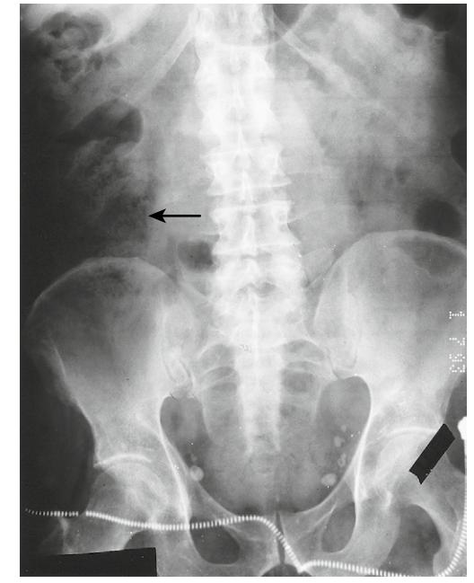
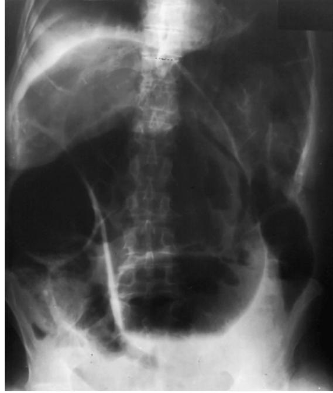
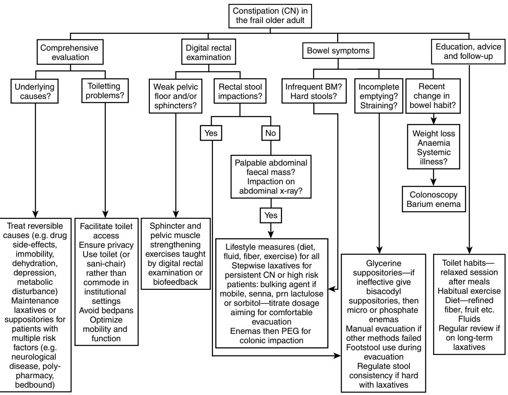

# Constipation and Fecal Incontinence in Old Age

Danielle Harari

This chapter describes the epidemiology, risk factors, clinical presentation, assessment, and treatment of constipation and fecal incontinence (FI) in older adults. Data sources were a PUBMED/MEDLINE database was searched (1966 to 2008) for relevant abstracts and papers using the following keywords: constipation, impaction, anal, bowel, faecal, fecal, incontinence, urinary, laxatives, enemas, suppositories, and other relevant phrases such as "comprehensive geriatric assessment," "stroke," etc. Additional articles were identified by examining reference lists, Cochrane, and other recent systematic reviews. Levels of evidence are as used by the U.S. Preventive Task Force1:

- Good evidence: Level 1- consistent results from well-designed, well-conducted studies
- Fair evidence: Level 2 results show benefit, but strength limited by number, quality, or consistency of studies
- Poor evidence: Level 3 insufficient because of limited number, power, or quality of studies

# **INTRODUCTION**

Fecal incontinence (FI) in older people is a distressing and socially isolating symptom and increases the risk of morbidity,2,3 mortality,4,5 and dependency.3,5 Many older individuals with FI will not volunteer the problem to their general practitioner or nurse. Regrettably, health care providers do not routinely inquire about the symptom, which is why it is a routine prompt in a standard comprehensive geriatric assessment. This "hidden problem" can lead to a downward spiral of psychological distress, dependency, and poor health. The condition can especially take its toll on informal caregivers of home-dwelling patients,6 with FI being a leading reason for requesting nursing home placement.7,8 Even when older people are noted by health care professionals to have FI, the condition is often managed passively (e.g., pads provision without assessment). Current surveys show limited awareness of appropriate assessment and treatment options among primary care physicians.9 The importance of identifying treatable causes of FI in frail older people is strongly emphasized in national and international guidance,8,10,11 but audit shows that adherence to such guidance is generally poor, with nonintegrated services, and suboptimal delivery by professionals of even basic assessment and care.12,13

Constipation is a common concern for adults as they age beyond 60, reflected by a notable increase in primary care consultations and burgeoning laxative use. Older people reporting constipation are more likely to have anxiety, depression, and poor health perception. Qualitative studies show they feel doctors can be dismissive about the problem, and that useful and empathic professional advice is hard to find,14 and this is confirmed in primary care studies where GPs view constipation as less important than other conditions (such as

diabetes).15 Clinical constipation in frail individuals can lead to significant complications such as fecal impaction, FI, and urinary retention precipitating hospital admission. Constipation and FI are costly conditions, with high expenditure including laxative spending and nursing time.6 For instance, it is estimated that 80% of community nurses working with older people in the United Kingdom are managing constipation (particularly fecal impaction) as part of their case-load.

# **DEFINITIONS**

The WHO International Consultation on Incontinence defines FI as "involuntary loss of liquid or solid stool that is a social or hygienic problem.11" There is, however, a lack of standardization in defining FI in published prevalence studies hindering cross-study comparisons. Most community-based studies examine prevalence of FI occurring at least once over the previous year, which may overestimate prevalence, but does also provide the upper limit for FI occurrence. Nursing home studies mostly measure weekly or monthly occurrence. Systematic reviews examining FI prevalence have highlighted the need for consensus on definitions.16,17

Definitions of constipation in older people in medical and nursing literature have also been inconsistent. Studies of older people have defined constipation by subjective self-report, specific bowel-related symptoms, or by daily laxative use. Self-reported constipation (e.g., "Do you have recurrent constipation?") often means different things to different individuals.15 It is now increasingly required in both clinical practice and research to use standardized definitions for constipation based on specific symptoms (Rome II and III criteria)18–20 (Table 108-1). Important constipation subtypes affecting older people such as rectal outlet delay are easier to identify by using standard definitions.18,20 Rome criteria are symptom-based: objective assessment relies on finding fecal loading in the rectum and/or colon. Such objective assessment is particularly important in frail older people in whom constipation can be underestimated (Table 108-2).

# **PREVALENCE OF CONSTIPATION AND CONSTIPATION-RELATED SYMPTOMS**

Constipation is a hugely prevalent problem in older people. Approximately 63 million people in North America meet the Rome II criteria for constipation, with a disproportionate number being over 65 years old.21 Age is strongly associated with nonspecific self-reporting of constipation.22–24 It is therefore striking that the report of infrequent bowel movements (≤ 2 per week) is no more prevalent in older than younger people in community-based studies:

• Only 1% to 7% of both younger and older people report ≤ 2 bowel movements a week.22,24,25

- This consistent bowel pattern across age groups persists even after statistical adjustment for greater laxative use among older people.22
- Of older people complaining of constipation, less than 10% report ≤ 2 weekly bowel movements, and more than 50% move their bowels daily.24,26
- In contrast, two thirds have persistent straining and 39% report passage of hard stools.26

The symptoms predominantly underlying self-reported constipation in older people tend therefore to not be infrequent bowel movements, but straining and passing hard stools. Difficult rectal evacuation is a primary cause of constipation in older people. Twenty-one percent of community-dwelling people aged 65 and over have rectal outlet delay (Table 108-1),27 and many describe the need to self-evacuate.14,27 Two thirds of nursing home residents taking laxatives still report frequent straining.28 Among these frailer individuals, difficult evacuation can lead to recurrent rectal impaction and overflow. Fecal impaction was a primary diagnosis in 27% of acutely hospitalized geriatric patients admitted over the course of 1 year in the United Kingdom,29 and a survey of patients with FI found that fecal loading was present in 57% of older acute hospital inpatients and 70% of care home residents.30 Frail older people do have a higher prevalence of ≤ 2 weekly bowel

#### **Table 108-1. Definitions of Constipation**

#### **Definition**

#### **Constipation (Rome III criteria)**

Two or more of the following symptoms present on more than 25% of occasions for at least 12 weeks in the last 12 months: 2 or less bowel movements per week

Straining at stool

Hard stools

Feeling of incomplete evacuation

#### **Rectal outlet delay (Rome II criteria)**

- Feeling of anal blockage at least a quarter of the time and Prolonged defecation (>10 minutes to complete bowel movement); or
- Need for self-digitation (pressing in or around the anus to aid evacuation) on any occasion

#### **Clinical constipation**

Large amount of feces (hard or soft) in rectum on digital examination and/or

## Colonic fecal loading on abdominal radiograph

## **Table 108-2. Factors Potentially Leading to Underestimation of Constipation and FI in Frail Older People**

Frail older people may:

- Be unable to report bowel-related symptoms due to communication or cognitive difficulties
- Have regular bowel movements despite having rectal or colonic fecal impaction
- Have impaired rectal sensation and inhibited urge to go and so be unaware of rectal stool impaction
- Have nonspecific symptoms associated with colonic fecal impaction (e.g., delirium, anorexia, functional decline)
- Be less likely to have symptoms of urgency associated with FI and more likely to have passive leakage

movements, affecting one third of care home residents reporting constipation.31 Up to 80% of care home residents are constipated according to Rome III criteria,32 a surprising figure considering that 50% to 74% of long-term care residents use daily laxatives.31,32

# **PREVALENCE OF FECAL INCONTINENCE IN OLDER PEOPLE**

Table 108-3 summarizes data on prevalence and risk factors in FI. Meta-regression analysis of prevalence studies in community-dwelling people shows that age has a significant influence on rates of solid and liquid FI.17 Prevalence is equal between genders in older people, except in the care home setting where it is greater in men.33–36 One prospective study conducted in French nursing home residents4 found a baseline FI prevalence of 54%, and a 10-month incidence in those continent at baseline of 20%. New-onset FI was transient (<5 days) in 62%, and long-standing in 38%. In the latter group, 1-year mortality was 26% compared with 7% in those who remained continent. The prevalence of FI varies according to the general health of the study population and therefore by proxy to the study setting:

- Community: 6% to 12% age over 65 and 18% to 29% age over 805,6,33,37–41
- Acute hospital: 14% to 33% age over 6542,43
- Long-term care: 37% to 54%.4,31,35,36,42

Of note, United Kingdom care home studies have shown wide variations in prevalence between individual homes,35,41 that may well be more reflective of different standards of care, rather than of different patient characteristics.

These prevalence data represent case-finding statistics within epidemiologic studies, but in real clinical settings FI is often overlooked. This is through both older people not help-seeking ("it is embarrassing" and "nothing that can be done"), and providers not case-finding and not following through when the problem is identified. Less than 50% of home-dwelling older people with FI (or their caregivers) have discussed the problem with a health care professional in British primary care surveys.44 Younger women are more likely to seek help for less severe FI symptoms than older women,45 yet even in younger cohorts in most cases of FI are still unrecognized by GPs.46 Poor provider awareness of FI is just as prevalent in institutions despite greater opportunity for patient observation. In the acute hospital setting, only 1 in 6 of patients reporting FI have the symptom documented by ward nursing staff,47 and care home nursing staff are aware of FI in only half of those residents self-reporting the condition.31 Professional ignorance about how to treat FI may in part underlie this: a recent UK care home survey found that trained staff cited advanced age as the main cause of both urinary and fecal incontinence.48 Auditing bowel care in care homes to improve quality of care may seem a solution but this proved challenging in a recent United Kingdom high profile nationwide audit of urinary and fecal incontinence care in older people.13 Many care homes declined participation, and those who did partake generally reported hampered data collection due to limited access to clinical records and information technology, and staff shortages. The audit did however show that patients admitted to

#### **Table 108-3. Epidemiology of FI in Older People and Recommendations for Identifying Cases**

#### **Epidemiologic Data Summary**

- FI affects 1 in 5 older people (aged 65 and over) living in the community, and half of those resident in care homes.1
- Prevalence of FI increases with age alone, particularly in the eighth decade and beyond.1
- The prevalence of FI is higher in the acute hospital and nursing home setting than in the community,1 thus the group most affected is frail older people.
- The prevalence of FI in frail older people is equal to or greater in men than women.2 This predominance of older men over women with FI is most striking among nursing home residents.2
- The prevalence of FI varies dramatically between institutions in nursing home studies.2
- FI coexists with urinary incontinence in the majority of frail older people.1
- Aside from age, the following are primary risk factors for FI in older people2:
	- Loose stool
	- Impaired mobility
	- Dementia
	- Neurologic disease
	- Chronic medical conditions
	- Depression
- Fecal loading and constipation are clinically linked to FI, but there is little epidemiologic work assessing this association.
- Physicians and nurses in primary care, acute hospital, and long-term health care settings do not have a high awareness of FI in older people.2 • Within nursing homes, there is a low rate of referral by nursing staff of residents to primary care physicians or continence nurse specialists for further assessment of FI2 and there is a tendency toward passive management (e.g., use of pads only without further evaluation).2 Fecal loading is often present in older care home residents with FI.2
- Older people may be reluctant to volunteer the symptoms of FI to their health care provider2 for social or cultural reasons, or due to a popular
- misperception that the condition is part of the aging process and therefore "nothing can be done about it."
- FI is associated with reduced quality of life and poor health perception.2

#### **Recommendations: Identifying FI in Older People**

- Bowel continence status should be established by direct questioning and/or direct observation in:
	- All nursing and residential home residents
	- Hospital inpatients aged 65 and over
	- People aged 80 and beyond living at home
	- Older adults with impaired mobility
	- Older adults with impaired cognition
	- Older adults with neurologic disease
	- Older adults with chronic disease
- Primary care staff, hospital ward staff, and long-term care staff should routinely inquire about fecal incontinence in frail older patients.
- Inquiry about FI should be systematic and include stool consistency, severity of FI, and impact on activities of daily living and quality of life.
- Health care providers should be sensitive to cultural and social barriers discouraging patients from talking about the condition.
- Frail older patients with restricted ability to access primary care, such as nursing home residents, and those with mobility, chronic illness, or cognitive impairments, should be screened for FI through systematic case-finding methods.
- Systematic outreach program that make it easier for frail older people and those who care for them to volunteer the problem to their primary care provider should be implemented.
- There are significant geographic variations in provision of specialist expertise in bowel care (both medical and nursing) nationally and globally, which may affect case-finding in older people.
- Further examination of underlying reasons for the variations in prevalence of FI between nursing homes (standards of care, patient case-mix, reporting) is needed.
- Urinary and fecal incontinence often coexist; continence care workers (e.g., nurse specialists) should be trained in identification and management of fecal and urinary incontinence in older people.
- Key requirements to improving detection in the practice setting should be implemented:
- Education of health care workers to embed both a sense of value in identifying FI, plus confidence that the condition can be treated
	- Protocols should be in place clarifying all details of screening inquiry (who will ask, how to ask, when to ask, and who to ask)
- Patients and caregivers should have access to educational materials at the point of inquiry

these care homes with preexisting FI tended to be placed on a containment management plan rather than being assessed for causes and possible treatment, and this was despite having good access to continence specialist care. On a similar theme, a recent U.S. National Institutes of Health State-ofthe-Science Statement commented that health care provider education alone is not enough to improve the identification of adults with FI and recommended key requirements to improve detection in the practice setting (Table 108-3).8

# **RISK FACTORS FOR FI AND CONSTIPATION IN OLDER PEOPLE**

Urinary incontinence is strongly linked to FI, with 50% to 70% coexistence in community-based studies.2,34,39,49 Perhaps unsurprisingly, diarrhea or loose stool is a strong predictor for FI in all settings, but what is striking is the prevalence of chronic diarrhea in frail older people.2,6,36,41 Medical comorbidity and physical disability are equivalent or greater than age in strength of assocation.2,3,6,34,49 A cohort study of community-dwelling patients aged 65 and over found that severe FI (at least once weekly) was associated with increased mortality after 42 months, independent of age, gender, and poor general health.5 Depression is repeatedly linked, though cause or effect is clearly impossible to discern from cross-sectional analyses.2,49,34 Independent factors for FI in acutely hospitalized patients (in order of strength of association) are loose/liquid stool consistency, illness severity, and older age.43 In elderly hospital inpatients, contributing factors are fecal loading (57%), functional disability (83%), loose stools (67%), and cognitive impairment (43%)30; those with loose stools and less comorbidity are more likely to have transient FI with resolution after 3 months.

Most risk factor studies for constipation are cross-sectional, but one prospective study examined baseline characteristics predictive of new-onset constipation (≤ 2 bowel movements per week or persistent straining) in elderly U.S. nursing home patients.50 Seven percent (n = 1291) developed constipation over a 3-month period. Independent predictors were poor consumption of fluids, pneumonia, parkinson's disease, decreased bed mobility, greater than 5 medications, dementia, hypothyroidism, white race, allergies, arthritis, and hypertension (the latter 3 conditions were postulated to be associated primarily because of the constipating effect of drugs used to treat them). What is evident is that many of these factors are potentially modifiable. Table 108-4 summarizes practice guidance in constipation based on the epidemiologic data described below.

## **Reduced mobility**

Greater physical activity (including regular walking) is associated with less constipation symptoms in older people living at home.23,51 Reduced mobility is the strongest independent correlate (following adjustment for age and comorbidities) of heavy laxative use among nursing home residents,52 and gut transit time in bedridden elderly subjects can be as long as 3 weeks.53 Exercise increases colonic propulsive activity ("joggers diarrhea"), especially when measured postprandially.54 In a survey of younger women (36 to 61 years), daily physical activity was associated with less constipation (≤ 2 bowel movements per week), and the association strengthened with increased frequency of physical activity.55 This leads to speculation that increasing physical activity in adulthood may reduce the likelihood of constipation problems in older age. Epidemiologic studies in older people have repeatedly shown that poor mobility is also a strong risk factor for FI after adjustment for other variables.3,4,6,34,36

## **Polypharmacy/drug side effects**

Polypharmacy itself increases the risk of constipation in older patients, particularly in nursing homes where each individual takes an average of six prescribed medications per day.53 Certain drug classes are particularly implicated. Anticholinergic medications reduce contractility of the smooth muscle of the gut via an antimuscarinic effect at acetylcholine receptor sites, and in some cases (e.g., patients with schizophrenia taking neuroleptics), long-term use may result in chronic megacolon. Anticholinergic medications have been independently associated with daily laxative use in nursing home studies,53 symptomatic constipation in community-dwelling older U.S. veterans,56 and FI in elderly stroke survivors.57 Although older people are certainly susceptible to the constipating effects of opiate analgesia, a study of nursing home residents with persistent nonmalignant pain showed equivalent constipation rates in chronic opiate users and nonusers over a 6 month period; those taking opiates showed improved function and social engagement.58 Chronic pain is often undertreated in frailer older people, possibly through fear of adverse effects of analgesic drugs, so it is important to note that constipation in this context can be effectively managed by laxative and suppository coprescribing. Transdermal patches (e.g., fentanyl) are associated with lower constipation risk than sustained-release oral morphine.59 All types of iron supplements (sulfate, fumarate,

#### **Table 108-4. Practice Guidance for Constipation Based on Epidemiologic Evidence**

#### **Screening**

- Constipation symptoms should be routinely asked about in patients aged 65 and over in view of the high prevalence of the condition in this population.
- Men and women in their eighth decade and beyond should be regularly screened for constipation symptoms, as prevalence increases with advancing age.
- Periodic objective assessment for constipation in elderly nursing home residents should be incorporated into routine nursing and medical care. Patients unable to report symptoms due to cognitive or communication difficulties should be especially targeted. Such an assessment should occur at minimum every 3 months (3 monthly incidence rate of new-onset constipation is 7% in nursing home residents), and optimally monthly.

#### **Identifying Risk Factors**

- The identification of risk factors for constipation in older people is critical to effectively managing the condition.
- The following are risk factors for constipation in older people: Polypharmacy (5 medications)2
- Anticholinergic drugs (tricyclics, antipsychotics, antihistamines, antiemetics, drugs for detrusor hyperactivity)1
- Opiates2
- Iron supplements3 Calcium channel antagonists (nifedipine and verapamil)2
- Calcium supplements2
- Nonsteroidal antiinflammatory drugs2
- Impaired mobility2

Nursing home residency2

- Dementia2
- Parkinson's disease1
- Diabetes mellitus1 Autonomic neuropathy2
- Stroke3

Spinal cord injury or disease1

- Depression3
- Dehydration2
- Low dietary fiber3
- Hypothyroidism
- Hypercalcemia Hypokalemia
- Uremia
- Renal dialysis3
- Mechanical obstruction (e.g., tumor, rectocele)
- Lack of privacy or comfort
- Poor toilet access3
- Systematic identification of multiple risk factors in vulnerable older people with constipation should be incorporated into good practice guidelines in all health care settings
- Patients at increased risk of constipation from recognized comorbidities (e.g., Parkinson's disease, diabetes) should be regularly assessed for the condition

#### **Assessment**

- Identifying specific bowel symptoms in older individuals reporting constipation is important to guide appropriate management of this common complaint.
- Reduced bowel movement frequency is not a sensitive symptom indicator for constipation in community-dwelling older people, though it is specific.
- Difficulty with evacuation and rectal outlet delay are primary symptoms in older individuals.
- An objective assessment should be undertaken in frail older people with constipation because these patients are at increased risk of developing complications.
- Increased wandering and agitation in patients unable to communicate due to dementia should prompt an assessment for constipation.
- Older patients being prescribed laxatives on a daily basis should be regularly reviewed for symptoms of constipation and rectal outlet delay, and treatment should be appropriately adjusted.

and gluconate) cause constipation in adults, the constipating factor being the amount of elemental iron absorbed.60 Slowrelease preparations have a lesser impact on the bowel because they carry the iron past the first part of the duodenum into an area of the gut where elemental iron absorption is poorer. Intravenous iron does not cause constipation and can be an alternative in patients with chronic anemia (e.g., chronic kidney disease) who become constipated on oral iron. Constipation was the main side effect in a 5-year study of calcium supplementation in older women (treatment 13.4% versus placebo 9.1%).61 Calcium supplementation reduced bone turnover and fracture rates in women who took it, but long-term compliance was poor, and constipation may have contributed to this. Calcium channel antagonists impair lower gut motility, particularly in the rectosigmoid.62 Severe constipation has been reported in older patients taking calcium channel antagonists, with nifedipine and verapamil being the most potent inhibitors of gut motility within this class. Nonsteroidal antiinflammatory drugs (NSAIDs) increase the risk of constipation in older people, most likely through prostaglandin inhibition. In a large primary care study, constipation and straining were more prevalent reasons for stopping NSAIDs than dyspepsia.63 NSAIDs have also been implicated in increasing the risk of stercoral perforation in patients with chronic constipation. Aluminium antacids have been associated with constipation in both nursing home52 and community settings.64

## **Dietary factors**

Low consumption of fiber in the form of wheat bran, vegetables, and fruit predisposes toward constipation, and in the United Kingdom, consumption of all of these decreases with advancing age. Community studies of older Europeans who eat a Mediterranean diet rich in fruit, vegetables, and olive oil show lower rates of constipation (4.4% in people aged 50 and over).65 A study of nutritional factors within all the nursing homes in Helsinki found an association between malnutrition and constipation.66 This may be two-way in that marked constipation can cause anorexia, whereas low calorie intake can promote constipation. Constipation is a recognized problem in patients receiving enteral nutrition. A prospective survey of older hospitalized patients receiving nasogastric tube feeding identified constipation as a complication of treatment in 30% of patients.67 Enteric feeding products containing fiber are available, though there are no data on whether constipation is any less of a problem with their use.

Low fluid intake in older adults has been related to symptomatic and slow-transit constipation.50,68 Withholding fluids over a 1-week period in young male volunteers significantly reduced stool output.69 Elderly people are generally at risk of dehydration because of:

- Impaired thirst sensation
- Less effective hormonal responses to hypertonicity
- Limited access to drinks because of coexisting physical or cognitive impairments
- Voluntary fluid restriction in an attempt to control urinary incontinence

Population studies have suggested that alcohol consumption is a preventive factor for constipation symptoms in both men and women.51,55

# **Diabetes mellitus**

Over half of diabetic outpatients report constipation symptoms, with neuropathy symptom scores correlating with laxative usage and straining.70 Diabetic autonomic neuropathy can result in slow colonic transit and impairment of the gastrocolic reflex.71 However, one third of diabetic patients with constipation do not have neuropathic symptoms,70 so unrelated reversible factors (e.g., drugs, mobility, fluids) should be considered, particularly in older people. Colonic transit time in frail older people with diabetes and constipation is extremely prolonged at a mean of 200 hours.72 Administering acarbose, an alpha-glucosidase inhibitor with a potential adverse effect of causing diarrhea significantly reduced transit in these patients.72 Diabetes is a risk factor for the development of FI, especially in men.73 FI may occur through mechanisms of1 bacterial overgrowth resulting from prolonged gut transit causing characteristic nocturnal diarrhea and2 multifactorial anorectal dysfunction (reduced basal and squeeze pressures, spontaneous relaxation of the internal anal sphincter, reduced rectal compliance, abnormal rectal sensation).71,74 Acute hyperglycemia can further inhibit anorectal function and colonic peristalsis.

# **Neurologic diseases**

Patients with Parkinson's disease (PD) suffer from multiple primary pathologies that lead to constipation:1 dopaminergic neuron degeneration and increased presence of Lewy bodies in the myenteric plexus prolonging colonic transit (independent of age, physical activity, medications),75,2 pelvic dyssynergia causing rectal outlet delay and prolonged straining,75,3 and small increases in intraabdominal pressures on straining. Constipation can become prominent early in the course of the disease, even before motor symptoms developing. In a 24-year longitudinal study, less than one bowel movement a day was associated with a threefold risk of future PD in men.76 Fifty-nine percent of PD patients report constipation according to Rome criteria, with 33% being very concerned by their bowel problem.77 Antiparkinsonian drugs may further exacerbate constipation. Pelvic dyssynergia affects 60% of people with PD, and may be hard to treat. Botulinum toxin injected into the puborectalis muscle has been used to improve rectal emptying in PD patients with good effect, though repeat injections every 3 months are required to maintain clinical benefit.78

Dementia predisposes individuals to rectal dysmotility,29 partly through ignoring the urge to defecate. Epidemiologic studies show a significant association between cognitive impairment and nurse-documented constipation in nursing home residents. Patients with non-Alzheimer's dementias (PD, Lewy body, vascular dementia) compared with those with Alzheimer's are more likely to suffer from constipation as part of autonomic symptoms.79 Constipation in long-term care residents unable to communicate due to dementia has been linked to physically aggressive behavior80 and development of wandering behavior81 by independent association.

Depression, psychological distress, and anxiety are all associated with increased self-reporting of constipation and with FI in older persons. The symptom of constipation can also be somatic manifestation of psychiatric illness. A careful assessment is required to differentiate subjective complaints from clinical constipation in depressed or anxious patients.

Constipation affects 60% of those recovering from stroke on rehabilitation wards,82 and a high number of these have combined rectal outlet delay and slow transit constipation.83 Major FI is 4½ times more prevalent in stroke survivors than the nonstroke population.84 FI may develop months after acute stroke and can be transient, consistent with constipation with overflow as one possible cause.57 Epidemiologic data suggest that FI is associated more with disability-related factors (particularly functional difficulties in using the toilet, and anticholinergic medications) than stroke-related factors (e.g., severity and lesion location).57,84,85 Weak abdominal and pelvic muscles following stroke also contribute to problems with evacuation.

## **Metabolic disorders**

Hypokalemia and hypomagnesemia produce neuronal dysfunction that minimizes acetylcholine stimulation of gut smooth muscle, and so prolongs transit through the gut. This should especially be looked for and corrected in acute colonic pseudo-obstruction. Hypercalcemia causes conduction delay within the extrinsic and intrinsic gut innervation of the gut neuromuscular bowel dysfunction (which may be reversed following parathyroidectomy). Constipation is not an unusual presentation for clinical hypothyroidism, particularly in older women. Patients on long-term renal hemodialysis have prolonged age-adjusted transit time86; 63% complain of constipation, with important contributors being high (49%) use of resin to prevent hyperkalemia, suppression of the defecation urge while undergoing dialysis, and low fiber intake.87 Resin administration can increase the risk of impaction in frail older patients also.

## **Colorectal cancer**

Following adjustment for age and potential confounders, ≤ 2 reported bowel movements a week was associated with a greater than twofold risk of colon cancer in a U.S. study, with the association being stronger in women than men; no association was seen with laxatives.88 Comparing underlying causes for FI in younger and older men shows colon and prostate cancer to be significantly more common in the older group,89 so the index of suspicion for colorectal cancer should be higher in older adults with bowel symptoms.90

## **Diverticular disease**

A case-control study of patients (mean age 68) with acute uncomplicated diverticulitis showed 74% to have prolonged transit.91 Left-sided diverticulosis coli affects 30% to 60% of people over the age of 60 in developed countries. High intraluminal pressures while straining at stool in people who have a low fiber diet contributes to the cause of the condition.

# **PATHOPHYSIOLOGY OF CONSTIPATION AND FI IN OLDER PEOPLE**

Physiologic studies suggest that changes in the lower bowel predisposing toward constipation in older people are not primarily age-related. This is compatible with the epidemiology showing that bowel movement frequency does alter with aging, and that constipation symptoms are more prevalent in older people with comorbidities. Extrinsic causes such as reduced mobility, fluid intake, dietary fiber, comorbidities, and medication all impact colonic motility and transit, and influence the pathophysiology of constipation. Studies of anorectal function do, however, show age-related changes predisposing to FI.

# **Colonic function**

Colonic motility depends on the integrity of the central and autonomic nervous systems, gut wall innervation and receptors, circular smooth muscle, and gastrointestinal hormones. Propagating motor complexes in the colon are stimulated by increased intraluminal pressure generated by bulky fecal content. Studies of total gut transit time (passage of radiopaque markers from mouth to anus, normally 80% passed within 5 days), colonic motor activity, and postprandial gastrocolic reflex show no differences between healthy older and younger people.92–94 Conversely, older people with chronic constipation do have prolonged transit of up to 9 days.92,95 Markers pass especially slowly through the left colon with striking delay in the rectosigmoid, suggesting that total transit time is prolonged because of segmental dysmotility in the hindgut.96 The prolongation is even greater in institutionalized or bedridden older patients with constipation, with transit time ranging from 6 to greater than 14 days.53 Slow transit results in a cycle of worsening constipation by reducing stool water content (normally 75%) and shrinking fecal bulk, which then diminishes intraluminal pressures, and hence the generation of propagating motor complexes and propulsive activity. Aging is associated with some intrinsic physiologic mechanisms that may alter colonic function, predisposing older people to this "constipation cycle":

- Reduced number of neurons in the myenteric plexus and impaired response to direct stimulation,96,97 leading to intrinsic myenteric dysfunction
- Increased collagen deposit in left colon leading to altered compliance and motility97
- Reduced amplitude of inhibitory junction potentials and hence inhibitory nerve input to circular colonic muscle causing segmental motor incoordination98
- Increased binding of plasma endorphins to gut receptors after age 6099

# **Anorectal function**

In normal defecation, colonic activity propels stool into the rectal ampulla causing distention and reflexic intrinsically mediated relaxation of the smooth muscle of the internal anal sphincter (or anal canal). This is followed promptly by reflex contraction of the external anal sphincter and pelvic floor muscles, which are skeletal muscles innervated by the pudendal nerve. The brain registers a desire to defecate, the external sphincter is voluntarily relaxed, and the rectum evacuated with assistance from abdominal wall muscle contraction. There is a tendency toward an age-related decline in internal sphincter tone and thickness particularly beyond the eighth decade.94,100–102 This reduction in internal anal sphincter pressure lowers the threshold for balloon (stimulated stool) expulsion, and is much more notable in frail older people with FI.103,104 There is a clear age-related decline (greater in women than men) in external anal sphincter and pelvic muscle strength,100,101 which may contribute to both incontinence and evacuation difficulties. Rectal motility appears to be unaffected by healthy aging,94 but an age-related increase in anorectal sensitivity thresholds, and reduced rectal compliance has been observed, starting at an earlier age in women than men.105 Patients with dementia and FI tend to exhibit multiple uninhibited rectal contractions in response to rectal distention.103 Younger women with FI are more likely to have isolated anal sphincter defects (often child-bearing related),106 whereas the anorectal pathology is more multifactorial in older women, including pudendal neuropathy, hemorrhoidectomy, diabetes, and rectal and vaginal prolapse.45,107 Failure of the anorectal angle to open and excessive perineal descent in older women can also lead to constipation,97 and consequent prolonged straining may compress the pudendal nerve further exacerbating any preexisting neuropathy. Table 108-5 describes the three main types of anorectal dysfunction that predispose older people to rectal outlet delay.

## **CLINICAL EVALUATION**

The causes of FI and constipation in older people are usually multifactorial. Comprehensive geriatric assessment (evaluating medical, functional, and psychosocial factors in addition to the bowel) is key to identifying all contributing causes and developing a goal-focused management plan. There is much room for improving standards of bowel assessment in older people in current routine practice; surveys indicate a lack of thoroughness by doctors and nurses in all settings, with failure to obtain an accurate symptom history or to perform rectal examinations.13,108 A recent U.K. audit in older patients with FI in primary care, acute hospital, and care home settings showed that only 50% of individuals within each setting had a history taken, only 22% to 33% had a basic examination documented (history and rectal), and cause(s) for FI was documented in only 27% to 49%, the 27% being in the acute hospital sector.13

## **Clinical history**

It is helpful to have patients or caregivers keep a stool chart for 1 week to document bowel pattern and episodes of FI. Self-report of bowel symptoms are generally reliable and reproducible in older cohorts, including those in long-term care.109–111 Proxy responses by informal caregivers for questions concerning FI have also been shown to concord well with index responses given by older patients.112

Documentation of stool consistency is diagnostically critical8 for both FI and constipation, and the pictorial Bristol stool chart is commonly used to aid patients in describing their stool. Overflow fecal incontinence typically presents as frequent passive leakage of watery stool, sometimes confusing patients and caregivers (and occasionally health care providers) into thinking they have "diarrhea" rather than constipation. Patients with anal sphincter dysfunction tend to leak small amounts of stool, with urgency before leaking where external anal sphincter weakness predominates, and more passive (unconscious) leakage when internal sphincter dysfunction is the main cause.113 Fecal urgency and/or loose stool should prompt investigation for diarrheal disease (see FI treatment). Patients with dementia-related incontinence tend to pass complete formed bowel movements, usually after meals. A recent history of altered bowel habit should prompt an exploration of precipitants (e.g., medications, stroke), and where unexplained, an evaluation for colorectal cancer. Abdominal pain, rectal bleeding, and certainly any systemic features such as weight loss and anemia should prompt further investigations for underlying neoplasm. IBS should be a diagnosis of exclusion in older people, and only made in those with a long history of IBS symptoms (Table 108-6). Abdominal pain is a warning symptom for constipation complications such as impaction with obstruction, stercoral perforation, sigmoid volvulus, or urinary retention. Rectal pain associated with defecation in older people may be due to rectal ischemia and other more common anorectal conditions. Urinary incontinence and lower urinary tract symptoms (frequency, urgency, straining and hesitancy, dysuria, nocturia) frequently coexist with FI and constipation107,114 and should be characterized, and urinanalysis and postvoid bladder residual volume measurement (preferably by hand-held scan) undertaken if present.

## **Fecal impaction**

In frail patients, fecal impaction may present as a nonspecific clinical deterioration; more specific symptoms are anorexia, vomiting, and abdominal pain. Findings on physical

**Table 108-5. Types of Anorectal Dysfunction Causing Rectal Outlet Delay in Older People**

|                             | Pathophysiology                                                                                     | Clinical Picture                                                                                                                                                                                                                                                  |
|-----------------------------|-----------------------------------------------------------------------------------------------------|-------------------------------------------------------------------------------------------------------------------------------------------------------------------------------------------------------------------------------------------------------------------|
| Rectal dysmotility          | Reduced rectal motility and contractions Increased rectal compliance                             | Rectal hard or soft stool retention on digital examination of which patient may be unaware                                                                                                                                                                     |
|                             | Variable degree of rectal dilation Impaired rectal sensation with blunting of urge to            | Chronic rectal distention leads to relaxation of the internal sphincter and fecal soiling                                                                                                                                                                      |
|                             | pass stool                                                                                          | One postulated cause is diminished parasympathetic outflow as a                                                                                                                                                                                                   |
|                             | Over time, increasing rectal distention required to reflexively trigger the defecation mechanism | result of impaired sacral cord function (e.g., from ischemia or spinal stenosis). May also develop through persistent disregard or suppression of the urge to defecate as a result of dementia, depression, immobility, or painful anorectal conditions. |
| Pelvic floor dyssynergia | Paradoxical contraction or failure to relax the                                                     | Severe and longstanding symptoms of rectal outlet delay                                                                                                                                                                                                           |
|                             | pelvic floor and external anal sphincter muscles                                                    | Parkinson's disease                                                                                                                                                                                                                                               |
|                             | during defecation                                                                                   | More common in younger women                                                                                                                                                                                                                                      |
|                             | Manometric studies show paradoxical increases in anal canal pressure on straining                |                                                                                                                                                                                                                                                                   |
| Irritable bowel             | Increased rectal tone and reduced compliance                                                        | Usually constipation-predominant in older people                                                                                                                                                                                                                  |
| syndrome (IBS)              | Lower pain threshold on distending the rectum during anorectal function tests                    | Rome criteria symptoms: abdominal distention or pain relieved by defecation, passage of mucus, and feeling of incomplete emptying                                                                                                                           |

## **Table 108-6. Diagnosis of Constipation and FI in Older People**

#### **Bowel History**

Number of bowel movements per week Stool consistency Straining/symptoms of rectal outlet delay Fecal incontinence/soiling - frequency Duration of constipation symptoms or FI Irritable bowel syndrome symptoms (abdominal pain, bloating, passage of mucus) Rectal pain or bleeding Laxative use, prior and current Psychological and quality of life impact of bowel problem Urinary incontinence/lower urinary tract symptoms Pad use and laundry changes **General History** Mood/cognition Symptoms of systemic illness (weight loss, anemia)

Relevant comorbidities (e.g., diabetes, neurologic disease) Mobility Diet Medications

Toilet access (location of bathroom, manual dexterity, vision)

#### **Specific Physical Examination**

Digital rectal examination including external and internal sphincter tone Perianal sensation/cutaneous anal reflex Rectal prolapse/hemorrhoids Pelvic floor descent/rectocele Abdominal palpation, auscultation Postvoid residual volume Neurologic, cognitive, and functional examination **Tests**

### **Indications for plain abdominal radiograph**

Empty rectum with clinical suspicion of fecal impaction Persistent fecal incontinence despite clearing of any rectal impaction Evaluation of abdominal distention, pain, or acute discomfort Persisting complaints of constipation with increasing laxative usage Indications for colonoscopy Systemic illness (weight loss, anemia, etc.) Bleeding per rectum Recent change in bowel habit without obvious risk factors Indications for anorectal function tests Severe or persistent symptoms of rectal outlet delay, suggesting pelvic dyssynergia

Persistent FI with preserved anorectal sensation and clinically weak anal sphincter

examination may include fever, delirium, abdominal distention, reduced bowel sounds, arrhythmias, and tachypnea secondary to splinting of the diaphragm. The mechanism for the fever and leucocytosis response is thought to be microscopic stercoral ulcerations of the colon. A plain abdominal radiograph will show colonic or rectal fecal retention associated with lower bowel dilation (Figure 108-2). Presence of fluid levels in the large or small bowel suggests advanced obstruction; the closer the fecal impaction is to the ileocecal valve, the greater the number of fluid levels seen in the small bowel.

# **Rectal and pelvic examination**

Stool impaction on digital rectal examination does not have to be hard; soft stool retention is commonly seen in older people taking laxatives who have problems with rectal outlet delay. Absence of stool on rectal examination does not exclude the diagnosis of constipation.23 A dilated

Figure 108-1. Abdominal radiograph of a 73-year-old man with chronic schizophrenia who has taken anticholinergic neuroleptics for many years. This was his third hospital admission for colonic impaction. The arrow points to the cecum, which is full of stool, indicative of slow transit. Fecaliths are visible in the pelvic region.

rectum with diminished sensation and retained stool suggests rectal dysmotility. Digital assessment of squeeze and basal tone has been shown to be as sensitive and specific as manometry in discriminating sphincter function between continent and incontinent patients aged over 50.115 Easy finger insertion with gaping of the anus on finger removal indicates poor internal sphincter tone, whereas reduced squeeze pressure around the finger when asking the patient to "squeeze and pull up" suggests external sphincter weakness. Preserved sensation (urge to stool, awareness of wind) improves likelihood of response to anal strengthening maneuvers. Absent cutaneous-anal reflex (gentle scratching of the anal margin should normally induce a visible contraction of the external sphincter) and, in particular, perianal anesthesia points to sacral cord dysfunction with possible related gut neuropathy. Proctoscopy is a simple, quick, and useful test for diagnosing internal hemorrhoids, and abnormalities of the rectal wall.

Perineal examination is relevant in view of the association between urogenital prolapse (particularly rectocele) and FI in older women.107 An examination for posterior vaginal prolapse (bearing down in the gynecologic position) is appropriate in all women with constipation, especially those reporting incomplete rectal emptying. Excessive perineal descent is observed by asking the patient to bear down while lying in the lateral position. Normal perineal descent is less than 4 cm (can be eye-balled by drawing an imaginary line between that ischial prominences). Rectal prolapse may also be observed in this manner, though lesser degrees of prolapse may be only identified by having the patient strain while sitting on a toilet or commode. FI is a primary independent risk factor for pressure sores in older people,6,116 so

Figure 108-2. Abdominal radiograph of an 83-year-old man with Parkinson's disease and long-standing symptoms of continuous fecal leakage. As his caregiver at home, his wife was changing his clothing up to six times a day. The rectosigmoid colon is completely impacted, and the dilated bowel loop implies obstruction. He was briefly hospitalized for disimpaction with enemas and laxatives, resulting in complete resolution of incontinence. He and his wife were educated in regular use of laxatives and suppositories, and in lifestyle measures.

evaluation of skin integrity (with pressure ulcer risk assessment) is important.

Rectosigmoid fecal loading may impinge on the bladder neck causing a degree of urinary retention.117,118 Constipation increased the risk of urinary retention fourfold (other predictors being urinary tract infection and previous urinary retention) in hospitalized women aged 65 and over.118 Urinary symptoms of difficult voiding are unreliable in diagnosing retention in older people, so is good practice to do screening postvoid residual volumes in the setting of constipation and FI.

# **Plain abdominal x-ray**

Incontinent patients without evidence of rectal stool impaction should ideally undergo a plain abdominal radiograph to establish or rule out the diagnosis of overflow. Abdominal x-ray is required in the presence of abdominal pain or dilation to identify impaction with obstruction and more severe complications, such as sigmoid volvulus, colonic pseudoobstruction, and stercoral perforation.95 Acute colonic pseudo-obstruction (Ogilvie's syndrome) is most likely to occur in hospitalized frail older people with a history of chronic constipation who are acutely medically ill or postoperative. It occurs with abdominal distention and colonic dilation on x-ray, with a cecal diameter of ≥ 10 cm. Marked fecal loading in the descending and sigmoid colon correlates well with prolonged transit time, as does the presence of feces rather than air in the cecum (Figure 108-2). Dilation of the colon (>6.5 cm maximum diameter) in the absence

## **Table 108-7. Bowel Preparation in Older People**

- Older age, constipation, reported laxative use, tricyclic antidepressants, stroke, and dementia are associated with inadequate preparation and thus taking longer to instrument the cecum
- Even in those who take 75%–100% of their prescribed treatment, bowel preparation is satisfactory in only 50%

#### **Guidance**

- Give regular laxatives (e.g., Movicol 2 sachets daily) and enemas or suppositories for at least 1 week before the procedure, with a longer run up period in patients known to have constipation, or with comorbidities such as diabetes
- Individualize the cathartic regimen (e.g., 1–2 L of GoLYTELY daily over 2 to 3 days in those unable to drink 4 L, or use of alternative preparations such as sodium picosulfate)
- Identify potential nonadherence ("Can the patient drink 4 L of GoLYTELY in 24 hours?")
- Preempt unpleasant side effects ("Will the patient be able to reach the toilet in time to avoid fecal leakage?")
- Use oral phosphosoda with caution as administration in older people increases in serum phosphate, even in patients with normal creatinine clearance
- Consider preprocedure plain abdominal x-ray for evaluation of persisting fecal loading
- Where possible give clear fluid diet before administration of bowel preparation

of acute obstruction points to a neurogenic component to bowel dysfunction, and thus identifies patients at risk of recurrent colonic impaction. Rectal dilation (>4 cm) implies dysmotility and evacuation problems.

# **Colonoscopy/bowel preparation**

Chronic constipation alone is generally not considered an appropriate indication for colonoscopy; the range of neoplasia found is similar to that in asymptomatic patients undergoing primary colorectal cancer screening.119 A review of 400 colonoscopies in people aged 80 and over showed a good safety profile but low cancer detection rate for symptoms (e.g., constipation, abdominal pain) other than bleeding (2% versus 12%).120 Further investigation is of course warranted in the context of rectal bleeding, systemic illness, or laboratory abnormalities. Barium enema has now largely been superseded by colonoscopy in older patients. Colonoscopy causes significantly less discomfort than a barium enema and is diagnostically more sensitive. Inadequate colonoscopies are common in older people because of poor bowel preparation (Table 108-7).

# **Anorectal function tests**

Anorectal physiology tests are not generally required in older people with constipation or FI because they do not tend to alter the clinical examination conclusions or the management plan.121 They have a role in confirming pelvic dyssynergia in people with persistent rectal outlet delay, a condition amenable to biofeedback. Endoanal ultrasound or MRI measure the integrity of the anal sphincters and thus guide management of incontinence toward biofeedback therapy, or surgical intervention (sphincter reconstruction). This investigation is appropriate in those patients with clinically weak sphincters and preserved sensation whose FI persists after behavioral measures (pelvic floor exercises, loperamide).

## **Physical function and toilet access**

Functional FI can occur in individuals who are unable to access the toilet in time due to impairments in mobility, dexterity, or vision, but who may even have normal lower gut function. Withholding evacuation because of access problems can lead to constipation. Evaluation of toilet access should ideally be multidisciplinary and include assessment of function (e.g., Barthel Index), mobility (e.g., "timed upand-go"), visual acuity, upper limb dexterity (e.g., undoing buttons), and cognition. A practical assessment is to watch someone transfer and manage clothing on the toilet or commode. Toilet or commode design should be adapted to each individual (e.g., trunk support, adaptability, mobility, foot support).122 For patients with functional difficulties, the physical layout of their home in relation to the bathroom should be assessed (location, distance from main living area, width of doorway for accommodating walking aids, presence of grab rails or raised toilet seat, lighting levels).

## **Psychological impact/quality of life**

Constipation and FI affect quality of life, daily living, and morale in older people, even following adjustment for other chronic illnesses.40,123 The Patient Assessment of Constipation Quality of Life questionnaire is a self-report tool that has been validated in elderly long-term care residents (QOL scores correlate with abdominal pain and constipation severity).119 In routine practice, a person's attitude toward their bowel problem (positive, acceptance, denial, distress, apathy) and the impact on their quality of life (changes in usual family, social, physical, and work-related activities) should at least be included when taking a history.

# **TREATMENT OF CONSTIPATION IN OLDER PEOPLE Nonpharmacologic treatment**

The consultation between a general practitioner and an older person reporting constipation will more often than not result in a laxative being prescribed. Nursing home studies show high rates of self-reported constipation, despite very substantial levels of laxative prescribing. These observations suggest that nonpharmacologic treatments for constipation are underused. They should be first-line treatment in nonsevere constipation and combined with laxative treatment. A 1997 systematic review of nonpharmacologic treatment of chronic constipation in older people found no studies evaluating the effect of exercise therapy and only a few nonrandomized trials examining fiber and fluid supplementation,124 and there has been little further robust research in this area since then. Available data, expert opinion, and practical recommendations are summarized below.

#### **EDUCATION OF PATIENTS AND CAREGIVERS**

Educating patients as to what constitutes normal bowel habit is helpful, and those with no or mild symptoms of constipation should be encouraged to discontinue laxative therapy. Patients who do require laxative treatment for constipation should be advised to aim for regular, comfortable evacuation rather than daily evacuation, which is often their preconceived norm.

Educational interventions promoting lifestyle changes should include written educational materials (ideally produced with input from users). A single nurse assessment and education session including provision of booklet in older stroke patients with constipation and FI showed that 1 year later they were still more likely to be altering their diet and fluid intake to control their bowel problem.83 Table 108-8 illustrates some of the patient-centered instructions from this study booklet, which are relevant to all older people with constipation and FI.

Other RCTs have sought to influence fiber intake at a population level. Nutrition newsletters sent to older Americans in their homes significantly improved their dietary fiber intake. Another community intervention used media and social marketing in educational targeting of small retirement communities under the theme "Bread: It's a Great Way to Go," and reported a 49% decrease in laxative sales and 58% increase in sales of whole meal bread.

Educating home caregivers on maintaining fecal continence in patients with dementia (focusing on constipation and other contributors) increases knowledge levels,125 though impact on FI is unknown. However, home caregiver involvement in bowel care plans is crucial in patients with FI, and should include awareness of caregiver needs.

## **DIET**

Evidence for the effectiveness of fiber in treating constipation in elderly people is somewhat equivocal. In one community study, higher fiber intake was associated with lower laxative use among older women,126 but in another study, higher intake of bran was associated with no reduction in constipation symptoms and greater fecal loading in the colon on abdominal radiography.23 There have been several "before and after" studies in nursing home residents reporting that addition of dietary fiber (ranging from bran to processed pea hull) or fruit mixtures (apple puree to fruit porridge) to the daily diet improved bowel movement frequency and consistency, and reduced laxative intake and need for nursing intervention; despite the possibility of bias, these observational studies demonstrate the usefulness of increasing dietary fiber, fluid, and fruit in older people at high risk of constipation. In practical terms, at least 10 g of fiber with additional fluids should be recommended to patients. Although coarse bran rather than more refined fiber is more effective in increasing stool fluid weight, it is far less palatable, and is more likely to cause initial symptoms of increased bloating, flatulence, and irregular bowel movements. Fiber should therefore be recommended in the form of food, such as whole meal bread, porridge, fresh fruit (preferably unpeeled), seeded berries, kiwi,127 raw or cooked vegetables, beans, and lentils.

# **FLUIDS**

An RCT in adults with chronic constipation showed that the beneficial effect of increased dietary fiber was significantly enhanced by increasing fluid intake to 1.5 to 2 L daily.128 Upping fluid intake by two 8-oz beverages a day for 5 weeks in dependent nursing home residents significantly increased bowel movement frequency and reduced laxative use.129 This "hydration program" used a colorful beverage cart and four beverage choices to stimulate residents' interest in drinking. An RCT found that drinking carbonated versus tap

#### **Table 108-8. Patient Education**

#### **Toilet Habits and Positioning**

- Do not delay having a bowel movement when you fell the urge.
- Put aside a particular time each day (we would advise after breakfast) when you can sit on the toilet without being in a hurry.
- A relaxed attitude to bowel evacuation will especially help if you have problems with straining or a feeling of anal blockage.
- If straining is a problem, it is helpful to have a foot stool under your feet while sitting on the toilet because this increases the ability of your abdominal muscles to help evacuation of stool.

#### **Abdominal Massage**

- Lie on the bed with pillows under your head and shoulders.
- Your knees should be bent up with a pillow underneath them for support.
- Cover your abdomen with a light sheet.
- Massage your abdomen with firm but gentle circular movements starting at the right side and working across to the left side.
- Continue the massage for about 10 minutes.
- This massage should be a pleasant experience; if you feel any discomfort then stop.

#### **Diet**

- To help prevent constipation, you should eat more of the food from List A and less of the food from List B. Food in list A tends to make the stool softer and easier to pass because they are high in fiber. Food in list B tend to make the stool harder because they bind together the contents of the bowel.
- List A: Fresh fruit, prunes and other dried fruit, whole meal bread, bran cereals and porridge, salad, cooked vegetables (with skin where possible), beans, lentils
- List B: Milk, hard cheese, yogurt, white bread or crackers, refined cereals, cakes, pancakes, noodles, white rice, chocolate, creamed soups
- You should increase your fiber intake gradually because sudden change in fiber content may cause temporary bloating and irregularity. It is important to eat the food that contains fiber all through the day and not just at one meal such as breakfast
- Increase the amount of fluid that you drink gradually up to 8–10 glasses a day. Try to drink more water, fruit juices, and fizzy drinks.

#### **Sphincter Strengthening**

Learning to do your exercises

Sit in a comfortable position with your knees slightly apart. Now imagine that you are trying to stop yourself passing wind from the bowel. To do this you must squeeze the muscle around the back passage. Try squeezing and lifting that muscle as tightly as you can. You should be able to feel the muscle move. Your buttocks, abdomen, and legs should not move at all. You should be aware of the skin around the back passage tightening and being pulled up and away from your chair. Really try to feel this. You are now exercising you anal sphincter muscles. (You do not need to hold your breath when you tighten the muscles!)

#### **Practicing your exercises**

Tighten and pull up the anal sphincter muscles as tightly as you can. Hold tightened for at least 5 seconds, then relax for at least 10 seconds. Repeat this exercise at least 5 times. This will work on the strength of your muscles.

Next, pull the muscles to about half of their maximum squeeze. See how long you can hold this for. Then relax for at least 10 seconds.

Repeat at least 5 times. This will work on the endurance or staying power of your muscles.

Pull up the muscles as quickly and tightly as you can and then relax and then pull up again, and see how many times you can do this before you get tired. Try for at least 5 quick pull-ups. Try this quick pull-up exercise at least 10 times each day.

- Do all these exercises as hard as you can and at least 5 times a day. As the muscles get stronger, you will find that you can do more pull-ups each time without the muscle getting tired.
- It takes time for exercises to make muscle stronger. You may need to exercise regularly for several months before the muscles gain their full strength.

#### **Instructions for Using Suppositories**

These may be inserted into your rectum (back passage) by your nurse or caregiver or yourself if you are physically able to do it.

If necessary go to the toilet and empty your bowels if you can.

Wash your hands.

Remove any foil or wrapping from the suppository.

Either lie on your side with your lower leg straight and your upper leg bent toward your waist or squat.

Gently but firmly insert the suppository, narrow end first, into the rectum using a finger. Push far enough (about 1 inch) so that it does not come out again.

You may find you body wanting to push out the suppository. Close your legs and keep still for a few minutes. Try not to empty your bowels for at least 10–20 minutes.

water significantly improved constipation scores, along with benefiting functional dyspepsia and gallbladder emptying.130 Probiotic drinks have been shown to increase defecation frequency in older people.131

#### **PHYSICAL ACTIVITY**

An RCT in middle-aged inactive patients with chronic constipation showed that daily physical activity (30-minute brisk walk and 11-minute home exercises) decreased transit time and improved constipation, according to Rome II criteria.132 Physical activity interventions in older adults are generally most effective if incorporated naturally into a person's day. Exercise interventions in older nursing home patients have shown disappointingly modest impact on constipation,133,134 but existing evidence would support exercise programs (e.g., prompting to walk to toilet, bed exercises for chairbound135 within context of addressing other risk factors also).

## **ABDOMINAL MASSAGE**

There is some evidence to support abdominal massage in alleviating chronic constipation in spinal cord patients and older people.135 A vibrating device that applied kneading force to the abdomen daily for 20 minutes in elderly constipated nursing home residents resulted in softening of stool, increased bowel movement frequency, and a 47% reduction in transit time after 3 months.136 Patients can self-administer with training (Table 108-8).

#### **TOILETING HABITS**

Small nonrandomized studies show that regular scheduled toileting habits restore comfortable evacuation in stroke survivors137 and in older postoperative inpatients. The preservation of the gastrocolic reflex with aging supports the rationale for postprandial toilet visits. Voluntary increase in intraabdominal pressure during defecation can compensate for rectal dysmotility to produce enough of an increase in rectal pressure for evacuation to occur, but older people are often limited by weakened abdominal musculature. Supporting the feet (on footstool or toilet block) can optimize the Valsalva manuever.11

#### **TOILETING ACCESS—PRIVACY AND DIGNITY**

A U.K. study asked frail older patients with FI about privacy during defecation.138 Adequate privacy was reported by 23% of nursing home residents, and 50% of hospital inpatients. Lack of privacy, particularly in dependent older people in institutions, is a major care issue. Reluctance to use the toilet in institutional settings has been linked to residents developing severe fecal impaction in case reports. Table 108-9 summarizes basic but important recommendations relating to toileting and maintaining privacy and dignity.

## **PHARMACOLOGIC TREATMENT**

Many reported trials of laxative treatment in older people are low quality, limited by unclear definitions for constipation, inconsistent outcome measurement, and underreporting of potential confounding factors during the trial period (e.g., fiber intake). The absence of good level evidence may in part underlie the somewhat empirical way in which laxatives are prescribed to older people. A 1997 systematic review of effective laxative treatment in elderly persons found that the few randomized controlled trials were potentially flawed,124 and in the decade since there has been little new research in this area. The following evidence-based conclusions are

#### **Table 108-9. Toilets and Toileting: Maintaining Privacy and Dignity**

A multidisciplinary assessment should be made of older persons ability to access and use the toilet.3 Commodes/sani-chairs/shower chairs:

Should be available to residents in institutional settings.3

- Should provide a safe seated position for prolonged use by older people with skin vulnerability and trunk support problems (e.g., padded seat, footstool if feet are unsupported, back and arm support, grab rails, etc.).3
- Older people should be given the opportunity to use the toilet (either directly or by using a sani-chair or shower chair) rather than a bedside commode.3
- Bedpans should be avoided for defecation purposes.
- Transportation to the toilet and use of the toilet or commode should be carried out with due regard to privacy and dignity.
- A direct method of calling for assistance should be provided when an older person is left on the toilet/commode.
- When using a commode:
- Methods to reduce noise and odor should be offered.
- Methods to facilitate bottom wiping should be available.
- If in living area and cannot be emptied immediately, a chemical toilet should be offered instead.3

Source: Adapted from Potter J, Norton C, Cottenden A. Bowel care in older people: research and practice. London: Royal college of physicians; 2002.

drawn from recent meta-analytical reviews124,139,140 of efficacy of laxatives in treating chronic constipation in adults:

- Availability of published evidence is poor for many commonly used agents including senna, magnesium hydroxide, bisacodyl, and stool softeners
- In trials conducted in older people, significant improvements in bowel movement frequency were observed with a stimulant laxative (cascara)3 and lactulose,2 while psyllium2 and lactulose2 were individually reported to improve stool consistency and related symptoms in placebo-controlled trials
- Level 1 evidence supports the use of PEG in adults
- Level 2 evidence supports the use of lactulose and psyllium in adults
- In trials conducted in older adults (>55 years), there is little evidence of differences in effectiveness between categories of laxatives
- A stepped approach to laxative treatment in older people is justified, starting with cheaper laxatives before proceeding to more expensive alternatives (Table 108-11)

Table 108-10 lists the indications, efficacy, and safety of laxatives, and Table 108-11 provides guidance to pharmacologic treatment of constipation in older people based on available evidence and best practice. Ineffective patterns of prescribing, such as giving docusate to care home residents,141 may partly explain the reports of high constipation rates despite heavy laxative use. Another factor may be undertreatment of rectal outlet delay by enemas and suppositories.

Enemas have a role in both acute disimpaction and in preventing recurrent impactions in susceptible patients.142,143 They induce evacuation as a response to colonic distention and by plain lavage; the commonest reason for a poor result from an enema is inadequate administration. Frail elderly patients with recurrent episodes of overflow FI despite regular laxative and suppository use can benefit from weekly enemas. In one study of nursing home residents with overflow incontinence associated with fecal impaction on rectal examination, daily phosphate enemas continued until no further result was effective in completely resolving incontinence in 94% of patients.143 Regular use of phosphate enemas should be avoided in patients with renal impairment because dangerous hyperphosphatemia may occur.144 Tap water enemas are the safest type for regular use, although they take more nursing administration time, and are not available in certain countries. Arachis oil retention enemas are particularly useful in loosening colonic impactions. In patients who have a firm and large rectal impaction, manual evacuation should be performed before inserting enemas or suppositories, using local anesthetic gel if needed to reduce discomfort.

The predominance of rectal outlet delay (including manual evacuation) in older people, many of whom take regular laxatives, is likely to be linked to underuse of *suppositories*. Although research data is lacking, in clinical practice suppositories are useful in symptoms of prolonged straining and incomplete rectal emptying. Regular suppository administration (usually three times a week, and ideally after breakfast) may be needed. With appropriate education, many older people can themselves use suppositories (see Table 108-8 for patient instructions). People with impaired dexterity can be

#### **Table 108-10. Summary of Laxatives**

| Type and Agent                     | Indication, Action, Administration, Side Effects                                                                                                           |
|------------------------------------|------------------------------------------------------------------------------------------------------------------------------------------------------------|
| Stimulant                          | Cheap, safe and effective for use in chronic constipation (ref)                                                                                            |
| Senna                              | Improves propulsive action (direct stimulation of myenteric plexus) and softens stool (Prostaglandin E-like effect)                                        |
| (alternate is bisacodyl)           | Onset 8–12 hr. Give at bedtime                                                                                                                             |
|                                    | Long-term use associated with melanosis coli (mucosal pigmentation with no clinical significance) does not cause "cathartic colon"                      |
| Bulk Psyllium                   | First-line laxative in ambulant older people with mild-moderate constipation, safe long-term, underprescribed in older people                           |
| Ispaghula husk Methyl cellulose | First-line in diverticular disease (limits flare-ups of diverticulitis), facilitates painful defecation with hemorrhoids, reduces abdominal pain in IBS |
| Calcium polycarbophil              | Reduces incontinent episodes in FI associated with loose stool                                                                                             |
|                                    | Psyllium lowers cholesterol (binds bile acids in intestine)                                                                                                |
|                                    | Hydrophilic fibers resistant to bacterial degradation, leads to bulkier and softer stool and peristaltic stimulation                                       |
|                                    | Onset 12–72 hr                                                                                                                                             |
|                                    | May initially cause bloating and unpredictable bowel habit, increased risk of impaction with poor fluid intake                                             |
| Magnesium hydroxide (Milk          | Unsuitable for treatment of chronic constipation                                                                                                           |
| of Magnesia)                       | Rapid onset, so commonly prescribed to older hospital inpatients                                                                                           |
|                                    | Stimulates release of cholecystokinin, increases secretion of electrolytes and water into gut lumen                                                        |
| Hyperosmolar                       | May cause watery stool, dehydration, FI, hypermagnesemia in renal insufficiency Second-line laxative for chronic constipation, relatively expensive     |
| Lactulose                          | Nonabsorbable disaccharide degraded into low molecular weight acids, which osmotically draws water into the                                                |
|                                    | colon causing reflex prolonged tonic gut contractions. Shortens transit time, and softens stool                                                            |
|                                    | Onset 24–48 hr                                                                                                                                             |
|                                    | May cause abdominal cramps and flatulence especially with fruit diet                                                                                       |
| Hyperosmolar                       | Useful for acute disimpaction (effective in care home residents and hospitalized patients)(refs) and rapid clear out                                       |
| Polyethylene glycol (PEG)          | for bowel preparation                                                                                                                                      |
| "Movicol", GoLYTELY                | Reduces recurrence of acute pseudo-obstruction if administered after initial resolution of colonic dilation                                                |
|                                    | Long-term use only in patients with neuropathic bowel or resistant constipation                                                                            |
|                                    | Potent hyperosmotic action, shortens transit time                                                                                                          |
|                                    | Onset 30–60 min, low starting dose and titrate against effect                                                                                              |
|                                    | May cause nausea, abdominal cramps, FI and loose stool                                                                                                     |
| Stool softener                     | Ineffective in treating constipation though commonly prescribed                                                                                            |
| Docusate                           | Reduces surface tension and promotes penetration of water into stool                                                                                       |
|                                    | No effect on colonic motility or bowel movement frequency                                                                                                  |
|                                    | Increases risk of FI in care home residents                                                                                                                |
|                                    | Can cause perianal dermatitis in incontinent patients                                                                                                      |
| Enterokinetic agents               | No specific research in older people, so not recommended for routine use                                                                                   |
| 5-HT4 agonists (e.g.,              | Altered serotonin (5-HT) signaling may predispose to chronic constipation. 5-HT4 agonists (e.g., Tegaserod)                                                |
| Tegaserod)                         | stimulate gastrointestinal motility and increase stool water content.                                                                                      |
|                                    | Efficacy and safety of Tegaserod in treating chronic constipation shown in RCT where 13% of participants were                                              |
|                                    | aged 65 and over, but no subgroup analysis. Tegaserod improves symptoms of constipation in IBS.                                                            |
|                                    | Side effects includes headaches and diarrhea, postmarketing reports of ischemic colitis.                                                                   |

helped with suppository inserters designed for spinal cord injured patients. Glycerin, a hyperosmolar laxative used solely in suppository form, should be used first-line. If ineffective, bisacodyl suppositories in PEG base (effective in spinal cord injured patients)145 should be substituted. Suppository onset of action varies by individual from 5 to 45 minutes (most likely influenced by the neurogenicity of the rectum), and so patients should be advised to set a quiet time aside for effective evacuation.

# **TREATMENT OF FECAL INCONTINENCE IN OLDER ADULTS**

The algorithm summarizes the clinical evaluation and management of FI in this population emphasizing the structured comprehensive clinical approach, which can be undertaken by doctor or nurse specialist.11 Table 108-12 provides a summary.

# **Multicomponent treatment of FI in frail older people**

Although a multidimensional approach to FI treatment would clearly be indicated in view of the multifactorial causation in older people, there are few published studies of multicomponent interventions. An RCT in elderly stroke survivors with constipation and/or FI evaluated a one-off assessment according to the algorithm in Figure 108-3, leading to patient/caregiver education, and treatment recommendations to routine health care provider83 showed benefit at 6 months in percent of "normal" defecations. A nursing home RCT found that a structured daily exercise program, combined with increased fluid intake and regular toileting opportunities, significantly improved FI and increased appropriate toilet use.146 These types of evaluations do not identify any specific action to have a particular benefit, but do test a multicomponent approach that nonspecialist doctors and nurses could feasibly apply in various settings.

## **Lifestyle and diet**

A U.S. study of self-care practices among home-dwelling older people with FI found that most commonly used strategies for managing FI were dietary change, wearing pads, and limiting activity.147 Women, more so than men, altered their diet and missed meals to prevent FI. Reducing intake of fiber foods (whole grain bread, fruits, etc.) can limit FI in some people. Likewise, some individuals may benefit from limiting dairy products and sorbitol sweeteners. In the context of FI

#### **Table 108-11. Pharmacologic Treatment of Constipation in Older People - Guidance**

#### **Chronic Constipation**

- In ambulant older people
- Bulk laxative (psyllium) 1–3 times daily with fluids as required
- If symptoms persist add senna 1–3 tablets at bedtime
- In individuals with questionable fluid intake or those intolerant of bulk laxatives, start with senna 1–2 tablets at bedtime
- If symptoms persist, add sorbitol or lactulose 15 mL daily as needed, titrating the dose to achieve regular (≥ 3 times a week) and comfortable evacuation
- In high risk patients
	- Bedridden individuals
	- Patients with neurologic disease
	- Patients with history of fecal impaction
- Senna 2–3 tablets at bedtime and sorbitol or lactulose 30 mL daily, titrating upwards as needed
- If symptoms persist, give PEG (½–2 sachets of Movicol daily)

## **Colonic Fecal Impaction**

Clinical or radiologic obstruction

- Daily retention enemas (e.g. arachis oil) until obstruction resolves, before starting oral laxatives
- Colonic disimpaction

Daily enemas (preferably tap water) until no further washout result PEG (½–2 L daily or 2–3 sachets of Movicol) with fluids

Ensure that patient has easy access to toilet to avoid fecal

incontinence

When impaction resolves, give laxative regimen for chronic constipation in high-risk patients long-term to avoid recurrence

# **Rectal Outlet Delay**

Rectal disimpaction

- Manual disimpaction where necessary, followed by phosphate enema(s) for initial complete clearance of rectal impaction Regular treatment
- Glycerin suppositories at least once a week and as required to relieve symptoms
- For persistent symptoms, use bisacodyl suppositories instead of glycerin suppositories
- In patients at high risk of rectal impaction (rectal dysmotility, neurologic disease) give regular enemas (usually once weekly) and daily suppositories
- If stool is hard or infrequent, add daily laxative as for chronic constipation

associated specifically with loose stool, an RCT of dietary fiber supplementation (psyllium or gum agar) significantly reduced incontinent episodes.148 Caffeine reduction can also help black coffee increased rectosigmoid motility within 4 minutes of ingestion in young healthy volunteers (a reaction not observed with ingestion of hot water), implying that caffeine triggers the gastrocolic reflex.149 Caffeine has also been shown to stimulate defecation urgency in some patients with FI.11

# **TREATMENT OF OVERFLOW FI IN OLDER PEOPLE**

An effective therapeutic program for overflow incontinence depends on:

- Regular toileting (ideally 2 hourly, which also promotes mobility)
- Monitoring of treatment effect by rectal examination and bowel chart
- Responsive stepwise drug and dosage changes
- Prolonged treatment (at least 2 weeks)
- Subsequent maintenance regimen to prevent recurrences

There are only two trials evaluating treatment of overflow FI, both involving frail elderly care home residents.

# **Table 108-12. Treatment of FI in Older People: Evidence-Based Summary and Recommendations**

#### **Overflow FI**

- Stimulant laxatives, osmolar laxatives (PEG and lactulose), suppositories and enemas can be effective in treating fecal impaction in older people at risk of overflow2
- Complete rectal clearance is required to reduce overflow FI2 but may be hard to achieve in frail older patients.2 Weekly digital rectal examination and prolonged treatment is helpful in increasing effectiveness of a bowel clearance program.2

## **Frail Older People and Dementia-related FI**

- Structured approaches to bowel care can reduce the frequency of FI in the nursing home setting.2
- Prompted toileting can be effective in reducing FI in patients with dementia within a structured bowel care plan.2
- Multicomponent structured nurse-led assessment and intervention can improve bowel symptoms and alter bowel-related habits in older stroke patients.2

#### **FI Associated With Loose Stool**

- Treatable causes of loose stool (e.g., infection) must first be identified.
- Dietary fiber supplementation can reduce episodes of FI associated with loose stool.1
- Caffeine reduction can reduce FI and urgency.3
- Some patients with FI benefit from limiting dietary dairy products, fiber (e.g., unpeeled fruit, vegetable, whole meal, etc.), sorbitol, and alcohol.
- Loperamide can reduce frequency of FI, particularly when associated with loose stool.2

## **FI Associated With Weak Anal Sphincters**

• Older people with FI associated with weak sphincters and preserved sensation can benefit from sphincter strengthening exercises3 and biofeedback.2

## **Lifestyle and Education**

- Self-care practices are prevalent in older people with FI.2 Women are more likely to alter their diet than men.
- Patient and caregiver education (using verbal and written materials) should be undertaken to promote self-efficacy and other coping mechanisms, and where appropriate self-management (e.g., reducing risk of constipation and impaction through dietary and lifestyle measures, advice on how to take loperamide). Advice on skin care, odor control, and continence aids is also important.

## **Privacy and Dignity**

- Dependent older people with FI in care homes and hospitals often lack privacy during defecation.3
- Privacy and dignity of care during defecation should be afforded to all older people in institutionalized settings. Particular attention should be paid to this in patients with FI because privacy may be relatively overlooked in their care.

One U.K. trial evaluated an intervention based on treatment recommendations to general practitioners.143 Patients with rectal impaction and continuous fecal soiling were classed as having overflow and the recommended treatment was giving enemas until no further response, followed by lactulose. Complete resolution of incontinence was achieved in 94% of those who were fully treated, but GP and care home staff compliance with the recommended treatment was obtained in only 67% of patients. A French study found that treatment of constipation was only effective in improving overflow FI (incontinence at least once weekly associated with impaired rectal emptying) when long-lasting and complete rectal emptying (monitored by weekly rectal examinations) was achieved using daily lactulose plus daily suppositories, plus weekly tap water enemas.142 The number of FI episodes was reduced by 35% and staff workload (based on soiled laundry

Figure 108-3. An algorithmic approach to assessment and treatment of constipation in older people.

counts) fell by 42% in those with complete rectal emptying; complete clearance was, however, only achieved in 40% of study subjects. These trials demonstrate the challenges of treating overflow FI in care homes where it is highly prevalent, both in terms of delivering the right care, and of needing to persevere with treatment to achieve good clear out and restoration of continence. They also emphasize the need for combined laxative and enema or suppositories, and for treatment persistence (lasting weeks rather than days) to achieve effective bowel clearance.

## **TREATMENT OF LOOSE STOOL**

Treatable conditions affecting older people are:

- \* Excessive laxative use Stool softeners in particular have been linked to FI in frail older people.35
- \* Drug side effects (e.g., proton-pump inhibitors [also increase risk of *Clostridium difficile*]150 selective serotonin reuptake inhibitors, magnesium-containing antacids, cholinesterase inhibitors
- \* Lactose intolerance Lactose malabsorption affects 50% of healthy women aged 60 and over compared with 15% in women aged 40 to 59 years.151 Only certain individuals will develop a clinical intolerance to dairy products.
- \* Antibiotic-related diarrhea Among hospitalized patients, age, female gender, and nursing home residency significantly increases the risk for antibioticrelated *C. difficile* diarrhea.152 The diarrhea also takes longer to resolve following treatment of *C. difficile* in more frail older patients.152 Preliminary RCT data support the use of probiotic drinks in preventing *C. difficile* in older hospitalized patients on antibiotics.153 Infective causes of loose stool should always be ruled out before settling on a chronic FI management plan (e.g., with loperamide or fiber).
- Diabetes Treatment with erythromycin and metoclopramide is indicated where slow-transit with bacterial overgrowth is diagnosed. Acarbose may also be beneficial.72
- Crohn's disease This condition has a second incidence peak in the sixth decade and beyond.

## **TREATMENT OF DEMENTIA-RELATED FECAL INCONTINENCE**

It is important to look for all other causes of FI (e.g., constipation, drugs, reduced function) in patients with cognitive impairment because only those with severe cortical deficit will have FI-related primarily to dementia. Prompted

#### **Table 108-13. What We Don't Know - Research Ideas**

#### **Constipation – Areas for Further Research**

What are the different characteristics between constipation sufferers who seek help and those who do not? (Case-control study)

- What drives constipation sufferers to seek help? (Qualitative research)
- How can standardized "constipation protocols" for case-finding and risk assessment be implemented across community and institutional health care setting where frail older patients are cared for? (Action Research, Quality Improvement Study)
- Why is the prevalence of constipation in nursing homes so high despite heavy laxative use? Is it:
- ineffective laxative prescribing?
- substandard assessment of patients?
- underuse of nonpharmacologic treatments? (Observational)
- What is the impact of nonpharmacologic interventions targeting constipation risk factors on bowel and health-related outcomes in frail older people? (RCT)
- What are the barriers to older people adopting bowel-related lifestyle measures? (Qualitative research)
- What are the psychosocial and quality of life effects of chronic constipation on older individuals and caregivers? (Questionnaire population studies, qualitative research)
- What is the effectiveness of enemas and suppositories in treating constipation and rectal outlet delay in older people? (RCT)
- Is biofeedback an effective treatment for pelvic dyssynergia in older people with rectal outlet delay? (RCT)
- How common is manual self-evacuation in older people, and does prolonged use affect anal sphincter function? (Questionnaire survey, anorectal function study)
- What is the cost-effectiveness of a stepwise approach to laxative treatment in older people with constipation in different health care settings (community, hospital, long-term care) (RCT)
- How effective and safe are new enterokinetic agents (serotonin agonists) in treatment of chronic constipation in older people, including frail individuals? (RCT)

#### **FI – Areas for Further Research**

- Trials of laxative and nonpharmacologic treatment and prevention of fecal impaction and overflow are needed to optimize standards of prescribing and care
- Multicomponent interventions to treat FI in frail older people should be evaluated as applied research to assess effective ways of delivering this type of intervention within routine health care settings
- There are challenges to undertaking RCT's in this area in frail older people. In particular, it is important to balance feasibility and practicality versus high strength intervention (i.e., a team of specialist continence nurses in nursing homes are likely to have an impact, but at what cost, and what carry-over will there be when they are gone). Methodologies other than RCTs (e.g., prepost with multivariate case-mix adjustment) should also be considered.
- Evaluation of case-finding methods for FI in different settings including the fundamentals of staff education, screening protocols, patient educational information
- Testing the feasibility of providing an integrative pathway approach to assessment of FI in the frail older person, including a range of health and social care providers and different health care settings (acute, intermediate, long-term care, community)
- Examination of the variability of FI rates between nursing homes within single nation states, (taking into consideration case-mix) to highlight problems areas both organizationally and clinically. Nursing home administrative factors such as resident:nurse staff ratios should be evaluated as a contributing factor to FI.
- Further epidemiologic studies are required to document causes of FI in frail older people in different health care settings. Such studies should include evaluation of the unmet need for patients and caregivers.
- Evaluation of etiologies, and in particular the pathophysiologic basis for high prevalence of FI in older men.
- Evaluation of potentially preventable causes of loose stools in institutionalized older people, and impact of their treatment on FI.
- Examine the research question, "Do educational interventions by health care providers to informal caregivers of home-dwelling older people with FI reduce caregiver burden and improve quality of life for patient and caregiver?"

toileting (by reminder or by accompaniment depending on cognition) is the mainstay approach in these patients and has been evaluated in two care home resident RCTs. One significantly increased the number of continent bowel movements but had no impact on FI frequency,154 whereas the other significantly reduced the frequency of FI and increased the rate of appropriate toilet use, but interestingly did not impact the primary outcome measure of pressure ulcers.146 Prompted toileting is also an appropriate intervention in hospital and at home, though it has not been evaluated in those settings. Pharmacologic control of disinhibited bowels in patients with dementia was demonstrated in a small care home study using daily codeine phosphate and twice weekly enemas; continence was achieved in 75% of those treated.143 This approach can be effective in practice, but requires careful bowel planning and monitoring to prevent impaction.

## **TREATMENT OF ANORECTAL FI IN OLDER ADULTS**

Older patients with a FI pattern suggestive of anorectal incontinence (small amounts of leakage, weak anal sphincters) should be taught sphincter strengthening exercises (Table 108-8). These are similar to pelvic floor exercises, a treatment shown to be effective in older women with urinary incontinence.155 It is helpful to teach the exercises while placing the examining hand resting on the posterior vaginal wall, so that verbal feedback can be given as the patient contracts the pelvic floor; an RCT in older women with urge urinary incontinence showed that this teaching method was just as effective as formal biofeedback.155 Similar verbal feedback can be given to men during digital examination of the anal sphincter. There is no evidence to suggest that frail older people without severe cognitive problems are any less able to adhere to such programs. Combined with the exercises should be advice to reduce caffeine intake and to increase fiber (psyllium can be prescribed). If FI persists after several months of this approach, biofeedback treatment should be considered. There is limited data on biofeedback in older people, but in one small study of older patients with no cognitive impairment, good motivation, and intact anorectal sensation, there was a 75% reduction in incontinent episodes short term.156 There is no evidence to suggest that older patients selected by these criteria will not benefit.

# KEY POINTS

#### Constipation and Fecal Incontinence in Old Age

- Constipation is a common problem as people age; the definition of constipation includes both quantitative (2 of fewer bowel movements per week; >10 minutes to complete bowel movements) and qualitative (straining, hard stools) components.
- Fecal incontinence is common among elderly people who are frail, but can be missed if not inquired about routinely. Such inquiry properly forms part of a comprehensive geriatric assessment.
- A wide range of problems can give rise to fecal incontinence in older adults, including problems in cognition, mobility, gastrointestinal motility, and anorectal dysfunction. A systematic approach is therefore essential.
- Common precipitants of constipation include low fluid volume intake, neurologic disorders, anticholinergic medications, iron supplementation, and dysautonomia.
- Fecal impaction can result in overflow diarrhea, so that the presenting complaint can be entirely at odds with the diagnosis. Note, too, that stool impaction on digital rectal examination does not have to be hard.
- In treating constipation, there is evidence for a variety of nonpharmacologic maneuvers, including increased fluid intake, dietary fiber, physical exercise, and abdominal massage although more research is needed, especially in relation to elderly people who are frail.
- A stepped approach to laxative treatment in older people is justified, starting with cheaper laxatives before proceeding to more expensive alternatives.
- Treatment of fecal incontinence starts with understanding the type (overflow, diarrheal, anorectal, functional, neurogenic)
- Many frail older adults will have more than one cause of fecal incontinence, and while a multidimensional approach would be indicated, there are few published studies of multicomponent interventions.

For a complete list of references, please visit online only at www.expertconsult.com

# **LOPERAMIDE**

The most extensively tested drug treatment for FI associated with loose stools is loperamide. In one adult study loperamide significantly reduced FI, with no additional benefit when combined with fiber supplementation.157 A small placebodrug crossover trial in older adults showed that loperamide significantly reduced visual analogue scores for incontinence and urgency, prolonged colonic transit, and increased basal tone.158 It is appropriate to start at low doses in older people (1 mg available in liquid form), with monitoring for impaction, and instruction on titration. Self-titration of loperamide can greatly restore confidence in older people whose social activites have been restricted because of FI.

# **FURTHER RESEARCH**

Table 108-13 lists what we do not know about constipation and FI in older people, and ideas for further research. The overall aim in both clinical practice and research should be to develop common evidence-based policies, procedures, guidelines, and targets to promote integrated bowel care for older people within all health care settings.