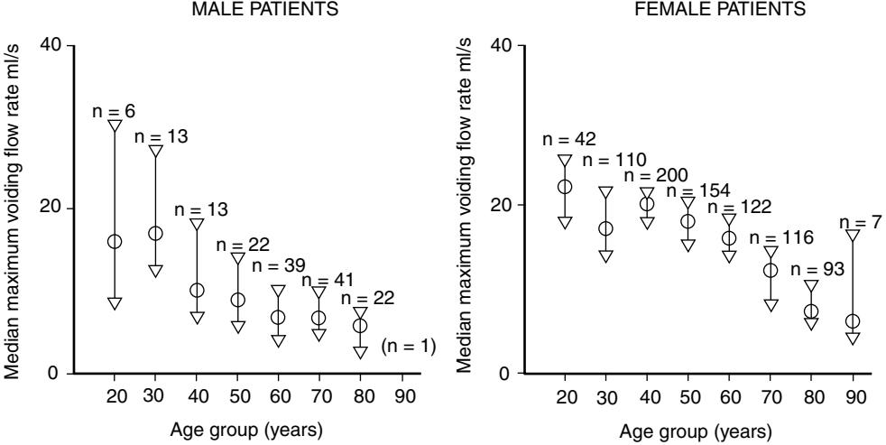
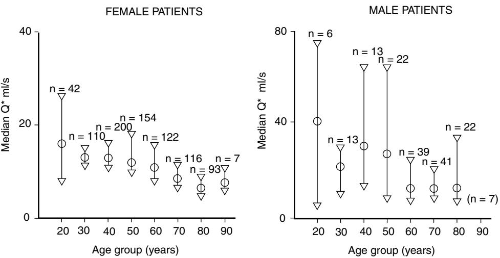
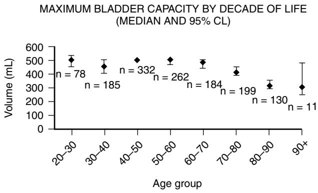
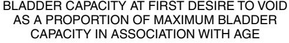
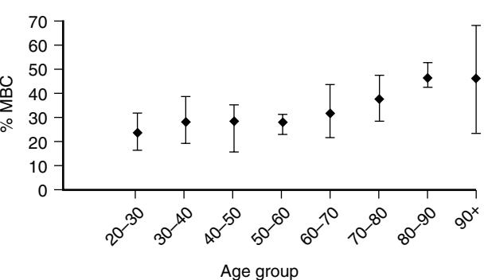
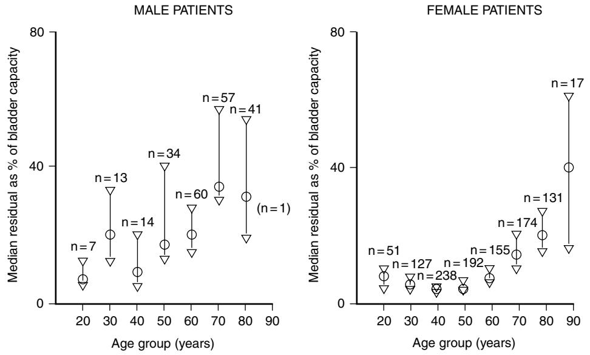
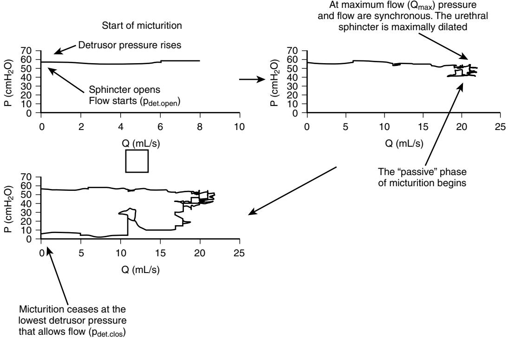
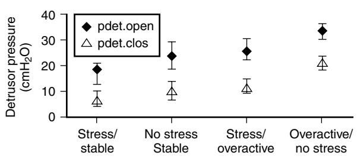

# Urinary Incontinence

Adrian Wagg

Urinary incontinence is one of the giants of geriatric medicine. Despite this lofty status, however, it remains along with management of other associated lower urinary tract symptoms an entity largely neglected by geriatricians. Nevertheless, research-based evidence for the management of incontinence, even in the most frail elderly exists. Incontinence should not be a Cinderella subject, relegated to the realms of palliative nursing and should be approached seriously.

In the United Kingdom the prevalence of urinary incontinence increases in association with increasing age such that at age 60 moderate or more severe incontinence affects 22.3% of women and 10.2% of men and at age 80 and above, 33.4% of women and 23.5% of men are affected.1 A recent survey has supported these observations and noted the increasing prevalence of lower urinary tract symptoms with advancing age.2 The increased prevalence of incontinence in late life reflects a combination of physiologic change, an increased incidence of lower urinary tract disease, and the influence of associated morbidity in older people. It is both a marker of dependency of poorer health-related outcomes and also leads to an increased likelihood of institutionalization.3 Incontinence also has a measureable negative impact on quality of life, although this appears not to be of the magnitude of that expressed by younger adults despite having a more severe extent of disease.4 This may be because the coping mechanisms that people adopt become habituated, lessening the perceived impact. Older cohorts are generally more accepting of these or may expect conditions that they may associate with aging to afflict them and simply cope.

# **ANATOMY AND PHYSIOLOGY**

The smooth muscle fibers of the detrusor muscle of the bladder appear to be randomly arranged over the dome of the bladder but funnel at the bladder neck to be continued into the urethra as longitudinal fibers forming a tube. In the male these fibers are inserted into the verumontanum, but in the female they terminate in the distal urethra. Contraction of the detrusor results in a rise in bladder pressure associated with shortening of the urethra. Contraction of the muscle of the trigone, the triangular baseplate with its apex at the bladder neck, and base running between both ureters results in funneling of the bladder neck. There are some fibers that are inserted into the external surface of the trigone distally. These pull the distal margins of the trigone apart, thus opening the bladder neck.

In normal circumstances the detrusor is highly compliant. This means that it is normal for a bladder to be filled to 500 mL and more, without an increase in intravesical pressure, other than the pressure head resulting from the volume of the fluid in the bladder, which would be approximately 8 cm H2O at 500 mL. If the wall tension in the detrusor increases in association with filling, but then fails to relax (stress relaxation), the bladder is said to "lack compliance." "Low compliance" may result from fibrosis, detrusor hypertrophy, or an increased resting tone secondary to reduced neural inhibition.5

Control of the bladder and urethra depends upon a complex supraspinal neuronal network, which allows voluntary postponement of voiding and the ability to empty the bladder at a socially convenient time, even if there is little need to void. Animal studies and clinical observation have suggested that the main levels of control over the lower urinary tract are cortical (inhibitory), hypothalamic (excitatory), midbrain (inhibitory), and pontine (excitatory). With the advent of modern functional brain imaging, the sites of these control systems have been further identified. In adults, the normal mechanism for activating contraction of the detrusor is the release of acetylcholine from parasympathetic nerves, stimulated by a spino bulbospinal micturition reflex,6 the main micturition reflex. Tension receptors in the detrusor activate afferents traveling in the pelvic nerves. These afferents pass through the lumbosacral dorsal roots to ascending tracts where they synapse in the midbrain periaqueductal gray (PAG). Their signaling intensity increases as the bladder fills and fibers from the PAG descend to the pontine micturition center (PMC), causing excitation. If left unmodulated, fibers from the PMC excitation causes activation of the descending motor efferents, which cause coordinated detrusor contraction and urethral relaxation.7 However, afferent signals from the bladder do not automatically trigger the micturition reflex, but are relayed via the forebrain where a voluntary decision to empty the bladder can be made.8

Although much of the functional neuroanatomy of the lower urinary tract has been explored by animal experiments, the advent of functional imaging, (positron emission tomography, functional magnetic resonance imaging, single photon emission computed tomography) has allowed some impressive studies on humans, these methods map regional cerebral metabolism or blood flow and this is assumed to reflect neuronal activity. Many areas of the brain become active as the bladder is filled and studies have shown that humans and cats have remarkably similar arrangements. They show that micturition is associated with activity in the hypothalamus, periaqueductal gray matter, the right prefrontal cortex, anterior cingulate gyrus, and the dorsomedial pontine tegmentum.9

Since higher cerebral centers tend to inhibit the pontine micturition center, lesions above this area associated with detrusor overactivity of neurogenic origin. Frontal lobe lesions are associated with frequency, urgency, and urgency incontinence with a loss of warning of impending micturition. Strokes are often associated with detrusor overactivity, excepting those which primarily affect the occipital lobes. Any spinal cord injury that disrupts the normal connection between the sacral spinal cord and the supraspinal pathways controlling micturition will cause bladder dysfunction. Lesions of the spinal cord below the pons, but rostral to the sacral nuclei, result in bladder areflexia initially, lasting days to weeks before detrusor overactivity develops. However, if a spinal lesion involves complete destruction of the sacral nuclei, bladder areflexia will be permanent.10,11

The internal urethral sphincter is present only in the male, forming a circular collar continuous with the smooth muscle of the prostate. This sphincter is not part of the continence mechanism but contracts during ejaculation to prevent the retrograde flow of semen into the bladder. Failure of this sphincter leads to infertility, dry ejaculation, and seminuria. The internal sphincter is cut during transurethral resection of the prostate; however, continence is maintained.12

The external urethral sphincter is the principal mechanism for maintaining urethral continence in both sexes, although the smooth muscle and epithelium of the urethra is also important, particularly in women.5 The urethra consists of an internal layer of longitudinal smooth muscle and an outer thinner layer of circular smooth muscle controlled by the action of adrenergic and cholinergic receptors and under modulation of NO and CO. Sympathetic control predominates, mediated by α1A α-adrenoceptors.13–16

The striated muscles of the pelvic floor and the external sphincter are supplied by somatic efferents originating in the anterior horns of the sacral cord segments S2–S4. The motor neurons are grouped in a specific region called the Onuf's nucleus. This nucleus differs from other somatic motor nuclei, with histochemical appearances similar to sacral parasympathetic nuclei along with evidence of adrenergic innervation. The axons, originating from the Onuf's nucleus pass to the periphery through the pudendal nerve and the pelvic nerves. External sphincter activity is supported by the adrenergic smooth muscle of the urethra.

The sympathetic innervation for the lower urinary tract comes from postganglionic nerves traveling in the hypogastric plexus, the pelvic nerves, and the pudendal nerves. This sympathetic innervation inhibits the detrusor, providing an active component to relaxation and also stimulates the urethral smooth muscle and the sphincters.The inhibitory noradrenergic receptors on detrusor cells are β3 subtype.17–20 Motor activation of the detrusor in healthy humans is achieved by the stimulation of muscarinic receptors by acetylcholine; this activates second messengers causing release of Ca2+ ions from intracellular stores in the sarcoplasmic reticulum and an inward flow of Ca ions through L-type Ca2+ channels. The rise in intracellular Ca2+ ion concentration activates actin and myosin, thereby promoting contraction. The detrusor cell can depolarize with an inward current consisting of Ca2+ ions passing through L-type channels in sufficient magnitude to support depolarization, but the normal physiologic role of the L-type Ca2+ channel appears to be regulation of the filling of intracellular stores during the resting state. Cholinergic activation occurs independently of depolarization; its limited influence may explain the lack of efficacy of calcium channel blockers in the treatment of detrusor overactivity.21–23 Ligand studies of the M2 and M3 muscarinic receptors in the bladder have shown that the greater proportion (85%) are M2 receptors with only 15% being M3. All of the contractile activity appears to be attributed to the M3 receptor in healthy humans. However, the M2 receptor is of increasing interest as its role in the appreciation and modulation of sensory inputs in both the detrusor and the urothelium have become apparent.24,25

It has been found that some muscarinic antagonists prove selective for the bladder, but this tissue specificity does not appear to be associated with either M2 selectivity or lack of M3 selectivity.26–28

It is now known that acetylcholine and noradrenaline are not the only significant neurotransmitters in the lower urinary tract. Nonadrenergic noncholinergic (NANC) neurotransmitters are neuropeptides that modulate the actions of the classical transmitters and may act as transmitters themselves. Neuropeptide-Y (NPY) and vasoactive intestinal polypeptides (VIP) are important neuromodulators, which are released at neuromuscular junctions so as to influence the release and uptake of acetylcholine and noradrenaline. Adenosine triphosphate (ATP) is thought to be an important neurotransmitter, coreleased with acetylcholine and it is known to cause depolarization of the detrusor. Although in the normal human bladder ATP is not important, there is evidence that in diseased states the activating mechanisms of the detrusor change and that NANC transmitters exert a much greater influence on the bladder, the ATP being broken down less effectively in the overactive detrusor.29–31 More recently, an appreciation of the role of the sensory afferents in the detrusor and the role of the urothelium as an active, rather than a passive component of detrusor function has led to a greater understanding of the generation of detrusor overactivity, but not yet to therapeutic manipulation. Of resurgent interest is the concept of spontaneous detrusor activity and the role of the interstitial cell in the regulation of this.32 These cells lie in the suburothelial space or within the detrusor and, indeed, throughout the lower urinary tract, and it has variously been postulated that these cells act as pacemaker cells, analogous to the interstitial cells of Cajal in the gastrointestinal tract.33

# **PRESENTATION**

There is an outdated quote, often used, which states that the bladder is an unreliable witness and that the symptoms that a patient describes do not point to the true pathology.34 This belief has arisen from the dubious assumption that patients can be fitted into clearly separate diagnostic categories where a set of unique symptoms leads to distinct diagnoses. Given that there is likely to be a spectrum of disease, reflecting the variability inherent in any biologic system, diagnostic categories most likely form intersecting continua that share some symptoms. Such faith in diagnostic absolutes is dangerous because it leads to dismissal of the significance of symptoms, which are the patients' experience of disease. The great majority of symptoms can be explained by the physiologic and mechanical principles that govern the lower urinary tract, and what the patients say usually makes sense. Experimental data have supported this thesis,36 but there is a continual search for classification, discrimination, and scoring of disease variables that largely leads to no gain in terms of understanding of disease or advances in treatment.

Frequency, urgency, urgency incontinence, nocturia, and enuresis are symptoms associated with detrusor overactivity (DO) and have been observed to be associated with the involuntary detrusor contractions of DO,37 and to reduce with documented resolution of the overactivity.38,39

Frequency and urgency may be more noticeable when out and about, when putting the key in the door on returning home, in cold weather, in anxiety-provoking situations, and to be subject to diurnal and seasonal variation. Intercurrent illness, particularly urinary infection, will exacerbate the symptoms. The subjective experience that is urinary urgency also varies between individuals, and probably, within the same individual. Some describe the idea of a growing potential for loss of bladder control, whereas others tell of a wholly physical sense of near incontinence. Clinically, the symptom complex is called the overactive bladder, or frequency-urgency syndrome, and it is defined as urinary urgency, with or without urgency incontinence, usually with frequency and nocturia in the absence of other lower urinary tract pathology that might lead to similar symptoms (such as bladder stones, tumor, or infection).40

Stress urinary incontinence is associated with coughing, sneezing, or other physical exertion. The term "genuine stress incontinence" is no longer used to describe stress incontinence caused by an incompetent urethral sphincter. The symptom of stress incontinence, which often coexists with varying degrees of overactivity, particularly in older people, is clearly associated with reduced sphincter function.41,42 Where overactivity coexists, treatment of this may result in resolution of both urgency and stress-induced incontinence. This should be expected if the two pathologies work synergistically. Response to treatment of one pathology does not exclude the presence of the other.43 On current evidence, if a woman describes stress incontinence, then there is a 78% probability that sphincter dysfunction exists. Although there is a reduction in the maximum closing pressure that can be generated in the urethra in association with increasing age, this closing pressure must exceed the pressure of urine at the bladder neck for continence to be maintained. As the bladder fills, a pressure will develop equal to the hydrostatic pressure of urine in the bladder plus the weight of any viscera pressing on it. If the maximum urethral closure pressure is reduced below this, then the woman will develop a sense of pending incontinence as the hydrostatic pressure rises; positional changes may exacerbate this. The woman will thus be forced to maintain a bladder capacity below the threshold. Frequency, urgency, and urge incontinence may all therefore be induced by an incompetent urethral sphincter. Additionally, rising during or at the end of the night with a full bladder, and suddenly applying an increased hydrostatic pressure to the faulty sphincter, will lead to very severe urgency and precipitancy.

Hesitancy, a reduced stream, intermittency of stream, straining to void, manual abdominal compression during voiding, terminal dribbling, postmicturition dribbling, and incomplete emptying are recognized symptoms of a voiding problem, be it obstructive or due to a failure of detrusor emptying function. Their presence correctly points to a requirement to check voiding efficiency. However, the physiology of micturition indicates that a high frequency will lead to similar symptoms. The bladder empties more efficiently from a higher capacity, but voiding efficiency is compromised by overdistention.44,45 Elongation of the detrusor fibers in response to filling promotes optimum contact between the actin and myosin so that a better contraction can be obtained.46 Flow rates are well known to be related to the voiding bladder volume. People with frequency and low-volume voids therefore commonly describe symptoms of poor voiding in the absence of either detrusor underactivity or obstruction.

Dysuria is the experience of pain in association with micturition. The classical symptom of a burning in the urethra during voiding, caused by infection, is well known. Less appreciated is the external dysuria experienced by women with vaginitis when urine passes over the labia.47

#### **Table 109-1. Factors Associated with and Consequent upon Urinary Incontinence on Older People**

| Incontinence can be Associated with the Following: Falls                                            |
|--------------------------------------------------------------------------------------------------------|
| Depression                                                                                             |
| Pressure ulcers                                                                                        |
| Bowel problems                                                                                         |
| Skin infection                                                                                         |
| Isolation                                                                                              |
| Impaired quality of life                                                                               |
| Increased likelihood of institutional care                                                             |
|                                                                                                        |
| Incontinence is also a Consequence of the Following:                                                   |
| Lower urinary tract disease                                                                            |
| Musculoskeletal disease                                                                                |
| arthritis/contractures                                                                                 |
| Peripheral vascular disease                                                                            |
| Stroke                                                                                                 |
| Parkinson's disease                                                                                    |
| The dementias                                                                                          |
| Diabetes mellitus                                                                                      |
| Venous insufficiency                                                                                   |
| Chronic lung disease                                                                                   |
| Congestive heart failure                                                                               |
| Neurologic disorders, for example: multiple sclerosis, spinal cord injury, and motor neuron disease |

There are a number of conditions, labeled by the International Continence Society as painful bladder syndromes, which are beyond the scope of this chapter, that are poorly defined and require specialist management.

There are a variety of factors, unrelated to bladder physiology, relevant to older people that should be explored at the time of presentation. These commonly interact with a greater propensity for incontinence so as to cause it, such that correction will lead to continence. Conditions related to incontinence are listed in Table 109-1.

The importance of a medication review and alteration in the management of urinary incontinence in the elderly should not be underestimated. Table 109-2 lists the medications that may either precipitate or contribute to incontinence. Data from the National Audit of Continence Care for Older People suggest that, at best, this is only done for 33% of older people in primary care48 but there is undoubted value in this.

#### **MULTICHANNEL CYSTOMETRY**

Multichannel cystometry "urodynamics" has been the principal method used to explore the physiologic changes in the lower urinary tract particularly seen in elderly people, but is also used, sometimes erroneously, as a diagnostic tool. A urodynamic study is not necessary for the initial conservative management of anyone presenting with urinary incontinence, be they young or old, and age should not influence the decision to use the investigation. However, an understanding of the test is certainly worthwhile.

The study describes a number of aspects of lower urinary tract function extremely accurately; for example, a urodynamic study measures urinary outflow obstruction precisely.49

However, the majority of urologists operate on the basis of symptoms rather than the physical demonstration of obstruction and do not routinely perform cystometry.50 Because similar symptoms are found in roughly as many urodynamically obstructed and unobstructed men, it is inevitable that the

#### **Table 109-2. Medications That May Either Precipitate or Contribute to Incontinence**

| Medications                                     | Effects on Continence                                                                                                                                      |  |  |
|-------------------------------------------------|------------------------------------------------------------------------------------------------------------------------------------------------------------|--|--|
| α-adrenergic agonists                           | Increase smooth muscle tone in urethra and prostatic capsule and may precipitate obstruction, urinary retention, and related symptoms                   |  |  |
| α-adrenergic antagonists                        | Decrease smooth muscle tone in the urethra and may precipitate stress urinary incontinence in women                                                     |  |  |
| Angiotensin-converting enzyme (ACE) inhibitors  | Cause cough that can exacerbate incontinence                                                                                                               |  |  |
| Agents with antimuscarinic properties           | May cause urinary retention and constipation that can contribute to incontinence; may cause cognitive impairment and reduce effective toileting ability |  |  |
| Calcium channel blockers                        | May cause urinary retention and constipation that can contribute to incontinence                                                                           |  |  |
|                                                 | May cause dependent edema, which can contribute to nocturnal polyuria                                                                                      |  |  |
| Cholinesterase inhibitors (cognitive enhancers) | Increase bladder contractility and may precipitate urgency incontinence                                                                                    |  |  |
| Diuretics                                       | Cause diuresis and precipitate incontinence                                                                                                                |  |  |
| Lithium                                         | Polyuria due to diabetes insipidus-like state                                                                                                              |  |  |
| Opioid analgesics                               | May cause urinary retention, constipation, confusion, and immobility—all of which can contribute to incontinence                                        |  |  |
| Psychotropic drugs                              | Mayc ause confusion and impaired mobility and precipitate incontinence                                                                                     |  |  |
| Sedatives                                       | Some agents have anticholinergic effects                                                                                                                   |  |  |
| Hypnotics                                       |                                                                                                                                                            |  |  |
| Antipsychotics                                  |                                                                                                                                                            |  |  |
| Histamine1 receptor antagonists                 |                                                                                                                                                            |  |  |
| Selective serotonin re-uptake inhibitors        | Increase cholinergic transmission and may lead to urgency urinary incontinence                                                                             |  |  |
| Other drugs                                     | Can cause edema, which can lead to polyuria while supine and exacerbate nocturia                                                                           |  |  |
| Gabapentin                                      | and nighttime incontinence                                                                                                                                 |  |  |
| Glitazones                                      |                                                                                                                                                            |  |  |
| Nonsteroidal antiinflammatory agents            |                                                                                                                                                            |  |  |
|                                                 |                                                                                                                                                            |  |  |

clinical syndrome bearing the name "obstruction" is divorced from the urodynamic measure. Likewise, the requirement to demonstrate involuntary contractile behavior of the detrusor in association with symptoms to make the urodynamic diagnosis of detrusor overactivity also leads to up to 25% of subjects with urgency and urgency incontinence not having a diagnosis made. This is not a problem with the measure, but with the preoccupation that diagnoses should occupy specific "boxes" without overlap.51

On presentation, patients are asked to empty their bladders while urine flow rate is measured by means of a flow meter positioned in an adapted commode. A Jaques catheter (French gauge 10) and a nylon catheter (16 G) are placed in the bladder via the urethra, which is usually anesthetized with lidocaine gel. The postmicturition residual urine is drained off and measured. Another catheter (French gauge 10) tipped with a perforated latex sheath to prevent fecal plugging, is introduced into the rectum. The smaller bladder catheter and the rectal catheter are filled with normal saline and then connected to force displacement transducers mounted at the level of the superior ramus of the pubic bone. This reference point is used to establish atmospheric pressure. The detrusor pressure, generated by the walls of the bladder, is calculated by subtracting the intraabdominal pressure (measured via the rectal catheter) from the intravesical pressure (measured via the bladder catheter). The bladder is filled with a fluid at a rate of between 50 and 100 mL min−1. The subject is asked to cough at intervals during the study to assess the quality of abdominal pressure subtraction and to report sensations of filling and urgency. The bladder is filled until either a maximum of 500 mL has been infused, or unstable detrusor activity prohibits further filling, or the patient is found to be unable to tolerate any further infusion. Unfortunately, filling rate, fluid temperature, and content are not standardized and vary with department preference. Videourodynamics uses radio-opaque contrast to fill the bladder. There has been an attempt to standardize the methods used for cystometry by both the international continence society and the British Society for Urogynaecology in the United Kingdom. Clearly some standardization is useful as this allows comparison of results and a quality assurance of the method by which these were obtained.

On completion of the filling study, the filling catheter is withdrawn from the bladder leaving the pressure measuring catheter in situ. The patient is then asked to void to completion. During voiding, the bladder and rectal pressure and the flow rate are recorded simultaneously.

During normal filling the detrusor pressure should only rise an amount consistent with the pressure head of the volume of fluid within it. If the detrusor contracts while the patient is attempting to inhibit micturition, then urodynamic detrusor overactivity is diagnosed. This should usually occur at the same time as the subjective sensation of urinary urgency, but the magnitude of the contraction may be small and not be associated with any sensation. In a subject with neurological disease, such as spinal cord injury or multiple sclerosis, this observation is termed detrusor overactivity of neurological origin.40

There is little evidence that the use of cystometry adds anything to history taking or makes a difference in outcome from treatment. When NICE made its recommendations on the rational, evidence-based use of cystometry, there was considerable adverse reaction from "clinical experts" often citing anecdotal evidence or conflating arguments about the utility of an additional investigation in the assessment of incontinent patients.52

# **AGE-RELATED PATHOPHYSIOLOGY**

Early studies of age-related urodynamic findings were conducted on samples of elderly people without younger comparisons.53–55

In more recent studies, people with lower urinary tract symptoms have been compared across all age groups.56–59

Urgency incontinence is the commonest cause of urinary incontinence in elderly people, this being due chiefly to detrusor overactivity. This is particularly the case in elderly people living in institutions.60,61 Among outpatients having lower urinary tract symptoms, between 75% and 85% of women aged 75 and over and 85% and 95% of similarly aged men will be found to have detrusor overactivity.62 The observed changes associated with greater age in men and women with lower urinary tract symptoms undergoing cystometry are listed in Table 109-3 and illustrated in Figures 109-1 through 109-5.

It is interesting to note that men with lower urinary tract symptoms do not demonstrate all of the age-related changes associated with women. This probably relates to the higher urethral resistance caused by the prostate gland, causing detrusor muscle hypertrophy. The influence of this "obstructive" organ may dominate the evolution of bladder physiology.63 In elderly people of both sexes, detrusor overactivity is associated with lower bladder capacities than in those with normal bladders. Contrary to expectations, lower bladder capacities, more aggressive detrusor overactivity, and older age do not appear to be associated with a poorer therapeutic prognosis. In fact, there do not appear to be any urodynamic variables indicative of a poorer outcome from treatment.36

Both sexes void less successfully in late life and voiding is associated with higher residual urine volumes and a higher proportion of patients with incomplete bladder emptying.

#### **Table 109-3. Changes Associated With Greater Age in Men and Women With Lower Urinary Tract Symptoms Undergoing Cystometry**

| Decreased                          |
|------------------------------------|
| Urinary flow rate                  |
| Speed of contraction of detrusor   |
| Collagen:detrusor ratio (♀ only)   |
| Maximum bladder capacity           |
| Functional bladder capacity        |
| Sensation of filling               |
| Increased                          |
| Postvoid residual volume of urine  |
| Urinary frequency                  |
| Outflow tract obstruction (♂ only) |

The explanations for this are probably complex. Obstruction will play a part in men but it is by no means the only explanation. There is evidence for a reduced speed of detrusor shortening in late life and problems in sustaining adequate voiding contractions. The transmission of force from the detrusor in later life is damped by an accumulation of collagen and connective tissue, giving the impression of "impaired contractility" a common misnomer.

The combination of detrusor instability and incomplete bladder emptying in elderly people raises the controversy of "detrusor hyperactivity and impaired contractility" (DHIC). This was described by Resnick and Yalla when reporting on 32 elderly nursing home residents in 1987.64 They identified a specific physiologic entity, being a subset of detrusor hyperreflexia in elderly people. The characteristics were involuntary detrusor contractions, a postmicturition residual urine volume, and a reduced speed and amplitude of isometric detrusor contractions. In studying a much larger sample of elderly people, such a distinct physiologic subgroup has not been identified. Voiding problems and detrusor overactivity, often coexist in elderly people but seem to be independent of each other.

Additionally, Elbadawi et al65 have published data from electron microscopy studies of bladder biopsy specimens from elderly men (*n* = 11) and women (*n* = 24), which are in support of distinct pathophysiologic subgroups of detrusor function. They reported four structural patterns precisely matching four urodynamic groups with no overlap. Additionally two subsets, "normal contractility" (*n* = 11) and "impaired contractility" (*n* = 24) matched histologic subsets exactly. These findings have not been corroborated despite Carey et al66 having reported finding some of the defining histologic characteristics described by Elbadawi et al67 evenly distributed between normal women (*n* = 15) and women with detrusor overactivity (*n* = 22). In vitro studies of detrusor muscle contraction reveal a lower level of acetylcholine release in association with increasing age,68 there are also data showing a reduction in the number of acetylcholinesterase containing nerves within the muscle.69

There are additionally changes in urethral function associated with aging in women. Figure 109-6 demonstrates a plot of the voiding detrusor pressure against flow rate recorded

Figure 109-2. Speed of detrusor muscle shortening, calculated from the voiding pressure-flow plot in men and women with lower urinary tract symptoms in association with age.

Figure 109-3. Maximum cystometric bladder capacity for women with lower urinary tract symptoms in association with age.

Figure 109-4. First desire to void, plotted as a proportion of maximum bladder capacity in women with lower urinary tract symptoms associated with age.

from a urodynamic study. The two pressure intercepts shown, *p*det.clos and *p*det.open, are invariably elevated in the presence of detrusor overactivity and lower in the presence of stress urinary incontinence. Where both conditions exist, the values take the middle ground. Highest values are seen in neurologic diseases such as multiple sclerosis. Greater age in women is associated with lower values of both *p*det.close and *p*det.open, even in the presence of detrusor overactivity (Figure 109-7). Data from studies measuring the maximum urethral closure pressure also show a similar decline in association with increasing age. Histologically, there is evidence of an age-related apoptosis of striated muscle cells of the urethral sphincter.70,71

# **ASSESMENT OF THE ELDERY INCONTINENT PATIENT**

A screening question about bladder and bowel care as part of any interaction between an older person and a clinician is recommended. Many of the single assessment processes mandated by the National Service Framework for Older People contain a simple question such as "Do you have any problems with either your bladder or bowel?" A validated screening or case-finding questionnaire could be used in appropriate settings.72

Should the answer to that question be positive, then an assessment should be offered. However, this is not always the case. Essentially, problems can be divided into those relating to the storage of urine and those of emptying. Incontinence might be as a result of failure of either functions of the bladder. Useful questions are shown in Table 109-4.

Additional questions that should be asked relate to obstetric history (for example, the number of deliveries and if these were by forceps or were very prolonged), surgery, and bowel function, especially constipation and fecal incontinence because this can commonly coexist in frail, older people. Underlying causes of urinary incontinence may readily be identified. Characteristic features are shown in Table 109-5.

# **Assessing cognitive function**

Older, cognitively impaired people are less able to cooperate in lifestyle interventions for their incontinence. They may also be at risk of developing further impaired cognition in response to drug therapy for their problem. Many older people are taking medication with antimuscarinic properties and

Figure 109-5. Postvoid residual volume of urine for men and women with lower urinary tract symptoms associated with age.

Figure 109-6. A voiding pressure-flow plot.

are at risk of subclinical cognitive impairment.73 Oxybutynin, used for the treatment of overactive bladder, is associated with an impairment of cognition in normal older people.74 There are also case reports of acute delirium in patients with preexisting cognitive impairment.75,76 Therefore it is a good idea to assess this formally. Simple, robust, and reliable scoring such as the Folstein MMSE may be employed but, as yet, it is not known if this is sensitive enough to detect what might be subtle change. It can be performed in a short time and may serve as a baseline measure against which to judge the impact of treatment interventions or to assess what level of complexity of management the patient might tolerate.

## **Bladder diaries**

Where possible, a bladder diary should be obtained to gain an understanding of the person's bladder habits and associated symptoms. A 3-day diary is usually sufficient. This can either be a tick chart of voiding frequency and incontinence episodes, or can include volume measurements at each void. This is most useful when polyuria or nocturnal polyuria is suspected (excessive nighttime voiding or enuresis). A bladder diary is difficult to obtain for the very old, frail, and cognitively impaired and obtaining a reliable recording requires considerable effort and observation, particularly if there are a considerable number of incontinent voids. The process will involve observation and regular "wet checks" to allow building up a pattern of voiding. Involvement of an informal caregiver, where one is available may be beneficial.

# **Examination**

A physical examination should be performed for all people complaining of urinary incontinence. This at a minimum should consist of urinalysis to exclude infection and the presence of hematuria, and a rectal examination to exclude fecal loading as a precipitating factor for the incontinence. A digital rectal examination also allows the assessment of the prostate in men. Palpation of the abdomen will detect large volumes of urine in the bladder and can exclude large volume

> DETRUSOR PRESSURES AT URETHRAL OPENING AND CLOSURE FOR WOMEN WITH LOWER URINARY TRACT SYMPTOMS (MEDIANS AND 95% CL)

Figure 109-7. pdet.open and pdet.close associated with detrusor overactivity, normal cystometry, and urodynamic stress incontinence.

#### **Table 109-4. Questions About Urine Storage Symptoms**

retention. For a more detailed examination and estimation of a postmicturition residual volume of urine, a portable ultrasound bladder scanner should be used.

# **Vaginal examination**

This is considered to be an important part of a continence assessment, however, this should only be undertaken by a professional with the necessary competence and probably as part of a specialist rather than generalist assessment. A visual examination though might reveal conditions such as urogenital atrophy or prolapse that can cause urinary symptoms. Typically, women complain of the presence of the "lump" in their vagina that may sometimes be visible, a dragging sensation or discomfort especially when sitting. The prolapse itself may cause voiding difficulty, leading to a postmicturition residual volume or occasionally may mask underlying stress urinary incontinence. What the generalist can do, though, is easily identify a significant urogenital prolapse certainly those that protrude beyond the introitus should be referred for a specialist examination. Visual inspection of the skin will also help in the planning of treatment to maintain skin integrity where this is threatened.

# **Urinalysis**

This should be done for all patients with urinary incontinence at first presentation, or if there is a change in symptoms suggesting infection of the urine. The presence of frank blood indicates the need for action to be taken. The best dipstick tests to use are those with leucocytes and nitrite test pads; if both tests are negative, the chance of there being an infection is low when compared with laboratory evidence of a UTI based upon microscopic pyuria and bacteruria.77 Large amounts of glucose or ketones in the urine can make the nitrite test falsely negative and the utility of this test has recently been called into question.78 If there are lower

| Symptom                                                                                                          | Questions to Ask                                                                                                                                |  |  |  |  |  |
|------------------------------------------------------------------------------------------------------------------|-------------------------------------------------------------------------------------------------------------------------------------------------|--|--|--|--|--|
| Daytime frequency                                                                                                | How many times do you have to pass water in the day?                                                                                            |  |  |  |  |  |
| Nighttime frequency (nocturia)                                                                                   | How many times do you have to pass water at night?                                                                                              |  |  |  |  |  |
| Urgency                                                                                                          | Do you get a desperate need to pass water that you find hard to hold?                                                                           |  |  |  |  |  |
| Urgency incontinence                                                                                             | Do you wet yourself by accident because you do not reach the lavatory in time?                                                                  |  |  |  |  |  |
| Stress urinary incontinence                                                                                      | Do you wet yourself if you cough, laugh, or exert yourself?                                                                                     |  |  |  |  |  |
| Aggravating factors                                                                                              | Do any of the following aggravate your symptoms: running water, cold weather, putting the key in the door and/or psychological stress.       |  |  |  |  |  |
| The presence of the following symptoms should lead to specific action:                                           |                                                                                                                                                 |  |  |  |  |  |
| Dysuria                                                                                                          | Urinalysis and collect a urine sample for microscopy; treat according to findings                                                               |  |  |  |  |  |
| Hematuria                                                                                                        | Assess for underlying pathology                                                                                                                 |  |  |  |  |  |
| Pain                                                                                                             |                                                                                                                                                 |  |  |  |  |  |
| Questions About Voiding Symptoms                                                                                 |                                                                                                                                                 |  |  |  |  |  |
| Symptom                                                                                                          | Questions to Ask                                                                                                                                |  |  |  |  |  |
| Continual (passive) urine loss                                                                                   | Does your urine leak continually by night and day? (Suggests either a fistula [women] or retention and overflow incontinence [men >> women]) |  |  |  |  |  |
| Hesitancy or straining to void                                                                                   | Do you have to wait a long time in the lavatory before the urine flows?                                                                         |  |  |  |  |  |
|                                                                                                                  | Do you have to push or strain to pass urine?                                                                                                    |  |  |  |  |  |
| Poor or intermittent stream - indicating bladder outflow tract obstruction                                    | Is the flow weak or does it stop and start as you empty you bladder?                                                                            |  |  |  |  |  |
| Terminal dribbling - related to outflow tract obstruction                                                        | Do you continue to leak urine even after you have finished emptying your bladder?                                                               |  |  |  |  |  |
| Postmicturition dribbling - dribble from the penis due to urine staying in the urethra after bladder emptying | Do you leak urine a while after you have left the toilet? (men>>women)                                                                          |  |  |  |  |  |
| Incomplete emptying                                                                                              | Do you feel that after you have emptied your bladder there is more to pass?                                                                     |  |  |  |  |  |
| Prolapse                                                                                                         | Do you feel a lump coming down your vagina when you pass water?                                                                                 |  |  |  |  |  |

| Factor                                                                      | Stress   | Urge/Urgency   |
|-----------------------------------------------------------------------------|----------|----------------|
| Loss of urine with exertion (e.g., coughing, sneezing, lifting, or exercise | Typical  | Uncommon       |
| Nocturia                                                                    | Uncommon | Typical        |
| Frequency - voiding >8 times in a 24-hr period                              | Uncommon | Typical        |
| Sudden uncontrollable urge to urinate                                       | Uncommon | Typical        |
| Volume of urine lost with each incontinence episode                         | Small    | Moderate/large |

|  |  |  |  |  |  | Table 109-5. Making a Distinction Between Stress and Urgency Incontinence |
|--|--|--|--|--|--|---------------------------------------------------------------------------|
|--|--|--|--|--|--|---------------------------------------------------------------------------|

Adapted from: Fantl JA, Newman DK, Colling J et al. Urinary incontinence in adults: acute and chronic management: clinical practice guideline, No. 2, 1996 Update. Rockville, Md: US Department of Health and Human Services, Public Health Service, Agency for Health Care Policy and Research; March 1996. AHCPR Publication No. 96-0682.

urinary tract symptoms or the patient has a delirium, then a midstream specimen of urine should be obtained if at all possible. For the very frail, there are pads that are similar to those used in pediatric practice that enable the collection if urine. For those doubly incontinent, an in and out catheter may be the only way of reliably obtaining a specimen.

Asymptomatic bacteriuria (the presence of bacteria in the urine that occurs without symptoms) is common in older women (in excess of 15%)79 and treating this will have no effect on incontinence or on the general health of the individual. Antibiotic treatment will merely add to the likelihood of developing resistance to the antibiotic and expose the individual to antibiotic-related side effects. If the patient is already known to be chronically incontinent, then eradicating the bacteria will not help.80 Women who do not have symptoms, and whose urine is negative for leukocyte esterase and nitrites, are most unlikely to have a UTI and do not require urine culture.

If dipstick-positive blood is found, it should be followed up by sending a sample for microscopy. If there is true microscopic hematuria, then a referral for investigation should be made because this can result from having urinary tract stones or a tumor. Clearly glycosuria, indicating either a low renal threshold for glucose or poorly controlled diabetes mellitus, requires further investigation and will cause polyuria.

#### **Rectal examination**

Whether or not a rectal examination should be routinely performed for all older people with urinary incontinence continues to promote discussion and opinion.

Although there is no published evidence that performing a rectal examination alters outcomes for the treatment of incontinence in women, expert opinion suggests that a loaded rectum may, because of its size, lead to voiding difficulty or the presence of a significant postvoid residual volume. Additionally, an assessment of prostate size and consistency in men will help to guide medical treatment. Occasionally, fecal impaction will lead to acute retention, resolution of which will lead to normal voiding.

#### **THE TREATMENT OF URINARY INCONTINENCE**

The overall aim in managing and treating incontinence is not cure; an absolute cure is seldom achieved and the best that any clinician might aim for is resolution of symptoms leading to a return to normal bladder habits and a normal lifestyle. Data from randomized, controlled studies of interventions for older people in this area are available but often exclude the frail elderly, thus extrapolations have to be made. In some instances, these may be perfectly valid but sometimes caution needs to be taken. This section will outline evidence based treatment interventions for the main incontinence syndromes in older people.

#### **General measures**

**Fluid balance** - Although many older people restrict the amount of fluid they drink, there are data to suggest that the achievement of a "normal" fluid balance (1 to 1.5 L/day in a temperate climate) and awareness of bladder habits can lead to an improvement in lower urinary tract symptoms.

**Weight loss** - In epidemiologic studies, more women with incontinence report themselves as being short for their weight or overweight. Evidence for the improvement of symptoms comes from two studies: one in which the intervention was a 3-month liquid only diet, achieving a median weight loss of 16 kg in the intervention group and resulting in a greater than 50% resolution of urinary tract symptoms, which was sustained for the 6 months of the study.81 A more recent U.K. study82 showed that 5% weight loss can improve incontinence severity and have a beneficial effect on quality of life in obese women with urinary incontinence.

**Caffeine** - There are conflicting epidemiologic data about the effect of caffeinated drinks on lower urinary tract symptoms but reduction is supported by one RCT.83 There are no specific data for the elderly, but should a patient express the sentiment that tea or coffee appears to worsen their symptoms then it would seem sensible to attempt reduction.

#### **Bladder retraining**

The purpose of bladder retraining is to extend the intervoid interval, increase bladder capacity, and overcome urinary urgency. There are many methods espoused, and none are superior to others. Bladder diaries are often used as an adjunct to retraining, making people aware of their bladder habits and reinforcing change. The patient uses the chart to keep a record of episodes of micturition, while gradual efforts are made to delay micturition after the urge to void is experienced. The technique is effective.84–86 However, it is not necessarily easy and clinical trial evidence illustrates the need for appropriate support in achieving a good outcome. Some patients with detrusor overactivity will experience pain while delaying micturition, and there is a real possibility of urge incontinence while working with the regime. Stretching the bladder can be augmented by encouraging higher fluid intake while at home, when an episode of incontinence can be dealt with in private. Increasing incontinence is more likely if the urethral sphincter is incompetent as the larger bladder volumes will increase pressure on the sphincter. As the bladder empties more efficiently from a capacity between 3 and 500 mL, it is logical to use a bladder retraining regime to treat voiding problems secondary to detrusor muscle lesions. Excessive delay, so that the bladder capacity rises substantially above 500 mL, should be avoided as such overdistention is associated with ineffective voiding. Should bladder retraining and lifestyle measures fail to achieve satisfactory symptom control, then pharmacologic options for treatment are available.

Up to 70% of people in their eighth decade of life report at least one life limiting coexistent medical condition, even those who report themselves as "fit." However, frailer and older men and women are often excluded from clinical studies in this field by virtue of these or the treatments for them.87 Seldom do published papers report the number of people who were screened for inclusion in a study but were ineligible. Such studies that are published then include data on the physiologically, if not chronologically, younger group of older people. The results of these studies should thus be considered in this light.

The hypotheses underlying drug treatment for OAB have undergone a revolution over the last 8 years; it was widely held that the action of antimuscarinic agents was to suppress overactive contractions of the bladder acting via M3 receptors, although data to support this were inconsistent.88 It has become established that there is considerable sensory dysfunction associated with OAB and that M2 receptors, found in the suburothelium, have a significant effect on the appreciation of urinary urgency. Newer drugs are now targeted to control urinary urgency, a central feature of the symptom complex that has a major impact on quality of life.89,90 The role of antimuscarinics in patients with cognitive impairment is discussed later.

Oxybutynin is the most established antimuscarinic drug in use today. Trials comparing oxybutynin with placebo have consistently shown a reduction in symptoms with the active drug. Studies in older people, using lower doses of the drug than the usual licensed dose of 5 mg three times daily, have some efficacy with a concomitant reduction in the adverse effects and an enhanced level of tolerability of the drug, which at normal dosing resulted in up to 60% of subjects being unable to take it.85,91,92 Oxybutynin is also effective when used in combination with prompted voiding schedules in the nursing-home environment. However, the drug had no effect on the requirement for nursing intervention in the management of incontinence, and the authors concluded that there was little justification for its use.93 Extended-release oxybutynin was also reported to be an effective compound in the elderly, with 31% remaining free of urge incontinence in one 12-week study. However, 58.6% of subjects reported dry mouth, with 23.0% rating it moderate or severe; but despite this, only 1.6% of subjects withdrew.94 There are two studies of extended release oxybutynin, one examining the effect of the drug on the management of cognitively impaired nursing home residents with urgency incontinence and the other covering women over the age of 65.95,96

Oxybutynin is also available in a transdermal preparation that is effective and avoids most antimuscarinic side effects associated with the oral preparation, and fewer systemic side effects than oral extended-release tolterodine. Side effects associated with transdermal delivery include local application-site irritation or erythema, generally managed by appropriate rotation of the application site, but described as severe in 2.5% of subjects.97,98 Published analyses of the efficacy of transdermal oxybutynin included subjects of up to 100 years of age and those in institutional care settings.99

Solifenacin is a long-acting once-daily antimuscarinic agent that is effective in the treatment of OAB. A pooled analysis of results from older subjects taking solifenacin showed the drug to be effective in reducing urinary frequency, the number of urgency episodes, and sensation of urgency, with a restoration of continence in up to 49% of people.100 In the pooled analysis, 13.5% of people on 5 mg reported dry mouth, which was mild to moderate. At the higher dose, a third of people complained of dry mouth, and in 1.9% this was reported as severe. In a randomized controlled trial versus tolterodine extended-release, solifenacin was shown to be equivalent in terms of reduction in micturition frequency and, in an analysis of secondary end points, better than tolterodine in several key indicators. There appeared to be no lessening of effect in those subjects aged over 65 years.101

Tolterodine is a nonselective antimuscarinic agent that appears to have some functional selectivity and greater affinity for bladder muscarinic receptors over those in the salivary glands. This appears to explain the lower incidence of dry mouth, 12.9% in one long-term study,102 and the reduction in withdrawals from treatment seen with the use of the drug. The extended-release form of the drug gives greater tolerability and better efficacy than the immediate-release compound, which should be reserved for those older people with significant hepatic impairment. An effect of therapy can be seen within a week but the maximum effect is seen after 5 to 8 weeks of treatment.103,104 There are published data specifically relating to the elderly that show efficacy, but there appears to be some diminution of effect in older people in some studies, although the clinical relevance of this is unclear.105–107 Tolterodine does not appear to significantly worsen the postvoid residual urine volume and has been effective in treating men with both OAB and bladder outflow tract obstruction.108,109 An evening dose of the drug is effective in reducing nocturnal voids and has been shown to be more tolerable.110

Imipramine appears to have a strong inhibitory effect on detrusor muscle. In the treatment of 10 elderly patients with detrusor instability, the use of imipramine was effective in achieving continence in six at doses of 25 to 150 mg. However, the existing evidence is of only moderate quality, and the incidence of side effects, particularly severe dry mouth, make it difficult to titrate to an effective dose.111

Propiverine hydrochloride has combined antimuscarinic and calcium channel blocking actions. Comparative trials against flavoxate and a placebo, and oxybutynin and a placebo, showed that propiverine has a similar efficacy to oxybutynin. Propiverine has a similar efficacy in treatment of symptoms to oxybutynin 5 mg twice daily, but with a statistically significantly milder and less common incidence of dry mouth. Although there are no specific data in older people, the elderly were not specifically excluded from studies. However, up to 20% of patients have adverse effects, which are mainly anticholinergic.112,113

Trospium chloride is a quaternary ammonium salt derived from atropine; it was effective in treating DO in several randomized controlled trials using urodynamic measures of diagnosis and extent of disease, and clinical and quality-of-life outcomes.114–116 These studies included patients aged over 70 years, and there are no data to suggest that the elderly do less well. The drug was assessed in studies versus placebo and standard release oxybutynin, and was better in effect to placebo and equivalent in efficacy to oxybutynin, when treating DO at doses of 5 mg three times daily. Adverse effects occur less commonly with trospium than with oxybutynin. The drug has no significant drug-drug interactions and does not cross the blood-brain barrier, and thus it is unlikely to have an adverse effect on cognition. Except for one study on driving ability, changes in alpha wave activity on the electroencephalogram have been used as a surrogate end point.117,118 Trospium might therefore be a useful drug where there is coexisting polypharmacy or concern about significant cognitive dysfunction.

Darifenacin is an antimuscarinic agent that has fiftyfold selectivity for M3 over M2 receptors, but only ninefold for M3 over M1. The drug has been specifically tested in older people in randomized controlled trials, and is effective in terms of objective and subjective variables and quality of life. Pooled data from the population aged over 65 years show a similar effect size to the younger groups.119,120 In cognitively intact older people, darifenacin does not adversely affect cognition, probably due to its lack of M1 receptor activity, and its CNS tolerability appears to be similar to a placebo.121 The results of a study of darifenacin in the more elderly (over 75 years) failed to reach its primary end point, but more people on the drug than a placebo experienced a response to treatment.122 The major side effects are constipation, affecting at most 23.6% of subjects at a dose of 15 mg, 10% of whom required treatment for this (although only 2.7% withdrew from treatment because of this) and dry mouth.

Fesoterodine, a prodrug that is converted into the active metabolite of tolterodine (5-hydroxymethyl tolterodine) has recently been launched in Europe and is due for launch in the United States in 2009. It is statistically significantly better than a placebo in all of the objective disease variables and has a favorable effect on quality of life.123,124 For some outcome measures, the 8 mg dose appears to be more effective than the 4 mg dose. The side effect profile appears much the same as other available antimuscarinics with the exception of a lower incidence of reported constipation; whether this is borne out in current trials and clinical use remains to be seen.

#### **OTHER PHARMACOLOGIC MEASURES**

Although there is no evidence for estrogen therapy being of use in the treatment of incontinence in women, there are data to support the use of topical estrogens for treating OAB in postmenopausal women. One systematic review of studies involving 430 subjects found benefits in all of the relevant symptoms associated with the condition.125 It may, however, have a role in the management of recurrent urinary infection. Estrogen withdrawal is associated with a fall in the levels of intravaginal glycogen on which lactobacilli depend. These bacteria cease to colonize the vagina, which is then occupied by colonic organisms that thrive in the higher pH associated with this change.126 The atrophy of the urothelium encourages colonization by gram-negative fecal organisms and the bacteria adhere more easily. There is some evidence that estrogen replacement therapy may reverse this process and give protection to elderly women with recurrent urinary tract infection.127–130

Topical estrogen therapy appears to be associated with a negligible risk of endometrial hyperplasia and certainly, our oncologists are happy for its use even in those women with a previous breast cancer. A minimum of 3-months use is required as a trial of efficacy. Those women on systemic HRT are also just as likely to have urogenital atrophy as not; they should not be excluded from either an examination or treatment.

Desmopressin (synthetic antidiuretic hormone with no effect on blood pressure) can be useful in those individuals with nocturnal frequency or nocturnal polyuria. Its use might be hampered by drug-drug interactions, predisposing to hyponatremia or excessive drinking habits.131 More recent data have been offered in support of careful, supervised use of desmopressin in older individuals.132 In one meta-analysis of available trial data, dilutional hyponatremia occurred in 7% of patients, all within the initial phase of dose titration.133 Given that this decrease in serum sodium may occur within 72 hours, it is worthwhile checking the levels before and 72 hours after initiation. Levels should be then checked again if there is any change to the disease state or treatment taken by the patient.

## **FLAVOXATE HYDROCHLORIDE (URISPAS)**

At one time this drug was used extensively for treating the overactive bladder but its efficacy has not been shown in data from controlled clinical trials versus placebo. It is no longer considered to be an effective drug for the overactive bladder or detrusor overactivity.134–136 There are no data from studies including the frailer elderly.

#### **Surgery for detrusor overactivity**

Surgical measures for the treatment of detrusor overactivity have developed over the years but there are, needless to say, few data on the elderly. There has been a rapid expansion in the intradetrusor usage of botulinum toxin, although an unlicensed indication, for both people with spinal cord injury and those with idiopathic detrusor overactivity, although evidence for the latter from randomized trials is lacking. The treatment appears to be efficacious, and the beneficial effect lasts up to 9 months per injection. The main adverse effect is voiding dysfunction, requiring the patient to revert to clean intermittent catheterization. In some studies of middle-aged women, the rate of this has reached 43%.137 The elderly, with a higher prevalence of impaired voiding, may be at a higher risk of developing this complication. There are randomized, controlled trials underway.

For severe cases of urgency urinary incontinence not responding to conventional medical therapy, potential surgical approaches are sacral nerve modulation and the clam ileocystoplasty. Sacral neuromodulation appears effective for carefully selected individuals and some series have reported results in a few subjects over the age of 65. Approximately a third of subjects appear to require re-operation and reimplantation of the stimulator. Age over 55 years appears to be associated with a poorer outcome.138,139 The precise mechanism by which neuromodulation has its effect still remains to be ascertained. Patients are committed to lifelong followup and many will require reoperation during the lifetime of the device.140 Finally, the Clam ileocystoplasty is probably the only operation for detrusor overactivity for which there is evidence of efficacy. Some series have reported on patients in their eighth decade with good results.141 However, since the procedure makes voluntary bladder emptying ineffective, patients require clean intermittent self-catheterization to empty.142 Some elderly patients can cope with this, but the prevalence of multiple disabilities in late life demand careful selection and counseling.

## **Correcting sphincter incompetence**

Pelvic floor muscle therapy remains the mainstay of conservative therapy for stress urinary incontinence. The evidence for their efficacy is limited in terms of quality but they are recommended by the Cochrane collaboration systematic reviews, and in England and Wales by NICE. Data are mostly from open studies or within group analyses of comparative trial data.141 Data on pelvic floor exercises (PFE) in the elderly, however, are somewhat lacking, as might be expected but there are data from Japan, combining PFE with general physiotherapy for walking speed and muscle strength resulting in overall improvement in incontinence, although this may have been related to the loss of weight and greater ability to toilet effectively rather than any direct LVT effect.142 The effect size for PFE in terms of incontinent episodes, leakage amount, and perceived severity for women older than 60 years of age was less than younger women but was still beneficial overall rather than but still is of statistically significant benefit.143 Exercise programs need to be supervised and supported, and last for at least 3 months, with the minimal amount of effective exercises to achieve any benefit appearing to be 24 to 32 daily. PFE have not been found to be superior to surgery. Although they are advocated for the treatment of stress incontinence in older women, there is no specific evidence to support any specific efficacy in this group. It is regrettable that no large-scale studies of efficacy, which include age comparisons, have been conducted, so doubt hangs over their application. For men, PFE are used in the context of postprostatectomy incontinence where stress incontinence may affect up to 10% following a radical procedure. Evidence for their long-term efficacy is lacking and has been subjected to a Cochrane review.144

#### **MEDICATION**

Until recently there were no drug treatments with evidence of efficacy in the treatment of stress urinary incontinence. However, duloxetine, a combined serotonin and noradrenaline reuptake inhibitor was licensed in Europe in 2004. It is thought to act by increasing the tone of the urethral sphincter. There are data from randomized, controlled trials supporting its efficacy in women (it is not licensed for use in men) but there are no specific data in the elderly. The main side effect of the drug in clinical practice is nausea in 24% of women that caused 6.4% of all withdrawals within trials.145 In clinical practice, even with slow titration of the dose, the withdrawal rate is higher.146 The drug has not been considered by the FDA. In England and Wales, NICE does not recommend the drug for the treatment of stress urinary incontinence in women on pharmacoeconomic grounds.

#### **SURGERY**

Surgery for stress urinary incontinence has been revolutionized over the past 7 years by the wholesale adoption of the midurethral tapes, such as the tension-free vaginal tape (TVT). These have supplanted colposuspension as the primary procedure for urethral incompetence. There are now 10-year data showing efficacy and data also exist for older women147 who, while not achieving the same extent

of cure as younger women, did gain meaningful reductions in incontinence and were satisfied with their result. Other approaches to insertion of the tapes are possible; the transobturator route is often used in more obese women, with similar efficacy to the TVT, but a higher incidence of leg pain. The open Burch colposuspension remains the "gold standard" procedure for stress urinary incontinence with a sustained improvement up to 20 years postoperation.148 For frailer, older women, the use of agents to bulk the urethral sphincter have been used with acceptable short- to mediumterm results but these diminish with time and repeat injection may be required to achieve efficacy.149

#### **THE AS ARTIFICIAL URINARY SPHINCTER**

This is an option for the management of urethral sphincter failure in both sexes. It is best suited to people who do not have detrusor overactivity, but needless to say, there are no data in older people. The operation involves the insertion of a cuff around the urethra. This cuff is passively inflated from a reservoir of fluid placed in the pelvis. The cuff can be deflated, so as to allow voiding, by activating a pump placed in the scrotum or labia majora. After voiding, the cuff reinflates spontaneously. Complications include infection, displacement of the device, and mechanical failure. In one series with a 9 year follow-up, 35% of patients required a surgical revision.150 In correctly selected patients, this prosthetic sphincter is highly effective.151

# **Treating voiding disorders**

Intermittent self-catheterization is now the mainstay of management of voiding disorders associated with neurologic disease.152,153

Older people of both sexes have an increased tendency toward incomplete bladder emptying and this frequently coexists with detrusor overactivity. Voiding disorders may occur in the absence of symptoms but where there are symptoms, such as urinary frequency, recurrent urinary tract infection, or renal impairment, this can be managed by intermittent catheterization.154

There are no outcome data with regard to this technique in elderly people. It is clear, though, that asymptomatic individuals can probably be left alone. An assessment of the postmicturition residual urine volume is a routine part of our standard management protocol in men. There are data to suggest that women without voiding symptoms are unlikely to have a significant residual volume of urine. When we discover a significant problem, which we define as a residual of 200 mL or more, we institute a temporary, once daily intermittent catheterization program; this can be delivered by community nursing services if required. If this results in a rapid and significant improvement in symptoms, we then establish a more permanent regime, otherwise we take no further action.

The procedure may be difficult because of cognitive impairment and poor dexterity. It is more usual for us to enlist the services of a spouse or partner to administer the procedure, although a number of elderly people can selfcatheterize. We have found that the fluid output in elderly people tends to be lower so that a less frequent regime of daily or twice daily catheterizations may prove adequate. Some older women, with delicate atrophic urethras, appear to be able to reduce urethral trauma by using estrogen replacement therapy.

#### **Maintenance products**

Pads continue to play an important role in the management of uncontrolled urinary or fecal incontinence. However, ambulant patients will need to use these devices while awaiting a surgical cure, or more likely as "an insurance policy" in case of incontinence. The design, technology, function, and performance of incontinence pads have been reviewed with meticulous detail elsewhere. Nowadays, there are some very effective products available, but care needs to be taken when choosing a suitable range.155 There are now considerable data on which to base an informed judgment of the most suitable products and most guidelines suggest that patient preference should guide choice.156 Too often decisions on the aids to provide for people are not given sufficient importance and tend to be based primarily on cost considerations.157

#### **INDWELLING CATHETERS**

These have a role in the management of some patients. They are best reserved for people with voiding problems, with or without controllable overactivity, who are unable to manage intermittent catheterization. They may also be employed for the frailest oldest group who are either not suitable for outflow tract surgery or for whom the frequent changing of pads may cause distress or considerable discomfort. A suprapubic catheter may be preferable because it is easier to maintain and does not traumatize the urethra.

Recurrent blocking and infections are complications of permanent catheterization; this tends to occur following the formation of a biofilm on the outside of the catheter, which is more likely to form in alkaline urine. Anecdotal reports favor the use of vitamin C, 1 g tds and cranberry juice to combat blockage and infection, but there are no clinical trial data to support this, although cranberry juice seems to have urinary antiseptic properties.158 There are no data to support the use of silver-coated catheters in preventing urinary tract infection, only short-term bacteruria.159 A successful indwelling catheter need be changed only once every 3 months. Asymptomatic bacteriuria should be left untreated.160,161 The use of a flip-flow valve instead of an external drainage bag is often very acceptable to many, but requires cognitive and manual dexterity to operate. They are unsuitable for those with high pressure detrusor overactivity or those with upper renal tract damage.

#### **EXTERNAL SHEATH DRAINAGE**

Condom catheters, which are fixed to the penis using adhesives specifically developed for this purpose, may also be acceptable to men and are attractive as an alternative to pads. Urine drains from a tube connected at the apex of the sheath. The main problem is difficulty in attaching them because of penile retraction into the suprapubic fat pad. There are special attachments that can deal with this problem. Additionally, some patients have problems with displacement in response to the physical stresses of movement. A small randomized controlled trial versus indwelling catheters in men averaging 73 years of age resulted in a reduction in symptomatic UTI or bacteruria, increased level of comfort, and a reduction in the amount of associated pain.162

#### KEY POINTS Urinary Incontinence

- Urinary incontinence is a highly prevalent condition in older people.
- Careful history, examination, and assessment is sufficient to make a diagnosis of the underlying cause of the urinary incontinence in the majority of cases.
- An assessment of coexisting medications and medical conditions is essential in the evaluation of an older person with urinary incontinence.
- Both asymptomatic bacteriuria and an asymptomatic postvoid residual volume of urine do not require treatment.
- The most common underlying cause of LUTS in the older person is the overactive bladder, regardless of the presence or absence of bladder outflow tract obstruction.
- There is evidence for the conservative management of UI in frail older people by the use of prompted voiding, individualized toileting, and scheduled voiding.

For a complete list of references, please visit online only at www.expertconsult.com