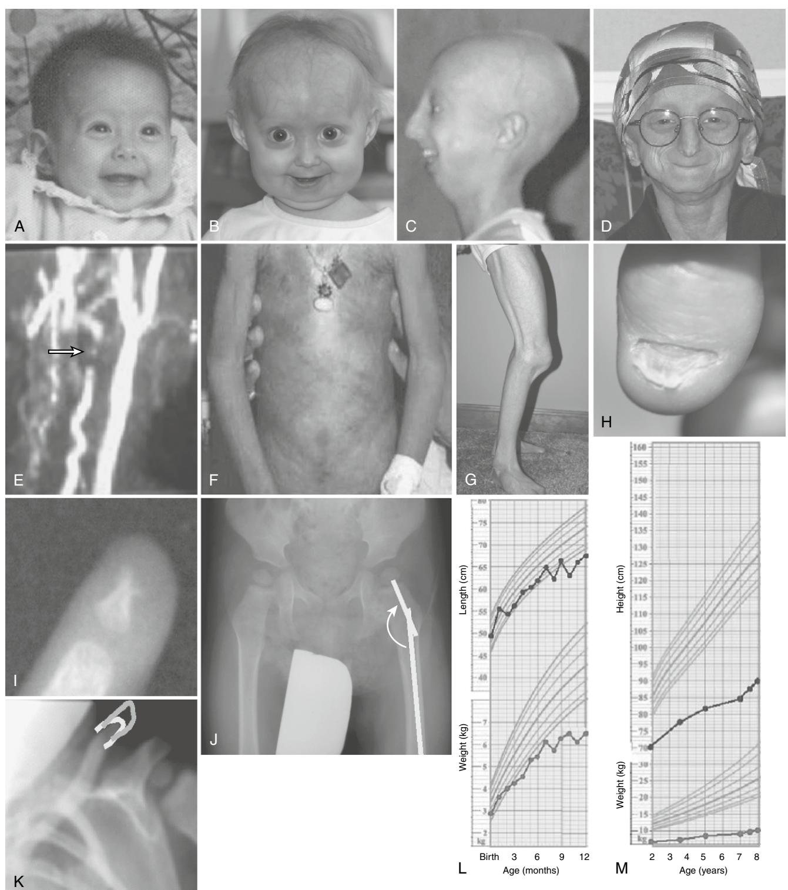
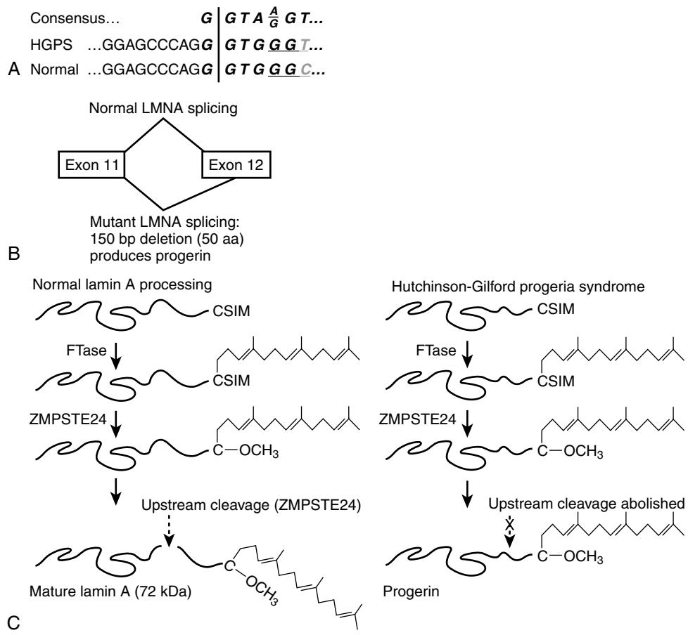
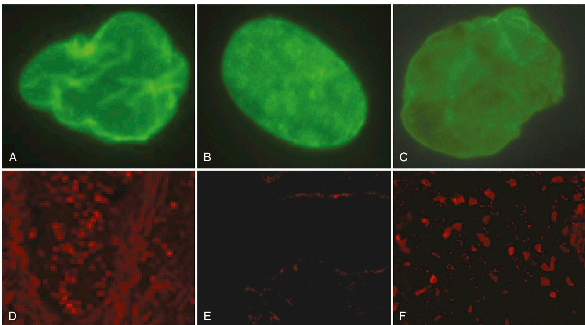

# The Premature Aging Syndrome Hutchinson-Gilford Progeria: Insights Into Normal Aging

Leslie B. Gordon

# **INTRODUCTION**

Hutchinson-Gilford progeria syndrome (HGPS) is an extremely rare, uniformly fatal, segmental "premature aging" disease in which children exhibit phenotypes that may give us insights into the aging process at both the cellular and organismal levels. This chapter will compare HGPS with normal aging with respect to its genetics, biology, clinical phenotype, clinical care, and treatment. By looking carefully at one of the rarest diseases on earth, we gain novel and important insight into the most common conditions affecting quality and longevity of life—aging and cardiovascular disease.

# **HGPS: disease description**

Hutchinson-Gilford progeria syndrome is, in most cases, a sporadic, autosomal dominant, "premature aging" disease in which children die of heart attacks or strokes at an average age of 13.1,2 Children experience normal fetal and early postnatal development. Between several months and 1 year of age, abnormalities in growth and body composition are readily apparent (Figure 11-1). Severe failure to thrive ensues, heralding generalized lipoatrophy,3,4 with apparent wasting of limbs, circumoral cyanosis, and prominent veins around the scalp, the neck, and trunk. Children reach a final height of approximately 1 m and weight of approximately 14 kg. Bone and cartilaginous changes include clavicular resorption, coxa valga, distal phalangeal resorption, facial disproportion (a small, slim nose and receding mandible), and short stature. Dentition is severely delayed.5,6 Eruption may be delayed for many months, and primary teeth may persist for the duration of life. Secondary teeth are present, but may or may not erupt. Skin looks thin with sclerodermatous areas and almost complete hair loss.7–9 Skin findings are variable in severity and include areas of discoloration, stippled pigmentation, tightened areas that can restrict movement, and areas of the dorsal trunk where small (1 to 2 cm) soft bulging skin is present. Joint contractures, due to ligamentous and skin tightening, limit range of motion. Intellectual development is normal in HGPS. Transient ischemic attacks and strokes may ensue as early as 4 years of age, but more often they occur in the later years. Death results from sequelae of widespread arteriosclerosis between the ages of 8 and 21 years, almost exclusively from myocardial infarction or stroke.1,2,10

# **Molecular genetics and cell biology LAMIN A**

HGPS is a member of the family of genetic diseases known as the laminopathies, whose causal mutations lie along the *LMNA* gene (located at 1q21.2).11–13 The *LMNA* gene codes for at least four isoforms, of which only the lamin A isoform is associated with mammalian disease.14,15 The lamin proteins are the principal proteins of the nuclear lamina; a structure located inside the inner nuclear membrane.16 Lamin A, like all lamin molecules, contains an N-terminal head domain, a coiled-coil a-helical rod domain, and a carboxy terminal tail domain17 (Figure 11-2). It is derived from a larger molecule, prelamin A, which undergoes multistep proteolytic processing, which includes the addition and then cleavage of a farnesyl group to become mature lamin A.18–20 The loss of the farnesyl anchor presumably releases prelamin from the nuclear membrane, rendering it free to participate in the multiprotein nuclear scaffold complex just internal to the nuclear membrane, affecting nuclear structure and function.19 The integrity of the lamina is crucial to many cellular functions, including mitosis, creating and maintaining structural integrity of the nuclear scaffold, DNA replication, RNA transcription, organization of the nucleus, nuclear pore assembly, chromatin function, cell cycling, and apoptosis.

# **MUTATIONS IN** *LMNA* **CAUSE HGPS**

HGPS is almost always a sporadic autosomal dominant disease, with only one proven case of mosaicism.21 Ninety percent of HGPS patients have a single C to T transition at nucleotide 1824, which activates a cryptic splice site22–24 (Figure 11-2). Translation followed by posttranslational processing of this altered mRNA produces a shortened abnormal protein with a 50 amino acid deletion near its C-terminal end, henceforth called "progerin." The 50 amino acid deletion does not affect the ability of progerin to localize to the nucleus or to dimerize because the necessary components for these functions are not deleted.19 Importantly, however, it does remove the recognition site that leads to proteolytic cleavage of the terminal 18 amino acids of prelamin A (see Figure 11-2), along with the phosphorylation site(s) involved in the dissociation and reassociation of the nuclear membrane at each cell division.18,19

The multisystem and primarily postnatal disease manifestation in HGPS is not surprising, since lamin A is normally expressed by most differentiated cells, preserving function in undifferentiated cells that dominate fetal development.16 Lamin A expression is developmentally regulated and displays cell and tissue specificity, primarily in differentiated cells including fibroblasts, vascular smooth muscle cells, and vascular endothelial cells.14,25,26 Although the alternate splicing in HGPS leads to decreased levels of lamin A, this does not seem to affect cell function at all. In fact, a mouse model entirely lacking lamin A shows no signs of disease.27 HGPS is therefore a *dominant negative* disease; it is the action of progerin, not the diminution of lamin A, that causes the disease phenotype.

Figure 11-1. Physical characteristics of HGPS: Four different children at ages (A) 3-month-old female, (B) 2.2-year-old female, (C) 8.5-year-old male, and (D) 16-yearold male. (E) Carotid artery MRI with contrast in a 4-year-old with HGPS demonstrates patency of right common carotid artery, and 100% occlusion of left common carotid artery (*arrow*). (F) Truncal skin showing areas of discoloration, stippled pigmentation, tightened areas that can restrict movement, and areas of the dorsal trunk where small (1 to 2 cm) soft bulging skin is present in a 7-year-old male. (G) Knee joint restriction in a 12-year-old male. (H) Nail dystrophy and distal phalangeal tufting in a 10-year-old male. Typical x-ray findings: (I) acro-osteolysis of the distal phalange, (J) clavicular shortening, (K) coxa valga. Growth characteristics showing normal birth weight and length, followed by failure to thrive. Average length (blue) and weight (black) for age for 10 females during (L) birth to 12 months and (M) 2 to 8 years. Standard deviation less than 6% for each data point. Data for males is not significantly different from those of females (p < 0.05) (data not shown). *(Photos courtesy from The Progeria Research Foundation. Data courtesy from the PRF Medical and Research Database. Growth charts adapted from those developed by the National Center for Health Statistics in collaboration with the National Center for Chronic Disease and Health Promotion, published May 30, 2000,* www.cdc.gov/growthcharts.)

Figure 11-2. Abnormal splicing in HGPS and normal *LMNA*. (A) Sequences in bold and italics represent potential splice donor sequence. Partial DNA sequence for ideal consensus splice donor sequence (seven bases, *Top line*), which shares six of seven bases with HGPS (*Middle line*), and five of seven bases with normal *LMNA* (*Bottom line*). Codes for glycine are underlined. Mutant transition (C to T) in red. Vertical red line represents splice point used variably in HGPS, and in normal cells (less frequently). (B) Representation for mutant splicing that results in 50 amino acid deletion from lamin A, thus creating progerin. (C) Translation of the *LMNA* gene yields the prelamin A protein, which requires posttranslational processing for incorporation into the nuclear lamina. The prelamin A protein has the amino acids CSIM at the C terminus. This comprises a CAAX motif (where C is cysteine, A is an aliphatic amino acid, and X is any amino acid), which signals for isoprenylation (in this case, the addition of a farnesyl group to the cysteine by the enzyme farnesyltransferase [FTase]). After farnesylation, the terminal three amino acids (SIM) are cleaved by the ZMPSTE24 endoprotease, and the terminal farnesylated cysteine undergoes carboxymethylation. A second cleavage step by ZMPSTE24 then removes the terminal 15 amino acids, including the farnesyl group. This final cleavage step is blocked in Hutchinson-Gilford progeria syndrome. *(Copyright 2006. Nature Reviews Genetics.)*

## **FARNESYLATION AND HGPS**

A key to disease in HGPS is the presumably persistent farnesylation of progerin,24 which renders it permanently intercalated into the inner nuclear membrane, where it can accumulate and exert progressively more damage to cells as they age. That the failure to remove the farnesyl group is at least in part responsible for the phenotypes observed in HGPS is strongly supported by studies on both cell and mouse models, which have either been engineered to produce a nonfarnesylated progerin product, or treated with a drug that inhibits farnesylation, rendering a nonfarnesylated progerin product. Drugs tested include farnesyltransferase inhibitors, statins, and nitrogen-containing *bis*-phosphonates, all of which work at different points along the pathway leading to farnesylation of the abnormal lamin A proteins produced in progeria.28 By preventing the initial attachment of the farnesyl group to newly synthesized preprogerin molecules, progerin is thought to be unable to effect its aberrant function at the inner nuclear membrane. In many in vitro and mouse model studies, some or all of the phenotypes of HGPS were reversed toward normal. This included reversing vascular disease in an HGPS mouse model that mimics progressive arteriosclerosis,29 increased life span by 50%, fewer bone breaks, and increased size using farnesyltransferase inhibitor (FTI),30 and increasing life span by 80%, improved growth, hair, and bone breakage in a ZMPSte24-/- model.31

# **Aging and HGPS**

HGPS is described as a "segmental" premature aging syndrome because it shares some phenotypes with normal aging, but not all. Cancer, Alzheimer's disease, and various other sequelae of aging are not present in HGPS. Clinical characteristics common to both, but accelerated in HGPS, include progressive vascular disease, bone loss (osteopenia or osteoporosis), loss of subcutaneous fat (lipoatrophy), and hair loss. A number of laminopathies have both progeroid and nonprogeroid phenotypes, but HGPS is the best studied for its commonalities with aging, senescence, and arteriosclerosis.28

HGPS and aging share a variety of cellular elements key to aging at the cellular level, including decreased resistance to oxidative stress, increased DNA damage, and decreased ability to repair that damage; abnormal nuclear shape (blebbing) (Figure 11-3; see also color plate 11-3); decreased resilience in response to mechanical strain; and a host of signaling pathways that change with senescence and age, including the Notch pathway.32 Perhaps our most exciting new clue to the aging process is the presence of progerin protein at increasing concentrations as both HGPS and normal cells age.

Normal fibroblasts senesce, but HGPS fibroblasts senesce more rapidly (i.e., usually within 15 passages33). Oxidative stress, in the form of superoxide radicals and hydrogen peroxide, has been found to induce senescence and apoptosis and is implicated in the cause of atherosclerosis34 and normal aging.35,36 Antioxidants such as superoxide dismutase, catalase, and glutathione peroxidase help eliminate superoxide radicals and hydrogen peroxide. Yan et al37 demonstrated significantly decreased glutathione peroxidase, magnesium superoxide dismutase, and catalase levels in HGPS fibroblast cultures compared with normal control cultures. Normal cellular senescence is also marked by increasing rates of DNA damage and a decline in the ability to repair this damage.38 Progeria cells accumulate double stranded DNA (dsDNA) breaks and impaired DNA repair39–41 Aberrant nuclear shape (called blebbing or lobulation) occurs in normal fibroblasts undergoing apoptosis as an antecedent to apoptosis and senescence16 (see Figure 11-3; see also color plate 11-3). A consistent phenotype in HGPS cells is the same aberrant shape of their nuclei, which is readily detected following staining with antilamin antibodies.16,24 The blebbing is a structural sign of cellular decline in both normal and HGPS cell cultures. Another structural weakening associated with aging cells, development of cardiovascular disease, and HGPS is the response to mechanotransduction (applied force).42,43 When strain is applied to early passage wild-type fibroblast nuclei, they remain stiff.44 Although progeria fibroblasts show normal rigidity at early passages (when progerin levels and nuclear blebbing are at a minimum), late passage nuclei show dramatically *increased* rigidity over wild-type fibroblasts. In addition, whereas wild-type cells enter S phase and G2 phase in response to mechanical stretch, HGPS cells do not proliferate in response to stretch. Microarray studies have revealed significant overlap between cell signaling in senescing cells and HGPS fibroblasts as compared with early passage normal cells.45–47 The Notch regulatory pathway in particular stands out because Notch is important for maintenance of stem cells (including mesenchymal stem cells), differentiation pathways, and cell death. Significantly, both HGPS cells and non-progeria cells induced to produce progerin display up-regulation of three genes in the Notch pathway: Hes 3, Hes 4, Hey 1.

The discovery that progeria is caused by a mutation in lamin A, which had not previously been implicated in mechanisms of aging, brought in an entirely new question: Are defects in lamin A implicated in normal aging? The first positive evidence was reported by Scaffidi et al in 2006,49 who showed that cell nuclei from normal individuals have acquired similar defects as progeria patients, including changes in histone modifications and increased DNA damage. Younger cells

Figure 11-3. Nuclear blebbing and presence of progerin in HGPS and aging. Fibroblast nuclei stained with antilamin antibody (A) passage 4 HGPS, (B) passage 10 normal, (C) passage 40 normal; skin biopsies stained with antiprogerin antibody and shown here at 40× for (D) HGPS donor age 10 years old; (E) normal newborn, (F) normal, donor age 90 years old.

show considerably less of these defects. They further demonstrated that the age-related effects are the result of the production of low levels of preprogerin mRNA produced by activation of the same cryptic splice site that functions at much higher levels in progeria, and is reversed by inhibition of transcription at this splice site. Cao et al*,* 50 studying the same phenomenon, showed that among interphase cells in fibroblast cultures, only a small fraction of the cells contained progerin. The percentage of progerin-positive cells increased with passage number, suggesting a link to normal aging. Notably, McClintock et al found progerin in skin biopsies of older donors, while young donors had no detectable progerin. This is the first human in vivo demonstration of a buildup of progerin with normal aging51 (see Figure 11-3; see also color plate 11-3). The newly discovered relationship between HGPS and lamin A has opened the doors of scientific exploration into how lamins play a role in heart disease and aging in the general population. Scaffidi et al49 have shown that normal fibroblasts also produce some progerin by using this same splice site to a lesser degree than do HGPS fibroblasts.

A key element when considering treatment for HGPS, or for arteriosclerosis and normal aging, is progerin's dosage effect. In HGPS, the nonmutated *LMNA* gene splices normally produce full length lamin A, and only rarely uses the cryptic splice site to produce progerin. The other (mutated) *LMNA* gene produces both progerin in substantial amounts and a minor amount of lamin A. Reddel and Weiss showed that the mutant allele in cultured HGPS fibroblasts uses the cryptic splice site 84.5% of the time.52 Different individuals may produce more or less progerin, and within an individual, different cell types may produce varying amounts of progerin versus normal lamin A. In normal fibroblast cells in culture, the cryptic splice site is used about fiftyfold less as compared with HGPS fibroblasts. However, because progerin protein accumulates with increasing age in skin biopsies51 (see Figure 11-3; see also color plate 11-3) and in vitro with increasing passage number,16 the influence of progerin on health in the general population probably also increases as we age. Clinical support for the dosage effect hypothesis is found in the study of a 45-year-old man with a progeroid laminopathy, whose mutation in T623S produced a cryptic splice site abnormality in *LMNA*, but the splice site was used 80% less frequently than in classic HGPS.53 His phenotype mimicked HGPS, but to a milder degree. Therefore we can assume that decreasing the levels of progerin by a relatively modest percentage will significantly ameliorate disease. In addition, it is highly possible that one component of genetic predisposition to atherosclerosis lies in the amount of progerin that an individual accumulates in his or her lifetime.

## **OVERLAP BETWEEN HGPS AND ARTERIOSCLEROSIS OF AGING**

Individuals with HGPS develop premature severe arteriosclerosis in childhood and frequently succumb to resulting heart attacks or strokes in the second decade of life.1,54 Hypertension, angina, cardiomegaly, and congestive heart failure are common end-stage events.55–58 The disease progression of progeria blood vessels does not fit the typical atherosclerotic description, which includes intima-media thickening, atherosclerotic plaque (rich lipid core) with ruptured cap and superimposed thrombosis, inflammation and endothelial destruction, and proliferating medial smooth muscle cells. In HGPS, intima-media thickness of the carotid artery is normal,59 as are cholesterol, low-density lipoprotein (LDL), and high sensitivity C-reactive protein levels—all factors in chronic lipid-driven inflammation of atherosclerosis.60

Instead, the HGPS vascular phenotype resembles an arteriosclerosis, which is characterized by hardening of the vessels (decreased compliance) in medium and large vessels, and affects millions of aging individuals. Meredith et al, studying a cohort of 15 patients with HGPS, found that younger children displayed normal vascular compliance but that, with age, compliance decreased, and in a number of children this led to left atrial enlargement.59 Blood pressure and heart rate were in the normal range in younger children, whereas the older children had increasing blood pressures and variable heart rates. Electrocardiograms were normal in most, although a few had long Q-T intervals suggesting fibrosis of the conduction system.

Gordon et al60 found serum levels of cholesterol, triglyceride (TG), LDL, and C-reactive protein (a mediator of inflammation) within normal limits in 19 patients, but showed decreasing high-density (HDL) and adiponectin (a secretory product of adipose tissue) with increasing age in HGPS. In fact, adiponectin values exhibited a strong positive correlation with HDL values in progeria children. Declines in HDL and adiponectin have been implicated in other lipodystrophic syndromes and lipodystrophy associated with type 2 diabetes.61–65 Adiponectin is emerging as an independent cardiovascular risk factor, which may directly regulate endothelial function61–65 and which also correlates with HDL in type 2 diabetes.66

The fewer than 20 autopsies on children with HGPS have revealed focal plaque throughout large and small arteries, including all coronary artery branches.1,57,58,67–70 The plaque is markedly calcified and contains cholesterol crystals and a nearly acellular hyaline fibrosis. Vessel cross-sections at autopsy of one 22-year-old woman with clinical features of HGPS revealed no indication of vasculature inflammation.54 The vascular media no longer contained smooth muscle cells and the elastic structure was destroyed and replaced with extracellular matrix or fibrosis, with profound adventitial thickening and a depleted media. Presumably the primary loss of smooth muscle cells initiates vascular remodeling by secondary replacement with matrix in large and small vasculature.

Apoptosis occurs in vascular smooth muscle cells before the development of calcification,71 and may even be required for calcification to occur. Since vascular calcification is a requisite event in plaque formation,72 apoptosis may be a key element in the development of disease in HGPS and arteriosclerosis.33,42,73

HGPS is a disease involving abnormalities in the extracellular matrix, with increased collagen and elastin secretion, disorganized dermal collagen, decreased decorin, and increased aggrecan and ankyrin G compared with normal controls.45,47,74–77 Extracellular matrix molecules have both structural and cell signaling functions in skin, bone, and the cardiovascular system,78–84 all of which are severely affected in HGPS. In pathologic and clinical studies, mesodermderived tissues and their extracellular matrices are targets of principal defects. Gene expression studies of HGPS fibroblasts are consistent with these findings.46,85 Aneurysms, noted in several cases of HGPS,10,67,70 derive from medial necrosis, which could reflect either a connective tissue problem and concurrent death of smooth muscle cells.

In summary, the study of HGPS has provided a completely new molecule, progerin, which may play an integral role in general vascular biology and health. The progeria vasculature is characterized by global stiffness, tortuosity, and a loss of smooth muscle cells in the media with subsequent extracellular replacement. Biochemical abnormalities include progressively decreasing HDL and adiponectin. Smooth muscle cell dropout is unique to progeria, whereas global stiffness and tortuosity, decreased HDL, and adiponectin are observed in arteriosclerosis and type 2 diabetes in the normal aging population. Although progerin was found in arterioles of an HGPS patient,25 future studies in this young field will need to assess for the presence of progerin in non-HGPS vasculature, and its potentially causal relationship to cardiovascular disease with aging.

## **Clinical care**

#### **DIAGNOSTICS AND GENETIC COUNSELING**

Initial indications for HGPS include failure to thrive, skin signs, stiffened joints, delayed dentition, gradual hair loss, and subcutaneous loss of fat with normal developmental milestones. Average age at diagnosis is 2 years (see www.genetests.org). The Progeria Research Foundation (www.progeriaresearch.org) is the only patient advocate organization worldwide that is solely dedicated to discovering the cause, treatments, and cure for progeria. The organization provides services for families and children with progeria, such as patient education and communication with other progeria families. It serves as a resource for physicians and medical caretakers of these families via clinical care recommendations, a diagnostics facility, a clinical and research database, and funding for basic science and clinical research in progeria.

#### **CARDIAC CARE AND LOW-DOSE ASPIRIN**

Children with HGPS are at high risk for heart attacks and strokes at any age. The earliest published incidence of stroke is at the age of 4 years.59 In one case, seizures were the presenting cerebrovascular event.10 Importantly, stroke (cerebral infarction) may occur while the child exhibits a normal EKG and may be caused by occlusion of a small cerebral vessel in the absence of large-vessel intracranial blockages.86

Studies in adults have shown that the benefits of lowdose aspirin therapy increase with increasing cardiovascular risk.87,88 Recommendations here are extrapolated from this evidence in adults. *Low-dose aspirin should be considered for all children with HGPS at any age*, regardless of whether the child has exhibited overt cardiovascular abnormalities or abnormal lipid profiles. Low-dose aspirin may help to prevent atherothrombotic events, including transient ischemic attacks (TIA), stroke, and heart attacks, by inhibiting platelet aggregation. Dosage is determined by patient weight, and should be 2 to 3 mg/kg given once daily or every other day. This dosage will inhibit platelet aggregation but will not inhibit prostacyclin activity.

Once a child begins to develop signs or symptoms of vascular decline, such as hypertension, TIA, strokes, seizures, angina, dyspnea on exertion, EKG changes, echocardiogram changes, or heart attacks, a higher level of intervention is warranted. Antihypertensive medication, anticoagulants, antiseizure and other medications usually administered to adults with similar medical issues have been given to children with HGPS. All medication should be dosed according to weight, and carefully adjusted according to accompanying toxicity and efficacy.

### **INTUBATION**

Intubation is difficult in the child with progeria due to the small oral aperture with retrognathia, little flexion or extension in the cervical spine, relatively large epiglottis, and small glottic opening. Nasal fiberoptic may be difficult to place because of an unusual glottic angle. Intubation with direct visualization is recommended because glottic angle may make fiberoptic intubation difficult. For nonoral procedures, mask ventilation, or laryngeal mask airway is recommended over intubation.

## **PHYSICAL THERAPY (PT) AND OCCUPATIONAL THERAPY (OT)**

Children with progeria need PT and OT as often as possible (optimally two to three times each per week) to ensure maximum range of motion and optimal daily functioning throughout their lives. The role of PT and OT is to maintain range of motion, strength, and functional status. Proactive PT and OT are important since all children with progeria develop restrictions in range of motion in a progressive manner (see Figure 11-1). Bony abnormalities are almost always evident in x-rays by the age of 2 years.89–93 Range of motion may be restricted because of progressive joint contractures, primarily in the knees, ankles, and fingers as a result of tendinous abnormalities; hip abnormalities due primarily to progressive coxa valga; and shoulder restrictions due to clavicular resorption. Tightened skin can also restrict range of

## KEY POINTS

The Premature Aging Syndrome Hutchinson-Gilford Progeria

- HGPS is a rare segmental premature aging syndrome in which children die of heart attacks or strokes between ages 7 and 20 years.
- HGPS is an autosomal dominant disease caused by a single base mutation in *LMNA,* leading to a silent mutation that creates a cryptic splice site.
- Lamin A is an inner nuclear membrane protein that is central to cellular structure and function, primarily in differentiated cells.
- The abnormal lamin A protein produced in HGPS, called progerin, is not only generated in HGPS, but is also generated to a lesser extent in the normal population.
- Cardiovascular disease in HGPS resembles arteriosclerosis of aging, with hypertension, vascular stiffening, vessel wall remodeling with abnormal extracellular matrix, plaque formation in the face of normal cholesterol levels, and finally stroke and heart attacks.
- Progerin accumulates with increased age and is likely associated with cellular aging and vascular disease in the general population.
- Preclinical studies show that preventing farnesylation of progerin improves disease phenotype both in cell culture and in mouse models, including reversal of vascular disease.

motion. Skin tightening can be almost absent in some children, or can be severe and restrict chest wall motion and gastric capacity in others.

Each regimen should be tailored to the child's individual needs, and tailored according to cardiac status in consultation with the child's physician. Any child who develops dyspnea (shortness of breath), angina (chest pain), or cyanosis (blue discoloration of lips and skin) during exertion should stop immediately. If symptoms do not rapidly resolve, the child should receive emergency medical care. If oxygen is available, it should be administered. Therapy personnel should be trained in cardiopulmonary resuscitation and have access to an automated external defibrillator with pediatric capability.

Common protocols for PT and OT include but are not limited to the following: Tracking progress through regular joint range of motion measurements is advised at least every 3 to 4 months. Due to the orthopedic conditions commonly seen in the hip and shoulder, range of motion in these joints should be closely monitored. Tightness is also seen in the heel cords, low back muscles, finger flexors, and triceps muscles. To maintain range of motion, a combination of myofascial release techniques followed by more traditional passive, active, and active-assisted stretching exercises are effective. Due to the possibility of weakened joint integrity due to coxa valga in the hips and clavicular resorption in the shoulders, it is advisable to avoid passive stretching in these joints and instead focus on active stretching. Weight-bearing activities in hands and knees are helpful for stretching finger flexors. To help maintain range of motion, traditional stretching can be followed by functional activities. Strengthening activities should target core strengthening for the hips and abdominals with activities such as sit-ups, bridges, and leg lifts. Due to orthopedic deformities, tendinous, and muscular and skin tightness, gait deviations often occur. It is advisable to focus on maintaining heel cord flexibility and hip internal rotation to minimize gait deviations.

#### **ACKNOWLEDGMENT**

I wish to gratefully acknowledge the children with progeria and their families, for participation in progeria research. Thank you to Frank Rothman, PhD, for review of the chapter and helpful suggestions.

For a complete list of references, please visit online only at www.expertconsult.com