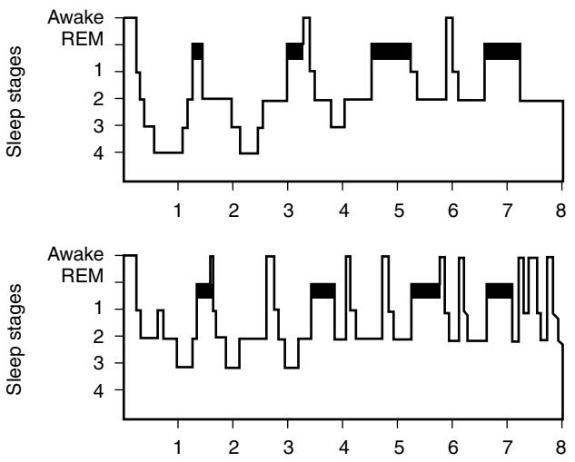

# Sleep, Aging, and Late-Life Insomnia

Holly J. Ramsawh Harrison G. Bloom Sonia Ancoli-Israel

# **INSOMNIA Epidemiology**

In most,1–6 but not all studies,7–10 the prevalence of insomnia has been found to increase with age. It has typically been reported in one quarter to one third of people aged 65 and over (see Table 111-1). However, as more stringent definitions of insomnia are increasingly being used, lower prevalence rates have been estimated, particularly when daytime impairment has been used as a criterion.3,4,6,11 Epidemiologic studies have also tended to show that insomnia is more common among older adult women than among older men1,2,6,8,12 (Table 111-1), although a few surveys have found no gender differences,7,10 or found differences for some but not all insomnia subtypes.13 However, a recent meta-analysis of gender differences in insomnia found that women were indeed at greater risk for insomnia than men, and that this discrepancy in female insomnia risk relative to males increased after age 65. Findings also suggest that insomnia is higher among lower income and lower educational attainment groups.1–4,8,9

Insomnia appears to be widespread in medical settings, although it often goes unreported by patients and consequently underrecognized by providers.14–18 Prevalence rates of insomnia symptoms in primary care settings have ranged from 30% to 69%.14,15,17,18 In addition, one recent study found that 42% of new benzodiazepine prescriptions written for older adults in primary care settings were indicated for insomnia symptoms.16 In addition, those reporting sleep problems tend to show significantly higher consumption of health care resources than those who do not.19–21

Information on the incidence of insomnia in older adults (i.e., the rate of onset of new cases of insomnia) is more limited. Using strict criteria for insomnia (see Table 111-1), the U.S. National Institute for Mental Health (NIMH) catchment study found a modest age-related increase in the 1-year incidence of insomnia, with incidence rising from 5.7% among those between ages 18 to 25, to 7.3% among those aged 65 and over.11 In one large study of insomnia incidence in a sample of 6899 participants, Foley et al reported age-related rises in insomnia incidence for both men and women.22 Within the age groups 65 to 74, 75 to 84, and 85 and over, this study found 3-year insomnia incidence rates of 12.4%, 15.1%, and 20.5% respectively, for men and 14.4%, 16.7%, and 13.7% for women.22 The overall annual rate was 5%. In a more recent study examining the incidence of specific insomnia subtypes in older adults, the annualized incidence of trouble falling asleep was found to be 2.8% over a mean follow-up period of 3.5 years, and significantly higher in women than in men (3.4% versus 1.9% per year).23 The annualized incidence of frequent awakenings was noticeably higher at 12.3%, with no significant effect of gender.23

## **Natural history of insomnia**

The nature and duration of insomnia symptoms appear to change with advancing age. Table 111-2 shows the distribution of specific insomnia complaints among older adults (the categories are not mutually exclusive, as respondents may report more than one problem). Of the studies which report data for sleep onset, maintenance, and early morning awakenings (EMA), sleep maintenance problems are the most prevalent sleep complaint in the majority of these studies. Similar to other types of sleep complaints, rates of EMA show considerable variation across studies, ranging from 0.9% in China6 to 45% in Japan.7

Several longitudinal studies suggest that insomnia symptoms persist over time. Foley et al reported that of nearly 2000 individuals reporting insomnia at baseline, more than half continued to report symptoms at 3-year follow-up.22 One survey of general medical practice patients found that 69% of those with insomnia at baseline still had insomnia at 12-month follow-up.24 Furthermore, persistence of insomnia symptoms was significantly associated with older age. Another study employing a sample of 1870 participants aged 45 to 65 years old from the general population found that at 12-year follow-up, 75% of those with insomnia at baseline still carried the diagnosis.25

## **Changes in sleep architecture**

Numerous studies have reported age-related changes in sleep architecture. However, many of these studies have reported conflicting findings about a number of sleep indices. Importantly, a recent analysis of data from the Sleep Heart Health Study (SHHS) provides normative data on sleep architecture in almost 2700 adults, including a sizeable proportion of older adults.26 The SHHS employed rigorous standards for scoring and analyzing of polysomnography data, and excluded individuals using psychotropics, those with restless leg syndrome, and individuals with systemic pain conditions. Whether participants had a history of each of several common medical conditions, including cardiovascular disease, diabetes mellitus, and chronic lung disease, was also recorded. The large sample size and exclusion of individuals with comorbid conditions known to impact sleep architecture suggest that the SHHS findings may be broadly representative of normative sleep architecture data in middle-aged and older adults. Thus the SHHS data figure heavily into the discussion of structural changes in the sleep of older adults.

#### **CONTINUITY OF SLEEP**

The sleep of older adults is more fragmented than that of their younger counterparts, being characterized by more frequent shifts between sleep stages and more periods of wakefulness during sleep (see Figure 111-1). Polysomnogram (PSG) evidence suggests increased awakenings at night

| Location               | Year | Age   | No. of older respondents | Overall | Women | Men   |
|------------------------|------|-------|--------------------------|---------|-------|-------|
| National Sample, U.S.1 | 1985 | 65–79 | 798                      | 25.0a   | NR    | NR    |
| NIMH Catchment, U.S.11 | 1989 | 65+   | 1801                     | 12.0b   | NR    | NR    |
| East Boston, Mass.2    | 1995 | 65+   | 3537                     | 33.7c   | 36.4  | 29.4  |
| New Haven, Conn.2      | 1995 | 65+   | 2717                     | 27.5c   | 31.11 | 21.21 |
| Iowa2                  | 1995 | 65+   | 3028                     | 23.2c   | 25.4l | 19.5l |
| 4 states,* U.S.12   | 1997 | 65+   | 5201                     | NR      | 30.0n | 14.0n |
|                        |      |       |                          | NR      | 65.0o | 65.0o |
| Japan7                 | 2000 | 60+   | 766                      | 29.5d   | NR    | NR    |
| Norway3                | 2001 | 60+   | NR                       | 14.7e   | NR    | NR    |
| Sourth Korea4          | 2002 | 65+   | 314                      | 26.6f   | NR    | NR    |
|                        |      |       |                          | 8.2g    | NR    | NR    |
| Wisconsin59            | 2002 | 53–97 | 2800                     | 49.0h   | NR    | NR    |
| 4 European countries†5 | 2003 | 65+   | 2759                     | 24.1i   | NR    | NR    |
| Taiwan8                | 2004 | 65+   | 2045                     | 6.0j    | 8.0   | 4.5   |
| Shandong, China6       | 2005 | 65+   | 1679                     | 32.9k   | 36.4  | 28.7  |
|                        |      |       |                          | 8.91    | 10.1  | 7.5   |
| National Sample, U.S.9 | 2006 | 65–74 | 3308                     | 9.2m    | NR    | NR    |
| National Sample, U.S.9 | 2006 | 75–84 | 2381                     | 6.6m    | NR    | NR    |
| National Sample, U.S.9 | 2006 | 85+   | 739                      | 2.1m    | NR    | NR    |
| Brazil10               | 2007 | 60+   | 6963                     | 33.7n   | NR    | NR    |

NR = data not reported.

\*North Carolina, California, Maryland, and Pennsylvania.

†Italy, Germany, Portugal, United Kingdom

a Insomnia defined as "had trouble and was bothered a lot" by "trouble falling asleep or staying asleep"

b"… had trouble falling asleep, staying asleep, or waking too early" for a period of 2 weeks or more, and consulted a professional about it, took medication for it, or stated that it interfered with life a lot, and "… if it was not always the result of physical illness"

c"trouble falling asleep and/or waking up too early and not being able to fall asleep again most of the time"

d"often" or "always" has trouble getting to sleep, staying asleep, or waking too early

emean sleep latency >30 minutes, mean wake after sleep onset >30 minutes, or waking up at least 30 minutes earlier than preferred >10 days per month, and DSM-IV criteria met for insomnia disorder

f difficulty falling asleep, disrupted sleep, early morning awakenings, or nonrestorative sleep, at least one of which occurs 3+ days per week gDSM-IV criteria met for insomnia disorder

hdifficulty falling asleep, waking repeatedly, or "waking up and finding it difficult to fall back asleep," at least one of which occurring "often" (5–15 times per month) or "almost always" (16–30 times per month)

i difficulty falling asleep, staying asleep, or nonrestorative sleep *and* daytime impairment

j sleep latency >30 minutes or (wake after sleep onset > 3 times per night *or* early morning wakenings > 2 hours earlier than usual), either of which occurring 3+ times per week *and* accompanied by either poor subjective sleep quality or a moderate or greater degree of daytime dysfunction

ktrouble sleeping due to sleep latency >30 minutes, "night awakenings," or early morning awakenings, at least one of which occurring 3+ times per week

l one or more insomnia symptoms *and* daytime consequences occurring one or more times per week

mregularly occurring insomnia or trouble sleeping in the past 12 months

n"fitful and disturbed sleep" in the past 30 days.

even among healthy older adults who do not complain about their sleep.27 Nocturnal awakenings tend to be more common among men than women.26 "Microarousals" (2 to 15 second bursts of alpha activity) have also been observed in the electroencephalograms (EEG) of sleeping older adults.28 Microarousals, which are not accompanied by behavioral awakenings, are associated with daytime sleepiness.28 In the SHHS, the arousal index (total number of EEG arousals from sleep divided by total sleep time) increased significantly with advancing age.26

#### **DURATION OF SLEEP**

Although sleep disruption becomes more pronounced with age, sleep duration appears to experience a decline. Van Cauter et al found that in a sample of men ages 16 to 83, total sleep time decreased on average by 27 minutes per decade from midlife until the eighth decade.29 As a result, sleep efficiency (time spent asleep divided by time spent in bed) also tends to decrease.26 A recent meta-analysis of 65 objective sleep studies representing 3577 participants ages 5 to 102 found that in adults, both total sleep time and sleep efficiency decreased with age.30

#### **DEPTH OF SLEEP**

With advancing age, there is a reduction in EEG slow waves (stages 3/4 or slow wave sleep; SWS; Figure 111-1).30 In addition to a decrease in SWS, increases in stages 2 (light sleep) and 1 (drowsiness) have been reported.30 SHHS data suggests that there are gender differences in sleep architecture in that men have lighter sleep as they age relative to women.26 Specifically, the men had more Stage 1 and 2 sleep with increasing age, whereas there was no detectable effect of age on Stage 1 and 2 percentages in women. In addition, there were gender effects on SWS. Men had proportionally less SWS compared with women in each age group, and there was a steep and significant age-related decline in SWS in men, but no significant age-related changes in percentage of SWS in women. This putative gender effect on age-related SWS changes may explain why Ohayon et al found no significant change in SWS after age 60 in their meta-analysis of relevant studies.30 Therefore, while there may be changes in depth of sleep with age, these changes may be confined to men, or at least more evident in males.

In addition, studies of auditory awakening thresholds (the minimum amount of noise required to wake a sleeping

| Problems (%) Among Older |          |                       |       |             |     |  |  |  |  |
|--------------------------|----------|-----------------------|-------|-------------|-----|--|--|--|--|
|                          |          | PEOPLE WITH INSOMNIA† |       |             |     |  |  |  |  |
|                          | Location | Age                   | Onset | Maintenance | EMA |  |  |  |  |

U.S. (men)12 65+ 14.0 65.0 30.0

U.S. (women)12 65+ 30.0 65.0 34.0 National sample (Japan)7 60+ NR 77.0‡ 45.1‡ National sample, Norway3 60+ 18.1 26.7 27.9 National sample, S. Korea4 65+ 7.5 21.0 5.3 Wisconsin59 53–97 21.2 36.2 24.1 National sample, Taiwan8 65+ 6.7 4.7§ NR Shandong, China6 65+ 8.5 8.6 0.9

**Table 111-2. Distribution of Specific Complaints Among Older People With Insomnia Living in the Community Reported** 

*Onset,* problems getting to sleep; *Maintenance,* problems staying asleep; *EMA,* early morning awakening; *NR,* data not reported.

\*North Carolina, California, Maryland, and Pennsylvania.

†Categories not mutually exclusive.

‡Calculated from reported data.

4 states,\*

4 states,\*

§Data reported is combined prevalence of problems staying asleep and early morning wakenings.

Figure 111-1. Sleep stage profiles for typical younger (above) and older (below) people. Note the decrease in stages 3 and 4, and the reciprocal increase in stages 1 and 2 with increasing age (for an 8-hour sleep).

person) show qualitative changes in the depth of individual sleep stages. It has been shown, for example, that during stages 2, 4, and REM, older people are more easily awakened by noise (i.e., have lower auditory awakening thresholds) than are younger people (this despite reductions in the hearing sensitivity of older subjects).31 However, in a study of the effects of aircraft noise on the sleep of people living near a major airport, Horne et al32 found that while awakenings in response to aircraft noise were most common in the oldest age group (ages 50 to 70), other factors, such as having children in the household, appeared to be more influential than aging in determining arousals.

#### **REM SLEEP**

The proportion of REM sleep has also been shown to decline with age.33 Van Cauter et al found that REM sleep was reduced by as much as 50% in older adults compared with their younger counterparts.29 However, Ohayon et al did not replicate this finding; they found that while REM sleep decreased between young and middle adulthood, percentage

of REM sleep remained stable over time in adults older than 60.30 A recent meta-analysis by Floyd et al, who used an analytic approach designed to detect nonlinearity in age-related REM change, found a small but significant decline in REM until the mid-70s, followed by a small increase in REM sleep percentage. Taken together, these studies suggest that REM is relatively well preserved in older adults, that if there is a decrease in REM sleep in older adults, it is modest, and that this small decline in REM sleep may begin to stabilize during the seventh decade of life.

# **The aging circadian rhythm**

The circadian rhythm itself also shows evidence of agerelated fragmentation, with sleep becoming more desynchronized and likely to impinge on daytime activities.34,35 Recent research suggests that an age-related reduction in sleep promotion of the circadian pacemaker, along with decreased homeostatic pressure for sleep in older adults, may be involved in this desynchronization.36

# **Comorbidity MEDICAL COMORBIDITY**

There is a strong association between insomnia complaints and chronic medical conditions. Foley et al found that only 7% of new cases of insomnia in older adults occurred in the absence of health-related risk factors.22 In community surveys of older adults, poor self-reported health, nocturnal micturition, and chronic pain are frequently associated with increased risk of insomnia.3,6,8,10 In 2003, the National Sleep Foundation survey of adults aged 65 and older found a significant positive correlation between insomnia and current medical conditions, including cardiac and pulmonary disease.37 In studies examining the prevalence of insomnia in specific medical conditions, it was found that 31% of arthritis and 66% of chronic pain patients report difficulty falling asleep; 33% of diabetes, 57% of end-stage renal disease, 81% of arthritis, and 85% of chronic pain patients report difficulty staying asleep; and 44% of cancer, 45% of gastroesophageal reflux disease, and 50% of patients with congestive heart failure report sleep initiation and maintenance difficulties.38–44 In knee pain and osteoarthritis, predictors of greater insomnia complaints included a greater number of involved joints and knee pain severity.43 In chronic obstructive pulmonary disease (COPD), insomnia also appears related to severity. A group of patients with moderate to severe COPD with demonstrated reduced oxygen saturation also reported poor sleep quality.45

#### **PSYCHIATRIC COMORBIDITY**

Psychiatric conditions are also highly associated with insomnia. Studies estimate that over 40% of individuals with persistent hypersomnia or insomnia have a psychiatric diagnosis.11 Having insomnia has been associated with increased risk of onset of depression in the future, particularly for older women.46,47 In one follow-up study on 1053 men who provided information on sleep habits in medical school and who had been followed since graduation, the authors found that those who went on to develop depression by 34-year follow-up were more likely to report experiencing insomnia during medical school.48 Although the relationship between insomnia and depression has been more consistently studied, recent surveys also suggest that insomnia is also often associated with anxiety disorders in older adults.24,49 Recent data from Ohayon et al,5 which used a large community survey of individuals from four European countries, suggest that while insomnia typically precedes or cooccurs with the onset of depression, insomnia symptoms are more likely to develop at or after the onset of an anxiety disorder.

### **Treatment**

Although pharmacologic treatments are available for insomnia, recent evidence suggests that behavioral approaches to insomnia treatment may be more effective than medications for older adults,50,51 and thus may be considered either as a first-line treatment, or in combination with medication.52 Combination treatment may allow patients to gain immediate relief from medication, whereas long-term relief of insomnia may be best achieved with behavioral treatment.

#### **BEHAVIORAL TREATMENT**

Behavioral treatment of insomnia, which involves a set of techniques collectively referred to as cognitive behavioral therapy (CBT), typically begins with psychoeducation about insomnia. During this phase, the behavioral model of insomnia is discussed, and factors that contribute to insomnia, such as heredity, medical and psychiatric comorbidity, and poor sleep hygiene, are introduced. Sleep hygiene involves promoting good sleep habits and avoiding sleepincompatible behaviors in the bed/bedroom (e.g., establishing a set wake-up time, no napping during the day, keeping the bedroom at a cool temperature at night to promote sleep), which patients are instructed to adhere to in order to improve their sleep. Sleep hygiene instructions are tailored to each patient depending on his or her own sleep habits. The most frequently studied components of CBT for insomnia are sleep restriction and stimulus control. Although these components have sometimes been implemented as stand-alone treatments for insomnia, they are typically employed together in the context of the CBT approach to insomnia. Sleep restriction entails instructing patients to limit the time they spend in bed to the average number of hours slept per night plus 15 minutes (e.g., if a participant reports sleeping 6.5 hours per night on average over the past week, they will be instructed to spend 6.75 hours in bed per night). Time spent in bed is lengthened, typically in 15-minute increments, as sleep efficiency improves. Patients' time in bed is stabilized once their weekly sleep efficiency reaches 85% to 90% or higher, which is considered within the normal range. Stimulus control is used to decrease the alertness and arousal that many individuals with insomnia feel while in bed, and to increase the association of bed with sleepiness. It entails instructing the patient to sleep only in bed, to get out of bed whenever he or she feels alert and aroused or when awake more than 10 to 15 minutes, and to return to bed only when he or she begins to feel sleepy again. Although CBT for insomnia typically totals 6 to 8 sessions, abbreviated forms of CBT have been tested. One drawback of CBT is that clinical effects of treatment may take 2 to 4 weeks to emerge.53

#### **PHARMACOLOGIC TREATMENT**

Many classes of medication have been used to treat insomnia, including sedative-hypnotics, antidepressants, antipsychotics, antihistamines, and anticonvulsants, some of which are prescribed "off-label." However, a recent state-of-thescience report on insomnia from the National Institutes of Health concluded that there is no systematic empirical support for the effectiveness of antipsychotics, antihistamines, barbiturates, anticonvulsants, or antidepressants for treating insomnia.52 In addition, the report expressed concern about the side effects of some of the off-label agents commonly used for insomnia, suggesting that the risks outweigh the benefits. Some of the risks associated with use of pharmacologic treatment of insomnia, such as increased risk of falls, may be particularly concerning for older adults. A newer class of medications known as type-1 γ-aminobutyric acid (GABA) benzodiazepine receptor agonists, which includes zaleplon, eszopiclone, zolpidem, and zolpidem MR, has been shown to be effective and safe in treatment of insomnia in older adults.54–57 A melatonin agonist, ramelteon, has also been approved for insomnia associated with difficulty falling asleep, and has shown promise in older adults.58

### **Sleep-disordered breathing**

Sleep-disordered breathing (SDB) refers to a range of periodic respiratory events that occur while asleep, from mild snoring to partial cessation of airflow (hypopnea) to complete airflow cessation (apnea).The severity of SDB is measured by the apnea hypopnea index (AHI). Data suggests that the prevalence of SDB increases with age.59,60 Older individuals with dementia, and institutionalized elderly patients, have especially high rates of SDB, although reasons for these findings are not entirely clear.61 One factor contributing to increased prevalence of sleep-disordered breathing in those with certain forms of dementia may be that areas of the brainstem involved in respiration and other autonomic functions are affected by the disease process in dementias.

Medical and behavioral risk factors for SDB include obesity, male gender, increasing age, family history, smoking, alcohol consumption, craniofacial features, and upper airway configuration.62 In those with SDB, primary symptoms include snoring and excessive daytime sleepiness, which arise due to recurrent arousals from sleep and sleep fragmentation. About half of regular snorers have some degree of SDB, and snoring may also be a risk factor for SDB.63 Other common presentations include daytime napping and falling asleep at inopportune times during the day. Functional impairment, particularly in social and occupational areas, is common in those with SDB. Cognitive deficits, such as short-term memory problems or difficulty concentrating, may also occur; in those with baseline cognitive impairment, these symptoms may be exacerbated.64 SDB has been linked to cardiovascular disease, including coronary artery disease, heart failure, and stroke.65–67

Of the treatment options for SDB, continuous positive airway pressure (CPAP) is considered the gold standard. CPAP improves the symptoms of SDB, along with improving cognitive function in older adults.68,69 However, adherence can sometimes be an issue because some patients find the mask inconvenient or uncomfortable; these patients should work with their provider to find a model that is tolerable for them. Alternatives to CPAP include dental devices and surgery; however, the outcomes for these methods are typically not as favorable as for CPAP, particularly in older adults. Patients should also be educated on the importance of healthy body weight, smoking cessation, and alcohol consumption because each contributes to favorable outcome of SDB. Medications such as long-acting benzodiazepines and narcotics should be avoided if possible because they have been shown to increase the frequency and duration of apneas.

## **Periodic limb movements in sleep/restless leg syndrome**

Periodic limb movements in sleep (PLMS) are repetitive leg jerks or kicks that occur while asleep. These movements typically occur in clusters approximately 30 seconds apart, and can recur throughout the night, leading to brief arousals and fragmented sleep. Consequently, many of these patients may have complaints of insomnia, nonrestorative sleep, and excessive daytime sleepiness. Diagnosis is based on a periodic limb movement index (movements per hour during sleep) greater than 5. Restless leg syndrome (RLS) is commonly comorbid with PLMS, and is characterized by uncomfortable, "creepy crawly" sensations in the legs that typically occur during resting, wakeful states. Those afflicted find that moving the legs in response to these sensations temporarily relieves discomfort caused by these sensations. RLS also occurs while the patient is resting in bed, and may interfere with sleep initiation. Roughly 80% of adults with RLS also meet diagnostic criteria for PLMS.70 The cause of both PLMS and RLS is not well understood, although RLS may be more likely to occur with iron deficiency (such as in pregnancy), radiculopathy, uremia, and peripheral neuropathy.

The prevalence of PLMS increases significantly with advancing age, with one study finding that 45% of older adults experiencing symptoms consistent with the diagnosis.71 The presence of RLS also increases with age.72 Although the gender distribution is roughly equal in PLMS, about twice as many older women experience RLS compared with men.73

Evidence-based treatment for PLMS/RLS includes agents that target leg movements or associated arousals. At present, dopamine agonists are recommended as a first-line treatment because they have been found to reduce the number of kicks and associated arousals.74,75 Ropinirole and pramipexole are the only dopamine agonists currently approved by the U.S. Food and Drug Administration for the treatment of RLS.

## **Rapid eye movement (REM) sleep behavior disorder**

Rapid eye movement sleep behavior disorder (RBD) occurs when the gross motor paralysis typically associated with REM sleep is intermittently absent. As a result, the sleeper may laugh, yell, kick, punch, or engage in other elaborate behaviors as they respond to dream content. RBD-related behavior typically occurs during the second half of the night, when REM periods are more frequent. These behaviors can often be violent or aggressive, and can result in injury to the patient or to bed partners. RBD occurs almost exclusively in older males,76 and is highly prevalent in Parkinson's disease and related neurodegenerative conditions. In some cases, RBD may signal the onset of one of these neurologic conditions, and may occur years before diagnosis.76,77 In cases of acute onset, RBD has been associated with posttraumatic stress disorder.78 The overall estimated prevalence of RBD is 0.5% in the general population.79

Treatment of RBD is primarily pharmacologic, although strategies that decrease the likelihood of injury include placing pillows or cushions around the sleeper's bed, or having partners sleep in another room if behaviors are especially violent, can also be helpful. The pharmacologic treatment of choice is the clonazepam, a sedating benzodiazepine, which has been found to be beneficial for patients with RBD in up to 79% of cases.80 In patients with RBD for whom clonazepam is contraindicated, melatonin has also shown promise in RBD treatment.81

## **Sleep in dementia**

Demented patients have a high prevalence of disturbed sleep compared with healthy older adults, with 19% to 44% experiencing sleep disturbances. Sleep features in dementia can include abnormal nighttime behavior, wandering and confusion, agitation ("sundowning"), and daytime napping. These symptoms may be more prominent in institutionalized demented patients. One study showed that demented older adults living in institutions may not spend a single hour completely awake or asleep during a 24-hour period.82 One contributing factor to this may be inadequate light exposure because previous studies have found that institutionalized patients with adequate light exposure had fewer sleep disruptions.83 Many demented older adults have a comorbid sleep disorder such as SDB or a medical condition that contributes to the sleep disturbance such as chronic pain; the effects of medications to treat medical or psychiatric conditions may also interfere with sleep. However, sleep disturbance in demented patients may also occur in the absence of any contributing comorbid condition, and may be related to the dementing process itself. Supporting evidence includes findings that severity of sleep disturbance is positively correlated with dementia severity.82

After a thorough assessment of possible contributing factors to sleep disturbance, treatment should focus on the responsible sleep disorder, if one is detected. Nonpharmacologic interventions may include the introduction of increased activity via exercise or social activity, which may address the problem of unintended dozing during the day, particularly in institutionalized demented patients. Restriction of time in bed, increasing bright light exposure during the day, decreasing light at night, and making the environment more quiet at night have all been shown to improve sleep in this population will address poor sleep hygiene and inadequate light exposure. Nonpharmacologic approaches are preferable to medications for older individuals with dementia.

## **SUMMARY**

Aging is associated with significant changes in sleep depth, duration, and architecture. Sleep disorders are often more common in older adults and thus may contribute to insomnia complaints in aging populations. However, sleep problems may also arise as a result of changes in the circadian rhythm, medical or psychiatric comorbidity, and the side effects of medications. Diagnosis of occult sleep disorders requires a thorough sleep and medical history, supplemented by overnight sleep recording when appropriate. Treatment may include somatic interventions, behavioral strategies, or combination treatment depending on the disorder. Successful treatment may significantly improve sleep and daytime functioning in older adults.

# KEY POINTS

#### Sleep, Aging, and Late-Life Insomnia

- Sleep disorders are common in older adults.
- Sleep architecture changes with age, with sleep becoming lighter.
- Most sleep problems are a function of medical and psychiatric illness, medications, and primary sleep disorders, and are not a function of age per se.
- Diagnosis of sleep disorders requires a thorough sleep and medical history. For some primary sleep disorders, an overnight sleep recording should be considered.
- Treatment may include behavioral strategies, pharmacologic treatment, or combination of both.

For a complete list of references, please visit online only at www.expertconsult.com