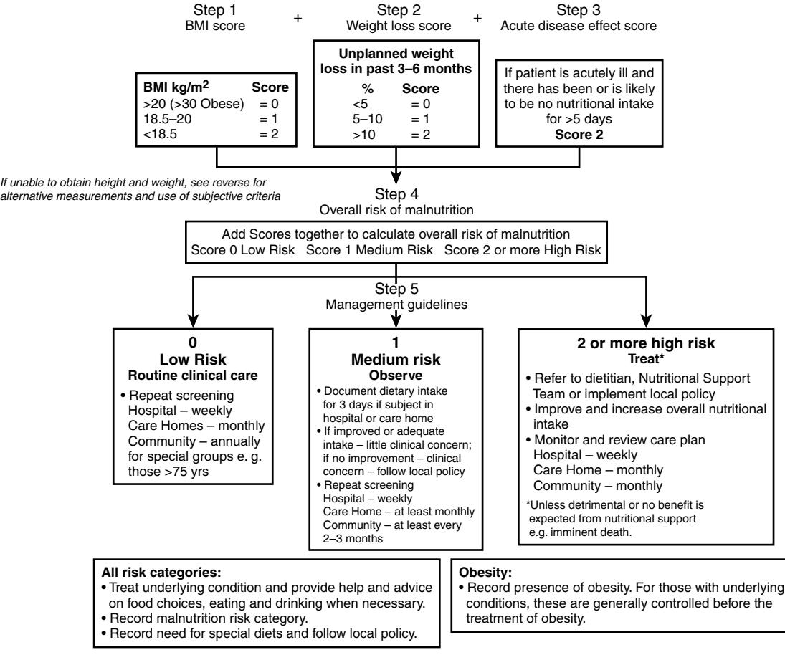

# Malnutrition in Older Adults

Larry E. Johnson Dennis H. Sullivan

Malnutrition may refer to both deficiencies (such as protein, calorie, vitamin, mineral, etc.) and excesses (e.g., obesity and hypervitaminosis).1 This chapter will focus on common nutritional concerns in older adults: proteinenergy undernutrition (PEU), hydration, artificial feeding, and end-of-life nutrition. Vitamin health will be covered in Chapter 82 and obesity (i.e., overnutrition) in Chapter 83. As people age, the risks for undernutrition increase. Five to 10% of community-dwelling older adults are undernourished.2 Undernutrition in hospitalized elderly persons is frequently unrecognized and untreated,3 for example, hospitalized patients are often not fed for extended periods of time in preparation for various procedures. In one study of 700 older hospitalized men, 21% had a daily intake of less than 50% of maintenance requirements, and this low intake was associated with an eight times higher mortality risk.4 Estimates for the prevalence for PEU in long-term and subacute care facilities vary from 12% to 85%.5–8 As is true within hospitals, staff in these facilities also fail to recognize undernutrition.9

Weight loss is a cardinal sign for PEU and can develop in association with many disorders, including cancer, heart failure, pulmonary disease, diabetes mellitus, and thyroid disease. Detection of weight loss is important in the care of older adults. Older men who lose more than 3 kg/yr over 5 years have a 3.5 times greater mortality risk than those who have no weight change.10 Losing 5% of weight in any one month is associated with a tenfold higher risk for death in long-term care residents compared with residents who gain weight.11 Even much slower weight loss, such as 5% over 1 year12 or 10% over several decades13 is associated with an increased mortality risk.

Characterizing undernutrition using terms such as marasmus and kwashiorkor, clinical syndromes originally described in third-world children, has also been used with adult malnutrition. It is proposed that a distinction be made between persons who have "simple" starvation (which may be the same as what is referred to as marasmus) from those who have inadequate caloric intake in the presence of inflammatory states (which may be subclinical). This latter syndrome has variably been referred to as cachexia, kwashiorkor, hypoalbuminemic malnutrition, or wasting disease.14,15 Although far more needs to be learned about the metabolic basis of PEU that develops in association with other disease states, there is growing evidence that disease-induced inflammation triggers a catabolic response that is relatively refractory to nutritional support alone. Even when protein and energy intakes are higher than estimated requirements, there is often continued catabolism of both fat and lean body mass, particularly skeletal muscle (see Chapter 73).16 In addition, it is important to be wary of trying to distinguish voluntary from involuntary weight loss, particularly in the frail older adult17; any weight loss in this population, even in the obese, should be considered potentially serious. On the other hand, stable weight or weight gain in physically inactive older adults who are obese may mask muscle loss, leading to the condition of sarcopenic obesity.18,19

### **Failure to thrive and frailty**

Weight loss and malnutrition are often associated with other physiologic and functional impairments and increased mortality. "Failure to thrive" is a poorly defined term that has been variously characterized as a syndrome in older adults accompanied by weight loss, anemia of chronic disease, reduced immune function, and low albumin and cholesterol, along with functional and cognitive decline.20–22 This syndrome may be part of the spectrum of inflammation-induced catabolism described above with marked cachexia representing an advanced stage. Frailty is a related, but better defined, concept.23 Indicators of frailty include unintended weight loss (defined as >5% weight loss over the previous 1 to 2 years), weakness/impaired walking, exhaustion, and poor physical activity.23,24 Studies of both older males and females from the Cardiovascular Health Study and the Women's Health Initiative Observational Study have found that frailty is associated with increased risk of death, hip fracture, disability, and hospitalization.23,24 The importance of a dysregulated inflammatory response as a contributor to frailty in older adults is being investigated. Weight loss may also precede the diagnosis of Alzheimer's disease.25

# **The anorexia of aging**

With advancing age, appetite and food intake steadily decline, even in the absence of serious acute or chronic disease. Paralleling the change in appetite, there is usually an associated decline in energy expenditure (i.e., level of physical activity). Whether the declines in energy intake and expenditure are causally related is not known with certainty. However, both contribute to the progressive weight loss seen in many older adults after about age 60 to 70 years. The magnitude of this problem is indicated by population-based studies that reveal a progressive decline in the prevalence of overweight and obesity, and an increase in the prevalence of underweight (BMI < 18.5) with each decade of life after age 60.26 With advancing age, the physiologic processes that regulate body weight and that link nutrient intake and energy expenditure apparently lose their compensatory responsiveness to changes in energy demands.27 This was demonstrated in one study of young and old adults who were placed on energy restricted diets. Both groups lost weight. However, at the end of the fast, the older adults regained their lost weight more slowly and less completely than the younger subjects.28 These findings suggest that a reduced ability to regulate appetite and food intake may contribute to the progressive loss of weight that many older individuals experience as they age.

A thorough assessment of any older adult who is losing weight is mandatory to determine if there are potentially reversible causes and to assess the severity of the anorexia.29 Sometimes even an extensive evaluation fails to find any contributing causes for the weight loss. The term "Anorexia of Aging" has been coined to describe such older adults with isolated anorexia. It is hypothesized that this age-associated anorexia may result from any number of physiologic changes seen in older adults including impaired gastric motility, exaggerated adiposity signals from leptin and insulin, and/ or postprandial anorexigenic signals from cholecystokinin (CCK) and peptide YY (PYY).30 It may also entail a cytokine-dependent process as many older adults have elevated blood cytokine levels.16,31

#### **Protein-energy undernutrition (PEU)**

There is no "gold standard" laboratory test for PEU. Laboratory tests of so-called nutritional biochemical markers (e.g., serum albumin, transthyretin/prealbumin, α-acid-1 glycoprotein, or transferrin) have poor specificity. The synthesis and distribution of all of these serum proteins are probably more strongly affected by cytokine-associated inflammation (as "acute phase reactants") than nutrient intake. The sensitivity of these markers is also low. This is particularly true of serum albumin. The serum concentration of albumin may remain near normal during uncomplicated slow starvation. Thus it is possible to die of starvation with a normal serum albumin concentration. However, because of their responsiveness to physiologic stress, serum albumin and some of the other serum secretory proteins are important health status indicators; a low level is associated with increased morbidity and mortality, independent of nutritional status.32 No biomarker is readily available to distinguish simple starvation from cachexia, and measuring nonspecific markers for inflammation, such as erythrocyte sedimentation rate or C-reactive protein, is not recommended.

#### **Nutritional screening**

There are a variety of screening tools to assess for nutritional risk. These instruments do not necessarily confirm that an individual has malnutrition, but they are useful for identifying those who need a more thorough nutritional evaluation. The Mini Nutritional Assessment (MNA) (Figure 112-1) has a six-question screening test.33 If an older adult scores at nutritional risk, there are 12 more questions (including estimates of consumption, self-assessment, and anthropometric measures of midarm and calf circumference) to aid in assessing the probability of malnutrition. The Malnutrition Universal Screening Tool (MUST) (Figure 112-2) has also been validated for older adults and has alternative measurements for patients whose height cannot be measured or who cannot be weighed (for detailed information: www.BAPEN. org.uk).34,35 In the United States, nursing home residents must have a minimum data set (MDS) completed within 14 days of admission, at any major change in condition, and at yearly intervals.36 This document includes an assessment for nutritional risk, including chewing or swallowing problems, or mouth pain; complaints about the taste of food or complaints of hunger; IV fluids or hyperalimentation; feeding tube, mechanically altered or therapeutic diets, or oral syringe feeding; between meal supplements; adaptive feeding equipment; planned weight change programs; an estimate of percent calories consumed over the previous 7 days; height and weight over the previous 30 days; and weight loss or gain over the past 30 and 180 days. The MDS regulations for nursing home residents require a thorough evaluation for any resident who loses 5% of weight in 1 month or 10% in 6 months.36

Accurate estimates of a patient's height, weight, and weight loss are important. These measurements are sometimes difficult to obtain. Direct measurement of height may not be valid due to the presence of spine curvature. An older patient's memory of current or maximum adult height is frequently inaccurate; formulas to estimate height using demispan (half total arm span), ulna length, or knee height (using special calipers) are available. Identification of weight loss, using the MDS guidelines above, and an estimate of calorie intake, are important in identifying PEU. Weight measurement accuracy is highly dependent on the skill of the examiner; weights obtained by trained persons maintaining strict adherence to protocol are more reliable and can differ substantially from those obtained routinely by nursing staff. On the other hand, relying only on a patient's weight or body mass index (BMI) may not identify individuals who are malnourished but have fluid overload or sarcopenic obesity.

### **Chewing and swallowing**

Healthy aging is generally associated with little clinical change in chewing and swallowing. Many medications (particularly anticholinergic and antimuscarinic drugs), Sjögren's syndrome, and radiation therapy for head and neck cancers decrease salivation, causing xerostomia and increasing the risk of dental caries and hampering chewing and swallowing.37 Poor dental hygiene, missing teeth, poorly fitting or missing dentures are common, and cause reduced food intake, and require the evaluation of a dentist.38 Proper routine dental care for the uncooperative patient requires training for the family, nursing staff, and the dentist. Finding a dentist especially trained in examining and treating resistive patients can be challenging if a gerodentist is not available.

The gastrointestinal tract generally shows little dramatic change with aging, though the accumulation of multiple small changes may contribute to the development of the anorexia of aging (see previous discussion).39 Esophageal motility may be impaired ("presby-esophagus") with less efficient peristalsis. Medication transit and absorption may be affected by this change and pills may remain for a prolonged period in the esophagus of older persons who are supine. It is therefore recommended that older patients take more fluids with medications and then remain upright for at least 30 minutes rather than lying down immediately. This is a particularly important issue for older adults taking medications known to cause esophageal irritation. Gastroesophageal reflux and hiatal hernia increase with aging, with associated dyspepsia. In most cases, symptoms are managed with dietary avoidance of food that increase symptoms; universal avoidance of hot and spicy foods is not necessary. Widespread use of antacids for dyspepsia is extremely common; antacids reduce gastric symptoms but can increase the risk of pneumonia (stomach acid is valuable in killing bacteria that are swallowed) and may reduce absorption of some vitamins and minerals (e.g., B12 and iron) in very frail persons.40,41 Further workup of uncomplicated dyspepsia is necessary only if alarm symptoms or signs appear such as weight loss, fall in hemoglobin, or gastrointestinal bleeding (see p. 623).

Dysphagia (or difficulty eating) can arise as a consequence of problems in any phase of eating including the anticipatory phase, preparatory phase, mastication (the oral phase), swallowing (pharyngeal phase), and/or passage of food or

| Last name: |             | First name: | Sex:         | Date: |
|------------|-------------|-------------|--------------|-------|
| Age:       | Weight, kg: | Height, cm: | I.D. Number: |       |

Complete the screen by filling in the boxes with the appropriate numbers.

Add the numbers for the screen. If score is 11 or less, continue with the assessment to gain a Malnutrition Indicator Score.

| Screening                                                                                                                                                                                          | J How many full meals does the patient eat daily?                                                                                                                                                                                                                                   |  |  |
|----------------------------------------------------------------------------------------------------------------------------------------------------------------------------------------------------|-------------------------------------------------------------------------------------------------------------------------------------------------------------------------------------------------------------------------------------------------------------------------------------|--|--|
| A Has food intake declined over the past 3 months due to loss of appetite, digestive problems, chewing or swallowing difficulties? 0 = severe loss of appetite                               | 0 = 1 meal 1 = 2 meals 2 = 3 meals                                                                                                                                                                                                                                            |  |  |
| 1 = moderate loss of appetite 2 = no loss of appetite                                                                                                                                           | K Selected consumption markers for protein intake • At least one serving of daily products (milk, cheese, yogurt) per day yes no                                                                                                                                        |  |  |
| B Weight loss during the last 3 months 0 = weight loss greater than 3 kg (6.6 lbs) 1 = does not know 2 = weight loss between 1 and 3 kg (2.2 and 6.6 lbs) 3 = no weight loss           | • Two or more servings of legumes or eggs per week yes no yes no • Meat, fish or poultry every day 0.0 = if 0 or 1 yes 0.5 = if 2 yes                                                                                                                       |  |  |
| C Mobility 0 = bed or chair bound 1 = able to get out of bed/chair but does not go out 2 = goes out                                                                                       | 1.0 = if 3 yes L Consumes two or more servings of fruits or vegetables per day? 0 = no 1 = yes                                                                                                                                                                          |  |  |
| D Has suffered psychological stress or acute disease in the past 3 months 0 = yes 2 = no                                                                                                  | M How much fluid (water, juice, coffee, tea, milk) is consumed per day? 0.0 = less than 3 cups 0.5 = 3 to 5 cups                                                                                                                                                           |  |  |
| E Neuropsychological problems 0 = severe dementia or depression                                                                                                                                 | 1.0 = more than 5 cups                                                                                                                                                                                                                                                              |  |  |
| 1 = mild dementia 2 = no psychological problems                                                                                                                                                 | N Mode of feeding 0 = unable to eat without assistance 1 = self-fed with some difficulty                                                                                                                                                                                      |  |  |
| F Body Mass Index (BMI) (weight in kg)/(height in m2) 0 = BMI less than 19                                                                                                                      | 2 = self-fed without any problem                                                                                                                                                                                                                                                    |  |  |
| 1 = BMI 19 to less than 21 2 = BMI 21 to less than 23 3 = BMI 23 or greater                                                                                                                  | O Self view of nutritional status 0 = views self as being malnourished 1 = is uncertain of nutritional state 2 = views self as having no nutritional problem P In comparison with other people of the same age, how does the patient consider his/her health status? |  |  |
| Screening score (subtotal max. 14 points) 12 points or greater Normal – not at risk – no need to complete assessment 11 points or below Possible malnutrition – continue assessment |                                                                                                                                                                                                                                                                                     |  |  |
| Assessment                                                                                                                                                                                         | 0.0 = not as good 0.5 = does not know                                                                                                                                                                                                                                            |  |  |
| G Lives independently (not in a nursing home or hospital)                                                                                                                                          | 1.0 = as good 2.0 = better                                                                                                                                                                                                                                                       |  |  |
| 0 = no 1 = yes                                                                                                                                                                                  | Q Mid-arm circumference (MAC) in cm 0.0 = MAC less than 21                                                                                                                                                                                                                       |  |  |
| H Takes more than 3 prescription drugs per day 0 = yes 1 = no                                                                                                                                | 0.5 = MAC 21 to 22 1.0 = MAC 22 or greater                                                                                                                                                                                                                                       |  |  |
| I Pressure sores or skin ulcers 0 = yes 1 = no                                                                                                                                               | R Calf circumference (CC) in cm 0.0 = CC less than 31 1 = CC 31 or greater                                                                                                                                                                                                    |  |  |
| Ref. Vellas B, Villars H, Abellan G, et al. Overview of the MNA® - Its History and Challenges. J Nut Health Aging 2006;10:456–465.                                                              | Assessment (max. 16 points)                                                                                                                                                                                                                                                         |  |  |
| Rubenstein LZ, Harker JO, Salva A, Guigoz Y, Vellas B. Screening for Undernutrition in Geriatric Practice: Developing the Short-Form Mini Nutritional Assessment (MNA-SF).                      | Screening score                                                                                                                                                                                                                                                                     |  |  |
| J. Geront 2001;56A: M366–377. Guigoz Y. The Mini-Nutritional Assessment (MNA®) Review of the Literature - What does it tell us? J Nutr Health Aging 2006; 10:466–487.                        | Total Assessment (max. 30 points)                                                                                                                                                                                                                                                   |  |  |
|                                                                                                                                                                                                    | Malnutrition Indicator Score                                                                                                                                                                                                                                                        |  |  |
| © Nestlé, 1994, Revision 2006. N67200 12/99 10M For more information: www.mna-elderly.com                                                                                                       | 17 to 23.5 points at risk of malnutrition Less than 17 points malnourished                                                                                                                                                                                                 |  |  |
|                                                                                                                                                                                                    |                                                                                                                                                                                                                                                                                     |  |  |

Figure 112-1. The Mini Nutritional Assessment (MNA). The initial assessment is a six-question screening test. If an older adult scores at nutritional risk (11 points or less), there are 12 more questions to aid in assessing the probability of malnutrition. A score of 17 to 23.5 indicates a high risk for malnutrition and less than 17 indicates probable malnutrition.33,130,131 *(Reprinted with permission from Societe des Produits Nestle S.A., Vevey, Switzerland.)*

Advancing Clinical Nutrition

# 'Malnutrition Universal Screening Tool' ('MUST')

BAPEN is registered charity number 1023927 www.bapen.org.uk

#### 'MUST'

'MUST' is a five-step screening tool to identify **adults**, who are malnourished, at risk of malnutrition (undernutrition), or obese. It also includes management guidelines which can be used to develop a care plan.

It is for use in hospitals, community and other care settings and can be used by all care workers.

#### **This guide contains:**

- A flow chart showing the 5 steps to use for screening and management
- BMI chart
- Weight loss tables
- Alternative measurements when BMI cannot be obtained by measuring weight and height.

#### The 5 'MUST' Steps

#### Step 1

Measure height and weight to get a BMI score using chart provided. *If unable to obtain height and weight, use the alternative procedures shown in this guide.*

Step 2

Note percentage unplanned weight loss and score using tables provided.

Step 3

Establish acute disease effect and score.

#### Step 4

Add scores from steps 1, 2 and 3 together to obtain overall risk of malnutrition.

Step 5

Use management guidelines and/or local policy to develop care plan.

Please refer to *The 'MUST' Explanatory Booklet* for more information when weight and height cannot be measured, and when screening patient groups in which extra care in interpretation is needed (e.g. those with fluid disturbances, plaster casts, amputations, critical illness and pregnant or lactating women). The booklet can also be used for training. See *The 'MUST' Report* for supporting evidence. Please note that 'MUST' has not been designed to detect deficiencies or excessive intakes of vitamins and minerals and is of **use only in adults**.

#### **Re-assess subjects identified at risk as they move through care settings** See *The 'MUST' Explanatory Booklet* for further details and *The 'MUST' Report* for supporting evidence.

Figure 112-2. The Malnutrition Universal Screening Tool (MUST) has been validated for older adults, with low risk, medium risk, and high malnutrition risk.34,35 *Reproduced with the kind permission of BAPEN (British Association for Parenteral and Enteral Nutrition). (For further information on this tool contact:* www.BAPEN.org.uk*)* fluids down the esophagus (esophageal phase).42 Details of the neurophysiology of swallowing can be found elsewhere.43 Dysphagia may include signs and symptoms of difficulty chewing or swallowing, with the sensation of food getting stuck in the throat or chest and/or coughing or choking with swallowing. Patients with these symptoms require a thorough history and physical examination, especially of the head and neck regions to identify possible causes. The prevalence of dysphagia in community dwelling elderly varies from 7% to 28% (increasing with frailty)44 but may also be relatively common even in younger adults.45 Persons with degenerative neurologic disorders such as Alzheimer's disease and other dementias may have a tonic bite (refusing to open their mouths when fed) or hold food in the mouth for prolonged periods (swallowing apraxia). However, dysphagia may be present with less obvious symptoms, and should be considered whenever there is weight loss, decreased appetite, prolonged eating time, food falling from the mouth, food debris staying in the mouth, nasal or oral regurgitation, wet voice, or hoarseness after eating.46 Any possible symptoms of oral or pharyngeal stage dysphagia that do not quickly resolve should be assessed by a speech-language pathologist (SLP) or an ENT (ears, nose, throat) specialist. Esophageal stage problems (e.g., esophageal cancer, candidiasis, reflux esophagitis, Zenker's diverticulum, hiatal hernia, varices, Barrett's esophagus, Schatzki's ring) will need assessment by a gastroenterologist, with esophagogastroduodenoscopy (EGD), string capsule endoscopy, or other specialized evaluations.47 Dysphagia is an expected complication of head, neck, and esophageal cancers, and many of the therapies directed at these conditions; pretreatment swallowing exercises may benefit some of these patients.48 There are a variety of survey instruments to screen for dysphagia; they are of limited usefulness for most clinicians but may be of benefit to SLPs.49,50

Oropharyngeal dysphagia occurs commonly after strokes and during the course of many neurodegenerative diseases, such as dementia and Parkinson's disease. Chronic swallowing disorders also appear to be common in independentliving elderly; 33% of older adults in one study reported a current problem.51 Dysphagia following a stroke is associated with decreased survival in the 3 months after a stroke, and increased risk of nursing home placement.52 SLP assessment can be very useful in assessing persons who are not chewing or swallowing normally, who cough with eating, or who are losing weight for unknown reasons. These experts can assess chewing and swallowing using many modalities, and often provide valuable treatment suggestions, although the evidence on the effectiveness of many of these strategies is limited. The most accurate diagnostic test for dysphagia is considered to be videofluoroscopy (or the modified barium swallow), but this requires radiation exposure. Fiberoptic endoscopic evaluation of swallowing (FEES) also appears to be quite accurate and can be performed at bedside, wherein air is blown through an endoscope in the nose down to the soft palate or pressure is applied to the pharyngeal muscles to trigger an observable swallow.53,54 In the absence of SLP resources, several bedside tests may be useful, including the GUSS (Gugging swallow screen) (observing patients during a saliva swallow, then semisolid thickened liquids, thin liquids, and finally dry toast),50 or the 3-oz (84 mL) water test, observing for coughing during, and for up to 1 minute

#### **Table 112-1. Strategies to Reduce Dehydration in Older Adults**

| Prepare for dehydration in older adults in high risk situations (sum mer heat without air conditioning, acute illness, delirium, etc.) Evaluate patient for possible benefit to drink using a straw Offer a variety of fluids during recreational and social activities; |
|-----------------------------------------------------------------------------------------------------------------------------------------------------------------------------------------------------------------------------------------------------------------------------------|
| "happy hours"; "tea times"                                                                                                                                                                                                                                                        |
| Consider offering options to water (juices, soups, water-rich fruits [watermelon, grapes, peaches] and vegetables [tomatoes, lettuce, squash])132                                                                                                                           |
| Discuss side effects/timing of diuretics to anticipate voluntary dehydration                                                                                                                                                                                                   |
| Offer a choice of fluid options, rather than only one or two                                                                                                                                                                                                                      |

following, drinking water.55 A comprehensive nursing protocol to assess and manage swallowing problems in frail older adults is available.56

A variety of treatment options are used by SLP experts to try to restore a normal swallow, including electrical stimulation, thermal stimulation, muscle exercises, and acupuncture.57 More extreme interventions (cricopharyngeus muscle myotomy, botulinum toxin injections, etc.) have an uncertain role.58 The use of modified diets can improve the safety of swallowing; SLPs and dietitians can provide guidance to patients, families, and staff on the use of such diets. For patients with difficulty swallowing thin liquids, adding thickening agents to provide nectar-like, honey-like, or spoon-thick, or fluids is an option.59 However, thickened liquids are often less palatable and may increase the risk for dehydration.60 Sitting patients upright when eating (and for some time afterwards), chin tucking when swallowing, eating more slowly, and use of various swallowing maneuvers are additional techniques (see Table 112-1). Methods that are more successful in persons with one cause for dysphagia may not work as well for another (see the "Aspiration and Aspiration Pneumonia" section).61,62

# **Constipation**

The frail older adult is prone to constipation for many reasons (anticholinergic and opioid medications, poor fluid intake, poor fiber intake, little physical exercise, etc. [see Chapter 108]). Constipation is a common cause of poor food intake in the frail or bedbound older adult, and proper monitoring of bowel movements can be very useful in assessing reasons for reduced dietary intake of these patients.

# **Thirst and hydration**

Adequate fluid intake may be associated with fewer falls, less constipation and laxative use, improved rehabilitation outcomes, less bladder cancer, and lower rates of postprandial orthostatic hypotension.63,64 Risk for dehydration increases with advanced age, race (blacks have higher risk than whites), use of certain medications (diuretics, laxatives, psychotropics, and general polypharmacy), physical dependency, dementia, delirium, and chronic disease.63,64 Healthy older adults have an age-associated decrease in thirst sensation (hypodipsia) and consume less fluid in response to the same degree of dehydration than younger adults.65–67 Hypodipsia can be even more pronounced in older adults suffering from chronic disease; perhaps 30% of nursing home residents are dehydrated at any point in time.68 Darker urine color in persons with adequate renal function, blood urea nitrogen:creatinine ratio (>25:1 mg/dL), serum osmolality (>300 mmol/kg), serum sodium (>150 mEq/L), urine specific gravity (>1.029), and urine output (<800 mL/day) may aid in the detection of dehydration.69–71 Skin turgor is not an adequate tool to detect dehydration in older adults. Older adults at highest risk of dehydration include those who have a diminished thirst drive due to neurodegenerative conditions, those who cannot access or safely consume fluids due to physical or cognitive impairments or dysphagia, those who will not drink enough because of fears of urinary incontinence or have never consumed many fluids, and those at the end of life.68 Distinguishing patients in this manner may aid in selecting the optimal prevention and treatment strategies.

Water requirements are not defined well for adults, let alone for older adults. In healthy adults, hydration status remains normal despite large individual differences in intake. Fluid goals should be tailored to each individual; for example, there may be competing goals with patients with fluid overload (as found with congestive heart failure) (Chapter 40), with hyponatremia with the syndrome of inappropriate secretion of antidiuretic hormone (SIADH) (Chapter 85), and with respect to activity level or environmental temperature. A daily water intake (including free water, water in other beverages, and water in food) of 3.7 L for men and 2.7 L for women meets the needs of most healthy persons, including advanced ages.72 This should not be considered a minimum intake. A reasonable initial goal for sedentary older adults may begin with 30 mL/kg/day or 1500 to 2000 mL/day of fluids; this goal can then be adjusted based on blood urea nitrogen levels, urinary output, and clinical status. Possible intervention strategies are presented in Table 112-1. The poorer palatability of thickened liquids may reduce intake and not meet patients' fluid requirements.60 In cases where oral fluid intake is temporarily decreased, for example, due to an acute infection, subcutaneous infusion of fluids (hypodermoclysis) for a day or two until adequate drinking resumes is easy to accomplish and may avoid intravenous access or hospitalization.73

#### **Refeeding syndrome**

Nutritional requirements are discussed in Chapter 82, and feeding someone can be based on those recommendations. There are several formulas that may be useful in initially calculating caloric needs; none are perfect but the Harris-Benedict equations (Table 112-2) serve as a starting point for average individuals.74 However, in patients with significant chronic undernutrition (such as prolonged starvation), feeding too much and too rapidly can cause the refeeding syndrome, with rapid falls in blood phosphorus, potassium, and magnesium; sodium and water retention leading to fluid overload; and altered glucose homeostasis.75,76 Electrolyte deficiencies, pulmonary edema, cardiac decompensation, and death become likely. High carbohydrate intake increases thiamine requirements and can precipitate acute Wernicke's encephalopathy in undernourished persons with unrecognized thiamine deficiency (e.g., alcoholics). It is critical to identify individuals at high risk for refeeding syndrome before beginning nutritional support, provide thiamine and other micronutrient

#### **Table 112-2. Harris-Benedict Equations for Estimating Caloric Requirements**

| Men: 66.4 + [13.75 × weight (kg)] + [5.0 × height (cm)] – [6.8 × age]   |
|-------------------------------------------------------------------------|
| Women: 655.1 + [9.6 × weight (kg)] + [1.85 × height (cm)] – [4.7 × age] |

supplements immediately, and then begin feeding at about 25% of the estimated caloric goal (permissive underfeeding). As tolerated, intake can be increased slowly with the goal of reaching targeted daily intake after 3 to 5 days.75,76 Electrolytes should be assessed before refeeding, and then monitored every 4 to 6 hours for the first day or two. Initial fluid intake should be restricted to less than 1000 mL per day in these individuals, and weights accurately measured daily. Weight gain more than 1 kg weekly is a warning for fluid overload.

#### **Aspiration and aspiration pneumonia**

Aspiration pneumonia is common in older frail adults, particularly those who are hospitalized or institutionalized, and those with acute or chronic neurologic disease. It may also make up 5% to 15% of all community-acquired pneumonias.77 Highest predictors of aspiration pneumonia, which vary among differing patient populations, include the need for suctioning, COPD and CHF diagnoses, presence of feeding tube, feeding or oral care dependency, and being bedfast.78,79 Patients on respirators are also at very high risk. Aspiration pneumonia in frail older adults frequently has few classic symptoms; delirium (confusion, agitation, lethargy), unexplained elevated white blood cell counts, or tachypnea may be the only early indicators. Aspiration itself may occur without any obvious clinical signs, or with only episodic fever or reduced oxygen saturation.80–82 Approaches to reducing the risk of aspiration and aspiration pneumonia are outlined in Table 112-3.

In patients who have dysphagia, it is important to assess aspiration risk and whether this risk is influenced by the texture of the food consumed. In some of these patients, thin liquids present a particular problem. For these individuals, dietary modifications and adoption of specialized swallowing techniques may be important in reducing risk (see the "Chewing and Swallowing" section).50 A recent study83 did not find any clear difference in aspiration pneumonia risk between drinking thin liquids in a chin-down posture or thicker liquids in a normal posture in patients with dementia or Parkinson's disease (PD). Honey-like liquids appear to work better than nectar-like liquids or chin-down posture for many patients with dementia or PD.61 However, half the patients receive no benefit from these maneuvers, particularly those with the most severe dementia. Many patients and their families refuse to accept thickened liquids and prefer to accept the aspiration risk of thin liquids; this decision process needs to be thoroughly documented. Videofluorographic swallow study (VFSS) currently appears to be the best test to assess aspiration risk, and is recommended before restricting intake of thin liquids.53,54 Debilitated patients will continue to aspirate oral secretions and reflux, which are not prevented by SLP interventions or recommendations, and this is at least as important as prandial aspiration.84

#### **Table 112-3. Reducing Risk of Aspiration and Aspiration Pneumonia in Older Adults\***

- **All patients:** Improve oral hygiene/frequent teeth brushing/properly fitting dentures **Hand feeding:** Provide a rest period (>30 minutes) before feeding time Sit upright at 90 degrees, or highest position allowed by medical condition Avoid rushed or forced feeding; feeding by syringe is risky Alternate liquids with solids Recognize the high risks of sedatives, hypnotics, and other psychotropic meds, and try to wean or reduce dosages Speech-language-pathology referral: Evaluate patient for possible benefit of "chin down" position when swallowing or for possible benefit of adjusting liquid viscosity; thickened liquids of varying types may improve swallowing in some patients (ice cream and Jello are considered thin liquids) **Tube feeding** (both nasogastric and gastrostomy tube feeding may *increase* aspiration risks): Consider continuous feedings rather than intermittent (bolus) feedings Keep backrest elevated at least 30 degrees during feedings, if possible Consider pump-assisted feedings rather than gravity-controlled feedings A gastric residual volume >200 mL during continuous feeding or before intermittent feedings may increase risk (but this remains controversial)136 Prokinetic agents such as metoclopramide or erythromycin may improve feeding tolerance, but are associated with their own serious potential side effects. Placing the feeding tube tip beyond the pylorus (jejunostomy, gastrojejunostomy) may reduce aspiration in some patients Using colored dye in tube feeding is contraindicated (it was originally felt that adding coloring to liquid tube feeding formulas would help to identify probable feeding aspiration if the coloring was found after throat and pulmonary suctioning)137
- \* (Note: most of these suggestions are consensus and expert opinions rather than evidence based 133–135.)

Several medications have been proposed to reduce the risk of aspiration pneumonia, most notably the angiotensinconverting enzyme (ACE) inhibitors, but the evidence to support this intervention remains inadequate.77 Improved oral hygiene and regular tooth brushing may also reduce the risk of aspiration pneumonia.85,86 Treatment of aspiration pneumonia will include coverage for both gram-positive and gram-negative organisms, including anaerobic mouth organisms.

# **Improving nutrition**

Strategies to improve nutrition should be individualized, focusing on barriers specific to each person; strategies proven to be most successful entail multimodal interventions. Table 112-4 provides examples of such approaches. Appetite may improve when depression, pain, and constipation are treated, so these common disorders should be searched for whenever appetite is poor. For institutionalized older adults, appropriate social stimulation, one-on-one feeding support, increasing the variety of choices at and between meals, and a liberal food substitution policy are associated with increased calorie intake.87 Nursing home residents who are physically unable to feed themselves are at particularly high risk for weight loss if adequate care is not provided. It is well established that this risk can be reduced by the provision of feeding assistance by appropriately trained staff. Less well recognized is that many nursing home residents assessed by the nursing staff to be physically independent are also at high risk for weight loss. Recent studies indicate that these individuals can also benefit from close supervision, verbal cuing, and other forms of staff support at mealtime.88 Using nonnursing staff to transport patients to the dining room, deliver meals and provide substitute foods, document intake, and increase social stimulation may allow nursing staff to spend more time with mealtime feeding assistance.88

Weight loss in patients with dementia is often due to many interacting factors: self-feeding/chewing/swallowing difficulties; loss of hunger drive; and, occasionally, higher energy expenditure due to pacing coupled with failure of intrinsic regulatory systems for maintaining body weight.89 Unless other diseases are present, there is no consistent evidence that patients with dementia have higher resting energy expenditure or other evidence of hypermetabolism. Obstinacy and feeding aversions (turning the head away when food is offered, keeping the mouth shut, pushing the spoon or hand away, and spitting out food) are common in dementia and often require individualized and creative and persistent approaches to maintain an adequate nutrient intake.89–92

# **Appetite stimulation**

Medications designed to specifically improve appetite in older adults have not proven very effective, and many have considerable side effects or costs. Relatively few studies have targeted the frail older adult, and studies of cancer patients or persons with AIDS should not be presumed translatable to the aging patient. Corticosteroids, cyproheptadine, thalidomide, and human growth hormone lack proven effectiveness and are not recommended for appetite stimulation in older adults. Testosterone replacement or supplementation and other anabolic sex hormones (e.g., nandrolone) have important side effects and their use cannot be currently recommended in persons who are anorexic and losing weight without documented hypogonadism (see Chapter 58). Selective androgen receptor modulators (SARMS) have not yet been fully investigated but may play a future role.93

There is some evidence indicating that the cannabinoid, dronabinol, is effective in promoting weight gain in patients with Alzheimer's disease.94,95 However, this medication is very expensive and many frail patients do not tolerate the dysphoria that is a common side effect. If careful monitoring can be provided, a trial of use in patients with anorexia can be considered. Megestrol acetate (MA) (a "progestageniccorticoid-steroid") is another appetite stimulant that can be prescribed for frail older adults who are losing weight. Studies indicate that it is occasionally effective in increasing nutrient intake, inducing weight gain, and decreasing serum inflammation-associated cytokine levels.14 However, the physiologic significance of this latter effect is not known, the weight gain is primarily fat, and MA often produces several potentially serious side effects. Many of its side effects are a consequence of its corticosteroid agonist and antagonist properties and include suppression of the pituitary-adrenal axis, muscle loss, insulin resistance, and salt and water retention. MA also suppresses testosterone levels to castrate levels and may increase the risk of venous thromboembolism and death.96–98

#### **Table 112-4. Causes and Feeding Options in Patients Who Are Not Eating Enough68,87,89\***

#### **All Patients** Liberalize diet; offer variety of snacks between meals; offer food substitutions at meals Reduce/eliminate "therapeutic" diets (e.g., low cholesterol, low fat, low salt) Treat pain, constipation, depression Dental evaluation Give medications with high calorie liquid protein drinks Reduce/eliminate sedating and other medications that often reduce appetite, if possible (e.g., anticholinergic, NSAIDs, some antidepressants and other psychotropic medications, dementia medications) Train volunteers to feed patients/encourage family participation **Physically Capable** Independent: Educate, provide preferred/varied beverages, buffets, social stimulation, and encouragement Assess for depression Encourage exercise Dementia: Offer food/variety of high-energy/high-protein snacks frequently between meals; integrate fluids into activities, happy hours; roving beverage and snack carts Intensive dietitian involvement and staff education/awareness Eat out of bed, in a chair at a table, if possible Nonverbal and verbal cueing to encourage self-feeding, physical guidance; hand-over-hand technique to initiate and guide selffeeding; demonstrate eating movements for patient to imitate; show how to use utensils. Reduce distraction, turn off television Dentures in and eye glasses on Simplify: one food/plate at a time Observe for pocketing (cheeking) foods Less emphasis on "healthy" eating and more on food preferences **Cannot Eat or Drink Dysphagia:** SLP evaluation (see text) Assess for mouth and throat infections **Physically dependent:** Adequate assistance, allow sufficient time to eat a meal **Will not eat or drink:** (Patients who apathetic to eating or drinking may have frontal lobe dysfunction) Sippers/eating disorders: Geropsychiatry evaluation Fears incontinence: Adjust timing of diuretics/consider alternatives **End of Life** Review advance directives; discuss natural dying with patient and family, and the risks of artificial nutrition and hydration Treat pain/constipation/depression; avoid medication side effects Adequate hand feeding/assistance

\* More suggestions are available at www.ConsultGeriRN.org. (Note: Persons with co-existing inflammation and cachexia may respond poorly to efforts at increasing nutritional intake.)

Appetite stimulation and weight gain are potential side effects of certain antipsychotics and antidepressants. This fact may have relevance in choosing therapies. Depression is common in older adults with anorexia, and should be actively and repeatedly screened for (see Chapter 57). Although antidepressants may either increase or decrease appetite in any individual patient, there is some evidence that mirtazapine can induce weight gain. Trials of antidepressant therapy, including mirtazapine up to its maximum dose, should be considered in any older adult who has unexplained anorexia and weight loss. Assessment by geropsychiatry is also recommended for patients who do not respond to initial therapy.

Current research on appetite stimulation is targeted on cytokines as these chemicals may play a significant role in cachexia16,99,100; this includes a potential role for antiinflammatory nutrients such as n-3 polyunsaturated fatty acids. Any role for ghrelin is unknown.

#### **Enteral nutrition and tube feeding**

When oral intake is inadequate and is likely to remain so for some time, artificial nutrition support should be considered. The nutritional assessment should consider several factors including the urgency of the need, the prognosis of the underlying condition, whether the individual has a functioning gastrointestinal (GI) tract, and the individual's personal preferences. If the GI tract is not functioning properly, peripheral or total parenteral nutrition support should be considered. If it is functioning and tube feeding is appropriate, it is then necessary to choose the type of tube and formula to be used, and the rate, schedule, and method of formula delivery.

The patient's overall prognosis is a critical consideration. If the underlying condition contributing to the older adult's loss of desire or ability to eat can be treated and the individual has a reasonable expectation of recovering independent function, it is often advisable to provide nutrition support during the recovery period.101 This might be the case when the decline in nutrient intake occurs in association with major surgery, acute medical or psychiatric illness, or an acute and likely reversible exacerbation of a chronic medical condition. If the patient's BMI is greater than 18, the individual does not have a condition associated with exceptional metabolic demands, and volitional nutrient intake is expected to return to adequate levels within 5 days, nutrition support is probably not necessary.101–103 In these cases, efforts should focus on identifying and eliminating any possible contributor to the patient's low intake. Older patients who have not had any appreciable nutrient intake for more than 5 days or who are unlikely to resume oral feedings within a comparable amount of time, nutrition support is warranted.101–103 For patients with very little nutritional reserve (e.g., BMI <18), or high metabolic demands (e.g., extensive burns), initiate nutrition support if volitional intake cannot be restored within 2 or 3 days.101–103

If it is anticipated that tube feedings will be needed for less than 6 weeks, a soft (e.g., silicone or polyurethane), smallbore, nasoenteric feeding tube can be used. These tubes can be inserted at the bedside and their use avoids the need for an invasive procedure. The disadvantages of nasoenteric feeding tubes include increased risk of aspiration, sinusitis, and local nasal irritation; need for x-ray confirmation of correct placement before use; and the possibility of the tube being dislodged with coughing, vomiting, or poor patient tolerance. Tubes that are long enough to be passed into the duodenum or jejunum are useful when there is significant gastroparesis. Placement distal to the ligament of Treitz may also lower the risk of large volume aspiration, but it is often difficult to pass a tube beyond the stomach without endoscopic or fluoroscopic assistance.104 Great care is required to prevent tube obstruction.

For patients requiring long-term enteral nutrition support (i.e., >6 weeks), a tube enterostomy is preferable. Tubes can be placed either endoscopically, radiologically, or surgically. Surgical placement is usually used only when there is a contraindication to less invasive procedures or the patient is going to surgery for another reason. Tubes placed radiologically or endoscopically can be used within hours and the procedure is often done as an outpatient. Special tubes that can be advanced into the jejunum can be used when there is pathology preventing gastric feedings, or when there is intractable intolerance to gastric feeding. Use of percutaneous jejunostomy tubes is usually limited to hospitalized patients with complex GI problems. Major complications of percutaneous endoscopic/radiologic gastrostomy occur in approximately 3% of patients and include hemorrhage, bowel perforation, fistula, aspiration, and erosion of the internal tube bumper into the abdominal wall.101–103

The type of formula to be used should be determined based on the needs of the patient. In most cases, a nutritionally complete, polymeric, lactose-free formula is the best option. The polymeric formulas differ in terms of the ratio of fat, protein, and carbohydrates, caloric density, and fiber content. Although some patients, such as those whose medical condition cannot tolerate high fluid intake, may benefit from high-calorie or high-nitrogen formulas, other patients do not tolerate the higher osmolality of such formulas, which may contribute to the development of diarrhea. With very narrow tubes, it is important to avoid use of formulas of high viscosity and not to insert crushed medications into the tube.

Partially digested and elemental (e.g., amino acid) formulas are available for patients who have difficulty digesting whole nutrients. However, these formulas are rarely required and are expensive. If the infusion rate of the formula is increased slowly or pancreatic enzymes are provided when needed, standard polymeric formulas can usually be used.

For patients who are severely undernourished, tube feedings should be started slowly to prevent metabolic complications (see the "Refeeding Syndrome" section).75,76,105 Diarrhea, abdominal pain, and vomiting may occur when tube feedings are increased too rapidly. The use of tube feeding protocols to increase feeding rates to desired amounts, and closely monitoring laboratory values are recommended. Predictions of caloric intake are frequently inaccurate because tube feeding is frequently interrupted.

Some patients are eventually able to tolerate multiple, intragastric bolus feedings per day. This approach may be more physiologic and offers the advantage of allowing the patient to be intermittently disconnected from the feeding apparatus to enjoy more freedom of movement. This approach may also allow volitional oral feedings to be slowly introduced. Cyclic or nightly feedings may provide a similar advantage. For patients who do not tolerate bolus feedings or who need to be fed distal to the stomach, slow formula infusion by a pump is the preferred method. To minimize the risk of aspiration, the patient should be sitting upright at greater than 30 degrees during feedings, whether fed by bolus or slow infusion. Unless there is an absolute contraindication, patients receiving enteral nutrition support should always be allowed, and even encouraged, to resume volitional oral intake if tolerated. "Recreational" oral feeding, even if in small amounts, may be offered to patients with low aspiration risk to allow some of the hedonic sensations of eating.

# **Nutrition and hydration at the end of life (see also Chapter 116)**

There are significant emotional, cultural, and religious aspects to providing nutrition and hydration to someone nearing the end of life and, in some cases, legal constraints as well.106,107 It is often difficult to determine when aggressive nutritional support should be pursued and when someone should be allowed to die "naturally." Ideally, an ongoing dialogue among a patient, family members, and the health care team regarding advance directives should begin at adulthood when the patient is healthy and be based on the evidence of effectiveness before a health crisis.108 Preferences regarding use of nutrition support at the end of life, how the individual defines quality of life, medical futility, dying naturally, unrealistic expectations, and medically prolonged death should be part of these discussions. As age advances and health changes, these directives should be reconsidered, again based on as much current evidence as is available. Encouraging the participation of nurses and nursing aides in the hospital or nursing home, and also providing them the latest clinical evidence,109 may allow the health care team to present a unified, consistent, and supportive message, and maximize the chances for a peaceful death. Palliative care team referrals often benefit patients, families, and health care workers. Referral for hospice care is often delayed or avoided until shortly before death.110

The role of nutrition in end-of-life care is complex and controversial. Estimating life expectancy in patients with incurable disease is imperfect.110,111 Average life expectancy after diagnosis differs significantly from one disease to another and there is considerable controversy as to how best to define the terminal stage of most conditions whether it be metastatic cancer, heart failure, or end-stage dementia. The issue is further complicated by the fact that the type of care provided may have a significant impact on the duration of life, but not necessarily the quality of life. This is particularly true of nutrition support. As discussed above, cancerinduced cachexia is generally resistant to increasing nutrient intake, and nutrition support is usually not effective in prolonging life. In contrast, some patients with Alzheimer's disease and other dementias can be kept alive for many years if provided adequate oral or enteral nutritional support (and excellent nursing care). However, there is no evidence that nutrition support slows the progression of the cognitive deficits or lowers the risk of aspiration, pressure sores, or infections, and it does not lead to improvement in physical function.112–114 One observational study found no survival advantage for hospitalized patients with advanced dementia who receive a new feeding tube.115 Whereas eating is associated with pleasure, enteral feedings are not felt to add to the quality of life. For these reasons, artificial nutrition and hydration are considered appropriate for reversible diseases, but decisions may become more complicated with irreversible illness and when the patient does not have advance directives and cannot make informed decisions (see Chapter 116). Complicating the issue further, clinicians' attitudes toward the role of nutrition support at the end of life differ significantly by specialty, region of the world, and personal beliefs.116 Many health care providers, including oncologists and SLPs, encourage artificial nutrition and hydration and may cause confusion for patients and families (along with other staff) by using terms such as "life-sustaining" and "starvation.84,117,118" Dietitians and SLPs are more likely to recommend artificial nutrition and hydration than other health care professionals.119,120 Diverse ethnic and religious backgrounds (of both patients and clinicians) may result in different goals and values, and different attitudes towards end of life care that are often poorly appreciated or anticipated.121 Patient-family-health care provider discussions regarding prognosis, and education about the effectiveness or potential futility of various nutrition and hydration interventions are strongly recommended. If families need continuing support and education, and insist on artificial feeding and hydration, a therapeutic and finite trial of tube feeding can be instituted and can then be discontinued if the patient's condition has not improved or if the patient continues to be unable to consume enough food or fluids by mouth. This often allows

feeding and to come to terms with their depression and grief. The dying process is often extremely stressful for families to observe. There are often many fears and unasked questions. Proactively discussing the natural dying process with patients and families can be very beneficial, including education regarding the dying patient's naturally slow cessation of food and fluid intake, and the evidence that there is

family members to witness the futility of the purpose of the

no apparent suffering from this decline in intake.122,123 Families need to be educated that intravenous (IV) hydration is unlikely to provide comfort, and may actually increase secretions and respiratory difficulty in the dying patient. Patients receiving IV hydration at the end of life often require diuretics for edema, ascites, and/or respiratory distress.124 Families and patients need reassurance that pain management and treatment side effects (such as constipation, lethargy, confusion, etc.) will be anticipated and effectively treated.

Two clinical practice guidelines, from France and Canada,125,126 address artificial nutrition in terminally ill cancer patients; parenteral nutrition is recommended only in selected persons with gastrointestinal obstruction due to cancer, a life expectancy of more than 6 to 12 weeks, and who have good functional status (Karnofsky score >50%). These guidelines can improve decision making and reduce the inappropriate use of these interventions.127 Educating patients, families, and staff that artificial feeding and nutrition in persons who are terminally ill may increase suffering and not improve outcome is recommended.128,129

For a complete list of references, please visit online only at www.expertconsult.com