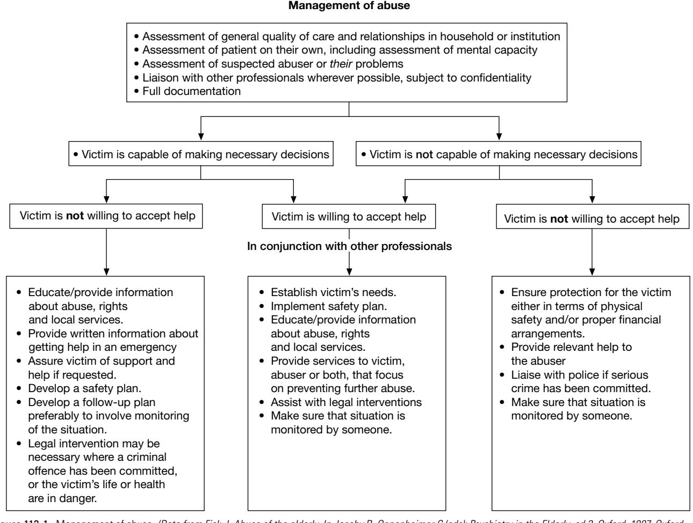

# The Mistreatment and Neglect of Older People

Anthea Tinker Simon G. Biggs Jill Manthorpe**\***

Although medical practitioners are generally informed about child abuse, elder abuse, mistreatment, and neglect have only recently developed an evidence base of any significance. In this chapter, we first examine the development of concern, definitions, prevalence, and risk factors. We then discuss ways in which they may be identified and consider prevention and responses. We write from the perspective of developments in the United Kingdom, and from studies in a wider European and North American context. The publication of "Hidden Voices" by the World Health Organization (WHO) in 20011 revealed widespread recognition of this problem internationally. There is scope for continuing to draw lessons from cross-national perspectives, while recognizing differences in service and legal provisions along with cultural interpretations of abuse, between countries. Throughout we are concerned that, although there are lessons to be learned from child abuse, simplistic parallels should not be drawn. For example, there are dangers in interventions narrowly focused on the *protection* of older people, if they are ageist in philosophy, or undermine autonomy and rights in civil and criminal law. The European Convention on Human Rights, now incorporated into U.K. domestic law, offers an important counter to these dangers.

# **HISTORICAL DEVELOPMENT**

Early concerns about mistreatment of older people were raised by doctors who saw a parallel with child abuse and placed the issue in the wider context of the care of older people both in their own homes and in institutions, emphasizing the importance of awareness and of good geriatric practice.2,3 However, an evidence base was slow to develop with notable exceptions.4,5 In its absence, abuse was linked to concerns about the stress placed on family caregivers by the care of older people, particularly those with dementia. Policy in many countries has drawn on developments from the United States. In England and Wales one policy response was the development of statutory guidance ("No Secrets6" and "In Safe Hands7") to establish multiagency (involving mainly health services, local government, and the police) systems through which concerns about the abuse of "vulnerable adults" might be addressed. The Mental Capacity Act 2005 created offenses relating to mistreatment or willful neglect of adults with mental incapacity. In the United Kingdom, policy developments have also responded to professional and pressure group concerns that elder abuse has been insufficiently resourced and prioritized (see Action on Elder Abuse8 and Help the Aged9).

# **DEFINITIONS**

Table 113-1 provides standard definitions and gives examples of both behavior and effect. Elder abuse, mistreatment, or neglect refer to the ill-treatment of an older person (usually defined as over age 65) by commission or omission. They may occur both in domestic settings (the older person's own home, a relative's home, or supported housing) and in institutions (care homes, nursing homes, and hospitals). Some kinds of behavior are criminal acts, such as assault and theft; others, such as verbal abuse, the restraint of someone who is aggressive, or overmedication, may be more contingent upon particular circumstances. Definitions are important because they determine "who will be counted as abused and who will not.10 Abuse and neglect refer to behavior within a relationship connoting trust. This distinguishes actions by those closely linked to the older person, such as family members, or others in positions of responsibility (such as a member of staff) for their care, from actions by strangers.

## **Different types of abuse and neglect**

There is now widespread agreement about five categories of abuse: physical violence; psychological abuse, often measured by persistent verbal aggression; financial abuse; sexual abuse; and neglect.10,11 Although sexual abuse is sometimes subsumed under physical abuse, it has been increasingly recognized as a form of abuse in its own right. There is still very limited information on how much these types of abuse occur together and how much they are separate phenomena, but the research suggests that they both occur singly *and* in combination, and that the explanations for the abuse, and therefore the factors relevant to risk, may vary accordingly. The U.K. prevalence study12 distinguished between forms of abuse that are interpersonal and of an intimate nature, financial forms, and neglect. Whether a common label and tendency to a common response are useful or not requires further research. The U.K. study gives a series of behavioral definitions of abuse that take frequency and severity into account that may be of greater use to professionals than ones intended for policy development.

# **Vulnerability of older people**

In the context of elder abuse, vulnerability may be related to conditions of physical and mental frailty, and disability. Socioeconomic factors, such as low income, minority ethnic background, and bad housing, have been associated with enhanced risks.13 The majority of prevalence studies has looked at older people living in community settings. Evidence for institutional forms of abuse tends to arise from public inquiries, inspection reports, and case studies. A study from the Czech Republic14 suggests that 6% of care home residents suffer mistreatment either from staff or other residents. Residents of nursing homes, or of any institution providing social and health care, may be deemed vulnerable

\*With acknowledgments to Claudine McCreadie, who coauthored the original chapter with Anthea Tinker.

by virtue of their increased disability or their living situation. Professionals are likely to have contact with older people, who, because of their physical and/or mental impairments, are least able to protect themselves. However, while there are various discussions about individual risks, it may also be

#### **Table 113-1. Definitions of Types of Abuse, With Examples of Behavior and Effects32**

**Physical abuse:** Nonaccidental infliction of physical force that results in bodily injury, pain, or impairment

- *Examples of behavior:* hitting, slapping, pushing, burning, physical restraint
- *Examples of effects:* bruises, fractures, burns, broken teeth, sprains, cuts, hair loss, bleeding from scalp, fear, anxiety, depression

**Psychological abuse:** The persistent use of threats, humiliation, bullying, swearing, and other verbal conduct, and/or of any other form of mental cruelty, that results in mental or physical distress

- *Examples of behavior:* treating an older person as a child, blaming, swearing, intimidating, name-calling, threatening violence, isolating older person
- *Examples of effects:* fear, depression, confusion, loss of sleep, loss of appetite

**Financial abuse:** Unauthorized and improper use of funds, property, or any resources of an older person

- *Examples of behavior:* misappropriating money, valuables, or property; forcing changes to will; denying access to personal funds
- *Examples of effects:* loss of money, etc., inability to pay bills, deterioration in health or standard of living, lack of amenities, unusual activity in bank accounts, signatures on documents uncertain, lack of solid arrangements for financial management, eviction or house sale notices

**Sexual abuse:** Direct or indirect involvement in sexual activity

- without consent • *Examples of behavior*
- *Noncontact:* looking, photography, indecent exposure, harassment, serious teasing or innuendo, pornography
- *Contact:* touching breast, genitals, anus, mouth; masturbation of either or both persons; penetration or attempted penetration of vagina, anus, mouth, with or by penis, fingers, other objects
- *Examples of effects:* difficulty in walking or sitting, bruises, bleeding, venereal disease, psychological trauma

**Neglect:** Repeated deprivation of assistance needed by the older person for important activities of daily living

- *Examples of behavior:* failure to provide food, shelter, clothing, medical care, hygiene, personal care; inappropriate use of medication or overmedication
- *Examples of effects:* malnutrition, pressure ulcers, oversedation; untreated medical problems, depression, confusion

worth thinking about vulnerable situations. This means that we should be looking more at the context of the individual rather than about personal vulnerability. For example, not all people with dementia are at risk and those who are vulnerable are likely to be those who have few people to safeguard their best interests.

# **PREVALENCE AND INCIDENCE**

Table 113-2 shows prevalence (in percentages) of elder mistreatment in North America, Canada, the United Kingdom, Amsterdam (in The Netherlands), and Spain. Studies have also taken place in Spain, the Czech Republic, Finland, Sweden, and Germany.15 The Spanish study16 is one of national community prevalence, indicating a figure of 0.8% reported by older people, but 4.5% by caregivers. The two major studies of community prevalence in North America4,17 were based on telephone interviews. The U.K. survey was based on individual interviews with people aged 66 and over.12 This found that overall 2.6% of people aged 66 and over living in private households reported that they had experienced mistreatment involving a family member, close friend, or care worker (i.e., those in a traditional expectation of trust or trust relationship) during the past year. When this 1-year prevalence of mistreatment is widened to include incidents involving neighbors and acquaintances, the overall prevalence increases to 4.0%.

One particular difficulty for studies using the general population is that people who are highly dependent on another person, and particularly people who have significant mental impairment, are unable to participate, except by proxy. In the United Kingdom and Spanish studies people with severe dementia or otherwise unable to take part were excluded from the research. In the Dutch study, nonresponse was relatively high for those with mental and physical incapacity.18 Yet it is precisely these people whom practitioners would identify as most vulnerable. Clinical and forensic markers indicating abuse and neglect point to the importance of dementia, depression, psychosis, and alcohol abuse.19 Declining health, loneliness, and depression have been associated with enhanced risk factors.12 A key finding from the U.K. prevalence study was that types of mistreatment vary by gender and age, such that neglect increases with age for women, but other forms of mistreatment

#### **Table 113-2. Prevalence of Elder Abuse in Boston, USA, 1986,4 Canada, 1990,17 United Kingdom,12,33 Amsterdam (The Netherlands) 1994,18 and Spain16**

|                | Boston,      |              |         | Amsterdam,      |         |
|----------------|--------------|--------------|---------|-----------------|---------|
|                | USA          | Canada       | UK      | The Netherlands | Spain   |
|                | 1986         | 1990         | 2006    | 1994            | 2006    |
| Type of abuse  | (%)          | (%)          | (%)     | (%)             | (%)     |
| Physical       | 2            | 0.5          | 0.4     | 1.2             | 0.3     |
| Psychological* | 1.1          | 1.1          | 0.4     | 3.2             | 0.6     |
| Financial      | Not in study | 2.5          | 0.7     | 1.4             | 0.9     |
| Neglect        | 0.4          | 0.4          | 1.1     | 0.2             | 0.6     |
| Sexual         | Not in study | Not in study | 0.2     | Not in study    | 0.1     |
| Multiple       | Not in study | 0.8          | any 2.6 | Not in study    | 0.8 any |
| Base:          | 2020         | 2008         | 2111    | 1797            |         |

\*Persistent verbal abuse.

decline. For men, however, abuse, especially financial abuse, increases with age.

#### **RISK FACTORS**

### **Physical abuse**

The most thoroughly researched area of physical abuse is that taking place in domestic settings:

- 1. Risk is higher for older people who live with someone.4,10,12,17 Older people may be abused by their partners, and by other relations including their adult children.
- 2. There is emerging research linking abuse with sociodemographic variables, such as marital status, occupation, and housing tenure.12 Ethnic background has been the subject of more debate.10,13 However, it is possible that these factors are overemphasized by both reporting bias and the confounding of race and poverty.
- 3. Some abuse is longstanding—Homer and Gilleard20 refer to the "elderly graduates of domestic violence." The predominance of women as victims of domestic violence at younger age groups is not so marked in the case of elder abuse.4,17 Lachs et al21 conclude: "Clinicians should be particularly aware of highrisk situations in which functional and/or cognitive impairment are present, especially in circumstances where violent behavior has been known to exist previously."
- 4. Lachs et al21 found that the number of activities of daily living (ADL) impairments approximately doubled the chance of reported abuse or neglect, and did not consider that reporting bias substantially influenced this finding.
- 5. There is little evidence that the stress of caring for an older person is on its own a cause of abuse. Large numbers of caregivers are under stress, but do not abuse their relative. How caregivers react to the stresses associated with caring may, however, be important.
- 6. Risk appears to depend more on problematic characteristics associated with the abuser particularly their physical and mental health and notably, in many studies, their heavy consumption of alcohol or drug substances.12,17,20,22 Research with general practitioners (GPs) (family physicians) linked identification of abuse with knowledge of these kinds of factor in patients' households. Those GPs who identified five or more of 15 risk situations were seven times more likely (all other variables held constant) to have identified a case of abuse.23
- 7. The role of dementia as a risk factor is controversial. Lachs et al21 observed that cognitive impairment, particularly if it was new, was highly significant. Research specifically with people with dementia and their caregivers found that the factors distinguishing the abusive situations related to caregivers.20 Behavioral and psychological problems among people with dementia, such as aggression, may be associated with aggression on the part of the person caring for them.20

## **Institutional settings**

There is growing research about abuse in institutions.24 Methods of caring assume significance, particularly as the prevalence of physical and mental disability is generally high among older people in institutions. Numerous inquiries in Britain into grave deficiencies in various areas of institutional care for all age groups have shown that abuse flourishes within a culture that allows it to be acceptable.25 The leadership role of clinicians in such settings should include attention to complaints, staff turnover, risk management, and direct patient care. It is the worst of all possible worlds, as older people themselves are only too aware, to move an older person to an institution for safety's sake only for them to be abused there.

## **Sexual abuse**

This type of abuse has been little researched. Those affected are overwhelmingly female and rely on others for their care but others may be at risk. Abusers may have problems themselves and need help. Attention should be paid to the potential for sexual abuse in residential and nursing home settings and to the risk of sexual abuse by other residents or visitors to the facility. Physical examinations should be alert to possible indicators of abuse, such as unexplained trauma in the genital area.

## **Financial abuse**

Nearly all definitions of elder abuse include financial abuse. The U.K. prevalence study showed that this was the most common form of abuse (after neglect) with a rate of 0.7%.12 It has been suggested that the boundaries are unclear between the financial mismanagement of people's affairs when they grow older and actual abuse. The financial affairs of older people with dementia appear often to be complex or confusing, thus increasing the risk of financial abuse. There is some evidence that financial abuse is more likely to be perpetrated by the extended family than by partners or paid care workers.12,17,26 When allied with physical and psychological abuse, the perpetrator may be a close adult relation (usually an adult child) with problems of their own, particularly relating to alcohol misuse.22 In England and Wales the Mental Capacity Act 2005 has strengthened the ability of people to make arrangements for their finances in the event of losing capacity to manage their money and set up a system of legal safeguards to reduce the likelihood of financial abuse. Other legal safeguards in England and Wales include systems to bar people from the paid and unpaid labor force if they are judged to have harmed or placed at risk of harm a vulnerable adult. This accepts a lower standard of proof than the criminal justice system. Financial abuse in the home has been discovered to be a major reason for banning staff working for older people.27 The implications for medical professionals are that when an older person is in unexplained financial trouble, that where there seems to be a sudden drop in their living standards and if they seem unable to afford previously affordable items, then history taking may help to uncover matters of concern that should be reported to adult protective services.

# **Neglect**

Neglect is generally interpreted as omission. However, opinion is divided about the appropriateness of classifying selfneglect as mistreatment in the context of adult protection

Figure 113-1. Management of abuse. *(Data from Fisk J. Abuse of the elderly. In Jacoby R, Oppenheimer C (eds): Psychiatry in the Elderly, ed 2. Oxford, 1997, Oxford University Press, pp. 736–48; Lachs MS, Pillemer KA. Abuse and neglect of elderly persons. N Engl J Med 1995;332:437–43; Kurrle S. Elder abuse: A hidden problem. Mod Med Aust 1993;9:58–72; and American Medical Association.)*

systems and local policies and procedures will assist in determining the clinical and care pathway. People whose needs are insufficiently met or ignored may be mentally frail, and unsurprisingly are in poor health.17 The partner, closely followed by other members of the family, is the most likely to be unable to provide necessary care, which may lead to a situation of neglect among community-dwelling older people.12

## **IDENTIFICATION**

Elder abuse is often hidden. The U.K. prevalence study,12 for example, indicated that only approximately 3% of mistreated older people were in touch with adult protection services. It estimated that approximately 1 in 40 older people visiting their family physician would, statistically speaking, be suffering some form of mistreatment but that contact with adult protection services was far less than might be expected. The majority of cases, whether in domestic or institutional settings, are likely to arise in either primary or secondary care as part of some other presenting problem. People who are abused are unlikely to volunteer information and may either fear retribution, not trust formal authorities, or not wish to criminalize significant others. Identification often depends on a high index of suspicion. Two surveys in England showed that many family physicians might not recognize abuse and would welcome training in both identification and management.23 Physical symptoms may be common to frail older people and be unreliable indicators alone.20 As prevalence is relatively low, accurate diagnosis assumes great importance. Incorrect diagnosis followed by misplaced interventions may damage all those concerned. Apart from increased sensitivity and awareness of the possibility of abuse, the first general principle, common to all good practice in geriatric medicine and psychiatry, is that assessment must be holistic and interdisciplinary.28 This may be time-consuming and some doctors may, under pressures of time and shortage of resources, be particularly unwilling to address issues of family violence. The logic of current research is that criminal justice and helping professionals should work together. Clinicians may be asked for opinions about possible abuse and their testimony may be vital in safeguarding an older person from further abuse but just as much in exonerating an innocent relative or care worker.

In the United States, where in some states the law requires mandatory reporting of alleged abuse cases, it is recommended that routine questioning should be built into daily practice and that in every clinical setting there should be a protocol for the detection and assessment of elder abuse. Knowing what to look for is key but so too is listening. There are benefits of a protocol or framework for questioning11,29 and this can be useful in the context of possible financial abuse along with physical and psychological abuse.26 Consultation with the older person on their own may be difficult but is advisable.24

Financial abuse is an issue that doctors may encounter in various ways.11 They may be approached to advise on financial decision making and the capacity of people to make decisions when this is in doubt. For example, they may be asked whether a person has the mental capacity to make an advance decision or to dispose of assets. They need to know to whom to refer people for appropriate guidance, to know the professional and legal guidance in their national context, to be aware of protocols around data sharing and evidence collection, and to ensure that the person understands what they are agreeing to. They may come across possible abuse in the course of patient contact and it is then necessary to know about local safeguarding systems. A small study of the views of geriatricians working in the United States found that the average number of cases of elder abuse diagnosed per year was about eight per geriatrician.30 Their diagnostic work rested on a combination of history taking and physical examination.

#### **PREVENTION, TREATMENT, AND MANAGEMENT**

The key objectives are the prevention of abuse and the promotion of the older person's human rights.6,10 At the level of policy and guidance, it is essential that the medical profession is properly represented where any professional or local initiatives are taking place to develop a response to abuse. Experience from child protection suggests that this will not be easy to achieve. The issue of excessive or inappropriate medication being used as a form of abuse highlights the need for clinicians themselves to be careful of their own practices and those of their colleagues.

Two further general principles are meticulous documentation and liaison with other professionals, both within and outside medicine. The taking of photos or drawings, careful recording of suspected injuries, and conversations are important in collecting evidence. The difficulties of these and the time they take need to be taken into account when arranging consultations. The need to work interprofessionally raises difficult ethical questions in terms of confidentiality of the doctor-patient relationship, should the older person request the doctor to "do nothing." The older person's rights to autonomy have to be balanced with decisions that may need to be made in their best interests should they not have the capacity to consent or to refuse information sharing. The need for criminal justice intervention may arise if a crime is suspected to address possible dangers. The assessment of mental capacity, therefore, is of crucial importance and helps direct physicians to the options for intervention if the older person is unwilling to accept any help. Advocacy can be a particularly valuable service for the older person at the center of this concern, and in England and Wales this is now available for some people in situations of suspected abuse without mental capacity. Figure 113-1 should be interpreted in relation to the type of abuse and to the legal and service provision context in which medical practitioners are working. In most countries the number of laws that potentially bear on abuse are considerable, and advice may be needed from adult protection services. In the event of an emergency, the medical practitioner needs to make immediate contact with other responsible agencies and act to protect the older person from harm. Although safety of the alleged victim is the first priority, it is also essential to pay attention to the physical and psychological health of the other party, who themselves may be vulnerable.

#### **SUMMARY AND CONCLUSION**

Elder abuse can be divided into four distinct forms, including physical, psychological, sexual, and financial. Abuse is often associated with neglect, which together are often referred to as "elder mistreatment." The development of behavioral definitions, more precise targeting of risk factors, and the characteristics of the parties involved have led to a greater understanding of the risks associated with each form. Abuse and neglect can occur in community or institutional settings. In each case the principal aim should be to prevent abuse and neglect from occurring through building safe and responsive systems, regular monitoring, and interprofessional collaboration. Medical practitioners have key roles in ensuring that systems are safe and in responding to suspicions and allegations by providing expert medical intervention and testimony. Their responsibilities for the treatment of physical harm are evident but they also include offering support for

# KEY POINTS

#### Elder Abuse

- Elder abuse refers to the mistreatment of an older person (usually defined as over age 65) by acts of commission or omission and key objectives are the prevention of abuse and the promotion of the older person's rights.
- It has been shown to affect between 2% and 6% of people aged over 65 depending upon definition and context and is generally understood to include physical, psychological, sexual, and financial forms.
- Risk of physical/verbal abuse appears to depend more on problematic characteristics associated with the abuser particularly their physical and mental health and notably, alchohol and drug misuse. Those involved in suspected abuse may need support and may have health care needs of their own.
- Likelihood of having been mistreated may vary depending on gender, separation or divorce, socioeconomic position, declining health, and depression, and there is little evidence that the stress of caring for an older person is on its own a cause of such abuse.
- Identification may be enhanced by a high index of suspicion and is particularly important because of relatively low prevalence and physicians need to be aware of local protocols and their legal and professional responsibilities.
- Holistic assessment is necessary, through discussion with the older person and informants, physical examinations and history taking, including of mental capacity. The wider care team may be usefully involved.
- The severity of effect of the abuse, its frequency, how long it has been going on, and the intentions and capacity of those in the social network help practitioners judge the case for and type of intervention.

people in risky situations. That abuse takes place between adults, distinguishes it from child abuse. It has certain commonalities with domestic violence, but is wider in scope and form.

Abuse and neglect may best be currently understood within a human rights framework.

The primary aim should be to prevent abuse from occurring. There are at least four planks in prevention. The first is the provision of effective health and welfare services for older people, including income and medical provision.31 The second is awareness among professionals, among which the medical profession is crucial, that abuse exists and requires a response, which may be most effective when it is multidisciplinary.6,29 This may involve criminal justice interventions, skills development11,24 and agreement to work within guidelines. It may also involve working with people who have mistreated older people or neglected them to prevent harm reoccurring. Third, in the context of a policy emphasis on care in people's own homes, is the need for recognition and action around caregivers, who may be both abuser and/or abused, older or younger themselves, and have physical and/or mental health problems. Finally, in the context of institutional care, monitoring or regulation of the quality of care is essential to respect the human rights of older people.

For a complete list of references, please visit online only at www.expertconsult.com