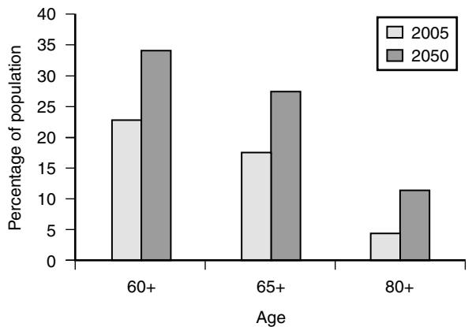

Peter Crome

## **AGING IN EUROPE**

In common with more developed countries throughout the world, the next 50 years will see a dramatic change in population demographics in Western Europe (Figure 118-1).

The EU-27 countries show a predicted increase for those aged 65 or more from 16.6 % of the total population in 2005 to 29.9 % by 2050,1 although these increases are not uniform across the member countries. A greater, almost triple, increase for those aged 80 years or more is projected by 2050 to more than 50 million people.1 These changes are due to reduced fertility and increasing life expectancy; however, there remain major differences in the latter between European countries. For example, for males in Estonia it is 67.3 and in Spain 77.0.1 The differences for women are not as great but still substantial at 78.2 and 83.7, respectively.1

The rationale for public policies to adapt to meet this population change are similar in all European countries. The need for specialized services for older people has also been recognized. Geriatric medicine as a distinct specialty has developed at different rates in different countries despite the needs of older people being relatively similar. This chapter summarizes the state of geriatric medicine in Europe and the work of organizations whose work is focused on improving the health of frail older Europeans.

## **Health care in Europe**

The requirement that in a civilized society all citizens should have access to good quality health care has been one of the principal features of European public policy. Different models have emerged based on state-funded systems, work-based or independent compulsory health insurance, or various combinations of the two. Some countries require copayments, others do not. There has also been recognition that older people are disadvantaged in terms of their burden of illness, disability, and poverty in relation to the rest of community. Special arrangements have been introduced in most countries to try and reduce these disadvantages. For example, in England all those over 60 years do not pay for prescription medication. European Union citizens are also entitled to health care in every other EU country as if they were a citizen of that country. However, the specific way health care is funded and what services are provided and by whom is a matter for national and in some countries, regional determination.

# **THE DEVELOPMENT OF GERIATRIC MEDICINE**

It is generally recognized that the identification of geriatric medicine as a distinct specialty resulted from the publications of Nascher in the United States.2,3 However, the development of a national geriatric medicine service has been credited to the United Kingdom and the pioneering work of Marjorie Warren who implemented her service at the West Middlesex Hospital.4,5 Fortuitously, this interest coincided with the introduction of a new universal National Health Service in 1948, which incorporated from its foundation a network of hospitals that provided care for the chronically disabled, most of whom were older people.

The history of the development of the specialty has been described in a previous edition of this textbook6 and further information can be found in the excellent articles of Barton and Mulley7 and of Morley.8 Therefore only an abbreviated account will be given here. Until the reformation care for older disabled and sick people was provided under the auspices of the monasteries. These were closed during the reign of Henry VIII (1509–1547) and responsibility for this group of people passed to the civil authorities, who as time went on, built institutions for their incarceration in what were called workhouses. The basic principle was that of "less eligibility" with life being worse than that of the poorest laborer. The scandal of the workhouse, drawn to public attention through the work of Charles Dickens' Oliver Twist for example led toward the end of the nineteenth century into the establishment of Poor Law Infirmaries, which in turn were transferred to the management of county and city municipalities in the 1920s. These hospitals became the first geriatric medicine hospitals in 1948. The arrangements of the NHS allowed for services to develop in accordance with local needs and the existing hospital structures. Three different types of geriatric medicine services were developed. The integrated model had geriatricians working alongside general physicians, often sharing wards and support medical staff.9 The age-related model saw medical emergency patients admitted to geriatric medicine or general medicine services according to age, most frequently 75.10 The third model, the "needs-related" service, saw geriatric medicine services taking responsibility for older people with complex needs but often not until their acute needs had been treated first. In practice many services were not so rigidly demarcated.

## WESTERN EUROPE POPULATION CHANGE

Figure 118-1. Western European countries population change. *(Data extracted from World Population Prospects: The 2006 Revision Population Database,*  http://esa.un.org/unpp*)*

# **GERIATRIC MEDICINE IN SELECTED COUNTRIES TODAY**

# **United Kingdom**

The National Health Service came into being in July 1948 based on the principles of universality and provision on the basis of need rather than the ability to pay. Devolution of political power to the Nation's of the United Kingdom (England, Scotland, Wales, and Northern Ireland) has produced differences in organizational structures, financial arrangements for medical staff, and patient co-payments but the underlying premise of "free at the point of use" remains. Private sector medicine is essentially geared to provide services for simple one-off conditions, whereas the management of chronic disease remains within the National Health Service.

All people are eligible to register with a general practitioner who now usually works in small groups or practices although so called "single-handed" practitioners remain. There is a right to register with a general practitioner of one's choice but in practice this may be difficult for those in rural areas and those who live in underdoctored areas and with those doctors whose list might be "full." The range of services provided by the primary care team varies but might include therapy, minor surgery, and specialist outpatient clinics. In rural areas they might dispense drugs.

General practitioners presently undergo a 5-year training program, a 2-year foundation program common to all physicians, followed by 3 years as a general practitioner registrar, which comprises 2 years in a hospital post and 1 year in a general practice. There is no obligatory requirement to have a placement in geriatric medicine or old age psychiatry.

Most general practitioners are so-called "independent contractors" who are paid by a combination of basic allowances, capitation fees, meeting specific service targets (e.g., identifying patients with hypertension) and fees per item of service. Others are salaried employed by the practice partners or by the local health service. Medical consultations involve no direct payment by patients and medications for older people are free.

General practitioners may have their competence in geriatric medicine recognized by undertaking a diploma examination organized by the Royal College of Physicians of London and of Glasgow. A few general practitioners who undertake some degree of specialist work (e.g., falls investigation, care home medicine) may be employed as general practitioners with a special interest (GPwSI). They have to undergo specific training supervised by the local geriatrician.

#### **SPECIALISTS**

The training program for geriatricians lasts 9 years and has three components: the 2-year common foundation program, 2 years of core medical training followed by 5 years of training in geriatric medicine and general medicine. Entry into training is competitive and there are a range of assessment methods that are used to monitor and confirm progress. Successful completion of training renders a physician eligible to apply for a consultant post. In addition many hospitals will employ a number of physicians who have not completed the full training program and who work as assistants to consultants. Training takes place in the main teaching hospitals associated with medical schools, smaller district general hospitals, and in the community. Responsibility for the

## **Table 118-1. Number of Consultants in the Larger Medical Specialties in the United Kingdom (2006)**

| Geriatric medicine | 1092 | Gastroenterology | 886 |
|--------------------|------|------------------|-----|
| Cardiology         | 827  | Hematology       | 716 |
| Respiratory        | 707  | Endocrinology    | 635 |
| medicine           |      | and diabetes     |     |
| Rheumatology       | 567  | Neurology        | 520 |
| Acute and general  | 141  |                  |     |
| medicine           |      |                  |     |

Source: The Federation of the Royal Colleges of Physicians of the UK, 2007.

organization and delivery of postgraduate training rests with the National Health Service rather than the university, which is only responsible for the first year of the foundation program. Full details of training can be obtained from the Joint Royal Colleges Training Board Web site (www.jrcptb.org.uk) .The present training system is in a state of transition and is not yet fully implemented (for details see www.mmc.nhs.uk).

### **CONSULTANT NUMBERS**

The Federation of the Royal Colleges of Physicians of the United Kingdom undertake an annual census of the numbers and work practices of consultants in the medical specialties in the United Kingdom.11 Geriatric medicine is the largest of the medical specialties with 1092 consultants in post in 2006. The comparison with the other larger specialties is shown in Table 118-1. It should be noted that only a minority of physicians practice general or acute medicine as a standalone specialty, although it is expected that this will rise in the next few years. In contrast in 1993 there were only 658 consultant geriatricians and the growth has been steady over the last 15 years. Approximately 25% of the consultant workforce is female, but it is expected that this proportion will increase. Forty five percent of trainees in geriatric medicine are now women and women form the majority of new entrants into the profession.

## **THE WORK OF A GERIATRICIAN**

The overwhelming number of geriatricians work as part of a multidisciplinary team based within an acute hospital. Geriatric medicine (often called care of the elderly or similar) is in turn usually placed within a medical division alongside specialties, such as diabetes and respiratory medicine. A few geriatricians work in smaller community hospitals as community geriatricians. Referral to geriatricians is via the patient's general practitioner, from other consultants or via emergency admissions. Typically there will be four or more consultant geriatricians in each acute hospital with support provided by doctors at different stages of training. The standard care pathway is for emergency admissions to be transferred either directly to the most appropriate inpatient service or to an acute all-specialty assessment unit. Patients no longer needing the services of an acute hospital may be transferred to a range of step-down (now often called intermediate care) facilities in community hospitals and care homes. A range of enhanced home care services are also usually available for the first month or so after discharge from the hospital. A list of U.K. government documents on health policy is contained in Table 118-2.

Most geriatricians have a subspecialty interest, such as orthogeriatrics, stroke, continence care, falls investigation,

#### **Table 118-2. Recent United Kingdom Policy Documents Relevant to Geriatric Medicine**

| Document                                                                                                         | URL                                                                                                                     |
|------------------------------------------------------------------------------------------------------------------|-------------------------------------------------------------------------------------------------------------------------|
| National Service Framework for Older People in Wales                                                          | http://www.wales.nhs.uk/sites3/ documents/439/NSFforOlderPe opleInWalesEnglish.pdf                                |
| NSF Older People                                                                                                 | http://www.dh.gov.uk/en/Publicati onsandstatistics/Publications/ PublicationsPolicyAndGuidance/ DH_4003066     |
| Better Health in Old Age                                                                                         | http://www.dh.gov.uk/en/Publicati                                                                                       |
| Resource Document from                                                                                           | onsandstatistics/Publications/                                                                                          |
| Professor Ian Philp,                                                                                             | PublicationsPolicyAndGuidance/                                                                                          |
| National Director for Older People's Health                                                                   | DH_4092957                                                                                                              |
| A new ambition for old age: Next steps in implementing the National Service Frame work for Older People | http://www.dh.gov.uk/en/Publicati onsandstatistics/Publications/ PublicationsPolicyAndGuidance/ DH_4133941     |
| National Dementia Strategy 2008                                                                               | http://www.dh.gov.uk/en/SocialCa re/Deliveringadultsocialcare/Ol derpeople/NationalDementiaStr ategy/index.htm |
| National Stroke Strategy 2008                                                                                 | http://www.dh.gov.uk/en/Publicati onsandstatistics/Publications/ PublicationsPolicyAndGuidance/ DH_081062      |

and a few may practice exclusively or almost exclusively in this subspecialty. The training of geriatricians in acute care and in rehabilitation has made them ideally suited to lead the development of stroke care in separate acute stroke units and the majority of patients admitted to the hospital with stroke are now treated by geriatricians. Stroke has become a recognized subspecialty of geriatrics, neurology, general medicine, clinical pharmacology, and cardiovascular disease, although the number of physicians who have undergone the required extra training in stroke care is small.

Eighty per cent of geriatricians take part in unselected medical emergency work and geriatricians are the largest specialty providing this work (22.6%).12

## **GERIATRIC MEDICINE IN OTHER EUROPEAN COUNTRIES**

There has not been a comprehensive review of the state of geriatric medicine in each of the countries of Europe. However, national societies have produced summaries of their own activities, key features of training, and the current state of development of the specialty for the Web sites of the EUGMS (www.eugms.org) and UEMS (http://www.uem sgeriatricmedicine.org). Principal features have been listed below.

Austria. The Austrian Society of Geriatrics and Gerontology is involved in research on the aging process and diseases in old age, the production of guidelines, and the organization of scientific meetings alone and in collaboration with other German speaking countries. Geriatric medicine is not recognized as a specialty, although attempts to create a subspecialty have been made. Similarly geriatric medicine is yet to establish itself in the undergraduate curriculum and in academia. The process of developing specialist services in acute hospitals is progressing slowly. The society publishes two journals: *geriatrie praxis Österreich* and *Journal für Geriatrir*. (www.geriatrie-online.at).

Belgium. The Belgian Society of Gerontology and Geriatrics organizes two conferences a year. Geriatric medicine has been recognized as a full specialty since 2006 and a geriatric medicine department (acute and rehabilitation is present in each of the over 100 general hospitals in the country).

Bulgaria. The Bulgarian Association on Aging was founded in 1997 although there had been other societies previously. The specialty is only starting its development and an optional training program for undergraduates has been instituted in the Sofia Medical School. The association holds regular meetings for its multidisciplinary membership.

Czech Republic. The Czech Society of Gerontology and Geriatrics engages in the development of clinical practice, education, research, and national and regional government policies. It organizes scientific conferences and publishes the Ceska geriatrická revue and together with the Slovak Society of Gerontology and Geriatrics Geriatria. Although comprehensive services for older people exist in many places they are not yet universal. Academic units have been established in three of the country's seven medical schools.

Denmark. In Denmark geriatric medicine developed as part of the assessment for care home admission. Today, however, geriatricians are involved in all aspects of the care of older people including the emergency department. Geriatric medicine is one of nine internal medicine specialties.

Estonia. The Estonian Association of Gerontology and Geriatrics was founded in 1997 and has a multidisciplinary membership. Its mission includes raising the profile of older people and training and organizing scientific conferences.

Finland. Finland has one of the oldest geriatrics societies (founded in 1948) and organizes an annual conference and other symposia. Geriatric medicine is a recognized independent specialty previously having been a subspecialty of internal medicine, neurology, and psychiatry. There are professors of geriatric medicine in all Finnish medical schools and geriatrics is a compulsory part of the undergraduate medical curriculum.

Germany. The first German Gerontology Society was founded in 1938, reconstituted after both World War II and the reunification of Germany. A separate medical geriatric society was founded in 1995. Geriatric medicine is recognized as a subspecialty of internal medicine, family medicine, and neurology and psychiatry although there are variations in each of the Länder. The German Geriatrics Society favors a training program that graduates joint internal medicine/ geriatrics specialists. Although geriatric medicine is a compulsory part of the curriculum, academic departments have only been established in a minority of medical schools. The German Geriatrics Society organizes scientific meetings and publishes the European Journal of Geriatrics.

Hungary. The first Hungarian congress on gerontology as held in 1937 and the XV World Congress of Gerontology was held in Budapest in 1993. Recognition of the specialty occurred only in 2000.

Iceland. Geriatrics is recognized as a subspecialty of internal medicine and is being considered as a subspecialty of family medicine. Although it is possible to train in geriatric medicine entirely in Iceland, trainees are encouraged to train overseas. Geriatrics is taught in the medical school and the Icelandic Geriatrics Society was founded in 1989.

Ireland. Ireland has traditionally spent less on health than other Western European countries and this is reflected in generally lower numbers of specialists than in comparable countries. The development of geriatric medicine in Ireland has in many ways paralleled that in the United Kingdom, although the first geriatrician was not appointed until 1969. These similarities include: the presence of geriatricians in all general hospitals, the involvement of geriatricians in acute medicine on-call duties, and dual training in geriatric and general medicine. The review of O'Neil and O'Keeffe in 200313 reported that there were at that time 41 geriatricians in the country, the largest specialty with internal medicine. Two models of care existed; an age-related service in the major teaching hospitals and an integrated approach in smaller hospitals where there may be a solo geriatrician working alongside four or five other medical specialists. The pattern of postgraduate training is very similar to the United Kingdom and there is cross-representation on many postgraduate training bodies. The Membership of the Royal College of Physicians (MRCP) in Ireland examination is recognized as equivalent to that of the MRCP UK. Most Irish geriatricians will have undertaken part of their postgraduate training in the United Kingdom or other countries. The Irish Society of Physicians in Geriatric Medicine was founded in 1979 but geriatricians are also active in the Irish Gerontological Society whose membership extends into Northern Ireland, part of the United Kingdom.

Italy. The Italian Society of Gerontology and Geriatrics was founded in 1950 and has a biogerontology, nursing, and sociobehavioral sections in addition to its large clinical section. It has conducted large scale national studies and publishes a number of journals including *Ageing Clinical and Experiemental Research* and *Giornale di Gerontologia*. It organizes an annual scientific meeting and a summer school for fellows.

Luxembourg. Luxembourg Society of Gerontology and Geriatrics was founded in 1985. It holds an annual conference.

Malta. There are five geriatricians working in this small island country. They work mainly outside the country's main acute hospital.

Norway. In Norway geriatrics is a subspecialty of internal medicine. The Norwegian Geriatrics Society holds a scientific meeting every other year but also takes part in Nordic congresses. Geriatrics is part of the undergraduate curriculum and there are professors in Oslo, Bergen, Trondheim, and Tromsø.

Spain. The Spanish Society of Geriatrics and Gerontology was founded in 1948 and has clinical, biologic, and behavioral-social sections. There are 2500 members, the majority of whom are physicians. In addition to a national conference, the Society publishes Revista Española de Geriatría y Gerontolgía. A second society, the Spanish Society of Geriatrics and Gerontology, was founded in 2000 and holds biennial scientific meetings and has published a number of books. A survey conducted in 2003 revealed that there were no acute geriatric care units in seven of the country's regions amounting to two thirds of the country's acute hospitals.

Slovakia. Slovakia recognizes geriatric medicine as a specialty with training following European guidelines. The Slovakian Society of Geriatrics and Gerontology includes among its roles the dissemination of knowledge about older people to physicians and other health care workers, policy development, activities aimed at ending age discrimination, and organizing scientific meetings. Its journal *Geriatria* is published four times a year.

Sweden. Geriatrics is recognized as a full specialty. Most geriatricians work in specialist services for older people with a minority working in primary care or internal medicine. The Swedish Society for Geriatrics and Gerontology organizes a scientific conference each year.

Switzerland. Geriatric medicine was recognized as a specialty in 2000 and the Swiss Geriatrics Society was founded shortly after that in 2002. Before that geriatricians formed a section of the Swiss Gerontological Society. The two Societies share the same administrative office. Most geriatricians initially trained in internal medicine before undertaking geriatric medicine training but a small number first became family physicians. Specialist training comprises 2 years in geriatric medicine and 1 year in old age psychiatry after the 5 years in either internal medicine or family medicine. A recent review of the health care of older people in Switzerland, while recognizing that per capita spending on health was one of the highest in the world, highlighted a number of areas of concern.14 There was a tenfold variation in the number of geriatricians between urban and rural areas. The Swiss National Science Foundation had no specific program on aging research. Only three of the five medical schools have academic departments and there were insufficient opportunities to train academic geriatricians.

The Swiss Geriatrics Society participates in meetings of the Swiss Internal medicine and Gerontology Societies and Congresses in French and German-speaking neighboring countries.

Turkey. The Geriatric Society-Turkey was founded in 2003 and publishes the *Turkish Journal of Geriatrics*. Its aims include the promotion of health of older people, teaching about their health care needs, public education, and organizing scientific meetings.

## **GERIATRIC MEDICINE ORGANIZATIONS IN EUROPE**

There are three major European organizations whose principal *raison d'être* is the advancement of specialty of geriatric medicine and the improvement of health care for older people. These are:

- The International Association of Geriatrics and (IAGG) (www.iagg.com.br)
- The European Union Geriatric Medicine Society (EUGMS) (www.eugms.org)
- Union of Medical Specialists Geriatric Medicine Section (EUMS-GM). (http://www.uemsgeriatricmedicine.org/)

Although three of these bodies are autonomous; they share common goals and cooperate in a number of ways by, for example, offering board membership to the other organizations and by organizing joint sessions at congresses. Their structure, functions, and successes are described below.

# **IAGG**

The IAGG is a worldwide learned society for all those interested in the health and welfare of older people. Its member organizations come from more than 60 countries with a combined total membership of over 45,000. It has consultative status with the United Nations and its subsidiary bodies. Founded in 1950 it has held 18 World Congresses and plans to hold the nineteenth in Paris in 2009. Its official journal is *Gerontology – International Journal of Experimental, Clinical and Behavioral Gerontology*.

The IAGG is organized into five regions: Africa, Asia/Oceania, North America, Latin America and the Caribbean, and Europe (ER). The latter region, IAGG-ER, (http://www.iagg-er. org) is itself organized into three sections: clinical, biologic, and behavioral social science. Its affairs are coordinated by an executive board elected every 4 years by delegates from European societies affiliated with IAGG. Some countries have more than one member organization (Table 118-3). For example, the United Kingdom has three societies affiliated to IAGG: The British Geriatrics Society (clinical), the British Society of Gerontology (social science), and the British Society of Research on Ageing (biologic).

The principal activity of the IAGG-ER is to organize scientific conferences, which are presently held every 4 years. The next one will be held in Bologna in 2011. The conferences comprise plenary sessions, symposia, and free communications organized by the three sections together with some cross-sectional events. The clinical section has held eight separate congresses, the first being in Berlin in 1992 and latest in Ostend in 2006 in association with the annual meeting of the Belgian Society of Geriatrics and Gerontology. A joint symposium with the British Geriatrics Society will be held in April 2009. The clinical section has their own president and secretary-general but only the president is a member of the board of IAGG-ER. Membership of the IAGG-ER includes countries outside the European Union and some outside the traditional boundary between Europe and Asia (e.g., Georgia, Israel). Ribera Casado15 has reviewed the history of the clinical section.

## **EUGMS**

The EUGMS is a relatively new organization founded in 2000. It held its first congress in Paris in 2001. Individuals are members of the EUGMS on the basis that their national society is a member. As the European Union has enlarged to encompass countries from Middle and Eastern Europe, the number of affiliated societies and members has steadily increased. It is possible that all national geriatric medicine societies in Europe will eventually affiliate. Current affiliation is shown in Table 118-3. Its affairs are coordinated by a full board consisting of representatives of all member organizations and others. This meets once a year and elects an executive board. The secretariat is based in the British Geriatrics Society headquarters in London.

The goals of EUGMS include continuing professional development, representation of the specialty to the European Union, guideline development, and the promotion of research and education. However, its most obvious visible activity has been the organization of major international conferences every 2 years with smaller subject specific symposia in the intervening years. The next conferences are scheduled to take place in Copenhagen in 2008 and Dublin in 2010.

Other activities have included the publication of guidelines on type 2 diabetes mellitus (http://www.eugms.org /index.php?show=search&query=diabetes) and syncope (http://www.eugms.org/index.php?show=search&query= syncope). On the political front, EUGMS interacts with both the European Commission and the European Parliament. EUGMS also has an official scientific journal *The Journal of Nutrition Health and Aging*. A position paper setting out EUGMS' priorities is abridged in Table 118-4.

The desirability of having two separate clinical societies in Europe has been questioned,15 particularly as many organizations are members of both and several geriatricians hold or have held office in both organizations.

## **EUMS - Geriatric Medicine Section**

One of the basic tenets of the European Union is the free movement of workers between its countries with each nation's qualifications being recognized in all members of the European Union. As far as physicians are concerned, this means that undergraduate and postgraduate diplomas and certificates are acceptable in each country without the need for further examinations. The EUMS, now in its fiftieth year, is the body charged with coordinating specialist education within the European Union.

Responsibilities for specialist training are divided between national authorities and EUMS. National bodies are responsible for the duration and contents of training, quality control, determining entry procedures, assessment, and control of numbers. EUMS is allowed to set minimum standards, which have to be met in each country.

EUMS is organized into numerous specialist sections, including one for geriatric medicine—European Union of Medical Specialists (EUMS) – Geriatric Medicine (EUMS-GM). The activities of the section are coordinated through a board, the current president of which is Ian Hastie of the United Kingdom. Countries represented on the board are shown in Table 118-3. National representation is via the recognized national medical body in each country. In the case of the United Kingdom, this is the British Medical Association although this is then delegated to each specialty society.

Geriatric medicine is recognized as a specialty in Belgium, Denmark, Finland, France, Germany, Ireland, Italy, The Netherlands, Spain, Sweden, and the United Kingdom. However, it is not recognized in Austria, Greece, Luxembourg, and Portugal. The situation in the "new" European countries in central and eastern Europe is in transition, with the specialty being recognized in the Czech Republic, Hungary, and Slovakia although these countries are not yet integrated into EUMS-GM.

The goals of the section are to promote the recognition of geriatric medicine in all countries of the European Union, to standardize training standards and requirements, and as a consequence to ensure that all older people in Europe have access to adequately trained geriatric medicine specialists. It is tackling these issues through a wide range of activities (Table 118-5).

# **Training and the Curriculum**

The EUMS-GM has produced a curriculum (http://www.uemsgeriatricmedicine.org/important\_docum ents/geriatric\_training\_-\_condensed\_version.pdf), which should serve as a basis for those produced by national bodies. In summary, specialist training should take place over a 4-year period preceded by 2 years in general internal medicine. One of the 4 years may be in research. Training should

|  |  | Table 118-3. Member Organizations of the IAGG, EUGMS, and EUMS-GM |
|--|--|-------------------------------------------------------------------|
|--|--|-------------------------------------------------------------------|

| Country        | Society                                                   | Member IAGG | Member EUGMS | EUMS-GM* |
|----------------|-----------------------------------------------------------|-------------|--------------|----------|
| Austria        | Austrian Society of Geriatrics and Gerontology            | !           | !            | !        |
| Belgium        | Belgian Society for Gerontology and Geriatrics            | !           | !            | !        |
| Bulgaria       | Bulgarian Association on Aging                            | !           | O            |          |
| Czech Republic | Czech Society on Gerontology and Geriatrics               | !           | !            | !        |
| Denmark        | Danish Gerontology Society                                | !           | !            | !        |
| Estonia        | Estonian Association of Gerontology and Geriatrics     | !           | !            | O        |
| Finland        | Finnish Gerontology Society                               | !           | !            | !        |
| France         | French Society of Geriatrics and Gerontology              | !           | !            | O        |
| Georgia        | Georgian Geriatrics and Gerontology Society               | !           |              |          |
| Germany        | German Society of Gerontology and Geriatrics              | !           | !            | !        |
| Greece         | Hellenic Association of Gerontology and Geriatrics     | !           | !            | !        |
| Hungary        | Hungarian Association on Gerontology and Geriatrics    | !           | !            | !        |
| Iceland        |                                                           |             | !            | !        |
| Ireland        | Irish Gerontological Society                              | !           | !            | !        |
| Israel         | Israel Gerontological Society                             | !           | O            |          |
| Italy          | Italian Society of Gerontology and Geriatrics             | !           | !            | !        |
| Luxembourg     |                                                           |             | !            |          |
| Macedonia      |                                                           |             | O            |          |
| Malta          | Maltese Association of Gerontology and Geriatrics      | !           | !            | !        |
| Netherlands    | Netherlands Society for Gerontology                       | !           | !            | !        |
| Norway         | Norwegian Gerontology Society                             | !           | !            | !        |
| Poland         |                                                           |             |              | !        |
| Portugal       | Portuguese Society of Geriatrics and Gerontology       | !           |              | !        |
| Romania        | Romanian Society of Gerontology and Geriatrics            | !           |              |          |
| Russia         | Gerontology Society of the Russian Academy of Sciences | !           |              |          |
| Serbia         | Gerontology Society of Serbia                             | !           |              |          |
| Slovakia       | Slovak Society of Gerontology and Geriatrics              | !           | !            | !        |
| Slovenia       |                                                           |             | !            |          |
| Spain          | Spanish Society of Geriatric Medicine                     | !           |              | !        |
|                | Spanish Society of Geriatrics and Gerontology             | !           | !            |          |
| Sweden         | Swedish Gerontology Society                               | !           | !            | !        |
| Switzerland    | Swiss Society of Gerontology                              | !           | !            | !        |
| Turkey         | Geriatrics Society Turkey                                 | !           | O            |          |
|                | National Association of Social and Applied                | !           |              |          |
|                | Gerontology – Turkey                                      |             |              |          |
| Ukraine        | The Ukrainian Gerontology and Geriatrics Society       | !           |              |          |
| UK             | British Geriatrics Society                                | !           | !            | !        |
|                | British Society for Research on Ageing                    | !           |              |          |
|                | British Society of Gerontology                            | !           |              |          |

\***=** Countries represented on EUGMS-GM Board

!= Full member

O= Observer Member

take place predominately in hospitals. Training institutions should be capable of delivering training and have a broad range of high-quality services. Research ethics and therapeutics committees should be in place. The director of training should be a specialist of at least 5 years standing, although it is recognized that exceptions may be needed. Training should comply with all national and international requirements and each trainee should have a named educational supervisor. Trainees should keep a personal logbook or other record of training. Emphasis is stressed on following both national and EU regulations.

The duration of training varies slightly from country to country. In the United Kingdom those wishing to become a geriatrician undertake the 2 years foundation program that all doctors have to complete. This is followed by 2 years of core medical training and then 5 years further training in both geriatric medicine and acute medicine. This qualifies the doctor to work in both geriatric medicine and in acute medicine. This pattern is similar to other medical specialists (e.g., respiratory medicine, diabetes) who also undertake acute medicine. In other countries, different routes exist. For example, for those just wishing to practice as geriatricians in the Netherlands, there is a common trunk in general medicine of 2 years and 2 years in geriatrics and 1 year in old age psychiatry. Consultants in general medicine with a special interest in geriatric medicine have to undertake 4 years in general medicine and 2 years in geriatrics, of which 6 months has to be in old age psychiatry. In Belgium trainees have to complete 3 years in general medicine and 3 years in geriatric medicine.

## **Table 118-4. Key Points from a Position Paper on the State of Geriatric Medicine in Europe\***

- Geriatric medicine is involved in the medical care of older people with acute, rehabilitation, and long-term health conditions in the community, care homes, and hospitals.
- There is a need to harmonize geriatric medicine throughout Europe.
- Geriatricians are able to undertake a comprehensive assessment of the patient with cognizance of atypical presentation, comorbidity, and functional state.
- Undergraduate medical students and postgraduate physicians need training in geriatric medicine from suitably qualified teachers.
- There is a need to develop an objective-based curriculum for specialists.
- There is a need to increase research capacity in aging research.
- Guidelines on ethical issues in old age should be developed.
- There is a need for geriatricians to collaborate with other medical specialties and with allied health professionals to improve the health of older people.

\*Adapted from Duursma S, Castleden M, Cerubini A, et al. European Union Geriatric Medicine Society. Position statement on geriatric medicine and the provision of healthcare services to older people. J Nutr Health Aging 2004;8(3):190–5.

The EUMS-GM has also produced a summary curriculum that considers learning objectives under the following headings:

- Basis of care and provision of appropriate services
- Assessment and treatment
- Rehabilitation
- Discharge planning
- Assessment for long-term care
- Research
- Medical education
- Development of geriatric services
- Administration
- Contribution to the nation's health service
- Clinical audit
- Professional development

There are considerable differences in the state of development and the role of the specialty within the health service in each European country. However, EUMS-GM has been able to produce a consensus statement defining the purpose of the specialty (Table 118-6).

# **European Academy for Medicine for Ageing (EAMA)**

The need for a concerted effort to increase academic capacity in geriatric medicine in Europe has long been recognized. The linking of the development of the specialty to the state of academic geriatrics was identified by the Group of European Professors in Medical Gerontology (GEPMG).16 This group suggested a number of concerted activities, including training junior faculty, the development of a core curriculum at both the undergraduate and the postgraduate levels, and the establishment of a professorship in what they called medical gerontology in every medical school. One of the outputs from this report was the establishment of the European Academy for Medicine of Ageing, which graduated its first cohort of potential geriatric medicine leaders in 1996.17 The format of teaching comprised four 1-week sessions held in Switzerland, which covered a broad range biologic and clinical topics. A subsequent evaluation reporting on the

## **Table 118-5. Achievements and Activities of the EUMS - GM**

- The production of standards and curricula for specialist training in geriatric medicine
- The production of guidelines for the training of medical undergraduates in geriatric medicine and gerontology
- The production of a system of inspection of training posts and their accreditation for equivalent training
- Contributing to the development of a Master's in Gerontology diploma
- Contributing to the EU Manual of Internal Medicine
- Developing a database of information about the training opportunities and organization in the individual member states
- Disseminating information about the organization and practice of geriatric medicine and other issues including revalidation and continuing professional development
- Establishing a Web site of the geriatric medicine section, with links to national associations of geriatrics and gerontology
- Encouraging participation by all members and their trainees in the International Meetings of the European Union Geriatric Medicine Society

Adapted from http://www.uemsgeriatricmedicine.org/

# **Table 118-6. Definition of the Specialty of Geriatric Medicine**

- Geriatric medicine is a specialty of medicine concerned with physical, mental, functional, and social conditions occurring in acute care, chronic disease, rehabilitation, prevention, social, and end of life situations in older patients.
- This group of patients are considered to have a high degree of frailty and active multiple pathology, requiring a holistic approach. Diseases may present differently in old age, are often very difficult to diagnose; the response to treatment is often delayed and there is frequently a need for social support.
- Geriatric medicine therefore exceeds organ-orientated medicine offering additional therapy in a multidisciplinary team setting, the main aim of which is to optimize the functional status of the older person and improve the quality of life and autonomy.
- Geriatric medicine is not specifically age defined, but will deal with the typical morbidity found in older patients. Most patients will be over 65 years of age but the problems best dealt with by the specialty of geriatric medicine become much more common in the 80 and over age group.
- It is recognized that for historic and structural reasons the organization of geriatric medicine may vary between European Member Countries.

Adapted by EUMS-GM on May 3, 2008.

first 10 years of the program18 identified a number of factors, which the authors thought were important. These included the involvement of international leaders, the intense interactive nature of the course, and the international nature of the student body, which now includes younger geriatricians from outside Europe. A large proportion of the students were able to advance their careers but whether they would have done so without their involvement in this course is not clear. Further information about EAMA is available from its Web site (http://www.healthandage.com/html/min/eama/).

# **The European Masters Program in Gerontology (EuMaG)**

This program is coordinated by the Free University of Amsterdam and is designed for professionals from both health and social science backgrounds to study in an interdisciplinary-fashion. Modules are offered in different countries and students can study individual modules or undertake the whole course. At the present time modules are offered in the Netherlands (Introduction to Gerontology), Germany (Psychogerontology), United Kingdom (Social gerontology, and France (Health Gerontology and Summer School). Modules are often integrated with local teaching programs thus enhancing the mix of students. Further details are available on http://www.eumag.org/

## **COLLABORATIVE RESEARCH IN EUROPE**

The European Union fosters collaborative international projects through its Framework programs, which have been in existence since 1984. The current program (framework 7) includes a number of projects relevant to the needs of older people. These include: PREDICT: Increasing the participation of the elderly in clinical trials; SMILING: Self mobility improvement in the elderly by counteracting falls; RESOLVE: Resolve chronic inflammation and achieve healthy aging by understanding non-regenerative repair; CAPSIL: International support of a common awareness and knowledge platform for studying and enabling independent living; and HERMES: Cognitive care and guidance for active aging. More information is available at http://cordis.europa. eu/en/home.html.

## **Links between nongovernmental organizations**

Nongovernmental organizations have also formed European collaborations aimed at influencing European policy and for mutual support. The European Older People's Platform AGE has as its aim "to voice and promote the interests of older people in the European Union and to raise awareness of the issues that concern them most." (http://www.ageplatform.org/EN/). The European Healthy Ageing Advocacy Forum has been set up with the main aim of sharing best practices among advocacy groups and charitable organizations. The forum is a network of independent organizations from eight countries.

### **CONCLUSIONS**

As has been described, the development of the specialty of geriatric medicine has progressed at varying paces in different European countries despite the demographic needs being relatively similar. A number of organizations have been established whose aim has been to advance the health care of older people by professional development within the specialty of geriatric medicine and related disciplines. Several geriatricians hold office in more than one of these organizations and it is therefore not surprising that calls for closer working have been made.15,19

The demographic and technological changes that are taking place are having similar effects on the development of policy regarding health care of older people with the move to the provision of more care in the home and with ever shorter hospital stays. This will impact on the role of the geriatrician, which is likely to see a greater presence outside the hospital than is currently seen and a continued role in the general hospital. It is of interest that a majority of leading European geriatricians opted for a division of geriatrics into a community and a hospital branch.20 However, there is consensus that older people, particularly those with physical and mental health comorbidity, in whatever setting they are, need to be treated by trained doctors and allied health care practitioners.

For a complete list of references, please visit online only at www.expertconsult.com