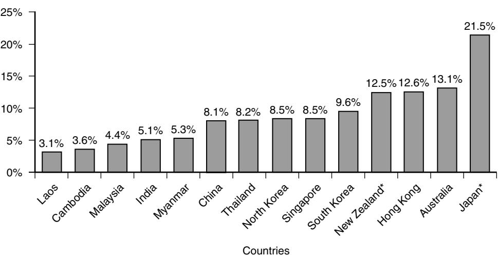
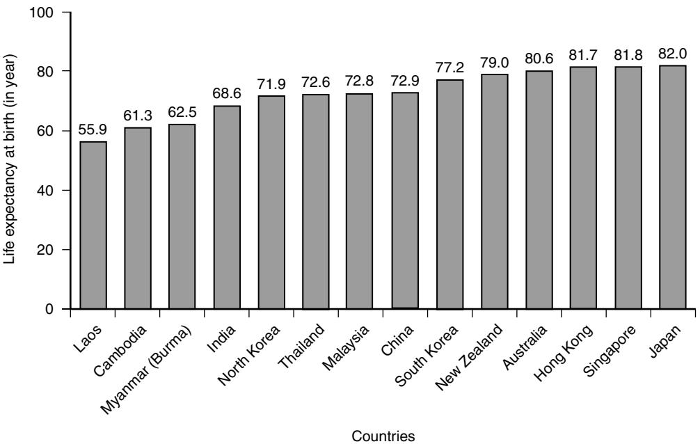

# Geriatrics in the Rest of the World

Jean Woo

There is variable information on elderly populations in countries other than Europe and North America. In general, characteristics of elderly populations in economically developed countries are similar to Europe and North America. This chapter describes the impact of demographic and economic changes on life expectancy, morbidity, and disability and responses of health and social systems to these changes, using countries representing different stages of economic development in the Western Pacific and Southeast Asian regions.

## **Life Expectancy, Morbidity, and Disability**

In 2007 the percentage of population aged 65 years and above ranged from 3% to 4% in Laos and Cambodia, to 12% to 13% in New Zealand, Hong Kong, and Australia, to 21% in Japan (Figure 120-1). In general, with economic development, life expectancy increases and morbidity changes from higher prevalence of communicable to noncommunicable diseases. The causes of death from chronic noncommunicable diseases ranged from approximately 90% in New Zealand and Australia, 80% in Singapore, South Korea, Japan, and China, 50% in India and Myanmar, to 35% in Cambodia and Laos.1 Life expectancy at birth is highest in Japan and the Hong Kong Special Administrative Region (SAR) of China (80%), and lowest in Laos (56%) (Figure 120-2). Ideally increasing life expectancy should be accompanied by compression of morbidity and disability. There is little available data to determine whether there is compression of morbidity and disability in Asia, nor what chronic diseases make the largest contribution to disability. In Hong Kong SAR, China, active life expectancy at age 70 years is approximately 10 years for both men and women; however, total life expectancy and the life expectancy lived with disability (DLE) are longer in women compared with men, DLE being 4.4 years in women and 2.2 years in men. Diseases making the largest contribution to disability are stroke, dementia, fractures, Parkinson's disease, and diabetes mellitus.

## **Chronic diseases of major impact in the elderly population**

The prevalence of cognitive impairment among elderly Hong Kong Chinese aged 70 years and over is approximately 15% in two community surveys carried out in 1990–91 and 2001–02. Age, female gender, history of Parkinson's disease and stroke, functional disability, low education level and low social class and income, were predisposing factors. A review of epidemiologic studies on dementia in China showed rates at the lower end of the rates in Caucasians, with regional variation in the ratio of vascular dementia to Alzheimer's diseases.2 The prevalence of dementia ranged from 0.46% to 7.0%, whereas the annual incidence ranged from 0.81% to 2.02%, being slightly higher in women and those with lower education. Alzheimer's disease was the predominant type of dementia, followed by vascular dementia. In contrast to western studies, the prevalence of Lewy body dementia was lower in Hong Kong Chinese, with a prevalence rate of 2.9% over a 2-year period.3 Similar to Caucasian populations, presence of the apolipoprotein epsilon-4 allele is associated with more rapid deterioration in cognitive function,4 and an association has also been observed between promoter polymorphism of the interlenkin-10 gene and Alzheimer's disease.5

Osteoporotic fracture is another common problem with major impact in terms of disability and mortality. It has been projected that 50% of all hip fractures in the world will occur in Asia by 2050. Increasing incidences have been documented for many regions, in Hong Kong, Japan, and Singapore, the rates being higher in urban compared with rural areas.6,7 Risk factors were similar to those in Caucasian populations: lack of load bearing activity, smoking, alcohol consumption, past-history of stroke, fractures, greater height, use of sedatives and thyroid drugs, and low calcium intake.8

Chronic respiratory disease also causes considerable disability and mortality, being among the top causes of hospital admission and mortality for the elderly. Unfortunately the trend in respiratory symptoms appear to be increasing among the elderly, likely a result of environmental factors such as increasing air pollution, since smoking prevalence decreased at the same time.9 Unfortunately governments in Asia tend to lag behind the West in acknowledging the health impacts of air pollution, and to take definitive action.

# **Frailty**

The transition state from a fully functional state, with gradual decline and development of dependence toward death, may be viewed as a state of frailty. Geriatric medicine is largely care for frail elderly persons. The concept of frailty as an accumulation of deficits covering physical, functional, psychological, nutritional, and social domains, with the balance tipped toward deficits rather than assets, had been developed initially in a Canadian elderly population, and an index consisting of summation of deficits in many domains used as a quantitative indicator of frailty,10 and shown to predict mortality, and may be used as a measure of biologic age. This concept of a frailty index had been tested in a Hong Kong Chinese elderly population aged 70 years and over, and shown to be equally applicable in a different ethnic and cultural setting irrespective of which particular variables were measured.11 It was able to predict mortality, functional, and cognitive decline,12 and was influenced by social and environmental factors in keeping with the concept of frailty being multidimensional.13

A characteristic feature of frailty is sarcopenia, which describes the age-associated loss of skeletal muscle mass and loss of strength even in the absence of disease. The underlying cause is thought to be a consequence of a decrease in androgens, growth hormone, and IGF-1 that occurs with aging, accompanied by an increase in inflammatory cytokines. This is an important concept in geriatric medicine

Figure 120-1. Percentage of population aged 65 and above, 2007. *(Sources: Sources: CIA World Factbook; Department of Statistics of Malaysia; China Population Information & Research Centre; Department of Statistics of Singapore; Statistics New Zealand; Census and Statistics Department of Hong Kong; Australian Bureau of Statistics; and Statistics Bureau & Statistical Research and Training Institute of Japan.)*

Figure 120-2. Life expectancy at birth (both sexes), 2007. *(Source: CIA World Factbook.)*

because it affects function and hence independence, and predisposes to falls. It was initially defined as a mean value of appendicular skeletal muscle mass divided by [height]2 less than 2SD below mean values for young adults, analogous to the definition of osteoporosis. Using this definition, sarcopenia exists in elderly Hong Kong Chinese aged 70 years and over, but apparently at a lower prevalence (12.3% in men and 7.6% in women) compared with Caucasians (between 16% and 57.6% in men and 11% and 60% in women).14 However, the Asian young adult mean value was about 15% lower compared with published Caucasian figures, so that the actual prevalence may be similar between Chinese and Caucasians. Older age, cigarette smoking, chronic lung disease, atherosclerosis, underweight and physical inactivity were associated risk factors, while the consequences include poorer physical well-being, slower walking speed and chair stand, and reduced grip strength.

## **Communicable diseases**

Elderly people are particularly susceptible to pneumonia, with common infection agents being tuberculosis, *Streptococcus pneumoniae, Haemophilus influenzae,* and a virus affecting the respiratory tract.

## **TUBERCULOSIS**

Many of the current generation of people aged 70 years and above would have been exposed to *Mycobacterium tuberculosis* before chemotherapy and vaccination became available, particularly during periods of deprivation such as during the World Wars. Therefore tuberculosis in the elderly is largely due to reactivation of the disease. Furthermore declining immunocompetence with age and many diseases or conditions commonly encountered in this age group predispose to tuberculosis, such as diabetes mellitus, chronic renal failure, malignancies, or malnutrition. For example, in Hong Kong in 2007, the tuberculosis notification rate per 100,000 population rose steeply with age, being 55.2, 156.5, 464.5 in the 20 to 24, 65 to 69, and 85+ age groups, respectively. Similarly the mortality rate was 0, 9.4, and 63.9 per 100,000, respectively, in these age groups. As a result of population aging and increased prevalence of tuberculosis with age, the falling incidence of tuberculosis has leveled out in countries, with significant tuberculosis burden in Hong Kong, Japan, Singapore, and Malaysia.

Certain clinical features of tuberculosis are distinctive for elderly patients. Diagnosis is often delayed in the elderly.15 A study of patients with tuberculosis in Hong Kong showed that elderly patients had more frequent nonspecific complaints and less frequent hemoptysis, more extensive lung infiltration on chest x-ray, and lower serum albumin concentrations.16 Mortality from tuberculosis is higher in the elderly, likely due to delayed diagnosis, more extensive disease, and presence of multiple morbidity. The elderly are also more susceptible to adverse effects from antituberculous drugs as a result of pharmacokinetic changes with age,17 hepatic involvement in military tuberculosis, and undernutrition, as in some parts of India. Reduced protein binding of antituberculous drugs with age and slower metabolism of toxic metabolites such as hydrazine, may contribute to the increased incidence of side effects.

Residents of old age homes are particularly at risk from tuberculosis, as a result of factors predisposing to reactivation of latent tuberculosis and also cross infection. For example, a survey in Hong Kong SAR China in 1993 showed a rate of between 1200/100,000 and 2600/100,000 compared with a rate of between 100/100,000 and 400/100,000 in the general population.18 A larger study 10 years later gave a prevalence of between 530 to 1101 per 100,000 population,19 indicating perhaps improvement in the old age home environments. In an environment where TB prevalence is high in the general population, the Mantoux test is not a useful method for screening or surveillance, and chest x-ray and sputum examination would be more useful. For the same reason, isoniazid prophylaxis for those who have a positive Mantoux test is not adopted, more attention being paid toward infection control, such as optimal nutrition, adequate ventilation, and avoidance of overcrowding.

#### **INFLUENZA-LIKE ILLNESS (ILI)**

ILI is of particular concern among elderly people living in old age homes, as a potential cause of epidemic outbreaks, and a common cause for hospitalization. A prospective clinical and microbiologic survey of ILI in a cohort of people living in old age homes in Hong Kong SAR China over a 1-year period recorded 259 episodes in 194 out of a total of 771 subjects, with mild peaks in winter and summer, over a sustained level throughout the year.20 An infection agent was identified in 61.4% of episodes, 58.3% of which were bacterial and 46.7% were viral. Organisms encountered in order of frequency were *S. pneumoniae*, respiratory syncytial virus, *Pseudomonas aeruginosa,* metapneumovirus, and parainfluenza viruses types 1 and 3. Presenting clinical features commonly include "decrease in general condition," cognitive and functional deterioration, irrespective of the underlying cause. Distinction from aspiration pneumonia was difficult and an unknown proportion could have this as the underlying cause. Mortality was high, being 10% for the episode, predisposing factors being MRSA infection, low body mass index, and poor premorbid function. Eighty-seven percent of episodes resulted in hospital admissions. There may be a role for vaccination programs to include organisms other then influenza A alone, as is the current prevention policy.

#### **SEVERE ACUTE RESPIRATORY SYNDROME (SARS)**

The occurrence of the SARS outbreak in Hong Kong in 2003 was a very good example of failure to recognize atypical presentation of disease in the elderly resulting in outbreaks in old age homes caused by elderly people contracting the disease from hospital admissions during the epidemic and then spreading to other residents on discharge, as the diagnosis was missed. In an effort to curb the spread in old age homes, the Hong Kong Geriatric Society issued a position statement pointing out the limitations of the World Health Organization criteria for SARS, stating some elderly people may have geriatric syndromes only, such as falls, confusion, incontinence, and poor feeding.21,22 Furthermore, diarrhea may be mistaken for fecal incontinence. Multiple morbidity such as aspiration pneumonia further confuse the picture. Therefore a contact history was a key factor in consideration of the diagnosis. Other points to note are a lengthened incubation period from 14 to 21 days, higher incidence of side effects to ribavirin and corticosteroids, and a higher mortality rate. The latter could be a result of delayed diagnosis or reduced likelihood of ventilator support for those with multimorbidity. Failure to recognize the diagnosis constituted a risk of infection for all caregivers, and this pathway was repeatedly demonstrated during the months of the epidemic from March to June in 2003.

### **Geriatric medicine development**

Apart from Australia and New Zealand, where geriatric medicine is well developed, care of elderly people tends to follow an organ-based approach, with the focus on individual diseases rather than on geriatric syndromes and frailty. The spectrum of geriatric medicine from the biomedical model to functional capacity, the immediate surroundings of an elderly person, ethical issues, and quality of life requiring interdisciplinary continuity of care, is not widely recognized. Countries that have been under British rule or influence, and that are economically developed, tend to adopt a perspective following that in the United Kingdom and North America. To address this issue, ideally undergraduate curricula should contain mandatory geriatric medicine teaching, with structured postgraduate training. Provision of undergraduate and postgraduate training is highly variable, being well-developed in some countries such as Australia, New Zealand, and Hong Kong. In mainland China, although large cities have developed geriatric clinical services and research centers, most of the physicians are from system-based specialties, so that training in geriatric syndromes and a holistic approach is lacking. However, there are developments in this area in collaboration with countries where geriatric medicine training is well developed. For example, the China Medical Board of New York funded a 4-year project between John Hopkins University School of Medicine and Peking Union Medical College Hospital in Beijing, where Chinese staff were initially trained in the United States and then established demonstration services in Beijing using the train the trainer concept.23 The geriatric units in Hong Kong have also participated in training staff from the mainland.

### **Comprehensive geriatric assessment**

A key feature of geriatric medicine is comprehensive assessment. Some of the tools used in comprehensive geriatric assessment developed in Western populations may not be applied to other populations with different ethnicity, language, and culture. Translation and validation are required before tools can be incorporated into part of the assessment procedure. This process has been carried out among Chinese for the Mini Mental State Examination,24 where a cover cut-off point of 18 was used as a large majority of the current elderly population received no or little education; the Geriatric Depression Scale (cut-off point of 8)25; the London Handicap Scale (LHS)26; and the Philadelphia Geriatric Morale Scale (PGMS).27 The LHS appears to be applicable across cultures, with subjects from mainland China, Hong Kong, and the United Kingdom sharing similar perceptions on selected handicap scenarios.26 The factor structure of the PGMS has also been confirmed in Hong Kong Chinese.27

Scales are particularly useful in assessment of dementia. The Alzheimer's disease assessment scale cognitive subscale (ADAS-log) has been validated in elderly Chinese in Hong Kong, and discriminant function analysis between demented and nondemented subjects yielded a canonical discriminant function with three question items, word recall test, orientation, and comprehension of speech.28 The short version had a sensitivity of 90%, specificity of 94.6%, and overall accuracy of 92.5%. The clock drawing test as a quick screening assessment of dementia has also been validated, a cutoff score of 3/4 having a positive predictive value of 98%.29 Likewise, the Chinese version of the Community Screening Instrument for Dementia (CSI-D) has been validated as an educationally independent instrument sensitive enough to detect early stages of the disease.30 A short memory questionnaire has also been developed for screening of mild cognitive impairment, which also correlated with subjective memory complaints.31

Another important domain for assessment, particularly among elderly living in institutional settings, is the detection of undernutrition or malnutrition. The latter is a recognized risk factor for adverse health outcomes and mortality. One of the widely used nutrition screening tools is the Mini Nutritional Assessment (MNA) originally developed in Europe. It consists of questions regarding intake of particular food items and anthropometric measures, with classification into three categories of nutritional status. However, it may not be easily translated into populations with different body size and dietary habits. Furthermore, in some settings it may not be possible to measure body weight due to absence of suitable scales for dependent subjects and lack of manpower, as in many old age homes in China and Hong Kong. A screening tool that does not depend on weighing is all the more important in such settings. The MNA was adapted for use in the Chinese population in such settings and validated in institutional settings in Hong Kong and Shanghai (The Chinese Nutrition Screen: CNS).32 A cut-off value of ≥ 21 was found to be useful in screening out those at risk or had malnutrition, correctly identifying 90% of those with normal nutritional status.

### **Health and social services**

To complement the development of comprehensive geriatric assessment, appropriate health and social services meeting the needs of the elderly in the acute, convalescent, rehabilitative settings, along with long-term care in the community or residential care setting are required.

#### **PRIMARY AND SECONDARY HEALTH CARE**

Accessibility to good primary health care partly depends on provision of health care professionals and the health care financing system. A wide spectrum of health care systems exists in Asia, Australia, and New Zealand. At one extreme there is the predominantly government subsidized low cost system in Hong Kong SAR, China, to the other extreme of largely user pays private system dictated by market forces in mainland China. In between are systems sustained by insurance, government contributors, and part self-payment, as in Singapore, Japan, Australia, and New Zealand. The system of one primary care doctor as the first contact point, as in the British National Health Service, is particularly suited for care of the elderly. The development of health care centers, with the primary care doctor coordinating all health social needs using the case management model, would have provided a more flexible response to the needs of people with increasing frailty. Variations of such systems exist in Australia and New Zealand, but are poorly developed particularly where primary care largely relies on a user-pays system.

For example, the change from a government-funded to a market-orientated health care system in mainland China in the 1980s has resulted in the system serving a small proportion of the population who can afford to buy insurance, mainly in urban areas, where employers may make a contribution to a medical savings account. However, in rural areas, health care expenditure is largely out of pocket.33,34 In one recent survey, 87% of rural and 37% of urban residents were uninsured, and seniors, ethnic minorities, and residents in less-developed regions (where there are few doctors and geographic barriers exist) visited physicians less than those who were insured. Urban residents also used hospitals more compared with rural residents. Therefore it is likely that both financial barriers and adequacy of provision of health care will affect health of the elderly in mainland China.

In contrast, the health and social care system in Hong Kong SAR China represents the other extreme, where the government largely subsidizes the health care system, with the user paying a small fee. For those who cannot afford the fee, after means testing, the same level of care is provided entirely free. Although more than 85% of primary care is provided by private doctors, those who cannot afford it are cared for by government outpatient clinics, or users may make use of 24-hour access of the accident and emergency departments. The standards of care supplied by government hospitals are as high, if not higher than private hospitals, patients having access to the latest drugs and technology. The comprehensive range of medical and social services have developed over the years based on the U.K. model. There are well-developed acute and nonacute geriatric and psychogeriatric services that extend to the community and old age homes, palliative care for both cancer and noncancer patients, day hospitals, various types of social welfare allowances and community support home care services. Currently models for chronic disease management and transitional care in the community are being developed.35 However, the current health care financing system is considered unsustainable and insurance and user pays models are being developed.

There is little data reporting on the health profile of elderly people cared for under different health and social care systems. The question of whether there is one particular model that would result in better health outcomes, while of key importance, is difficult to address as a result of many confounding factors. A comparison of health profile of three elderly Chinese cohorts carried out at approximately the same (1990–1991) under opposite extremes of the spectrum of health care systems (predominantly government subsidized or predominantly self-paying), showed that the Beijing rural cohort had the best health profile while the Hong Kong cohort had the worst profile, despite better lifestyle practices and higher socioeconomic status in the Hong Kong and Beijing urban cohort. However, the Beijing rural cohort also had the highest prevalence of functional limitations.36 The findings suggest that while the relationship between health care systems and life expectancy may be more direct, the influence on health profile elderly people may be more complex, as lifestyle, socioeconomic, and psychosocial factors are likely to play important roles.

#### **LONG-TERM CARE**

The number of frail elderly people with multiple morbidities, functional, and psychological impairments requiring care by others, will increase with aging populations. Although development in community support services is important in enabling elderly people to remain at home, development in the residential care sector both in terms of number of places and quality of care will be equally important. The anticipated shift from community to residential care is partly the result of changing social patterns from large extended families living together, to smaller units or to living alone. For example although the percentage of elderly people in Japan living with adult children is higher then Western populations, it fell from 50% in 2000 to 45.5% in 2004.37 This is in contrast to 30% of men and 38% women aged 80 years and older living alone in Australia. In both Japan and Australia, the number of residential care places is increasing rapidly, while at the same time the provision of community care services also increased, although the provision ratio per 1000 persons aged 70 years and over is actually decreasing in Australia. In Hong Kong, the percentage of elderly people living in residential care institutions has also risen rapidly from about 5% to 9% over a 12-year period. Therefore it would be unrealistic to expect that improvement and increased provision of community service alone would be sufficient to meet the needs of increasingly frail aging populations.

An essential feature of community care is a seamless interface between health and social services, and between care by different disciplines of health care professionals and volunteers. Coordination is required to provide care plans specific to individual needs. The actual models vary depending on health care financing systems. For example in Hong Kong, various types of community care centers run by nongovernment organizations have evolved, covering a wide spectrum of support from social centers; day care centers, which provide personal and rehabilitative care during daytime; and enhanced home care (visits by allied health staff, nurses, or doctors).

There is a role for information technology support for those living in the community. In Hong Kong, for those living alone, they can subscribe to an alarm system where an alarm bell can be worn as a necklace and connected via the telephone system to community centers. In an emergency such as a fall, the center can arrange ambulance transport to the nearest hospital. Home rehabilitation via teleconferencing with a rehabilitation center has also been pioneered; a group therapy in community centers conducted by staff from a partner hospital via teleconference has also been developed and evaluated for older persons with memory problems,38 knee pain,39 diabetes,40 urinary incontinence,41 and stroke.42 Evaluation showed that this mode of service delivery is feasible and resulted in beneficial objective outcomes.

As in many parts of the world, the quality of care in residential care homes is variable and there is much room for improvement. The change in philosophy in residential care from an institutional environment to a home environment with dedicated trained care workers pioneered by the Green House Project homes in the United States, while producing impressive results,43 have yet to be replicated in Asia. In this region, quality of care is largely governed by fiscal concerns and the rising demand despite questionable quality. Regulating standards of care effectively determines the number and the care staff needed, with resulting increases in fees that adversely influence affordability. In many regions, a pragmatic balance exists between total lack of care, and residential care of variable quality that is affordable to individuals and governments. Poor quality has repeatedly been documented in the past 20 years among residential care homes in Hong Kong, for example in the area of undernutrition44 and restraint use.45 Twenty-five percent of residents have a body mass index of less than 18.5 kg/m2, while use of restraints is among the highest in the world. Nevertheless efforts have been made in providing health care support by geriatric and psychogeriatric outreach teams supplemented with teleconference consultation.

The future of long-term care of acceptable quality likely depends on a health care financing system consisting of a mixture of government subsidy, insurance, and self-payment. Geriatricians will have a vital role in developing systems appropriate to the culture and region, with a key element of comprehensive assessment to tailor made services in response to individual needs.

#### **END OF LIFE CARE**

There is a general consensus that end of life care could be improved, and palliative services should also cover those who are dying of chronic diseases such as heart failure, chronic lung disease, or end-stage neurodegenerative diseases, in addition to those dying of cancer, even though the trajectories toward death may be different. The core components of symptom control and attention to psychospiritual needs remain the same. However, there may be cultural differences in management of patients and their families in these settings. For example, many elderly people defer to their families, who sometimes adopt an approach that is futile against the recommendation of the physician, out of a wish of "doing their best" for their relative. Improved public education would be desirable to discuss these issues. In Western cultures, spending the last few days in privacy with relatives in a side room in the hospital may be considered desirable, but among Chinese people in Hong Kong, it may be reviewed as neglect by staff and relatives have sometimes complained about such management that was assumed by health care workers as desirable.

## **Prevention of chronic diseases and functional decline**

Health promotion efforts have been made by many countries in an attempt to lessen the morbidity and disability burden of aging populations by advocating healthy lifestyles. A key to effectiveness of dietary and physical activity counseling is the strategy for achieving behavioral change, since simple impartment of knowledge is unlikely to be effective. An interesting cultural addition to these efforts is the role of traditional Chinese Medicine (TCM) in healthy aging.46 The philosophy of TCM is to treat diseases before they appear, thus fulfilling the role of prevention very well. Theoretically and at cellular level or in animal studies, TCMs have been shown to inhibit uptake of neurotransmitters, to have anabolic effects, immunoenhancing effects, and antiproliferative effects on tumor cells, antioxidant properties, stimulate nitric oxide production in endothelial cells and erectile tissues, inhibit platelet aggregation, improve glucose tolerance, and have estrogen-like properties. However, few have been subjected to randomized controlled trials to document benefits in humans. Nevertheless, TCM is widely used in prevention of various conditions associated with aging, which may or may not be effective. However, adverse side effects have also been documented.

## **CONCLUSION**

The importance of geriatric medicine appears to be proportional to demographic changes with increasing life expectancy and the shift from communicable to noncommunicable disease, and it is in variable stages of development in parts of the world other than Europe and North America. Training systems and models of care in the latter would be relevant, with adaptation to local needs. The principles of care of the elderly remain unchanged, and could form the basis of training irrespective of geographic or political regions. Development in previous British colonies or commonwealth countries show how this diffusion of knowledge has occurred and is ongoing, through formation of the Asian Pacific Geriatrics Network. The latter has annual meetings where geriatric problems from different countries in the region are discussed and provides a forum for continual sharing of knowledge.

# KEY POINTS

#### Geriatrics in the Rest of the World

- Life expectancy and the proportion of population aged 65 years and over increase in parallel with economic development of countries
- Patterns of diseases change from dominantly communicable to noncommunicable, in parallel with this transition
- Chronic diseases of major impact include dementia and other neurodegenerative diseases. Communicable diseases of impact are tuberculosis, and bacterial and viral causes of pneumonia
- Frailty is a key component in geriatric medicine, and measurements are applicable across ethnic and cultural groups
- Scales used for comprehensive geriatric assessment may need to be adapted and validated for local use
- Health and social care systems vary across countries, and the impact on health of the elderly is uncertain
- Geriatric training and service development follow the principles developed in Europe and North America, with adaptation to local systems and needs

For a complete list of references, please visit online only at www.expertconsult.com