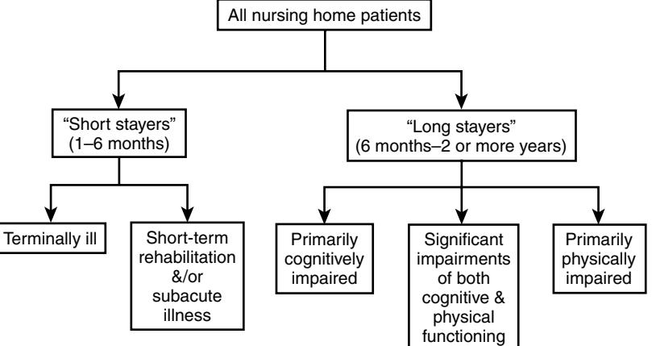

# Institutional Long-Term Care in the United States

Luis F. Samos Enrique Aguilar Joseph G. Ouslander

# **HISTORY OF INSTITUTIONAL LONG-TERM CARE**

This chapter will provide an overview of institutional longterm care (LTC) in the United States. Long-term care is the broad range of medical and nonmedical services that are designed to meet the needs of people with chronic illnesses and variable degrees of disability. These services may be needed on a temporary basis going from weeks to months or may be needed permanently. The need for long-term care may also be due to terminal illness. There are two basic types of LTC institutions in the United States: nursing homes (NH) and assisted living facilities (ALFs).

In the early 1900s, there was no federal program to support health care for the elderly, so that impoverished seniors were sent to "poor farms" or almshouses. In the 1920s, a U.S. Department of Labor report increased the awareness of the problem and the public began demanding reform. In 1935 the Social Security Act was signed by President Franklin D. Roosevelt, which created the "Old Age Assistance Program." This provided financial support for older people, but discouraged almshouse living, paving the way for the creation of private old-age homes.1,2

In 1954 a change in federal law provided grants for the construction of nursing homes, which were modeled after hospitals. In 1965 President Lyndon Johnson declared: "thirty years ago, the American people made a basic decision that the later years of life should not be the years of despondency and drift."2 Soon after Medicare and Medicaid were passed into law and these programs provided additional support for LTC. There was an enthusiastic response to Medicare but also overwhelming costs, so that in 1969 the government restricted much of the coverage for NH care. In the 1970s a new policy authorized Medicaid to pay for NH care on a reasonable cost and needs related basis.

In the 1970s and 80s significant concern about the quality of care in NHs began to be voiced.1,2,3 In 1986 a study conducted by the Institute of Medicine at the request of Congress found that many residents of NHs were receiving substandard care. This led to the passage of the Nursing Home Reform act as a part of the Omnibus Budget Reconciliation Act (OBRA) in 1987. The purpose of this legislation was to ensure that residents in NHs would receive quality physical and mental care. This act included guidelines for the use of antipsychotics and physical restraints, and created the NH Resident Bill of Rights (Table 123-1).2,4

OBRA 1987 also mandated the creation of a resident assessment system, which led to the development of the minimum data set (MDS). The MDS is a structured tool designed to comprehensively assess NH residents from a general clinical and functional point of view. Screening with the MDS may trigger the use of one or more resident assessment protocols (RAPs), which address 18 common conditions. The RAPs in turn are used for care planning for individual residents. In addition, data from the MDS is submitted to state governments electronically and used to calculate reimbursement for Medicare-reimbursed skilled nursing stays, and to examine quality of care (see later discussion).1,2

# **DEMOGRAPHICS AND ECONOMIC CONSIDERATIONS**

# **Demographics**

With current trends towards a rapidly aging population in the United States, the health care system and its LTC services will face many challenges. According to the U.S. Census Bureau, 37 million people age 65 and over lived in the United States in 2006, accounting for more than 12% of the population. Over the twentieth century this population grew from 3 million and is projected to be 86.7 million in 2050, comprising 21% of the population. The estimated percentage increase of this age group between 2000 to 2050 is projected to be 147%.5,6 By comparison, the population as a whole will have increased only 49% over the same period. The older (65 and over) population is expected to more than double between 2000 and 2030 going from 35 million to 71.5 million,7 but this growth rate will slow after 2030, when the "Baby Boomers" enter the group of the oldest-old population (those 85 and older). The oldest-old population is projected to grow rapidly after 2030. For example, the population 85 and over grew from just over 100,000 in 1900 to 5.3 million in 2006.8,9

Life expectancies at both age 65 and age 85 have increased. Current mortality trends suggest that people who survive to age 65 can expect to live an average of 18.7 more years, almost 7 years longer than people age 65 in 1900. The life expectancy of people who survive to age 85 today is 7.2 years for women and 6.1 years for men.9

From the above numbers, the growing importance of LTC services is not surprising. Estimates indicate that approximately 35% of Americans age 65 will receive some NH care in their lifetime, 18% will live in a NH at least a year, and 5% for at least 5 years.

Approximately 2% of Americans age 65 to 84 and 14% age 85 and older live in NHs. There are currently close to 1.8 million residents in NHs in the United States, which represents an increase from 1.6 in 2004, although the percentage of elderly living in NHs has declined in recent years from 8.1% of those 75 and older in 2000, to 7.4% in 2006. This is likely due in part to improved short-term rehabilitation and an increasing number of residents returning home, along with the increasing number of ALFs.

Almost half of all individuals living in NHs are 85 years or older and about 70% are women. Residents with dementia account for more than half of the population, more than half are confined to a bed or wheelchair, and 80% need help with four or five activities of daily living. NH residents can be divided into two basic groups: one that stays a short period of time because they are undergoing rehabilitation or because they are medically ill and are hospitalized or die; and a second group of long-stayers (Figure 123-1).10,11,12

### **Economics**

Economic considerations in LTC are of paramount importance in an era of ever increasing health care costs. The average cost of residing in a NH in 2008 is \$187 per day for a semiprivate room and \$209 per day for a private room. An ALF costs about \$3,000 per month for a one-bedroom unit, and the cost for a home health aide is \$29 per hour. The federal government does not provide for ALF care; some states provide limited support through Medicaid or other programs.

The total amount spent on LTC in the United States in 2005 was \$207 billion, excluding informal care (provided by family or friends). There are only two basic ways to pay for NH care in the United States—out-of-pocket from savings (or private LTC insurance which generally has limited coverage), or Medicaid, which essentially requires impoverishment to qualify. About half of NH and other LTC services are in fact covered by Medicaid, which is a federal and state program for low income individuals (not just the elderly). Medicaid expenditures on NH and other LTC services now amount to more than \$100 billion.13,14

Medicare, which is federal health insurance for the elderly and disabled, has two parts: Medicare Part A, which pays for hospital and related care, and Medicare Part B which pays for outpatient services including physician fees. Medicare

#### **Table 123-1. The Nursing Home Residents' Bill of Rights**

The Nursing Home Reform Act of 1987 established the following rights for nursing home residents:

- Freedom from abuse, mistreatment, and neglect
- Freedom from physical restraints
- Privacy
- Accommodation of medical, physical, psychological, and social needs
- Participation in resident and family groups
- Treatment with dignity
- Exercise of self-determination
- Free communication
- Participation in the review of one's care plan, and to be fully informed in advance about any changes in care, treatment, or change of status in the facility
- The right to voice grievances without discrimination or reprisal

Part A will only pay for a skilled nursing facility stay after a 3-day qualifying stay in an acute hospital. Thus, in the United States, Medicare does not pay for direct admission to a NH or for long-stay NH care. This is because Medicare was originally designed to protect older people from the costs of catastrophic acute illnesses—thus Medicare Part A benefits are linked to the care of acute conditions. Medicare will pay for short-term NH care if the resident needs frequent medical and/or nursing services, or rehabilitation with goal of returning home. Although Medicare will theoretically pay for 100 days, most stays are in the 30 to 40 day range, after which long-stay NH care is paid for privately or by Medicaid (see later discussion).16

For skilled NH care (short-stay), Medicare uses a Prospective Payment System (PPS) that makes payments based on predetermined amounts. As opposed to the diagnosis-related groups (DRGs) used in inpatient hospital settings, a system that is based on the expected amount of resources needed according to the resident's physical functioning, diagnoses, health conditions, and treatments as documented in the MDS. This system is called the Resource Utilization Groups (RUG), and currently includes 53 groups. RUG payments cover all services except physician fees (which are paid for by Medicare Part B). Since the RUG system was implemented, it has changed the relationship between physicians and NH administrators because the costs of services ordered by the physician are now bundled into the RUG payment. Previously, Medicare paid for medications, diagnostic tests, and rehabilitation therapy separately, so the NH administrators were not as concerned about what physicians ordered.17

A relatively small proportion of older people are in Medicare managed (or capitated) care plans (the proportion varies considerably across the United States). In these programs, the 3-day acute hospital requirement can be waived for skilled care. Thus the Medicare managed care plan enables these individuals to be directly admitted to a NH for shortterm care for conditions such as deep vein thrombosis, pneumonia, congestive heart failure, pelvic fracture, etc.16,17

# **Types of services**

Most NH residents require mainly nonskilled or maintenance care such as help with activities of daily living like bathing, dressing, eating, getting in or out of a bed or chair,

Figure 123-1. Types of patients in U.S. long-term care facilities. *From Kane RA, Ouslander JG, Abrass IB. Essentials of clinical geriatrics. ed 4, New York, 1999, McGraw-Hill.*

and using the bathroom. These individuals have generally already maximized their rehabilitation potential. This care does not require skilled health care personnel and Medicare does not pay for this level of care, but Medicaid does if the individual qualifies financially. Skilled care requires the intervention of medical, nursing, and rehabilitation personnel. Examples of skilled NH care include intravenous injections, wound care, and physical, occupational, and speech therapy (including cardiac, neurologic, pulmonary, or orthopedic rehabilitation).

Hospice care is also provided in both NHs and ALFs. Hospice programs provide medical, psychological, and spiritual support to terminally ill patients and their loved ones. The emphasis of hospice is quality of life, comfort, and dignity. A major point of hospice is to control pain and other symptoms so the patient can remain as alert and comfortable as possible. Hospice services are available through Medicare to persons who can no longer benefit from curative treatment and are estimated to have a limited life expectancy. Enrollment in a Medicare hospice program enables additional support to be brought into the NH or ALF through private hospice providers.

#### **Settings**

In the United States, institutional long-term care takes place either in NHs or ALFs. ALFs offer a housing alternative for older adults who are relatively independent. The services generally provided or arranged for in ALFs are listed in Table 123-2. ALF residents generally do not require the intensive medical and nursing care provided in NHs, and usually perform their basic activities of daily living themselves or with little help. The philosophy of ALF care is to allow older people to enjoy freedom and independence.

According to the National Center for Assisted Living, there are more than 36,000 ALFs in the United States, housing more than 1 million people. Since there is no strict definition of what constitutes an ALF, it is difficult to indicate the exact number of facilities. The average age of ALF residents is 83. About 74% of the residents are women and about half need assistance with dressing or bathing. According to NCAL, the average size of an assisted living residence

#### **Table 123-2. Services Generally Provided in an Assisted Living Facility\***

- 24-hour supervision
- Three meals a day in a group dining room
- A range of services that promote the quality of life and independence of the individual, such as:
- Personal care services (help with bathing, dressing, toileting, etc.)
- Assistance with medication management, or with selfadministration of medicine
- Social services
- Supervision and assistance for persons with Alzheimer's or other dementias and disabilities
- Recreational and spiritual activities
- Exercise and wellness programs
- Laundry and linen service
- Housekeeping and maintenance
- Arrangements for transportation

\*Residents are assessed on admission and periodically, and monthly fees are often based on the number of services provided.

is 43 units and ranges from 3 to 200 units. The average number of residents in a facility is 40, with a range up to 175. Residents are assessed on admission and periodically thereafter, and monthly fees are often based on the number of services provided.19–22

ALFs encourage their residents to "age in place." This has resulted in a substantial number of ALF residents being functionally disabled, and a blurring in the distinction between ALFs and long-stay NHs. Moreover, with relatively few exceptions, physicians and nurse practitioners do not visit ALFs, and many geriatric conditions, such as dementia, fall risk, incontinence, and others are inadequately recognized and managed in the ALF setting.

NHs provide assistance with activities of daily living but also offer an array of medical and nursing care within a 24-hour per day supervised environment. There are approximately 17,000 NHs in the United States. Most of them are free-standing facilities, but some are a part of a retirement community that usually includes independent living, an ALF, and other elderly services (Continuing Care Retirement Communities). Approximately half of U.S. NHs are owned by multifacility chains. Table 123-3 shows selected characteristics of NHs in the United States.11–13,23

Individuals admitted to a NH are usually more dependent than ALF residents on admission, especially those admitted for long stay, which can extend to years of institutional living. About half of residents spend at least a year in the NH and 21% of them live there for almost 5 years. Among residents admitted for short stay, which could last from days up to 3 months, many are admitted for rehabilitation, usually after a qualifying stay in the hospital (as described previously). Other individuals admitted for short stay are admitted for respite care. Respite programs involve a temporary admission, so that the family member or caregiver can take some time off. Respite care is not supported by Medicare, but may be by Medicaid in some states. The Veterans Health Administration, which has over 100 NH care units and state Veteran's Homes, offers respite free of charge for up to 30 days a year to qualifying veterans.

#### **Table 123-3. Selected Characteristics of U.S. Nursing Homes\***

| Number of Facilities 17,000 total nursing homes 1.8 million beds with 80%-85% occupancy rates Average size of 107 beds 13% of facilities are based in an acute care hospital |
|------------------------------------------------------------------------------------------------------------------------------------------------------------------------------------------|
| Ownership 66% for profit 27% not-for-profit 7% government                                                                                                                       |
| Direct Care Staff (Average numbers) 53 total direct care staff 35 certified nurse assistants 11 licensed practical nurses 6 registered nurses                                |
| Reimbursement 67% Medicaid 23% private pay                                                                                                                                         |

10% Medicare

\*Figures shown are based on older data; current data may differ slightly.

#### **Provision of care**

Key leadership in a U.S. NH includes the administrator (who may or may not have had training as a nurse or other direct care health professional), the director of nursing, and the medical director. All licensed NHs are required to have a physician medical director. The medical director performs several functions and must integrate clinical best practices with regulatory issues. The medical director can be extremely important in establishing a professional and caring culture in the organization. In most facilities the medical director also has direct patient care responsibility; in some cases they care for the majority of residents. The medical director is also instrumental in ensuring that the NH meets state and federal regulations. He or she must ensure medical coverage and quality care, participate in policy and procedure development and implementation, infection control, and other quality improvement initiatives. The American Medical Directors Association (AMDA) has professionalized the role of the U.S. NH medical director over the last several years, and offers advanced training and certification for this role.11,24

In the majority of U.S. NHs, there is infrequent presence of physicians, nurse practitioners, or physician assistants; though some NHs, especially the larger ones, have on-site medial staff most days of the week. Nurses, both registered nurses (RNs) and licensed practical nurses (LPNs) are the key members of the clinical staff in NHs. Certified nurse assistants (CNAs) provide 90% of the hands on care, and support the services of RNs and LPNs. NHs also have either on a part of full-time basis physical, occupational, and speech therapists, social workers, psychologists, dietitians, pharmacists, and one or more chaplains. All of these professionals form part of the interdisciplinary team.11,25,26

Optimally care is delivered to NH residents by an interdisciplinary team that specializes in geriatric care. Interdisciplinary team care can be complex and time-consuming, but it is essential for the delivery of high quality care in the NH setting.

The basic paradigm for clinical care in the NH is theoretically guided by the resident assessment instrument, which is composed of the MDS and 18 RAPs (Table 123-4). Completion of the MDS is mandated within 14 days of admission and whenever there is a major change in status (such as a hospitalization), and specific sections are updated quarterly. When a condition is identified, the interdisciplinary team must document whether further assessment is indicated, and use one or more of the RAPs as appropriate to the clinical situation to generate an individualized care plan. MDS data must be entered into a computer data base, which is downloaded to the state government. These data are then used to calculate RUG rates (for residents on the Medicare Part A benefit) and to generate a series of quality indicators (see later discussion). In actual practice in the majority of U.S. NHs, an MDS coordinator (usually a nurse) completes the MDS with variable input from team members, and medical evaluations are done separately with little coordination with the MDS and care planning process.27,28,29

#### **Quality of care**

Quality of care in U.S. NHs is highly variable. Some facilities provide outstanding care. However, despite intensive efforts by federal and state governments and professional

#### **TABLE 123-4. Conditions Addressed by Resident Assessment Protocols**

| • Delirium                                 |
|--------------------------------------------|
| • Cognitive loss                           |
| • Visual function                          |
| • Communication                            |
| • ADL/functional/rehab potential           |
| • Urinary incontinence/indwelling catheter |
| • Psychosocial well-being                  |
| • Mood state                               |
| • Behavioral symptoms                      |
| • Activities                               |
| • Falls                                    |
| • Nutritional status                       |
| • Feeding tubes                            |
| • Dehydration/fluid maintenance            |
| • Dental care                              |
| • Pressure ulcers                          |
| • Psychotropic drug use                    |
| • Physical restraints                      |
|                                            |

and advocacy organizations, the quality of care in many NHs remains suboptimal.

NH care delivery in the United States is highly regulated. NHs are subject to regular (at least annual) surveys by state and/or federal surveyors, and can be fined, lose the ability to admit new residents, or closed depending on the scope and severity of violations of regulations cited by the surveyors. Extensive reforms and regulatory changes were enacted as part of Omnibus Reconciliation Act in 1987 and they have continued to evolve. These regulations establish quality standards and related guidance to surveyors, minimum staffing and training requirements, reinforce residents' rights and quality of life, and limit restraints and the use of psychoactive medications as a mean to control resident behavior.

The major focus of quality improvement efforts in NHs is based on a series of quality indicators (QIs) that are derived from the MDS. QIs now address both short-stay and long-stay residents, and are publicly reported on the "Nursing Home Compare" section of the Medicare Web site (www.Medicare.gov/nhcompare) so that consumers can view QIs of NHs they are considering. Table 123-5 lists the quality measures monitored by the federal and state governments. At the level of the individual NH, these measures can be benchmarked against other NHs in the same multifacility chain, in the state, or nationally. These analyses can be used to target specific quality improvement initiatives. State and federal surveyors also use the QIs to target areas of concern for their surveys.

The Center for Medicare and Medicaid Services supports Quality Improvement Organizations (QIOs) in each state in the United States that are contracted to assist NHs (as well as other health care providers) with quality improvement efforts. The effects of the QIO programs are difficult to prove, but there is evidence that NH care quality has improved in association with QIO efforts. The focus of the QIO NH initiatives over the last several years have been on reduction of the use of physical restraints, pressure ulcers, pain, and depression, and on culture change in NHs (see later discussion) with a specific focus on resident and staff satisfaction, "person-centered care," and staff turnover (which averages 50% to 100% among certified nursing assistants in many U.S. NHs).30,31,32 A wide variety of quality

#### **Table 123-5. Quality Measures for Nursing Home Care in the United States**

|                                                                                                                                                                                                            | MDS Observation                                  |
|------------------------------------------------------------------------------------------------------------------------------------------------------------------------------------------------------------|--------------------------------------------------|
| Quality Measures                                                                                                                                                                                           | Time Frame                                       |
| Long Term Measures Percent of long-stay residents given influenza vaccination during the flu season Percent of long-stay residents who were assessed and given pneumococcal vaccination     | October 1 thru March 31 Looks back 5 years |
| Percent of residents whose need for help                                                                                                                                                                   | Looks back 7 days                                |
| with daily activities has increased Percent of residents who have moderate to severe pain                                                                                                            | Looks back 7 days                                |
| Percent of high-risk residents who have pressure sores                                                                                                                                                  | Looks back 7 days                                |
| Percent of low-risk residents who have pressure sores                                                                                                                                                   | Looks back 7 days                                |
| Percent of residents who were physically restrained                                                                                                                                                     | Looks back 7 days                                |
| Percent of residents who are more depressed or anxious                                                                                                                                                  | Looks back 30 days                               |
| Percent of low-risk residents who lose control of their bowels or bladder                                                                                                                               | Looks back 14 days                               |
| Percent of residents who have/had a catheter inserted and left in their bladder                                                                                                                         | Looks back 14 days                               |
| Percent of residents who spent most of their time in bed or in a chair                                                                                                                                  | Looks back 7 days                                |
| Percent of residents whose ability to move about in and around their room got worse                                                                                                                     | Looks back 7 days                                |
| Percent of residents with a urinary tract infection                                                                                                                                                     | Looks back 30 days                               |
| Percent of residents who lose too much weight                                                                                                                                                           | Looks back 30 days                               |
| Short-Stay Measures Percent of short-stay residents given influ enza vaccination during the flu season Percent of short-stay residents who were assessed and given pneumococcal vaccination | October 1 thru March 31 Looks back 5 years |
| Percent of short-stay residents with delirium Percent of short-stay residents who had moderate to severe pain                                                                                        | Looks back 7 days Looks back 7 days           |
| Percent of short-stay residents with pressure sores                                                                                                                                                     | Looks back 7 days                                |

Source: http://www.cms.hhs.gov/NursingHomeQualityInits/10\_NHQIQualityMeasur es.asp (accessed September 18, 2008).

improvement resources and tools are available from the QIO program at: http://www.qualitynet.org/dcs/ContentServer? pagename=Medqic/MQPage/Homepage.

# **CULTURE CHANGE IN U.S. NURSING HOMES**

"Culture change" is a current buzzword in the U.S. NH industry. Numerous professional and advocacy organizations are focused on changing the culture of NHs to one that focuses on quality first. A multiorganization initiative, "Advancing Excellence in America's Nursing Homes" (http:// www.nhqualitycampaign.org/) is focused on culture change and other aspects of quality improvement in U.S. NHs. The culture-change movement grew slowly at first and since 2005 has now begun to spread rapidly. It focuses on empowering staff to deliver person-centered care and improve quality of life for residents, and advocates changing the environment from an institutional or hospital model to a more homelike or social model, considering the facility as the residents own home. Table 123-6 illustrates some of the differences between these two models. Table 123-7 lists some of the other key components of culture change.33

## **FUTURE PERSPECTIVES**

Many challenges lie ahead for institutional LTC in the United States. Growing need and complexity of chronic illnesses and their treatment will stress the system. ALFs will continue to care for an increasingly complex population, with little medical and nursing input. This will place them at risk for poor quality of care, regulatory sanctions, and legal liability, unless good geriatric care is incorporated into this setting. NHs will continue to serve an increasingly frail resident population with high medical and nursing needs, especially as the reimbursement system begins to provide financial disincentives to hospitalize NH residents. These changes will come at a time when there is a crisis in terms of shortage of trained nurses, nurse practitioners, and physicians who specialize in geriatrics and long-term care. Blending the medical needs with the person-centered culture described above will be extremely challenging. Fiscal constraints in the Medicare and Medicaid programs will serve to exacerbate these challenges.

At the same time, there are opportunities. Opportunities to build upon the early successes of the culture change movement and quality improvement initiatives that have begun to permeate some U.S. NHs.34 There are strategies that can be employed to improve care quality and reduce avoidable expenditures. Examples include preventing complications of chronic illnesses and avoiding iatrogenic problems, reducing polypharmacy, using care protocols and improved communication tools to reduce avoidable hospitalizations, and

**Table 123-6. Institutional vs. Homelike Model of Nursing Home Care**

| Institutional (Hospital) Model    | Homelike (Social) Model                                         |
|--------------------------------------|-----------------------------------------------------------------|
| Residents follow facility routine | Facility follows residents' routine                             |
| Staff float                          | Permanent assignments                                           |
| Staff make decision for patients  | Residents make their own decisions                              |
| Facility belongs to staff            | Facility is residents' home                                     |
| Staff know residents' diagnosis   | Staff knows residents as individuals                            |
|                                      | Nurture the human spirit in addition to providing treatments |

#### **Table 123-7. Key Components of Nursing Home Culture Change**

| Gathering together for socialization and activities | Natural sights                 |
|--------------------------------------------------------|--------------------------------|
| Natural light                                          | Natural sounds                 |
| Line of sight                                          | Contact with nature            |
| Control of equipment                                   | Group bonding                  |
| Natural smells                                         | Celebrations                   |
| New technologies                                       | Contact with other generations |
| Home like artificial lighting                          | Home like meals                |

more proactive use of advance directives to avoid unnecessary and expensive care at the end of life. Some of the cost savings might be reinvested in pay-for-performance initiatives that incentivize quality and culture change. NHs and ALFs also have the opportunity to partner with hospitals and home health care programs to improve transitions in care, a major quality and patient safety issue in the United States. This is a major focus of the current Medicare QIO program. Finally, and very importantly, there are opportunities to use health information technology—electronic medical records, remote monitoring devices, and others—to improve care quality, make care more efficient, and focus efforts on personcentered care that improves the quality of life of elderly people in need of institutional LTC.

For a complete list of references, please visit online only at www.expertconsult.com