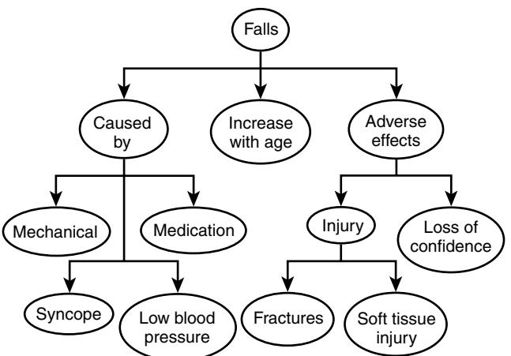
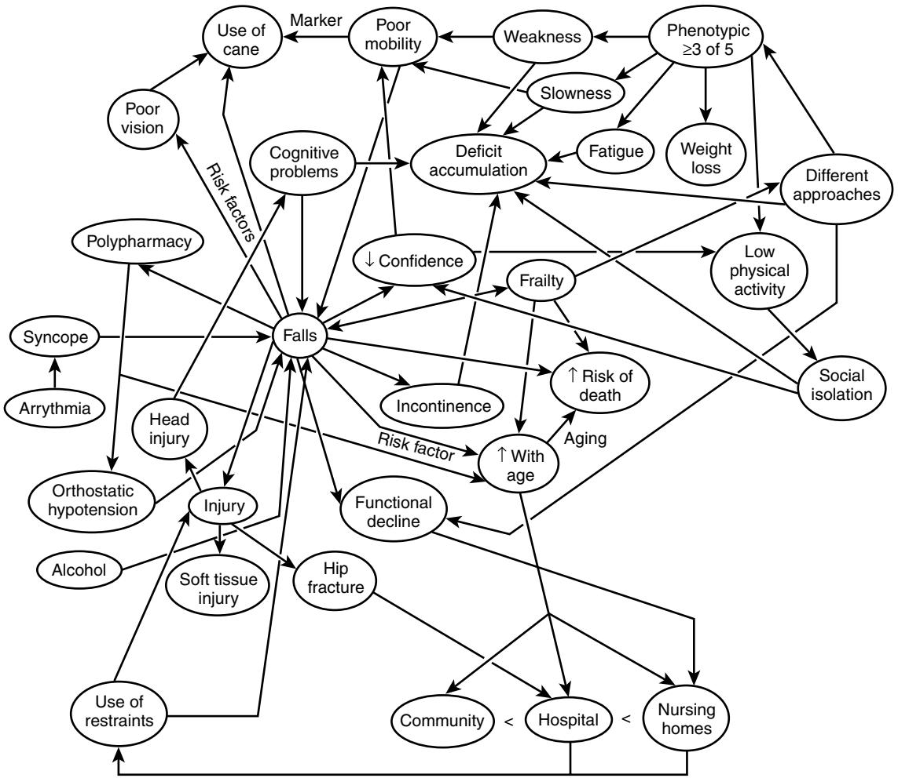

# Education in Geriatric Medicine

Ruth E. Hubbard

# **INTRODUCTION**

Education in geriatric medicine is currently failing to meet its objectives. Although geriatricians report the highest satisfaction with their specialty,1 few medical students opt to join our ranks, particularly in the USA2 and Canada.3 Worldwide, populations are aging with the oldest old the most rapidly growing segment of society.4 Yet many physicians and family doctors remain unfamiliar with key principles and practices of geriatric medicine.5

In this chapter, motivators for improvements in geriatric medicine education are contrasted with barriers to change. Newer educational theories have generally placed greater emphasis on processes of learning and the personal development of students. A working summary of these learning theories is provided, with examples of innovative educational programs linked to each approach. This education evidence base is intended to inform clinical geriatricians, optimizing the effectiveness of both their teaching and their own learning.

# **Motivators for change**

Several factors are motivating improvements to the education of geriatric medicine (Table 124-1). Improving the care of older people has been prioritized at a governmental level, particularly in Australia6 and the United Kingdom7 and the teaching of geriatric medicine in the undergraduate curriculum is advocated by the World Health Organization,8 General Medical Council9 and the Association of American Medical Colleges.10

In the United States, philanthropic institutions are driving improvements in health care for older people. Between 1997 and 2008, the Hartford Foundation (www.jhartfound.org) and the Reynolds Foundation (www.dwreynolds.org) committed \$118 million to U.S. medical schools to fund comprehensive programs to strengthen the geriatrics training of medical students, residents, and/or practicing physicians. The Reynolds Foundation has also provided support to the Association of Directors of Geriatric Academic Programs (ADGAP) to facilitate information exchange. This has included the development of an online system to share geriatric educational materials (www.pogoe.org).

Perhaps the most powerful motivator for change is the yawning gap that currently exists between service provision and care need. Two thirds of hospital inpatients in the United Kingdom are now aged over 65 years.11 Older, dependent patients with rehabilitation need are not confined to Care of the Elderly units but are scattered throughout intensive care, medical, and surgical wards.12 All doctors looking after adult patients therefore need the skills to work with older people. Yet the list of knowledge deficits in geriatric medicine identified by physicians13,14 encompasses many essential domains:

- Medication prescribing
- Neurologic and behavioral problems
- Urinary incontinence and falls
- Health screening
- Ethical issues such as capacity to make treatment decisions
- Multidisciplinary working
- Navigating transitions to or from the acute hospital

Knowledge deficits result in greater medical uncertainty and feelings of inadequacy and frustration for the physician.14 This frustration may manifest as negative stereotyping and suboptimal care. Ageist practices and undignified care of older people are all too apparent to geriatricians in our day to day practice15 and continue to make the headlines in the medical16 and lay press.17

# **Barriers to change**

The barriers to improvements in geriatric medicine education include logistical and philosophical factors (Table 124-2). The medical school curriculum is already overcrowded, there may be difficulties coordinating teaching across nontraditional sites, such as nursing homes, and qualified teachers are a scarce resource.18,19 In the United Kingdom, for example, the infrastructure for teaching and promoting geriatric medicine is being eroded. Between 1986 and 2006 numbers of both medical schools and medical students increased but the number of academic departments of geriatric medicine declined.20 Moreover, teaching is the dual casualty of the escalating pressures of clinicians' service commitments and academics' research output accountability.

Some physicians openly question the need for geriatric medicine. Increasing numbers of older complex inpatients and the positive results achieved by nongeriatricians supervising multidisciplinary teams have both been used as arguments to abolish the specialty.21 It is hard to imagine similar debates about the existence of cardiology ("we all manage patients with ischemic heart disease") or endocrinology ("we too use oral hypoglycemics to lower blood sugar") being countenanced by leading medical journals. These negative attitudes act as impediments to geriatric medicine education. Before attitudes can be changed, the reasons for them must be explored.22

# **Medical attitudes**

Most medical students do not consider pursuing a career in geriatric medicine.23–25 Students not interested in geriatrics rate performing procedures, technical skills, and not managing chronically ill patients as important practice characteristics.23 Some students feel older people are "to blame" for their illnesses through life-style choices.26 A more positive attitude to older people increases the likelihood of choosing a career in geriatric medicine.24 Early exposure to geriatric medicine has been advocated25 as students with more experience of older people, both positive and negative, are less likely to resort to stereotype and show more interest in geriatric medicine as a career.26

The presentation of geriatric medicine as a specialty founded on utilitarian values ("our interventions work") may have compromised its appeal. Modern concepts of frailty have the potential to provide a scientific framework, helping

### **Table 124-1. Motivators for Improving Education in Geriatric Medicine**

### **Motivators for Change**

Increasing numbers of older people

Current lack of knowledge → frustration for the physician and suboptimal care for the older patient

Improving the care of older people prioritized at governmental level

Funding initiatives in United States Wide support (e.g., WHO, GMC) for increased teaching of geriatric

medicine in the undergraduate curriculum

# **Table 124-2. Barriers to Improving Education in Medical Education**

**Barriers to Change** Shortage of time in the curriculum Lack of funding Few qualified teaching staff Negative attitudes of students Problems integrating teaching in nontraditional sites such as nursing homes

us understand and explain why these interventions work, and for whom.27 Fifty years ago, "senile dementia" was viewed as an inevitable consequence of aging but "Alzheimerization" has changed public perceptions and motivated enhanced research endowments.28,29 A clear description of clinical features, insights into pathogenesis, and development of modifying interventions have been essential components in this transformation. The "frailterization" of decrepitude and decline through comparable investigative steps is a tantalizing prospect.

Perceptions of prestige also contribute to negative attitudes. In one survey,30 medical students, and junior and senior doctors consistently ranked neurosurgery and thoracic surgery as the highest prestige specialties. Only dermatovenerology rivaled geriatric medicine for the lowest prestige rating. Highest prestige conditions, such as myocardial infarction, leukemia, and brain tumor, seem to share an acute onset, definitive diagnostic strategies, high-tech interventions, and the possibility of complete cure. They reinforce the doctor's role as healer (anticipated by medical students as "Your job is to make the person better and help them live"26). Low prestige conditions, such as fibromyalgia and anxiety neurosis, often require a shift in philosophy from cure to care and demand communication skills rather than procedural finesse. Indeed, the knowledge and skills required to manage such conditions are the very ones that physicians report most difficulty in mastering.13,14

# **Societal attitudes**

Medical student beliefs are shaped not just by their own experiences but by the attitudes of wider society.31 The following opening gambits may stimulate discussion and act as a means to explore societal attitudes:

• In 2005, a U.K. survey of 2000 adults aged over 16 years reported that one third of people thought that the demographic shift toward an older society would make life worse in terms of standards of living, security, health, jobs, and education and one in three

respondents viewed the over 70s as incompetent and incapable.32

- Charities that work with older people in the United Kingdom report difficulties generating financial support, with a quarter of the total income of charities that work with children and adolescents and half that of animal charities.33
- Simone de Beauvoir described two stereotypes of older people34: "The purified image of themselves that society offers the aged is that of the white haired and venerable sage, rich in experience, planing high above the common state of mankind; if they vary from this then they fall below it; the counterpart of the first image is that of the old fool in his dotage, a laughing stock for his children. In any case either by their virtue or by their degradation, they stand outside humanity."
- Older people have not always been undervalued. Before advancement of the written word, "elders" acted as collective memories during long evenings and at legal proceedings.35
- Societies that value physical beauty tend to depreciate old age whereas those that aim at a spiritual ideal entertain a more abstract aesthetic ideal.36

# **Educational theory BACKGROUND**

Teaching methods within the medical profession have traditionally been hierarchical, both at undergraduate and postgraduate level.37 Medical knowledge is seen as the possession of experts, Socratic figures who transmit this knowledge to passive learners,38 conforming to objectivist philosophy that knowledge is an entity that "exists in the world" outside the minds of individuals.39

Any teaching session may be seen by the well-intentioned traditional medical educator as an opportunity to "pass on" as much of this knowledge as possible, perhaps by recalling numerous "facts" for the students to transcribe. The learners are expected to commit the information to memory, becoming "little living libraries" capable of regurgitating the same information at a later date.40 But increasing the density of information given to students has detrimental effects on the amount of information actually retained.41 The objectivist, pedagogic teaching model is being supplanted by teaching methods based on alternative educational theories.

Those theories stem from five main sources42: behaviorism, adult learning (andragogy), constructivism, cognitivism, and social learning. Concern has been raised that these theories lack a solid evidence base and are founded on metaphor rather than science.43 However, a familiarity with educational epistemology [coupled with an awareness that epistemology means "theory of knowledge"] can improve the effectiveness of teaching practice by providing a basis for the selection of instructional and evaluation strategies to match intended goals of learning.

# **Behaviorism LEARNING THEORY**

The behaviorist model involves a teacher-centered approach and has traditionally been used for the development of competencies and for demonstrating psychomotor skills. The focus of learning (as espoused by Skinner) is on observable behavior: environment shapes behavior and reinforcement is central to the learning process.44 A behavioral objective should include the performance (what behavior will be performed), conditions (under which the behavior must be performed), and criteria (the measure of acceptable performance).45 Behaviorists deny the importance of consciousness and cognitive processes and define mental state solely in terms of environmental input and behavioral output.46 Behaviorist-medical methodology is said to conform to a Western "dominator" paradigm reinforcing "masculine" values and traits.47 Though educational programs are now more often based on andragogy and constructivism, behaviorism still has an important role in developing competency based curricula.42

#### **APPLICATION IN GERIATRIC MEDICINE EDUCATION**

As already discussed, students not interested in geriatrics rate performing procedures and technical skills.23 Geriatric medicine has been dismissed as "an approach centered on gentle symptom management."21 Behaviorist teaching may therefore be particularly useful to counteract the perception that geriatricians use no special skills. Behaviorist objectives (performance, conditions, criteria) improved the functional assessment of an older person at the University of Michigan Medical School.48 Performance included history taking (e.g., asking about falls and memory impairment) noting visual and hearing impairments and gait assessment. This was evaluated at a Standardized Patient Instructor station of an Objective Structured Clinical Examination (OSCE). The measure of acceptable performance was a score of 50% on a 17-item check list. Student performance was initially poor (with a mean score of 43%) but improved significantly after the introduction of an integrated geriatric curriculum. The curriculum included more geriatric content in preclinical courses, experience in an outpatient clinic, and clearly stated learning objectives related to clinical skills in functional assessment.

### **Adult learning theory LEARNING THEORY**

The objective of education in adult learning (andragogy) is for the learner to become autonomous and self-directed.49 The role of the teacher is to facilitate the growth and development of the overall person. Maslow's contention that self-actualization could only occur once when threats were minimized50 challenged the teaching methods of Lancelot Spratt characters, whose gentle humiliation of students for comedic effect engendered fear as well as the desired respect. Key characteristics of adult learning described by Carl Rogers51 include personal involvement of the student such that learning is self-initiated and self-evaluated. Significant andragogical learning only occurs when the subject matter is perceived to be relevant.

#### **APPLICATION IN GERIATRIC MEDICINE EDUCATION**

The andragogical principle of self-directed learning was the driving force behind the General Medical Council guidance in the United Kingdom that student-selected components should comprise a quarter to a third of medical school curricula.9 Geriatric medicine may not benefit from such initiatives since students are unlikely to choose self-selected modules to address knowledge deficits. Self-ratings correlate poorly with externally generated measures of ability52 and adult learners tend to gravitate to studying things they enjoy and are already good at.53

Another tenet of andragogy is that significant learning is acquired through doing.45 Experiential learning improves knowledge of and attitudes to the subject taught.54 A randomized controlled trial of an experiential educational intervention in geriatric medicine was undertaken at the University of Western Ontario.55 The experiential session included:

- A game-show style quiz on demographics
- Use of specialized goggles and footwear to simulate visual and physical impairments often felt by older people
- Group interview of an older lady in a wheelchair and hospital gown. She suddenly disrobed to reveal her exercise wear and led the class through the fitness exercises she taught at the local community center.

Assessment 1-year later showed no greater knowledge in the intervention group but student behavior and feedback suggested improved attitudes to older people and more chose geriatric medicine as a clinical elective.

### **Constructivism LEARNING THEORY**

Constructivists believe that learners build knowledge from their own perceptions and experiences. Learning is an active process, occurring within the minds of each individual.40 The role of the constructivist teacher is therefore to support the learners' own construction of knowledge.38 This differs fundamentally from the traditional role as conveyor of information. Learners are thought to possess a current field of knowledge, described by Vygotsky as the "zone of proximal development."56 The role of subject experts as preferred teachers for medical students is questioned (since their knowledge may be beyond the zone of proximal development of the students) and peer teaching promoted. Constructivism has gained popularity as a framework for medical education. The emphasis on processes of learning and personal development of students is considered to be particularly effective in fostering professional attitudes and beliefs.57

### **APPLICATION IN GERIATRIC MEDICINE EDUCATION**

The principle of building on knowledge through the curriculum has been employed in the geriatric medicine program at the Southern Illinois School of Medicine.58 Students encounter a simulated older couple through standardized couple patient experiences, small group sessions, and paperbased learning modules. The couple ages 10 years between each annual, 4-hour session. The woman represents healthy aging whereas her husband becomes frail, with multiple comorbidities, polypharmacy, and functional decline. Thus the students gain insights into health promotion/illness prevention and caregiver burden along with medical complexity and the impact of frailty. Discussions are guided by the SEMPACE model, which aims to address all areas affecting older people's health: Social, Environmental, Medical, Psychological, Activities of Daily Living, Caregiver, and Economic domains. Although Aging Couple Across the Curriculum is currently in the development phase, and may require a more appealing acronym to have a truly pervasive impact, early student evaluations have been positive and an increased interest in geriatric medicine is suggested by more students choosing geriatric electives.

### **Cognitivism LEARNING THEORY**

The emergence of cognitive science precipitated a significant change, some would even say a Kuhnian revolution59 in education and teaching methods. Although radical behaviorists minimize the importance of consciousness and mental processes, cognitive scientists focus on the learner's thought processes.42 The teacher's role is to develop the learner's capacity for effective self-directed learning.

Reflective practice, integral to cognitivism to develop critical thinking, is an increasingly advocated concept in the fields of medical and nursing education. Reflective practice was first described by Schon in the early 1980s60: reflection *in* action occurs during the experience whereas reflection *on* action occurs, perhaps axiomatically, after the event. Reflection is more than simply replaying or thinking about practice.61 It is "not complete without action62" and should lead to the development of new perspectives, behaviors, and practices.63 Some argue that reflection may lead to anxiety64 and psychological harm65 and that discussion of case histories may compromise patient confidentiality.66 Reflection has even been compared with Orwellian thought control since participants are encouraged to express their own feelings and amend them to harmonize with the majority view.67 Despite these criticisms, reflection has been widely extolled as the pathway to medical professionalism.68

#### **APPLICATION IN GERIATRIC MEDICINE EDUCATION**

A mandatory 4 week clerkship in geriatric medicine introduced at McGill University, Montreal involved elements of independent and self-directed study, learning in and on practice, and web-based teaching to reinforce learning.69 An electronic evaluation portfolio seemed to motivate students' self-reflection70 and induce a positive change in attitudes.71

Concept maps are a cognitivist technique in which students create a 2-dimensional diagram exploring their understanding of important topics.72 Concept maps reflect expected differences due to experience and training and can be scored reliably.73 However, the absence of correlation between concept map assessment scores and conventional measures of learning such as final course grades suggests different knowledge characteristics are being tapped.74 Geriatric medicine, replete with complexity, may be particularly suitable for concept mapping. Student understanding of the geriatric giants, for instance, could be explored. Examples of how a concept map may evolve as knowledge increases and complexity is appreciated are shown in Figures 124-1 and 124-2.

# **Social learning LEARNING THEORY**

Social learning is the result of a continuous interplay between three factors: the person, the learning environment, and the desired behavior.74 Role modeling, bedside teaching, and

Figure 124-1. Concept map of *falls.* The absence of cross-links and the consistent use of 2 to 3 levels of hierarchy would result in a low score.

applications of social learning have long been the mainstay of teaching to students and junior doctors.42 The teacher is responsible for creating the desired model (e.g., history taking, cognitive assessment) and should then observe and correct the student's performance.

#### **APPLICATION IN GERIATRIC MEDICINE EDUCATION**

Clinical geriatricians may be unaware of the extent to which we impact students attending ward rounds or outpatient clinics. As role models, knowledge is essential but we also need to understand and articulate the reasons for actions.75 The factors militating against referral for major surgery, for example, may be carefully weighed by an experienced geriatrician but without exploration and explanation, the observing student may interpret that the decision was based on chronologic age alone.

Hafferty and Franks' seminal work76 on the learning of ethics proposed that the "broader cultural milieu" or "hidden curriculum" of medical schools had a greater influence than the formal curriculum on physicians' personality and conduct. This hidden curriculum may be particularly disadvantageous to geriatric medicine. Positive forces such as governmental edicts to abolish ageist practices7 are undermined by what medical students hear and see on the wards.15 Qualitative studies of trainees have confirmed that "clinician-teachers sometimes make disparaging remarks about particular medical specialties which may act as a barrier to recruitment."75 At a time when even the British Geriatrics Society debates changing its name since "geriatrics" has "acquired negative connotations,"77 we should be careful about the message this sends to others about the patients we care for. Through explicit consideration of the hidden curriculum, students may learn to challenge rather than accept ageist practices and behaviors.

### **SUMMARY**

Educational theories emerging since the 1960s have shifted the emphasis of teaching from transmission of medical knowledge to support of learners as they develop. There is considerable overlap between different constructs; reflective practice and self-directed learning, for example, are commonly occurring themes. This should not compromise

Figure 124-2. Higher scoring concept map of *falls* with frequent cross-links and consistent use of 5 or more levels of hierarchy.

curriculum design, the purpose of which is to optimize learning rather than exclusively apply a single educational theory.

The focus on learning processes and personal development of students is particularly relevant for the education of geriatricians. Younger patients having a single pathology such as chest pain, benefit from a rich evidence base and decision making can chiefly follow algorithm. Decision making for older, complex patients, on the other hand, is often guided by wisdom and prudence, described by Thomas Aquinas as "a keen understanding of the present that is informed by a memory of the past and modulated by current counsel."78 Geriatricians therefore need to be able to integrate knowledge gained though management of each patient ("memory of the past") and keeping up to date with a rapidly evolving evidence base ("current counsel"). Newer learning strategies—reflection on experience, social collaboration, identification of own learning needs—may foster these skills.

# **CONCLUSION**

Geriatricians understand that caring for older people is a dynamic, complex, and richly gratifying specialty but this has not always been appreciated by others. We need charismatic and motivational teachers to raise the profile of geriatric medicine at medical schools and attract a higher number of trainees. To become an excellent clinical teacher, knowledge of our specialty is necessary but

# KEY POINTS

Education in Geriatric Medicine

- Currently, few students consider becoming geriatricians and physicians and family doctors remain unfamiliar with key principles and practices of geriatric medicine.
- Barriers to change in medical schools include negative attitudes of students, an overcrowded curriculum and lack of motivated teachers.
- Educational theories emerging since the 1960s have shifted the emphasis of teaching from transmission of medical knowledge to support of learners as they develop.
- Geriatricians should be familiar with techniques to optimize the effectiveness of both their teaching and their own learning.
- Charismatic educators with geriatric knowledge and teaching skills have the potential to increase recruitment of geriatricians and improve standards of care by our colleagues in other specialties.

not sufficient. Enthusiasm, communication skills, and the ability to create a supportive learning environment are noncognitive attributes that may need to be cultivated.79,80

Ultimately, though, education in geriatric medicine should not just be targeted at recruiting and training a workforce of talented geriatricians. Old, dependent patients with rehabilitation need comprise the majority of the inpatient population.12 We cannot directly provide care for all these older patients but have a responsibility to ensure that effective practices and essential skills are shared. In so doing, our colleagues in other specialties would find geriatric medicine less frustrating and more rewarding and, most importantly of all, the quality of care for all older people would be improved.

#### **ACKNOWLEDGMENTS**

Dr. Hubbard has received research funding from the Peel Medical Research Trust, London and the Fountain Innovation Fund of the Queen Elizabeth II Health Sciences Centre, Halifax, Canada.

For a complete list of references, please visit online only at www.expertconsult.com