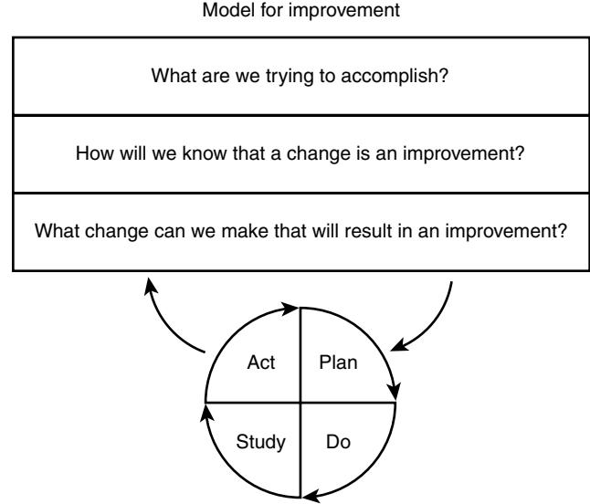
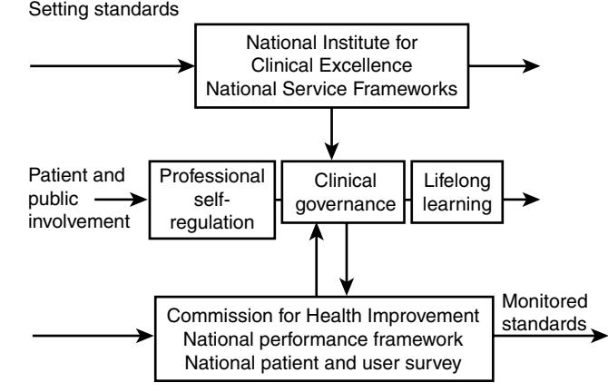
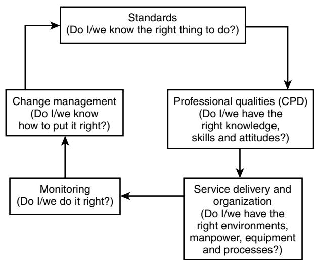

# Improving Quality of Care in the United Kingdom

David A. Black

Improving quality of care is difficult and controversial. Over the last 20 years in the United Kingdom there have been growing pressures from an increasing number of stakeholders to demonstrate and deliver quality improvement. From the inception of the National Health Service (NHS), politicians have been seen to be held responsible for a statefunded health service; patients are becoming increasingly knowledgeable and empowered to act and insist on improvements; health care purchasers have a particular interest in risk management processes owing to the influence of litigation; and finally the professions themselves have a growing interest in evidence-based medicine and delivering the best possible care. Yet the problems of improving care have recently been summarized by Brook, who in a review states "in the last 30 years research has demonstrated that quality of care can be measured, the quality varies enormously, that where you go for care affects its quality far more than who you are, improving quality of care, while possible, is difficult, and in general has yet to be successfully accomplished."1 Although this seems a pessimistic view, the gain from improving quality of care, when successful, can be spectacular. During the Crimea War, by enforcing improved standards of care and hygiene, Florence Nightingale reduced the mortality rates at the Scutari Military Hospital from 42.2% to 2% within 6 months.

Some may view the quality improvement movement as a management fashion. Yet the very success of geriatric medicine in the United Kingdom is a result of continuous improvements in the care of older people, starting in 1946 when Dr. Marjory Warren identified the large numbers of older people confined in atrocious workhouse settings who were denied effective health care. From those beginnings at the very onset of the NHS have evolved the comprehensive systems of assessment and care that are so different from the world of 1946. The development of geriatric medicine has been largely based on a persistent striving at the local level for more and better services in the face of policy weakness, professional neglect, and resource starvation, coupled with poor training and a neglected research base. The health care of older people remains one of the major challenges for quality improvement within the health service, particularly in the face of continual pressures to manage the growing number of the very old in the population.

The purpose of this chapter is to provide a theoretical understanding of the background to quality improvement by describing quality initiatives in the wider world of business and relating these to current health service policy with practical examples in geriatric medicine. A major problem for practitioners is the confusion of terminology and definitions. The experience of other areas, such as industry, has not been properly understood and the health service has been showered with initiatives, activities, jargon, and buzz words. The problems for clinicians have included failure to provide adequate commitment of time, significant problems with the information gathered, and difficulties implementing change when the needs have been identified. This chapter attempts to explain how the history of quality initiatives in business and the health service have led to the current government's approach, in particular the concept of clinical governance.

# **WHAT IS QUALITY?**

At its very simplest, a basic working definition of highest quality care is "doing the right things well." In business, quality can be seen to have a number of dimensions2:

- 1. *Performance* the primary operating characteristics or the product of services.
- 2. *Features* add-ons or supplements.
- 3. *Reliability*.
- 4. *Conformance* the degree to which a product's design and operating characteristics meet established standards.
- 5. *Durability* measures of a product's life.
- 6. *Serviceability* the speed and ease of repair.
- 7. *Esthetic* the product's look, feel, and taste.
- 8. *Perceived quality* as viewed by a customer or client.

These dimensions do not map immediately to health care, and experts have struggled to find generally applicable definitions of the quality of health care.

The situation is especially complex as a service may have multiple customers, including the patient, the general practitioner (GP), and the local health authority. The World Health Organization divided quality into four aspects3:

- Professional performance (technical quality)
- Resource usage (efficiency)
- Risk management (the risk of injury or illness associated with the services provided)
- Patient satisfaction with the services provided

Whatever definition is used, it must capture the complexity and variability of health care. One of the most widely used definitions was published by the Institute of Medicine in 1990 and states that quality consists of: the degree to which health services for individual and populations increase the likelihood of desired health outcomes and are consistent with current professional knowledge.4

Blumenthal has noted that health care professionals tend to define quality in terms of the attributes and results of care provided by practitioners.5 This technical quality of care has two dimensions: the appropriateness of the services provided; and the skill with which appropriate care is performed. The biggest change for health care professionals has been to understand that care has also to be responsive to the preferences and values of consumers, particularly the individual patient.

A further view of quality, particularly in the United Kingdom, has been espoused by Maxwell.6 This takes into account not just the individual patient but a wider population approach. Maxwell's six dimensions of quality are:

- 1. *Access* (issues such as physical accessibility and waiting times).
- 2. *Relevance to need* (appropriate to the assessed needs of the whole community).
- 3. *Effectiveness* (ability of the treatment or service to produce the desired result).
- 4. *Equity* (fair distribution of resources within the publicly funded system).
- 5. *Social acceptability* (including issues such as the environment and privacy).
- 6. *Efficiency and economy* (the best possible for the best possible price).

This model has been widely used for the purchasing or commissioning of services over the last decade in the United Kingdom.

### **MEASURING QUALITY OF CARE**

Once the dimensions of quality have been identified, it should be possible to set standards and indicators of good practice (see later discussion). However, we cannot start to improve the quality of care unless we are able to measure it. The real challenge is to find measures that are effective, that can be obtained inexpensively, and ideally that are part of the care process itself.

Quality of care may be assessed using measures of structure, process, or outcome. These three attributes were originally described by Donabedian.7

- 1. *Structure* includes the building blocks and characteristics of health care, including buildings, equipment, and staff.
- 2. *Processes* refers to all the activities forming the encounter between the health care professional and the patient, including diagnosis, tests, treatments, and record-keeping.
- 3. *Outcomes* refers to the patient's subsequent health status and other effects of care, including knowledge and satisfaction.

These three attributes are interlinked, with both structure and process contributing to the outcome of care. There are implications:

- If quality-of-care criteria based on structural and process data are to be believed, it must be possible to show that variation in either process or structure leads to a difference in outcome.
- If outcome criteria are to be believable, it must be shown that differences in outcome will result if the processes under the control of the health professionals are altered.

Brook et al8 argue that, in health care, process measures are the most valid. Outcome measures, which may seem at first to be the most obvious measure, have also been widely used to assess quality but there are problems. Outcomes may be due, at least in part, to factors not related to the quality of care (e.g., a patient's physiologic reserve or age). Also, some outcomes of care may become obvious only many years later; this will seriously limit their use as a tool for quality improvement. An example is the long-term outcome of good diabetic care in preventing vascular disease.

Measures of process are currently thought to be the tool of choice. An example is the management of stroke disease. The Cochrane Collaboration review of stroke units demonstrated that bringing together multidisciplinary teams and changing the process of care brought major benefits: patients managed within specialist stroke units are much more likely to be alive and at home a year after stroke than those managed on general medical wards.9 Local measures of outcome would not have shown this as *individual* stroke units do not have enough patients to demonstrate improved survival. Process measures, however, are useful in enabling comparisons to be made with those processes shown in the Cochrane Collaboration.

Although there are exceptions to this rule (an example might be of the outcomes of carotid artery surgery in carotid artery stenosis), process measures then are most commonly used to assess quality. Several issues arise:

- 1. Which data should be used?
- 2. Are the data reliable? The problems of completeness and accuracy of data in the National Health Service are well described.
- 3. Are the data valid? Are we choosing the right measures to reflect changes in quality care?
- 4. Are the data sensitive enough?
- 5. Is the evidence generalizable? For example, are data about the management of incontinence applicable to both an acute hospital and a nursing home?
- 6. Does the importance of the quality data justify the cost of collecting them?
- 7. Are the measures understandable to all users, both professionals and patients? For example, are the patient surveys that are currently used as a measure of quality helpful and understandable by all parties?

# **RECENT QUALITY IMPROVEMENT INITIATIVES IN THE UNITED KINGDOM Clinical audit**

Audit was formally introduced into the NHS in 1989 and was the main quality improvement technique used by clinicians in the 1990s. Clinical audit can be described as "systematically looking at processes used for diagnosis, care and treatment, examining how associated resources are used, and investigating the effect that care has on the outcome of quality of life for the patient."10

Clinical audit is usually described in the form of a cycle in which teams are encouraged to move through a process of setting standards, collecting and analyzing data, comparing the data with the standards set in a peer-review environment, and finally planning changes to improve the quality of care to meet the original standards set. The cycle is then repeated. In an environment of elderly care, it is essential that audit is undertaken by multiprofessional teams and is focused on the needs of patients.

Clinical audit is not clinical research although, like research, it requires systematic collection of standardized data. Clinical audit is not simply counting but it is not necessarily complicated. It can be done just as effectively with a pencil and paper as with a computerized system. Clinical audit produced a great deal of activity among health care professionals, and by 1996 it was estimated that 20,000 projects had taken place with the majority of consultants (83%) and general practitioners (86%) participating. Projects in geriatric medicine included the Royal College of Physicians' CARE scheme11 and regional audits of hip fractures, for example in East Anglia.12

The criticism and challenges of clinical audit include:

- Failure to use nationally set standards, and the use of resources on many small local projects with ill-defined standards and aims
- Failure to complete the audit cycle—projects demonstrate problems but changes are not made and no further re-audits are carried out to demonstrate improvement (or otherwise) in quality
- A lack of patient-focused audits
- A lack of links between audit and management, and between audit and education
- Far too few audits being multidisciplinary or multisectoral
- Constraints of time, staff shortages, and limitations of information technology and the failure of some staff to participate at all

Recently the General Medical Council (GMC) has made it a requirement that all doctors in the United Kingdom take part in clinical audit, and it will be a requirement for revalidation.

The problems of single department or hospital audits being able to provide meaningful changes in quality have led to newer initiatives across networks of hospitals or even on a national basis. Examples include work of the clinical effectiveness and evaluation unit of the Royal College of Physicians (rounds 1-3), voluntary audit of stroke care involving more than 80% of hospitals nationally, allowing all hospitals to measure their own performance against the national picture.13 Current work includes Falls and Bone Health in Older People, and Continence Services as part of the assessment of progress with the National Service Framework.13

#### **Standards, guidelines, and protocols**

To support clinical audit it is necessary to be clear about the standards that are being measured. During the 1990s many national and local organizations started to produce standard guidelines and protocols to inform the audit process, and to encourage a "clinical effectiveness" approach. Clinical effectiveness is seen as the extent to which the health status of patients can be expected to be enhanced by clinical interventions. Specific examples include the British Geriatrics Society's compendium of guidelines,14 and the work of the Royal College of Physicians' Clinical Effectiveness and Evaluation Unit.

Another major stimulus for assembling the evidence of effectiveness of interventions has been the Cochrane Collaboration launched in 1993. Cochrane reviews are systematic reviews of randomized control trials of health care carried out in a very precise way using the techniques of meta-analysis to pool the results of trials.9 The six principles of the Cochrane Collaboration are: collaboration, building on people's enthusiasm and interest, minimizing duplication of effort, avoidance of bias, keeping up to date, and ensuring access.

NHS guideline production is now principally in the hands of the National Institute for Clinical Excellence ([NICE] see later discussion) and they have set out 10 key principles for NHS guideline production (Table 125-1). The Clinical Resource and Audit Group15 defined standards, guidelines, and protocols as follows:

- *Standards* specific statements relevant to particular criteria of care against which practice can be assessed.
- *Guidelines* a systematically developed set of statements that assist in decision making about appropriate health care for specific clinical conditions.
- *Protocols* a fixed set of instructions to follow in the management of conditions, designed to reduce treatment variation and improve outcomes.

In practice, guidelines are seen as advisory and protocols as mandatory. The challenge for clinicians is to integrate guidelines or protocols into everyday care, usually in the form of integrated care pathways, which aim to both ensure best care and allow easy audit to determine variation from the best pathway of care. This seems to be effective for single diseases, but becomes much more complex in the elderly-care environment, even when there is a single primary defined problem such as stroke.16

#### **THE AUDIT COMMISSION**

The Audit Commission is an independent organization reporting to Parliament. It has a statutory role to report on value for money in both health services and local authorities. The auditors have a duty to examine the economy, efficiency, and effectiveness of use of public resources. Each year a small number of topics are chosen for detailed investigation, resulting in a report describing the issues and currently

#### **Table 125-1. Principles for NHS Guideline Production**

- 1. The objective of NHS clinical guidelines is to improve the quality of clinical care by making available to health professionals and patients well-founded advice on best practice.
- 2. Quality care is based on clinical effectiveness—the extent to which health status of patients can be expected to be enhanced by clinical interventions.
- 3. Quality of care in the NHS necessarily includes giving due attention to the cost-effectiveness of health care interventions.
- 4. NHS clinical guidelines are relevant to the care provided by the NHS throughout England and Wales.
- 5. NHS clinical guidelines are advisory.
- 6. NHS clinical guidelines are based on best possible research evidence, expert opinion, and professional consensus.
- 7. NHS clinical guidelines are developed using methods that command the respect of patients, the NHS, and NHS stakeholders.
- 8. Although NHS clinical guidelines are focused around clinical care provided by clinicians, patients are treated as full and equal partners along with relevant professional groups involved in a clinical guideline development.
- 9. All those who might be affected by NHS clinical guidelines deserve consideration within the clinical guideline development (usually including patients and their caregivers, service managers, the wider public, government, and health care industries).
- 10. NHS clinical guidelines should be both ambitious and realistic in nature. They should set out clinical care that might reasonably be expected throughout the NHS.

identified best practice. The following year all organizations in the NHS offering these features are reviewed by the commission. Those for whom indicators suggest problems have an in-depth review and detailed recommendations are produced for the board of the organization. Follow-up to review progress against the objectives set usually occurs a year later.

Reports relating to older people include17: *United They Stand* (update 1999)—reviewing the coordinated care of elderly people with hip fractures; *Fully Equipped* (2000)—the provision of equipment to older or disabled people by the NHS and social services in England and Wales; *The Way To Go Home* (2000)—rehabilitation and remedial services for older people; and *Forget Me Not: developing mental health services for older people* (2000).

#### **ACCREDITATION**

In the United Kingdom and elsewhere there are external inspection systems, which may lead to accreditation. For example, within industry, the British Standards Institution has accreditation standards BS5750 and ISO9000. These are voluntary schemes that identify organizations that have reached basic standard procedures to ensure that customer requirements are met. Accreditation depends upon documentation of procedures and policies, and assessment by an accrediting team visit. In the health services this has been used mostly in facilities departments, but clinical departments, including mental health services, have on occasion achieved these standards.

Currently accreditation is out of favor as a quality management tool in the National Health Service. The Healthcare Commission (see later discussion) do yearly assessment of performance of every NHS Trust in England, the "annual health check." The National Service Litigation Authority will charge differential fees to trusts based on an assessment of their risk management service, while postgraduate deaneries will approve the delivery of standards of training for junior doctors. Although these bodies have some inspecting function and in some cases can remove or close down services, they do not formally accredit services.

#### **Complaints procedures**

Complaints form another mechanism for monitoring the quality of health care delivery. In the United Kingdom, any complaint to a hospital must be acknowledged by the chief executive within 48 hours, and there is a national standard of the complainant receiving a reply following a completed investigation within 20 working days. It is expected local resolution should resolve the vast majority of complaints in the NHS organizations, and NHS organizations all have a Patient Advice and Liaison Service (PALS), which will support complainants.

However if complainants are not satisfied, they may ask the Health Care Commission for an independent review of their case. The Healthcare Commission will appoint a care manager, who can decide how far to investigate the case; to refer the case back for local resolution; or to provide a final report and recommendations for the NHS Trust. If a complainant is still dissatisfied, the complainant has a right to refer the matter to the National Health Service ombudsman, who may decide to investigate the complaint further. The ombudsman provides an annual report to Parliament, which may "name and shame" publicly.

Since most complaints against doctors relate to poor communication, there may be particular challenges in elderly medicine both in avoiding complaints and in learning from them.18 There are distinctive features that affect communication between older patients and physicians. For example, ageism can occur in medical encounters, with physicians trivializing older people's problems. Physicians may spend less time with older people and may consider older patients to be more difficult to deal with than younger patients. Clinical discussion with older people is sometimes unusual in that a third person is often present, which complicates the communication process. These problems are additional to the generic problems of communication between doctor and patient.

The rise in the number of complaints about hospital-based elderly care was one of the main drivers that led to the setting up of the National Service Framework for Older People, an initiative from the Department of Health.

### **LESSONS FROM INDUSTRY ON QUALITY MANAGEMENT**

The main advances in the business world in the field of quality improvement came during the 1970s and early 1980s with the understanding that quality could not be improved simply by inspection, and problems corrected by removing those defective goods or poorly performing individuals found by the inspection. In health care this is called by Berwick "the bad-apple theory."19 The bad-apple theory of improving health care suggests that, as there are increasingly sensitive and specific tools for identifying poor outlier performance (for example this might be the bottom performing 5% in a population of doctors, services, or hospitals), then by removing these outliers it is possible to improve quality. This is still the theory behind accreditation, revalidation, and purchasing to set standards.

The radical conceptual change to this was introduced by the management theorists William Deming and Joseph Duran who brought back from Japan to America the theory of continuous improvement. They found that problems in business were usually implicit in the complex production processes, and that problems with quality could only rarely be attributed to the lack of ability, will, or intention of the people involved with the processes. Thus removing the "bad apples" rarely worked. The problems were not of motivation or effort but of poor job design, failure of leadership, or unclear purpose. From this basic concept a number of models of quality improvement evolved in the business world, which have subsequently been applied patchily to the health care environment. These include total quality management (TQM), re-engineering, and benchmarking. Continuous quality improvement in its widest sense remains the major influence on U.K. health care quality improvement.

#### **Total quality management (TQM)**

The most widely used quality intervention, certainly in business, is TQM. This has been defined as20:

The management of activities involved in improving the quality of the organization's product or service. TQM is a philosophy and a set of guiding principles for continuous improvement. It applies human resources and analytical tools focused on meeting the customer's current and future needs and tries to integrate these into management's efforts.

There are several widely recognized key characteristics of TQM systems that must always involve the whole organization and focus on the customer.20

- TQM has to take into account all parts of the organization.
- The chief executive and all top managers must visibly support it.
- TQM is ingrained as a value in the organization and the culture. It is not an add-on, TQM is "how we do things around here."
- Partnerships with customers and suppliers are encouraged, and the aim is to exceed the customer's expectations.
- Everyone in an organization should be trying to exceed the expectations not just of external customers but of everyone with whom they interact within the organization who may equally be a customer.
	- Cycle times can be reduced by focusing on doing the job faster.
	- Statistical quality control and the use of self-managed work teams can improve processes.
	- Do it right first time. Do not rely on inspection to identify defects, but correct the process to ensure that defects do not occur.
	- There should be corporate citizenship. The organization values everyone, both those within it and those it serves—these are often called "stakeholders."
	- No single formula works for everyone. Each organization is unique and must find its own way rather than taking an "off the shelf" approach.

#### **Business process reengineering (BPR)**

Reengineering, such as TQM, is a systemwide change approach focusing on changing the basic processes of the organization.21 BPR can be defined as the fundamental rethinking and radical redesign of business processes to achieve dramatic improvements in performance. Reengineering seeks to make all processes more efficient by combining, eliminating, or restructuring tasks, and the idea is to achieve large improvements in performance. Claims from the original studies suggested 100% improvement or more. Whereas TQM often looks at small continuous changes or improvements, reengineering tries to take a radical approach to large-scale changes. Certainly in the business world, reengineering can be seen as a high-risk strategy. Its success rate is under 50% and perhaps much less.

### **Benchmarking**

Benchmarking, developed in the early 1990s, is the detailed study of productivity, quality, and value in different departments and activities in relation to performance elsewhere. The idea is basically simple. Find an organization that is good (ideally the best) at the particular process that you also carry out. Study carefully how it does well what it does, and then incorporate its technique into your own organization. This might involve looking at an organization in a completely different sector of the economy. An example in health care might be a hospital that looked at how a hotel managed its room booking processes to maximize the use of elective beds.

#### **Outcomes in the health service**

These three techniques for quality improvement and organizational development have been applied, sometimes indiscriminately, in the health care environment. Pollitt noted how difficult it has been to implement them within the health service.22

Seventeen pilot total TQM projects were set up by the Department of Health in 1989, and the term "total quality management" has also been applied to other projects in the health service. A number of trusts also received considerable investment for pilot schemes of reengineering. Leicester Royal Infirmary made a considerable name for itself for its one-stop neurology clinic, but demonstrable quality gains across a whole organization have not been found, at least in the NHS projects. Benchmarking as a specific project does not appear to have had an independent systematic evaluation in the health service.

Pollitt points out that these quality initiatives were difficult to implement within the health service.22 In particular, they fail to take account of the professions and the complexity of standards and guidelines emanating from professional bodies. They all require considerable time and resources and yet specialist quality training is a resource that few health care organizations have been able to deliver. Moreover, a hospital environment is far more complex than the single-process environment of a manufacturing business. Hospitals fail to match many of the key elements that would be required to translate these business approaches into the NHS. Existing quality improvement activities reflect fragmented occupational structures and relationships within the organizations. In the NHS quality still remains, in large part, as a "bolt-on" extra.

#### **Continuous improvement**

Despite the problems set out above, it is widely accepted that a continuous improvement model is most likely to succeed in achieving quality improvement in health care. It is clear that quality improvement is a painstaking and time-consuming business and that team working, team building, and leadership skills are all required for quality improvement.

One goal that has been suggested for health care is that the medical profession should move to so-called "six sigma quality."23 The sixth-sigma goal aims for a rate of errors that lies six standard deviations outside of the normal distribution (i.e., fewer than 3.4 errors per 1 million events). Currently in anesthesia, using many techniques of quality improvement, deaths have been reduced to 5.4 per million, very close to the sixth-sigma goal. Yet 79% of eligible survivors after myocardial infarction do not receive β-blockers, a rate equal to about one sigma.23

Berwick uses the term "continuous improvement" to mean "continuously improving systems."24 He suggests a very simple model of system improvement, described by Langley et al.25 This comprises three basic questions and a cycle for testing innovations (Figure 125-1). The Plan-Do-Study-Act cycle describes the growth of knowledge through making changes and reflecting on the consequences. A simple model with clear leadership is often the best place to start quality improvement processes.

Figure 125-1. A model of improvement adapted by Berwick from Langley et al.25 *Reproduced from Berwick DM: A primer on leading the improvement of systems. BMJ 1996;312:619–22.*

#### **THE CURRENT NHS APPROACH**

#### **Service standards, delivery, and monitoring**

Based on the 1997 NHS white paper26 and the subsequent white paper, *A First Class Service,*27 the government set out a new model for quality improvement within the health service. This has three main parts: clear standards of service; dependable local delivery; and monitored standards (Figure 125-2).

### **Clear standards of service and the national institute of clinical excellence (NICE)**

Clear standards of service are being increasingly defined through two approaches. The first is the National Institute for Clinical Excellence (NICE). NICE is an independent organization responsible for providing national guidance on promoting good health and preventing and treating ill health.28 It promotes clinical and cost effectiveness through guidance and audit. It advises on best practice in existing treatment options, appraises new health interventions, and advises the health service on how they can be implemented. Examples of importance for older people include: clinical guidelines on Parkinson's disease, technology appraisals of drugs in the treatment of Alzheimer's disease, guidelines on supporting people with dementia and their caregivers in Health and Social Care, and guidelines on the assessment and prevention of falls in older people. However, a major challenge for all organizations is the effective implementation and follow through of NICE guidance.

The second approach to setting standards is through the National Service Frameworks (NSFs). These set national standards and define care models for specific services or care groups, put in place programs to support implementation, and establish performance measures against which the progress and timetable can be measured. A National Service Framework should bring together the best evidence of clinical and cost effectiveness with the views of the service users to determine the best ways of providing particular services.

Figure 125-2. A model for quality improvement in the NHS.

The National Service Framework in Elderly Care was published in May 2001.29 It contained guidelines on the management of specific conditions such as stroke and falls, on the organization of services with an emphasis on patientcentered care, and on the use of intermediate-care facilities. It has policy statements about rooting out ageism whereby older people are denied some treatments simply on account of their age. The National Service Framework has proved to be a focus for quality improvement, although the impact in geriatric medicine may not have been as dramatic as the National Service Frameworks in other areas, such as cancer and heart disease.30

#### **Dependable local delivery**

The second strand of *A First Class Service* is ensuring that arrangements are in place to support dependable local delivery of good care. Professional self-regulation includes the introduction of appraisal for all doctors and revalidation through the General Medical Council. It encourages programs of lifelong learning based on effective appraisal, and the introduction of personal development plans for all staff.

For over 10 years the GMC and the government discussed concept and framework for licensing and revalidation of doctors. This will finally be introduced in 2009 in two parts. The first is relicensing for all doctors as demonstration of their fitness to practice and to continue with a license in medicine. The second aspect is recertification in the specialty that they are currently documented in the Medical Register. This recertification in specialty will occur on a 5-year rolling basis, but the detail of the standards—how they will be assessed for all clinicians—remains to be agreed on between the GMC and Royal Colleges.

It also involved the quality improvement tool of "clinical governance" (see later discussion).

#### **Monitoring and publicizing standards**

Thirdly, the government put in place systems to monitor and publicize standards. The Healthcare Commission is the independent inspection body for both the NHS and independent health care.31 It is responsible for assessing and reporting on the performance of health care organizations to ensure they are meeting expected standards of care while encouraging them to continually improve their services and the way they work. The Healthcare Commission works by setting standards and requiring all organizations to undertake a self-assessment against those standards on an annual basis. They then use a risk-based approach to validate those assessments or to investigate where there have been allegations of serious service failings or concerns for patients' safety. A huge amount of data is published each year including the annual health check. The standards of care covered:

- Safety is it safe for patients?
- Clinical and cost-effective is it providing treatment in line with national guidelines in the most effective way.
- Governance is it well run?
- Patient focused does it organize it services around the needs and preferences of patients?
- Accessible and responsive care is it easy to get the care you need without unreasonable delays?
- Environment and amenities is the place where you are treated well designed and maintained?
- Public health does it improve, promote, and protect the health of local people?

The Healthcare Commission reports annually to Parliament. If the Healthcare Commission has concerns that an organization is unsafe, it does have statutory powers of enforcement.

#### **Clinical governance**

Within the process of inspection, standard-setting, and attempts to measure quality, the main driver for clinical quality improvement at the local level is the concept of "clinical governance.32" Clinical governance is defined as: "a system through which NHS organizations are accountable for continuously improving the quality of their services and safeguarding high standards of care by creating an environment in which excellence in clinical care will flourish."

Clinical governance is seen as a process of continuous quality improvement in health care along the lines described by Berwick.24 This aims to put quality at the heart of what health care organizations do in the United Kingdom as opposed to merely bolting it on or "inspecting it in." For the first time, the chief executives of trusts became personally responsible for the quality of health care provided in their organizations.

The seven pillars underpinning clinical governance include: clinical effectiveness, risk management effectiveness, patient experiences, communication effectiveness, resource effectiveness, strategic effectiveness, and learning effectiveness. At a local level this involves integrating a focus on safety and risk management with continuous professional development and lifelong learning. Also understanding an individual practitioner's performance with both patients and their colleagues while setting this in the wider context of organizational delivery and the expectations of the Healthcare Commission. Tools at a local level include patient surveys, appraisal systems including 360 degree feedback, audit data about comparative individual and team performance and outcomes, and a rigorous approach to clinical incidents and risk management. Patient safety issues, for example, reducing health care related infections, have become a major focus of clinical governance activities over the last few years.

#### **Clinical governance in geriatric medicine**

The British Geriatrics Society and the Royal College of Physicians published a position paper in 1999 on interpreting clinical governance and its implications for geriatric medicine.33 Along with recommending an integrated common scheme for clinical governance, the paper made specific recommendations for individual practitioners, and for services within an organization and the services crossing organizations. An integrated common scheme was based on the clinical governance cycle (Figure 125-3). This requires practitioners or services to consider each aspect of the cycle.

- *Standards* include those set by NICE and the National Service Framework, along with professional standards from the GMC and legal standards.
- *Professional qualities* are based around the individual or the service needs for differing knowledge and skills. These may vary over time and are not exclusively clinical.
- *Service delivery and organization* includes the use of guidelines and protocols, and analysis of whether the structures available within the organization can deliver the care that is required.
- *Monitoring* includes systematic evaluation of clinical audit, both local and national; complaints; risk assessment; national performance indicators; critical incident reviews; national patient surveys; and external body reviews such as the Healthcare Commission.
- *Change management* includes all those processes that can be used to improve the quality of care, such as the quality improvement tools discussed within this chapter.

Figure 125-3. The clinical governance cycle. *Reproduced from British Geriatrics Society and Royal College of Physicians of London: Clinical Governance: A Position Paper. London, 1999.*

#### THE CLINICAL GOVERNANCE CYCLE

The British Geriatrics Society has further considered guidelines for implementing clinical governance at the departmental level.34 Key areas of implementation are:

- 1. Each department of geriatric medicine should have a nominated lead consultant in organizational service quality.
- 2. The appropriate participation of consultants in geriatric medicine in processes covering each element of the clinical governance cycle should be clearly demonstrable.

If clinical governance is to be successful, it must have the same strengths as corporate governance: it must be rigorous in its application, have an organizationwide emphasis, and be accountable in its delivery, developmental in its thrust, and positive in its connotations. The drive to clinical governance is by far the most ambitious quality initiative that has ever been implemented in the NHS. It is too early to say whether clinical governance will bring about the revolution in quality improvement that was promised at its launch; however, it can be seen how the various quality initiatives of the previous 20 years have been drawn together into an integrated common scheme, which is more closely in touch with the reality of the National Health Service rather than the business world.

#### **Long-term care**

Geriatric medicine in the United Kingdom grew out of longterm care with attempts to improve the quality of care of older people in that environment.

Changes in social security funding led to massive expansion of private sector provision, in particular nursing-home care in the 1980s and 1990s. The vast majority of long-term nursing-home and residential-home care is now in the private and "not-for-profit" sector. The main driver for standards remains inspection. The Commission for Social Care Inspection is now the regulatory and inspecting body for all social care services in the private, public, and voluntary sectors including all care homes. Inspection processes in the past have been very much based on structure rather than process of outcome. There is an increasing move to try and produce more data regarding overall quality with a new star rating system being introduced in 2008.

In 1992, the Royal College of Physicians and the British Geriatrics Society produced the first document on guidelines and audit measures in long-term care followed by a clinical audit scheme called the CARE (Continuous Assessment Review and Evaluation) scheme.11 This allowed users to

audit seven main domains (Table 125-2) and encouraged a process of continuous review and reassessment. Although not widely used, where it has been used there is some evidence of improvement.35 Yet the problems of improving quality in long-term care, particularly the medical aspects, remain.36 Among the recommendations are reengagement of physicians in geriatric medicine in long-term care within the community, a whole-system approach to planning care, and the development of a new nursing role for the gerontological specialist. The current drive in the NHS to move specialty care out into the community to support community activity is an opportunity to revitalize and improve medical care for older people in the community particularly in long-term care.

#### **Table 125-2. Key Audit Indicators for Long-Term Care**

Preserving autonomy Promoting urinary continence Promoting fecal continence Optimizing drug usage Managing falls and accidents Preventing pressure sores Environment and equipment Aids and adaptations The medical role in long-term care

## KEY POINTS

Improving Quality of Care in the United Kingdom

- Quality in health care has a number of dimensions, which makes definitions, standard setting, and measurement complex.
- Until recently the main approaches to improving quality involved inspection of services and encouragement for clinical audit.
- During the 1990s, new approaches from business introduced the ideas of continuous quality improvement, although implementation, in large part, has been haphazard and inadequately understood and resourced.
- The U.K. government has introduced the concept of "clinical governance," which now places a responsibility on all professionals to be accountable for not only maintaining but also improving standards of care within the health service.
- There is still huge room for improvement in our approaches to improving the quality of care of older people in the United Kingdom.

For a complete list of references, please visit online only at www.expertconsult.com