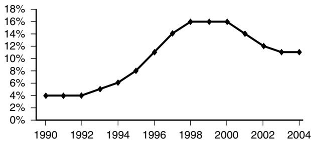
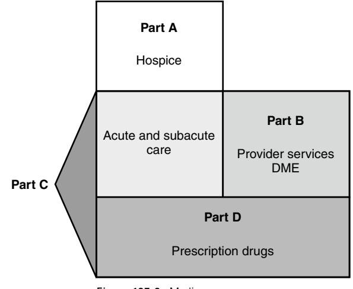

# Managed Care for Older Americans

Richard G. Stefanacci

The current care delivery system for older Americans requires significant reform to improve the care of this population.1 One of the growing delivery systems that is well positioned to improve the care for older adults is provided through managed care. This is in part due to the fact that managed care shares some common goals and processes with geriatric medicine.2,3

In its broadest sense, managed care refers to a system where a payment is made to a provider or health plan that is then responsible for a group of services. A more traditional and focused view of managed care refers just to health plans that are responsible for providing all of the services available under the entire Medicare program with the exception of hospice services. These services can be provided either directly through a closed system of providers or through an open system using contracted community providers. The closed system uses a full complement of employed providers. Medicare Advantage (MA), under The Centers for Medicare and Medicaid Services (CMS), administered this program as provided under the Medicare Part C program. Previous to the Medicare Modernization Act of 2003 these plans were referred to as Medicare+Choice or simply a health maintenance organization.

Medicare managed care plans have several potential advantages over the traditional Medicare fee-for-service program. These advantages include having lower deductibles and copayments, and offering benefits that are not part of the Medicare fee-for-service coverage, such as payments for preventive care including reimbursement for eyeglasses and hearing aids; health education, and health promotion programs such as case management and disease management. Managed care plans can also provide discounts on or improved access to transportation, day care, respite care, or assisted living. Plans are also not restricted by Medicare feefor-service rules such as the requirement for 3 hospital days plus a discharge day to qualify for subacute services; instead Medicare managed care plans can admit members directly to skilled nursing facilities, thus avoiding a hospitalization and related costs, both financial and health. This subacute level of care is for services requiring skilled nursing care, such as intravenous therapy or rehabilitation.

Although coverage for pharmaceutical costs had historically been a major reason why older adults enrolled in Medicare managed care, the introduction of free-standing prescription drug plans under Medicare Part D, which started Jan 1, 2006, removed this differential from fee-for-service in traditional Medicare. As a result of Medicare Part D both FFS Medicare and Medicare managed care plans both provide the opportunity for coverage of prescription medications.

Thus principles of managed care are moving beyond MA plans into portions of Medicare fee-for-service. Through such programs as pay-for-performance and some unique demonstration programs, Medicare is applying the principles of managed care so older adults in traditional Medicare can also benefit.

# **MANAGED CARE TIMELINE**

The modern era of managed care was heralded by a new law enacted by the U.S. Congress in 1974. This law permitted the establishment of health maintenance organizations (HMOs) whose purpose was to encourage the development of prepaid health plans. From their start in the mid-1970s until the late 1990s, managed care saw a slow and consistent growth. Participation in Medicare managed care increased steadily in the 1990s, reaching a peak of 6.3 million beneficiaries (16%) in 2000.

In 1997 revisions enacted by Congress that increased administrative burden and reduced payments to the health plans resulted in many plans exiting the market or limiting their enrollment.4 Enrollment declined between 2000 and 2003 because of plan withdrawals from some areas, reduced benefits, and higher premiums.

A rebirth of managed care for Medicare beneficiaries occurred as a result of the Medicare Modernization Act (MMA). MMA (passed in 2003) changed managed care for older adults in several ways. First, it changed the name from Medicare+Choice (M+C) to Medicare Advantage, and added different managed care options such as demonstration programs and special needs plans (SNP). MA plans also received increased payments, which were used to raise payments to providers, lower enrollee premiums, enhance existing benefits, and increase stabilization funds. As a result of these changes, enrollment in MA plans rose slightly from 2003 to 2004 and continues to rise each year (Figure 127-1).

## **MEDICARE MANAGED CARE IN FEE-FOR-SERVICE**

Under the Medicare Part A benefit, also referred to as hospital insurance, providers are paid a defined amount for providing a bundle of services. Medicare Part A providers include acute care hospitals, skilled nursing facility subacute care, and hospice. It is important to note that while Medicare Part C (Medicare Advantage) includes Medicare Part A, B, and in most cases Part D, hospice is still provided as a separate benefit. Since Medicare Part A providers are paid a capitated payment, they are encouraged to use managed care principles to control cost and improve outcomes.

Medicare Part B, also referred to as medical insurance, covers physician provider services. Although historically these services were paid simply on the basis of the number and type of services provided, (CMS) is applying managed care principles to this program as well. The 2006 Tax Relief and Health Care Act required the establishment of a physician quality reporting system, including an incentive payment for eligible professionals who satisfactorily report data on quality measures for covered services furnished to Medicare beneficiaries. CMS named this program the Physician Quality Reporting Initiative (PQRI). In 2008 PQRI consisted of

Figure 127-1. Percentage of beneficiaries enrolled in Medicare managed care. *(Source: Kaiser Family Foundation calculations using data from the Centers for Medicare and Medicaid Services, Medicare Managed Care Contract Plans Monthly Summary Reports for December 1 of each year, at* http://www.cms.hhs. gov/healthplans/statistics/mmcc*;/ (Medicare managed care enrollment), and total Medicare enrollment data from the Centers for Medicare and Medicaid Services, Office of the Actuary, personal communication.* http://www.kff.org/ insurance/7031/ti2004-2-17.cfm*)*

119 quality measures, including two structural measures. One structural measure conveys whether a professional has and uses electronic health records and the other electronic prescribing.5 These measures are a movement to encourage the use of managed care principles in the Medicare FFS program.

Prescription drug plans as previously mentioned are authorized under the Medicare Part D program. In addition to general managed care principles to assure appropriate medication use, prescription plans are required by CMS to provide medication therapy management programs (MTMP).6 CMS's objective with regard to MTMP is to control costs and improve quality. Plans provide MTMP through implementation of managed care principles.

Care for beneficiaries with chronic illnesses, such as heart disease and diabetes, is a major expense to the Medicare program, and a major detriment to beneficiaries' quality of life. For example, just under one half of all beneficiaries in 1997 were treated for one or more of eight categories of chronic illnesses, and they accounted for three fourths of all Medicare spending in 1998 (Brown et al, 2004). Furthermore, beneficiaries often have multiple chronic illnesses, which compounds the cost and complexity of their care. The 12% with three or more of the eight chronic health problems accounted for one third of all Medicare spending. Coordinating the care of these patients is difficult because patients with chronic illnesses see an average of 11 different physicians per year.7

The CMS conducts and sponsors a number of innovative demonstration projects to test and measure the effect of potential program changes. CMS's demonstrations study the likely impact of new methods of service delivery, coverage of new types of service, and new payment approaches on beneficiaries, providers, health plans, states, and the Medicare Trust Funds. Evaluation projects validate CMS research and demonstration findings and help CMS monitor the effectiveness of Medicare, Medicaid, and the State Children's Health Insurance Program (SCHIP).

Many of the demonstration projects are focused on managing care for those Medicare beneficiaries suffering from chronic illnesses. The following are examples of some of the many demonstration projects that CMS has funded in the past and continues to fund.

## **Coordinated care demonstration8**

The Medicare Coordinated Care Demonstration (MCCD) tests whether case management and disease management programs can lower costs and improve patient outcomes and well-being in the Medicare fee-for-service population. The evaluation of this demonstration project by Mathematica Policy Research, Inc. showed no clear benefit of this program. Based on the patterns of differences in hospitalizations, Medicare Part A and B expenditures, and total Medicare expenditures including the care coordination fees, six of the programs are not cost neutral, four probably are not, and five may be cost neutral, over their first 25 months of operations. Given the results, the continuation of this demonstration is in doubt.

## **Senior risk reduction program9**

The Senior Risk Reduction Demonstration was established to test whether health promotion and health management programs that have been developed and tested in the private sector can also be tailored to and work well with Medicare beneficiaries to improve their health and reduce avoidable health care use.

## **Care management for high-cost beneficiaries demonstration10**

This demonstration was established to evaluate various care management models for high-cost beneficiaries in the traditional Medicare fee-for-service program.

#### **ESRD disease management demonstration11**

The End-Stage Renal Disease (ESRD) Disease Management Demonstration was established to increase the opportunity for Medicare beneficiaries with ESRD to join integrated care management systems. The demonstration is designed to test the effectiveness of disease management models to increase quality of care for ESRD patients while ensuring that this care is provided more effectively and efficiently.

#### **Program for all-Inclusive care for the elderly (PACE)12**

Some demonstration programs that have proven their value have gone on to become permanent programs. The Program of All-Inclusive Care for the Elderly (PACE) is such a program. The PACE model is centered on the belief that it is better for the well-being of seniors with chronic care needs and their families to be served in the community whenever possible.

PACE serves individuals who are age 55 or older, certified by their state to need nursing home care, are able to live safely in the community at the time of enrollment, and live in a PACE service area. Although all PACE participants must be certified to need nursing home care to enroll in PACE, only about 7% of PACE participants nationally reside in a nursing home. If a PACE enrollee does need nursing home care, the PACE program pays for it and continues to coordinate the enrollee's care.

A study13 of the PACE model by Dr. Catherine Eng and her team found positive outcomes. Specifically the results demonstrated good consumer satisfaction, reduction in use of institutional care, controlled use of medical services, and cost savings to public and private payers of care, including Medicare and Medicaid. The study concluded by stating that the PACE model's comprehensiveness of health and social services, its cost-effective coordinated system of care delivery, and its method of integrated financing have wide applicability and appeal.

#### **Social/health maintenance organization (S/HMO)14**

Another similar program to PACE that did not achieve permanent status but instead was terminated because of the lack of demonstrated effectiveness was the social/health maintenance organization (S/HMO). S/HMOs were a four-site national demonstration located in: Portland, Ore.; Long Beach, Calif.; Brooklyn, N.Y.; and Las Vegas. This program combined Medicare Part A and B coverage, with various extended and chronic care benefits into an integrated health plan.

A social HMO is an organization that provides the full range of Medicare benefits offered by standard HMOs, plus additional services that include care coordination, prescription drug benefits, chronic care benefits covering short-term nursing home care, a full range of home and communitybased services such as homemaker, personal care services, adult day care, respite care, and medical transportation. Other services that may be provided include eyeglasses, hearing aids, and dental benefits.

These plans offered the full range of medical benefits that are offered by standard HMOs plus chronic care/extended care services. Membership offers other health benefits that are not provided through Medicare alone or most other senior health plans.

## **MANAGED CARE PRINCIPLES**

### Managed Care Principles

- • **Screening** enrolled population to identify individuals with special needs.
- • **Coordinating** the actions of all providers across the continuum of enrolled beneficiaries' care.
- Offering effective **health promotion,** disease prevention, and self-management programs.
- Making available the services of **interdisciplinary** health care professionals, including physicians, nurses, social workers, pharmacists, and rehabilitation therapists.
- Using **geriatric expertise** available for designing and administering geriatric programs and for consultation with primary care physicians, case managers, and other providers.

Managed care can be an efficient approach for Medicare to finance high-quality, cost-effective geriatrics. The American Geriatrics Society (AGS) wrote in their position statement15 on Managed Care that to realize the potential flexibility and creativity inherent in capitated financing, MCOs should develop special processes for providing highquality health care to enrollees who need complex health services.

The starting point is identifying those members most at need for special attention by screening the enrolled population to identify individuals with special needs. Plans should use valid and reliable instruments to screen their enrollees regularly. They should assess the clinical needs of high-risk enrollees for both functional status and quality of life. The rationale for this approach is that about 10% to 15% of beneficiaries, most of who have several chronic conditions, account for 70% to 80% of Medicare's annual payments for health care. Early identification of those who are at highest risk for requiring expensive care—and assessing their clinical needs—would facilitate coordination of care and timely preventive interventions designed to improve the clinical and financial outcomes of care.16

Assessment for risk is typically accomplished through a health risk assessment (HRA). One of the tools used for identifying members is the Pra and PraPlus.17 Many organizations use the Pra or the PraPlus to screen older populations to identify individuals who are at risk for using health services heavily in the future. MCOs can then offer special forms of health care, such as case management, comprehensive geriatric assessment (CGA), or geriatric evaluation and management (GEM) to these at-risk individuals.

Coordinating the actions of all providers across the continuum of enrolled beneficiaries' care is important for quality care. The rationale here is that coordination improves the quality and the outcomes of health care, including safety, cost, and satisfaction with care. The coordination of care can be made more efficient and effective by using integrated medical records and improved communication tools.18,19 Offering effective health promotion, disease prevention, and self-management programs can prevent or delay the progression of disease, resulting in better patient outcomes and lower costs of health care. In addition programs that provide education of patients and their caregivers with regard to their conditions and self-management initiatives empower them to be proactive and choose wise alternatives.20–22 Making available the services of health care professionals from several disciplines, including physicians, nurses, social workers, pharmacists, and rehabilitation therapists is needed. These professionals should function as interdisciplinary teams in managing not only the medical conditions but also social factors that affect high-risk beneficiaries' well-being. The interdisciplinary team approach allows for comprehensive, coordinated assessment and management of beneficiaries' medical, psychological, social, and functional needs—and those of their unpaid caregivers.23–26 Geriatric expertise should be available for designing and administering geriatric programs and for consultation with primary care physicians, case managers, and other providers. MCOs would be well served by using a geriatrician in a medical director role to help guide the development and management of programs necessary for success in caring for seniors. Geriatricians have the background necessary in efficiently and effectively managing patients in teams, and managing the care of complex patients with multiple problems across the continuum of care.27,28 The quality of the health care provided to beneficiaries by MCOs should be measured consistently and reported regularly to the plans' executives and providers, to CMS, and to the public. New instruments designed to measure the quality of outpatient care and coordination of care must be developed and tested for reliability and validity. Credible, understandable information about the quality of health care is essential to organizations' processes for improving quality and to consumers' efforts to make informed choices from among the available health plans and providers.29

#### **PLAN REIMBURSEMENT**

For payment purposes, there are two different categories of MA plans: local plans and regional plans. Local plans may be any of the available plan types and may serve one or more counties. Medicare pays them based on their enrollees' counties of residence. Regional plans, however, must be PPOs and must serve all of one of the 26 regions established by the CMS. Each region comprises one or more entire states.

Under the MA program, Medicare buys insurance coverage for its beneficiaries from private plans with payments made monthly. The coverage must include all Medicare Part A and Part B benefits except hospice. These payments are based on a number of factors including age and geographic variations in health care costs.

Recommendations to Medicare on payments, including changes to the MA program are made by the Medicare Payment Advisory Commission (MedPAC), the official, independent federal advisory body to Congress on Medicare payment policy. There is pressure to decrease reimbursement to Medicare managed care because of a belief that private plans, which were initially brought into the Medicare program to reduce costs, have actually increased costs. Both MedPAC and the Congressional Budget Office have found that private plans are paid 12% more, on average, than it would cost traditional Medicare to cover the same beneficiaries. According to an analysis by The Commonwealth Fund, these overpayments are estimated to average about \$1000 for each beneficiary enrolled in a private plan. CBO estimates that these overpayments will equal at least \$54 billion over the next 5 years and \$149 billion over 10 years.30,31

In a June 2005 report, MedPAC recommended various changes in how Medicare pays managed care plans under MA to reduce inefficient and wasteful Medicare payments.32 The Congressional Budget Office has estimated that the MedPAC proposals would save \$20 billion to \$30 billion over 5 years.33 Based on the MedPAC recommendations to decrease payments to MA plans, Congress passed the Medicare Improvements for Patients and Providers Act of 2008, which includes many reductions in MA reimbursement which is likely to force a reduction in benefits and thus a reduction in enrollment.

In the case of prescription drug plans (PDPs), which operate under the Medicare Part D program, payment is made for providing prescription drug coverage for those Medicare beneficiaries that enroll in that specific plan. Overall, for prescription drug plan payments Medicare subsidizes premiums by about 75% and provides additional subsidies for beneficiaries who have low levels of income and assets. Medicare's payments to prescription drug plans are determined through a competitive bidding process, and enrollee premiums are also tied to plan bids. Payments from Medicare to these prescription drug plans is risk-adjusted based on the likely drug spending for that specific enrollee. On average these payments from Medicare equal \$104 per month, which when combined with the average monthly premium equal about \$124 per month. The prescription plan is responsible for paying the costs of medications (excluding the member's responsibility) and administrative overhead, which include medication therapy management services.

Those health systems that are more integrated, such as the MA plans, typically offer greater pharmaceutical benefits because they benefit from pharmaceutical use that reduces hospitalization and medical services. Evaluations of these plans has shown that MA plans offer greater pharmaceutical benefits; 73% versus 17% of MA plans offered enhanced prescription coverage versus prescription drug plans (PDP). In addition the same evaluation noted that 28% of MA plans versus 6% of PDPs provided coverage in the coverage gap.34 MA plans offering enhanced drug benefits and therefore spending more on medications can reduce other Medicare expenditures.

#### **CAPITATION AND PAY-FOR-PERFORMANCE**

Capitation rates in all regions of the country should be sufficient for providing high-quality health care for all Medicare beneficiaries, regardless of the intensity of their clinical needs. Specifically, the CMS should provide capitation that reflects the probable cost of caring for each enrolled beneficiary. This should be accomplished by risk-adjusting capitation payments according to individual beneficiaries' diagnosis, functional status, and use. Capitation payments that acknowledge that beneficiaries with chronic conditions require more health care than those who are healthy would encourage MCOs to enroll beneficiaries who have chronic conditions and to provide them with special services designed to address their needs for complex care. In contrast, inadequate risk-adjustment of capitation payments is a disincentive for plans to enroll frail or medically complex beneficiaries or to offer special services that might encourage such beneficiaries to enroll.35–37

Beyond capitation is a movement to base payment on outcomes. Termed pay-for-performance (P4P), it has the potential to improve care to this population. Current payment systems do not consider quality in determining reimbursement. The incentives of the current reimbursement systems sometimes promote poor quality care. The present fee-forservice payment systems pay providers based on the number and complexity of services provided to patients without regard to quality, efficiency, or impact on health outcomes. Pay-for-performance has been proposed as one strategy designed to correct this deficiency.

A value-based purchasing system for the Medicare system must address the care of the large portion of Medicare beneficiaries who have multiple chronic conditions, are frail, of advanced age, or require palliative care and not focus only on the care provided to the typical beneficiary.38 For these beneficiaries, measures should account for comorbidities and assess aspects of health that are common to multiple conditions (e.g., cognitive status, functional status, and pain.) Measures should be constructed so that providers are not penalized when they honor patients' preferences for care or their cultural or religious beliefs.

The older adult population served by Medicare is extremely heterogeneous. Many people are healthy and functional, but up to one third of the Medicare population are vulnerable, with multiple comorbidities and geriatric conditions (functional and cognitive impairment, falls, and frailty). In addition, some older adults will place different values on participation in self-management and adherence to medical recommendations, especially in the setting of multiple comorbidities and health status vulnerability. Some older adults may put more emphasis on improved functioning and quality of life rather than traditional indicators of clinical care quality.

It is essential that a pay-for-performance program not unwittingly lead to a decrease in quality for vulnerable elders or those who may have different clinical care goals. Assessing and rewarding performance using indicators that have been developed for and commercially (non-Medicare) insured population and may not be relevant to vulnerable older adults has the potential to detract attention away from essential care and services. A pay-for-performance system needs to produce quality results that are meaningful and appropriate to the overall goals of clinical care for the patient population as a whole and for particularly vulnerable populations including the frail elderly. Failing to take this important policy concern into account could adversely affect access to primary and specialty care among those Medicare beneficiaries who might benefit the most from high-quality care.39–42

It has been proposed that payment reform is needed to drive practice change. Effective pay-for-performance systems support and stimulate the structural capabilities necessary for the provision, documentation, measurement, and continuous improvement of high-quality care. The need for different provider settings to care for unique patient populations must also be considered when designing and implementing payment based upon performance. For example, larger practices may have more resources to implement quality care processes. Such resources include providing patient education materials for patients and their caregivers, language translation services, and other outreach activities to facilitate good patient care. A smaller practice may have fewer resources to measure and report quality, yet be an essential care provider, such as a rural care provider or home-bound elderly care team. Certain practices may be focused on a population subset for which there are no performance measures at this time. Payment reform should lead to improved practice design without eliminating essential care providers.

#### **MEASURING QUALITY OF CARE**

Providers who use innovative approaches that improve quality of care find that most current payment systems do not provide them with the resources needed to sustain these activities. Today's fee-for-service payment system does not provide payment for services such as health education or development of the infrastructure to measure and report quality. The result is that providers are unable to invest in activities that have great potential to improve quality and avoid unnecessary medical costs. An example of such activities is health information technology (HIT), including electronic health records and ePrescribing. Providers typically cite the cost of these HIT systems and lack of a clear return on investment as barriers to their implementation. In addition to the incentive of higher reimbursement for provision of better quality care, funds should be made available through direct grants and low interest loans for the infrastructure responsible for implementation of a HIT system within a practice. HIT systems are not only used for the management of clinical records, but are critical elements in data collection, clinician feedback, quality improvement, and population tracking. Each of these is essential to practice improvement as the final desired outcome of pay-for-performance programs.43–45

Structure, process, and clinical outcomes measures used must be valid and relevant for the unique care needs of frail or vulnerable older adults. These measures should be evidence-based, clinically relevant, have clear association with improved outcomes of care, and be applicable to all patients whose care they assess.

Technical specifications for numerators and denominators of measures should be constructed so that measures are not applied to special populations where evidence of linkage to performance of care processes to improved outcomes is lacking. These populations include persons of very advanced age, those with multiple comorbidities, limited life expectancy, or moderate to severe dementia.

More importantly, specific measures are needed to assess the quality of care of persons over age 75, those who are vulnerable and/or frail and who are receiving palliative care near the end of life. Clinical performance measures relevant to the Medicare population are of three types:

- 1. Structure measures used to recognize systems of care associated with improved health outcomes. Multidisciplinary teams for care, capacity for patient education in self-care management, disease registries, electronic health records, and systems to support the use of intervisit interval patient contacts, and monitoring are important aspects of the chronic care model. Important processes of care are difficult to deliver absent such structure(s). Initial reward systems should recognize investment in such delivery structure.
- 2. Process measures used to determine whether care that is known to be effective is provided. The AGS believes that specific measures are needed to assess the quality of care of persons over age 75, those who are frail or vulnerable, and those who are receiving palliative care near the end of life. The Assessing the Care of the Vulnerable Elders (ACOVE)46 measures were developed by the RAND Corporation in response to the needs of persons at risk for frailty or persons aged 75 and older. They have been tested in cohorts of community-dwelling vulnerable older adults. Adoption of some or all of these indicators in addition to disease- and prevention-based measures appropriate for the younger population will greatly enhance attaining the goal that quality of care can be measured for all Medicare beneficiaries and that the providers who care for these patients have measures of accountability.
- 3. Clinical outcome measures must be appropriate to the usual health care needs and goals of the patient population in which they are used. Many of these measures are disease-specific, originally developed in commercially insured populations, and do not account for other comorbidities. If not previously

tested in the heterogeneous Medicare population, such measures may be particularly problematic. In frail or vulnerable older persons, the goals of treatment for chronic disease are more variable than in younger adults, and the linkage between process of care delivered and clinical measures is often imperfect.

High-quality geriatric care requires providing services to a heterogeneous population with varied health care service needs and goals of care, including many with multiple chronic illnesses and geriatric conditions. Fundamental to the definition of quality is that the standard of care being measured is applicable to the individual to whom it is applied. Many available clinical performance measures have been developed in the middle-aged commercial population. Some of these measures have been tested in older adult populations, but some have not, so the applicability of untested measures to older adult, heterogeneous populations is not known. The complexity of delivering high-quality care to this population can only be guided by rigorous scientific testing of performance indicator measures. Such testing can allow us to adapt measures to the specific needs of vulnerable patient populations. These measures need to be developed and validated by individuals with expertise in the care of frail elders. Measurement development and testing is a dynamic process so even in the setting of value-based purchasing there should be an established process for continual evolution of performance indicator measures. Key stakeholders should remain involved.47–50

A pay-for-performance system must provide positive reinforcement for quality performance and improvement and not promote the avoidance of patients for whom providing high-quality care will be more challenging. When applied to individual providers, these measures should be constructed so that both achievement of target thresholds (excellence) and progress toward achievement of targets (improvement) can be positively reinforced. In addition, the collection of data that are used to evaluate performance should not be burdensome to providers and should accurately reflect the performance of care processes on an individual patient basis. Failure to consider these factors may unduly penalize providers who practice in small groups or care for special populations.

Linking a portion of payments to valid measures of quality and effective use of resources will result in providers having direct incentives and financial support to implement the innovative approaches that result in improved outcomes. All monies that are set aside for pay-for-performance should be distributed to providers achieving the quality criteria. Savings from improved care are likely to accrue to Medicare funds that are not part of the physician resource pool. Performance-based funds should not be used in a withhold approach or a Medicare Part B budget neutral manner. To the fullest extent possible, norms should be established for like populations and risk adjustment should occur. Although it is recognized that value-based purchasing should not be delayed while such adjustments are refined, such an approach will minimize the risk of providers avoiding patients (e.g., the frail and medically complex) who present the greatest challenge in meeting quality indicators used for pay-forperformance (Figure 127-2).51,52

Figure 127-2. Medicare programs.

#### **A VISION FOR CARE IN THE FUTURE**

As managed care for older adults evolves a direction likely to follow has been laid out by the Institute of Medicine. The IOM identified three key principles that need to form the basis of an improved system of care delivery for older Americans. These principles are in alignment with the six aims of quality defined in Crossing the Quality Chasm.53

First and foremost, the health needs of the older population need to be comprehensively addressed, and care needs to be patient-centered. For most older adults, care needs to include preventive services (including lifestyle modification) and coordinated treatment of chronic and acute health conditions. For frail older adults, social services may also be needed to maintain or improve health. These social services need to be integrated with health care services in their delivery and financing. Furthermore, efforts need to be made to reduce the wide variation in practice protocols among providers, which should further enhance the quality of care for older adults.

The principle of comprehensive care also includes taking into account the increasing sociodemographic diversity of older adults. The number and percent of ethnic minorities in the older population is increasing dramatically, and even within ethnic groups there is tremendous cultural diversity. Health care providers need to be sensitive to the wide variety of languages, cultures, and health beliefs among older adults. Other segments of the older population face additional challenges. For example, older adults in rural areas often face isolation and barriers to access for some services.

The second principle underlying the vision of care in the future is that services need to be provided efficiently. Providers will need to be trained to work in interdisciplinary teams and financing and delivery systems need to support this interdisciplinary approach. Care needs to be seamless across various care delivery sites, and all clinicians need to have access to patients' health information and population data, when needed. Health information technology, such as interoperable electronic health records and remote monitoring, needs to be used to support the health care workforce by improving communication among providers and their patients, building a record of population data, promoting interdisciplinary patient care and care coordination, facilitating patient transitions, and improving quality and safety overall. Giving providers immediate access to patient information, especially for patients who are cognitively impaired and unable to provide their own clinical history, may reduce the likelihood of errors, lower costs, and increase efficiency in care delivery.

This vision for the future is being tested through the Medicare Medical Home Demonstration. Section 204 of the Tax Relief and Health Care Act of 2006 (TRHCA)54 mandates a demonstration in up to eight states to provide targeted, accessible, continuous, and coordinated family-centered care to Medicare beneficiaries who are deemed to be high need (i.e., with multiple chronic or prolonged illnesses that require regular medical monitoring, advising, or treatment.) The objective is to bring managed care principles to the Medicare fee-for-services system.

Efficiency can be further improved by ensuring that health care personnel are used in a way that makes the most of their capabilities. Expanding the scope of practice or responsibility for providers has the potential to increase the overall productivity of the workforce and at the same time promote retention by providing greater opportunities for specialization (e.g., through career lattices) and professional advancement. Specifically, this would involve a cascading of responsibilities, giving additional duties to personnel with more limited training to increase the amount of time that more highly trained personnel have to carry out the work that they alone are able to perform. Although the necessary regulatory changes would likely be controversial in some cases, the projected shortfall in workforce supply requires an urgent response. This response will most likely have to involve expansions in the scope of practice at all levels, while at the same time ensuring that these changes are consistent with high-quality care.

In the end, the U.S. system of care for older adults will rely on improving the effectiveness and efficiency of our current system. Many of the systems for efficient and effective care are already being provided through today's managed care program. The key will be further improvements in the current managed care system along with allowing these principles to work in the larger fee-for-service Medicare program.

# KEY POINTS

#### Managed Care for Older Americans

- Managed care shares some common goals and processes with geriatric medicine.
- Increasingly managed care principles are being applied outside of traditional managed care organizations in Medicare fee-forservice programs.
- Despite the benefits of managed care there continues to be pressure to decrease reimbursement to these plans.
- Managed care principles include a focus on screening, coordination, health promotion, and interdisciplinary health care professionals with geriatric expertise.
- Future successes of the American system for caring for older adults is reliant on the application of managed care principles for efficiency and effectiveness beyond managed care organizations.

For a complete list of references, please visit online only at www.expertconsult.com