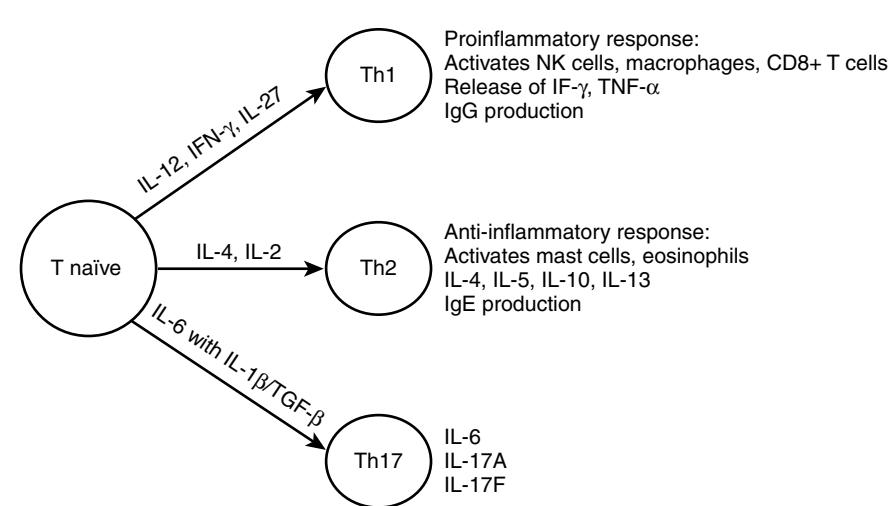

# Clinical Immunology: Immune Senescence and the Acquired Immune Deficiency of Aging

Mohan K. Tummala Dennis D. Taub William B. Ershler

As a fundamental organ necessary for the maintenance of life, the immune system first appeared in primitive organisms about 480 million years ago.1 The intricate relationship between acquired immunity and infection was apparent early in recorded history. Observing an epidemic of plague in 430 BC, Thucydides reported that anyone who had recovered from the disease was spared during future outbreaks. The era of modern immunology was launched with Jenner's report in 1798 of an effective vaccine employing cowpox pustules to prevent smallpox in humans. Improved understanding of immunity and infection continued throughout the nineteenth and twentieth centuries. For example, identification of bacterial organisms ultimately resulted in the discovery of antibodies that could neutralize these microbes and/or their toxins, eventually leading to endorsement of the concept of vaccination. The discovery of antibody structure during the 1960s finally began the era of modern immunochemistry. With regard to cellular immunity, despite the early work of Metchnikoff and his followers, the role of cells in acquired immunity was not truly appreciated until the 1950s. Although theories of "self-recognition" and "autoimmunity" appeared early in the twentieth century, autoimmune diseases remain incompletely understood.

As a concept, immunogerontology is a relatively recent focus of interest. In 1969, Walford proposed that declining immune function contributes to the biologic processes of aging.2 He speculated that disorders in the immune system that occur with aging account for three major causes of disease in old age: (1) increased autoimmunity; (2) failing surveillance allowing the expression of cancers; and (3) the increased susceptibility to infectious diseases. Current evidence supports the notion that the decline in immune function with aging may be viewed as a form of acquired immunodeficiency of modest dimension. Complicating the assessment of aging on immune function, older people are more likely to have diseases, conditions, or exposures that contribute to declining immune function.3

# **CHANGES IN THE HUMAN IMMUNE SYSTEM WITH AGING**

# **Nonspecific host defense**

Primary (innate) immunity is the first line of defense against invading pathogens. It differs from secondary (acquired) immunity in that it does not require sensitization or prior exposure to offer protection. Primary immunity involves tissues (e.g., mucocutaneous barriers), cells (monocytes, neutrophils, natural killer [NK] cells) and soluble factors (cytokines, chemokines, complement) coordinated to mediate the nonspecific lysis of foreign cells.

A feature of innate immunity is the detection of pathogens using pattern recognition receptors such as Toll-like receptors (TLRs) that recognize specific molecular patterns present on the surface of pathogens triggering a variety of signaling pathways. After processing of antigen by the antigen presenting cells, the peptide fragments are presented along with major histocompatibility (MHC) class II molecules to CD4+ T cells or with MHC class I molecules to CD8+ T cells to generate efficient T-cell responses. The antigen presenting cells also provide additional co-stimulatory stimulus (e.g., ligation of B7.1 or CD80 on antigen-presenting cells with CD28 on T cells) to lower the threshold of T-cell activation and survival following the recognition of antigens. The ligation of TLRs on antigen presenting cells enhances the phagocytosis of the pathogen through the release of chemokines and other peptides, which then result in activation and recruitment of immune cells to the sites of infection.

# **Phagocytosis**

Phagocytosis involves the engulfment and lysis and/or digestion of foreign substances. The capacity of neutrophils, macrophages, and monocytes for phagocytosis is determined by their number and ability to reach the relevant site, adhere to endothelial surfaces, respond to chemical signals (chemotaxis), and complete the process of phagocytosis.4 The study of alterations in phagocytosis with age must then involve examinations of each of these steps, and are inherently more difficult in human populations than in disease-free inbred animals. Extrapolation of studies of senescent mice to humans suggests age itself does not attenuate response to bacterial capsular antigens in a well-vascularized area such as the lung.5,6 Niwa et al reported a deterioration in neutrophil chemotaxis and increase in serum lipid peroxidase in the nonsurviving cohort of a 7-year longitudinal study, suggesting a preterminal but not necessarily "normal" aging alteration in these factors.7 However, age-related effectiveness in chemotaxis may be reduced in less vascular tissues in vivo, such as in the skin, which also has a number of other changes that may impair the ability of cells in the vascular compartment to reach a site of infection.8 Although elderly persons preserve the number and overall phagocytic capacity, in vitro neutrophil functions (including endothelial adherence, migration, granule secretory behavior such as superoxide production, nitric oxide, and apoptosis) appear to be reduced with age,9–11 and significantly fewer neutrophils arrive at the skin abrasion sites studied in older people.12 How this translates to immune response and immune-mediated repair in infected or otherwise physiologically stressed older people remains unknown. Although the expression of TLRs and GM-CSF receptors are not diminished, ligation of these receptors results in altered signal transduction. With aging, alterations in signal transduction of these receptors may be involved in the defective function of neutrophils with decreased response to stimuli such as infection with gram positive bacteria.13,14 These changes in the elderly, unlike in the young, could be the result of changes in the recruitment of TLR4 into lipid rafts and no-raft fractions (the domains on plasma membrane that play an important role in cell signaling) with LPS stimulation.15 And similarly, the activation through GM-CSF on the surface of these cells is also altered in the elderly because of an age-related presence of a phosphatase in the lipid raft blocking cell activation and contributing to decreased response to GM-CSF in neutrophils from older people.16

Macrophage activation also appears to change with age; this may be partially attributable to a reduced gamma interferon signal from T lymphocytes.17,18 A decrease in the number of macrophage precursors and macrophages is observed in bone marrow.19 Although it is not clear if there is an age-associated decrease of TLR on the surface of aged macrophages, defective production of cytokines has been observed after TLR stimulation, possibly due to altered signal transduction.20,21 With aging, there is diminished expression of MHC class II molecules both in humans and in mice, resulting in diminished antigen recognition and processing by these antigen presenting cells.19,22 In addition, activated macrophages from humans and mice produce higher levels of prostaglandin E2, which may negatively influence antigen presentation.19 Fewer signals at the site of infection may be a consequence of reduced numbers of activated T cells locally due to reduced antigen processing capacity of macrophages. Fewer T cells and the defective expression of homing markers to attract T cells from peripheral blood into inflamed tissues23 suggests that increased susceptibility of old mice to, for example, tuberculosis, reflects an impaired capacity to focus mediator cells and the additional cytokine they may express at sites of infection (see more on T-cell changes with age in later discussion). These observations may help explain why late-life tuberculosis or reactivation tuberculosis occurs and remains clinically important in geriatric populations. The change in function of antigen-presenting dendritic cells (DC) with aging is less well defined. A decrease in number and migration of Langerhans cells in skin has been described in elderly people,24 but their function remains sufficient for antigen presentation.25 In contrast, DCs from the elderly who are considered "frail'' have been demonstrated to have reduced expression of costimulatory molecules, secrete less interleukin (IL)-12, and stimulate a less robust T-cell proliferative response when compared with those who are not "frail.26"

## **Cell lysis**

Cell lysis is mediated through a variety of pathways, including the complement system, natural killer (NK), macrophage/ monocyte, and neutrophil activity. Complement activity does not appear to decline significantly with age, and neutrophil function also appears intact. However, in longitudinal studies of nonhuman primates, NK activity does appear to be affected by age27 and acute stressors such as illness.28 The functioning status of NK cells is dependent on a balance of activating and inhibitory signals delivered to membrane receptors.29 A well preserved NK cell activity is observed in healthy elderly individuals30 explaining, in part, a lower incidence of respiratory tract infections and higher antibody titers after influenza vaccination.31 However, elderly individuals with chronic diseases and frailty are characterized by lower NK cytotoxicity and a greater predisposition to infection and other medical disorders.32,33

Although little is known about any changes in expression of activating and inhibitory receptors in the elderly, NK activation and cytotoxic granule release remain intact.30,34 Secretion of IFN-γ after stimulation of purified NK cells with IL-2 shows an early decrease, which can be overcome with prolonged incubation.35 IL-12 or IL-2 can upregulate chemokine production, although to a lesser extent than that observed in young subjects.36 These observations suggest that NK cells have an age-associated defect in their response to cytokines with subsequent detriment in their capacity both to kill target cells and to synthesize cytokines and chemokines.

## **Specific host defense**

There are well-defined alterations in both cellular and humoral immunity with advancing age. In the cellular immune system, most studies show no significant changes with human aging in the total number of peripheral blood cells, including total lymphocytes, monocytes, NK cells, or polymorphonuclear leukocytes.35,37–41 The appearance of lymphocytopenia is associated with mortality in elderly people, but is not an age-related finding.42–44 Most studies show no changes in the percentages of B- and T-lymphocyte populations in the peripheral blood,45,46 although chronically ill elderly people may particularly have a decline in total T-cell numbers. Equivocal changes in the ratio of helper cells to suppressor cells (T4/T8) occur in normal aging.39,40,45,47,48 These findings are in contrast to human immunodeficiency virus (HIV)-induced acquired immunodeficiency syndrome (AIDS) associated with a decreased T4/T8 ratio. Finally, there is a specific age-related increase in memory cells, cells that express the CD45 surface marker.49–52

## **Qualitative changes in T-cell function**

The function of lymphocytes is altered with aging. This may be a consequence of decreased thymic function, an important factor for age-related changes in thymic dependent immunity-adaptive T-cell immunity. Declines in serum thymic hormones precede the decline in thymic tissue. By the age of 60, few of the thymic peptides are measurable in human peripheral blood,53 and the thymus undergoes progressive reduction in size associated with the loss of thymic epithelial cells and a decrease in thymopoiesis. Thymic hormone replacement may improve immune function in old age,54,55 but there are no current clinical indications in this regard.

T cells may be considered either "naïve" or "memory" on the basis of prior antigen exposure, and with advancing age, there has been noted a relative expansion of the memory T-cell pool. The competency of adaptive immune function declines with age primarily because of a dramatic decline in production of naïve lymphocytes because of a decline in thymic output and an increase in inert memory lymphocytes (see later discussion). Naïve CD4+ T cells isolated from aged humans and animals display a decreased in vitro responsiveness and altered profiles of cytokine secretion to mitogen stimulation and expand poorly and give rise to fewer effector cells when compared with naïve CD4+ T cells isolated from younger hosts. Naïve CD4+ T cells from aged animals produce about half the IL-2 as young cells on initial stimulation with antigen-antigen presenting cells. Also the helper function of naïve CD4+ T cells for antibody production is also decreased.56 But newly generated CD4+ cells in aged mice respond quite well to antigens and are able to expand with adequate IL-2 production with good cognate helper function. Thus these age-related defects in naïve CD4+ T cells appear to be a result of the chronologic age of naïve CD4+ T cells rather than the chronologic age of the individual. These aged naïve CD4+ T cells proliferate less and produce less IL-2 in response to antigenic stimulation than naïve CD4+ T cells that have not undergone homeostatic divisions in the peripheral blood. The mechanism underlying homeostasis associated dysfunction of naïve CD4 T cells is not known. But in contrast to naïve cells, memory CD4+ T cells are long lived, maintained by homeostatic cytokines, and are relatively competent with age. Isolated CD4+ T cells from healthy elderly human and old mice are normal in antigen proliferation in vitro.57 Memory CD4+ T cells generated from young age respond well to antigens over time, whereas memory CD4+ T cells derived from older age respond poorly.58 Memory T cells generated from aged naïve T cells, upon stimulation, survive and persist well, but they are markedly defective in proliferation and cytokine secretion during recall responses with impaired cognate help for humoral immunity. Healthy elderly are able to mount a CD4+ T-cell response comparable to that observed in younger individuals when vaccinated with influenza, but they exhibit an impaired long-term CD4+ T-cell immune response to the influenza vaccine.59 Vaccination with influenza results in increased IL-2 secretion in response to viral antigen in vitro.60,61 But the number of influenza-specific cytotoxic T cells declines with age, with no increase after vaccination.62

Alteration in cell surface receptor expression (e.g., the loss of costimulatory receptor CD28 on the surface of CD8+ T cells) is one of the most prominent changes that occur with aging. CD28–CD8+ T cells are absent in newborns but become the majority (80% to 90%) of circulating CD8+ T cells in the elderly. Functionally, these CD28–CD8+ T cells are relatively inert and have a reduced proliferative response to TCR cross-linking, but maintain their capacity for cytotoxicity and are resistant to apoptosis.63 This loss of CD28 expression is associated with a gain of expression of stimulatory NK cell receptors in CD28–CD8+ memory T cells, enabling their effector function as a compensation for impaired proliferation.64

There is a reduction of naïve CD8+ T cells with some degree of oligoclonal expansion of CD8+ T cells with age observed in the healthy elderly.65 This expansion may reflect a compensatory phenomenon to control a latent viral infection or to fill available T-cell space as a result of diminished output of naïve T cells from the thymus. When this clonal expansion reaches a critical level, the diversity of T-cell repertoire is reduced and its ability to protect against new infections is compromised as seen when elderly humans are exposed to new antigens. For example, the effect of host age was studied in the recent severe acute respiratory syndrome (SARS) outbreak, and it was discovered that the antigen recognition repertoire of T cells was approximately 108 in young adults but only 106 in the elderly.66 Notably, most of the SARS mortality was observed in infected persons over the age of 50 years. Accumulation of CD28–CD8+ T cells are also found in viral infections, such as CMV, EBV, and hepatitis C, so CD28–CD8+ T cells may be derived from CD28–CD8+ T cells after repeated antigenic stimulation.67

This clonal expansion of CD28–CD8+ T cells appears to be associated with increased infections and failed response to vaccines in the elderly. As a result of the combination of thymic involution, repeated antigenic exposure and alteration in susceptibility to apoptosis (increased for CD4 and decreased for CD8), the thymic and lymphoid tissue in the aged host becomes populated with anergic (nonresponsive) memory CD8+CD28– T cells resulting in impaired cell mediated immunity. The potential for far-reaching effects of the presence of senescent T cells is illustrated by the correlation between poor humoral response to vaccination in the elderly and an increase in the proportion of CD8 T cells that lack expression of CD28.68,69

There is also a decline in delayed-type skin hypersensitivity (DTH)70–73 and the assessment of this has become a useful measure of cell-mediated immunity. Generally, a battery of skin test antigens (usually four to six antigens) is required to adequately assess DTH. The number of skin test positive reactions declines with age from more than 80% in young individuals to less than 20% in older individuals.73 As with most functional measures in geriatric populations, there is remarkable heterogeneity. In one study,72 17.9% of subjects over age 66 years and living at home were anergic compared with 41% who were living in a nursing home but able to care for themselves and 60% who were functionally impaired and living in a nursing home. Although skin testing is a good indicator of cell-mediated immunologic health, it is heavily influenced by both acute and chronic illnesses and the component of anergy because of "aging" is difficult to discern. Furthermore, concomitant in vitro testing suggests that not all anergic patients have impaired in vitro responses,37,74 suggesting that some of the observed skin test anergy may be either technical (i.e., due to difficulty in intradermal injection in the skin of elderly people) or because of a deficit in antigen presentation, as described above. Thus both in vivo cutaneous DTH assessment and in vitro lymphocyte testing may be necessary to more adequately identify individuals who are truly anergic and presumably immunodeficient. The relevance of this type of determination is apparent by the repeated demonstrations of an association between anergy and mortality.43,72,73,75–77

The issue of an age-associated decline in DTH has particular relevance for the testing of past or current tuberculosis exposure.78–82 Acknowledging the high incidence of anergy in elderly patients, care must be given to assess response to control antigens, such as *Candida,* mumps, or streptokinasestreptodornase (SKSD) before concluding a negative tuberculin reaction indicates absence of TB exposure. Furthermore, for the healthy elderly, false positive skin tests may be observed in those who have had repeated testing ("booster" effect).82

#### **Qualitative changes in B-cell function**

In the humoral immune system, there are no consistent changes in the number of peripheral blood B cells with age. The decline in antibody production following vaccination in the elderly is the result of reduced antigen-specific B-cell expansion and differentiation, leading to production of low titres of antigen-specific IgG. Most studies indicate a mild to moderate increase in total serum immunoglobulin (Ig)G and IgA levels with no change in IgM levels.83,84 Declines in antibody titers to specific foreign antigens have been noted, including naturally occurring antibodies to the isoagglutinins,85 and titers of antibody to foreign antigens such as microbial antigens.86–90 Both the primary91 and secondary immune responses to vaccination are impaired. Elderly patients tend to have lower peak titers of antibody and more rapid declines in titers after immunization92,93 and the peak titer occurring slightly later (2 to 6 weeks rather than 2 to 3 weeks postvaccination) than in younger people.94 In contrast, serum autoantibodies may have organ specificity, such as antiparietal cell, antithyroglobulin, and antineuronal antibodies.46,95–101 With aging, there is a decreased generation of early progenitor B cells resulting in low output of new naïve B cells with clonal expansion of antigen-experienced B cells. This results in limited repertoire in immunoglobulin generation (through class switch) in B cells as observed in elderly humans and old mice102 with limited antigen-specific B-cell expansion and differentiation, leading to production of reduced titers of antigen-specific IgG. The antibodies produced by older B cells are commonly of low affinity due to reduced class switching and somatic recombination in the variable region of the immunoglobulin gene that is necessary for antibody production and diversity. The generation of memory B cells is highly dependent on germinal centers, the formation of which are known to decline with age. The formation of germinal centers is dependent to some extent on interactions of B cells with CD4+ T helper cells, and the age-related quantitative and qualitative changes in T and B cells may account, in large part, for the clinically observed diminished response to vaccines. For example, although 70% to 90% of individuals less than 65 years old are effectively protected after influenza vaccination, only 10% to 30% of frail elderly are protected.105

Organ-nonspecific autoantibodies, such as antibodies to DNA and rheumatoid factors, also increase with age. Circulating immune complexes may also increase with advancing age.95,106 The reason why auto-antibodies increase with age is not known. Several explanations are possible, including alterations in immune regulation and an increase in stimulation of B-cell clones because of recurrent or chronic infections or increased tissue degradation.

#### **Cytokine dysregulation and aging**

There has been an increased awareness of alterations in the production and degradation of cytokines with age (Table 13-1). In vitro studies to assess functional aspects of lymphocytes after stimulation with mitogens show a decline in proliferative responses possibly as a result of decreased T-cell lymphokine production and regulation, particularly interleukin-2 (IL-2).44,48,107,108 Decreases in the percentage of IL-2 receptor positive cells, IL-2 receptor density, and in the expression of IL-2 and IL-2 receptor specific mRNA in old humans have been reported.48,109 IL-2 production in response to specific antigens also declines. There is a profound decline in the proliferative capacity of T lymphocytes to nonspecific mitogens.46,48,73,110 In addition, antigen-specific declines in the proliferative potential of T cells have been demonstrated.70,111 The number and affinity of mitogen receptors on T lymphocytes do not change with age.112 However, the number of T lymphocytes capable of dividing in response to mitogen exposure is reduced, and the activated T cells do not undergo as many divisions.80

**Table 13-1. Immunologic Markers of Aging**

| Decreased                                 | Increased                                        |
|-------------------------------------------|--------------------------------------------------|
| Thymic output Naïve peripheral T cells | Memory T and B cells Oligoclonal expansion of |
| Diversity of T- and B-cell repertoire  | memory lymphocytes                               |
| Co-stimulatory stimuli to T cells      | CMV specific CD8+/CD4+ T cells                |
| CD28+ T cells                             | CD45 RO+ T cells                                 |
| CD45+ T cells                             | CD 28− T cells                                   |
| IL-2, INF-γ, IL-12, IL-10, IL-13          | IL-6, SCF* , LIF†                             |
| Proliferation with mitogens               |                                                  |
| Delayed type hypersensitivity             | Anergic T cells                                  |
| Response to vaccination                   |                                                  |

Stem cell factor

\*

†Leukemia inhibitory factor

Superimposed upon the accumulation of a relatively inert naïve T-cell fraction observed with advancing age, there appears also to be a shift in predominance of helper T-cell responses from type 1 (TH1) to type 2 (TH2). Cells of the TH1 type produce IL-2, interferon-γ, and TNF-α and predominantly mediate cell-mediated immune and inflammatory responses, whereas cells of the TH2 type produce IL-4, IL-5, IL-6, and IL-10, factors that enhance humoral immunity (Figure-13-1).56 Whereas the decline in IL-2 and IL-12 may contribute to the observed decline in cellular immune function, the increase in proinflammatory cytokines (particularly IL-6) may contribute to the metabolic changes associated with frailty. It has been proposed that a chronic exposure to such proinflammatory signals contributes to the phenotype of frailty.113 In fact, elevated IL-6 levels have been shown to correlate well with functional decline and mortality in a population of community-dwelling elderly people.114 Thus the inflammation-related biomarkers are powerful predictors of frailty and mortality115,116 in the elderly and this phenomenon is referred to as "inflammaging.49"

In the steady state (i.e., in the absence of stress, trauma, infection, or disease), IL-6 is tightly controlled and levels in the serum are typically measured in the very low picogram range. Among the regulators of IL-6 are sex steroids (estrogen and testosterone), and, at menopause, detectable IL-6 levels appear in the blood in apparently healthy individuals. This inappropriate presence of a circulating proinflammatory molecule has garnered great interest among biogerontologists because it provides a rational explanation for many of the phenotypic features of frailty and levels associated with a number of age-associated disorders, including atherosclerosis, diabetes, Alzheimer's disease,117,118 and osteoporosis.119,120

# **CLINICAL CONSEQUENCES OF IMMUNE SENESCENCE**

## **Autoimmunity**

Waldorf91 speculated that autoimmunity plays an important role in the aging process. Cohen and others have alternatively proposed that autoimmunity may play an important physiologic role in the regenerative and reparative process that is ongoing during aging.121 Certain autoimmune diseases have

Figure 13-1. Differentiation of naïve TH cell into effector T cells. The differentiation of naïve T cells into various effector T-cell subsets occurs in response to stimulation by distinct antigen-presenting cells and cytokine exposure. These functional subsets include TH1, TH2, TH17, and Treg cells. These subsets play distinct roles in the genesis and control of cell-mediated immunity and inflammation. Traditionally, the TH1 responses have been implicated in many autoimmune and inflammatory disease states and cytokines produced by these cells, primarily IL-2, IFN-γ, and TNF-α induce both mononuclear and polymorphonuclear cell infiltration and activation in the target tissues. In this fashion, deregulated expression of proinflammatory cytokines is thought to play a central role in the development of autoimmune diseases and chronic inflammatory responses. In contrast, TH2 cells secrete IL-4 and IL-10 that promote humoral immunity and inhibit TH1 responses and have been implicated in amelioration and remission of autoimmune and inflammatory diseases. A third TH subset, named TH17, has recently been described that depends on IL-23 for survival and expansion, and has been identified as a major mediator of pathogenic inflammatory responses associated with autoimmunity, allergy, organ transplantation, and tumor development. Over the last few years, regulatory T (Treg) cells of several types have been identified and shown to play an active role to suppress autoreactive T cells; however, these cells are also capable of suppressing the host's ability to mount an optimal cell-mediated immune response to antigens and tumor cells if their numbers and activity are not controlled.

their highest incidence in old age, such as pernicious anemia, thyroiditis, bullous pemphigoid, rheumatoid arthritis, and temporal arteritis, suggesting that the age-related increase in autoantibodies may have clinical relevance,122–127 although this latter point remains unproven.

Autoimmunity may also play a role in vascular disease in old age.128 Giant T-cell arteritis is a common disease in old age124,129 and is associated with degenerative vascular disease. Indeed, immune mechanisms may result in atherosclerosis, a final common pathway of pathology secondary to a variety of vascular insults.130 A number of antivascular antibodies have been described in man131–134 that are associated with diseases of the vasculature. Antiphospholipid antibodies are associated with a variety of pathologic states of the vasculature, including stroke and vascular dementia,135,136 temporal arteritis, and ischemic heart disease.137,138 However, the exact mechanism by which antiphospholipid antibodies cause vascular injury remains unknown.139 The increased occurrence of antiphospholipid antibodies with age140–142 and the association of these autoantibodies with vascular disease may represent a predisposing immunologic factor for immune-mediated vascular disease in elderly people. Autoantibodies to vascular heparan sulfate proteoglycans (vHSPG) may also be important in vascular injury in old age,133 since vHSPG plays an important role in normal anticoagulation and cholesterol metabolism.143

#### **Immune senescence and cancer**

Age is the single greatest risk for cancer.144 It has long been postulated that immune mechanisms play an important role in recognizing and destroying tumor cells, and thus an ageassociated decline in immune function might be invoked to explain the increased rate of cancer in old age. The problem with this hypothesis is that, as rational as it sounds, it has been very difficult to prove (see later discussion). Furthermore, there are other explanations for the observed increased malignant disease in the elderly, not the least of which is the estimated prolonged time (measured in decades for many epithelial tumors) it takes to sustain the multiple genetic and epigenetic events required for malignant transformation and tumor growth to the point of clinical detection. An alternative explanation suggests that the host and host factors change over time, favoring progression and expression in later life. These two hypotheses to explain the increase in late-life malignancy have aptly been described as "seed vs. soil."145

From an immunologic and "soil" standpoint, there are two principal observations that relate to malignancies and age: (1) deregulation of proliferation of cells directly controlled by the immune system and (2) evidence of increased malignancies in late life that could be hypothetically restrained by nonsenescent immunity. These will be discussed sequentially.

Proliferative disorders of the lymphocyte are common in old age. Although bimodal in incidence, the peak in late-life lymphoma includes a disproportionate incidence of nodular B-cell types.146 Both old humans and mice have commonly exhibited a monoclonal gammopathy (paraprotein) in the last quartile of the life span.47–150 Monoclonal gammopathies increase with age and may occur in 79% of sera from subjects over the age of 95 years.151–153 Radl151 has defined four categories of age-associated monoclonal gammopathy: (1) myeloma or related disorders; (2) benign B-cell neoplasia; (3) immune deficiency, with T cell greater than B-cell loss; and (4) chronic antigenic stimulation. He speculates that the third category is by far the most common, and that this is what occurs with immune senescence. It is possible that ageassociated immune dysfunction is initially associated with markers of aberrant immune regulation, such as increased levels of paraproteinemia and/or autoantibody, which may later contribute to the pathogenesis of lymphoma. Monoclonal gammopathies may cause morbidity, particularly renal disease in the absence of overt multiple myeloma.154 In a minority of cases of monoclonal gammopathies, a malignant evolution may occur.154–156 Multiple myeloma also demonstrates an age-related increase in incidence.157 Although treatment is not generally indicated for monoclonal gammopathies,152 treatment of myeloma is often useful. Another common malignant transformation of the lymphocyte in old age is chronic lymphocytic leukemia.158 Non-Hodgkin's lymphoma also increases in incidence with age, whereas Hodgkin's lymphoma has a bimodal distribution.159

Finally, a discussion of cancer development and aging would not be complete without considering the importance of the decline in immunity and associated failure of "immune surveillance."160–163 It has long been proposed that the decline in immune function contributes to the increased incidence of malignancy. However, despite the appeal of such a hypothesis, scientific support has been limited and the topic remains controversial.164 Proponents of an immune explanation point to experiments in which outbred strains of mice with heterogeneous immune functions were followed for their life span.165,166 Those that demonstrated better functions early in life (as determined by a limited panel of assays available at the time on a small sample of blood) were found to have fewer spontaneous malignancies and a longer life than those estimated to be less immunologically competent. Furthermore, it is difficult to deny that profoundly immunodeficient animals or humans are subject to a more frequent occurrence of malignant disease. Thus it would stand to reason that others with less severe immunodeficiency would also be subject to malignancy, perhaps less dramatically so. However, the malignancies associated with profound immunodeficiency (e.g., with AIDS or after organ transplantation) are usually lymphomas, Kaposi's sarcoma, or leukemia and not the more common malignancies of geriatric populations (lung, breast, colon, and prostate cancers). Accordingly, it is fair to say that the question of the influence of age-acquired immunodeficiency on the incidence of cancer in elderly people is unresolved. There is much greater consensus on the importance of immune senescence in the clinical management of cancer, including the problems associated with infection and disease progression.

#### **Immune senescence and infections in old age**

An aging immune system is less capable of mounting an effective immune response after infectious challenge and thus infection in elderly people is associated with greater morbidity and mortality.167,168 Most notable in this regard are infections with influenza virus, pneumococcal pneumonia, and various urinary tract pathogens. However, older individuals are also more susceptible to skin infections, gastroenteritis (including *Clostridium difficile*), tuberculosis, and herpes zoster (shingles). There is also an increase in hospitaland nursing home–acquired infections in elderly people. These susceptibilities to infection are due to both immune senescence and other changes more common among older individuals, such as a reduced ciliary escalator efficiency and cough reflex predisposing to aspiration pneumonia; urinary and fecal incontinence predisposing to urinary tract and perineal skin infections; and immobility predisposing to pressure sores and wound infections.

Infections in older people frequently present atypically.74,144,169 Old individuals may not have typical "hard" signs of infection, such as spiking fever, leukocytosis, prominent inflammatory infiltrates on chest x-rays, or rebound tenderness for those with an acute abdomen. Thus a change in mental status or mild malaise might be the only clinical indication of urinary tract infection or even pneumonia. Lower baseline temperatures may require the need for monitoring the change in temperature, rather than the absolute temperature. This is particularly true in the frail elderly, for whom infections caused by unusual organisms, recurrent infections with the same pathogen, or reactivation of quiescent diseases such as tuberculosis or herpes zoster virus can be counted on to present atypically and also to be resistant to standard therapy.

#### **Influenza**

Most of the significant morbidity and excess mortality during influenza epidemics occurs in older adults.170 Age itself, in addition to and separate from the many comorbid conditions of older people, is a significant risk factor for severe complications of influenza.171 It is widely held that much of the increased susceptibility of elderly people to influenza and its complications are attributable to immunologic factors, including reduced antibody responsiveness and influenzaspecific cell-mediated immunity as discussed above. The role of humoral immunity, especially in the form of neutralizing antibodies, is perhaps most important for preventing and limiting the initial infection172 rather than promoting recovery. T-cell-mediated responses appear to be more important and primarily involved in postinfection viral clearance and recovery; influenza-specific cytotoxic T lymphocyte (CTL) activity correlates with rapid clearance of virus in infected human volunteers, even in the absence of detectable serum antibody.173 This has been experimentally confirmed in several studies through the adoptive transfer of influenza-specific CTLs in mouse models.174,175 No doubt influenza-specific antibody declines with age, whether because of natural infection or vaccination,176–178 and this presumably translates to an increased risk of influenza infection. However, and perhaps equally important, CTL,62,179 human leukocyte antigen (HLA) restriction by influenza-specific T-cell clones, and lymphocyte proliferative responses also decline with age. T cellmediated cytokine responses, most notably IL-2, also decrease with age, although this has not been as clearly established for healthy elderly people61 as it has been for frail elderly people.60 Together these observations account for much of the age-related increase in influenza susceptibility and morbidity. Furthermore, although influenza in otherwise healthy unvaccinated elderly people leads to an illness that lasts nearly twice as long as their younger counterparts, influenza illness duration in those elderly people previously vaccinated (i.e., vaccine failures) is comparable to the illness duration in vaccinated healthy young adults. This observation remains true when the vaccine-to-circulating strain match is poor, negating poor vaccine match as a reason not to vaccinate seniors annually. In the long-term care setting, influenza vaccination was found to be effective in reducing influenza-like illness and preventing pneumonia, hospitalization, and deaths (both infectious and "all cause" mortality). Among the elderly residing in the community setting, the benefits of annual vaccination have been demonstrably modest in some studies,180 and more effective in others.81,182 Among many efforts to increase the immune response and hence protection from influenza vaccination in the elderly, component hemagglutinin dose within the vaccine and higher doses were found to be more immunogenic.183 It is important to note that, despite all of the changes occurring with age and comorbid conditions of age, influenza vaccine still is highly cost-effective in reducing influenza-related infections and complications, especially in the high-risk elderly population.171,182,184

#### **Pneumococcal disease**

Reduced immune competence, whether due to age, disease, or drug therapy, introduces risk for complications from pneumococcal disease. For example, one study found the incidence of pneumococcal disease to be 70 cases per 100,000 in individuals over the age of 70 compared with 5 cases per 100,000 in younger adults.185 *Streptococcus pneumoniae* is a gram-positive lancet-shaped diplococcus that normally colonizes the nasopharynx and was present in up to 70% of individuals in the preantibiotic era. The pathogenic form is encapsulated, and antigenic variants of the polysaccharide capsule are sufficiently immunogenic to be useful as vaccine targets. The rising prevalence of penicillin-resistant *Pneumococcus*186 renders infection treatment more difficult and reinforces the need for prevention as a primary management strategy for pneumococcal disease.

Pneumonia is the most prevalent expression of infection with *S. pneumoniae* but other sites of infection are also clinically important. These include otitis media, sinusitis, meningitis, septic arthritis, pericarditis, endocarditis, peritonitis, cellulitis, glomerulonephritis, and sepsis (especially postsplenectomy). Chronic obstructive pulmonary disease is an independent risk factor for occurrence of and complications from pneumococcal infection, and this might relate to the altered mechanics of clearing secretions and altered immunity within the lung itself. Risk factors for pneumococcal infections also include conditions that predispose an individual to aspiration of pneumococci, such as swallowing disorders, a feature not uncommon in stroke survivors.

Prevention is the best form of defense, and the polysaccharide antigens of the pneumococcal vaccine have been used to generate T-cell independent responses, a theoretical advantage for older adults because immune senescence is thought to primarily perturb T-cell more so than B-cell responses (see previous discussion). Yet, studies on pneumococcal vaccine efficacy in disease prevention often have been disappointing or inconclusive,178,187 with more recent studies suggesting efficacy and cost-effectiveness.188–191 Consequently, underuse of pneumococcal vaccine has been held accountable for the development of outbreaks in nursing facilities in which vaccination rates were low.192,193 Currently, revaccination is recommended for persons aged 65 and older if they received vaccine 5 or more years prior and were less than 65 years of age at the time of vaccination. Meanwhile, new vaccine designs aim to better stimulate the immune response in older adults by recruiting T-cell help through polysaccharide conjugation with a peptide combined with cytokine194 or by using a peptide target.195 Whether these approaches are superior for an immune senescent patient remains to be defined.

#### **Varicella-zoster virus**

Herpes zoster (shingles) is caused by varicella zoster virus (VZV) and is increasingly prevalent with advancing age, as are its severity and complications.196–200 The majority of cases occur after the age of 60 years201 and by 80 years, the annual attack rate is 0.8%. Two major complications of herpes zoster, postherpetic neuralgia and cranial nerve zoster (often of the ophthalmic nerve, and not infrequently resulting in lower motor neuron paresis), are the most disabling. Postherpetic neuralgia occurs in more than 25% of patients 60 years and older and is strongly associated with sleep disturbance and depression.202–206 Bell's palsy207 and Ménière's208 disease, both conditions associated with advanced age, have also been linked to herpes zoster. VZV-specific cell-mediated immunity correlates closely with susceptibility to herpes zoster in large populations, such as patients with lymphomas, bone marrow transplant recipients, and immunocompetent elderly persons.209–216 Whereas a decline in VZV-specific cell-mediated immunity is a major precipitant for VZV reactivation,217 demonstrable VZV immunity limits the viral replication and spread.218 In a randomized clinical trial with a live attenuated VZV vaccine among adults aged 60 years and over, vaccination reduced the incidence of herpes zoster, and postherpetic neuralgia compared with those who received a placebo.219 The magnitude of benefit with reduction in postherpetic neuralgia was more pronounced in those aged 70 years or more. This study led to approval of vaccine among the elderly greater than 60 years of age in the United States, and also in Europe and Australia.

#### **SECONDARY CAUSES OF ACQUIRED IMMUNODEFICIENCY IN OLD AGE**

In contrast to the normative changes that may result in a mild idiopathic-acquired immunodeficiency with aging, a variety of secondary causes of acquired immunodeficiency occur in elderly people that may be severe, yet reversible. The distinction between secondary causes of immune deficiency from "normal" age-related changes is an important clinical distinction. The clinician needs a high index of suspicion for acquired immunodeficiency in old age, since many causes are reversible and can be the primary reason for infection risk, altered presentation of infection, or inadequate response to usual therapy.

#### **Malnutrition**

The effects of malnutrition on the immune system may be profound, and clearly increase the risk of infection in elderly people.220,221 Immune deficits in undernourished ambulatory elderly people may be reversed by nutritional supplementation. Malnutrition affects up to 50% of hospitalized elderly people and is highly associated with poor acute care outcomes, including death.222–224 Severe protein, calorie, vitamin, and micronutrient deficiencies may cause immune impairment resulting in poor outcomes in response to infection.225,226 An absolute lymphocyte count below 1500 cells/mm3 often indicates some degree of malnutrition, and a count below 900 cells/mm3 is a frequent correlate of both severe malnutrition and immunodeficiency.

#### **Comorbidity**

Chronic illnesses such as congestive heart failure230 and Alzheimer's disease may be associated with progressive cachexia despite adequate food intake, and may be mediated by tumor necrosis factor or other inflammatory mediators.94,102 In patients with dementia, despite adequate food intake, malnutrition is common and is associated with a fourfold increase in infection.102 Diabetes mellitus, common in geriatric populations, is frequently associated with diminished immune function.

#### **Polypharmacy**

Since elderly people frequently consume a number of prescription or over-the-counter medications, drug-induced acquired immunodeficiency is probably far more common than is generally appreciated. Numerous commonly prescribed drugs cause neutropenia and lymphocytopenia. Analgesics, nonsteroidal antiinflammatory agents, steroids, antithyroids, antibiotics, antiarthritic drugs, antipsychotics, antidepressants, hypnotics/sedatives, anticonvulsants, antihypertensives, diuretics, histamine type-2 (H2) blockers, and hypoglycemics are among a long list of commonly prescribed medications that may suppress inflammatory and/or immune responses.227–229 T lymphocytes also have calcium channels along with cholinergic, histaminic, and adrenergic receptors, and drugs that work on these targets may have unappreciated effects on immune function.230 Hypogammaglobulinemia may also be induced by medications.231 Recent studies have also demonstrated that medications may also be associated with an impaired or enhanced response to vaccination.232,233

#### **HIV and other infections**

HIV infection may be a cause of acquired immunodeficiency in elderly people and should always be considered part of the differential diagnosis of acquired immunodeficiency in elderly patients with lymphopenia and appropriate risk factors.234–238 The most common source of AIDS in the elderly was until recently transfusion, but now it is acquired through sexual activity.239–241 Dementia is often a common presenting feature of AIDS,242 and AIDS should be considered part of the differential diagnosis of dementia in aged patients with appropriate risk factors. The possibility that many cases of AIDS will go undetected in the elderly has considerable implications for geriatric-health care workers. In the United States, approximately 11% of patients with AIDS are over 50 years of age—a recognized health issue in geriatric population—and age could be an independent risk factor in rapid progression of the disease.240,243

#### **Stress**

Psychosocial isolation, depression, and stress are probable causes of immune dysfunction in old age.244,245 There is an increased incidence of cancer during periods of psychosocial stress and depression related to bereavement.246,247 Social isolation and marital discord may impair immune function.248 Chronic stress in the form of care giving for a demented spouse also reduces influenza vaccine response.249 Interventions to enhance social contact demonstrably improve immune function as measured by a variety of laboratory measures.250 Immobility may also cause immune dysfunction, and exercise may maintain function in old age in both animals and humans.251 These aspects of psychoneuroimmunology obviously have particular relevance in the interdisciplinary practice of geriatrics, given the high prevalence of psychosocial problems in elderly people.

#### **Immune function assessment**

The tests necessary to perform an immunologic evaluation to establish the diagnosis of acquired immunodeficiency in old age are readily available to the clinician.252 The humoral immune system is readily tested by measuring total serum protein and quantitative immunoglobulin (IgG, IgA, and IgM) levels. Serum protein electrophoresis, and immunoelectrophoresis are useful to rule out monoclonal gammopathy, myeloma, and some forms of lymphoma, and may also provide clues to chronic inflammatory disease (polyclonal gammopathy, reduced albumin). Specific antibody titers such as isoagglutinins also provide additional information regarding B-cell function. The integrity of the cellular immune system is tested by blood leukocyte counts (including absolute lymphocyte counts), delayed skin test hypersensitivity employing a panel of at least six antigens, and in vitro testing such as measurements of lymphocyte subsets, the proliferative capacity of lymphocytes in response to mitogen or specific antigens, and cytokine production. The latter tests are often performed in a standard clinical immunology laboratory. Other more sophisticated immune tests are also available from the clinical immunology consultant and research laboratory.

Specific potentially reversible causes of acquired immunodeficiency, such as malnutrition or medications, should be sought in aged patients with recurrent or unusual infections, particularly those with lymphocytopenia and/or anergy. At a minimum, a medication review and a nutritional assessment should be performed, with monitoring of neutrophil or lymphocyte counts during nutritional supplementation or medication withdrawal. HIV infections should always be considered in high-risk patients, including the very old, particularly because the risks for spread of HIV among health care workers and family members caring for frail elderly persons.

#### **Immune enhancement and other clinical strategies**

Numerous interventions have been employed in an attempt to enhance immune function in old age. The use of thymic and other hormones, mediations, and cytokines have been proposed as immunoenhancing agents, but none of these has gained clinical acceptance.253 In animals, calorie restriction without undernutrition clearly prolongs life and is associated with immune competence into late life; however, the benefits of calorie restriction in man remain unknown.254 Supplemental zinc and other trace metals may also have benefit in some older patients in restoring lymphocyte proliferation in vitro, and in enhancing delayed-type skin hypersensitivity reactions, but their effects in preventing or reducing the morbidity of infections or other problems potentially related to immunodeficiency in old age have not been demonstrated.255–258 Vitamin C and other antioxidants may also have beneficial effects on immune function.259,260 Megadose dietary supplementation does not significantly improve immune function in the normal-aged animal.261

Vaccinations are critically important in maintaining the health of elderly people in the face of declining immunity and are effective in preventing pneumococcal pneumonia, influenza, and tetanus and in reducing mortality from these illnesses.251,262–264 Although elderly people achieve lower peak titers and more rapid declines of serum antibody levels, the majority of healthy elderly people achieve titers that are generally presumed protective.89,92,265,266 However, chronically ill, frail elderly people, particularly institutionalized, malnourished individuals, may not achieve adequate protective peak antibody titers against pneumococcal pneumonia or influenza when immunized with a single dose of vaccine, and supplemental doses are recommended by some experts.267–269 Older persons may require revaccination with tetanus toxoid more frequently than every 10 years (as currently recommended) to maintain protective levels of antibodies in the serum.88,270 The use of new protein conjugate and immunoconjugate vaccines may improve the response in older people.271–273

#### **CONCLUSIONS**

There are mild to moderate changes within the immune system with normal aging, and these render an individual susceptible to certain infections and may also affect clinical presentation. A more profound deficit in immune function is commonly observed in geriatric populations, but when this occurs, the clinician should be highly suspicious that secondary (i.e., causes other than just "aging") are involved. Reversible causes of acquired immunodeficiency in this age group include comorbid diseases, malnutrition, medications, stress, and possibly infections, including HIV. Newer therapeutic approaches may ultimately be useful in the treatment of acquired immunodeficiency in elderly people, particularly in high-risk individuals who are substantially impaired by the effects of aging and diseases of old age on the immune system.

## KEY POINTS

## Clinical Immunology of Aging

- The immune system changes with age, primarily affecting T-cell and B-cell functions
- Changes in the immune system are relevant to the changing clinical presentation and expression of disease.
- Immune senescence affects vaccine effectiveness.

For a complete list of references, please visit online only at www.expertconsult.com