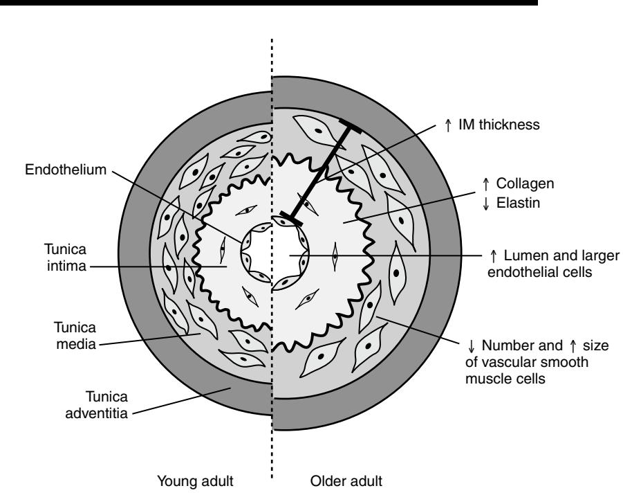
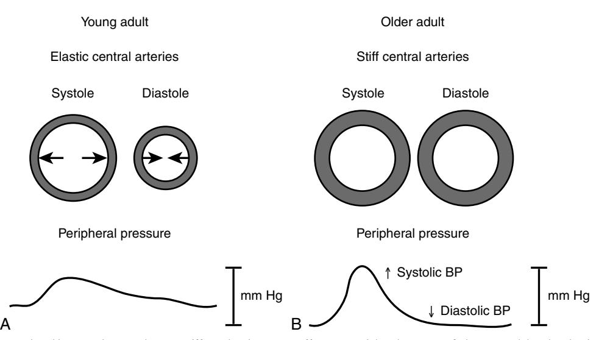

# Effects of Aging on the Cardiovascular System

Susan E. Howlett

Advanced age is a major risk factor for the development of cardiovascular disease. Why age increases the risk of cardiovascular disease is debatable. The increased risk might arise simply because there is more time to be exposed to risk factors such as hypertension, smoking, and dyslipidemia. In other words, the aging process itself has little impact on the cardiovascular system. However, an emerging view is that the accumulation of cellular and subcellular deficits in the aging heart and blood vessels renders the cardiovascular system susceptible to the effects of cardiovascular diseases. Although increased exposure to risk factors likely contributes to the development of cardiovascular disease in aging, there is considerable evidence that the structure and function of the human heart and vasculature change importantly as a function of the normal aging process. These changes occur in the absence of risk factors other than age, and in the absence of overt clinical signs of cardiovascular disease.

## **AGING-ASSOCIATED CHANGES IN VASCULAR STRUCTURE**

Studies in blood vessels from apparently healthy humans have shown that the vasculature changes with age. The large elastic arteries dilate, something that is evident to the naked eye, and that is well seen in arterial radiographic studies. These readily visible changes arise from microscopic changes in the wall structure of the centrally located, large elastic arteries.1,2 The arterial wall is composed of three different layers, which are known as tunics. The outermost layer, or tunica adventitia, is composed of collagen fibers and elastic tissue. The middle layer, known as the tunica media, is a relatively thick layer composed of connective tissue, smooth muscle cells, and elastic tissue. The contractile properties of the arterial wall are determined primarily by variations in the composition of the media. The innermost layer of the arterial wall, or tunica intima, consists of a connective tissue layer and an inner layer of endothelial cells. Endothelial cells are squamous epithelial cells that play an important role in regulation of normal vascular function, and endothelial dysfunction contributes to vascular disease.3 Age-associated changes in these different layers have a profound effect on the structure and function of the vasculature in older adults.

The process by which the structure of the arterial wall is modified by the aging process is known as remodeling. Structural changes due to remodeling are apparent even in early adulthood and increase with age.2 Aging-related arterial remodeling is thought to provide an ideal setting in which vascular diseases can thrive. Indeed, structural changes that occur in the arteries of normotensive aging humans are observed in hypertensive patients at much younger ages.2

One of the most prominent age-related changes in the structure of the vasculature in humans is dilation of large elastic arteries, which leads to an increase in lumen size.4 In addition, the walls of large elastic arteries thicken with age. Studies of carotid wall intima plus media (IM) thickness in adult human arteries have shown that IM thickness increases between twofold and threefold by 90 years of age.1 Increased IM thickness is an important risk factor for atherosclerosis independent of age.2 Thickening of the arterial wall in aging is due mainly to an increase in the thickness of the intima.1 Whether thickening of the media occurs in aging is controversial. However, studies have shown that the number of vascular smooth muscle cells in the media declines with age, while the remaining cells increase in size.5 Whether these hypertrophied smooth muscle cells are fully functional or whether this is one way in which aging is deleterious to vascular function is not yet clear. The major structural changes in the vasculature with age are summarized in Figure 14-1.

Age-associated thickening of the intima is due, in part, to changes in connective tissues in aging arteries. The collagen content of the intima and collagen cross-linking increase markedly with age in human arteries.1,3,6 However, the elastin content of the intima declines, and elastin fraying and fragmentation have been reported.1,6 It has been proposed that repeated cycles of distention followed by elastic recoil may promote the loss of elastin and the deposition of collagen in aging arteries.1 These changes in collagen and elastin content are believed to have important effects on the distensibility or stiffness of aging arteries, as discussed in more detail in the "Arterial Stiffness in Aging Arteries" section.

In addition to alterations in intimal connective tissues in aging, studies in human arteries have shown that the aging process modifies the structure of the endothelial cells themselves. Endothelial cells increase in size with age or hypertrophy. In addition, endothelial cell shape becomes irregular.7 The permeability of endothelial cells increases with age and vascular smooth muscle cells may infiltrate the subendothelial space in aging arteries.1,7 There also is considerable evidence that many of the substances released by the endothelium are altered in aging arteries.8 The impact of these changes on vascular function is discussed in more detail in the next section.

# **ENDOTHELIAL FUNCTION IN AGING**

Once regarded as an almost inert lining of the blood vessels, the vascular endothelium is now recognized to be metabolically active tissue involved in the many changes needed to maintain and regulate blood flow. The structure and function of the endothelium changes notably with age.3,8,9 In younger adults, the vascular endothelium synthesizes and releases a variety of regulatory substances in response to both chemical and mechanical stimuli. For example, endothelial cells release substances, such as nitric oxide, prostacyclin, endothelins, interleukins, endothelial growth factors, adhesion molecules, plasminogen inhibitors, and von Willebrand factor.10 These substances are involved in the regulation of vascular tone, angiogenesis, thrombosis, thrombolysis, and many other functions. There is evidence that the aging

Figure 14-1. Remodeling of the central elastic arteries with age. The layers of the arterial wall are labeled as indicated. There are marked changes in central elastic arteries as a consequence of the aging process. The diameter of the lumen increases with age. Intima plus media (IM) thickness also increases, primarily as a consequence of an increase in the thickness of the tunica intima. An increase in collagen deposition and a decrease in elastin are responsible for intimal remodeling in aging arteries. The number of vascular smooth muscle cells in the tunica media decreases, whereas the remaining cells hypertrophy. Endothelial cell hypertrophy also occurs in aging arteries.

process may disrupt many of these normal functions of the vascular endothelium.

Endothelial dysfunction is most often measured as a disruption in endothelium-dependent relaxation. Endotheliumdependent relaxation is mediated by nitric oxide, which is released from the endothelium by mechanical stimuli, such as increased blood flow (shear stress), and by chemical stimuli (i.e., acetylcholine, serotonin, bradykinin, or thrombin).10 When nitric oxide is released from the endothelium, it causes vascular smooth muscle relaxation by increasing intracellular levels of cGMP. The increased cGMP prevents the interaction of the contractile filaments actin and myosin.11 Thus blood vessel relaxation is impaired with age. The age-related increase in vascular stiffness is, in part, related to the reduced ability of the vascular endothelium to produce nitric oxide as people age.12 The decrease in nitric oxide release with age appears to be mediated by less effective acetylcholine activity.13

The mechanism by which nitric oxide activity is reduced in aging remains controversial. Nitric oxide is synthesized in endothelial cells by a constitutive enzyme called endothelial nitric oxide synthase (eNOS or NOS III).14 There is some evidence that the levels of eNOS are reduced in aging, which could account for the decrease in nitric oxide activity in aging vasculature.15 However, other studies suggest that factors such as the production of oxygen free radicals in aging endothelial cells may impair nitric oxide production in aging.13 Further studies will be needed to fully understand the mechanism or mechanisms responsible for endothelial dysfunction in aging vasculature.

There is good evidence that endothelial dysfunction is an important cause of cardiovascular disease, independent of age.3,8,9 Therefore age-related endothelial dysfunction is likely to make a major contribution to the increased risk of vascular disease in older adults.

#### **ARTERIAL STIFFNESS IN AGING ARTERIES**

Aging-related remodeling of the large, central elastic arteries has a major impact on the function of the cardiovascular system. One of the best-characterized functional changes in aging arteries is a decrease in the compliance or distensibility of aging arteries.2 This resistance of aging arteries to deflection by blood flow is known as an increase in arterial stiffness.16 This increase in arterial stiffness impairs the ability of the aorta, and its major branches, to expand and contract with changes in blood pressure. This lack of deflection of the blood flow increases the velocity at which the pulse wave travels within large arteries in older adults.16 An increase in pulse wave velocity is related to hypertension, but pulse wave velocity can be measured separately from blood pressure. An increase in pulse wave velocity in aging is an important risk factor for future adverse cardiovascular events.17

The structural changes in the arterial wall described above are implicated in the increase in arterial stiffness observed in central elastic arteries in the aging heart. The increased collagen content and increased collagen cross-linking that occur in aging arteries are believed to increase arterial stiffness in aging.1,3 Other factors such as reduced elastin content, elastin fragmentation, and increased elastase activity also are thought to increase stiffness in aging arteries.3 Changes in the endothelial regulation of vascular smooth muscle tone and changes in other aspects of the arterial wall and vascular function also may contribute to the age-associated increase in arterial stiffness.1,3

Figure 14-2. The age-associated increase in central artery stiffness has important effects on peripheral pressure. A, In young adults, the elastic central arteries expand with each cardiac contraction, so that a part of the stroke volume is transmitted peripherally in systole and the remainder is transmitted in diastole. B, In older adults, stiff central arteries do not expand with each contraction, so stroke volume is transmitted in systole. This leads to an increase in systolic blood pressure and a decrease in diastolic blood pressure in older adults. *(Modified from Izzo JL Jr: Arterial stiffness and the systolic hypertension syndrome. Curr Opin Cardiol 2004;19: 341–352.)*

Arterial stiffness is thought to be responsible for some of the changes in blood pressure that are reported in older adults.18 In younger adults, recoil in the elastic central arteries transmits a portion of each stroke volume in systole and a portion of each stroke volume in diastole, as illustrated in Figure 14-2, *A*. However, in aging arteries, the increase in stiffness of large arterial walls is thought to contribute to the increased systolic arterial pressure and the decreased diastolic pressure that are characteristically observed in aging.18 In this way, stiff central arteries can lead to an increase in pulse pressure in aging.18 These changes occur because increased stiffness abolishes elastic recoil in central elastic arteries. This means that blood flow is transmitted during systole, which leads to a high systolic pressure.18 As blood flow is transmitted in systole, the elastic recoil does not dissipate in diastole and diastolic pressure declines with age, as shown diagrammatically in Figure 14-2, *B*. This increase in systolic pressure with no change or a decrease in diastolic pressure leads to isolated systolic hypertension, which is the most common form of hypertension in older adults.19 Studies have shown that isolated systolic hypertension increases the risk of cardiovascular disease.20 Therefore aging-related changes in stiffness of large elastic arteries can explain many of the changes in blood pressure observed in aging and may contribute to the increased risk of cardiovascular disease in older adults. In addition, this increase in central artery stiffness is thought to play a role in some of the age-associated changes in the heart, both by increasing the work of the heart and decreasing coronary artery flow, as discussed in the next section.

Age-related changes in blood vessels may vary between different vascular beds. The structural changes that lead to increased arterial stiffness are much more pronounced in large, elastic arteries, such as the carotid artery, than in smaller, muscular arteries such as the brachial artery.1,4 However, there are age-related changes in vascular reactivity in vessels other than the central elastic arteries. For

#### **Table 14-1. Age-Related Changes in the Vasculature**

| Age-Associated Changes in Vasculature              | Clinical Consequences                             |
|-------------------------------------------------------|---------------------------------------------------|
| ↑ Intimal thickness ↑ Collagen, reduced elastin, ↑ | Promotes atherosclerosis Systolic hypertension |
| vascular stiffness Endothelial cell dysfunction    | ↑ Risk of vascular disease                        |

example, the responsiveness of arterioles to drugs that stimulate α1-adrenergic receptors declines with aging.21 Vascular responsiveness to either endothelin or angiotensin receptor agonists also may decline with age, although this has not been extensively investigated and there is no evidence for such changes in humans.21 Few studies have investigated the impact of age on vascular responsiveness in veins, but most studies report that age has little impact on the responsiveness of veins to a variety of pharmacologic agents.21 Investigation of age-dependent alterations in vascular reactivity is an important area of inquiry; such changes would affect the responsiveness of the aging vasculature to drugs that target blood vessels in humans. Table 14-1 summarizes the major age-associated changes in the vasculature, along with the clinical consequences of these alterations.

#### **EFFECT OF THE AGING PROCESS ON THE STRUCTURE OF THE HEART**

The aging process has obvious effects on the structure of the heart at both the macroscopic and microscopic levels. At the macroscopic level, there is a noted increase in the deposition of fat on the outer, epicardial surface of the aging heart.22,23 Calcium deposition in specific regions of the heart, known as calcification, is commonly observed in the aging heart.23 There also are changes in the gross morphologic structure of individual heart chambers with age. There is an ageassociated increase in the size of the atria. Furthermore, the atria dilate and their volume increases with age.24 Although some studies have reported that the mass of the left ventricle increases with age, others have concluded that ventricular mass does not increase with age if subjects with underlying heart disease are excluded.25 However, there is general agreement that left ventricular wall thickness increases progressively with age.7,24

Age-related changes in cardiac structure are apparent not just macroscopically, but at the level of the individual heart cell. Briefly, there are fewer more active heart cells and more fibroblasts. Beginning at age 60, there is a noticeable decline in the number of pacemaker cells in the sinoatrial node, which is the normal pacemaker of the heart.26 The total number of muscle cells in the heart, which are known as cardiac myocytes, also declines with age and this decrease is greater in males than in females.22 Indeed, the population of cardiac myocytes in the heart declines by approximately 35% between the ages of 30 and 70 years old.27 This cell loss is thought to occur through both apoptotic and necrotic cell death.28 The loss of cardiac myocytes in the aging heart leads to an increase in size (hypertrophy) of the remaining myocytes, something that is more pronounced in cells from men than in cells from women.22 This cellular hypertrophy may compensate, at least in part, for the loss of contractile cells in the aging heart. However, unlike cellular cardiac hypertrophy that occurs as a result of exercise, hypertrophy of cells in the aging heart results from the age-related loss of myocytes, which may increase the mechanical burden on the remaining cells.28

In addition to the cardiac myocytes, the heart contains large numbers of fibroblasts, which are the cells that produce connective tissues such as collagen and elastin. Collagen is a fibrous protein that holds heart cells together, whereas elastin is a connective tissue protein that is responsible for the elasticity of body tissues. As the number of myocytes progressively declines with age, there is a relative increase in the number of fibroblasts.23 The amount of collagen increases with age, and there is thought to be an increase in collagen cross-linking between adjacent fibers with aging.7,24,29 Increased collagen in the aging heart leads to interstitial fibrosis.30 There also are structural changes in elastin in the aging heart and these changes may reduce elastic recoil in the aging heart.23 Together with changes in the myocytes with aging, these structural changes in connective tissues increase myocardial stiffness, decrease ventricular compliance, and thereby impair passive left ventricular filling.30 The impact of these changes on myocardial function is considered in more detail next.

#### **MYOCARDIAL FUNCTION IN THE AGING HEART AT REST**

There are significant age-associated abnormalities in cardiac function in older adults, especially diastolic function and especially with exercise. These changes are most apparent during exercise, although some changes are evident even at rest. When individuals are reclining at rest, the heart rate is similar in younger and older subjects. However, when older individuals move from the supine to the seated position, the heart rate increases less in older adults than in younger adults.24 This decreased ability to augment heart rate in response to positional change may be linked to the age-related impairment in responsiveness to the sympathetic nervous system discussed in the "Response of the Aging Heart to Exercise" section. In contrast, left ventricular systolic function, which is a measure of the ability of the heart to contract, is well preserved at rest in older adults.7,24,25 Other measures of cardiac contractile function at rest also are unchanged with age. The volume of blood ejected from the ventricle per beat (stroke volume) is generally comparable or slightly elevated in older adults when compared with their younger counterparts.7,24 Similarly, the left ventricular ejection fraction, which is the ratio of the stroke volume to the volume of blood left in the ventricle at the end of diastole, is unchanged in aging.7,24 Thus systolic function is relatively well preserved in healthy older adults at rest.

Unlike systolic function, diastolic function is profoundly altered in the hearts of older adults at rest. The rate of left ventricular filling in early diastole has been shown to decrease by up to 50% between 20 and 80 years of age.24 Several mechanisms have been implicated in the reduction of left ventricular filling rate in the aging heart. It has been proposed that age-associated structural changes in the left ventricle impair early diastolic filling. The aging heart is characterized by increased collagen deposition and structural changes in elastin, both of which combine to increase left ventricular stiffness in the aging heart.23 This increased ventricular stiffness reduces the compliance of the ventricle and impairs passive filling of the left ventricle.30 An additional mechanism that has been implicated in the decrease in ventricular filling rate in aging is changes at the level of the cardiac myocytes. Uptake of intracellular calcium into internal stores is disrupted in myocytes from the aging heart.24,30 As a result, residual calcium from the previous systole may cause persistent activation of contractile filaments and delay relaxation of cardiac myocytes in the aging heart.30 It also has been suggested that diastolic dysfunction reflects, at least in part, an adaptation to the age-related changes in the vasculature. Increased vascular stiffness leads to increased mechanical load and subsequent prolongation of contraction time.30 The age-associated increase in stiffness of the aorta increases the load the heart must work against (afterload), which is thought to promote the increase in left ventricular wall thickness observed in the aging heart.25 These adaptive changes may serve to preserve systolic function at the expense of diastolic function in the aging heart.

In the hearts of young adults, left ventricular filling occurs early and very rapidly, due primarily to ventricular relaxation. Only a small amount of filling occurs as a result of atrial contraction later in diastole in the young adult heart.24 In contrast, early left ventricular filling is disrupted in the aging heart. This increased diastolic filling pressure results in left atrial dilation and atrial hypertrophy in the aging heart.29 The more forceful atrial contraction observed in the aging heart promotes late diastolic filling and compensates for the reduced filling in early diastole.24 Because the atria make an important contribution to ventricular filling in older adults, loss of this atrial contraction due to conditions such as atrial fibrillation can lead to a marked reduction in diastolic volume and can predispose the aging heart to diastolic heart failure.30 Atrial dilatation also can promote the development of atrial fibrillation and other arrhythmias in the aging heart.24 Despite this evidence for diastolic dysfunction in the aging heart, left ventricular end diastolic pressure does not decline with age in older healthy adults at rest. Indeed, aging is actually associated with a small increase in left ventricular end diastolic pressure, in particular in older males.24 Thus although the filling pattern in diastole is altered in aging, this does not lead to notable changes in end diastolic pressure in older hearts at rest.

#### **RESPONSE OF THE AGING HEART TO EXERCISE**

Although many aspects of cardiovascular performance are well preserved at rest in older adults, aging has important effects on cardiovascular performance during exercise. The decline in aerobic capacity with age in individuals with no evidence of cardiovascular disease is attributable in part to peripheral factors, such as increased body fat, reduced muscle mass, and a decline in O2 extraction with age.29,31,32 However, there is strong evidence that age-associated changes in the cardiovascular system also contribute to the decrease in exercise capacity in older individuals. Studies have shown that the VO2max, which is the maximum amount of oxygen that a person can use during exercise, declines progressively with age starting in early adulthood.31,32 Age-related changes in maximum heart rate, cardiac output, and stroke volume described below compromise delivery of blood to the muscles during exercise and contribute to this decline in VO2max in aging.

The maximum heart rate attained during exercise decreases gradually with age in humans, a fact well known by widely distributed posters commonly seen in exercise facilities.33 Interestingly, this decrease is not affected by physical conditioning because it is present in both sedentary and fit individuals.25 Several mechanisms have been implicated in the reduction in maximum heart rate during exercise in aging. One mechanism involves a decrease in the sensitivity of the aging myocardium to sympathetic stimulation. Normally, the sympathetic nervous system becomes activated during exercise, and releases catecholamines (noradrenaline and adrenaline) to act on β-adrenergic receptors in the heart. This β-adrenergic stimulation leads to an increase in heart rate and augments the force of contraction of the heart. However, it is well established that the responsiveness of the heart to β-adrenergic stimulation declines with age.24 This is thought to be due to high circulating levels of noradrenaline that are present in older adults.34 These high levels of catecholamines in older adults arise from a decrease in plasma clearance of noradrenaline and an increase in the spillover of catecholamines from various organ systems into the circulation in older adults.34 Chronic exposure to high levels of catecholamines may desensitize elements of the β-adrenergic receptor signaling cascade in the aging heart and limit the rise in heart rate during exercise.24 An additional mechanism that is thought to limit the maximum heart rate in exercise is the decrease in the total population of sinoatrial nodal pacemaker cells in the aging heart.31 This decrease in the number of pacemaker cells may impair the response of the heart to sympathetic stimulation during exercise.

The decrease in maximal heart rate during exercise has a major impact on the response of the aging cardiovascular system to exercise. Both heart rate and stroke volume are important determinants of cardiac output. Therefore a decrease in maximum heart rate during exercise would be expected to have an impact on cardiac output during exercise in older adults. Although this has not been extensively investigated, there is evidence that cardiac output during exercise is lower in older adults compared with their younger counterparts.7,25 This decrease in cardiac output during exercise is not attributable to age-associated alterations in stroke volume.7,29 However, the reduced responsiveness to β-adrenergic receptor stimulation in the heart may limit the increase in myocardial contractility in response to exercise in older adults.7,25,29 These changes in cardiovascular function in aging are thought to be mitigated by an increase in left ventricular end-diastolic volume during exercise in older adults.33 This increases the amount of blood in the ventricle at the end of diastole, and increases the stretch on the heart. It is well established that an increase in the amount of blood in the ventricle at the end of diastole results in an increase in the strength of contraction of the heart, a property known as the Frank Starling mechanism. Thus an increase in the reliance on the Frank Starling mechanism may at least partially compensate for the decrease in heart rate and contractility during exercise in aging.7,25,33

Although a decrease in cardiovascular performance and an increased susceptibility to cardiovascular diseases are inevitable consequences of the aging process,35 there is evidence that regular exercise has numerous beneficial effects on the aging cardiovascular system. Endurance exercise blunts the decline in VO2max that occurs as a consequence of the aging process.31 Additionally, the age-associated decline in cardiac output can be partially overcome by regular aerobic training.31 However, endurance training does not modify the age-related decline in maximal heart rate during exercise.25,31 This might occur because exercise increases the levels of circulating catecholamines, which have been implicated in the decline in maximal heart rate in older adults as discussed earlier.31 Regular endurance exercise also attenuates the increased arterial stiffness that is observed in central elastic arteries from sedentary older adults.36 Finally, habitual aerobic exercise can protect the aging heart from detrimental

### KEY POINTS

#### Effects of Aging on the Cardiovascular

System

- The structure and function of the human heart and vasculature change as a function of the normal aging process.
- The age-associated increase in stiffness of central elastic arteries promotes systolic hypertension in older adults.
- Diastolic dysfunction in the aging heart arises from impaired left ventricular filling, increased afterload, and prolonged availability of intracellular calcium.
- Decreased responsiveness to β-adrenergic receptor stimulation limits the increase in heart rate and contractility in response to exercise in older adults.
- Despite limits on the ability of the aging cardiovascular system to respond to exercise, regular exercise attenuates the adverse effects of aging on the heart and vasculature and protects against the development of cardiovascular disease in older adults.

|  |  | Table 14-2. Age-Related Changes in the Heart |  |  |  |
|--|--|----------------------------------------------|--|--|--|
|--|--|----------------------------------------------|--|--|--|

| Age-Associated Changes in the Heart                                                                                                                                         | Clinical Consequences                                                                                                           |
|--------------------------------------------------------------------------------------------------------------------------------------------------------------------------------|---------------------------------------------------------------------------------------------------------------------------------|
| ↑ Collagen, changes in elastin, ↑ left ventricular wall thickness Prolonged availability of intracel lular calcium                                                    | Impairs passive left ventricle filling Diastolic dysfunction                                                              |
| Left atrial hypertrophy↑ Susceptibility to atrial arrhythmias ↓ Number of pacemaker cells in sinoatrial node ↓ Sensitivity to β-adrenergic receptor stimulation | ↓ Ability to elevate heart rate in response to exercise Impaired ability to ↑ heart rate and contractility in exercise |

effects of cardiovascular diseases such as myocardial ischemia.37 Therefore there is good evidence that exercise can mitigate at least some of the detrimental effects of age on the cardiovascular system. The major age-related changes in the heart and the clinical consequences of these changes are summarized in Table 14-2.

# **SUMMARY**

There are prominent changes in the structure and function of the vasculature and the myocardium in older adults when compared to younger adults. These changes are apparent even in the absence of risk factors other than age and in the absence of overt cardiovascular disease. However, these age-related alterations in the vasculature and the heart may render the cardiovascular system more susceptible to the detrimental effects of cardiovascular disease.

For a complete list of references, please visit online only at www.expertconsult.com