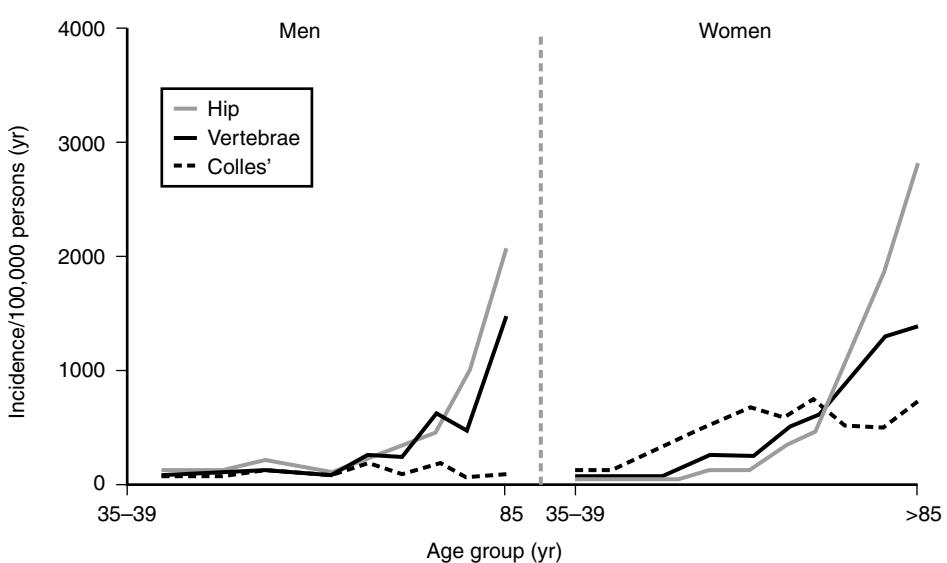
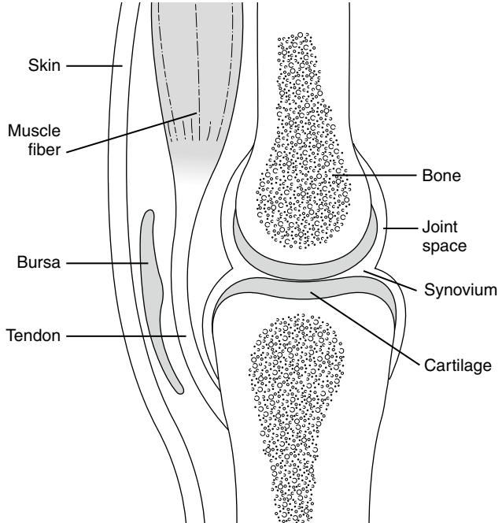
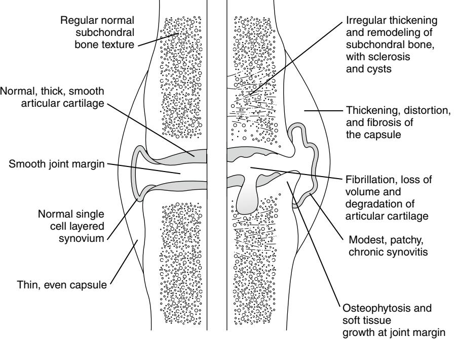
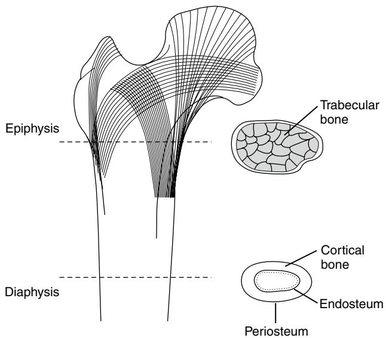
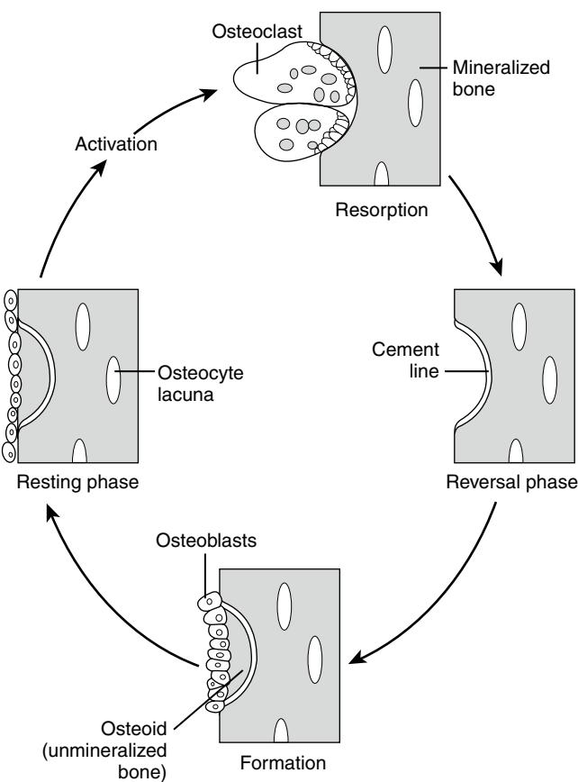
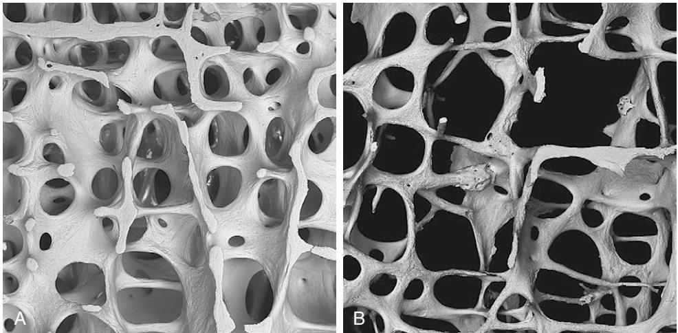

# Bone and Joint Aging

Celia L. Gregson

The musculoskeletal system serves three primary functions: (1) it enables an efficient means of limb movement; (2) it acts as an endoskeleton, providing overall mechanical support and protection to soft tissues; and (3) it serves as a reservoir of mineral for calcium homeostasis. In the elderly population, the first two of these functions frequently become compromised; musculoskeletal problems are the major cause of pain and physical disability in people over the age of 65 years1 and fracture incidence rises steeply with age2 (Fig. 19-1). Several factors contribute to the age-related decline in musculoskeletal function:

- 1. Aging effects on components of the musculoskeletal system (i.e., articular cartilage, the skeleton, and soft tissues), contribute toward the increasing incidence of osteoporosis and osteoarthritis (OA), the reduced range of joint movement, and the stiffness and difficulty in initiating movement.
- 2. There is the age-related rise in the prevalence of common musculoskeletal disorders that begin in young adulthood or in middle age, and cause increasing pain and disability without shortening life span (e.g., seronegative spondylarthritides, musculoskeletal trauma).
- 3. There is a high incidence of certain musculoskeletal disorders in the elderly, such as polymyalgia rheumatica, Paget's disease of bone and crystal-related arthropathies.

A number of interrelated hypotheses have been advanced to explain the high prevalence of bone, muscle, and jointproblems in older humans3–6:

- 1. The long life span results in increasing accumulation of mechanical damage to the musculoskeletal system.
- 2. There is a lack of genetic investment in the repair of age-related tissue damage that develops in the postreproductive phase of life.
- 3. The musculoskeletal system in humans has not adapted fully to the upright posture and prehensile grip because of lack of evolutionary pressure to do so, with the result that many of our bones and joints are inappropriately shaped and "underdesigned" to be able to cope with the stresses applied.
- 4. By virtue of their sedentary lifestyle, modern humans tend to be exposed to less mechanical stress than their ancestors. Because musculoskeletal strength is governed by the mechanical inputs to which that individual is exposed, this may result in a weaker musculoskeletal system, which is not well adapted for episodes of sudden major stress.

Several different mechanisms are involved in musculoskeletal tissue aging,7 including:

• Reduced synthetic capacity of differentiated cells such as osteoblasts and chondrocytes, with a consequent loss of ability to maintain matrix integrity

- A decline in the mesenchymal stem cell populations
- Posttranslational modification of structural proteins, such as collagen and elastin
- The accumulation of degraded molecules, such as proteoglycan fragments, in musculoskeletal tissue matrices
- Decreased circulating and local levels of trophic hormones, growth factors, and cytokines, such as insulinlike growth factor-1 (IGF-1), involved in maintaining tissue integrity; or an altered ability of the cells to respond to them
- A decreased capacity for wound healing and tissue repair, which may be the result of some or all of the mechanisms described above
- Alterations in the loading patterns of tissue, or the tissue's response to loading

The major tissues that have received the most attention and which are pivotal to the integrity of the system are articular cartilage, the skeleton, and soft tissues. Age-related changes in these structures are now described in more detail.

# **ARTICULAR CARTILAGE**

The structure of a mammalian synovial joint is summarized in Figure 19-2. Much of its function derives from the properties of articular cartilage, which cushions the subchondral bone and provides a low-friction surface necessary for free movement. Articular cartilage contains very few cells, is aneural and avascular, and yet its integrity is maintained throughout a lifetime of biomechanical stress. With increasing age, the cartilage surface often starts to break down, leading to OA. This is associated with changes in other tissues of the joint (Fig. 19-3). However, OA is not an inevitable consequence of aging; instead, aging adds to the risk of OA. With age, articular cartilage thins and changes color from a glistening white to a dull yellow. In addition, the mechanical features of the tissue change. There is a decrease in tensile stiffness, fatigue resistance, and strength, but no significant change in the compressive properties. These changes are partly caused by the decrease in water content that accompanies aging. The morphology and function of the cells (chondrocytes) and nature of the two main matrix components, aggrecan (aggregating proteoglycans) and type II collagen, also change with age. The density of cells in the tissue changes little, but their morphology alters with an increase in intracytoplasmic filaments and they change their secretion of matrix components, producing more variable proteoglycans. Aging is also associated with alterations in the response by chondrocytes to anabolic and catabolic stimuli, such as IGF-1 and interleukin-1. For example, immature cartilage degrades more readily when stimulated with interleukin-1. Generally with age, repeated cell divisions lead to progressive telomere shortening and replicative senescence. However, connective tissue cells and their stem cells may be less susceptible given their relatively slow turnover rates.8 Stressinduced premature senescence (SIPS) has been proposed as

Figure 19-1. Age-specific incidence rates for hip, vertebral, and distal forearm (Colles') fracture in Rochester, Minn., men and women. *(Adapted from Cooper C, Melton LJ. Epidemiology of osteoporosis. Trends Endocrinol Metab 1992;3:224–9).*

Figure 19-2. The synovial joint. The histologic appearances of the main tissues are highlighted. *(Courtesy Drs J. H. Klippel and P. A. Dieppe.)*

an alternative explanation to replicative senescence; insults such as mechanical loading, interleukin-1, and caveolin-1 lead to increasing expression of senescence biomarkers.9,10

Depletion of cartilage proteoglycan is one of the earliest signs of articular cartilage loss in OA. Proteoglycans consist of a protein core and two major glycosaminoglycan (GAG) side chains: chondroitin sulfate (CS) and keratan sulfate (KS). The CS is the predominant GAG chain in human articular cartilage. It is made up of oligosaccharide (sugar) chains containing a basic disaccharide repeat of two sugar molecules (*N*-acetylgalactosamine and glucuronic acid). These sugar molecules carry a sulfate group on either the sixth (C6) or fourth (C4) carbon atom of the sugar ring. Such sulfation patterns are often called C6 and C4 sulfation and show marked changes with aging and in OA.11,12 More than 90% of the CS in adult human articular cartilage is C6, which is thought to interact with collagen and other extracellular matrix macromolecules and help maintain the integrity of the cartilage.11 C4 accounts for less than 10% of the adult cartilage and is thought to be a characteristic of immature cartilage. In OA cartilage, there is an increase in C4 and decrease in C6. Changes in the C6:C4 ratio of the articular cartilage with aging and in OA may make the cartilage more susceptible to cytokine-mediated damage.12

The main proteoglycan, aggrecan, binds with hyaluronan to form massive, hydrophilic aggregates that expand the collagen framework of the tissue to provide it with its compressive and tensile strength. With age there is reduced proteoglycan aggregation, with smaller proteoglycans being synthesized with an increase in KS and reduced CS content, and increased aggrecanase production leading to aggrecan degradation. Synthesis of KS requires less oxygen than CS, thus the KS-CS balance has recently prompted research interest into changing oxygen tension patterns within connective tissues as a result of ischemia.13,14

Collagen also changes, with some increase in fiber diameter and an increase in cross-linking. This fiber cross-linking may be enzymic or nonenzymic, involving lysyl hydroxylase or not, respectively. In young growing skeletons, collagen turnover is high and enzymic divalent and trivalent crosslinks stabilize the collagen fibers, with almost complete hydroxylation of telopeptide lysines. With age lysyl hydroxylase activity wanes, causing incomplete hydroxylation of telopeptide lysines, that is, until maturation is complete, after which enzymatic cross-linking remains constant. However, collagen fiber cross-linking does increase with age because of nonenzymatic reactions between glucose and lysine, forming glucosyl lysine and related molecules. Subsequent oxidative and nonoxidative reactions produce stable end products

Figure 19-3. Normal versus osteoarthritic synovial joint. *(Courtesy Drs J. H. Klippel and P. A. Dieppe.)*

known as advanced glycation end products (AGEs), some of which can act as collagen cross-links producing fibers too stiff for optimal function.15,16 Hyperglycemia and oxidative stress increase AGE production and dietary AGE intake may also be important.17,18 Elastin, which conveys extensibility and elastic recoil in some ligaments, is also stabilized by cross-linking, and AGE production can also prompt agerelated stiffening.19

Changes in calcified cartilage, the layer separating articular cartilage from subchondral bone, are felt to be important in the pathogenesis of OA; however, the underlying mechanisms remain unclear.20 Estrogen receptors have been identified in articular chondrocytes with estrogens influencing cellular homeostasis.21 The chondroprotective properties of estrogen are lost following menopause. A history of hormone replacement therapy has been associated with a reduced prevalence of OA.22 In men, testosterone levels have been positively associated with cartilage volume.23

### **Cell death in cartilage**

There has been much research interest into apoptosis, a normal physiologic process involved in the removal of potential carcinogenic and damaged cells. The process is also involved in development; for example, during endochondral ossification of the hyaline cartilage, cells (chondrocytes) die by apoptosis.24 An age-related decrease in articular cartilage cellularity has been associated with cartilage fibrillation, thinning, and an increased prevalence of OA in elderly people.25,26 Now chondrocyte apoptosis appears to be a crucial event in cartilage aging and the pathogenesis of OA. Cartilage matrix degradation by apoptotic bodies, abnormal loading, changes in nitric oxide synthesis, altered cytokine regulation, impaired mitochondrial functioning, and downregulation of the *Bcl-2* gene have all been implicated in the control

Figure 19-4. The macroscopic organization of bone. *(Courtesy Drs J. H. Klippel and P. A. Dieppe.)*

of chondrocyte apoptosis in animals.27 How these all relate to human aging remains an area of interest.

#### **THE SKELETON**

Weight-bearing bones consist of an outer shell of cortical bone; an arrangement designed for maximum strength. In addition, certain sites, such as vertebrae and metaphyses, contain an inner meshwork of trabecular bone to act as an internal scaffold (Figure 19-4). Microscopically, the skeleton is made up of interconnecting fibrils of type I collagen, which provide tensile strength. Hydroxyapatite crystals, which are made up of calcium and phosphate, are deposited in holes within the collagen fibrils, giving bone its rigidity. Adult bone continuously undergoes self-renewal. This process, known as bone remodeling, occurs at discrete sites

Figure 19-5. The bone remodeling sequence. This commences with osteoclastic bone resorption, following which a cement line is laid down (reversal phase). Osteoblasts then fill up the resorption cavity with osteoid, which subsequently mineralizes—the bone surface finally being covered by lining cells and a thin layer of osteoid.

throughout the skeleton called bone remodeling units. Bone remodeling involves the coordinated activity of those cells responsible for bone formation and resorption (i.e., osteoblasts and osteoclasts, respectively) in a continuous cycle aimed at replacing microdamage and at adapting bone density and shape to the patterns of forces it endures (Figure 19-5). Osteoclasts differentiate from hematopoietic precursors shared with macrophages, whereas osteoblasts, which produce osteoid and promote mineralization, arise from mesenchymal precursors that also give rise to fibroblasts, stromal cells, and adipocytes. Osteoblasts produce macrophage colony stimulating factor (M-CSF) and membrane-bound receptor activator of nuclear factor-kappa B ligand (RANKL), factors crucial for osteoclastogenesis.28 RANKL, by binding to the osteoclast's RANK receptor, stimulates osteoclast differentiation, averting cell death. This process is regulated by osteoblasts that produce osteoprotegerin, a decoy receptor.29 Multiple factors influence the RANK-RANKL interaction; PTH, vitamin D, cytokines, interleukins, prostaglandins estrogen, mechanical forces, transforming growth factor β" and thiazolidinedione PPARg ligands commonly used in the treatment of type 2 diabetes mellitus, to name but a few, and work is underway to better understand these processes.

#### **Structural changes in the skeleton**

Once middle age is reached, the total amount of calcium in the skeleton (i.e., bone mass) starts to decline—a process that is accelerated during the first few years following menopause in women.30 This is associated with changes in skeletal structure by which the skeleton becomes weaker and more prone to sustaining fractures. Where these alterations affect trabecular bone, individual trabeculae undergo thinning followed by perforation and ultimately removal, leading to disruption of the trabecular network (Fig. 19-6). The bony cortex also becomes considerably weaker during aging, through a combination of thinning as a result of expansion of the inner medullary cavity and an increase in size, number, and clustering of Haversian canals. Along with deterioration in skeletal architecture, the material strength of bone may also decline significantly with age; microfractures are thought to accumulate within bone tissue with increasing

Figure 19-6. Changes in trabecular structure associated with osteoporosis. Scanning electron micrographs of lumbar vertebrae (magnification × 20) obtained from: (A) a 31-year-old male; (B) an 89-year-old female. Note the loss of bone tissue associated with thinning and removal of trabecular plates. *(Kindly supplied by Professor A. Boyde, Department of Anatomy and Developmental Biology, University College, London.)*

age, representing the accumulation of fatigue damage.31 In addition, adverse biochemical changes may occur, such as a decline in cross-linking efficiency, required for stabilizing collagen fibrils.32

#### **Changes in skeletal metabolism**

Bone loss in the elderly population is largely a result of excess osteoclast activity,33 which causes both an expansion in the total number of remodeling sites and an increase in the amount of bone resorbed per individual site, resulting in a bone remodeling imbalance. The rise in osteoclast activity in older women partly reflects the decline in ovarian hormone production following menopause because estrogens exert an important restraining influence on bone resorption by limiting RANKL production and promoting osteoclast apoptosis while also exerting antiapoptotic effects on osteoblasts.34 The age-related decline in bone density had been felt to be due to falling estrogen levels in women and testosterone levels in men. However, more recently estrogens have emerged as the dominant sex steroid, regulating male bone loss later in life, and, in combination with testosterone, acquisition of peak bone mass early in life.35 Strong positive correlations between serum estradiol, particularly bioavailable estradiol, levels and bone mineral density (BMD) have been observed, whereas correlations between testosterone and BMD have been weak or lacking.36,37

In addition, osteoclast activity may be elevated in the elderly population as a consequence of vitamin D deficiency, which is widespread among elderly people.38 Dietary vitamin D insufficiency combined with reduced sunlight exposure and a reduced capacity to synthesize vitamin D in aging skin, lead to mild secondary hyperparathyroidism.39–41 These effects of vitamin D insufficiency on bone metabolism are aggravated by an age-related decline in efficiency of gastrointestinal calcium absorption and an age-related decline in efficiency of renal 1α hydroxylation of vitamin D. Low vitamin D levels influence mesenchymal stem cell differentiation toward greater adipogenesis at the expense of osteoblastogenesis.42 Despite subclinical evidence of osteomalacia, many of these patients present in the same way as osteoporosis, for example, with fractures of the femoral neck. Furthermore, an increased tendency toward bone marrow adipogenesis, to the detriment of osteoblast production, with consequent accumulation of bone marrow fat rather than trabecular bone, has been observed independent of estrogens.42,43 Furthermore the peroxisome proliferator-activated receptor (PPAR) induced in humans treated for diabetes mellitus with thiazolidines, has through its effects on adipogenesis been implicated in the development of osteoporosis.44 PPAR, together with the Wnt signaling pathway, are currently of interest as potential therapeutic targets for osteoporosis.

An age-related reduction in the bioavailability of other important regulatory factors such as IGF-1 have also been described. Aging leads to a gradual decline in circulating growth hormone (GH) and IGF-1, with consequent declines in bone density, lean body mass, and skin thickness; the socalled "somatopause."45 Reductions in these trophic factors encourage local expression of molecules (e.g., TNF-α and interleukins), which increase osteoclast and decrease osteoblast activity and downgrade the differentiation potential of bone marrow stem cells.28 Therapeutic GH has been shown to increase bone mineral density in GH-deficient osteoporotic patients.46 Immobilization is recognized to cause bone loss whereas physical activity can help attenuate rates of age-related bone loss. Reductions in physical activity often accompany aging, thereby reducing the quality and quantity of mechanical inputs to the skeleton, which are important in maintaining osteoblast activity. Use of wholebody vibration exercise has been shown to increase femoral neck BMD and balance.47 Cellular sensing of normal and abnormal mechanical loads and the consequent alterations in cell biology is known as mechanotransduction, a mechanism designed to maintain normal tissue homeostasis48 and poorly understood in elderly human tissue.

# **SOFT TISSUES**

Age-related changes occur in other bone- and joint-related tissues, largely as a result of reduced synthesis and posttranslational modification of collagen, which leads to reduced ligament elasticity. For example, the tensile strength of tendons and ligament-bone complexes declines with age and integrity of joint capsules may be lost. This may result in disorders such as dysfunction of the rotator cuff of the shoulder, which may be associated with communications between the shoulder joint and subacromial bursa. In addition, there is a gradual loss of connective tissue resistance to calcium crystal formation in the elderly population, leading to an increase in the incidence of crystal-related arthropathies. Functional impairment in soft tissues may also adversely affect biomechanics of the joint, which may be an important initiating factor in the development of OA. For example, age-related changes have been described in the metabolism and composition of the extracellular matrix in the meniscus,49 which may contribute to the development of knee OA.

Back and neck pain and stiffness are common complaints in the elderly population, which are likely to reflect agerelated changes in intervertebral discs. The latter consist of an outer fibrous ring called annlus fibrosus and an internal gelatinous (semifluid) structure called nucleus pulposus. As people get older, the diameter of the nucleus pulposus and the hydrostatic pressure within this region decreases, resulting in increased compressive stress within the annlus.50 Thus with age the intervertebral disc becomes more compressed, causing a decrease in the intervertebral space and therefore an overall decrease in height of the individual. The extracellular matrix of the disc contains a network of collagen fibers (both type I and type II) that are responsible for the tensile strength, and aggregating proteoglycans that help the disc to resist compressive forces. Age-related changes in the distribution and concentrations of these macromolecules can also significantly alter the mechanical properties of the disc. In many ways, extracellular matrix metabolism is rather similar to articular cartilage; for example, with age there is increased degradation and reduced synthesis of type II collagen, and the glycosaminoglycan and collagen contents are decreased.51

Sarcopenia is the slow and progressive age-related loss of skeletal muscle, resulting in reduced muscle power and function. The consequences of increased falls and hence increased fracture risk with associated loss of independence can be devastating. Sarcopenia is predominantly due to a decline in muscle fiber number, although atrophy of fibers, especially type II fibers, also occurs. Sarcopenia has been associated with declining levels of anabolic factors: estrogen and vitamin D levels in women, testosterone and physical performance in men, in addition to waning GH and IGF-1 levels. Furthermore, increased levels of catabolic cytokines have also been implicated—interleukin-6, particularly in older women, and TNF-α, particularly affecting muscle mass in men.52–54 Denervation resulting in motor unit reduction may also be important.

#### **CONSEQUENCES OF BONE AND JOINT AGING**

Musculoskeletal problems cause a huge burden of pain and physical disability in older people. The most important functional impairments include the marked loss of muscle strength, reduced range of movements of the spine and peripheral joints, and loss of joint proprioception contributing to problems of balance. In addition, spinal osteoporosis causes progressive kyphotic deformity and height loss, which in some individuals may be relatively asymptomatic. The key symptoms include pain and stiffness. Although pain thresholds may increase, there is also a very high prevalence of musculoskeletal pain. For example, some 25% of those individuals over the age of 55 years complain of current knee pain. Stiffness and difficulty in initiating movement are almost universal in those over the age of 70 years.

Changes in the bone and soft tissues make the whole system more susceptible to trauma. Periarticular pain syndromes and spinal disorders related to minor trauma are common, but by far the most important consequence is the high incidence of fractures. These partly reflect the age-related increase in skeletal fragility that characterizes osteoporosis, and partly the age-related increase in falls, which is multifactorial (see Chapter \*\*\*). Osteoporosis predisposes to an increased risk of fracture at all skeletal sites other than flat bones such as the skull, although fractures of the vertebrae, distal radius, and hip are by far the most common (see Fig. 19-1). The relative increase in hip fractures in the very elderly may also be related to changes in the pattern of falling since older subjects, with slower motor function, may be less likely to fall onto an outstretched arm.

The extent of the disability related to musculoskeletal changes is well described in community-based epidemiologic studies. Problems with reaching and with locomotion are particularly frequent, the latter contributing extensively to the isolation of elderly people. In addition, it is well recognized that in those who sustain a hip fracture the majority fail to regain their previous level of functioning, and there is also an appreciable excess mortality; 10% dying in hospital within the first month, with overall around a third dying within a year.55

## **THE FUTURE**

An aging population, with a rising age-specific incidence of fracture, has serious implications for our projected fracture rates. Fragility fractures are expensive, both in terms of direct medical costs, but also through the costs of their social sequelae. Furthermore, globally the prevalence of obesity is rising at an alarming rate. The cumulative physical consequences of a life of repetitive excessive skeletal loading is likely to manifest in substantially greater morbidity in the elderly in the years to come. Although present treatments for osteoporosis mostly focus on suppressing bone resorption, future treatments are likely to be anabolic, following on from the identification and understanding of the genes and the gene products responsible for the regulation of bone mass.

#### KEY POINTS Bone and Joint Aging

- Musculoskeletal problems cause a huge burden in elderly people through a combination of pain and functional impairment.
- These problems result partly from the increased incidence of common musculoskeletal disorders in the elderly, such as rheumatoid arthritis and polymyalgia rheumatica.
- The high burden of musculoskeletal disease in elderly people also reflects the impact of the aging process on tissues which make up the musculoskeletal system, such as articular cartilage and bone.
- There have been considerable advances in recent years in the understanding of the cellular and molecular mechanisms that underlie these age-related changes.

For a complete list of references, please visit online only at www.expertconsult.com