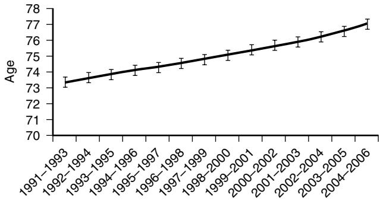
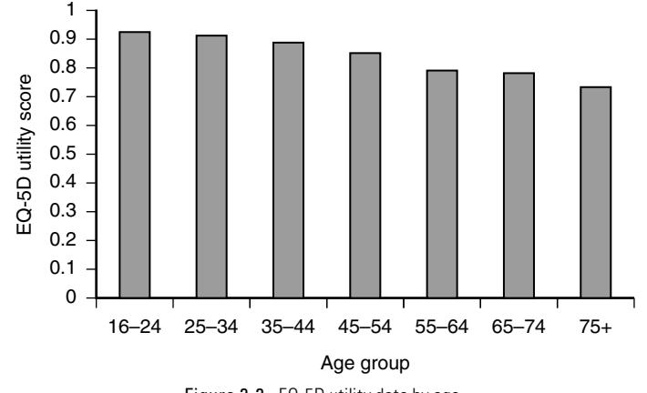
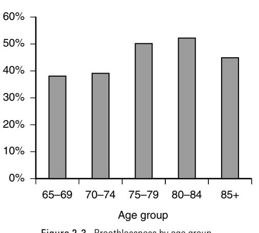
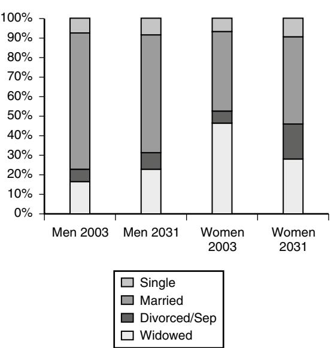
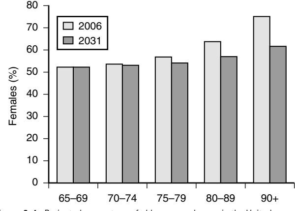
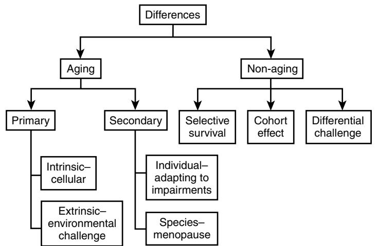
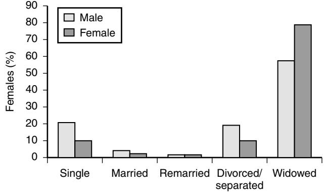

# The Epidemiology of Aging

Norman Vetter

*It must be obvious that, senescence apart, old animals have the advantage of young. For one thing, they are wiser. The Eldest Oyster, we remember, lived where his juniors perished.* SIR PETER MEDAWAR1

## **INTRODUCTION**

Epidemiology is about measuring and understanding the distribution of the characteristics of populations. The origin of epidemiologic methods relates to the study of epidemics, initially set up by the rich to know when it was time to leave the area when a new epidemic spread among the poor. Epidemiologists are still concerned about the distribution of disease, but apart from being perhaps less likely to head for the hills when infection is rife, they have also added noninfectious diseases and the determinants of disease to their interests. Some have strayed into areas which are not disease-related, but are characteristics of the population itself; one such area is the epidemiology of aging.

The body of knowledge of the epidemiology of aging has evolved into concentrating on three main areas: the causes and results of the aging of populations, the natural history of diseases of old age, and the evaluation of services set up to assist older people. This chapter will concentrate on the first of these; the other two will be covered elsewhere in the textbook.

## **The causes and results of the aging of populations**

The early twenty-first century is unique in a number of aspects, but in relation to the people of the world it is most remarkable as a time when humans live appreciably longer than ever before. Perhaps even more remarkably this rate of prolongation of average life expectancy shows little sign of abating. This extraordinary piece of good luck for those of us who live at this time is tempered a little by the knowledge that life insurers and those calculating pensions have been betting our money on our not living so long, as a result of which we may be poorer than we had hoped.

# **Longevity**

The increase in human life expectancy over the past 10 years has taken both scientists and the population generally by surprise.2 Until recently, demographers were confidently predicting that once the gains made by reducing mortality in early and middle life had reached completion, growth in longevity would stop and we would see the fixed reality of the aging process. This has not happened. Mortality experts who have repeatedly asserted that life expectancy is close to an ultimate ceiling have repeatedly been proven wrong. The apparent leveling off of life expectancy in individual countries has been an artifact of laggards catching up and leaders falling behind. In the developed world, average prolongation of life continues at 4 to 5 hours a day. Late-life mortality, which people theorized was likely to remain stable, has steadily increased (Figure 2-1).

The probable causes for the linear quality of this increase in life expectancy are twofold. Before 1950, most of the gain in life expectancy was due to reductions in death rates at younger ages. In the second half of the twentieth century, improvements in survival after age 65 caused the increase in the length of people's lives. Most forecasts of the maximum possible life expectancy in recent years have been broken within five years of the forecast.3 World life expectancy has more than doubled over the past 200 years. So where will this lead? Life expectancy has increased by 2.5 years per decade for a century and a half; a reasonable suggestion would be that this trend will continue in coming decades. If so, average life expectancy will reach 100 in about 60 years.

# **Why do we age?**

There now appears to be a reasonably clear consensus that the aging process is caused by an accumulation over time of molecular damage. The rate of aging in an individual is therefore a complex interaction between damage, maintenance, and repair. These interactions are, of course, influenced by both genetic and environmental factors. It has been said that whoever created humans, whether nature or a creator, did a poor job, but being aware of it, put in a lot of back-up systems. On the other hand it may be a universal law that hyperefficiency is less effective in the long run than flexibility. This may be a useful lesson beyond the realms of longevity in a world more fussed about efficiency than effectiveness.

It is assumed that genetic changes are unlikely to alter appreciably, under evolutionary pressure, over the short period, during which longevity has dramatically increased. The reason for the increasing longevity is therefore said to be caused by the interplay of advances in income, nutrition, education, sanitation, and medicine, with the mix varying over age, period, cohort, place, and disease. It seems likely then that these changes are largely a result of a wide range of environmental factors.

That being said, the birth cohorts of people born around the early 1900s experienced huge changes in socioeconomic conditions, hygiene, lifestyle, and medical care, leading to dramatic falls in infant mortality and infectious and respiratory diseases. The main effects were socioeconomic, leading to smaller families, better housing, and nutrition, though later in the century vaccination must have played some part. In later years it seems to have been the survival of older people that has led to the extension of life expectancy. The reason for this survival is not fully understood. The best we can do is to guess that it may be the availability of specific treatments for diseases of old age.6

However, it may be that we were working to the wrong theory of maximum human lifespan all along. Studies of large populations of humans, wasps, fruitflies, nematodes, and yeast have revealed a leveling off, and in some species even a decline, in mortality late in life instead of a continuously increasing rate. The possible reason that this has been

Figure 2-1. Life expectancy by time (United Kingdom ± 95% confidence intervals).

missed until now in humans may be that the deceleration in age-specific death rates does not seem to begin in humans until after 80 years of age, the plateau is not seen until after 110 years of age, and it requires the observation of large populations.4

In addition, genetics and environment are known to be intimately entwined. The length of telomeres has been said to be a measure of aging. Telomeres are the ends of chromosomes that help to protect the DNA from wearing down during the replication process that replenishes cells. Telomeres shorten over an individual's lifetime and are thought be a marker for aging. For instance it is known from matched twin studies that telomeres in a physically active group of people (who performed more than 3 hours and 20 minutes of exercise a week) were 200 nucleotides longer than those in a less active group (who performed less than 16 minutes exercise a week). Smokers and obese people are known to have shorter telomeres than their healthier counterparts.5

#### **QUALITY OF LIFE AND DISABILITY**

The measurement of quality of life on older people is selfevidently a vital outcome measure for deciding upon, for instance, the comparative effectiveness of different treatments. Many approaches have been made to this. For an overview for large populations, questionnaire methods are most commonly used, including the Bartel index, the SF-12, and more recently the WHOQOL-OLD, a generic health-related QOL measure developed for the World Health Organization.7 A number of good reviews of measuring quality of life have been written by Bowling8 and Haywood.9

The latter explored 122 articles relating to 15 measuring instruments. The most extensive evidence was found for the SF-36, COOP Charts, EQ-5D, Nottingham Health Profile (NHP), and Sickness Impact Profile (SIP). Four instruments had evidence of both internal consistency and test-retest reliability: the NHP, SF-12, SF-20, and SF-36. Four instruments lacked evidence of reliability: the HSQ-12, IHQL, QWB, and SQL. Most instruments were assessed for validity through comparisons with other instruments, global judgments of health, or clinical and sociodemographic variables. The author concluded that there was good evidence for reliability, validity, and responsiveness for the SF-36, EQ-5D, and NHP. There is more limited evidence for the COOP, SF-12, and SIP. The SF-36 was recommended where a detailed and broad-ranging assessment of health is required, particularly in community-dwelling older people with limited morbidity. The EQ-5D was recommended where a more succinct assessment is required, particularly where a substantial change in health is expected.

Another study of more than 16,000 in the health survey for England provided evidence that the SF-6D is an empirically valid and efficient alternative multiattribute utility measure to the EQ-5D, and is capable of discriminating between external indicators of health status.10

Figure 2-2 shows data from the above study for EQ-5D data by age. EQ-5D is an especially useful measure, where valid, because it can be used directly to measure utilities in cost-effectiveness studies when using the measure to build up quality-adjusted life-years (QALYs). QALY maximization as a means of, for instance, comparing two treatments, is sometimes criticized for being ageist, because other things being equal, the elderly with a shorter life expectancy will be given lower priority.

It is not the place of this chapter to go into detail on this argument, but some people believe that everyone, when faced with a sudden illness or accident at least, should be regarded as equal no matter what their state of health or likely longevity. This seems untenable at one extreme, say elderly patients with severe dementia. In that case it would seem that "not striving to keep alive" makes sense. However, a fit 90-year-old is usually able to benefit from high

Figure 2-2. EQ-5D utility data by age.

technology solutions to his or her disease process as anyone else.

In contrast some people believe that QALYs are not ageist enough (e.g., the QALY-based view would give the same weight to treating a 10-year-old with a qualityadjusted life-expectancy of 10 years as to an 80-year-old with the same life expectancy). This does not account for the greater benefits that the old person has already received so that some people think that younger people should have priority over older people, regardless of life expectancy.11

#### **Changes with time**

It is a truism to say that older people nowadays are fitter than they were in the past. Measuring this between successive generations of the same age has been attempted. At the level of overall quality of life, it has been reported that people in their late 70s in the 1990s were less functionally impaired than was a similar group in the 1980s.12 Since then various other longitudinal studies conducted in the United States, Europe, and in other developed countries have examined this. Although the findings are not consistent, several consensus publications and a meta-analysis that stratified results based upon the adequacy of measurement concluded that there appeared to have been a significant reduction in the rate of functional decline over the last 3 decades and that this finding was robust with respect to measurement approach, methodology, and to some extent by country.13 This was difficult to pinpoint in the face of an approximately 1% reduction in mortality in older people, but most researchers conclude that there has been at least a 2% reduction in disability over the last several decades.

Turning to more specific problems that are common in older people, it is thought that, for example, average blood pressure measurements in successive cohorts of older people appear to be declining. Thus in the Gothenburg study, it was found that successive cohorts of 70-year-olds had lower arterial blood pressure with time.14 Others have agreed that although the prevalence of disability and need for help increases with advancing age, within an age group these improve over time from one birth cohort to another.15,16 The exception to this, until recently, has been fractures in older people where age-adjusted fracture incidence seemed to be rising steadily during the 1990s. However, since then, in Finland where the best data have been collected over time, the rate is changing rapidly, rising for some fractures17 and falling for others.18,19

The exact reasons for the secular change in the risk of hip fracture are unknown. A cohort effect toward healthier elderly populations in the developed countries cannot be ruled out: in earlier birth cohorts, the early-life risk factors for fracture, such as perinatal nutrition, may have had stronger impact on the late-life fracture risk than in the others. A second reason could be the rising average body weight and body mass index (BMI). In all adult age groups in developed countries, the prevalence of obesity has increased since the 1980s. A low BMI is a strong risk factor for hip fracture, and it has been estimated that a one unit increase in the BMI of a population could result in an 7% decrease in the fracture incidence—the effect being greatest with weight gain among the thinnest older adults.

## **Measuring differences: predicting future quality of life**

Data from the English longitudinal study of aging have been used to investigate whether longstanding illnesses, social context, and current socioeconomic circumstances predict quality of life.20 This was a nationally representative sample of noninstitutionalized adults living in England using a standardized quality of life scale. The quality of life of the group was found, where adversely affected, in rank order to be reduced by depression, a poor financial situation, limitations in mobility, difficulties with everyday activities, and limiting longstanding illness. Quality of life was improved, again in rank order, by trusting relationships with the family, friends, and frequent contacts with friends; living in a good neighborhood; and having two cars. The regression models explained 48% of the variation in quality of life scores.

The authors concluded that efforts to improve quality of life in early old age need to address financial hardships, functionally limiting disease, lack of at least one trusting relationship, and inability to move out of a disfavored neighborhood. They did not mention the possible provision of extra cars.

This importance of the perceptions of older people about their neighborhood was also underlined by a further study of over-65-year-olds in the community.21 In this study, perceptions of problems in the area (noise, crime, air quality, rubbish/litter, traffic, and graffiti) were predictive of poorer health. The good news about these findings is that many of these factors are modifiable and could have an important impact on the quality of life of older people.

A 65-year-old person with severe disability will have differences in need for support when compared with an 85-year-old person. The severe disability is likely to be complicated by multiple problems, especially social and mental problems, so that their health needs are likely to be greatly complicated by housing and financial needs and by isolation and loneliness.

## **Measuring differences: cross-sectional versus longitudinal data**

Much of the research done on the aging process has been performed on cross-sectional data. This is not particularly surprising because such studies are easier and much less complicated to perform than longitudinal studies. Generally speaking, cross-sectional data indicate that aging has a more marked deleterious effect on the study group than longitudinal. The process of aging for us all is demonstrably longitudinal, so that wherever possible we should be guided by such data.

A number of examples of the differences between crosssectional and longitudinal studies exist. A classic longitudinal study showed that cognitive decline appeared to be much more closely related to age in cross-sectional studies than in longitudinal.22 Other cross-sectional studies that originally were thought to show that smoking had a protective effect on Alzheimer's disease were shown by longitudinal studies to be the opposite of the true effect, probably because smokers died before they had a chance to suffer from Alzheimer's.23 In addition, marked effects have been seen in different cohorts born more recently. Age cohorts born only 5 years apart show notable differences in their height, weight, and other measures associated with changes in activity level.24 It is therefore important to distinguish between the sorts of data that are available when making judgments about populations of older people. Generally, cross-sectional data paint a bleaker picture of the impact of aging than do longitudinal data.

#### **Measuring differences: age**

The age distribution of older men and women is very different, especially in the oldest age groups. For example, 3.8% of older women compared with 1.7% of older men are aged 90 and above. This situation is expected to persist for some time, but gender differences according to age will become less notable in the future.

When describing age groups there is a particular problem for the oldest group and sometimes for those below that. The groups 65 to 69, 70 to 74, 75 to 79, 80 to 84, and 85+ are commonly used in the literature and in research findings. This is a means of summarizing the data when looking at trends and other differences. However, closer examination of these groups compared with single year of age data may show that, although the first four of these represent 5-year age groups, the 85+ group can, depending on the population studied, only go up to 90 years of age or may continue beyond 100. In other words the 85+ group is not strictly comparable with the other two. By grouping the data, one is making the assumption that the group represents a midpoint. This, together with the likelihood of small numbers in the oldest age group, can account for anomalous findings in that group.

Table 2-1 shows data for a population based in a large general practice in South Wales by year of age and divided into age groups. It can be clearly seen that the 85+ age group is heavily skewed with the frequency midpoint of the group between 86 and 87 years, nowhere near the 5 years which is the midpoint of the others.

Figure 2-3 shows a typical example of how the top age group is out of line with previous groups. It shows the prevalence of breathlessness in the group shown in Table 2-1. The difference in value in the oldest age group may reflect a true difference or it may be due to assuming that the oldest group is at the midpoint, as explained above.

#### **Measuring differences: sex**

The average life expectancy at birth of females born in the United Kingdom is 80 years compared with 76 years for males. Women are more likely than men to be living with high blood pressure, arthritis, back pain, mental illness, asthma, and respiratory disease. Men are more likely than women to be living with heart disease. Older men are much more likely than older women to drive. Among people aged 75 and over, 58% of men and 33% of women have access to private transport. Among people aged under 75, women are more likely than men to be providing unpaid

**Table 2-1. Year of Age by Age Groups**

|       |          |          | AGE GROUPS |          |     |       |  |
|-------|----------|----------|------------|----------|-----|-------|--|
| Age   | 65 to 69 | 70 to 74 | 75 to 79   | 80 to 84 | >85 | Total |  |
| 65    | 145      | 0        | 0          | 0        | 0   | 145   |  |
| 66    | 106      | 0        | 0          | 0        | 0   | 106   |  |
| 67    | 100      | 0        | 0          | 0        | 0   | 100   |  |
| 68    | 81       | 0        | 0          | 0        | 0   | 81    |  |
| 69    | 90       | 0        | 0          | 0        | 0   | 90    |  |
| 70    | 0        | 83       | 0          | 0        | 0   | 83    |  |
| 71    | 0        | 84       | 0          | 0        | 0   | 84    |  |
| 72    | 0        | 74       | 0          | 0        | 0   | 74    |  |
| 73    | 0        | 75       | 0          | 0        | 0   | 75    |  |
| 74    | 0        | 68       | 0          | 0        | 0   | 68    |  |
| 75    | 0        | 0        | 72         | 0        | 0   | 72    |  |
| 76    | 0        | 0        | 52         | 0        | 0   | 52    |  |
| 77    | 0        | 0        | 45         | 0        | 0   | 45    |  |
| 78    | 0        | 0        | 56         | 0        | 0   | 56    |  |
| 79    | 0        | 0        | 62         | 0        | 0   | 62    |  |
| 80    | 0        | 0        | 0          | 37       | 0   | 37    |  |
| 81    | 0        | 0        | 0          | 26       | 0   | 26    |  |
| 82    | 0        | 0        | 0          | 46       | 0   | 46    |  |
| 83    | 0        | 0        | 0          | 37       | 0   | 37    |  |
| 84    | 0        | 0        | 0          | 42       | 0   | 42    |  |
| 85    | 0        | 0        | 0          | 0        | 22  | 22    |  |
| 86    | 0        | 0        | 0          | 0        | 25  | 25    |  |
| 87    | 0        | 0        | 0          | 0        | 21  | 21    |  |
| 88    | 0        | 0        | 0          | 0        | 11  | 11    |  |
| 89    | 0        | 0        | 0          | 0        | 6   | 6     |  |
| 90    | 0        | 0        | 0          | 0        | 12  | 12    |  |
| 91    | 0        | 0        | 0          | 0        | 5   | 5     |  |
| 92    | 0        | 0        | 0          | 0        | 6   | 6     |  |
| 93    | 0        | 0        | 0          | 0        | 2   | 2     |  |
| 94    | 0        | 0        | 0          | 0        | 1   | 1     |  |
| 95    | 0        | 0        | 0          | 0        | 1   | 1     |  |
| 96    | 0        | 0        | 0          | 0        | 1   | 1     |  |
| 99    | 0        | 0        | 0          | 0        | 1   | 1     |  |
| Total | 522      | 384      | 287        | 188      | 114 | 1495  |  |

Figure 2-5. Projected percentage of older people by sex and marital status (England and Wales).

broad indicators of general health such as self-perceived health status.25

Among some older married couples, the man controls household finances, meaning that his partner may be left in a difficult position if suddenly she has to take over money management. Women's pension entitlement is often lower than men's and their risk of poverty in later life significantly greater.

Although the gender differences in the structure by age of the older population is expected to persist in the future, things will slowly change. As a result of the faster increase in life expectancy of men, gender differences in the composition of the older age groups will most likely shrink over time. Thus it is estimated that between 2006 and 2031, women will remain in the majority, but their share is due to decrease. For example, the percentage of women aged 80 to 89 is expected to decrease from 63.2% in 2006 to 56.3% in 2031.

#### **Measuring differences: marriage**

Older men and women are very different with respect to their marital status: 61% of men are married compared with 36.7% of women, whereas 16.5% of men are widowed compared with 46.1% of women. This gender imbalance varies by age, becoming more marked with time or among older cohorts. In the future these differences are expected to decrease dramatically. Figure 2-5 shows these changes.

There is predicted to be a dramatic increase in the share of divorced and separated individuals in the younger age groups of the older population between 2003 and 2031. Among the 65–74 year olds, one in five women will belong to this group, whereas now the percentage stands at just below 9%. The increase in the proportion of divorced and separated men will not be as great because men have a higher propensity to remarry, but the proportion of single men will reach more than 16%. In short, for both genders, but particularly so for men aged 65–74, the proportion married will

Figure 2-4. Projected percentage of older women by age in the United Kingdom.

care to relatives, neighbors, or friends; but among people aged 85 and over, men are more likely than women to be providing unpaid care. This is because of different average lifespans—older women are more likely to live alone, whereas older men are more likely to be married. Figure 2-4 shows the projected percentage of older women by age group.

Population aging is particularly rapid among women because of lower mortality rates among women. In older age groups, the proportion of women is therefore higher than men; increasingly so with advancing age. Therefore, when studying older people, it is essential to study gender as a basis of differentiation. For example, it has been suggested that older women's much higher level of functional impairment coexists with a lack of gender differences in selfassessed health. Some studies have reported no gender differences in self-reported health status among elderly people, whereas higher levels of more objectively measured disability existed among women. It has been shown that gender differences in health depend on the indicator and the age stratum analyzed. It could very well be that among older adults the impacts of different measures of socioeconomic position differ by health indicator and that disability-related indicators may be more sensitive to gender inequalities than diminish whereas the proportion of those in other groups will increase.

# **Measuring differences: features of older compared with younger people in the population**

Figure 2-6, adapted from work by Professor Grimley Evans,26 shows a general outline of the main differences between young and older people. These are divided into two main groups, differences due to the aging process itself and those not due to that process. Aging may be primary and intrinsic, set by the cellular makeup of the individual or it may be extrinsic and due to environmental challenges the day-to-day wear and tear of the environment on that person.

Secondary aging is said to be either individual, such as the adaptations in an older person's gait because of poor proprioception or a tendency to write down things to overcome problems with memory. They are not themselves due to aging but are a response to some aspect of the aging process. Some aspects of old age give an advantage to the species. Thus humans with their odd need to stand on their swhich have to go through those pelvises at birth, have as a result very immature offspring who take many years to become independent beings. It appears that, in evolutionary terms, additional help in child care in the shape of grandmothers provided an advantage. Thus the menopause gave a major advantage to humankind and was adopted generally.

Then there are three main categories of difference which are not due to the aging process per se: selective survival, the fact that people who take more risks, whether by smoking or by dangerous sports, are less likely to be found in the older age group so that that group is lacking in such individuals. The second, a cohort effect, which I have mentioned elsewhere in the chapter and the third differential challenges for older people compared with those for the young, which I will now describe more fully. In many countries older people live in low quality housing as a consequence of social policy as well as poverty. More pervasive is the poorer quality of medical care provided for older people, largely as a result of discrimination against those who are older.

## **Indices of dependency**

The ratio of the dependent population to the economically active or working population is sometimes called the dependency ratio. This is used in setting taxation policies, in particular, as the working population pay income tax. In fact the taxman, when extracting taxes, is much cleverer than just taking money from wage packets these days; so that all groups of people who purchase pay value-added and other taxes. There are a number of groups who are not part of the working population: children, students, housewives, husbands, and the unemployed. Being not formally employed does not mean that they are not contributing to the economy. In particular grandparents contribute hugely in terms of child care for working people and retired people, especially women, and are one of the biggest groups caring for elderly disabled relatives, most often a spouse.

Another indicator of the age structure is the aging index, defined as the number of people aged 65 and over divided by the number under age 15. By 2030 it is thought that all developed countries will have more people aged 65 and over than people under 15.

# **Is aging inevitable?**

The old joke says "aging is inevitable, maturing is optional." However, lifestyle factors seem able to have an impact on aging. The best-known and obvious of these is smoking, which is related to a wide range of problems, some well known, as in lung disease, heart disease, and cancers, resulting in its being the most important predictor for mortality in a combination of six large longitudinal studies.27 Others have a particular resonance with older people, notably bone strength and hearing ability.28 These changes are so ubiquitous that there is a suggestion that smoking may accelerate the aging process itself.

On the positive side, there are also a number of studies that show the importance of continuing to perform exercise29,30 and others that have shown that muscular strength in old age can, with training, be increased proportionately to a similar extent to that found in younger people31 and that training appears to have some effect on the prevention of falls.32

Figure 2-6. Differences between young and older individuals.

## **Living alone**

The vast majority of those who live alone are widowed, although this percentage is much higher for women than men. The distribution of those who live with a partner (the vast bulk of older people) is similar between men and women and consists mainly of married or remarried individuals. By contrast, the category "living with others" is quite heterogeneous. Men are more likely to be married, perhaps living with a younger wife, whereas women in this group are for the most part widowed (Figure 2-7).

Living alone is likely to be increasingly common as the millennium advances. It is likely that a quarter of people born in the 1960s will be lone householders by age 60 and that close to a half of the 1960s Baby Boomers will be living solo by age 75.33 Living alone is not directly related to loneliness, but the cause of living alone, especially widowhood, is closely related, so they are often associated.

# **Ethnicity, emigration, and immigration (internal and external)**

Because of the youthfulness of immigrants, immigration is often seen as a solution to the "problem" of population aging in countries with low fertility. Presently the lack of people to take jobs in developed countries draws young people from developing countries, lowering the average age of the population. The overall large numbers and proportions emigrating again among the overseas-born population suggest that this U.K. subpopulation ages more slowly than does the U.K.-born subpopulation. This implies that the currently observed processes of immigration and emigration among U.K.s overseas-born immigrants will lower the U.K.s old-age dependency ratio in the long run as well as in the short run.

Table 2-2 shows the proportion of older people in the 2001 census by ethnic origin. There are a great preponderance of white people in the United Kingdom, with only very minor differences in the proportion between males and females.

## **Inequalities**

Older people have tended to be neglected in research on health inequalities compared with people in other stages of life. Similarly, there has been a lack of research on how class interacts with gender in later life. One of the central reasons for this has been the difficulty of assigning people to social groupings after retirement because the approach has

Figure 2-7. Marital status of older people living alone. *(Data from United Kingdom 2001 census.)*

#### **Table 2-2. Older People by Sex and Ethnicity – United Kingdom**

| Ethnicity | Male  | Female | Total |
|-----------|-------|--------|-------|
| White     | 96.9  | 97.7   | 97.4  |
| Asian     | 1.8   | 1.3    | 1.5   |
| Black     | 1.0   | 0.7    | 0.8   |
| Other     | 0.3   | 0.3    | 0.3   |
| Total     | 100.0 | 100.0  | 100.0 |

Data from Census (2001) Office of National Statistics, United Kingdom.

traditionally been based on occupational status and this is difficult to attribute when older people are mainly retired.

There is evidence that increasing inequalities will occur between future cohorts of elderly people. Inequalities will persist between those who will have experienced full work histories, have acquired pension rights and housing wealth, and those who have not. The 1960s baby boomers, in particular, faced high unemployment levels when they first entered the labor market. Some of them have never had a full-time job, whereas others benefited from the Thatcher era, giving rise to the 1980s "yuppies." Inheritance of housing wealth primarily goes to individuals who are already owner-occupiers, further increasing the trend toward increased inequality and Richard Titmuss' notion of "two nations in old age."34

Inequalities by socioeconomic group continue even up to the end of life. During the last year of life, older people were still reluctant to take up their entitled benefits.35 Primary health care professionals saw nearly all of the people who died during their last year. They could play an important role in ensuring that the elderly and the less well-off are aware of the services and benefits available to them.

# **CONCLUSIONS**

Epidemiology is about measuring and understanding the distribution of the characteristics of populations. In relation to aging, the early twenty-first century is unique in the span of human existence for the longevity of the race. The aging of the population is a global phenomenon that requires international coordination nationally and locally.

The United Nations and other international organizations have developed a number of recommendations intended to reduce adverse effects of population aging. These include reorganization of social security systems, changes in labor, immigration, and family policies, promoting active and healthy life-styles, and more cooperation between governments in resolving socioeconomic and political problems

#### KEY POINTS The Epidemiology of Aging

- The world population is older than it has ever been.
- Measuring the effect of an aging population is not straightforward; longitudinal approaches more accurately describe people's experience than do cross-sectional studies.
- Older people at a given age are fitter than they used to be in nearly all objective parameters measured.
- Inequalities between different social groups of older people, both for health and income, appear to be increasing in the U.K.

related to population aging. A country with an aging population may be helped by immigration of young workers to enlarge the working population, potentially with benefit to both countries as long as it is carefully monitored.

On the positive side, the health status of older people of a given age is improving over time because recent generations are fitter and have had less diseases. As a result, older vigorous and active people live to a much later age than previously, and given the opportunities, they can contribute economically. We have already extended the healthy and productive period of human life and this shows little sign of abating.

For a complete list of references, please visit online only at www.expertconsult.com