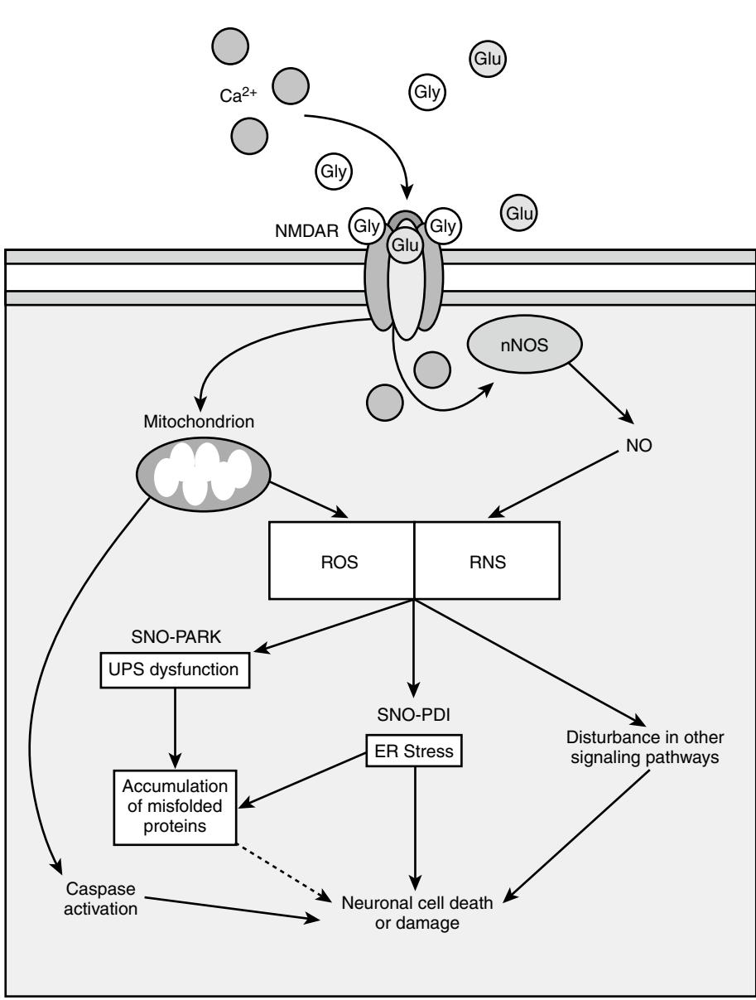
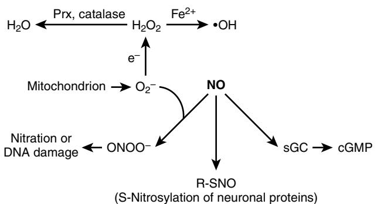
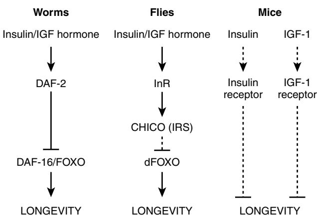
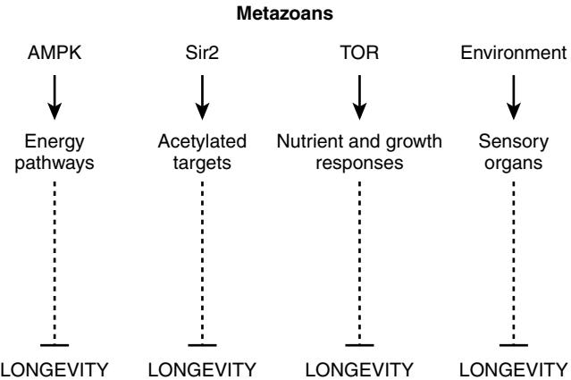

# The Neurobiology of Aging: Free Radical Stress and Metabolic Pathways

Tomohiro Nakamura Malene Hansen Sean M. Oldham Stuart A. Lipton

Environmental stressors and several genetic pathways play complex and crucial roles in the neurobiology and control of aging. This chapter will summarize current knowledge on these two specific research areas divided into two sections: one on free radical stressors and the other on genetic control of metabolic pathways.

## **SECTION I: NITROSATIVE AND OXIDATIVE STRESS IN THE NEUROBIOLOGY OF AGING**

Aging represents a major risk factor for neurodegenerative diseases, such as Parkinson's disease (PD); Alzheimer's disease (AD); amyotrophic lateral sclerosis (ALS); and polyglutamine (polyQ) diseases, such as Huntington's disease, glaucoma, human immunodeficiency virus-associated dementia, multiple sclerosis, and ischemic brain injury, to name but a few.1–5 Although many intracellular and extracellular molecules may participate in neuronal injury and loss, accumulation of nitrosative and oxidative stress, because of the excessive generation of nitric oxide (NO) and reactive oxygen species (ROS), appears to be a potential factor contributing to neuronal cell damage and death.6,7 A well-established model for NO production entails a central role of the *N*-methyl-D-aspartate (NMDA)-type glutamate receptors in nervous system. Excessive activation of NMDA receptors drives Ca2+ influx, which in turn activates neuronal NO synthase (nNOS) and the generation of ROS8,9 (Figure 25-1). Accumulating evidence suggests that NO can mediate both protective and neurotoxic effects by reacting with cysteine residues of target proteins to form S-nitrosothiols (SNOs), a process termed S-nitrosylation because of its effects on the chemical biology of protein function. Importantly, normal mitochondrial respiration may also generate free radicals, principally ROS, and one such molecule, superoxide anion (O2 .−), reacts rapidly with free radical NO to form the very toxic product peroxynitrite (ONOO−)10,11 (Figure 25-2).

An additional feature of most neurodegenerative diseases is accumulation of misfolded and/or aggregated proteins.12–15 These protein aggregates can be cytosolic, nuclear, or extracellular. Importantly, protein aggregation can result from either (1) a mutation in the disease-related gene encoding the protein, or (2) posttranslational changes to the protein engendered by nitrosative/oxidative stress.16 A key theme of this chapter, therefore, is the hypothesis that nitrosative or oxidative stress contributes to protein misfolding in the brains of neurodegenerative patients. In this chapter, we discuss specific examples showing that S-nitrosylation of (1) ubiquitin E3 ligases such as parkin or (2) endoplasmic reticulum chaperones such as proteindisulfide isomerase (PDI) is critical for the accumulation of misfolded proteins in neurodegenerative diseases such as PD and other conditions.17–20

## **PROTEIN MISFOLDING IN NEURODEGENERATIVE DISEASES**

A shared histologic feature of many neurodegenerative diseases is the accumulation of misfolded proteins that adversely affect neuronal connectivity and plasticity, and trigger cell death signaling pathways.12,15 For example, degenerating brain contains aberrant accumulations of misfolded, aggregated proteins, such as α-synuclein and synphilin-1 in PD, and amyloid-β (Aβ) and tau in AD. The inclusions observed in PD are called Lewy bodies and are mostly found in the cytoplasm. AD brains show intracellular neurofibrillary tangles, which contain tau, and extracellular plaque, which contains Aβ. Other disorders manifesting protein aggregation include Huntington's disease (polyQ), ALS, and prion disease.14 The above-mentioned aggregates may consist of oligomeric complexes of nonnative secondary structures and demonstrate poor solubility in aqueous or detergent solvent.

In general, protein aggregates do not accumulate in unstressed, healthy neurons due in part to the existence of cellular "quality control machineries." For example, molecular chaperones are believed to provide a defense mechanism against the toxicity of misfolded proteins because chaperones can prevent inappropriate interactions within and between polypeptides, and can promote refolding of proteins that have been misfolded because of cell stress. In addition to the quality control of proteins provided by molecular chaperones, the ubiquitin-proteasome system (UPS) and autophagy/lysosomal degradation are involved in the clearance of abnormal or aberrant proteins. When chaperones cannot repair misfolded proteins, they may be tagged via addition of polyubiquitin chains for degradation by the proteasome. In neurodegenerative conditions, intracellular or extracellular protein aggregates are thought to accumulate in the brain as a result of a decrease in molecular chaperone or proteasome activities. In fact, several mutations that disturb the activity of molecular chaperones or UPS-associated enzymes can cause neurodegeneration.15,21,22 Along these lines, postmortem samples from the substantia nigra of PD patients (vs. non-PD controls) manifest a significant reduction in proteasome activity.23

Historically, lesions that contain aggregated proteins were considered to be pathogenic. Recently, several lines of evidence have suggested that aggregates are formed through a complex multistep process by which misfolded proteins assemble into inclusion bodies; currently, soluble oligomers of these aberrant proteins are thought to be the most toxic forms via interference with normal cell activities, whereas

Figure 25-1. Activation of the NMDA receptor (NMDAR) by glutamate (Glu) and glycine (Gly) induces Ca2+ influx and consequent ROS/RNS production. NMDAR hyperactivation triggers generation of ROS/RNS and cytochrome C release from mitochondria associated with subsequent activation of caspases, causing neuronal cell death and damage. *SNO-PARK,* S-nitrosylated parkin; *SNO-PDI,* S-nitrosylated PDI.

frank aggregates may be an attempt by the cell to wall off potentially toxic material.8,24

## **GENERATION OF REACTIVE OXYGEN/ NITROGEN SPECIES (ROS/RNS) NMDA receptor-mediated glutamatergic signaling pathways induce Ca2+ influx**

It is well known that the amino acid glutamate is the major excitatory neurotransmitter in the brain. Glutamate is present in high concentrations in the adult central nervous system and is released for milliseconds from nerve terminals in a Ca2+-dependent manner. After glutamate enters the synaptic cleft, it diffuses across the cleft to interact with its corresponding receptors on the postsynaptic face of an adjacent neuron. Excitatory neurotransmission is necessary for the normal development and plasticity of synapses, and

for some forms of learning or memory; however, excessive activation of glutamate receptors is implicated in neuronal damage in many neurologic disorders ranging from acute hypoxic-ischemic brain injury to chronic neurodegenerative diseases. It is currently thought that overstimulation of extrasynaptic NMDA receptors mediate this neuronal damage, while in contrast synaptic activity may activate survival pathways.25–27 Intense hyperstimulation of excitatory receptors leads to necrotic cell death, but more mild or chronic overstimulation can result in apoptotic or other forms of cell death.28–30

NMDA receptor-coupled channels are highly permeable to Ca2+, thus permitting Ca2+ entry after ligand binding if the cell is depolarized to relieve block of the receptorassociated ion channel by Mg2+. 31,32 Subsequent binding of Ca2+ to various intracellular molecules can lead to many significant consequences. In particular, excessive activation of

Figure 25-2. Pathways of ROS/RNS neurotoxicity. NO activates soluble guanylate cyclase (sGC) to produce cyclic guanosine monophosphate (cGMP), which in turn activates cGMP-dependent protein kinase. Excessive NMDA receptor activity, leading to the overproduction of NO, can be neurotoxic. For example, S-nitrosylation of parkin and PDI can contribute to neuronal cell damage and death, in part by triggering accumulation of misfolded proteins. Other neurotoxic effects of NO are mediated by peroxynitrite (ONOO−), a reaction product of NO and superoxide anion (O2 −). In contrast, S-nitrosylation can also mediate neuroprotective effects, for example, by inhibiting caspase activity and preventing overactivation of NMDA receptors.

NMDA receptors leads to the production of damaging free radicals (e.g., NO and ROS) and other enzymatic processes, contributing to cell death.6,11,29,30, 33,34

## **Ca2+ influx and generation of ROS/RNS**

Excessive activation of glutamate receptors is implicated in neuronal damage in many neurologic disorders. John Olney coined the term "excitotoxicity" to describe this phenomenon.35,36 This form of toxicity is mediated at least in part by excessive activation of NMDA-type receptors,6,7,37 resulting in excessive Ca2+ influx through a receptor's associated ion channel.

Increased levels of neuronal Ca2+, in conjunction with the Ca2+-binding protein Ca2+/calmodulin (CaM), trigger the activation of nNOS and subsequent generation of NO from the amino acid L-arginine.8,38 NO is a gaseous free radical (thus highly diffusible) and a key molecule that plays a vital role in normal signal transduction but in excess can lead to neuronal cell damage and death. The discrepancy of NO effects on neuronal survival can also be caused by the formation of different NO species or intermediates: NO radical (NO·), nitrosonium cation (NO+), nitroxyl anion (NO−, with high energy singlet and lower energy triplet forms).11

Recent studies further pointed out the potential connection between ROS/RNS and mitochondrial dysfunction in neurodegenerative diseases, especially in PD.5,39 Pesticide and other environmental toxins that inhibit mitochondrial complex I result in oxidative and nitrosative stress, and consequent aberrant protein accumulation.17,18,20,40,41 Administration to animal models of complex I inhibitors, such as MPTP, 6-hydroxydopamine, rotenone, and paraquat, which result in overproduction of ROS/RNS, reproduces many of the features of sporadic PD, such as dopaminergic neuron degeneration, upregulation and aggregation of α-synuclein, Lewy bodylike intraneuronal inclusions, and behavioral impairment.5,39

Increased nitrosative and oxidative stress are associated with chaperone and proteasomal dysfunction, resulting in accumulation of misfolded aggregates.16,42 However, until recently little was known regarding the molecular and pathogenic mechanisms underlying contribution of NO to the formation of inclusion bodies, such as amyloid plaque in AD or Lewy bodies in PD.

## **PROTEIN S-NITROSYLATION AND NEURONAL CELL DEATH Chemical biology of S-nitrosylation**

Early investigations indicated that the NO group mediates cellular signaling pathways, which regulate broad aspects of brain function, including synaptic plasticity, normal development, and neuronal cell death.33,43–45 In general, NO exerts physiologic and some pathophysiologic effects via stimulation of guanylate cyclase to form cyclic guanosine-3',5'-monophosphate (cGMP) or through S-nitrosylation of regulatory protein thiol groups9,11,42,46–48 (Figure 25-2). S-nitrosylation is the covalent addition of an NO group to a critical cysteine thiol/sulfhydryl (RSH or, more properly, thiolate anion, RS−) to form an S-nitrosothiol derivative (R-SNO). Such modification modulates the function of a broad spectrum of mammalian, plant, and microbial proteins. In general, a consensus motif of amino acids comprised of nucleophilic residues (generally an acid and a base) surround a critical cysteine, which increases the cysteine sulfhydryl's susceptibility to S-nitrosylation.49,50 Our group first identified the physiologic relevance of S-nitrosylation by showing that NO and related RNS exert paradoxical effects via redox-based mechanisms. NO is neuroprotective via S-nitrosylation of NMDA receptors (as well as other subsequently discovered targets, including caspases) and yet can also be neurodestructive by formation of peroxynitrite (or, as later discovered, reaction with additional molecules such as MMP-9 and GAPDH)11,51–58 (Table 25-1). Over the past decade, accumulating evidence has suggested that S-nitrosylation can regulate the biologic activity of a great variety of proteins, in some ways akin to phosphorylation.\* Chemically, NO is often a good "leaving group," facilitating further oxidation of critical thiol to disulfide bonds among neighboring (vicinal) cysteine residues or, via reaction with ROS, to sulfenic (−SOH), sulfinic (−SO2H) or sulfonic (−SO3H) acid derivatization of the protein.18,20,57,66 Alternatively, S-nitrosylation may possibly produce a nitroxyl disulfide, in which the NO group is shared by close cysteine thiols.67

Analyses of mice deficient in either nNOS or iNOS confirmed that NO is an important mediator of cell injury and death after excitotoxic stimulation; NO generated from nNOS or iNOS is detrimental to neuronal survival.68,69 In addition, inhibition of NOS activity ameliorates the progression of disease pathology in animal models of PD, AD, and ALS, suggesting that excess generation of NO plays a pivotal role in the pathogenesis of several neurodegenerative diseases.70–73 Although the involvement of NO in neurodegeneration has been widely accepted, the chemical relationship between nitrosative stress and accumulation of misfolded proteins has remained obscure. Recent findings, however, have shed light on molecular events underlying this relationship. Specifically, we recently mounted physiologic and chemical evidence that S-nitrosylation modulates the (1) ubiquitin E3 ligase activity of parkin,17–19 and (2)

\* References 11,17,18,20,50,57–65

| SNO Targets   | Effect of SNO                    | Reference No. |
|---------------|----------------------------------|------------------|
| Caspases      | • Decreased activity             | (54,52)          |
|               | • Suppression of cell death      | (178,53)         |
| Dexras1       | • Activation of GTPase           | (179,180)        |
|               | • Regulation of iron homeostasis |                  |
| N-Ethylma     | • Enhanced interaction with      | (181,182)        |
| leimide sensi | GluR2                            |                  |
| tive factor   | • Regulation of exocytosis       |                  |
| GAPDH         | • Enhanced interaction with      | (58,183)         |
|               | Siah1                            |                  |
|               | • Activation of p300/CBP         |                  |
|               | • Augmentation of cell death     |                  |
| MAP1B         | • Enhanced interaction with      | (184)            |
|               | • Axon retraction                |                  |
| MMP-9         | • Activation                     | (57)             |
|               | • Augmentation of cell death     |                  |
| NMDAR (NR1    | • Inhibition                     | (11,56)          |
| and NR2A)     | • Suppression of cell death      |                  |
| Parkin        | • Decrease in E3 ligase activity | (17,18)          |
|               | • Augmentation of cell death     |                  |
| PDI           | • Decreased activity             | (20)             |
|               | • Accumulation of misfolded      |                  |
|               | proteins                         |                  |
|               | • Augmentation of cell death     |                  |
| PrxII         | • Decreased peroxidase activity  | (185)            |
|               | • Augmentation of cell death     |                  |

chaperone and isomerase activities of PDI,20 contributing to protein misfolding and neurotoxicity in models of neurodegenerative disorders.

### **S-nitrosylation and parkin**

Identification of errors in the genes encoding parkin (an ubiquitin E3 ligase) and UCH-L1 in rare familial forms of PD has implicated possible dysfunction of the UPS in the pathogenesis of sporadic PD as well. The UPS represents an important mechanism for proteolysis in mammalian cells. Formation of polyubiquitin chains constitutes the signal for proteasomal attack and degradation. An isopeptide bond covalently attaches the C-terminus of the first ubiquitin in a polyubiqutin chain to a lysine residue in the target protein. The cascade of activating (E1), conjugating (E2), and ubiquitin-ligating (E3) type of enzymes catalyzes the conjugation of the ubiquitin chain to proteins. In addition, individual E3 ubiquitin ligases play a key role in the recognition of specific substrates.74

PD is the second most prevalent neurodegenerative disease and is characterized by the progressive loss of dopamine neurons in the substantia nigra pars compacta. Appearance of Lewy bodies that contain misfolded and ubiquitinated proteins generally accompanies the loss of dopaminergic neurons in the PD brain. Such ubiquitinated inclusion bodies are the hallmark of many neurodegenerative disorders. Age-associated defects in intracellular proteolysis of misfolded or aberrant proteins might lead to accumulation and ultimately deposition of aggregates within neurons or glial cells. Although such aberrant protein accumulation had been observed in patients with genetically encoded mutant proteins, recent evidence from our laboratory suggests that nitrosative and oxidative stress are potential causal factors for protein accumulation in the much more common sporadic form of PD. As illustrated below, nitrosative/oxidative stress, commonly found during normal aging, can mimic rare genetic causes of disorders, such as PD, by promoting protein misfolding in the absence of a genetic mutation.17–19 For example, S-nitrosylation and further oxidation of parkin result in dysfunction of this enzyme and thus of the UPS.17,18,75–78 We and others recently discovered that nitrosative stress triggers S-nitrosylation of parkin (forming SNO-parkin) not only in rodent models of PD but also in the brains of human patients with PD and the related α-synucleinopathy, DLBD (diffuse Lewy body disease). SNO-parkin initially stimulates ubiquitin E3 ligase activity, resulting in enhanced ubiquitination as observed in Lewy bodies, followed by a decrease in enzyme activity, producing a futile cycle of dysfunctional UPS.18,19,79 We also found that rotenone led to the generation of SNO-parkin and thus dysfunctional ubiquitin E3 ligase activity. Moreover, S-nitrosylation appears to compromise the neuroprotective effect of parkin.17 Nitrosative and oxidative stress can also alter the solubility of parkin via posttranslational modification of cysteine residues, which may concomitantly compromise its protective function.80–82 Additionally, it is likely that other ubiquitin E3 ligases with RING-finger thiol motifs are S-nitrosylated in a similar manner to parkin to affect their enzymatic function; hence, S-nitrosylation of E3 ligases may be involved in a number of degenerative conditions.

## **S-nitrosylation of PDI mediates protein misfolding and neurotoxicity in cell models of PD or AD**

The ER normally participates in protein processing and folding but undergoes a stress response when immature or misfolded proteins accumulate.83–86 ER stress stimulates two critical intracellular responses. The first represents expression of chaperones that prevent protein aggregation via the unfolded protein response (UPR), and is implicated in protein refolding, posttranslational assembly of protein complexes, and protein degradation. This response is believed to contribute to adaptation during altered environmental conditions, promoting maintenance of cellular homeostasis. The second ER stress response, termed ER-associated degradation (ERAD), specifically recognizes terminally misfolded proteins for retro-translocation across the ER membrane to the cystosol, where they can be degraded by the UPS. Additionally, although severe ER stress can induce apoptosis*,* the ER withstands relatively mild insults via expression of stress proteins such as glucose-regulated protein (GRP) and PDI. These proteins behave as molecular chaperones that assist in the maturation, transport, and folding of secretory proteins.

During protein folding in the ER, PDI can introduce disulfide bonds into proteins (oxidation), break disulfide bonds (reduction), and catalyze thiol/disulfide exchange (isomerization), thus facilitating disulfide bond formation, rearrangement reactions, and structural stability.87 PDI has four domains that are homologous to thioredoxin (TRX) (termed a, b, b', and a'). Only two of the four TRX-like domains (a and a') contain a characteristic redox-active CXXC motif, and these two-thiol/disulfide centers function as independent active sites.88–91 Several mammalian PDI homologues, such as ERp57 and PDIp, also localize to the ER and may manifest similar functions.92,93 Increased expression of PDIp in neuronal cells under conditions mimicking PD suggest the possible contribution of PDIp to neuronal survival.92

In many neurodegenerative disorders and cerebral ischemia, the accumulation of immature and denatured proteins results in ER dysfunction,92,94–96 but upregulation of PDI represents an adaptive response promoting protein refolding and may offer neuronal cell protection.92,93,97,98 In addition, it is generally accepted that excessive generation of NO can contribute to activation of the ER stress pathway, at least in some cell types.99,100 Molecular mechanisms by which NO induces protein misfolding and ER stress, however, have remained enigmatic until recently. The ER normally manifests a relatively positive redox potential in contrast to the highly reducing environment of the cytosol and mitochondria. This redox environment can influence the stability of protein S-nitrosylation and oxidation reactions.101 Interestingly, we have recently reported that excessive NO can lead to S-nitrosylation of the active-site thiol groups of PDI, and this reaction inhibits both its isomerase and chaperone activities.20 Mitochondrial complex I insult by rotenone can also result in S-nitrosylation of PDI in cell culture models. Moreover, we found that PDI is S-nitrosylated in the brains of virtually all cases examined of sporadic AD and PD. Under pathologic conditions, it is possible that both cysteine sulfhydryl groups in the TRX-like domains of PDI form S-nitrosothiols. Unlike formation of a single S-nitrosothiol, which is commonly seen after denitrosylation reactions catalyzed by PDI,61 dual nitrosylation may be relatively more stable and prevent subsequent disulfide formation on PDI. Therefore we speculate that these pathologic S-nitrosylation reactions on PDI are more easily detected during neurodegenerative conditions. Additionally, it is possible that vicinal (nearby) cysteine thiols reacting with NO can form nitroxyl disulfide,67 and such reaction may potentially occur in the catalytic side of PDI to inhibit enzymatic activity. To determine the consequences of S-nitrosylated PDI (SNO-PDI) formation in neurons, we exposed cultured cerebrocortical neurons to neurotoxic concentrations of NMDA, thus inducing excessive Ca2+ influx and consequent NO production from nNOS. Under these conditions, we found that PDI was S-nitrosylated in a NOSdependent manner. SNO-PDI formation led to the accumulation of polyubiquitinated/misfolded proteins and activation of the UPR. Moreover, S-nitrosylation abrogated the inhibitory effect of PDI on aggregation of proteins observed in Lewy body inclusions.20,102 S-nitrosylation of PDI also prevented its attenuation of neuronal cell death triggered by ER stress, misfolded proteins, or proteasome inhibition. Further evidence suggested that SNO-PDI may in effect transport NO to the extracellular space, where it could conceivably exert additional adverse effects.61

The UPS is apparently impaired in the aging brain. Additionally, inclusion bodies similar to those found in neurodegenerative disorders can appear in brains of normal aged individuals or those with subclinical manifestations of disease.103 These findings suggest that the activity of the UPS and molecular chaperones may decline in an age-dependent manner.104 Given that we have not found detectable quantities of SNO-parkin and SNO-PDI in normal aged brain,17,18,20 we speculate that S-nitrosylation of these and similar proteins may represent a key event that contributes

to susceptibility of the aging brain to neurodegenerative conditions.

## **SECTION II: METABOLIC-INSULIN SIGNALING IN THE CONTROL OF AGING AND NEURODEGENERATION**

## **The insulin/IGF-1 signaling pathway and organismal aging**

Experiments using model organisms have provided rapidly increasing evidence that reduced activity of the insulin and insulin-like growth factor (IGF) signaling (IIS) pathways extends lifespan. This discovery is particularly striking as impaired IIS function is also known to have detrimental effects, including death during embryogenesis and diabetes. In addition, alterations of IIS pathway activity can have profound effects on reproduction, stress resistance, and metabolism.105 Recent research has started to unravel the underlying mechanism of IIS-mediated lifespan modulation. Furthermore, this research has also shown a mechanistic link between IIS and neurodegenerative diseases. In this section, we will provide an overview of the role IIS plays in organismal aging and highlight examples of how IIS, and other longevity genes with metabolic functions, regulate neurodegeneration.

Because of the complex regulatory systems that modulate lifespan, a successful approach to addressing this question has been the use of the simple invertebrate models: the nematode *Caenorhabtidis elegans*, and the fruitfly *Drosophila melanogaster*. Indeed, a short lifespan and genetic accessibility of *C. elegans* led to the discovery of the first long-lived IIS mutant (*age-1*) through a genetic screen for genes that alter lifespan.106 This mutant encodes the worm phosphoinositide-3-kinase (PI3K),107,108 which supported additional findings in *C. elegans* demonstrating that mutations in the insulin/IGF-1 receptor DAF-2 increased lifespan and that this effect depended on the FOXO transcription factor DAF-16.106,109–111 With the discovery that mutations in the insulin receptor (InR) or its substrate CHICO could extend the lifespan of *Drosophila*, 112,113 these collective findings suggested that reduced IIS activity is an evolutionarily conserved mechanism to extend lifespan. This remarkable notion was further supported when rodents were shown to live longer if either the insulin or the IGF signaling pathways were disrupted,114–117 indicating that the evolutionary conservation extends to mammals. This functional conservation may even extend to humans as alterations in the IGF signaling pathway has been observed in centenarians.118 These findings also provided a possible explanation to the long lifespan observed in growth-hormone deficient Ames dwarf mice and growth hormone receptor knockout mice because growth hormone positively regulates the production of IGF-1.119,120

Figure 25-3 summarizes IIS interventions that have so far been shown to modulate lifespan in worms, flies, and mice.

## **IIS modulations that affect organismal lifespan**

As IIS coordinates nutritional availability and growth, longlived IIS mutants have effects on the metabolic reserves (altered fat content) and delayed development, decreased adult body size, reduced fecundity, and increased stress resistance.105,121 Recent reports have shown that these processes

Figure 25-3. The insulin-IGF pathway regulates aging in multiple organisms. Molecular components of the insulin/IGF-1 signaling pathway that have been shown to influence the lifespan of worms, flies, and mice. *Dashed lines,* plausible regulatory relationships.

make individual contributions to the extended longevity phenotype because of reduced IIS pathway activity.121 Another important feature of reduced IIS function is the promotion of a longer "healthspan" and longer lifespans in some instances. For instance, experiments have demonstrated protective effects of IIS mutants that extend lifespan in invertebrate models against specific aging-related diseases such as cancer,122–124 cardiac failure,125 and Alzheimer's disease126,127 (see later discussion).

Recent research efforts have focused on understanding when and where IIS modulates lifespan. To address the temporal requirement for reduction of IIS in determining lifespan, IIS was decreased in *C. elegans* during adulthood by administration of bacteria engineered to express double-stranded RNA for *daf-2,* and this treatment was sufficient to extend lifespan.128 Consistent with this, adult-only expression of dFOXO in the adipose tissue of flies was also demonstrated to be sufficient to extend lifespan.129,130 Similarly, adult-specific overexpression of dPTEN129 and ablation of the insulin-producing neurons in the last stage of preadult development is sufficient to enhance longevity.131

The tissue-specific requirements for IIS to modulate lifespan have also been investigated in some detail and have pointed towards important roles for neuronal and fat tissues. For instance, replacement of the insulin-IGF-1 receptor DAF-2 in neurons in *daf-2(−)* worms shortened lifespan back to that of wild-type.132,133 This is in somewhat contrast to the downstream effector of the *daf-2* pathway, the FOXO transcription factor DAF-16, which has been found to primarily function in the intestine—the worms' adipose tissue—to regulate lifespan downstream of the *daf-2*/insulin/IGF-1 receptor.134 Thus insulin signaling in neural tissues controls signals that act in the periphery to modulate lifespan. Consistent with specific roles in neuronal and fat tissues, as mentioned above, ablation of the insulin-producing neurons is sufficient to enhance longevity, whereas fat-specific overexpression of the pathway antagonists dPTEN or dFOXO can extend lifespan in flies via nonautonomous signaling to the insulin-producing neurons.129,130 Finally, fat-specific knockout of the insulin receptor in mice can also extend lifespan.115 Determining the nature of the signals and their cross-talk with the peripheral tissues remains a critical area of research. These results also highlight the potential autonomous and nonautonomous contributions, and acute versus chronic consequences of altering insulin-metabolic signaling in agedependent diseases. How IIS orchestrates organ senescence, including neurodegenerative diseases, and longevity remains an important area of future studies. Thus these combined results indicate the existence of evolutionarily conserved, complex systemic responses regulated by IIS.

## **Mechanisms by which IIS affect organismal lifespan and neurodegenerative diseases**

What is the basis of the beneficial lifespan effects that reduced IIS induce? Recent studies have used unbiased approaches, including gene-expression profiling to understand the FOXO transcriptome, in worms/flies to gain insight into the downstream effectors of IIS. Several studies have been reported using long-lived IIS mutants.135–140 Importantly, genes required for metabolism, stress response, and detoxification of oxidative damage have been identified. Nonetheless, when the effect of altering expression of these genes individually has been investigated directly, their effect on longevity has been minor.137 This has been taken to indicate that many FOXO-regulated genes are required to act additively to produce the profound lifespan effects seen in long-lived IIS mutants. In contrast, other genes might work in parallel to FOXO to extend lifespan by reducing IIS in *C. elegans*, for instance the heat-responsive transcription factor HSF-1141,142 and genes involved in autophagy—a cellular process by which cytoplasmic components are degraded and recycled.143,144 Clearly, these results point to a multimechanistic regulation of the aging process.

Importantly, the aging process has recently been directly linked to neurodegenerative diseases via the IIS pathway. Several studies performed in *C. elegans* and *Drosophila* proteotoxicity models indicate that IIS links directly to the onset of toxic protein aggregation, for example, of the Aβ peptide causing Alzheimer's disease and via PolyQ stretches as those found in Huntington's disease.141,145–147 These studies have started to shed light on the mechanism by which IIS affects neurodegeneration and suggest that IIS can protect against misfolded aggregates in Alzheimer's disease by multiple mechanisms. The main mechanism involves disaggregation of toxic species to enable their degradation via small heat shock proteins (regulated by the HSF-1 transcription factor), whereas the secondary mechanism, regulated by DAF-16/FOXO, involves aggregation of proteins into highmolecular species that are less toxic to the cell.145 Future research should address if the link between IIS and neurodegenerative diseases exists in mammalian systems.

## **Other metabolic longevity pathways and genes with links to neurodegeneration**

Reduced food intake without malnutrition, referred to as dietary restriction (DR), also extends lifespan of a variety of species and has been extensively studied in model organisms.148 In *C. elegans*, it was first conclusively addressed if DR regulates longevity via the IIS pathway. This is not likely to be the case because only IIS, but not DR, is completely dependent on the FOXO transcription factor DAF-16 in worms.149 Similarly, *dFoxo* null mutant flies still show lifespan extensions following DR.129,150 The effects of DR on IIS in mammals are less clear because long-lived Ames mice (mentioned previously) subjected to DR show further increase in lifespan,151 whereas GHRKO mice subjected to DR failed to increase lifespan.152 The complexity of mammalian Ins-IGF signaling suggests a more integrated interaction with DR because DR leads to increased insulin sensitivity. Importantly, dietary restriction protects against neurodegeneration in mouse models,153 and dietary-restricted worms show reduced proteotoxicity mediated by the transcription factor HSF-1, similarly to IIS mutants.154

The sirtuins were the first reported genetic regulators of DR-induced longevity. These proteins encode NAD+-dependent histone deacetylases.155 There is some controversy about the level of conservation regarding the role in DR of these genes. Overexpression of Sir2 extends the lifespan of yeast, worms, and flies155; however, this appears to involve a DRindependent mechanism in *C. elegans*. 156–159 Sirtuins (which include 7 homologs in mammals, SIRT1-7, with SIRT1 being the mammalian ortholog of Sir2) also affect neurodegeneration in mammalian systems; yet, there is some controversy about this role. SIRT1 protects against neurodegeneration in mice,160 and activation of SIRT2 in cell-based models for neurodegeneration leads to protection against neuronal cell death.161 In contrast, however, loss of SIRT1 also provides protection against neuronal loss in mice.162 One possibility is that sirtuin effects follow an "inverted U-curve" with benefit at high or low levels of activity. Taken together, these findings suggest that the mechanisms by which sirtuins regulate cellular protection and organismal longevity may be rather complex.

Another potential player in the regulation of lifespan by DR is the nutrient sensor TOR (target of rapamycin). TOR exists in two distinct complexes, termed TORC1 and TORC2.163,164 Reduction of TOR function has been shown to increase lifespan in yeast, worms, and flies.165–167 TOR regulates multiple processes, including metabolism, protein translation, and autophagy.124,163,164 All of these processes have been linked to aging. Longer-lived TOR mutants have an altered metabolic profile.165 Reduced protein translation extends lifespan in yeast, worms, and flies.168 Autophagy is required for dietary-restricted animals to live long,169 similar to IIS mutants (see previous discussion). In this way, it appears as autophagy is linked to longevity processes specifically involved in nutrient sensing. TOR interacts with the IIS pathway,163 and this is also true in the context of aging. Inhibition of TOR and insulin/ IGF-1 signaling does not further extend lifespan.156,170 Furthermore, the TOR binding partner Raptor, called *daf-15* in worms, is a transcriptional target of DAF-16/FOXO.166 However, mutants with reduced TOR pathway activity do not require the FOXO transcription factor DAF-16.166,170 Indeed, the TOR binding partner Raptor is a transcriptional target of DAF-16/FOXO166 and recent work in *Drosophila* has shown that TOR may function downstream of dFOXO.165 TOR may also contribute to neuronal survival. Inappropriate activation of the cell cycle by misfolded proteins leads to cell death in postmitotic neurons. This response can be reversed by blocking the cell cycle via increasing cell cycle inhibitors and inhibiting the cell growth regulatory TOR protein.127 How TOR regulates growth, metabolism, aging, and neurodegenerative diseases is a critical area of research.

The ATP sensor AMPK has also been suggested to play a key role in DR. Similar to TOR, AMPK plays a role in

Figure 25-4. Signaling processes that regulate aging. Signaling by proteins and processes with metabolic functions that have been shown to modulate organismal aging in metazoans. *Dashed lines,* plausible regulatory relationships.

aging, stress resistance, and tumorigenesis.171–173 AMPK also interacts with the IIS pathway because lifespan extension via reduced IIS is dependent on worm AMPK, *aak-2*, and overexpression of AAK-2 extends *C. elegans* lifespan.173 Whether this effect is conserved in other organisms awaits confirmation. Additionally, AMPK may have a neuroprotective role because loss of AMPK causes a dramatic increase in neurodegeneration in flies.174,175 AMPK may have additional roles in regulating neural function. The energy sensing factor AMPK may function downstream of actual chemosensory nutrient-sensing pathways, which allows the animal to detect and respond to changes in food availability. Interestingly, worms in which certain gustatory and olfactory neurons have been removed by laser ablation are longlived.176 These lifespan extensions are, however, dependent

## KEY POINTS

#### The Neurobiology of Aging: Free Radical Stress and Metabolic Pathways

- Excessive NMDA receptor activation and/or mitochondrial dysfunction trigger excessive nitrosative and oxidative stress that may result in malfunction of the UPS or molecular chaperones.
- Excessively produced ROS/RNS may contribute to abnormal protein accumulation and neuronal damage in sporadic forms of neurodegenerative diseases.
- S-nitrosylation of specific molecules such as parkin and PDI provides a mechanistic link between free radical production, abnormal protein accumulation, and neuronal cell injury in neurodegenerative disorders, such as PD and AD.
- Elucidation of these new pathways may lead to the development of additional new therapeutic approaches to prevent aberrant protein misfolding by targeted disruption or prevention of nitrosylation of specific proteins (e.g., parkin, PDI, and PrxII).
- Single gene mutations in the insulin and insulin-like growth factor signaling pathways can lengthen lifespan in worms, flies, and mice, implying evolutionary conservations of mechanisms.
- Such mutations can keep the animals healthy and disease-free for longer and can alleviate certain aging-related pathologies. Determining the tissue requirement, genetic interactions, and timing of these effects remain important areas for further research.

on DAF-16/FOXO, suggesting that nutrient sensing by these neurons is not involved in the longevity response to DR in *C. elegans*. On the other hand, flies exposed to the odor of abundant food no longer respond fully to the lifespan extending effects of DR treatments,177 indicating that sensory perception indeed may play a role in DR-mediated longevity. Thus the environment can play an important role in determining lifespan. Future work will determine how IISmetabolic pathways are linked to neurodegeneration, aging, and lifespan.

Figure 25-4 summarizes signaling by proteins and processes with metabolic functions that have been linked to organismal aging.

While this chapter was under review, too papers establishing longevity roles for TOR and S6 kinase in mammals were published.186,187

For a complete list of references, please visit online only at www.expertconsult.com