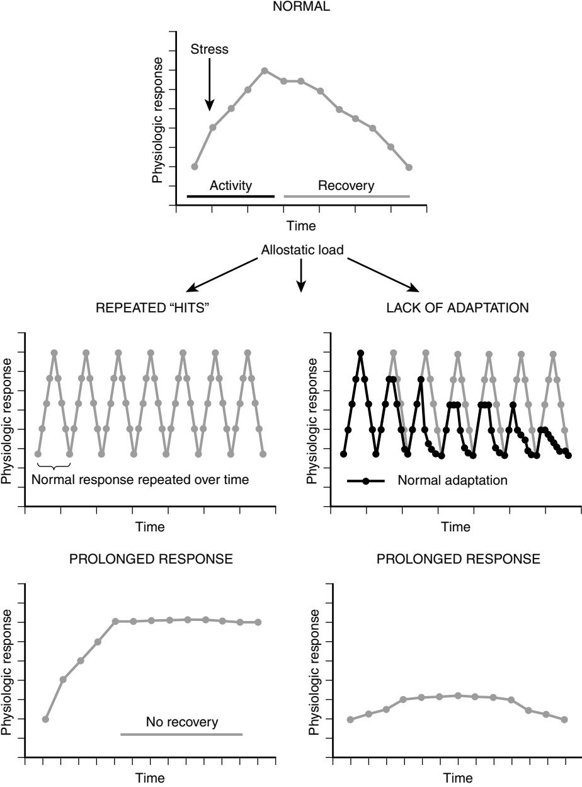
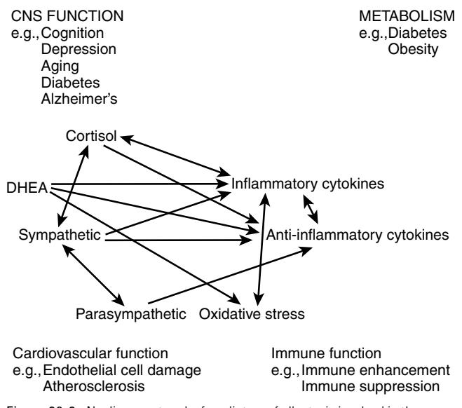
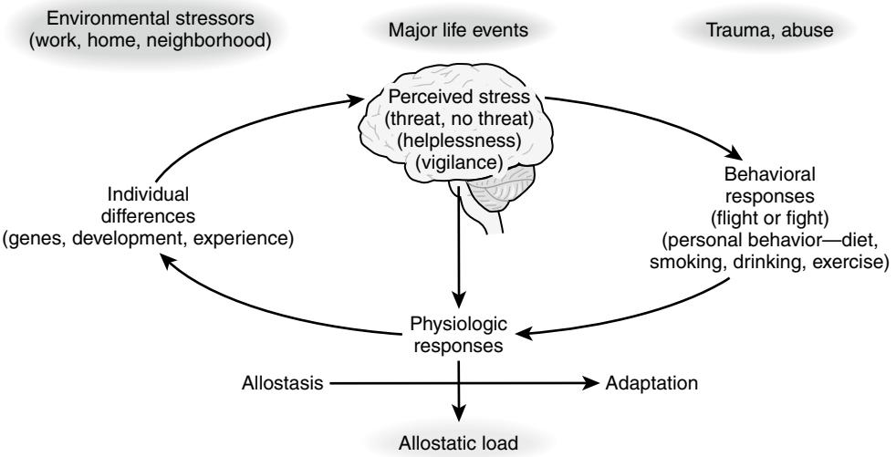

# Allostasis and Allostatic Overload in the Context of Aging

Bruce S. McEwen

# **INTRODUCTION**

"Stress" is often identified as a factor in accelerated aging1 and an important factor in disorders such as cardiovascular disease and depression, and a contributor to other disorders.2 Being "stressed out" is a commonly used word that generally refers to experiences that cause feelings of anxiety, anger, and frustration because they push a person beyond his or her ability to successfully cope. Besides time pressures and daily hassles at work and home, there are stressors related to economic insecurity, poor health, and interpersonal conflict. More rarely, there are situations that are life-threatening accidents, natural disasters, violence—and these evoke the classical "fight or flight" response. In contrast to daily hassles, these stressors are acute and yet they also can lead to depression, anxiety, posttraumatic stress disorder and other forms of chronic stress in the aftermath of the tragic event.

The most common stressors are, therefore, ones that operate chronically, often at a low level, and cause us to behave in certain ways. For example, being "stressed out" may promote anxiety or depressed mood, poor sleep, eating of comfort foods and overconsumption of calories, smoking, or drinking alcohol excessively. Being stressed out may reduce social interactions or regular physical activity. Not infrequently, anxiolytics and sleep promoting agents are used, but, with continuation of this state, the body may increase in weight, and develop metabolic dysregulation and atherosclerotic plaques.

The brain is the organ that decides what is stressful and determines the behavioral and physiologic responses, whether health promoting or health damaging. The brain is a biologic organ that changes under acute and chronic stress and directs many systems of the body—metabolic, cardiovascular, immune, renal—that are involved in the short and long-term consequences of being stressed out.

What does chronic stress do to the body and brain, particularly in relation to the aging process? This chapter summarizes some of the current information placing emphasis on how the stress hormones and related mediators can play both protective and damaging roles in brain and body, depending on how tightly their release is regulated, and it discusses some of the approaches for dealing with stress in a complex world.

# **DEFINITION OF STRESS, ALLOSTASIS, AND ALLOSTATIC LOAD**

"Stress" is an ambiguous term and the actual stress response has protective and potentially damaging effects3: On the one hand, the body responds to almost any novel or challenging event by releasing catecholamines that increase heart rate and blood pressure and help adapt to the situation. Yet, chronically increased heart rate and blood pressure produce a chronic wear and tear on the cardiovascular system that can result, over time, in disorders such as atherosclerosis, strokes, and heart attacks. For this reason, the term "allostasis" was introduced by Sterling and Eyer4 to refer to the active process by which the body responds to daily events and maintains homeostasis (*allostasis* literally means "achieving stability through change"). Because chronically increased allostasis can lead to disease, we introduced the term "allostatic load or overload" to refer to the wear and tear that results from either too much stress or from inefficient management of allostasis (e.g., not turning off the response when it is no longer needed). Other states that lead to allostatic overload are summarized in Figure 26-1 and involve not turning on an adequate response in the first place or not habituating to the recurrence of the same stressor, which then fails to dampen the allostatic response.3

## **PROTECTION AND DAMAGE AS THE TWO SIDES OF THE RESPONSE TO STRESSORS**

Thus protection and damage are the two contrasting sides of the physiology that defend the body against the challenges of daily life, whether or not we call them "stressors." Besides adrenalin and noradrenalin, there are many mediators that participate in allostasis, and they are linked together in a network of regulation that is nonlinear (Figure 26-2), meaning that each mediator has the ability to regulate the activity of the other mediators, sometimes in a biphasic manner. Glucocorticoids are the other major "stress hormones." Proinflammatory and anti-inflammatory cytokines are produced by many cells in the body, and they regulate each other and are, in turn, regulated by glucocorticoids and catecholamines. Whereas catecholamines can increase proinflammatory cytokine production, glucocorticoids are known to inhibit this production.5,6 The parasympathetic nervous system also plays an important regulatory role in this nonlinear network of allostasis since it generally opposes the sympathetic nervous system and, for example, slows the heart and also has anti-inflammatory effects.7,8

What this nonlinearity means is that when any one mediator is increased or decreased, there are compensatory changes in the other mediators that depend on time course and level of change of each of the mediators. Unfortunately, we cannot measure all components of this system simultaneously and must rely on measurements of only a few of them in any one study. Yet the nonlinearity must be kept in mind in interpreting the results.

# **MEASUREMENT OF ALLOSTATIC LOAD**

Measurement of allostatic load and overload involves sampling of key mediators that may be elevated in what are called "allostatic states"9 and markers of cumulative change such as abdominal fat. Allostatic states refer to the response profiles of the mediators themselves as shown in Figure 26-1. On the other hand, allostatic overload focuses on the tissues and organs and other end points that show the cumulative effects of overexposure to the mediators

Figure 26-1. Four types of allostatic load. The top panel illustrates the normal allostatic response, in which a response is initiated by a stressor, sustained for an appropriate interval, and then turned off. The remaining panels illustrate four conditions that lead to allostatic load: *top, left* repeated "hits" from multiple stressors; *top, right* lack of adaptation; *bottom, left* prolonged response due to delayed shut down; and *bottom, right* inadequate response that leads to compensatory hyperactivity of other mediators (e.g., inadequate secretion of glucocorticoid, resulting in increased levels of cytokines that are normally counter-regulated by glucocorticoids). *(From McEwen BS. Protective and damaging effects of stress mediators. N Engl J Med 1998;338:171–9.)*

of allostasis. These are done by collecting samples from subjects in a minimally invasive and cost-effective manner. This limits the choice to the circulating mediators, such as glucocorticoids, DHEA, catecholamines, and certain cytokines. Salivary assays are particularly attractive, but then the question arises as to how to sample over time to get an adequate representation of a dynamic system since the levels of the mediators may fluctuate during the day and night. This is a topic unto itself and has been the subject of a number of methodological studies (see Web site for MacArthur SES and Health Research Network: www.macses.ucsf.edu/). Table 26-1 contains a list of some end points that can be used for cumulative assessment of allostatic overload in different systems of the body. These are currently in use in the Coronary Artery Risk Development In Young Adults (CARDIA) Study and have been shown to have predictive power for a number of health outcomes.10–13

#### **BEING "STRESSED OUT," ESPECIALLY SLEEP DEPRIVATION AND ITS CONSEQUENCES**

The common experience of being stressed out has as its core the elevation of some of the key systems that lead to allostatic load—cortisol, sympathetic activity, and proinflammatory

Figure 26-2. Nonlinear network of mediators of allostasis involved in the stress response. Arrows indicate that each system regulates the others in a reciprocal manner, creating a nonlinear network. Moreover, there are multiple pathways for regulation (e.g., inflammatory cytokine production is negatively regulated via anti-inflammatory cytokines, and via parasympathetic and glucocorticoid pathways, whereas sympathetic activity increases inflammatory cytokine production). Parasympathetic activity, in turn, contains sympathetic activity. *(From McEwen BS. Protective and damaging effects of stress mediators: central role of the brain. Dialogues Clin Neurosci 2006;8:367–81.)*

#### **Table 26-1. Measurements of Allostatic States and Allostatic Overload in CARDIA Study**49–51

| Saliva: six saliva samples over 1 day assayed for cortisol Blood 1. Total and HDL cholesterol 2. Glycosylated hemoglobin             |  |
|-----------------------------------------------------------------------------------------------------------------------------------------------|--|
| 3. IL-6 4. CRP 5. Fibrinogen Other 1. Waist-hip ratio 2. Systolic and diastolic BP—seated/resting 3. Heart rate variability |  |

cytokines, with a decline in parasympathetic activity. Nowhere is this better illustrated than for sleep deprivation, which is a frequent result of experiencing a lot of stress. Sleep deprivation produces an allostatic overload that can have deleterious consequences, which are particularly evident in aging: for example, poor sleep in aging women has been associated with elevated levels of IL-6.14 Sleep restriction to 4 hours of sleep per night increases blood pressure, decreases parasympathetic tone, increases evening cortisol and insulin levels, and promotes increased appetite, possibly through increases in ghrelin and decreases in leptin.15–17 Proinflammatory cytokine levels are increased, along with performance in tests of psychomotor vigilance, and this has been reported to result from a modest sleep restriction to 6 hours per night.18 Moreover, reduced sleep duration has been reported to be associated with increased body mass and obesity in the NHANES study.19 Sleep deprivation also causes cognitive impairment.15

## **KEY ROLE OF THE BRAIN IN RESPONSE TO STRESS**

The brain is the master regulator of the neuroendocrine, autonomic, and immune systems, along with determining behaviors that contribute to unhealthy or healthy lifestyles, which, in turn, influence the physiologic processes of allostasis.3 See Figure 26-3. Alterations in brain function by chronic stress can therefore have direct and indirect effects on the cumulative allostatic overload. Allostatic overload resulting from chronic stress in animal models causes atrophy of neurons in the hippocampus, prefrontal cortex, brain regions involved in memory, selective attention, and executive function, and hypertrophy of neurons in the amygdala, a brain region involved in fear, anxiety, and aggression.15 Thus the ability to learn, remember, and make decisions may be compromised by chronic stress and may be accompanied by increased levels of anxiety and aggression. A recent study has shown increased reactivity of the amygdala to neutral facial expressions, indicating an increase in anxiety and reactivity, resulting from a few days of sleep deprivation.20

# **TRANSLATION TO THE HUMAN BRAIN**

Much of the impetus for studying the effects of aging and stress on the structure of the human brain has come from the animal studies summarized elsewhere.15 Age-related reductions in entorhinal and hippocampal volume have been associated with mild cognitive impairment and early stages of Alzheimer's disease, and a longitudinal study of aging Montreal residents revealed a smaller hippocampus and impaired hippocampal spatial and memory functions in those who showed rising cortisol levels during a yearly examination.21 Although it is not possible to pinpoint causal factors in these age-related changes, stress and glucose regulation, along with depression and other mood and anxiety disorders, must be considered.

Regarding stress, although there is very little evidence regarding the effects of ordinary life stressors on brain structure, there are indications from functional imaging of individuals undergoing ordinary stressors (such as counting backwards) that there are changes in neural activity.22 There are also long-term effects (e.g., chronic transcontinental air travel with short turnaround time, a type of chronic stress is associated with a smaller hippocampus,23 and a 20-year history of high perceived stress has been associated with smaller hippocampal volumes).24

Stress causes depressive illness in individuals with certain genetic predispositions,15,25 and the hippocampus, amygdala, and prefrontal cortex show altered patterns of activity in PET and fMRI and changes in volume: decreased volume of hippocampus and prefrontal cortex and amygdala, although amygdala volume has been reported to increase in the first episode of depression, whereas hippocampal volume is not decreased.26

There is hippocampal volume loss in Cushing's disease along with cognitive impairment and depressed mood that can be relieved by surgical correction of the hypercortisolemia.27 Moreover, there are a variety of other anxiety-related disorders, such as posttraumatic stress disorder (PTSD) and

Figure 26-3. Central role of the brain in allostasis and the behavioral and physiologic response to stressors. *(From McEwen BS. Protective and damaging effects of stress mediators. N Engl J Med 1998;338:171–9.)*

borderline personality disorder, in which there is atrophy of the hippocampus.15 Another important factor in hippocampal volume and function is glucose regulation. Poor glucose regulation is associated with smaller hippocampal volume and poorer memory function in individuals in their 60s and 70s who have "mild cognitive impairment" (MCI),28 and in those with frank type 2 diabetes.29

#### **POSITIVE AFFECT, SELF-ESTEEM, AND SOCIAL SUPPORT**

Having a positive outlook on life and good self-esteem appear to have long-lasting health consequences,30 and good social support is also a positive influence on the measures of allostatic load.31 Positive affect, assessed by aggregating momentary experiences throughout a working or leisure day, was found to be associated with lower cortisol production and higher heart rate variability (showing higher parasympathetic activity), and a lower fibrinogen response to a mental stress test.32

On the other hand, poor self-esteem has been shown to cause recurrent increases in cortisol levels during a repetition of a public speaking challenge in which those individuals with good self-esteem are able to habituate (i.e., attenuate their cortisol response after the first speech).33 Furthermore, poor self-esteem and low internal locus of control have been related to 12% to 13% smaller volume of the hippocampus in both younger and older subjects, and higher cortisol levels during a mental arithmetic stressor.34

Related to both positive affect and self-esteem is the role of friends and social interactions in maintaining a healthy outlook on life. Loneliness, often found in people with low self-esteem, has been associated with larger cortisol responses to wakening in the morning and higher fibrinogen and natural killer cell responses to a mental stress test, and sleep problems.35 On the other hand, having three or more regular social contacts, as opposed to 0 to 2 such contacts, is associated with lower allostatic load scores.31

#### **DELETERIOUS ROLE OF ADVERSE EARLY LIFE EXPERIENCE**

The aging process begins at conception, and experiences early in life have a profound influence on the quality and length of life. Early life experiences perhaps carry an even greater weight in terms of how an individual reacts to new situations.15 For example, adverse early life experiences involving physical and sexual abuse carry with it a life-long burden of behavioral and pathophysiologic problems, and cold and uncaring families produce long-lasting emotional problems in children. These adverse experiences impact upon brain structure and function and the risk for later depression and posttraumatic stress disorder.36,37

#### **CONCLUSIONS**

Because environmental factors and experiences play a large role in the aging process, understanding and manipulating those factors can reduce the accumulation of allostatic overload. There are a number of approaches to deal with stress and allostatic overload as they affect the life course and affect health later in life. For the individual, these include lifestyle, personal habits, and pharmaceutical agents. For society, there are policies of government and the private sector.

For the individual, life-long habits may be hard to change, and it is often necessary to turn to pharmacologic interventions: sleeping pills, anxiolytics, β-blockers, and antidepressants are all drugs that are used to counteract some of the problems associated with the accumulation of allostatic overload. Likewise, drugs that reduce oxidative stress or inflammation, block cholesterol synthesis or absorption and treat insulin resistance or chronic pain can help deal with the metabolic and neurologic consequences of being chronically stressed out. All of these agents have value, and yet each one has side effects and limitations that are based in part on the fact that all of the systems that are dysregulated in allostatic overload are also systems that interact with each other and perform normal functions when properly regulated, as described in Figure 26-2. Because of the nonlinearity of the systems of allostasis, the consequences of any pharmaceutical treatment may be either to inhibit the beneficial effects of the systems in question or to perturb other systems in a direction that promotes an unwanted side effect. Examples of the former include the problems with cox 2 inhibitors38 and examples of the latter include the obesity-inducing effects of some of the atypical antipsychotics that are widely used to treat schizophrenia and bipolar disorder.39

The private sector has a powerful role, and businesses that encourage healthy lifestyle practices among their employees are likely to gain reduced health insurance costs and possibly a more loyal workforce.40,41 Moreover, governmental policies are important, and the Acheson Report42 from the United Kingdom in 1998 recognized that no public policy should be enacted without considering the implications for health of all citizens. Thus basic education, housing, taxation, setting of a minimum wage, and addressing occupational health and safety and environmental pollution regulations are all likely to affect health via a myriad of mechanisms. At the same time, providing higher quality food and making it affordable and accessible in poor and affluent neighborhoods, is necessary for people to eat better, providing they also learn what types of food to eat and can afford them. Likewise, making neighborhoods safer and more congenial and supportive43 can improve opportunities for positive social interactions and increased recreational physical activity. For the elderly population, community centers and activities that promote social interactions and physical activity have been demonstrated to be beneficial.44,45

Finally, there are programs that combine some of the key elements just described, namely, education, physical activity, and social support, along with one other ingredient that is hard to quantify: namely, finding meaning and purpose in life. One example is the Executive Volunteer Corps and another is the Experience Corps, which takes elderly volunteers and trains them as teachers' assistants for younger children in the neighborhood schools.46 Not only does this program improve the education of the children, it also benefits the elderly volunteers and improves their physical and mental health.47 Thus finding ways of improving the social and physical environment in which people live their lives should reduce the need for more direct medical and psychiatric interventions for everyone, particularly the elderly.

#### KEY POINTS Allostasis and Allostatic Overload in the Context of Aging

- Events of daily life can produce the feeling of being "stressed out" and elevate and sustain activities of physiologic systems and promote health damaging behaviors and poor sleep.
- Accumulated over time, this results in wear and tear on the body, which is called "allostatic load/overload." This accumulated wear and tear reflects not only the impact of experiences, but also genetic constitution, individual behaviors and lifestyle habits, and early life experiences that set life-long patterns of behavior and physiologic reactivity.
- Hormones and other mediators associated with stress and allostatic overload protect the body in the short run and promote adaptation by the process known as allostasis.
- The brain is the key organ of stress, allostasis, and allostatic overload because it determines what is threatening and therefore stressful, and also determines the physiologic and behavioral responses. Brain regions such as the hippocampus, amygdala, and prefrontal cortex respond to acute and chronic stress by undergoing structural remodeling, which alters behavioral and physiologic responses.
- Imaging studies of the human brain show smaller hippocampal volume in mild cognitive impairment in aging, Type 2 diabetes and prolonged major depressive illness, and in individuals with low self-esteem. Structural and functional alterations in amygdala and prefrontal cortex are also reported.
- Besides pharmaceutical agents, approaches to alleviate chronic stress and prevent diseases related to allostatic overload include changes in personal habits and lifestyle, and policies of government and business that would improve the ability of individuals to reduce their own chronic stress burden as they become older.

For a complete list of references, please visit online only at www.expertconsult.com