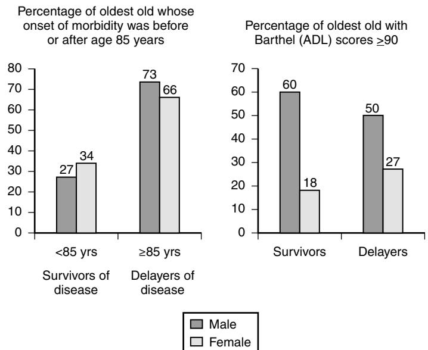

# Successful Aging: The Centenarians

# **Demography of centenarians**

According to the United States Social Security Administration, in 2006 approximately 40,000 people age 100 years and older collected Social Security benefits. On the other hand, the U.S. census reported 50,000 centenarians for the year 2000.1 Thus, in the United States, there can be substantial variation in the reported prevalence of centenarians. Suffice it to say that centenarians are relatively rare, somewhere in the range of 1 to 2 per 10,000 in the United States. Although the growth of centenarians has been noted to be the fastest of any age group, that growth appears to be slowing to about 4% in the United States.2

Other countries note similar findings. Scotland recently reported 680 centenarians for 2006, for a population of 5,116,9003; a rate of approximately 1 centenarian per 7500 people. The Scottish report also noted that the relative prevalence of male centenarians was rising, from 10% of centenarians in 2002, to 12.5% in 2006. In 2000, in the United States, male prevalence among centenarians was 14.1%.2 In England plus Wales, centenarians have been noted to be the fastest growing age group since the 1950s. Since 2002, the annual growth rate is 5.8% according to a 2007 report.4 In Canada, in 2006, there were 4635 people age 100 years and older or 1.5 centenarians per 10,000 in the population.5 Statistics Canada states that the highest centenarian prevalence is in Japan, where there were 29,000 centenarians in 2006, a rate of about 2.3 centenarians per 10,000 people.5

#### **Definitions of healthy aging**

In the New England Centenarian Study (http://www.bumc .bu.edu/centenarian), we study centenarians and their family members primarily because of our long-held belief that these individuals are a model of successful aging. By determining exposure and genetic factors that are more or less common compared to other groups, we should be able to determine risk factors for premature versus healthy aging and to formulate strategies that enhance a person's ability to compress their disability toward the end of a longer life. An important question to ask, however, is: are centenarians and/or their family members in fact models of successful or healthy aging?

The answer depends upon the definition of successful or healthy aging, which geriatricians and gerontologists continue to grapple with. In a very helpful attempt at dealing with this issue, Depp and Jeste looked at various components of 29 different definitions of successful aging from 28 studies. For 26 of these definitions, the predominant feature was being disability-free.6 Robine and Michel have also stressed the importance of quality of life and sense of well-being in considering a definition.7

Of factors important in successful aging, they stress the impact of genetics, environment, economics, and culture over the life span.7 Crimmins notes the importance of allostatic load (the cost of compensating for and adapting to stressors) upon a person's ability to age well.8,9 The ability Thomas T. Perls

to deal with stressors and more generally age-related diseases leads to the as-of-yet poorly defined notions of adaptive capacity, functional reserve, and resilience, which may be important distinguishing features in the ability to achieve exceptional old age.10

Based upon their ability to compress disability toward the end of their lives, we believe, at least retrospectively, that centenarians are a human model of healthy aging (based upon disability prevalence). Early on in our study of approximately 50 centenarians, we noted that approximately 90% of the centenarians in a population-based study were functionally independent at the average age of 92 years.11 We subsequently also noted that a number of centenarians were compressing their disability well into their 90s while noting a long history of age-related disease(s). Christensen et al longitudinally studied Danish nonagenarians from the 1905 birth cohort from 1998 to 2005, quantifying at multiple time points their cognitive and physical function. Over this time period, the proportion of functionally independent individuals, beginning at 39% and ending at 32%, remained fairly stable.12 Their results suggest that functional independence is an important marker of future survival at very old ages. From these and other studies, disease prevalence in some older individuals might not be a reliable marker of disability.

## **DISTINGUISHING BETWEEN COMPRESSION OF MORBIDITY AND COMPRESSION OF DISABILITY AND THE ROLE OF RESILIENCE (FUNCTIONAL RESERVE AND ADAPTIVE CAPACITY)**

Many centenarians do not compress their illnesses (morbidity) toward the end of their lives. Approximately 45% have sustained some chronic age-related illness before age 80 years, 42% develop such a disease after the age of 80, and about 13% remain disease-free at age 100; we have termed these groups respectively, survivors, delayers, and escapers.13 The Tokyo and Greek centenarian studies recently determined a similar prevalence of escapers in their study.14,15

Despite the fact that most centenarians do not compress their morbidity, we suspected from our previous work that most, nonetheless, compress their disability. We therefore hypothesized that compression of disability, perhaps more so than morbidity, is an important marker and determinant of exceptional longevity.16 To investigate this hypothesis, Lara Terry led the analysis of disease and functional status history from 523 women and 216 men ages 97 years and older. Subjects were divided into those who developed agerelated diseases (chronic obstructive pulmonary disease, dementia, diabetes, heart disease, hypertension, osteoporosis, Parkinson disease, and/or stroke) at or before the age of 85 years (termed "survivors") and those who developed any of these diseases after the age of 85 (termed "delayers"). We then also classified these individuals according to their lastassessed functional status (e.g., at age 97 years old or older).

Figure 30-1. A group of 523 women and 216 men age greater than 97 years were studied retrospectively for age of onset for age-related diseases, and at the time of interview, their current level of function. Left panel: Frequency of men and women whose age of onset of age-related diseases was before age 85 years ("survivors" of disease) or at 85 years or older ("delayers" of disease). Right panel: Frequency of male and female survivors and delayers who at the time of interview (age *>*97 years) were independently functioning.

Overall, 32% of the subjects were survivors and 68% were delayers. Further results are depicted in Figure 30-1. As the first panel reveals, the majority of these very old subjects were delayers of disease (73% of males and 66% of females), and 27% of males and 34% of females were survivors of disease. In the second panel of Figure 30-1, we see that despite being survivors of disease, 60% of the males were independently functioning at age 97 years or older. On the other hand, just 18% of the female survivors were independently functioning. Among the disease delayers, 50% of the males and 27% of the females were independently functioning at age 97 years or older.

Therefore, it is remarkable that whereas many people have significant morbidity and mortality associated with numerous age-related diseases, the above centenarian survivors and delayers have a resilience (or functional reserve or adaptive capacity) that allows them to not only live to extreme old age, but to do so while compressing their disability until very old age. Quantifying and understanding the underlying determinants and mechanisms of this resilience should be an important priority in the study of healthy aging and exceptional survival.

# **The gender disparity**

As seen in the second panel of Figure 30-1, male centenarians tend to have significantly better functional status than their female counterparts. The fact that male centenarians more frequently have better physical and cognitive function than their female counterparts has been noted in most centenarian studies, most notably the Italian Centenarian Study.12 It might first seem paradoxical that male centenarians fare better than female centenarians, the females outnumber the males approximately 8:1. The female survival advantage begins at around age 50, when men generally begin to experience

particularly vascular-related diseases such as myocardial infarction and stroke, whereas women delay the clinical expression of these diseases by 10 or so years, until their 60s to 70s. A plausible hypothesis for why male centenarians fare better is that only those who are functionally independent are able to achieve such extreme old age. Women on the other hand appear to be able to survive with age-related diseases more readily and thus experience the double-edged sword of being able to live longer while also more frequently living with age-related illnesses and disability. This hypothesis is supported by findings in the above- cited Danish study in which 38% of males at age 98 years were functionally independent but then this proportion rose to 53% among 100-year-olds.12 The proportion of women who were independent, how ever, continued to fall, from 30% of 98-year-olds to 28% of 100-year-olds. The most obvious explanation for these trends would be a selection phenomenon among the men, where the frail die, leaving behind a cohort of exceptionally fit survivors. The other paradox I would mention here is that while the male centenarians might be exceptionally fit relative to the females, it would appear that they still have higher age-related disease associated mortality rates, so that once they do develop a disease, such as dementia or stroke, their mortality risk probably is much higher than it might be for women. Such hypotheses point to the possibility that women are much more resilient than men with regards to aging and age-related diseases.

# **Heritability and familiality of exceptional longevity**

Twin studies demonstrate that only 20% to 30% of life expectancy is genetic, whereas 70% to 80% of the variation is due to environment, behavior, and luck.18,19 Epidemiologic studies such as the Seventh Day Adventist Health Study also suggest that the majority of variation around average life expectancy is due to people's health behaviors. Fraser and Shavlik found that the healthy behaviors dictated by the Seventh Day Adventist religion (e.g., no tobacco or alcohol use, regular exercise, vegetarian diet, emphasis of time spent with faith and family) can explain a 10-year advantage in life expectancy.20 If average life expectancy in developed countries is approximately 78 to 80 years, then one might optimistically expect that most people, if they were to emulate the behaviors of Seventh Day Adventists, should be able to live to 88 to 90 years.

If optimal health behaviors can get people to age 90 years, then one must assume that genetics and luck come into play in achieving even older ages. A number of studies suggest that genetic variation might play an increasingly important role at the oldest ages (e.g., greater than age 90 years), which should be encouraging for the potential discovery of genetic determinants of exceptional longevity.21–24 Such a genetic advantage likely takes the form of lacking variations that increase risk for premature mortality and more controversially, also variations that slow down the rate of aging and decrease the risk for age-related diseases.25,26

We have observed a marked predisposition of the siblings of centenarians to also achieve exceptional longevity.27,28 The children of centenarians appear to be very much following in the footsteps of their parents with 50% to 60% reduced rates of cardiovascular disease, stroke, diabetes, hypertension, and cancer compared with the children of parents that belonged to the same birth cohort as the centenarians but who died at average life expectancy.29,30 Furthermore, already in the septuagenarian years, the centenarian offspring experience 20% reduced mortality rates compared with the referent cohort.31 Barzilai et al noted that both centenarians and their children, more frequently than their referent cohort (the spouses of the offspring), had large high- and low-density lipoprotein (HDL and LDL) particle size, which is associated with lower cardiovascular disease risk. This phenotype was associated with a higher frequency in both generations of a specific variation of the cholesteryl ester transfer protein (CETP) gene.32

#### **Supercentenarians**

Supercentenarians, who are people age 110 years and older, were virtually unheard of before 1960. Currently there are approximately 70 such individuals in the United States and approximately 300 worldwide. Over the past 10 years, we have enrolled enough supercentenarians to name a new study, The New England Supercentenarian Study (http://www.bumc.bu.edu/supercentenarian). The oldest supercentenarian whose age has been well validated was Jeanne Calment, who died at the age of 122 years in 1997. Even older claimed ages are immediately suspect and often come from less developed countries where such old vital records are either nonexistent or unreliable and there is secondary gain for claiming such ages.

Supercentenarians appear to be different in terms of their resilience and the ability to live with age-related diseases that are normally associated with increased mortality risk. In our case series review of the medical histories of 32 supercentenarians, we found cardiovascular disease, diabetes, and hypertension to be very rare (<3%).33 Stroke was a bit more common at 10%, but this is still remarkable given the ages of these subjects. Cancer, though, was unexpectedly frequent, with 25% reporting a cancer history. We also found that 41% of the subjects required only minimal assistance or were independently functioning. Thus, the supercentenarians, 90% of whom are women, are similar to male centenarians in terms of probably lacking functional reserve to deal with an age-related disease and therefore once such a disease becomes clinically evident, the mortality risk is very high. The cancer history is interesting, particularly given the well-known interplay between mechanisms of aging and of cancer.34 Anecdotally we have found extremely old individuals who present with unusually large tumors that have not metastasized. We suspect that cancers and their ability to spread behave quite differently in the extreme old compared with people of younger ages and this represents another important avenue of further research.

## KEY POINTS

Successful Aging: The Centenarians

- Centenarians are among the fastest growing age groups in developed countries. Much of this growth is due to the few number of centenarians before 1960, major improvements in public health measures throughout the early to mid 1900s, and marked improvements in the health of people age 80 and older.
- Whereas the compression of both morbidity and disability are essential features of survival to old age for some centenarians, for others, the compression of disability alone may be the key prerequisite. Functional status and not necessarily the presence of disease, and certainly not age alone, are important factors to consider in assessing a person's prognosis.
- Although far fewer in number, male centenarians tend to have significantly better cognition and physical function than their female counterparts.
- Exceptional longevity runs strongly in families and the importance of genetic factors in achieving older age might increase at the most extreme ages.

For a complete list of references, please visit online only at www.expertconsult.com