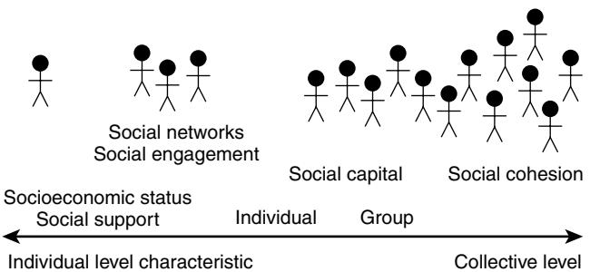

# Social Vulnerability in Old Age

Melissa K. Andrew

People's lives are embedded in rich social contexts; many social factors impact on each of our lives every day. This is perhaps more noticeably so for older adults as declines in health and functional status may increase reliance on social supports and diminish opportunities for social engagement, even in the face of social circles dwindling due to declining health and function among peers.

This chapter will provide an overview of how social factors affect health in old age, through a discussion of the concept of *social vulnerability*. The association with health outcomes relevant to geriatric medicine (including function, mobility, cognition, mental health, self-assessed health, frailty, institutionalization, and death) will be the focus, with particular emphasis on the relationship between social vulnerability and frailty. Detailed discussion of social gerontology and of standardized instruments and measurement scales used in the social assessment of older people is beyond the scope of this chapter; interested readers are referred to the two chapters on these topics in this volume.

## **BACKGROUND AND DEFINITIONS**

Many social factors influence health, including socioeconomic status, social support, social networks, social engagement, social capital, and social cohesion.1–8 As such, the social context is key to a broad understanding of health and illness. Perhaps due in part to the numerous disciplines in which this line of inquiry has been investigated (including epidemiology, sociology, geography, political science, and international development, among others), terminology and methods of approach have differed. In some instances, the same terminology has been used to refer to different ideas, whereas in others, divergent terminology obscures underlying commonalities. There has also been debate surrounding the level, from individual to communal, at which some elements of the social context are relevant, and as such, how they can be measured.1,9,10 In the following section, the various terms and concepts will be defined and discussed, and each will be placed in context on the continuum from individual to group influence (Figure 33-1).

#### **Socioeconomic status**

Socioeconomic status (SES) is a broad concept that includes such factors as educational attainment, occupation, income, wealth, and deprivation. There are three broad theories of how socioeconomic status might relate to health.11 The materialist theory states that gradients in *income and wealth* are associated with varying levels of deprivation, which in turn affects health status as those with fewer means have inferior access to health care and the necessities of life. Another view is that *education* influences health through lifestyle and health-related behaviors such as diet, substance use, and smoking. A third theory sees social status (often measured by *occupation*) and personal autonomy as key influences on health, particularly through the stresses that accompany

Figure 33-1. The continuum of social factors that influence health, acting from individual to group levels.

low social status and low autonomy.11 Measurement of each of these elements of SES may present difficulties in the older adult population. Older persons are likely to be retired and older women may never have worked outside the home, making occupational assessments problematic. Income is associated with employment status, and many income supplements and benefits are available to those with disability and poor health raising problems of reverse causation.11 Educational opportunities available to older cohorts may have been limited, creating a "floor effect" in which it is difficult to differentiate among the majority whose educational attainment is low.11 Additionally, information may be missing when a proxy respondent has been used, depending on how well the proxy knows the subject. Socioeconomic status is a property of individuals; however, aggregates of such measures can be used to describe the social context in which people live. For example, average income, employment rates, or educational attainment may be useful descriptors when applied to groups of people living in relevant geographic areas such as housing facilities or neighborhoods, and may allow for study of contextual effects on health.12–18

### **Social support**

Social support refers to the various sources of help and resources obtained through social relationships with family, friends, and other care providers. Types of social support include emotional (including the presence of a close confidante), instrumental (help with activities of daily living, provided through labor or financial support), appraisal (help with decision making), and informational (provision of information or advice).19 Various measures of social support have been studied, with some tending to be more "objective" (based on reports of actual use of services and tangible help received in the various domains) and others more "subjective," based on the individual's perception of the adequacy and richness of the supports to which they have access. Social support can also importantly be seen as a two-way transaction, with the older person receiving support in some areas while providing support in others. For example, within spousal relationships each spouse may have complementary strengths and weaknesses; between generations, older people may provide care for grandchildren and financial support for adult children, while receiving instrumental support.20

## **Social networks**

Social networks are the ties that link individuals and groups in social relationships. Various characteristics can be measured, including size, density, relationship quality, and composition.1 Both social networks and social support are generally seen as individual-level resources, and are measured at an individual level.3,19,21 Through social networks, individuals can access social support, material resources, and various other forms of capital (cultural, economic, and social).22

## **Social engagement**

Social engagement represents an individual's participation in social, occupational, or group activities, which may include formal organized activities such as religious meetings, service groups, and clubs of all sorts. More informal activities such as card groups, trips to the bingo hall, and cultural outings to see concerts or galleries can also be considered as social engagement. Volunteerism is often considered separately,1 but can also be seen as an important measure of social engagement.

## **Social capital**

Social capital is a broad term which has been used inconsistently in the literature, and there is ongoing debate about its nature and measurement. For example, Bourdieu defines social capital as "the aggregate of the actual or potential resources which are linked to possession of a durable network of more or less institutionalized relationships."22 His definition is consistent with the idea that social capital is a resource that can be accessed and measured at an individual level, stating that "the volume of social capital possessed by a given agent thus depends on the size of the network of connections he can effectively mobilize and the volume of the capital … possessed by each of those to whom he is connected."22 However, his definition is also consistent with the view that social capital is a *property* of the relationships within the network—if there are no connections between individuals, there would be no social capital. Coleman makes a similar argument, stating, "Unlike other forms of capital, social capital inheres in the structure of relations between actors and among actors. It is not lodged either in the actors themselves or in the physical implements of production."23 He also sees social capital as a resource accessible by individuals, writing, "social capital constitutes a particular kind of resource available to an actor."23

Putnam defines social capital as "the features in our community life that make us more productive—a high level of engagement, trust, and reciprocity"24 and sees it as "simultaneously a 'private good' and a 'public good' "with both individual and collective aspects.25 To access the "private good" benefits of social capital, an individual would need to be integrated into a network and have direct connections with other members. But the "public good" effects of social capital would accrue to everyone in the community, regardless of their personal connections to others. The "public good" concept of social capital is shared by others, including Kawachi et al, who see social capital as an ecologic level characteristic that can only properly be measured at a collective level, and state that "social capital inheres in the structure of social relationships; in other words it is an ecologic characteristic," which "should be properly considered a feature of the collective (neighborhood, community, society) to which an individual belongs."3,14,21,26

Measures of social capital are as varied as its definitions, and include both structural elements (such as social networks, relationships, and group participation) and cognitive ones (such as trust in others, voting behavior, newspaper subscription, feelings of obligation, reciprocity and cooperation, and perceptions of neighborhood security).1,10,23

# **Social cohesion**

The concept of social cohesion implies collectivity of definition and measurement. Again, definitions vary, but generally relate to ideas of cooperation and ties that unite communities and societies. For example, Stansfeld defines social cohesion as "the existence of mutual trust and respect between different sections of society."27 For Kawachi and Berkman, social cohesion relies on two key features of a society: absence of social conflict and presence of social bonds.3

## **Social isolation**

Social isolation is another term that is encountered in the literature relating social circumstances and health. It is related to ideas of loneliness, reduced social and religious engagement, and reduced access to social supports. It may also incorporate properties of the older person's environment, such as difficulty with transportation. As with many other social factors, social isolation can be "subjective" (as perceived by the older person themselves, e.g., loneliness) or "objective" (based on outside measures or assessments by others).

## **Social vulnerability**

The concept of social vulnerability addresses the understanding that the reason we are interested in the social environment is not merely as a descriptor, but to attempt to quantify an individual's relative vulnerability (or resilience/ invulnerability) to perturbations in their environment, social circumstances, health, or functional status. Older people's social circumstances are complex, with multiple factors that may interact in potentially unforeseen ways. A global measure of social vulnerability would thus account for this complexity while providing descriptive and predictive value. A measure of social vulnerability should be broad enough to capture a rich description of the social deficits (or problems) that an individual has, be readily and practically measurable in population and clinical settings, be responsive to meaningful changes, and be predictive of important health outcomes.

## **HOW CAN WE STUDY SOCIAL INFLUENCES ON HEALTH?**

Study of how social factors influence health requires careful consideration of analytic design in relation to the specific questions being asked (Table 33-1).

Possible approaches include traditional "one thing at a time" analyses in which a single social factor (for example, the social network) is related to the outcome of interest, ideally adjusting for possible confounders in a multivariable model. This approach has certain benefits, chief among them simplicity and clarity in execution and interpretation. For example, it allows for clear statements of important findings such as "An extensive social network seems to protect against dementia."28 This approach can be done using single variables considered individually, a combination of variables relating to different aspects of the same theme (e.g., several

#### **Table 33-1. Analytic Approaches for Studying Social Influences on Health**

| Analytic Approach                                                                                                | Benefits                                                                                                                                                                                                                                                                                                                                                                                 | Drawbacks                                                                                                                                                                 |
|------------------------------------------------------------------------------------------------------------------|------------------------------------------------------------------------------------------------------------------------------------------------------------------------------------------------------------------------------------------------------------------------------------------------------------------------------------------------------------------------------------------|---------------------------------------------------------------------------------------------------------------------------------------------------------------------------|
| "One Thing at a Time"                                                                                            |                                                                                                                                                                                                                                                                                                                                                                                          |                                                                                                                                                                           |
| Single variables considered individually (e.g., size of the social network)                                | Simple and clear execution and interpretation                                                                                                                                                                                                                                                                                                                                         | May result in overly simplistic understanding of associations                                                                                                          |
| Combination of variables relating to the same theme (e.g., several variables describing social network) | Allows simultaneous investigation of several variables, adjusting for one another and for relevant confounders                                                                                                                                                                                                                                                                     | • Validity considerations must be addressed • Models may become too complex with technical challenges (e.g., colinearity)                                           |
| Validated measurement instrument (e.g., Lubben Social Network Scale)                                          | Use of standardized and validated instruments enhances reliability and validity                                                                                                                                                                                                                                                                                                    | • Lengthy administration time • Rigidity • Use may be limited with existing datasets if difficult to reconstruct faithfully                                      |
| "Many Things at Once"                                                                                            |                                                                                                                                                                                                                                                                                                                                                                                          |                                                                                                                                                                           |
| Index approach: deficit accumulation (e.g., social vulnerability index, frailty index)                     | • Takes many aspects of social circumstances into account simultaneously • Does not rely on use of single variables, which may present measurement challenges in some older people • Related factors are not arbitrarily separated • Allows representation of gradations in exposure • Potential applicability to most datasets and clinical situations | • Represents risk relating to composite social circumstance rather than single identifiable factors in isolation • Complex modeling based on novel techniques |
| Options for Studying the Social Context                                                                          |                                                                                                                                                                                                                                                                                                                                                                                          |                                                                                                                                                                           |
| "Horizontal" analyses (e.g., multivariable regression modeling)                                               | Simple and clear execution and interpretation                                                                                                                                                                                                                                                                                                                                         | • May not provide a full understanding of the social context • Technical problems for models: observations not really independent                                |
| "Vertical" analyses (e.g., multilevel modeling, hierarchical linear modeling)                              | • Yields more detailed understanding of contextual effects • Preserves independence of observations • Avoids loss of meaning due to data aggregation                                                                                                                                                                                                                         | • Not all datasets lend themselves to these models; need sufficient numbers in groups with shared characteristics • Complex models                               |

variables that relate to the size and quality of the social network), or set instruments that have been previously validated to measure the social factor of interest (e.g., the Berkman-Syme Social Network Index and the Lubben's Social Network Scale).29 The standardized psychometric properties of such scales add to the reliability and validity of studies that employ them, but their use does have drawbacks including relative rigidity and lengthier administration time. Their use may also be limited or impossible with existing datasets due to challenges encountered in their faithful reconstruction.

Deficit accumulation offers another potential approach to the study of social influences on health. Akin to the frailty index, which readers will find described elsewhere in this volume, a *social vulnerability index,* operationalized as a count of deficits relating to many social factors, offers a means of considering an individual's broad social circumstance and the potential vulnerability of their health and functional status. The index has a number of benefits, including: (1) the potential to include many different categories of social factors (for example SES, social support, social engagement, social capital), (2) the commonly encountered difficulty of embodying social and socioeconomic characteristics using single variables in studies of older adults is alleviated by including consideration of multiple different factors, (3) related factors are not arbitrarily separated into distinct categories for separate analysis, and (4) representation of gradations in social vulnerability is improved compared with consideration of one or a few binary or ordinal social variables. This last point is particularly important given that studies using the social vulnerability index in two cohorts of older adults have found that no one was completely free of social vulnerability (i.e., no individual had a "zero" score on the index).30

In addition to these analytic considerations of how the social factor(s) of interest is/are measured, incorporating the social context into the analyses can be done in different ways. More traditional "horizontal" approaches might add a summary variable that describes the individual's social context (e.g., mean neighborhood income or educational attainment) as a variable/confounder attached to the individual in the multivariable model.16,17 This approach can yield useful findings and has the advantage of simplicity, but some might argue that it does not provide a full understanding of the importance of the contextual variable(s) and it presents statistical problems in terms of independence of observations (individuals are no longer truly independent if they share these important characteristics of the groups to which they belong). Multilevel (or "vertical") modeling (e.g., hierarchical linear modeling) is another option; here, the individual is nested within layers of group influence, with collective characteristics treated as attributes of the group rather than of the individual.31 This approach offers the advantage of allowing for more detailed understanding of the contextual effects, preserving the independence of observations, and not losing information as happens when data are aggregated.31

The consideration of contextual or group-level variables such as neighborhood and community characteristics is particularly relevant to the study of how social factors affect health because many social factors are properties of the groups or communities in which individuals live and may be best measured on a group level. As we have seen, there is active debate about whether social capital is a property of individuals or of groups.1,9 Most theories of social capital are consistent with the idea that it is a property of relationships between individuals and within societies rather than residing within individuals per se. The heart of the issue that continues to divide theorists is whether social capital is a resource that an individual can be said to draw upon, and thus, in practical research terms, whether or not it can legitimately be measured at an individual level. This debate has clear implications for the design and interpretation of research studies that aim to investigate how social factors influence health; valid and useful findings can rest only on sound theoretical foundations. In this regard, a second distinction may be helpful: the answer may depend on whether the question applies to *where social capital exists* (is it a property of individuals or of relationships?) or to *how it is measured and accessed*. 9 Practically speaking, measurement issues and data availability may strongly influence analytic design. The issue of how social factors should be studied in relation to older adults' health is therefore ideally guided by a balance of these theoretical considerations and analytic pragmatism.

#### **SUCCESSFUL AGING**

This concept has been the subject of numerous inquiries in both the academic literature and the popular press.32 Interested readers are referred to the comprehensive chapter by T. A. Glass in the sixth edition of this text.33 Definitions of successful aging vary, but generally fall into psychosocial and biomedical camps. Psychosocial conceptualizations emphasize compensation and contentedness, where biomedical definitions are based on absence of disease and disability.33 The concept of successful aging recognizes that the aging process is variable, and that how older people adapt to later life changes associated with aging influences how "successfully" they will age. Ideally, research into this area would identify potentially modifiable factors at play that help some age "better/more successfully" than others.

There is a potential downside to the idea of successful aging: if successful aging is applied as a value judgment, it may be at the cost of blaming and further marginalizing the "unsuccessful agers," those who are not so fortunate as to have the good health and functional status that might allow them to be doing aerobics at 102 or volunteering with "the old people" at 99.32 Such stereotypes, based on both rare aging successes and on the undercurrent of ageism that is common in our society, also influence portrayal of older people in the popular media. Both positive and negative stereotypes run the risk of perpetuating the marginalization of the most vulnerable older people, whether their "unsuccessful aging" is implied or emphasized.32

Another way to think about successful aging is those individuals who overcome their expected trajectory in the natural history of decline for a given level of frailty. Work with the frailty index has shown that trajectories of decline are established early, and that such declines are wellpredicted using mathematical models.34,35 However, there are some individuals who improve or transition to lower levels of frailty (who are able to "jump the curve" from their own predicted course and outcomes to attain the outcomes that would be expected for people with a lower baseline level of frailty); this might be a useful subgroup in which to study predictors and correlates of this "successful aging."

#### **ASSOCIATIONS WITH HEALTH**

The various social factors discussed here have been associated with health outcomes that are important for the older population. Readers interested in broad-based discussions of how social circumstances relate to health (and to other attributes of societies) are referred to the works of Putnam, Wilkinson, and Marmot, who have each made strong and comprehensive cases that weak social cohesion and declines in social capital contribute to poor health,25 and may explain associations between poor health and income inequalities36 and social status inequalities.6 As in many areas of geriatric medicine, studies pertaining specifically to older adults are limited in number. These will be discussed here along with important findings from general population studies in relation to health outcomes that are important in geriatric medicine.

#### **Survival**

Numerous studies have found associations between social factors and survival. Perceived social support and social interaction were associated with lower 30-month mortality in a cohort of 331 community-dwelling adults aged 65 and older in Durham County, N.C.37 In the Alameda County 1965 Human Population Laboratory study, those, including older adults, with a richer social network, more contact with friends and family, and church or other group membership (used to generate a social network index) had lower mortality over 9 years of follow-up.38 Using 17-year follow-up data from the same study, social connectedness predicted better survival at all ages, including those aged 70 and older.5 Older individuals with few social ties also had reduced survival in a cohort study conducted in Evans County, Ga.2 In another study, increased social ties predicted 5-year survival in two of three community-based cohorts.39 The Whitehall studies of men employed in the British civil service identified an impressive gradient in survival across levels in the occupational hierarchy: in middle age, office workers in the lowest ranking jobs had four times the mortality of those in the highest ranking "administers" category. This gradient persisted after retirement (though it diminished to twice the risk of mortality) in the oldest age group studied, age 70 to 89.6,7 High social vulnerability, as measured using a social vulnerability index, increased the risk of mortality over 5 and 8 years followup in two separate longitudinal studies of older Canadians: the Canadian Study of Health and Aging (CSHA) and the National Population Health Survey.30 Ecologic (collectivelevel) analyses using multilevel modeling have also linked high social capital, defined by high trust and membership in voluntary associations, with reduced mortality at state18 and neighborhood14 levels in the United States.

#### **Cognitive decline and dementia**

In a study of 2812 older adults living in New Haven, Conn., social disengagement was associated with 3-, 6-, and 12-year incident cognitive decline defined as a transition to a lower category of performance on the 10-item Short Portable Mental Status Questionnaire.40 Greater emotional social support predicted better cognitive function measured by a battery of tests assessing language, abstraction, spatial ability, and recall over 7.5 years in the MacArthur Studies of Successful Aging.41 Among 2468 CSHA participants aged 70 and older, high social vulnerability was associated with a 35% increase in the odds of clinically meaningful cognitive decline (a decline of ≥ 5 points42 on the Modified Mini Mental State Examination [3MS]) over 5 years.43 In a cohort of 1203 older adults in Kungsholmen, Sweden, those with a limited social network (including consideration of marital status, living arrangement, and contacts with friends and relatives) had a 60% increased risk of dementia over an average of 3 years of follow-up, whereas the incidence of dementia decreased in a stepwise fashion with increasing social connectedness.28 The association of strong social networks and participation in mental and physical leisure activities with reduced incidence of dementia was also supported by a systematic review.44 An American study of 9704 older women found that a richer social network (defined as the top two tertiles on the Lubben Social Network Scale) was associated with maintenance of optimal cognitive function (i.e., not experiencing age-related declines in cognition) over 15 years of follow-up.45 Loneliness has also been associated with lower levels of baseline cognition in older people, more rapid cognitive decline, and double the risk of pathologically diagnosed Alzheimer dementia.46 Social interaction and engagement reduced the probability of declines in orientation and memory in a 4-year study of community-dwelling Spanish older adults47 and greater social resources (networks and engagement) were similarly associated with reductions in cognitive decline in old age.48

Socioeconomic status has also been studied in relation to cognition and cognitive declines in late life. Low SES (as measured by education, income, and assets) was associated with cognitive decline (≥ 5 point decline in the 3MS over 4 years) independent of biomedical comorbidity in a cohort of 2574 older participants aged 70 to 79 in the Health, Aging, and Body Composition study.49 In a study that measured performance on complex memory tasks and electroencephalography (EEG) recordings of event-related potentials, older women (aged 65 and older) of high socioeconomic status performed similarly to younger women in complex source memory tasks, and appeared to make use of neural compensation strategies not used by their lower SES counterparts and not required by the younger subjects.50 In the Chicago Health and Aging project study of 6158 older people aged 65 and older, early life socioeconomic status (both of the individual's family and of their birth county) was associated with late life cognitive performance but not with subsequent rate of decline.51 A report from the English Longitudinal Study of Ageing (ELSA) found that neighborhood-level SES was associated with cognitive function independent of individual SES.16 Using hierarchical linear modeling, neighborhoodlevel educational attainment was associated with cognitive function of Americans aged 70 and older participating in the Study of Assets and Health Dynamics Among the Oldest Old (AHEAD). This was independent of individual factors including educational attainment and neighborhood measures of income, leading the authors to conclude that promoting educational attainment in the general population may help older residents to maintain cognitive function.52

#### **Functional decline and dependence**

Low levels of social engagement among older adults have been associated with increased disability (measured as impairment in activities of daily living, mobility, and upper and lower extremity function) over 9 years of follow-up.4 Older adults (aged 72 and older) with dense social networks showed delayed onset of self-perceived disability over 8 years of follow-up in a panel study of 1000 residents of three retirement communities in Florida.53 Social engagement through group participation, social support, and trust/ reciprocity were each associated with reduced functional impairment in community-dwellers in a cross-sectional analysis of the Health Survey for England. The association between group participation and functional impairment was also statistically significant among residents of institutional care homes.54

#### **Mobility**

Various social factors have been associated with risk of falls and of subsequent injury. For example, one Australian population-based study found that older people with lower SES, those living alone, and those needing repairs to their home were more likely to have fallen.55 Another study identified protective factors for fall-related hip fractures that included being currently married, living in the same place for more than 5 years, having private health insurance, and engaging in social activities.56 Neighborhood-level deprivation has been associated with incident self-reported mobility difficulties and measured impairment in gait speed independent of individual SES and health status in the English Longitudinal study of Aging (ELSA).17

#### **Institutionalization**

As most studies in this field have been done using surveys or cohorts with community-based sampling frames, there has been a paucity of research including residents of long-term care facilities. However, severe lack of social support has been associated with higher odds of care home residence,54 and is a risk factor for care home placement.57,58 The issue of how social factors and social vulnerability affect the health of older residents of institutions requires further study. In a cross-sectional analysis of the Health Survey for England, where associations between social capital and health were found among care home residents, these associations were generally weaker than in the community setting, suggesting that the importance of social capital may vary according to living situation.54

#### **Mental health**

Low perceived neighborhood social capital and high social disorganization were associated with both psychiatric and physical morbidity in a study of British adults.59 Mental health has also been found to be associated with the strength and nature of social ties, although protective effects do not appear to be uniform across all population groups.60 For example, a study of 1714 older Cubans found that social networks (particularly those centered on children and extended family) were associated with reduced depressive symptoms in women, whereas being married and not living alone were more important for men.61 Among community dwelling older adults, social support, group participation, and trust/reciprocity were each associated with better mental health as measured by the General Health Questionnaire, an instrument that has been validated to detect mild psychiatric morbidity. Social support was also associated with reduced psychiatric morbidity among older adults who resided in care homes.54 Lower neighborhood SES and higher population density were associated with depression and anxiety among people aged 75 and older in Britain, but in this study the effect of neighborhood SES was explained by individual SES and health factors.62

#### **Self-assessed health**

Individual-level social capital, as defined by religious participation, trust, and having a helpful friend, was associated with better self-assessed health among Swedish-speaking adults in a bilingual region of Finland.63 High communitylevel social trust and membership in voluntary associations were also associated with better self-assessed health among community-dwelling adults in multilevel analyses adjusting for individual-level influences on health in two large (N = 167,259 and 21,456) American studies.13,15 Among 1677 community dwelling older adult participants in the Health Survey for England, higher levels of social support, group participation, and trust/reciprocity were associated with better self-assessed health.54 At a neighborhood level, low SES (including poverty, unemployment, low education, and reliance on public assistance) was associated with poor self-assessed health of Americans aged 70 and older in the AHEAD study, independent of individual-level health and SES factors. This association with self-assessed health held even though the neighborhood-level attributes were not independently associated with cardiovascular disease and functional status.64

## **Frailty**

In two cohorts of older Canadians, social vulnerability was moderately correlated with frailty, but was distinct from it. Both frailty and social vulnerability contributed independently to the risk of mortality.30 Several social determinants of frailty were identified in an elderly Chinese population aged 70 and older; these included low SES (occupational category and inadequate income), having few or little contact with relatives and neighbors, low participation in community/religious activities, and reporting low social support.65

## **MECHANISMS**

Various mechanisms have been proposed to explain how social factors might affect health. Broadly speaking, these can be broken down into four groups: biologic and physiologic, behavioral, material, and psychological. Study of neurophysiology and neuroanatomy may also contribute to understanding the relationship between social factors and health.

## **Physiological**

Chronic and sustained stress responses exert powerful effects on health through complex hormonal regulatory systems, with myriad downstream effects on tissues and organs. Various animal studies have found effects on the hypothalamic-pituitary-adrenal axis. Chronically elevated levels of glucocorticoids in socially isolated rats accelerate aging processes including hippocampal cell loss and cognitive impairment.19 Social support has also been linked to immune function in both humans and animals, with social isolation and loneliness compromising immunocompetence even among otherwise healthy medical students.19

## **Behavioral**

Socioeconomic inequalities (including employment and educational opportunities) and the norms and influences exerted through social networks and communities may affect health-related behaviors such as diet, smoking, substance use, and exercise. This may partially explain social influences on health; however, many studies in which these behaviors are taken into account find that social circumstances exert additional independent effects on health.13,19,37,38

# **Material**

Socioeconomic status and social support networks clearly affect access to goods and services. This access accrues in three broad ways: through financial resources (what you have), social status (who you are), and social contacts (who you know). Those with financial means and high social status can afford to make healthy lifestyle choices (e.g., balanced diet, opportunities for exercise, avoiding smoking, and substance abuse) and access health care services that may be difficult to obtain without such resources. There are also strong systemic and societal factors that serve to maintain the social exclusion of marginalized individuals and groups. Those with strong social support resources can access financial and instrumental assistance in time of need.

# **Psychological**

Self-efficacy and adaptive coping strategies are important for health, and are some of the potential psychological mechanisms through which social factors may influence health.19 Low self-efficacy (having low confidence in one's abilities) is associated with fear of falling, with important functional and mobility ramifications for older people.66 Low self-efficacy has also been found to predict functional decline in older people with impaired physical performance.4 Social supports and engagement may bolster feelings of self-efficacy and self-confidence.

# **Neurophysiology and neuroanatomy**

Study of patients with neurologic conditions has historically been a rich source of insight into the function of the brain and nervous system. Whereas the potential mechanisms discussed in the last few paragraphs attempt to explain how social circumstances themselves might influence health, here we consider the reverse; by studying people with neurologic conditions including dementia we may be able to learn more about how the brain influences social factors like engagement, participation in social networks, and perceptions of others such as trust and reciprocity that are important to the idea of social capital. For example, some individuals with dementia become socially withdrawn and apathetic, suspicious and less trusting, or have other personality changes that influence their social function. Study of the localization and function (e.g., with functional imaging techniques and more traditional neuropathology) of such problems may add to the elucidation of the links between social function and social circumstances and health. This field is in its early stages, but as an example, "agreeableness" in frontotemporal dementia (which is often characterized by personality changes and problems with social function) has been shown to be positively correlated with the volume of the right orbitofrontal cortex and negatively correlated with left-sided orbitofrontal volume.67 Animal studies may also contribute to this area of inquiry. For example, study of hyenas has shown that the four distinct species of hyenas can be placed on a continuum of increasing social complexity. Interestingly, the volume of the frontal cortex (as determined by internal measurements of their skulls) is directly proportional, with the hyenas that have the most complex social relationships having the greatest frontal lobe volumes.68

#### **FRAILTY, EXCLUSION, AND "SILENCE BY PROXY"**

Older adults who are frail and/or cognitively impaired present a unique challenge for research in this field for many reasons. These include exclusion from research, reliance on proxy informants, problematic assessment of social situation and socioeconomic status, and controversy regarding informed consent.

Many frail older adults may be excluded from populationbased research if the sampling frame excludes nursing homes (as is commonly the case) or if persons unable to answer for themselves are not included in surveys. Even if efforts are made to include these groups by using proxy respondents, subjective reports and personal historical details may be missing or unreliable.9,54

This "silence by proxy" presents great challenges in research involving frail elderly people, as it is often hardest to gather information from those who are the most frail, particularly in institutions where family may be unavailable to fill in historical details. One might imagine that social support and social interactions could be more relevant to health in frail older people because they might be most reliant on family and friends for care and encouragement, and that benefits of social engagement could be greater in terms of mobility and optimizing function appropriate to their level of ability. As such, the associations found in studies from which they are excluded could be underestimated.

#### **POLICY RAMIFICATIONS AND POTENTIAL FOR INTERVENTIONS**

Although there are not many intervention studies in which social vulnerability is reduced and health outcomes studied, some studies do suggest hope in this regard. For example, there is evidence that participation in some types of voluntary groups may help to buffer the negative psychological effects of functional decline.69 Intervention trials with so-called "befriending services," in which social support is offered by a volunteer visitor, have had mixed results, possibly due in part to limited uptake.70 There is a large literature and clinical experience with structured peer support groups, for example, those provided through various disease-specific community organizations; discussion of these is beyond the scope of this chapter.

One area in which social interventions have the potential to improve health is in the design of seniors' housing. Given the mounting evidence that social engagement and interaction with neighbors improves health, these principles could be brought to bear as housing developments and facilities for older people are designed, built, and renovated. Cannuscio has described such senior housing strategies as a "promising mode of delivery of social capital to the aging population."26 Long-term care facilities could be designed to encourage interaction among residents and with the wider community. Resident rooms spread out along long hallways, inaccessible to those with mobility impairment, might be replaced by rooms organized into pods around shared common areas.27 "Planned care environments" in which a continuum of living arrangements from independent apartments to full nursing care exist within a single complex might foster neighborhood cohesion and reduce residential mobility, which has been shown to negatively impact the formation of social ties.12,26 Community planning on a larger scale may also help to address many of the challenges to mobility and community interaction faced by older people. Sidewalks and crosswalks wide enough and in good enough repair to allow the use of mobility aids, traffic lights with cycles long enough to allow safe crossing, accessible public transportation, and availability of services in local residential neighborhoods are strategies that benefit the health of people of all ages. As an example of taking such policy considerations to national and international levels, these issues are at the core of the World Health Organization's Age-Friendly Cities project.71

#### **CONCLUSIONS**

Although further research is required to clarify and contextualize the relationships between social circumstances and health in older adults, it is becoming increasingly clear that social factors exert great influence. Here, the various social factors that have been studied in relation to health have been reviewed, along with their relationship to the concept of overall social vulnerability. Specific associations with health outcomes that are important in geriatric medicine, including frailty, have been discussed.

The social vulnerability index approach has numerous advantages, including theoretical grounding in an understanding of the continuum of social influences on health and in relation to work on frailty, consideration of numerous different domains of social factors at once, and great potential for clinical applicability. From the point of view of clinical services providing care in geriatric medicine, the issue is not only which deficits an individual has, but how they add up to contribute to that person's vulnerability in ways that might predispose them to adverse outcomes. As such, a composite measure of social vulnerability may be a useful and potentially clinically relevant starting point to conceptualize the social circumstance of older adults whom we encounter in the course of clinical care. This points to the need for clinical operationalization and testing of such measures of social circumstances.

For a complete list of references, please visit online only at www.expertconsult.com