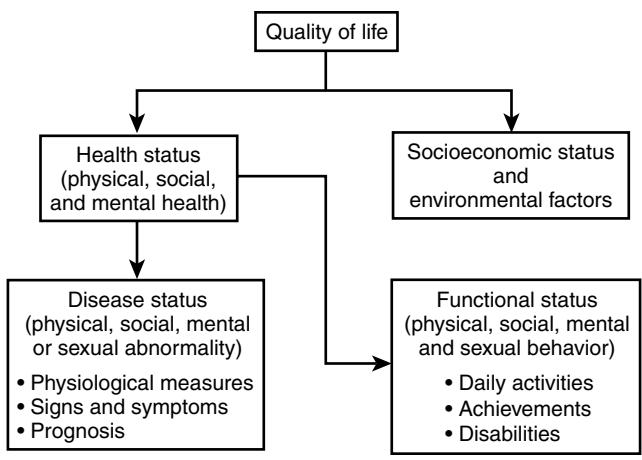
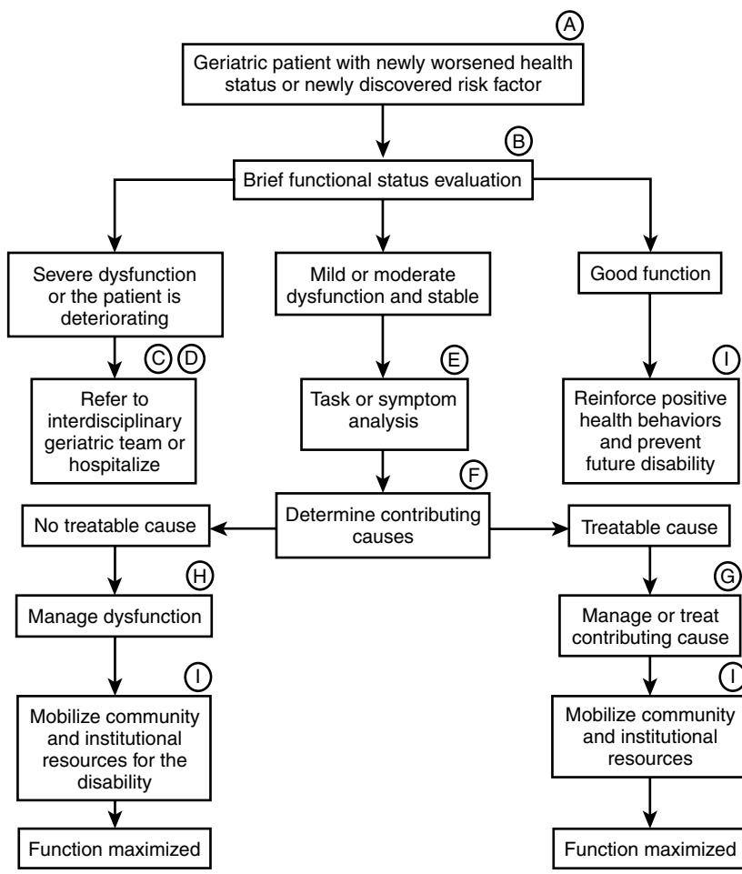

# Multidimensional Geriatric Assessment

Laurence Z. Rubenstein Lisa V. Rubenstein

Geriatric assessment is a multidimensional, usually interdisciplinary, diagnostic process intended to determine a frail elderly person's medical, psychosocial, and functional capabilities and problems with the objective of developing an overall plan for treatment and long-term follow-up. It differs from the standard medical evaluation in its concentration on frail elderly people with their complex problems, its emphasis on functional status and quality of life, and its frequent use of interdisciplinary teams and quantitative assessment scales.

The process of geriatric assessment can range in intensity from a limited assessment by primary care physicians or community health workers focused on identifying an older person's functional problems and disabilities (screening assessment), to more thorough evaluation of these problems by a geriatrician or multidisciplinary team (comprehensive geriatric assessment), often coupled with initiation of a therapeutic plan. This chapter discusses both limited geriatric assessment, such as can be performed by a single practitioner in an office setting, and comprehensive geriatric assessment, usually requiring a specialized geriatric setting.

Because the ultimate goal of geriatric assessment is to improve quality of life for elderly people, readers may find Figure 35-1 helpful.1 As diagrammed, quality of life includes health status and socioeconomic and environmental factors. Health status can be quantified both by measures of disease, such as signs, symptoms, and laboratory tests, and by measures of functional status. By functional status, we mean the individual's ability to participate fully in the physical, mental, and social activities of daily life. The ability to function fully in these arenas is strongly affected by an individual's physiologic health, and can often be used as a measure of the seriousness of a patient's multiple diseases. A comprehensive geriatric assessment should be able to evaluate and plan care for all these areas.

# **BRIEF HISTORY OF GERIATRIC ASSESSMENT**

The basic concepts of geriatric assessment have evolved over the past 75 years by combining elements of the traditional medical history and physical examination, the social worker assessment, functional evaluation, and treatment methods derived from rehabilitation medicine, and psychometric methods derived from the social sciences. By incorporating the perspectives of many disciplines, geriatricians have created a practical means of viewing the "whole patient."

The first published reports of geriatric assessment programs came from the British geriatrician Marjory Warren, who initiated the concept of specialized geriatric assessment units during the late 1930s while in charge of a large London infirmary. This infirmary was filled primarily with chronically ill, bedfast, and largely neglected elderly patients who had not received proper medical diagnosis or rehabilitation and who were thought to be in need of lifelong institutionalization. Good nursing care kept the patients alive, but the lack of diagnostic assessment and rehabilitation kept them disabled. Through evaluation, mobilization, and rehabilitation, Warren was able to get most of the long bedfast patients out of bed and often discharged home. As a result of her experiences, Warren advocated that every elderly patient receive comprehensive assessment and an attempt at rehabilitation before being admitted to a long-term care hospital or nursing home.2

Since Warren's work, geriatric assessment has evolved. As geriatric care systems have been developed throughout the world, geriatric assessment programs have been assigned central roles, usually as focal points for entry into the care systems.3 Geared to differing local needs and populations, geriatric assessment programs vary in intensity, structure, and function. They can be located in different settings, including acute hospital inpatient units and consultation teams, chronic and rehabilitation hospital units, outpatient and office-based programs, and home visit outreach programs. Despite diversity, they share many characteristics. Virtually all programs provide multidimensional assessment, using specific measurement instruments to quantify functional, psychological, and social parameters. Most use interdisciplinary teams to pool expertise and enthusiasm in working toward common goals. Additionally, most programs attempt to couple their assessments with an intervention, such as rehabilitation, counseling, or placement.

Today, geriatric assessment continues to evolve in response to increased pressures for cost containment, avoidance of institutional stays, and consumer demands for better care. Geriatric assessment can help achieve improved quality of care and plan cost-effective care. This has generally meant more emphasis on noninstitutional programs and shorter hospital stays. Geriatric assessment teams are well positioned to deliver effective care for elderly persons with limited resources. Geriatricians have long emphasized judicious use of technology, systematic preventive medicine activities, and less institutionalization and hospitalization.

# **STRUCTURE AND PROCESS OF GERIATRIC ASSESSMENT**

Geriatric assessment begins with the identification of deteriorations in health status or the presence of risk factors for deterioration. These deteriorations include both worsening of disease and worsening of functional status. If disease alone has worsened, without affecting function, the patient should be able to be cared for in usual primary care settings. In addition, when functional status problems are mild and are not rapidly progressive, it is appropriate for a primary care practitioner to proceed with the assessment. However, because families and patients identify functional status problems early, and because internists and family practitioners often are unfamiliar with the concept of "treating" functional status impairment as a problem in its own right, patients often self-refer to geriatric care settings for these functional status problems when

Figure 35-1. Conceptual components of quality of life—relationship to health and functional status. *(Adapted from Rubenstein LV, Calkins DR, Greenfield S et al. Health status assessment for elderly patients: reports of the Society of General Internal Medicine task force on health assessment. J Am Geriatr Soc 1989;37:562–9, with permission of Blackwell Science, Inc.)*

such settings are available. Patients who have new severe or progressive deficits should ideally receive comprehensive multidisciplinary geriatric assessment. Figure 35-2 outlines an approach for evaluating elderly outpatients with health status deterioration and deciding who should be referred to multidimensional geriatric assessment settings.

Using this approach, an elderly patient with a deteriorating health status of any kind, be it a markedly elevated blood glucose, a vertebral collapse, or a new inability to perform errands, should be evaluated briefly to determine the full extent of functional disabilities. Many experts believe that frail elderly people, defined generally as people over the age of 75, or over age 65 with chronic disease, should also be screened for functional disability or risk factors at regular intervals such as once a year, even when no known acute health insults have occurred.1,4–7 When a new disability or high-risk state is detected through screening, such patients may also be appropriate for a full geriatric assessment.

A typical geriatric assessment begins with a functional status "review of systems" that inventories the major domains of functioning. The major elements of this review of systems are captured in two commonly used functional status measures—basic activities of daily living (ADL) and instrumental activities of daily living (IADL). Several reliable and valid versions of these measures have been developed,8–12 perhaps the most widely used being those by Katz et al,13 Lawton and Brody,14 and Wade and Colin.15 These scales are used by clinicians to detect whether the patient has problems performing activities that people must be able to accomplish to survive without help in the community. Basic ADL include self-care activities, such as eating, dressing, bathing, transferring, and toileting. Patients unable to perform these activities will generally require 12- to 24-hour support by caregivers. Instrumental activities of daily living include heavier housework, going on errands, managing finances, and telephoning—activities that are required if the individual is to remain independent in a house or apartment.

To interpret the results of impairments in ADL and IADL, physicians will usually need additional information about the patient's environment and social situation. For example, the

amount and type of caregiver support available, the strength of the patient's social network, and the level of social activities in which the patient participates will all influence the clinical approach taken in managing deficits detected. This information could be obtained by an experienced nurse or social worker. A screen for mobility and fall risk is also extremely helpful in quantifying function and disability, and several observational scales are available.16,17 An assessment of nutritional status and risk for undernutrition is also important in understanding the extent of impairment and for planning care.18 Likewise, a screening assessment of vision and hearing will often detect crucial deficits that need to be treated or compensated for.

Two other key pieces of information must always be gathered in the face of functional disability in an elderly person. These are a screen for mental status (cognitive) impairment and a screen for depression. Of the several validated screening tests for cognitive function, the Folstein Mini Mental State Examination is one of the best because it efficiently tests the major aspects of cognitive functioning.19 Of the various screening tests for geriatric depression, the Yesavage Geriatric Depression Scale20 and the PHQ-9 (depression screen of the Patient Health Questionnaire)21 are in wide use, and even shorter screening versions are available without significant loss of accuracy.22

The major measurable dimensions of geriatric assessment, together with examples of commonly used health status screening scales, are listed in Table 35-1. 7–36 The instruments listed are short, have been carefully tested for reliability and validity, and can be easily administered by virtually any staff person involved with the assessment process. Both observational instruments (e.g., physical examination) and self-report (completed by patient or proxy) are available. Components of them—such as watching a patient walk, turn around, and sit down—are routine parts of the geriatric physical examination. Many other kinds of assessment measures exist and can be useful in certain situations. For example, there are several disease-specific measures for stages and levels of dysfunction for patients with specific diseases such as arthritis,30 dementia,31 and parkinsonism.32 There are also several brief global assessment instruments that attempt to quantify all dimensions of the assessment in a single form.33–36 These latter instruments can be useful in community surveys and some research settings but are not detailed enough to be useful in most clinical settings. More comprehensive lists of available instruments can be found by consulting published reviews of health status assessment.7–12,37

A number of factors must be taken into account in deciding where an assessment should take place. These are outlined in Table 35-2. Mental and physical impairment make it difficult for patients to comply with recommendations and to navigate multiple appointments in multiple locations. Functionally impaired elders must depend on families and friends, who risk losing their jobs because of chronic and relentless demands on time and energy in their roles as caregivers, and who may be elderly themselves. Each separate medical appointment or intervention has a high time-cost to these caregivers. Patient fatigue during periods of increased illness may require the availability of a bed during the assessment process. Finally, enough physician time and expertise must be available to complete the assessment within the constraints of the setting.

Figure 35-2. Evaluating and treating health status deterioration among geriatric outpatients.

A, Elderly patients with a new deterioration in health status or newly discovered risk factor(s) may need geriatric assessment. Examples of patients needing assessment include the following:

1. Frail elderly people with a new functional disability or risk factor for deterioration detected on routine screening

- 2. Elderly people with a new or worsened medical complaint or laboratory finding (e.g., "I fell last week" or the x-ray shows a new vertebral compression fracture)
- 3. Elderly people with a new or worsened functional disability complaint ("I can't go to church because of my health")
- B, Brief functional status evaluation should include the following:
- 1. Activities of daily living (ADL)13-15,23
- 2. Instrumental activities of daily living (IADL)14,23
- 3. Mental status (e.g., Folstein Mini Mental State Examination)19
- 4. Affective status (e.g., Yesavage Geriatric Depression Scale)20-22
- C, Full multidimensional geriatric assessment and/or hospitalization is necessary for elderly patients with new severe or progressive functional disability
- D, Targeted assessment for patients in office practice is appropriate for the following:
- 1. Patients whose functional disabilities or medical problems are mild enough to make multiple appointment feasible
- 2. Patients whose disability is stable enough to permit assessment over weeks to months

E, To perform task or symptom analysis, select the patient's major symptom or disability or chief complaint (the one that bothers him/her the most, the disability upon which resolution of other health problems depends, or the one that is the most treatable). Then determine the exact maneuvers necessary to complete the task, or the exact components of the symptom (e.g., "difficulty getting dressed" due to difficulty putting on shoes because of inability to bend, or "difficulty with housework" because of failure to complete tasks despite adequate physical ability to perform them)

F, To determine contributing causes:

- 1. Perform a targeted history, guided by the functional disabilities detected and by the known common occult causes of disability in the elderly (see text)
- 2. Perform a targeted physical examination, always including postural blood pressure changes, vision and hearing screening, observations of gait (at least get up, walk 25 feet, turn around, sit down). Determine all specific physical disabilities, such as hip flexor weakness or poor hand mobility, that explain the observed functional disability.

G, Manage or treat contributing cause(s). Begin appropriate medical treatments and evaluations. Mobilize community and institutional resources as appropriate (lowvision resources for blindness; Alcoholics Anonymous for alcoholics, etc.). Identify key members of the multidisciplinary team and refer as needed (e.g., social worker for social isolation, physical therapist for gait disorder, or psychiatrist for depression).

H, When the disability cannot be reversed, maximize function using available services and behavioral or physical adaptation. For example, rearranging schedule to maximize activity, providing adaptive devices, or arranging for home support services might be indicated.

I, Always reinforce positive health behaviors.

| Dimension                        | Basic Context                                                                                                   | Specific Examples                                                                                    |
|----------------------------------|-----------------------------------------------------------------------------------------------------------------|------------------------------------------------------------------------------------------------------|
| Basic ADL23                      | Strengths and limitations in self-care, basic mobility, and incontinence                                     | Katz (ADL)13; Lawton Personal Self-Maintenance Scale14; Barthel index15                           |
| IADL23                           | Strengths and limitations in shopping, cooking, house hold activities, and finances                          | Lawton (IADL)14; Older Americans Resources and Services, IADL Section27                           |
| Social activities and supports24 | Strengths and limitations in social network and com munity activities                                        | Lubben Social Network Scale28; Older Americans Resources and Services, Social Resources Section27 |
| Mental health—affective26        | The degree to which the person feels anxious, depressed, or generally happy                                  | Yesavage Geriatric Depression Scale20,22; PHQ-921                                                    |
| Mental health—cognitive27        | The degree to which the person is alert, oriented, and able to concentrate, and perform complex mental tasks | Folstein Mini-Mental State19; Kahn Mental Status Questionnaire29                                  |
| Mobility—gait and balance9,11    | Quantitative scale of gait, balance, and risk of falls                                                          | Tinetti Performance Oriented Mobility Assessment16; Get Up and Go Test17                          |
| Nutritional adequacy18           | Current nutritional status and risk of malnutrition                                                             | Nutrition Screening Initiative Checklist18; Mini Nutritional Assessment25                         |

| Table 35-1. Measurable Dimensions of Geriatric Assessment With Examples of Specific Measures |  |  |
|----------------------------------------------------------------------------------------------|--|--|
|----------------------------------------------------------------------------------------------|--|--|

Abbreviations: *ADL,* activities of daily living; *IADL,* instrumental activities of daily living.

|  | Table 35-2. Determining the Intensity and Location of the Geriatric Assessment |
|--|--------------------------------------------------------------------------------|
|--|--------------------------------------------------------------------------------|

|                       | Office Setting | Outpatient/Homecare Team | Inpatient Unit/Team |
|-----------------------|----------------|--------------------------|---------------------|
| Level of disability   | Low            | Intermediate             | High                |
| Cognitive dysfunction | Mild           | Mild to severe           | Moderate to severe  |
| Family support        | Good           | Good to fair             | Good to poor        |
| Acuity of illness     | Mild           | Mild to moderate         | Moderate to severe  |
| Complexity            | Low            | Intermediate             | High                |
| Transportation access | Good           | Good                     | Good to poor        |

Most geriatric assessments do not require the full range of technology nor the intense monitoring found in the acutecare inpatient setting. Yet hospitalization becomes unavoidable if no outpatient setting provides sufficient resources to accomplish the assessment fast enough. A specialized geriatric setting outside an acute hospital ward, such as a day hospital or subacute inpatient geriatric evaluation unit, will provide the easy availability of an interdisciplinary team with the time and expertise to provide needed services efficiently, an adequate level of monitoring, and beds for patients unable to sit or stand for prolonged periods. Inpatient and dayhospital assessment programs have the advantages of intensity, rapidity, and ability to care for particularly frail or acutely ill patients. Outpatient and in-home programs are generally cheaper and avoid the necessity of an inpatient stay.

# **Assessment in the office practice setting**

A streamlined approach is usually necessary in the office setting. An important first step is setting priorities among problems for initial evaluation and treatment. The "best" problem to work on first might be the problem that most bothers a patient or, alternatively, the problem upon which resolution of other problems depends (alcoholism or depression often fall into this category).

The second step in performing a geriatric assessment is to understand the exact nature of the disability through performing a task or symptom analysis. In a nonspecialized setting, or when the disability is mild or clear-cut, this may involve only taking a careful history. When the disability is more severe, more detailed assessments by a multidisciplinary or interdisciplinary team may be necessary. For example, a patient may have difficulty dressing. There are multiple tasks associated with dressing, any one of which might be the stumbling block (e.g., buying clothes, choosing appropriate clothes to put on, remembering to complete the task, buttoning, stretching to put on shirts, or reaching downward to put on shoes). By identifying the exact areas of difficulty, further evaluation can be targeted toward solving the problem.

Once the history has revealed the nature of the disability, a systematic physical examination and ancillary laboratory tests are needed to clarify the cause of the problem. For example, difficulty dressing could be caused by mental status impairment, poor finger mobility, or dysfunction of shoulders, back, or hips. Evaluation by a physical or occupational therapist may be necessary to pinpoint the problem adequately, and evaluation by a social worker may be required to determine the extent of family dysfunction engendered by or contributing to the dependency. Radiologic and other laboratory testing may be necessary.

Each abnormality that could cause difficulty dressing suggests different treatments. By understanding the abnormalities that contribute most to the functional disability, the best treatment strategy can be undertaken. Often one disability leads to another. Impaired gait may lead to depression or decreased social functioning, and immobility of any cause, even after the cause has been removed, can lead to secondary impairments in performance of daily activities because of deconditioning and loss of musculoskeletal flexibility.

Almost any acute or chronic disease can reduce functioning. Common but easily overlooked causes of dysfunction in elderly people include impaired cognition, impaired special senses (vision, hearing, balance), unstable gait and mobility, poor health habits (alcohol, smoking, lack of exercise), poor nutrition, polypharmacy, incontinence, psychosocial stress, and depression. To identify contributing causes of the disability, the physician must look for worsening of the patient's chronic diseases, occurrence of a new acute disease, or appearance of one of the common occult diseases listed earlier. The physician does this through a refocused history guided by the functional disabilities detected and their differential diagnoses, and a focused physical examination. The physical examination always includes, in addition to usual evaluations of the heart, lungs, extremities, and neurologic function, postural blood pressure, vision and hearing screening, and careful observation of the patient's gait. The Mini Mental State Examination, already recommended as part of the initial functional status screen, may also determine what parts of the physical examination require particular attention as part of the evaluation of dementia or acute confusion. Finally, basic laboratory testing including a complete blood count, a blood chemistry panel, and tests indicated on the basis of specific findings from the history and physical examination, will generally be necessary.

Once the disability and its causes are understood, the best treatments or management strategies for it are often clear. When a reversible cause for the impairment is found, a simple treatment may eliminate or ameliorate the functional disability. When the disability is complex, the physician may need the support of a variety of community or hospital-based resources. In most cases, a strategy for long-term follow-up and often, formal case management should be developed to ensure that needs and services are appropriately matched up and followed through.

#### **Comprehensive geriatric assessment**

If referral to a specialized geriatric setting has been chosen, the process of assessment will probably be similar to that described above, except that the greater intensity of resources and the special training of all members of the interdisciplinary team in dealing with geriatric patients and their problems will facilitate carrying out the proposed assessment and plan more quickly, and in greater breadth and detail. In the usual geriatric assessment setting, key disciplines involved include, at a minimum, physicians, social workers, nurses, and physical and occupational therapists, and optimally may include other disciplines such as dieticians, pharmacists, ethicists, and home-care specialists. Special geriatric expertise among the interdisciplinary team members is crucial.

The interdisciplinary team conference, which takes place after most team members have completed their individual assessments, is critical. Most successful trials of geriatric assessment have included such a team conference. By bringing the perspectives of all disciplines together, the team conference generates new ideas, sets priorities, disseminates the full results of the assessment to all those involved in treating the patient, and avoids duplication or incongruity. Development of fully effective teams requires commitment, skill, and time as the interdisciplinary team evolves through the "forming, storming, and norming" phases to reach the fully developed "performing" stage.38 Involvement of the patient (and caregiver, if appropriate) at some stage is important in maintaining the principle of choice.38,39

### **EFFECTIVENESS OF GERIATRIC ASSESSMENT PROGRAMS**

A large and still growing literature supports the effectiveness of geriatric assessment programs (GAPs) in a variety of settings. Early descriptive studies indicated a number of benefits from GAPs, such as improved diagnostic accuracy, reduced discharges to nursing homes, increased functional status, and more appropriate medication prescribing. Because they were descriptive studies, without concurrent control patients, they were not able to distinguish the effects of the programs from simple improvement over time. Nor did these studies look at long-term, or many short-term, outcome benefits. Nonetheless, many of these early studies provided promising results.40–44

Improved diagnostic accuracy was the most widely described effect of geriatric assessment, most often indicated by substantial numbers of important problems uncovered. Frequencies of new diagnoses found ranged from almost one to more than four per patient. Factors contributing to the improvement of diagnosis in GAPs include the validity of the assessment itself (the capability of a structured search for "geriatric problems" to find them), the extra measure of time and care taken in the evaluation of the patient (independent of the formal elements of "the assessment"), and a probable lack of diagnostic attention on the part of referring professionals.

Improved living location on discharge from a healthcare setting was demonstrated in several early studies, beginning with T. F. Williams' classic descriptive pre-post study of an outpatient assessment program in New York.45 Of patients referred for nursing home placement in the county, the assessment program found that only 38% actually needed skilled nursing care, while 23% could return home, and 39% were appropriate for board and care or retirement facilities. Numerous subsequent studies have shown similar improvements in living location.46–59 Several studies that examined mental or physical functional status of patients before and after comprehensive geriatric assessment coupled with treatment and rehabilitation showed patient improvement on measures of function.46–50,52,56

Beginning in the 1980s, controlled studies appeared that corroborated some of the earlier studies and documented additional benefits such as improved survival, reduced hospital and nursing home use, and, in some cases, reduced costs.46–67 These studies were by no means uniform in their results. Some showed a whole series of dramatic positive effects on function, survival, living location, and costs, whereas others showed relatively few if any benefits. However, the GAPs being studied were also very different from each other in terms of process of care offered and patient populations accepted. To this day, controlled trials of GAPs continue, and as results accumulate, we are able to understand which aspects contribute to their effectiveness and which do not.

One striking effect confirmed for many GAPs has been a positive impact on survival. Several controlled studies of different basic GAP models demonstrated significantly increased survival, reported in different ways and with varying periods of follow-up. Mortality was reduced for Sepulveda geriatric evaluation unit patients by 50% at 1 year, and the survival curves of the experimental and control groups still significantly favored the assessed group at 2 years.46,60,61 Survival was improved by 21% at 1 year in a Scottish trial of geriatric rehabilitation consultation.56 Two Canadian consultation trials demonstrated significantly improved 6-month survival.52,53 Two Danish community-based trials of in-home geriatric assessment and follow-up demonstrated reduction in mortality,47,58 and two Welsh studies of in-home GAPs had beneficial survival effects among patients assessed at home and followed for 2 years.49,50 On the other hand, several other studies of geriatric assessment found no statistically significant survival benefits.51,55,56

Multiple studies followed patients longitudinally after the initial assessment and thus were able to examine the longer-term utilization and cost impacts of assessment and treatment. Some studies found an overall reduction in nursing home days.46,56,62 Hospital use was examined in several reports. For hospital-based GAPs, the length of hospitalization was obviously affected by the length of the assessment itself. Thus some programs appear to prolong initial length of stay,44,63,64 whereas others reduce initial stay.58,65 However, studies following patients for at least 1 year have usually shown reduction in use of acute-care hospital services, even in those programs with initially prolonged hospital stays.46,47,54

Compensatory increases in use of community-based services or home-care agencies might be expected with declines in nursing home placements and use of other institutional services. These increases have been detected in several studies47,49,52,66 but not in others.46,54,59 Although increased use of formal community services may not always be indicated, it usually is a desirable goal. The fact that several studies did not detect increases in use of home and community services probably reflects the unavailability of community service or referral networks rather than that more of such services were not needed.

The effects of these programs on costs and utilization parameters have seldom been examined comprehensively, owing to methodological difficulties in gathering comprehensive utilization and cost data, and statistical limitations in comparing highly skewed distributions. The Sepulveda study found that total first-year direct health care costs had been reduced owing to overall reductions in nursing home and rehospitalization days, despite significantly longer initial hospital stays in the geriatric unit.46 These savings continued through 3 years of follow-up.60 Hendriksen's program47 reduced the costs of medical care, apparently through successful early case-finding and referral for preventive intervention. Williams' outpatient GAP54 detected reductions in medical care costs owing primarily to reductions in hospitalization. Although it would be reasonable to worry that prolonged survival of frail patients would lead to increased service use and charges—or, of perhaps greater concern, to worry about the quality of the prolonged life these concerns may be without substance. Indeed, the Sepulveda study demonstrated that a GAP could improve not only survival but prolong high-function survival,46,60 while at the same time reducing use of institutional services and costs.

A 1993 meta-analysis attempted to resolve some of the discrepancies between study results, and tried to identify whether particular program elements were associated with particular benefits.68,69 This meta-analysis included published data from the 28 controlled trials completed as of that date involving nearly 10,000 patients, and was also able to include substantial amounts of unpublished data systematically retrieved from many of the studies. The meta-analysis identified five GAP types: hospital units (six studies), hospital consultation teams (eight studies), in-home assessment services (seven studies), outpatient assessment services (four studies), and "hospital- home assessment services" (three studies), the latter of which performed in-home assessments on patients recently discharged from hospitals. The meta-analysis confirmed many of the major reported benefits for many of the individual program types. These statistically and clinically significant benefits included reduced risk of mortality (by 22% for hospital-based programs at 12 months, and by 14% for all programs combined at 12 months), improved likelihood of living at home (by 47% for hospital-based programs and by 26% for all programs combined at 12 months), reduced risk of hospital (re)admissions (by 12% for all programs at study end), greater chance of cognitive improvement (by 47% for all programs at study end), and greater chance of physical function improvement for patients on hospital units (by 72% for hospital units).

Clearly not all studies showed equivalent effects, and the meta-analysis was able to indicate a number of variables at both the program and patient levels that tended to distinguish trials with large effects from those with more limited ones. When examined on the program level, hospital units and home-visit assessment teams produced the most dramatic benefits, whereas no major significant benefits in office-based programs could be confirmed. Programs that provided hands-on clinical care and/or long-term follow-up were generally able to produce greater positive effects than purely consultative programs or ones that lacked follow-up. Another factor associated with greater demonstrated benefits, at least in hospital-based programs, was patient targeting; programs that selected patients who were at high risk for deterioration yet still had "rehabilitation potential" generally had stronger results than less selective programs.

The meta-analysis confirmed the importance of targeting criteria in producing beneficial outcomes. In particular, when use of explicit targeting criteria for patient selection was included as a covariate, increases in some program benefits were often found. For example, among the hospitalbased GAP studies, positive effects on physical function and likelihood of living at home at 12 months were associated with studies that excluded patients who were relatively "too healthy." A similar effect on physical function was seen in the institutional studies that excluded persons with relatively poor prognoses. The reason for this effect of targeting on effect size no doubt lies in the ability of careful targeting to concentrate the intervention on patients who can benefit, without diluting the effect with persons too ill or too well to show a measurable improvement.

Studies performed after the 1993 meta-analysis have been largely corroborative. A more recent meta-analysis confirmed that inpatient GAPs for elderly hospital patients may reduce mortality, increase the chances of living at home in 1 year, and improve physical and cognitive function.70 However, with principles of geriatric medicine becoming more diffused into usual care, particularly at places where controlled trials are being undertaken, differences between GAPs and control groups seem to be narrowing.71–76 For example, a 2002 study of inpatient and outpatient GAPs failed to demonstrate substantial benefits.77 Other studies continue to reveal major benefits of inpatient programs.78,79 Effects of outpatient GAPs have been less impressive, with a 2004 meta-analysis showing no favorable effects on mortality outcome.80 For cost reasons, growth of inpatient units has been slow, despite their proven effectiveness, whereas outpatient programs have increased, despite their less impressive effect size in controlled trials. However, some newer trials of outpatient programs have shown significant benefits in areas not found in earlier outpatient studies, such as functional status, psychological parameters, and well-being, which may indicate improvement in the outpatient-care models being tested.72–76,79

A 2002 meta-analysis of preventive home visits revealed that home visitation programs are consistently effective if they are based on multidimensional geriatric assessments, employ multiple follow-up visits, and are offered to elderly persons with relatively good function at baseline.81 The NNV (number needed to visit) to prevent one hospital admission in programs with frequent follow-up was shown to be about 40. An expanded 2008 meta-analysis of preventive home visits largely confirmed the earlier findings on the importance of multidimensional assessment and higher function, but not on multiple follow-up visits.82 It has also been recently confirmed that a key component of successful programs is a systematic approach for teaching primary care professionals. These results have important policy implications. In countries with existing national programs of preventive home visits, the process and organization of these visits should be reconsidered on the basis of the criteria identified in this meta-analysis. In addition, there are a variety of chronic disease management programs specifically addressing the care needs of older adults.83 Engrafting the key concepts of home-based preventive care programs into these programs should be feasible and cost-effective as they continue to evolve. Identifying risks and dealing with them as an essential component of the care of elderly persons is central to reducing the emerging burden of disability and improving the quality of life for older adults.

A continuing challenge has been obtaining adequate financing to support adding geriatric assessment services to existing medical care. Despite GAPs' many proven benefits, and their ability to reduce costs documented in controlled trials, health care financiers have been reluctant to fund geriatric assessment programs—presumably out of concern that the programs might be expanded too fast and that costs for extra diagnostic and therapeutic services might increase out of control. Many practitioners have found ways to "unbundle" the geriatric assessment process into component services and receive adequate support to fund the entire process. In this continuing time of fiscal restraint, geriatric practitioners must remain constantly creative to reach the goal of optimal patient care.

#### **CONCLUSION**

Published studies of multidimensional geriatric assessment have confirmed its efficacy in many settings. Although there is no single optimal blueprint for geriatric assessment, the participation of the interdisciplinary functional status and quality of life as major clinical goals are common to all settings. Although the greatest benefits have been found in programs targeted to the frail subgroup of elderly people, a strong case can be made for a continuum of GAP-screening assessments performed periodically for all older persons and comprehensive assessment targeted to frail and highrisk patients. Clinicians interested in developing these services will do well to heed the experiences of the programs reviewed here in adapting the principles of geriatric assessment to local resources. Future research is still needed to determine the most effective and efficient methods for performing geriatric assessment and on developing strategies for best matching needs with services.

## KEY POINTS

Geriatric Assessment

- Geriatric assessment is a systematic multidimensional approach to improving diagnostic accuracy and planning care for frail elderly people.
- Controlled trials have documented many benefits from geriatric assessment, including improved functional status and survival and reduced hospital and nursing-home admissions.

For a complete list of references, please visit online only at www.expertconsult.com