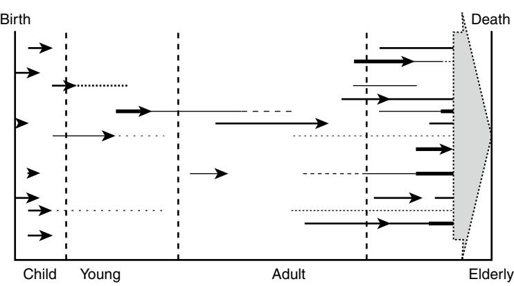
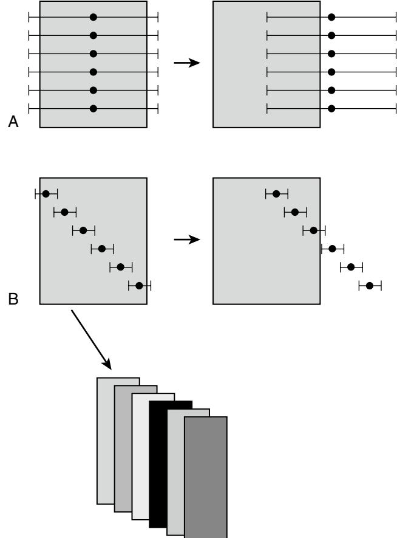
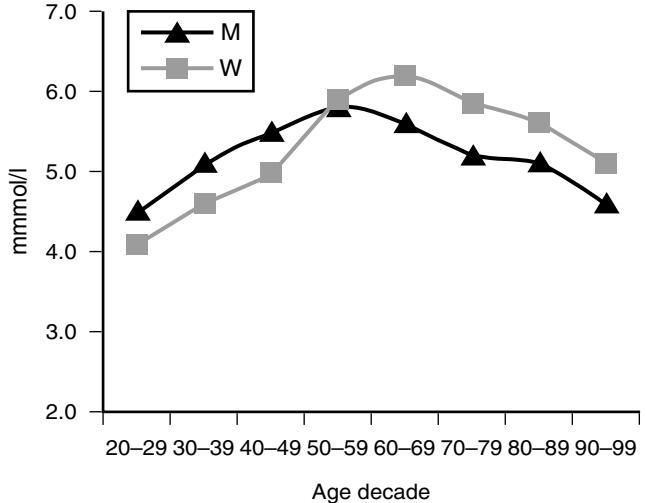

# Laboratory Medicine in Geriatrics

Alexander Lapin

## **INTRODUCTION**

The improvement of life style and health care, especially in industrialized countries created the phenomenon of the inverse demographic pyramid. As a result, the proportion of elderly within the general population is growing constantly. Many disciplines of geriatric medicine have become topics of growing interest. However, this is not the case in laboratory medicine where, besides an occasional stress on reference intervals for the elderly*,* a more fundamental discussion on consequences resulting from the actual demographic trend has not resulted until now. This chapter should provide some insights on this problem.

## **Objectivity as a basic principle of in vitro diagnosis**

Since antiquity, in vitro diagnosis follows the same principle: A biologic sample (blood, urine) is drawn from the patient and subjected to analysis of its properties. The result is than interpreted in terms of clinical information concerning the health status of the patient. If such analysis is properly calibrated, the result can be expressed quantitatively (e.g., by numerals, not by words as is the case in other diagnostic disciplines, such as in pathology or radiology). Thereafter the result of a laboratory analysis is not an expertise*,* which results from the subjective experience of the operator, but is an objective measurement, which is always related to an *à-*priori postulated standard. Thus most of the results provided by laboratory investigations can be considered as data. In general, they are reproducible and comparable to each other and, as such, they represent a validated instrument of modern, evidence-based medicine.

To extend the principle of objectivity even on clinical interpretation, the laboratory report contains an indication of reference interval, which is stated aside from the numerical quotation of the result. It corresponds to the statistical distribution of the results that would be obtained when the analysis would be performed on a collective of healthy (not specifically diseased) individuals. Usually, such a reference group is taken as a demographic sample from the normal adult population while the term of normal is usually understood as a synonym for healthy.1

However, since the reference interval is determined statistically, on the basis of calculation of the 95th percentile of gaussian normal distribution, 5% of results obtained from healthy individuals will be always situated outside the reference range and this without any pathologic correlation. This means that performing an increasing amount of laboratory tests in the same healthy individual, the probability that one of the results would be outside of the reference interval increases constantly. Ironically the more one performs laboratory investigations, the probability that the individual will be found as not normal increases.1

This consideration illustrates the limits of the statistically based reference concept,2 emphasizing the fact that a human being is first of all an unrepeatable personality, not just an anonymous element of a collective. And even this insight does not reveal the specificity of the problem of the geriatric laboratory medicine.

## **Geriatric individuality**

From the sociologic point of view, the question of whether an older person is healthy or sick cannot be answered by productivity in his or her job, nor by fact that he or she brought a notification of illness to the employer, but actually by his or her subjective feeling, which is an aspect of his or her quality of life.

But there is another aspect which should be considered in geriatric laboratory medicine. It is a continuous decline of physiologic functions. Age-dependent impairment of renal and pulmonal function, progression of osteoporosis, decrease of various endocrine functions, and weakening of immunity at an older age are some such examples.3–6 In view of this, and in an analogy to pediatrics, attempts have been made to establish—even for geriatrics—age-related reference intervals. Nevertheless, these intentions failed because of individuality and variability of the senescent process from both a clinical and a biologic point of view.

In pediatrics as in adult medicine, the majority of population is healthy and patients have usually one, but rarely several, causes for their illness. The primary aim of medicine here is to detect and to cure the disease as efficiently as possible to protect the future life chances of the individual and to return him or her as fast as possible back to normal (working) life. In geriatrics it is different. Here, since an old person has reached the last part of life, clinical history must be more complex then in previous phases of life. Passed crises, emergency situations, but also periods of prosperity and affluence, all had influence on the actual health state. Various diseases and trauma, which randomly occur in the course of life, have left more or less relevant aftereffects, which at the older age, contribute to the specificity of the clinical status of each aged person. Moreover, with advancing age, the probability of manifestation of a genetically or secondarily predisposed disease increases progressively. All together these inputs can be characterized by the term multimorbidity, which is a very important notion of clinical geriatrics. It characterizes the occurrence of several diseases or pathologic processes in one patient, which proceed often in an oligosymptomatic and atypical ways.

Of course, different involutive processes can be considered more or less as physiologic processes of older age, but they all can occur with individual accentuation and can be triggered by different random events at different moments of the life. In this context it becomes more and more difficult to define unequivocally the term of biologic age.7 And finally, one has to accept that death itself is often a result of one or more diseases breaking out during the ultimate period of life (Figure 36-1).

Figure 36-1. The course of life (horizontal axis) and randomly occurring diseases and traumas ("), and their aftereffects (—): At the end of life, they are contributing in an additive way to the final clinical status. *(From Lapin A, Böhmar F. Laboratory diagnosis and geriatrics: more than just reference intervals for elderly* … *Wien Med Wochenschr 2005;155:1–2, :30–5.)*

In sum, when speaking about normality in geriatrics, one has to state that in age the perfectly healthy individual is a biologic rarity rather than the normal case.8

#### **From screening to monitoring**

The opinion that geriatric reference intervals can be estimated by large scale studies seems to be spurious even from a theoretical point of view. According to the publication of Harris,9 the width of the reference interval is determined by three kinds of variation, which can be characterized by appropriated coefficients of variation CV:

- CVA **analytical variation** which is due to the imprecision of an analytical method
- CVB **biologic variation** which concerns variations within one individual
- CVC **interindividual variation** which is due to differences between several individuals

The total variation (CVTOT) results from the geometric sum of these three variations:

$$\mathbf{C\_{\text{vTOT}}} = \sqrt{\mathbf{C\_{\text{VA}}^2} + \mathbf{C\_{\text{VB}}^2} + \mathbf{C\_{\text{VC}}^2}}$$

In practice, it can be assumed that the analytical variation (CVA) is almost negligible because of a high technical standard of the analytical method and that the total reference interval (CVTOT) is determined by two other kinds of variation: the biologic (CVB) and the interindividual (CVC) one. Therefore two extreme constellations can be considered:

- 1. In the first case, the reference interval of the parameter is almost identical with the biologic variation (CVB), which is nearly the same in all healthy individuals (CVC → 0) (this is, for example the case with glucose). Now, when in one particular individual a disease breaks out, the probability that the corresponding value will be shifted out of the reference range is increased. Thereafter, using such a test, the "pathology" would be detected early and the probability to obtain a result outside the reference interval will be increased by repeated measurement (Figure 36-2).
- 2. By contrast, another situation is given when the parameter shows narrow biologic variation (CVB → 0),

Figure 36-2. Influence of illness on two kinds of laboratory investigations (according to Harris EK 19749). A, The width of the reference interval is determined by biologic factors (e.g., intraindividual variation [CVB]). Due to an illness, all values are shifted out from the reference interval. B, The width of the reference interval is determined by intraindividual variation (CVC), whereas intraindividual variation is negligible (CVB→ 0). An illness would shift the values only in a segment of individuals of the considered collective. To improve the diagnostic relevance of this test, stratification (e.g., redefinition of the subreference intervals has to be performed.)

but mean values (or medians) of this variation are different from individual to individual (this is, for example, the case with uric acid). In this case, the reference interval results preferentially from the distribution of mean values (medians) of such

| Table 36-1. Stratification of Reference Collective |  |
|----------------------------------------------------|--|
|----------------------------------------------------|--|

| Laboratory Parameter | Gender | Linear Correlation With Age |
|----------------------|--------|--------------------------------|
| Creatinine           | M      | 0.233                          |
|                      | W      | 0.041                          |
| Urea                 | M      | 0.196                          |
|                      | W      | 0.220                          |
| Chloride             | M      | 0.168                          |
|                      | W      | −0.050                         |
| AST                  | M      | −0.088                         |
|                      | W      | 0.085                          |
| GGT                  | M      | −0.004                         |
|                      | W      | −0.007                         |
| Cholinesterase       | M      | −0.446                         |
|                      | W      | −0.287                         |
| Albumin              | M      | −0.435                         |
|                      | W      | −0.288                         |
| Iron                 | M      | −0.243                         |
|                      | W      | −0.178                         |
| RBC                  | M      | −0.365                         |
|                      | W      | −0.102                         |
| Hemoglobin           | M      | −0.363                         |
|                      | W      | −0.122                         |
| Hematocrit           | M      | −0.323                         |
|                      | W      | −0.126                         |
| MCV                  | M      | 0.164                          |
|                      | W      | −0.047                         |
| CRP                  | M      | 0.160                          |
|                      | W      | −0.050                         |
| Cholesterol          | M      | −0.446                         |
|                      | W      | −0.090                         |
| Triglycerides        | M      | −0.191                         |
|                      | W      | −0.070                         |
| Uric Acid            | M      | −0.104                         |
|                      | W      | 0.079                          |
| Glucose              | M      | 0.087                          |
|                      | W      |                                |
| TSH                  | M      | −0.033                         |
|                      | W      | 0.019                          |
| FT4                  | M      | 0.101                          |
|                      | W      | 0.119                          |
| T3                   | M      | −0.397                         |
|                      | W      | −0.291                         |

Abbreviations: *AST,* aspartate amino transferase; *CRP,* C-reactive protein; *FT4,* free thyroxin; *GGT,* gamma glutamyl transferase; *MCV,* mean cell volume of erythrocytes; *POCT,* point of case testing; *RBC,* red blood cell; T3, total triiodothyronine; *TSH,* thyroid stimulating hormone; *M,* men; *W,* women.

Modified from Lapin A, Böhmer F. What are "normal" laboratory parameters in elderly patients when examined on first admission to a geriatric hospital? A pilot study. Eur J Geriatr 2003;5(2):86–93.

> individual variations (CVC). Strictly speaking, such a test is less suitable for the diagnostic use, especially for early detection of a disease. A minor pathologic change, which occurs in one individual, would provide a shift merely out of his or her individual interval of biologic variation, but not necessarily outside the reference interval as determined for all considered individuals of the whole collective (CVTOT). Evidently, such a pathologic change can remain undetected, even despite a repeated measurement.

To increase the diagnostic significance of such a test, it is necessary to perform stratification of the reference collective (e.g., to determine separately the reference intervals in different subpopulations, which in turn should be defined according to more specific criteria such as gender, age, other demographic parameters [Table 36-1]).

But for geriatrics it is not enough. The stratification also should consider other criteria, such as physical constitution, nutritional status, mobility, cognitive activity, predominant disease, and others.

By pushing stratification to the extreme, it becomes more and more difficult to find statistically relevant reference groups of individuals with the same characteristics. This is a major problem in establishing an age-dependent reference interval in geriatrics.10,11

On the other hand, the ultimate stratification may be when the actual result (measured value) is referred uniquely to the previous results of the same person. And here, parameters of narrow biologic variation but of wide interindividual differences are not useful for screening (e.g., to detect a new disease), but they are well suited for monitoring dynamic changes in the individual clinical status of a concrete patient. However, a basic condition for the realization of such "longterm monitoring" is the assessment of the long-time stability and quality of the applied laboratory tests. Unfortunately, especially in geriatrics, this can be sometimes put in question.

#### **The monitoring in geriatrics**

One of the actual trends of today's laboratory medicine is consolidation of laboratories, which is imposed by the improvement of economic efficiency of laboratory testing. Usually this means the concentration of medical laboratories in large semiindustrial diagnostic institutions.12

The outsourcing of laboratory medicine from clinical institutions entails a depersonalization of the communication between clinicians and laboratory specialists.13,14 Consequently, certain aspects which have been theoretically known to affect the diagnostic significance of laboratory testing gain an unexpected actuality. One of these concerns the preanalytics.

Due to reduced physiologic reserves, many elderly patients who show larger biologic variation have to be considered for a number of laboratory parameters. Such preanalytical effects include orthostatic effects (especially in patients with edema), effects related to impaired mobility and/or nutritional status, and seasonal influences.15 Moreover, poor venous status of some elderly patients can cause difficulties in the phlebotomy and blood collection, which is then responsible for hemolytic sera and inadequately small sample volume for an optimal analytical process.

The fact that the number of samples provided by geriatric practitioners is far inferior to those of an acute wards' can induce negligence and sloppiness resulting in the bad habit that geriatric samples are treated with less interest and without priority. Well known is the situation when, in a nursing home, the lab courier is missed and collected samples have to be left for the next day or for the later analysis batch. The increased turnaround time is always disadvantageous. For the stability of analytes\*,15 and for the actuality of diagnostic information that has be submitted to the clinician.

But the consolidation of laboratory medicine has induced another trend, which can be characterized as point-of-care testing (POCT). Using small testing devices mostly based on dry-chemistry principle, analyses can be performed close to the patient and therefore in a shorter and easier manner

\*Analyte: substance, enzymatic activity, or other subject of chemical analysis.

|                        | Usual Significance in Adults               | Possible Alternative Significance in Elderly                |
|------------------------|--------------------------------------------|-------------------------------------------------------------|
| BUN                    | Renal insufficiency                        | Acute catabolism (often reversible)*                        |
| Albumin                | Renal or hepatic insufficiency             | Biologic age,† malnutrition, frailty                        |
| Cholesterol            | Risk of atherosclerosis (high cholesterol) | Malnutrition,‡ marker of fatal prognosis§ (low cholesterol) |
| Gamma-GT               | Alcoholism, cholestasis, hepatitis         | Liver congestion (e.g., by heart insufficiency)             |
| Amylase                | Pancreatitis                               | Parotitis (often during summer season); macroamylase        |
| LDH                    | Parenchymal damages, hemolysis             | Phlebotomy problem                                          |
| Total protein (normal) | Chronic inflammation                       | Exsiccation, myeloma                                        |
| CRP                    | Inflammation, acute phase                  | Infection, necrosis (sometimes unique conclusive marker)    |
| ESR                    | Chronic inflammation                       | Occult neoplasm                                             |
| PTT                    | Heparin, hemophilia                        | Lupus inhibitor                                             |
| Haemoglobin            | Bleeding                                   | Anemia of the elderly, myelodysplastic syndrome             |
| MCV (normal)           | Alcohol abuse                              | Vitamin B12 or folate deficiency                            |

**Table 36-2. Examples of Possible Alteration of Clinical Significance of Some Laboratory Parameters When Used in Geriatrics**

\* For example, after an accidental episode of acute dehydration.

†Campion EW, deLabry LO, Glynn RJ. The effect of age on serum albumin in healthy males: report from the normative aging study. J Gerontol 1988;433:M18–M20. ‡Goichot B, Schlienger JL, Grunenberger F, et al. Low cholesterol concentrations in free-living elderly subjects: relations with dietary intake and nutritional status. Am J Clin Nutr 1995;62:547–53.

§Rudman D, Mattson DE, Nagraj HS, et al. Prognostic significance of serum cholesterol in nursing home men. JPEN 1998:12:155–8.

than by using a distant laboratory.16 For geriatrics, the POCT is of particular interest, not the least because of the growing scope of available tests. Although the use of POCT has become a generally accepted procedure, some disadvantages such as calibration, documentation, and especially uncontrolled performance by untrained personnel represents a subject of many discussions in different meetings of the laboratory medicine.

Nevertheless, a serious problem can arise when laboratory data, provided by different sources (e.g., diagnostic institutions and by different POCT-devices), are clinically evaluated in the same patient's history.17 Such a situation is quite frequent in geriatrics since aged patients can be treated within a short period by several medical providers: In a doctor's office, in a nursing home as a resident, and in a hospital as an emergency patient.

### **Medical significance of laboratory results in the aged**

Finally there is the issue of medical significance of laboratory analyses in the context of clinical geriatrics. This can be different from adult medicine and not only in physiologic parameters, but also in demographic changes, life expectancy, and clinical consequences (Table 36-2).

An example for change in diagnostic significance in the course of life can be seen in the case of cholesterol (Figure 36-3). Usually the mean level of cholesterol in serum correlates with cardiovascular risk and increases with the age. However, from the sixth decade, this increase stops and the cholesterol level begins to decrease. This behavior is due to successive demographic change of the cohort. Individuals, which at their adult age revealed a high level of cholesterol, become now at the older age victims of their own increased risk being now continuously excluded from the higher-age cohort as a result of mortality.18 At the same time, cholesterol also becomes a marker for nutritional status: its decrease correlates with malnutrition.19 And finally, on the end of this age-dependent correlation, the sudden decrease of the cholesterol level can indicate a worsening life expectancy prognosis.20

Figure 36-3. Age-dependent course of cholesterol (according to the author's data). *(From Lapin A, Böhmer F. Laboratory diagnosis and geriatrics: more than just reference intervals for elderly…. Wien Med Wochenschr 2005;155:1–2, 30–5.)*

Due to the symptomatic, supportive and palliative therapy, which is in geriatrics more important than in adult medicine, the geriatrician is sometimes forced to undergo therapeutic compromises; for example, using corticosteroids in patients with diabetes mellitus. In this situation, to optimize the individual therapeutic strategy, it is not enough to monitor the clinical status; more important can be the estimation of the still remaining functional capacity of different organs and systems. For example, it is useful to monitor renal function by measuring serum creatinine, but more conclusive can be to estimate the creatinine clearance to know which proportion of renal functional reserve remains intact. In other words, parameters, which enable the estimation of still remaining functional capacity and/or which provide prognostic information, are of particular importance for geriatrics. A good example of such parameters is natriuretic peptide (known as BNP), whose blood level provides quantitative information about the degree of cardiac insufficiency in sense of congestive heart failure.

Another important feature of geriatrics is the frequent presence of multimorbidity. In this context, Fairweather and Campbell demonstrate, that in the elderly, "failing to make diagnosis when the disease is present or making a diagnosis when a disease is not present is likely to occur twice as often as in younger patients." 20 In the same way, an actual autopsy study showed that the accuracy rate of the clinical diagnosis of the immediate cause of death is no higher than roughly 50%.21

In this sense it is meaningful to differentiate between multipathology and multietiology. Since multipathology can be seen as a complex of several impairments of the organism, the term of multietiology is a more complicated one. It characterizes several dynamic pathologic processes, often convoluted in each other. Often, pathologic conditions such as infections, cardiovascular diseases, acute abdomen, hyperthyroidism, and depression occur in the elderly in an atypical and nonspecific way and with correspondingly atypical symptoms, physical findings, and laboratory results.22 But more difficult can be the adequate estimation of multiple etiological factors that are contributing to the current status of the patient. Often due to the propensity to think in terms of a single disease, it can be difficult for the clinician to decide which of the actual factors are important and will benefit the patient if treated. At the same time, the underestimation of multietiology together with the progressive decline of the cognitive and physical status of the patient can aggravate the problem of the degradation of the diagnostic information.23 However, especially in view of the prognosis of the patient, there can be a growing discrepancy between the necessity of a diagnostic and therapeutic intervention and the need for conservation patient care into appropriate dignity. In this case, even laboratory medicine faces ethical limits.

#### **CONCLUSION**

With the growing of the elderly population in industrialized countries, the role of geriatric medicine will grow steadily. This in turn will create corresponding requirements for better efficiency in laboratory diagnoses. More than elsewhere in medicine, in geriatrics one has to deal with individuals rather than with collectives, and it can be expected that geriatric laboratory medicine will be subjected to a change of paradigms. Not only the statistically revealed evidence, as obtained from studies of a large number of individuals, but also the consideration of the individual patient, with his or her clinical individuality, status, predispositions, physiologic reserves, and prognosis, will need another, probably an alternative insight. It will not be sufficient to consider health solely from the deterministic point of view, observing differences between physiology and pathology of laboratory findings, but likewise it will be important to consider the clinical individuality as a relative risk in the dimension of time for the rest of the patient's life.24

From the practical point of view, it would be necessary to pay more attention to limits of the diagnostic significance of laboratory testing of the elderly. This should be considered especially for education programs of specialists in geriatric medicine. Research in geriatrics should be concentrated on new diagnostic parameters that would enable a better estimation of the clinical risk to the patients.

## KEY POINTS

#### Laboratory Medicine in Geriatrics

- **Normality in geriatrics:** The perfectly healthy individual is a biologic rarity rather than the normal case. In geriatrics, it is a problem to postulate generally applicable references.1
- **Multimorbidity:** By approaching the end of life, the sum of aftereffects of previous diseases and the probability of manifestation of predisposed diseases increases. The individuality of a person increases by his or her life itinerary.
- **To keep the best possible quality of life** requires monitoring of individual clinical status, rather than screening for potentially occurring diseases, with the aim of a complete cure.
- **Laboratory parameters** that provide information about still available physiologic reserves are especially valuable. Clinical interpretation of some laboratory tests can be modified by life expectancy of the patient.
- **Laboratory medicine in geriatric**s should be performed with long-time quality assessment, professional logistics, and with special consideration of preanalytics.

1other terms used more or less correctly for the same purpose: reference range, normal values

For a complete list of references, please visit online only at www.expertconsult.com