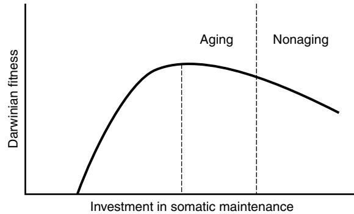
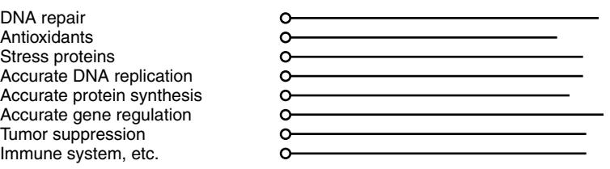

# Evolution Theory and the Mechanisms of Aging

Thomas B. L. Kirkwood

The question "Why does aging occur?" calls for answers both at the level of proximate, physiological mechanisms and also at the level of ultimate, evolutionary origins. This chapter provides an understanding of why aging has evolved and examines what evolution theory can tell us about the kinds of mechanisms we might regard as prime candidates to explain senescence.

Evolution theory is well recognized as a powerful tool with which to inquire about the genetic basis of the aging process.1–4 Although human aging has its roots long ago in our past, the study of its evolution can throw important light on key present-day challenges. For example, a range of population-based studies, including one based on genealogical analysis of the entire population of Iceland, has shown consistent evidence for a generic contribution to human longevity.5 There is growing interest in knowing how many and what kinds of genes are likely to be involved in this heritability.6,7 There is also interest in human genetic disorders such as Werner's syndrome and Hutchinson-Gilford progeria that are characterized by acceleration of many aspects of the senescent phenotype (see Chapter 11).

Before addressing questions about the evolutionary origin of aging it is important to be precise about how the term "aging" is to be understood. In this chapter, aging is defined as "a progressive, generalized impairment of function, resulting in a loss of adaptive response to stress and in a growing risk of age-related disease." The overall effect of these changes is summed up in the increase in the probability of dying, or age-specific death rate, in the population.

This definition of aging—in terms of a mortality pattern showing progressive increase in age-specific mortality allows comparisons to be made even among species where the detailed features of the aging process may differ markedly. In phylogenetic terms, aging is widespread but by no means universal.9–12 The fact that not all species show an increase in age-specific mortality indicates that aging is not an inevitable consequence of wear-and-tear. On the other hand, the fact that very many species do show such an increase is evidence that the evolution of aging has occurred under rather general circumstances.

# **EVOLUTION OF AGING**

Theories on the evolution of aging seek to explain why aging occurs through the action of natural selection. The decline in survivorship, which is often also accompanied by a decline in fertility, means that there is an age-associated loss of Darwinian fitness that is clearly deleterious to the organism in which it occurs. Natural selection acts to increase fitness, so it is at once clear that selection should be expected, other things being equal, to oppose aging. The challenge to evolution theory is thus to explain why aging occurs in spite of its drawbacks.

# **Programmed or "adaptive" aging**

It is sometimes suggested that despite its disadvantages to the individual, aging is beneficial and even necessary at the species level, for example, to prevent overcrowding.13,14 In this case, genes that actively cause aging might have evolved specifically to program the end of life, in the same way as genes program development.

The difficulty with this view is that there is little evidence that intrinsic aging serves as a significant contributor to mortality in natural populations,15 which means that it apparently does not play the adaptive role suggested for it. The theory also embodies the questionable supposition that selection for advantage at the species level will be more effective than selection among individuals for the advantages of a longer life. Aging is clearly a disadvantage to the individual, so any mutation that inactivated the hypothetical adaptive aging genes would confer a fitness advantage, and therefore, the nonaging mutation should spread through the population unless countered by selection at the species or group level. Conditions under which "group selection" can work successfully are highly restrictive,16 especially when there is selection in the opposite direction acting at the level of the individual. Briefly, it is necessary that the population be divided among fairly isolated groups, and that the introduction of a nonaging genotype into a group should rapidly lead to the group's extinction. The latter condition is necessary to provide the selection between groups that might, in principle, counter the tendency for selection at the level of individuals to favor the spread of nonaging mutants. Although theoretical special cases have been constructed that might permit the selection of genes to cause aging, it appears unlikely that the necessary conditions will be met with sufficient generality to explain the evolution of aging.

## **Selection weakens with age**

An observation of central importance to the evolution of aging is that the force of natural selection—that is, its ability to discriminate between alternative genotypes—weakens with age.15,17–20 Because natural selection operates through the differential effects of genes on fitness, its discriminatory power must decline with age in proportion to the decline in the remaining fraction of the organism's lifetime expectation of reproduction. This is true whether or not the species exhibits aging.

The attenuation in the force of natural selection with age means inevitably that there is only loose genetic control over the later portions of the life span. For this reason it has been suggested that aging might be due to an accumulation in the germ line of mutations, which potentially are deleterious but are not expressed, or which produce no phenotypic effect until late in life.15

The idea is that if deleterious mutations are expressed so late that most individuals will already have died from some other cause, such as predation, even though the genes involved have the potential to cause harm they will be subject to very little selection against them. Over the generations, a large number of such genes might accumulate. These would cause aging and death only when an individual is removed to a protected environment, away from the hazards of the wild, and so lives long enough to experience their negative effects.

A stronger version of this theory was proposed by Williams,18 who suggested that because of the declining force of natural selection with age, any gene that conferred an advantage early in life would be favored by selection even if the same gene had deleterious effects at older ages. Such "pleiotropic" genes could explain aging. The decline in the force of natural selection with age would ensure that even quite modest early benefits would outweigh severe harmful side effects, provided the latter occurred late enough.

#### **Disposable soma theory**

The disposable soma theory1,4,21–23 explains aging through asking how best an organism should allocate its metabolic resources, primarily energy—between, on the one hand, keeping itself going from one day to the next, and on the other hand producing progeny to secure the continuance of its genes when it has itself died. No species is immune to hazards such as predation, starvation, and disease. All that is necessary by way of maintenance is that the body remains in sound condition until an age after which most individuals will have died from accidental causes. In fact, a greater investment in maintenance is a disadvantage because it eats into resources that, in terms of natural selection, are better used for reproduction. The theory concludes that the optimum course is to invest fewer resources in the maintenance of somatic tissues than are necessary for indefinite survival (Figure 4-1). The result is that aging occurs through the gradual accumulation of unrepaired somatic defects, but the level of maintenance will be set so that the deleterious effects do not become apparent until an age when survivorship in the wild environment would be extremely unlikely.

#### **Comparison of the evolutionary theories**

The adaptive program theory is in a category of its own and support for this theory is weak; it will not be considered further in this chapter. The disposable soma and pleiotropic genes theories are adaptive in the sense that aging is the result of positive selection for aspects of the organism's life history, but the essential difference is that aging itself is

Figure 4-1. Relation between Darwinian fitness and investment in somatic maintenance predicted by the disposable soma theory of aging. Fitness is maximized at a level that is less than that which would be required for indefinite longevity (nonaging).

not adaptive but is a negative trait that arises only as a byproduct or tradeoff of some other benefit. The late-acting deleterious mutations theory assumes an essentially neutral evolutionary process, the accumulation of mutations reflecting the inability of natural selection to maintain tight control over the later portions of the life span.

Among the nonadaptive theories there is a common strand, namely that old organisms count less. This is not due to any implicit assumption of frailty or obsolescence (this would render the theories circular), but to the simple mathematics of mortality. Even if old organisms retain exactly the same vigor as young ones, to the extent that old and young are physiologically indistinguishable, the fact that each cohort becomes numerically attenuated with age means that the selection force weakens. The nonadaptive theories are not mutually exclusive. Therefore, aging might in principle be due to a combination of any of them.

As regards the nature of gene action, the disposable soma theory is the most specific of the evolutionary theories, for it suggests not only why aging occurs but also predicts that the genetic basis of aging is to be found in the genes that regulate levels of somatic maintenance functions. Neither the pleiotropic genes theory nor the late-acting deleterious mutations theory is specific about the nature of the genes involved.

#### **GENETICS OF LIFE SPAN**

This section looks at the genetics of life span, first from the point of view of interspecies comparisons. That is, it will ask the question Why do species have the life spans they do? It will then look at intraspecies variation and heritability of life span. Finally, there is a brief discussion of human progeroid syndrome, such as Werner's and Hutchinson-Gilford progeria, as models of genetically accelerated senescence.

#### **Species differences in longevity**

In addition to explaining why aging occurs, evolution theory also must account for differences in species life spans. This raises basic questions about the genetic control of aging: specifically, how many genes are involved and how are these modified by selection to produce changes in life span?

For each of the nonadaptive theories, the generality of the selection forces that are involved suggests that multiple genes will be implicated. If there is a very large number of independent genes causing aging, however, the life span may be slow to change, because modifying a single gene may have little effect by itself and the probability of simultaneous independent modifications will be low. This suggests that either a reasonably small number of primary genes are responsible for aging, or that there exists some mechanism for coordinate regulation.

The evolution of increased life span is most readily explained if it is assumed that an adaptation occurs that results in a general lowering of the accidental (age-independent) death rate. In the late-acting deleterious mutations theory, this may result in new pressure to eliminate or postpone the deleterious gene effects. In the pleiotropic genes theory, the balance between early benefit and late cost may be shifted in favor of reducing the harmful effects on late survival. In the disposable soma theory, there may be selection to tune the optimum investment in maintenance to a higher level.

#### **Variation within species**

The variability in life span observed within a species or population clearly owes much to chance, but there is a significant heritable component as well.5 Martin et al3 have applied the terms "public" and "private" to denote genetic factors related to aging that may either be specific to individuals or shared across a population (perhaps even across species). Late-acting deleterious mutations are strong candidates for private genes because the fate of such alleles is determined largely by random genetic drift. Public genes are more likely to be those that arise through tradeoffs. In particular, the genes involved in regulating mechanisms of somatic maintenance are likely to be public genes of considerable importance. Although these genes are "public" in the sense that all individuals have them, there may nevertheless be variations within a population in the precise levels at which these functions are set. These variations in setting may in turn be the cause of genetic variation in life expectancy.

As predicted by the disposable soma theory, the level of individual somatic maintenance systems should be set high enough so that the organism remains in sound condition through its natural expectation of life in the wild environment, but not much higher than this, or resources will be wasted. Numerous maintenance systems operate in parallel to preserve viability (Figure 4-2). Depending on the levels at which they are set, each maintenance system can be thought of as "assuring" a given span of life (see also Cutler24 and Sacher25 for earlier discussion of the concept of "longevity assurance"). When any one of these critical mechanisms has exhausted its potential for assuring longevity, which happens because the accumulated defects threaten survival, the organism is liable to die.

If we now recall the shape of the fitness curve in Figure 4-1, we see that its peak—the point towards which natural selection is expected to exert evolutionary pressure—is rounded instead of sharp, and so we can expect a fair amount of intrapopulation variance in the precise settings of maintenance processes. Selection is expected to direct these settings toward the peak, but once within the region of the peak, the fitness differences on which selection can operate become quite small.

Putting these ideas together generates the prediction summarized in Figure 4-2. On the average, we expect the longevity assured by individual maintenance systems to be similar. This is because if the setting of any one mechanism is so low that it consistently fails before any of the others, then selection will tend to increase the level at which it is set. Conversely, if any mechanism tends always to fail after the others, then to the extent that this mechanism involves a metabolic cost, there will be selection to tune down the level at which it is set. In individuals, however, the genetic variance within the population is expected to result in variation in the extent to which the organism is predisposed to age from specific causes. For example, some individuals are likely to be less well protected against oxygen radicals than others, and these individuals will therefore experience greater oxidative damage.

Instances of extreme longevity, such as human centenarians, are of special interest for they are likely to be endowed with unusually high levels of each of the important ingredients of the cellular defense network.6 Such individuals may also be distinguished by their freedom from alleles that predispose toward diseases that otherwise might shorten life expectancy. Schächter et al27 performed the first genetic study comparing centenarians with younger adult controls, which validated the general potential of this approach. Since then a number of further studies have been conducted to examine the genetics of human longevity.7

It is anticipated that the next few years will see the publication of results from several large investigations looking either at individuals of extreme longevity (e.g., centenarians) or at families where there is reason to expect that family members share a genetic endowment predisposing to aboveaverage longevity. Examples of the latter design include studies that are recruiting nonagenarian siblings (i.e., instances where two or more members of the same family are still alive past age 90). The technological advances that are presently being made in the capacity to assess DNA samples for possession of very large numbers of genetic markers at very high speed mean that the focus is now increasingly on genomewide association studies and the linkage analyses that can be made using family groups. Herein lies both the strength of modern human genetics and a potential difficulty when studying a trait like longevity, which is likely to prove highly polygenic. If large numbers of genetic loci contribute to the longevity phenotype, but these individually make only small contributions, the difficulty of extracting the signals from the statistical noise will be formidable.

#### **Human progeroid syndromes**

A number of inherited human diseases have been characterized as showing a phenotype of accelerated aging. The best studied of these conditions is Werner's syndrome, a rare autosomal recessive disorder affecting around 10 in 1 million people, who prematurely develop a variety of major agerelated diseases, including arteriosclerosis, ocular cataracts, osteoporosis, malignant neoplasms, and type II diabetes. Cells grown from Werner-syndrome patients show reduced

#### **Somatic maintenance system Longevity assured**

Figure 4-2. Polygenic control of longevity predicted by the disposable soma theory of aging. On average, the period of longevity assured by individual somatic maintenance systems is predicted to be similar, but some genetic variance about the average is also expected, as shown.

division potential and increased chromosomal instability compared with age-matched controls, and there is evidence that the pathology associated with Werner's syndrome may be related rather generally to impaired cell proliferation.

Yu et al8 identified the gene responsible for Werner's syndrome as a DNA helicase, an enzyme responsible for unwinding DNA for purposes of replication, repair, and expression of the genetic material. This discovery strongly supports the concept that accumulation of somatic defects is important in aging, and it well illustrates the predicted involvement of longevity-assurance genes in determining the rate of aging. A defective helicase increases the rate of accumulation of DNA defects in actively dividing cell populations. A defect in this gene leads to accelerated aging, particularly in tissues in which cell division continues throughout life. In terms of the scheme shown in Figure 4-2, the mutation responsible for Werner's syndrome can be considered equivalent to shortening the line for longevity assurance through DNA repair. However, as Figure 4-2 illustrates, DNA repair is but part of the network of longevity assurance mechanisms that determine the overall rate of aging. It is striking that Werner's syndrome is not associated with accelerated aging in postmitotic tissues, such as brain and muscle, which is consistent with the fact that these tissues, by virtue of having little or no cell division during adult life, are relatively unaffected by having a defective DNA helicase.

Another striking example is Hutchinson-Gilford progeria. In this condition features of aging develop even faster than in Werner's syndrome. The discovery that Hutchinson-Gilford syndrome is associated with mutation in the lamin A gene, which affects the integrity of the cell's nuclear membrane, has again confirmed the association between rapid aging and accelerated accumulation of molecular and cellular damage.28

#### **TESTS OF THE EVOLUTIONARY THEORIES**

A key prediction of the evolutionary theories is that altering the rate of decline in the force of natural selection will lead to the evolution of a concomitantly altered rate of aging. This has been tested by applying artificial selection on life history variables or by making comparisons within and between species on the effects of different levels of extrinsic mortality. For practical reasons, most studies have focused on shortlived species, in particular the fruit fly *Drosophila melanogaster* and the nematode worm *Caenorhabditis elegans*.

Evidence for tradeoffs between early and late fitness components, as predicted by both the disposable soma and pleiotropic genes theories, comes from the success of artificial selection for increased longevity in *Drosophila*. 29–34 A general correlate of delayed senescence has been reduced fecundity in the long-lived flies. A similar tradeoff has also been reported for a human population, based on analysis of birth-and-death records of British aristocrats.35

The nematode *Caenorhabditis elegans* has yielded a growing number of long-lived mutants in which increased longevity has been consistently associated with increased resistance to biochemical and other stresses. Many of the affected genes are linked to pathways that control a switch between the normal developmental process of the worm and an alternative long-lived form called the *dauer* larva, which is invoked

during times of food shortage. The emerging picture points to a fundamental link between metabolic control, growth and reproduction, and somatic maintenance.36–38 These findings are directly consistent with the disposable soma theory, which predicts that at the heart of the evolutionary explanation of aging is the principle that organisms have been acted upon by natural selection to optimize the use of metabolic resources (energy) between competing physiologic demands, such as growth, maintenance, and reproduction. Consistent with this prediction it is striking that insulin signaling pathways appear to have effects on aging that may be strongly conserved across the species range. Insulin signaling regulates responses to varying nutrient levels. Allied to the role of insulin signaling pathways is the recent discovery that a class of proteins called sirtuins appears to be centrally involved in fine-tuning metabolic resources in response to variations in food supply.39 It has long been known in laboratory rodents that restricted intake of calories simultaneously suppresses reproduction and upregulates a range of maintenance mechanisms, resulting in an extension of life span and the simultaneous postponement of age-related diseases. What is not at all clear, however, is whether the large effects on life span of modulating these pathways in very short-lived animals, such as nematodes and fruit flies, will be found to operate in longer-lived species. On evolutionary grounds it seems likely that there will have been greater evolutionary pressure to evolve a capacity to produce large responses to extreme environmental variation in small, short-lived animals. Therefore the scope for such modulation in humans, including through dietary restriction, is expected to be much less. Nevertheless it will be surprising if there are no metabolic consequences of varying food supply.

From the comparative perspective, the evolutionary theories predict that in safe environments (those with low extrinsic mortality) aging will evolve to be retarded. Adaptations that reduce extrinsic mortality (wings, protective shells, large brains) are generally linked with increased longevity (bats, birds, turtles, humans). Field observations comparing a mainland population of opossums subject to significant predation by mammals, with an island population not subject to mammalian predation, found the predicted slower aging in the island population.40

At the molecular and cellular levels, the disposable soma theory predicts that the effort devoted to cellular maintenance and repair processes will vary directly with longevity. Numerous studies support this idea. A direct relation between species longevity and rate of mitochondrial ROS production in captive mammals has been found41,42 as has a similar relationship between mammals and similar-sized but much longer-lived birds.43 DNA repair capacity has been shown to correlate with mammalian life span in numerous comparative studies,44 as has the level of poly(ADP-ribose) polymerase,45 an enzyme that plays an important role in the maintenance of genomic integrity. The quality of maintenance and repair mechanisms may be revealed by the capacity to cope with external stress. Comparisons of the functional capacity of cultured cells to withstand a variety of imposed stressors have shown that cells taken from longlived species have superior stress resistance to that of cells from shorter-lived species.46,47

Tests of the evolutionary theories support the idea that it is the evolved capacity of somatic cells to carry out effective maintenance and repair that mainly governs the time taken for damage to accumulate to levels where it interferes with the organism's viability, and hence regulates longevity.

#### **CONCLUSIONS**

Our answers to the question "Why does aging occur?" have broad implications for how we perceive the likely genetic basis of aging. Firstly, evolution theory can illuminate a long-running debate about whether programmed or stochastic events, such as DNA damage, drive the aging process. The weakness of evolutionary support for the adaptive aging genes hypothesis calls the program theory into question. Any notion of an aging "clock" needs to be qualified by recognition of this fact. The existence of temporal controls in development and in cyclic processes such as diurnal and reproductive cycles does not provide a sufficient basis to suggest the existence of a clock that regulates aging. Nor does the broad reproducibility of many features of aging provide any real evidence for an underlying active program. This is not to say, however, that the nature and rate of aging are not genetically determined. The issue that distinguishes programmed from stochastic theories of aging is not whether the factors that determine longevity are specified within the genome, but rather, how this is arranged.48

Secondly, evolution theory clearly indicates a polygenic basis for aging. Different mechanisms and even different kinds of genes may operate together. This presents a major challenge, and progress is likely to require a combination of approaches, including (1) transgenic animal models in which candidate genetic factors are altered by genetic manipulation, (2) comparative studies to identify factors that correlate positively or negatively with species' life spans, (3) studies of the extremely long-lived (e.g., human centenarians) to identify factors associated with above-average expectation of life, and (4) selection experiments to investigate the response of life span to artificial selection pressures.

### KEY POINTS Aging

- We are not programmed to die.
- Aging occurs because, in our evolutionary past, when life expectancy was much shorter, natural selection placed limited priority on long-term maintenance of the body.
- Aging is caused by gradual accumulation of cell and tissue damage. Much of the damage arises as a side effect of essential biochemical processes, such as the use of oxygen to generate chemical energy through oxidative phosphorylation.
- Accumulation of damage begins early and continues progressively throughout life, resulting after several decades in the overt frailty, disability, and disease associated with aging.
- Multiple processes cause the damage that contributes to aging, and multiple genes regulate the efficacy of "longevity-assurance" processes, such as DNA repair, that together influence the rate of aging.
- Nongenetic factors, such as nutrition and exercise, can have important effects in modulating the rate of buildup of damage within the body.

For a complete list of references, please visit online only at www.expertconsult.com