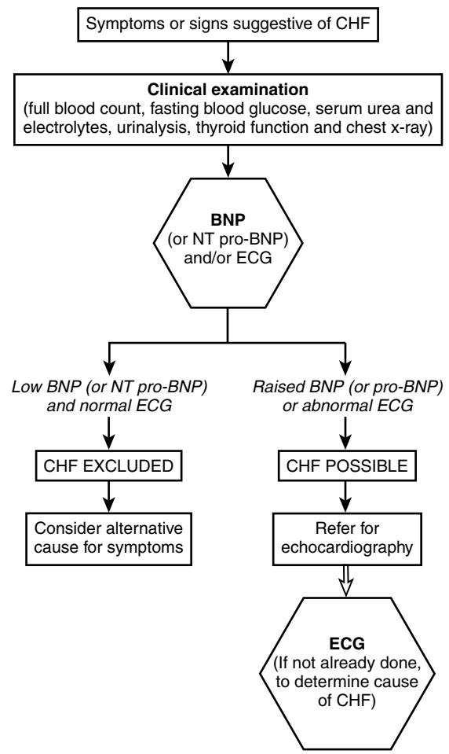

# Chronic Cardiac Failure

CHAPTER 40 Neil D. Gillespie Miles D. Witham Allan D. Struthers

Cardiac failure increases in both prevalence and incidence with age.1 It is a disease of middle and old age, although the underlying causes differ considerably with age.2 In younger patients with cardiac failure, the cause is frequently coronary artery disease, whereas in the older patient valvular disease and hypertension are more often implicated. Most epidemiologic studies are based on symptoms and signs of cardiac failure, but more recent data include objective assessments of ventricular function, which is more senistive.3

The prevalence of heart failure continues to rise as more patients survive myocardial infarction as a result of fibrinolytic therapy. In addition, patients with hypertension are surviving longer as a result of continued improvements in the prevention of strokes.4 Fortunately, it appears that the effective treatment of hypertension may in fact prevent the onset of heart failure even in the very old.5 The HYVET study of nearly 4000 hypertensive patients aged 80 and over showed a significant reduction in any cardiovascular event, including the development of any heart failure, in the group treated for hypertension.

When considering the epidemiology of heart failure, note that it is defined as the presence of symptoms and signs of cardiac decompensation, together with objective evidence of underlying structural heart disease. These are the definitions used by the European Society of Cardiology6 and the American Heart Association7 who have recently independently reached a consensus on the diagnosis of heart failure. This is an important step because it has resulted in a more focused approach when considering precisely what disease entity is being treated in individual patients. Heart failure is of major economic significance; in the United Kingdom it accounts for up to 5% of hospital admissions,8 and in the rest of Europe hospitalization for heart failure is a significant financial burden for a number of countries.9 Many older adults with heart failure also have multiple pathologies and coexistent diseases, including cognitive impairment, which make the diagnosis more difficult to confirm.10

## **EPIDEMIOLOGY**

Relatively few studies report the incidence and prevalence of heart failure in the older patient population. Much of the epidemiologic data comes from Scandinavia11 and the Framingham study,12 although recently new data have come from the United Kingdom from a relatively young population.3 The early data collected from studies were predominantly from medical record analysis and patient questionnaires. This type of data collection has its limitations.

In a West London study,13 the prevalence of heart failure in those aged under 65 was reported as 0.06%, compared with 2.8% in those over 65. This study likely underestimated the severity of the problem as only patients who had been prescribed as diuretic were included; others with relatively mild disease might have been missed. Many earlier epidemiologic studies were performed on populations that were inadequately described and give no information on the population at risk. The precise prevalence of left ventricular dysfunction in the whole population has been obscure until recent years. Studies in the late 1950s revealed a prevalence of 0.2% in the 45 to 64 year age group14 and 1.9% in those over the age of 65. Another U.S. study demonstrated prevalence rates of 1% and 6.5% in corresponding age groups.15

The criteria for heart failure used in the Framingham Heart Study population12 were more strictly defined and the baseline prevalence was 0.3% of the population aged 62 or less. However, over a 34-year follow-up period the prevalence rate was 0.8% in ages 50 to 59 and 9.1% in the over 80s age group.16 By contrast, more recent estimates from North Glasgow, Scotland, estimated the prevalence of left ventricular systolic dysfunction based on echocardiographic criteria to be about 2.9%.3 This figure was obtained from a population of 1640 patients between the ages of 25 and 74. The systolic dysfunction was symptomatic in 1.5% of patients and asymptomatic in 1.4%. In this study it therefore appears that systolic dysfunction was at least twice as common as symptomatic heart failure defined by clinical criteria.

The longitudinal Framingham study suggested that prevalence rates doubled every decade and reached approximately 10% for people in their 80s.

Prescribing data also highlight the extent of the problem; in the United States, up to 1 in 5 elderly patients were being treated for chronic cardiac failure.17 In the United Kingdom, echocardiographic data in patients over 75 years of age suggest that prevalence may be around 10% of patients being managed in the community.18

Information on the incidence of heart failure also reveals a sharp increase over the age of 75 years. The best available incidence data are from the Framingham Heart Study19 and the study of men born in 1913.20 In the Framingham study, 5200 individuals have been followed since 1948 and the incidence rises markedly with age. The annual incidence was 2% per thousand in men and 1% per thousand in women under the age of 54, and 14% per thousand in men and 13% per thousand in women between the ages of 75 and 84. The Framingham study data probably underestimate the incidence because the entry criteria did not include the milder forms of heart failure.

In the Scandinavian study of men born in 1913, the annual incidence for those in the 50 to 54 year age group was 1.5 per thousand per year, which increased to 10.2 per thousand per year at ages 61 to 67.

The Hillingdon Heart Failure Study21 was a populationbased surveillance system in which patients first developing heart failure were identified. Over a 20-month period, 220 patients fulfilled the criteria for heart failure and the incidence of the condition increased steeply with age and was higher in men than in women at all ages. Newer studies using echocardiography show not just that many patients have asymptomatic left ventricular dysfunction, but that heart failure with normal systolic function is increasingly recognized.22

Hospitalizations for chronic heart failure are frequent; but this may relate mainly to approaches to treatment and assessment, together with awareness of the condition, rather than being a reflection of the incidence or prevalence. The number of hospital discharges where a diagnosis of heart failure has been coded has increased in recent years both in Holland23 and in Scotland.24 In the United States in 1991, congestive heart failure was the primary discharge diagnosis in around 790,000 hospitalizations.25

# **DISEASE COURSE AND PROGNOSIS**

Heart failure has a variable disease progress but in general, patients with impaired left ventricular systolic function have a poorer prognosis, whereas patients with normal systolic function heart failure tend to fare better. These patients are more likely to be hypertensive, have mild coronary artery disease, and be prone to deterioration in renal function during hospitalization.26 Among older adults hospitalized with heart failure, mean survival time is about 2.5 years. However, there is considerable heterogeneity in survival.27 In one study, the presence of chronic heart failure in older patients resulted in an approximate 50% reduction in life expectancy.

The increased numbers of patients hospitalized for heart failure may reflect improved survival following myocardial infarction, but also an improvement in heart failure management. As a result patients with heart failure are living longer, with more episodes of decompensation requiring hospital admission. Data from North America suggest that there is a high rate of readmission in heart failure patients.28 Evidence suggests that a multidisciplinary approach to the treatment of heart failure may reduce the need for hospitalization in elderly patients with the condition.29 Such an approach is crucial in the older patient where issues such as adherence, cognition, and continence figure prominently in the clinical decision-making process.

The prognosis for heart failure, although improved in recent years by drug treatment, is nevertheless still poor. The majority of patients with New York Heart Association Class IV disease (Table 40-1) will be unlikely to survive a year.

A study of elderly men admitted as inpatients with heart failure revealed that the 1-year mortality was in the region of 50%.30 It is thus clear that heart failure is a relatively malignant condition and, although newer treatments have been shown to improve the prognosis for many patients, alleviation of symptoms and improved morbidity is as important as any potential mortality benefits in the older patient.31

# **PATHOPHYSIOLOGY**

As noted, the pathophysiology of heart failure is multifactorial, especially in older patients in whom hypertensive heart disease and valvular heart disease are more common. There

#### **Table 40-1. New York Heart Association Classification of Heart Failure**

| Class I   | No symptoms                               |
|-----------|-------------------------------------------|
| Class II  | Symptoms with ordinary activity           |
| Class III | Symptoms with less than ordinary activity |
| Class IV  | Symptoms at rest                          |

may be structural abnormalities within the heart together with overcompensatory mechanisms in the renin-angiotensin system, the sympathetic nervous system, and the peripheral vasculature. Although there are specific changes in the cardiovascular system with age, (see Chapter 14) such as increased calcification, increased myocardial fibrosis, and reduced ventricular compliance,32 most elderly patients with heart failure have additional pathology to explain their symptoms. In patients with heart failure due to ischemia, remodeling can result in alterations in the shape and morphology of the left ventricle with ultimate left ventricular dilatation and a large end-diastolic volume.33 In addition to changes in the structure of the left ventricle, many elderly patients have associated calcific degeneration of both the aortic and mitral valves, with functional and hemodynamically significant consequences.34 The cardiomyopathies35 are also a small but significant cause of heart failure in older patients, although the widely seen asymmetrical septal hypertrophy itself is not of great significance.36 In hypertensive patients with left ventricular hypertrophy, the increase in collagen content of the ventricular wall and associated myocardial fibrosis may lead to diastolic filling abnormalities,37 which may contribute to the symptoms of heart failure, and represent a major pathophysiologic substrate for the phenomenon of heart failure with preserved systolic function (HPSF). In addition, loss of atrial contraction can result in significant hemodynamic deteriorations as atrial systole has an increased importance in the older patients when left ventricular wall stiffness is increased.38

In a healthy person, cardiac output is influenced directly by stroke volume and heart rate. In the failing heart, stroke volume is maintained by increasing the left ventricular end-diastolic pressure and volume, which is the basis of Starling's law of the heart. However, eventually at very high left ventricular end-diastolic volumes there will be no subsequent compensatory increase in cardiac output. One of the aims of heart failure treatment is to minimize increases in left ventricular end-diastolic pressure, so that cardiac output can be maintained and so that subsequent tissue oxygenation is adequate for perfusion of the vital organs.

The autonomic nervous system and the neuroendocrine systems initially support the failing heart, but ultimately the compensatory mechanisms may themselves prove harmful. Activation of the renin-angiotensin-aldosterone system can result in increased levels of angiotensin and aldosterone in the heart, kidney, brain, and vascular system, with undesirable consequences.39 Furthermore, the associated high levels of plasma adrenaline and noradrenaline (epinephrine and norepinephrine) are associated with a poor prognosis due to deleterious effects on myocardial function, autonomic balance, and peripheral vascular function.40

Much of the fluid overload and edema in heart failure is a result of the effects of the renin-angiotensin system on the kidney, and reduced bradykinin may be associated with increased vasoconstriction. Changes in the morphology of skeletal muscle may explain the fatigability seen in heart failure patients over and above that expected with reduced tissue blood supply.41 Disruption of the microvasculature is also seen with impaired endothelial function.42 These changes are usually consequences of the disease process and not merely related to age, although in extremely old patients with mild symptoms of cardiac failure, true pathologic processes and age-related processes may be difficult to differentiate.

Such age-related changes include a reduction of cardiac output on exercise, an increase in end-systolic volume, a decrease in ejection fraction with exercise, and a reduced heart rate with exercise.43 It is important to note, however, that heart failure is a disease with systemic effects; derangements of immune function cause a proinflammatory response that may in itself be cardiotoxic and contributes to the development of anemia; circulating cytokines may also help to drive the prominent skeletal myopathy that accompanies heart failure and is in fact the major cause of tiredness and breathlessness in heart failure patients. This skeletal myopathy in turn causes abnormalities of ergoreceptor function that drive further sympathetic nervous system activation. Disturbance of lung architecture and gas exchange are seen in the lungs of heart failure patients even in the absence of overt fluid overload—a further contributor to the symptoms of heart failure.

Most of the established treatments for heart failure are in patients with systolic dysfunction. Even so, there are many elderly patients with normal systolic function who have symptoms and signs compatible with heart failure. Conversely, many elderly patients have these "diastolic abnormalities" on echocardiography but no symptoms of heart failure. The relative clinical significance of the diastolic abnormalities in these patients is unclear. They may go on to develop subsequent heart failure as a result of atrial fibrillation or systolic dysfunction, or may have intermittent episodes of mild cardiac decompensation possibly as a result of silent myocardial ischemia. Furthermore, echocardiographically determined measures of diastolic dysfunction are critically dependent on the degree of activation of the sympathetic nervous system. Such variables include transmitral flow velocities (the E to A ratio), the isovolumic relaxation time.44 Further work is needed to establish the clinical usefulness of these measures and newer echocardiographic indices such as measures of longitudinal systolic function.

#### **THE ETIOLOGY OF HEART FAILURE**

Heart failure has been described as a syndrome rather than a diagnosis or disease, and the underlying cause must always be sought in patients having the syndrome. The most frequent cause of heart failure is left ventricular systolic dysfunction, usually as a consequence of ischemic heart disease, especially myocardial infarction. However, in elderly patients, valvular heart disease frequently contributes to the symptoms.

Less frequently, heart failure in the older patient may be caused by one of the cardiomyopathies, amyloidosis, storage diseases (e.g., hemochromatosis), secondary to chemotherapy or vitamin B deficiencies. In the over-80s, aortic or mitral valve disease frequently contributes to heart failure and many elderly patients in long-term care have background cardiac valvular disease.45 Furthermore, as already noted, it is increasingly recognized that many patients have symptoms associated with heart failure in the presence of normal systolic function and no evident valvular disease. This is often called diastolic heart failure or more commonly heart failure with preserved systolic function (HPSF). HPSF may be responsible for as much as 30% to 50% of heart failure in the elderly population.46 The etiology of this heart failure is unclear, but it is more likely to be present in patients with hypertension and left ventricular hypertrophy. It is less clear how these patients should be managed, as most of the major studies have addressed patients with left ventricular systolic dysfunction as a cause of their heart failure.47–50

Patients in heart failure with systolic dysfunction have a poorer prognosis than those with normal systolic function. It is also well established that patients with an increased left ventricular end-diastolic volume secondary to myocardial dilatation have a poor prognosis.51 Not infrequently heart failure will be precipitated by anemia, alcohol, and a number of other factors52 (Table 40-2).

#### **DIAGNOSIS OF HEART FAILURE**

It is fairly easy to recognize heart failure in its more severe versions when the patient has pronounced symptoms and signs accompanied by echocardiographic evidence of left ventricular dysfunction.53 Even so, diagnostic difficulties arise in its milder forms.

The European Society of Cardiology (ESC) has developed guidelines for the diagnosis of heart failure6 (Table 40-3). However, with any guidelines there is a degree of vagueness, and in particular there is no specific definition of precisely what is meant by cardiac dysfunction. An example to highlight some of the difficulties is the case of the elderly lady whose echocardiogram shows preserved systolic function and who has swollen ankles with no breathlessness and mild fatigue. Does this type of patient have heart failure? Nonetheless, the ESC guidelines have generally clarified the situation even if there are still a few areas of ambiguity.

#### **Table 40-2. Factors Which May Precipitate Heart Failure in the Elderly Person**

Anemia Alcohol Intercurrent infection, including endocarditis Fluid overload (often postoperatively) Thyrotoxicosis Drugs (e.g., NSAIDs) Atrial fibrillation Altered drug compliance Pulmonary emboli

#### **Table 40-3. European Society of Cardiology Guidelines for the Diagnosis of Heart Failure**

#### **Essential Features**

- Symptoms of heart failure (for example, breathlessness, fatigue, ankle swelling)
- Objective evidence of cardiac dysfunction (at rest)

#### Nonessential Features

In cases where the diagnosis is in doubt, there is a response to treatment directed toward heart failure.

# **Table 40-4. Symptoms of Heart Failure in Elderly Patients, and Differential Diagnoses**

| Classic                                  | Atypical                                                             | Differential                                                                                                                            |
|------------------------------------------|----------------------------------------------------------------------|-----------------------------------------------------------------------------------------------------------------------------------------|
| Symptoms                                 | Features                                                             | Diagnoses                                                                                                                               |
| Dyspnea Orthopnea Peripheral edema | Lethargy Confusion Falls Dizziness Syncope Immobility | Anemia COPD Depression or anxiety Hypothyroidism Hypoalbuminemia Malnutrition Renal disease Neoplasm Lymphedema |

*COPD,* chronic obstructive pulmonary disease.

For the clinician who is faced with an elderly patient with suspected heart failure, two questions should be considered before further assessment:

- 1. Are the patient's symptoms at least partly cardiac in origin?
- 2. If so, what kind of cardiac disease is producing these symptoms?54

Table 40-4 lists the typical and atypical symptoms in the elderly patient with suspected heart failure and potential differential diagnoses.

The diagnosis of heart failure is especially difficult because it is not defined by an absolute level of any one parameter, as is the case with a number of other diseases. Consequently the diagnosis is a judgment based on a careful history and examination, chest radiology, electrocardiography, echocardiography, and other routine baseline investigations, such as full blood count, serum biochemistry, and thyroid function.

# **Clinical history**

The most classic symptom of heart failure is exertional breathlessness. However, this is a common symptom and is often a result of chronic obstructive pulmonary disease (COPD), deconditioning, obesity, or interstitial lung disease.55 Most people will experience some breathlessness with moderate exertion and, during exercise, the stage at which breathlessness is experienced depends on the overall level of fitness.

Anemia and obesity are confounding factors that make exertional dyspnea a very nonspecific symptom. Orthopnea is a more specific symptom that does not occur in normal patients and is not usually a feature in respiratory disease. However, the disease process has to be relatively advanced before orthopnea occurs; and even if it is present, diuretics have often been instituted by the patient's general practitioner to relieve this symptom. Likewise, paroxysmal dyspnea (PND) is a more extreme version of dyspnea and is a result of fluid redistribution which increases the left ventricular enddiastolic pressure. Again, PND is specific but an insensitive symptom because it signifies fairly severe heart failure, which should have been noted and previously treated.

Fatigue and lethargy are other common problems in heart failure, but they are probably even harder to define and assess than dyspnea, particularly in elderly patients. Fatigue is common in people who are ill and more common still in older adults who are frail.

Ankle edema is a common presenting feature, but again there are many alternative causes, such as cor pulmonale, deep venous thrombosis, dependent edema, or hypoalbuminemia. Elderly women often have ankle edema, which is not caused by heart failure. Its precise cause is unknown, although venous insufficiency accompanied by pelvic obstruction to venous blood flow are commonly blamed. Indeed, it is elderly women with swollen ankles who most commonly cause false positives for heart failure when assessed subsequently by echocardiography.

Probably the best indication of underlying heart failure comes from the history, with a history of previous myocardial infarction or hypertension being useful indicators.56 It should be remembered, however, that many elderly patients have silent myocardial ischemia or infarctions. In addition, many are unsure whether a previous hospitalization for chest pain was for a myocardial infarction or angina. Additional features that may suggest the diagnosis of heart failure include excessive alcohol intake, a history of rheumatic fever, and the use of drugs such as nonsteroidals, which might precipitate heart failure. Note too, however, that heart failure is associated with cognitive impairment, including memory impairment and frontal systems dysfunction that often manifests with slowness and decreased initiative.10 In consequence, it is easy in a busy clinical practice to be misled by incomplete or seemingly vague answers; both false-positive and false-negative responses can put the history off track.

# **Physical signs**

Many of the physical signs of heart failure are nonspecific and of relatively low predictive value. These include tachycardia, pulmonary crepitations, and peripheral edema. Equally, many of the physical signs that are specific to heart failure are insensitive because they occur only once the heart failure has become severe. These include elevation of the jugular venous pressure, a gallop rhythm, and displacement of the cardiac apex beat. The situation is further compounded by the variable ability of doctors to detect these clinical signs.57 As a result, few of the symptoms and signs are of any value on their own. The probability of the diagnosis of heart failure is weighed up by the individual clinician making full use of clinical judgment together with the findings on examination and careful history taking.58

# **Investigations**

The SIGN guidelines used in Scotland59 for the diagnosis and treatment of heart failure due to left ventricular systolic dysfunction, although not specifically written for the elderly patient, provide a useful framework for investigations.

# **CHEST X-RAY**

Chest x-ray is performed routinely and can produce useful information for patients with suspected heart failure. Cardiac enlargement (cardiothoracic ratio greater than 50%) implies cardiomegaly, and if present is a good guide to heart failure.60 However, many heart failure patients do not exhibit cardiomegaly, so it tends to be a specific but insensitive test which identifies severe heart failure only. Other helpful chest x-ray findings are pulmonary edema, upper lobe diversion, fluid in the horizontal fissure, and Kerly-B-lines in the costophrenic angles. In extreme cases, pleural effusions may be present, although clearly there are alternative explanations for them such as bronchial carcinoma, pneumonia, or pulmonary emboli. In a meta-analysis of 29 studies,61 Bayesian analysis found that chest radiography can only exclude heart failure (posttest probability less than 5%) and a decreased ejection fraction in patients who are asymptomatic can never confirm heart failure (posttest probability greater than 95%). However, it is likely that cardiomegaly represents underlying structural cardiac disease and in many patients heart failure will develop at some stage.

A chest x-ray can reveal other clues as to noncardiac disease that might be causing breathlessness. A lung tumor might be obvious, and emphysema may also be present. Nevertheless, the chest x-ray should be seen as a whole. For example, the finding of cardiomegaly plus bilateral pleural effusions with no other parenchymal lung disease makes heart failure extremely likely (although the presence of structural heart disease should still be confirmed by echocardiography).

#### **ELECTROCARDIOGRAM**

The 12-lead electrocardiogram (ECG) should be performed routinely. Left ventricular systolic dysfunction is rare in the presence of a completely normal 12-lead ECG, making it a useful "rule out" test. Recent data62 suggest that an abnormal resting ECG is sensitive (94%) with excellent negative predictive value (98%) but is much less specific (61%) and has poor positive predictive value (35%). Most studies suggest that this is the case; where there is doubt, an echocardiogram should be performed.

Other abnormalities on the ECG may be useful in the assessment of patients. For example, the presence of atrial fibrillation may be useful in concluding whether the patient should receive additional anticoagulation.

#### **ECHOCARDIOGRAPHY**

The optimum investigation in the elderly patient with suspected heart failure is echocardiography.63 Both qualitative and quantitative assessment can be useful. However, the degree of left ventricular systolic dysfunction can be assessed by a number of indices. Fractional shortening is usually sufficient in most instances.64 Left ventricular ejection fraction,65 and more recently a regional motion index,66 have been shown to provide accurate assessments of left ventricular systolic function; global assessment of function by an experienced operator is another valid approach, which correlates well with measured ejection fraction.67 Echocardiography can clearly distinguish whether the left ventricle is dilated or not; this approach to assessing left ventricular dimensions is preferable to chest x-ray. Left ventricular dilatation and left ventricular systolic dysfunction usually accompany each other, but occasionally the left ventricle is dilated despite the presence of normal systolic function. Nevertheless, left ventricular dilatation implies impending left ventricular systolic dysfunction and should probably be treated as such.

Echocardiography can also identify patients with mitral valve disease or aortic stenosis who may benefit from surgery. It can also assess diastolic dysfunction, although there is some controversy over this.68 The problem relates to the fact that the left ventricle becomes stiffer as it ages, and it is difficult to define consistently when the stiff ventricle constitutes diastolic dysfunction. At the time of this writing, no echocardiographic criteria are fully accepted as measures of diastolic dysfunction.

However, there is one extreme version of diastolic dysfunction that can cause severe pulmonary edema. This occurs when the left ventricle is so stiff that left atrial pressure increases and leads to fast atrial fibrillation with profound breathlessness. In the short term, treatment is to reverse the abnormal rhythm, but longer-term strategies are required to prevent LV stiffness, which leads to atrial fibrillation. Echocardiography also provides information about left ventricular hypertrophy if present; such a finding provides evidence of structural heart disease to support a diagnosis of heart failure even if LV systolic function is normal.

Figure 40-1 suggests an approach for diagnosing heart failure in practice.

Figure 40-1. Diagnostic algorithm for patients with suspected chronic heart failure (CHF).

## **Natriuretic peptides**

The natriuretic peptides (NPs) that are released from the atrium and ventricles have a variety of cellular effects, act as vasodilators, and cause a natriuresis. They have been shown to reflect left ventricular function, and levels correlate reasonably well with quantitative assessments of left ventricular function.69 There is emerging evidence that the natriuretic peptides—and in particular BNP—have a role in identifying patients with left ventricular systolic dysfunction.70,71 These agents may have a role in the preselection of patients for echocardiography when it is not always available. In patients following myocardial infarction, it appears that the levels of B-type natriuretic peptide closely relate to ejection fraction.72 It has also been shown that in patients with acute dyspnea, plasma levels of BNP reflect left ventricular function.71 Testing is now possible with newer patient tests comparable to stick testing for blood sugar. In a community study, natriuretic peptides were effective in detecting patients with left ventricular systolic dysfunction.73 Many other studies also demonstrate the role of BNP and ANP in the assessment of patients with heart disease, including their potentially prognostic role. One of the major challenges is now to make these tests more routinely available in clinical practice. Figure 40-1 shows a diagnostic algorithm for patients with suspected chronic heart failure.

In summary, the diagnosis of heart failure is a sequential one which relies on a clear clinical history and examination followed by either electrocardiography, chest radiology, or echocardiography. Echocardiography is desirable in all cases although it may not be always available, particularly in older patients.74 Nevertheless, it is probably more important in the elderly patient to obtain an echocardiogram before instigating treatment because structural abnormalities are more common and optimum treatment requires as accurate a diagnosis as possible so that adverse effects may be kept to a minimum.

When echocardiography proves to be technically difficult, objective assessments of left ventricular function may be made by radionuclide ventriculography. In the older patient, functional capacity can be assessed by performing a 6-minute walking test.75 This can provide useful prognostic information.

# **TREATMENT OF HEART FAILURE General issues**

Since the 1960s, when loop diuretics were introduced,76 treatments for heart failure have diversified. As the pathophysiology of heart failure has become clearer, treatment options have broadened and a number of agents, including ACE inhibitors and β-blockers, have been shown to improve prognosis. It is now known that the impairments in left ventricular function and the peripheral circulation can be treated, with consequent hemodynamic improvement. Neurohumoral activation can be blocked and left ventricular remodeling can be reduced.77 These adverse consequences of heart failure are the targets of drug treatment. As a result, patients may require multiple-drug treatment and priorities need to be established. It is important that patients and their caregivers understand the implications of their treatment.

In the frail elderly patient, quality of life and alleviation of symptoms are especially important. The major clinical trials of heart failure have generally excluded older patients, so that most patients enrolled in studies are in the age range 50 to 70 years, favoring single system and single cause disease. Frail patients, by contrast, typically have many active illnesses resulting in co-morbidity which may require management itself.

Such complex patients require multidimensional evaluation and management both in hospital and in the community.78 This ensures that a full picture of the patient's abilities, needs, and wishes is obtained, so that the goals of treatment are fully aligned with what the patient requires. It is clearly of little use to treat heart failure with all of the recommended therapies but to further impair function and quality of life through intolerable side effects.

It is worth remembering and reemphasizing that the different treatments are mediated by different mechanisms. Diuretics relieve the symptoms of fluid retention, and there is now evidence from a meta-analysis showing reduced rates of hospitalization and a mortality benefit.79

ACE inhibitors improve symptoms and exercise tolerance as well as prognosis in patients with heart failure.47–49 This should be contrasted with β-blockers,50,80–82 where symptomatic benefit may be mild and even deleterious in the early stages of treatment. It is therefore important to carefully guide a patient through treatment, making sure that he or she understands the process of the disease. The key point is that, in the long term, β-blockers slow progression and improve prognosis dramatically. More recently the angiotensin antagonists have been shown to be tolerated83–85 and improve symptoms in patients with heart failure already taking diuretic treatment; there is good evidence that they are a useful substitute for ACE inhibitors in some patients, but they may not improve outcomes when added to ACE inhibitors.86–89 In the last few years digoxin90 has been shown convincingly to improve symptoms and reduce hospitalizations in patients with severe heart failure refractory to standard treatments, although it appears that it does not alter mortality in patients who are in sinus rhythm with heart failure and carries significant risks of cardiac toxicity and confusion.

Nonpharmacologic management of the patient is particularly important, but also susceptible to problems with adherence, particularly in older people with cognitive impairment. Where possible, patients should be given advice about monitoring their weight, about the nature and relevance of their symptoms, and about the dosages of their drugs and the opportunity for flexible dosing dependent on symptoms. In general, patients should be advised to perform moderate exercise and stop smoking. Patients who drink alcohol to excess should be advised to cut back. Often patient caregivers have a vital role to play in the successful management of heart failure.

As with all medication use in older people, a drug should be started at a low dose and titrated in relation to the response, especially since patients may be taking over-thecounter preparations and the potential for drug interactions is considerable.91 Each of the aforementioned drug classes will be considered in more detail; but in addition to the main therapeutic options, mention will be made of drugs that have less proven efficacy.

# Summary of Treatment Options

#### **Chronic Heart Failure**

#### Diuretics

- For symptoms of fluid overload and edema.
- Loop diuretic (furosemide or bumetanide) at appropriate dose. Also consider thiazide.

#### ACE inhibitor

- Symptomatic and mortality benefit for systolic dysfunction following confirmation of diagnosis by echocardiography.
- Options include enalapril, lisinopril, captopril, perindopril, ramipril. Dose should be titrated.

#### β-Blocker

- Should be considered for symptomatic and mortality benefit in mild, moderate, and even severe heart failure under close hospital supervision.
- Beneficial effects may not be immediate.
- Options include carvedilol, metoprolol, bisoprolol. Dose should be titrated.

#### Spironolactone

• Adjunctive treatment with a mortality benefit.

#### Digoxin

• As adjunctive treatment for symptomatic benefit and control of atrial fibrillation. Also provides symptomatic improvement in sinus rhythm but no clear mortality benefit.

#### Nitrates

• As adjunctive treatment for symptomatic benefit and control of associated angina.

#### Other options

• Amlodipine, ferrous sulfate, erythropoietin, warfarin, and amiodarone.

#### Nonpharmacologic

- Weight loss; low-salt diet; cessation of smoking; exercise; compliance aids.
- Multidisciplinary management.

# **Diuretics**

Diuretics are fundamental to the treatment of chronic heart failure. The loop diuretics introduced in the 1960s were shown to be very effective in reducing symptoms associated with fluid retention and they had a clear hemodynamic benefit. Studies have shown deterioration in symptomatic heart failure when diuretics are withdrawn, and diuretics have been shown to reduce mortality and hospitalization in chronic heart failure.92

The loop diuretics (which include furosemide and bumetanide) block the sodium-potassium-chloride transport exchange in the ascending limb of the loop of Henle.93 Thiazides have a different site of action and work in the distal convoluted tubule.94 Spironolactone has a yet different mode of action, antagonizing the aldosterone-mediated sodium exchange with potassium and hydrogen in the collecting ducts.95 In older patients with heart failure, the rate of absorption of loop diuretics and time to peak plasma concentration are reduced as renal function is often impaired. High doses of diuretics may need to be used to produce a diuresis as the coexisting relative acidosis results in increased competition for the organic acid transport pathway at the proximal tubule. The bioavailability of furosemide can be very variable, from 20% to 80%, but is more consistent with bumetanide.96 Most of the loop diuretics have a fairly short half-life, in the region of 1 to 2 hours. In contrast, the thiazide and potassium-sparing diuretics have longer half-lives, which allow once-daily doses. Tolerance can occur to diuretics and this has clinical relevance. The natriuretic response diminishes after the first dose, but this can be reversed by restoring intravascular volume. Long-term administration of a loop diuretic can also result in tolerance, which can be combated by combining loop and thiazide diuretics together.97

In patients with acute left ventricular failure, intravenous furosemide is effective, but prolonged use can result in a reduction in right-sided heart pressure with a consequent fall in cardiac output and increase in peripheral vascular resistance.98 This can often be combated by treatment with a concomitant vasodilator such as a nitrate.99 When furosemide is given to patients with severe acutely decompensating heart failure, high doses should be used until symptoms and signs of fluid overload have been controlled. An intravenous dose of 40 to 50 mg is often sufficient to control the symptoms; but when resistance to loop diuretics occurs, up to 250 to 500 mg per day may be required. In resistant cases, furosemide can be given by a continuous infusion of up to 4 g per day.

Metolazone100 is a thiazide that can be used for resistant edema and heart failure. It blocks sodium reabsorption in the proximal convoluted tubule along with having thiazide effects on the distal convoluted tubule. It is given orally at a dose between 1.25 mg and 10 mg per day. It can result in a profound diuresis and postural hypotension may be significant. Close monitoring of electrolytes is essential.

When patients with heart failure are being treated with a diuretic, it is essential to monitor plasma biochemistry regularly. Particular electrolyte disturbances include hypokalemia,101 which may precipitate cardiac arrhythmias; hyponatremia,102 which may cause drowsiness and fits; and hypomagnesemia,103 which may cause a number of cellular effects including muscle weakness and arrhythmias. Hypokalemia may be alleviated by the concomitant use of potassium-sparing diuretics such as spironolactone or by using an ACE inhibitor (see later discussion). Diuretic treatment can also result in disturbances of lipid metabolism, glucose intolerance, and hyperuricemia.104

In addition to the above diuretic side effects, older patients are prone to difficulties with urinary incontinence, immobility, postural hypotension, dehydration, and confusion. These problems should be prominent in the prescriber's mind when instigating treatment in an individual patient. It is also important not to administer intravenous furosemide rapidly as this may precipitate an irreversible hearing loss.105

A Dutch study of older adults106 assessed the impact of discontinuing diuretic therapy for relatively mild symptoms of heart failure (patients with severe symptoms and acute heart failure, and those requiring intravenous diuretics, were excluded). In the follow-up period, diuretic therapy had to be reintroduced in half of the patients in whom it had been withdrawn, owing to symptomatic deterioration. Even though the patients in whom diuretic therapy had to be restarted were relatively well, this study highlights the likelihood of a recurrence of symptoms if diuretics are discontinued in an elderly population.

## **Angiotensin-converting enzyme inhibitors**

Angiotensin-converting enzyme (ACE) inhibitors have been available since the early 1980s, and evidence accumulated since then confirms their considerable efficacy in the treatment of heart failure. ACE inhibitors block overactivity of the renin-angiotensin system and the sympathetic nervous system.107 In addition to these effects, ACE inhibitors seem to enhance the bradykinin-nitric oxide system in the vascular endothelium.108 They may also have an influence outside the circulation in various tissues.109 In patients with mild to moderate heart failure and even asymptomatic left ventricular dysfunction, they reduce morbidity and mortality.47–49 Mechanistically, ACE inhibitors are vasodilators with subsequent reduction in cardiac preload and afterload, resulting in hemodynamic and symptomatic improvement for patients with heart failure. In addition to reducing the overcompensatory activity of the renin-angiotensin system together with beneficial effects on the endothelium, ACE inhibitors may also have anti-ischemic effects110 and have an influence on the deleterious effects of the remodeling of the left ventricle following myocardial infarction.

The first study that demonstrated a benefit was in patients with severe heart failure (New York Heart Association class IV). In the CONSENSUS study,47 patients were randomized to treatment with enalapril 2.5 mg titrated to 10 mg twice daily if tolerated, or a placebo. At 1-year follow-up, mortality was 52% in the placebo group and 36% in the enalapril group. There were also significant reductions in hospital admissions in the treatment group. In the SOLVD study,48 patients with mild to moderate heart failure treated with enalapril 10 mg twice daily obtained a mortality benefit. This benefit also extended to patients in a prevention group of the SOLVD study as well as those in the treatment group. The trials not only demonstrated a mortality and symptomatic benefit, but also confirmed that, in general, treatment was well tolerated. The patients in these studies were middle-aged, so it may not be possible to extrapolate the findings directly to frail elderly patients. Nonetheless, most physicians would probably treat the older patient who had systolic dysfunction with an ACE inhibitor. Treatment with an ACE inhibitor also reduces the likelihood of myocardial ischemic events. In the SAVE study,49 patients with asymptomatic left ventricular dysfunction (LVEF <40%) following myocardial infarction were treated with titrated doses of captopril up to 50 mg three times daily. There was a risk reduction of 19% in mortality compared with patients treated by placebo.

Further evidence for the efficacy of ACE inhibitors in patients with heart failure following myocardial infarction was obtained by the AIRE study.111 Patients were randomized to treatment with ramipril 2.5 mg twice daily, increased to 5 mg twice daily if tolerated. In the 15-month follow-up the mortality rate in those treated with ramipril was 17%, compared with 23% in the placebo group.

As a result of the findings of all these trials, the use of ACE inhibitors has become increasingly widespread in patients with left ventricular systolic dysfunction. Subgroup analysis from large trials suggests that ACE inhibitors reduce mortality in older and younger patients, and even very old heart

failure patients tolerate ACE inhibitors well and show an improvement in exercise capacity relative to a placebo.112 Care is still required to ensure that renal dysfunction and orthostatic hypotension do not result from ACE inhibitor use in older patients.113

The main contraindications to treatment with ACE inhibitors are obstructive valvular disease and renal impairment. Patients who are volume-depleted, particularly those with hyponatremia, are more likely to experience hypotension with initial dosage. However, this may be less marked with some ACE inhibitors than others.114 Treatment should be gradually titrated in divided doses until the maximum achievable dose is obtained. In general terms the optimal benefit is obtained at the top end of the dose range. The recent ATLAS study115 compared low and high doses of lisinopril in heart failure and patients with higher dosages fared better. Ideally, the diuretic dose should be reduced or curtailed to optimize intravascular volume at the time of initiation of therapy. This reduces the likelihood of hypotension. Renal function and electrolytes should be monitored at regular intervals, initially every few days or weekly and then every 3 to 6 months. It may be possible to reduce the dose of maintenance diuretic therapy once the patient has been established on ACE inhibition.

The effects of ACE inhibitors on heart failure appear to be a class effect. Individual drugs currently used include captopril, enalapril, lisinopril, perindopril, and quinapril. The main side effects of ACE inhibitors include cough, hypotension, hyperkalemia, and, rarely, angioneurotic edema. The occurrence of a cough with ACE inhibitors should prompt a switch to an angiotensin receptor blocker (ARB).

The role of ACE inhibition in patients in heart failure with normal systolic function is less clear. The recent PEP-CHF study116 compared perindopril with a placebo in older patients with preserved systolic function heart failure. There was no significant reduction in mortality, but symptoms and hospitalization were improved in the perindopril group. In practice, many older people with heart failure and preserved systolic function will require an ACE inhibitor for another indication, such as myocardial infarction, angina, hypertension, or stroke disease.

## **β-Blockers**

It has become increasingly clear in the last few years that β-blockade is beneficial for patients with left ventricular systolic dysfunction and heart failure. A role for β-blockers was suggested as far back as the early 1970s.117 Part of the rationale behind their use relates to reducing the adverse consequences of overstimulation of the sympathetic nervous system in patients with heart failure.

The main historical concerns relate to the negative inotropic effects of β-blockers with the potential for hypotension, fatigue, and acute worsening of decompensated heart failure. However, the results of randomized trials now suggest that, after mild intolerance associated with starting treatment in some patients, the benefits of longer-term therapy are significant and worth pursuing. Improved understanding of the pathophysiology of heart failure has highlighted the potential role for β-blockers in reducing the effects of vasoconstriction and fluid retention associated with heart failure. Indeed it is the case that blockade of the sympathetic nervous system by β-blockers complements the beneficial effects of ACE inhibitors on the renin-angiotensin system. Betablockers also have an antiarrhythmic effect and additionally facilitate coronary blood flow by prolonging diastole. Blockade of the adrenergic system may reduce both adrenaline (epinephrine)-mediated myocyte cell loss and myocyte dysfunction, thus reducing associated left ventricular systolic dysfunction.118 Furthermore, the promotion of cellular growth and ventricular remodeling which is mediated by noradrenaline (norepinephrine) is blocked by β-blockers. It also appears that β-blockade may reduce some of the uncoupling of the B-receptors from their G protein at a cellular level, preventing further deterioration in systolic function.119

In the last few years it has been confirmed that treatment with β-blockade initially in small dosages, with a number of agents, can result in significant mortality benefits for patients with heart failure.79–81 It is important that the dose be carefully titrated, with a close evaluation following each up-titration in order to detect worsening heart failure or associated hypotension. Up-titration of the dose should occur only when the patient is stable. Although most patients will show some improvement in their clinical condition and the progression of heart failure is reduced, exercise capacity may be only partially improved by treatment. However, hospital admissions for decompensated heart failure are overall less frequent.

Although the evidence for the use of β-blockade in heart failure is strengthening, some earlier studies in the late 1980s and early 1990s showed only a mild benefit following treatment.120 It is only with the MERIT Heart Failure study,83 the CIBIS II,84 and the US COPERNICUS Heart Failure study50 that the evidence base for the use of β-blockers in heart failure has become robust.

- In the MERIT study, nearly 4000 patients with New York Heart Association class II-IV heart failure were treated with long-acting metoprolol in divided and increasing doses. The treatment group started on a dose between 12.5 and 25 mg daily which was titrated to a target dose of 200 mg daily. Those patients treated had a reduced mortality rate of 34% in the 1-year follow-up period, the absolute mortality rate being reduced from 11% to 7.2%. Deaths from worsening heart failure and sudden deaths were both reduced significantly.
- In the CIBIS II study, the findings are similar with patients in New York Association class III-IV on standard treatment with diuretics and ACE inhibitors deriving additional benefit by treatment with bisoprolol, a β1 selective adrenoceptor blocker. The dose of bisoprolol was titrated up to 10 mg daily, with the mortality rate being reduced from 13.2% to 8.8% in the treatment group. Carvedilol is a nonselective β-blocker with antioxidant, β-blocking, and vasodilator activity.121 Following treatment with titrated doses of carvedilol, patients with chronic heart failure, including those with severe heart failure, derived benefit following a 6.5-month follow-up period.
- In the COPERNICUS trial,50 a 35% reduction in analyzed mortality was obtained in patients treated with carvedilol compared to placebo. The benefit was also significant in patients with NYHA class IV heart failure, with an annual mortality rate of 18.5% in the placebo group compared with 11.4% in the carvedilol group.

These landmark trials have convincingly demonstrated that β-blockers improve mortality in patients with chronic heart failure. The precise role of β-blockers in frailer older patients with associated cognitive impairment and more frequent postural hypotension and comorbidity is unclear. However, there is a compelling case for β-blockade in patients with no contraindications, especially for those betablockers that do not cross the blood-brain barrier.

Contraindications include bradycardia, AV block, hypotension, asthma, or chronic obstructive pulmonary disease with significant reversibility; it is worth noting that many patients with COPD can tolerate β-blockade, and such patients were successfully enrolled in the CIBIS II trial of bisoprolol in heart failure. Problems with tolerability may be accentuated if the patient is taking other cardioactive medications. Patients with peripheral vascular disease may also find β-blockers difficult to tolerate.

Until recently, data on the tolerability of β-blockade in older heart failure patients was lacking. Recent studies have suggested that β-blockers are tolerated by a majority of older heart failure patients,122 and the recent SENIORS trial123 specifically evaluated a cohort of older patients with heart failure, mean age 76. In this study nebivolol had a significant effect on reducing hospital admissions, although the impact on allcause mortality did not reach significance, and the effects in patients aged over 75 appeared less than in the younger old. Also of note was the fact that a significant proportion of patients in the SENIORS study had preserved left ventricular function, suggesting that β-blockade may provide some benefits in this understudied group of heart failure patients.

#### **Spironolactone**

In the RALES study,124 the effectiveness of spironolactone added to an ACE inhibitor and a loop diuretic for severe chronic heart failure was assessed. This was a randomized double-blind placebo-controlled trial in which 1633 patients with New York Heart Association class III-IV heart failure, and ejection fraction of less than 30% and established on full ACE inhibitor and diuretic therapy with or without digoxin, were included. Small doses of spironolactone (25 to 50 mg/ day) were well tolerated and reduced total mortality by 30% in the treatment group. Deaths from progressive heart failure and sudden deaths were reduced equally, and the incidence of severe hyperkalemia was low in both arms of the study.

Clinical experience of spironolactone in older people with heart failure suggests the need for great caution, however. The incidence of renal dysfunction and hyperkalemia in practice is up to 10 times that seen in the RALES trial and inappropriate use of spironolactone outside the indications used in the RALES trial may lead to a high incidence of side effects.125

## **Digoxin**

Digoxin has been used in the treatment of heart failure for over 200 years. It is a positive inotrope and the effects of digoxin are mediated by inhibition of the Na+, K+-ATPase, which influences intracellular sodium with resultant influences on sodium/calcium exchange across the sarcolemmal membrane.126 It has a relatively narrow therapeutic window, with the result that side effects are common, particularly in the elderly with renal impairment and hypokalemia.

In addition to its effects on the myocardium, digoxin is a weak diuretic and can cause gastric irritation127 and has a mild estrogenic effect.128 Digoxin improves the cardiac output and the stroke volume index with a resultant improvement in hemodynamic status in heart failure patients. The side effects of digoxin are more pronounced in patients with hypokalemia because potassium competes for the binding site at the site of action.

Until recently there has been considerable controversy over the role of digoxin in patients with heart failure. Its role in patients with sinus rhythm was particularly unclear. In the DIG trial,90 nearly 8000 patients were assessed in over 300 centers. Patients were randomized to digoxin or placebo and followed for an average of 3 years. The patients had clinical heart failure but were in sinus rhythm. In the majority of patients, the cause of heart failure was ischemic heart disease and the average ejection fraction was 32%. Total mortality was no different between the digoxin and placebo groups. Heart failure deaths were reduced in the digoxin group, but there was a trend toward an increase in deaths because of arrhythmias or myocardial infarction. Hospital admissions were significantly reduced. Thus digoxin can now be recommended to patients with heart failure and sinus rhythm who remain symptomatic despite the use of diuretics and ACE inhibitors, and β-blockers.

Clearly in older patients close monitoring of therapy is essential. Two relatively recent withdrawal studies129,130 indicate that digoxin is a useful adjunct to treatment in patients on ACE inhibitors and diuretics. With impaired renal function and reduced clearance of the drug, symptomatic nausea and fatigue are probably the most frequent complication together with bradycardia. A number of therapeutically important drug interactions also exist with digoxin, particularly with quinidine and amiodarone.131 It is also sometimes difficult to distinguish between digoxin toxicity and the underlying symptoms of cardiac failure; digoxin is also capable of worsening confusion in older people. Digoxin is the third most commonly implicated drug in admissions precipitated by medication side effects; the balance between potential benefits for patients with refractory heart failure must always be carefully weighed against this side effect profile.

Digoxin remains useful in controlling ventricular rate in patients with fast atrial fibrillation and decompensated heart failure. The recent Scottish Intercollegiate Guideline Network has suggested that patients with heart failure and atrial fibrillation who need control of their ventricular rate should be considered for treatment with digoxin. Others to be considered include patients with moderately severe or severely symptomatic heart failure; those who remain symptomatic despite diuretic and ACE inhibitor therapy; those who have had more than one hospital admission for heart failure; and those who have had poor left ventricular systolic function and persisting cardiomegaly.

The maintenance dose of digoxin in heart failure should be in the region of 125 µg/day, but smaller doses may be necessary in some patients. Although additional therapeutic benefit may be obtained at higher doses, toxicity becomes increasingly likely.

## **Angiotensin antagonists**

Attention recently has been directed toward angiotensin receptor blockade as a means of modifying the symptoms of heart failure. It appears that there are at least two angiotensin receptors: AT I and AT II. Stimulation of the former results in vasoconstriction, whereas stimulation of the latter results in vasodilatation. Angiotensin I receptor antagonists are effective in hypertension and their use is becoming more widespread.

The effects of these agents in elderly patients with heart failure were clarified in the ELITE, CHARM and Val HeFT85–89 studies. In the first, where mortality was the primary endpoint, no mortality difference was seen between patients treated with losartan or captopril. In the Val HeFT study, there appeared to be no improvement in mortality in patients with heart failure treated with valsartan on top of an ACE inhibitor. However, symptomatic improvement was demonstrated and the need for hospital admission was reduced by valsartan on top of an ACE inhibitor.

These agents are generally well tolerated and should certainly be used in patients who are intolerant of ACE inhibition because of cough. They are, however, licensed in the United Kingdom currently only as a treatment for hypertension. The most recent data are presented in the CHARM studies, which evaluated candesartan in three different groupings of patients. In the CHARM "alternative" study, comparing candesartan with a placebo in patients intolerant of ACE inhibitors, there was a significant reduction in hospital admission and cardiovascular death for those patients treated with candesartan. In the CHARM "preserved" study, which compared candesartan with a placebo in patients with heart failure and preserved LV systolic function, addition of candesartan to standard treatments reduced hospital admissions but had no impact on mortality. In the CHARM "added" study, candesartan further reduced death and hospitalization for patients already taking an ACE inhibitor when compared with a placebo. Concern exists, however, that multiple blockade of the renin-angiotensin system may lead to an increased incidence of side effects, particularly renal impairment, which may limit the usefulness of this approach in older people with heart failure.

## **Other pharmacologic agents**

Nitrates have a well-established role in the treatment of angina, but they also have a role in the management of cardiac failure. They act predominantly through stimulation of intracellular guanylate cyclase with subsequent sequestration of intracellular calcium and resultant vasodilatation. Beneficial hemodynamic effects include a reduction in blood pressure together with decreased pulmonary artery wedge pressure.132 These favor an increase in cardiac output by reducing the preload on the left ventricle.133 Tolerance to nitrate therapy is well recognized, but this can be reduced by nitrate-free periods.

A study of intravenous nitrate therapy showed that this treatment is effective in the treatment of acute pulmonary edema with reduction in symptoms of breathlessness and discomfort.134 In one trial of acute left ventricular failure, intravenous isosorbide dinitrate appeared better than intravenous furosemide as a first-line therapy.135

In the first Veterans Administration Cooperative Heart Failure trial (V-HeFT 1), isosorbide dinitrate and hydralazine136 were compared with prazosin and placebo in patients with New York Heart Association class II-III heart failure. There was a mild improvement in mortality in the nitrate and hydralazine group and ejection fraction and exercise performance also improved. The most notable effect was seen in patients of African extraction, and these findings were confirmed in patients with severe heart failure in the more recent A-HeFT study.137 This highlights the potential value of nitrates and hydralazine as an intervention for patients unable to tolerate ACE inhibition who remain severely symptomatic. In addition to nitrates, other vasodilators such as calcium antagonists may have a role in heart failure. However, the PRAISE trial138 showed that amlodipine has a neutral effect on mortality, which means that amlodipine can be used for its anti-ischemic effect in heart failure patients without worsening their heart failure.

Other agents have been evaluated in patients with cardiac failure but the above-mentioned drugs are currently the conventional treatment. In general terms, positive inotropes have been largely unhelpful and phosphodiesterase inhibitors have merely increased mortality.139,140 Flosequinan is also associated with increased mortality.141 Short-term use of intravenous positive inotropes may be useful in occasional patients, but their overall benefit is limited. Other simple measures may be useful. In a patient with a mild anemia, treatment of the anemia may improve tissue oxygenation and subsequent cardiac performance. This may require ferrous sulfate given intravenously, erythropoietin, or both. In patients with nutritional deficiencies, vitamin B supplementation may also be useful. There has been some recent concern that treatment with aspirin may negate the beneficial effects of ACE inhibitors in patients with left ventricular systolic dysfunction.142 The evidence for this is not strong and such patients with left ventricular systolic dysfunction should still be treated with an ACE inhibitor where possible. There is currently no strong evidence that anticoagulation for patients with heart failure in sinus rhythm is of any benefit. Patients with atrial fibrillation should receive treatment with warfarin if not contraindicated.

Cardiac arrhythmias are relatively common in patients with heart failure. Patients with atrial fibrillation should be managed with anticoagulation where possible, although it should be remembered that the risks of hemorrhagic side effects are likely to be greater in the older patient and tight control of the INR is mandatory. Anticoagulation should be avoided in patients who are frequent fallers. Rapid ventricular rates associated with fast atrial fibrillation can be controlled by digoxin and/or β-blockers. Conversion to sinus rhythm can prove difficult as often the atrial fibrillation is longstanding. However, as atrial systole has increased importance in the older patient, attempts to maintain sinus rhythm should be made if symptoms are severe, either electrically or pharmacologically with β-blockers or amiodarone. Recent studies have suggested that there is little prognostic benefit in cardioversion to sinus rhythm compared with a rate control strategy for patients with an ejection fraction of 35% or less, symptoms of congestive heart failure and a history of atrial fibrillation.143 Ventricular arrhythmias are also relatively common in patients with heart failure. These ventricular arrhythmias may cause considerable hypotension and may even be fatal. Amiodarone is often used in the context of symptomatic ventricular arrhythmias, but it has a number of noncardiac side effects including pulmonary fibrosis, liver function abnormalities, thyroid dysfunction, and peripheral neuropathy. In a trial in South America,144 500 patients with heart failure were randomized to amiodarone or placebo at a relatively low dose and followed up at 13 months. The mortality in the amiodarone group was 33.5%, compared with 41.4% in the placebo group—a risk reduction of 28%. In the CHF-STAT trial,145 a higher dosage of amiodarone was used in a similar number of patients. At the higher dose, no mortality benefit was seen, although there was a reduced mortality trend in patients with a nonischemic cause. These studies would tend to suggest that amiodarone should be the antiarrhythmic of choice in patients with heart failure and symptomatic ventricular arrhythmias, but there is no role for widespread use of prophylactic amiodarone.

Drug interactions are frequently a problem in the elderly population and there are a number of significant interactions with amiodarone. The most significant of these is with warfarin and treatment should be carefully monitored. Patients with heart failure who have associated angina and myocardial ischemia should be treated for their ischemic heart disease by conventional means. Patients may require treatment with aspirin, β-blockade, statins, oral nitrates, calcium antagonists or other, nondrug, measures.

In patients with ischemic heart disease and mild to moderate impairment of left ventricular systolic functions, left ventricular performance may be improved by coronary bypass surgery. Such patients may have a hibernating area of myocardium, which could potentially be salvaged following bypass surgery.

#### **Role of the heart failure nurse**

Heart failure nurses have a critical role to play in coordinating heart failure care, monitoring patients symptoms, educating patients and caregivers, and up-titrating medications. They are therefore a pivotal member of the multidisciplinary team. Older heart failure patients, with their complex care needs, are particularly well placed to benefit from the skills that the heart failure nurse brings to bear. Trial evidence confirms that heart failure nurse intervention leads to lower levels of death and readmission in heart failure patients.146

#### **Multidisciplinary team interventions**

Similarly, there is evidence to support multidisciplinary intervention in older heart failure patients; the combination of nurse specialist intervention, pharmacist medication review, and education plus physician intervention led to reduced hospitalization and improved symptom control and quality of life in a U.S. trial.29

Both clinic-based and home-based MDT models have been used successfully; the addition of telemonitoring—for example, of weight and symptoms—or using more sophisticated invasive measures of hemodynamic function, is a potentially exciting adjunct to these models of care. Trials will be required in older, frail individuals to see whether such telemonitoring approaches are feasible and add to the quality of care.

## **Exercise in CHF**

There is good evidence that at least for younger heart failure patients, regular submaximal aerobic or resistance exercise training leads to important improvements in symptoms, quality of life, reduces hospitalizations, and leads to a reduction in mortality.147 There are few studies in older heart failure patients to guide the type, duration, and intensity of exercise intervention best suited to older heart failure patients. In younger old patients, group circuit exercise in cardiac rehabilitation classes148 appears successful, but in older, frailer patients, gentle seated exercise does not appear efficacious and a more vigorous alternative may be needed.149

Patients with uncontrolled atrial fibrillation, active sepsis, decompensated fluid overload, severe aortic stenosis, or malignant ventricular arrhythmias (unless an implantable cardioverter defibrillator [ICD] is fitted) should probably not participate in exercise, but for other patients, exercise appears remarkably safe. An exercise intensity of up to 80% of maximal should be the aim; in practical terms this is a level at which patients can still talk. The optimal session frequency and length have yet to be determined, but will depend on symptoms and the practicalities such as a suitable venue and transportation. It is important to note that exercise training needs to be continued for sustained benefit; improvements in exercise capacity are lost rapidly on cessation of exercise. Exercise programs should therefore be capable of being continued at home unsupervised rather than being confined to supervised sessions in hospital or outpatient settings.

## **Smoking**

Smoking increases the chance of further myocardial ischemic events, and directly worsens tissue oxygenation. Smoking should always be actively discouraged in patients with heart failure, however old. Counseling remains the cornerstone of intervention for those prepared to quit; nicotine replacement may be used with care in patients with stable coronary artery disease and no history of malignant ventricular arrhythmias, and bupropion may be useful in carefully selected patients without other contraindications.

# **Alcohol**

Alcohol has depressant effects on the myocardium, and also interacts with common comorbid diseases, particularly urinary incontinence, where the excess of fluid and decreased sensation caused by alcohol may worsen incontinence. Consumption in older people should therefore be limited to one or two units per day. Patients with alcoholic cardiomyopathy should be strongly encouraged to abstain totally.

# **Diet**

Surprisingly little data exist to guide practice regarding diet in heart failure. Many older people with heart failure are overweight, and although obesity may reduce exercise tolerance still further, cohort studies suggest that overweight heart failure patients survive longer than patients of normal weight. The value of calorie restriction in heart failure has not been subjected to randomized controlled trials, and caution thus seems appropriate in recommending this, even in obese patients.

Cardiac cachexia is less common in heart failure, but is associated with advanced disease and a particularly poor prognosis. Dietary approaches to reversing cardiac cachexia have not been subjected to randomized trials; nevertheless, a pragmatic approach to dietetic intervention in underweight heart failure patients is probably merited, given the overlap with other chronic causes of frailty and undernutrition seen in older people.

Although salt and fluid restriction has long been promoted as beneficial in controlling symptoms in heart failure, practical issues limit the applicability of this advice. Efforts should be made to avoid excessive fluid consumption, but salt restriction below the recommended 6 g/day limit is often difficult in older patients who may have deeply ingrained cooking habits, a reliance on preprepared foods, and for whom the flavor-enhancing properties of salt are important in stimulating appetite and food intake.

# **PROBLEMATIC DISEASE INTERACTIONS — COPD, INCONTINENCE, COGNITIVE IMPAIRMENT, DEPRESSION**

Heart failure in older people never exists in isolation, and the art of good care of older people with heart failure is to balance the management of their heart failure with management of their comorbid diseases, taking into account their physical and psychological state, quality of life, and treatment preferences. The following comorbid conditions often give rise to particular problems in patients with heart failure.

# **COPD**

As smoking is a risk factor for both heart failure and COPD, the syndromes often coexist. This may make diagnosis more challenging; in older people experiencing breathlessness, it is often necessary to investigate for both syndromes. Severe COPD may also lead to right heart dysfunction as the underlying cause of the heart failure syndrome.

Management of heart failure in the presence of COPD still involves ACE inhibitors and diuretics; overdiuresis may cause a precipitous drop in cardiac output and blood pressure if the right ventricle is impaired because the impaired ventricle requires high filling pressures. B-blockers can be used in many patients with COPD unless significant reversible airway obstruction is present. There are theoretical advantages to using β1-selective agents. In many patients, only an empirical trial of β-blockers will show if they are tolerated.

Exercise, in the form of pulmonary rehabilitation, is an important component of therapy for COPD, and exercise training should thus be encouraged when both conditions exist. Smoking, needless to say, should be firmly discouraged.

# **Urinary incontinence**

Incontinence, always a prevalent problem in older people, is a particular problem in patients with heart failure. Reduced mobility and exercise capacity mean that reaching a toilet in time may be difficult, and the use of diuretics may lead to large urine volumes accumulating with little warning. This in turn leads to activity restriction because patients are worried about leaving the house after taking diuretics, or worse, patients deliberately miss diuretics, leading to decompensation of heart failure. Nocturia may also be a problem in patients with heart failure; lying flat causes excess fluid to redistribute from the lower extremities, increasing renal blood flow and urine excretion.

Careful adjustment of the dose and timing of diuretics is needed to circumvent these problems. Dividing doses, avoiding diuretics late in the day, or using diuretics with a slower onset of action such as torsemide150 may all help. Use of interventions such as ACE inhibitors and exercise may help to improve exercise capacity, thus allowing patients to reach the toilet more easily.

#### **Cognitive impairment**

Cognitive impairment is common in older patients with heart failure, almost certainly a result of the two major causes of cognitive impairment sharing vascular risk factors with heart failure.10 The presence of marked cognitive impairment may cause problems with adherence to medication, the ability to undertake self-monitoring (e.g., weight), and the ability to understand and retain information about the illness, medications, and prognosis.

Such problems should be anticipated, and strategies to manage medication (e.g., dosette boxes), close involvement of caregivers in education, fluid management, meal preparation, and medication administration are vital. Heart failure itself is not necessarily a contraindication to anticholinesterase inhibitor therapies, but care is needed to ensure that there is no evidence of underlying AV or SA node disease or that other rate-limiting drugs do not cause heart block.

#### **Depression**

Depression is common in heart failure patients, as is the case in many older people with chronic disease. Debate continues as to whether depression is truly an independent risk factor for death in heart failure, but there is no doubt that it exacerbates symptoms and worsens an already poor quality of life.

As with all unwell older people, depression should be sought whenever a comprehensive assessment is performed, preferably using a screening tool such as the Geriatric Depression Score or the Hospital Anxiety and Depression Scale. Psychological interventions remain the cornerstone of treatment for mild to moderate depression; more severe depression may require drug treatment. Although there are no randomized controlled trials to guide treatment of depression in heart failure, the known cardiotoxic side effects of tricyclic antidepressants mean that this class should be avoided. Anecdotal evidence suggests that SSRIs and related classes are relatively safe for use in heart failure.

#### **Rationalizing the drug burden**

Heart failure as a disease entity often entails a large number of extra medications. Added to the medications that patients often need to take for their comorbid diseases, this presents a substantial burden (including financial) to patients, increases the chances of drug interactions, and makes adherence to therapy less likely.151

It is possible to use heart failure treatments for multiple indications, especially for multiple vascular diseases, which may help to reduce the burden of therapy. ACE inhibitors will help to treat hypertension and reduce the risk of myocardial infarction; β-blockers can be used for rate control in AF, reducing blood pressure and treating angina. If further antianginals are needed, using nitrates can have further beneficial effects on blood pressure and heart failure. Such approaches may provide a way of reducing the number of vascularly active medications that a patient takes. In some patients, sodium restriction and use of ACE inhibitors may even allow diuretics to be withdrawn, with consequent improvement in urinary continence and urge symptoms. Such an approach may then allow other medications aimed at the urinary tract to be reduced or stopped.

#### **Device therapy**

Two major advances in device therapy for heart failure have become commonplace in recent years: implantable cardioverter-defibrillators (ICDs) and cardiac resynchronization therapy (CRT), also known as a biventricular pacemaker. The two devices can also be combined into a single unit (ICD-CRT).

In patients with significantly impaired ejection fractions, ICDs are known to reduce death rates by providing timely treatment of ventricular arrhythmias.152 However, considerable discussion is required before using such devices in older heart failure patients with multiple comorbid diseases; such devices do not improve physical function or quality of life, may cause significant psychological distress—not to mention physical discomfort from defibrillation shocks—and will not prolong life in the face of the multiple system failures that are the hallmark of frailty.

Cardiac resynchronization on the other hand may dramatically improve cardiac function, exercise capacity, symptoms, and quality of life in carefully selected patients with advanced heart failure and significant dyssynchrony between the left ventricular septum and free wall.153 Such devices may additionally allow sufficient hemodynamic improvement for other medications, such as ACE inhibitors and β-blockers, to be tolerated.

#### **Palliative care for CHF**

For patients with end-stage heart failure, there is good evidence to suggest that control of symptoms can be effectively managed by palliative care teams. The emphasis of most medical efforts in heart failure is directed to extending the duration of life, and sadly there are many patients with heart failure who do not have the opportunity to die a good death.

Communication is key; patients need to appreciate the prognosis in heart failure, which is worse than for breast and colorectal cancer. As the illness advances, sensitive discussions should take place to explore whether patients wish for life-prolonging therapy, including hospital admission, intubation, and inotropic support during exacerbations, and whether they wish to undergo cardiopulmonary resuscitation in the event of cardiac arrest. Involvement of caregivers as wished by patients, together with meticulous documentation of such discussions, can go a long way toward preparing the patients and their loved ones for the day when further efforts to prolong life become futile.

Near the end of life, some medications may be withdrawn if they are not contributing to symptom management. Intractable breathlessness may be alleviated by small doses of opiates; older patients with end-stage heart failure commonly also have pain, which is underreported.154 Good palliative care involves the provision of support for all the patient's needs, including psychosocial and spiritual, and thus the narrow medical model used to manage heart failure or other chronic disease early in the course of the disease becomes less and less relevant as the illness progresses.155

# **CONCLUSIONS**

Chronic heart failure is a major cause of morbidity and mortality in older patients. Optimum treatment requires an accurate diagnosis. In the older patient, the cause of heart failure is often heterogeneous and the clinical and examination findings should be confirmed by more objective assessments including chest radiology, electrocardiography, and particularly echocardiography. Elderly patients often have limited access to echocardiography, but it is essential given the high prevalence of background valvular disease and structural heart disease.

Once an accurate diagnosis has been established, treatment of left ventricular systolic dysfunction should follow the recent guidelines of the European Society of Cardiology and the American Heart Association where possible, with consideration of the specific requirements of the individual patient. Close supervision of treatment is mandatory particularly with ACE inhibitors and β-blockers where the possibility of short-term side effects is significant. Specific drug interventions should be tailored to individual patients, with cognitive impairment and additional pathology restricting the choice of agents available.

The prognosis for chronic heart failure is poor and at all times when treating the older patient emphasis should be on improving the patient's quality of life and symptom control, rather than merely delaying death.

Many of the major multicenter clinical trials have excluded older patients from analysis, but evidence should emerge about drug tolerability in patients over the age of 75. However, when there is evidence of fluid retention patients should be treated with a diuretic, and once evidence of left ventricular systolic dysfunction is confirmed they should be treated with an ACE inhibitor. Strong consideration should be given to treatment with a β-blocker. If the patient has severe heart failure, spironolactone (25 mg/day) should be added to the furosemide, ACE inhibitor, and β-blocker, but it is crucial to monitor the serum electrolytes carefully in the first month of therapy. If the patient is in atrial fibrillation and control of the ventricular rate is an issue, digoxin should be used. Other agents should be chosen in the light of contraindications to these major treatments. Digoxin and nitrates improve symptoms, and spironolactone may improve mortality. As in any illness, the response to treatment should be carefully monitored by the physician.

Multidisciplinary care is crucial, as with all older patients, and staff skilled in the care of older people should be closely involved in teams caring for heart failure patients. Exercise training, smoking cessation, and avoidance of excessive fluid and salt are important adjuncts to pharmacologic therapy. In carefully selected patients, device therapy such as cardiac resynchronization therapy may provide additional significant improvements.

#### KEY POINTS Chronic Cardiac Failure

- Chronic heart failure is a major cause of morbidity and mortality in elderly patients.
- The optimum treatment requires an accurate diagnosis. In the older patient, the cause of heart failure is often heterogeneous, so the clinical and examination findings should be confirmed by more objective assessments, including chest radiology, electrocardiography, and, particularly, echocardiography.
- Once an accurate diagnosis has been established, treatment of left ventricular systolic dysfunction should follow the recent guidelines of the European Society of Cardiology and the American Heart Association where possible, with consideration of the specific requirements of the individual patient.
- Close supervision of treatment is mandatory, particularly with ACE inhibitors and β-blockers, where the possibility of shortterm side effects is significant.
- The prognosis for chronic heart failure is poor. Emphasis should be on improving the patient's quality of life and symptom control, although new treatments may also improve mortality.
- Many of the major multicenter clinical trials have excluded older patients from analysis, but evidence should emerge in the next few years about drug tolerability in patients over the age of 75.
- When there is evidence of fluid retention, patients should be treated with a diuretic. Once evidence of left ventricular systolic dysfunction is confirmed, they should be treated with an ACE inhibitor.
- Strong consideration should be given to treatment with a β-blocker. If the patient has severe heart failure, spironolactone (25 mg/day) should be added to the furosemide.
- If the patient is in atrial fibrillation and control of the ventricular rate is an issue, digoxin should be used.
- Other agents should be chosen in the light of contraindications to these major treatments. Digoxin and nitrates improve symptoms and spironolactone may improve mortality.

For a complete list of references, please visit online only at www.expertconsult.com