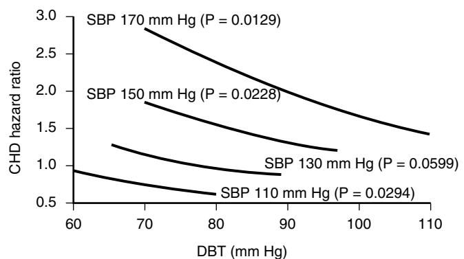
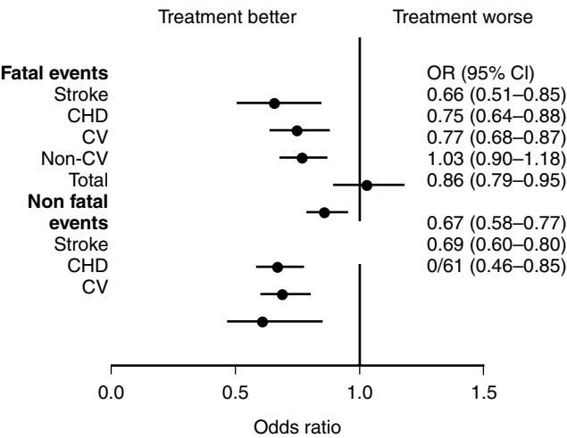

# Hypertension

Coronary heart disease and stroke remain the major causes of death in people aged over 65 years in westernized societies, with an elevated blood pressure (BP) level being the biggest treatable risk factor. With the ever-increasing number of elderly people in the population, hypertension is preeminent as a public health problem. It is perhaps surprising to realize that it was only in 1985 that the first large trial of blood pressure reduction in the elderly population was published, demonstrating the benefits of treatment in terms of reducing cardiovascular complications.1 Prior to this, a general reluctance to treat hypertension in older people prevailed, based it would seem on a few case reports of the adverse effects of antihypertensive drugs. This chapter deals with some of the more important aspects of hypertension in elderly people, while highlighting areas where important questions remain unanswered.

# **EPIDEMIOLOGY**

Blood pressure increases with age. This has been shown in both cross-sectional and longitudinal studies in nearly all industrialized cultures. The rise in systolic blood pressure (SBP) is almost linear up to age 80 years, values tending to plateau thereafter. Diastolic blood pressure (DBP) levels plateau earlier, at 50 to 60 years, and then fall.2 These changes herald the important age-related changes that occur in pulse pressure (PP) and mean arterial pressure (MAP). PP tends to rise steeply after the age of 60 years irrespective of the SBP levels when young; whereas MAP shows a much greater increase with age in those with high values in their 30s and 40s and reaches a plateau after the age of 50 to 60 years.

There are many factors governing these changes, both environmental and genetic. For example, blacks tend to have a greater age-related rise than whites, especially in women. Important sex differences in the BP changes with age are also found when comparing the results from cross-sectional and longitudinal studies, with the former showing women to have higher SBP and DBP values than men after 50 years of age. Cohort studies show a different pattern, with SBP increasing to the same degree in both sexes with little difference in age-related values; whereas DBP levels for women are consistently lower than for men, of the order of 5 mm Hg. It is possible that some of these differences in cross-sectional studies are due to selective mortality differences (such as death rates being higher in those with higher BP levels) resulting in an underrepresentation of those with initially high BP levels in the older age groups. Lifestyle differences probably account for some of these age-related alterations, little change in BP being seen with advancing years in some nonwesternized cultures.

# **Prevalence and incidence**

The prevalence of hypertension is dependent on the definition used. Classically the threshold is the BP levels at which treatment appears to offer benefit over nontreatment, but the actual BP levels taken for defining hypertension have changed considerably recently. Definite hypertension, as originally

*300*

defined in the Framingham Heart Study (SBP = 160 mm Hg and/or DBP = 95 mm Hg or on antihypertensive treatment), was present in 39% of men and 48% of women in those aged 65–94 years.2 In the United Kingdom, higher overall prevalence rates for hypertension have been reported, using the more liberal criteria (160/90 mm Hg) 61% of men and 63% of women aged 65 and over had hypertension, which rose to 78% and 83%, respectively, using a 140/90 mm Hg cut-off point.3 There are, however, marked differences in prevalence rates between countries (e.g., North American rates being about 50% for those aged 65 to 74 years compared with 80% for Germany).4 In the majority of these studies, these rates are based on two or three recordings at a single visit and, given the increased BP variability in older people, the estimates are probably too high and the rates based on repeated measurements are about 30% less than those quoted. For example, in a U.K. study of people aged 65 years and over, 52.2% had hypertension at first screening compared with 10.3% at the third visit 6 to 12 weeks later.5

As the systolic BP tends to increase to a greater extent than the diastolic BP with advancing years, isolated systolic hypertension (ISH) is the commonest form of hypertension in older people. Prevalence rates for ISH in the BIRNH Study were 9.9% in men and 11.7% in women aged 65 to 74 years, compared with rates for diastolic hypertension (DBP = 95 mm Hg) of 15.8% and 10.6%.6 For those aged 75 to 89, ISH rates increased to 15.3% and 17.4% in men and women, whereas diastolic hypertension (DH) fell to 7.7% in men but increased slightly to 11.2% in women. Interestingly, 84% of all female hypertensives in the study were aware of their diagnosis, compared with less than 70% of men, highlighting the need for BP screening in this age group. Other studies using multiple BP recordings made on several visits have found prevalence rates for ISH of 4.2%, combined hypertension (CH) in 3.9%, and isolated DH of 1% in those aged 65 to 84 years.5

Favorable trends in terms of decreasing hypertension prevalence are being reported. In the United States, rates have declined progressively since 1971. For example, in the NHANES study, rates of hypertension in men aged 60 to 74 fell from 37.9% in 1971–1974 to 35.4% in 1988–1991, and for women from 64.7% in 1971–1974 to 51.1% in 1988–1991.3 Incidence rates have changed little, being of the order of 9% and 6% per 2 years for men and women, respectively, in those aged 70 to 79 years.7 However, reliable incidence data are relatively scarce, particularly in the very elderly population.

# **Blood pressure and risk**

Framingham data have shown that elderly hypertensives have three times the risk of a cardiovascular (CV)-related death than age- and sex-matched normotensives.8 There has been much discussion as to whether this relationship between BP and CV mortality is linear, U-shaped, or J-shaped, giving rise to the opinion that there may be an optimum level to which elevated BP values should be reduced. Intervention studies have suggested that reducing BP levels too much may paradoxically increase cardiovascular and noncardiovascular risk. However, a U- or J-shaped relationship between BP and CV mortality has been reported in the placebo arms of these studies, so this could not be an effect of treatment per se.

Many of the studies suggesting an increased risk with lower BP levels were of relatively short duration and did not control for potentially confounding variables. The largest meta-analysis of prospective observational studies to date, involving nearly 1 million adults with no previous history of CV disease, has clearly shown a log-linear relation between increasing BP levels and CV mortality at least up to the age of 89 years with no evidence of a J- or U-shaped effect down to SBP levels of 115 mm Hg and DBP values of 75 mm Hg. A reduction in SBP of 20 mmHg would reduce risk of stroke mortality by 74% in those aged 40–49 years but only by 33% in those aged 80–89 years; for CHD the figures were 0.49 and 0.67 respectively. However, as the absolute risk of stroke and CHD events is much greater in the elderly, a 20 mm Hg lower SBP or a 10 mm Hg lower DBP would result in an annual difference in absolute risk that is almost 10 times greater in those aged 80 to 89 years compared with the 50- to 59-year-old group.9 For the very elderly, blood prospective observational studies have suggested high BP is not a risk factor for mortality and low values are associated with excess mortality.10

# **SBP, DBP, and risk**

Systolic blood pressure is a bigger risk factor than DBP for cardiovascular disease in older people. In the Copenhagen heart study,11 the risk ratio (RR) for stroke due to ISH (SBP = 160 mm Hg, DBP <90 mm Hg) in men was 2.7, but for diastolic hypertension (DBP = 90 mm Hg irrespective of SBP) it was 1.7 compared with normotensives. For myocardial infarction no such difference was seen in the relative risk between ISH and diastolic hypertension. More important, borderline ISH (SBP 140 to 159, DBP <90 mm Hg) in the Physicians Health Study12 was associated with a 32% increase in CV events compared with normotensives, and a 56% increase in CV deaths. If future studies show that treatment of borderline ISH reduces CV risk, this will have enormous implications because over 20% of those aged over 70 years fall into this BP category.

# **Pulse pressure and risk**

Pulse pressure increases greatly after the age of 50 years as a result of arterial wall stiffening with the associated increase in SBP and fall in DBP. In older age groups in the Framingham study,13 coronary heart disease was found to be inversely related to DBP at any given level of SBP =120 mm Hg, suggesting that higher pulse pressure is as important, if not more so, than any other component of BP in predicting CHD risk (Figure 43-1). Pulse pressure was a better predictor than SBP, independent of DBP levels, for estimating the development of congestive heart failure (CHF); for each 10 mm Hg increase in pulse pressure there was a 14% increased risk of CHF, compared with a 9% increase for the same change in SBP.

Although SBP and PP are the best predictors of coronary heart disease, the same is not necessarily true for stroke. Mean arterial pressure has been found, in some studies

Figure 43-1. Influence of systolic and diastolic blood pressure on CHD risk in 50- to 79-year-olds. CHD hazard ratios are determined from the level of DBP within SBP groups. Hazard ratios are set to a reference value of 1.0 for an SBP of 130 and a DBP of 80 mm Hg. All estimates are adjusted for age, sex, body mass index, smoking, glucose tolerance, and total/HDL cholesterol. *(Data from the Framingham study, reprinted from Franklin et al. [1999].*13*)*

at least, to be a better predictor of stroke than either SBP or PP. In the Systolic Hypertension in the Elderly Programme,14 a 10 mm Hg increase in PP was associated with a relative risk of stroke of 1.11 (1.01 to 1.22) compared with 1.20 (1.02 to 1.42) for a similar MAP rise.

The finding that PP is as good a predictor of coronary heart disease as SBP has potential implications for treating hypertension because there seems little point in lowering SBP and DBP to the same extent, (keeping PP unchanged) because this may contribute to maintaining some degree of CV risk. It would thus appear that, in elderly people, CHD events are more closely related to pulsatile load than steadystate components of blood pressure. This may explain why, overall, 30% to 60% of all CV events in the elderly population are attributable to mild or moderate hypertension.

# **PATHOGENESIS**

Mean arterial pressure (MAP) is determined by cardiac output and peripheral vascular resistance (PVR) and is the steadystate component of blood pressure. The dynamic component, pulse pressure (PP), is the variation around the mean state and is influenced by large artery stiffness, early pulsewave reflection, left ventricular ejection, and heart rate. A rise in PVR and large artery stiffness will increase the systolic BP component, whereas a decrease in PVR or an increase in large artery stiffness will result in a fall in diastolic BP, the latter being the dominant change in older hypertensives.

The main cardiovascular pathophysiologic changes associated with aging are arterial dilation and a decrease in large artery compliance, especially in the aorta, because of the loss of elastic fibers in the vessel wall and a concomitant increase in collagen. Arterial stiffening leads to enhanced pulse-wave velocity and early reflected waves augmenting the late systolic aortic pressure wave, resulting in a systolic increase and diastolic fall. The rise in mean aortic pressure is augmented by the rise in PVR, seen particularly in older women, enhanced by impaired endothelial release of nitric oxide, especially in older hypertensives. The increase in systolic load puts excess mechanical strain on the left ventricle, leading to concentric wall thickening. Because coronary artery perfusion is primarily dependent on the diastolic pressure, any reduction in DBP can have adverse effects on coronary artery perfusion, especially as left ventricular myocardial demands are increased in hypertension. Intimal wall damage results in the development of atherosclerosis and an increased likelihood of thrombosis.

The other main features associated with hypertension in old age are a reduction in heart rate, cardiac output, intravascular volume, and glomerular filtration rate, and decreased cardiac baroreceptor sensitivity (BRS) although cerebral autoregulation is unimpaired with normal aging and hypertension.15,16 This decrease in cardiac BRS accounts for the increase in BP variability found in older hypertensives, and it perhaps plays a role in the increased susceptibility to postural hypotension. Both renal plasma flow and plasma renin activity (PRA) levels decrease with age, the fall in PRA being more marked in elderly hypertensives than in normotensives. Plasma noradrenaline (norepinephrine) levels increase with age and are associated with a decrease in β-adrenoreceptor sensitivity. The effect of age and hypertension on α-adrenoreceptor sensitivity is still unclear.

## **OTHER CARDIOVASCULAR RISK FACTORS**

Hypertension should not be considered in isolation. Irrespective of the age of the patient, it is important that overall cardiovascular risk be assessed, taking into account other important risk elements such as cholesterol levels, smoking habits, and the presence or absence of diabetes.

### **Lipid abnormalities**

Early data suggested that serum total cholesterol (TC) levels increase with age and remain a significant independent predictor for CHD in men. The effect in women is less clear because the number studied has been too small to draw firm conclusions. The SHEP study14 found that TC and LDL cholesterol remained significant indicators of risk in both sexes, such that a 1 mmol/L increase in TC was associated with a 30% to 35% higher CHD event rate. More recently the Prospective Studies Collaboration meta-analysis of prospective observational studies involving more than 900,000 adults has shown increasing TC levels to be a risk factor for CV mortality even in the very old, though the risk is attenuated with age such that a 1 mmol/L lower TC was linked to a significant reduction in the HR for CHD to 0.57 in those aged 50 to 59 years compared with 0.85 in the 80- to 89-year-old group.17 As in previous studies the effect was greater in men than women in the older age groups, but the effect was seen in both sexes up to 90 years. However, for stroke, the link with TC was not as strong as for CHD. For a similar TC reduction, there was a significant lowering of the HR for stroke by 9% in 50- to 59-year-olds compared with a nonsignificant 5% increase in the HR in those aged 80 to 89 years. For CHD, but not stroke, the ratio of TC to HDL-cholesterol was a better predictor than TC alone but the predictive power fell with age, a 1.33 lower ratio being related to a 31% decrease in CHD mortality in the age 70- to 89-year-group compared with a 44% reduction in 40- to 59-year-olds. For stroke in those aged 70 to 89 years and with a SBP greater than 145 mm Hg, TC was negatively correlated with hemorrhagic and total stroke mortality, a 1 mmol/L lower TC.

# **Diabetes mellitus**

Up to 10% of elderly people with hypertension will have impaired glucose tolerance, and diabetes doubles the risk of developing coronary heart disease and stroke in those aged 65 to 94 years. Like total cholesterol, however, its impact on CV events falls with age: women remain slightly more at risk than men, though the absolute risk from diabetes is greater in the elderly than the young.

## **Body mass index**

Increasing body mass index (BMI) is associated with an elevation in blood pressure, but the risk of obesity-related hypertension declines with age, there being a threefold increase in hypertension in obese 20- to 45-year-olds compared with a 1.5 increase in 65- to 94-year-olds. For each unit of BMI increase (kg/m2), SBP can be expected to increase by 1.2 mm Hg and DBP by 0.7 mm Hg.

Interestingly, for elderly hypertensive men, CV relative risk increases from 1.8 to 2.9 between the lowest and highest tertiles of BMI, whereas the reverse is true for women. Even so, hypertension still more than doubles the risk of developing CV disease in both sexes. In the European Working Party on Hypertension in the Elderly (EWPHE) study,18 those with the lowest total mortality and CV terminating events were found in the moderately obese group with a BMI of 28 to 29 kg/m2, whereas those with a BMI of 26 to 27 had the lowest cardiovascular mortality. Truncal obesity (reflected in an increased waist to hip ratio) is more strongly related to hypertension and is a better predictor for coronary heart disease and stroke than BMI alone.

# **Smoking**

Although the number of smokers decreases with age, smoking remains a significant risk factor for CV mortality in older persons (the relative risk is 2.0 for males and 1.6 for females). The relative risk of stroke among older hypertensive smokers is five times that of normotensives but 20 times that of normotensive nonsmokers. The benefits of stopping smoking in terms of reducing coronary heart disease and stroke mortality are still present even in the 70- and over age group, with the excess risk of mortality declining within 1 to 5 years of quitting. Older smokers should therefore be encouraged to stop. Hypertensive cigarette smokers have an increased relative risk of stroke nearly quadruple that of hypertensive nonsmokers (pipe/cigar use still increases the risk threefold). Encouragingly, hypertensive exsmokers of less than 20 cigarettes per day have, after only a few years of quitting, a similar risk to that of hypertensive nonsmokers.

# **Atrial fibrillation and left ventricular hypertrophy**

In patients with atrial fibrillation, hypertension doubles the stroke risk compared with normotensives. Electrocardiographically diagnosed left ventricular hypertrophy (LVH) increases with age, reported prevalence rates being 6% in men and 5% in women aged 65 to 74 years, compared with 9.4% and 10.8%, respectively, in those aged over 85. LVH has a significant effect on CV risk. Its presence in those aged 65 to 94 years nearly triples the risk for men and quadruples that in women, but this effect is less than that seen in younger age groups with a similar blood pressure.

# **Alcohol and diet ALCOHOL**

The association between high alcohol consumption and blood pressure has been known for a very long time, although the relationship is not linear in most epidemiologic studies. It takes on a J- or U-shaped form, with the lowest incidence of hypertension being seen in those consuming around 5 to 10 units of alcohol per week. Large falls in BP (19/10 mm Hg) have been recorded with abstention in those aged 70 to 74 years who had a long history of heavy alcohol intake. Excessive alcohol intake has been directly related to stroke risk. It is unknown whether this is due to its direct pressor effect or to some other mechanisms, such as alcohol-induced cerebral vasoconstriction or cardiac dysrhythmia, particularly atrial fibrillation. As there appears to be a mild protective effect of a small amount of alcohol in older people, two units per day would seem a reasonable upper limit to recommend.

# **DIET**

The relationship between dietary sodium intake and hypertension strengthens with age. For a 100 mmol/day increase, mean BP rises by 5 mm Hg in those aged 20 years but this more than doubles in those aged 60 to 69 years. Conversely, increasing potassium intake by 60 mmol per day reduces BP in older people by as much as 10/6 mm Hg. Increasing potassium dietary intake may also reduce stroke risk independently of its hypotensive effect. The average daily potassium intake in elderly people in the United Kingdom is around 60 to 70 mmol. This could be raised to over 100 mmol simply by increasing consumption of vegetables and fruit.

# **Physical exercise**

Even mild-to-moderate physical exercise such as walking for 30 minutes three to four times a week has a hypotensive effect. Vigorous exercise in young to middle-aged persons prevents stroke in later life. Whether these effects are mediated solely through BP-lowering or are a result of other mechanisms, such as exercise-induced decreases in fibrinogen levels or an increase in HDL cholesterol, is unknown.

# **Hormone replacement**

There has been considerable controversy over the benefits or otherwise of hormone replacement therapy (HRT) in CV disease prevention. A recent overview has suggested treatment has no significant effect on all-cause mortality, nonfatal myocardial infarction rates, or CHD death but a significant 29% increase in stroke risk and therefore cannot be recommended to reduce CV disease.19 The effect of HRT in hypertensives is unknown and data are insufficient to see if the general increased risk of stroke is further increased in this group.

# **COMPLICATIONS OF HYPERTENSION**

# **Stroke**

Hypertension remains the major treatable risk factor for stroke, although the attributable risk for increasing BP levels decreases with age. For a 10 mm Hg increase in usual diastolic BP, the risk of stroke is almost doubled. A reduction of 9/5 mm Hg can be expected to produce about a 30% reduction in stroke incidence, whereas a fall of 18/10 mm Hg halves the risk; these expectations are irrespective of baseline BP levels.

The relative risk of cerebral infarction varies depending on the hypertension type in older age groups.20 Isolated systolic hypertension (ISH) is a bigger risk factor (ratio 2.3) than is combined systolic and diastolic hypertension (ratio 1.5). The population attributable risk for stroke in those aged 70 to 79 years with ISH is about 21% for women and 17% for men, whereas for those aged 50 to 59 years the figures are 5% for women and 4% for men. Although the relative risk of stroke from raised BP decreases with age, this is not because hypertension per se loses its effect as a risk factor, but that more strokes occur in those with "normal" blood pressure. Intracerebral hemorrhage is also closely related to hypertension, the relative risk varying from 2.0 to 9.0 between studies—being greater for combined hypertension than ISH, particularly in younger patients.

Raised BP levels are common in the first days to weeks after stroke, and BP levels tend to settle spontaneously. There is, however, increasing evidence that raised BP levels following acute stroke are associated with a poor outcome in terms of death and dependency.21 There is a small but convincing body of evidence to suggest an almost linear relationship between increased BP values in the poststroke period and stroke recurrence rate.

# **BP and asymptomatic cerebrovascular disease**

Deep white matter lesions (leukoaraiosis) in asymptomatic hypertensive elderly patients are frequently found on magnetic resonance scanning. Whether these lesions account for the age-related cognitive impairment seen with hypertension that has been reported in many studies is unknown. It is also uncertain whether they increase the risk of subsequent cerebral infarction or hemorrhage. Isolated systolic hypertension, in particular, is associated with these subcortical lesions, and good BP control appears to have a protective effect. Large diurnal falls in BP are associated with silent subcortical white matter lesions and lacunar infarcts, but these are found also in those who have marked nocturnal rises in BP.

# **Cognitive impairment**

The influence of blood pressure on cognitive decline and psychomotor function, over and above its association with vascular dementia, has been much debated. Some studies show no such relationship whereas others report a strong positive correlation with both vascular and Alzheimer-type dementia. A recent overview has suggested that increasing BP levels in midlife are a risk factor for cognitive impairment and dementia in old age, but that there is an inverse correlation between BP measured in old age and dementia in crosssectional studies. The results of longitudinal studies of BP and cognition in later life are inconsistent, as are those for BP and dementia, though the majority suggest a low BP is common in those with severe cognitive impairment.22 Treating hypertension even with small falls in BP is associated with improvements in MMSE scores and immediate and delayed memory scores.23 A recent meta-analysis showed treating hypertension in the very elderly significantly reduced the risk of dementia by 13%.24 The pathogenesis of hypertension-related cognitive impairment is unclear. It could be linked to a decrease in cerebral blood flow with increasing BP levels and alteration in the cerebral metabolism over and above the changes associated with leukoaraiosis.

### **Cardiac disease**

The relationship between coronary heart disease and hypertension is discussed in Chapter 34. Hypertension accelerates the development of coronary artery atheroma through many mechanisms, particularly in association with metabolic abnormalities as in the insulin-resistance syndrome. Increased blood glucose and insulin levels, and changes in total cholesterol, HDL and LDL levels, and endothelial dysfunction result in impaired endothelial-dependent relaxation and increased leukocyte adherence, smooth muscle proliferation, intimal macrophagic accumulation, fibrosis, and arterial medial wall thickening. These changes, along with increased vascular oxidative stress and free radical production (see Chapter 32), result in inflammatory changes in the arterial wall, monocyte migration into the intima, and plaque formation.

### **DIAGNOSIS AND EVALUATION**

### **General issues**

Assessment of blood pressure levels in elderly people can pose particular problems, but it is essential that accurate measurements be made if patients are not to receive unnecessary or inadequate treatment. Minute-to-minute BP variations occur with respiratory and vasomotor changes. During the 24-hour period, BP fluctuations are related to mental and physical activity, sleep, and postprandial changes. Seasonal variations are also seen, with BP levels being higher during the winter months. Hypertensive patients have a greater absolute BP variability than normotensives, but when corrected for baseline values little difference exists. Clinically important differences are frequently found between individual readings at a single visit and between visits. Large falls in BP with repeated measurements in elderly hypertensives have been reported in nearly every placebo-controlled interventional trial, the effect increasing with age and amounting to as much as a 10/5 mm Hg decrease. The tendency for BP levels to decrease with time is related in part to regression to the mean and familiarity with the procedure of BP measurement. The British Hypertension Society (BHS) guidelines recommend that in uncomplicated cases an average of two readings be taken sitting on four occasions over a 2- to 3-month period during initial assessment.25 It is particularly important to measure BP levels 1 and 3 minutes after standing to assess postural BP change in view of the frequency of orthostatic hypotension in this age group.

### **Measuring blood pressure**

With the expected phasing out of mercury sphygmomanometers and their replacement by semiautomatic devices, it is important that manufacturers provide accurate equipment validated in the elderly. A list of BP measuring devices that have been validated for use in young and elderly persons is constantly updated on the British Hypertension Society Web site (www.bhsoc.org). Cuff size is important as undercuffing gives falsely high BP values. Cuff width should be equal to two thirds of the distance between axilla and antecubital fossa, and when the bladder is placed over the brachial artery, it should cover at least 80% of the arm's circumference—which should be kept supported at heart level. Clinicians should obtain both standard and large cuffs and ensure they are used appropriately.

The measurement should be taken in both arms initially because more than 10% of elderly people have at least a 10 mm Hg difference between arms. The arm with the highest reading should be used for subsequent measurements. All elderly people should have their BP measured every 5 years up to age 80 years at least, and in those with high normal BP (135 to 139/85 to 89 mm Hg) it should be assessed annually.

### **Ambulatory blood pressure monitoring**

The role of ambulatory monitoring (ABPM) in the assessment of elderly people with hypertension is still being defined. Twenty-four-hour monitoring reduces the variability and the alerting response to measurement, so that 75% of elderly hypertensives will have lower ABPM measurements than clinic values. Casual measurements tend to be in the order of 20/10 mm Hg higher than 24-hour values. Daytime BP values are the best predictor of target organ damage.

The value of other information that the 24-hour ABPM profile can provide, such as day-night differences, is unknown. The Syst-Eur study26 has emphasized that ABPM is a significantly better predictor of CV risk than are casual measurements. ABPM could be recommended in the following cases:

- To diagnose white-coat hypertension (persistently elevated clinic BP levels while normotensive on ABPM)
- When BP appears resistant to therapy (using three or more agents)
- In those with symptoms of postural hypotension and postprandial hypotension

However, there is little justification as yet to use it routinely in all elderly hypertensive patients because it is expensive and time-consuming, though generally well tolerated.

Suggested normal values are: daytime ≤135/85 mm Hg; nighttime <120/70 mm Hg; and 24-hour ≤130/80 mm Hg. Abnormal values are: daytime >140/90 mm Hg; nighttime >125/75 mm Hg; and 24-hour >135/85 mm Hg.27

Cuff measurements tend to underestimate intra-arterial levels of systolic BP by up to 5 to 10 mm Hg, and to overestimate diastolic BP by about 5 to 15 mm Hg. "Pseudohypertension" refers to falsely high noninvasive recordings caused by arterial rigidity, which prevents the vessel collapsing during cuff inflation. The prevalence of this condition in an unselected elderly population is probably very low, of the order of 1% to 2%. Unfortunately there is no accurate way of predicting the condition. Osler's maneuver (said to be positive when the radial artery is still palpable following the occlusion of the brachial artery) is unreliable.

### **Clinical assessment and investigations**

One common feature of hypertension in young and elderly people alike is that it is very often asymptomatic. Complaints often attributed to increased BP levels, such as headache, are in fact unrelated in most cases. History and examination should include assessment for the presence of important CV risk factors (such as diabetes), for symptoms and signs of secondary causes of hypertension, and for evidence of target organ damage. Other important factors to be considered are the presence of confusion, urinary incontinence, decreased mobility, other medication use (for possible drug interactions which will affect the need for and type of antihypertensive agent)—all of which will influence treatment decisions. Examination should focus on evidence of target organ damage, including peripheral pulses and bruits (renal or carotid), and cardiac murmurs. Ophthalmoscopy is used for possible malignant-phase and diabetic changes, and a neurologic examination for signs of cerebrovascular disease and vascular dementia.

Initial investigations should include height, weight, blood samples for urea and electrolytes, creatinine and glucose estimations, and a 12-lead ECG (to exclude ischemic change, dysrhythmias, and left ventricular hypertrophy). In those aged ≤70 years for primary prevention, and in those ≤75 years for secondary prevention, total cholesterol and HDL cholesterol levels along with urine analysis for protein and blood should be included. Chest x-ray is of doubtful benefit, except in those who may have heart failure or chest disease. Plasma calcium and uric acid levels may also be useful to look for primary hyperparathyroidism (which is more frequent in elderly people with hypertension) and to check for gout. Echocardiography is rarely needed.

Renal artery stenosis is the only major secondary cause of hypertension in this age group. It should be considered:

- When there is a sudden onset or rapid progression of hypertension
- If BP control suddenly becomes difficult, particularly in those at greater risk of atherosclerotic renal artery stenosis, diabetics, smokers, and those with peripheral vascular disease
- In those developing malignant phase hypertension
- Where there is rapid deterioration of renal function, particularly after starting angiotensin-converting enzyme inhibitors

Renal ultrasound is not reliable for making the diagnosis of renal artery stenosis, although a significant difference in renal size may be suggestive. Captopril renography is not always helpful, and imaging techniques—either duplex ultrasonography or MR angiography—are the mainstays of diagnosis.28

# **MANAGEMENT OF HYPERTENSION**

This section summarizes briefly the results of the important trials of drug therapy on outcome in elderly people. Space does not allow a full description of each trial.

Several recent large intervention studies have assessed the effects of antihypertensive drug treatment on outcome in elderly people, all of which have shown a positive benefit for active treatment. This is perhaps surprising given the heterogeneity of the patients included in the trials (those with combined hypertension, combined and ISH, or ISH alone, the presence or absence of target organ damage, and varying CV risk factors), the differences in antihypertensive drugs used, and the varying length of follow-up.

# **Published trials TRIALS IN COMBINED HYPERTENSION**

The first large trial solely in elderly patients, which awoke widespread interest, was the European Working Party Hypertension in the Elderly (EWPHE) trial published in 1985.1 The results suggested that, for every 1000 elderly patients treated for 1 year initially with a diuretic, 11 fatal cardiac events, 6 fatal and 11 nonfatal strokes, and 8 cases of congestive cardiac failure would be prevented. Other randomized controlled trials that have enrolled hypertensive patients over 70 years include: that reported by Kuramoto et al29 using thiazide diuretics as first-line therapy; the Hypertension in Elderly People trial,30 using β-blockers; the MRC elderly study,31 using thiazides or β-blockers; and the STOP-Hypertension trial,32 again using thiazides or β-blockers as first-line agents. These have all shown the benefits of treatment in reducing cardiovascular disease (Table 43-1).

**MORTALITY.** Of the five studies noted above, only the STOP-Hypertension trial reported a significant reduction in all-cause mortality following treatment (relative risk 0.57; 95% CI = 0.37 to 0.87). A meta-analysis of these five trials demonstrates an insignificant overall reduction in total mortality (odds ratio [OR] 0.90; 0.79 to 1.02), but overall

| Table 43-1. Compelling and Possible Indications, Contraindications, and Cautions for Use of the Major Classes |
|---------------------------------------------------------------------------------------------------------------|
| of Antihypertensive Drugs in Elderly People                                                                   |

| Class of Drug                               | Compelling Indications       | Possible Indications                                                                | Compelling Contraindications            | Possible Contraindications        |
|---------------------------------------------|---------------------------------|-------------------------------------------------------------------------------------|--------------------------------------------|--------------------------------------|
| A. ACE inhibitors                           | Heart failure                   | Chronic renal disease Left ventricular dysfunction Type 1 diabetic neuropathy | Renovascular Type 2 diabetic neuropathy | Renal impairment disease PVD      |
| B. Beta-blockers                            | Myocardial infarction Angina | Heart failure                                                                       | Asthma/COPD Heart block                 | Heart failure Dyslipidemia PVD |
| C. Calcium antagonists (dihydropyridine) | Elderly ISH                     | Elderly angina                                                                      | —                                          | —                                    |
| D. Thiazide diuretics Others             | Elderly                         |                                                                                     | Gout                                       | Dyslipidemia                         |
| Alpha-blockers                              | Prostatism                      | Dyslipidemia                                                                        | Urinary incontinence                       | Postural hypotension                 |
| All antagonists                             | ACE-inhibitor-induced cough  | Heart failure Intolerance of other antihypertensive drugs                     | Renovascular disease                       | PVD                                  |
| Calcium antagonists with (rate-limiting) | Angina                          | Myocardial infarction                                                               | Heart block Heart failure               | Combination with blockade         |

See text for explanation of ABCD classification.

Abbreviations: *ACE,* angiotensin-converting enzyme; *ISH,* isolated systolic hypertension; *COPD,* chronic obstructive pulmonary disease; *PVD,* peripheral vascular disease. Adapted from Ramsey LE, Williams B, Johnston GD, et al. Guidelines for the management of hypertension: Report of the third working party of the British Hypertension Society. J Hum Hypertens 1999;9:569–92.

cardiovascular deaths were significantly reduced (OR 0.78; 0.66 to 0.92), as were CHD deaths (OR 0.73; 0.59 to 0.91) and stroke deaths (OR 0.68; 0.50 to 0.94).

**NONFATAL EVENTS.** An overall picture of treatment effects on nonfatal events is difficult to formulate because different trials used different criteria for defining nonfatal events; for example, "cerebrovascular events" may have included or excluded transient ischemic attacks or minor strokes. With these provisos in mind, nonfatal stroke events were significantly reduced (OR 0.69; 0.54 to 0.87), as were CV events (OR 0.72; 0.60 to 0.88), but with considerable variation between trials. For example, nonfatal stroke events in the STOP-Hypertension trial were reduced by 38% and in the HEP trial by 27%, and nonfatal coronary events by 20% in HEP and by 9% in EWPHE.33 The benefits of treatment in terms of proportional risk reduction were similar between studies (a 35% to 40% decrease in all stroke events), but the absolute benefit seen was related to the underlying patient risk. In the MRC study,31 strokes prevented per 1000 patient years of treatment were approximately 2.5, compared with approximately 14 in the STOP-Hypertension trial.32 Drug therapy reduced the risk of hemorrhagic stroke within just 1 year of starting treatment, and within 2 years for ischemic stroke.

#### **TRIALS IN ISOLATED SYSTOLIC HYPERTENSION**

Trials involving ISH patients only (SHEP,34 Syst-Eur,35 and Syst-China36) have shown similar reductions in stroke and, to a lesser extent, coronary heart disease. Syst-Eur and Syst-China were unique in their time because they were the first to use calcium channel blockers (CCBs) as first-line antihypertensive treatment. Concerns had been raised about decreasing diastolic pressure further in patients with ISH because low DBP levels in cross-sectional longitudinal studies have been shown to be associated with an adverse prognosis in this age group. However, these worries do not seem justified because in the SHEP study treatment reduced DBP from 77.5 mm Hg to 68 mm Hg and yet significant reductions were seen in fatal and nonfatal stroke and myocardial infarct rates. Overall for the ISH studies there were significant reductions in total mortality by 17%, in CV mortality by 25%, and in fatal and nonfatal stroke by 37%. These benefits are similar to those seen in non-ISH trials.

#### **COMBINED RESULTS**

The combined results of the CH and ISH trials are shown in Figure 43-2. They suggest that only 45 elderly people with hypertension would need to be treated for 5 years to prevent one CHD event, compared with 180 younger hypertensives. For stroke the benefits are even greater, with only 22 elderly patients needing treatment to prevent a cerebrovascular event compared with 113 under 65 years. These benefits were achieved with relatively modest reductions in BP of about 20/10 mm Hg. Drug compliance among elderly hypertensives is generally as good as that for younger patients despite numerous factors that can affect this, including poor eyesight and hearing, confusion, etc. Simple oncedaily drug regimens, and perhaps increased use of combined preparations, will improve compliance and therefore blood pressure control.

There is now convincing evidence that antihypertensive treatment should be introduced in nearly all patients up to

Figure 43-2. Effects of treatment on fatal and nonfatal events. Data from randomized outcome trials involving hypertensive patients aged 70 years and over.1,29–36

the age of 80 years if they have a systolic BP equal to 160 mm Hg and/or a diastolic BP equal to 100 mm Hg despite nonpharmacologic measures (see later discussion). Treatment should also be introduced in those patients with an SBP of 140 to 159 mm Hg and/or DBP equal to 90 to 99 mm Hg if target organ damage or other CV risk factors such as diabetes are present and their 10-year CHD risk is 15% (equivalent to a 20% CV risk). This risk can now be easily calculated using the Joint British Societies Coronary Risk Prediction Chart24 or a similar computer program. This chart cannot be used to predict risk in those aged over 75 years or those on treatment, but it can be used for assessing the need for statin therapy based on the TC:HDL-cholesterol ratio and for the introduction of aspirin (see later discussion).

### **Target BP levels for treatment**

Target blood pressure levels in trials have varied considerably and have also fallen considerably with time; for instance, target levels in the HEP study were 170/105 mm Hg, compared with less than 140 mm Hg for systolic BP in SHEP. The fact that the degree of CV risk reduction was so similar between studies is even more remarkable. However, with the concern still present about a potential U- or J-shaped relationship between BP levels on treatment and outcome, it was unclear how far BP should be reduced because no trial had specifically looked at this aspect in elderly patients, or in those with ISH. Results from the EWPHE trial1 suggested that allcause mortality was lower in those with an SBP on treatment of 150 mm Hg compared with those who achieved an SBP of 130 mm Hg.

The HOT study has gone some way to answering questions.37 This recruited 18,790 patients aged 50 to 80 years (mean 61.5 years) with a diastolic BP of 100 to 115 mm Hg who were randomized to three target DBP groups: ≤ 80 mm Hg; ≤ 85 mm Hg; or ≤ 90 mm Hg. All patients received initial therapy with the dihydropyridine calcium-channel blocker felodipine. In addition, patients were randomized to low-dose aspirin (75 mg daily) or no aspirin. Unfortunately it proved difficult to reach target BPs, particularly in the two lowest groups of DBP, despite triple therapy in the majority of patients. No differences were seen in outcome measures between the three target BP groups, apart from a borderlinesignificant reduction in myocardial infarctions in the less than 80 mm Hg group compared with the less than 90 mm Hg group. However, combining all patient groups showed that the lowest risk point for major cardiovascular events was a mean achieved SBP of 138.5 mm Hg and a DBP of 82.6 mm Hg, and CV mortality was lowest with a BP of 138.8/86.5 mm Hg. For stroke, the lowest estimated incidence was with an SBP of 142 mm Hg with no definite minimum DBP level. In a diabetic subgroup, however, major CV events were highly significantly reduced, the risk being halved for those in the ≤ 80 mm Hg group compared with the ≤ 90 mm Hg group. There seems to be little to be gained in reducing the diastolic BP below 80 mm Hg except in diabetic patients.

Based on these results, the British Hypertension Society guidelines recommend that clinic BP levels for optimal control should be SBP less than 140 mm Hg and DBP less than 85 mm Hg, and in diabetics less than 130/80 mm Hg, with minimum recommended levels for BP control of less than 150/90 mm Hg and 140/85 mm Hg, respectively.25

It is important to bear in mind that introducing antihypertensive treatment is only part of the risk-reduction process. It is the level of blood pressure while on treatment that is a much better predictor of subsequent events than baseline values—hence the need to achieve these target levels. This will mean three or more different antihypertensive agents in 20% to 30% of elderly hypertensives. It is also important that other CV risk factors be dealt with simultaneously, such as raised lipid levels and smoking.

# **Prophylaxis ASPIRIN USE**

Although aspirin reduces deaths following myocardial infarction and stroke, its routine use in patients with uncomplicated hypertension has been unclear. In the HOT study,37 those randomized to 75 mg of aspirin had a 15% (1% to 27%) reduction in major CV events, and MIs were reduced by 36% (15% to 51%); but stroke, total, and CV mortality rates were unaffected by treatment. Similar results were seen in a thrombosis prevention trial of men aged 45 to 69 years at high risk of CHD.38 Both studies emphasized that if any benefit from aspirin were to be achieved, BP levels must be controlled (i.e., <150/90 mm Hg before aspirin is started in patients with uncomplicated hypertension).

For elderly patients matters are less clear because the benefits of prophylactic aspirin use appear to decrease with age. There was a 52% risk reduction with aspirin for CHD in those aged 45 to 49, compared with 29% increase in those aged 60 to 69 years. Those least likely to benefit were patients with a systolic BP greater than 145 mm Hg compared with those with SBP less than 130 mm Hg.

Elderly hypertensive patients should receive low-dose aspirin (75 mg daily) only if BP levels are well controlled and their 10-year CV risk is equal to 15%, unless there are other specific indications (i.e., after stroke or MI, with diabetes, or other evidence of target organ damage). Even then, good BP control should be the aim.

# **Statin use**

No studies of statin use have specifically targeted people with hypertension, young or old. Conclusions drawn are therefore based on subgroup analysis of the large trials.

Insufficient data exist to support lipid-lowering therapy for primary prevention in patients aged over 75 years, and so routine lipid screening over this age is unnecessary. With regard to those at high CV risk and in secondary prevention, there have been just three large studies of statin use in patients up to the age of 82 years.39,40 The results suggest that a much more proactive stance should be taken. Evidence indicates that 65- to 82-year-olds with risk factors for, or established, CV disease and a TC level equal to 3.5 to 4.0 mmol/L will benefit from statin therapy in terms of reducing subsequent major CV events by about 20% to 25%, although the results for stroke were inconsistent ranging from no benefit to a 25% reduction over 5 years. Stroke patients in the nonacute phase with a mean TC of 5.5 mmol/L also benefit from cholesterol reduction with a statin, subsequent stroke events being reduced by 16% and CV events by 20%.41

There are no long-term studies of the effects of diet on lipid levels and CV events. Such measures are likely to reduce TC only by 10%. Effective reductions will therefore require potentially expensive statin treatment. Evidence suggests statin therapy could be justified in those with a 10-year CHD risk of 6%, which would mean that nearly two thirds of the elderly population should be on treatment! This is unlikely to be possible, so guidelines recommend that patients up to the age of 75 years with CHD or overt atherosclerotic diseases should be considered for secondary prevention with a view to reducing TC to ≤ 5 mmol/L or by 25%, whichever is greater (or LDL cholesterol to ≤ 3mmol/L or by 30%). For primary prevention, those up to the age of 70 years with TC equal to 5 mmol/L and a 10-year CHD risk greater than 30% should be considered for treatment.

# **Nonpharmacologic methods**

There is a general lack of enthusiasm for nondrug measures to reduce BP in elderly patients, despite the evidence of their efficacy (see later discussion). Various guidelines have emphasized their importance as first-line treatment in trying to achieve normotension and in reducing other CV risk factors.

# **WEIGHT LOSS**

A 2-kg weight loss over a 6-month period will reduce blood pressure by about 4/5 mm Hg in elderly hypertensive subjects.42 However, constant encouragement is needed to maintain this weight loss if the long-term benefit is to be seen. A body weight within 10% of ideal (or a BMI <26 kg/ m2) should be encouraged, not just for its hypotensive effects but also to improve glycemic control and lipid profiles, and to improve mobility and respiratory and cardiac function.

# **SALT RESTRICTION**

The hypotensive effect of reducing sodium intake increases with age. In elderly people with hypertension, an 80 mmol/ day decrease in sodium intake will result in an 8 mm Hg fall in SBP.43 This level of sodium reduction can be achieved simply by avoiding salty foods and not adding salt while cooking or at the table. Reducing salt added to processed food would make even greater reductions possible.

# **INCREASING POTASSIUM INTAKE**

Increasing potassium intake by 40 mmol/day will have a significant hypotensive action, reducing clinic BP by 10/6 mm Hg and 24-hour BP levels by 6/2 mm Hg.44 In addition, increasing dietary potassium intake may reduce stroke rates over and above any hypotensive action. The average intake of potassium in the United Kingdom is about 60 to 70 mmol/day, and an intake of 100 to 110 mmol/day can be achieved by encouraging greater consumption of fresh fruit and vegetables. Potassium supplements are not routinely recommended for their hypotensive action, and care must obviously be taken in those with renal impairment.

#### **REDUCING ALCOHOL INTAKE**

The alcohol-hypertension link has been firmly established, but the relationship is nonlinear. Most epidemiologic studies have shown a J-shaped curve, with the lowest incidence of hypertension in those drinking about 1 unit (10 g) of alcohol per day.45 Low levels of alcohol intake also appear to have a protective effect with regard to the development of coronary heart disease, even in older individuals, by raising HDL levels and having an antithrombotic effect.

#### **OTHER MEASURES**

Changing magnesium and calcium intake have not been found to have a significant effect on BP in the elderly population, although increasing vitamin C intake does have a mild hypotensive action and a positive effect on the lipid profile in older hypertensives.46 Caffeine may have an acute pressor effect in caffeine-naïve persons, but regular caffeine intake does not have a pressor effect (although some studies have shown increasing consumption is associated with an increased CHD risk). Mild aerobic exercise (walking 30 minutes a day three to four times a week) results in important reductions in BP (approximately 20/10 mm Hg) in older hypertensives. It also decreases stroke risk independently of its hypotensive action, and improves glucose profiles, reduces weight, and improves general well-being.47

#### **COMBINED EFFECTS**

The combined effect of dietary interventions has been investigated in two important studies. The Dietary Approaches to Stop Hypertension (DASH) trial48 studied the effects of a special diet rich in vegetables and fruit and low in dairy products. It compared this to a standard diet, while varying levels of sodium intake in persons with and without hypertension. The DASH diet with a low sodium intake resulted in a BP fall of 7 mm Hg in normotensives and 11.5 mm Hg in hypertensives—similar effects to those that might be seen with a thiazide diuretic (see later). However, the duration of the trial was only 30 days.

The Trial of Non-pharmacologic intervention in the Elderly (TONE) study42 randomized elderly hypertensives who were normotensive on monotherapy to drug treatment withdrawal and either sodium reduction (and, if obese, sodium reduction or weight loss or the combination) or usual care with a 30-month follow-up. End points of restarting hypotensive drug treatment or developing a CV event were significantly reduced by all the interventions, with a 53% risk reduction in the obese on the combined sodium-restriction and weight-loss diet. The study was underpowered to find a significant decrease in CV events alone, but the nutritional interventions were well tolerated.

Approximately 25% of elderly people with mild hypertension could remain off drug treatment for 12 months or more using nonpharmacologic measures. Predictors of those who will remain normotensive include the absence of ECG evidence of LVH, obesity, and patients with well-controlled SBP levels prior to withdrawal of treatment. In general, nonpharmacologic methods should be tried initially in all patients and given time to work, although constant encouragement will be needed. In the majority of patients drug therapy will also be needed. Important synergistic effects between nonpharmacologic and drug treatments are found, such as in sodium restriction with those patients treated with ACE inhibitors.

# **Drug treatments THIAZIDES**

Low-dose thiazide diuretics remain the first-choice antihypertensive agents in elderly patients for combined or isolated systolic hypertension.24 Their mode of action has not been fully resolved, but is in part due to a reduction in peripheral vascular resistance. Although there are concerns that thiazides may induce postural hypotension, this is not a significant side effect. Mild hypokalemia, hyponatremia, and hyperuricemia can occur but are not normally clinically significant if low doses are used. Impotence can still be a problem with these agents in all age groups. Serum electrolytes should be checked before and a few weeks after starting treatment to assess the need for additional potassium supplementation.

#### **B-ADRENORECEPTOR BLOCKERS**

β-blockers, such as thiazide diuretics, have been used as firstline therapy in several large intervention trials in the elderly. There are, however, theoretical reasons why they may not be the most obvious choice in elderly patients with hypertension because they reduce cardiac output and renin levels that are already reduced, and increase peripheral resistance. Although they can effectively reduce BP in this age group, they do not have a good side effect profile. For instance, in the MRC study in the elderly,31 30% of the β-blocker group were withdrawn because of major side effects, compared with 15% in the diuretic limb and 4% of those on a placebo. There were also significant differences between treatment limbs in outcome measures in the trial. The β-blocker group showed no significant reduction in coronary events, unlike the diuretic group.

A recent meta-analysis of all trials in elderly patients with hypertension using diuretics and/or β-blockers as first-line agents showed that, although β-blockers prevented all stroke events, they did not reduce stroke mortality; nor did they reduce CHD events, CV, or all-cause mortality, whereas diuretics showed a positive and significant advantage in all these outcome measures.49

In view of these findings, patient compliance and economic factors, thiazides are the drug of first choice for initial therapy. However, as over half of such patients will require two or more agents, β-blockers should still be considered as additional therapy but probably more as fourth-line agents except in certain elderly patient groups where β-blockers may still be considered as first-line agents (e.g., those who have had a previous myocardial infarction or have angina).

#### **CALCIUM-CHANNEL BLOCKERS**

Recent intervention studies involving elderly people with hypertension—the Syst-Eur,34 Syst-China,35 and HOT37 studies—have used members of the dihydropyridine CCB group as first-line therapy. There has been considerable debate about the safety of the dihydropyridines, and various meta-analyses have arrived at diametrically opposite conclusions. It is clear that the placebo-controlled intervention studies in the elderly using dihydropyridine CCBs as firstline treatment have shown significant benefits, particularly in terms of stroke and CV risk reduction. We still need the security of long-term safety data, but trial evidence indicates that these agents are generally well tolerated and effective, so are recommended as first-line agents in patients with isolated systolic hypertension in whom thiazide diuretics cannot be tolerated.23 Short-acting calcium-channel blockers have no role in the treatment of hypertension.

#### **ANGIOTENSIN-CONVERTING ENZYME INHIBITORS AND ANGIOTENSIN RECEPTOR BLOCKERS**

ACE inhibitors (ACEIs) are effective antihypertensive agents in young and old alike. First-dose hypotension may occur, especially in patients who are on large-dose diuretics, so it is usually recommended that these agents be stopped for a few days before initiating ACEI therapy. Hyperkalemia can be a problem, so potassium-sparing diuretics should be stopped with the introduction of these drugs. Problems with renal impairment have been reported in older patients taking NSAIDs and those with preexisting renal impairment. Renal failure may be precipitated in those with occult renal artery stenosis, so it is recommended that urea and electrolytes be checked before and 1 to 2 weeks after starting treatment. Cough can be a problem in about 10% of patients, so an AII antagonist may be a suitable alternative. There are theoretical reasons to suggest that the combination of ACE and AII inhibitors could be potentially synergistic in their hypotensive actions, although it is too early to recommend this combination.

There are now several outcome studies using ACEIs as first-line therapy in the elderly. STOP-2 trial50 compared the newer antihypertensive agents—a dihydropyridine CCB and an ACEI—against standard therapy with β-blockers and diuretics. Overall there was little difference in terms of outcome measures between the new and old agents. A comparison of the ACEI and CCB groups showed a greater reduction in myocardial infarction and congestive heart failure in the ACEI group (by 23% and 22%, respectively) but a greater decrease in stroke mortality with CCBs. Overall CV mortality, total mortality, and all major CV events were similar in the ACEI and CCB groups, with CV mortality being 20.5 per 1000 patient years in the ACEI group and 19.2 per 1000 patient years in the CCB group. There have been no large outcome studies using ACEIs as first-line therapy in elderly people with hypertension. Angiotensin receptor blockers (ARBs) have also been shown to be highly effective agents in the elderly hypertensive patient and do not have the troublesome side effect of cough seen with ACEIs.

#### **OTHER AGENTS**

α-Blockers still have a minor role in treating elderly people with hypertension and are usually used as additional, rather than first-line, therapy. The withdrawal of doxazosin as initial therapy in the ALLHAT study51 because of increased risks of heart failure and stroke compared with chlorthalidone supports this policy. α-Blockers may have a role in men with prostatic symptoms, and they can be used in renal failure, although postural hypotension and urinary incontinence remain a drawback in a significant number of patients.

Methyldopa, hydralazine, and centrally acting agents are rarely used because of their adverse side effect profiles. The former two agents need to be taken more than once a day, which does not aid compliance. There seems little reason to use agents that do not have a 24-hour hypotensive action when taken once daily.

#### **COMBINATION THERAPY**

More than 50% of these patients will need two or more agents if adequate blood pressure control is to be achieved.37 Not all agents have a synergistic effect. For example, the addition of a calcium-channel blocker to a thiazide diuretic in most studies has a minimal additional hypotensive effect. Adoption of the British Hypertension Society's "ACD strategy" will help form logical combinations, such that antihypertensive combinations are likely to have an additional hypotensive effect if their mechanisms of action are complementary.

The first-line agents in the elderly should be a thiazide diuretic (D) or, if that is not tolerated, a calcium-channel blocker (C). If control is not achieved, a first-line agent of the other group (i.e., ACEIs (A) or ARB) could be tried. If good control is still not obtained, an additional agent from the other group is added along the following lines in the elderly: (C or D) add (A) add (D or C) add to combination (A+C+D) fourth-line agent (e.g. alpha-blocker, or beta-blocker or speronolactone or amiloride) (see Table 43-1). It has been suggested the protective effect of blood pressure lowering is not substantially affected by the type of drug class given but is more dependent on the level of BP lowering achieved.52

# **SPECIAL CASES**

# **The 80 and over age group**

Several trials have included patients over the age of 80, but it has been unclear whether they benefit from treatment. Longitudinal studies have shown that raised blood pressure in the very old (aged 75 to 80+ years) is not as big a risk factor as in younger people. However, the SHEP study34 showed that only the 80 and over age group had a significant reduction in CV risk with active treatment compared with placebo, although there were similar trends in the 60 and over and 70 and over age groups. A meta-analysis of these trials53 that included all the patients aged 80 and over showed that treatment prevented 34% (18% to 52%) of strokes, with a reduction in major CV events (23%) and heart failure (42%). However, total mortality was increased by 15% in the actively treated group, leaving physicians with a considerable dilemma as what is best for very old hypertensive patients.

The Hypertension in the Very Elderly Trial (HYVET)54 was specifically designed to assess if lowering BP (with a diuretic ± ACEI regime) reduced CV events in the 80 and over age group. After a relatively short follow-up period of 1.8 years, active treatment significantly lowered BP by 15/6 mm Hg and reduced the risk of fatal and nonfatal stroke by 30%, heart failure by 64%, and total mortality by 21%, and there were less side effects than in the placebo group. Given these important findings, patients aged 80 and over with newly diagnosed hypertension and who are generally fit with a reasonable life expectancy should be considered for treatment whether they have evidence of target organ damage or not. Those who reach 80 years of age already on treatment this should be continued.

# **Type II diabetes**

Hypertension is common in elderly type II diabetics. Nearly two thirds will have raised BP levels that require treatment. Elderly diabetics as much as their younger counterparts should be treated aggressively in terms of BP reduction. The UK Prospective Diabetes Study55 showed that strict BP control reduces stroke by 44% (11% to 65%) and death related to diabetes by 32% (6% to 51%). A subgroup of elderly diabetics in the SHEP study34 did similarly well, with a 5-year reduction of major CV events of 34% (6% to 54%) compared with placebo, and a reduction of nonfatal and fatal CHD events by 54% (12% to 76%). The HOT study37 also included a group of diabetics and only this group showed a significantly better outcome in those in whom diastolic BP was reduced to less than 80 mm Hg compared with less than 90 mm Hg on treatment, with a 50% reduction in CV end points in the lowest BP group. Diabetics in the STOP-2 study showed no difference in outcome between those on conventional therapy (low-dose thiazide diuretic or β-blocker) and those on the newer agents (ACE inhibitors and CCBs). This again highlights how it is the degree of BP reduction and not the agent used that predicts CV risk, and diabetics require lower target BP levels as evidenced by the HOT study. Hence, in diabetics, BP levels for the introduction of therapy should be equal to 140/90 mm Hg (lower starting BP levels than for nondiabetics) with optimum control levels set at less than 140/80 mm Hg. No one group of antihypertensive agents appears more efficacious than another.

# **Cognitive function, dementia, and quality of life**

Although increased blood pressure has been associated with impaired cognitive function, this does not mean that antihypertensive treatment will reduce this decline. Indeed, it has been suggested that antihypertensive treatment may actually hasten it. Reassuringly, the MRC study in the elderly found no difference in the changes in cognitive function between β-blocker- or diuretic-treated patients compared with the placebo over a 54-month follow-up.56

Since hypertension is associated with both vascular dementia and Alzheimer's disease, it might be hoped that treatment could slow down or prevent cognitive decline. The Syst-Eur study,35 encouragingly for a relatively short follow-up period of 2 years, found that active treatment reduced the incidence of dementia by 50% (though the numbers actually involved were very small) and improved the Mini Mental State score slightly, whereas in the placebo group scores deteriorated significantly. However, the SHEP study34 failed to find a decrease in the incidence of dementia with active treatment. The cognitive arm of the HYVET study24 did not find BP lowering in the very elderly reduced dementia but the follow-up period was probably too short to see any benefit. Combining all trials assessing the effects of BP lowering in elderly hypertensives on dementia found a 13% reduction with active treatment.24

Although there are relatively limited numbers of studies assessing the long-term effects of antihypertensives on quality-of-life measures, most have shown a long-term benefit. Quality of life should be an essential part of the overall patient assessment, but it does not necessarily require a lengthy or complex questionnaire. Simple clinical assessment of possible changes in physical function (e.g., mobility and balance, and ability for self-care), sexual function, energy levels and mood, cognitive function, life satisfaction, and social interaction is sufficient. Of particular importance are the effects of treatment on cognitive function, mood, and mobility. Thiazide diuretics appear to be the "cleanest" in terms of effects on quality-of-life factors, but there are at present too few data on the newer agents to assess whether some of the positive qualities of these agents (e.g., improved mood with ACEI use) are borne out in large clinical trials.

### **Stroke**

Antihypertensive treatment helps to prevent primary stroke, but in the acute stroke and poststroke situation, the evidence for reducing an elevated BP is less clear. Acutely postictus, BP is frequently raised but the few antihypertensive intervention studies have been disappointing. β-blockers and calcium-channel blockers given orally or intravenously have been shown either to have no effect on prognosis or to be associated with an adverse outcome. The numbers of patients studied have been small and the study design often questionable, so there is a desperate need for a suitable trial to assess whether lowering of BP in the acute situation is of benefit. Until such evidence is available, in the majority of cases raised blood pressure is probably best left untreated, at least for the first 2 weeks.

Trials of BP reduction in the weeks and months following stroke have also been disappointing. There have been only two randomized intervention trials that have specifically recruited patients with raised BP levels following stroke, and only three others that have included both normotensive and hypertensive individuals. Overall these studies have shown that treatment does not reduce stroke recurrence or total

### KEY POINTS Hypertension

- Hypertension is the main treatable risk factor for cerebrovascular and coronary artery disease in elderly people, although significant numbers of elderly hypertensives remain inadequately treated.
- Those aged up to at least 90 years with sustained systolic BP ≥160 mm Hg and/or diastolic BP ≥100 mm Hg should be treated. Those with an SBP of 140–159 mm Hg and/or a DBP of 90–99 mm Hg, evidence of target organ damage (TOD), or a CVD risk of ≥20% over 10 years (nearly all those aged 70 years plus), should also receive antihypertensive treatment.
- Hypertension should not be treated in isolation; other cardiovascular risk factors (e.g., cholesterol levels, smoking, and diabetes) should also be treated and aspirin added if the 10-year CV risk is >20%.
- Lifestyle changes (e.g., salt restriction, increasing exercise) should be considered before, and in conjunction with, antihypertensive drug therapy.
- Thiazide diuretics remain the preferred first-line therapy, although dihydropyridine calcium-channel blockers may be useful alternative agents in those with isolated systolic hypertension. Target clinic BP levels on treatment should be <140/85 mm Hg in nondiabetics and <140/80 mm Hg in diabetics. The majority of patients will require two or more antihypertensive drugs to achieve these levels.

mortality, but it does reduce the number of nonfatal strokes by 19% (5% to 32%) and all major CV events by 18% (5% to 28%). The PROGRESS Trial taking patients with controlled BP levels several weeks to months after stroke has shown the benefits of the combination of perindopril and indapamide in reducing stroke recurrence by 43% and major vascular events by 40%.57

### **SUMMARY**

Hypertension is the biggest single treatable risk factor for stroke and cardiovascular disease in the elderly, but it is becoming increasingly appreciated that other elements that dictate cardiovascular risk in older people—such as diabetes and abnormal lipid profiles—also require active management. Nonpharmacologic methods of BP reduction should initially be tried in all patients. Thiazide diuretics are the first-choice antihypertensive in the vast majority of patients, there being no evidence to date that any of the newer antihypertensive agents are more efficacious. It is the level of BP reduction rather than any specific treatment that is important in reducing event rates, and the majority of patients will need two or more antihypertensive agents to obtain adequate BP control. Effective treatment leads to a substantial reduction in cerebrovascular and coronary heart disease events within a short time of starting treatment, without producing adverse side effects or compromising quality of life. Statin therapy and prophylactic aspirin use (when BP levels are controlled) are warranted in patients at the appropriate level of cardiovascular risk.

Although we have come a long way in a short time in terms of evidence-based management of the older hypertensive patient, there is still no room for complacency. Too many elderly patients remain undiagnosed or inadequately treated, in terms of BP reduction and management of other cardiovascular risk factors, for the full benefits of treatment to be realized.

For a complete list of references, please visit online only at www.expertconsult.com