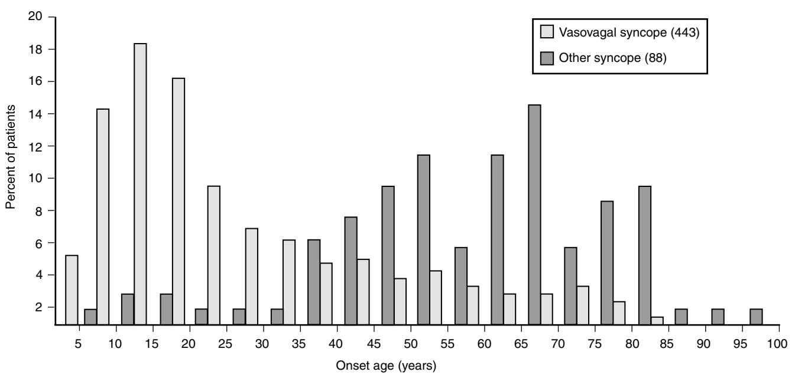
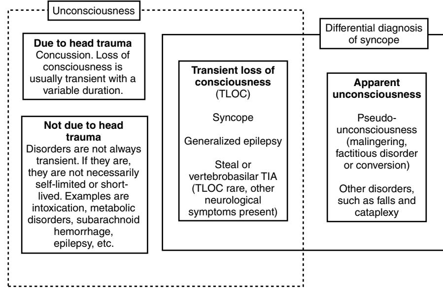
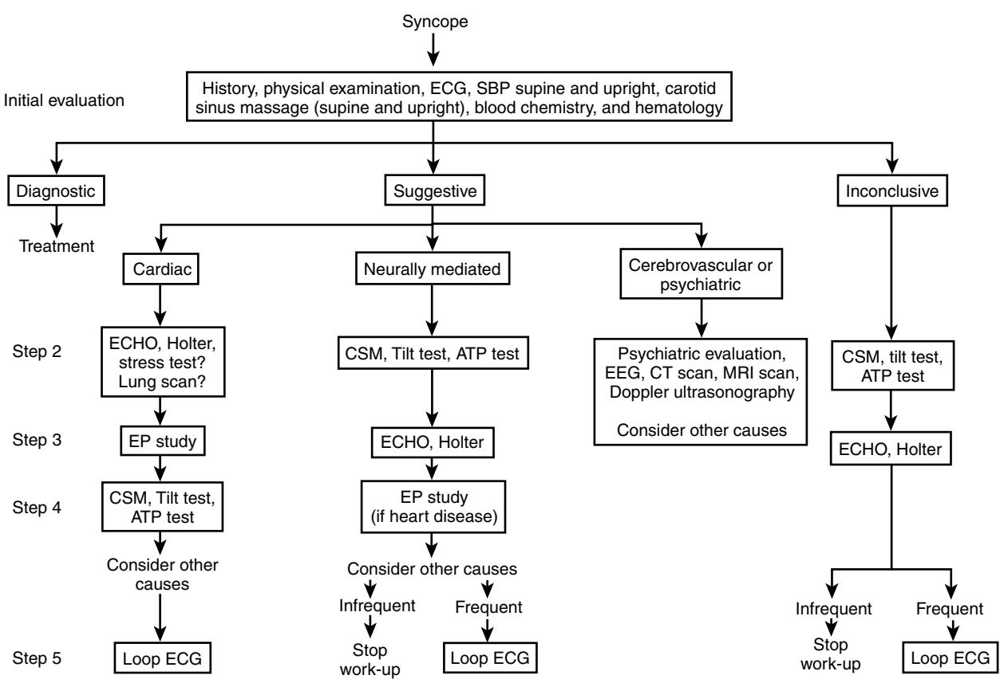
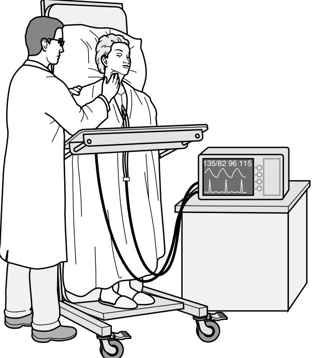

# **DEFINITION**

Syncope (derived from the Greek words, "syn" meaning "with" and the verb "koptein" meaning "to cut" or more appropriately in this case "to interrupt") is a symptom, defined as a transient, self-limited loss of consciousness, usually leading to falling. The onset of syncope is relatively rapid, and the subsequent recovery is spontaneous, complete, and usually prompt.

# **EPIDEMIOLOGY**

Syncope is a common symptom, experienced by up to 30% of healthy adults at least once in their life time.1,2 Syncope accounts for 3% of emergency department visits and 1% of medical admissions to a general hospital.3 Syncope is the seventh most common reason for emergency admission of patients over 65 years of age.4 The cumulative incidence of syncope in a chronic care facility is close to 23% over a 10-year period with an annual incidence of 6% and recurrence rate of 30% over 2 years. The age of first faint, a commonly used term for syncope, is less than 25 years in 60% of persons but 10% to 15% of individuals have their first faint after age 65 years.5,6

Syncope due to a cardiac cause is associated with higher mortality rates irrespective of age. In patients with a noncardiac or unknown cause of syncope, older age, a history of congestive cardiac failure, and male sex are important prognostic factors of mortality.7 It remains undetermined whether syncope is directly associated with mortality or is merely a marker of more severe underlying disease.2 Figure 46-1 details the age-related difference in prevalence of benign vasovagal syncope compared with other causes of syncope.

# **PATHOPHYSIOLOGY**

The temporary cessation of cerebral function that causes syncope results from transient and sudden reduction of blood flow to parts of the brain (brain stem reticular activating system) responsible for consciousness. The predisposition to vasovagal syncope starts early and lasts for decades. Other causes of syncope are uncommon in young adults, but much more common as persons age.8,9

Regardless of the cause, the underlying mechanism responsible for syncope is a drop in cerebral oxygen delivery below the threshold for consciousness. Cerebral oxygen delivery, in turn, depends on both cerebral blood flow and oxygen content. Any combination of chronic or acute processes that lowers cerebral oxygen delivery below the "consciousness" threshold may cause syncope. Age-related physiologic impairments in heart rate, blood pressure, cerebral blood flow, and blood volume control, in combination with comorbid conditions and concurrent medications account for the increased incidence of syncope in the older person. Blunted baroreflex sensitivity with aging is manifested as a reduction in the heart rate response to hypotensive stimuli. Older adults are prone to reduced blood volume because of excessive salt wasting by the kidneys as a result of a decline in plasma renin and aldosterone, a rise in atrial natriuretic peptide, and concurrent diuretic therapy.8 Low blood volume together with age-related diastolic dysfunction can lead to a low cardiac output, which increases susceptibility to orthostatic hypotension and vasovagal syncope.10 Cerebral autoregulation, which maintains a constant cerebral circulation over a wide range of blood pressure changes, is altered in the presence of hypertension and possibly by aging; the latter is still controversial.11 In general it is agreed that sudden mild to moderate declines in blood pressure can affect cerebral blood flow greatly and render an older person particularly vulnerable to presyncope and syncope. Syncope may thus result either from a single process that markedly and abruptly decreases cerebral oxygen delivery or from the accumulated effect of multiple processes, each of which contributes to the reduced oxygen delivery.12

## **Multifactorial causes**

Previously up to 40% of patients with recurrent syncope remained undiagnosed despite extensive investigations, particularly older patients who have marginal cognitive impairment and for whom a witnessed account of events is often unavailable. More recently, diagnostic yield for all ages has improved with application of guidelines.13 Although diagnostic investigations are available, the high frequency of unidentified causes in clinical studies may occur because patients failed to recall important diagnostic details14,15 because of the stringent diagnostic criteria used in clinical studies or, probably most often, because the syncopal episode resulted from a combination of chronic and acute factors rather than from a single obvious disease process.16 Indeed, a multifactorial cause likely explains the majority of cases of syncope in older persons who are predisposed because of multiple chronic diseases and medication effects superimposed on the age-related physiologic changes described above.17 Common factors that in combination may predispose to, or precipitate, syncope include anemia, chronic lung disease, congestive heart failure, and dehydration. Medications that may contribute to, or cause, syncope are listed in Table 46-1.

# **Individual causes of syncope**

Common causes of syncope are listed in Table 46-2. The most frequent individual causes of syncope in older patients are neurally mediated syndromes, including carotid sinus syndrome, orthostatic hypotension, and postprandial hypotension and arrhythmias, including both tachyarrhythmias and bradyarrhythmias. These disease processes are described in the next section. Disorders that may be confused with syncope and which may, or may not, be associated with loss of consciousness are listed in Table 46-3. In older patients, 75% of syncope is due to noncardiac causes and 15% is due to cardiac causes.18

Figure 46-1. Comparison of ages of first syncope in 443 patients with vasovagal syncope and 88 patients with syncope of other known cause.

### **Table 46-1. Drugs That Can Cause or Contribute to Syncope**

| Drug                                                                                                                                                                   | Mechanism                                                                                     |
|------------------------------------------------------------------------------------------------------------------------------------------------------------------------|-----------------------------------------------------------------------------------------------|
| Diuretics Vasodilators Angiotensin-converting enzyme inhibitors Calcium channel blockers Hydralazine Nitrates Alpha adrenergic blockers           | Volume depletion Reduction in systemic vascular resistance and venodilation          |
| Prazosin Other antihypertensive drugs Alpha methyldopa Clonidine Guanethidine Hexamethonium Labetalol                                                | Centrally acting antihypertensives                                                         |
| Mecamylamine Phenoxybenzamine Drugs associated with torsades de pointes Amiodarone Disopyramide Encainide Flecainide Quinidine Procainamide | Ventricular tachycardia associated with a prolonged QT interval                         |
| Sotalol Digoxin Psychoactive drugs Tricyclic antidepressants Phenothiazines Monamine oxidase inhibitors Barbiturates                                 | Cardiac arrhythmias Central nervous effects causing hypotension; cardiac arrhythmias |
| Alcohol                                                                                                                                                                | Central nervous system effects causing hypotension; cardiac arrhythmias                 |

## **Table 46-2. Causes of Syncope**

#### **Reflex Syncopal Syndromes**

- Vasovagal faint (common faint)
- Carotid sinus syncope
- Situational faint
	- Acute hemorrhage
- Cough, sneeze
- Gastrointestinal stimulation (swallow, defecation, visceral pain)
- Micturition (postmicturition)
- Postexercise
- Pain, anxiety
- Glossopharyngeal and trigeminal neuralgia

#### **Orthostatic**

- Aging
- Antihypertensives
- Autonomic failure
- Primary autonomic failure syndromes (e.g., pure autonomic failure, multiple system atrophy, Parkinson's disease with autonomic failure) - Secondary autonomic failure syndromes (e.g., diabetic neuropathy, amyloid neuropathy)
- Medications (see Table 46-1)
- Volume depletion
	- Hemorrhage, diarrhea, Addison's disease, diuretics, febrile illness, hot weather

#### **Cardiac Arrhythmias**

- Sinus node dysfunction (including bradycardia/tachycardia syndrome)
- Atrioventricular conduction system disease
- Paroxysmal supraventricular and ventricular tachycardias
- Implanted device (pacemaker, ICD) malfunction, drug-induced proarrhythmias

#### **Structural Cardiac or Cardiopulmonary Disease**

- Cardiac valvular disease
- Acute myocardial infarction/ischemia
- Obstructive cardiomyopathy
- Atrial myxoma
- Acute aortic dissection
- Pericardial disease/tamponade
- Pulmonary embolus/pulmonary hypertension

#### **Cerebrovascular**

• Vascular steal syndromes

**Multifactorial**

#### **Table 46-3. Disorders Commonly Misdiagnosed as Syncope**

- Transient ischemic attacks (TIA) of carotid or vertebro-basilar origin
- Hypoglycemia and other metabolic disorders
- Some forms of epilepsy
- Alcohol and other intoxications
- Hyperventilation with hypocapnia

#### **PRESENTATION**

The underlying mechanism of syncope is transient cerebral hypoperfusion. In some forms of syncope, there may be a premonitory period in which various symptoms (e.g., lightheadedness, nausea, sweating, weakness, and visual disturbances) offer warning of an impending syncopal event.18 Often, however, loss of consciousness occurs without warning.14,15 Recovery from syncope is usually accompanied by almost immediate restoration of appropriate behavior and orientation. Amnesia for loss of consciousness occurs in many older individuals and in those with cognitive impairment. The postrecovery period may be associated with fatigue of varying duration. In young patients, nausea, blurred vision, and sweating predict noncardiac syncope; only dyspnea predicts cardiac syncope in older patients.18

Syncope and falls are often considered two separate entities with different causes. Recent evidence suggests, however, that these conditions may not always distinctly be separate.19 In older adults, determining whether patients who have fallen have had a syncopal event can be difficult. Half of syncopal episodes are unwitnessed and older patients may have amnesia for loss of consciousness.15 Amnesia for loss of consciousness has been observed in half of patients with carotid sinus syndrome who experience falls and a quarter of all patients with carotid sinus syndrome irrespective of presentation.20 Emerging evidence suggests a high incidence of falls in addition to traditional syncopal symptoms in older patients with sick sinus syndrome and atrioventricular conduction disorders. Thus syncope and falls may be indistinguishable and may, in some cases, be manifestations of similar pathophysiologic processes. The presentation of specific causes of syncope is presented in the following sections.

#### **EVALUATION**

The initial step in the evaluation of syncope is to consider whether there is a specific cardiac or neurologic cause or whether the cause is likely multifactorial.21–23 The starting point for the evaluation of syncope is a careful history and physical examination. A witness account of events is important to ascertain when possible.24,25 Three key questions should be addressed during the initial evaluation: (1) Is loss of consciousness attributable to syncope? (2) Is heart disease present or absent? and (3) Are there important clinical features in the history and physical examination that suggest the cause?

Differentiating true syncope from other "nonsyncopal" conditions associated with real or apparent loss of consciousness is generally the first diagnostic challenge and influences the subsequent diagnostic strategy. A strategy for differentiating true syncope and nonsyncope is outlined in Figure 46-2 and Figure 46-3. The presence of heart disease is an independent predictor of a cardiac cause of syncope, with a sensitivity of 95% and a specificity of 45%.26

Patients frequently complain of dizziness alone or as a prodrome to syncope and unexplained falls. Four categories of dizzy symptoms—vertigo, dysequilibrium, light-headedness and others—have been recognized. The categories have neither the sensitivity nor specificity in older patients, as in younger ones. Dizziness, however, may more likely be attributable to a cardiovascular diagnosis if associated with pallor, syncope, prolonged standing, palpitations, or the need to lie down or sit down when symptoms occur.

Initial evaluation may lead to a diagnosis based on symptoms, signs, or electrocardiograph (ECG) findings. Under such circumstances, no further evaluation is needed and treatment, if any, can be planned. More commonly, the initial evaluation leads to a suspected diagnosis (see Figure 46-3), which needs to be confirmed by directed testing.1,27 If a diagnosis is confirmed by specific testing, treatment may be initiated. On the other hand, if the diagnosis is not confirmed, then patients are considered to have unexplained syncope and should be evaluated following a strategy such as that outlined in Figure 46-3. It is important to attribute a diagnosis, if possible, rather than assume that an abnormality known to produce syncope or hypotensive symptoms is the cause. To attribute a diagnosis, patients should have symptom reproduction during investigation and preferably alleviation of symptoms with specific intervention. It is not uncommon for more than one predisposing disorder to coexist in older patients, rendering a precise diagnosis difficult. In older persons treatment of possible causes without clear verification of attributable diagnosis may often be the only option.

An important issue in patients with unexplained syncope is the presence of structural heart disease or an abnormal ECG. These findings are associated with a higher risk of arrhythmias and a higher mortality at 1 year.28 In these patients, cardiac evaluation consisting of echocardiography, stress testing, and tests for arrhythmia detection, such as prolonged electrocardiographic and loop monitoring or electrophysiologic study are recommended. The most alarming ECG sign in a patient with syncope is probably alternating complete left and right bundle branch block, or alternating right bundle branch block with left anterior or posterior fascicular block, suggesting trifascicular conduction system disease and intermittent or impending high-degree AV block. Patients with bifascicular block (right bundle branch block plus left anterior or left posterior fascicular block, or left bundle branch block) are at high risk of developing highdegree AV block. A significant problem in the evaluation of syncope and bifascicular block is the transient nature of high degree AV block and therefore the long periods required to document it by ECG.

In patients without structural heart disease and a normal ECG, evaluation for neurally mediated syncope should be considered. The tests for neurally mediated syncope consist of tilt testing and carotid sinus massage.

The majority of older patients with syncope are likely have a multifactorial cause and thus both predisposing and precipitating causes should be sought in the history, examination, and laboratory evaluation, particularly if the initial evaluation does not suggest an obvious single cause.

Figure 46-2. Syncope in relation to real and apparent loss of consciousness.

Figure 46-3. An approach to the evaluation of syncope for all age groups. *ATP test,* adenosine provocation test; *CSM,* carotid sinus massage; *ECHO,* echocardiogram; *EEG,* electroencephalogram; *EP study,* electrophysiologic study; *ECG,* electrocardiogram.

The presentation, evaluation, and management of other common causes of syncope are presented in the following sections. These causes may occur as the sole cause of a syncopal episode or as one of multiple contributing causes.

## **ORTHOSTATIC HYPOTENSION Pathophysiology**

Orthostatic or postural hypotension is arbitrarily defined as either a 20 mm Hg fall in systolic blood pressure or a 10 mm Hg fall in diastolic blood pressure on assuming an upright posture from a supine position. Orthostatic hypotension implies abnormal blood pressure homeostasis and is a frequent observation with advancing age. Prevalence of postural hypotension varies between 4% and 33% among community living older persons depending on the methodology used. Higher prevalence and larger falls in systolic blood pressure have been reported with increasing age and often signify general physical frailty. Orthostatic hypotension is an important cause of syncope, accounting for 14% of all diagnosed cases in a large series. In a tertiary referral clinic dealing with unexplained syncope, dizziness, and falls, 32% of patients over age 65 years had orthostatic hypotension as a possible attributable cause of symptoms.

### **Aging**

The heart rate and blood pressure responses to orthostasis occur in three phases: (1) an initial heart rate and blood pressure response, (2) an early phase of stabilization, and (3) a phase of prolonged standing. All three phases are influenced by aging. The maximum rise in heart rate and the ratio between the maximum and the minimum heart rate in the initial phase decline with age, implying a relatively fixed heart rate irrespective of posture. Despite a blunted heart rate response, blood pressure and cardiac output are adequately maintained on standing in active, healthy, well-hydrated, and normotensive older persons because of decreased vasodilation and reduced venous pooling during the initial phases and increased peripheral vascular resistance after prolonged standing. However, in older persons with hypertension and cardiovascular disease receiving vasoactive drugs, these circulatory adjustments to orthostatic stress are disturbed, rendering them vulnerable to postural hypotension.29

### **Hypertension**

Hypertension further increases the risk of hypotension by impairing baroreflex sensitivity and reducing ventricular compliance. A strong relationship between supine hypertension and orthostatic hypotension has been reported among unmedicated institutionalized older persons. Hypertension increases the risk of cerebral ischemia from sudden declines in blood pressure. Older persons with hypertension are more vulnerable to cerebral ischemic symptoms even with modest and short-term postural hypotension because the threshold for cerebral autoregulation is altered by prolonged elevation of blood pressure. In addition, antihypertensive agents impair cardiovascular reflexes and further increase the risk of orthostatic hypotension.

#### **Medications**

Drugs (Table 46-1) are important causes of orthostatic hypotension. Ideally establishing a causal relationship between a drug and orthostatic hypotension requires identification of the culprit medicine, abolition of symptoms by withdrawal of the drug, and rechallenge with the drug to reproduce symptoms. Rechallenge is often omitted in clinical practice in view of the potential serious consequences. In the presence of polypharmacy, which is common in the older person, it becomes difficult to identify a single culprit drug because of the synergistic effect of different drugs and drug interactions. Thus all drugs should be considered as possible contributors to orthostasis.

#### **Other conditions**

A number of nonneurogenic conditions are also associated with postural hypotension. These conditions include myocarditis, atrial myxoma, aortic stenosis,30 constrictive pericarditis, hemorrhage, diarrhea, vomiting, ileostomy, burns, hemodialysis, salt loosing nephropathy, diabetes insipidus, adrenal insufficiency, fever, and extensive varicose veins. Volume depletion for any reason is a common sole, or contributing, cause of postural hypotension, and, in turn, syncope.

#### **Primary autonomic failure syndromes**

Three distinct clinical entities, namely pure autonomic failure (PAF), multiple system atrophy (MSA), or Shy-Drager syndrome (SDS), and autonomic failure associated with idiopathic Parkinson's disease (IPD) are associated with orthostatic hypotension. PAF, the least common condition and a relatively benign entity, was previously known as idiopathic orthostatic hypotension. Symptoms of this condition include orthostatic dizziness, defective sweating, impotence, and bowel disturbances. No other neurologic deficits are found and resting plasma noradrenaline levels are low. MSA is the most common and has the poorest prognosis. Clinical manifestations include features of dysautonomia and motor disturbances due to striatonigral degeneration, cerebellar atrophy, or pyramidal lesions. Additional neurologic deficits include muscle atrophy, distal sensory-motor neuropathy, pupillary abnormalities, restriction of ocular movements, disturbances in rhythm and control of breathing, life-threatening laryngeal stridor, and bladder disturbances. Psychiatric manifestations and cognitive defects are usually absent. Resting plasma noradrenaline levels are usually within the normal range but fail to rise on standing or tilting.

The prevalence of orthostatic hypotension in Parkinson's disease rises with advancing years and with the number of medications prescribed. Cognitive impairment, in particular abnormal attention and executive function, is more common in Parkinson's disease with orthostatic hypotension, suggesting a possible causal association with hypotension including watershed lesions. Orthostatic hypotension in Parkinson's disease can also be due to autonomic failure and or to side effects of anti-Parkinsonian medications.

#### **Secondary autonomic dysfunction**

Autonomic nervous system involvement is seen in several systemic diseases. A large number of neurologic disorders are also complicated by autonomic dysfunction, which may involve several organs leading to a variety of symptoms in addition to orthostatic dizziness, including anhidrosis, constipation, diarrhea, impotence, retention of urine, urinary incontinence, stridor, apneic episodes, and Horner's syndrome. Among the most serious and prevalent conditions associated with a orthostasis due to autonomic dysfunction are diabetes, multiple sclerosis, brain stem lesions, compressive and noncompressive spinal cord lesions, demyelinating polyneuropathies (Guillain-Barré's syndrome), chronic renal failure, chronic liver disease, and connective tissue disorders.

#### **Presentation**

The clinical manifestations of orthostatic hypotension are due to hypoperfusion of the brain and other organs. Depending on the degree of fall in blood pressure, symptoms can vary from dizziness to syncope associated with a variety of visual defects, from blurred vision to blackout. Other reported ischemic symptoms are nonspecific lethargy and weakness, suboccipital and paravertebral muscle pain, low back ache, calf claudication, and angina. Several precipitating factors for orthostatic hypotension have been identified including speed of positional change, prolonged recumbency, warm environment, raised intrathoracic pressure (coughing, defecation, micturition), physical exertion, and vasoactive drugs.31

### **Evaluation**

The diagnosis of orthostatic hypotension involves a demonstration of a postural fall in blood pressure after active standing. Reproducibility of orthostatic hypotension depends on the time of measurement and on autonomic function. The diagnosis may be missed on casual measurement during the afternoon. The procedure should be repeated during the morning after maintaining supine posture for at least 10 minutes. Sphygmomanometer measurement will detect hypotension which is sustained. Phasic blood pressure measurements are more sensitive for detection of transient falls in blood pressure. Active standing is more appropriate than head-up tilt because the former more readily represents the physiologic alpha adrenergic vasodilation due to calf muscle activation. Once a diagnosis of postural hypotension is made, the evaluation involves identifying the cause or causes of orthostasis mentioned above.

## **Management** (Table 46-4)

The goal of therapy for symptomatic orthostatic hypotension is to improve cerebral perfusion. There are several nonpharmacologic interventions that should be tried in

**Table 46-4. Management of Orthostatic Hypotension in Older Persons**

| Identify and Treat Correctable Causes Reduce or eliminate drugs causing orthostatic hypotension (see                  |
|--------------------------------------------------------------------------------------------------------------------------|
| Table 46-2) Avoid situations that may exacerbate orthostatic hypotension:                                             |
| Standing motionless                                                                                                      |
| Prolonged recumbency                                                                                                     |
| Large meals                                                                                                              |
| Hot weather                                                                                                              |
| Hot showers                                                                                                              |
| Straining at stool or with voiding                                                                                       |
| Isometric exercise                                                                                                       |
| Ingesting alcohol                                                                                                        |
| Hyperventilation                                                                                                         |
| Dehydration                                                                                                              |
| Raise the head of the bed to a 5- to 20-degree angle Wear waist-high custom-fitted elastic stockings and an abdominal |
| binder                                                                                                                   |
| Participate in physical conditioning exercises, i.e.,                                                                    |
| Controlled postural exercises using the tilt table                                                                       |
| Avoid diuretics and eat salt-containing fluids (unless congestive heart                                                  |
| failure is present)                                                                                                      |
| Caffeine                                                                                                                 |
| Drug therapy                                                                                                             |
| Fludrocortisone                                                                                                          |
| Midodrine                                                                                                                |
| Desmopressin                                                                                                             |
| Erythropoietin                                                                                                           |

the first instance. These interventions include avoidance of precipitating factors for low blood pressure, elevation of the head of the bed at night by at least 20 degrees, and application of graduated pressure from an abdominal support garment or from stockings. Medications known to contribute to postural hypotension should be eliminated or reduced. There are reports to suggest benefit from implantation of cardiac pacemakers, in a small number of patients, by increasing heart rate during postural change. However, the benefits of tachypacing on cardiac output in patients with maximal vasodilation are short lived, probably because venous pooling and vasodilation dominate. A large number of drugs have been used to raise blood pressure in orthostatic hypotension, including fludrocortisone, midodrine, ephedrine, desmopressin (DDAVP), octreotide, erythropoietin, and nonsteroidal antiinflammatory agents. Fludrocortisone (9-alpha fluohydrocortisone) in a dose of 0.1 to 0.2 mg, causes volume expansion, reduces natriuresis, and sensitizes alpha adrenoceptors to noradrenaline. In older people, the drug can be poorly tolerated in high doses and for long periods. Adverse effects include hypertension, cardiac failure, depression, edema, and hypokalemia. Midodrine is a directly acting sympathomimetic vasoconstrictor of resistance vessels. Treatment is started at a dose of 2.5 mg three times daily and requires gradual titration to a maximum dose of 45 mg/day. Adverse effects include hypertension, pilomotor erection, gastrointestinal symptoms, and central nervous system toxicity. Side effects are usually controlled by dose reduction. Midodrine can be used in combination with low dose fludrocortisone with good effect. DDAVP has potent antidiuretic and mild pressor effects. Intranasal doses of 5 to 40 microgram at bed time are useful. The main side effect is water retention. This agent can also be combined with fludrocortisone with synergistic effect. The drug treatment for orthostatic hypotension in older persons requires frequent monitoring for supine hypertension, electrolyte imbalance, and congestive heart failure. One option for treating supine hypertension, which is most prominent at night, is to apply a GTN patch after going to bed, remove it in the morning, and take midodrine +/− fludrocortisone 20 minutes before rising. This is effective provided that the older person remains in bed throughout the night. Nocturia is therefore an important consideration. To capture these coexistent diurnal BP variations of supine hypertension and morning orthostasis, 24-hour ambulatory BP monitoring is the preferred investigation for the management of postural hypotension. Postprandial hypotension, due to splanchnic vascular pooling, often co-exists with orthostatic hypotension in older patients.

## **CAROTID SINUS SYNDROME AND CAROTID SINUS HYPERSENSITIVITY Pathophysiology**

Carotid sinus syndrome is an important but frequently overlooked cause of syncope and presyncope in older persons.9 Episodic bradycardia and/or hypotension resulting from exaggerated baroreceptor mediated reflexes or carotid sinus hypersensitivity characterize the syndrome. The syndrome is diagnosed in persons with otherwise unexplained recurrent syncope who have carotid sinus hypersensitivity. The latter is considered present if carotid sinus massage produces asystole exceeding 3 seconds (cardioinhibitory), or a fall in systolic blood pressure exceeding 50 mm Hg in the absence of cardioinhibition (vasodepressor) or a combination of the two (mixed).13,32

#### **Epidemiology**

Up to 30% of the healthy aged population have carotid sinus hypersensitivity. The prevalence is higher in the presence of coronary artery disease or hypertension. Abnormal responses to carotid sinus massage are more likely to be observed in individuals with coronary artery disease and in those on vasoactive drugs known to influence carotid sinus reflex sensitivity such as digoxin, beta blockers, and alpha methyl dopa. Other hypotensive disorders such as vasovagal syncope and orthostatic hypotension coexist in one third of patients with carotid sinus hypersensitivity. In centers which routinely perform carotid sinus massage in all older patients with syncope, carotid sinus syndrome is the attributable cause of syncope in 30%.33 This frequency needs to be interpreted within the context that these centers evaluate a preselected group of patients who have a higher likelihood of carotid sinus syndrome than the general population of older persons with syncope. The prevalence in all older persons with syncope is unknown.

Carotid sinus syndrome is virtually unknown before the age of 50 years; its incidence increases with age thereafter. Males are more commonly affected than females and the majority have either coronary artery disease or hypertension. Carotid sinus syndrome is associated with appreciable morbidity. Approximately half of patients sustain an injury, including a fracture, during symptomatic episodes. In a prospective study of falls in nursing home residents, a threefold increase in the fracture rate in those with carotid sinus hypersensitivity was observed. Indeed, carotid sinus hypersensitivity can be considered as a modifiable risk factor for fractures of the femoral neck. Carotid sinus syndrome is not associated with an increased risk of death. The mortality rate in patients with the syndrome is similar to that of patients with unexplained syncope and the general population matched for age and sex. Mortality rates are similar for the three subtypes of the syndrome.

The natural history of carotid sinus hypersensitivity has not been well investigated. In one study, the majority (90%) of persons with abnormal hemodynamic responses but without syncopal symptoms, remained symptom free during an average follow-up of 20 months while half of those who had syncope had symptom recurrence. More recent neuropathologic research suggests that carotid sinus hypersensitivity is associated with neurodegenerative pathology at the cardiovascular center in the brain stem. Why some persons with carotid sinus hypersensitivity develop syncope as a consequence and others remain asymptomatic is not clear.

#### **Presentation**

The syncopal symptoms are usually precipitated by mechanical stimulation of the carotid sinus, such as head turning, tight neckwear, neck pathology, and by vagal stimuli such as prolonged standing. Other recognized triggers for symptoms are the postprandial state, straining, looking or stretching upwards, exertion, defecation, and micturition. In a significant number of patients, no triggering event can be identified. Abnormal response to carotid sinus massage (see later discussion) may not always be reproducible, necessitating repetition of the procedure if the diagnosis is strongly suspected.

### **Evaluation CAROTID SINUS MASSAGE**

Carotid sinus reflex sensitivity is assessed by measuring heart rate and blood pressure responses to carotid sinus massage (Figure 46-4). Cardioinhibition and vasodepression are more common on the right side. In patients with cardioinhibitory carotid sinus syndrome, more than 70% have a positive response to right-sided carotid sinus massage either alone or in combination with left-sided carotid sinus massage. There is no fixed relationship between the degree of heart rate slowing and the degree of fall in blood pressure.

Carotid sinus massage is a crude and unquantifiable technique and is prone to intraobserver and interobserver variation. More scientific diagnostic methods using neck chamber suction or drug-induced changes in blood pressure can be used for carotid baroreceptor activation, but are not validated for routine clinical use. The recommended duration of carotid sinus massage is from 5 to 10 seconds. The maximum fall in heart rate usually occurs within 5 seconds of the onset of massage (Figure 46-2).

Complications resulting from carotid sinus massage include cardiac arrhythmias and neurologic sequelae. Fatal arrhythmias are extremely uncommon and have generally only occurred in patients with underlying heart disease undergoing therapeutic rather than diagnostic massage. Digoxin toxicity has been implicated in most cases of ventricular fibrillation. Neurologic complications result from either occlusion of, or embolization from, the carotid artery. Several authors have reported cases of hemiplegia following

Figure 46-4. Procedure for carotid sinus massage while upright.

carotid sinus stimulation, often in the absence of hemodynamic changes. Complications from carotid sinus massage, however, are uncommon. In a prospective series of 1000 consecutive cases, no patient had cardiac complications and 1% had transient neurologic symptoms, which resolved. Persistent neurologic complications were uncommon, occurring in 0.04% of cases.34 Carotid sinus massage should not be performed in patients who have had a recent cerebrovascular event or myocardial infarction.

Symptom reproduction during carotid sinus massage is preferable for a diagnosis of carotid sinus syndrome. Symptoms reproduction may not be possible for older patients with amnesia for loss of consciousness. Spontaneous symptoms usually occur in the upright position. It may thus be worth repeating the procedure, with the patient upright on a tilt table, even after demonstrating a positive response when supine. This reproduction of symptoms aids in attributing the episodes to carotid sinus hypersensitivity, especially in patients with unexplained falls who deny loss of consciousness. In one third of patients, a diagnostic response is only achieved during upright carotid sinus massage.

#### **Management**

No treatment is necessary in persons with asymptomatic carotid sinus hypersensitivity.35 There is no consensus, however, on the timing of therapeutic intervention in the presence of symptoms. Considering the high rate of injury in symptomatic episodes in older persons and the low recurrence rate of symptoms, it is prudent to treat all patients with a history of two or more symptomatic episodes. The need for intervention in those individuals with a solitary event should be assessed on an individual basis, taking into consideration the severity of the event and the patient's comorbidity.

Treatment strategies in the past included carotid sinus denervation achieved either surgically or by radioablation. Both procedures have largely been abandoned. Dual chamber cardiac pacing is the treatment of choice in patients with symptomatic cardioinhibitory carotid sinus syndrome. Atrial pacing is contraindicated in view of the high prevalence of both sinoatrial and atrioventricular block in patients with carotid sinus hypersensitivity. Ventricular pacing abolishes cardioinhibition but fails to alleviate symptoms in a significant number of patients because of aggravation of a coexisting vasodepressor response or the development of pacemaker-induced hypotension, referred to as pacemaker syndrome. The latter occurs when ventriculo-atrial conduction is intact as is the case for up to 80% of patients with the syndrome. Atrioventricular sequential pacing (dual chamber) is thus the treatment of choice and because this maintains atrioventricular synchrony, there is no risk of pacemaker syndrome. With appropriate pacing, syncope is abolished in 85% to 90% of patients with cardioinhibition.

In a recent report of cardiac pacing in older fallers, (mean age of 74 years) who had cardioinhibitory carotid sinus hypersensitivity, falls during 1 year of follow up were reduced by two thirds in patients who received dual chamber systems.33 Syncopal episodes were reduced by half. Over half of the patients in the aforementioned series had gait abnormalities and three quarters had balance abnormalities, which would render individuals more susceptible to falls under hemodynamic circumstances, thus further suggesting the multifactorial nature of many falls and syncopal episodes.22

Treatment of vasodepressor carotid sinus syndrome is less successful because of a poor understanding of its pathophysiology. Ephedrine has been reported to be useful, but longterm use is limited by side effects. Dihydroergotamine is effective but poorly tolerated. Fludrocortisone, a mineralocorticoid widely used in the treatment of orthostatic hypotension, is used in the treatment of vasodepressor carotid sinus syndrome with good results but its use is limited in the longer term by adverse effects. A recent small randomized controlled trial suggests good benefit with midodrine (an alpha agonist). Surgical denervation of the carotid artery may be a valid treatment option.36,37

## **VASOVAGAL SYNCOPE Pathophysiology**

The normal physiologic responses to orthostasis, as described earlier, are an increase in heart rate, rise in peripheral vascular resistance (increase in diastolic blood pressure), and minimal decline in systolic blood pressure to maintain an adequate cardiac output. In patients with vasovagal syncope, these responses to prolonged orthostasis are paradoxical. The precise sequence of events leading to vasovagal syncope is not fully understood. The possible mechanism involves a sudden fall in venous return to the heart, rapid fall in ventricular volume, and virtual collapse of the ventricle due to vigorous ventricular contraction. The net result of these events is stimulation of ventricular mechano-receptors and activation of Bezold-Jarisch reflex leading to peripheral vasodilatation (hypotension) and bradycardia. Several neurotransmitters, including serotonin, endorphins, and arginine vasopressin, play an important role in the pathogenesis of vasovagal syncope possibly by central sympathetic inhibition, although their exact role is not yet well understood.38

Healthy older persons are not as prone to vasovagal syncope as younger adults. Due to an age-related decline in baroreceptor sensitivity, the paradoxical responses to orthostasis (as in vasovagal syncope) are possibly less marked in older persons. However hypertension, atherosclerotic cerebrovascular disease, cardiovascular medications, and impaired baroreflex sensitivity can cause dysautonomic responses during prolonged orthostasis (in which blood pressure and the heart decline steadily over time) and render older persons susceptible to vasovagal syncope. Diuretic or age-related contraction of blood volume further increases the risk of vasovagal syncope.39

#### **Presentation**

The hallmark of vasovagal syncope is hypotension and/or bradycardia sufficiently profound to produce cerebral ischemia and loss of neural function. Vasovagal syncope has been classified into cardioinhibitory (bradycardia), vasodepressor (hypotension), and mixed (both) subtypes depending on the blood pressure and heart rate response. In most patients, the manifestations occur in three distinct phases: a prodrome or aura, loss of consciousness, and postsyncopal phase. A precipitating factor or situation is identifiable in most patients. Common precipitating factors include extreme emotional stress, anxiety, mental anguish, trauma, physical pain, or anticipation of physical pain (e.g., anticipation of venesection), warm environment, air travel and prolonged standing. The commonest triggers in older individuals are prolonged standing and vasodilator medication. Some patients experience symptoms in specific situations, such as micturition, defecation, and coughing. Prodromal symptoms include extreme fatigue, weakness, diaphoresis, nausea, visual defects, visual and auditory hallucinations, dizziness, vertigo, headache, abdominal discomfort, dysarthria, and paresthesia. The duration of prodrome varies greatly from seconds to several minutes, during which some patients take actions such as lying down to avoid an episode. Older patients may have poor recall for prodromal symptoms. The syncopal period is usually brief during which some patients develop involuntary movements, usually myoclonic jerks but tonic clonic movements also occur. Thus vasovagal syncope may masquerade as a seizure. Recovery is usually rapid but older patients can experience protracted symptoms, such as confusion, disorientation, nausea, headache, dizziness, and a general sense of ill health.

#### **Evaluation**

Several methods have evolved to determine an individual's susceptibility to vasovagal syncope, such as Valsalva maneuvers, hyperventilation, ocular compression, and immersion of the face in cold water. However, these methods are poorly reproducible and lack correlation with clinical events. Using the strong orthostatic stimulus of head-upright tilting and maximal venous pooling, vasovagal syncope can be reproduced in a susceptible individual.40 Head-up tilting as a diagnostic tool was first reported in 198641 and since then validity of this technique in identifying susceptibility to neurocardiogenic syncope has been established. Subjects are tilted head up for 40 minutes at 70 degrees. Heart rate and blood pressure are measured continuously throughout the test. A test is diagnostic or positive if symptoms are reproduced with a decline in blood pressure of greater than 50 mm Hg or to less than 90 mm Hg. This may be in addition to significant heart rate slowing. As with carotid sinus syndrome, the hemodynamic responses are classified as vasodepressor, cardioinhibitory, or mixed. The cardioinhibitory response is defined as asystole in excess of 3 seconds or heart rate slowing to less than 40 beats/min for a minimum of 10 seconds. Orthostatic hypotension, vasovagal syncope, and carotid sinus hypersensitivity may overlap particularly in older patients.42

The sensitivity of head-up tilting can be further improved by provocative agents, which accentuate the physiologic events leading to vasovagal syncope. One agent is intravenous isoprenaline, which enhances myocardial contractility by stimulating β-adreno-receptors. Isoprenaline is infused, before head-up tilting, at a dose of 1 mcg per minute and gradually increased to a maximum dose of 3 mcg per minute to achieve a heart rate increase of 25%. Though the sensitivity of head-up tilt testing improves by about 15%, the specificity is reduced. In addition as a result of the decline in β-receptor sensitivity with age, isoprenaline is less well tolerated, less diagnostic, and has a much higher incidence of side effects. The other agent that can be used as a provocative agent and is better tolerated in older persons is sublingual nitroglycerin, which, by reducing venous return due to vasodilation can enhance the vasovagal reaction in susceptible individuals. Nitroglycerin provocation during head-up tilt testing is thus preferable to other provocative tests in older patients.40,43 The duration of testing is less, cannulation is not required, and the sensitivity and specificity are better than for isoprenaline.

Because syncopal episodes are intermittent, external loop recording will not capture events unless they occur approximately every 2 to 3 weeks. Implantable loop recorders (Reveal; Medtronic) can aid diagnosis by tracking bradyarrhythmias or tachyarrhythmias, causing less frequent syncope. To date no implantable BP monitors are available with the exception of intracardiac monitors, which are not recommended for diagnosis of a benign condition such as vasovagal syncope.44,45

#### **Management**

Avoidance of precipitating factors and evasive actions, such as lying down during prodromal symptoms, have great value in preventing episodes of vasovagal syncope. Withdrawal or modification of culprit medications is often the only necessary intervention in older persons. Doses and frequency of antihypertensive medications can be tailored by information from 24-hour ambulatory monitoring. Older patients with hypertension who develop syncope—either orthostatic or vasovagal—while taking antihypertensive drugs, present a difficult therapeutic dilemma and should be treated on an individual basis.

Many patients experience symptoms without warning, necessitating drug therapy. A number of drugs are reported to be useful in alleviating symptoms. Fludrocortisone (100 to 200 mcg/day) works by its volume expanding effect. Recent reports suggest that serotonin antagonists, such as fluoxetine (20 mg/day) and sertraline hydrochloride (25 mg/day), are also effective although further trials are necessary to validate this finding. Midodrine acts by reducing peripheral venous pooling and thereby improving cardiac output and can be used either alone or in combination with fludrocortisone but with caution. Elastic support hose, relaxation techniques (biofeedback), and conditioning using repeated head-up tilt as therapy have been adjuvant therapies. Permanent cardiac pacing is beneficial in some patients who have recurrent syncope due to cardioinhibitory responses.46

#### **POSTPRANDIAL HYPOTENSION**

The effect of meals on the cardiovascular system was appreciated from postprandial exaggeration of angina, which was demonstrated objectively by deterioration of exercise tolerance following food. Postprandial reductions in blood pressure manifesting as syncope and dizziness were subsequently reported, leading to extensive investigation of this phenomenon. In healthy older subjects, systolic blood pressure falls by 11 to 16 mm Hg, and the heart rate rises by 5 to 7 beats/min 60 minutes after meals of varying compositions and energy content. However the change in diastolic blood pressure is not as consistent. In older persons with hypertension, orthostatic hypotension and autonomic failure, the postprandial blood pressure fall is much greater and without the corresponding rise in heart rate.47 These responses are marked if the energy and simple carbohydrate content of the meal is high. In the majority of fit and frail older persons, most postprandial hypotensive episodes go unnoticed.48 When systematically evaluated, postprandial hypotension was found in over one third of nursing home residents.

Postprandial physiologic changes include increased splanchnic and superior mesenteric artery blood flow at the expense of peripheral circulation and a rise in plasma insulin levels without corresponding rises in sympathetic nervous system activity. Vasodilator effects of insulin and other gut peptides, including neurotensin and VIP contribute to hypotension. The clinical significance of a fall in blood pressure after meals is difficult to quantify. However, postprandial hypotension is causally related to recurrent syncope and falls in older persons. A reduction in simple carbohydrate content of food, its replacement with complex carbohydrates or high protein, high fat, and frequent small meals are effective interventions for postprandial hypotension. Drugs useful in the treatment of postprandial hypotension include fludrocortisone and indomethacin, octreotide, and caffeine. Given orally along with food, caffeine prevents hypotensive symptoms in fit and frail older persons but should preferably be given in the mornings as tolerance develops if it is taken throughout the day.49,50

#### **SUMMARY**

Syncope is a common symptom in older adults due to agerelated neurohumoral and physiologic changes plus chronic diseases and medications, which reduce cerebral oxygen delivery through multiple mechanisms. Common individual causes of syncope encountered by the geriatrician are orthostatic hypotension, carotid sinus syndrome, vasovagal syncope, postprandial syncope, sinus node disease, atrioventricular block, and ventricular tachycardia. Algorithms for the assessment of syncope are similar to those for young adults, but the prevalence of ischemic and hypertensive disorders and cardiac conduction disease is higher in older adults and the cause is more often multifactorial. A systematic approach to syncope is needed with the goal being to identify either a single likely cause or multiple treatable contributing factors. Management is then based on removing or reducing the predisposing or precipitating factors through various combinations of medication adjustments, behavioral strategies, and more invasive interventions in select cases, such as cardiac pacing, cardiac stenting, and intracardiac defibrillators. It is often not possible to clearly attribute a cause of syncope in older persons who frequently have more than one possible cause and pragmatic management of each diagnosis is recommended.

For a complete list of references, please visit online only at www.expertconsult.com