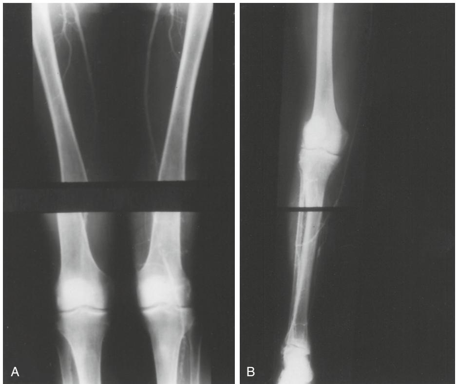
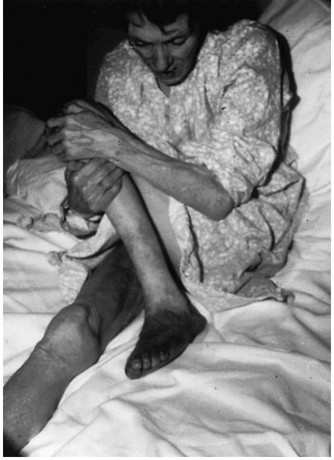
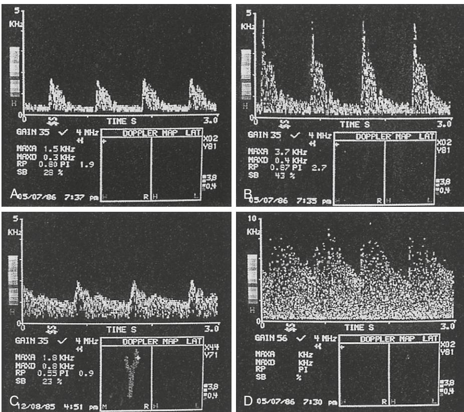
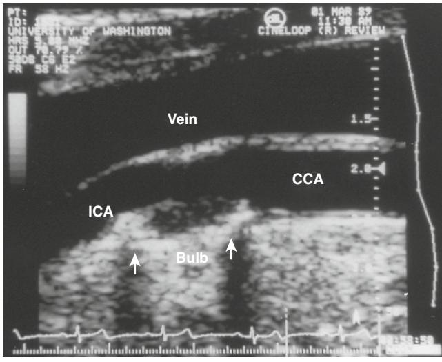
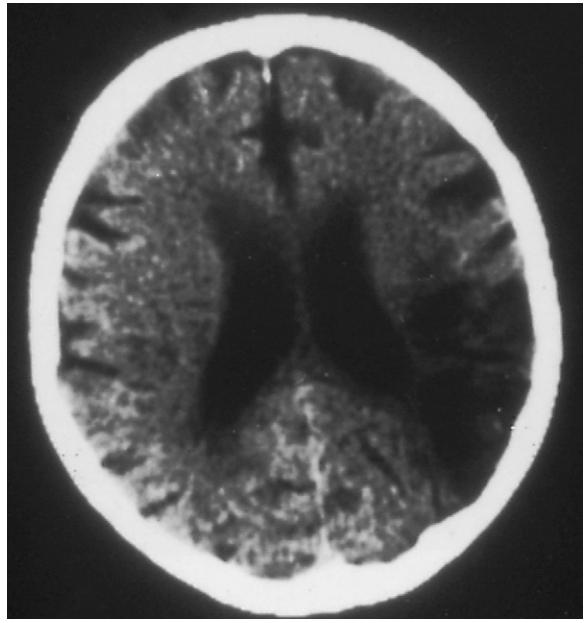
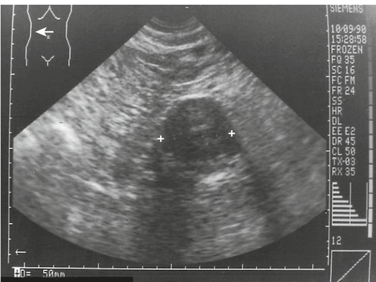
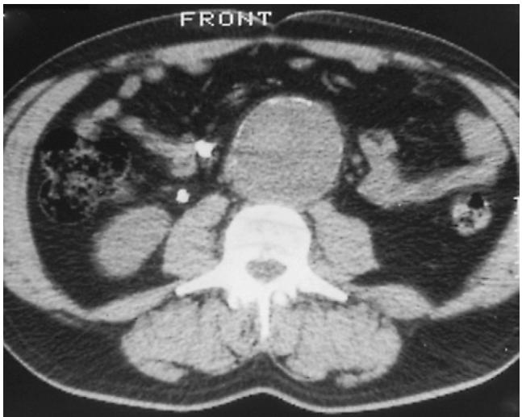

# Vascular Surgery

The prevalence of atherosclerosis increases with advancing age, so it is hardly surprising that the majority of a vascular surgeon's patients are elderly and have a full range of concomitant diseases typical of such patients. Equally, specialists in geriatric medicine frequently find vascular disease in the patients they treat. Decisions regarding treatment need to be balanced against quality of life and cardiac and respiratory risk factors. In many patients neither invasive investigation by arteriography nor vascular surgery will be indicated. However, vascular surgery is now being performed with increasing safety in patients who have longer life expectancies. The principle of balancing benefit against risk of treatment is emphasized repeatedly throughout this chapter.

Elderly people suffer a range of vascular conditions, but this chapter covers the three most common problems presenting to vascular surgeons: (1) vascular disease of the limb, either acute or chronic; (2) carotid disease; and (3) abdominal aortic aneurysm. New techniques are rapidly changing our approach to the management of vascular conditions; for example, the use of percutaneous transluminal angioplasty as the sole treatment for lower-limb critical ischemia,1 and the introduction of endovascular stent-grafts for the treatment of abdominal aortic aneurysms.2

## **ARTERIAL DISEASE OF THE LIMB**

Most patients with peripheral vascular disease have symptoms of chronic ischemia. This ranges from intermittent claudication with a benign prognosis, to critical ischemia having rest pain, gangrene, ischemic ulceration, and the threat of amputation.

Acute ischemia of a limb may be due to emboli, but it is now more usually secondary to thrombosis in diseased arteries. The majority of emboli lodge at the bifurcation of a main vessel, giving rise to distal dysfunction. Acute ischemia may have some or all of the classic symptoms such as pain, pallor, paresthesia, paralysis, and lack of pulse.

#### **Chronic peripheral vascular disease PREVALENCE**

Atherosclerosis is the most common disease affecting peripheral arteries in the elderly population and may severely limit mobility and quality of life.3 Amputation for peripheral vascular disease or gangrene is the second most common operation in patients aged over 90 years.4 At least one third of patients with arterial stenosis or arterial occlusion, particularly involving the superficial femoral artery at the adductor canal, are asymptomatic.5 However, approximately 50% of patients having intermittent claudication have a superficial femoral artery occlusion.6 The prevalence of claudication is only 1.0% to 1.5% in men aged under 50 years, but it rises substantially thereafter—up to 20% to 25% in those over 85.7,8

### **PROGNOSIS**

Only 10% of individuals with intermittent claudication consult a doctor and only a minority of these will ever come to surgery.9 The outlook for the legs in patients with claudication is good, but peripheral vascular disease is a strong predictor of subsequent mortality, which more than doubles that of nonclaudicants.10–12 The majority of claudicants die from associated cardiovascular events, in particular stroke and myocardial infarction, and this high mortality risk is only partly explained by the expected association of peripheral vascular disease with coronary artery disease owing to the generalized nature of atherosclerosis.13–15 In the Speedwell prospective heart disease study,15 men with intermittent claudication had a 30%, 5-year mortality compared with 6% in men without intermittent claudication. The increased risk of cardiovascular death may stem from repeated ischemia/ reperfusion injury in the leg muscle, leading to leukocyte and platelet activation and increased thrombogenicity.16

#### **INVESTIGATIONS**

Investigation of patients with intermittent claudication should concentrate on identifying risk factors for cardiac and cerebrovascular events. Smoking is strongly associated with intermittent claudication, as are diabetes, hypertension, and abnormal lipid levels.10,15,17 In diabetic patients, there is increased involvement of small vessels with distal artery occlusion, which carries a poor prognosis.11

The ankle brachial pressure index (ABPI) may be helpful in quantifying the severity of peripheral vascular disease, but only a minority of patients with abnormal APBIs are symptomatic.18 As a general rule, patients with a mean ABPI of less than 0.6 who have symptoms or leg ulcers need vascular surgical assessment.19

Rest pain, ischemic ulceration, or gangrene is an absolute indication for investigation with a view to treatment. Duplex imaging or angiography may be used to identify the sites of stenotic or occlusive disease, but they are indicated only if surgery or angioplasty is being considered. Duplex imaging has become increasingly important in the diagnosis and follow-up of arterial lesions because it is noninvasive and can be repeated on many occasions to monitor disease progress, graft patency, and the need for intervention. It identifies arterial occlusions and hemodynamically significant stenoses with a sensitivity and specificity of 92% and 97%, respectively, and has the potential to replace angiography. The presence of multiple stenoses is the main limitation on diagnostic accuracy.20–22 Duplex imaging alone can be used to predict the indication for percutaneous transluminal angioplasty.23

## **TREATMENT**

Treatment is directed at control of risk factors for cardiovascular and cerebrovascular mortality, such as hypertension, hyperlipidemia, and diabetes. Surgery or angioplasty for peripheral vascular disease is rarely indicated for intermittent claudication, but it may be offered to those whose symptoms are intolerable for their lifestyle despite a period of conservative care. The best advice for patients with claudication is to stop smoking, lose weight if appropriate, and keep walking. Exercise training can improve claudication distances significantly.24

The treatment for rest pain, ischemic ulceration, or gangrene depends on the state of the peripheral circulation. New treatment modalities have revolutionized the revascularization of lower-limb ischemia. Percutaneous transluminal angioplasty is becoming the most frequent option in the treatment of both claudication and revascularization for critical ischemia. If there is a lesion amenable to angioplasty, then this should be treated. Alternatively, whether reconstructive surgery is indicated depends on the level and length of arterial occlusions and the severity of disease distally in the limb.

#### **Acute limb ischemia**

The clinical distinction between arterial thrombosis or embolism can be difficult, but errors in diagnosis lead to a higher surgical failure rate and higher hospital mortality.25,26 Acute ischemia of the lower limb may occur due to embolization into a previously patent arterial tree, but it is now more likely to be due to thrombosis in diseased arteries. The most frequent site of origin for an arterial embolus is the heart, resulting from poor atrial emptying in atrial fibrillation or from a mural thrombus following myocardial infarction. Alternatively, an embolus may originate from a previously undiscovered ventricular or aortic aneurysm.

Arterial emboli to the arm are infrequent and usually seen only in elderly patients. Approximately two thirds of emboli are of cardiac origin, although peripheral aneurysm may account for up to 20% of cases.27,28 Conservative management is appropriate for many of these patients if the hand is viable and the pressure index (relative to the opposite normal arm) is greater than 0.6.29,30 Surgical embolectomy can be performed under local anesthetic and achieves excellent results. However, there is an associated mortality of greater than 10%, related predominantly to the underlying cardiac condition.27

#### **Management of femoral embolism**

Early femoral embolectomy is the standard for acute leg ischemia in patients with a strong clinical suspicion of an embolus, such as those with a short history of ischemia (less than 72 hours), an embolic source such as atrial fibrillation, and no past history of intermittent claudication.31 Embolectomy using a Fogarty catheter will usually restore limb perfusion, but it has been associated with a 16% to 26% mortality due predominantly to coexisting cardiac disease.31–33 Following embolectomy, the patient should be given long-term anticoagulant therapy, initially by heparin infusion and then with oral anticoagulants. Investigation by full blood count, echocardiography, and duplex imaging of the arterial supply to the leg is essential.

#### **Management of acute thrombosis**

In contrast, the management of acute critical ischemia due to arterial thrombosis is one of the more demanding surgical emergencies and should be dealt with only by an experienced vascular team. There is usually a little more time to make the diagnosis and arrange treatment as a collateral circulation offers some protection. Heparin should be given as soon as possible to reduce extension of the thrombus. If the limb is not completely anesthetic or paralyzed there should be sufficient time for adequate preoperative investigations by urgent duplex imaging and angiography if indicated to assess the distal arterial tree.

Intra-arterial thrombolysis achieves lysis of such thrombi (or emboli) in approximately two thirds of cases.34 Accelerated techniques of lysis, such as clot suction and the pulse-spray method, may be undertaken in as little as 30 minutes, but higher doses of thrombolytic agents tend to increase the risk of hemorrhagic complications.35 Following lysis, the underlying arterial disease should be treated either by transluminal angioplasty or by arterial reconstruction. In patients requiring urgent surgery, "on table" operative angiography may be performed (Figure 47-1) to assess the extent of the occlusion and the quality of the distal arteries. This should be repeated on completion of surgery to check the reconstruction and give an indication of prognosis.

#### **Outcome of limb salvage for severe ischemia**

An aggressive policy of revascularization achieves limb and patient survival rates of approximately 75% at 1 year, even in the elderly population.36 Almost all patients with severe leg ischemia should be offered a limb salvage procedure because this is associated with a better quality of life (Figure 47-2).37 The availability of specialist vascular surgeons reduces the frequency of major lower limb amputations, with a concomitant increase in the number of distal reconstructions.38 Arterial reconstruction to save the leg and alleviate pain is preferable to an amputation, particularly as few elderly patients regain mobility and independence after lower-limb amputation and most require institutional care or at least homes adapted for wheelchair use.32 Although the initial operative costs of reconstructive surgery are higher than those of amputation, this cost is more than offset by the duration of inpatient stay and the high community costs of rehabilitating amputees.33

## **CAROTID DISEASE**

## **Diagnosis and investigations DIAGNOSIS**

Carotid disease may be asymptomatic or may occur with stroke, transient ischemic attacks (TIAs), or possibly with vague symptoms such as dizziness. Carotid artery stenosis may cause stroke by hypoperfusion or by emboli; indeed many strokes are preceded by TIAs that are ignored by the patient and the doctor.

Carotid bruits can occur in the absence of significant internal carotid artery disease, and severe carotid disease may not produce a bruit. Thus a bruit is not a reliable indicator of underlying carotid disease.39,40 In a study examining the predisposing factors for acute cerebral infarction, only 14% had cervical bruits.41 All patients presenting with either TIAs, or who recover from an appropriate stroke and are fit for surgery, should undergo carotid imaging; significant carotid artery disease is found in just over 30% of those with anterior circulation infarcts as classified by the Oxford Community Stroke Project Classification.42,43

#### **INVESTIGATIONS**

Noninvasive techniques to assess carotid disease include color duplex Doppler imaging, which incorporates continuouswave Doppler to estimate blood velocity, and B-mode ultrasound to image the whole vessel. High-resolution B-mode scanning has also been shown to give prognostic information:

Figure 47-1. A sequence of arteriograms from a patient with acute right lower limb ischemia. In A, there is no visualization of "run-off" below a recent occlusion in the proximal popliteal artery. Subsequent on-table angiogram using the distal popliteal artery revealed a patent anterior tibial artery. In B, the completed bypass (with reversed saphenous vein) is shown.

Figure 47-2. Prolonged rest ischemia, often requiring opiates, leads to distress, malaise, and general disability. Physiotherapy should be started immediately to release the flexion contracture of the knee.

echo-lucent (soft) plaque may have a greater propensity for embolization than echo-dense (hard) plaque.44

Portable continuous-wave Doppler (Figure 47-3) can be used to assess the blood flow at the bifurcation and in both the internal and external carotid arteries as far as the mandible. An experienced vascular technologist can readily distinguish the waveforms from each of these three vessels. Those from the internal carotid artery have a high diastolic component caused by low peripheral resistance from the cerebral circulation. In comparison, the external signal is more pulsatile with a sharp initial peak and usually a characteristic small second peak resembling the flow signals from the peripheral arteries. Increased blood velocity through a stenotic area is detected by increased frequency in the Doppler shift so that the grade of stenoses more than 50% may be easily detected. As stenoses less than 50% have little or no hemodynamic significance, diagnostic accuracy and the value of the investigation improves as the degree of stenosis increases.

Although this method is simple, quick, and accurate for detecting stenoses of greater than 50%, mistakes can be made in heavily calcified vessels that may appear occluded if calcification prevents ultrasound penetration. In these circumstances, and where there are clinical symptoms relevant to carotid artery disease, duplex Doppler (Figure 47-4) should be used to guide therapy. Occasionally, even duplex imaging may be difficult to interpret; in particular, total occlusion may be falsely diagnosed as trickles of blood flow through a very tight stenosis. In these cases digital subtraction angiography is indicated.

Figure 47-3. Doppler spectral analysis flow signals in normal (A) common carotid artery; (B) external carotid artery; and (C) internal carotid artery. (D) A stenosed internal carotid artery demonstrating increased Doppler frequencies.

Figure 47-4. B-mode image of the carotid bifurcation demonstrating the jugular vein, common carotid (CCA), and internal carotid (ICA) arteries. An ulcerated, calcified plaque is seen at the origin of the internal carotid.

The most important risk of angiography is transient or permanent neurologic deficits, with estimates in the ranges 0.5% to 4% and 0.09% to 1.3%, respectively. Local complications include hematoma, dissection of the femoral artery, and embolism. Systemic complications such as allergic reactions and renal failure also occur. The overall complication rate is in the range 0.9% to 10%.45,46

In contrast, color duplex ultrasound is noninvasive and risk-free and has a positive predictive value of more than 95% for significant stenosis.47 The controversial issue of whether ultrasound alone is adequate as the definitive investigation before surgery is now resolving. Both magnetic resonance and digital subtraction angiography may well underestimate or overestimate the degree of carotid stenosis if a large plaque is situated asymmetrically within the vessel lumen.48,49 It is also argued that angiography is necessary to exclude additional stenotic lesions elsewhere in the cerebral circulation, typically in the carotid siphon, or coincidental cerebral aneurysms, but the relevance of these so-called "tandem lesions" is uncertain.50 Computed tomography (CT) angiography provides another noninvasive alternative in carotid assessment, but has yet to gain widespread acceptance.51 In patients with a recent acute stroke, a cerebral CT scan (Figure 47-5) should be performed to exclude intracerebral hemorrhage.

The risks and cost of angiography do not justify its routine use before carotid surgery. Exceptions to this policy are if the duplex imaging is inconclusive, or if the artery appears to be occluded on ultrasound when it is important to exclude the possibility of "trickle flow" through a very tight stenosis.

#### **Carotid surgery BENEFITS**

The role of carotid surgery in the prevention of stroke in symptomatic patients with severe stenosis (70% to 99%) of the internal carotid artery is now well established. In the North American Carotid Surgery Trial,52 covering 50

Figure 47-5. CT brain imaging of a large cerebral infarct in the left parietal region.

clinical centers, patients with internal carotid stenosis and a history of a hemispheric or retinal transient ischemic attack or nondisabling stroke within 120 days of onset were randomized to surgery or best medical care. In patients with 70% to 99% stenosis (diameter reduction on angiography) of the symptomatic artery, the cumulative estimated risk at 2 years of an ipsilateral stroke was 26% in the 331 medical patients and 9% in the 328 surgical patients. For a major or fatal ipsilateral stroke, the corresponding rates were 13.1% and 2%. The perioperative stroke and death rate was 5.8%, but only 2.1% for major stroke and death.

In the European Carotid Surgery Trial,53 patients with a stenosis of the relevant carotid artery who after a carotid territory nondisabling ischemic stroke, a transient ischemic attack, or amaurosis fugax were also randomized to surgery or best medical care. In patients with mild carotid stenosis (less than 69%), there was low 3-year risk of ipsilateral stroke, so any benefit from surgery was outweighed by the risks. In patients with severe carotid stenosis (greater than 70%), there was a 7.5% risk of stroke or death within 30 days of surgery. However, during the next 3 years the risks of ipsilateral stroke were only 2.8% for surgery patients and 16.8% for control patients. At 3 years, the total risk of death or any stroke was 12.3% for surgery and 21.9% for control patients.

#### **Asymptomatic carotid artery stenosis**

The role of carotid endarterectomy in patients with asymptomatic carotid artery disease remains unanswered. The Asymptomatic Carotid Atherosclerosis Study54 suggested that endarterectomy halved the risk of stroke in patients with greater than 70% carotid stenosis. However, there were methodological anomalies and this is the first large randomized study to reach such a conclusion. This finding would also have massive cost implications as the rate of stroke was only 4% to 5% each year without surgery. The European equivalent, the asymptomatic Carotid Surgery Trial, is ongoing and so a conservative approach is recommended until the results of that study are known.

#### **Mortality from carotid surgery**

Current mortality and complication rates for carotid endarterectomy in the United Kingdom and Ireland are low: there is a 1.3% mortality and 2.1% stroke rate by 30 days postoperatively.55 Over half of all perioperative strokes are caused by intraoperative or postoperative thrombosis and embolization.56 Studies have confirmed that carotid endarterectomy can be performed safely in the elderly population, including nonagenarians, but outcome is dependent on the individual surgeon.57–60 Clearly, the key issues in the decision to offer carotid surgery are the risk of stroke, the quality of life enjoyed by the patient, and life expectancy.

#### **Timing of carotid surgery after stroke**

Traditionally, surgery is delayed for 2 months following acute stroke. In the 1960s, several studies of the role of urgent carotid surgery were published. The results were poor, and postmortem studies often demonstrated intracerebral hemorrhage.61,62 It was concluded that urgent surgery precipitated hemorrhage within the infarct. However, CT was not available then to exclude a primary intracerebral hemorrhage, where surgery would be clearly inappropriate. Furthermore, many of the patients in those early studies had dense neurologic deficits and were in "coma, semicoma or stupor."63

Interest in the role of urgent carotid surgery following acute stroke was renewed by reports of improvement in neurologic deficits in patients with progressing stroke and limited deficit.64 The rationale for carotid surgery in such patients is twofold: first to restore cerebral perfusion and limit neuronal death; and second, to reduce early recurrence or progression of stroke as a result of further emboli from the diseased carotid. Urgent surgery in patients with progressing strokes and acute stable strokes have shown better results than the natural history of acute stroke in small studies, but there has been no adequate trial on carotid surgery in acute stroke since CT scans were introduced.65,66 A recent feasibility study concluded that trials of urgent carotid surgery should focus on partial anterior circulation infarcts and yet would still need large numbers of patients to be randomized.67

#### **Carotid angioplasty and stenting**

A future alternative in the treatment of carotid stenosis may lie in angioplasty and stenting. A recent multicenter randomized trial comparing these techniques with endarterectomy showed similar rates of disabling stroke or death in the two groups, at around 6%.68 Concern has been raised, however, that lower complication rates than demonstrated in this study should be achievable by surgery.

#### **ABDOMINAL AORTIC ANEURYSM**

## **Prevalence and natural history PREVALENCE**

Abdominal aortic aneurysms are common. Mortality statistics from the U.K. Office of Population Censuses and Surveys show that each year approximately 10,000 deaths are due to aortic aneurysm in England and Wales. However, quoted statistics may vastly underestimate the number of deaths related to aortic aneurysms as most aneurysms remain undiagnosed and may be certified as myocardial infarction following sudden unexplained death in an elderly person. The true figure is estimated at nearer 25,000. Deaths from rupture are rare below the age of 50 years; deaths from rupture peak in men aged 75 to 79 years.69

The prevalence of aortic aneurysms is increasing, though some would argue that this finding merely reflects improved diagnosis, changing patterns of referral, and an increased awareness of the disease.70,71 Difficulties arise in estimating the prevalence and mortality of aneurysms because of varying definitions of aneurysm and operative mortality, especially because an aneurysm is still most frequently diagnosed on postmortem examination.

The Vascular Surgery Society proposed that an aneurysm was by definition 50% dilated above normal, "normal" being an estimate taken from the literature and adjusted for gender and radiologic modality.72 Collin73 suggested that an abdominal aortic aneurysm was present by definition when the infrarenal aorta was at least 4 cm in diameter or exceeded the maximum diameter of the aorta between the origin of the superior mesenteric and left renal arteries by at least 0.5 cm. Sterpetti74 has suggested that an abdominal aneurysm is present when the ratio of infrarenal to suprarenal measurements is 1.5 or greater. Screening of 4237 men and women aged 65 to 80 years around Chichester, U.K., yielded aneurysms of 3 cm or more in 4.3% of cases and aneurysmal changes can be detected in 10.7% of men in the eighth decade of life.75,76 The prevalence of aneurysms is higher in men over the age of 50, in first-degree male relatives of patients with proven aneurysms, and inpatients with hypertension or peripheral vascular disease.77–79

#### **Natural history**

Aneurysms less than 5 cm in diameter seldom rupture, but the outlook for larger aneurysms is grim without surgery; the 2-year mortality for aneurysms greater than 6 cm may be 72%, though this high mortality does reflect a bias against operating on patients who are unfit at diagnosis. However, the majority of deaths in patients with large aneurysms are due to rupture.80,81 The expansion rate of aortic aneurysms depends on aneurysm size and in small aneurysms is approximately 2 mm per year, but growth is neither consistent, steady, or predictable.82 Smoking may increase the rate of aneurysm growth.83 Growth rates tend to accelerate as the aneurysm size increases, and the only reliable predictor of aneurysm rupture is aneurysm size and female sex.74,80,84 Irrespective of size, symptomatic or tender aneurysms should be investigated with a view to surgery as soon as possible because more than 25% of these will rupture in the next year.

#### **Clinical presentation and diagnosis PRESENTATION**

Although most aortic aneurysms are asymptomatic or occur with a rupture, they may cause back or abdominal pain. This is not always classic lumbar back pain, and all abdominal or back pain in patients with an abdominal aortic aneurysm should be attributed to the aneurysm unless another diagnosis is obvious. Alternatively, the first presentation may be that of acute leg ischemia due to distal emboli from the aneurysm, although this is surprisingly rare considering the frequency of thrombus within the aneurysm sac.

When an aortic aneurysm ruptures, the vast majority of patients die immediately and without reaching a hospital. The early survivors have severe back or abdominal pain and hemorrhagic shock. Patients with retroperitoneal rupture, where the bleed is contained by the pressure of surrounding tissues, are more likely to reach the hospital alive, but still the majority of patients die before reaching a hospital.85 Less common presentations include rupture of the aneurysm into the vena cava (leading to a massive arteriovenous fistula and high-output cardiac failure) or into the gastrointestinal tract (hematemesis and melena) because of an aortoduodenal fistula.

#### **DIAGNOSIS**

Most aneurysms are detected incidentally, usually either on physical examination or on abdominal ultrasound (Figure 47-6). Physical examination tends to overestimate aneurysm size by about 20% owing to overlying retroperitoneal tissue and the thickness of the abdominal wall.86 Although ultrasound is the most cost-effective imaging method for diagnosis and follow-up, further information should be obtained before elective repair. The relationship to the origin of the renal arteries should be defined, and patency and diameter of the iliac arteries confirmed. Most aortic aneurysms are infrarenal. If there is suprarenal extension of the aneurysm, the operative difficulty increases, as does the operative mortality because of the need to cross-clamp above the renal arteries with subsequent increased risk of renal embolization and renal failure. Specialist centers favor either computed tomography (Figure 47-7) or nuclear magnetic resonance imaging (MRI) for this assessment. Both are noninvasive and are sensitive to the level of the renal arteries.87 Neither provides adequate information on occlusive arterial disease, either viscerally or peripherally, although MR angiography is an option. Arteriography has been found to be unhelpful as it underestimates the size and extent of the aneurysm owing to luminal thrombus.

Figure 47-6. Abdominal ultrasound image demonstrating a large abdominal aortic aneurysm in transverse section.

Figure 47-7. An 8-cm abdominal aortic aneurysm with calcified wall on CT imaging.

## **Complications of aneurysm surgery MORTALITY FROM RUPTURE**

The operative mortality for a ruptured aneurysm varies between centers, from 31% to more than 75%.88,89 However, this represents only the tip of the iceberg because the overall mortality is greater than 80% because only a minority of patients reach the hospital alive.85 Mortality rates for emergency surgery have improved very little over the years, with an overall rate in the United Kingdom of around 70% but with lower rates in specialized vascular centers.90

#### **OPERATIVE MORTALITY**

The 30-day mortality for elective aneurysm surgery has been quoted from zero to 8.4% depending on the series of patients and the center.91,92 However, independently assessed mortality in clinical trials is invariably much higher, at around 10% to 12%. Generally, in the United Kingdom mortality rates for elective surgery should be around 5%.

In a recent study of more than 16,000 patients, operative mortality was increased by cerebral vascular occlusive arterial disease, chronic pulmonary disease, and impaired renal function.93 Cardiac failure and diabetes have also been shown to adversely affect outcome.94 Intraoperative hypotension, left renal vein ligation, and blood loss greater than 4 units are known to be associated with increased mortality,95 and postoperative renal failure is the strongest predictor of death.89 Following successful aneurysm repair, prognosis is excellent, with a life expectancy comparable to that of an age- and sexmatched population.93

## **Cardiac complications**

Aneurysm patients tend to have increased operative risk owing to concomitant cardiac and pulmonary disease. Just under half of these patients have electrocardiographic evidence of ischemic heart disease.96 Myocardial infarction is the most frequent cause of death in patients undergoing elective aneurysm repair. If there is a history of significant angina, coronary angiography should be considered to define the coronary disease before elective surgery. An echocardiogram may be of some value in identifying segmental wall motion abnormalities indicative of underlying ventricular dysfunction, and in providing an estimate of the left ventricular ejection fraction. Patients with an ejection fraction greater than 60% are unlikely to experience significant cardiac problems postoperatively, but a low ejection fraction is a poor predictor of complications.

## **Respiratory complications**

Severe pulmonary insufficiency with dyspnea at rest is a contraindication to surgery. A simple clinical assessment based on ability to walk or climb a flight of stairs without needing to rest identifies most "problem" patients, but arterial blood gases and pulmonary function tests may be useful in defining the severity of pulmonary insufficiency. Patients with obstructive lung disease require careful preoperative physiotherapy and bronchodilators to increase pulmonary capacity, thereby reducing postoperative morbidity and mortality.

Surgical approach may also influence outcome. Abdominal aortic aneurysm repair has traditionally been performed via a transperitoneal approach, but an extended retroperitoneal approach may be less stressful for elderly patients and those with limited pulmonary reserve.97

### **Renal complications**

After cardiac causes, renal insufficiency is the next most frequent cause of death following aortic aneurysm repair. Elevated preoperative serum creatinine is significantly associated with postoperative mortality risk.98 This preexisting renal insufficiency may be caused by repeated embolization from an atheromatous aorta, coexisting atheroma of the renal arteries, or concomitant disease such as hypertension or diabetes. It is especially important to avoid perioperative hypovolemia in these patients.

## **Cerebrovascular complications**

Stroke is an infrequent complication of aneurysm repair.94 Noninvasive duplex Doppler investigation reliably identifies potentially treatable carotid artery stenosis, but carotid surgery is of proven benefit only in patients with appropriate symptoms in the relevant carotid territory.

## **Decreasing operative mortality**

There are many ways to improve the outcome for patients undergoing elective abdominal aortic surgery. Patients should have the benefit of standard intensive monitoring including, electrocardiography (ECG), arterial pressure monitoring, and pulse oximetry. Intensive or high-dependency facilities must be available for postoperative care, ventilation, and monitoring as required. This type of monitoring has led to a progressive decrease in morbidity and mortality, and a decrease in the incidence of renal complications, by minimizing periods of hypotension.99 Perioperative β-blockade reduces cardiovascular mortality significantly in patients with preexisting cardiac disease.100,101

Modern vascular surgery should also include a strategy for managing blood transfusion. Techniques such as preoperative donation, perioperative hemodilution, and the use of salvage autotransfusion result in an appreciable saving of bank blood transfusion and a reduction in systemic inflammatory response. The many risks inherent in blood transfusions are obviated.102

The osmotic diuretic mannitol has been used sporadically in aortic surgery for the last 30 years to maintain urine output during aortic cross-clamping.103 More recently, mannitol has been shown to scavenge oxygen-free radicals produced by restoration of blood flow to ischemic tissues, and these are important in the development of ischemia/reperfusion injury. A prospective randomized clinical trial in elective aortic aneurysm repair has shown a significant benefit in postoperative pulmonary function in patients who received mannitol before cross-clamping.104

#### **Aortic aneurysm repair in the elderly population**

Aneurysm surgery can be well tolerated in octogenarians, but mortality for aneurysm repair is undoubtedly increased in those aged over 75, mainly owing to comorbid conditions.95 Regrettably, in a recent British survey nearly 50% of general practitioners would not refer to a specialist an 80-year-old with a palpable aneurysm.105 Clearly, we should take advantage of the current enthusiasm for continued medical education to ensure that appropriately selected patients are offered elective repair before rupture occurs.

## **ENDOVASCULAR TECHNIQUES**

Endovascular stent-grafts have been used successfully to exclude abdominal aortic aneurysms in selected patients. Currently, endovascular aneurysm repair (EVAR) is offered in the United Kingdom only as part of randomized controlled trials comparing this technique either to surgery or, in those unfit for surgery, to best medical care. The results of this study will not be available before 2003, but national audit data from the United Kingdom suggest a 1%, 30-day mortality from EVAR if the patient is considered fit for surgery and a 17% mortality in those considered unfit.106

The stent-graft is assembled within the aorta via the femoral artery at operation. This avoids a laparotomy with its associated cardiac and respiratory morbidity in these highrisk patients. However, only a minority of patients are suitable for this technique because a widely patent and not too tortuous iliac system is required through which the graft can reach its destination. A suitable length of nonaneurysmal aorta below the renal arteries is essential, as is a normal aorta above the bifurcation or acceptable iliac arteries for stent attachment.2 These measurements are all taken during spiral CT or MR imaging.

## **MANAGEMENT OF SMALL ANEURYSMS**

For many years it remained unclear how to manage aortic aneurysms less than 5.5 cm in diameter. The UK Small Aneurysm Trial107 randomized 1090 patients with aneurysms 4 to 5.5 cm in diameter to either surgery or regular surveillance by ultrasonography. No significant difference in survival was found between the two groups despite follow-up of up to 6 years. Hence surgery should now be reserved for aneurysms greater than 5.5 cm and smaller aneurysms monitored with regular ultrasound imaging. The cost-effectiveness of screening for aortic aneurysm compares favorably with breast and cervical cancer screening, provided surgery is offered only for asymptomatic aortic aneurysms greater than 5.5 cm in diameter.108

## **CONCLUSIONS**

Informed consent for surgery in elderly people is especially important because of the concomitant risks but surgical intervention in selected patients is well tolerated.

Carotid endarterectomy or revascularization for peripheral vascular disease is intended primarily to enhance quality of life. Without such treatments the elderly patient may lose independence through a stroke or limb amputation. The loss of independence and long-term care costs after limb amputation or stroke argue for the cost-effectiveness of an aggressive policy of early revascularization for limb salvage or carotid disease.

## KEY POINTS

Vascular Surgery

- Intermittent claudication should be managed by lifestyle advice, exercise, and antiplatelet agents such as aspirin. Angioplasty/ stenting and surgery are usually reserved for severe symptoms sufficient to impair quality of life or ischemic rest pain.
- Cardiorespiratory comorbidity indicates the risk of mortality after vascular surgery.
- Carotid endarterectomy is appropriate for symptomatic internal carotid artery stenosis of greater than 70%, provided the quality of life is good. Lesser symptomatic stenoses should be managed medically.
- Aortic aneurysms greater than 5.5 cm in diameter require open or endovascular repair. Below this diameter, regular ultrasonographic surveillance is indicated.

For a complete list of references, please visit online only at www.expertconsult.com