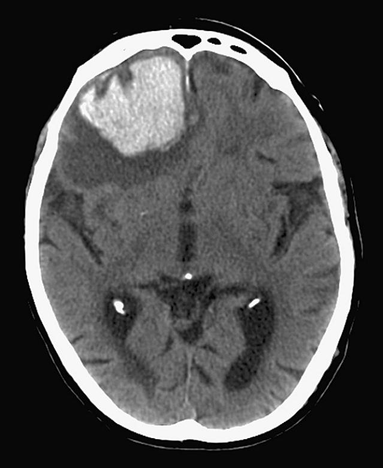

# Venous Thromboembolism in the Elderly

Hamsaraj G. M. Shetty Ian A. Campbell Philip A. Routledge

# **INTRODUCTION**

Venous thromboembolism (VTE) causes 25,000 to 32,000 deaths in hospitalized patients in the United Kingdom. It accounts for 10% of all hospital deaths. This, however, is likely to be an underestimate because many hospital deaths are not followed by a postmortem examination. The cost of managing VTE in the United Kingdom is estimated to be approximately £640 million. About 25% of patients treated for deep vein thrombosis (DVT) subsequently develop debilitating venous leg ulceration, treatment of which is estimated to cost £400 million in the United Kingdom. The most serious complication of VTE is pulmonary embolism (PE), which untreated has a mortality of 30%. With appropriate treatment, mortality is reduced to 2%.1 The diagnosis of VTE is often delayed until the occurrence of a clinically obvious (and occasionally fatal) PE.

VTE is more common in older adults. The incidence of DVT and PE increases with increasing age. Between 65 and 69 years of age, annual incidence rates per 1000 for DVT and PE are 1.3 and 1.8, respectively, and rise to 2.8 and 3.1 in individuals aged between 85 and 89 years. Older men are more likely than women of similar age to develop pulmonary embolism. About 2% develop PE and 8% develop recurrent PE within 1 year of treatment for DVT.2 The diagnosis of PE is more often missed in elderly people and is sometimes made only at postmortem.3

The Virchow's triad (named after Rudolf Virchow, 1821– 1902) describes the three main predisposing factors for development of thrombosis. The first is alteration in blood flow, which may be reduced in heart failure—a common problem in the elderly, less mobile individual. The second factor (injury to the vascular endothelium) is more relevant to arterial thromboembolism than to VTE. The third factor (hypercoagulability) is important since increases in clotting factor concentration, platelet and clotting factor activation, and a decline in fibrinolytic activity have all been reported in the elderly.4

### **Risk factors**

The risk factors for VTE are well recognized (Table 48-1). Many of these (e.g., poor mobility, hip fractures, stroke, and cancer) are more frequently present in the elderly, who are also more likely to be hospitalized and to have orthopedic surgery. Hospitalization itself is associated with an increased risk of VTE (the incidence is 135 times greater in hospitalized patients than in the community). The risk of VTE is greatest in "medical" inpatients. It is estimated that 70% to 80% of hospital-acquired VTEs occur in this group. Without prophylaxis, 45% to 51% of orthopedic patients develop DVT. It is estimated that in Europe approximately 5000 patients per year are likely to die of VTE following hip or knee replacement, when prophylactic treatments are not given. About a third of all surgical patients developed VTE before the introduction of prophylactic treatments.1

# **Clinical presentation and diagnosis DEEP VEIN THROMBOSIS**

Unilateral swelling of a leg is the most common feature in elderly patients having DVT. Calf pain may sometimes be present. Normally there is a history of recent hospitalization for orthopedic surgery, stroke, or for some other illness. There may occasionally be a history of anorexia, weight loss, or other symptoms suggestive of an underlying neoplasm. However, the patient is often otherwise asymptomatic.

It is well recognized that the clinical diagnosis of DVT can be difficult because the physical signs may often be subtle, and diagnosis may be more difficult in the elderly. Some individuals may be unable to complain about a swollen leg because of dementia or dysphasia. In addition, other conditions mimicking DVT, such as a ruptured Baker's cyst, are also more likely to occur in this age group. The clinical diagnosis of DVT relies on observing a swollen, warm, lower limb, which may sometimes be associated with engorged superficial veins. Calf tenderness may also be present. If there is a difference of more than 2 cm in circumference between the two lower limbs, DVT must be excluded by appropriate investigations, unless there is another obvious explanation.

Doppler ultrasonography has a sensitivity of 96% and specificity of 98% for proximal DVT and so it is the investigation of first choice to diagnose DVT.

Contrast venography may be necessary in selected patients, especially if clinical suspicion is high and the Doppler scan

# **Table 48-1. Risk Factors for VTE**

#### **Low Risk**

- Minor surgery (<30 min) + no risk factors other than age
- Minor trauma or medical illness

#### **Moderate Risk**

- Major general, urologic, gynecologic, cardiothoracic, vascular, or neurologic surgery + age >40 yr or other risk factor
- Major medical illness or malignancy
- Major trauma or burn
- Minor surgery, trauma, or illness in patients with previous DVT or PE or thrombophilia

#### **High Risk**

- Prolonged immobilization
- Age over 60 years
- Previous DVT or PE
- Active cancer
- Chronic cardiac failure
- Acute infections (e.g., pneumonia) • Chronic lung disease
- Lower limb paralysis (excluding stroke)
- BMI >30 kg/m2
- Fracture or major orthopedic surgery of pelvis, hip, or lower limb
- Major pelvic or abdominal surgery for cancer
- Major surgery, trauma, or illness in patients with previous DVT, PE, or thrombophilia
- Major lower limb amputation

Modified from references 1 and 42.

is negative. Estimation of the concentration D-dimer levels (a fibrin degradation product of thrombolysis), especially when combined with a clinical probability score, has a good negative predictive value but poor positive predictive value.5 Other investigations such as magnetic resonance imaging are currently being evaluated.

#### **PULMONARY EMBOLISM**

Sudden onset of dyspnea is the most common presenting feature of PE in the elderly. Sudden onset of a pleuritic chest pain, cough, syncope, and hemoptysis are other common presenting symptoms. In an elderly patient with stroke or recent orthopedic surgery, onset of any of these symptoms should greatly increase the suspicion of underlying PE. Because of high incidence of cardiovascular disease and age-related decline in cardiovascular function in general, the elderly are less likely to tolerate cardiovascular decompensation because of moderate or severe pulmonary embolism. They are, therefore, more likely to have syncope after a PE.6 Patients with smaller PEs may present with very nonspecific symptoms and the diagnosis is often missed in this group.

Clinical features will depend on the severity of the PE. In patients with moderate to severe PE, tachycardia, hypotension, cyanosis, elevated jugular venous pressure, right parasternal heave, loud delayed pulmonary component of the second heart sound, tricuspid regurgitation murmur, and pleural rub may be present. However, in patients with smaller PEs, clinical examination may be normal, except possibly for a sinus tachycardia. Unexplained tachycardia in a patient who is potentially at risk for VTE should alert the clinician to the possibility of PE.

Arterial blood gas analysis is a useful initial test in patients with suspected PE. Presence of hypoxia or worsening of preexisting hypoxia makes the diagnosis more likely, unless there are other comorbid conditions to account for it.

An ECG may show sinus tachycardia, S wave in lead I, Q wave and T inversion in lead III, right bundle branch block or a right ventricular strain pattern. In patients with severe PE, a P "*pulmonale*" may be seen. New onset of atrial fibrillation may also be a feature of PE.

A chest radiograph may show elevated hemidiaphragm, atelectasis, focal oligemia, an enlarged right descending pulmonary artery, or a pleural effusion. Many elderly patients have coexistent cardiac failure or chronic pulmonary diseases, which may also cause some of the radiographic abnormalities associated with PE.

At present, ventilation perfusion (V/Q) scans are still widely used in the United Kingdom for diagnosing PE. A medium or high probability scan is diagnostic, whereas a low probability scan virtually rules out PE.

Computed tomography pulmonary angiography (CTPA) is increasingly being used as the diagnostic test for detecting PE. A meta-analysis has indicated that the rate of subsequent VTE after a negative CTPA is similar to that following conventional pulmonary angiography.7 One randomized single blind noninferiority trial has demonstrated that CTPA is equivalent to a V/Q scan in ruling out PE. In the study, CTPA also diagnosed PE in significantly more patients.8 Although this study was conducted in younger patients, CTPA is likely to replace the V/Q scan as the investigation of first choice in elderly patients because of its greater ability to detect PE even in patients with coexistent cardiac and respiratory disease. The British Thoracic Society has recommended CTPA as the initial lung imaging modality of choice for nonmassive PE.9

Although the measurement of D-dimer concentration has high sensitivity and negative predictive value in the elderly patient with PE, it has a very poor specificity and positive predictive value and therefore cannot be recommended for routine diagnostic use.10

Contrast enhanced magnetic resonance imaging appears to be a promising imaging technique for detecting PEs. An echocardiogram is also particularly useful in evaluating the severity of PE. Invasive investigations such as pulmonary angiography are very rarely performed in the elderly patients.

#### **Treatment**

Anticoagulant therapy is the most widely used treatment for VTE. Other less frequently used treatments and interventions include thrombolytic therapy, thromboembolectomy, and the use of vena caval filters.

For initial treatment of both DVT and PE, low molecular weight heparins (LMWHs) are the drugs of first choice. Because they produce predictable anticoagulation with a weight-based (per kg body weight), once daily dose by subcutaneous route—and do not require routine laboratory monitoring (except for grossly overweight or underweight patients and those with renal failure)—they have almost replaced unfractionated heparin (UFH), which is now generally used only in special circumstances such as during the perioperative period. Randomized clinical trials have shown that LMWHs are as effective as UFH for treatment of both DVTs and PEs.11,12 LMWHs appear to cause less hemorrhagic complications and for the reasons described earlier, are much more convenient to use. With the widespread use of LWMHs in hospitals within the United Kingdom, many patients with DVT can now be treated as outpatients.

Once the diagnosis of DVT or PE is confirmed, warfarin therapy is commenced immediately and LMWHs are continued for at least 5 days or until therapeutic international normalized ratios (INRs) have been maintained for 48 hours. The recommended target INR for treatment of VTE is 2.5 (range 2 to 3).13 A higher intensity of 3.5 (range 3 to 4) is recommended for treating patients who develop recurrent VTE while in a therapeutic INR range between 2 and 3.14

As elderly patients are more sensitive to the effects of warfarin, they are much more likely to be over-anticoagulated during initiation of the treatment. Use of a tailored induction dosing regime is likely to reduce this possibility. One such regimen15 uses a first dose of 10 mg and subsequent doses are adjusted daily thereafter, depending on the INR (Table 48-2). Another induction regimen that has been shown to be safe and accurate in elderly hospitalized patients (over 70 years) involves giving 4 mg of warfarin daily for 3 successive days.16

The various recommendations with regard to the duration of warfarin therapy following VTE have generated a considerable amount of debate. One guideline recommended a minimum of 6 months of treatment.14 However, a randomized trial has shown that 3 months of anticoagulation is adequate for patients with a first episode of VTE (idiopathic or otherwise) and is less likely to be associated with serious hemorrhages.17 It is now being increasingly recognized that the duration of warfarin therapy should depend on the risk of recurrent VTE in an individual patient. If the

| Day   | INR (9–11 AM) | Warfarin Dose                               |
|-------|---------------|---------------------------------------------|
| Day 1 | <1.4          | 10                                          |
| Day 2 | <1.8          | 10.0                                        |
|       | 1.8           | 1.0                                         |
|       | >1.8          | 0.5                                         |
| Day 3 | <2.0          | 10.0                                        |
|       | 2.0–2.1       | 5.0                                         |
|       | 2.2–2.3       | 4.5                                         |
|       | 2.4–2.5       | 4.0                                         |
|       | 2.6–2.7       | 3.5                                         |
|       | 2.8–2.9       | 3.0                                         |
|       | 3.0–3.1       | 2.5                                         |
|       | 3.2–3.3       | 2.0                                         |
|       | 3.4           | 1.5                                         |
|       | 3.5           | 1.0                                         |
|       | 3.6–4.0       | 0.5                                         |
|       | >4.0          | 0.0                                         |
|       |               | Predicted Maintenance Dose                  |
| Day 4 | <1.4          | >8.0                                        |
|       | 1.4           | 8.0                                         |
|       | 1.5           | 7.5                                         |
|       | 1.6–1.7       | 7.0                                         |
|       | 1.8           | 6.5                                         |
|       | 1.9           | 6.0                                         |
|       | 2.0–2.1       | 5.5                                         |
|       | 2.2–2.3       | 5.0                                         |
|       | 2.4–2.6       | 4.5                                         |
|       | 2.7–3.0       | 4.0                                         |
|       | 3.1–3.5       | 3.5                                         |
|       | 3.6–4.0       | 3.0                                         |
|       | 4.1–4.5       | Miss out next day's dose, then give 2 mg |
|       | >4.5          | Miss out 2 days' doses, then give 1 mg   |

| Table 48-2. Warfarin Initiation Schedule |  |
|------------------------------------------|--|
|------------------------------------------|--|

| Adapted from Fennerty A, Dolben J, Thomas P et al. Flexible induction dose regimen |
|------------------------------------------------------------------------------------|
| for warfarin and prediction of maintenance dose. Br Med J 1984;288:1268–70.        |

VTE occurred following surgery, the risk of recurrence after 1 year of stopping anticoagulant therapy is approximately 3% and in such a situation it is safe to discontinue warfarin therapy after 6 weeks if there are no persistent risk factors. In patients with minor reversible risk factors (e.g., soft tissue leg injury), who have a recurrence risk of 5%, anticoagulants can be stopped within 3 months. On the other hand, patients who have a major, nonreversible risk factor such as cancer are at high risk of recurrence, and therefore should be considered for long-term anticoagulant therapy.18 One author has recently recommended long-term anticoagulation after unprovoked (idiopathic) VTE,19 but a recent study does not support this view and the BTS guideline recommends 3 months of anticoagulation after the first episode.9,17

#### **Practical aspects of oral anticoagulant therapy in the elderly**

Older people are more sensitive to the anticoagulant effect of warfarin. This is probably due to a combination of pharmacodynamic and pharmacokinetic factors.20,21 Warfarin dose requirement declines with age and in one study patients aged less than 35 years required a mean of 8.1 mg/day, more than twice as much to maintain the same INR as in those older than 75 years.21 The relationship between age and warfarin requirements is, however, rather weak.21 Warfarin clearance (wholly by metabolism since no warfarin is excreted unchanged in the urine) has been shown to decline with age in one study.22

Figure 48-1. CT head showing intracerebral hemorrhage.

Chronologic age does not appear to be a risk factor for bleeding with warfarin therapy, except possibly in those older than 80 years.23 Hemorrhagic complications due to warfarin are more likely to occur in the first 90 days of anticoagulant therapy (especially in the first month), either because of poor control of anticoagulation or the unmasking of an underlying lesion, such as a peptic ulcer or malignancy. High INRs (>4.5), poor control of anticoagulation, and inadequate patient education regarding anticoagulant therapy are likely to increase the risk of bleeding.

Studies have reported a log-linear relationship between the intensity of anticoagulation and the risk of bleeding.24 The risk of bleeding rises threefold between INRs 2 and 3 and further threefold between 3 and 4.25 As a high INR is one of the most important risk factors for bleeding in the elderly, the aim of treatment should be to maintain the lowest intensity of anticoagulation consistent with effective treatment or prophylaxis.

Polypharmacy is very common in the elderly and it increases the chances of drug interactions, which may result in overanticoagulation. Using medicines that are well known to enhance anticoagulant effect (e.g., antibiotics [particularly macrolides], amiodarone, etc.) with care and adjusting the dose of warfarin appropriately will reduce the likelihood of overanticoagulation and consequent bleeding.

Fatal hemorrhages tend to be intracranial and are more likely to occur in older people.25 (Figure 48-1). The elderly are more predisposed to intracranial bleeding because of the increased prevalence of leukoaraiosis and other cerebrovascular diseases. Older people are also more likely to have falls and so are at a greater risk of developing subdural hematomas.

An outpatient bleeding risk index included four risk factors for major bleeding (attracting 1 point each): age over 65 years, history of gastrointestinal bleeding, history of stroke, and one or more specific comorbid conditions (recent myocardial infarction, hematocrit of less than 30%, presence of diabetes mellitus, and serum creatinine of greater than 1.5 mg/dL). The authors indicated that a score of zero was associated with low risk, 1 to 2 with medium risk, and 3 to 4 with high risk (23% in 3 months and 48% in 12 months).26 The drawback of this clinical tool is that it places all people aged over 65 years in the medium risk category for bleeding, which may not necessarily be the case.

Hemorrhage associated with anticoagulant therapy should always be investigated to exclude an underlying pathology, even if the bleeding occurred when the INR was high. Unexplained anemia in an anticoagulated patient may well be due to occult bleeding (e.g., retroperitoneal hemorrhage). Sometimes atypical bleeding sites and presenting symptoms may pose diagnostic difficulties (e.g., alveolar hemorrhage [having unexplained anemia or dyspnea]).

#### **Management of overanticoagulation and bleeding**

Because of the high risk of bleeding associated with overanticoagulation, measures to bring the INR down to the therapeutic range should be instituted as soon as possible. If the INR is less than 8 (and depending on the indication for anticoagulation), warfarin is temporarily discontinued and reinstituted once the INR has fallen to less than 5, providing there is no bleeding or only minor bleeding.14 If the INR is over 8 and there is no bleeding or minor bleeding, temporary discontinuation of warfarin is also recommended, but if the patient has other risk factors for bleeding, low dose vitamin K either orally (0.5 to 2.5 mg) or intravenously (0.5 mg) will help to bring it within the therapeutic range in the majority of patients.13,27 Anaphylactoid reactions with intravenous vitamin K have rarely been reported, but their incidence seems to be lower with newer preparations, and when the dose is administered very slowly. In patients with major bleeding, warfarin should be discontinued and anticoagulation reversed urgently with prothrombin complex concentrate (factors II, VII, IX, and X) or fresh frozen plasma if the concentrate is not available. In addition, vitamin K1, 5 to 10 mg by slow intravenous injection is recommended to sustain the reversal. Urgent reversal of anticoagulation is particularly important in patients with intracerebral bleeding as it will prevent the continued expansion of the hematoma (the latter is associated with an even poorer outcome).

#### **Monitoring warfarin therapy**

Close monitoring of warfarin therapy will reduce the likelihood of over- or under-anticoagulation. Currently, most patients are either monitored by their general practitioners or in a hospital-based anticoagulation clinic. With appropriate training, patient self-management of anticoagulation has been shown to be feasible, effective, and safe. A randomized controlled trial, which compared routine care with patient self-management (with twice weekly use by patients, at home, of an INR measurement device and a simple dosing chart), showed that percentage of time in therapeutic range and serious adverse events were similar between the two groups. Patients who had poor control before the study showed an improvement with self-management.28 At present, the point of care INR measurement devices are quite expensive. They are, nevertheless, particularly useful for patients living in remote areas or those who have difficulty in accessing services of an anticoagulation service in primary or secondary care.

#### **Inferior vena caval filters**

In patients who have contraindications for anticoagulation, and those who bleed or continue to have thromboembolism during anticoagulant therapy, placement of an inferior vena caval (IVC) filter can be lifesaving. The PREPIC study, which included 400 patients with proximal DVT, with or without PE, followed up for 8 years, reported a significant reduction in the incidence of symptomatic PE, but an increase in the incidence of DVT in patients treated with filter compared with those who received standard anticoagulant therapy. There was no significant difference in the development of postphlebitic syndrome or mortality between the two groups.29 Complications of IVC filters include misplacement or embolization of the filter, vascular injury or thrombosis, pneumothorax, and air embolus.

A limited number of small studies have reported no inferior vena caval thrombosis with the use of retrievable inferior vena caval filters.30 Further studies are needed to confirm these encouraging initial findings.

#### **Treatment of PE with hemodynamic instability**

Massive PE may have acute cor pulmonale or cardiogenic shock. Elderly patients are much more likely to develop right heart failure and shock with massive PE. Such patients should be managed in an intensive therapy unit unless they have a terminal illness or have previously had a very poor quality of life. In addition to cardiovascular and respiratory resuscitation, treatment options include thrombolysis or thromboembolectomy. The most commonly used thrombolytic agent is recombinant tissue plasminogen activator (rt-PA). Intracranial hemorrhage occurs in about 3% of patients treated with thrombolytic agents. In patients with massive PE who have contraindications for thrombolysis, or when it has failed, pulmonary embolectomy can be attempted. Despite these measures, mortality is very high in patients with PE having cardiogenic shock.

#### **Prevention**

Many hospitalized elderly patients are at risk for VTE. Those with stroke, hip fractures, and those who have had orthopedic surgery are at particularly high risk. In such patients, prophylaxis implementation rates have been reported to range between 13% and 64%. Prophylactic treatments are particularly underused in medical patients. A very large multinational cross-sectional survey, designed to assess the VTE risk in an acute hospital setting, found 51.8% to be at risk (64.4% surgical, mean age 60 years and 41.5% medical patients, mean age 70 years); of these 58.5% of surgical and only 39.5% of medical patients received appropriate thromboprophylaxis.31

A meta-analysis of thromboprophylaxis in hospitalized medical patients showed that, compared with controls, treatment with low dose UFH or LMWH reduced the risk of DVT (risk ratio 0.33 and 0.56, respectively) and PE (risk ratio 0.64 and 0.37, respectively). Treatment with LMWH was associated with a greater reduction in DVT risk (relative risk: 0.68) compared with UFH. There was no difference in the risk of bleeding or thrombocytopenia between the two drugs and neither of them reduced mortality.32

The American College of Chest Physicians (ACCP) recommends LMWH, low-dose UFH, or fondaparinux for thromboprophylaxis in hospitalized, acutely ill, medical patients. In those who have contraindications for anticoagulant use, graduated compression stockings or intermittent pneumatic compression can be used.13

A meta-analysis involving 9 studies compared extended thromboprophyaxis (for 30 to 42 days) with heparin (8/9 studies used LMWH) or warfarin with a placebo or untreated controls after total hip replacement (THR) and total knee replacement (TKR). It showed a significant reduction in symptomatic VTE (equivalent to 20 symptomatic VTEs per 1000 patients treated) without an associated increase in major hemorrhage in the treatment group.33

A number of new anticoagulants are currently being investigated for thromboprophylaxis. Orally administered factor Xa inhibitors and direct thrombin inhibitors have already been investigated in randomized clinical trials in patients undergoing THR and TKR.

A randomized, double-blind study compared subcutaneous, once daily, preoperative enoxaparin, with postoperative fondaparinux in patients undergoing elective THR (age range: 24 to 97 years; mean age 67 years). The risk of VTE was significantly reduced in those receiving fondaparinux (relative risk reduction 55.9%, CI 33.1 to 72.8). Frequency of deaths and clinically relevant bleeding were similar in the two groups.34

Another double-blind, randomized study compared postoperative oral dabigatran etexilate with preoperative enoxaparin in patients undergoing THR (mean age range: 63 to 65 years). In this study, oral dabigatran was found to be as effective as enoxaparin in reducing VTE risk and there was no difference in the risk of major bleeding between the two drugs.35

The randomized, double-blind studies, Regulation of Coagulation in Orthopaedic Surgery to Prevent Deep Vein Thrombosis and Pulmonary Embolism 1 (RECORD 1)36 and RECORD 3,37 compared a 10-mg once-daily dose of rivaroxaban, an oral direct factor Xa inhibitor, with 40 mg of enoxaparin, for extended thromboprophylaxis in patients undergoing THR and those undergoing TKR, respectively. Rivaroxaban was significantly more effective in reducing DVT (symptomatic and asymptomatic), nonfatal PE, and death from any cause (at 36 days for THR patients and within 13 to 17 days for TKR patients). There was no significant difference in the risk of major bleeding.

The RECORD 2 study compared oral rivaroxaban 10-mg dose once daily given for 31 to 39 days with subcutaneous enoxaparin 40-mg dose once daily given for 10 to 14 days in patients undergoing elective THR. Extended thromboprophylaxis with rivaroxaban significantly reduced VTE, including symptomatic events.38

Although these studies are encouraging, LMWH and warfarin presently remain the most frequently used agents for thromboprophylaxis in most circumstances in elderly people.

#### **Graduated compression stockings**

Graduated compression stockings (GCS) reduce the risk of VTE in surgical patients, but they are not superior to LMWHs. Ideally, they should be used along with LMWHs. In patients who are at high risk of bleeding, they can be used on their own. As most elderly patients have peripheral vascular disease, the GCS should be used with extreme caution: inappropriate use has been known to cause ischemic complications.

The role of GCS in medical patients needs further investigation. A large multicenter clinical trial (the CLOTS trial) is currently investigating its role in stroke patients.

After proximal DVT, approximately 60% of patients develop postphlebitic syndrome. A randomized trial has shown that, when sized-to-fit, GCS reduce the incidence by about 50%.39 Patients with proximal DVT should start wearing GCS as soon as possible after the diagnosis and continue to wear them for at least 2 years.39

# **Prognosis**

A population-based cohort study of patients with VTE found that the overall probable and definite (in parentheses) cumulative percentage of VTE recurrence at 7, 30, and 180 days and 1 and 10 years was 1.6% (0.2%), 5.2% (1.4%), 10.1% (4.1%), 12.9% (5.6%), and 30.4% (17.6%), respectively.

#### KEY POINTS Venous Thromboembolism in the Elderly

- Venous Thromboembolism (VTE) is an important cause of mortality in hospitalized patients and is more common in the elderly.
- Risk factors for VTE, such as immobility, hip fracture, and stroke are more common in older people.
- In an elderly patient with stroke or recent orthopedic surgery, sudden onset of dyspnea, chest pain or syncope should markedly increase the suspicion of underlying PE.
- Computed tomography pulmonary angiography (CTPA) is the initial lung imaging modality of choice for nonmassive PE.
- For prevention and initial treatment of both DVT and PE, low molecular weight heparins are the drugs of first choice.
- Older people are more sensitive to the anticoagulant effect of warfarin.
- Studies have reported a log-linear relationship between the intensity of anticoagulation and the risk of bleeding.
- In patients with massive pulmonary embolism, treatment options include thrombolysis or thromboembolectomy.
- Orally administered factor Xa inhibitors and direct thrombin inhibitors are being investigated in randomized clinical trials for treatment of VTE.
- Prompt clinical diagnosis and carefully monitored institution of therapy will reduce morbidity and mortality from VTE in the aging population.

The risk of recurrence was greatest in the first 6 to 12 months after the initial VTE. Independent predictors of first overall VTE recurrence included increasing age and body mass index, neurologic disease with paresis, malignant neoplasm, and neurosurgery.40

A prospective international registry, which studied clinical predictors for fatal PE in patients with VTE, has reported 3-month mortality and fatal PE rates of 8.65% and 1.68%, respectively. Patients with symptomatic nonmassive PE at presentation were found to have a 5.42-fold higher risk of fatal PE compared with patients with DVT without symptomatic PE (*P <* 0.001*).* The risk of fatal PE was 17.5 times higher in patients having a symptomatic massive PE. Other independent risk factors for fatal PE were immobilization for neurologic disease, age greater than 75 years, and cancer.41

Long-term complications of VTE include postphlebitic syndrome and chronic thromboembolic pulmonary hypertension.

#### **CONCLUSION**

VTE continues to be an important cause of morbidity and mortality in older people. There have been major advances in its diagnosis and treatment over the past 15 to 20 years. A number of new antithrombotic drugs (e.g., orally administered factor Xa inhibitors and direct thrombin inhibitors) are currently being investigated and may provide an alternative to warfarin therapy. Whatever treatment is advocated in the future, prompt clinical diagnosis and carefully monitored institution of therapy will reduce morbidity and mortality from VTE in the aging population.

For a complete list of references, please visit online only at www.expertconsult.com