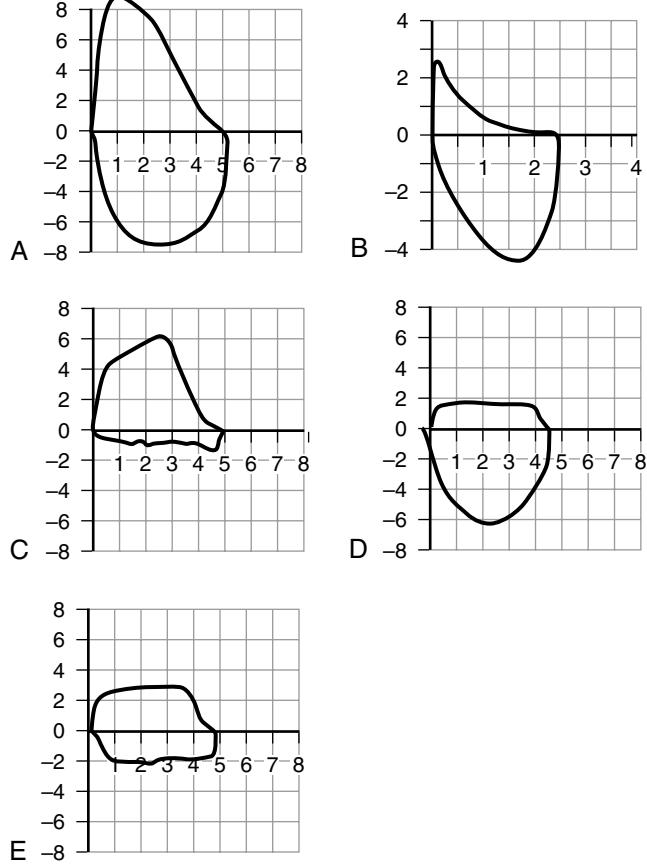
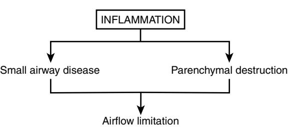
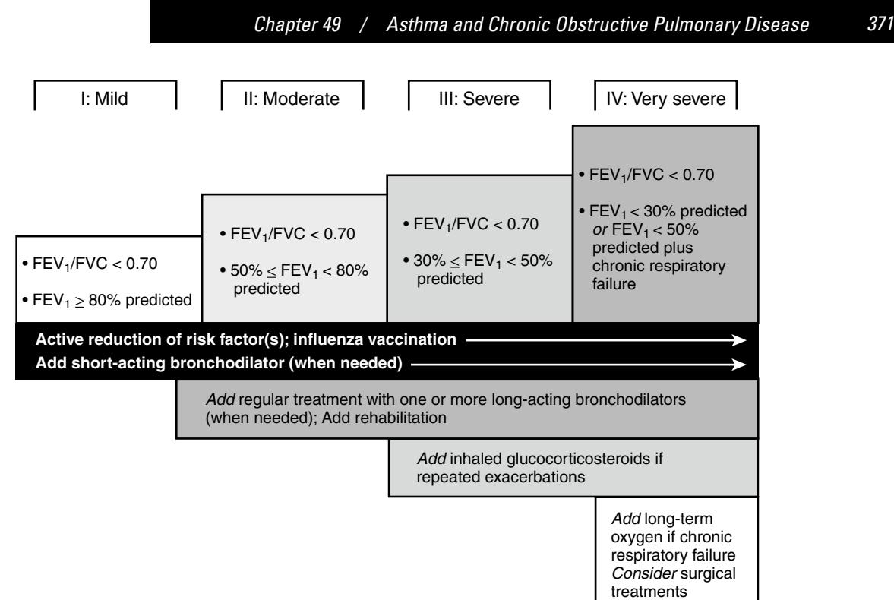
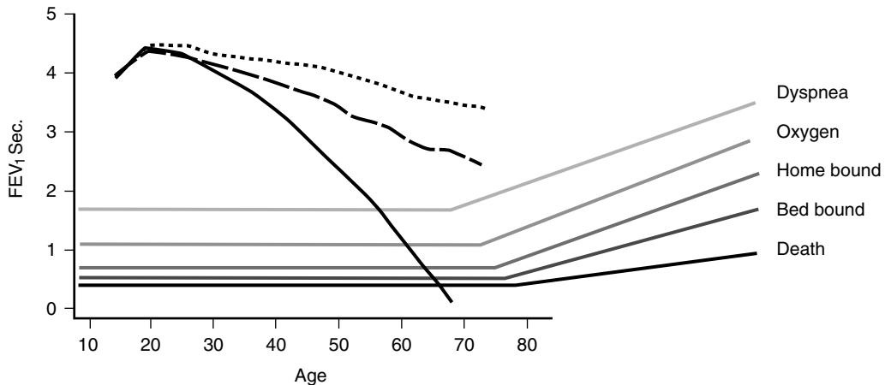

# Asthma and Chronic Obstructive Pulmonary Disease

Sidney S. Braman Muhanned Abu-Hijleh

# **DISEASES OF AIRFLOW OBSTRUCTION**

There are three common airway diseases of older adults that cause limitation of airflow: chronic bronchitis, emphysema, and asthma. All have in common a reduction of maximum expiratory flow and a slow forced emptying of the lung on spirometric testing. Chronic bronchitis and emphysema share common clinical and pathologic abnormalities. Most patients with these conditions have a significant smoking history and attempts were made to incorporate both conditions under the term chronic obstructive lung disease (COPD). As asthma became recognized as an inflammatory disease with a different cellular and inflammatory mediator profile, it was no longer considered under the term COPD. This was also justified by the fact that asthma is felt to be distinct because airflow obstruction is predominantly reversible and the airways of asthmatics are notably hyperresponsive to a variety of specific (aeroallergens) and/or nonspecific (methacholine, histamine, cold air) inhaled substances. Current definitions of these diseases of the airways are presented in Table 49-1.

Although it is still clinically useful to distinguish asthma from COPD (chronic bronchitis and emphysema), it is important to recognize three problems with this nosology:

- Remission rates for adults with asthma are much less than those seen in children and this probability increases with age. As a result, most asthmatics, even those who have never smoked, who are at the age when COPD is most often recognized (over age 60), have evidence of poorly reversible airflow obstruction on pulmonary function testing. This is thought to be caused by a structural remodeling of the airways with what may be permanent changes. This is supported by data from longitudinal studies that the average FEV1 in asthmatics declines over a period of years. Despite these findings, there are many patients who show no correlation between their FEV1 and the duration of their disease.
- Bronchial hyperresponsiveness—the exaggerated bronchoconstrictive response to nonspecific agonists such as methacholine is a constant feature in asthmatics that is so important to its pathogenesis. On the other hand, increased responsiveness to constrictors such as methacholine and histamine (but not indirect bronchoconstrictors such as cold air and bradykinin, which do not act directly on airway smooth muscle) is seen in the majority of older smokers with COPD. This was shown to be a strong predictor of progression of airway obstruction in younger smokers who continue to smoke. In asthma, bronchial hyperresponsiveness is not related to baseline airway caliber, whereas in COPD the increased responsiveness to bronchoconstrictors can be explained entirely by the geometric effect of fixed airway narrowing.
- Unfortunately, many adult patients with asthma are current or former smokers. It is likely that such

patients have more than one pathologic process with several pathways of inflammation. Although studies on the effects of smoking on the rate of decline of FEV1 in asthma have given conflicting results, most smoking asthmatics will have some degree of fixed airflow obstruction. This has raised a complexity of semantic issues that have not been solved. One attempt has been to combine two of the major pathologic processes and describe such patients using the term "asthmatic bronchitis" but this has not been widely accepted.

Although there are distinct differences between asthma and COPD in older patients, the clinical differentiation in some individuals is quite problematic. Fortunately, although the pathologic mechanisms leading to asthma and COPD differ, the pharmacologic and nonpharmacologic therapeutic approaches to these two conditions are quite similar as described later in this chapter, making clinical decisions less problematic. An overview of the distinguishing clinical features of these conditions is seen in Table 49-2.

# **ASTHMA IN THE ELDERLY Introduction**

Asthma is a common debilitating disease that affects 300 million people globally with a 50% increase in the prevalence every decade, in addition to climbing morbidity and mortality. In response to these alarming statistics of the twentieth century, the National Asthma Education and Prevention Program (NAEPP) commissioned an expert panel that would help bridge the gap between current knowledge and clinical practice. The panel was charged to develop guidelines for the care of asthma that would raise public awareness, improve physician recognition that asthma is a growing health problem, and improve asthma control. The first expert panel report was offered in 1991. Based on new evidence from the medical literature, updates were published in 1997 and 2002. The most recent update was made available in 2007 as the Expert Panel Report 3, entitled "Guidelines for the Diagnosis and Management of Asthma" www.nhlbi.nih.gov/guidelines/asthma.1

The NAEPP guidelines offered a new definition of asthma (see Table 49-1) that is now widely accepted and appropriate for any age. This description of asthma clearly established it as an inflammatory disease and provided the basis for anti-inflammatory therapy. This has been the foundation of treatment for asthma over the last 2 decades.2 In fact, there is strong evidence linking anti-inflammatory therapy with inhaled corticosteroids to a reduction in asthma mortality.3

# **Epidemiology: prevalence**

The prevalence of asthma has risen over the last several decades with recent data showing that 22 million Americans are affected by this disease. The overall prevalence of asthma

#### **Table 49-1. Definitions of Obstructive Lung Diseases**

- Asthma: a chronic inflammatory disease of the airways in which many cells play a role, in particular, mast cells, eosinophils, and T-lymphocytes. In susceptible individuals, this inflammation causes recurrent episodes of wheezing, breathlessness, chest tightness, and cough, particularly at night and/or in the early morning. These symptoms are usually associated with widespread but variable airflow limitation that is at least partially reversible either spontaneously or with treatment. This inflammation also causes an associated increase in airway hyperresponsiveness to a variety of stimuli. Reversibility of airflow limitation may be incomplete in some patients with asthma.
- COPD: a preventable and treatable disease state characterized by airflow obstruction that is no longer fully reversible. The airflow limitation is usually progressive and is associated with an abnormal inflammatory response of the lungs to noxious particles and gases, primarily caused by cigarette smoking. Although COPD affects the lungs, it also produces considerable systemic consequences:
	- o Chronic bronchitis: a condition characterized by the presence of chronic cough and sputum expectoration that is present for most days for a minimum of 3 months per year, for at least 2 successive years and not attributable to other pulmonary or cardiac causes
	- o Emphysema: a condition defined anatomically by enlargement of air spaces distal to the terminal bronchiole, accompanied by destruction of their walls and capillaries, without obvious fibrosis

#### **Table 49-2. Distinguishing Clinical Features of Asthma and COPD in Elderly Patients**

| Asthma                           | COPD                           |
|----------------------------------|--------------------------------|
| History of allergy is common     | Normal prevalence of allergy   |
| Smoking history in some patients | 90% have smoked cigarettes     |
| Episodic attacks of dyspnea      | Progressive dyspnea over years |
| Nocturnal attacks of dyspnea     | Daytime exertional dyspnea     |
| Reversible airflow obstruction   | Minimal or no reversibility    |
| Good QOL                         | Progressively poor QOL         |

QOL, Quality of life.

in the U.S. population is approximately 6% to 7%.4 Although the diagnosis and treatment of asthma are often focused on younger population, it is estimated that more than 1 million adults older than 65 years of age in the United States carry a diagnosis of asthma.

In a survey of the elderly in the United States, the prevalence of physician-diagnosed asthma was 4%, with an additional 4% having probable asthma (symptoms of asthma without a diagnosis).5 Other estimates of prevalence have shown a broad range from 4% to 9%. In many older patients, it is not possible to distinguish asthma from chronic bronchitis or COPD, especially in current or former cigarette smokers. In population surveys that inquire about asthma and COPD, subjects frequently reported more than one disease. In an investigation of two databases6 from the United States and the United Kingdom, 8.5% of the participants from the U.S. population reported asthma, chronic bronchitis, or emphysema. Of these subjects, the asthma-only group was the largest, accounting for 50.3% and 79.4% of these patients in the United States and United Kingdom, respectively. This number decreased with increasing age. Overall, 17% and 19% of patients in the United States and in the United Kingdom, respectively, reported more than one condition, and this percentage increased with age. In those over 50 years of age in the U.K. cohort, individuals with more than one condition accounted for as many as 50% of the patients with obstructive lung disease. This proportion was 25% in a 45- to 69-year age group in another study from Australia.7

Community surveys in which a physician diagnosis of asthma was required have provided data on asthma in the general population. The prevalence of active asthma in one study, which represented new cases excluding those in remission, peaked in early childhood at about 8% to 10%, declined to approximately 5.5% during late adolescence and then rose again to about 7% to 9% during late adulthood (over age 70). In 1987, data from the National Center for Health Statistics showed that in the 65- to 74-year age group, the rate of active asthma or wheeze was 10.4% compared to 5.7% in teenagers, 6.9% in the 18- to 44-year-old age group, and 9.6% in the 45- to 64-year-old age group. In another report from a population-based cohort of elderly individuals living in Rochester, Minnesota, a group of asthmatics were identified with the onset of asthma after age 65. The agespecific incidence of asthma in those aged 65 to 74 years of age was 103/100,000; it was 81/100,000 in those aged 75 to 84 years, and 58/100,000 in those older than 85 years.

## **Epidemiology: morbidity and mortality**

Asthma in the elderly is associated with a significant number of hospitalizations and emergency department visits, which leads to substantial health care cost. In 1999, the United States rate for asthma hospitalization for patients older than 65 years of age was 21.1/10,000.4 Elderly patients with asthma are more likely to die from their disease than younger individuals and although mortality rates in some age groups have decreased, this is not the case in the elderly, especially women.8

According to the U.S. Centers for Disease Control and Prevention (CDC), asthma deaths in the elderly account for more than 50% of asthma fatalities annually with an approximately 5.8 asthma deaths per 100,000 in this group reported in the years 2001–2003.4,9 In a U.S. study of asthma deaths of patients who had died in hospitals or nursing homes, 80% of the deaths occurred in patients age 55 and older. Seventy-five percent of these patients were known to be smokers or ex-smokers. A careful analysis of these cases revealed that many younger asthmatics did clearly have asthma and had died of a severe sudden attack. In those over age 55, confounding factors were much more prevalent. These patients frequently had underlying chronic bronchitis or COPD, were admitted to the hospital for nonrespiratory problems, and died of chronic respiratory failure. Less aggressive therapy was given to these elderly patients, both in the outpatient setting and during hospitalization. This study suggested that many elderly patients with asthmalike symptoms and a history of previous smoking have COPD as an underlying or even dominant feature of their disease. This undoubtedly overestimated the true mortality from asthma in this age group. Factors that may increase risk of death in the elderly include the delay in seeking diagnosis and treatment, poor cardiopulmonary reserve, impaired perception of increasing airway obstruction, blunted hypoxic ventilatory drive, and psychosocial and cognitive problems, which are very common in this age group.

## **Pathogenesis**

Asthma is caused by a complex interaction of cells, mediators, and cytokines that result in airway inflammation,10 which results in a number of typical histopathologic findings in the airways. This inflammation results in the three cardinal features described in the definition of asthma that are involved in the pathogenesis of the disease: airflow obstruction, reversibility of obstruction, and bronchial hyperresponsiveness.

#### **Histopathologic findings**

Infiltration of the airways by inflammatory cells such as mast cells, eosinophils, activated T-lymphocytes, and neutrophils was demonstrated on biopsies and bronchoalveolar lavage. The number of activated lymphocytes found in bronchial biopsies has been correlated with the number of local activated eosinophils and the severity of asthma. Specific cytokines, most of which are products of lymphocytes and macrophages, appear to direct the movement of cells to the site of airway inflammation. Mast cells, usually as a result of IgE-mediated stimulation, also release preformed mediators, such as histamine and proteases, and further act as a regulator of inflammation by producing cytokines that promote eosinophil infiltration and activation. Several mast cell products induce bronchoconstriction and cause increased mucus secretion.

Edema of the airway mucosa occurs as a result of increased capillary permeability with leakage of serum proteins into the interstitium. Denudation of the airway epithelium can lead to airway edema and loss of substances in the mucosa that protect the airway. Epithelial damage promotes bronchial hyperresponsiveness since access by irritating substances to sensory nerve endings is increased. Another characteristic finding in severe asthma is the presence of tenacious mucus plugs in the airways. Death from asthma usually occurs from blockage of the airways by diffuse mucus plugging.

Thickening of the reticular basement membrane, the lamina reticularis, is a constant feature of asthma. There is evidence of increased bronchial smooth muscle mass that contributes considerably to the thickness of the airway wall. The airway architecture is also changed by the deposition of type III and V collagen and fibronectin beneath the basement membrane (referred to as "subepithelial fibrosis"). The architectural changes seen in and beneath the basement membrane and in the bronchial smooth muscle are referred to as airway remodeling and are thought to cause permanent changes that result in fixed airflow obstruction.

## **Histopathologic findings in elderly asthmatics**

Sputum, bronchoalveolar lavage, and bronchial mucosal biopsy specimens from elderly stable asthmatics have confirmed the presence of prominent eosinophilia, and CD4+ T lymphocytes, as seen with younger asthmatics.11 Thickening of the reticular basement membrane and disruption of the epithelial lining has also been described. Pathologic findings have been compared in young and older subjects who have died of fatal asthma attacks.12 Both old and young patients with asthma have thickened airway smooth muscle compared with normal subjects. However, older asthmatics with a longer duration of disease demonstrate an increase in airway wall thickness predominantly due to an increase in the adventitial area. Greater postmortem reduction in airway lumen is also found in elderly asthmatics. The luminal content and subepithelial collagen deposition are similar in both asthma groups. This supports the concept that aging and/or asthma duration result in airway remodeling, causing "fixed" or irreversible airflow obstruction in this population.

## **Airflow obstruction**

Airflow obstruction is a cardinal feature of asthma. Objective measures of lung function such as spirometry and peak flow measurements are generally underutilized in elderly patients, which contributes to the delay or absence of diagnosis.13 Lung function testing is especially important in this age group since there is an age-related reduction in the perception of dyspnea seen in the elderly. However, spirometry may be difficult to perform in some situations because of physical or poor cognitive impairments. In addition, it is hard to define the lower limits of predicted normal values in this age group, which may vary considerably.

During an acute asthma attack, lung hyperinflation occurs, protecting airway narrowing. This happens because of the interdependence of lung volume and airway caliber since parenchymal attachments cause greater tethering of the airways at higher lung volumes. Inflammation of the bronchial wall, however, may uncouple the mechanical linkage between the parenchyma and the airway. This may contribute to airway narrowing and also to bronchial hyperresponsiveness. During an acute attack of asthma, airway resistance increases and all measures of airflow (peak expiratory flow rate [PEFR], forced expiratory volume in 1 second [FEV1], forced expiratory volume in 1 second as a fraction of the forced vital capacity [FEV1/FVC %], airway resistance [RA], etc.) are abnormal. During remission, these tests may normalize, and yet considerable dysfunction may be present in peripheral airways. Studies using bronchoscopic measurements have shown that peripheral resistance can be tenfold higher than in normal subjects.

#### **Reversibility of airflow obstruction**

Another hallmark of asthma is that the airflow obstruction reverses to normal or toward normal after treatment. This may occur rapidly, after treatment with a short-acting inhaled β-agonist, or after weeks or months of intense antiinflammatory therapy. Although complete reversibility is frequently seen with young asthmatics, most elderly asthmatics, and those of any age group with more severe and persistent symptoms, show only partial reversibility despite continuous intense anti-inflammatory and bronchodilator therapy. In one random survey of 1200 elderly asthmatics older than 65 years from the Mayo Clinic, only one in five patients had normal pulmonary function (FEV1 >80% predicted) whereas a similar number showed moderate to severe airflow obstruction (FEV1 <50% predicted) even after administration of an inhaled short-acting bronchodilator.14 There is growing evidence that the airway function of young and middle age asthmatics declines at a greater rate than normal subjects. The rate of decline increases with increasing age and in those who smoke cigarettes. However, these effects on asthmatics are variable since not all individuals show a steep rate of decline. The precise reasons for this individual variability have not been defined, although there is evidence that atopy and marked bronchial hyperresponsiveness are two important risk factors for airflow obstruction. In addition, the long duration and severity of previous disease are also important factors.15 On the other hand, for those who develop asthma at an advanced age, there is evidence that lung function is reduced, even before a diagnosis is made, and declines rapidly shortly after diagnosis. Thereafter, it remains fairly stable. Hence, many elderly asthmatics with severe airflow obstruction report a short duration of symptoms for months to a few years. The cause of chronic persistent airflow obstruction in older asthmatics with longstanding disease or with recently acquired asthma has not been explained, and airway remodeling is thought to be the main cause.

## **Diagnostic tests for reversible airflow obstruction**

The presence of airflow obstruction can be easily confirmed by simple office spirometry. A reduced FEV1 and ratio of FEV1/FVC is demonstrated with the timed vital capacity maneuver or by the flow volume loop. The loop is produced by the simultaneous measurement of airflow and lung volume during forced exhalation and inhalation (Figure 49-1). The configuration of the flow volume loop can be helpful in the differential diagnosis of airflow obstruction in the elderly. Traditionally, an FEV1/FVC ratio of less than 70% increases the probability of asthma in an elderly patient with asthma symptoms. A brisk response to a short-acting

Figure 49-1. Flow-volume loops in a normal subject (A), a patient with COPD (B), extrathoracic dynamic airway obstruction with airflow limitation during inspiration (C), intrathoracic dynamic airway obstruction with airflow limitation during expiration (D) and fixed airway obstruction with airflow limitation during inspiration and expiration (E).

bronchodilator may demonstrate the second cardinal feature of asthma, reversible airflow obstruction ("a responder"). Evidence of reversibility (postbronchodilator FEV1 or FVC increases more than 12% and 200 mL) increases the probability of asthma. However, many patients with COPD will also meet the reversibility criteria on any given testing day although the response to an inhaled bronchodilator is generally greater with asthma (16% asthma vs. 11% COPD). A positive response in a patient with COPD may not persist over time; over 50% of patients will change "responder" status between visits. This makes the test less than reliable to confirm the diagnosis of asthma especially in the elderly. In general, when complete reversibility of airflow obstruction is documented, COPD, a disease of fixed airway obstruction becomes less likely. As noted above, many patients with asthma will not meet the reversibility criteria and airway remodeling may be the cause. Additionally, reduced β2-adrenoreceptor responsiveness has been demonstrated in normal elderly men and women, and asthmatics. When compared to young and elderly normal subjects, elderly late-onset asthmatics have been shown to have reductions in β-adrenergic receptor affinity while maintaining normal receptor density. There is also evidence that post receptor events are impaired in the aged as cyclic AMP production by pathways that are independent of adrenergic receptor stimulation is depressed. Although the bronchodilator response to inhaled β-agonists declines with age, this is not the case with anticholinergic agents.

## **Bronchial hyperresponsiveness**

Airway inflammation is thought to be a key factor in producing the third cardinal feature of asthma, BHR. This can be described as an exaggerated bronchoconstrictive response by the airways to a variety of stimuli, such as aeroallergens, histamine, methacholine, cold air, and environmental irritants. It is not clear whether BHR is acquired or is present at birth and genetically determined to appear with the appropriate stimulus, such as during allergen exposure, respiratory viral illness, or the inhalation of noxious agents, such as ozone or sulfur dioxide. Anti-inflammatory agents such as inhaled corticosteroids are effective in reducing bronchial hyperactivity.

The degree of bronchial hyperresponsiveness can be determined in the pulmonary function laboratory by standard inhalation bronchoprovocation challenge testing. The methacholine inhalation challenge is the most frequently used clinical tool to determine the presence and degree of bronchial hyperresponsiveness. When the patient has asthma symptoms, and the tests looking for airflow obstruction are normal, the methacholine challenge can be used for diagnosis. A positive test is not specific for asthma. A strongly positive test coupled with a high pretest probability offers a high likelihood of asthma. A negative bronchoprovocation test rules out asthma as a cause of pulmonary symptoms. Bronchoprovocation testing is a safe and effective method to uncover asthma in the elderly.

There is evidence that some sympathetic and parasympathetic nervous system functions are diminished with age. This decline in autonomic nervous system function is consistent with a generalized diminution of peripheral somatic nerve function with aging. However, although the protective laryngeal gag reflex appears diminished in normal elderly subjects, there is evidence that the cholinergically mediated cough reflex may not be similarly affected. Measurements of cholinergic bronchoconstrictive reflexes have shown mixed results although most studies have shown a positive correlation between aging and airway hyperresponsiveness.16 There is also a relationship between the degree of bronchial hyperresponsiveness and prechallenge pulmonary function; a low FEV1 predicts heightened responsiveness. Although this may explain why some studies have shown that bronchial responsiveness is heightened in the elderly, aging may be an independent factor influencing airway responsiveness. Other factors that may contribute to heightened airway responsiveness in the older population are atopy and current or previous smoking history.

#### **Atopic asthma**

Allergic or atopic reactions in the upper (nose, sinuses) and lower airways are both important in the pathogenesis of asthma in childhood and young adulthood. Their role in the elderly is less clear. Atopy is defined by the presence of abnormal amounts of IgE antibodies in response to contact with environmental antigens. This can be demonstrated clinically by elevated total or specific serum IgE levels in the blood or by positive skin prick tests to a variety of standardized aeroallergens. In elderly patients with or without asthma, an elevated level of IgE may be an important risk factor for the development of chronic airflow obstruction. This is especially true in current smokers, but also seen in former smokers.

Atopy is an age-related phenomenon; in community surveys the peak prevalence of immediate skin test reactivity occurs during the third decade and falls rapidly after age 50. The proportion of asthmatics that are atopic varies with age; in childhood about 80%; between ages 20 to 40, 50%; and after age 50, less than 20%. Elevated serum IgE levels are closely related to the likelihood of a subsequent asthma diagnosis in younger asthmatics and this may be seen with elderly asthmatics. More likely, those that acquire asthma after age 60 are nonatopic. In the Cardiovascular Health Study,5 many elderly asthmatics reported respiratory problems that started in childhood and half stated that wheezing was triggered by contact with plants, animals, or pollens and that it was seasonal. Elderly urban dwelling patients with asthma may show evidence of cockroach-specific IgE antibody and are more likely to have more severe asthma and airflow obstruction.17 IgE specific antibodies to cat and dog dander, cockroach, and dust mite can also be present in elderly asthmatics with atopy.18 A history of atopy is the strongest predictor of asthma in the elderly.19 Those who are capable of becoming sensitized will usually have done so by the time they are older adults. Avoidance of potential allergens in the environment of the elderly asthmatic should be advised.

## **Clinical features**

The distinctive features of asthma in older adults have been described in an NIH consensus conference20 and also the subject of a comprehensive clinical review.21 In adulthood, there is a steady incidence of new-onset asthma through all ages, even in the elderly. Many patients begin with symptoms following respiratory viral infections. This pattern

may gradually or abruptly develop into persistent symptoms and often severe, poorly responsive disease. Classic symptoms of asthma, including episodic wheezing, shortness of breath, and chest tightness, are typical of elderly and young asthmatics. These symptoms are generally worse at night and with exertion and are often precipitated by an upper respiratory tract infection. These symptoms of asthma in the elderly are nonspecific and may be caused by a variety of other conditions. Shortness of breath, especially on exertion, is a common symptom and may be attributed to different underlying diseases, including heart or lung diseases. Many elderly patients limit their activity to avoid experiencing shortness of breath, and others assume that their dyspnea is resulting from their aging process and, thus, avoid seeking early medical attention. However, aging per se does not cause dyspnea, and a cause always needs to be pursued in assessing an elderly patient with breathlessness. Underreporting of symptoms in the elderly may have many causes, including depression, cognitive impairment, social isolation, denial, and confusing symptoms with those of other comorbid illnesses. On the other hand, elderly patients have been shown to have a reduced perception of bronchoconstriction and this also may delay medical intervention. Cough is another prominent symptom of asthma and may occasionally be the only presenting symptom.20 The presence of wheezing is not very specific and does not correlate with the severity of airflow obstruction. Asthma symptoms are often triggered by environmental exposures and can also be provoked by medications, such as aspirin, nonsteroidal antiinflammatory agents, or β-blockers, commonly used by this population; this fact emphasizes the need for the physician to perform a comprehensive review of medications upon presentation.

Physical examination in elderly patients with asthma is usually nonspecific and may misguide the diagnosis. During an acute attack of asthma, tachypnea and tachycardia are present. Sinus tachycardia is also a complication of asthma therapy with such drugs as sympathomimetics and theophylline. As airway function improves with sympathomimetic treatment, sinus tachycardia usually improves rather than worsens. In acute asthma, premature ventricular contractions occur occasionally, whereas atrial arrhythmias are extremely uncommon. Other abnormalities seen in acute severe asthma include P pulmonale, right axis shift, right bundle branch block, and right ventricular strain. Diffuse musical wheezes are characteristic of asthma, but their presence or intensity does not reliably predict the severity of asthma. By the time wheezing can be detected by the stethoscope, peak flow rates may be decreased by as much as 25% or more. In general, wheezing during inspiration and expiration, loud wheezing, and high-pitched wheezing are associated with greater airway obstruction. In very severe cases, wheezing may be absent. This suggests very poor air movement and impending respiratory failure. A prolonged phase of exhalation is typically seen, as is chest hyperinflation. These are due to airflow obstruction and air trapping, respectively. Accessory muscle use, pulsus paradoxus, and diaphoresis are associated with severe airflow obstruction, although their absence does not rule out a severe attack. Cyanosis and signs of acute hypercarbic acidosis, such as mental obtundation, can be observed in extreme cases.

#### **Table 49-3. NAEPP Goals of Asthma Care**

Control chronic and nocturnal symptoms Maintain normal activity levels, including exercise Prevent acute episodes of asthma Minimize emergency room visits and hospitalizations Minimal need for reliever medications Maintain near-normal lung function

Avoid adverse effects of medications

# **Management**

The NAEPP guidelines have set goals to care for asthmatics.1 The goals of asthma therapy are seen in Table 49-3. Shortterm objectives are the control of immediate symptoms and response to falling peak flow rate measurements. Long-term objectives are those directed at disease prevention since there are now well-proven strategies to avoid serious exacerbations of acute bronchospasm that often lead to emergency room visits or hospitalization. To meet these therapeutic objectives, four components of asthma care should be addressed:

- 1. Environmental control measures to avoid or eliminate factors that precipitate asthma symptoms or exacerbations: Symptoms may be minimal or nonexistent at any time and can appear suddenly with no apparent cause. They may result from specific (aeroallergens) or nonspecific (dust, cigarette smoke, fumes, cold air, exercise, etc.) exposures. For those patients that have persistent asthma symptoms, the clinician should evaluate the patient for environmental causes, particularly indoor inhalant allergens such as house-dust mites, indoor pets and cockroaches, household products, medications, and passive exposure to tobacco smoke.
- 2. Use of objective measures of lung function to assess the severity of asthma and to monitor the course of therapy: It is recommended to monitor lung function before and after treatment to insure adequate response. The degree of reversibility in a "responder" correlates with the degree of airway inflammation. Patients with a high degree of reversibility have a greater risk of hospitalization and mortality, and a greater chance of developing irreversible airflow obstruction in subsequent years. The test can, therefore, be useful in identifying high-risk patients who need close monitoring.
- 3. Comprehensive pharmacologic therapy for long-term management designed to reverse and prevent airway inflammation: Therapeutic approach to asthma in elderly patients does not differ from what is recommended for young patients. The medications used to treat asthma are listed in Table 49-4. Treatment protocols in the NAEPP guidelines use step-care pharmacologic therapy based on the intensity of asthma symptoms and the clinical response to these interventions. As symptoms and lung function worsen, step-up or add-on therapy is given. As symptoms improve, therapy can be "stepped down." When disease is well controlled and symptoms are infrequent a short-acting β-agonist can be used for symptom relief. When this agent is used two or more times a week,

#### **Table 49-4. Medications Used to Treat Asthma**

#### **Controller Medications**

These are agents that are capable of reducing airway inflammation and thus improve lung function, decreasing bronchial hyperreactivity, reduce symptoms, and improve the overall quality of life.

**Corticosteroids** are the most useful anti-inflammatory agents.

- Inhaled corticosteroids are safe and effective
- Prevent migration and activation of inflammatory cells
- Reduce microvascular leakage
- Enhance the action of smooth muscle β2-adrenergic receptors
- They are recommended for persistent asthma
- High doses (>1000 µg/d) may suppress hypothalamic-pituitary axis
- Local adverse effects are hoarseness and dysphonia
- Oral candidiasis can be avoided by rinsing mouth
- Poorly controlled asthma may require oral therapy

**Long-acting** β**-agonists** are effective bronchodilators

- Available in different formulations
- May be helpful for long-term maintenance therapy
- Useful when added to inhaled corticosteroids
- Should not be used as single agents

Leukotriene pathway modifiers

- 5-lipoxygenase inhibitors (zileuton)
- Cysteinyl leukotriene antagonists (montelukast, zafirlukast)
- Less effective in older asthmatics
- **Omalizumab**: a humanized murine monoclonal antibody that inhibits the binding of IgE to mast cells by forming complexes with circulating free IgE
- Effective in patients with atopic asthma
- Available for parental use twice a month
- For moderate to severe asthma
- Reduce asthma exacerbation rates and corticosteroid use
- Not useful in older adults who are nonatopic
- **Theophylline:** an effective bronchodilator with some anti-inflammatory properties
- Available as a sustained-release oral preparation
- Monitor theophylline blood levels to avoid toxicity
- Elderly asthmatics more susceptible to adverse effects
- GI side effects are seen with mild toxicity (20 to 30 µg/mL) • Serious cardiac arrhythmias and seizures with blood level in
- excess of this range
- A range of 8–15 µg/mL is generally considered therapeutic

#### **Rescue Medications**

Inhaled short-acting β-adrenergic agonists

- The treatment of choice for the acute exacerbation of asthma symptoms
- Inhaled agents can be delivered by metered-dose inhaler, dry-powder capsules, and compressor-driven nebulizers

Parenteral corticosteroids

- Useful for acute exacerbations of asthma
- o Intravenous corticosteroids every 6 to 8 hours
- o Oral prednisone in doses of 40 to 60 mg/day
- o Therapy can be slowly tapered after response
- Associated with many side effects
- Risk of osteoporosis, cataracts, and diabetes mellitus
- May rarely depress immunity to infection

anti-inflammatory therapy is needed and inhaled corticosteroids are the preferred agents. Several considerations have to be taken into account when choosing appropriate pharmacologic therapy in elderly patients with asthma (Table 49-5).

| Consideration               | Contributing Factor(s)                                                                                                                                                                         |  |  |
|-----------------------------|------------------------------------------------------------------------------------------------------------------------------------------------------------------------------------------------|--|--|
| Delivery of medication      | Poor inhaler technique is common in the elderly and should be recognized.                                                                                                                      |  |  |
| Effectiveness of medication | Different pharmacodynamics and pharmacokinetics from younger population, diminished response. to β2-agonists may occur and comorbidities such as cardiac disease may increase side effects. |  |  |
| Compliance with medication  | Complex regimens, prohibitive cost, poor memory, and delivery technique may lead to poor adherence to recommendations and inadequate response.                                              |  |  |

#### **Table 49-5. Special Considerations for the Pharmacologic Therapy of Asthma and COPD in the Elderly**

should be monitored.

Safety of medication Increased risk from comorbid conditions (cardiac, osteoporosis) and interaction with other medications

## **Table 49-6. Levels of Asthma Control**

| Characteristic                        | Controlled (all of the following) | Partly Controlled (any measure present in any week) | Uncontrolled           |
|---------------------------------------|-----------------------------------|--------------------------------------------------------|------------------------|
| Daytime symptoms                      | None (twice or less/wk)           | More than twice/week                                   | Three or more features |
| Limitation of activities              | None                              | Any                                                    | of partly controlled   |
| Nocturnal symptoms/awakening          | None                              | Any                                                    | asthma present in any  |
| Need for reliever/rescue treatment | None (twice or less/week)         | More than twice/week                                   | week                   |
| Lung function (PEF or FEV1)‡          | Normal                            | <80% predicted or personal best (if known)          |                        |
| Exacerbations                         | None                              | One or more/year*                                      | One in any week†       |

\* Any exacerbation should prompt review of maintenance treatment to ensure that it is adequate.

†By definition, an exacerbation in any week makes that an uncontrolled asthma week.

‡Lung function is not a reliable test for children 5 years and younger.

In previous years, treatment decisions have been based on assessing the disease severity and its intrinsic intensity. A severity classification of mild intermittent, mild persistent, moderate persistent, and severe persistent disease encouraged the application of a step-care approach for asthma. The use of the severity scale is advocated in the 2007 NAEPP guidelines, but only during the initial assessment of the asthmatic before initiating therapy. A major difference in the new 2007 guidelines is the focus on the assessment of asthma control rather than severity. Control is defined as the degree to which the manifestations of asthma are minimized by therapeutic interventions and the goals of asthma therapy are adequately met. Table 49-6 shows the NAEPP levels of asthma control. A number of measures of asthma control have been offered in the medical literature. Some are more suited for research and others, such as the Asthma Control Test (ACT), are more suited for clinical use but have not been validated in an elderly population.22

4. Patient education that fosters a partnership among the patient, his or her family, and clinicians: Asthma self-management education is essential to provide patients with the skills necessary to control asthma and improve outcomes. The goals of asthma care should be discussed and agreed upon by the patient and all members of the health care team. Sites for selfmanagement education outside the usual office setting should be explored. The actions of the medications should be discussed and the potential complications should be understood. Action plans should be written down and used as guidelines for daily care. An action plan for the acute exacerbation of asthma is essential, including when to use oral corticosteroids, when to call the physician, and when to use emergency services. For asthmatics that have frequent symptoms

and exacerbations or those who poorly perceive their symptoms, the use of hand-held peak flow meters may be useful to monitor daily lung function. An action plan for worsening lung function may be extremely helpful in avoiding emergency room visits and nearfatal attacks.

#### **Outcomes**

Elderly asthmatics with severe symptoms, long-standing disease, reduced pulmonary function, or a concomitant diagnosis of COPD are much less likely to have a remission. Like other chronic diseases in this age group, asthma in the elderly population has a major impact on patient well-being and is a cause of significant impairment in overall health status. Patients with asthma may consequently suffer from poor general health, symptoms of depression, and significant limitation of daily activity.20,23

The number of unscheduled ambulatory visits, emergency visits, and hospitalizations are high in elderly asthmatics, confirming the high degree of morbidity in this age group.25,26 Quality of life scores are also low in patients with persistent asthma when compared with elderly patients with mild asthma or no asthma at all.5 The prevalence of comorbidities, such as sinusitis, heartburn, chronic bronchitis, emphysema, and congestive heart failure, was also higher in older compared with younger asthmatics.

These conditions can cause respiratory symptoms and can obscure the diagnosis of asthma or enhance asthmatic symptoms. Despite at times severe symptoms and physiologic impairment, most elderly patients with asthma can lead active productive lives if their asthma is detected early and is appropriately managed. In fact, if elderly patients with severe or difficult to treat asthma have been identified by physician assessment, they appear to do better than younger patients. In the Epidemiology and Natural History of Asthma: Outcomes and Treatment Regimens (TENOR) study, despite lower lung function, older asthmatics (mean age 72 years) had lower rates of unscheduled office visits, emergency department visits, and corticosteroid bursts.27 Patients reported in this study received more aggressive care than younger adults, including higher use of inhaled and oral corticosteroids, and this undoubtedly had an impact on outcomes.

# **COPD IN THE ELDERLY**

## **Introduction**

Cigarette smoking is the major cause of chronic obstructive pulmonary disease (COPD) in the developed world. Cigarettes cause widespread lung injury and destruction that occur over many years. Yet, clinical manifestations usually do not become apparent in the smoker or ex-smoker until many decades have passed. Unfortunately, when the disease does become apparent, the clinical course persists for a considerable period of time, even many decades. Therefore COPD is a disease seen predominantly in the geriatric population in our society and one that causes considerable morbidity and mortality. During the latter part of the twentieth century, smoking increased dramatically among American women. This has resulted in a dramatic demographic change. The prevalence of the disease is now greater in women and in 2000, for the first time, more women died of COPD than men.

The smoking epidemic of the twentieth century has resulted in a large number of adults with COPD, a largely preventable disease. It is estimated that 24 million U.S. adults have COPD and only 12 million have been diagnosed by a physician.28 Based on lung function testing, it is believed that an additional 12 million COPD patients are undiagnosed.29 COPD has risen to become the fourth leading cause of death in the United States. It is projected to become the third leading cause of death in the United States and worldwide, and will rank fifth as a worldwide health burden within the next 20 years.

COPD is associated with significant comorbidities, such as cardiovascular disease and cancer. It has a tremendous impact as a comorbid condition, often as a silent partner until a serious complication arises. What may begin as a simple elective surgical procedure in an elderly patient may result in a prolonged complicated hospital admission as a result of postoperative pneumonia or respiratory failure because of unrecognized COPD.

The statistics of COPD have caused considerable alarm around the world.30 To address this growing problem, the Global Initiative for Chronic Obstructive Lung Disease (GOLD) was established. In 2001 this offered a global strategy to increase awareness of the disease and guidelines for disease prevention and treatment (GOLD Guidelines), which was frequently updated.31 These guidelines and the evidence-based guidelines published by the American Thoracic Society (ATS) and European Respiratory Society (ERS) will be incorporated into this chapter.32 The term COPD defined by GOLD differs from previous consensus statements. It does not incorporate the terms chronic bronchitis and emphysema into the definition but rather highlights the major physiologic consequence of this disease—airflow obstruction—that is no longer fully reversible and is usually progressive over years. In this description, it was first acknowledged that the pathology of COPD, and the symptoms, the pulmonary function abnormalities, and complications all could be explained on the basis of the underlying inflammation. In 2006 the ATS and ERS added to the definition of COPD the phrase "preventable and treatable" to emphasize these two important aspects of the disease (see Table 49-1). This was done to encourage a positive outlook for patients and the health care community toward COPD and to stimulate effective management programs to treat patients with this disease.

## **Epidemiology of COPD**

The National Health Interview Survey (NHIS) is an annually conducted, nationally representative survey of about 40,000 U.S. households. In 2000, it was estimated that 10 million U.S. adults reported "physician-diagnosed COPD." By adding spirometry testing, it was possible to determine the presence of airway obstruction, the prevalence of diagnosed COPD, and the estimated prevalence of COPD in the population. By including anyone with airflow obstruction by spirometry, it was estimated that 23.6 million adults (13.9%) have COPD; the majority of the subjects had evidence of mild to moderate airflow obstruction and only 1.4% of the population suffered from more advanced disease. International COPD prevalence rates in adult populations have been reported to be in the 5% to 10% range.

Another manifestation of the importance of COPD is its burden determined by using disability-adjusted life-years (DALY). In 1996 COPD was estimated to be the eighth leading cause of DALY among men and the seventh leading cause of DALY among women. Worldwide, COPD is expected to move up from the 12th leading cause of DALY in 1990 to the 5th leading cause in 2020. In 2000, COPD was responsible for 8 million physician office and hospital outpatient visits, 1.5 million emergency department visits, 726,000 hospitalizations, and 119,000 deaths.30

COPD is also associated with significant comorbid disease.30,33,34 In a nationally representative sample of 47 million hospitalizations from 1979 to 2001, hospital discharges with a diagnosis of COPD were more likely to be re-admitted to the hospital with pneumonia, hypertension, heart failure, ischemic heart disease, pulmonary vascular disease, thoracic malignancies, and ventilatory failure, when compared with age-adjusted discharges without COPD. Further, having a diagnosis of COPD was associated with higher age-adjusted in-hospital mortality for pneumonia, hypertension, heart failure, ventilatory failure, and thoracic malignancies, when compared with hospital discharges with these co-morbidities who did not have a COPD diagnosis.5 These results suggest that the burden of disease associated with COPD is largely underestimated since having a diagnosis of COPD is associated with increased risk for hospitalization and in-hospital mortality from other common diagnoses.

During the period 1980–2000, the most substantial change was the increase in the COPD death rate for women, from 20.1/100,000 in 1980 to 56.7/100,000 in 2000, compared with the more modest increase in the death rate for men, from 73.0/100,000 in 1980 to 82.6/100,000 in 2000. The number of women dying from COPD surpassed the number of men dying from COPD in 2000. Progressive respiratory failure accounts for approximately one third of the COPDrelated mortality, therefore factors other than progression of lung disease must play a substantial role.30

Figure 49-2. Mechanisms underlying airflow limitation in chronic obstructive pulmonary disease. *(From NIH/NHLBI: Global Initiative for Chronic Obstructive Lung Disease. NHLBI/WHO Workshop Report 2001. Available at:* http://www. goldcopd.com/workshop.html *(accessed Sept. 8, 2008).)*

# **Pathogenesis of COPD**

The pathologic changes in COPD are found in the large and small (<2 mm) airways and in the lung parenchyma34,36 (Figure 49-2). In advanced stages, there are also changes in the pulmonary circulation, the heart, and the respiratory muscles. Alveolar hypoxia causes medial hypertrophy of vascular smooth muscle with extension of the muscularis layer into distal vessels that do not ordinarily contain smooth muscle. Intimal hyperplasia also occurs in advanced stages. These latter changes are associated with the development of pulmonary hypertension and its consequences—right ventricular hypertrophy and dilation. Loss of vascular bed also occurs with emphysema in association with the destructive alveolar processes. In some patients with advanced COPD, there is atrophy of diaphragmatic muscle, loss of skeletal muscle, and wasting of limb muscles.

# **Changes in the airways of smokers**

Early structural changes have been described in otherwise healthy smokers even as young as 20 to 30 years old. The burden of gases and particles that are inhaled into the lungs results in inflammatory and immune responses. Inflammatory cells migrate into the epithelial layer including polymorphonuclear cells, eosinophils, macrophages, natural killer cells, and mast cells. Uncommitted B cells and CD4 and CD8 lymphocytes also participate in the inflammatory response.

Cigarette smokers have an increase in the number of neutrophils and macrophages. Macrophages likely play an important role in perpetuating the inflammatory process of COPD. They may release neutrophil chemotactic factors and proteolytic enzymes such as matrix metalloproteinases (MMPs) that damage the epithelial barrier. Neutrophils are also thought to be important in causing the tissue damage of COPD. They release a number of mediators including proteases, such as neutrophil elastase and MMPs; oxidants, such as the oxygen free radical H2O2; and toxic peptides, such as defensins. The repair process that ensues includes the secretion of antiproteases to regulate the proteolytic process. Although CD4+ lymphocytes are found in the airways of atopic asthmatics, the T lymphocytes of patients with cigarette-induced COPD are CD8+ cells. These cells are also thought to cause cell damage. Eosinophilic inflammation is a hallmark of asthma and not usually seen in chronic bronchitis. However, the number of tissue and sputum eosinophils is greatly increased during attacks of acute bronchitis. Bronchial biopsies from former smokers show similar inflammatory changes to the active smokers, suggesting that inflammation may persist in the airway once established.

# **Progression to COPD**

Other structural changes in the airways of smokers include mucus hypersecretion, bronchiolar edema, smooth muscle hypertrophy, and peribronchiolar fibrosis. These changes result in narrowing of the small airways (<2 mm). As the inflammation and peribronchiolar fibrosis progress, lung function and the symptoms of COPD become progressively worse.38

In addition to the structural abnormalities seen in the small airways, there is also a loss of alveolar attachments to the airway perimeter and there is permanent enlargement of the gas-exchanging units of the lungs (acini).36 This impairs elastic recoil and favors increased tortuosity and early closure of the small airways during expiration. The pathogenesis of COPD that targets the airways (chronic bronchitis) and lung parenchyma (emphysema) is thought to occur because of a complex interaction between extracellular signaling proteins, oxidative stress, and proteolytic digestion of connective tissue.

Smokers with chronic bronchitis produce larger amounts of sputum each day, averaging about 20 to 30 mL/day and even as high as 100 mL/day. This occurs as a result of an increase in the size and number of the submucosal glands and an increase in the number of goblet cells on the surface epithelium.

# **Pulmonary function testing in COPD**

Early in the course of COPD, the expiratory flow-volume curve shows a scooped-out lower part of the expiratory limb as a result of abnormal flow at low lung volume. In later stages there is decreased expiratory flow at all lung volumes (see Figure 49-1). Nonuniform ventilation of the lungs is seen even in the earlier stages of COPD and this leads to low ventilation/perfusion ratios. This type of mismatch causes arterial hypoxemia. Lung and thoracic wall hyperinflation occur as a consequence of the loss of elastic recoil. Airway obstruction and hyperinflation, especially during exertion (dynamic hyperinflation), increases the work of breathing and contributes to the sensation of dyspnea.

Pulmonary function studies are important for the diagnosis and staging of COPD.31,32 The FEV1 has been shown to correlate with morbidity, mortality, and severity scoring on the basis of the degree of airflow obstruction. The GOLD guidelines include four stages based on the spirometric severity of airflow obstruction (Figure 49-3).

# **Natural history of COPD**

Cigarette smoking is the agent causing COPD in at least 85% to 90% of cases. Other factors linked to the development of COPD include occupational or environmental exposures to dusts, gases, vapors or fumes,39 exposure to biomass smoke, malnutrition, early life infections, increased airways responsiveness, and asthma.30,31 As only 15% to 20% of heavy smokers will develop an accelerated decline of lung function over time and clinically evident COPD, a genetic predisposition is also an important factor. One genetic abnormality that has been known and well studied is α1-antitrypsin (AAT) deficiency, which accounts for less than 1% of COPD in the United States. Cigarette smoking is the most

Figure 49-3. GOLD severity scale based on symptoms and lung function with treatment algorithm based on severity (accessed on Sept. 8, 2008). *(Adapted from Global Initiative for Chronic Obstructive Lung Disease [GOLD], www.goldcopd.org.)*

Figure 49-4. Natural history of COPD. A rapid decline in lung function (FEV1) occurs over decades in the patient with COPD *(solid line)* leading to disability and death. This is compared with a slow decline in normal aging *(dotted line)*. The smoker who does not develop COPD has a greater decline than normal but does not become disabled *(dashed line)*. *(Adapted from Fletcher C, Peto R. BMJ 1977;1:1645–48.)*

important risk factor for the development of COPD in patients with AAT deficiency. Symptoms begin early in adult life in cigarette smokers. Patients with this deficiency who do not smoke may develop COPD; their age at onset of dyspnea is 48 to 54 years compared with 32 to 40 years in smokers. In older patients with COPD and no previous smoking history, especially those with a strong family history, a blood test to determine the level of AAT should be considered.

Patients who develop COPD have a prolonged preclinical period of approximately 20 to 40 years (Figure 49-4). During this asymptomatic period, there is deterioration of lung function in marked excess of the normal age-related decline. Nonsmokers, without respiratory disease, can expect to lose 25 to 30 mL of lung function per year after age 35. The rate of decline appears to accelerate slightly with aging, but sudden large irreversible falls are uncommon. Although nonsmokers lose FEV1 slowly, they never develop significant airflow obstruction; this is also true of the nonsusceptible smokers. Susceptible smokers on the other hand develop varying degrees of airflow obstruction as they often demonstrate a decline in lung function of 60 mL or more per year. This ultimately causes exertional dyspnea when the FEV1 is between 40% and 59% of its predicted value and becomes disabling when the FEV1 declines by about 70%. Such an inexorable decline may lead to fatality. When the FEV1

falls below 1 L, the 5-year mortality is approximately 50%. Smoking cessation in the susceptible smoker will not result in recovery of lost FEV1, but will slow the rate of decline to similar rates of nonsmokers. Smoking cessation in the patient with early changes of COPD at age 45 can make the difference between a normal life span and premature death.

## **Clinical features of COPD SYMPTOMS OF COPD**

The symptoms that are associated with COPD are usually not present until the patient has been smoking a pack of cigarettes a day for at least 20 years.30,31 The patient usually presents in the fifth decade with chronic cough often worsened after a viral respiratory infection. Dyspnea, the second major symptom, usually does not present until the sixth or seventh decade. Over the last several decades, as a result of an intense antismoking campaign, the rate of smoking in the United States has been reduced from about a third of the adult population to its current level of about 22%. Since there is a slow decline in lung function with normal aging, COPD patients who stopped smoking in midlife may only delay the onset of COPD symptoms until late in life. It is not unusual to see a former smoker with COPD present for the first time with symptoms at age 75 and beyond.

#### **PHYSICAL EXAM AND LABORATORY TESTS**

The signs of COPD are well known: slow and prolonged expiration, wheezing, chest wall hyperinflation, limited diaphragmatic motion on auscultation, distant breath sounds and heart sounds, and often coarse early inspiratory crackles. The accessory muscles of respiration may be in use and the patient may be using pursed-lip breathing. Signs of cor pulmonale include pedal edema, a tender congested liver, and neck vein distention. Cyanosis may be present, and asterixis that is associated with severe hypercapnia may be observed. The roentgenographic signs of COPD include a low flat diaphragm, an increased retrosternal airspace, and a tear-drop shaped heart. Pruning of the pulmonary arterial vessels and bullae are seen in emphysema. The high resolution CT scan has a much better sensitivity and specificity, but is not recommended for routine use.

#### **COPD EXACERBATION**

The slowly progressive course of COPD is often interrupted by a sudden change in symptoms and lung function requiring a change in management, including medication and sometimes hospital admission.32 These acute respiratory illnesses or exacerbations are usually caused by viral or bacterial infections and are heralded by an increase in symptoms and associated with an increase in pulmonary and systemic signs of inflammation. Patients with mild and moderate stages of COPD may develop one to two exacerbations per year; those with more severe disease could possibly have many more. Risk factors for hospitalization include admissions for COPD in the previous year, a low FEV1, under-prescription of long-term oxygen therapy, current smoking and systemic inflammation as evidenced by nonspecific markers of inflammation such as serum fibrinogen.39,41 The exacerbations usually cause a modest decrease in lung function for up to 90 days. COPD exacerbations have been associated with a poor quality of life and an accelerated decline of airflow obstruction.

#### **Table 49-7. Systemic Consequences of COPD**

Cardiovascular disease Osteoporosis Metabolic disease (diabetes mellitus) Gastrointestinal disease Anorexia Weight loss Skeletal muscle dysfunction Anemia of chronic disease Generalized fatigue Depression Altered sleep Cor pulmonale

#### **SYSTEMIC INFLAMMATION AND COPD**

There is growing evidence that the inflammatory response of COPD is not limited to the lungs.33,42 There are a number of systemic consequences of the disease that are considered related to systemic inflammation (Table 49-7). Individuals with stable COPD have significantly raised blood levels of C-reactive protein (CRP), fibrinogen, TNF-α, endothelin-1, interleukin 6, and circulating leukocytes and vascular endothelial growth factor (VEGF), compared with normal. Elevated levels of inflammatory cytokines in the blood of COPD patients suggest a persistent level of systemic inflammation, possibly caused by a "spill over" from lung inflammation. This latter theory, however, has not been proven.

#### **Management of COPD**

Once the diagnosis of COPD is established, pulmonary function testing can be helpful to stage the disease. Pharmacologic intervention is offered according to disease severity and the patient's tolerance for specific drugs (see Figure 49-4). The goals of therapy are to induce bronchodilation, decrease airway inflammation, and improve mucociliary transport. The patient who still smokes should be encouraged to quit. Preventive therapy with a pneumococcal vaccine and a yearly influenza vaccine is recommended. Vaccination with the flu shot has been shown to result in 52% fewer hospitalizations for pneumonia and influenza in patients with COPD. Vaccinated patients also have fewer outpatient visits for respiratory symptoms. Current COPD guidelines are evidence-based and offer treatment algorithms.30,31 Evidencebased medical reviews are also available to guide treatment of stable COPD44 and COPD exacerbations.45

#### **SMOKING CESSATION**

Cigarette smoking compromises airway function: it damages airway epithelial cells, increases mucous viscosity, and slows mucociliary clearance. There is a greater bacterial adherence to oropharyngeal epithelial cells in smokers compared with nonsmokers. Smokers are prone to acute exacerbations of COPD. As a result, they show increased rates of unexpected office visits, use of emergency services, work absenteeism, and medication use. Smokers also show greater decline in lung function, worsening of respiratory symptoms, and lower quality of life scores than a comparable group of nonsmoking patients with COPD. Unfortunately most studies have shown that the presence of respiratory illness such as COPD is not a motivator for smoking cessation. Physician-delivered smoking cessation interventions can significantly increase smoking abstinence rates. Smoking cessation interventions for COPD include physician intervention, group smoking cessation programs, and pharmacologic therapy, which may be needed in highly dependent smokers who smoke a pack a day or more, require their first cigarette within 30 minutes of arising in the morning, and find it difficult refraining from smoking in places where it is forbidden. Therapy with nicotine replacement modalities, the antidepressant bupropion hydrochloride, and with varenicline (a partial agonist of nicotinic acetylcholine receptors) has been shown to be effective.

#### **PHARMACOLOGIC THERAPY**

Short-acting β2-agonists achieve variable degrees of bronchodilation, relieve acute dyspnea, and improve exercise capacity. They have a rapid onset of action with duration of 4 to 6 hours. The use of these agents by metered dose inhaler as β2-selective agents is safe when given three or four times a day. Higher doses may cause hypokalemia, cardiac arrhythmias, and reduced arterial oxygen tension. Long-acting β2-agonists have a maximal effect comparable to the shortacting β2-agonists but have a longer duration of action (12 hours or longer). Agents such as salmeterol and formoterol have been shown to improve symptoms and quality-of-life measures and reduce COPD exacerbations over time. They have a good safety profile with recommended doses and no tachyphylaxis with chronic use.46 Occasional tremor is seen but it usually improves after several days of use. Nonbronchodilating effects, such as inflammatory mediator release, stimulation of mucociliary transport, and cytoprotection of the respiratory mucosa, have also been reported.47

The short-acting anticholinergic ipratropium offers bronchodilation and relief of symptoms for 4 to 6 hours. The long-acting anticholinergic tiotropium offers improved bronchodilation and has a duration of 24 hours. It has the advantage of a once-daily dosage. These agents have not been associated with tachyphylaxis. Tiotropium has been shown to reduce exacerbation rates and hospitalizations due to exacerbations.48,49 The side effects are usually mild and include occasional dry mouth. Because of the anticholinergic effects, the drug should be used with caution in patients with narrow-angle glaucoma, myasthenia gravis, bladder neck obstruction, prostatic hyperplasia, and moderate to severe renal impairment. The use of a short-acting and long-acting anticholinergic together is discouraged. The combination of ipratropium and albuterol is available by metered dose inhaler or nebulizer. They provide a small additional benefit to either drug alone with no additional side effects.

The use of theophylline for COPD was very popular before other safer and more effective agents became available. This agent can produce small improvements in FEV1, relieve symptoms, and improve exercise capacity with chronic use. It can be used safely in elderly adults when additional agents are needed for symptom relief.50 Frequent adverse effects are seen even with therapeutic blood levels (nausea, diarrhea, headache, and irritability). Seizures and cardiac arrhythmias are considerably (10 to 15 times) more common in the elderly with toxic blood levels. Frequent close monitoring is mandatory to insure therapeutic blood levels when theophylline is used in the elderly.

Twenty to thirty percent of patients with COPD report improvement in symptoms if given oral steroid therapy. Responders have more eosinophils in induced sputum and

bronchial biopsies and likely have concomitant asthma. Long-term treatment with oral corticosteroids is not recommended for patients with COPD. Treatment of hospitalized patients with an acute exacerbation of COPD results in fewer treatment failures and shorter hospital stays.45 Two weeks of therapy is sufficient and longer treatment programs can be associated with more side effects. Complications of therapy include cataracts, osteoporosis, secondary infection, diabetes, and skin damage. Milder exacerbations of COPD can be managed with a short course of oral corticosteroids.

Inhaled corticosteroids have been shown to provide small but significant improvements in lung function, reduce exacerbation rates, and improve the quality-of-life indices. The benefits of inhaled corticosteroids are enhanced when coupled with long-acting β-agonist treatment. Combination agents are available with favorable effects like improved lung function and symptoms, fewer exacerbations, and better quality of life.51 COPD practice guidelines recommend starting inhaled corticosteroids when the FEV1 percent predicted is less than 50% (Stage III and IV) and the patient is having repeated exacerbations.

Mucoactive drugs are agents that can modify mucus production and secretion or can change the nature and composition of the mucus. Examples include expectorants that may induce cough or increase the volume of secretions and mucolytics that reduce the viscosity of mucus. There is little evidence that oral expectorants such as guaifenesin improve lung function or objective measures of well-being in COPD, although some patients do report subjective improvement. Guaifenesin is available without a prescription and has minimal side effects at recommended doses. Mucolytics such as acetylcysteine are not approved for this indication in the United States. The results of multiple trials favor the use of antibiotics for acute exacerbations of COPD that include worsening dyspnea, increased sputum volume, sputum viscosity, and purulence. There is no evidence to support prophylactic use.

Several controlled studies of oxygen use in COPD have been completed: oxygen verses no oxygen (Medical Research Council [MRC]) and continuous versus nocturnal oxygen (Nocturnal Oxygen Therapy Trial [NOTT]). In patients with hypoxemia and congestive heart failure, death rates are significantly lower and quality of life indices are improved when oxygen is chronically used. Patients who use oxygen for at least 15 hours per day have a significant fall in pulmonary artery pressures and an increase in cardiac output. Oxygen should be prescribed when: (1) the arterial PaO2 is less than 55 mm Hg or SaO2 is less than 88%; (2) PaO2 is 56 to 59 mm Hg with ECG evidence of pulmonary hypertension, pedal edema, and/or secondary erythrocytosis. Long-term oxygen therapy does not improve survival in patients with moderate hypoxemia (PaO2 56 to 65 mm Hg) or in patients with isolated nocturnal hypoxemia.

#### **PULMONARY REHABILITATION**

Pulmonary rehabilitation is a multidisciplinary program that attempts to return the patient to the highest functional capacity possible. Evidence supports the use of lowerextremity exercise training as it improves exercise tolerance. Upper-extremity strength and endurance training is also recommended. Pulmonary rehabilitation improves dyspnea, improves quality of life scores, and reduces the number of hospitalizations and days in the hospital; the effects on survival are not proven.52

## **Surgery for COPD**

Lung volume reduction surgery (LVRS) has emerged as a treatment for far-advanced COPD due to emphysema.53 It involves resection of functionless areas of emphysematous lung to improve lung elastic recoil in addition to lung and chest wall hyperinflation. Overall mortality with the procedure is less than 3% within 30 days of surgery and less than 6% within 90 days. In patients with very severe degrees of airflow obstruction (FEV1<20% of predicted with evidence of homogeneous emphysema and/or very severe impairment in the diffusion capacity [<20% of predicted]), the rates are significantly higher and prohibitive. Significant surgeryrelated morbidity remains as a major concern when considering this approach. LVRS could be considered for patients with severe upper lobe predominant emphysema with significant impairment in baseline exercise capacity with potential overall mortality and morbidity benefit. Patients with homogeneous (nonupper lobe predominant disease) and high baseline exercise capacity should not be considered for this approach because of higher expected morbidity and mortality when compared with medical management alone. Emphysema patients within the spectrum between the two mentioned groups could have functional and symptomatic benefits from LVRS without overall mortality advantage. In appropriate candidates, improvement in the FEV1, dyspnea scores, and distance walked on the 6-minute walk test were reported. Oxygen requirements can improve in responders. Resection of large bullae is occasionally beneficial. The best results occur when the bullae occupy more than one third of the hemithorax. Lung transplantation can be life-saving in end-stage disease but is not offered to those of advanced age. Several bronchoscopic approaches with various goals, including volume reduction, improvement in dynamic hyperinflation, redistribution of ventilation from the emphysematous areas to the relatively spared areas, improving ventilation/perfusion ratio, and influencing collateral ventilation, are undergoing clinical trials with promising early results.

#### **Weight loss and malnutrition**

Malnutrition occurs in one quarter to one third of patients with moderate to severe COPD and is an independent risk factor for mortality.54 Both fat mass and fat-free mass are depleted; the latter caused by depressed protein synthesis. It is believed that weight loss, and, particularly, skeletal muscle mass loss, is associated with a systemic inflammatory response in malnourished patients with COPD as the proinflammatory cytokines IL-6 and TNF-α have been shown to be elevated. Recent studies have shown that leptin, an adipocyte-derived hormone involved in the control of body weight, is decreased in patients with COPD. Serum leptin levels have been correlated with TNF-α levels, thus creating a link between nutritional status and systemic inflammation in COPD. Resting energy expenditure is elevated and contributes to the negative energy balance. Nutritional supplements alone do not reverse the loss but some early evidence suggests that it may when coupled with a pulmonary rehabilitation programs.

## **Prognosis of COPD**

Traditionally, the FEV1 has been used as the main indicator of clinical outcomes including mortality in COPD. A composite of predictors, the body-mass index, the degree of airflow obstruction, the degree of dyspnea, and a measure of exercise capacity offer an index of severity, the BODE index, that offers a superior grading system for COPD mortality.55 The two-year mortality among patients with severe COPD (FEV1 in the range of 27%) that received medical or surgical treatment was almost 26% for both groups in the National Emphysema Treatment Trial (NETT).53

#### **Differential diagnosis of asthma and COPD**

A number of studies have shown that symptoms of obstructive lung disease, whether asthma or COPD, are underreported by elderly patients and underdiagnosed or misdiagnosed by their physicians. Several factors contribute to this problem. The symptoms of these two diseases are similar to other diseases seen in this age group. The hallmark symptoms of asthma and COPD, including shortness of breath, wheezing, and cough, are nonspecific in the elderly and are mimicked by and often confused with such diseases as congestive heart failure, chronic aspiration, gastroesophageal reflux (GERD), and upper airway obstruction.

Upper airway obstruction (UAO) can occur at any level of the central airways and can involve the extrathoracic portion of the airway above the thoracic inlet or the intrathoracic portion, with dynamic (functional) or anatomical (fixed) obstruction. The integrity and tone of the upper airway are important to maintain a functional lumen. The loss of airway tone (e.g., weakness of the airway structure or loss of muscle tone), extrinsic compression, or intraluminal pathology can result in dynamic obstruction that occurs when the functional lumen of the upper airway is compromised in response to changes in the transmural pressures during inspiration and/or expiration. Fixed obstruction is usually not responsive to changes in the transmural pressures. The incidence of UAO in the elderly is unknown. However, this appears to be increasingly recognized because of the higher incidence of malignancy and airway instrumentation (e.g., endotracheal intubation and tracheostomy) in this age group, in addition to advances in thoracic imaging, physiologic evaluation, and endoscopic techniques.56,57

The signs and symptoms of UAO are usually nonspecific, develop after significant obstruction, and considerably overlap with those of the more common small airway disorders (COPD and asthma). This leads to significant delays in the appropriate diagnosis and management. UAO symptoms can be exacerbated by activity that is also nonspecific. Symptoms usually develop with activity when the airway lumen is compromised to the range of 8 mm, whereas dyspnea at rest and stridor develop when the airway lumen is in the range of 5 mm. Positional exacerbation of symptoms, especially in the supine position with sleep disordered breathing, is one of the clues to the diagnosis of UAO. Thus daytime sleepiness and fatigue can be a prominent feature. Chronic respiratory failure and cor pulmonale can also develop. Additional signs and symptoms related to the specific UAO cause (e.g., hemoptysis and hoarseness) can suggest a diagnosis other than small airway disease. The configuration of the

## **Table 49-8. An Overview of the Potential Causes of Upper Airway Obstruction**

| • Malignancy: - Primary head and neck cancer - Primary tracheal malignancies - Metastatic malignancy to the airway - Direct extension to the airway • Tracheomalacia (and tracheobronchomalacia): - Localized - Diffuse Other classification: - Saber-sheath trachea (lateral): in patients with COPD - Crescent (anteroposterior) • Laryngeal and tracheal stenosis: - Endotracheal intubation - Tracheostomy - Airway instrumentation - Posttraumatic - Inhalational injuries - Radiation therapy - Infection - Inflammatory and postinflammatory: Wegener's granulomatosis Relapsing polychondritis Polyarteritis Sarcoidosis Scleroderma Primary or secondary amyloidosis Inflammatory bowel disease Idiopathic progressive subglottic stenosis • Infection: - Deep cervical space infections - Supraglottitis | • Neuromuscular disorders: - Vocal cord paralysis or paresis - Bulbar muscle dysfunction - Vocal cord dysfunction • Foreign body aspiration • Trauma: - Blunt trauma - Penetrating injuries - Postintubation (e.g., stenosis, vocal cord paralysis, contact granuloma, arytenoid dislocation) - Inhalational injuries • Extrinsic compression: - Mediastinal masses and adenopathy - Esophageal pathology - Thyromegaly - Cervical osteophytes - Parathyroid cysts - Fibrosing mediastinitis - Laryngoceles - Saccular cysts - Hematomas - Aneurysms and pseudoaneurysms - Vascular anomalies • Other causes: - Tracheobronchopathia osteochondroplastica - Laryngo-pharyngeal reflux; can contribute to the symptoms and severity of UAO - Postpneumonectomy syndrome - Mucous balls (with transtracheal oxygen catheters) |  |
|-----------------------------------------------------------------------------------------------------------------------------------------------------------------------------------------------------------------------------------------------------------------------------------------------------------------------------------------------------------------------------------------------------------------------------------------------------------------------------------------------------------------------------------------------------------------------------------------------------------------------------------------------------------------------------------------------------------------------------------------------------------------------------------------------------------------------------------------------------------------------------------------------------------------|-----------------------------------------------------------------------------------------------------------------------------------------------------------------------------------------------------------------------------------------------------------------------------------------------------------------------------------------------------------------------------------------------------------------------------------------------------------------------------------------------------------------------------------------------------------------------------------------------------------------------------------------------------------------------------------------------------------------------------------------------------------------------------------------------------------------------------------------------------------------------------------------------------------------|--|
| - Laryngotracheobronchitis                                                                                                                                                                                                                                                                                                                                                                                                                                                                                                                                                                                                                                                                                                                                                                                                                                                                                      |                                                                                                                                                                                                                                                                                                                                                                                                                                                                                                                                                                                                                                                                                                                                                                                                                                                                                                                 |  |

KEY POINTS Asthma and Chronic Obstructive

- Bacterial tracheitis - Tuberculosis

rhinoscleroma)

Pulmonary Disease

- Asthma and COPD are common disorders associated with significant morbidity and mortality in the elderly.
- The NAEPP and GOLD guidelines are valuable in the management of asthma and COPD in the elderly.

- Other infections (e.g., histoplasmosis, papillomatosis,

- Recognizing the role of inflammation in the pathogenesis of asthma and COPD is important in the management of both disorders.
- COPD is a systemic disease associated with extrapulmonary manifestations, including muscle wasting and systemic inflammatory response.
- The symptoms and signs of airway disease in the elderly can be nonspecific and overlap considerably with other common disorders in this age group.
- Upper airway obstruction in the elderly can mimic asthma and COPD. Special vigilance is necessary to diagnose upper airway obstruction in the elderly.

flow volume loops can be helpful to diagnose upper airway obstruction (see Figure 49-2).

UAO can be related to a variety of airway and systemic disorders.58,59 Common causes of UAO include malignancy, infection, inflammatory disorders, trauma, and extrinsic compression related to enlargement or pathology of adjacent structures. It appears that malignancy and benign strictures related to airway interventions are becoming more prevalent. Table 49-8 provides an overview of the potential causes of UAO in the elderly.

For a complete list of references, please visit online only at www.expertconsult.com