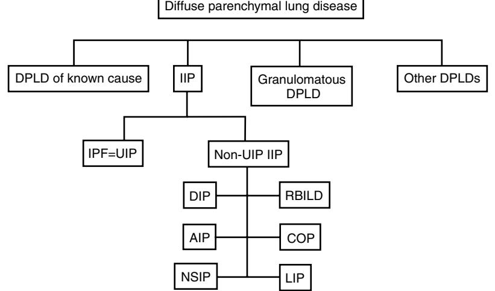

# CHAPTER 50

# Nonobstructive Lung Disease and Thoracic Tumors

Katie Pink Ben Hope-Gill

Respiratory disease is a major cause of morbidity and mortality, affecting 1 in 10 of the population over 65 years old.1 The presentation and management of respiratory disease often differs in the elderly and this chapter aims to provide some insight into these differences while reviewing current evidence.

# **RESPIRATORY INFECTIONS**

Respiratory infection is common in the elderly. This is explained by a number of factors. A decline in lung function and structural changes to the chest wall and muscles result in a loss of chest wall compliance.2 In addition, mucociliary function declines with age and the immune system can be depressed. With increasing age there is an increase in oropharyngeal colonisation with potential respiratory pathogens as well as an increased incidence of microaspiration. Comorbid conditions resulting in dysphagia or a reduced conscious level may increase the risk of aspiration.3 Malnutrition, in particular hypoalbuminaemia, has also been associated with an increased risk of infection in the elderly.4 Finally, institutionalisation leads to increased exposure to respiratory pathogens.

# **INFLUENZA**

Influenza tends to occur in seasonal epidemics each winter. In the United States, influenza causes 20,000 to 40,000 deaths per year. Although 60% of cases of influenza occur in adults less than 65 years old, more than 80% of deaths as a result of seasonal influenza occur in adults aged over 65.5–7 The elderly are more likely to be hospitalized8 and to experience significant functional decline.9 Complications such as infective bronchitis and secondary bacterial pneumonia also occur more frequently in the elderly, most commonly because of *Staphylococcus aureus* and *Streptococcus pneumoniae* infection.10 In addition, cerebrovascular and cardiovascular deaths may be precipitated by influenza infection.11

# **Vaccination**

National guidelines in the United Kingdom recommend influenza vaccination for all adults aged over 65 years and those in long-term care. Influenza vaccination is effective in long-term care facilities. It has been shown to prevent 45% of pneumonia episodes and reduce hospital admissions and influenza-related deaths.12 In one study the vaccine was less effective in elderly populations living in the community; however, a 25% reduction in the proportion of people hospitalized from influenza or related illness was achieved.12 There is some evidence that vaccination of health care workers in long-term care institutions is also associated with a reduction in influenza-related mortality among patients.13 However, a recent Cochrane review concluded that further studies were required.12,14

In the United States national vaccination uptake is only 65%15 and in the United Kingdom and Europe only a minority of those eligible for vaccination receive it.16,17 Possible

*376*

explanations include patient concerns regarding side effects, frustration that previous vaccination has not prevented influenza-like illness, and the deferment of vaccination by doctors when patients have a mild upper respiratory tract infection.15

# **Treatment**

Neuraminidase inhibitors (zanamivir, oseltamivir) are effective at preventing and treating influenza.18 These agents must be taken within 48 hours of the onset of symptoms. United Kingdom guidelines recommend their use for at-risk groups, including adults aged over 65 years.19 Clinical trials have shown that these agents reduce symptom duration by 1 to 2 days and decrease hospitalization and death rates in the elderly.18,20,21 The neuraminidase inhibitors are well tolerated and the safety profile among the elderly is similar to that in younger adults. The most common adverse effects are nausea, vomiting, and abdominal pain. Zanamivir may cause bronchospasm.22 Amantadine and rimantadine are only effective against influenza A and are associated with toxic side effects and with rapid emergence of drug-resistant variants.22,23 Routine use of these agents is not recommended.19,23

In the United Kingdom the National Institute for Clinical Excellence (NICE) guidelines recommend that postexposure prophylaxis with oseltamivir is given to all adults living in residential care facilities, regardless of vaccination status. When given within 48 hours, this has been shown to reduce influenza rates by 92%.24 In the community setting, postexposure prophylaxis is only recommended to high-risk adults (including those over 65 years) if they have not been vaccinated or if the circulating strain of influenza is known to be different than the vaccination strain. Amantadine is not recommended for postexposure prophylaxis.25

# **PNEUMONIA**

Community-acquired pneumonia has an incidence of 5 to 11/1000 adult population.3,26,27 The incidence is higher in the elderly, with those over 75 having six times greater risk compared with those less than 60 years.27–30 Older adults in residential care are particularly vulnerable.3,31 This is largely explained by the increase in comorbidities in this population. Chronic obstructive pulmonary disease (COPD), diabetes, heart failure, malnutrition, malignancy, and dysphagia are all risk factors for pneumonia in the elderly.3,32 Mortality is 5.7% to 14% and increases with age. In the United States lower respiratory tract infection is the eighth leading cause of death.26,33–36

The most common causative organism is *S. pneumoniae*. Other pathogens include *Haemophilus influenzae,* viruses, gramnegative bacilli and *S. aureus*. In the elderly infections with "atypical" organisms, such as *Mycoplasma* and *Legionella,* are less common.33,34 Infection with gram-negative bacilli and anaerobic organisms may occur after aspiration.3,37 There is no evidence that the pathogens associated with nursing home–acquired pneumonia are different from other older adults in the United Kingdom, although studies in

#### **Table 50-1. Pneumonia Severity Prediction; CURB-65 Score**

- **C**onfusion of new onset. (or worsening of existing state for those
- with background cognitive impairment)
- Serum urea >7 mmol/L
- **R**espiratory rate ≥ 30/min
- **B**lood pressure (systolic BP <90 mm Hg or diastolic BP ≤ 60 mm Hg)
- Age ≥ **65** years

A score is awarded for each variable present. A score ≥ 3 represents severe pneumonia.

North America have reported an increased incidence of gram-negative bacilli and *S. aureus*. 38–40

Presentation in the elderly is frequently nonspecific and the classic symptoms and signs of pneumonia may not be present. Confusion, lethargy, anorexia, and falls are common presenting symptoms.3 For example, a chest x-ray will demonstrate pneumonia in nearly a quarter of elderly patients having acute confusion and no clinical signs.41 Fever is less likely to be present in elderly patients.3,26,42 An important clinical sign in the elderly is the presence of tachypnea.42

A number of scoring systems can be used to assess severity in community-acquired pneumonia, including the Pneumonia Severity Index and the CURB-65 score.43,44 Current BTS26,45 and ATS46 guidelines recommend the use of the CURB-65 score (Table 50-1) because of its simplicity and strong predictive power for severe pneumonia, particularly in the elderly. Those patients with a low score (0 to 2) have a low mortality risk and may be suitable for outpatient treatment with oral antibiotics.44 However, in the elderly this may not be appropriate because of comorbidities and psychosocial concerns.

## **Management**

The investigation and management of community-acquired pneumonia is discussed in guidelines published by both the British and the American Thoracic Societies.26,45,46 Initial empirical treatment is with broad-spectrum antibiotic therapy with activity against *Pneumococcus* and "atypical" organisms. Current recommendations suggest the combination of β-lactam plus macrolide antibiotics for patients requiring admission to hospital. An alternative in penicillin-allergic patients is a fluoroquinolone with enhanced pneumococcal activity, such as levofloxacin.45 Local antibiotic resistance patterns will need to be taken into account. Intravenous antibiotic therapy is only required in severe pneumonia or in patients who are unable to take oral preparations. In the elderly antibiotic associated colitis and *Clostridium difficile* infection is a particular concern with intravenous antibiotics.47–49 There is evidence that in severe pneumonia delay in the administration of the first antibiotic is associated with increased mortality.50–52

Following an episode of pneumonia it is important to ensure that radiologic changes resolve, particularly in the elderly and in smokers who are at increased risk of an underlying malignancy. Radiologic clearance is slower in the elderly.26,34

#### **Nosocomial pneumonia**

The incidence of hospital-acquired pneumonia increases significantly with age53 and the mortality rate can be 50%.3 Treatment regimes should cover gram-negative anaerobic bacteria and *Pseudomonas* sp. Methicillin-resistant *S. aureus* (MRSA) should also be considered.

## **Vaccination**

Polysaccharide pneumococcal vaccination is recommended for all adults over 65 years.26,46 There is no need for reimmunization. A recent meta-analysis concluded that there was insufficient evidence to support the routine use of pneumococcal vaccination to prevent all-cause pneumonia or mortality.54 However, vaccination did prevent invasive pneumococcal disease in the elderly.

# **TUBERCULOSIS**

The incidence of tuberculosis is now declining in the Western world, although it continues to rise in Africa because of the HIV epidemic. WHO surveillance data from 2006 showed an incidence of 4 cases/100,000 population in the United States and 15 cases/100,000 population in the United Kingdom.55 In those born in either the United Kingdom or the United States, the incidence of active TB increases with age, with a doubling of the incidence in adults over 80 years old.56 The reason for this is multifactorial. Most cases of TB in the elderly represent reactivation of previous disease.56 This may be precipitated by an age-related reduction in cell-mediated immunity or secondary to other factors such as malnutrition, alcoholism, cancer, diabetes mellitus, HIV infection, and treatment with corticosteroids.2

TB is particularly common among care home residents in the United States57 with the incidence of active TB being two to three times higher than in the community-dwelling elderly58,59 because of reactivation of disease and institutional outbreaks.60

## **Presentation**

Presentation in the elderly may be insidious and nonspecific; weight loss, weakness, or a change in cognitive function may be the only manifestation.2,61 Dyspnea is often present, whereas hemoptysis and fevers are observed less frequently in the elderly.57 It is important to consider TB if a patient has a cough or pneumonia that incompletely responds to conventional treatment.

The chest radiographic changes of TB are similar in all age groups although in the elderly there is a greater prevalence of mid and lower zone shadowing.2 In addition, cavitating disease is less common.57 Miliary TB is likely in older adults, although the diagnosis is frequently missed.2 The presence of radiographic manifestations of previous TB infection in an elderly patient with nonspecific infective symptoms should alert physicians to exclude reactivation. Extrapulmonary TB is uncommon and is often difficult to diagnose. Sites involved include the genitourinary tract, the central nervous system, the lymphatics, and bone. Extrapulmonary TB is more common in children and the elderly.62

## **Investigation**

Pulmonary TB is usually diagnosed by culturing *Mycobacterium tuberculosis* from sputum. Guidelines suggest that three sputum samples should be sent for culture.63 In elderly patients it may be difficult to obtain spontaneous sputum samples, and sputum induction or bronchoscopy with bronchial washings may be required. The presence of acid-fast bacilli (AFB) on Ziehl-Neelsen staining (smear positive) suggests the diagnosis; however, *Mycobacterium tuberculosis* can take up to 6 weeks to be cultured using conventional techniques. It is important to remember that AFB smear positivity alone does not distinguish *M. tuberculosis* from nontuberculous mycobacterial infection (NTM). Rapid culture techniques, including polymerase chain reaction (PCR) or gene probe analyses allow earlier diagnosis. Once a patient is diagnosed with TB, consideration should be given to HIV testing.

Patients with suspected TB are usually investigated as outpatients; however, smear-positive elderly care home residents may benefit from isolation to prevent transmission.59 If admitted to the hospital, patients should be isolated until their sputum status is known. If multidrug-resistant tuberculosis (MDR-TB) is suspected, patients should be managed in a negative air pressure room. Patients who are smear-positive need to remain isolated until they have completed 2 weeks of antituberculous treatment.59,63

#### **Tuberculin skin test**

The tuberculin skin test measures cell-mediated immunity against TB. It is positive in both active and latent disease and also individuals that have received BCG immunization. False negatives can occur in immunocompromised patients because of anergy. Anergy is more prevalent among the elderly because of a decline in cellular immunity, and the value of the tuberculin skin test is therefore reduced.56 It is mainly used in the diagnosis of latent TB.

#### **Gamma interferon tests**

Gamma interferon tests are a recent development. A blood test can detect tuberculosis infection by measuring interferon-gamma release from T cells in response to antigens that are highly specific to *M. tuberculosis*, but are absent from BCG vaccine. In the United Kingdom they are primarily used to confirm the diagnosis of latent TB in the presence of a positive tuberculin skin test.63 It is likely that their role will increase in the future.

#### **Management**

Recommendations for antituberculous therapy do not differ in the elderly. Initial empirical therapy should consist of a four-drug regimen for 2 months (rifampicin, isoniazid, pyrazinamide, ethambutol), followed by a two-drug regimen for 4 months (rifampicin and isoniazid). Extrapulmonary TB is treated in the same way, with the exception of TB meningitis, which requires 12 months' treatment.63 Directly observed therapy may be useful in selected individuals who are at risk of poor compliance. Contact tracing is an important aspect of management and current recommendations are available in national and international guidelines.63

Multidrug-resistant TB (resistance to rifampicin and isoniazid) is uncommon in the elderly population at present in the United Kingdom and United States. This is probably because active TB in the elderly usually results from reactivation of latent infection that was acquired when there was no effective antituberculous chemotherapy.56

Drug toxicity and intolerance is more common in the elderly. Older adults are more likely to be coprescribed other medication and this increases the likelihood of drug interactions. Rifampicin in particular may reduce the levels of many medications through induction of the cytochrome P450 system. The use of isoniazid has been associated with increased levels of some anticonvulsants and benzodiazepines.60

Rifampicin, isoniazid, and pyrazinamide are all associated with gastrointestinal side effects and hepatotoxicity. Hepatic toxicity is increased in elderly patients.64 Ethambutol can cause a loss of visual acuity and color discrimination and close monitoring is required in elderly patients whose visual acuity may already be impaired. Isoniazid can cause peripheral neuropathy, particularly in patients with coexisting renal failure. This can be prevented by pyridoxine. Finally, rifampicin may cause bodily fluids to become discolored orange.

#### **Latent TB**

Latent TB is defined as a positive tuberculin skin test, with a normal CXR and no symptoms of TB. Individuals who are identified as having latent TB through contact screening should be offered chemoprophylaxis. In the United States all residents of care homes are screened for latent TB on admission. Those with latent TB are treated with chemoprophylaxis. Treatment regimens comprise either isoniazid alone for 6 months or isoniazid and rifampicin combined for 3 months.59

#### **Prognosis**

Tuberculosis-related deaths are more common in the elderly. In 2004 in the United Kingdom there were 328 deaths from active TB, 68% of which occurred in adults aged over 65 years.1 Many elderly patients will have long-term sequelae from tuberculous infection. Pulmonary fibrosis is a recognized complication as is pleural thickening and restrictive lung disease from pleural infection. Historical surgical techniques can also lead to chest wall deformities.

#### **NONTUBERCULOUS MYCOBACTERIAL INFECTION**

Pulmonary infection with nontuberculous mycobacteria has become increasingly recognized in the elderly population over recent years.65 Predisposing factors include chronic lung diseases, such as COPD and bronchiectasis, along with immunosuppression, particularly HIV infection. Clinical and radiologic features are similar to pulmonary tuberculosis. Treatment in the elderly can be difficult because of drug intolerance. Guidelines on the diagnosis and treatment of nontuberculous mycobacteria have been published by both the British and the American Thoracic Societies.66,67

#### **BRONCHIECTASIS**

Bronchiectasis is characterized by the permanent dilation of bronchi, with chronic airway inflammation and excess sputum production. Bronchiectasis is a relatively rare condition affecting 1 to 2/100,000. A Finnish study suggested a prevalence of 39 cases per million population rising to 104 cases per million in those over 65.68 However, the advent of highresolution computed tomography (HRCT) scanning means milder forms of bronchiectasis are now being identified.

In the elderly population bronchiectasis is often a sequela of childhood infections such as pertussis, measles, tuberculosis, and severe pneumonia.69 Bronchiectasis is increasingly being recognized as a complication of COPD. A causative

|  |  |  | Table 50-2. Causes and Investigation of Bronchiectasis |
|--|--|--|--------------------------------------------------------|
|--|--|--|--------------------------------------------------------|

| All-Age Causes of Bronchiectasis                                                                                                                                                                                                                                                                         | (% prevalence) |
|----------------------------------------------------------------------------------------------------------------------------------------------------------------------------------------------------------------------------------------------------------------------------------------------------------|----------------|
| Idiopathic                                                                                                                                                                                                                                                                                               | (53%)          |
| Postinfectious                                                                                                                                                                                                                                                                                           | (29%)          |
| Allergic bronchopulmonary aspergillosis                                                                                                                                                                                                                                                                  | (11%)          |
| Immune deficiency                                                                                                                                                                                                                                                                                        |                |
| - Total humoral                                                                                                                                                                                                                                                                                          | (11%)          |
| - Total neutrophil function                                                                                                                                                                                                                                                                              | (1%)           |
| Rheumatoid arthritis                                                                                                                                                                                                                                                                                     | (4%)           |
| Ulcerative colitis                                                                                                                                                                                                                                                                                       | (2%)           |
| Ciliary dysfunction                                                                                                                                                                                                                                                                                      | (3%)           |
| Young syndrome                                                                                                                                                                                                                                                                                           | (5%)           |
| Cystic fibrosis                                                                                                                                                                                                                                                                                          | (3%)           |
| Aspiration/gastroesophageal reflux                                                                                                                                                                                                                                                                       | (4%)           |
| Panbronchiolitis                                                                                                                                                                                                                                                                                         | (<1%)          |
| Congenital                                                                                                                                                                                                                                                                                               | (<1%)          |
| Investigation of Bronchiectasis HRCT Spirometry with bronchodilator reversibility Sputum culture and AFB culture Total IgE, Aspergillus specific IgE and IgG Serum Igs Antipneumococcal antibody titers Rheumatoid factor CF genotype, sweat test Serum α1-antitrypsin levels |                |

Adapted from Pasteur MC et al. Am J Respir Crit Care Med 2000;162:1277–84.

**Table 50-3. Causes of Unilateral Pleural Effusion**

| Transudative Effusions                          | Exudative Effusions                                |
|-------------------------------------------------|----------------------------------------------------|
| Very Common                                     | Common                                             |
| - Left ventricular failure - Liver cirrhosis | - Malignancy - Parapneumonic effusion           |
| - Hypoalbuminemia - Peritoneal dialysis      | Less common                                        |
| Less common                                     | - Pulmonary infarction - Rheumatoid arthritis   |
| - Hypothyroidism - Nephrotic syndrome        | - Autoimmune disease - Benign asbestos effusion |
| - Mitral stenosis - Pulmonary embolus        | - Pancreatitis - Post-MI syndrome               |
| Rare                                            | Rare                                               |
| - Constrictive pericarditis - Urinothorax    | - Yellow nail syndrome - Drugs                  |
| - Superior vena cava obstruction                | - Fungal infections                                |

factor cannot be identified in many cases and these are termed idiopathic bronchiectasis. Causes and investigation of bronchiectasis are outlined in Table 50-2.

## **Management**

The aims of treatment are to reduce symptoms, promptly treat exacerbations, and prevent disease progression. A multidisciplinary approach with input from physiotherapists, respiratory nurses, and dietitians is particularly important for elderly patients. Bronchodilators are effective in treating associated airflow obstruction and mucolytics are useful to aid sputum clearance.70 Daily physiotherapy with postural drainage or cough augmentation is important, particularly during exacerbations. Inhaled corticosteroids may be useful in improving lung function and reducing exacerbation infrequency.71,72 Surgery remains an option for selected patients with localized disease or those with troublesome hemoptysis.

#### **Table 50-4. Light's Criteria for Classification of Unilateral Pleural Effusion**

| The pleural fluid is an exudate if one or both of the following criteria |
|--------------------------------------------------------------------------|
| are met:                                                                 |
| Pleural fluid protein divided by serum protein >0.5                      |
| Pleural fluid LDH divided by serum LDH >0.6                              |
|                                                                          |

Acute exacerbations should be treated promptly with antibiotics. Regular oral or nebulized antibiotics may be necessary for those individuals who have frequent exacerbations. Azithromycin twice weekly has anti-inflammatory and antimicrobial properties and has shown promise in reducing exacerbation frequency in bronchiectasis.73 The results of microbiologic investigations may be difficult to interpret because most patients are chronically colonized by a variety of organisms, most commonly *H. influenzae*. *Pseudomonas aeruginosa* infection is often difficult to treat and may require more prolonged courses of combination intravenous antibiotics.72

# **PLEURAL EFFUSION**

The investigation and management of pleural effusions are summarized in guidelines from the British Thoracic Society and are beyond the scope of this chapter.73 Investigation in the elderly does not differ from younger individuals. A diagnostic pleural tap will differentiate exudative from transudative effusions and will often ascertain the cause (Table 50-3). Light's criteria should be used to classify effusions with pleural fluid total protein content between 25 and 35 g/dL, particularly in the elderly in whom a single pleural fluid protein value is less reliable (Table 50-4). Other parameters that may be diagnostically useful include pleural fluid cytology, culture and sensitivity, glucose, pH and cell profile, depending upon the clinical scenario.74 If the cause of an exudative effusion remains unclear after pleural fluid analysis, a CT scan of the thorax is advised. This is most useful if performed before drainage of the effusion. If diagnostic uncertainty still remains following a CT scan, then medical thoracoscopy should be considered. Thoracoscopy is more sensitive than the Abram's blind pleural biopsy and is well tolerated in all ages. It is a useful diagnostic technique, allowing direct visualization of the pleura and has the added advantage of offering fluid drainage and in a single procedure.73

# **PNEUMOTHORAX**

The incidence of pneumothorax in the United Kingdom is 24/100,000 per year for men and 9.8/100,000 per year for women. There is a biphasic age distribution with peaks seen in the 20 to 24 and 80 to 84 year age groups75 and is attributed to primary and secondary spontaneous pneumothorax, respectively. Elderly patients tend to have secondary pneumothorax related to underlying chronic lung disease, most commonly COPD.

Pneumothorax in the elderly usually presents with acute dyspnea, which is often out of proportion to the size of the pneumothorax. Pleuritic chest pain occurs less frequently than in younger patients.76 The diagnosis is usually confirmed on a chest radiograph; however, in rare cases a CT scan of the thorax may be necessary to differentiate a pneumothorax from complex bullous lung disease.77

Figure 50-1. Classification of diffuse parenchymal lung disease. (*IIP,* idiopathic interstitial pneumonia; *UIP,* usual interstitial pneumonia; *DIP,* desquamative interstitial pneumonia; *AIP,* acute interstitial pneumonia; *RBILD,* respiratory bronchiolitis associated ILD; *NSIP,* nonspecific interstitial pneumonia; *COP,* cryptogenic organizing pneumonia; *LIP,* lymphocytic interstitial pneumonia.)

The treatment of secondary pneumothorax in the elderly involves hospital admission and intercostal drain insertion. Simple aspiration is unlikely to succeed and is not recommended.77 Small asymptomatic pneumothoraces (<1 cm) can be managed by close observation.

Indications for surgical intervention include persistent air leak, second ipsilateral pneumothorax, and first contralateral pneumothorax. The aims of surgery are to resect or suture the bleb that caused the pneumothorax and to perform pleurodesis to prevent recurrence. Thoracoscopy and VATS (video-assisted thoracic surgery) can be performed safely in the elderly population with a low morbidity and mortality.78,79 In those patients who are either unable or unwilling to undergo surgery, chemical pleurodesis can be attempted; however, recurrence rates are high with this approach.77

#### **DIFFUSE PARENCHYMAL LUNG DISEASE**

Diffuse parenchymal lung disease (DPLD) is a term used to describe a heterogeneous group of disorders characterized by damage to the lung parenchyma by varying patterns of inflammation and fibrosis.80 The most important distinction among the idiopathic pneumonias is between idiopathic pulmonary fibrosis (IPF) and the other interstitial pneumonias.80 Figure 50-1 outlines the current classification system.

The diagnosis of DPLD is complex and elderly patients with suspicious features should be referred for a specialist respiratory opinion. Clinical, radiologic, and pathologic features frequently overlap, making accurate diagnosis difficult. Therefore diagnosis should be undertaken in the context of a multidisciplinary team meeting comprising respiratory clinicians, thoracic radiologists, and pathologists with expertise in the evaluation of DPLDs. The diagnostic process requires a comprehensive clinical and physiologic evaluation followed by HRCT scanning in most cases. Surgical biopsy is recommended if clinical or radiologic features are not typical and preclude accurate diagnosis. Surgical lung biopsy is well tolerated; however, specific studies in the elderly are lacking.81 Video-assisted thoracoscopic biopsy is increasingly being performed in place of open lung biopsy. Transbronchial biopsy is less invasive although, with the exception of sarcoidosis, samples are usually nondiagnostic. A history of systemic involvement (eye, joint, skin) or the presence of serum auto-antibodies may suggest an underlying connective tissue disorder. It is particularly important to distinguish UIP from other idiopathic interstitial pneumonias (IIP) because survival is significantly worse in this condition.82 In addition, these other IIPs have a better response to immunosuppressive therapy.

#### **IDIOPATHIC PULMONARY FIBROSIS**

Idiopathic pulmonary fibrosis (previously termed cryptogenic fibrosing alveolitis) is the commonest of the idiopathic interstitial pneumonias. The diagnosis requires either a radiologic or pathologic diagnosis of usual interstitial pneumonia (UIP). The prevalence of IPF is estimated to be between 4/100,000 for persons aged 18 to 34 to 227/100,000 for those 75 years or older.83 It is therefore a disease of the elderly with the age at symptom onset usually greater than 50 years.

Patients typically have progressive breathlessness and an irritating dry cough. Clinical examination will reveal digital clubbing in 25% to 50% of patients and fine end-inspiratory crackles, usually in a posterobasal distribution, on auscultation of the chest.80,84 Lung function tests typically show a restrictive deficit with a reduction in vital capacity, total lung capacity, and transfer factor. Chest radiograph changes include reticulonodular shadowing with reduced lung volumes. High resolution computed tomography scan appearance is pivotal to establishing the diagnosis. Typical HRCT features of UIP include subpleural reticulation with honeycombing and traction bronchiectasis with basal predominance. Surgical lung biopsy is not required in patients with typical clinical and radiologic features of UIP, but should be considered in the presence of atypical features.80

The prognosis in UIP is poor. Median survival from diagnosis is less than 3 years.80 However, the course of the disease can be highly variable in individual patients, with some declining rapidly whereas others remain stable.

#### **Management**

There is no good evidence that any treatment alters the course of idiopathic pulmonary fibrosis. Corticosteroids have traditionally been the mainstay of treatment; however, there have been no controlled trials comparing them to placebo, and no data to show that they improve either survival or quality of life.85,86 Previous studies suggesting a favorable response to steroid treatment included patients with conditions other than UIP that are associated with a better treatment response and prognosis (e.g., nonspecific interstitial pneumonia). Significant adverse effects with oral corticosteroids are more prevalent in the elderly.87

Immunosuppressant therapy, in particular azathioprine, has been used in combination with corticosteroids in idiopathic pulmonary fibrosis. However, a recent meta-analysis concluded that there was little evidence to justify their use.88 One controlled trial did show a nonsignificant trend toward improvement in lung function with azathioprine, and when adjusted for age, a statistically significant improvement in survival.89 It is on this basis that azathioprine is used; however, patient numbers were small. Other agents such as cyclophosphamide, methotrexate, and mycophenolate mofetil have been tried; however, evidence regarding their efficacy is lacking. Immunosuppressant therapy is associated with significant toxicity including myelosuppression and hepatic toxicity. In the elderly population drug interactions are also a particular problem because of frequent comorbidities and polypharmacy. For example, the concomitant use of allopurinol with azathioprine leads to increased azathioprine levels.90

A recent trial suggests that treatment with oral N-acetylcysteine may slow decline in vital capacity and transfer factor in patients with UIP when added to prednisolone and azathioprine.91

Current management guidelines suggest withholding treatment unless there is advanced disease (FVC <50%, TLCO <40%) or evidence of significant disease progression.92 Standard treatment includes combination therapy using prednisolone plus azathioprine with N-acetylcysteine. Patients younger than 65 years should also be considered for referral for lung transplantation.93 Best supportive care includes oxygen therapy, pulmonary rehabilitation, and palliative care.

#### **DRUG-INDUCED INTERSTITIAL LUNG DISEASE**

Drug-induced interstitial lung disease is most prevalent in the elderly by virtue of their increased exposure to multiple drugs. The most commonly prescribed causative agents are amiodarone, methotrexate, ACE inhibitors, and nitrofurantoin. Treatment involves withdrawal of the causative agent and immunosuppressive therapy in some cases.

#### **CONNECTIVE TISSUE DISEASE**

Autoimmune disorders including rheumatoid arthritis, Sjögren syndrome, SLE, systemic sclerosis, and polymyositis are all associated with lung fibrosis. Respiratory symptoms may precede other manifestations of the disease. The association between rheumatoid and interstitial fibrosis is strongest in the elderly and has a mean age of onset in the fifth or sixth decade. The incidence, clinical presentation, prognosis, and response to therapy vary depending on the underlying disorder and the histologic pattern of disease. In general interstitial lung disease associated with the collagen vascular disorders has a better prognosis and response to treatment than IPF.94

#### **SARCOIDOSIS**

Sarcoidosis is a multisystem disorder that most frequently affects the lungs. It occurs less commonly in the elderly, with case series suggesting older adults represent between 7.8% (adults >65 years) and 17% (adults >50 years) of cases.95,96 Presentation is usually with breathlessness and cough, although symptoms may be nonspecific, with a decline in general health.97 Löfgren syndrome is rarely seen in adults aged over 50 years.98 Serum angiotensinconverting enzyme (ACE) levels are of limited value diagnostically, particularly in the elderly who have an increased incidence of renal failure and diabetes (which are associated with raised serum ACE levels).97,98 Diagnosis should be confirmed histologically if possible.99 The course of disease seems to be similar in younger and older patients.97 Corticosteroids are used to treat selected patients with pulmonary involvement and should be supervised by clinicians with expertise in the management of sarcoidosis. Other indications for systemic corticosteroid use in sarcoidosis include hypercalcemia, ocular disease, and cardiac, neurologic, or renal involvement.

#### **PULMONARY VASCULITIS**

The vasculitides are broadly subclassified according to size of vessel involvement, clinical features, and associated conditions. Small vessel vasculitis is further subdivided according to the presence or absence of antineutrophil cytoplasmic antibodies (ANCA). The incidence of ANCA-associated vasculitis is increasing. Wegener granulomatosis is a small vessel, systemic necrotizing vasculitis with a peak age of onset at 55 years. Clinical presentation in the elderly is similar to that seen in younger adults although ear, nose, and throat involvement is observed less frequently.100–102 Some studies suggest elderly patients have an increased incidence of renal and neurologic involvement at diagnosis,102 although other studies dispute this.100,101 Diagnosis may be difficult because of the presence of coexistent disease such as COPD that influences clinical and radiologic features.90 Circulating ANCA levels are positive in the majority of patients with renal involvement but are frequently negative in more limited disease. Biopsy of affected organs is recommended to confirm the diagnosis. Therapy is subdivided into phases with different treatment regimens for remission induction and maintenance therapy. There have recently been several large scale multicenter trials, which have provided clarification regarding the most appropriate treatment regimens. The combination of oral corticosteroids and cyclophosphamide will induce remission in 90% of patients. However, relapse rates are high and survival is worse in those over 60 years of age.100–102 Renal involvement is also associated with a poorer prognosis. Death usually results from uncontrolled vasculitis or systemic infection.

#### **HYPERSENSITIVITY PNEUMONITIS**

Hypersensitivity pneumonitis is caused by an immunologic reaction to the inhalation of organic antigens. It is often associated with the formation of systemic precipitating antibodies. Common precipitating antigens include bird proteins (bird fancier's lung) and thermophilic actinomycetes (farmer's lung). Most commonly it presents as a chronic illness related to repeated exposure but an acute form is recognized. Management centers on antigen avoidance although in some patients the disease will progress despite this. Corticosteroids can be used to improve lung function, although their effect on long-term outcome is unclear.

#### **OCCUPATIONAL LUNG DISEASE**

#### **Pneumoconiosis**

Pneumoconioses are pulmonary diseases caused by the inhalation of mineral dusts. Common causative mineral dusts include coal dust, silica, beryllium, and asbestos. The incidence of pneumoconiosis appears to be decreasing in the United Kingdom with a 5.7% reduction in reported cases between 1999 and 2005.103 In 2004 there were 3000 deaths from pneumoconiosis of which 90% occurred in adults over 65 years of age.1

#### **Coal workers pneumoconiosis**

There has been a steady reduction in the numbers of underground coal miners in Western Europe and the United States, with a consequential fall in the incidence of coal workers pneumoconiosis. Other countries still employ large numbers of miners. Dust exposure results in inflammation and fibrosis of the lung parenchyma. Coexistent COPD is common. Simple pneumoconiosis is usually asymptomatic and is identified as nodular shadowing on a chest x-ray. Progressive massive fibrosis is associated with exertional breathlessness and a cough (often productive of black sputum) and may lead to cor pulmonale and respiratory failure. Chest x-ray features include fibrotic masses, usually in the upper zones, on a background of simple coal workers pneumoconiosis.

#### **Asbestosis**

Asbestosis is a fibrotic lung disease caused by exposure to asbestos dust. Diagnosis depends on a reliable history of significant asbestos exposure (usually a 10 to 20 year exposure period). Markers of exposure, such as pleural plaque or pleural thickening, are invariably present. Occupations at greatest risk include shipyard workers, asbestos factory workers, plumbers, insulation workers, electricians, and builders. There is a latency period of at least 15 to 20 years between exposure and the development of asbestosis, hence it is predominantly a disease of middle to old age. The incidence of asbestosis has increased over the last 10 years in both the United Kingdom and United States.104,105 Treatment is supportive and patients should be informed of their eligibility for compensation.

## **LUNG CANCER**

Lung cancer is the commonest malignancy in developed countries and is the leading cause of cancer deaths. It is predominantly a disease of the elderly with more than 50% of cases being diagnosed in patients over the age of 65, and about 30% of cases being diagnosed in patients over the age of 70.106 Most patients have advanced disease at presentation and as a result the 5-year survival rate is poor. In the United Kingdom, the 1-year survival rate is ~21%, with a 5-year survival rate of only 5.5%.107 In the United States, the 5-year survival rate is higher (13% to 17%).108 Guidelines on the diagnosis and management of lung cancer have been published by the American College of Chest Physicians.109

#### **Presentation and investigation**

Most cases of lung cancer have symptoms of breathlessness, recurrent chest infections, chest pain, hemoptysis, or weight loss. Other cases may be diagnosed as an incidental finding on routine chest x-ray. The aims of investigation are to make a definitive diagnosis and to stage the cancer appropriately, facilitating treatment decisions. A staging computed tomography (CT) scan of the thorax, followed by bronchoscopy, is the usual approach. In patients with peripheral tumors, a percutaneous CT-guided biopsy will be more likely to obtain a histologic diagnosis. Bronchoscopy is well tolerated in all age groups, with a low risk of significant complications. In very frail patients, invasive investigation may not be appropriate and a clinical diagnosis of lung cancer may suffice. Positive emission tomography (PET) scanning is indicated for any patients who are being considered for potentially curative treatment. It also has a role in the investigation of the solitary pulmonary nodule. The specificity of PET is not high and many benign inflammatory lesions produce falsepositive results.107

Non–small cell lung cancer (NSCLC) (including adenocarcinoma, squamous cell carcinoma, and large cell carcinoma) accounts for 85% of all new diagnoses. Small cell lung cancer accounts for the remaining 15%.110 Non–small cell lung cancer is staged using the TNM system. This staging system is currently under review. Small cell lung cancer is staged as limited disease if the tumor is confined to one hemithorax (including ipsilateral mediastinal and supraclavicular nodes). Spread beyond the hemithorax is staged as extensive disease.

#### **Management**

Treatment decisions in lung cancer are based on the stage of disease, histology, the presence of co-morbid diseases, and on performance status (Table 50-5). They should not be based on chronologic age. Despite this there is evidence that the elderly are undertreated and are underrepresented in clinical trials, making evidence-based decision making difficult.111,112 When assessing patients it is useful to perform a comprehensive geriatric assessment including measures of functional status, comorbidity, cognitive state, and nutritional status. Aging is associated with a physiologic decline

#### **Table 50-5. WHO Performance Status Score**

#### **Asymptomatic**

- 1. Symptomatic but ambulatory (able to perform light work)
- 2. In bed <50% of day (unable to work but able to live at home with some assistance)
- 3. In bed >50% of day (unable to care for self)
- 4. Bedridden

in organ function and a number of changes in drug pharmokinetics and pharmodynamics. This results in differences in treatment tolerance between older and younger patients.110 Clinical trials specifically designed for the elderly population are needed.

# **NON–SMALL CELL LUNG CANCER Surgery**

Surgery is the treatment of choice for all patients with stage I/II NSCLC who are fit enough for the procedure. Improvements in surgery and perioperative care mean that an increasing number of elderly patients are eligible for curative treatment. Video-assisted thoracic surgical techniques (VATS) are increasingly useful.78 Age has no influence on long-term survival after surgery.113

#### **Adjuvant chemotherapy**

Adjuvant treatment of NSCLC in elderly patients is controversial because of a lack of prospective trials. Randomized trials suggest that postoperative chemotherapy improves survival in the general population with stage II to IIIA NSCLC. There is no evidence that any group of patients specified by age benefited more or less from adjuvant therapy.114

#### **Radical radiotherapy**

Elderly patients with stage I/II disease are frequently unable to undergo surgery because of comorbidities or reluctance to proceed. In these cases radical radiotherapy is effective with reported mean survival times of 20 to 27 months and 5-year survival rates of 15% to 34% in patients over 70 years old. Treatment outcomes and toxicity rates do not differ with age.113 Continuous hyperfractionated accelerated radiotherapy (CHART) is high-dose radiotherapy given three times a day for 12 days. A large randomized trial has shown an improvement in 2-year survival from 20% with conventional radiotherapy to 29% with CHART.115

#### **Locally advanced disease**

Patients presenting with locally advanced NSCLC (stage III) are usually treated with radiotherapy or combined chemo/ radiotherapy. Combined treatment may offer a chance of cure although conflicting evidence exists regarding this approach in elderly patients. Treatment outcomes are comparable to younger patients; however, there is a higher risk of toxicity. For patients with an impaired performance status or severe comorbidity, radiotherapy alone is an alternative.116,117

#### **Palliative chemotherapy**

Chemotherapy is the mainstay of treatment for patients with advanced disease at presentation.107 A standard regimen would include a platinum-based chemotherapy agent with a single third generation agent (e.g., carboplatin/cisplatin plus vinorelbine/gemcitabine/paclitaxel/docetaxel). This has a modest survival benefit (increase in median survival by 1.5 months, 10% improvement in 1-year survival) compared with supportive care alone.107,108 Platinum-based chemotherapy is efficacious in older individuals; however, it is associated with significant toxicity (nephrotoxicity, ototoxicity, neurotoxicity).106 Furthermore, the survival benefit of chemotherapy is limited to patients with a good performance status (WHO 0–1).117 It is therefore only an option in fit elderly patients.

In elderly patients who are unable to tolerate a platinum combination, a single third generation drug can be used. The ELVIS trial showed that single agent vinorelbine significantly improved both survival and quality of life when compared with supportive care alone (mean survival time 27 vs. 21 weeks).118 The MILES study demonstrated that combination treatment has no advantage over single-agent therapy.119

#### **Palliative radiotherapy**

Radiotherapy can be used to improve symptoms, particularly hemoptysis, chest pain, dyspnea, and cough. Elderly patients tolerate radiotherapy well and gain equivalent palliation to their younger counterparts.120 Performance status does not influence benefit from radiotherapy.

#### **New therapies**

Knowledge of cancer biology has enabled the development of new agents that specifically block pathways involved in oncogenesis. Gefitinib and erlotinib are selective inhibitors of epidermal growth factor receptors that have demonstrated activity in patients with NSCLC.121 These agents are well tolerated in the elderly and may have a role in the future.

#### **SMALL CELL LUNG CANCER**

Small cell lung cancer is an aggressive form of cancer that tends to metastasize early. As a result chemotherapy is the mainstay of treatment. Two thirds of patients have extensive disease at presentation. The median survival is only 2 to 4 months without treatment.122

#### **Limited disease**

In limited disease, response rates to chemotherapy are between 70% and 80%, with a median survival of 12 to 16 months. Only 4% to 5% of patients can be considered cured.121 The standard treatment for limited disease SCLC is four to six cycles of a platinum-based chemotherapy regimen (commonly etoposide plus carboplatin) combined with thoracic radiotherapy. In patients that achieve complete remission, prophylactic cranial irradiation is offered. Prophylactic cranial radiotherapy has been shown to reduce the incidence of brain metastases and is associated with a slight survival benefit (5.4% at 3 years).122

Many trials have looked at chemotherapy regimens for elderly patients with SCLC. Standard regimens remain the most effective, and therefore the treatment of choice despite their significant toxicity. For those with significant comorbidity, less aggressive regimens can be used. Such regimens include dose reduction, shortened treatment duration, and single-agent chemotherapy. At present the optimal treatment is not established.123,124

Thoracic radiotherapy is associated with considerable toxicity (bone marrow and esophageal), particularly in elderly patients. Sequential chemoradiotherapy is less toxic than a standard concurrent approach. A meta-analysis looking at thoracic radiotherapy showed a small but significant survival benefit (5.4% ± 1.4% at 3 years) for the use of thoracic radiotherapy. However, this effect was lost in patients over 70 years old.125

#### **Extensive disease**

Response rates to chemotherapy are between 60% to 70%, with a median survival of 7 to 11 months. Virtually no patients survive to 5 years.123 Chemotherapy alone is the standard treatment of extensive disease as radiotherapy only has a palliative role. Dual-agent platinum-based regimens are the most effective and usually six cycles are given. Quality of life should be the goal. There is evidence that prophylactic cranial radiotherapy in extensive SCLC reduces the incidence of symptomatic brain metastasis and improves overall survival (1-year survival rate 27.1% vs. 13.3%).126

#### **Palliative care**

Supportive care is particularly important in lung cancer as most patients have incurable disease. Symptom control, psychological support, and social requirements all should be addressed. A multidisciplinary approach is recommended involving the respiratory physicians, palliative care teams, oncologists, physiotherapists, occupational therapists, and dieticians.125

#### **MALIGNANT MESOTHELIOMA**

Pleural mesothelioma has been increasing in incidence in the United Kingdom since the 1960s. The annual number of deaths from mesothelioma is predicted to peak at between 1950 and 2450 between 2011 and 2015.127 Asbestos exposure is the cause of 85% of cases of mesothelioma.128,129 The latency period is typically long with a mean of 41 years (range 15 to 67).129 As a result mesothelioma is typically a disease of older men. The prognosis is poor with a median survival of 14 months from symptom onset.129 Patients with mesothelioma may be eligible for compensation if they are able to verify occupational exposure to asbestos.

Presentation is classically with chest pain and dyspnea, which is related to pleural fluid or thickening. Mesothelioma of the peritoneal cavity can also occur. A CT scan of the thorax may identify pleural nodules or diffuse thickening. Pathologic diagnosis can be made by examination of pleural fluid cytology (sensitivity of 60% to 76%74,128); however, a pleural biopsy is usually required. Thoracoscopy is increasingly used to diagnose mesothelioma because of its superior sensitivity compared with blind Abram's needle biopsy (90% vs. 43%).130,131

#### **Management**

The management of mesothelioma is largely palliative. Dyspnea is relieved by drainage of pleural fluid and pleurodesis. Palliative chemotherapy can be given to patients who have a good performance status although there is no randomized control trial evidence to show that chemotherapy confers better quality of life and survival than active supportive care alone.128 Pemetrexed in combination with cisplatin is licensed for treatment of malignant mesothelioma after a randomized controlled trial showed a survival benefit compared with cisplatin alone (median survival time 13.2 vs. 9.3 months).132 Combination treatment was associated with a higher incidence of significant toxicity. Pemetrexed has been shown to be efficacious and well tolerated in elderly patients,133 although trials have not specifically addressed this treatment in elderly patients with mesothelioma.

The role of surgery in mesothelioma remains controversial. Radical surgical resection (extrapleural pneumonectomy) is associated with a relatively high risk of morbidity and mortality and does have a significant beneficial impact on survival.131 Debulking surgery is effective in preventing fluid recurrence and may be associated with increased survival although it has not yet been tested in a randomized control trial.

Radiotherapy can be used as a palliative treatment to provide pain relief and is also used as part of the management strategy when extrapleural pneumonectomy is performed. Prophylactic radiotherapy is administered to scars produced by biopsy and/or pleural drainage. A randomized trial has shown that this prevents the risk of seeding of malignant cells134 although more recent trials have questioned this.135

#### KEY POINTS Nonobstructive Lung Disease and Thoracic Tumors

- Age-related changes to the lungs predispose the elderly to higher rates of respiratory disease.
- Respiratory infections, diffuse parenchymal lung disease, and thoracic tumors are common in the elderly.
- Most respiratory illness in the elderly requires a multidisciplinary approach to care including care of the elderly and respiratory physicians.
- Management strategies require a careful evaluation of performance status, comorbidity, and concurrent medication.
- Respiratory disease is diverse and frequently presents nonspecifically in the elderly. Accurate diagnosis usually requires careful systematic evaluation.

For a complete list of references, please visit online only at www.expertconsult.com