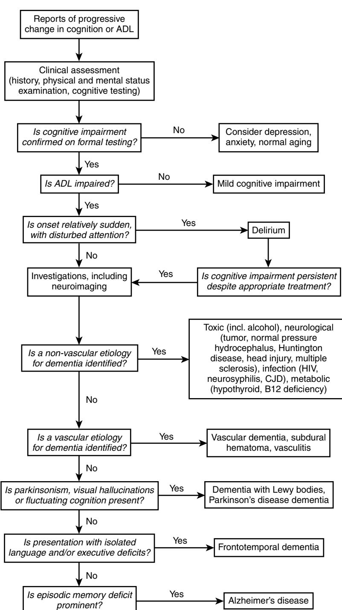
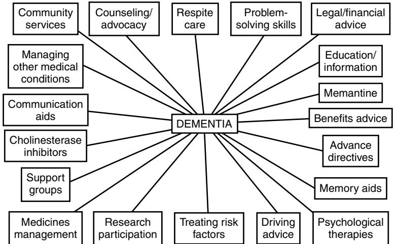

# Presentation and Clinical Management of Dementia

Antony Bayer

Dementia is a syndrome, especially common in old age, describing a characteristic pattern of symptoms that can result from many different brain diseases. It is not a diagnosis, nor can it be identified neuropathologically or by neuroimaging, nor is it the result of normal aging. Once recognized, it requires further assessment to identify the likely subtype (e.g., Alzheimer's disease, vascular dementia, dementia with Lewy bodies, Parkinson's disease, or frontotemporal dementia). This discussion will help the medical professional to indicate prognosis and guide best management.

The word *dementia* is derived from the Latin "demens" meaning without mind. In lay use, it can have a pejorative meaning, and this negative connotation impacts on public and professional attitudes. Chronic brain failure (to parallel heart failure, kidney failure, liver failure, etc.) is an alternative, first suggested by Bernard Isaacs and Francis Caird longer than 30 years ago,1 but does not seem to have gained favor. More recently it has been suggested that alternative umbrella terms of cognitive impairment or neurocognitive impairment are clear and less stigmatizing and may be preferred when dealing with patients and families.2 When there is a need to distinguish the illness before and after age 65, the terms young- and late-onset dementia are preferable to the old terminology of presenile and senile dementia.

Too great an emphasis on the biomedical aspects of dementia can detract from the human impact of the condition and management can cease to be person centered.3 In contrast to the more usual clinical terminology, Keady and Nolan for example have described the dementia process as one of slipping, suspecting, covering up, revealing, confirming, surviving (or maximizing), disorganization, declining, and finally death.4 Social models view the disability of dementia not as an intrinsic characteristic of the individual but as an outcome produced by social processes of exclusion and therefore greatly influenced by factors such as culture, income, housing, and environment.5 The biomedical and social models are not mutually exclusive, and best practice should incorporate evidence from both traditions.6

# **PRESENTATION Diagnostic criteria**

Dementia is defined in the Diagnostic and Statistical Manual of Mental Disorders (DSM-IV-TR) of the American Psychiatric Association7 and in the International Classification of Diseases, 10th Edition (ICD-10) of the World Health Organization.8 Both operational definitions are broadly similar and are based primarily on clinical criteria of multiple cognitive deficits, including memory impairment, associated with a decline in ability to carry out daily activities and often personality and behavioral changes. The deficits must represent a decline from a previous level of functioning (to distinguish from learning disability) and occur in the absence of disturbed or clouded consciousness (to distinguish from delirium). The condition is usually (but not always) irreversible and progressive and of chronic duration (ICD-10 requires deficits to have been present for at least 6 months). The criteria identify similar groups of patients.9

Although these criteria are generally accepted, the essential requirement for presentation with memory impairment means that they are closely tied to Alzheimer's disease and may exclude cases of frontotemporal dementia and vascular cognitive impairment until late in their course. Fluctuations of consciousness may be seen in dementia with Lewy bodies and in vascular dementia and are characteristic of delirium, a syndrome that often develops in association with underlying dementia. Thus, discussions around revisions of the criteria for DSM-V and ICD-10 have concluded that the definition of dementia should be reconfigured to not require memory impairment but to be based on a decline in two or more cognitive abilities lasting at least 1 year. There may also be greater emphasis on impairment of instrumental activities of daily living (ADL) and on positive indicators of Alzheimer's disease, rather than regarding it mainly as a diagnosis by exclusion. Genetic, imaging, and biomarkers are considered to have tremendous research promise but are not yet ready for clinical diagnostic use.10

The main subtypes of dementia each have standardized diagnostic criteria. The NINCDS-ADRDA criteria have long been the diagnostic standards for research in Alzheimer's disease,11 although revised criteria incorporating biomarkers have recently been suggested.12 The consensus diagnostic criteria for dementia with Lewy bodies are widely accepted,13 as are criteria for dementia associated with Parkinson's disease14 and frontotemporal dementia.15

The NINDS-AIREN criteria16 or ADDTC criteria17 are used for vascular dementia, but mainly only in research studies as their sensitivity is only about 50%.18 The Hachinski Ischemic Score has been used clinically for longer than 30 years to differentiate between multi-infarct dementia and Alzheimer's disease.19 A low score (4 or less) makes a vascular etiology unlikely. The higher the score, the greater is the likelihood of stroke disease. Despite reservations about its reliability and validity,20 the simplicity of the Ischemic Score means that it remains useful in the absence of anything better. There are no evidence-based clinical diagnostic criteria for the common neuropathologic finding of mixed dementia.21

# **Clinical presentation**

Regardless of the cause, the clinical syndrome of dementia is manifested by cognitive and functional deficits, often associated with behavioral and psychological symptoms (Table 52-1). Poor performance on formal cognitive testing, but without significant impairment of activities of daily living is not sufficient for diagnosis of dementia. However, it may suggest a predementia state and justifies follow-up with repeated assessments. Early recognition and intervention reduces risk of misdiagnosis of dementia and inappropriate management, facilitates optimal care, and delays the morbidity associated with progressive deterioration.22

| Cognition                                                                                                                                                                                                         | Daily Living Activities                                                                                                                                                                                                                                   | Behavioral and Psychological Symptoms                                                                                                                                                                                                             |
|-------------------------------------------------------------------------------------------------------------------------------------------------------------------------------------------------------------------|-----------------------------------------------------------------------------------------------------------------------------------------------------------------------------------------------------------------------------------------------------------|---------------------------------------------------------------------------------------------------------------------------------------------------------------------------------------------------------------------------------------------------|
| Working memory Episodic (anterograde) memory Remote memory Semantic memory Language Orientation Praxis Recognition/agnosia Visuospatial ability Calculation Attention/concentration | Handling financial affairs/money Managing medication Maintaining hobbies/interests Using public transport Driving safety Using telephone Traveling away from home Shopping Housekeeping Preparing meals Dressing/undressing | Agitation/restlessness Eating behavior Aggression/rage/violence Anxiety/phobias/fears Apathy Compulsive behaviors Delusions/illusions/misidentifications Depression Disinhibition Hallucinations Personality change |
| Planning/organization/sequencing Abstract thinking Judgment Writing/reading                                                                                                                              | Grooming Bathing/showering Continence Feeding Mobility/falls                                                                                                                                                                                  | Sexual behaviors Shouting/screaming Social awareness Sleep-wake disturbance Sundowning                                                                                                                                                |

| Table 52-1. Aspects of Cognition, Daily Living Activities, and Behavior Affected by Dementia |  |  |  |
|----------------------------------------------------------------------------------------------|--|--|--|
|----------------------------------------------------------------------------------------------|--|--|--|

Predominantly cortical or subcortical patterns of impairment can be described.23,24 Cortical dementias present with impaired memory, language, praxis, and visuospatial abilities with relatively preserved attention and executive function, as is characteristic in Alzheimer's disease. Subcortical dementia is characterized by cognitive slowing (bradyphrenia), with deficits of attention and retrieval of information from memory, apathy, personality change, reduced spontaneous speech, and often associated gait disturbance and slowing of movement (bradykinesia). The prototypical subcortical dementias are progressive supranuclear palsy and Huntington's disease. A mixed cortical and subcortical picture is most often seen in vascular dementia and dementia with Lewy bodies, reflecting pathology in the deep white matter and basal ganglia, as well as the cortex.

It is characteristic of dementia, especially when the result of Alzheimer's disease, that patients themselves tend to deny any significant difficulties and do not present themselves to clinicians. Rather, concerned relatives or caretakers who have noticed a change in the person's ability to cope with everyday life or are frustrated by repetitiveness and unreliability bring them to the attention of health or social care professionals. Sometimes the abrupt loss of support from a caretaker who has been quietly compensating for the person's cognitive deficits will suddenly reveal the presence of dementia.

#### **COGNITIVE SYMPTOMS**

The cognitive or neuropsychological symptoms of dementia reflect the location of brain pathology, and particular patterns of symptoms are characteristic of particular underlying diseases. Alzheimer's disease, for example, usually develops in the hippocampus and temporal lobe and the typical presentation is with an amnesic syndrome, frontotemporal dementia will be associated with impairment of executive or language abilities, and dementia with Lewy bodies is associated with visuospatial deficits. Vascular disease may affect any part of the brain and so is not associated with any typical clustering of cognitive deficits, but focal cognitive deficits or executive dysfunction are the most common presentations. Eliciting a history of the cognitive deficit that was first recognized, as well as the nature of its onset and subsequent progression, is therefore very important. The patient's recall and insight will often be compromised by the underlying illness; when addressed with any questions directly, the patient will turn his or her head toward a relative looking for the relative to answer.

Typical complaints initially reported by patients with early dementia include problem-solving difficulties, poor concentration, thought block, inability to quickly recall names, losing track of conversations, a feeling of disassociation from surroundings, feeling and becoming lost in familiar surroundings, not being able to fully coordinate and control speech and actions, and writing block,25 although there is considerable overlap with the everyday cognitive deficits of "normal aging."26

#### **ACTIVITIES OF DAILY LIVING**

The consequence of cognitive impairment is to interfere with ability to carry out activities of daily living (ADL), initially higher-level skills such as handling finances, coping with medication and driving (instrumental ADL [IADL]), and subsequently personal care skills such as dressing and bathing (basic ADL [BADL]).27 This progressive loss of functional ability is a reversal of the pattern observed in normal human development, with the early loss of complex activities followed by later deterioration in simpler overlearned tasks leading to increasing dependency and caregiver burden.

Assessment of IADL and BADL is necessary before a diagnosis of dementia can be made and subsequently will guide provision of appropriate advice and care and input from practical support services. The ICD-10 criteria are perhaps easiest to operationalize, requiring "interference with everyday living" so that "complicated daily tasks or recreational activities cannot be undertaken." The DSM-IV criteria specify "cognitive deficits … (that) each cause significant impairment in social or occupational functioning and … a significant decline from a previous level of functioning." This may be more difficult to interpret in elderly people whose opportunity to continue an active occupational and social life may be already compromised by comorbid medical and psychiatric illness, sensory deficits, retirement, and shrinking social networks.

Functional ability is assessed generally by history rather than by completion of the many available formal measurement scales, which are most commonly used to evaluate treatment efficacy in research studies. A large number of scales have been adapted or developed for use in dementia, but some have problems of gender bias or are not culturally sensitive. The most widely used scales that are sensitive to clinically significant change are the Disability Assessment for Dementia scale (DAD), the Bristol Activities of Daily Living scale (BADL), 28 and the Alzheimer's Disease Cooperative Study–Activities of Daily Living (ADCS-ADL).29 The Functional Assessment Staging (FAST) is a seven-stage scale that reflects the hierarchical pattern of gradual functional loss from normal aging to severe Alzheimer's disease (further broken into 11 substages) and is valuable in characterizing the severity and sequence of functional loss.30

In familiar surroundings and with a regular routine, people may cope surprisingly well with usual day-to-day activities until dementia is well established. However, if there is a change in circumstances, such as a bereavement or an overnight stay away from home, then the developing functional impairment can be unmasked. This may suggest erroneously that the problems are of sudden onset, but a careful history is likely to reveal a background of minor lapses and gradual decline over the previous few months, the significance of which had not been appreciated.

In younger people with dementia, impairment may first become apparent in performance at work, whereas in the majority it will concern maintaining the household to their normal standard, keeping up interest in hobbies and social activities, remembering appointments, using the telephone, dealing efficiently with financial affairs, taking medication reliably, getting from place to place in unfamiliar environments, and driving safely. Gradually independent living becomes compromised, with problems handling money, shopping, navigating even in familiar surroundings, and meal preparation. Finally problems with basic ADL emerge, initially choosing appropriate clothing and grooming and then with dressing, bathing, and toileting and finally urinary and fecal incontinence, immobility, and total dependency.

## **Behavioral and psychological symptoms**

The noncognitive symptoms of dementia have been grouped together by the International Psychogeriatric Association under the term *behavioral and psychological symptoms* (BPSDs),31 although many of those working in mental health settings prefer to talk about "challenging behaviors." A division can be made between observed behaviors (physical aggression, screaming, restlessness, agitation, wandering, sexual disinhibition, hoarding, swearing, and shadowing) and psychological symptoms elicited by interview with the patient or caretakers (anxiety, depression, hallucinations, and delusions). An alternative classification distinguishes between behavioral excesses (e.g., screaming, wandering, physical and verbal aggression) and deficits (e.g., excess dependency, lack of social interaction/communication).32 However, symptoms from different groups can overlap (e.g., depression in dementia may be diagnosed on the basis of observed behavior as much as elicited symptoms) and some symptoms tend to cluster together (e.g., restlessness and agitation with anxiety, and hallucinations, delusions, and misidentifications as the "psychosis of Alzheimer's disease and related dementias").33 A factor analysis of a large sample of patients from the European Alzheimer's Disease Consortium identified four neuropsychiatric subsyndromes: hyperactivity, psychosis, affective symptoms, and apathy.34

Although BPSDs are not features of the diagnostic criteria of dementia, most patients will demonstrate at least one noncognitive symptom at any time. Different symptoms tend to be more common at different phases of the illness. Mood disturbances are more likely to occur early and agitation, wandering, and psychotic symptoms later, although BPSDs become less evident in the advanced stages of dementia. Symptoms are often transient, persisting for a few days to months. Wandering and agitation, however, tend to be more enduring.35 Frontal dementia is dominated by BPSDs, and visual hallucinations can be persistent in patients with dementia with Lewy bodies. Caretakers find BPSDs especially burdensome, and they are often the trigger for referral to specialist services.

## **DIFFERENTIAL DIAGNOSIS**

Cognitive problems or any suggestion of "confusion" (an ill-defined and unhelpful term) in someone over the age of 50 is too often assumed to indicate dementia, without sufficient effort being made to confirm that it is indeed the cause. Mild cognitive impairment (MCI) or cognitive impairment not dementia (CIND) is about twice as common as dementia and may evolve into a dementing illness, although this is not inevitable. The commonest mental health problem in older people in the community is depression, and the commonest cause of cognitive impairment in hospital patients is delirium. The major differential diagnosis of dementia is therefore from these two D's, whereas drugs, deafness, and isolated dysphasia or dyspraxia should not be overlooked. A careful history will be of most value in reaching the correct diagnosis, although the presence of one condition superimposed on another is common and may complicate the clinical presentation.

Delirium will be of relatively abrupt onset and brief duration (hours or days) and characterized by fluctuating disturbance of attention, behavior, and wakefulness, as well as cognitive impairment. An underlying physical cause of the delirium will often be evident, such as infection, pain, metabolic disturbance, or dehydration. Most cases of delirium will rapidly and completely resolve with appropriate management. The fluctuating performance and not infrequent visual hallucinations associated with delirium will need to be distinguished from the symptoms of Lewy body disease.

Subjective memory complaint may be a prominent feature of depression in older people, especially in the "young old," whereas severe depression may be associated with objective cognitive impairment, particularly on complex tasks and timed tests. Cerebrovascular disease is often responsible. Questions on cognitive testing are more likely to be answered by "don't know" or refusals, rather than guesses or near misses, and performance may be inconsistent, with the subjects typically highlighting their failings. In contrast to dementia, sense of time and direction is often relatively intact; there is an absence of rapid forgetting and improvement with practice.

Major depressive illness presenting with the clinical picture of dementia has been termed *pseudodementia,* although mild dementia presenting with depressive symptoms (which might be termed *pseudodepression*) is more common. The true diagnosis is perhaps most often established only in retrospect, after the depressive symptoms have been treated successfully.36 However, up to 50% of elderly patients presenting with depression and cognitive impairment develop full-blown dementia within 3 to 5 years,37 and depression often precedes the dementia syndrome in vascular dementia, dementia with Lewy bodies, and other subcortical dementias.38

The reduced cognitive reserve of the aging brain means that it is especially sensitive to the adverse effects on higher mental functions of many prescribed and over-the-counter drugs. Sedative medication and anticholinergics are the most common culprits, but any drug with central nervous system activity may be implicated. Symptoms generally respond rapidly to drug withdrawal or dose reduction.39 Identification of reversible causes of dementia will ensure that appropriate interventions can be mobilized that may stabilize, improve, or even cure the underlying condition.

## **Reaching a diagnosis**

There is no quick and simple way to reliably diagnose dementia and its subtypes, particularly in the early stages. The NICE Guidelines6 summarize the process as depending on "pattern recognition, deductive reasoning and accumulation of diagnostic evidence from multiple sources. These processes tend to be iterative and may be relatively prolonged." An adequate assessment should consist of a detailed history from both patient and someone who knows the patient well, a physical examination, a mental state and cognitive assessment, and appropriate investigations, including laboratory tests and neuroimaging (Figure 52-1). This may be best carried out in a memory clinic setting.40

#### **HISTORY TAKING**

Independent histories should be obtained from patient and informant, ideally out of earshot of each other. The priorities should be to establish the nature, onset, evolution, and impact of the presenting symptoms. Areas to investigate include ability to find their way around independently and use public transport, driving, taking medication, using the telephone, interest in hobbies, dealing with financial affairs, shopping, housework and meal preparation, social behavior, relationships and self-care skills (bathing, grooming, dressing, toileting).

Establishing the very earliest symptom, its onset, and its subsequent course is especially valuable. A slow, insidious decline of working memory is typical of Alzheimer's disease, whereas a fluctuating course is suggestive of dementia with Lewy bodies. Frontotemporal dementia will present with progressive change in personality and social conduct and language. A more acute onset of cognitive impairment with a stepwise progression is characteristic of vascular dementia.

Other important areas of the history include psychiatric and behavioral symptomatology, education, employment and premorbid functional ability, past and present medical problems (especially stroke, Parkinson's disease, head injury, and diabetes mellitus), medication (prescribed and nonprescribed, especially centrally acting drugs and those with anticholinergic effects), past and present alcohol intake, family history, and social support. Specific attention also should be given to the caretakers' emotional and physical state, how much practical care and supervision they need to undertake, and how much they understand about the nature of the patient's condition.

A structured interview schedule covering the essential elements of the history forms the first two parts of the CAM-DEX (Cambridge Examination for Mental Disorders of the Elderly).41 The Informant Questionnaire on Cognitive Decline in the Elderly (IQCODE) may be used to document an informant's report of changes in the everyday cognitive function of an elderly person compared with 10 years earlier.42

#### **PHYSICAL EXAMINATION AND MENTAL STATE ASSESSMENT**

The medical examination of the person with possible dementia may help to elucidate the cause of the illness, identify physical consequences of the condition, or identify important coexisting morbidities. Especially relevant are the neurologic examination (for focal motor and sensory signs, primitive frontal reflexes, involuntary movements, and gait disturbance, especially parkinsonism), cardiovascular system examination, assessment of vision and hearing, and recognition of signs of self-neglect or injury, either unintentional or related to possible physical abuse. A mental state examination should look for presence of BPSD and psychiatric conditions that may cause diagnostic confusion.

#### **COGNITIVE TESTING**

Testing cognitive function can start with a brief screening assessment and proceed to more detailed neuropsychological testing if necessary. The Mini Mental State Examination (MMSE)43 is probably the most widely used cognitive screening test, taking about 5 to 10 minutes to complete and covering orientation, attention, memory, language, and visuoconstructional skills. It yields a score from 0 to 30, with cutoff below about 23 or 24 said to be indicative of dementia. However, total scores need to be interpreted cautiously and the nature and pattern of deficits is more instructive than the total score. As well as acquired cognitive impairment, performance will be influenced by premorbid ability, education, language, culture, sensory deficits, and motivation. Other short tests include the Abbreviated Mental Test Score (AMT),44 the 7-minute screen,45 and the 6-CIT.46 Clock-drawing47 is quick and nonthreatening, testing comprehension, planning, visuospatial skills, and memory, but it is difficult to score. Verbal fluency (naming animals or words starting with a particular letter of the alphabet in one minute) is a quick screening measure of frontal lobe function.

More comprehensive standardized cognitive tests are used routinely in specialist dementia services, such as memory clinics. The Addenbrooke's Cognitive Examination (ACE-R)48 includes the MMSE, clock drawing, and verbal fluency and consists of 26 tasks divided into five domains: attention and orientation, memory, verbal fluency, language, and visuospatial skills. It takes about 15 minutes to administer and has value in distinguishing dementia from affective disorders and mild cognitive impairment and that because of Alzheimer's disease from frontotemporal dementia and atypical parkinsonian syndromes. Other more detailed tests that are commonly used include the Cambridge Cognitive Examination (CAMCOG-R)41,49 and the Repeatable Battery for the Assessment of Neuropsychological Status (RBANS).50

Figure 52-1. Diagnostic process for dementia. This simplified diagram ignores the possibility that dementia might have a mixed etiology—a common finding in practice.

# **LABORATORY TESTING**

Recommended laboratory investigations include full blood count, urea and electrolytes, liver function, calcium, blood glucose, thyroid function, vitamin B12, folate, and C-reactive protein (CRP). Syphilis serology, lipids, and HIV testing are not necessary routinely but should be undertaken if indicated by the clinical circumstances. An electrocardiogram may be indicated if vascular disease is suspected. Other tests are appropriate if delirium is a possibility, such as a midstream urine sample, blood cultures, and chest x-ray. 6

## **NEUROIMAGING**

Structural neuroimaging with magnetic resonance imaging (MRI) or computed tomography (CT) is a necessary part of the dementia workup in most patients.51 They will rule out potentially treatable intracerebral lesions causing dementia, such as subdural hematoma or normal pressure hydrocephalus and rule in cortical and subcortical infarcts and white matter changes indicative of vascular disease and localized atrophy characteristic of particular neurodegenerative dementias. For example, atrophy of the hippocampus and medial temporal lobe is an early and sensitive marker for Alzheimer's disease and atrophy of the frontal or anterior temporal lobe may be seen in frontotemporal dementia. The choice of MRI or CT will depend on local availability, cost considerations, patient acceptability, and contraindications, but MRI is generally more sensitive and is the preferred modality.6,52

Functional imaging with single-photon emission computed tomography (SPECT) or positron emission tomography (PET) shows regionally distinct patterns of underperfusion or hypometabolism and can help to differentiate Alzheimer's disease from frontotemporal dementia or vascular dementia.53,54 PET scanning remains largely a research tool because of its high cost and lack of general availability. Study of the dopamine transporter (DaTSCAN) can be used to distinguish dementia with Lewy bodies from Alzheimer's disease.55

Recent neuroimaging advances, such as the Pittsburgh Compound-B (PIB) ligand for positron emission tomography imaging in Alzheimer's disease, look to have a major future role in differentiating among the neurodegenerative dementias and monitoring treatment effects.56 Other studies are under way to identify specific imaging markers for different types of dementia, including cerebral volumetric measurements, diffusion weighted MRI, MR spectroscopy, and very-high-field MRI scans of senile plaques in Alzheimer's disease.

#### **OTHER INVESTIGATIONS**

Examination of cerebrospinal fluid (CSF) is diagnostically valuable in patients with suspected infectious, inflammatory, autoimmune, or demyelinating disease. In normal pressure hydrocephalus, it may help to predict response to surgery. The presence of the CSF 14-3-3 protein confirms the diagnosis of Creutzfeldt-Jakob disease. CSF markers of Alzheimer's disease (reduced beta amyloid 1–42 and elevated total tau and phosphorylated tau) may also allow earlier and more accurate diagnosis, but problems with patient acceptability of lumbar puncture and of standardization of laboratory assays limit their routine use.57

Studies of plasma biomarkers of Alzheimer's disease have shown significant overlap with control cases, but plasma concentrations of beta amyloid40 and low plasma concentrations of beta amyloid42 indicate an increased risk of dementia and may have a future role in therapeutic monitoring.57,58 Genetic testing is rarely indicated and should only be undertaken after appropriate counseling, preferably in a specialist genetics clinic. Testing may be indicated in suspected Huntington's disease (Huntington gene), cerebral autosomal dominant arteriopathy with subcortical infarcts and leukoencephalopathy or CADASIL (notch 3 gene mutation), familial Alzheimer's disease (presenilin and amyloid precursor protein gene mutations), or frontotemporal dementia (tau gene mutations). Determination of apolipoprotein genotype is not diagnostically useful, the e4 allele being neither sufficient nor necessary for development of Alzheimer's disease, although it may have a role in predicting therapeutic response.59

The electroencephalogram (EEG) is usually diffusely abnormal in dementia but may be normal in frontotemporal dementia and the presence of triphasic spikes is helpful diagnostically in prion disease.60 Brain biopsy may be indicated very rarely when a treatable disorder is thought to underlie dementia.61

## **TELLING THE DIAGNOSIS**

Sharing the diagnosis of dementia can be challenging and the practice of diagnosis disclosure among dementia specialists is changing. In the 1990s, less than a third of old age psychiatrists and geriatricians usually told people with mild dementia their diagnosis, but more recent studies report that half or more of specialists now regularly disclose diagnosis, with few still seeing no benefit in doing so.62

It is now established good practice that, in most cases, it is best for the person with dementia to be told sensitively what is wrong, what the implications are, and what can be done (Table 52-2).63,64 Certainly, all should be given the opportunity to learn as much or as little as they want to know, and people should routinely be asked if they wish to know the diagnosis and with whom this should be shared.6 Reactions of patients to being told their diagnosis include relief (as it provides an explanation for their difficulties), disbelief (as they may lack insight and do not feel ill), loss (grieving for failing intellectual abilities), and fear (of becoming a burden and of limitations in the future).65 Family members and caretakers also need to understand the diagnosis, with specific attention given to comprehensible and practical information about coping strategies, care services, likely course of the disease, available treatment, and plans for follow-up.

Communication of the diagnosis should ordinarily occur in a joint meeting with patient and family.66 Sufficient time needs to be allowed for an adequate discussion, perhaps outside the standard clinic schedule. Simple language should be used, avoiding technical jargon that may conceal the truth, but including the specific medical diagnosis (e.g., Alzheimer's disease) rather than just dementia. Both terms will need to be explained. The bad news can be mellowed with information about available therapeutic approaches to maintain quality of life and care must be taken to avoid conveying the feeling that nothing more can be done. A graded approach to disclosure and information provision can be adopted, which is patient-led and ensures that what is said answers what the patient wants to know. At the end of the discussion, the patient and family's understanding should be assessed and

### **Table 52-2. Arguments for and against Disclosure of a Diagnosis of Dementia**

#### **Against Disclosure**

- Making an accurate diagnosis is complex and uncertain in the absence of neuropathology.
- There is no curative intervention.
- Giving such a diagnosis may cause avoidable anxiety and depression.
- People with dementia will not be able to understand or retain the information given to them.

#### **For Disclosure**

- Maximizes individual autonomy and choice by providing information necessary for decision-making and advance planning
- Increases opportunities for accessing appropriate and specialist support services and symptomatic treatments
- Demonstrates respect for individual rights, especially the "right to know" and avoids paternalism
- Relieves the anxiety of uncertainty
- Provides an explanation for cognitive failures and problems in everyday life, allowing the person to make sense of them
- Promotes positive coping strategies and fulfillment of shortterm goals

follow-up arranged, to reinforce information provided, clarify misunderstandings, and answer questions that are outstanding. A telephone call or a home visit by an informed professional a few days later will be helpful.

Verbal information should be backed up by written information,67 with recommendations for further reading and trustworthy Web sites and mention made of local support groups and meetings, with contact details of local Alzheimer associations. Postdiagnostic counseling, individually or in a group setting, can be of great value.68

## **MANAGEMENT**

Treatment goals in early dementia center on improving or stabilizing cognitive ability and mood, maintaining or reestablishing independence, promoting autonomy, and effective planning for the future. As the condition progresses, emphasis shifts to facilitating mental and physical stimulation, managing behavioral disturbances, and providing practical care for patients and respite for their families. Finally there should be the timely introduction of appropriate endof-life care.69

The concept of personhood and person-centered dementia care, pioneered by Kitwood70 in the late 1980s, is central to best management. Brooker3 has identified the key components as valuing people with dementia and those who care for them, treating people as individuals, looking at the world from the perspective of the person with dementia, and promoting a positive social environment in which the person living with dementia can experience relative well-being. The technique of Dementia Care Mapping (DCM)71 is closely linked to person-centered care and is an attempt to help professionals to take the standpoint of the person with dementia when evaluating the quality of care, using a combination of empathy and observational skills. This information can be used to plan more person-centered care on an individual, group, and organizational level.

Good practice requires clinicians to try nonpharmacologic approaches to managing problems related to dementia before pharmacologic treatment,6 although disease-modifying drugs, should they become available, would be required to be used from an early stage. Often a combination of interventions tailored to the needs of the individual is most appropriate (Figure 52-2). Although the professional's primary responsibility will always be to the patient, addressing caretakers' needs as well will often result in a better outcome for all. However, sometimes the patient's and caretaker's wishes can conflict (for example, a patient not wishing to attend day center, although the caretaker is in need of respite), and in these circumstances decisions about best management can be especially difficult. Disagreements within families can also cause conflict, commonly involving accusations of neglect, exploitation, lack of communication, or sequestration of the person with dementia.72

## **Safety and risk**

Impaired judgment and insight, perceptual problems, deficits of attention, slow reaction time, and impaired memory will all contribute to the person with dementia being at increased risk of accidents and unwanted outcomes. Caretakers often use concern about people being "at risk" as the justification for management decisions, from the need for regular uninvited home visits, whether by family or professionals, to the need for admission to institutional care. However, there is a need to balance the desire to reduce risk as much as possible, against that of encouraging the person's continuing independence and dignity. An emphasis on total safety and risk prevention is likely to erode people's personhood and autonomy. Everyone, whether or not they have dementia, has a right to reasonable freedom of choice, as long as they do not put others at significant risk. A stimulating environment and positive and interesting activities are incompatible with total safety and some occasional minor accidents are inevitable. Good risk management will involve a carefully considered trade-off between efforts to maximize environmental and emotional security and the promotion of individual and community rights.73

The commonest unsafe behaviors reported by relatives of demented patients living at home are wandering and problems in the kitchen and with driving. The most common accidents are falls, injuries arising from sharp objects, and getting lost. Examples of simple measures to improve safety include use of personal identification bracelets, keeping a spare set of house keys with a neighbor, installing smoke alarms, providing community alarm systems so that help can be summoned immediately if needed, ensuring good

Figure 52-2. Potential interventions in management of dementia.

lighting, fitting a gas detector, or disconnecting supplies and installing hot water thermostats. Simplifying drug regimens, dispensing medication in prepacked pillboxes and ensuring unused medication is stored safely out of reach will help to improve compliance and reduce risk of overdose. Alarms on front doors can immediately alert caretakers that someone is leaving the building, or unfamiliar locks or difficultto-use door handles on exits can act as an effective barrier. A pressure mat placed next to the bed or in doorways can be used to alert caretakers when a patient is up and about. There is a growing industry developing electronic aids and "smart homes" that make use of new technologies to monitor patients' activities, but empirical evidence of their value is so far lacking.74

Driving is an especially difficult issue as safety will be inevitably lost as dementia progresses. Clinicians and family members can help patients realize when it is no longer safe for them to drive, but sometimes close relatives have selfish motives for minimizing driving difficulties. It has been suggested that the risk of crashes is acceptably low for up to 3 years after onset of Alzheimer's disease, but this varies between people.75 Cognitive testing cannot determine whether individuals with dementia are able to drive safely.76 Regulations on driving and dementia differ from country to country, with mandatory reporting to licensing authorities in many, but not all. The clinician must make an immediate decision on safety to drive, ensure that the licensing agency is notified as appropriate, and help patients and their families to accept and adapt to the new limitations in mobility if driving must stop.

Loss of mental capacity will place people at risk of being unable to cope with everyday decisions and open to abuse. Arranging a power of attorney allows the person with dementia (the donor), while still capable, to delegate to another (the attorney) the ability (power) to act on their behalf in relation to financial, property, and legal affairs. It can also be extended to include welfare and health decisions. An advanced directive or living will allows the person to state his or her wishes about future treatment and potentially life-saving interventions, such as artificial feeding and resuscitation in the event of cardiorespiratory arrest. Powers of attorney are widely regarded as good practice in dementia care and are widely used, although fewer people currently arrange an advanced directive.77

## **Memory aids and cognitive training**

The most simple and effective methods of helping patients (other than asking other people to remember things for them) are the establishment of everyday routines and careful planning of daily activities, allowing sufficient time and avoiding unnecessary overcomplication. Use of environmental cues, such as labeling or color coding of switches and doors, can be useful, as may systematic use of external memory aids such as diaries and checklists and strategically positioned notes as reminders. Electronic aids and smart house technology can also be used to generate prompts. None of these approaches requires the patient to learn new strategies of thinking or remembering and may thus be useful for most people with mild to moderate dementia.78 Personal memory albums are a visual record of the key facts of a person's life, both past and present, and can serve as a valuable orientation and reminiscence aid in people with more severe dementia. They stimulate conversation and provide opportunity for life review, allowing patient and caretakers to focus on the good times and help raise confidence and self-esteem. Optimizing communication, using both verbal and nonverbal techniques, will help patients to maintain a sense of control and minimize misunderstandings that can lead to BPSD. Efforts should also be made to compensate for any hearing and visual deficits. Professionals should always introduce themselves face-to-face and fully explain what they are doing using a clear, relaxed, and normal speech rhythm and simple, concrete language.79

Formal cognitive training programs may have some benefits in improving, retaining, or regaining skills in motivated individuals with mild dementia, although empirical evidence in support is limited.80 Any advantage is not sustained for long and gains in one particular skill tend not to generalize to other areas. Specific approaches to memory training have included relaxation techniques, regular and repeated practice sessions (using spaced retrieval to rehearse information), organization of material (e.g., use of categorization or mnemonics), techniques for improving visual imagery (e.g., pegword methods, face-name association, etc.), verbal strategies (rhymes, first letter cueing, alphabet searching, etc.), and most recently computer-aided cognitive training.81 Training in groups with other people with memory impairment or with family members and caretakers may provide opportunities for mutual support and education.

## **Nonpharmacologic therapies**

A number of psychological and complementary therapeutic approaches have been developed for use in dementia.82,83 No one approach is suitable for all patients or is likely to continue to suit any single patient throughout the course of his or her illness.

*Reminiscence*84 involves recall of events in a person's life, in conversation with another, in a group, or alone. Relevant pictures, music, objects, and sounds are used to trigger the store of memories. It can be an enjoyable diversionary activity for patients and encourages those involved in care to get to know more about patients as individuals. Proponents have reported benefits to include an increase in interaction, improved orientation, and a reduction in behavioral disturbance.

*Reality orientation (RO)*85 provides information about the time, place, or person to give the person with dementia a greater understanding of his or her situation, with the aim of improving sense of control and self-esteem. The currently favored approach, especially in care homes, is to provide 24-hour RO by providing clocks, clear signposting, large notice boards, and consistent information in all interactions. Sustained improvement in verbal and spatial orientation has been claimed, but it needs to be employed skillfully to avoid confrontation.

*Cognitive stimulation therapy (CST)*86 aims to promote cognitive function through regular sessions of themed activities, using quizzes, word and number games, and everyday objects to actively stimulate and engage people with mild to moderate dementia. When undertaken in a group setting, there are both learning and social benefits.

*Validation therapy*87 emphasizes the importance of relating to the inner reality of the patient rather than encouraging the patient to be concerned with external factors as with RO. The therapist acknowledges and empathizes with the patient's feelings, whether or not they are based on reality. The emphasis is on accepting and validating feelings rather than factual content. Validation can be delivered individually in formal sessions, as group therapy, or as 24-hour informal therapy.

*Animal-assisted therapy*88 involves introducing pets, such as resident cats or visits by a dog, to institutionalized patients (provided that they do not scare people). It can significantly increase the number of interactions while the therapy dog is present, producing longer conversations and increased rates of touch, as well as promoting a homely environment and facilitating the expression of emotions. Installation of fish tanks in the dining area of specialized dementia units has even been reported to increase nutritional intake and weight gain.

*Music therapy*89 can be undertaken, either individually using recorded tapes or simple instruments or in groups using old songs or dance music. People respond best when they listen to music they prefer. Group music therapy can significantly improve speech content and fluency and some severely impaired patients may respond to music, even when other forms of communication have been lost. Individualized music therapy can significantly decrease agitation.

*Physical exercise*90 may be undertaken either through informal walks or using structured exercise sessions. Walking combined with conversation in nursing home residents with dementia helps to maintain functional mobility, and studentled one-to-one exercise sessions can result in significant fitness gains, is inexpensive, and gives family caretakers some respite.

*Relaxation therapy*91 can take various forms. Progressive muscle relaxation, in those who can learn the technique, can decrease behavioral disturbance and improve memory in people with mild to moderate dementia. Interventions incorporating aspects of touch may also help some people. Hand massage and intermittent gentle touch on the arm and shoulder, accompanied by calm soothing talk, were shown to have a temporary benefit on disturbed behavior in one study. Rocking chairs can also improve emotions and relaxation.

*Bright light therapy*92 has been claimed to improve cognition and behavior in people with Alzheimer disease, eventhough the exposure must be for several hours each day for several weeks and the light must be of high intensity. Low-intensity dawn-dusk simulation, a naturalistic form of light therapy, was ineffective.

*Snoezelen therapy*93 involves multisensory stimulation using a variety of lights, gently stimulating music, aromas, and tactile objects. Regular snoezelen sessions may improve behavior and mood in people with moderate to severe dementia.

*Aromatherapy*94 may also prove to be beneficial. Studies have shown reduction in agitation associated with regular application of *Melissa officinalis* (lemon balm) oil applied to the hands, with lavender oil via an aromatherapy stream and with a course of aromatherapy combined with massage. There were no major adverse effects.

*Creative activities*95 encourage normalization, provide mental stimulation, and enable the person with dementia to recognize an ability to achieve, lessening the feeling of helplessness. Care must be taken to ensure that the activity is of interest to the patient rather than to the helper and, whatever the activity, the emphasis should always be on enjoyment while taking part, not on what is finally produced. Suitable activities might include painting and collage, pottery, flower arranging, indoor gardening, traditional games, and puzzles.

## **Drug management**

As the etiology of dementia is so varied, no one drug is likely to be beneficial in all patients. The choice of medication should clearly relate to the underlying condition or the specific symptom that is to be treated. A small minority of dementing conditions can be effectively halted or reversed by specific drug treatment; for example, hypothyroidism by levothyroxine, pernicious anemia by parenteral vitamin B12, neurosyphilis by penicillin, cerebral vasculitis by corticosteroids or immunosuppressants, and Wernicke-Korsakoff's syndrome and possibly alcoholic dementia by thiamine. However, truly reversible dementia is probably rare.

Of the many drugs that have been claimed to be of more general benefit in the prevention and management of dementia, few have withstood the critical test of large, prospective, randomized, placebo-controlled trials. Thus, over the years, vasodilator drugs, nootropics, cholinergic supplementation with lecithin and choline, antioxidants (notably vitamin E and gingko biloba), anti-inflammatory drugs, and estrogen have all been shown ineffective.

The association of cardiovascular risk factors with Alzheimer's disease as well as vascular dementia suggests a potential value of vascular preventive treatment,96 and there is some evidence of benefit for antihypertensive drugs.97 However, despite strong epidemiologic support, randomized controlled trials of statin drugs have so far not shown positive effects on cognition when used for primary prevention98 or treatment of established Alzheimer's disease.99 Likewise, low-dose aspirin is ineffective in preventing cognitive decline in asymptomatic middle-aged to elderly adults.100,101

Available drugs of proven efficacy in Alzheimer's disease are the acetylcholinesterase inhibitors (AChEIs), donepezil, galantamine, and rivastigmine, and the *N*-methyl-D-aspartate (NMDA) receptor antagonist, memantine. The three AChEIs differ in their pharmacologic properties but have broadly similar efficacy and safety. They work by blocking the enzyme acetylcholinesterase and so inhibit the breakdown of the neurotransmitter acetylcholine. Numerous placebo-controlled clinical trials have shown consistent, if modest, benefits on cognitive and global measures in a majority of patients with mild to moderate Alzheimer's disease and most studies show improvement (or less deterioration) in activities of daily living, behavior, caretaker burden, and use of resources.102,103 Side effects are generally mild and dose-related, typically nausea, vomiting, and diarrhea. The effects of AChEIs are also seen in patients with severe dementia, although trial evidence is limited.104 Despite their clinical efficacy and safety in Alzheimer's disease, the costeffectiveness of AChEIs has been questioned and, in the United Kingdom, the NICE appraisal process controversially recommended their use only in moderate dementia.105 In vascular dementia there is also some evidence of limited benefit,106 and rivastigmine is the drug of first choice for treating cognitive impairment in dementia with Lewy bodies and Parkinson's disease dementia.107

Memantine blocks pathologically elevated glutamate and consequent calcium overload while still allowing physiologic receptor activation. It is available for treatment of moderately severe and severe Alzheimer's disease, either given alone or in combination with an AChEI. In systematic reviews, memantine shows benefit on cognitive and global function of the same order of magnitude as seen for the AChEIs,108 and it also seems to have specific benefit against agitation.109 It is very well tolerated.

Neuroleptic drugs were for many years commonly used to treat BPSD, but their efficacy is limited and it is now recommended that their use is restricted to the short-term (e.g., not more than 3 months) treatment of aggression or psychotic symptoms associated with serious distress or risk when other therapies have proven ineffective.110 The evidence is best for the atypical drugs, risperidone and aripiprazole. Adverse effects can be significant and include excessive sedation, parkinsonism, falls, hastening of cognitive decline, increased stroke risk,111 and premature death.112 In dementia with Lewy bodies and Parkinson's disease dementia, neuroleptics may precipitate severe sensitivity reactions in up to 50% of patients treated and should only be used with particular caution.113

Non-neuroleptic drugs to treat BPSD have not been studied extensively in clinical trials, but there is some evidence for benefit from carbamazepine, sodium valproate, trazodone, and citalopram to treat aggression and agitation.114 Depressive symptoms are best treated with a selective serotonin reuptake inhibitor (SSRI) antidepressant such as citalopram or sertraline, or mirtazapine or trazodone if sleep is disturbed.

There is a lot of activity investigating novel therapeutic strategies that aim to fundamentally alter the natural history of dementia by targeting the underlying pathologic process. The main area of interest has been interfering with the deposition of beta amyloid protein in Alzheimer's disease. In animal models, immunization with beta amyloid reduces plaque formation and protects against learning and memory impairment. Initial human trials of active immunization in Alzheimer's patients were discontinued because of meningoencephalitis in about 1 in 20 patients treated, although some cognitive, functional and biochemical outcomes proved promising.115,116 Subsequent clinical trials are focusing on passive immunization with monoclonal antibodies against amyloid, which are thought unlikely to generate an inflammatory response. Long-term follow-up of early trial patients has confirmed the clearance of amyloid plaques from the brain, although patients are still dying with severe dementia.117

Alternative antiamyloid approaches involve secretase inhibitor drugs that target its production and those that inhibit its aggregation, but initial large-scale human trials in established Alzheimer's disease have been disappointing. Other approaches in Alzheimer's disease include drugs targeting the abnormally phosphorylated tau protein, neurotrophic agents, and drugs impacting on multiple neurotransmitters. There remain many unanswered questions.118

# KEY POINTS

#### Presentation and Clinical Management of Dementia

- Dementia is a syndrome (not a diagnosis) describing a characteristic pattern of multiple cognitive deficits, usually including memory impairment, associated with a progressive decline in the ability to carry out daily activities and often associated with personality and behavioral changes.
- The diagnostic process requires confirmation from history and cognitive testing of the presence of dementia and then identification of the likely subtype (e.g., Alzheimer's disease, vascular dementia, dementia with Lewy bodies, Parkinson's disease, frontotemporal dementia, etc.). This may be best carried out in a memory clinic setting.
- Early recognition and intervention reduces risk of misdiagnosis of dementia and inappropriate management, facilitates optimal care, and can delay morbidity associated with progressive deterioration.
- Sharing the diagnosis can be challenging, but in most cases people with dementia benefit from being told sensitively what is wrong with them, what the implications are, and what can be done for them. Caretakers need to understand the diagnosis and be given comprehensible and practical information about coping strategies, care services, likely course of the disease, available treatment, and plans for follow-up.
- Both pharmacologic and nonpharmacologic treatments are effective. Management goals in early dementia center on improving or stabilizing cognitive ability and mood, maintaining or reestablishing independence, promoting autonomy, and effective planning for the future. As the condition progresses, emphasis shifts to facilitating mental and physical stimulation, managing behavioral disturbances, and providing practical care for patients and respite for their families.

For a complete list of references, please visit online only at www.expertconsult.com