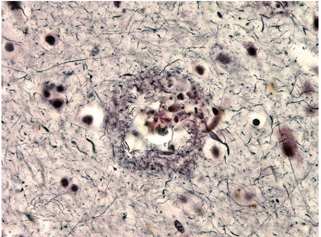
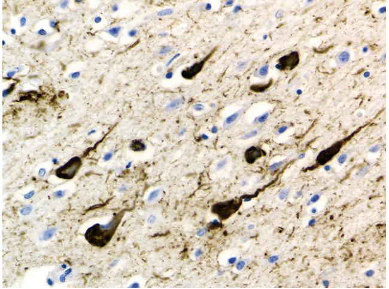
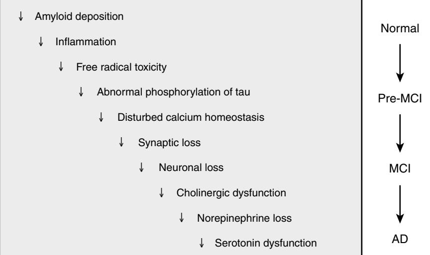
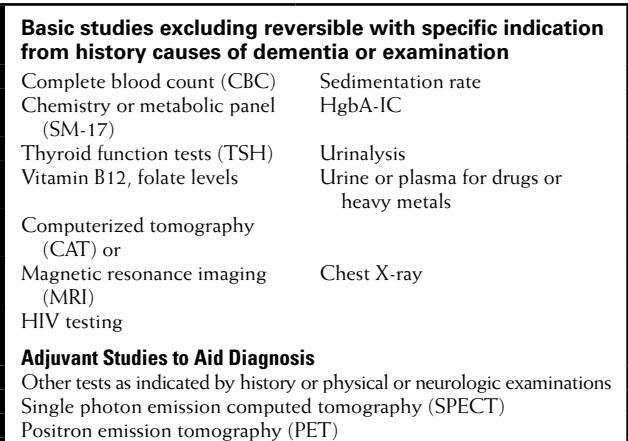
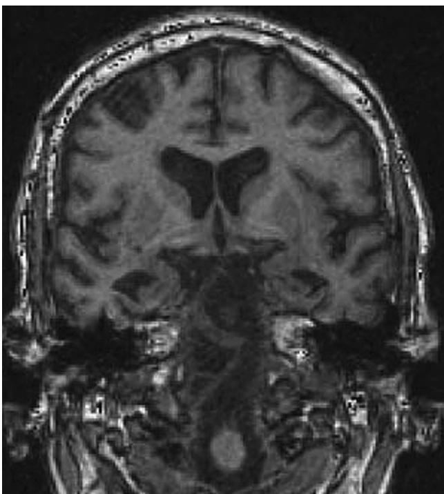
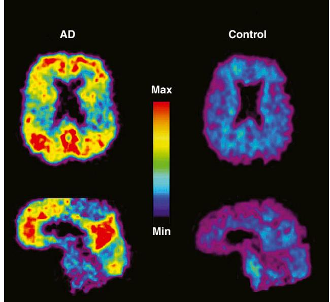
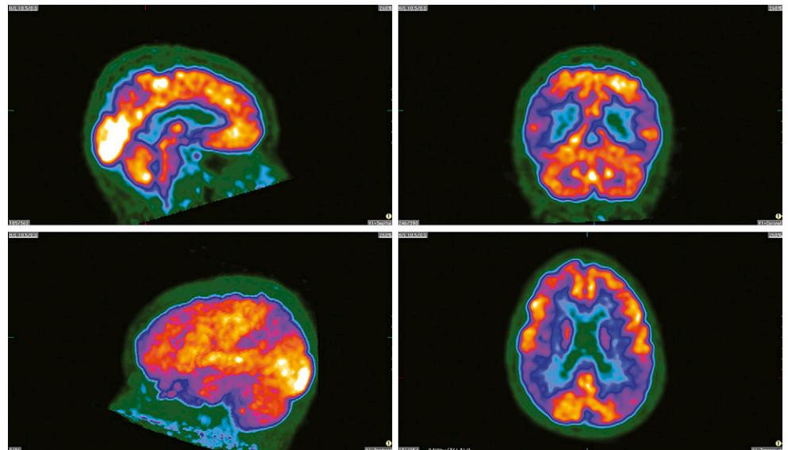

# Alzheimer's Disease

Martin R. Farlow

Alzheimer's disease (AD) is the most common cause for dementia afflicting older adults. The illness was first described by Alois Alzheimer in 1906 in a 51-year-old woman with well-described features of dementia. After death her brain was examined and found to have numerous cortical plaques and tangles, characteristic of the illness.1 The disease was thought to be rare for six decades until its clinical and neuropathologic features were recognized to be largely identical to those occurring in elderly dementia patients.2

The illness is by far the most frequent cause of dementia in the United States, currently afflicting as many as 5.2 million mostly elderly individuals.3 The incidence doubles every 6 years after the age of 50. As the over-age-80 population has rapidly grown, with improved health care leading to longer survival, it is estimated that the prevalence of AD in the United States by 2050 will almost triple to 11 million to 16 million Americans.4 This disabling disease is by far the most common cause of neurodegeneration and the major condition leading to nursing home placement. The economic costs are huge with direct health care, nursing home costs, and caregiving costs at home globally totaling greater than \$315 billion.5 Only symptomatic therapies are currently available, but no known therapy delays or halts disease progression. If a drug or lifestyle alteration (e.g., diet, exercise) could be found that delayed functional deterioration by as little as 1 to 2 years, it would substantially reduce the costs to both families and society.

# **PATHOLOGY AND MECHANISMS OF DISEASE**

In AD, the illness begins with atrophy in the entorhinal cortex and hippocampus, and as clinical symptoms worsen, there is spread to, more generally, most areas of the cortex, excepting only the occipital lobes.6

Microscopic examination of cortical sections from the brain of a patient with AD reveals global loss of neurons and increased numbers of extracellular amyloid plaques.7 The amyloid plaques are both "diffuse," possibly benign, since similar deposits may be found in normal elderly individuals, and "compact," often associated with neuritic changes, possibly caused by the effects of the deposited amyloid or by smaller oligimers of the β-amyloid protein on surrounding dendrites and axons (Figure 54-1). β-Amyloid proteins are also frequently found deposited diffusely in cerebral blood vessel walls. In addition to β-amyloid plaques, intracellular lacy fibrillar accumulations of material are present in neurons, called neurofibrillary tangles (NFTs)8 (Figure 54-2). NFTs are composed of paired helical filaments largely consisting of abnormally hyperphosphorylated tau. These are the defining features originally described by Alzheimer 102 years ago.

The amyloid plaques are made of β-amyloid proteins of various lengths from 39 to 42 amino acids long.9 The β-amyloid 1–40 amino acid type is in plasma and CSF, but the 1–42 form comprises the major component of the cores of these amyloid plaques. The β-amyloid proteins are derived from a larger widely present transmembrane protein in the brain called the amyloid precursor protein (APP). They are cleaved from APP by the β-secretase and γ-secretase enzymes, which have been recently characterized and are active targets for drug therapy.10

Mutations have been found to be associated with familial AD, as will be described later in this chapter, in both the genes coding for the β-amyloid proteins and for the presenilins, which likely are a component of γ-secretase.11 Studies of the effects of these mutations in cell lines and transgenic animals that develop amyloid deposits and plaques in their brains similar to patients with AD have provided insights into how these proteins normally function and how, when disturbed by mutation, their functions are altered, leading to dementia. Those findings should give insights into sporadic AD, and, using these models, several drugs have been developed to reduce production of the amyloid β proteins or speed their metabolism and clearance. It is hoped that these drugs will also be effective for sporadic AD.

Interestingly, although considerable evidence suggests that β-amyloid and its toxic effects on the brain may initiate the cascade of pathophysiologic processes that leads to AD, progression of dementia correlates more closely to numbers of NFTs or number of synapses lost.

Clearly a cascade of processes involving different mechanisms, including inflammation and disturbed calcium homeostasis, occurs as AD progresses (Figure 54-3). Neurotransmitter systems are differentially affected. The cholinergic system is susceptible to early dysfunction, and increasing cholinergic deficiency has been correlated with clinical progression. As AD progresses, the glutaminergic, noradrenergic, and serotonergic systems deteriorate, causing further cognitive losses and often behavioral abnormalities. Therapeutic research since the late 1980s has focused on correcting these neurotransmitter deficits, with some modest success and resulting clinical benefits.

Extracellular amyloid plaques and intraneuronal NFTs in the cortex are the cardinal features of AD. Stereotypic spread of the NFTs, as originally described by Braak and Braak (1991),6 defined a basis for neuropathologic criteria for AD staging that still is useful today. NFTs are found in the entorhinal cortex and adjacent areas of the hippocampus. Braak stages I and II typically are not associated with clinical symptoms. In stages III and IV, NFTs have spread to the limbic regions, and cognitive deficits are present. By stages V and VI, NFTs have spread to other regions of the cortex excepting the occipital cortices, and the severity of the dementia is worse.

Substantial evidence suggests, however, that plaques and tangles can be found in substantial numbers in many elderly individuals with normal cognitive functioning and that considerable overlap exists in plaque and tangle pathology between very elderly normals (over age 90) and those in this age range with dementia, reemphasizing the necessity for clinicopathologic correlation in diagnosis.12 Newer criteria assessing both plaque and tangle densities have been developed. Khachaturian criteria count numbers of amyloid

Figure 54-1. Neuritic plaques revealed by silver stain from cortex of patient with Alzheimer's disease.

Figure 54-2. Neurofibrillary tangles in cortical section of brain from patient with Alzheimer's disease.

plaques in a 1 mm2 field of the neocortex with numbers adjusted for age.13 The Consortium to Establish a Registry for Alzheimer's Disease criteria count plaques in three designated brain regions using defined stains.14 More recently the Reagan criteria assess both plaques and tangle numbers in a highly specified way and appear to have generally high correlation in confirming the diagnosis of AD and in assessing disease stage.15

# **EPIDEMIOLOGY AND GENETICS OF ALZHEIMER'S DISEASE**

Aging is the biggest risk factor for Alzheimer's disease. Rarely patients in their 20s and 30s have been reported to have AD, but onset of clinical symptoms is uncommon until the 50s with yearly probability of incidence rapidly increasing to age 65 to 75, when 1% to 5% of the general population is affected. By age 75, the prevalence is as high as 15% in the United States, and by age 85 it has been estimated to afflict 35% to 50% in the very old age range.16 Studies suggest the prevalence continues to climb, with the majority of individuals by their 90s showing clinical signs of at least early dementia. However, in these oldest old with dementia, underlying brain pathology may differ little from age-matched normal subjects other than demented patients have greater neuronal losses, and their rate of disease progression may be relatively slow. Therefore, even though these patients meet current clinical criteria for AD, it is unclear that these individuals really have the same illness. The second most common risk factor for AD is family history, with approximately 20% of patients with AD having two or more first-degree relatives affected. The pattern of inheritance is typically autosomal dominance.

In families with AD, several genetic mutations have been identified that are causative for the disease. Almost all of the known mutations cause presenile forms of the disease. A few dozen families with onset of AD predominantly in the 40s and 50s have mutations in the APP gene, usually in the region of the gene that codes for the β-amyloid proteins. It is thought that these mutations result in abnormal

Figure 54-3. The cascade of mechanisms in Alzheimer's disease. Hypothetical cascade of processes occurring as Alzheimer's disease progresses. The specific abnormalities are well established, but their order with regard to causality remains controversial. MCI = mild cognitive impairment; AD = Alzheimer's disease.

β-amyloid metabolism with resultant chronically higher levels of amyloid β proteins leading to AD.17

The other mutations causing early onset familial disease have been localized to the presenilin-1 (PS-1) gene on chromosome 14 and the presenilin-2 (PS-2) gene on chromosome 1. Again, only a few dozen families have been found in which PS-2 gene mutations are associated with AD, whereas more than 160 different mutations in the PS-1 have been found in several hundred families to cause AD and occasionally other symptoms such as spasticity or seizures.18 The presenilins are part of a complex that acts functionally as γ-secretase.11 As previously mentioned, γ-secretase slices APP to produce β-amyloid.

Increased levels of β-amyloid are also found in AD patients with PS-1 or PS-2 mutations.17 These mutations are the most commonly known cause of autosomal dominant familial AD, but they still cause less than 1% of all cases of AD. Even in patients with family history of onset of dementia under the age of 65, these mutations are causative in less than 10%. An early-onset patient with AD is more likely to have one of these mutations if there is family history of multiple other affected family members having similar early age of onset. Rather than aid in confirming the diagnosis or risk for AD in a limited number of these relatively rare families, the major importance of these mutations has been to create transgenic animals that have been useful in unraveling disease mechanisms and to speed development of new drugs and testing and other novel therapeutic approaches, such as targeted immunologic stimulation by β-amyloid vaccination or administering monoclonal antibodies targeted to the β-amyloid proteins to accelerate their degradation.

The major genetic risk factor identified for AD in both late onset, sporadic and familial patients is the ε4 polymorphism of the APOE4 gene.19 APOE is one of the major cholesteroland lipid-carrying proteins in peripheral blood. In the brain and spinal fluid compartments, it is the only significant lipid transport protein and also functions as a transport protein for β-amyloid. It comes in types ε2, ε3, and ε4, with the ε2 allele being relatively uncommon. The ε4 allele is carried by 15% to 20% of the general population, and the ε3 allele by almost everyone else. The 1% to 2% of individuals who are homozygous for the ε4 have a 50% risk of developing AD by their mid to late 60s. Those who are heterozygous for the ε4 allele have a 50% risk of developing AD by their mid to late 70s.19 Women heterozygous for ε4 are more likely to develop AD at an earlier age than men. Individuals who carry only the ε3 or ε2 alleles are likely not to develop AD in their 80s or not at all. Some evidence suggests inheriting the ε2 allele may be protective, reducing risk for AD. Inheritance of the ε4 allele confers similar risk for AD regardless of whether or not there is family history. Determination of APOE genotype in a patient with dementia does improve diagnostic specificity in the subset of subjects with the ε4 genotype, but it is arguable whether diagnostic accuracy is improved enough to be clinically helpful. If subjects who are homozygous or heterozygous for ε4 and do not develop dementia in their at-risk age range, current evidence suggests their future risk of dementia is no greater than that of an age-matched non-ε4 carrier in the general population for developing AD. Therefore, presymptomatic APOE4 genotyping for future risk for AD is currently not recommended. Recently, it has been found that in individuals with mild cognitive impairment (MCI), the APOE ε4 genotype is associated with a significantly greater risk for conversion to AD,20 and that ε4-carrying patients with MCI were more responsive to donepezil therapy.21 Clinical disease progression after conversion to AD is not influenced by APOE genotype, so the ApOE4 protein may be more influential in the earlier biologic stages of the illness, but once disease spreads and the cascade of destructive pathophysiologic processes begin, APOE genotype no longer influences rate of progression. Considerable evidence suggests in late onset Alzheimer's disease other, as yet unidentified, genetic polymorphisms play a role in increasing their risk for developing the disease.

Other factors that influence risk for AD are gender and education. Women are at greater risk for AD, even with adjustment for their greater survival to older ages. In the past, this greater risk for AD has been suggested by several epidemiologic studies to be due to postmenopausal estrogen deficiency, and estrogen replacement was believed to be a primary prevention for AD. However, the Women's Health Initiative Memory Study of estrogen in elderly women has shown that estrogen replacement may increase, rather than decrease, the risk for dementia.22,23

In several studies, increased education has been associated with reduced overall risk for AD and/or later onset of the illness. It has been hypothesized that better-educated individuals have a greater cognitive reserve, so the underlying biologic process disease for the must progress further for clinical symptoms to develop.24,25 However, the protective effects of cognitive training and mental exercises have not demonstrated convincing benefits in delaying disease onset. Interestingly, several studies have suggested that physical exercise may be protective and decrease brain atrophy and/or delay disease progression.26

Epidemiologic studies and small pilot trials have suggested that nonsteroidal anti-inflammatory drugs (NSAIDs) prevented or delayed progression in AD.27 However, several large double-blind, placebo-controlled trials have indicated no significant reduction in risk for AD with NSAIDs and, rather, a significant increased risk for gastrointestinal symptoms, such as hemorrhage, and cardiovascular disease including stroke.28,29

Head trauma has been suggested as a risk factor for AD, but studies have been muddled by wide differences in reported series in the criteria used for defining what constitutes significant previous head trauma history. Further, APOE ε4 patients have been demonstrated to recover less completely from head trauma, so a more prominent history of head trauma may be a pseudomarker for carrying the APOE ε4 polymorphism, which is a risk factor for AD.30

More recently, a number of studies and trials have suggested the metabolic syndrome increases risk for AD.31 Specifically the main features of the metabolic syndrome; diabetes mellitus or insulin resistance, high cholesterol, hypertension, and obesity are all suggested risk factors for AD. Several prospective are investigating whether improving or treating these factors individually will reduce conversion of normal or MCI individuals to AD and/or delay progression of AD in subjects already affected. It remains to be determined whether these approaches: such as treating hypertension such as treating insulin resistance with glitazones, and statins to reduce cholesterol, are effective. In a related therapeutic approach, some recent studies have suggested exercise may delay progressive brain atrophy in patients with AD.

# **CLINICAL DIAGNOSTIC CRITERIA FOR ALZHEIMER'S DISEASE**

Criteria for the clinical diagnosis of AD have been developed and are widely used to diagnose this form of dementia. These are the *Diagnostic and Statistical Manual of Mental Disorders, Fourth Edition* (DSM-IV)32 and consensus criteria developed by the National Institute of Neurological and Communicative Disorders and Stroke and the Alzheimer's Disease and Related Disorders Association (NINCDS-ADRDA).33

The DSM-IV criteria are more general, essentially requiring insidious and progressive memory and cognitive impairments where other potential causes have been excluded (Table 54-1).

NINCDS-ADRDA criteria for "definite AD" require clinical features for probable AD and autopsy confirmation. A diagnosis of "probable AD" requires deficits in two or more areas of cognition, including memory, that are progressively worsening, confirmed by clinical and neuropsychological evaluations, and not caused by either delirium or other brain or systemic illnesses. Onset is between 40 and 90 years of age (Table 54-2). The diagnosis is further supported by impaired function in activities of daily living (ADLs) and altered patterns of behavior and family history (particularly if supported by previous neuropathology). Other features include supportive laboratory results. A diagnosis of "possible AD" includes cases where there is either a single progressively more severe cognitive deficit, or a second brain or systemic cause for their dementia, or an atypical onset (early or with unusual symptoms or course [unusually rapid or stuttering]). Both DSM-IV and NINCDS-ADRDA criteria rely heavily on history and the neurologic examination, and recent evidence suggests that both sets of criteria exclude broad populations of patients

#### **Table 54-1. DSM-IV Criteria for Dementia**

#### **Multiple Cognitive Deficits Criteria**

#### **Criterion A**

- Memory impairment
- One or more of the following:
	- Aphasia (language disturbance)
	- Apraxia (impaired motor activity)
	- Agnosia (impaired recognition)
	- Disturbed executive function (planning, organization, etc.)

#### **Criterion B**

- Cognitive deficits in criteria A1 and A2 each cause:
- Impairment in social or occupational functioning
- Are not due to a CNS disease
- Are not due to a medical disorder
- Do not occur solely during the course of delirium
- **Criterion C**: Gradual and continued cognitive decline
- **Criterion D**: Other systemic neurologic and psychiatric illnesses should be eliminated
- **Criterion E**: AD should not be diagnosed in the presence of delirium

Criteria adapted from American Psychiatric Association: Diagnosis and Statistical Manual of Mental Disorders (DSM-IV-TR), 4th ed. Washington DC: American Psychiatric Association; 2000.

in very early stages of the illness who arguably may be more likely to respond to future disease progression–delaying therapeutic approaches. These patients typically have isolated amnesia with minimal impairment in function in ADLs and are labeled as having mild cognitive impairment (MCI). However, there has been resistance to this entity largely related to lack of consensus regarding the defining criteria, by various regulatory authorities. These or similar more expansive criteria will likely facilitate not just research studies with diagnosis but clinical care for such patients in general practice.

#### **Table 54-2. NINCDS-ADRDA Criteria for AD**

#### **I. Criteria for the Clinical Diagnosis of Probable AD**

- Dementia established by clinical examination and documented by the Mini-Mental State Test, Blessed Dementia Scale, or some similar exam, and confirmed by neuropsychological tests
- Deficits in two or more areas of cognition
- Progressive worsening of memory and other cognitive functions
- No disturbance of consciousness
- Onset between ages 40 and 90, most often after age 65
- Absence of systemic disorders or other brain diseases that could account for the dementia
- **II. Conditions That Support a Probable Alzheimer's Disease Diagnosis**
- Progressive deterioration of specific cognitive functions such as language (aphasia), motor skills (apraxia), and perception (agnosia)
- Impaired activities of daily living and altered patterns of behavior
- Family history of similar disorders, particularly if confirmed neuropathologically
- Laboratory results of: normal lumbar puncture as evaluated by standard techniques; normal pattern or nonspecific changes in EEG, such as increased slow-wave activity; and evidence of cerebral atrophy on CT with progression documented by serial observation
- **III. Other Clinical Features Consistent with the Diagnosis of Probable Alzheimer's Disease**
- Plateaus in the course of the illness
- Associated symptoms: depression, insomnia, incontinence, delusions, illusions, hallucinations, catastrophic verbal, emotional, or physical outbursts, sexual disorders, weight loss; other neurologic abnormalities present in some patients, especially with more advanced disease may include motor signs such as increased muscle tone, myoclonus, or gait disorders
- Seizures in advanced disease and structural imaging study (CT or MRI) normal for age

#### **IV. Features that Make the Diagnosis of Probable AD Uncertain or Unlikely**

- Sudden, apoplectic onset
- Focal neurologic findings such as hemiparesis, sensory loss, visual field deficits, and incoordination early in the course of the illness
- Seizures or gait disturbances at the onset or very early in the course of the illness

#### **V. Some Criteria for Possible AD**

- Dementia syndrome, in the absence of other neurologic, psychiatric, or systemic disorders sufficient to cause dementia, and in presence of variations in onset, in the presentation, or in clinical course
- Presence of second systemic or brain disorder sufficient to produce dementia, which is not considered to be the cause of the dementia
- A single, gradually progressive severe cognitive deficit identified in the absence of other identifiable causes

### **VI. Criteria for Diagnosis of Definite Alzheimer's Disease**

- The clinical criteria for probable Alzheimer's disease
- Histopathologic evidence obtained from a biopsy or autopsy

Dubois et al34 have proposed consensus criteria that define the earliest stage of AD as an isolated amnestic deficit, not requiring significant functional impairment in ADLs, but rather biomarker or other objective test results specifically supporting the diagnosis of AD; CSF with low amyloid β and high tau; abnormalities on PET; and mutations associated with autosomal dominant familial AD.

# **CLINICAL EVALUATION FOR ALZHEIMER'S DISEASE**

Questioning a patient with Alzheimer's disease directly about his or her illness and past medical history may be either misleading or unproductive. When asked for their chief complaint, the patient may say nothing is wrong or discuss some other unrelated health problem. It is often necessary for a family member, caregiver, or friend with knowledge of the patient's general cognitive functioning and function in ADLs to confirm or give the history. Insidious onset of short-term memory problems is key for the diagnosis of AD. Patients often repeat themselves in conversation and forget appointments. Typically, they may read the newspaper and watch TV but remember little or nothing of what they have read or seen. Memory impairment becomes broader to include poor recall of past events as the illness worsens. A number of cognitive deficits beyond memory impairment differentiate AD from normal aging. Language deficits including inability to name family or friends and word finding difficulties in conversation may be present. This advances with decreased fluency as the illness progresses to a more severe stage with the patient eventually becoming mute.

Visuospatial impairments are common. An affected individual may get lost trying to find their car at the mall or go off route by many miles while driving from what should be a short trip near home. Important items such as a wallet, purse, checkbook, or keys may be mislaid in the home. Calculation difficulties are often present with the patient unable to figure a tip or balance his or her checkbook. Patients with executive functioning difficulties are unable to follow a recipe, plan trips, or manage their financial affairs. Dyspraxia may be present such that they cannot dress themselves or operate kitchen appliances.

Behavioral disturbances in AD occur in a large majority of patients as the illness progresses. Apathy typically occurs early in the illness causing marked loss of initiative and reduced interest in the surroundings. As many as 30% of patients in the early stages of AD will have significant depression, including loss of energy, appetite, or sleep disturbances such as insomnia.35 However, insomnia in AD patients may also be caused by sleep apnea, myoclonus, or side effects of various medications. Other behavioral symptoms include anxiety, particularly when family members leave them at home alone or when they are forced to interact with larger groups of unfamiliar people. As AD progresses from moderate to severe stages, paranoia and delusions become more frequent. A common delusion is the belief that their spouse is having an affair with someone else or that neighbors, friends, or family are stealing from them. Misidentification and visual hallucinations may occur with a daughter or another individual thought to be their spouse or the patient may see other people in the house or just outside who are not really present. As AD progresses, agitation occurs eventually in up to 75% of patients, with typical symptoms including verbal or physical aggression toward a family member, wandering, or repetitive motor symptoms such as pacing.36,37 Patients may develop disinhibition and inappropriate behaviors with examples being; off-color jokes in inappropriate venues, rough play with children, or sexual advances directed toward family members, including children, or even strangers.

The ideal history should document any cognitive deficits, impairment in ADLs, and behavioral abnormalities. Rate of progression over time should be globally assessed. Risk factors should be determined including previous cardiovascular disease or stroke, hypertension, lipid disorders, diabetes mellitus, head trauma, or family history of dementia.

# **NEUROLOGIC EXAMINATION**

Both general physical and neurologic examinations are important to the evaluation of a dementia patients to look for signs that might suggest other causes of dementia, as well as to document any findings that may relate directly to AD. A mental status exam is needed to document presence of cognitive deficits supporting the dementia diagnosis and to begin staging the illness.

The differential diagnosis process for dementia still very much remains a diagnosis of exclusion. The focus is to exclude reversible causes of cognitive impairment and the other irreversible dementias. The physical examination provides a brief screen to exclude organ system problems as the source of the patient's cognitive impairment. The general neurologic examination may often be normal in the demented patient with AD, but the presence of focal deficits (e.g., visual field deficits, weakness, or spasticity in an arm or leg) suggests a vascular etiology for dementia. Older series have reported signs of Parkinson's disease such as rigidity, bradykinesia, and tremor, in as many as 10% to 30% of patients with AD. With recent inclusion of immunohistochemistry in neuropathologic studies in a large series of patients with previous history of dementia, and clinicopathologic correlation, it has become clear that many, if not most, of these patients have diffuse Lewy body disease (DLBD) or Parkinson's disease with dementia.

Gait or balance impairment may also indicate Binswanger's disease (a form of vascular dementia associated with multiple lacunar subcortical strokes), normal pressure hydrocephalus, or progressive supranuclear palsy. Continuing gait problems can also occur in more severe stages of AD leading to substantially increased risk for falls. Myoclonus in early-stage dementia is worrisome for Creutzfeldt-Jacob disease (CJD) or other prion diseases whereas it may be found later in the disease course in 5% to 10% of patients with AD. The list of neurologic findings that may suggest possible, if rarer, etiologies for a patient's dementia is quite lengthy. In general, clues from the history and physical examination guide any additional laboratory testing outside the standard dementia evaluation.

Mental status testing varies in its breadth and depth according to the preferences of the individual physician. In general, assessment should include level of alertness or attention, orientation (person, place, time), short-term and remote memory (remembering three words for 5 minutes and knowledge of their birth date and high school), language, visuospatial functioning (copying figures), calculation, and executive functioning or judgment. The Mini-Mental State Examination (MMSE) is most widely used to screen for cognitive dysfunction to support the diagnosis of dementia and to stage the dementia (Table 54-3).38 A significant limitation is that it does not assess executive function, a major feature of AD and other dementias. Also, education, as well as ethnicity, familiarity with the English language, and other factors, may influence MMSE scores. It is also relatively insensitive to measuring change in the dementia patient. It is widely familiar to physicians, but its future use may be limited as recently the copyright is being enforced and payment may be demanded for its use.

Clock drawing is a similarly useful very short screen for dementia.39 It is easy for physicians to administer and score. Surprisingly, for such a simple test, at least a dozen different ways to score performance on clock drawing have been proposed, and all appear to be valid, correlating well with other tests assessing cognition in dementia.

### **LABORATORY STUDIES**

It has been estimated that more than 95% of dementia in elderly persons is caused by neurodegenerative or ischemic diseases that are not reversible. The focus of laboratory evaluations has been to first and primarily identify the small minority of patients who have reversible causes for their dementia (Table 54-4).37,40 In reality, a potentially reversible cause may be identified in 25% to 40% of patients, but when the laboratory abnormality is corrected or an offending drug (anticholinergic, pain medication) is withdrawn, only transient mild improvement or stabilization in cognitive functioning occurs. The patient still has progressive dementia, most often AD. Nonetheless, any improvement in cognition or function in ADLs, even if limited or transient, is greatly appreciated by patients and their caregivers, and the benefits fully justify doing an evaluation for reversible conditions.

#### **Table 54-3. Instruments Used to Monitor Response to Pharmacologic Therapy in Clinical Practice**

#### **Mini-Mental State Examination**

- Global measure of cognition widely used by physicians and third-party caregivers
- Assesses orientation, registration, recall, language, and attention • Uses a 30-point scale
- Requires approximately 5 to 10 minutes to complete
- Sensitivity 80% to 90% and specificity 80%
- Administered by psychometricians, nurses and physicians
- AD typically advances by 3 points per year

#### **Clock Drawing**

- Global measure of cognition widely used by physicians • Multiple scoring systems with proven validity, sensitivity 59%,
- and specificity 90% • Assesses in a single test multiple cognitive domains
- 1 to 2 minutes to complete
- Minimal training to administer

#### **Geriatric Depression Scale**

- Evaluates depressive symptoms in patients
- Requires 5 minutes to complete
- Very useful in assessing depression in both new patients and in follow-up
- Minimal training to administer
- East of administration is leading to rapid spread in its use

A second purpose of the laboratory evaluation is to aid differential diagnosis among the neurodegenerative and vascular dementias (AD, dementia with Lewy bodies or Parkinson's dementia, vascular dementia, frontotemporal dementias [FTDs]). Accurate diagnosis about the cause of dementia can guide counseling patients, families, and caregivers regarding course and prognosis. Accurate diagnosis of dementia is also important in guiding therapeutic choices. There is evidence from double-blind, placebo-controlled trials suggesting some efficacy for available drugs in all of the irreversible dementias mentioned above except FTD.

In evaluating for potentially reversible causes of dementia, space-occupying masses or other structural abnormalities in the brain may be identified by brain imaging with techniques such as computed tomography (CT) or magnetic resonance imaging (MRI). Most frequent abnormalities identified might include ischemic changes including strokes, normal pressure hydrocephalus, subdural hematomas and hygromas, tumors such as large meningiomas, and gliomas or brain metastases from unidentified primary tumors.

Selective frontal or temporal atrophy on MRI or CT may suggest FTD, and multiple large vessel strokes or smaller subcortical strokes may suggest vascular dementia. Discrimination of FTD from AD in individual patients may be difficult using clinical examination and CT or MRI. Functional imaging measuring blood flow or metabolism by single-photon emission computed tomography (SPECT) or positron emission tomography (PET) may be better able to discriminate FTD from AD and other forms of dementia.

With regard to reversible causes of dementia, metabolic abnormalities worsen cognitive deficits. Relatively minor deviations out of the normal range can exacerbate mental impairment in elderly individuals, particularly those with some other preexisting cause for these cognitive impairments or dementia. Metabolic and endocrine causes are all potentially reversible.

Hyperkalemia may occur in many patients taking diuretics for treatment of hypertension or with congestive heart failure, as well as in individuals taking steroids; hypernatremia may be found in patients with dehydration, which can occur in impaired elderly patients who are dependent on others for fluid intake; hyponatremia may occur in association with

#### **Table 54-4. Laboratory Evaluation of Patients with Dementia**

Lumbar puncture with cerebrospinal fluid for Aβ and tau levels

a variety of chronic illnesses or medications; hypocalcemia and hypercalcemia are found more rarely but also can affect cognitive functioning and should be screened for.

The most common reversible endocrine cause for dementia in older adults is hypothyroidism. Diabetes mellitus, which is increasing rapidly in the United States, is another cause that has both reversible and irreversible aspects. Unrecognized intermittent hyperglycemia or hypoglycemia may cause cognitive impairment, which is reversible. The longer-term effects of diabetes mellitus on vessel walls may cause subcortical ischemic vascular disease, directly causing vascular dementia and also being a risk factor for AD.

Chronic diseases of the major organ systems may all secondarily cause cognitive impairment. These chronic illnesses include acute and chronic pulmonary diseases such as asthma, chronic obstructive pulmonary disease and pulmonary fibrosis, liver diseases such as hepatitis and cirrhosis, cardiac diseases such as congestive heart failure and arrhythmias, chronic CNS infections (including tuberculosis, *Cryptococcus*, and other fungal infections), HIV, Creutzfeldt-Jacob disease, Whipple's disease, and syphilis. Most will have other symptoms or signs and lumbar puncture to obtain cerebrospinal fluid for testing is most often required for diagnosis. Elderly patients with urinary tract infections, as well as upper respiratory infections, may also have reversible cognitive impairments. Subclinical or partial seizures may mimic dementia, with intermittent worsening confusion or automatisms such as lip smacking suggesting the diagnosis.

Polypharmacy in older adults is arguably the most common reversible cause of cognitive impairment. A partial list of the drug categories that are the biggest offenders includes anticholinergics, antihypertensives, antidepressants, antianxiety drugs, antipsychotics, analgesics, and hypnotics. If suspected, use may be eliminated or the lowest dosage necessary to control symptoms should be used.

# **BEHAVIORAL SYMPTOMS IN ALZHEIMER'S DISEASE**

Behavioral disturbances are common in AD and increase as the illness declines to the more severe stages. Dysfunctions in the cholinergic and glutaminergic systems are associated with cognitive impairment in AD, but with disease progression, abnormalities in multiple other neurotransmitter systems can be demonstrated that likely underlie the onset of behavioral or psychiatric symptoms.41 For example, aggressiveness has been associated with dysregulation in the γ-aminobutyric acid-ergic, serotonergic, and noradrenergic systems. Similarly depressive symptoms have been associated with loss of neurons in both the medium raphe nuclei and locus ceruleus and consequent depletion of serotonin and noradrenalin. Treatment approaches have been guided by these observations. Major therapeutic targets in patients with AD include agitation, depression, anxiety, and insomnia or disturbances in day-night sleep cycles. Treatment of these symptoms may be difficult and none of the drugs currently used to treat these symptoms is approved by the U.S. Food and Drug Administration for treating behavioral symptoms in AD.

Double-blind, placebo-controlled trials are limited, but available data suggest that substantial placebo effects occur with therapy of most of these symptoms and that many commonly used drugs have modest real effects. Treatment of behavioral symptoms is of great importance to family members and caregivers because they are difficult to manage and are one of the principal factors for nursing home placement.

Aggressive or assaultive behaviors are relatively common in AD with roughly 20% of patients in the community and up to 50% of nursing home patients committing physical assaults. Verbal attacks are reported to occur in 50% of patients with AD. Hallucinations occur in as many as 30% of patients at home and in 50% of nursing home patients. Changes in the environment, such as being moved to a new locale, having a new caregiver, or simply as the result of disease progression, may precipitate all of the previously listed symptoms. A recent comparative study suggests limited efficacy for the most commonly used drugs for agitation.42 The atypical neuroleptics, despite recent evidence suggesting some increased risk for stroke with chronic use, are still most useful in patients with AD for treating agitation.43,44

In the absence of approved drugs or a convincing clinical trials evidence base for treating patients with behavioral symptoms, the following general therapeutic approach should be followed.

Target symptoms for treatment should be identified before therapy begins. Typical symptoms include wandering, physical aggression, restlessness, agitation, pacing, screaming, disinhibition, delusions, hallucinations, misidentification, sleep disturbances, and very frequently depression.

Iatrogenic causes such as anticholinergic and pain medications should be excluded and infections and other new illnesses should be eliminated, and potential sources of pain in the patient eliminated and possible changes in his or her environment should be investigated. For the identified target symptoms, drug therapies should be started slowly and advance slowly. When the symptoms are controlled, periodic attempts should be made to wean the medications.

# **BIOLOGIC MARKERS OF DIAGNOSIS OF DISEASE PROGRESSION**

No biomarkers are currently sensitive and specific enough to reliably establish the diagnosis of AD, but some have potential utility as adjuncts to the clinical evaluation. None of these surrogate disease markers have enough utility as of yet to be broadly used in clinical practice. Structural MRI is the most thoroughly validated of the potentially available surrogate markers. Progressive atrophy in the hippocampus and loss of whole brain volumes have had high correlation with progression of clinical symptoms.45 This methodology is widely used as a secondary assessment to support efficacy claims for antidementia drugs in clinical trials (Figure 54-4). Serial MRIs may be more widely used clinically to assess disease progression if one of the investigational drugs currently under study delays disease progression. Both MRI spectroscopy and 18-fluorodeoxyglucose PET detect metabolism changes associated with AD (Figure 54-5), but lack of longitudinal data and high cost have limited their broad adoption.

An agent labeling amyloid, PIB, has been demonstrated to reliably label amyloid deposits in the brains of patients with AD (Figure 54-6). Unfortunately 10% to 20% of normal elderly by age 65 show PIB positivity, and the percentage of normals with significant PIB positivity progressively increases to 50% for normal patients in their mid-80s.46 However, in subjects with amnestic MCI, PIB positivity appears to predict earlier conversion to dementia, and absence of PIB positivity appears to be strong evidence against progression to AD.47 Short half-life and the need for an outside cyclotron to produce the Carbon14-label of PIB has limited its use. Very similar amyloid-labeling compounds using radioactive fluorine, which has a longer half-life, may have broader future potential to aid clinical

Figure 54-4. MRI study with coronal view through the hippocampal region illustrating moderately severe medical temporal atrophy and milder global atrophy typical for Alzheimer's disease.

imaging in Alzheimer's disease; particularly if drugs in development that reduce amyloid in the brain become more widely available.

Aβ1–42 protein levels in CSF from patients with AD are lower than in age-matched controls.48 Similarly, tau protein levels and phospho-tau levels are significantly higher in AD than in normal elderly patients.49 Unfortunately, abnormal Aβ and tau levels occur in other neurodegenerative diseases such as CJD and DLBD, and some overlap occurs with normal aging. Combining these two measures improves accuracy of diagnosis, but it is unclear that CSF Aβ and tau measurements improve specificity of clinical diagnosis enough to justify lumbar puncture in most patients. In general, biologic markers for AD and disease progression have

Figure 54-6. Agent labeling amyloid, PIB illustrating significant uptake in frontal and parietal regions.

Figure 54-5. Views from PET study using 18-fluorodeoxyglucose obtained in a patient with Alzheimer's disease. The image demonstrates decreased signal or metabolism in the posterior parietal regions as may characteristically be seen with this illness.

had limitations that have limited their adoption in clinical practice.50 Ultimately, investigation of a number of markers in plasma and CSF in large prospective longitudinal studies, such as the Alzheimer's Disease Neuroimaging Initiative, may yield more sensitive and specific biologic markers for AD.

# **TREATMENT**

Current therapies for AD treat either cognitive or behavioral symptoms but have not been shown to delay biologic progression of disease. The development of a therapy to delay or prevent onset of dementia and to delay disease progression remains an actively pursued but so far elusive goal. Currently available drugs for AD modestly improve some aspects of cognition and function in ADLs as well as less well-established beneficial effects on behavioral disturbances (Table 54-5). Significant benefits are seen only in a minority of patients, and stabilization and temporary reduction of symptomatic decline are the best results achieved in most others. Families and caregivers need to be cautioned against unrealistic expectations. Benefits always need to be weighed against adverse effects when deciding whether a drug dose should be increased or whether the antidementia medication should be continued at all.

Recognition that cholinergic deficiency, including progressive loss of cholinergic neurons in a brain region known to be involved in learning and memory, led to the development of the cholinesterase inhibitors. Tacrine, the first cholinesterase inhibitor successfully developed to treat AD, caused frequent liver toxicity, thus requiring frequent blood testing to monitor lever functions and had a very short halflife, which made four times per day dosing necessary, which was very difficult for AD patients and their caregivers to

**Table 54-5. Clinical Trials Evidence for Drugs Approved for Treatment of Alzheimer's Disease**

| Study                                               | Treatment/ Dose Placebo   | Number of Subjects | Treatment, Effect |
|-----------------------------------------------------|---------------------------------|-----------------------|----------------------|
| Donepezil Rogers et al, 199851                | Placebo 5 mg 10 mg        | 153 152 150     | 2.5 2.9           |
| Rivastigmine Corey-Bloom et al, 199852        | Placebo 1–4 mg 6–12 mg    | 235 233 231     | 21 3.8            |
| Galantamine Raskind et al, 200053             | Placebo 24 mg 32 mg       | 213 212 211     | 1.6 3.4           |
| Memantine Reisberg et al, 200354              | Placebo 20 mg                | 126 126            | SIB 5.7           |
| Memantine + Donepezil Tariot et al, 200455 | Placebo 10 mg D + 20 mg M | 201 203            | 3.3                  |

\* Severe Impairment Battery (1-100), Alzheimer's Disease Assessment Scale Cognitive Component (1-70).

comply with. It never was broadly used in clinical practice. Donepezil is a cholinesterase inhibitor more selective for acetylcholinesterase; rivastigmine inhibits both acetylcholinesterase and butyrylcholinesterase; and galantamine inhibits cholinesterase but also modulates acetylcholine effects on nicotinic receptors. The clinical significance of these differences in the cholinesterase inhibitor is unknown. Double-blind, placebo-controlled trials have demonstrated that donepezil, rivastigmine, and galantamine mildly improve cognition, function in ADLs, and behavior in some patients with mild to moderate-stage AD for periods of between 6 and 18 months.56 Donepezil also has proven effective in treating patients with moderate- to severe-stage dementia (see Table 54-5).57

When therapy is initiated, all cholinesterase inhibitors need to be titrated to decrease adverse effects and to achieve the maximum-tolerated dose to optimize benefits. If adverse effects occur, doses may be skipped or the dosage reduced until they abate or lessen, and higher dosages may again be tried at a later time. In general, the effects on cognition, function in ADLs, and behavior potentially may be accompanied by and weighed against adverse effects such as nausea, vomiting, and diarrhea, which also increase with dose. Finding the best balance between adverse and beneficial drug effects in the individual patient is the goal. If patients are intolerant of one cholinesterase inhibitor, they may tolerate another, so a trial of switching to an alternative medication sometimes is appropriate. Both the AD 2000 Collaborative Group study and the Alzheimer's Disease Cooperative Studies–Mild Cognitive Impairment Trial suggested that donepezil, and by implication the other cholinesterase inhibitors, may be less effective after 18 to 24 months.21,58 Neuropathologic studies, however, suggest that central cholinergic deficits in MCI may be less than in AD,59 and the AD 2000 study design included periodic withdrawal, suggesting that the conclusion from each of these studies, that efficacy of cholinesterase inhibitor therapy waned after 18 to 24 months, may not be generalizable. Substantial open-label follow-up data are available for all of the cholinesterase inhibitors suggesting, but not proving, continued beneficial effects for 5 years or longer. However, these data are uncontrolled and biased by selective dropouts.

When to withdraw these drugs is a major concern. As a general principle, these drugs should be stopped when the patient is no longer benefiting from their use, but this may be difficult to assess in late-stage individuals. In severely affected patients, the drugs should be withdrawn when patients are no longer able to meaningfully interact with family or caregivers.

Memantine belongs to a second class of drugs that works by partially antagonizing glutamate at the NMDA receptor, which may improve symptoms in AD by two different mechanisms of action. First the regulation of glutamate effects improves signal transmission improving the efficiency of neurotransmission and presumably at a clinical level improves cognitive symptoms. Second, memantine may prevents excess calcium entrance into the neurons following glutamate stimulation, thus potentially having neuroprotective effects. In patients with moderate- to severe-stage disease, as demonstrated in previous clinical trials, memantine mildly improves cognitive deficits, function in ADLs, and behavior. Adverse clinical effects with memantine are fewer than with the cholinesterase inhibitors, and one large double-blind, placebo-controlled trial in AD patients on established donepezil suggested that there may be fewer rather than more side effects when memantine was added, as well as an additive symptomatic benefit. Trials in patients with milder-stage AD have demonstrated less consistent benefits. Memantine is currently not recommended for use in this population. With memantine, as with the cholinesterase inhibitors, symptomatic benefits may be difficult for caregivers to judge in some patients and so they should be counseled about realistic expectations regarding the potential magnitude of benefits with this therapy. As with the cholinesterase inhibitors, memantine should be continued until patients are judged to be no longer benefiting or until the patients have no meaningful personal interactions.

# **PREVIOUSLY ACCEPTED THERAPIES MAY BE INEFFECTIVE**

Vitamin E was reported to delay functional deterioration, nursing home placement, and death by approximately 25% in moderate- to severe-stage AD in a large double-blind, placebo-controlled trial.60 However, these results were obtained only after adjusting for group differences in cognitive functioning at baseline, and no cognitive benefits were seen in the group taking vitamin E. Recently, the vitamin E group in the Alzheimer's Disease Cooperative Study Group– Mild Cognitive Impairment study showed no benefit versus placebo,21 and other studies have also suggested risks concerning thrombosis with the 2000 U vitamin E dose used in the above studies. Vitamin E is no longer broadly recommended as a therapy for AD.

Similarly, several epidemiology studies have suggested that estrogens and nonsteroidal anti-inflammatory drug (NSAIDs) may delay the onset of AD.27 However, several recent large double-blind, placebo-controlled studies have suggested both estrogens and NSAIDs used as preventatives in normal elderly individuals and in patients with AD may have greater risks than benefit.29,61–63

# **MORE TARGETED THERAPEUTIC APPROACHES IN ALZHEIMER'S DISEASE THERAPY**

Broad acceptance of the amyloid hypothesis as a target for therapy and the availability of transgenic animal models known to develop amyloid plaques has made reducing amyloid the major focus in developing drugs to delay disease progression. More detailed understanding of AD's metabolism has led to the development of β- and γ-secretase inhibitors that block the formation of Aβ from the amyloid precursor protein (APP) by interfering with the enzymes that slice it from the larger APP. Despite concerns regarding potentially an adverse side effect of γ -secretase inhibitors on notch signaling that may cause severe gastrointestinal toxicity64 and concerns about the potential for β-secretase inhibition to adversely affect central or peripheral myelinization,65 both types of secretase inhibitors are in phase II or III AD therapeutic trials.

An entirely different approach, vaccination using the β-amyloid protein, has proved effective initially in reducing β-amyloid plaques in transgenic animals, and a similar vaccine has been tested in a large phase II trial.66 This large vaccination study was suspended when several subjects developed

encephalitis.69 Some evidence has suggested cell-mediated immunity may have been involved in these adverse reactions. However, autopsy in patients who later died showed apparent clearance of β-amyloid plaques from broad areas, particularly the frontal lobes of the cortex. Vaccinated patients were followed and clinically appeared to have less than expected clinical deterioration but greater cortical atrophy. The dichotomy between clinical and structural effects has yet to be adequately explained. However, several groups have resumed clinical trials in AD patients with more targeted approaches using revised protein targets and adjuvants monoclonal antibodies to Aβ have been developed that are being passively infused into AD patients. One of these Aβ antibodies recently was shown to reduce progression versus placebo over 1 year at low doses but to cause frequent vasogenic edema at higher doses.68 Patients with the APOE4 genotype appear more likely to develop vasogenic edema at lower doses than those without this allele. It remains unclear; however, whether these newer vaccination or antibody infusion approaches will stabilize or reverse clinical symptoms of AD or rather these patients will continue to deteriorate despite reduced plaque formation and/or burden. If this proves true, other approaches, possibly focusing on the tau protein, will need to be pursued for developing future therapies.

#### **ACKNOWLEDGMENT**

This work was supported in part by PHS P30 AG10133 from the National Institutes of Health/National Institute of Aging.

# KEY POINTS

# Alzheimer's Disease

- The diagnosis of probable Alzheimer's disease is determined by a clinical process rather than a laboratory test.
- The major risk factors for Alzheimer's disease are older age, APOE4 genotype, and lifestyle (metabolic syndrome).
- It is unclear whether determination of APOE4 genotype in a patient with dementia improves diagnostic specificity enough to be clinically useful.
- Several different disease mechanisms associated with Alzheimer's disease have been identified that are targets for drug therapy.
- Symptomatic treatment with cholinesterase inhibitors is effective in patients with mild-, moderate-, and severe-stage Alzheimer's disease.
- Symptomatic treatment with memantine is effective in moderate- to severe-stage Alzheimer's disease and benefits are seen with memantine additive to cholinesterase inhibitors.
- Mutations associated with familial Alzheimer's disease have led to the creation of transgenic animals that have greatly facilitated therapeutic research.
- Amyloid-labeling agents using PET imaging research are being evaluated for their predictive, diagnostic, and risk factor utility regarding Alzheimer's disease.
- Behavioral symptoms in Alzheimer's disease are common, and most therapies are unapproved and at best marginally effective.
- Several promising treatments for Alzheimer's disease identified in epidemiology studies have failed in clinical trials.

For a complete list of references, please visit online only at www.expertconsult.com