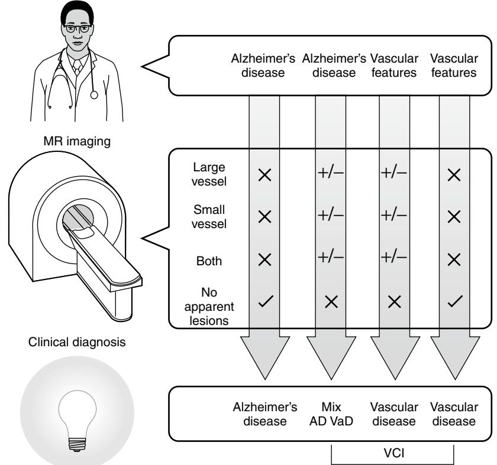

## CHAPTER 55

# Vascular Cognitive Impairment

Paige A. Moorhouse Kenneth Rockwood

Vascular cognitive impairment (VCI) is a global diagnostic category applied to a heterogeneous group of cognitive disorders that share a presumed vascular cause. Note that it is an umbrella term, which includes several syndromes, and is not simply the vascular counterpart of mild cognitive impairment (MCI). Specifically, VCI includes vascular dementia (including poststroke and multi-infarct dementia), mixed primary neurodegenerative disease and vascular dementia, and cognitive impairment of vascular origin that does not meet dementia criteria (VCI-ND). VCI may be preventable, although the evidence for this is not as complete as it is for the prevention of stroke. Beyond prevention, specific treatment has shown limited efficacy. Updated clinical diagnostic criteria for VCI are needed, and clinical investigators now emphasize harmonized standards to study the clinical, neuropathologic, and neuroimaging manifestations of VCI in daily practice. This chapter builds on a recent review1 to outline the evolution of the VCI construct, presents current thinking regarding clinical diagnosis and the supportive role of neuroimaging, and addresses the challenges that will shape future developments in this area.

## **HISTORICAL OVERVIEW**

The conceptual prototype for VCI was "multi-infarct dementia" (MID),2 itself an improvement over "senile dementia due to hardening of the arteries."3 Like many prototypes, MID was constructed with inefficient tools: neuropsychological testing based on the Alzheimer's disease paradigm and (initially) no or rudimentary neuroimaging. This construct defined MID as dementia arising as a consequence of multiple strokes and was said to account for 15% of dementias.4 As neuroimaging techniques evolved, the array of vascular pathologies outgrew the MID construct, so the vascular dementia (VaD) construct (of which MID became a subtype) was created to allow more flexibility in the size and distribution of neuroimaging abnormalities (from single strategic infarcts to leukoaraiosis) related to the diagnosis.5,6

Like its forerunner, the VaD construct was soon outgrown due to at least three key developments. First, growing neuropathologic evidence indicated that most dementias have both neurodegenerative (most commonly Alzheimer disease [AD]) and vascular features7 and that these features appear to act synergistically.8,9 Second, existing diagnostic criteria all required that memory impairment be present to diagnose VaD and this was at odds with clinical experience.5,6,10,11 Finally, with improved clinical recognition of earlier stages of cognitive impairment and increasing emphasis on prevention, the VaD construct was not sensitive to the clinical phenotype of cognitive impairment of a presumed vascular cause that was not severe enough to meet the criteria for dementia. The VCI construct therefore includes a broader spectrum of clinical profiles. These range from individuals with cognitive impairment not dementia, individuals who meet the criteria for VaD (poststroke dementia, MID, etc.) and individuals in whom cognitive impairment shows mixed "primary" neurodegenerative (PND) and vascular features (mixed PND/VaD).12

The development of the VCI construct represents advances in how we understand cognitive impairment that is related to cerebrovascular disease. It recognizes that in addition to single strategic infarcts, multiple infarcts, and leukoaraiosis, there are other mechanisms of cerebrovascular disease, such as chronic hypoperfusion, which may account for the pattern of cognitive deficits (another old idea that has become modern again). It also affords greater attention to opportunities for primary and secondary prevention.13 The VCI construct also recognizes that more than one cause of dementia might exist in the same patient. Even so, the formulation of the VCI construct is not entirely settled. In consequence, the ongoing debate regarding the precision of the construct14,15 and the ever-changing terminology have posed significant challenges to ongoing research in the area. For example, estimates of incidence and prevalence of VCI rely on varied definitions. Similarly inclusion criteria for research studies vary according to the diagnostic criteria used and hamper meta-analyses and external validity. Incomplete agreement on terminology has also undermined development of standardized language and criteria for vascular lesions in neuropathology and neuroimaging.16

## **EPIDEMIOLOGY**

VCI is common. Approximately one third of dementia cases show significant vascular pathology on autopsy,7,17 although this does not indicate the clinical relevance of such pathology. Depending on how cerebrovascular mechanisms are understood, VCI can be considered the most common form of cognitive impairment14 but it is most commonly referred to as the second most common form of cognitive impairment (after Alzheimer's disease).

The novelty and the heterogeneity of the VCI construct (particularly the inclusion of those with VCI-ND) create challenges for descriptive epidemiology, much of which still relies on vascular dementia terminology. In the Canadian Study of Health and Aging, it was estimated that approximately 5% of people over the age of 65 had VCI, with 2.4% having VCI-ND, 0.9% having mixed dementia, and 1.5% having VaD.18 The incidence of vascular dementia ranges from 6 to 12 cases per 1000 over the age of 70 per year.19

# **SUBTYPES OF VCI**

As argued elsewhere,1 given the considerable heterogeneity within VCI, subgroup classification is necessary. Proposed subgroup schemata have distinguished subtypes on the basis of neuropathology, risk factors, and treatment response,20 but in practice VCI is a clinical diagnosis, often supported by neuroimaging, therefore subgroups will be described here on the basis of their clinical presentation. Clinical subgroups include VCI-ND, mixed PND/VaD, and VaD. In this classification system, disorders originally included in the VaD construct, such as poststroke dementia, multi-infarct dementia, subcortical dementia, and leukoaraiosis remain in the VaD subtype. This system is not universally agreed upon. Poststroke dementia has been proposed as separate from these subgroups but is limited as a standalone subgroup by the omission of poststroke VCI-ND21,22 and incomplete overlap of clinical and neuroimaging findings. Similarly, cerebral autosomal dominant arteriopathy with subcortical infarcts and leukoencephalopathy (CADASIL)23 does not easily fit into this subgroup classification scheme but remains a relatively infrequent (albeit possibly underdiagnosed24) cause of VCI.

The neuropathologic relationship between AD and VaD is incompletely understood, but their coexistence is well recognized25 with mixed dementia emerging as one of the most common forms of dementia in neuropathologic studies.7 Neuropathologic features of vascular disease (atherosclerosis, endothelial proliferation, and neovascularization) have been described in those with AD since Alois Alzheimer's first case of AD,25 but the two processes were conceptually distinguished from one another for most of the twentieth century on the basis of clinical and neuroimaging features.2,26 With the emergence of increasingly sensitive neuroimaging techniques and emphasis on earlier detection and prevention of cognitive impairment, the pendulum has swung back to embrace the interactions between vascular and neurodegenerative pathologies. Some have even considered AD to be a primary vascular disorder, but this has not been confirmed with epidemiologic, clinicopathologic, or animal model studies to date.16 Alternatively, structural changes in actin and deposition of beta amyloid in AD may lead to vascular reactivity and impaired cerebral autoregulation, thereby potentiating cerebral vessel damage.27

What is well accepted is that vascular risk factors are associated with late-life cognitive impairment, including Alzheimer's disease (see Prevention and Treatment). In addition, it seems clear that when both neurodegenerative lesions and vascular ones are present, they interact synergistically, to the detriment of cognition. The Nun Study9 indicated an additive effect of vascular lesion burden and neurodegenerative pathology on cognitive impairment, but it may be that the interaction is dependent on lesion type,28 location,29 and dementia stage.16 Lesion thresholds have been discussed but remain controversial.28 Infarction in the frontal subcortical tracts may be responsible for clinical presentation with neurodegenerative changes being incidental.30

## **ETIOLOGY AND PATHOPHYSIOLOGY OF VCI**

VCI comprises many heterogeneous syndromes, each with its own array of causes and clinical manifestations. A mechanistic approach to pathophysiology divides cognitive impairment associated with large vessel disease from small vessel disease (including subcortical ischemic vascular disease) and noninfarct ischemic changes. Neuropathologic lesions associated with VCI include large and small vessel infarcts, white matter changes, hemorrhage, gliosis, and in mixed dementia, neuropathologic changes of AD.31

#### **Large vessel disease**

Poststroke dementia is the clinical archetype for VCI associated with large vessel disease. Poststroke dementia (PSD) is defined as cognitive impairment from any cause following stroke that is significant enough to impact daily function. The prevalence of PSD varies depending on diagnostic criteria used, age of the study population, and delay between stroke and cognitive evaluation32 but ranges from 14% to 32%, with incident poststroke dementia ranging from 20% at 3 months to 33% at 5 years.33,34 Poststroke cognitive impairment—that is, inclusion of cases in which cognitive impairment without dementia is diagnosed following stroke—may be even more common.35,36 In the Framingham study the rate of dementia in people with a history of stroke is approximately double that of the nonstroke population.37

Risk factors for PSD may be patient related or stroke related. Vascular risk factors such as hypertension, diabetes, hyperlipidemia, and smoking have shown inconsistent association with PSD,35,36 whereas age, low education, and preexisting cognitive impairment or dependency have shown more consistent association.32,36,38 The relationship between preexisting cognitive impairment and the risk of poststroke dementia had been seen as robust, likely reflecting some combination of the effects of stroke, the effects of chronic ischemia, and the presence of preexisting neurodegenerative impairment. A report from the large and carefully conducted Rotterdam study has brought this into question, however.39 It may be that the number of vascular risk factors is more important than any one individual factor in predicting PSD.35 Neuroimaging features such as global cerebral atrophy and medial-temporal lobe atrophy are associated with a higher risk of PSD.40 Although medial-temporal atrophy has been proposed as a marker of preexisting neurodegenerative disease in these cases,41 it is also present in VaD and in patients without preexisting clinical evidence of dementia.

Single strategic infarcts in the cortex (hippocampus, angular gyrus) or subcortex (thalamus, caudate, globus pallidus, basal forebrain, fornix, and genu of the internal capsule) can result in characteristic PSD cognitive syndromes. For example, angular gyrus infarction is associated with an acute onset of fluent dysphasia, visuospatial disorientation, agraphia, and memory loss that can be mistaken for AD.42 Large vessel disease seldom occurs in isolation, as neuroimaging evidence of small vessel disease is ubiquitous in the older population with varying degrees of clinical significance. Most often, cognitive impairment in association with vascular disease results from the cumulative effects of several cortical infarcts of varying size and number—the basis of cortical MID as described by Hachinski in 1974.2 The infarcts of MID occur predominantly in the cortical and subcortical arterial territories and distal fields.

#### **Small vessel disease**

Small vessel disease includes leukoaraiosis, subcortical infarcts, and incomplete infarction. It is more common by far than large vessel disease43 and may be the most common cause of VCI.44,45

Leukoaraiosis describes diffuse, confluent white matter abnormalities (low density on computed tomography [CT] and hyperintense on T2-weighted magnetic resonance imaging [MRI] and FLAIR). Increasing sensitivity of MRI has resulted in less specificity and predictive validity of leukoaraiosis, which can now be detected in more than 90% of older people.46 Just as the term *leukoaraiosis* does not presuppose pathology, white matter changes are not specific to infarcts but may also occur with leukodystrophies, metastases, and other inflammatory conditions.47 Leukoaraiosis may be present at varying degrees from small punctate hyperintensities to large confluent lesions. The major neuropathologic features found in leukoaraiosis in association with VCI include axonal loss, enlargement of perivascular spaces, gliosis, and myelin pallor.47 Whether periventricular and deep white matter lesions are distinct in their etiologies, presentations, or rates of progression is not well understood.48

The association between leukoaraiosis and cognitive and functional decline appears robust,49 but the cognitive domains affected are not clearly established. The Framingham study indicates association between presence of leukoaraiosis and executive functions, new learning, and visual organization.50 In general, confluent lesions appear to have a worse prognosis than punctate ones, but decline is more consistently related to measures of atrophy.35 Visual and volumetric quantitative measurement scales for leukoaraiosis have been developed51 but are limited in their utility as outcome measures by ceiling effects.52

## **Subcortical ischemic vascular disease**

The term *subcortical ischemic vascular disease (*SIVD*)* was proposed to characterize a clinical profile of a dysexecutive syndrome, with no (or minimal) memory impairment, commonly accompanied by psychomotor slowing, which was seen in the presence of subcortical—including white matter—injury. Subcortical vascular injury occurs through small vessel infarct, ischemia or incomplete ischemia within the cerebral white matter, basal ganglia, and brain stem, especially the prefrontal subcortical circuit and the thalamocortical circuit. Lacunes are infarcts < 15 mm in diameter in the cortical white matter or in the corona radiata, internal capsule, centrum semiovale, thalamus, basal ganglia, or pons.45

It is clear that lesions in the prefrontal subcortical circuit (including the prefrontal cortex, caudate, pallidum, and thalamus) or thalamocortical circuit may manifest as the "subcortical syndrome" as described previously. Commonly, however, the profile is accompanied by memory impairment that is more than "minimal."53 In any case, these lesions are also associated with increased risk of stroke and dementia. Although it has been held that this profile is associated with more rapid cognitive decline even when controlling for other vascular risk factors, this view has been disputed.54

Subcortical lesions are often associated with impairments of executive function,50,55,56 which is broadly defined as the ability to sequence, plan, organize, initiate, and shift between tasks. Even so, there are several distinct frontal lobe syndromes, so that to say a given patient has executive dysfunction is not always to give a precise account of what is wrong. Each of the major three frontal syndromes has been described in people with cerebral ischemia/infarction: dorsolateral (executive function and impaired recall), orbitofrontal (behavioral and emotional changes), and anterior cingulate (abulia and akinetic mutism).57 Clinically, however, mixed syndromes are common. The importance of executive dysfunction in VCI58–62 is unclear, but it is unlikely to be unique to VCI at any stage.30,63,64 Strong support for this contention comes from a recent prospective neuropsychological/ autopsy-based study.65

Cerebral autosomal dominant arteriopathy with subcortical infarcts and leukoencephalopathy (CADASIL) is a hereditary microangiopathy associated with mutation in the *Notch* 3 gene on chromosome 19.23 Clinical presentation consists of migraine with aura, mood disturbance, recurrent subcortical strokes, and progressive cognitive decline.24 Although a comparatively rare cause of VCI, it deserves special mention for two reasons. First, it is generally considered to be a model of pure VaD because generally onset occurs between the ages of 40 and 50, when comorbid AD pathology is rare. Second, the use of cholinesterase inhibitors in those with CADASIL has shown statistically significant improvement in some measures of executive function. This provides a basis for cholinergic therapy in VCI. Cholinergic mechanisms appear to play a critical role in cerebral perfusion.66 The best diagnostic criteria for CADASIL are the NINDS-AIREN criteria for subcortical ischemic VaD.67

## **Noninfarct ischemic changes and atrophy**

Noninfarct ischemia is an integral part of the pathophysiology of VCI, affecting both clinical presentation and outcomes.68 Diffusion tensor MRI techniques can detect abnormalities that extend beyond the visible borders of leukoaraiosis and that show more robust association with cognition than leukoaraiosis alone.69 Ischemia also may contribute to mixed dementia by promoting the neuropathologic changes of AD. In animal models, ischemic changes in vascular endothelium increase amyloid precursor protein cleavage, promote tau phosphorylation, and inhibit clearance of extracellular amyloid.70–72 Hypoperfusive hypoxic changes are associated with concurrent AD neuropathology73 and might explain poor outcomes in people with VCI who have no lesions on neuroimaging.74

Gray matter atrophy may show stronger association with cognitive impairment than strategic infarcts and subcortical vascular disease.75 Cortical atrophy predicts cognitive decline independent of vascular burden on neuroimaging.76 In particular, medial-temporal atrophy (MTA) shows association with cognitive dysfunction (including executive dysfunction).62 MTA was initially thought to indicate underlying neurodegenerative pathology because of the predilection of amyloid plaques in the medial-temporal lobes of those with AD. However, MTA may also result from vascular pathology.62 Thalamic volume has also shown association with the degree of cognitive impairment.77

# **Cerebral amyloid angiopathy**

Cerebral amyloid angiopathy (CAA) is a heterogeneous group of sporadic and (more rarely) hereditary diseases in which amyloid proteins aggregate in the vessel walls of leptomeningeal and cortical arteries, arterioles, capillaries, and, less commonly, veins.78 CAA is associated with a spectrum of clinical presentations including TIAs, stroke, seizures, migraine, and cognitive impairment and behavioral symptoms. Clinical presentations include lobar hemorrhage, subarachnoid hemorrhage, cortical infarction, and cognitive profiles similar to subcortical ischemic vascular disease. CAA is a prevalent finding in dementia with vascular and neurodegenerative pathology2,16 but is also found in clinically asymptomatic patients in autopsy studies.2 T2-weighted MRI often reveals evidence of prior cerebral microhemorrhage, but its significance in a given patient with cognitive impairment is unclear and needs to be correlated with other clinical and imaging characteristics.79 Positron emission tomography (PET) scans using Pittsburgh Compound B allows labeling of vascular and parenchymal amyloid. The number of cerebral microbleeds has been shown to be an independent predictor of cognitive impairment and dementia.80

#### **DIAGNOSIS**

Diagnostic criteria for VCI *writ large* are lacking. Current VaD include the National Institute of Neurological Disorders and Stroke Association Internationale Pour la Recherche et l'Enseignement en Neurosciences (NINDS-AIREN) criteria,6 the Alzheimer's Disease Diagnostic and Treatment Centers (ADDTC) criteria,5 the *Diagnostic and Statistical Manual of Mental Disorders,* fourth edition (DSM-IV) criteria,10 and the International Classification of Diseases (ICD-10) criteria11 (Table 55-1). These diagnostic criteria show low associations with each other, making comparisons difficult,81–83 and do not include VCI-ND, which may account for up to half of people with VCI.81,84 Further, the timelines for temporal association have not been reflected by empirical data. In a Mayo Clinic population-based neuropathologic study in which 13% had "pure" VaD without major evidence of AD, requiring that dementia follow a known stroke resulted in high specificity but low sensitivity of autopsy-verified cases.85 The recently developed Harmonization Standards are consensus recommendations from the NINDS and the Canadian Stroke Network (CSN)71 that aim to establish screening protocols and datasets for clinical practice and research.86

#### **Clinical evaluation**

VCI is a clinical diagnosis. A detailed account from the patient and informant of the onset and progression of cognitive domains affected (such as memory, speed of thinking or acting, mood, and function), vascular risk factors (such as hypertension, hyperlipidemia, diabetes mellitus, alcohol or tobacco use, and physical activity), gait disturbance, and urinary incontinence should be sought.47,86,87 History of atrial fibrillation, coronary artery bypass surgery or angioplasty stenting, angina, congestive heart failure, peripheral vascular disease, transient ischemic attacks or strokes, and endarterectomy is also important. Other elements of medical history including hypercoagulable states, migraine, and depression may also be helpful.86 Physical examination should include blood pressure, pulse, body mass index (BMI), waist circumference, and examination of the cardiovascular system for evidence of arrhythmias or peripheral vascular disease, neurologic examination for focal neurologic signs, and assessment of gait initiation and speed.88

#### **Cognitive assessment**

The pattern of cognitive deficit in VCI is as broad as the construct itself. Single strategic infarcts can have characteristic cognitive profiles, whereas subcortical lesions (and less commonly cortical lesions89) are often associated with a cluster of features termed *the subcortical syndrome*, which includes abnormalities of information processing speed, executive function, and emotional lability that are not recognized by standard cognitive assessments such as the Mini-Mental State Examination (MMSE).90 Screening with subsets of tests such as the five-word immediate and delayed recall, six-item orientation task, and phonemic fluency tests from the Montreal Cognitive Assessment (MoCA)91 is currently recommended86 with administration of the entire MoCA, the Trail Making Test,82 or a semantic fluency test if time allows.86 Although executive dysfunction has proven useful and sensitive for the evaluation and even prediction of disease progression, this is not specific to VCI.65,74 Even though clinicians who evaluate patients for VCI and for executive dysfunction more generally are justly skeptical about relying on the MMSE as a global screening measure of cognition, tests of executive function are not adequate, in isolation, for

**Table 55-1. Comparison of Diagnostic Criteria for Vascular Dementia**

| Diagnostic Criteria                                   | Requirements for Diagnosis                                                                                                                                                                                                                                                                                                                                                                                                                 | Criticism                                                                                                                                                                                                                                                      |
|-------------------------------------------------------|--------------------------------------------------------------------------------------------------------------------------------------------------------------------------------------------------------------------------------------------------------------------------------------------------------------------------------------------------------------------------------------------------------------------------------------------|----------------------------------------------------------------------------------------------------------------------------------------------------------------------------------------------------------------------------------------------------------------|
| DSM-IV 10                                             | Course characterized by stepwise decline in cognition and function. Focal neurologic signs and symptoms or laboratory evidence of focal neurologic damage judged to be related to the clinical presentation.                                                                                                                                                                                                                   | Requires memory impairment as one of the cognitive domains affected. Definitions lack detail. No information regarding neuroimaging features. Does not include VCI-ND.                                                                             |
| ADDTC 5 Criteria for ischemic vascular dementia | At least one infarct outside the cerebellum. Evidence of two or more strokes by history, neurologic signs, or neuroimaging. Or, in the case of a single stroke, a clear demonstration of a temporal relationship between the stroke and cognitive presentation.                                                                                                                                                             | Temporal relationship not defined. Requirement for neuroimaging evidence of stroke is too confined: small vessel disease including leukoaraiosis not included.                                                                                        |
| ICD-10 11                                             | Patchy distribution of cognitive deficits and focal neurologic signs. Cerebrovascular disease must be judged to be etiologically related to the dementia.                                                                                                                                                                                                                                                                         | Definitions lack detail. Does not include VCI-ND.                                                                                                                                                                                                           |
| NINDS AIREN 6                                      | Cognitive decline in memory and two other cognitive domains severe enough to interfere with activities of daily living and Clinical and radiographic evidence of cerebrovascular disease and A relationship between neuroimaging and clinical presentation (onset of dementia within 3 months following a stroke or abrupt onset of cognitive impairment or fluctuating stepwise progression of cognitive decline. | Requirement for cognitive domains affected is less permissive compared with ADDTC criteria. Requirement for neuroimaging evidence of CVD is more strict. Does not include VCI-ND Temporal relationship with cerebrovascular event is strict. |

DSM, *Diagnostic and Statistical Manual of Mental Disorders,* 4th ed.; ADDTC, Alzheimer's Disease Diagnostic and Treatment Centers; ICD-10, International Classification of Diseases-10th version; NINDS-AIREN, National Institute of Neurological Disorders and Stroke Association Internationale Pour la Recherche et l'Enseignement en Neurosciences.

evaluation of VCI.92 The problem appears to be both one of specificity; highly educated people with dementia, for example, might appear to have "memory sparing" on screening tests—and one of sensitivity—the sorts of behaviors that are troublesome failures of judgment are not always captured by the ability to draw a clock or to copy a motor sequence.

## **Neuropsychiatric profiles**

Unsurprisingly, given how common injury to the prefrontal circuitry is, neuropsychiatric symptoms are common in people with VCI.93 Depression is the most extensively studied affective syndrome in VCI.53,74 In addition, criteria for a so-called "vascular depression" have been proposed, but they have yet to be fully accepted.94 As noted, distinct frontal lobe syndromes have been described in patients with VCI. A host of poststroke cognitive syndromes also are well known.32

## **Neuropathology**

Many researchers believe that neuropathology is the gold standard for a diagnosis of VCI, even though a considerable body of evidence appears to undermine its standard as a test "of 100% sensitivity and specificity."7,9,17,95 This is because neuropathology (on autopsy) does not inform the relationship between vascular lesions and clinical presentation96 nor has a neuropathologic threshold of cerebrovascular disease reliably distinguished between NCI and dementia.7 Instead, the role of neuropathology is to identify the type and extent of lesions present (especially those that are not visible with neuroimaging), as well as other coincident pathologies.16

Clinical evaluation

# **Neuroimaging**

Neuroimaging studies remain subordinate to clinical assessment; there are no pathognomonic neuroimaging features for VCI, and infarct location often does not correlate with the cognitive profile (Figure 55-1). At present, neuroimaging cannot reliably confirm the chronology of lesions or inform the relative contribution to the clinical presentation of neurodegenerative versus ischemic processes. Increasing recognition of the importance of incomplete infarction and hypoperfusion inform the understanding that VCI may be present in the absence of neuroimaging abnormalities because of incomplete infarction and hypoperfusion, and absence of neuroimaging lesions in those with VCI is associated with a particularly poor prognosis.74 However, advances in neuroimaging technology, especially MRI-based techniques, have begun to allow improved understanding of the lesion type and location.

Clinically significant white matter disease is associated with loss of neuronal integrity leading to higher mean diffusivity and lower fractional anisotropy.97 Diffusion tensor MRI studies (DTI) allow mapping of white matter fiber pathways (tractography), thereby enhancing the understanding of lesion location and volume in relation to clinical presentation.69 DTI such as fractional anisotropy have been helpful in differentiating clinically significant leukoaraiosis (that associated with lower FA). Semiquantitative methods such as the Cholinergic Pathways Hyperintensities Scale (CHIPS scale) allow assessment of the degree to which cholinergic pathways are affected in those with mixed AD/leukoaraiosis

Figure 55-1. Clinical and neuroimaging profiles inform the clinical diagnosis of vascular cognitive impairment. VCI, vascular cognitive impairment; mix AD VaD, mixed neurodegenerative (AD); and vascular dementia (VaD).

pathology,98 and this has been shown to correlate with response to anticholinergic medications.99 MRI also allows more detailed assessment of leukoaraiosis, which has clinical importance. For example, individuals with punctate leukoaraiosis on MRI show a lower tendency toward progression over time compared with those who have confluent lesions, but this association is likely modulated by other factors such as atrophy.100

The clinical importance of atrophy in VCI is increasingly recognized and may show a stronger association with disease progression and depressive symptoms than white matter change.84 Medial temporal atrophy is emerging as an important correlate of cognitive dysfunction, including executive dysfunction.62

#### **Biomarkers**

In addition to neuroimaging biomarkers, molecular biomarkers are indicators that may or may not be on the causal pathway of disease and correlate with disease process and progress. Biomarkers for VCI could aid in early detection, discrimination of neuropathology, estimation of prognosis, and monitoring of disease progression or treatment response. However, the presence of pathology (such as white matter hyperintensities) in normal individuals as well as the high prevalence of mixed dementia in VCI poses challenges for the development of biomarkers. Biomarkers cannot be expected to take the place of clinical diagnosis, and their contribution to our understanding of VCI requires significant empirical data and standardized measurement techniques.

To date, no single molecular biomarker has shown consistent discriminative ability in VCI, and it is more likely that profiles consisting of an array of biomarkers will be necessary. Candidate biomarkers include the cerebrospinal fluid (CSF) blood-brain albumin index (which is compromised in many types of dementia)101 and matrix metalloproteinases.102,103 Higher CSF concentrations of molecules found in normal myelin have been found in people with subcortical vessel disease compared to AD104 and may be markers of demyelination.105 CSF tau and phospho-tau are elevated in nonvascular dementias and may be useful as negative biomarkers.106

#### **DISEASE PROGRESSION**

Within the VCI construct, the parallel condition to MCI is VCI-ND, although the term *vascular pre-dementia MCI* is sometimes used in the MCI literature rather than VCI-ND.107 However, VCI-ND should not be used interchangeably with nonamnestic MCI because other types of MCI also show progression to VCI.108,109 Like MCI, VCI-ND may exist in a spectrum between normal cognition and VaD,61 but little is known about the progression of VCI-ND. VCI-ND does not always progress to dementia, and improvement is common.110 VCI-ND is common after stroke, but here too a substantial proportion of patients show cognitive improvement, especially those without evidence of prior frontal-subcortical involvement.111 VCI-ND may show less progression than other subtypes of VCI,74 but the presence of certain baseline features such as prior history of stroke and memory impairment coupled with functional impairment may indicate an increased risk of progression to incident dementia.59,112 Medial temporal atrophy and thalamic atrophy appear to be more important than white matter hyperintensities in predicting cognitive impairment and dementia after stroke.113

Similar to VCI-ND, progression of poststroke dementia shows considerable variability, with up to one third of people having a change in their diagnostic category (NCI, CIND, dementia) within 1 year after stroke.114 Risk factors for progression and functional decline include age, previous cognitive impairment, polypharmacy, hypotension during acute stroke,115 depression,116 and medial temporal atrophy.61,113

Most people with VCI show clinical progression that is readily detectable. Current cognitive and functional assessments such as the MMSE, Disability Assessment for Dementia (DAD), and the Functional Rating Scale (FRS) may be less responsive to deterioration in the severe stages of VCI.74 Compared with AD, those with VCI may show more prominent progression of affective symptoms such as depression.74

#### **PREVENTION AND TREATMENT**

Data on prevention of VCI through treatment of vascular risk factors had shown largely equivocal support for primary and secondary prevention, although this may be changing.117 In the Hypertension in the Very Elderly Trial–Cognitive Function Assessment study, patients assigned to indapamide +/− perindorpil had a lower risk of developing dementia than those on placebo (33/1000 patient years versus 38/1000 patient years). Although this difference was not statistically significant, the trial was stopped early because of less allcause mortality and stroke in the treatment arm. An accompanying editorial pointed out that this may be the best data available, given that it would no longer be ethical to conduct a placebo-controlled study of this question.118 The authors combined the data from their trial with others to show a net benefit for blood pressure dementia treatment on the prevention of dementia. In a secondary analysis of the Study on Cognition and Prognosis in the Elderly trial, patients treated with the angiotensin receptor blocker (ARB) candesartan showed a reduced risk of white matter hyperintensities,113 possibly related to blockage of AT1 and activation of AT2 receptors.119 Benefits of primary prevention of stroke or general cognitive decline through blood pressure lowering have not yet been shown in meta-analysis.104 Additionally, one meta-analysis showed benefit of blood pressure lowering

## KEY POINTS

Vascular Cognitive Impairment

- Vascular cognitive impairment (VCI) is an umbrella term that includes vascular dementia (including poststroke and multi-infarct dementia), mixed primary neurodegenerative disease and vascular dementia, and cognitive impairment of vascular origin that does not meet the criteria for dementia.
- The clinical diagnostic criteria for VCI are evolving.
- VCI is a clinical diagnosis, with neuroimaging and neuropathology having a supportive role.
- Treatment of VCI is often unsatisfactory. Cholinesterase inhibitors and N-methyl-D-aspartate (NMDA) antagonists have only limited evidence for use, although some of this may represent underrecognition of mixed dementia in Alzheimer disease trials.
- Preventive strategies for VCI include exercise and vascular risk factor control.

for some cognitive outcomes but detrimental effects for others.120 Consideration of composite end points including cognition, stroke, macular degeneration, renal, and heart disease may make a more convincing case for primary prevention through blood pressure control.121

Diabetes has been associated with risk of stroke, cognitive decline and dementia in several population studies.122–124 A large-scale prospective study is now examining the effects of glycemic control on incident cognitive function and structural brain changes.125 Hypercholesterolemia (especially in midlife)126 is a well-recognized risk factor for stroke, and the Stroke Prevention by Aggressive Reduction in Cholesterol Levels (SPARCL) study found a reduction in recurrent stroke for those with a history of stroke or transient ischemic attack, treated with statins.127 Individuals with poststroke dementia show a slow decline in the absence of further cerebrovascular disease.89 Beyond controlling established vascular risk factors for stroke, prevention of VCI may be possible through physical activity,128 but physical activity has not been associated with a decreased rate of progression of white matter changes on MRI.129

The effects of treatment in VaD are modest. A metaanalysis concluded that only small benefits of uncertain clinical meaningfulness were available from cholinesterase inhibitors or memantine.130 Although some patients experience clinical benefit, no clinical features predicting treatment response have been found. The case for cholinergic inhibition is mixed. On one hand, the use of cholinesterase inhibitors in those with CADASIL has shown statistically significant improvement in some measures of executive function, and cholinergic mechanisms appear to play a critical role in cerebral perfusion.66 However, the studies that most persuasively assembled groups of "pure" VaD patients131 had small effect sizes, no dose response, limited evidence for convergence of treatment effects within and across trials, and no clear translation into what physicians might look for in usual care.132

For a complete list of references, please visit online only at www.expertconsult.com