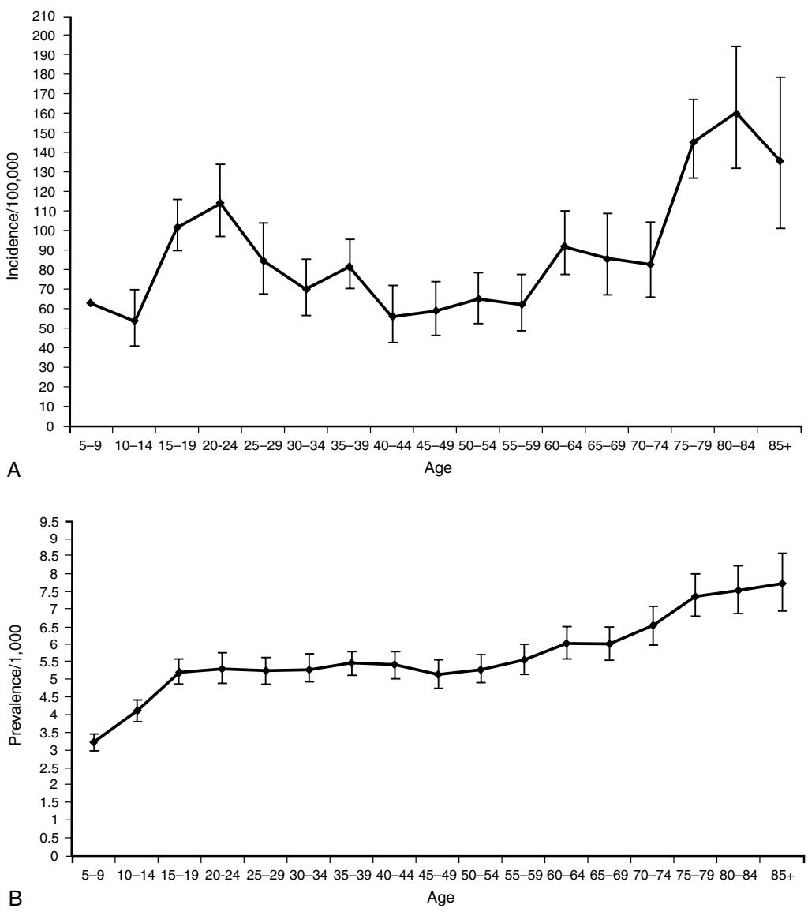
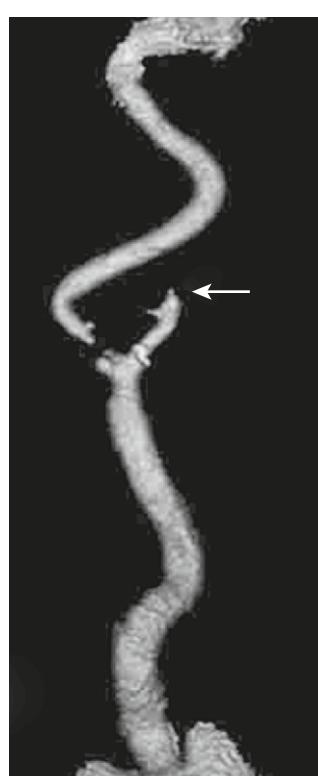
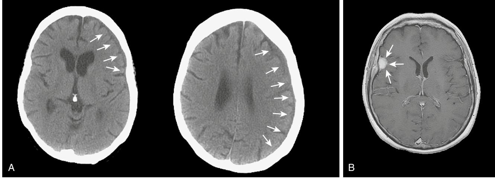
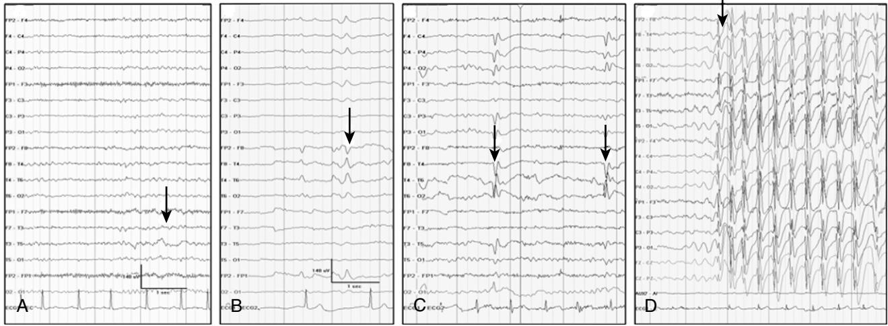

# Epilepsy

# **INTRODUCTION**

Epilepsy is a common cause of morbidity and mortality. Epilepsy is not thought of as a disease of old age in the same way as cerebrovascular or neurodegenerative conditions, probably because of the presence of other comorbidities and complex etiologic factors and a less visible socioeconomic burden compared to adults of working age. Epilepsy in the elderly presents greater diagnostic difficulty than in the young. Management considerations include the presence of concomitant disease, altered drug handling, polypharmacy, social isolation, and lack of access to specialist investigation or treatment.

Epileptic seizures are typically brief and transitory. They cause disability because of the unpredictable nature of attacks, the risk of injury they bring, and the neurologic impairment from repeated seizures and adverse effects of treatment.1 Driving is restricted, and there is social embarrassment, stigma, and impact on employment.2–4 Fundamental questions regarding the neurobiology of epilepsy, reasons for its development, what makes a seizure start and stop, and the variable responses to treatments remain unanswered.

Epilepsy in the elderly needs special consideration.5 The older person presenting with attacks that might be epilepsy can present a considerable clinical challenge.6 Diagnosis rests on the history of events obtained from the patient and a reliable witness. There are rarely clinical signs that can be elicited in clinic to support the diagnosis, and tests can be normal or show nonspecific abnormalities that catch the unwary. The differential diagnosis of collapse or altered consciousness in the elderly is wide. A previous diagnosis of epilepsy made earlier in life, either as a child or an adult, should not be assumed to explain new or ongoing attacks and the term *known epileptic* should be avoided.

Older people with a diagnosis of epilepsy can be considered as falling into four groups:

- 1. Those with new onset seizures in late life
- 2. Those with an established diagnosis of epilepsy with seizures persisting or recurring in late life
- 3. Those with new onset attacks in late life that have been misdiagnosed as epilepsy
- 4. Those with an established diagnosis of epilepsy with new or ongoing attacks that are not due to epilepsy

### **DEFINITION**

An epileptic seizure is the clinical manifestation of an abnormal synchronous neuronal discharge. Epilepsy is defined as a tendency to recurrent epileptic seizures. A diagnosis of epilepsy is not appropriate after a single event.7 In the elderly, the likelihood of further seizures after a first is more likely as a result of a higher incidence of seizures resulting from a structural brain lesion.8–10 The ability to predict the individual who will develop epilepsy after a first seizure still remains insufficient to warrant the label or treatment.

Khalid Hamandi

# **EPIDEMIOLOGY**

Epilepsy is the third most common neurologic condition in old age after dementia and stroke.11 The incidence is two to three times higher than that seen in childhood.6 A community study, the United Kingdom General Practice Survey of Epilepsy and Epileptic Seizures, found that 24% of newly diagnosed cases of definite epilepsy occurred in patients over 60 years old.9,12 A significant rise in incidence with increasing age has been confirmed by a number of studies, from an overall incidence of 50/100000 to 70 to 80 per 100,000 in the over 60s and 160 per 100,000 in the over 80s13–18 (Figure 59-1). The prevalence of epilepsy is generally taken as between 5 and 10 cases per 1000 persons, with a lifetime prevalence of 2% to 5%.19 Rates are dependent on case ascertainment and agreement on definitions used, for example, definite active epilepsy (ongoing seizures) versus those on treatment.20

In light of these figures, there would appear to be relative under provision in specialist care for the elderly with epilepsy, in research and in treatment trials. The reasons are unclear, whether they relate to a lesser perceived impact on lifestyle compared to younger patients with epilepsy or that associated or unrelated comorbidities leave epilepsy low down on a list of other medical conditions.21

### **CLASSIFICATION**

Epilepsy classification is often thought of as complex and hard to follow. This need not be the case if the principles behind the classification are understood. The current classification of epilepsy was developed by the Commission on Classification and Terminology of the International League against Epilepsy (ILAE).

There are two parallel schemes, one for epileptic seizures22 and another for epilepsy syndromes.23

There are a number of areas of confusion in classification encountered in the nonspecialist setting. Typically these arise from the use of outdated terminology or failing to distinguish between terms intended to describe seizure types and those intended to designate epilepsy syndromes or some etiologic substrate. Accurate syndromic classification helps direct treatment decisions and inform on prognosis. Classification is also important for epidemiologic studies and service needs assessments. Furthermore, rigorous attempts at classification benefit the whole diagnostic process and reduce or identify previous epilepsy misdiagnoses. A good understanding of epilepsy syndromes that present in childhood or early adult life remain useful when dealing with elderly patients in that seizures risk can persist throughout life, patients may carry a diagnostic label that may not be correct, and questions regarding the continuation of long-standing medication may be raised.

Epilepsy is not a specific disease but a heterogeneous group of disorders manifesting the neuroanatomic and pathophysiologic substrate causing the seizures.

The latest proposals from the ILAE suggest five parts or "axes," organized in a hierarchical fashion allowing the

Figure 59-1. A, Age-specific incidence of treated epilepsy per 100,000 persons. B, Age-specific prevalence of treated epilepsy per 1000 persons. *(From Wallace H, Shorvon S, Tallis R. Age-specific incidence and prevalence rates of treated* epilepsy *in an unselected population of 2,052,922 and age-specific fertility rates of women with epilepsy*. *Lancet 1998;352:19–26, with permission.)*

integration of available and new information. The five axes are as follows:

- Axis 1: Ictal phenomenology. Describing in detail the ictal event (Table 59-1).
- Axis 2: Seizure type. Localization within the brain and precipitating stimuli for reflex seizures should be specified when appropriate.
- Axis 3: Syndrome. With the understanding that a syndromic diagnosis may not always be possible.
- Axis 4: Etiology. This includes a specific disease, genetic defects, or pathologic substrates causing seizures.
- Axis 5: Impairment. This optional but often useful additional diagnostic parameter can be derived from an impairment classification adapted from the World Health

### Organization International Classification of Disease (WHO ICD10).

It remains to be seen whether this five axis scheme will be widely adopted and other axes have already been proposed.24 The long-running debate of how best to classify epilepsy continues.25

# **Shortcomings of the classification scheme**

Changing lists of descriptive entities inevitably cause confusion. A simplified system based on etiology rather than descriptive terminology is suggested by some, particularly with advances in imaging and genetics.26 Perhaps the main shortcomings of the ILAE classification schemes are its poor dissemination among nonepilepsy specialist health care professionals. Revisions in the classification scheme and the

### **Table 59-1. ILAE Task Force Seizure Classification**

#### **Generalized Seizures**

- Tonic-clonic seizures (includes variations beginning with a clonic or myoclonic phase)
- Clonic seizures
- Without tonic features
- With tonic features
- Typical absence seizures
- Atypical absence seizures
- Myoclonic absence seizures • Tonic seizures
- Spasms
- Myoclonic seizures
- Massive bilateral myoclonus
- Eyelid myoclonia
- Without absences
- With absences
- Myoclonic atonic seizures
- Negative myoclonus
- Atonic seizures
- Reflex seizures in generalized epilepsy syndromes
- Seizures of the posterior neocortex
- Neocortical temporal lobe seizures

### **Focal Seizures**

- Focal sensory seizures
- With elementary sensory symptoms (e.g., occipital and parietal lobe seizures)
- With experiential sensory symptoms (e.g., temporo parieto occipital junction seizures)
- Focal motor seizures
- With elementary clonic motor signs
- With asymmetrical tonic motor seizures (e.g., supplementary motor seizures)
- With typical (temporal lobe) automatisms (e.g., mesial temporal lobe seizures)
- With hyperkinetic automatisms
- With focal negative myoclonus
- With inhibitory motor seizures
- Gelastic seizures
- Hemiclonic seizures
- Secondary generalized seizures
- Reflex seizures in focal epilepsy syndromes

rationale behind them tend to be published in specialist journals and as such remain relatively inaccessible to the nonepilepsy specialist. Given that epilepsy is so commonly encountered, this is one area that should be addressed.

The terms *grand mal* and *petit mal* are still commonly heard. Although they may provide a vague reference to a seizure type, they give little indication of the true seizure semiology, the possible pathophysiology, or even a secure diagnosis. Patients may use the term *grand mal* to refer to either a complex partial seizure or a generalized tonic clonic seizure. Similarly, *petit mal* can be used to refer to any brief alteration of consciousness, without further appropriate history to attempt to define the event further.

Despite the shortcomings in epilepsy classification, those involved in the care of patients with epilepsy or episodes that might be attributed to epilepsy should familiarize themselves with the current scheme and in particular the principles behind it.

# **EPILEPTIC SEIZURES**

The international classification of epileptic seizures (ICES) was developed by a panel of international experts examining video recordings of clinical and electroencephalographic seizures.22 As such it is based on a consensus of opinions. Table 59-1 shows the current recommended classification of epileptic seizures. By design, the categories are descriptive. The first level of this system distinguishes between generalized seizures, a seizure whose initial semiology indicates, or is consistent with, involvement of entire cerebral hemispheres, and focal onset seizures, a seizure whose initial semiology indicates, or is consistent with, initial activation of only part of one cerebral hemisphere.

### **Generalized seizures**

Generalized seizures are divided into absence, myoclonic, tonic, clonic, or tonic-clonic events. Absence seizures can be divided into typical absence and atypical absences. Typical absences are seen in idiopathic generalized epilepsy (discussed later). They occur in childhood onset syndromes but can persist into old age. Typical absence seizures of childhood used to be referred to as *petit mal;* however, this term should now be considered obsolete. They consist of an alteration of consciousness, occasionally there is associated eye flickering but other motor manifestations are rare; attacks are brief, usually less than 30 seconds. Characteristic electroencephalography (EEG) findings are of generalized spike wave discharges of 3 to 5 Hz. Myoclonic jerks are brief muscular jerks affecting limbs and less commonly trunk. The term *myoclonic jerk* comes under the heading of generalized seizures; however, myoclonic jerks do occur in focal epilepsy, affecting one limb or side; strictly following the ILAE scheme would classify these as focal motor seizures.

# **Focal seizures**

Focal seizures are separated into motor, somatosensory or special sensory, autonomic, and psychic. The term *localization related,* previously proposed for focal seizures, is cumbersome and not widely adopted; the terms *focal* or *partial* remain in more common use. For the past few decades, focal seizures have been separated into simple partial seizures (consciousness is preserved, with maintained awareness) or complex partial seizures (consciousness is lost). The preservation or loss of consciousness is very relevant in the clinical setting, indicating a level of impairment caused by seizures. A seizure aura, often taken to be the warning before a seizure, is a simple partial seizure that may immediately precede a complex partial seizure or secondary generalization. Auras can occur in isolation (i.e., a simple partial seizure). Auras are typically short lived—over a few seconds to minutes but rarely longer.

### **TEMPORAL LOBE SEIZURES**

Temporal lobe seizures are perhaps the most familiar of all focal seizure types. Seizures either arise from mesial temporal structures, part of the limbic system (e.g., the hippocampus), or from the temporal neocortex. Symptoms at onset include epigastric discomfort, "butterflies" or a rising sensation, abnormal taste, experiential phenomena such as déjà vu, and psychic features, fear, or euphoria; these symptoms are usually short lived of a few seconds to minutes and can occur in isolation without progression to loss of awareness of secondary generalization. Patients will often recall these initial symptoms as seizure auras. A complex partial seizure of temporal origin will typically manifest with orofacial automatism—lip smacking or repeated swallowing. This is an extremely useful piece of history from a witness and specific inquiry is helpful. In addition, there may be limb automatisms and typically there is dystonic posturing. Patients typically feel tired with the need to sleep after an attack.

#### **FRONTAL LOBE SEIZURES**

Frontal lobe seizures vary greatly because of the size of the frontal lobe and widespread functions it subserves. The semiology of frontal lobe seizures depends on the origin and spread of the epileptogenic focus.27 The frontal lobe contains the primary motor cortex, supplementary motor cortex, prefrontal cortex, and limbic and paralimbic cortices.

In general, frontal lobe seizures manifest with prominent motor manifestations. There may be forced head version or forced eye deviation. Limb involvement can include tonic, clonic, or postural movements or bilateral vigorous motor automatisms—for example, bicycling. Sometimes bizarre motor movements are seen; occasionally patients can retain consciousness even with jerking in all four limbs; these features can lead to an incorrect diagnosis of nonepileptic seizures. A "Jacksonian march" refers to a march or spread of the focal motor seizure in a predictable and sequential manner from a distal limb to proximal areas or from leg to arm. The term *Todd paresis* refers to a transient hemiparesis that can last a day or more occurring after a secondary generalized focal motor seizure.

#### **OCCIPITAL SEIZURES**

Occipital onset seizures manifest as would be expected with visual phenomena. Typically these are vivid or formed hallucinations. They are distinct from migraine aura in that colors are vivid and they evolve over seconds rather than the several minutes of a migraine aura. They may involve flashing balls of light or revolving bright colors. Other manifestation include well-formed hallucinations, again these are short lived of seconds to minutes and may evolve to secondary generalized seizures.

#### **PARIETAL SEIZURES**

Parietal lobe seizures are rare. For a review see reference.28 The parietal lobes are involved in the processing and integration of sensory and visual information. Stereotyped episodes that involve pain, numbness and tingling, heat, or pressure sensations suggest parietal lobe seizures.

### **EPILEPSY SYNDROMES**

The international classification of epilepsy syndromes and epilepsies (ICEES)23 supplements the ICES. Some epilepsy categories represent pure disease entities, whereas others represent a spectrum of clinical forms (e.g., idiopathic generalized epilepsy).

The dichotomy between generalized and focal is retained in the syndrome classification. The next classification level takes into account known or suspected etiology: symptomatic, with a known underlying cause; idiopathic, occurring without known underlying disease. Two further categories are recognized, one of epilepsies and epilepsy syndromes where categorization into focal or generalized is not possible because of a lack of clearly distinguishing features often the case with nocturnal seizures, and another for seizures associated with a specific situation, fever, drugs, and metabolic disturbance (i.e., provoked seizures).

### **Idiopathic generalized epilepsy**

Idiopathic generalized epilepsy (IGE) is characterized by one or more of the following seizure types: typical absences, myoclonic jerks, and generalized tonic-clonic seizures (GTCS); interical and ictal generalized spike or polyspike; and wave on EEG. Further syndromic subclassification of IGE is made on the prevalence of the different seizure types and EEG features. Some propose the inclusion of age of onset and diurnal seizure patterns. The main subgroups seen in adults with epilepsy are as follows:

- Juvenile myoclonic epilepsy (JME)
- Juvenile absence epilepsy (JAE)
- Epilepsy with generalized tonic clonic seizures on awakening (EGTC)

It remains debated whether different clinical manifestations represent different ends of a biologic continuum or a group of distinct syndromes.29 The typical onset age of onset of IGE is childhood or in early adult life; however, a later onset form is recognized;30,31 and there are case reports of classical IGE presenting for the first time in the elderly.32,33

The term *idiopathic* refers to a disorder unto itself, *sui generis* (i.e., without other neurologic abnormality) and *not* etiology unknown. The risk of seizures in IGE usually continues into old age. A late presentation of absence status in four patients over age 60 with a prior diagnosis of IGE and absence seizures that resolved in their second decade has been reported.34 Response to appropriate antiepileptic drug treatment is good in most, but not all. One study of epilepsy patients with IGE over age 60 found a small subgroup who experience an exacerbation of seizures in old age.35

### **Idiopathic focal epilepsy**

The idiopathic focal epilepsies are restricted to childhood and rarely if at all persist into adult life. They are mentioned here for completeness. They are typically benign. It would be highly unusual and probably indicate an incorrect diagnosis if seizures persist into late life.

### **Symptomatic epilepsy**

Focal symptomatic epilepsy is the predominant cause of new onset seizures in the elderly.21,36 Symptomatic epilepsy means a cause is known. In the absence of an imaging abnormality, a history of prior brain injury—for example, from intracranial infection (meningitis or encephalitis) or trauma—can be sufficient to attribute a cause to new onset seizures. The term *remote symptomatic* is used for patients developing seizures some years after a significant brain injury, in contrast to acute symptomatic, where epilepsy is a presentation of new brain dysfunction.

### **Probably symptomatic (cryptogenic) epilepsy**

The term *cryptogenic* was used to classify those with epilepsy of unknown etiology. The ILAE now recommends the term *probably symptomatic.* With advances in brain imaging, the proportion of patients in this group is falling. Younger adults with normal magnetic resonance imaging (MRI) and refractory epilepsy remain a significant health burden. In the elderly, the likelihood of MRI abnormalities is high, particularly leukoaraiosis.37 The relationship of such abnormalities to epilepsy and why some develop seizures and other not remains unclear.38

### **MAKING THE DIAGNOSIS**

Epilepsy can present with disparate manifestations. Similarly, a number of other conditions present with features that may be mistaken for epileptic seizures. The key feature in epilepsy is that episodes are typically stereotyped, unchanged over a long period of time, and usually short lived. The following episodic manifestations occurring in isolation or in combination can be caused by epilepsy:

- Loss of awareness or consciousness
- Generalized convulsive movements
- Drop attacks
- Focal movements—jerks, posturing, semipurposeful movements, rarely thrashing, bicycling or motor agitation
- Sensory episodes—tingling, pain, burning
- Vocalization—formed speech, incomprehensible words, screams, or laughter
- Psychic experiences
- Episodic phenomena from sleep
- Prolonged confusion or fugue state

The importance of a careful history in making a diagnosis of epilepsy cannot be overstated. This should include a description of events from the patient and crucially a firsthand witness description. Overreliance on a secondhand statement of "it looked like a fit" is likely to lead to misdiagnoses. There is no single test to make a diagnosis of epilepsy, and time taken by an experienced clinician in taking a careful history cannot be circumvented. In each case, an account of the circumstances, time of day, situation, prodrome or warning, detailed account the attack, its semiology and duration, the rate and nature of recovery, and associated symptoms or signs—for example, headache or confusion—are needed.

Direct questions about the attack itself and other previous attacks are helpful but care should be taken not to lead the history, and these questions are best left until the patient and witness have given a free account of the event or events in question. Useful features that are worth inquiring about directly if not first offered include head or eye deviation, the nature of limb movements, posturing, jerks, or automatisms, and whether movements are rhythmic or synchronous and how they evolve over time. Asking a witness about repeated swallowing or lip smacking can be revealing. Any changes of color, breathing pattern, or sweating need to be ascertained along with an account of the recovery period, its duration, and any subsequent symptoms such as headache, confusion, or altered behavior. It is always useful to ask about possible prior attacks that the patient may not associate with the current event—for example, a patient presenting after his or her first generalized tonic clonic seizure may not make the link between previously experienced simple partial seizures. Classically tongue biting and incontinence were thought to strongly indicate an epileptic seizure. This is not always the case. Urinary incontinence can occur during syncope. Injury to the tip of the tongue can occur in syncope, although if the sides of the tongue or inner cheek are severely bitten then this usually indicates that a generalized tonic clonic seizure has taken place.39

The past medical history should include inquiries about previous history of head injury or intracranial infection, and cardiac history. Family history, medication history, and social history are important as in any other presentation. Specific inquiry should go into living arrangements, driving, occupation, and hobbies or pastimes.

# **DIFFERENTIAL DIAGNOSIS**

The two main differential diagnoses of epileptic seizures to consider are syncope and psychogenic or nonepileptic attacks. Manifestations of both epileptic seizures and syncope may differ in the elderly compared to the young, making diagnosis difficult or increasing misdiagnosis. Other more rare conditions leading to blackouts or altered consciousness to consider are hypoglycemia, other metabolic disorders, structural abnormalities at the skull base affecting the brain stem, and lesions affecting cerebrospinal fluid circulation. Transient cerebral ischemia or transient ischemic attacks (TIAs) are usually easily separated from epileptic events by their frequency and time course. They rarely present with loss of consciousness, and TIAs are typically less frequent and do not remain stereotyped over long periods of time. One exception are focal "seizures" affecting the hand seen in critical cortical ischemia; this is described in more detail later in this chapter.

### **Syncope**

Syncope is the most common cause of episodes of loss of awareness. Syncope is covered in greater detail in Chapter 46. Aspects of an attack should not be taken in isolation and given undue emphasis, as elements of epileptic seizures can occur in syncope. Key features of syncopal episodes versus epileptic seizures are the precipitating factors, warning symptoms, a brief loss of consciousness, and rapid recovery, although there can be greater variation in older people (see Table 59-2). Features that may mimic seizures include head turning, automatisms and urinary incontinence, and relatively minor tongue biting.40 Injury can occur from a syncopal fall, although this is less common as people tend to crumple to the floor rather than experience the stiff fall of an epileptic seizure.

In cardiac syncope, attacks occur without warning; there is abrupt unprovoked collapse with brief unconsciousness and rapid recovery. The attacks are not situational, and there is less often a prodrome than in vasovagal syncope. Cardiac syncope should be strongly suspected in those with a history of structural heart disease, previous myocardial infarction, rheumatic fever, or heart murmur.

### **Psychogenic attacks**

Episodes that outwardly appear similar to epileptic seizures but are not caused by ictal electrical discharges in the brain are referred to by a number of terms: nonepileptic attacks (NEA), nonepileptic seizure (NES), psychogenic nonepileptic attacks or seizures (PNEA) or (PNES), or the less favored pseudoseizures.41 The prevalence of PNEA appears less in the elderly, although no studies have looked at ascertainment or reporting bias. In a study of video-EEG monitoring in the elderly (>60), PNEA was diagnosed in 10 of 34 patients who had recoded events during the monitoring period;42 this series came from 71 patients over 60 years of age who had

|                     | USUAL DIFFERENCE                                          |                                                               |                                                                                                                                                 |
|---------------------|-----------------------------------------------------------|---------------------------------------------------------------|-------------------------------------------------------------------------------------------------------------------------------------------------|
| Features            | Faints                                                    | Fits                                                          | Modification in Older Patients                                                                                                                  |
| Posture             | Usually occur in the upright position                  | Not position dependent                                        | Faints in older people are not always position dependent because they are often the result of significant, position independent pathology |
| Onset               | Gradual                                                   | Sudden                                                        | Loss of consciousness may be quite abrupt in syncope in an older person; complex partial seizures may have a gradual onset                |
| Injury              | Rare                                                      | More common                                                   | A syncopal attack may be associated with significant soft tissue or bony injury in an older person                                           |
| Incontinence        | Rare                                                      | Common                                                        | An individual prone to incontinence may be wet during a faint; partial seizures will not usually be associated with incontinence          |
| Recovery            | Rapid                                                     | Slow                                                          | A fit may take the form of a brief (temporal lobe) absence; a faint associated with a serious arrhythmia may be pro longed                |
| Postevent confusion | Little                                                    | Marked                                                        | A prolonged hypoxic episode as the result of a faint may be associated with prolonged postevent confusion                                    |
| Frequency           | Usually infrequent with a clear precipitating cause | May be frequent and usually without precipitating cause | Faints associated with cardiac arrhythmias, low cardiac out put, postural hypotension, or carotid sinus sensitivity may be frequent       |

|  | Table 59-2. Features that Help Distinguish Syncope from Epileptic Seizures |  |  |  |  |  |
|--|----------------------------------------------------------------------------|--|--|--|--|--|
|--|----------------------------------------------------------------------------|--|--|--|--|--|

undergone video EEG monitoring out of a total of 440 over a 7-year period. Another study43 found a diagnosis of PNEA was made 7 of 16 patients over 60 years of age undergoing video-EEG monitoring, this from a total of 834 admitted for long-term video-EEG monitoring. Further study of longterm video EEG monitoring over an 8-year period identified 39 patients over the age of 60 who were admitted for evaluation, 13 of whom were diagnosed with PNEA on the basis of video EEG.44 Nevertheless PNEA remains an important differential diagnosis in the elderly, particularly when apparent medically refractory epilepsy is encountered.45

PNEA probably arises as a result of patients responding to psychosocial stress with unexplained somatic symptoms that come to medical attention,46 and PNEA is associated with a number of distinct pathologic personality profiles that could be used to tailor therapy.47 Somatoform disorders, anxiety disorders, mood disorders, and reinforced behavior pattern are all features associated with PNEA. In one study, a subgroup of elderly patients were described who had PNEA that presented over the age of 55; they were more likely to be male and more likely to have a history of traumatic experience related to ill health.48 Suspicion of PNEA should be raised where there are unusual features to attacks, associated physical or mental ill health, adverse social circumstances, or bereavement before presentation. Confidently securing a diagnosis of PNEA usually requires long-term video-EEG monitoring, an investigation that would appear to be of limited access to the elderly population in most centers.

The Cochrane database review in 2007 found insufficient evidence to recommend specific treatments for PNEA and stressed the need for randomized trials to assess treatment interventions.49 One of the first aims of treatment once a diagnosis is made should be to reduce unnecessary medical interventions or hospital admissions.

### **Transient epileptic amnesia**

Transient epileptic amnesia (TEA) has been used to describe recurrent episodes of transient amnesia in the absence of overt seizures.50 TEA needs to be distinguished from transient global amnesia (TGA) (discussed later). In TEA, there is evidence for a diagnosis of epilepsy based on one or more of EEG abnormalities, co-occurrence of other clinical features of epilepsy (for example, automatisms or olfactory hallucinations), and clear-cut response to antiepileptic medications.51 Other features include interictal memory disturbance manifest by accelerated forgetting, remote autobiographic amnesia (i.e., patients demonstrate a patchy but dense loss of memories for important personal events from the remote past), and topographical amnesia (i.e., patients have difficulty navigating their way around new or familiar routes).52,53 It is not clear whether episodes of TEA represent ongoing ictal activity or a postictal phenomenon. Whether TEA is a sufficient diagnostic entity to be regarded as a distinct syndrome50 or another manifestation of temporal lobe seizures in the elderly remains to be seen.

### **Transient global amnesia**

Transient global amnesia (TGA) is a condition of transient loss of memory function that has been described for over 40 years.54,55 It is most common in middle to late life. Episodes of TGA have a characteristic presentation. There is usually, but not always, a history of provoking factors; these can include one or more of the following: vigorous exercise, acute emotional stress, or change in temperature. During an attack, patients appear mildly agitated and repeatedly question or engage in searching behavior. Attacks typically last several hours, but less than 24 hours. During an attack, patients retain self-awareness and long-term memory and can perform familiar task or navigate a familiar environment but appear unable to lay down any new memories and appear amnesic of all recent events during the attack. Once an attack is over, patients regain some memory around the event but remain amnesic for the central period of the episode. Attacks are usually isolated, but there is a 6% recurrence rate. The clinical presentation is usually so characteristic that once seen it is not easily mistaken for epilepsy. There is no evidence to support an epileptic etiology or transient arterial ischemic events.56 A popular hypothesis is that of venous congestion in bilateral temporal lobes as a result of internal jugular vein valve insufficiency and sudden rises in intrathoracic pressure.57

If attacks are recurrent, have associated features (e.g., automatisms), and symptoms of memory impairment outside an attack, the diagnosis of transient epileptic amnesia should be considered.

### **Psychogenic amnesia**

Psychogenic amnesia or dissociative fugue is rare and typically triggered by stressful or adverse life events. Careful clinical evaluation may reveal inconsistencies in the presentation that alert the practitioner to a conversion disorder. Features include extensive loss of autobiographic memories, including self-identity, in the context of preserved new learning and absence of repetitive questioning, and the ability to continue normal activities of daily living.

### **Parasomnias**

Parasomnias are disorders that manifest around or during sleep. They are sometimes mistaken for epileptic seizures. The classification of parasomnias is changing as new information emerges.58 They include REM parasomnias and periodic limb movements. An accurate history is usually sufficient to distinguish these form epilepsy, and occasionally video monitoring can be helpful.

### **Transient ischemic attacks**

TIA symptoms tend to be negative (i.e., a loss of function). Epileptic seizures invariably produce positive symptoms. One rare exception is that of apparent focal motor seizures caused by critical cortical ischemia from carotid artery stenosis, or shaking limb TIA (SLTIA) (Figure 59-2). First described in 1962,59 a handful of cases of SLTIA are reported in the literature.60–62 Events involve shaking of usually the upper limb that does not spread to the face. Episodes can be short lived or prolonged. They are typically provoked by maneuvers that appear to decrease cerebral perfusion, such as rising from a bed or a chair, or hyperextending the neck. Shaking does not respond to antiepileptic medication or benzodiazepines. The EEG during attacks is normal. The abnormal movements respond to measures that restore adequate cerebral perfusion (i.e., carotid endarterectomy or correcting relative hypotension). Single photon emission tomography studies (SPECT) support the hypothesis that SLTIAs are due to hypoperfusion rather than recurrent thromboembolic events.63

### **OTHER CONSIDERATIONS Convulsive status epilepticus**

Convulsive status epilepticus (CSE) is defined as ≥30 minutes of either continuous seizure activity or consecutive seizures without regaining consciousness between them. CSE has a bimodal distribution with highest rates in infants and the elderly. It is associated with a significant morbidity and mortality. Increasing age and underlying etiology are predictors of higher mortality.64–66 Acute or remote stroke is a common cause of status epilepticus (SE) in the elderly.67,68

CSE is a medical emergency. Treatment algorithms for CSE are the same for the elderly as for younger adults.69 There may be local variation on treatment algorithms, but general principles are similar. Those treating medical patients in the acute setting should familiarize themselves

Figure 59-2. A CT angiogram in a 79-year-old patient with recurrent episodes of right arm shaking, worse on standing; shows occlusion of the left internal carotid artery.

with local guidelines. Initially, general resuscitation measures are required; drug treatment should start as soon as the diagnosis is suspected with intravenous benzodiazepines; care should be taken to avoid respiratory depression, particularly in the elderly. If there is no response to intravenous benzodiazepines, the next drug of choice is usually phenytoin, given as an infusion, with an initial loading dose. If there is a failure to respond to phenytoin, sedation with an anesthetic agent is necessary. Concurrent EEG monitoring is essential, in conjunction with a search for an underlying cause. Sedation is usually maintained for at least 24 hours while therapeutic levels of an anticonvulsant are instigated.

### **Nonconvulsive status epilepticus**

Nonconvulsive status epilepticus (NCSE) is relatively common, making up a third of all cases with SE. It increases in incidence with age.70 In the elderly it also more difficult to diagnose, presenting as an acute or subacute prolonged confusional state. The presentation can be subtle. A high index of suspicion is required, and EEG essential to make the diagnosis.71 In the absence of coma, aggressive treatment should be avoided. A prospective study of 25 elderly patients with NCSE found that treatment with intravenous benzodiazepines was associated with an increased risk of death, and admission to the intensive care unit prolonged hospital stays without improving the outcome.72 NCSE should be considered in those who suffer neurologic deterioration after a stroke or subarachnoid hemorrhage.73,74 NCSE is an EEG diagnosis. EEG criteria for NCSE continue to be developed.75

### **Sudden unexplained death in epilepsy (SUDEP)**

Sudden unexplained death in epilepsy (SUDEP) is a term used when sudden death occurs in someone with epilepsy with no obvious cause of death found at postmortem.76 It accounts for 7% to 17% of epilepsy deaths.77 It seems likely that either cardiac or respiratory arrest in the context of a generalized tonic clonic seizure causes SUDEP, with the etiology being patient and seizure dependent.77

Risk factors for SUDEP include the presence of generalized tonic clonic seizures, being alone in bed during a seizure, severe epilepsy, structural brain lesion, and younger onset of epilepsy and young age.78 Reporting bias might explain the last two factors. Sudden death in the elderly is not necessarily an unusual occurrence. By definition SUDEP requires that no other cause of death is found at postmortem. Attributing sudden death in the elderly to SUDEP is unlikely in the presence of other comorbidities, whereas sudden death in the otherwise healthy young with epilepsy is a matter that generates the fullest investigation. It is not known whether the same mechanisms for SUDEP operate across all age groups, with the elderly equally susceptible, or that the elderly are somehow immune from this condition. How to measure its occurrence in the elderly may prove difficult.

### **ETIOLOGY Cerebrovascular disease**

Cerebrovascular disease is the most common cause for epilepsy in the elderly;79 it accounts for 30% to 50% of epilepsy cases in the elderly36 and 75% of symptomatic epilepsies. Poststroke seizures and epilepsy are considered as early, occurring within 2 weeks of stroke, or late, occurring after 2 weeks. A large study of 6044 hospital admissions with acute stroke found 3.1% had epileptic seizures within 24 hours of the stroke and 8.4% had seizures within the first 24 hours after subarachnoid hemorrhage (SAH) or intracerebral hemorrhage (ICH).80 In the United Kingdom national general practice study of epilepsy and epileptic seizures (NGPSE), the standard mortality ratio was highest for those with epilepsy and cerebrovascular disease.81

Cortical involvement of infarct is predilection for developing seizures, and there may be an association with the site of infarction and development of epilepsy.82 In a large multicenter study, a worse outcome and increased in-hospital complication rate was associated with prophylactic antiepileptic drug use after SAH.83 Patients who suffer status epilepticus (SE) of cerebrovascular etiology were found to have twice the risk of death at 6 months than patients with stroke and not SE,84 although the independent effect of SE on mortality after stroke is controversial.85

### **Cerebral tumors**

The elderly patient with new onset seizures should have cerebral imaging to exclude a structural cause (see Figure 59-3). Benign tumors (e.g., meningiomas) can also present with epilepsy. Surgery for these tumors depends on their location and the age of the patient. Typically, meningiomas are indolent; however, they can be slow growing and there is a small risk of malignant transformation of benign meningiomas that favors surgery in younger patients with peripheral lesions. Epilepsy from malignant tumors is rarely seen in the specialist setting, although seizures can be particularly refractory to treatment.

### **Neurodegenerative disease**

Alzheimer's disease is associated with a six-fold increase in unprovoked seizures.86 The history of seizures in these cases invariably needs to be form the caregiver. A further study found that 21% of a patients developed seizures after a diagnosis of dementia of Alzheimer type.87

### **Other causes**

Any structural, inflammatory, immune, or vascular intracerebral process can lead to epileptic seizures. Other causes include trauma; intracranial infection, in particular herpes simplex encephalitis and pneumococcal meningitis; subdural hematoma, paraneoplastic syndromes; limbic encephalitis; and malformations of cortical development (see Figure 59-3).

### **Provoked seizures**

One or even more provoked seizures do not require a diagnosis of epilepsy. Provoked seizures can be caused by metabolic or toxic disturbance. It is important to recognize provoked seizures, as these typically do not warrant treatment with antiepileptic drugs and driving eligibility may vary.

### **INVESTIGATION**

In the elderly, routine hematology, biochemistry, plasma glucose, calcium, and liver function should be checked. The mainstay of investigation includes the ECG, EEG, and neuroimaging. Particular attention should be paid to the effect of "normal" aging on brain imaging and neurophysiology. This includes atrophy on computed tomography (CT), atrophy and nonspecific white matter change on MRI, and EEG slowing.

### **Electrocardiography**

Electrocardiography (ECG) is a simple, quick, inexpensive, and noninvasive test. It should be performed in all patients presenting for the first time with an episode of loss of consciousness, even if the history is strongly suggestive of an epileptic seizure The ECG should be examined in detail for evidence of conduction abnormalities.88 More advanced investigation for cardiac or vasovagal syncope should also be considered depending on the history (see Chapter 46).

### **Electroencephalography**

The EEG should be used judiciously. It is a primary tool in the investigation of epilepsy. Nevertheless, the diagnosis of epilepsy remains a clinical one with EEG playing a supporting role. It is not appropriate as a screening tool or means of excluding epilepsy in those with suspected syncope.89 The indiscriminate use of the EEG and its reporting and can lead to an overdiagnosis of epilepsy.90 The interpretation of EEG requires a skilled neurophysiologist. Nonspecific findings can catch the unwary (Figure 59-4). The gold standard for classifying seizure is simultaneous video-EEG monitoring. Facilities for this monitoring are rarely available in the elderly care setting.

Figure 59-3. Causes of epilepsy. A, CT head showing a subdural hematoma in a 68-year-old woman presenting with focal motor seizures affecting her left hand. B, Gadolinium enhanced T1-weighted axial MRI showing right temporal meningioma presenting with simple partial seizures in a 60-year-old woman.

Figure 59-4, EEG features. A, Left temporal slow activity, a nonspecific feature. B, Right temporal sharp waves in 78-year-old man supporting a diagnosis of complex partial seizures. C, Focal spikes in a teenager with Benign epilepsy with centrotemporal spikes. D, Generalized spike wave activity in a young adult with IGE, an unequivocal "epileptiform" discharge.

Long-term video-EEG is useful tool in the investigation of epilepsy in all ages.91–94 It is primarily used for the following indications:

- Diagnostic clarification of epilepsy versus nonepileptic attacks
- Localization of seizure onset (of practical utility only in younger patients being considered for epilepsy surgery)
- Determination of seizure frequency in suspected partial or nocturnal seizures

It is notable that in published series on the utility of video-EEG on the elderly from large epilepsy centers, patients over the age of 60 make up only 2% to 17% of adult admissions to the monitoring units.92–95

### **Neuroimaging**

The two standard neuroimaging modalities used in epilepsy are computerized tomography (CT) and magnetic resonance imaging (MRI). All cases of new onset seizures in adults should have brain imaging to exclude a structural lesion. The choice of CT or MRI rests on the cost and practicalities of each technique versus the expected yield leading to a change in management.

CT involves the reconstruction of X-rays taken in multiple planes to produce an image, and as such involves a radiation dose. Modern CT scanners are quick and brain images are acquired within a matter of minutes. The CT bore is relatively open and only the head needs enter. CT is therefore most appropriate in the acute or emergency setting, particularly if the patient is unwell and needs close monitoring, and for patients with claustrophobia or who have difficulty lying flat. CT is superior to MRI for identifying intracranial hemorrhage and for identifying areas of calcification. MRI involves the subject lying in a strong magnetic field with superimposed time-varying magnetic field gradients. It takes longer to administer an MRI than a CT, typically 10 to 20 minutes for a full series of brain images. The subject needs to lie still for the duration of the scan as images are degraded by even a small amount of motion. The scanner bore is relatively narrow and long; patients enter the bore head first, and it covers most of the patient's body. Patients with claustrophobia or those unable to lie flat will not tolerate MRI. The advantage of MRI over CT is its much higher image resolution and tissue contrast, hence the ability to detect subtle abnormalities that might cause epilepsy; this is perhaps of more relevance in young adults with medically refractory seizures being considered for epilepsy surgery. Surgical resection of a benign lesion to treat epilepsy is rarely advantageous in the elderly, and the pursuit of subtle benign lesions causing epilepsy is unlikely to alter management in the elderly.

### **ANTIEPILEPTIC DRUG THERAPY**

To the nonspecialist, there can be a bewildering array of new drugs to treat epilepsy. Twelve antiepileptic drugs (AEDs) have been developed and licensed worldwide since 1989. By convention, drugs that were available before this time are known as standard AEDs and those that became available after 1990 are called new AEDs. A number of further AEDs are in various stages of the development pipeline, some well advanced in phase 3 trials96 and likely to add to the evergrowing list. Studies of AEDs in the elderly, however, are scant,36 and those that exist tend to concentrate on the young elderly (aged 65 to 74).97 Benefits and side effects tend to be extrapolated from studies in younger patients. Key points to consider when prescribing AEDs in the elderly are increased risk of side effects; drug-drug interactions; and altered protein binding, hepatic metabolism, and renal clearance; also, a careful review of already prescribed drugs is needed. When commencing a new AED, a low starting dose and slow titration are recommended.

Standard AEDs are acetazolamide, carbamazepine, clobazam, clonazepam, ethosuximide, valproic acid, phenobarbital, phenytoin, and primidone. The new AEDs are gabapentin, felbamate, lamotrigine, levetiracetam, oxcarbazepine, pregabalin, rufinamide, tiagabine, topiramate, vigabatrin, and zonisamide. Of these, felbamate and vigabatrin should not be used because of the risk of severe adverse effects, namely, potentially fatal liver failure or aplastic anamia with felbamate and retinal damage with irreversible visual field constriction with vigabatrin. These adverse effects were not recognized until a few years following the drugs' widespread use and highlight the need for postmarketing surveillance and adverse reaction reporting in all new drugs. Standard and new AEDs commonly used in adults are summarized in Table 59-3.

The currently recommended first-line AEDs are valproic acid for generalized epilepsy and carbamazepine or lamotrigine for focal epilepsy. For many elderly patients, phenytoin still forms the mainstay of treatment.98,99 Some elderly patients with lifelong epilepsy may still be taking phenobarbital or primidone; it is not appropriate to change these for newer AEDs in patients who are stable.

The new AEDs are typically licensed as add-on therapy after randomized trials against placebo. Direct head-to-head comparisons of standard and new AEDs are lacking. Recent efforts to address this imbalance include the U.K. study of the Standard and New Antiepileptic drugs (SANAD) study, comparing sodium valproate against new AEDs in generalized seizures and carbamazepine against new AEDs in focal epilepsies. Valproic acid was found to be most effective in IGE,100 whereas lamotrigine was favored over carbamazepine for focal epilepsies.101 The trial did not include a number of later but now important AEDs—levetiracetam, zonisamide, and pregabalin—and further ongoing studies are needed.

A large multicenter study comparing lamotrigine, gabapentin, and carbamazepine in 593 elderly patients with newly diagnosed epilepsy found lower adverse events in those randomized to lamotrigine or gabapentin compared to carbamazepine, without significant difference in seizure-free rates at 12 months.102 A subsequent study comparing lamotrigine and sustained release carbamazepine in 185 patients over the age of 65 did not find a significant difference between lamotrigine and carbamazepine, but there was a trend toward greater efficacy with carbamazepine and lower adverse effects with lamotrigine.103 A smaller study found similar efficacy but better tolerability of lamotrigine over carbamazepine in poststroke epilepsy,104 and another study found switching to lamotrigine was associated with an improvement on the side-effect profile.105

### **Adverse effects**

All AEDs have side effects. These can be dose dependent or idiosyncratic. Dose-dependent side effects can be minimized by using a low starting dose with slow titration. Idiosyncratic side effects cannot be minimized, and usually necessitate rapid drug withdrawal. Idiosyncratic side effects include rash, blood dyscrasias, bone marrow impairment, liver failure, and Stevens-Johnson syndrome.

Dose-dependent side effects most commonly affect the central nervous system (CNS). They typically include dizziness; drowsiness; lack of energy or weakness; unsteadiness or incoordination; mood disturbance that includes depression, hostility, anger and irritability, and nervousness; cognitive effects that include confusion, difficulty concentrating or paying attention, abnormal thinking, speech or language problems; and difficulty falling asleep or staying asleep. Gastrointestinal side effects include nausea, abdominal pain, and diarrhea. Side effects can include frequency or urgency of micturition and effects on sexual function. Dose-dependent side effects are typically worsened by polytherapy,106 and the lowest dose of AED that controls seizures should be the aim. Taking more than three AEDs in combination is rarely helpful, and those on several AEDs should have medication rationalized as best as possible.

Patients should be cautioned specifically regarding common or potentially serious side effects (see Table 59-3). It is helpful if patients have a rapid access point or contact number for advice should side effects develop so that drugs are not either stopped suddenly or continued with potentially harmful consequences. Some side effects occur when starting or raising the dose of an AED, but these wear off after a few days. Recurrent or unpleasant side effects need to be identified and addressed early.

Long-term adverse effects include osteoporosis. Osteoporosis is more common in women taking AEDs. Measuring calcium and vitamin D levels in women taking enzymeinducing AEDs every 2 to 5 years and bone densitometry can be used to assess the risk of osteoporosis. Vitamin D and calcium supplementation can be taken in an attempt to correct any deficiencies. Bone fracture rates in epilepsy are two

|                          | Putative Mode of                                                                         | Metabolism and                                                      | Usual Starting and (Daily Maintenance |                                                                                  |                                                                                                                                         |
|--------------------------|------------------------------------------------------------------------------------------|---------------------------------------------------------------------|------------------------------------------|----------------------------------------------------------------------------------|-----------------------------------------------------------------------------------------------------------------------------------------|
|                          | Action                                                                                   | Kinetics                                                            | Dose)                                    | Adverse Events                                                                   | Key Points                                                                                                                              |
| Carbamazepine* (1963) | Sodium channel inhibition                                                             | Hepatic metabolism; active metabolite                         | 100–200 mg (400– 1800 mg)             | Idiosyncratic rash                                                               | First line for focal sei zures can worsen MJ and absences in IGE Wide drug interaction including warfarin and other AEDs |
| Clobazam                 | GABA augmentation                                                                        | Hepatic metabolism; active metabolite                         | 10 mg (10–30 mg)                         | Rarely idiosyncratic rash                                                     | More commonly used as short-term adjunct                                                                                             |
| Clonazepam               | GABA augmentation                                                                        | Hepatic metabolism                                                  | 0·5 mg (1–6 mg)                          | Rarely idiosyncratic rash                                                     | More commonly used as short term adjunct                                                                                             |
| Gabapentin (1993)     | Calcium channel modulation                                                            | Not metabolized, urinary excretion unchanged                  | 300 mg (1800– 3600 mg)                | Weight gain                                                                      | Can worsen MJ and absences in IGE impaired cognition at higher doses                                                           |
| Lamotrigine (1991)    | Sodium channel inhibition                                                             | 50% protein bound, hepatic metabolism                         | 25 mg (100–400 mg)                       | Idiosyncratic rash Rarely Stevens Johnson Syndrome                         | First line for focal sei zures. Rapidly with draw if rash occurs                                                                  |
| Levetiracetam (1999)  | Synaptic vesicle pro tein modulation                                                  | Urinary excretion                                                   | 250 mg (750–3000 mg)                     | Tiredness, mood disturbance                                                   | Mood disturbance includes irritability, short temper                                                                              |
| Phenobarbital* (1912) | GABA augmentation                                                                        | Hepatic metabolism; 25% excreted unchanged                    | 30 mg (30–180 mg)                        | Drowsiness, mood change, osteoma lacia                                     | Rarely initiated today; if withdrawal consid ered, needs to be slow                                                               |
| Pregabalin (2004)        | Calcium channel modulation                                                            | Hepatic metabolism (saturation kinetics) 90% protein bound | 50 mg (100–600 mg)                       | Drowsiness Weight gain                                                        | Can worsen MJ and absences in IGE dose-dependent side effects                                                                  |
| Primidone* (1952)     | GABA augmentation                                                                        | Hepatic metabolism                                                  | 125 mg (500–1500 mg)                     | Idiosyncratic rash                                                               | Rarely initiated; if with drawal considered, needs to be slow                                                                     |
| Oxcarbazepine* (1990) | Sodium-channel inhibition                                                             | Hepatic metabolism                                                  | 150–300 mg (900– 2400 mg)             | Idiosyncratic rash; hyponatremia                                              | Similar structure to carbamazepine                                                                                                   |
| Tiagabine (1996)         | GABA augmentation                                                                        | Hepatic metabolism                                                  | 5 mg (30–45 mg)                          | Increased seizures; nonconvulsive status                                   |                                                                                                                                         |
| Topiramate* (1995)    | Glutamate reduction; sodium-channel modulation; calcium-channel modification | Mostly hepatic metabolism, with renal excretion               | 25 mg (75–200 mg)                        | Weight loss; kidney stones; impaired cognition; word finding difficulty | Dose-dependent side effects                                                                                                          |
| Valproic acid (1968)  | GABA augmentation                                                                        | Hepatic metabolism; active metabolites                        | 200 mg (400–2000 mg)                     | Rare hepatotoxicity or encephalopathy                                         | First line for generalized seizures                                                                                                  |
| Zonisamide (1990)     | Calcium channel inhibition                                                            | Urinary excretion                                                   | 50–100 mg (200– 600 mg)               | Idiosyncratic rash                                                               | Newly licensed in United Kingdom                                                                                                     |

### **Table 59-3. Main Antiepileptic Drugs Used for Epilepsy in the Elderly and Their Key Features**

\*Induces hepatic enzymes and therefore affect plasma levels of other drugs undergoing hepatic metabolism (e.g., warfarin).

to three times that for the general population,107 and screening for bone health in epilepsy is recommended.108

### **Drug-drug interactions**

Drugs that undergo hepatic metabolism are altered by hepatic enzyme-inducing AEDs (see Table 59-3). Those with the least risk for interactions are levetiracetam, gabapentin, and pregabalin,109 although it remains to be seen how this translates in clinical practice. Enzyme-inducing AEDs should be considered carefully in patients already on medication, all prescribed drugs should be reviewed, and warfarin can be a particular concern.

There is a long-held belief that antidepressants lower the seizure threshold and are proconvulsant. There is in fact little evidence to support this view.110 Depression is common in patients with epilepsy and where present should be treated appropriately. The risk of seizures is dose dependent, and new antidepressants particularly at low doses are considered safe in most cases. Antidepressants least likely to affect AED levels are citalopram, escitalopram, venlafaxine, duloxetine, and mirtazapine.111

# **Therapeutic plasma monitoring**

With the exception being phenytoin, monitoring plasma drug levels is generally not helpful in managing AED therapy. Laboratory reference ranges are of little value in dose adjustments, which should be done according to clinical response and dose-related side effects. A cross-sectional study of 92 nursing home residents in the United States found lower serum carbamazepine doses and concentrations than those used for young adults. The daily dose was significantly lower for the oldest age group (>85),112 supporting this view. A recent review suggests situations in which therapeutic drug monitoring can be helpful.19

### **Withdrawing AEDs**

Should AEDs be withdrawn in patients with elderly-onset seizures that have been seizure free for a period of time? What about those who have taken AEDs most of their lives with seizure freedom entering old age? Studies that address drug withdrawal have been done in a younger population.113,114 Conditions that lead to an increased risk of relapse after drug withdrawal include focal epilepsy, generalized tonic clonic seizures, the presence of cerebral pathology, and an abnormal EEG. Many of these conditions apply to the elderly with new onset seizures. The severity and frequency of seizures and the patient's view on taking medication can influence decisions to withdraw AEDs. It is difficult to extrapolate recurrence risk from population studies to the individual presenting in clinic.

Worthy of special note is the older person who has been on lifelong treatment with phenobarbital or primidone. Both are barbiturates and very difficult to withdraw without potential dangerous recurrence of seizures. If withdrawal of one of these agents is being considered, then it should be with the advice of a specialist and the drug slowly titrated down over many months—for instance, 10% of the initial daily dose every 6 weeks.

### **THE IMPACT OF EPILEPSY**

Epilepsy is a chronic disease. It is associated with stigma and public misconceptions. There is no single test to confirm or refute a diagnosis of epilepsy, and misdiagnosis is a problem. Comprehensive and systematic investigation on the impact of epilepsy are lacking; however, a number issues are well characterized. A questionnaire-based survey in a small number of elderly patients with epilepsy found their main concerns to be the impact on driving and transportation and concerns about medication side effects.115 Other concerns included personal safety, social embarrassment, employment, and memory loss (Table 59-4).

In a study of more than 1000 adults with epilepsy in the United States and comparison with the U.S. Census Bureau, respondents received less education, were less likely to be employed or married, and came from lower-income households.116 Uncertainty and fear of having a seizure were listed as the worst things about having epilepsy. Lifestyle, school, driving, and employment limits were also listed as major problems, and when asked to rank a list of problems, cognitive impairment was ranked highest. A study using a health-related, quality-of-life questionnaire in the elderly found lower scores in those with epilepsy compared to those without. AED side effects and depression were felt to be the main reasons,117 whereas another study concluded that fear of even infrequent seizures could affect quality of life in the elderly.4 Cognitive impairment is a major concern and is higher in those on more than one antiepileptic drug.118,119

For patients with epilepsy, motor vehicle licensing is usually restricted until a defined seizure-free interval has passed.120 This varies from country to country. Medical practitioners need to be familiar with their own licensing authority regulations.121

Beyond driving restrictions, a commonsense approach should be taken to further restrictions on activity. Day-today activities should otherwise not be limited. Patients with

#### **Table 59-4. The Impact of Epilepsy**

| Seizures                        |
|---------------------------------|
| Time lost                       |
| Injury                          |
| Social disruption/embarrassment |
| Hospital admission              |
| Cognitive decline               |
| Driving                         |
| Hobbies                         |
| Social interactions             |
| Grand parenting                 |
| Diagnosis                       |
| Stigma                          |
| Misconceptions                  |
| Fear                            |
| Medication                      |
| Acute adverse events            |
| Long-term side effects          |
| Drug-drug interactions          |
| Underlying disorder             |
| Neurologic decline              |

severe or frequent seizures may develop a fear of public places or of being left alone. The physician should be mindful of this reaction.

### **SERVICES FOR PATIENTS WITH EPILEPSY**

Elderly patients with epilepsy or presenting with blackouts should be seen by a specialist with an interest in the condition. Not all elderly patients will have access to specialist services. Syncope is the main differential diagnosis, and all physicians, not only epilepsy specialists and geriatricians, who treat patients with blackout should be aware of different presentations. An epilepsy service should work closely with cardiologists as well as with representative of the investigative specialties, neuroradiology and neurophysiology. One area that appears lacking is access to video-EEG. Epilepsy nurse specialists have not only taken some of the roles in long-term follow-up but also fill an important role in information giving and rapid access to specialist advice.122–125 The role of a wider multidisciplinary team dedicated to epilepsy, which includes input on all aspects of social care (such as social and occupational services), has not been well characterized.

### **AREAS FOR RESEARCH**

Raymond Tallis wrote in the last edition of this book, "The observation made in previous editions of this textbook that geriatric epileptology is a relatively underdeveloped and under-researched field remains true. The outstanding research agenda is substantially the same."

There remains much to be learned about how and why seizures start and stop. Research in this area is predominantly in the young, usually those undergoing detailed investigation for epilepsy surgery, and in animal experimentation. Are there differences in seizure mechanisms in the elderly? Why is there such a disparity between idiopathic generalized epilepsy and symptomatic epilepsy across the extremes of age? How common is misdiagnosis? How common is PNEA? It is easily missed without an index of suspicion and access to apporpriate investigation.

Do seizures have more adverse physical effects in old people, or is the converse true? Is there such a thing as SUDEP in the eldelry? How frequent are fractures and other significant injuries? What cognitive imapirments are associated with repeated seizures? Is this cause or effect? The main themes of many social epilepsy review articles are women with epilepsy, preganacy, driving, and lifestle issues. What are the information needs of the older person with epilepsy?

### **When to use AEDs**

Should one treat a single unprovoked tonic–clonic seizure in old age or wait for two or more seizures? The ongoing MESS study referred to earlier should help. What are the chances of recurrence where there is no overt cause? How easy are seizures to control in old age? More prospective studies are needed to answer these questions.

### **The role of the newer generation of AEDs**

What is the place of the new generation of anticonvulsants in the de novo treatment of elderly-onset seizures? Studies addressing these questions should focus not simply on the traditional end points such as seizure control. The importance of newer AEDs may lie more in reducing subtle adverse effects on gait and mobility than in improved seizure control, especially as "minor" effects of this sort may, in a frail elderly person, translate into significant dysfunction.

### **The organization of epilepsy services**

How best should we provide a service for elderly people with seizures? What are the elements of an optimal overall comprehensive service? Who should provide it? How should we evaluate it? If we had answers to these questions, our management of seizures in old age would be considerably better than it is now.

### KEY POINTS

#### Epilepsy

- The most important step in the management of a person with suspected seizures is to determine whether or not the events are indeed epileptic fits.
- All adult patients with new onset or suspected seizures should have a brain scan.
- About 80% of people with elderly-onset seizures will be controlled with the first-choice drug. Drug-drug interactions are an important consideration in older people.
- The management of established epilepsy goes far beyond drug treatment. Key elements are reassurance, education, information, and support.
- Aside from phenytoin treatment, anticonvulsant blood level monitoring is not routinely indicated and for most antiepileptic drugs.
- Elderly patients with seizures require an initial specialist assessment and should have access to continuing specialist services, in line with recommendations for younger people.

For a complete list of references, please visit online only at www.expertconsult.com