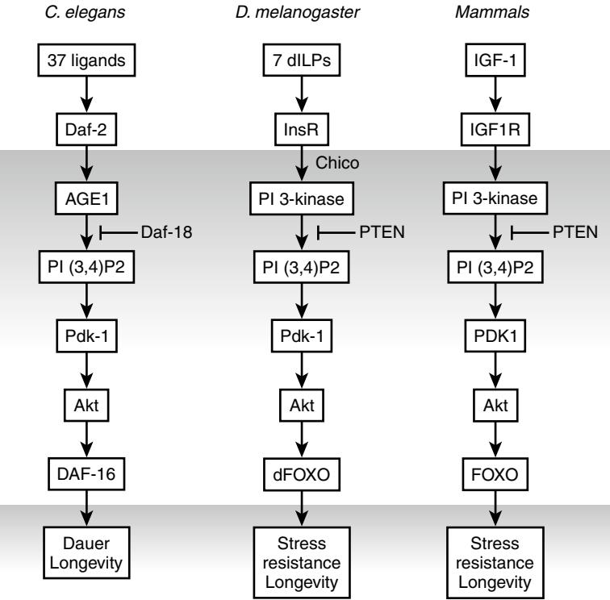

# Biology of Aging

## **INTRODUCTION**

For this discussion about the biology of aging, we begin with a definition of what is meant by aging and the aging process. There are many definitions proposed, but the one provided by Richard Miller of the University of Michigan seems particularly useful for this chapter in a textbook on geriatric medicine.1 He defines aging as the "process that progressively converts physiologically and cognitively fit healthy adults into less fit individuals with increasing vulnerability to injury, illness, and death." Thus the two most important general problems to overcome during human aging are (1) the increasing loss of physical and cognitive function with increasing age, and (2) the increasing susceptibility to a variety of morbid conditions.

The study of the biology of aging began with discovery research, which mostly focused on describing and cataloging aging changes. To understand how these age-related changes relate to Miller's definition, the challenge is then to distinguish among:

- Pathologically neutral age-related changes, such as the graying of hair
- Changes such as the accumulation of oxidatively damaged molecules or senescent cells that are believed to contribute to the development of one or more adverse age-related conditions
- Changes that cause overt pathology, such as the development of plaque and tangles in the brain of Alzheimer's disease patients
- Changes that are the result of such pathology

Three very important milestones occurring during the early discovery phase of aging research include the observations that: (1) restricting caloric intake increases longevity and delays the onset of age-related disease in rodents2; (2) oxygen radicals are produced in vivo and continuously damage cellular macromolecular components3; and (3) when human fibroblasts are grown in culture they have a finite life span.4 Although these three concepts still provide much of the basis for biogerontologic research, so much progress has been made in fleshing out the details that *Cell* devoted its entire February 25, 2005, issue to reviews of basic aging research. Even so, in its July 1, 2005, issue, *Science* included the question "How much can human life span be extended?" as one of the 125 major scientific puzzles driving basic research today.5

Over the years a large number of theories of aging have been proposed to explain how age-related changes promote aging,6 but the complexity of the process diminishes the possibility that any one theory will completely explain aging. The concept that aging is due to both genetic and environmental/stochastic factors is now generally accepted, but it remains difficult to distinguish between the process of aging itself, and the effects due to age-related diseases.

The chapter will first focus on cellular pathways now known to regulate longevity in a variety of animal model organisms. This knowledge resulted from the ability to isolate

CHAPTER 6 Huber R. Warner Felipe Sierra LaDora V. Thompson

> long-lived mutants of short-lived species such as nematodes, fruit flies and mice, which in turn has been greatly facilitated by success in sequencing the human genome and the genomes of these popular model organisms. We then discuss age-related changes related to cell proliferation and agerelated changes due to damage to important cellular macromolecules, such as DNA, proteins, and lipids. These include, but are not limited to, free radical damage to DNA, proteins, and lipids3; DNA repair7; nonenzymatic glycation8; protein cross-linking and protein turnover. Such stochastic changes can become important risk factors in the development of the many degenerative age-related processes and diseases that must be dealt with by geriatricians. Beckman and Ames have written an excellent review of the free radical theory of aging,9 which includes a discussion of many aspects of these overlapping phenomena, but a recent review of oxidative stress in transgenically altered mouse models by Han et al10 argues that the level of damage and its relationship to late-life pathology, such as cancer, is still poorly understood. However, the chapter then includes one example of an age-related condition, sarcopenia, which may be at least partly due to oxidative damage to skeletal muscle proteins. The chapter concludes with a brief discussion of the general value of research on the basic mechanisms of aging.

## **THE INSULIN-SIGNALING PATHWAY AND LONGEVITY REGULATION**

Our understanding of the molecular and genetic basis of aging has witnessed a significant advance in the last decade. The prevailing view until the mid-1980s11 was that aging was stochastic and genetics probably played little direct role in a process that occurred after the reproductive period, and therefore beyond the power of genetic selection. However, hundreds of genes with effects on longevity have been uncovered in a variety of organisms. This was done partially as a result of the Longevity Assurance Genes Initiative of the National Institute on Aging. Genetically tractable species such as nematodes *(Caenorhabditis elegans),* fruit flies *(Drosophila melanogaster),* and yeast have been used extensively to interrogate the genetics of the aging process. Although phylogenetically far away from humans, these models have been chosen primarily because of their ease of manipulation, powerful genetics, and short life span. The earliest gene that was found to control the rate of aging in any organism was the *age-1* gene in *C. elegans,*12 and subsequent work by several laboratories identified *daf-2* and *daf-16* as additional genes controlling life span in nematodes.13–15 As it turned out, these genes all cluster within the insulin-signaling pathway: daf-2 is the nematode homolog of the insulin/ IGF-like receptor, age-1 codes for the catalytic subunit of PI3K, and daf-16 codes for a forkhead transcription factor whose nuclear translocation is under the control of the insulin receptor/PI3K axis (Figure 6-1). In nematodes, binding of the Daf-2 receptor by any or some of the 38 known ILPs (insulin-like peptides) activates a signal transduction cascade that negatively regulates the activity of Daf-16. Under basal conditions, Daf-16 is phosphorylated and sequestered in the cytoplasm, and decreased activity of the Daf-2 pathway results in its dephosphorylation and subsequent translocation to the nucleus where it acts as a transcription factor, and activates a series of genes primarily involved in stress resistance, metabolism, and development. This pathway is inhibited by another gene involved in longevity regulation, *daf-18,* which is the nematode homolog of PTEN.

After this seminal work in *C. elegans*, the insulin/IGF pathway has been confirmed to play a role in regulating life span in other organisms, including *Drosophila* and mice. *Drosophila* has 7 different Dilps (*Drosophila* ILPs), and mutation of the insulin receptor substrate (IRS) chico leads to increased longevity. Mice (and humans) have a family of insulin-like receptors, including the insulin receptor (InsR) and the insulin-like growth factor receptors I and II (IGFR). Because neither *Drosophila* nor *C. elegans* has an "IGF receptor," it becomes relevant to establish which of the two pathways, insulin or IGF, is relevant to aging in mammals.

Several mouse models with increased longevity due to changes in the Ins/IGF pathway have been described. Most studied are the Ames16 and the Snell17 dwarf mice. These have mutations in the *Prop-1* and *Pit-1* genes, respectively, both of which are required for pituitary development, thus leading to a disruption of the somatotropic axis, which through the action of growth hormone (GH) regulates IGF-I levels. Furthermore, it has been observed that GH receptor knockouts18 and IGF-1 receptor heterozygotes19

are also long-lived. Many of these models have compensatory changes in both the insulin and IGF pathways, so the results are still not fully clear about the relative role of each of these pathways in longevity regulation. Interestingly, a recent report suggests that disruption of insulin signal in the brain through heterozygote deletion of one of the two IRS species, IRS2, leads to an extension of life span (18%) comparable to that observed by systemic IRS2 deletion.20 These observations suggest a central control of insulin/IGF action that affects animal longevity, but the results have been contested by another group.21 Further details are provided by the work of Conover and Bale,22 which has shown that reduction of bioavailable IGF-1 (by deletion of PAPP-A, a protease that cleaves an IGF binding protein) also leads to an extension of life span. Certainly, many details still remain to be elucidated, but the available data support the hypothesis that the longevity extension observed in nematodes through manipulation of the Daf-2/Daf-16 pathway holds true in mice as well. Humans display an age-related decrease in GH release and IGF-1 synthesis, and the data from animal models leave open the possibility that this decrease in the activity of this axis might in fact be a protective mechanism. Indeed, supplementation of normal aged individuals with recombinant GH has resulted in significant adverse effects, with no clear benefits.23 On the other hand, recent studies suggest that centenarian Ashkenazi Jews have a mutation in the IGF-I receptor, which in vitro correlates with a decrease in IGF signaling.24

Figure 6-1. The insulin/IGF pathway is evolutionarily conserved, and has been shown to regulate longevity in several species, including *C. elegans, D. melanogaster,* and mammals. The figure depicts the similarities among the pathways in these three species. Of note, in both *C. elegans* and *D. melanogaster* there is only one pathway, whereas in mammals this has evolved into two separate ones, the insulin pathway and the IGF pathway. Although there is some debate, much of the evidence favors the IGF pathway as being relevant to longevity, and it is depicted here. There are also differences in the effectors that activate the pathways: in mammals there is only insulin and two IGFs, but in the lower species there are several ligands. The relative relevance of each of these ligands on aging has not yet been elucidated.

How does the insulin/IGF pathway regulate longevity? As mentioned above, the final result of the signal transduction cascade initiated at the receptor affects the translocation of Daf-16 to the nucleus. Daf-16 is the nematode homolog of mammalian FOXO (see Figure 6-1), and translocation of FOXO has been shown to be affected by several additional pathways involved in longevity.25 Thus in addition to phosphorylation via the InsR/Akt pathway, FOXO phosphorylation is inhibited by a lipophilic signal sent from the gonads, and it is phosphorylated by activated AMP kinase in response to low energy, a pathway that could link FOXO to the mechanism of caloric restriction. FOXO is also modified in response to oxidative damage, both by phosphorylation through the JNK pathway and deacetylation by SirT1.25 Thus it appears that FOXO lies at a nodal point that regulates organismal longevity in response to a variety of cues, both internal and external.26 After translocation to the nucleus, FOXO acts as a transcription factor, upregulating the expression of a variety of genes involved in regulating the stress response, energy metabolism, cell proliferation, inflammation, and others.27,28 It should be noted that nuclear translocation does not seem to be a sine qua non for FOXO's role in longevity. An increase in nuclear Daf-16 is not observed in *age-1* mutants, and constitutive nuclear localization of the transcription factor does not result in increased life span.29

It is important to keep in mind that although these genetic studies are aimed at unraveling the molecular mechanisms underlying the aging process, genetic manipulation of humans with the goal of extending life expectancy poses considerable ethical issues and is not the goal of aging research. Nevertheless, an understanding of the genetic basis of aging can provide valuable targets for therapeutic intervention and a solid theoretical foundation for age-delaying strategies (see later discussion under Why invest in basic aging research the longevity dividend).

#### **CELL PROLIFERATION, TELOMERASE, AND TELOMERE FUNCTION**

The early work of Leonard Hayflick4 has been interpreted by some to mean that aging itself is programmed. Although the number of doublings a cell can undergo may have a genetic basis, the number of doublings a cell actually undergoes is subject to stochastic events. This aspect of aging is discussed below.

#### **Telomere structure and replicative senescence**

The mechanistic basis of Hayflick's observation that human cells grown in culture have a limited life span remained a mystery until Harley et al30 demonstrated that telomeres shorten each time a cell divides. Telomeres are the structures at the ends of chromosomes containing long noncoding repetitive sequences, and they are synthesized by a special enzyme called telomerase.31 Telomerase consists of a catalytic protein complexed with a template strand of RNA that determines the repeating sequence of the telomeric DNA. Because most somatic cells do not express telomerase, as these cells continue to divide, the length of the telomeric DNA gradually shortens until a lower limit is reached (called the Hayflick limit), at which point proliferation ceases. This nonproliferative state is referred to as cell or replicative senescence. The idea that telomere length is critical to the proliferative potential of cells was strengthened by the observation that increasing cellular telomerase activity transgenically also increases the number of doublings a cell can undergo before reaching the senescent state.32

Telomeres consist of more than the long noncoding repetitive sequence at the 5' end of each DNA strand. The telomeric DNA binds a large number of proteins that are important in the multiple functions of telomeres.33 These proteins are not only involved in DNA replication, but they also protect the coding sequences near the ends of chromosomes, and prevent the recombination of chromosome ends with each other or with the double-stranded DNA ends transiently produced during the normal metabolism of DNA.

Telomere length and telomerase activity can impact human health in at least three general ways. One is through the altered phenotype of senescent cells, but negative effects can also be observed if there is either too much or too little telomerase activity present in the cell.

#### **Altered phenotype and cancer**

Phenotypical changes due to replicative senescence are best understood in the human fibroblast. Whereas fibroblasts normally facilitate the synthesis of the basement membrane that helps to repress the proliferation of the cells attached to it, senescent fibroblasts secrete enzymes that degrade this matrix material.34 This degradation destroys the regulatory properties of the membrane, and Krtolica et al35 have directly demonstrated that the presence of senescent cells promotes carcinogenesis of nearby preneoplastic cells. Thus replicative senescence is an example of antagonistic pleiotropy by preventing uncontrolled proliferation of cells in young animals,36,37 but promoting cancer in their vicinity, a process of potential relevance as senescent cells accumulate with increasing age.38

#### **Too much telomerase activity and cancer**

Telomeres progressively shorten with time in proliferating human cells because most human cells contain little if any telomerase activity. Thus every time a cell proliferates, the telomeres get shorter because the cell replicative machinery cannot replace the little bit of DNA lost during the initiation of DNA synthesis. Exceptions include germ cells and stem cells,39 lymphocytes,40 and transformed cells.41,42 Thus high telomerase activity is associated with the proliferative potential of cells and is considered to be a possible biomarker for cancer. The details of what actually causes telomerase activity to reappear in cancer cells, thus maintaining uncontrolled cancerous growth, remain to be worked out, but developing cancer drugs that inhibit telomerase is still a sought-after therapeutic intervention.

#### **Too little telomerase activity and aging**

Too little telomerase can also be a problem even though most human somatic cell types do not have significant levels of telomerase activity. The ability to replace damaged cells well into late life depends upon having robust stem cell pools, as the stem cells in these pools divide asymmetrically to produce the needed replacement cells. Telomerase activity is required to maintain the telomere length of the original mother cell. Individuals born with a mutation in either the telomerase catalytic protein or the associated template RNA are defective in telomerase activity, and develop a condition known as dyskeratosis congenita (DC) because of their abnormal skin pigmentation. These patients may also present with nail dystrophy, premature hair graying, anemia, and/or bone marrow failure.43,44 Bone marrow is a good source of hematopoietic and mesenchymal stem cells, so it is perhaps not surprising that defective telomere maintenance in stem cells might be associated with bone marrow failure. If failure to maintain tissue homeostasis contributes to the development of aging phenotypes, then decreased telomerase activity in stem cells is likely to accelerate aging indirectly because of decreased regenerative capacity of the pools.45

Rudolph et al46 generated mice deficient in the RNA component of telomerase, and therefore lacking telomerase activity. Because mice have much longer telomeres than humans, the first three generations of these mice were fairly normal. However, by the sixth generation the mice were infertile, and their life span was reduced to 75% of normal. The sixth generation mice also had a reduced capacity to respond to stress or to repair wounds; they exhibited premature hair graying and had a higher spontaneous cancer incidence. Although increased telomerase activity is associated with cancer in humans, the loss of telomerase activity can also lead to genetic instability and cancer, indicating the complex and poorly understood relationships among telomere structure, cancer, and aging.

At least one other protein found in these telomeric complexes is related to a premature aging syndrome. Patients with Werner's syndrome (WS) lack a DNA helicase activity that results in growth retardation and early development of age-related pathologies beginning in the late teenage years.47 Neither the role this DNA helicase plays in telomere structure and function, nor why its absence leads to premature aging, is known, but patients with WS typically develop cancer and osteoporosis prematurely, and die in their early fifties.

## **Telomere length as a biomarker of physiologic age**

A surprising number of studies have reported an association between telomere length in lymphocyte DNA and some independent measure of human health and well-being. These include mortality,48 Alzheimer's disease status,49 exposure to psychologic stress,50 cardiovascular disease,51 and parental life span.52 In every case these studies report a positive correlation between telomere length and healthy aging.53 Neither the mechanistic basis for these associations, nor why these phenotypes correlate with telomere length in lymphocyte DNA, is well understood. However, they do support the concept that environmental factors also have an impact on aging.

## **CELL DEATH AND CELL REPLACEMENT — A CRITICAL ROLE FOR STEM CELLS?**

Oxidative damage to cell components is random, although it may be concentrated in certain organelles such as the mitochondria, where most oxygen free radicals are generated. If the damage is severe enough, subsequent repair may be inadequate and apoptotic death may result, particularly mediated through the action of the p66shc and ATR proteins.54,55 Cells lost through apoptosis must be replaced either through division of a nearby somatic cell, by a progenitor cell resident in the tissue where the cell has been lost, or by recruitment of a stem cell from an appropriate niche. Progenitor cells have long been known to be present in skeletal muscle in the form of satellite cells, but it has become clear that progenitor cells reside even in brain tissue.56 Sharpless and DePinho45 have recently proposed that "… ageing—once thought to be degenerative—might reflect a decline in regenerative capacity of resident stem cells across many tissues." Such an idea is certainly consistent with the time dependence of appearance of the many age-related pathologies that humans experience: osteoporosis, diabetes, sarcopenia, neurodegenerative diseases, end-stage renal disease, etc. It is not known why mesenchymal-derived tissues seem to be particularly vulnerable during aging.

An important question is whether the stem cell deficiency is quantitative (number of stem cells) or qualitative (function of stem cells). Available data suggest it may be either or both, depending on the tissue, the niche, and other signals and variables. For example, hematopoietic stem cell (HSC) number may be maintained, while HSC function declines.57 Similarly, Conboy et al58 showed that mouse satellite cells from old donors are rejuvenated in young recipients. These results suggest that stem cell function may decline during normal human aging. Such a decline could reflect either an altered ability to differentiate normally59 or simply the decreased ability to replicate at all.60 Recent evidence suggests that such declining stem cell functionality can be caused by DNA damage leading to excessive apoptosis,61 and genetic mouse models also link this to premature aging phenotypes.62,63 Excessive apoptosis forcing increased proliferation of stem cells to maintain tissue homeostasis, even in the absence of external DNAdamaging agents, can thus have adverse effects on stem cell niches resulting in accelerated aging.33,45,55 In contrast, the presence of an overactive p53 protein64,65 appears to cause premature aging by attenuating stem cell proliferation, leading to development of aging-related phenotypes, presumably due to inadequate cell replacement from stem cell niches.

In humans, telomerase activity is normally found only in the germline, stem cell niches, and activated lymphocytes. It would be of interest to know whether decreasing telomerase function is a factor in stem cell aging. Telomerase deficiency does lead to the development of age-related phenotypes in mice, but not until telomeres have been shortened by serial breeding of telomerase-deficient mice,46 and replicative life span of hematopoietic stem cells is decreased by telomerase deficiency.33,66

# **PROGEROID SYNDROMES AND NORMAL AGING**

Much progress in understanding human disease has been made by studying mouse models of the disease. Similar arguments can be made to support studies of aging of short-lived animal models such as yeast, nematodes, fruit flies, and mice. What is less accepted is whether there are appropriate accelerated human aging syndromes that may be informative about normal aging, in particular Werner's syndrome and Hutchinson-Gilford progeria syndrome (HGPS). Despite obvious differences with normal aging, these and other progeroid syndromes may provide uniquely informative opportunities to formulate and test hypotheses regarding the biology of aging and age-related diseases.47,67 The phenotypes of these syndromes emerge at well-defined ages and include progressively degenerative changes similar to those observed during normal aging. The most common feature of both human and mouse mutations that accelerate the appearance of progeroid features is dysfunctional DNA metabolism, including replication, transcription, repair, and recombination. It remains to be determined whether such DNA dysfunction, and the cell death it may subsequently trigger, explains the time dependence of the appearance of progeroid phenotypes, and whether similar mechanisms are afoot although at a slower pace during normal aging. Such models may also provide clues about why mesenchymal stem cells might be particularly vulnerable in HGPS, as suggested by Halaschek-Wiener and Brooks-Wilson.68

#### **PROTEIN DAMAGE AND SARCOPENIA— DOES PROTEIN OXIDATIVE DAMAGE PLAY A CAUSAL ROLE?**

Aging is associated with a progressive decline of muscle mass, strength, and quality, a condition described as sarcopenia. The prevalence of sarcopenia in older adults is about 25% under the age of 70 years, and increases to 40% in adults 80 years or older.69 Sarcopenia is a risk factor for frailty, loss of independence, and physical disability.70 Sarcopenia and its detrimental correlates have an immense economical impact.71 Thus understanding the mechanisms leading to muscle dysfunction (e.g., weakness) at advanced age represents a high public health priority.

The *free radical theory* of aging, formulated 50 years ago, proposes that aging can be attributed to deleterious effects of reactive oxygen species.3 This hypothesis has been extensively investigated and debated, and although oxidative damage may not be the only cause of adverse age-related changes, it clearly has been linked to a number of them.9 Overall, the *oxidative stress theory* states that a chronic state of oxidative stress exists in cells even under normal physiologic conditions because of an imbalance between prooxidants and antioxidants. This imbalance results in a net accumulation of oxidative damage in a variety of cellular macromolecules. Such oxidative damage increases during aging, which results in a progressive loss in the functional efficiency of various cellular processes.72 Three tenets of this theory include: (1) there are many oxygen-derived metabolites and reactive nitrogen species produced during normal metabolism; (2) these metabolites damage the phospholipids, proteins, and DNA of the mitochondria and other critical cellular components; and (3) oxidative stress influences signaling, transcriptional control, and other normal processes within cells.

Skeletal muscle is particularly vulnerable to oxidative stress, due in part to the rapid and coordinated changes in energy supply and oxygen flux that occur during contraction, resulting in increased electron flux and leakage from the mitochondrial electron transport chain. Skeletal muscle also contains a high concentration of myoglobin, a hemecontaining protein known to confer greater sensitivity to free radical-induced damage to surrounding macromolecules by converting hydrogen peroxide to other more highly reactive oxygen species.73 Fundamental differences in skeletal muscle fiber type metabolism (slow-twitch aerobic fibers and fast-twitch glycolytic fibers) may confer differing degrees of susceptibility to oxidative stress and may be mechanistically related to the aging phenotype. The extent and time course of the deterioration of muscle function depend on many factors, such as the fiber type composition of the specific muscle studied and the selected age group. There is significant muscle atrophy, reductions in the force-generating capacity, slowing of contraction, and alterations in protein structure in fast-twitch fibers with normal aging.74,75 In contrast, the age-associated atrophy and significant functional declines of the slow-twitch fibers occur later (well into senescence).76

The hypothesis that age-related deterioration of muscle function involves oxidative damage of muscle proteins by reactive oxygen and nitrogen (ROS and NOS) species77 was suggested by a series of in vitro studies showing that ROS and NOS—such as peroxynitrite, hydroxyl radicals, H2O2, and nitric oxide—inhibit force production and induce changes in the regulation of calcium metabolism in skeletal muscle.78–84 Studies on in vivo oxidative modifications of specific muscle proteins such as sarcoplasmic Ca2+-ATPase (SERCA), actin, and myosin focused on a few selected markers, such as nitration of tyrosine (3-NT), formation of HNE (4-hydroxy-2-nonenal) adducts, oxidation of cysteine side chains, and glycation.85–88

The SERCA protein is probably the most extensively investigated muscle protein. These investigations focus on what sites are vulnerable to oxidative stress, and how the modification or damage alters protein function with increasing age. Normal aging of skeletal muscle is associated with increased nitration; in particular, specific nitration of the SERCA2a isoform in slow-twitch muscle.85,89 Nitration can alter protein function and is associated with acute and chronic disease states.90 3-NT is formed when tyrosine is nitrated by peroxynitrite, a highly reactive molecule generated by the reaction of nitric oxide with superoxide. Muscle fibers are exposed to periodic fluxes of nitric oxide and superoxide, thus providing favorable conditions for the formation of peroxynitrite. Tyrosine nitration has the potential to inhibit protein function by altering protein conformation, imposing steric restrictions to the catalytic site, and preventing tyrosine phosphorylation.91 Moreover, the functional significance of tyrosine nitration depends on both the site of modification and the extent of the protein population containing functionally significant modifications. Tyrosine nitration increases by at least threefold in skeletal muscle during normal aging, and correlates with a 40% loss in Ca2+-ATPase activity during normal aging. Mass spectrometry analysis reveals an age-dependent accumulation of 3-NT at positions 294 and 295 of the SERCA2 protein, suggesting that these tyrosines play a critical role in muscle function. In vitro studies also demonstrate that SERCA2a is inherently sensitive to tyrosine nitration with concomitant functional deficits.85,89 Because the physiologic role of the Ca-ATPase is to mediate muscle relaxation, the consequence of nitration-induced inhibition of SERCA2a most likely explains the slower contraction and relaxation times observed in skeletal muscle with normal aging.

Aging also leads to a partial loss of SERCA1 isoform activity, and a molecular rationale for this phenomenon may be the age-dependent oxidation of specific cysteine residues. Mapping of the specific cysteine residues reveals nine cysteine residues targeted by age-dependent oxidation in vivo*,* and six cysteine residues partially lost upon oxidant treatment in vitro.92 Interestingly, the residues affected in vivo do not completely match those targeted in vitro, suggesting that modification of some residues do not contribute significantly to the loss of SERCA function with age. Taken together, these studies provide some insights about the molecular mechanisms responsible for age-related alterations in calcium regulation in skeletal muscle.

Myosin and actin are two key contractile proteins responsible for force generation and contraction speed. Age-related oxidative damage of myosin and actin are probably increased by decreased muscle protein turnover.93 In the presence of reactive oxygen and nitrogen species, force is inhibited and contraction speed is altered.78,79,94 Studies of in vivo oxidative modifications of myosin and actin have focused on selective markers of oxidative damage, such as nitration, formation of HNE adducts, and oxidation of cysteines.86,88 During normal aging, myosin and actin do not significantly accumulate 3-NT or HNE-adducts. In contrast, an agerelated decrease in cysteine content is detected in myosin, but not in actin with increasing age. Because the physiologic role of myosin and actin is to produce force and speed, the lack of accumulation of these oxidative stress markers is unlikely the explanation for age-related inhibitory changes in muscle contractility.

Another possible explanation of age-related inhibitory effects in muscle proteins is glycation. Accumulation of advanced glycation end products (AGEPs) resulting from the Maillard reaction alters the structural properties of proteins and reduces their susceptibility to degradation.95 Decreased susceptibility of glycated proteins to degradation by the proteasome, the function of which is also compromised during aging,96,97 might also contribute to the buildup of damaged proteins. Generally, muscle shows the least glycation of biologic tissues, with a basal level of glycation in muscle protein of 0.2 mmol/mol lysine,98 but normal aging of skeletal muscle is associated with a tenfold increase in the percentage of fibers containing glycated proteins.87 Subsequent mass spectrometry analysis identified the glycated proteins as creatine kinase, carbonic anhydrase III, β-enolase, actin, and voltage-dependent anion channel 1, with β-enolase showing an accumulation of CML with age in muscle. β-enolase may be a scavenger of AGE because lysines are at the exposed surface of the protein. This scavenging process may spare other proteins from AGE-modification and consequent functional impairment. β-enolase is a good candidate for this role because glycation of this protein has only a limited impact on cell physiology. Indeed, although glycation leads to a decrease in β-enolase activity, no changes were detected in glycolytic flux.99 The significance of glycation of other skeletal muscle protein on muscle function is unknown, yet in vitro studies show that glycation decreases myosin and actin interactions.100

Taken together, these studies provide some insights about potential molecular mechanisms responsible for age-related alterations in contractility. An important limitation in the characterization of damaged proteins from muscle tissue is the fact that the data provide only a snapshot of a dynamic process because proteins are constantly being synthesized and degraded in most tissues. Furthermore, current knowledge about posttranslational modification due to oxidative stress, and the techniques available to measure them, may not permit the quantitative analysis of all potential modifications of a given protein of interest and its functional characterization. It is likely that the future will see a significant increase in the number of specific modifications of proteins known, and an increase in our ability to associate them with specific aging phenotypes.

In summary, reduced muscle function and its attendant decrease in physical performance with age is a significant public health problem. Sarcopenia affects more than half of Americans older than age 50,101 at an estimated annual cost of \$18.5 billion.71 The cumulative effect of the reductions in skeletal muscle mass and function with age is a decrease in the capacity for physical work. This manifests as an inability to perform simple tasks of everyday life101–105 and has been shown to contribute to disability,69,101,106,107 greater risk for falls and fractures,69 increases in all-cause mortality,108 and, in general, a poor quality of life. People 85 and older are the fastest growing segment of the U.S. population, and estimates indicate that by 2030 almost 1 in 5 Americans, or 72 million people, will be 65 years or older (U.S. Census Bureau, 2005). Thus the incidence and prevalence of age-related decrements in muscle performance will increase, necessitating greater health care expenditures for supportive services and long-term care. Oxidative damage to key skeletal muscle proteins may be a contributing factor in sarcopenia. However, conclusive results require a more complete determination of the extent and location of oxidized sites, with parallel assessment of functional interactions of the proteins. Thus future research in the field of sarcopenia will attempt to identify and quantify all of the posttranslational modifications that a specific muscle protein accrues in vivo, and determine their functional implications.

## **WHY INVEST IN BASIC AGING RESEARCH?—THE LONGEVITY DIVIDEND**

Much of current research into the biologic mechanisms of aging use death (life span) as an end point. Most biogerontologists agree that this is not the ideal end point, but it is used because we currently do not have any good biomarkers of the process, and ascertaining biologic age, as opposed to chronologic age, in laboratory animals is not an easy task. As a corollary to that choice, some believe that the purpose of basic aging research should be to increase human life span. Not only is that perception incorrect, but it is also dangerous. Indeed, it has been a long-held view that increasing the life span of humans will lead to a dramatic increase in the incidence of disease and disability.109 If modern medicine succeeds in increasing life span without a concomitant increase in health span, the result could be a society of sick and infirm individuals, with poor quality of life, who will exert an enormous pressure on the economy by increasing the investment required for pensions, retirement, and health care costs. Unfortunately, that is what appears to have happened during the last century, when median life span in the United States increased from 47 to 77.8 years, and at the same time, there has been a dramatic increase in the number of people with chronic disabilities and disease. As an example, Alzheimer's disease was not even described until 1907, and currently more than 4 million Americans have been diagnosed with the disease. So the prevalent view is that increasing the human life span any further will only lead to an ever more crippled society.

Most of the efforts of modern medicine are focused on addressing (and hopefully defeating) each of the major diseases burdening our population. For the aged, major fatal chronic diseases include cardiovascular diseases, cancer, dementias, and diabetes, but the quality of life is also impoverished by nonfatal diseases and conditions, such as osteoporosis, arthritis, sarcopenia, and others.110 Enormous progress has been made in understanding and treating several (but not all) of these disorders. Although such treatments and cures "benefit" a few individuals (those afflicted), it has been calculated that curing any of the major fatal diseases will only have a marginal impact on median life span, usually in the order of 3 to 6 years.111 Furthermore, the benefit to those cured may be only relative because usually the elderly suffer from multiple disease conditions in parallel (comorbidities), so that curing any one of them will still leave them exposed to the ravages of the others. As an example, let us imagine that suddenly all cardiovascular diseases are conquered, and no one will ever again die of this. Many people who currently have semiclogged arteries would be elated by the news, and many of them would indeed go on to live useful lives for a few extra years. But the preponderant majority of individuals currently affected by cardiovascular disease are in a general state of diminished health and comorbidities, and the extra years of life are more than likely to be spent in an ever more frail state, as other age-related diseases (diabetes, Alzheimer's) take hold. Thus the increase in life span observed in the last century has led to an increase in the incidence of these other diseases. We have indeed conquered a major previous killer, infectious disease, and that led to the increased incidence of previously uncommon illnesses, such as cancer, diabetes, Alzheimer's.

What is then to be done? Aging is the major risk factor for most, if not all, age-related diseases.112 For example, a high cholesterol diet will have only a minor immediate impact on the health of a young individual, but could be fatal for an older one (or for the same young individual, once he or she ages). If we accept that age is a major risk factor for these diseases, then as a corollary, slowing the rate of aging should be expected to result in a delay in the appearance of all or most age-related diseases, conditions, and ailments.113,114 If instead of addressing one disease at a time, as if their causes were independent, we recognize that age-related biologic changes are the main cause behind most age-related illnesses, then addressing the biologic changes that drive the process of aging is much more likely to have beneficial effects for humanity.115 In effect, it has been calculated that a small decrement in the slope of the aging rate curve could result in a significant increase in the proportion of our life span spent in a healthy, disease-free state. A delay of just 7 years in the appearance of major age-related illnesses could result in a net increase in health span of 50% based on the fact that age-related decline rises exponentially with age, with a doubling time of approximately 7 years.116

At this time, such a goal seems within reach based on results obtained in animal models. Although much longevity research is performed in *C. elegans*, with few exceptions117 there is a clear scarcity of reports dealing with physiologic data in these animals, so we cannot ascertain for sure whether or not extension in life span in this model occurred in a healthy or diseased state. On the contrary, a more modest but generally reproducible increase in both median and maximal life span has been observed in rodents subjected to caloric restriction by 40%.2 It is not clear whether a similar increase can be obtained in humans, but the observations in a variety of mammals indicate that the increase in life span afforded by caloric restriction is accompanied by a general delay in the aging process, such that restricted animals show a delay in the appearance of most age-related declines and diseases measured, both at the physiologic and pathologic level. Independently of whether caloric restriction (or a mimetic thereof) will work in humans, the data show that the rate of aging can be externally manipulated. Thus by delaying the onset of age-related decline, it is possible to postpone the entire range of age-related ailments, leading to a significant extension of the period of healthy living. This concomitant effect at a host of different levels has been termed *The Longevity Dividend*. 5,6

Interestingly, the longevity dividend concept extends well beyond health and well-being. A significant concern in many societies is the potential economic impact of the oncoming onslaught of age-related disease and disability, which threatens to break our pension and health care systems. The longevity dividend concept predicts that by addressing the basic mechanisms of aging, humans could live longer productive lives. This would translate into tangible economic benefits because people would be able to stay in the workforce longer (thus allowing for further wealth production and savings), and would withdraw less funds from pensions and the health care system. The economic implications of the longevity dividend have been explored in further detail elsewhere.113

#### KEY POINTS Biology of Aging

- Decreasing the activity of the insulin-signaling pathway at any one of many steps, in a variety of animal models (fruit flies, nematodes, mice), shifts the focus of the organism from growth and reproduction to stress response and survival, thereby increasing its longevity.
- Damage to critical proteins changes their structure and compromises their function, and unless repaired or replaced, ultimately may decrease tissue function.
- Damage to DNA sufficient to block one of its critical functions (replication, transcription, repair, or recombination) may lead to cell death, and the need to replace that cell from a relevant progenitor cell pool.
- Excessive cell death can ultimately lead to exhaustion of the relevant progenitor cell pools responsible for maintaining tissue homeostasis in the presence of stress.
- Elucidating the biologic causes of aging is inherently important because aging is a major risk factor for development of most age-related pathology.

If we do manage to postpone aging, are there new diseases that will appear? Yes, that is a distinct possibility and a caveat to what has been exposed above. Even though so far we have been unable to increase maximal life span in humans,111 modifying the aging process in animal models (e.g., by caloric restriction) does achieve that goal. If this is extrapolated to humans, it is indeed possible that currently rare or even new ailments will make their mark, just as defeating infectious diseases and many causes of childhood deaths did lead to an increase in the incidence of what we now call age-related diseases and conditions. Similarly, significantly extending median and maximal life span might lead to an increase in the prevalence of now rare diseases, such as liver amyloidosis. In this context, it is relevant to note that in studies conducted to date, it has been observed that most centenarians and super centenarians die of the same array of causes as younger individuals (with maybe a slightly lower incidence of cancer).118 Nevertheless, if half of the human population reaches 100 years, and then are afflicted by these diseases, we still would have achieved an important goal: keep them healthy until their 90s. That could be one goal of modern medicine.

For a complete list of references, please visit online only at www.expertconsult.com