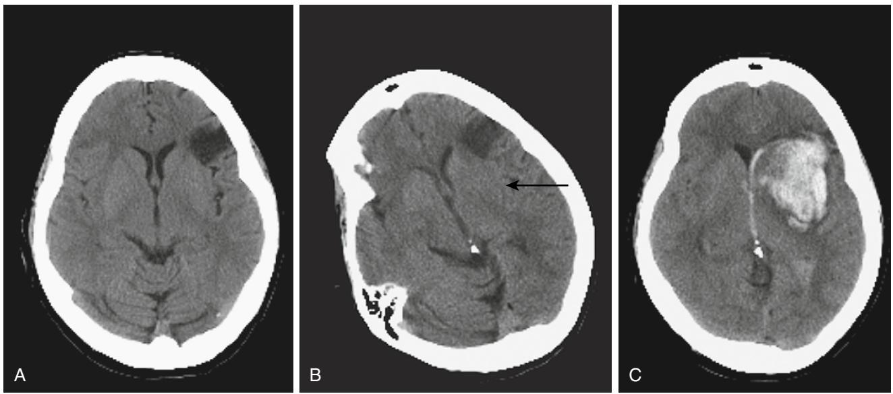
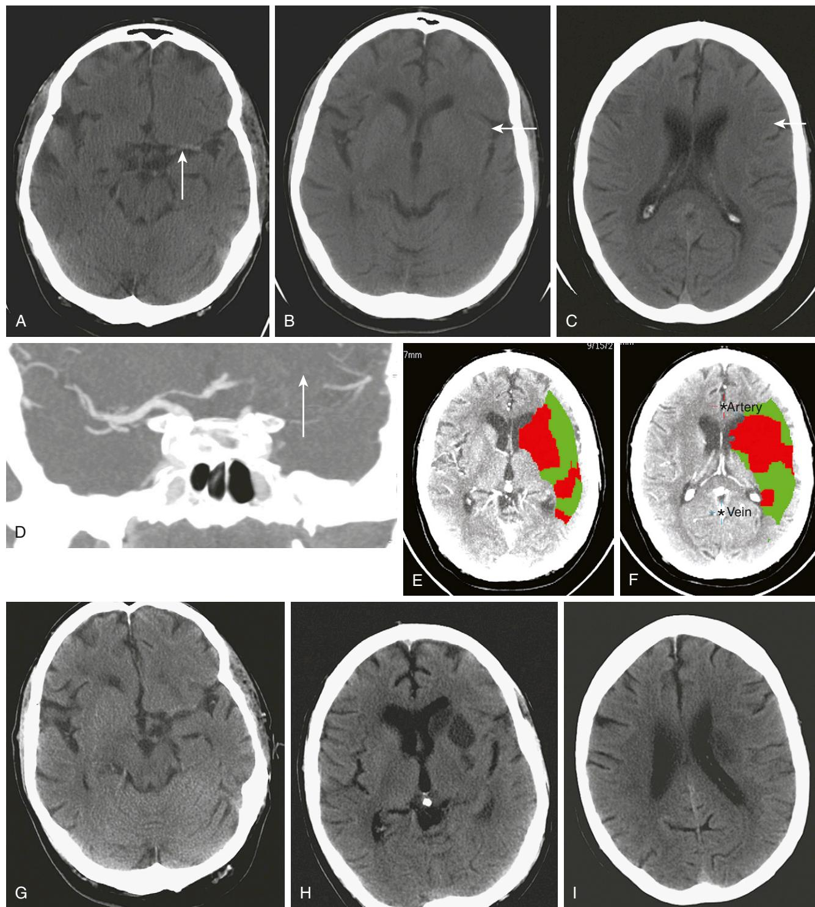

# Stroke: Clinical Presentation, Management and Organization of Services

Velandai K. Srikanth Thanh G. Phan

## **INTRODUCTION**

Stroke is the most common clinical manifestation of disease of cerebral blood vessels and thus falls under the broad category of *cerebrovascular disease*. Transient ischemic attacks (TIA) are harbingers of a particular type of stroke known as ischemic stroke. Other common subclinical manifestations of cerebrovascular disease include cerebral white matter lesions (WML) and "silent" brain infarcts. This chapter will primarily focus on stroke and TIA, with some emphasis on WML and silent infarcts, the management of which are uncertain at the present time.

Stroke and TIA are the leading cause of acute neurologic admissions to hospitals throughout the world, and tend to predominantly affect older people. The seriousness of stroke is underlined by the fact that it is the second leading single cause of death worldwide.1 Approximately a third of stroke patients die within the first 6 months, and approximately 60% by 5 years after stroke.2 Stroke also ranks as the sixth most important cause of disability among survivors.3 With aging populations, it has been estimated that stroke will rank as the fourth most important cause of disability in the western world by the year 2030.3 Older people are at greater risk of accumulating other age-related diseases and consequently greater frailty.4 The impact of a stroke on such people with preexisting disability can be particularly devastating, often leading to a move from their home environment to residential care facilities.

Stroke is also an expensive disease in monetary and societal terms. In Australia, during the year 1997, the average cost per stroke patient was estimated as A\$18,956 during the first 12 months and A\$44,428 over a lifetime.5 Overall, the most important categories of cost during the first year were acute hospitalization A\$154 million, inpatient rehabilitation A\$150 million, and nursing home care A\$63 million.5 There are also significant costs for caregivers of stroke patients, with much of the informal care provided by family members leading to loss of earnings, family time, or leisure time.6 Although it is ideal to prevent strokes from occurring in the first place, it is equally important to adopt a cohesive and multidisciplinary approach toward clinical management and rehabilitation of stroke patient to minimize long-term stroke-related disability. Although stroke care has been regarded by many physicians with a sense of pessimism in the past, there have been remarkable advances in the last decade that have led to significant improvements in stroke care and measurable reductions in mortality and disability. The advent of multidisciplinary Stroke Care Units (SCUs) and more specific treatments based largely on evidence from randomized controlled trials have led to an exciting transformation in the attitude of physicians and the general medical community toward stroke management.

# **DEFINITIONS**

**Stroke** - The World Health Organization (WHO) defined stroke as "rapidly developing clinical signs of focal disturbance of cerebral function lasting more than 24 hours (unless interrupted by surgery or death) with no apparent cause other than of vascular origin."7 The emphasis of this definition is on the *focal nature* of the clinical signs, implying that stroke is a disease causing focal brain injury, and the *acute onset* which is identified by the patient's ability to specifically describe what he or she may have been doing when the first symptoms occurred. This definition excludes cases of primary cerebral tumor, cerebral metastases, subdural hematoma, postseizure paralysis, and brain trauma. Although it is a predominantly clinical definition, it still holds validity in the current era of medical imaging because of the differences in the temporal and clinical presentations of other differential diagnoses mentioned earlier. For example, the time of onset of symptoms in patients with brain tumor may be difficult to pin down compared with stroke, and other conditions such as subdural hematoma and postictal paralysis are usually associated with a history of injury or seizures. However, brain imaging has assumed an important role in excluding other diagnoses, determining whether a hemorrhagic stroke may have occurred, and more recently is also of interest in trying to establish the occurrence of infarction in patients with suspected TIA.

**Transient Ischemic Attack (TIA)** - TIA refers to the transient occurrence of symptoms of ischemic stroke. The classic definition for a TIA differs from that for stroke primarily in the duration of symptoms. By this definition, TIA is considered as a diagnosis if there is a focal disturbance of cerebral function of sudden onset, lasting less than 24 hours and with no apparent cause other than of vascular origin. This emphasis on the 24-hour criterion evolved in the 1950s, was adopted at the Fourth Princeton Conference in 1965,8 and reinforced by the National Institutes of Health (NIH) in 1975.9 However, the majority of data at the time, and even at present, indicate that symptoms of TIA last less than an hour in most patients.10 Therefore it is now being increasingly considered that the 24-hour cutoff is out of date. Moreover, changes of infarction have been detected on MRI in a significant proportion of patients with suspected TIA.11,12 These issues have led to further debate on whether the definition of TIA should be altered to incorporate changing views on the typical duration of symptoms and imaging findings.10 At this point, the traditional definition of TIA remains widely in use and is important particularly in the context of epidemiologic studies of TIA that require standard definitions to compare incidence or prevalence rates over time and between populations. Older terms such as reversible ischemic neurologic deficit (RIND) and cerebral infarction with transient symptoms (CITS) have been discarded because they do not assist any further in disease phenotyping, understanding mechanisms, or clinical management. The presence of symptoms such as faintness, dizziness, confusion, or falls is highly unlikely to be because of a TIA unless they are accompanied by focal neurologic symptoms.13 Transient global amnesia (TGA), a selflimited anterograde memory loss, is often mistaken to be a TIA. However, there is little evidence to suggest that it has a vascular mechanism.14 Similarly the occurrence of transient isolated neurologic symptoms, such as double vision, vertigo, or dysphagia, are more likely to be due to nonvascular causes. Acute delirium is unlikely to last only a few hours and is almost always not secondary to a TIA, although it can be an uncommon presentation of stroke.

**Cerebral White Matter Lesions** - These are radiologically defined and are visible as hyperintensities (bright signals) seen on T2 or fluid attenuated inversion recovery (FLAIR) sequences of MRI scans.15 They are seen to some degree in most people over the age of 65 years16 and are often considered to be "subclinical" manifestations of chronic occlusive disease affecting small cerebral blood vessels, although they can be nonspecific. Although chronic arterial hypertension is a consistent risk factor,17 the histopathology of WML is heterogeneous, showing a number of changes, including ischemia, demyelination, and chronic inflammation.18

**Silent Brain Infarcts** - These are small areas of typical infarction that are detected radiologically as areas of reduced intensity on T2 or FLAIR sequences of MRI in the absence of obvious acute stroke symptoms.19 They are detected in the subcortical regions of the brain in about 20% of healthy elderly and up to 50% in selected clinical samples.19 They increase in prevalence with age and are also associated with risk factors for small vessel disease, such as hypertension, smoking, hypercholesterolemia, and diabetes mellitus.19

#### **STROKE TYPES**

Strokes are either ischemic or hemorrhagic, with each having different pathophysiologic mechanisms and treatments. Approximately 80% of all strokes are ischemic, caused by an acute occlusion of a cerebral blood vessel. Increasing age, history of TIA or stroke, hypertension, atrial fibrillation, cigarette smoking, diabetes mellitus, and hypercholesterolemia are important risk factors for ischemic stroke.1 The mechanisms of arterial occlusion are predominantly those of artery-to-artery embolism and cardioembolism, rather than in situ vessel thrombosis. Hemorrhagic strokes (primary intracerebral hemorrhage [PICH]) occur in approximately 15% of all cases and most often result from chronic hypertensive small vessel disease, leading to vessel wall lipohyalinosis, microaneurysm formation, and rupture, and less commonly in relation to other conditions such as amyloid angiopathy.20 Subarachnoid hemorrhage (SAH) is also classified as a type of stroke within the WHO definition, occurring in about 5% of all strokes and caused by the rupture of larger saccular intracerebral aneurysms within the subarachnoid space. Cigarette smoking, hypertension, female gender, and heavy alcohol intake have been identified as important risk factors for SAH, and these may interact with genetic susceptibility to aneurysm formation and rupture.21,22

The distinction between ischemic and hemorrhagic stroke is important as their treatments are quite different (Figure 62-1). For example, thrombolysis is an acute treatment for ischemic stroke, but contraindicated for hemorrhagic stroke for obvious risks of worsening the hemorrhage. Computed tomography (CT) or MRI are both established methods for effectively excluding hemorrhagic stroke in the acute setting.23

#### **Ischemic stroke subtypes**

The classification of ischemic strokes into further subtypes has been driven by the needs of observational epidemiologic studies and clinical trials in stroke. The most commonly used classification in observational epidemiology is the Oxfordshire Community Stroke Project Classification (OCSP).24 In clinical trials and in situations that require an understanding of the mechanisms underlying

Figure 62-1. Hemorrhagic infarct and not primary intracerebral hemorrhage. 83 year old female had resolving right hemiparesis but residual right hemianesthesia (A). Twelve hours later she redeveloped right hemiparesis with obscuration of the left lentiform nucleus (*solid arrow* in B). Her blood pressure was elevated at 230/120 mm Hg. She deteriorated overnight with the final CT performed 24 hours (C) after admission, looking indistinguishable from a primary intracerebral hemorrhage.

the stroke, the most commonly used criteria for classification are the Trial of Org 10172 in Acute Stroke Treatment (TOAST) criteria.25

**Oxfordshire Community Project Classification (OCSP)** According to the OCSP classification, ischemic strokes are classified as one of four subtypes by their clinical presentation: Total Anterior Circulation Infarcts (TACI), Partial Anterior Circulation Infarcts (PACI), Posterior Circulation Infarcts (POCI), and Lacunar Infarcts (LACI) (Table 62-1**)**. In a recent population-based study of stroke incidence, the annual incidence rates per 100,000 persons adjusted to the "world" population were 11 (95% confidence interval or CI, 4–18) for TACI, 25 (95% CI, 15–35) for PACI, 17 (95% CI, 9–25) for POCI, and 18 (95% CI, 10–26) for LACI. It is important to note that the OCSP classification is a syndromic classification based on the constellation of clinical signs and symptoms at stroke onset. Although this type of classification may be useful in studying risk factors and

#### **Table 62-1. Oxfordshire Community Stroke Project Classification (OCSP)**

#### **Total Anterior Circulation Infarct (TACI)**

- Unilateral motor deficit of at least two areas of the face, arm, and leg
- Homonymous hemianopia
- Higher cerebral dysfunction (for example, aphasia, neglect, dyscalculia, visuospatial disorder)
- If the conscious level was impaired and formal testing of higher cerebral function *or* the visual fields was not possible, a deficit is assumed

#### **Partial Anterior Circulation Infarct (PACI)**

One of:

- Any *two* of the features listed above for TACI
- Higher cerebral dysfunction alone
- Motor and/or sensory deficit more restricted than those classified as LACI (for example, confined to one limb, or to face and hand but not to whole arm)

#### **Posterior Circulation Infarct (POCI)**

- One or more of:
- Bilateral motor or sensory signs not secondary to brainstem compression by a large supratentorial lesion
- Cerebellar signs, unless accompanied by ipsilateral motor deficit (see ataxic hemiparesis)
- Unequivocal diplopia with or without external ocular muscle palsy
- Crossed signs, for example, left facial and right limb weakness
- Hemianopia, alone or with any of the four items above
- Ipsilateral cranial nerve palsy with contralateral motor and sensory
- deficit

#### **Lacunar Infarction (LACI)**

- Pure Motor Stroke (PMS)
- Unilateral, pure motor deficit
- Clearly involving two of three areas (face, arm and leg)
- With the whole of any limb being involved
- Pure Sensory Stroke (PSS)
- Unilateral purely sensory symptoms (± signs)
- Clearly involving two of three areas (face, arm, and leg)
- With the whole of any limb being involved
- Ataxic Hemiparesis (AH)
- Ipsilateral cerebellar and corticospinal tract signs
- With or without dysarthria
- In the absence of higher cerebral dysfunction or a visual field defect
- Sensory-Motor Stroke (SMS)
- PMS and PSS combined (i.e., unilateral motor and sensory signs and symptoms)
- In the absence of higher cerebral dysfunction or a visual field deficit

outcomes, or assigning prognosis, it does not allow a definitive understanding of the actual mechanism underlying the stroke in an individual patient without further investigations.

TACI usually involves a major portion of the carotid artery territory and may occur as a result of occlusion of the internal carotid artery or proximal stem of the middle cerebral artery (MCA), with or without involvement of the anterior cerebral artery (ACA). Given the extensive nature of infarction, TACI is associated with a very high case-fatality (approximately 35% die within the first 28 days).26 Survivors of TACI are usually left with severe generalized neurologic deficits attributable to the affected hemisphere, consequent immobility, and high levels of disability or handicap.26,27 PACI probably occurs as a result of occlusion of more distal branches of the MCA and is associated with a lesser degree of, but nonetheless significant, neurologic impairment including higher cortical deficits. PACI carries the highest rate of early stroke recurrence among the OCSP subtypes (approximately 17% in the first year),26 necessitating a comprehensive assessment and management of modifiable risk factors. POCI refers to ischemic strokes occurring in the vertebrobasilar artery territory and generally has an intermediate level of case-fatality, lower than TACI but higher than LACI.26 LACI refers to the different presentations of ischemic strokes with mainly motor or sensory deficits in the absence of signs and symptoms attributable to the cerebral cortex or the posterior circulation. They are generally milder and have a relatively good prognosis compared with the other OCSP subtypes.26 Although it is assumed that LACI occurs because of the occlusion of small deep cerebral blood vessels, this cannot be definitively ascertained without further investigation.

**Trial of Org 10172 in Acute Stroke Treatment (TOAST) Criteria** - This is a classification of subtypes using a combination of clinical features and results of ancillary diagnostic studies, and is extremely important for use in trials of stroke treatment or prevention. "Possible" and "probable" diagnoses can be made based on the physician's certainty of diagnosis based on all available clinical information. Apart from use in trials, it allows the clinician to focus on disease mechanisms underlying the stroke and therefore a better framework for clinical decision-making for treatment. The TOAST classification was first developed in 1993 as part of a clinical trial and denotes five categories of ischemic stroke: (1) large-artery atherosclerosis, (2) cardioembolism, (3) small-vessel occlusion, (4) stroke of other determined cause, and (5) stroke of undetermined cause.25 These were developed using available diagnostic and clinical information at the time, and given the limitations of these diagnostic tests, may have led to many cases placed in the category of undetermined cause. A more recent adaptation is the SSS-TOAST (Stop Stroke Study-TOAST), which takes into account recent advances in diagnostic technologies, particularly neuroimaging and cardiac imaging, to further specify the level of confidence (evident, probable, and possible) for assigning ischemic stroke subtype.28 This classification scheme also allows for the possibility that there may be more than one mechanism involved in causing the stroke. The SSS-TOAST criteria can now even be applied in a web-based algorithm allowing for standardization in multicenter studies of stroke.29

# **CLINICAL PRESENTATION**

The patterns of clinical presentations for stroke vary and cannot be exhaustively dealt with in this chapter alone. For a detailed examination of this topic, readers are referred to the authoritative text titled "Stroke Syndromes," edited by Bogousslavsky and Caplan.30 However, in the following section, the most commonly encountered clinical features associated with stroke will be presented.

# **Stroke**

Clinical presentations of ischemic stroke, PICH and TIA, can most often be ascribed to specific brain locations that are affected. Stroke and TIA, being part of the same clinical spectrum of disease, have very similar presentations except for the transient nature of symptoms in the latter. It is also unusual to have a TIA with purely sensory symptoms. The most commonly encountered clinical manifestations of stroke are as below:

- 1. Motor weakness Hemiparesis or other motor weakness is the most common presenting abnormality in stroke, usually seen in more than 80% of patients.31 This is possibly because of the large extent of the corticospinal pathways in the brain making it susceptible to the effects of stroke almost anywhere in the brain. Motor weakness leads to obvious difficulty in mobility and consequent disability. Apart from the predictable nature of large superficial MCA stroke, there is not a strong correlation between the location of stroke and severity of motor weakness.32 Hemiparesis uniformly affecting the upper and lower limbs is the most frequently encountered motor deficit in about two thirds of cases, followed much less frequently by monoparesis, paraparesis, or quadriparesis.31 The pattern of weakness may provide clues toward the topography of the stroke, although recent advances in MR imaging provide this information with far greater accuracy. Weakness of the face, arm, and leg usually indicates the involvement of the MCA territory, whereas predominant weakness of the lower limb is commonly seen in cases of anterior cerebral artery stroke. On occasion, proximal posterior cerebral artery occlusion can produce a pattern of weakness combined with deficits in higher cortical function that mimics MCA infarction.33 The presence of a pure motor hemiparesis involving face, arm, and leg in the absence of cortical signs is the most common manifestation of lacunar infarction, resulting from a deep penetrating artery occlusion in the internal capsule or the base of the pons.30 Care has to be taken to differentiate between true motor weakness and other deficits that may mimic weakness; for example, an apraxia of movement may be mistaken for motor weakness. Apraxia refers is a higher cortical disorder of initiation of movement in the absence of motor weakness, either for whole limb movement or more skilled movement. Motor weakness of the articulatory apparatus or the muscles involved in chewing and swallowing may lead to dysarthria and swallowing difficulties.
- 2. Sensory dysfunction More than 60% of stroke patients admitted to the hospital suffer some form of tactile sensory impairment, and smaller proportions either suffer loss of proprioception or cortical sensory impairment.34 The true prevalence of sensory abnormalities after stroke may well be underestimated given the usual laxity in sensory examination and the lack of sensitive clinical tools for detecting abnormalities. Protopathic sensory loss (involving peripheral perception of pain, temperature, vibration) may lead to problems with daily function, such as when coming into contact with hot and cold temperatures and using utensils or instruments, and also with mobility in case of significant proprioceptive loss. Severe sensory loss may lead to a difficulty in performing complex tasks in the affected limb causing a "pseudoparesis," and on occasion result in motor incoordination or involuntary movements. Strokes involving the brain stem (medulla, pons, midbrain), the thalamus and occasionally thalamocortical radiation may all lead to varying degrees of impairment in touch, pain, temperature, and vibration. The exact location of the stroke will dictate the modalities that are impaired and the pattern of co-occurrence of other neurologic deficits. Examples of cortical sensory impairments include loss of discrimination sense, difficulty in localizing touch and pain (topagnosia), failure to recognize numbers or letters drawn on the skin (graphesthesia), and failure to recognize texture, size, or shape of objects by palpation (astereognosis). These signs are usually seen with parietal cortical strokes in the MCA territory in combination with other features, such as hemiparesis, hemianopia, aphasia, or hemineglect. Sensory abnormalities may be associated with poststroke pain syndromes, which can be very debilitating to the patient. Poststroke pain may occur in up to 10% of stroke patients and usually has a delayed onset.35 The symptoms are variable and may include burning, aching, lacerating, and cold sensations among others. Dysesthesia and allodynia are also commonly present. The pathophysiology underlying central poststroke pain is poorly understood.
- 3. Higher cortical dysfunction There are several types of cortical dysfunction that can occur after stroke depending on the location of the lesion. The cortical deficits that have the most important adverse impact on stroke outcome are dysphasia (usually dominant hemisphere stroke) and hemineglect (usually right hemisphere stroke). Language is served by several sites in the brain that are part of a network, and hence disruption of this network at any site may produce several types of language deficits. Broca's aphasia (also termed expressive aphasia or motor aphasia) is most commonly caused by strokes involving the left frontal opercular and central cortex, with or without involvement of the subcortical striatocapsular region. It is characterized by effortful speech, wordfinding difficulty, phonemic errors, and agrammatism, but with relatively preserved comprehension. Global aphasia refers to severe impairment of motor

speech and comprehension and is usually a consequence of a major left MCA stroke. Verbal apraxia (also termed as pure motor aphasia) is characterized by an inability to position the articulation apparatus to produce words because of a loss of programming of skilled motor movements, and is commonly seen in conjunction with Broca's aphasia. Transcortical aphasia is a disorder of spontaneous speech but with preserved repetition and comprehension, generally because of stroke involving the dominant mesial frontal cortex or the supplementary speech area. Sensory aphasia with relatively fluent speech but poor language comprehension is usually associated with strokes involving the superior temporal lobe and includes Wernicke's aphasia and conduction aphasia, among others.

Hemineglect is characterized by a reduction in attention to stimuli and events on one side of the body. This is usually seen in right hemisphere stroke, although it can be seen in varying degrees in up to 20% of left hemisphere strokes.36 Hemineglect may affect visual, auditory, and somatosensory perceptual systems. Clinically, it can be detected using tests of cancellation or copying, simultaneous sensory testing or dichotic listening, or from clinical observation of the fact that the patient may ignore stimuli arising from the affected side, not eat food on the plate on the affected side, or ignore personal hygiene on the affected side. The presence of significant hemineglect is associated with greater dependence in function37 and hence requires significant effort in rehabilitation. Other perceptual disorders associated with hemispherical strokes include impaired topographical recognition (disorientation to previously known surroundings), visual agnosia (impaired recognition of visual material in the presence of normal acuity), prosopagnosia (inability to recognize previously known faces), anosognosia (lack of concern for deficits on affected side), and occasionally auditory or visual hallucinations.

4. Visual dysfunction and eye movements - Visual symptoms may arise from lesions affecting the visual pathway anywhere from the retina to the occipital cortex. Retinal or ophthalmic artery occlusion occurs because of embolism from the carotid system and may lead to monocular blindness. When monocular visual loss is acute and transient, then it represents a TIA, warranting urgent investigation of the carotid circulation to identify and treat internal carotid artery stenosis that may be the source of the embolus. Visual field defects are a common visual manifestation that occurs as a result of stroke affecting the optic radiation fibers, leading to either hemianopia or quadrantanopia depending on the site of the lesion and the extent of damage to the optic radiation. Middle cerebral artery and posterior cerebral artery strokes can lead to visual field defects, the former affecting the parietal and occipital optic radiation and the latter the more distal occipital radiation fibers. Strokes affecting the striate cortex may lead to visual agnosia, color perception defects in addition to visual field defects. Less commonly, bilateral striate cortex infarction may lead to complete cortical blindness that may be distinguished from ocular disease by the presence of normal papillary light response and fundus examination. Some patients with cortical blindness may deny their visual problems and claim normal vision, and this has been termed Anton's syndrome. A further common feature in stroke is visual hemineglect (also termed as visual inattention) in which the patient may fail to attend to visual stimuli on the side of the body contralateral to the stroke lesion. Detection of visual neglect can be clinically extremely difficult in the presence of a hemianopia. Ocular movement abnormalities are commonly seen in stroke affecting the brainstem, but also less commonly seen with cerebellar and cerebral lesions. Diplopia is usually associated with eye movement abnormality and can be quite disabling. The importance of detection and characterizing visual deficits in stroke patients is of extreme importance, given their potential impact on daily life and complex activities such as driving.

- 5. Posterior fossa syndromes Vertigo, or a disordered perception of motion of either the patient or the environment, can be caused by strokes involving the vertebrobasilar circulation and is often accompanied by nystagmus. Ataxia of the trunk or limbs may be caused by strokes affecting the cerebellum and adjacent brainstem. Ataxic hemiparesis is a condition that is characterized by the presence of mild hemiparesis and ipsilateral limb ataxia without sensory loss. It may be caused by stroke involving the base of pons, crus cerebri, thalamus, or internal capsule by affecting projection fibers in the corticopontocerebellar or the dentate-thalamic pathways. Several auditory symptoms may also be associated with brainstem strokes including hearing loss, hyperacusis, tinnitus, and auditory hallucinations. Sudden stroke-related hearing loss is uncommon and usually occurs in conjunction with other brainstem signs. However, it has been described on occasion in patients with vertigo and nausea without additional brainstem signs.38
- 6. Neurocognitive syndromes Stroke is very commonly associated with alteration in cognitive status at acute presentation and in the medium to long term.39 About 25% of stroke patients have an acute confusional state.40 It is important to exclude other causes of acute confusion in the hospitalized stroke patient, such as infection, hypoxia, or alterations in biochemical profile. Close to 50% of survivors have some form of cognitive impairment at 3 months after stroke.41 Stroke is strongly associated with a twofold increase in the risk of dementia after stroke, with the presence of prestroke cognitive decline explaining a large proportion of these cases.42 This suggests that the majority of cases of dementia diagnosed after stroke are likely to be due to a combination of stroke-related cognitive impairment and preexisting neurodegenerative disease such as Alzheimer's disease. In most cases of stroke-related cognitive impairment, the deficit may be explained

by the location of the lesion. For example, medial temporal or left thalamic strokes are strategically placed to cause memory impairments by disrupting the limbic pathways.43 Thalamic and caudate strokes can produce several other cognitive deficits in addition to memory impairment, such as reduced problem-solving capacity and attention. Frontal lobe strokes may lead to several cognitive sequelae, such as lack of initiation, apathy, and poor planning. Such strategic cognitive syndromes may be associated with some improvement with time, but many patients are left with some residual cognitive deficits. In many situations, however, stroke patients suffer nonspecific reductions in attentional capacity and working memory, representing a more widespread disorder of fundamental cognitive abilities irrespective of the location of the lesion. Much of the cognitive burden associated with strokes may go unrecognized, particularly in those with so-called "silent" brain infarcts (SBI) that usually are not associated with the classic motor or sensory symptoms seen in the average stroke patient. Care must be taken to look for cognitive loss in people with SBI. SBI may have important effects on future cognitive outcome, particularly in increasing the risk of incident dementia.19 Up to 30% of patients may also suffer from depressed mood in the medium to long term after stroke,44 with disability and history of depression being important predictors of long-term depression.45 Patients with frontal or temporal lobe involvement may also display emotional outbursts (poststroke emotionalism). Such nonspecific neurocognitive syndromes may impact significantly with their functional status and quality of life irrespective of physical recovery.46 Cognitive and mood examination is therefore extremely important in stroke patients to allow clear plans to be made for rehabilitation or supported care, more so in the very elderly who are at higher risk of other causes of cognitive impairment.

Apart from the manifestations mentioned above, stroke may less commonly have other clinical presentations. These include extrapyramidal features such as tremor, hemiballismus or dystonia (due to lesions affecting the basal ganglia), seizures, and disorders of wakefulness and sleep.

7. Incontinence - Urinary and fecal incontinence are common and disabling effects of stroke. The prevalence of urinary incontinence among survivors of stroke has been shown to range from 36%47 to 83%48 within the first 3 months. The incidence of urinary incontinence has been reported to be 29/1000 persons per month in a hospital-based sample of post-acute stroke patients.49 Increasing stroke severity is a predictor of the presence of incontinence independent of age. Incontinence may be a direct consequence of loss of neurogenic control or because of functional incapacitation secondary to immobility or cognitive loss. Urinary incontinence is a marker for increased mortality after stroke and overall poor outcome among survivors. Fecal incontinence is also common after stroke. In a community-based postal survey, 5%

of stroke survivors reported major fecal incontinence, with 4.3% reporting fecal and urinary incontinence and 0.8% reporting isolated fecal incontinence.50

#### **Effects of cerebral white matter lesions**

Cerebral white matter lesions (WML) have been linked to cognitive and noncognitive effects. Most commonly, they are associated with reductions in fundamental cognitive abilities, such as attention, speed of processing, and executive function, presumably secondary to the disconnection of white matter association tracts that enable brain networks.51,52 They have also been associated with poorer gait and balance because of a general disruption of motor control.53 It is likely that these effects may be clinically most evident when there are very large volumes of WML in the brain, as may have been found in very early descriptions of Binswanger's disease54 characterized by abnormal gait, dementia, incontinence, and motor deficits.

# **INVESTIGATIONS Brain imaging DIAGNOSIS OF HEMORRHAGE**

Computed tomography (CT) should be performed to exclude intracranial hemorrhage. On rare occasions, a subdural hematoma may have transient symptoms mimicking a TIA. Hemorrhage in the basal ganglia and pons suggests that hypertension may be the likely cause, whereas hemorrhage in cortical (lobar) locations suggests the possibility of amyloid angiopathy as the primary causal mechanism. In some cases, primary intracerebral hemorrhage and hemorrhagic infarcts are indistinguishable on CT unless a series of CT scans have been obtained to record the evolution of hemorrhage into the infarct **(**see Figure 62-1**)**.

#### **RECOGNITION OF ISCHEMIC CHANGES ON CT**

It was only recently recognized that early ischemic changes are present in the first 6 hours in approximately a half to three quarters of patients with MCA territory infarction.55 Significant early ischemic changes include parenchymal hypoattenuation and diffuse swelling of the hemisphere.56 The definition of parenchymal hypoattenuation is a decrease in tissue density below that of white matter but greater than that of cerebrospinal fluid. This definition excludes old cerebral infarction in which the tissue density is similar to that of cerebrospinal fluid. Lacunar strokes resulting from small vessel disease are not easily seen in the first 24 hours after stroke.

#### **MRI FINDINGS IN STROKE**

Signal change on MRI diffusion-weighted imaging (DWI) reflecting altered water diffusion can reveal abnormalities within minutes of ischemia in the majority of patients with ischemic stroke.57 This change is seen earlier than on conventional MR imaging sequences such as T2-weighted images. The bright signal change on DWI becomes less bright after 10 days.58 Hemorrhage on the other hand contains paramagnetic material and has a dark signal on T2-weighted images. The evolution of MR signal changes in intracerebral hemorrhage is quite complex and the reader is referred to the excellent description by Atlas and Thulborn.59

In older people, focal areas of signal loss on gradient echo (GE) MR imaging pathologically represent focal hemosiderin deposition associated with previous hemorrhagic events. These are usually cerebral microhemorrhages and have been found in patients with previous ischemic stroke, intracerebral hemorrhage (ICH), cerebral amyloid angiopathy (CAA), and cerebral autosomal dominant arteriopathy with subcortical infarcts and leukoencephalopathy (CADASIL). In patients with CAA, such microhemorrhages may predict the risk of recurrent lobar ICH.60

#### **EVALUATING TISSUE AT RISK**

Stroke pathophysiology can now be inferred from dynamic scanning by tracking a bolus of intravenous contrast with sequential acquisition of CT or MR images (Figure 62-2). These CT or MR perfusion images enable analysis of cerebral perfusion deficit. For MR images, the salvageable tissue is represented by the difference of the poorly perfused region and the region of restricted diffusion (infarct core).61 For CT scan, the infarct core is represented by the most poorly perfused region on CT perfusion images. These dynamic scanning methods are being tested as guides to therapy in trials of thrombolysis therapy beyond 3 hours after stroke onset.62

# **Diagnosis of stroke mechanism EXTRACRANIAL ARTERY ULTRASOUND**

Ultrasound is traditionally performed to screen for carotid artery atherosclerosis. It can provide evidence of vertebral artery disease as well. There are a few caveats to interpreting ultrasound results: firstly, the result is dependent on the operator; secondly, assignment of degree of carotid artery stenosis is to a large extent dependent on the velocity of flowing blood in that artery. Consequently, a critically narrow artery on one side may lead to compensatory elevation of velocity in the contralateral artery leading to erroneous misclassification of the contralateral artery as critically stenosed; thirdly, ultrasound assignment of carotid artery stenosis as moderate (50% to 70% stenosis) can either mean that the artery is 50% to 70% stenosed or greater than 70% stenosed; finally, near occlusion on ultrasound can mean near occlusion, complete occlusion, or critical stenosis. A rule of thumb is that when the ultrasound suggests more than 50% stenosis and the patient is fit for carotid endarterectomy, a second test such as CT angiography or contrast enhanced MR angiography may be necessary to clarify the exact degree and nature of the stenosis.

#### **CT ANGIOGRAPHY**

CT angiography is performed by rapid injection of contrast bolus and acquiring the images during the arterial phase of contrast arrival in the brain. CT angiography can provide coverage from the aortic arch to the circle of Willis. This method has excellent correlation with digital subtraction angiography63 and together with MR angiography has largely replaced the latter for investigating carotid artery disease.

#### **MR ANGIOGRAPHY**

MR angiography techniques are divided into those designated as "bright blood" and "black blood" techniques depending on the signal intensity of blood. In bright blood techniques, voxels within a blood vessel have bright signal. Hence, very slowly moving parts (very tight stenosis) or stationary parts (occluded) of the blood vessel will experience a loss of signal. Hence this "time of flight" MRA sequence cannot reliably distinguish between complete occlusion or a critically stenosed carotid artery. Phase contrast MR angiogram, on the other hand, provides information on direction of flow and velocity of flowing blood in that vessel and is more often used for research purposes. Contrast-enhanced MR angiography (CEMRA) is performed by fast injection of an intravascular contrast agent (gadolinium) and acquiring images during the arterial phase of contrast arrival. Unlike the time of flight MRA, this method relies on contrast with the lumen to depict the arterial lumen size and thus provide similar findings as digital subtraction angiography. Like CT angiography, this method has largely replaced digital subtraction angiography for investigation of carotid artery disease.63,64

#### **STROKE PATTERNS**

The stroke patterns on CT and MR images can also be used to infer stroke mechanism. DWI-MRI has been advocated to be better than CT because it may reveal smaller strokes not seen on CT images.65 A small deep lacunar infarct may indicate the presence of small vessel disease. Bilateral hemispheric (MCA) strokes imply cardiac embolism or arteryto-artery embolism from an aortic arch atheroma. However, bilateral anterior cerebral artery strokes may occur in the absence of a central embolic source. In this situation, the mechanism may be due to distal artery-to-artery embolism to a single proximal anterior cerebral artery that gives rise to the two distal anterior cerebral arteries (an anatomic variant). This situation can also occur in the case of bilateral thalamic infarction because of occlusion of the artery of Percheron, a solitary arterial trunk that arises from one of the proximal segments of a posterior cerebral artery, and on occasion supplies both thalami.66 Strokes involving both posterior cerebral arteries may be due to artery-to-artery embolism from a vertebrobasilar source and do not necessarily indicate a cardiac mechanism.

#### **ECHOCARDIOGRAPHY**

Echocardiography can assist in clarifying the mechanism of ischemic stroke. However, the routine use of echocardiography for determining stroke mechanism is controversial. It is rare to find an abnormality on echocardiography that would lead to anticoagulation in patients with a normal electrocardiogram and cardiovascular examination. The need for routine echocardiography in ischemic stroke needs to be supported by strong evidence for a benefit from therapy, namely prophylactic anticoagulation. At present, there is level I evidence that anticoagulation prevents stroke in patients with atrial fibrillation.67 There is no evidence at present to support routine anticoagulation for stroke prophylaxis in people with sinus rhythm even among high-risk patients with heart failure.68 This lack of level I evidence may have been the reason why the current stroke guidelines have not emphasized the role of echocardiography in stroke. Routine echocardiography may lead to the chance finding of patent foramen ovale or valvular strand, which may further confuse clinical decisions, as the evidence is lacking for anticoagulation or surgical therapy in such situations.69,70 On the other hand, echocardiography may prove to be useful in detecting aortic arch atheroma. Complex aortic arch atheroma confers a fourfold increased risk

Figure 62-2. CT imaging revealing salvageable tissue in acute ischemic stroke. An 84-year-old man had acute left MCA occlusion resulting in aphasia and dense right hemiparesis while playing golf. This man was known to have AF and not on warfarin. The acute CT scan (A) showed the hyperdense MCA sign, which corresponded with CT angiography (D) evidence of left MCA occlusion. There is obscuration of the lentiform nucleus and edema in the left frontal cortex (B and C). The CT perfusion pictures (E and F) showed that the striatocapsular region was likely to be infarcted, whereas the surrounding area was at risk of infarction. He was treated with tissue plasminogen activator and the CT scans performed (**G–I**) 2 days later showed infarction of **only** the left striatocapsular region.

of stroke.71 Although emboli from aortic arch atheroma do not strictly originate from the heart, the stroke syndromes they cause are similar. Transesophageal echocardiography is superior to transthoracic echocardiography for the detection of aortic arch atheroma.72 However, there is no evidence at this time whether warfarin may be more useful than routine antiplatelet therapy in patients with arch atheroma as the predominant mechanism, reducing the urgency to pursue this stroke mechanism at the present time.71

# **Blood tests for the diagnosis of stroke risk factors**

## **SERUM CHOLESTEROL**

Measuring fasting serum cholesterol has taken on greater importance with the recent success of statins in secondary stroke prevention.73 When measuring serum cholesterol, it is important to realize that the levels dip acutely after stroke and return to "true" value approximately 12 weeks after stroke onset.74 Consequently, a "normal" result within 1 week of stroke may represent a falsely low result.

## **SERUM GLUCOSE**

Measurement of fasting glucose is essential to exclude diabetes mellitus, which can often surface as a diagnosis after stroke. To avoid the confounding of results by acute phase hyperglycemia, it is often advisable to conduct definitive testing with fasting glucose or glucose tolerance testing a few weeks after stroke.

## **INFLAMMATORY MARKERS**

Erythrocyte sedimentation rate (ESR) and high sensitivity C-reactive protein (CRP) can be performed to examine the possibility of temporal arteritis or subacute bacterial endocarditis as unusual causes of stroke. Recently, high-sensitivity C-reactive protein has been recognized as a marker of stroke prognosis and active atherosclerotic disease.75

## **ANTIPHOSPHOLIPID ANTIBODY SYNDROME**

The relationship between antiphospholipid antibody and stroke is not as straightforward as previously thought since this antibody has a high prevalence in people above the age of 40.76 It is recognized that this antibody is a marker of increased risk of stroke, peripheral vascular disease, and ischemic heart disease.76,77 It is often difficult to ascribe a causal role for the antibody in contributing to the stroke mechanism in an individual patient. It appears that identifying the presence of antiphospholipid antibody in stroke patients may not assist in deciding whether to treat with antiplatelet agents or anticoagulants. Patients with this antibody do reasonably well when treated with aspirin, whereas those treated with warfarin have a similar reduction in stroke risk, but with a potentially higher risk of intracranial hemorrhage.78 Routine testing for this antibody is generally not recommended.

## **THROMBOTIC RISK FACTORS**

The contribution of hypercoagulable states to arterial occlusion in ischemic stroke is controversial despite its recognized role in causing cerebral venous thrombosis.79 Coagulation abnormalities have been described in stroke patients, but often concurrently with other well-established causes of stroke.80 In elderly patients, a full blood count can be helpful to exclude rare cases of thrombocythemia or polycythemia rubra vera. It is unlikely that a search for other rare causes of stroke would be useful in elderly patients in the absence of clinical pointers.

# **Management of stroke patients ACUTE TREATMENT OF ISCHEMIC STROKE**

Acute stroke treatments may involve either stroke-specific therapies or more general treatments aimed at optimizing the overall medical state. Three specific interventions have been shown to be effective in randomized trials for the acute treatment of ischemic stroke. These include antiplatelet agents,81 tissue plasminogen activator (tPA),82,83 and organized stroke units.84 The latter is particularly important because it provides the framework for ensuring appropriate overall management of a patient. Recently, there have been limited data on the usefulness of decompressive hemicraniectomy in patients with malignant MCA infarction.85 The role of other medications (such as antihypertensive drugs and statins) in the acute phase of ischemic stroke is uncertain and remains to be clarified. Neuroprotective agents have largely failed to show benefits in acute stroke therapy.

## **ORGANIZED STROKE UNIT CARE**

The implementation of organized stroke units has been the most important advance in acute stroke management. A collaboration of stroke unit trial lists demonstrated that organized stroke units result in long-term reductions in the odds of death (14%), death or institutionalized care (18%), and death and dependency (18%) regardless of age, sex, or stroke severity.86,87 This translates to having to treat approximately 25 patients (number need to treat [NNT]) to prevent one from dying or being dependent. Outcomes were also found to be better in patients admitted to a discrete ward under the care of a dedicated multidisciplinary team, compared with a roving stroke service visiting patients on general medical wards.88 Furthermore, there were no indications that stroke unit care resulted in longer hospital length of stay.86,87 It has been proposed that stroke units work by reducing secondary complications of stroke and reducing disability through the use of a dedicated team of nurses and allied health members and implementation of stroke protocols. The consistent characteristics of effective stroke units appear to be (1) a comprehensive approach to medical problems, impairments, and disabilities, (2) active and careful management of physiologic abnormalities, (3) early mobilization, (4) skilled nursing care, (5) early setting of rehabilitation plans, and (6) early assessment and planning of discharge needs with involvement of caregivers.89 Appropriate fluid and nutritional support in the acute phase with either intravenous fluids or nasogastric feeding are also important in those with significant dysphagia and risk of aspiration. The use of percutaneous endoscopic gastrostomy (PEG) in the acute phase is generally not recommended because it is associated with an increased risk of death or poor outcome at 6 months.90 The early detection and treatment of pyrexia and infectious complications is a major contributor to the effectiveness of stroke unit care.91 A protocol driven approach in stroke units may also enable the standard use of low-molecular weight heparin to prevent venous thromboembolism, with recent evidence supporting their superiority in ischemic stroke patients compared with standard unfractionated heparin.92 Nursing care should incorporate avoidance of pressure areas, urinary catheters, and bed rest because these contribute significantly to the development of complications, such as sepsis and deep venous thromboses. Blood pressure reduction should be generally avoided in the acute phase (except in selected situations, such as before thrombolysis or in people with hemorrhagic strokes and mass effect) because of concerns about interfering with cerebral autoregulation, and if performed should be done cautiously and in wellmonitored situations. A very important component of stroke unit care is the conduct of regular (weekly) formal multidisciplinary meetings that serve as forums for the entire team to discuss various aspects of individual patient care and set early plans for rehabilitation and discharge.89 Among the established acute stroke therapies, it has been estimated that stroke unit care has the greatest ability to prevent disability or death (approximately 50 patients for every 1000 strokes) compared with aspirin (4 patients per 1000) and tPA (6 per 1000).93

## **ANTIPLATELET THERAPY**

The International Stroke Trial (IST) and Chinese Aspirin Stroke Trial (CAST) clearly demonstrated the efficacy of aspirin (160 to 300 mg) as an acute stroke therapy for ischemic stroke,81,94 with approximately 80 people (NNT) needing treatment to prevent one from dying or being dependent. In both studies, heparin was not found to be superior to aspirin. There have been several trials of the efficacy of low molecular weight heparin in acute ischemic stroke, with none showing superiority over aspirin but with increased risk of intracranial hemorrhage.95 The benefit of aspirin in the acute phase of stroke is relatively small, with about four patients saved from death or disability per 1000 treated. However, it is an inexpensive therapy, is widely available, and should be used in acute ischemic stroke treatment in the absence of a significant contraindication.

## **THROMBOLYSIS FOR ACUTE ISCHEMIC STROKE**

Until recently, stroke therapy had largely been confined to secondary ischemic stroke prevention and rehabilitation because reversal of neurologic deficit and salvage of ischemic tissue was thought not possible. The introduction of recombinant tissue plasminogen activator (tPA) has led to new found optimism for reversing the neurologic deficit because of ischemic stroke.82,83 It is postulated that the mechanism of action of tPA is lysis of the thrombus/ embolus leading to recanalization of the arterial lumen and salvage of the ischemic brain tissue. In a pivotal randomized controlled trial (the NINDS trial), tPA given within 3 hours of symptom onset led to a 12% increase in the number of patients discharged home with no neurologic deficit.82 Approximately 18 patients (NNT) will need to be treated with tPA to prevent one from dying or being dependent. These results were duplicated in a large phase IV study involving 6483 patients treated with tPA across Europe.96 There have been several smaller phase IV studies examining the safety of thrombolysis in patients over the age of 80.97 With the advent of tPA, there have been significant efforts to enable more patients to have access to the therapy, with improved ambulance response and emergency department triaging being important to reduce the "doorto-needle time" and allow treatment to be given within the 3-hour time window. The most important adverse effect of tPA is symptomatic intracerebral hemorrhage in about 6% of cases. The risk of symptomatic intracerebral hemorrhage rises with age, high blood pressure, and very severe neurologic deficits.1 Although there have been concerns regarding an increased risk of bleeding in older people, the majority of available data indicate that the benefit is also seen in the older patient with ischemic stroke who meets the strict inclusion criteria used in the NINDS trial.82 However, there are some important caveats to using tPA in elderly patients. Those patients with extensive cerebral white matter lesions on CT scan are more likely to develop thrombolysis-related intracranial hemorrhage.98 The presence of a significant preexisting dementia or extreme frailty (particularly in those already living in high-level residential care) may be a cause for concern and be relative contraindications to thrombolysis. At this point, there is insufficient evidence to support the use of tPA when the 3-hour time window has passed.

## **EMERGING TREATMENTS**

Decompressive hemicraniectomy may be considered in the occasional patient who has a rapidly declining neurologic state and a large MCA infarct with mass-effect (malignant infarction), with a pooled analysis from three trials that indicate a benefit in survival but not necessarily a large reduction in disability, with the majority of survivors having a modified Rankin score of 4 indicating severe disability.85 There are several other approaches that are being studied to improve the acute treatment of ischemic stroke. These include ways to extend the time window for thrombolysis, using transcranial ultrasound to assist in clot lysis during thrombolysis, acute blood pressure lowering, and invasive procedures such as thrombectomy.

# **Acute treatment of intracranial hemorrhage**

At present, there are no specific treatment options with proven efficacy for intracerebral hemorrhage. Trials of recombinant factor VII99 and neuroprotective agents in intracerebral hemorrhage have met without success. Surgical intervention for decompression may also be considered in patients with cerebellar hematoma at risk of brainstem herniation.

# **RECOVERY AND REHABILITATION Stroke recovery**

Most patients who survive a stroke make some functional recovery. Recovery is of two types: intrinsic, which involves a degree of return of neural control, and adaptive, in which alternative strategies are used to overcome disability. Although the exact neural mechanisms underlying stroke recovery are still poorly understood, there is emerging evidence that the plasticity of the adult brain may play a role. It is postulated that recovery from brain injury occurs because of restoration of function in damaged neural structures (restitution), and by the development of new pathways in the unaffected areas of brain, which take over the lost function (substitution).100 The process of reorganization of neural activity has been demonstrated in stroke patients.101 It is now believed that there are multiple motor circuits in the brain that serve similar functions. Conventional pathways dominate in healthy subjects and inhibit the activity of alternative pathways in other areas of the brain. Disruption of traditional pathways in cerebral ischemia reduces or eliminates the inhibition normally exerted by these pathways and allows activation of alternate pathways in the premotor areas of the affected side and primary motor areas on the unaffected side. Hence, the paradigm for function has shifted from strict cerebral localization to that of interactive functioning of brain networks. It is conceivable that interventions in rehabilitation may act by modifying the process of reorganization and recovery in stroke patients. With the advent of neuroimaging techniques such as functional magnetic resonance imaging (fMRI) and transcranial magnetic stimulation (TMS), there has been considerable recent interest in the study of neural activation that may be facilitated by sensory stimulation,102 repetitive movement of the affected limbs,103 or the use of drugs which modify neurotransmitter release.104

The highest rate of recovery usually occurs in the first few weeks after stroke, with lesser amounts occurring over the next 12 months.105 Measurable recovery seldom occurs after 12 months, although there are the occasional exceptions to this rule. The degree of recovery depends largely on the severity of the initial deficit, with the likelihood of complete recovery lower in those with severe initial deficit. There is also considerable variation in rates or patterns of recovery between patients and it is often difficult to make predictions of recovery in individual patients except those with very mild stroke. Recovery may be affected adversely by the development of stroke-related complications and importantly by the presence of comorbidity and frailty.106

Rates of recovery may vary for different types of impairments. Some problems such as homonymous hemianopia, dysphagia, lower extremity weakness, and sitting balance may resolve more rapidly in stroke survivors, whereas arm paralysis, perceptual disorders, and language impairment recover more slowly and less completely. Although minor cognitive deficits have the potential to recover, most patients with poststroke cognitive impairment early after stroke will have some persisting deficit at 2 years.107 Urinary incontinence also tends to persist in many stroke survivors, with the Erlangen Stroke Project reporting a prevalence of 53% immediately after stroke decreasing to 32% at 1 year,108 whereas the South London Stroke Register reported an initial prevalence of approximately 48%, which decreased to 10% at 2 years.109

Overall functional recovery, which is probably more relevant than the recovery of individual impairments, depends on the level of initial disability and the level of prestroke disability. Mild to moderately disabled patients with little preexisting disability usually make good improvements in the first 3 months. The older, more frail patient with significant preexisting physical or cognitive disability, on the other hand, faces an uphill task in functional improvement. Anecdotally, some patients with severe stroke attain relative independence after a prolonged rehabilitation, some continuing to show functional improvement beyond 3 months.

#### **Rehabilitation**

There is mounting evidence showing that functional recovery can be influenced by coordinated rehabilitation.110 Rehabilitation techniques in stroke are now being examined in light of their potential ability to modify brain plasticity and thus influence recovery.111 Rehabilitation is not simply a matter of being treated by a therapist or a group of therapists but involves a whole range of approaches to managing disability provided by a coordinated multidisciplinary team and tailored to restore patients to their fullest possible physical, mental, and social capability.112 It is now recognized that

the best models of rehabilitation may be those that emphasize commencement of active therapy very early after stroke with acute care and rehabilitation being provided in a seamless fashion preferable at the same location.113 The goals of rehabilitation are not always easy to define because it deals with many aspects of human performance. In general, rehabilitation should aim to maximize patients' role fulfillment and independence in their environment within the limitations imposed by underlying impairment and availability of resources. It should help them to make the best adaptation possible to any difference between the roles desired and the roles achieved following stroke.

According to the revised World Health Organization International Classification of Impairments, Disabilities, and Handicaps, the major areas of concern in rehabilitation are limitation of activity (disability) and restriction of participation (handicap).114 *Disability* is defined as "restriction, or lack of ability, to perform an activity in the manner or within the range considered to be normal." Disability relates to function, and the ability to undertake basic activities of selfcare is fundamental to any physical rehabilitation program. *Handicap,* the social consequence of disability, is defined as "limitations faced by stroke patients in fulfilling their normal role in the society." It is not always possible to differentiate handicap from disability, and most pragmatic approaches tend to combine these two dimensions, referring to them as social disability.

Rehabilitation in stroke is essentially a multidisciplinary activity that has been described as a problem-solving process focusing on disability and intended to reduce handicap.114 The basic principles that should be applied throughout rehabilitation of stroke patients are the following: Documentation of impairments, disabilities, and handicaps and, where possible, measuring them using simple, valid scales; maximization of independence and minimization of learned dependency; and a holistic approach to patients, taking into account their physical and psychosocial background, their environment, and their caregivers. It is accepted that goals of rehabilitation vary according to the expectations of the parties involved. The goal of hospitals may be to discharge patients as soon as possible, whereas the goal of patients may be to return to their previous functional status even if this is unattainable. There is good evidence to suggest that early supported discharge works well with regard to patient outcomes including quality of life provided that such a program is well resourced.115 The goal of caregivers may be to minimize the level of input they need to provide even at the cost of institutionalization. Many of the difficulties ultimately faced in managing patients and in evaluating the effectiveness of interventions can be traced back to conflicts between the goals and objectives of different parties.

Studies on specific therapeutic interventions in stroke rehabilitation are limited but growing in number. Techniques that are being investigated for efficacy include device-assisted gait or locomotion training, functional intramuscular stimulation, constraint-induced therapy, mirror therapy, and even transcranial magnetic stimulation.116–120 There is, however, no evidence supporting any specific treatment technique for stroke patients. A pragmatic functional approach individualized for each patient's needs is recommended.

The amount of formal therapy received by stroke patients may be small even in organized stroke units with only 13% of patients shown to receive mobility-improving therapy within the first 14 days after stroke in a recent study.121 There have been many misconceptions about the risks of early mobilization of stroke patients, but consensus is emerging that immobilization is more likely to be harmful.122,123 Evidence may soon become available about the efficacy of early mobilization (within 24 hours) after stroke from randomized controlled trials.123 The effects of intensive therapeutic input on recovery from stroke have been investigated in welldesigned controlled studies.124–126 These investigations have shown a small but definite relationship between the amount of therapy given and the amount of improvement in functional ability, which is independent of the nonspecific effects of changes in attention or adaptive mechanisms.

The impact of premorbid cognitive status, age, and frailty are also important issues to consider in the selection of patients for rehabilitation. Unless there is clear evidence of severe preexisting cognitive impairment (such as a severe dementia) that may interfere with the process of rehabilitation, there is no good argument to exclude stroke patients from rehabilitation on the grounds of cognition or age alone. In fact, one may argue that such a patient may require more specialized attention in a rehabilitation setting to ensure a return to his or her usual living environment.127 There are extremely limited data demonstrating the efficacy of rehabilitation following stroke in the oldest old (85+ years) and it may be that the effort invested in rehabilitating patients in this group is no less justified than in younger elderly patients.128 Specific clinical issues requiring medical input in a rehabilitation setting include poststroke spasticity, neuropathic pain, shoulder pain, incontinence, and depression, all of which can significantly impede recovery and need specialized medical therapies such as botulinum toxin, neural pain modulators, continence management, and antidepressant therapy.

# **SECONDARY STROKE PREVENTION**

Secondary prevention refers to the treatments that may be used to prevent a recurrent stroke, or a first stroke after a TIA. There have been significant advances in secondary prevention in the last decade with the conduct of several large scale randomized controlled trials.

# **Antiplatelet therapy**

These form the cornerstone for secondary stroke prevention. There are a variety of antiplatelet drugs on the market. These range from prostaglandin inhibitors such as aspirin, to adenosine diphosphate inhibitors such as clopidogrel. Older adenosine diphosphate inhibitors such as ticlopidine are now superseded by clopidogrel. Aspirin appears to be the drug of choice for arterial noncardioembolic ischemic stroke and is as effective as warfarin in this setting.129,130 A collaborative meta-analysis showed that aspirin was effective even at the low dose of 75 mg/day with recommendation that the loading dose be at least 150 mg.131 The addition of dipyridamole (200 mg twice a day) to aspirin provided an additional stroke reduction of 1% per year over aspirin alone.132,133 Contrary to the theoretical concern regarding the potential for dipyridamole to exacerbate ischemic heart disease, this combination also reduced the risk of nonfatal myocardial infarction and vascular death.134

The drawback to the aspirin-dipyridamole combination is that up to 18% of people may drop out of therapy because of vasodilatory headache caused by dipyridamole.132,133 Very recently, it was also shown that the combination of aspirin-dipyridamole appears to have equivalent efficacy to clopidogrel alone.135 Although the combination of aspirin and clopidogrel provides additive benefit in acute coronary syndrome, this combination does not offer better stroke protection than clopidogrel alone.136

# **Warfarin**

Warfarin has clearly been shown to be effective for secondary prevention in patients with atrial fibrillation (AF)137 but not in cases of intracranial artery stenosis.138 The optimal INR for stroke prevention is 2-3.139 The annual risk of intracranial hemorrhage associated with warfarin is relatively low at approximately 2%.140 The risk of hemorrhage with warfarin is higher in patients with renal or liver impairment or history of bleeding. The risk of falling is often cited as the reason for not starting warfarin in very elderly people, although the benefits of stroke prevention in this high risk group may still outweigh the risk of bleeding in older patients.141 Recent application of a computerized clinical decision-making tool was successful in identifying nonvalvular AF patients who were potentially at a higher risk of hemorrhagic complications.142 Such tools if validated in different settings may become extremely useful in secondary prevention of stroke related to AF. Aspirin is mildly effective in preventing stroke in people with AF compared with warfarin,140 and should be considered when warfarin is contraindicated. Following intracerebral hemorrhage, it is relatively safe to discontinue warfarin for approximately 1 week even in patients at high risk of embolism (prosthetic heart valve). Warfarin's effect needs to be reversed aggressively with fresh frozen plasma, vitamin K, and prothrombinex. Reversal of warfarin is always necessary in intracerebral hemorrhage but may not be necessary in patients with hemorrhagic infarct.

# **Blood pressure reduction**

Blood pressure reduction has assumed great importance in secondary stroke prevention. The paradigm for the management of blood pressure has changed with a trial involving the combination of the Angiotensin Converting Enzyme Inhibitor (ACE-I) perindopril and the diuretic indapamide, showing a significant reduction in the risk of stroke among both hypertensive and nonhypertensive individuals with a history of stroke or transient ischemic attack.143 In this study the combination therapy arm produced larger blood pressure reductions and larger risk reductions than did single drug therapy with perindopril alone. This finding regarding the benefit of perindopril with or without indapamide has been confirmed in patients over the age of 80 years,144 suggesting that there needs to be a very good reason why older, more frail people should not be given blood pressure lowering therapy for stroke prevention. There is no evidence that the effect is limited to the angiotensin-converting enzyme inhibitor with a recent trial showing that angiotensin receptor blocker (telmisartan) is as effective.145 In this study, telmisartan had a higher incidence of symptomatic hypotension but lower risk of angioedema and cough compared with the ACE-I ramipril.145 Overall, successful secondary prevention hinges heavily on blood pressure control, whether it is achieved with lifestyle modifications or medication, with the latter often being required.

#### **Lipid lowering agents**

A role for hydroxymethylglutaryl coenzyme A (HMG-CoA) reductase inhibitors (statins) in lipid lowering and stroke prevention was initially suggested by the observed risk reduction for ischemic stroke in trials involving simvastatin (40 mg) and pravastatin (40 mg) for prevention of coronary heart disease. Recently, the first trial specifically examining their effects in stroke prevention showed that atorvastatin (80 mg) provided an absolute risk reduction of approximately 2% over 5 years.73 Despite this trial focusing on patients 75 years or less, data from secondary prevention trials involving statins in heart disease suggest a benefit in patients above the age of 80.146 There is a small increase in the risk of hemorrhagic stroke with statins that is outweighed by the overall benefit, and this increased risk is associated with having an initial hemorrhagic stroke, being older, having poorly controlled blood pressure, but not with low cholesterol levels.147 The use of statins for stroke prevention in the very old must be cautious and preferably at lower doses. The mechanism by which statins provide benefit against stroke is likely multifactorial, involving both the low-density lipoprotein cholesterol-lowering effect with stabilization of vulnerable plaque, and other effects such as improvement of endothelial function, increased nitric oxide bioavailability, antioxidant properties, and inhibition of inflammatory responses.148

#### **Carotid endarterectomy**

Carotid endarterectomy is one of the most effective secondary measures for the prevention of recurrent ischemic stroke in patients with 70% to 99% symptomatic internal carotid artery stenosis,149,150 with seven patients needing to be treated to prevent one ischemic stroke. In a pooled analysis of large trials, the benefit of carotid endarterectomy appeared to be magnified in elderly patients given their greater overall risk of stroke.151 There is no justification for withholding carotid endarterectomy for patients older than 75 years who are deemed medically fit to undergo surgery. The benefit is likely to be greatest in this group because of their high risk of stroke on medical treatment, although it should be noted that the trials included very few patients older than 80 years. Approximately 5 patients aged 75 years or older with symptomatic internal carotid stenosis need to be treated to prevent one ipsilateral stroke over 5 years.

#### **Endovascular therapy**

The role of endovascular therapy (angioplasty and stenting) of the carotid artery is evolving. Two European trials in patients with symptomatic carotid stenosis suggested that angioplasty and stenting were less effective than endarterectomy.152,153 By contrast, a U.S. trial consisting of symptomatic and asymptomatic patients has shown equivalence between the two modes of therapy.154 There is evidence suggesting that perioperative risk of stroke and other complications such as restenosis are higher with angioplasty and stenting than endarterectomy.155 Such endovascular procedures may have to be used with extreme caution and not preferred as first line treatment for symptomatic carotid stenosis.

Patent foramen ovale (PFO) has been linked with stroke in the young rather than elderly patient but is present in 15% to 20% of normal individuals. In a randomized trial, treatment with warfarin did not confer an advantage over aspirin for these patients.69 At present, randomized clinical trial evidence demonstrating benefit for endovascular closure of a PFO is not yet available.

#### **TIA clinics**

TIA clinics are a relatively new advance in secondary stroke prevention. These are clinics that are aimed to attend quickly to patients having a TIA with the knowledge that the risk of stroke is highest in the first few days after a TIA.156 Recent studies have shown that such urgent evaluation of patients with TIA or minor stroke leads to a dramatic reduction in the risk of recurrent ischemic event at 90 days by up to 80%.156,157 The principal focus of the clinic would be to assess and institute appropriate secondary prevention strategies, such as antiplatelet therapy, blood pressure control, and lipid lowering, keeping in mind that patients with atrial fibrillation and carotid stenosis may need special and rapid attention. Such clinics, if well organized, may have the potential to prevent unnecessary admission of TIA patients to the hospital.

#### **PRIMARY STROKE PREVENTION**

Primary prevention refers to efforts to prevent a first stroke or a TIA and may adopt the population or mass approach, or a high-risk individual approach. There have been several proposed population primary prevention strategies to reduce hypertension, which in turn will reduce the incidence of stroke. The relationship between excessive salt intake and the risk of hypertension has been firmly established.158 Reducing salt intake by half would not only reduce blood pressure in hypertensive and normotensive individuals,159 but is also estimated to reduce stroke incidence by 22%.158 Eighty percent of the salt we consume is hidden within processed food, thus reducing the amount of salt added to food during manufacture would have an enormous public health impact. Reductions in salt content of processed food by 10% to 20%, an amount imperceptible to salt taste receptors, could result in reductions in daily salt intake of about 6 grams. This could lead to a significant drop in blood pressure levels in the population without requiring any lifestyle changes—the latter generally being associated with poor compliance. The major difficulty, however, lies in moving governments to legislate such drastic changes within the food industry. Other potentially cost-effective populationwide prevention strategies may be tobacco control via the regulation of tobacco accessibility and taxation, and promotion of healthy diets and exercise.

The high-risk individual approach involves identifying and treating those with hypertension, atrial fibrillation, and diabetes mellitus, these disorders potentially contributing to a large proportion of population-attributable risk of stroke, given their high prevalence and strong association with stroke risk. A meta-analysis conducted by the Blood Pressure Lowering Treatment Trialists' Collaboration demonstrated that treatment with antihypertensive medication reduces the incidence of stroke by 28% to 38%, depending on the medication used.160 The efficacy of warfarin for stroke prevention in atrial fibrillation is well established.161 The combination of aspirin and clopidogrel is inferior to warfarin in reducing stroke recurrence and carries the same risk of intracranial hemorrhage.162 A large trial of intensive blood sugar lowering in type 2 diabetes mellitus was not associated with a reduction of macrovascular outcomes, and hence its role in primary stroke prevention is uncertain at the present time.163

#### **ORGANIZATION OF STROKE SERVICES**

Given the rapid advances in stroke care in the past decade, it is now recognized that there needs to be a well-organized network of stroke services to deliver such care effectively to stroke patients, and this often requires integration of hospital and community services. There is much debate about how such services must be organized within hospitals, and it is clear that different systems will operate in different countries and regions.164 Most evidence for benefit from organized stroke units in hospitals is seen for comprehensive stroke units, which are those combining acute care and rehabilitation.165 Pure rehabilitation units also confer some benefit for patients, whereas the evidence is weakest for mobile stroke teams roving within general wards and for purely acute units.165 The core requirements of a comprehensive stroke unit are a well-staffed multidisciplinary team of physicians, nurses, and therapists whose work is coordinated through regular meetings, and the presence of protocolguided care pathways.165 The physician who is associated with a stroke unit must have a significant passion for stroke care. In addition to neurologists, geriatricians, internists, and rehabilitation specialists may each have the ability to manage stroke units provided they have appropriate training in acute and subacute care. Nursing, in particular, is an integral part of any stroke service, particularly given the constancy of nursing provision in any phase of stroke care. A key person within a stroke service is the "stroke nurse manager," whose role involves acute triaging and delivery of acute treatment; coordination of care on the ward; liaison between the stroke team, patients, and their caregivers; and external organizations involved in stroke care. There needs to be greater emphasis on improving communication with caregivers and closely involving them in the care of patients, particularly in ensuring adequate support for them on discharge. The development of community-based support networks and rehabilitation services (home-based or outpatient) are important to develop in the context of an integrated stroke care service. Such community services will enable early supported discharge from hospitals and ongoing support for patients after leaving the hospital. Obviously, key factors in developing such services include cost-effectiveness analyses and regional resources and needs. Such systems have been established and tested in developed nations, but the challenge of providing stroke care in developing nations remain enormous. In populous developing nations such as China and India, urban hospital stroke care is emerging, but the vast majority of the populations in these countries may need to be serviced by region-specific modifications of community-based stroke care.

For a complete list of references, please visit online only at www.expertconsult.com