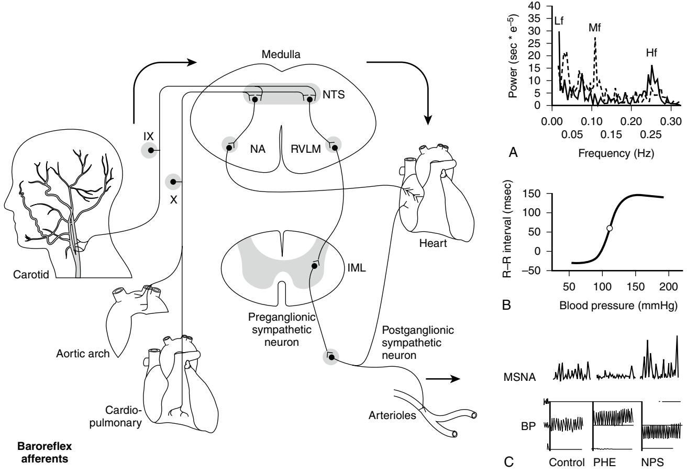
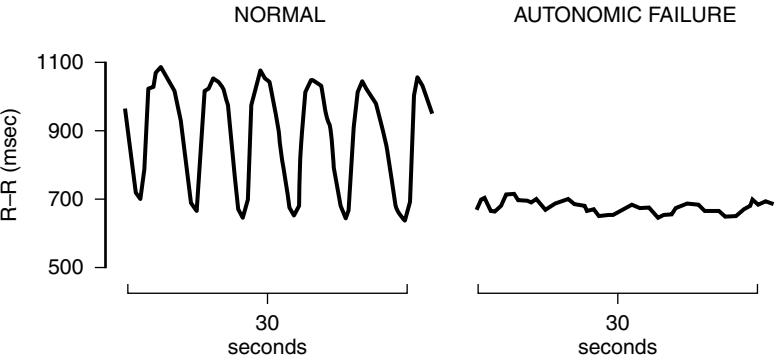
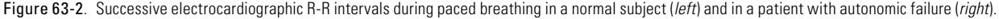
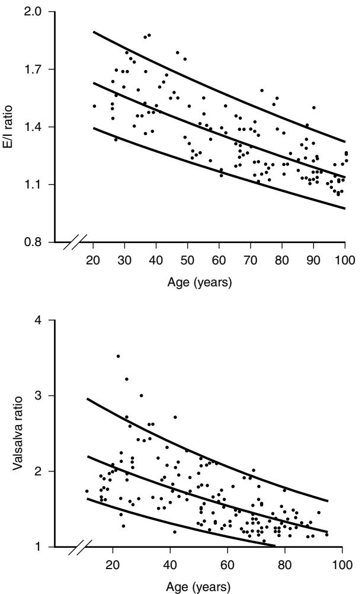
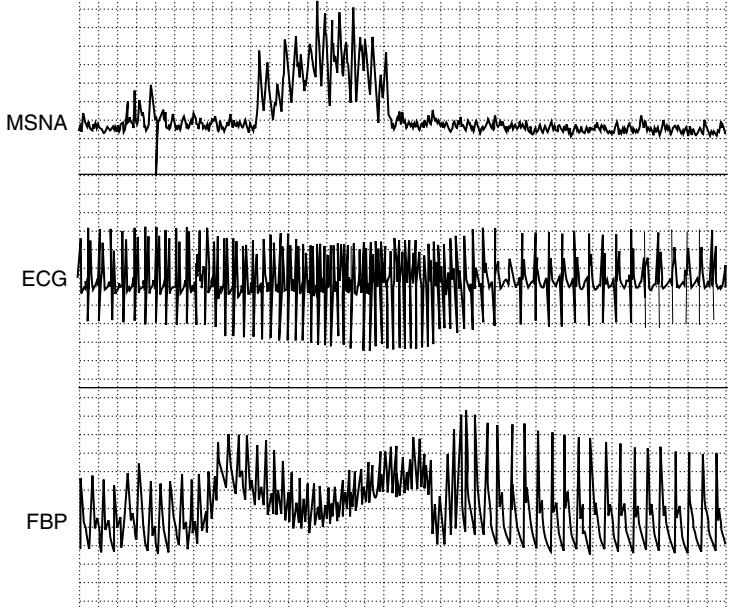
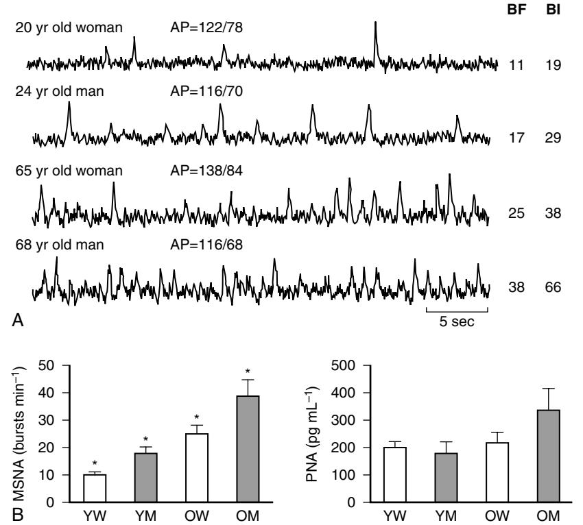
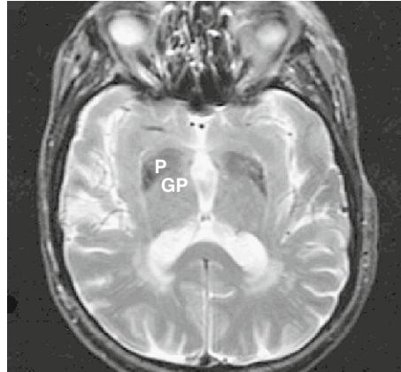

# Disorders of the Autonomic Nervous System

Horacio Kaufmann Italo Biaggioni

We will focus on the consequences of aging on autonomic cardiovascular control. The neurobiology of aging and the effects of aging on gastrointestinal and urinary tract function are detailed in other sections in this book.

We will first provide a brief summary of autonomic pathways involved in cardiovascular control, and the methods used to assess their function. We will then review the effect of aging on the different components involved in autonomic cardiovascular control, namely, alterations in afferent and efferent function, and in end-organ responsiveness. We will then discuss the integrated effect of these changes on the response of elderly people to daily stresses of life (i.e., response to upright posture and to food ingestion). We conclude by discussing pathologic disorders of the autonomic nervous system that are present clinically in elderly people, such as orthostatic hypotension, syncope, pure autonomic failure, and multiple system atrophy.

# **BASIC CONCEPTS OF AUTONOMIC PHYSIOLOGY Autonomic pathways**

Autonomic regulation depends on three main components. Afferent fibers continuously sense changes in blood pressure (baroreceptors), blood content of oxygen, and other chemical signals (chemoreceptors), pain (sensory afferents), and cortical stimulation. These signals are integrated in brainstem centers that ultimately modulate sympathetic and parasympathetic outflows, which are transmitted to target organs via efferent fibers. The baroreflex provides an example of these pathways (Figure 63-1). This is a redundant system, with input from multiple independent afferent pathways that ensure maintenance of cardiovascular regulation even after partial damage.1 The afferent limb of this reflex includes pressure-sensitive receptors located in the walls of cardiopulmonary veins, the right atrium, and within almost every large artery of the neck and thorax, but particularly within the carotid and aortic arteries. Stimulated by stretch, these low- and high-pressure baroreceptors monitor venous and arterial pressures, respectively, and relay that information to brainstem centers. Information both from the venous and the aortic arch baroreceptors is carried centrally via fibers that course within the vagus nerve (X cranial nerve). Carotid sinus baroreceptor nerve activity is relayed centrally by passage first through the carotid sinus (Hering's) nerve, then through the glossopharyngeal nerve (IX cranial nerve) before arriving at the same brainstem centers.

Afferent fibers from these multiple baroreceptors have their first synapse in the nucleus tractus solitarii (NTS) of the medulla oblongata.2 This nucleus inhibits sympathetic tone and is crucial to baroreflex function. Its destruction (e.g., by experimental lesion3 or neurologic damage)4 leads to loss of baroreflex function, resulting in episodes of hypertension and tachycardia.5 In addition to the afferent input arising from the baroreceptors, the NTS also receives modulating

*498*

input from many other cardiovascular brain centers, such as the area postrema. The NTS provides excitatory inputs to the caudal ventrolateral medulla (CVLM), which in turn inhibits the rostral ventrolateral medulla (RVLM),6,7 where the pacemaker neurons that originate sympathetic tone are believed to be located.8 RVLM neurons project to the preganglionic sympathetic neurons in the intermediolateral column of the spinal cord that send fibers outside the CNS. Parasympathetic activity is also modulated by the NTS, through projections to preganglionic parasympathetic neurons in the nucleus ambiguus and the motor nucleus of the vagus (Figure 63-1).

The importance of autonomic mechanisms in the regulation of blood pressure is most evident when they fail. Damage of baroreflex afferents (e.g., as consequence of radiation or surgery, leads to labile blood pressure that is very difficult to control).5 At the other extreme, degeneration of central or efferent structures, as seen in patients with primary autonomic failure, leads to disabling orthostatic hypotension.9 In the most severe cases, patients are unable to stand but for few seconds before profound orthostatic hypotension and loss of consciousness ensues. These disorders are described later in this chapter.

# **Methods used to test autonomic function POSTURE (ORTHOSTATIC) TEST**

Perhaps the most informative and simplest autonomic evaluation is the posture test. The patient's blood pressure and heart rate are measured after 5 to 10 minutes in the supine position, and repeated after the subject stands motionless for 3 to 5 minutes. There is some value in repeating measurements at each of these time points, but just one measurement is informative. Virtually all patients with severe autonomic failure will have an immediate fall in blood pressure on standing. Other autonomic conditions associated with delayed orthostatic hypotension require a 30-minute stand test for their diagnosis,10 but these are usually not associated with widespread autonomic neuropathy. Heart rate is crucial in interpreting blood pressure changes. Patients with severe autonomic failure characteristically have no or little (about 10–15 beats/min) increase in heart rate despite profound orthostatic hypotension. A greater increase in heart rate usually indicates that other conditions (e.g., volume depletion or medications) are contributing to orthostatic hypotension.

# **NONINVASIVE AUTONOMIC TESTS**

Heart rate responses to deep breathing (i.e., respiratory sinus arrhythmia) and to the Valsalva maneuver are simple yet informative autonomic tests. They require real-time monitoring of heart rate. Respiratory sinus arrhythmia is assessed during controlled breathing at a rate of six deep breaths per minute (Figure 63-2). The sinus arrhythmia ratio is calculated by dividing the longest to the shortest R-R interval. This expiratory/inspiratory (E/I) ratio decreases progressively with age. Subjects younger than 40 usually have a ratio

Figure 63-1. Simplified anatomic/functional scheme of baroreflex function. Afferent fibers located in the right atrium and in the cardiopulmonary veins (low-pressure baroreceptors), and in the aortic arch and carotid sinus (high-pressure baroreceptors) are activated by stretch, and relay this information through the vagus (X) or glossopharyngeal (IX) nerves to the nucleus tractus solitarii (NTS) of the brainstem. The NTS provides excitatory inputs to the caudal ventrolateral medulla, which in turn inhibits the rostral ventrolateral medulla (RVLM)6,7 (for simplicity the NTS is shown as projecting direct inhibitory pathways to the RVLM), where pacemaker neurons that originate sympathetic tone are believed to be located. These cell bodies send their efferent projections through the intermediolateral column of the spinal cord (IML). Baroreflex function can be simplified as follows: an increase in blood pressure is detected by arterial baroreceptors, which increase their firing into the NTS; activation of the NTS leads to a greater inhibitory output to the RVLM; inhibition of pacemaker cells in the RVLM results in a compensatory reduction in sympathetic tone. Conversely, a decrease in blood pressure results in decreased firing in the NTS, withdrawal of the inhibitory influence of this nuclei on the RVLM, and a compensatory increase in sympathetic tone. Parasympathetic activity is also modulated by the NTS, through projections to the nucleus ambiguus (NA). An increase in blood pressure will lead to activation of the NTS and of the NA, with increased parasympathetic activity. Methods to assess baroreflex function include (A) spectral analysis, by correlating spontaneous changes in blood pressure and heart rate, and (B) by the neck barocuff method. Results obtained by these methods are influenced by afferent baroreceptor input, brainstem pathways, and end-organ responsiveness. Baroreflex modulation of sympathetic activity can be assessed with (C) microelectrode recording of postganglionic efferent sympathetic nerve activity (MSNA). In this example, blood pressure increment with phenylephrine (PHE) produced a baroreflex-mediated decrease in MSNA and blood pressure reduction with nitroprusside (NPS) produces a baroreflex-mediated increase in MSNA.

Figure 63-3. (*Top*) Expiratory/inspiratory (E/I) ratio during paced breathing in normal subjects according to age. Linear regression and confidence limits are shown. (*Bottom*) Valsalva ratio in normal subjects according to age. Linear regression and confidence limits are shown.

less than 1.2 (Figure 63-3). A Valsalva maneuver is induced by having the subject blow against a 40 mm Hg pressure for 12 seconds. A 5 to 10 cc syringe can be used as a mouthpiece and can be connected to a sphygmomanometer to monitor pressure. A small leak should be introduced into the system to ensure the subject uses thoracic effort. The increase in intrathoracic pressure produces a transient fall in blood pressure with narrowing of pulse pressure during phase II (strain), whereas blood pressure overshoots above baseline values during phase IV (after release) (Figure 63-4). In autonomic failure blood pressure continues to fall during phase II and the normal overshoot is absent during phase IV. Thus appropriate evaluation of the Valsalva response requires continuous recording of blood pressure, which can be accomplished noninvasively with finger plethysmography (Finapress, Portapress) or tonometry of the radial artery (Colin). Even if blood pressure cannot be monitored, however, heart rate responses are useful. The blood pressure changes described previously produce reciprocal baroreflex-mediated changes in heart rate; heart rate increases during the hypotensive phase II of the Valsalva maneuver, and decreases during the blood pressure overshoot of phase IV. The Valsalva ratio is calculated by dividing the fastest heart rate during phase II by the slowest heart rate during phase IV. As with the E/I ratio, the Valsalva ratio decreases with age and results should be interpreted accordingly (see Figure 63-3).

#### **SPECTRAL ANALYSIS OF HEART RATE AND BLOOD PRESSURE**

Blood pressure and heart rate are kept within a relatively narrow range because of autonomic baroreflex mechanisms. Within this narrow range, however, blood pressure shows substantial variability. Most of this variability is not random, but follows natural rhythmic patterns, which can be studied using spectral analysis techniques. These patterns are importantly modulated by the respiratory frequency. In particular, respiration frequency influences heart rate variability, and this interaction is under baroreflex control via the vagus

Figure 63-4. Muscle sympathetic nerve activity (MSNA), electrocardiogram (ECG), and blood pressure (FBP) during Valsalva maneuver in a normal subject.

nerves. The "respiratory peak" of heart rate variability, evident in the high-frequency spectrum, can be used to assess cardiac parasympathetic function. Respirations also modulate blood pressure, but this is mediated through mechanical events and does not reflect autonomic mechanisms and is not affected by autonomic blockade.11 In contrast, blood pressure shows a lower frequency rhythm (Mayer waves). This is mediated in part by sympathetic modulation of vascular tone. There is substantial interindividual variability in the spectral analysis of heart rate and blood pressure, making these methods less suitable for the diagnosis of individual patients with less than severe autonomic impairment. Nonetheless, population studies have shown that impaired heart rate variability as shown by spectral analysis of heart rate is an independent predictor of mortality in patients after myocardial infarction, and in patients with diabetes mellitus.

# **Assessment of baroreflex function**

Several methods can be used to quantify the changes in heart rate (or R-R interval) produced by unit change of blood pressure. These methods require the simultaneous monitoring of blood pressure and heart rate. Baroreflex function can be assessed by measuring the reciprocal changes in blood pressure and heart rate that occur spontaneously, or during the phase IV of the Valsalva maneuver. Blood pressure can be increased with phenylephrine or decreased with nitroprusside and the gain of the baroreflex expressed as the change in R-R interval per unit of blood pressure (expressed in msec/ mm Hg) during the linear portion of this relationship. Each of these methods provides slightly different normative values of baroreflex gain. It is important to note that changes in blood pressure affect all baroreflex afferents, including carotid sinus and aortic high-pressure receptors and lowpressure receptors located in the venous circulation. The carotid sinus reflex can be selectively investigated by producing positive and negative pressure to the neck, to simulate decreases and increases in intracarotid pressure, respectively. All of the methods described above rely on instantaneous changes in heart rate, which depend exclusively on the parasympathetic limb of the baroreflex. The sympathetic limb of the baroreflex can be assessed by relating changes in blood pressure to reciprocal changes in muscle sympathetic nerve activity (see later discussion).

#### **BIOCHEMICAL ASSESSMENT OF SYMPATHETIC FUNCTION**

Plasma norepinephrine provides a useful measure of sympathetic activity. It is particularly useful when measuring acute changes to standard stimuli. For example, upright posture induces a doubling of plasma norepinephrine. Patients with autonomic impairment have a blunted response. Basal norepinephrine, however, is different depending on the underlying pathology. It is low in patients with PAF and normal or slightly decreased in patients with MSA (see later discussion). In contrast, patients with volume depletion will have enhanced norepinephrine response to upright posture.

# **ESTIMATION OF NOREPINEPHRINE SPILLOVER**

Despite the usefulness of plasma norepinephrine measurements, it is noteworthy that only a small percentage of the norepinephrine released by noradrenergic nerves actually reaches the circulation. Most of it is taken back into nerve terminals by the norepinephrine transporter (i.e., reuptake) or is metabolized. Norepinephrine clearance can be measured by infusing a known amount of titrated norepinephrine. During steady-state infusion, it is assumed that clearance of titrated norepinephrine reflects clearance of endogenous norepinephrine. Once clearance is calculated, the norepinephrine appearance rate into the circulation (spillover) can be estimated. A comprehensive review of the advantages and limitations of this technique is beyond the scope of this chapter and can be found elsewhere.12

# **MUSCLE SYMPATHETIC NERVE ACTIVITY**

Nerve activity can be recorded directly by introducing a recording electrode into an accessible peripheral nerve. Afferent and efferent fibers can be recorded using this technique. Sympathetic efferent activity can be selectively recorded by careful placement of the electrode. The peroneal nerve at the level of the knee is commonly used to measure postganglionic sympathetic nerve activity. Although there is considerable interindividual variability in muscle sympathetic nerve activity, baseline recordings expressed as sympathetic bursts per minute are highly reproducible in a single individual between different recording sites, and when measured on different occasions. Muscle sympathetic nerve activity effectively monitors central sympathetic outflow and is tightly modulated by the baroreflex. Stimuli that increases blood pressure by activating central sympathetic outflow will be reflected as an increase in muscle sympathetic nerve activity. Conversely, stimuli that increase blood pressure directly (e.g., an injection of phenylephrine), will produce baroreflex-modulated suppression of muscle sympathetic nerve activity. This recording is also exquisitely sensitive to sympathetic withdrawal. For example, sympathetic activity disappears during neurogenic syncope.13

# **EFFECT OF AGING ON THE DIFFERENT COMPONENTS OF AUTONOMIC CARDIOVASCULAR CONTROL Baroreflex function**

There is a progressive decline in baroreflex sensitivity with aging14 due to both vascular and neural deficits. Cardiovagal baroreflex gain (i.e., the reciprocal heart rate changes produced by changes in arterial pressure) declines with age, but the ability of the cardiopulmonary baroreflex to inhibit sympathetic nerve traffic has been reported to be well preserved with age in healthy adults. Hence, vagal, but not sympathetic baroreflex gains vary inversely with subjects' ages and their baseline arterial pressures. There is no correlation between sympathetic and vagal baroreflex gains.15

# **Cardiac parasympathetic function**

Cardiac vagal innervation decreases with age as clearly shown by a progressive reduction in respiratory sinus arrhythmia (see Figure 63-3). Experimental evidence suggests that long-term physical activity attenuates the decline in cardiovagal baroreflex gain by maintaining neural vagal control,16 but among older adults, the level of fitness does not prevent the decrease in cardiac vagal function, suggesting that the age decline in cardiac vagal function cannot be completely prevented by physical activity.17

# **Systemic sympathetic function**

Muscle sympathetic nerve activity (MSNA) increases progressively with age likely because of increased central nervous system drive (Figure 63-5). Sympathetic nerve traffic increases in a region-specific manner; however, outflow to skeletal muscle and the gut increases, but not to the kidney.18 The increase in central sympathetic outflow results in higher levels of plasma norepinephrine with age, but reduced norepinephrine clearance appears to play a role as well.19,20 It is suggested that age-related elevations in whole-body and abdominal adiposity can explain the increase in basal MSNA with age in healthy humans.21 The relation between body fat and MSNA is observed in both young and older populations.22 Tanaka et al21 showed that although body mass index (BMI) was similar in groups of younger and older subjects, both total body fatness and abdominal adiposity were greater in the older subjects and were directly related to baseline levels of MSNA. Preliminary data23 indicate that circulating concentrations of leptin are related to both adiposity and MSNA. Thus age-associated elevations in total and abdominal adiposity may be linked to increases in MSNA, at least in part, via elevations in leptin levels.18 In contrast to sympathetic neuronal activity, adrenaline secretion from the adrenal medulla is greatly reduced with age, and adrenaline release in response to acute stress is attenuated in older men. Plasma adrenaline concentration remains normal, however, because of reduced plasma clearance.

# **End-organ responsiveness**

Despite the number of β-adrenergic receptors in lymphocytes being unaltered with age24 and higher neurotransmitter levels, β-adrenergic responses to norepinephrine are blunted with progressive aging, probably because of β-adrenergic receptor downregulation in response to higher circulating levels of norepinephrine and a defect in G-protein receptor complexes and reduced adenyl cyclase activity.25,26 Depressed β1 responses lead to impaired cardioacceleration and reduced cardiac contractility. Reduced β2 responses are manifested by increased vascular tone because α1 vasoconstriction ability remains unchanged. The combination of age-related vascular stiffening and depressed β-adrenergic function result in reduced arterial baroreflex sensitivity27 in elderly subjects.28–30 This reduces cardioacceleration during hypotension.31 Reduced postural cardioacceleration, and decreased baroreceptor gain with age, increases the risk for orthostatic hypotension in elderly people.32,33 Blood pressure in older subjects is sustained by increased peripheral vascular tone, despite depressed cardioacceleration. Due to a higher reliance on vascular resistance, dehydration and vasodilator medications pose a high risk for hypotension and syncope in older subjects. On the other hand, vasovagal syncope is reportedly less frequent in elderly subjects.34 Postjunctional α-mediated vasoconstriction is also impaired in older adults.35

Figure 63-5. Age-associated increases in muscle sympathetic nerve activity. (A) Muscle sympathetic nerve activity (MSNA) from four healthy adult humans under supine resting conditions (*top to bottom*): young female, young male, older female, older male. MSNA burst frequency (BF; bursts min−1 ) and burst incidence (BI; bursts (100 heart beats)−1 ) are higher in the neurograms of the older adults in both sexes. However, the female subjects demonstrate lower MSNA than the males at each age. *AP,* arterial blood pressure. (B) Mean ± SEM; values for MSNA in four groups of subjects: young women (YW), young men (YM), older women (OW), and older men (OM). MSNA was at least twice as great in the older compared with the young subjects of the same sex. At each age, however, MSNA was significantly lower in the women. These age and sex differences in MSNA were not reflected in the corresponding antecubital venous plasma noradrenaline concentrations. *PNA,* plasma noradrenaline concentration; \*P < 0.05 versus all other groups. *(Reproduced from Seals and Esler.*18*)*

# **Vascular changes**

Aging stiffens blood vessels36 and alters vasomotor function. In elderly subjects, coronary vasodilation capacity is reduced because of reduced nitric oxide release by the senescent endothelium. Conversely, endothelin release by the endothelium is increased in elderly people, promoting vasoconstriction.37 These alterations increase susceptibility to myocardial ischemia, particularly during increased demand stresses such as tachyarrhythmias38 and may also impair cerebral autoregulation, increasing susceptibility to syncope. Other age-dependent cardiovascular alterations that may increase predisposition to syncope are increased left ventricular afterload, and myocyte hypertrophy. These alterations lead to impaired diastolic filling and chronic ischemia that may predispose subjects to cardiac arrhythmias and decrease ventricular volume that may manifest as syncope. Decreased preload volume precipitated by vasodilators, dehydration, or blood pooling can dramatically reduce cardiac output and precipitate syncope. Susceptibility to atrial fibrillation increases with age because of reductions in pacemaker cells, progressive fibrosis of the cardiac conduction system, and concomitant cardiovascular diseases that alter atrial morphology. In older patients, impaired diastolic filling and a reduction of up to 50% in cardiac output may develop during atrial fibrillation and lead to syncope.

# **Neuroendocrine changes**

Plasma renin and aldosterone levels fall with age39,40 and atrial natriuretic peptide increases fivefold to ninefold.41 The vasopressin response to hypotension may also be reduced.42 These changes make sodium and water conservation less effective and intravascular volume depletion more frequent, thus increasing the tendency for syncope. In addition, many elderly people have an impaired thirst response to increases in osmolality and do not consume sufficient fluids to prevent hypovolemia.

# **EFFECT OF AGING ON AUTONOMIC RESPONSE TO STRESS**

The most frequent autonomic stress is the cardiovascular adaptation to upright posture and other physiologically induced changes in intravascular volume. Vascular and neurogenic dysfunction, and a host of medications, can cause orthostatic hypotension in the elderly. In the Cardiovascular Health study,43 the prevalence of orthostatic hypotension was 18% in subjects age 65 years or older, although only 2% of the subjects reported dizziness with standing. There was a modest association with systolic hypertension when supine, carotid stenosis greater than 50%, and with the use of oral hypoglycemic agents, but only a weak association with the use of β-blockers and no association with other antihypertensive drugs. In other reports, however, as expected, the use of antihypertensive medications was significantly related to postural hypotension in elderly people44 and discontinuing antihypertensive medications led to an improvement of orthostatic hypotension.

# **Orthostatic hypotension**

Elderly people have impaired defenses against the fluid shifts that normally accompany upright posture. Their threshold to develop symptomatic orthostatic hypotension is, therefore, lower compared with younger subjects. A variety of symptoms develop with a reduction in blood flow to the brain. Typically, patients will complain of visual disturbances (e.g., blurring, tunneling, or darkening of vision), dizziness, lightheadedness, giddiness, feeling faint, and a dull neck and shoulder ache (coat hanger pain). When orthostatic hypotension is pronounced and cerebral blood flow decreases below a critical level (approximately 25 mL/min per 100 grams), syncope (i.e., loss of consciousness) occurs. A decrease in baroreceptor sensitivity is probably involved in the mild, frequent postural hypotension seen in elderly people. One study, for example, showed a diminished response to tilt (a baroreceptor-mediated response) but not to non–baroreceptor-mediated stimuli, such as the cold pressor test or isometric exercise.45 The reduced baroreceptor response in elderly people (when compared with younger controls) was seen in both hypertensive and normotensive subjects. Insults that would be compensated for in the young may induce symptomatic hypotension in elderly people. For example, drug-induced orthostatic hypotension is the cause of recurrent dizzy spells or syncope in 12% to 15% of elderly patients and should always be suspected.46 Diuretics, calcium antagonists, angiotensin-converting enzyme (ACE) inhibitors, and nitrates are frequently prescribed in elderly patients for the management of hypertension, congestive heart failure, and ischemic heart disease. Other pharmacologic agents frequently associated with orthostatic hypotension include phenothiazines, antidepressants, sedatives, and narcotics. Similarly, prolonged bed rest is frequent in elderly people and an important cause of cardiovascular deconditioning. Several mechanisms contribute to decreased orthostatic tolerance and syncope after prolonged bed rest.47 Bed rest reduces extracellular fluid volume, and the skeletal muscle deconditioning impairs the lower limb muscle pump that facilitates venous return in the upright posture. Under normal conditions, important mechanical adjustments to counteract orthostatic pooling of the blood are the muscle and respiratory pumps. Skeletal muscle tone has critical bearing on the volume of blood displaced into the legs when standing. Because intramuscular pressure is decreased after prolonged bed rest, venous pooling augments and venous return to the heart is easily compromised in the standing posture. Thus skeletal muscle atrophy due to prolonged bed rest should be considered as a primary or aggravating factor in any patient with symptoms of light-headedness on standing or documented orthostatic hypotension. If the problem persists after adequate measures are taken, a pathologic impairment of autonomic function should be considered. The occurrence of orthostatic hypotension in elderly people is predictive of mortality.48 A study of 3522 Japanese-American men, age 71 to 93 years, found that orthostatic hypotension, defined as a decrease in systolic blood pressure by 20 mm Hg or in diastolic blood pressure by 10 mm Hg, was present in 7% and increased with age.

# **Postprandial and heat-induced hypotension**

A frequent reason for falls and syncope in elderly people is postprandial and heat-induced hypotension.49,50 In normal subjects, eating, especially carbohydrates, is accompanied by splanchnic vasodilation, and hot weather produces cutaneous vasodilation but there is little change in arterial pressure because of a compensatory increase in sympathetic vasoconstrictor outflow. In elderly people, however, similarly to what occurs in patients with autonomic failure, both eating and hot weather significantly lower blood pressure (even in the supine position) because these subjects cannot compensate for the vasodilation with an appropriate increase in sympathetic outflow.51,52 Among elderly residents of nursing homes, for example, 24% to 36% have a 20 mm Hg or greater fall in systolic blood pressure within 75 minutes after eating a meal.53 In patients with autonomic failure, postprandial hypotension occurs within 30 minutes of meal ingestion, lasts about 1.5 to 2 hours, and can be profound; blood pressure falls of as much as 50 to 70 mmHg can be observed. This is not only a useful diagnostic test, but it is important to consider the timing of meals when measuring blood pressure in these patients. The initial syncopal episode in patients with chronic autonomic failure is frequently triggered by postprandial hypotension.

# **DISORDERS OF THE AUTONOMIC NERVOUS SYSTEM IN ELDERLY PEOPLE Neurally mediated syncopal syndromes**

The most frequent cause of hypotension and syncope in otherwise normal subjects is neurally mediated syncope, also referred to as vasovagal, vasodepressor, or reflex syncope. Vasovagal syncope is generally, although not exclusively, observed in patients with no evidence of structural heart disease. Prodromal symptoms include dizziness, blurred vision, nausea, and diaphoresis. This syncope results from acute vasodilation and bradycardia. According to the apparent trigger mechanism, neurally mediated syncope can be classified in several distinct syndromes: emotional faint, carotid sinus syncope, micturition or gastrointestinal syncope, glossopharyngeal or trigeminal syncope, ventricular or neurocardiogenic syncope, and exercise syncope (commonly seen in aortic stenosis).

Neurally mediated syncope is an acute hemodynamic reaction produced by a sudden change in autonomic nervous system activity.54 The normal pattern of autonomic outflow that maintains blood pressure in the standing position (increase sympathetic and decreased parasympathetic activity) is acutely reversed. Parasympathetic outflow to the sinus node of the heart increases, producing bradycardia, while sympathetic outflow to blood vessels is reduced, resulting in profound vasodilation.

Classic neurally mediated syncopal syndromes are triggered after compression of carotid baroreceptors in the neck (carotid sinus syncope),13 following rapid emptying of a distended bladder (micturition syncope)56 or distention of the gastrointestinal tract.55 Glossopharyngeal or trigeminal neuralgia can induce syncope by a similar mechanism.57,58 In several clinical types of neurally mediated syncope the trigger locus is easily identified, but frequently neurally mediated syncope occurs with no obvious trigger. Although in these cases the source of abnormal afferent signals was believed to be sensory receptors in the heart (i.e., neurocardiogenic or "ventricular" syncope,59,60 neurally mediated syncope has recently been induced in patients with heart transplants in whom the ventricle is likely to be denervated.61 Perhaps sensory receptors in the heart transplant patients are in the arterial tree rather than the ventricle. Similarly, the threshold to trigger neurally mediated syncope can be lowered by a reduction in cardiac preload caused by reduced intravascular volume or excessive venous pooling. Intravascular volume depletion is common in elderly people because sodium and water conservation are less effective, renin and aldosterone levels fall, atrial natriuretic peptide increases, and the vasopressin response to hypotension may be reduced. Moreover, many elderly subjects have an impaired thirst response to increases in osmolality and are prone to hypovolemia, particularly during febrile illnesses. Excessive venous pooling occurs postprandially in the splanchnic circulation, in the skin during exposure to heat, and in the lower limbs because of muscle atrophy when standing after prolonged periods of bed rest, significantly increasing susceptibility to syncope.

Despite the diverse trigger mechanisms of these different types of neurally mediated syncope, the efferent reflex response is remarkably similar. There is an increase in parasympathetic efferent activity to the sinus node producing bradycardia or even a few seconds of sinus arrest, and a decrease in sympathetic activity responsible, at least in part, for the fall in blood pressure. Bradycardia is not the only or even the main cause of hypotension because neither atropine nor a ventricular pacemaker, which prevent bradycardia, is able to prevent hypotension and syncope. Blood pressure falls mainly because of vasodilation. The mechanisms responsible for vasodilation are not completely understood. Sympathetic efferent activity decreases as shown by studies using microneurography and measurements of circulating norepinephrine.62–64 Sympathetic "withdrawal," however, seems an incomplete explanation for profound vasodilation. Norepinephrine fails to increase but vasopressin, endothelin-1, and angiotensin II vasoconstrictor peptides, important to maintain blood pressure—which should partially compensate for the fall in sympathetic activity—increase normally during neurally mediated syncope.63 To explain the profound fall in blood pressure, β-mediated vasodilation induced by a rise in adrenaline has been postulated.65 Nitric oxide–mediated vasodilation due to a rise in cholinergic activity may be involved.54,66 In summary, current understanding of neurally mediated syncope shows inappropriate reduction in sympathetic nerve activity and norepinephrine release. There is an appropriate increase in epinephrine, angiotensin II, vasopressin, and endothelin release, and preliminary evidence suggests that nitric oxide synthesis is activated.

# **Baroreflex failure**

The most common cause of baroreflex failure is iatrogenic damage during neck surgery or radiation therapy of neural structures that carry afferent input from the baroreceptors. Neurologic disorders involving the nucleus tractus solitarii, where these afferents have their first synapse, can also produce baroreflex failure.4 In a few cases, the underlying cause is not found. Baroreflex function is impaired in essential hypertension, and may be transmitted as a genetic trait.67 It is not clear if these cases of baroreflex failure of unknown etiology represent the extreme of the spectrum of baroreflex impairment in essential hypertension. Baroreflex failure patients have severe labile hypertension and hypotension, often accompanied by headache, diaphoresis, and emotional instability. Wide fluctuations of blood pressure are observed, with systolic blood pressure ranging from 50 to 280 mm Hg. The hypertensive crises are accompanied by tachycardia, and are due to sympathetic surges, as documented by notable increases in plasma norepinephrine. Treatment with sympatholytics may provide some benefit, attenuating these surges of hypertension and tachycardia, but adequate blood pressure regulation is seldom achieved in the absence of functional baroreflexes. Of interest is that virtually all reported cases are due to bilateral lesions, whereas unilateral lesions are usually clinically silent. This clinical observation underscores the redundancy of the baroreflex system and its importance in cardiovascular regulation.

# **Chronic autonomic failure**

Autonomic failure is divided into primary and secondary forms. Primary autonomic failure is caused by a degenerative process affecting central autonomic pathways (multiple system atrophy [MSA]), or peripheral autonomic neurons (pure autonomic failure). Secondary autonomic failure results from destruction of peripheral autonomic neurons in disorders, such as diabetes, amyloidosis, and other neuropathies, and very rarely by an enzymatic defect in catecholamine synthesis (dopamine β-hydroxylase deficiency). In chronic autonomic failure, orthostatic hypotension and syncope are caused by impaired vasoconstriction and reduced intravascular volume. Vasoconstriction is deficient because of reduced baroreflex-mediated norepinephrine release from postganglionic sympathetic nerve terminals and low circulating levels of angiotensin II caused by impaired secretion of renin.68 In patients with autonomic failure and central nervous system dysfunction (i.e., MSA), impaired endothelin and vasopressin release also contribute to deficient vasoconstriction in the standing position.63,69

# **Primary autonomic failure**

Primary autonomic failure includes several neurodegenerative diseases of unknown cause: pure autonomic failure (PAF), in which autonomic impairment (i.e., orthostatic hypotension, bladder, and sexual dysfunction) occurs alone; MSA (also called Shy-Drager syndrome) in which autonomic failure is combined with an extrapyramidal and/or cerebellar movement disorder; Parkinson's disease (PD) in which autonomic failure is combined with an extrapyramidal movement disorder; and diffuse Lewy body disease (DLB), in which autonomic failure is combined with an extrapyramidal movement disorder and severe cognitive impairment.

Recent findings suggest that the same neurodegenerative process underlies MSA, PD, DLB, and PAF, as accumulation of α-synuclein in neuronal cytoplasmic inclusions occurs in all these disorders. A gene encoding for α-synuclein, a neuronal protein of unknown function, is mutated in autosomal dominant PD.70 Nonfamilial PD does not have the mutation but α-synuclein accumulates in Lewy bodies in these patients, suggesting a toxic role for aggregates of this protein.71 Interestingly, cytoplasmic inclusions in MSA also stain positive for α-synuclein,72 and Lewy bodies in PAF73 are strongly synuclein positive. Thus abnormalities in the expression or structure of α-synuclein or associated proteins may cause degeneration of catecholamine-containing neurons. α-Synuclein, therefore, is an important component of intraneuronal inclusions in PAF, PD, DLB, and MSA neurodegenerative disorders, all of which affect the autonomic nervous system to a variable degree. Thus these disorders are best classified as α-synucleinopathies. It is not surprising, therefore, that there is overlap in the clinical presentation of these disorders, and the clinical differences may reflect the type of deposits (forming Lewy bodies or not) and the localization of these deposits within the nervous system. These similarities and differences are discussed later.

#### **PURE AUTONOMIC FAILURE (PAF)**

Pure autonomic failure, a disorder first described by Bradbury and Eggleston is a sporadic, adult onset, slowly progressive degeneration of the autonomic nervous system characterized by orthostatic hypotension, bladder and sexual dysfunction, and no other neurologic deficits. Neuropathologic reports of patients with pure autonomic failure showed α-synucleinpositive intraneuronal cytoplasmic inclusions (Lewy bodies) in brainstem nuclei and peripheral autonomic ganglia.73,74 These patients are otherwise normal and their prognosis is relatively good. Complications are usually those related to falls and associated disorders.

#### **MULTIPLE SYSTEM ATROPHY**

Multiple system atrophy (MSA) is a term introduced by Graham and Oppenheimer in 1969 to describe a group of patients with a disorder of unknown cause affecting extrapyramidal, pyramidal, cerebellar, and autonomic pathways. MSA includes the disorders previously called striatonigral degeneration (SND), sporadic olivopontocerebellar atrophy (OPCA), and the Shy-Drager syndrome (SDS). The discovery in 1989 of glial cytoplasmic inclusions in the brain of patients with MSA provided a pathologic marker for the disorder (akin to Lewy bodies in Parkinson's disease), and confirmed that SND, OPCA, and SDS are the same disease with different clinical expression.75 MSA is a progressive neurodegenerative disease of undetermined cause that occurs sporadically and causes parkinsonism, cerebellar, pyramidal autonomic, and urologic dysfunction in any combination.76

Because parkinsonism is the most frequent motor deficit in MSA, these patients are regularly misdiagnosed as suffering from PD. Data from PD brain banks showed how frequently the diagnosis of PD was incorrect; up to 10% of these brains turn out to have MSA.77 Indeed, even case 1 of James Parkinson's original description (1817), upon which much of his description of paralysis agitans was based, was probably suffering from MSA.

Life expectancy in MSA is shorter than in PD. Ben-Shlomo et al78 analyzed 433 published cases of pathologically proven MSA over a 100-year period. Mean age of onset was 54 years (range 31–78) and survival 6 years (range 0.5–24). Survival was unaffected by gender, parkinsonian, or pyramidal features, or whether the patient was classified as SND or OPCA. Survival analysis showed a secular trend from a median duration of 5 years for publications between 1887 and 1970, to 7 years between 1991 and 1994. These figures may be biased toward the worst cases, however.

#### **PARKINSON'S DISEASE**

Autonomic dysfunction in Parkinson's disease is rarely as severe as in patients with MSA. There is a subgroup of patients with PD, however, with severe autonomic failure even early in the course of the disease. In most cases, autonomic failure occurs late in the course of the illness and is associated with levodopa and dopamine agonist therapy. In patients with PD, Lewy bodies are found in central and in peripheral autonomic neurons, and autonomic dysfunction in this disorder may be caused by both preganglionic and postganglionic neuronal dysfunction.

#### **DIFFUSE LEWY BODY DISEASE**

The clinical presentation of these patients is that of PD, but dementia often dominates the clinical picture. Autonomic failure is frequently associated with this disorder.

### **DIFFERENTIAL DIAGNOSIS AMONG THE** α**-SYNUCLEINOPATHIES**

During the early stages of MSA, autonomic deficits may be the sole clinical manifestation, thus resembling PAF, but after a variable period of time, sometimes several years, extrapyramidal or cerebellar deficits or both invariably develop. In PD, extrapyramidal motor problems are the presenting feature, but later in the disease process, patients may suffer severe autonomic failure, making the clinical distinction with MSA difficult. Complicating the distinction further, similar to what occurs in PD, some MSA cases display motor deficits before autonomic failure is apparent. In clinical practice all these possibilities lead to two main diagnostic problems. First, it cannot be determined whether a patient who has autonomic failure as the only clinical finding and is believed to have PAF, will develop more widespread nonautonomic neuronal damage and turn out to have MSA. Second, it may be difficult to establish if a patient with autonomic failure and a parkinsonian movement disorder has PD or MSA. Clinically, the classic parkinsonian resting tremor of unilateral predominance is rarely seen in patients with MSA, in whom bradykinesia and rigidity predominate. Also, with rare exceptions, patients with MSA do not respond as well to antiparkinsonian medications and the progression of disease is faster.

In addition to clinical criteria, several tests have been used to distinguish between PD, PAF, and MSA. For example, vasopressin release in response to hypotension and growth hormone secretion in response to clonidine are blunted in MSA but preserved in PAF and PD, because brainstem-hypothalamic-pituitary pathways are only affected in MSA.69,79 Plasma norepinephrine concentration while supine is frequently normal in MSA but low in PAF because postganglionic neurons are normal in MSA.80 Sphincter EMG shows denervation in MSA because the Onuf's nucleus in segments S2-S4 of the spinal cord is affected in MSA but is normal in PD.81

There are also important differences in cardiovascular control between MSA, PAF, and PD with autonomic failure. Although patients with MSA have substantial CNS degeneration, the brainstem centers where sympathetic tone originates (most likely the rostroventrolateral medulla) and distal pathways are intact. In support of this postulate, supine plasma norepinephrine is normal or slightly decreased in MSA, but this residual sympathetic activity is not baroreflex-responsive, hence their inability to maintain upright blood pressure. Furthermore, interruption of this residual sympathetic activity with the ganglion blocker trimethaphan leads to a profound decrease in supine blood pressure in MSA. In contrast, supine plasma norepinephrine is very low in PAF and treatment with trimethaphan produces small or no changes in blood pressure, indicating that the lesion is distal to brainstem centers.82

Similarly, sympathetic cardiac innervation is selectively affected in PD and PAF but is intact in MSA. Several studies using single photon emission computed tomography (SPECT) imaging with 123I metaiodobenzylguanidine (MIBG),83–85 and positron emission tomography (PET) with 6-[18F] fluorodopamine86 have shown abnormal cardiac sympathetic innervation in patients with PD, while it was normal in patients with MSA.87 This may turn out to be a useful diagnostic test to distinguish between PD and MSA because sympathetic innervation of the heart is impaired in PD, and not in MSA. Moreover, in a patient with presumed PAF, finding normal sympathetic cardiac innervation indicates a likely development of MSA.

# **AUTONOMIC AND NEUROENDOCRINE TESTING**

Numerous studies have described abnormal cardiovascular reflexes in MSA patients. A characteristic of MSA is that afferent and central autonomic and neuroendocrine reflex pathways are selectively affected, whereas postganglionic autonomic fibers are spared.69 Baroreceptor-mediated vasopressin release—a measurement of afferent baroreceptor function—is spared in PAF, and presumably in PD, but is blunted in MSA.69 Intravenous clonidine, a centrally active α2-adrenoceptor agonist that stimulates growth hormone (GH) secretion, also tests the function of hypothalamicpituitary pathways. Clonidine raised serum growth hormone in patients with PD and patients with pure autonomic failure but did not in those with MSA. This finding suggests that the growth hormone responses to IV clonidine can differentiate MSA from PD and pure autonomic failure, and suggests a specific α2-adrenoceptor-hypothalamic deficit in MSA.79

# **Brain imaging**

In patients with MSA, magnetic resonance imaging (MRI) of the brain can frequently detect abnormalities of striatum, cerebellum, and brainstem.88-92 Striatal abnormalities in MSA include putaminal atrophy and putaminal hypointensity (relative to pallidum) on T2-weighted images, and slitlike signal change at the posterolateral putaminal margin. The striking slitlike signal change in the lateral putamen corresponds to the area showing the most pronounced microgliosis and astrogliosis, and the highest amount of ferric iron, at necropsy. This abnormal intensity is frequently asymmetric (Figure 63-6).

Infratentorial abnormalities in patients with MSA seen on MRI include atrophy and signal change in the pons and middle cerebellar peduncle. The pontine base and the middle cerebellar peduncle may appear as high signal intensity on T2-weighted images and as low intensity on T1, suggesting degeneration and demyelination.

Figure 63-6. Moderate putaminal (P) hypointensity relative to the globus pallidum (GP) in a patient with parkinsonian multiple system atrophy (MSA-P), axial T2 weighting, 1.5 tesla MRI.

Most if not all these tests are frequently ambiguous and accurate methods to distinguish PD from other diseases with extrapyramidal involvement, particularly MSA, are needed. It is argued that because the diagnosis of MSA during life is based on clinical features, it can only be made with possible or probable certainty, and that definite diagnosis requires pathologic confirmation.

#### **TREATMENT**

There are no known treatments targeted at the underlying degenerative disorder or therapies that will modify the course of any of these disorders. Treatment outcomes of the motor abnormalities in MSA patients remain dismal. As mentioned before, these patients often do not respond to antiparkinsonian medications. Of the autonomic abnormalities, orthostatic hypotension is often treated successfully. An outline of treatment strategies is included later in this chapter.

# **Secondary autonomic failure CHOLINERGIC FAILURE**

Botulism and the Lambert-Eaton myasthenic syndrome (LEMS) impair the release of acetylcholine in both somatic and autonomic nerves, producing muscle weakness and cholinergic dysautonomia. Botulism presents as an ascending, predominantly motor polyneuropathy with cranial nerve involvement, beginning 12 to 36 hours after ingesting food contaminated with the neurotoxins of the anaerobic bacteria *Clostridium botulinum*. The toxin impairs the presynaptic calcium-associated release of acetylcholine leading to symptoms of cholinergic failure: dry eyes, dry mouth, blurred vision, dizziness, paralytic ileus, urinary retention, and anhidrosis. Treatment is supportive; respiratory failure and cardiac arrhythmia can occur. Recovery is often protracted with autonomic dysfunction lasting as long as 6 months after onset.

LEMS is an autoimmune disorder, most commonly paraneoplastic, associated with small-cell lung carcinoma. Autoantibodies to voltage-gated calcium channels, most commonly the P/Q type, have been found in these patients. Electrophysiologic and pharmacologic studies have reproduced the functional effects of LEMS in passively immunized mice, and confirmed that anti-P/Q-type calcium channel antibodies inhibit transmitter release from autonomic neurons and are likely to be responsible for the autonomic dysfunction in this syndrome.

Dry mouth, erectile dysfunction, proximal muscle weakness, and depressed tendon reflexes are characteristic.93–95 The risk of developing cancer is estimated to be 62% over the next 2 years following diagnosis; this risk decreases over time.93,96 Autonomic dysfunction is worse in older patients with a carcinoma94 but improves with treatment of the underlying carcinoma.95

#### **PANDYSAUTONOMIAS**

Pandysautonomias involve both sympathetic and parasympathetic neurons. Pandysautonomic neuropathies can be divided into preganglionic (most frequently demyelinating) and postganglionic (most frequently axonopathic).97 These neuropathies are acute or subacute with gradual but often incomplete recovery of autonomic function.97,98 Patients have blurred vision, dry eyes and mouth, nausea, vomiting, abdominal pain, diarrhea, constipation, and loss of sweating.

The acute pandysautonomias are uncommon in elderly people and affect almost exclusively healthy young individuals. Those with a protracted course and incomplete recovery are, more frequently, postganglionic axonal.97,99 The preganglionic demyelinating pandysautonomia with variable involvement of the somatic nervous system is part of a spectrum ranging from pure pandysautonomia—with minimal somatic deficits—to classic Guillain-Barré syndrome (GBS)100 and profound muscle weakness and may have a better outcome than the postganglionic axonopathic pandysautonomia.97 The cause of these pandysautonomias is unknown but a postinfectious or other immune-mediated process is postulated. In some cases they are paraneoplastic,101,102 and many patients have autoantibodies to ganglionic acetylcholine receptors (see later discussion). Patients with anti-Hu antibody-related paraneoplastic syndrome having progressive dysautonomia have also been described, both with acute onset and a subacute course of neurologic symptoms. Autonomic symptoms may improve with treatment of the underlying cancer.

Signs of autonomic hyperactivity or hypoactivity are present in one third to two thirds of patients with the acute inflammatory demyelinating polyradiculoneuropathy (AIDP) or GBS.103,104 In the majority of cases, there is mild autonomic hypoactivity with resting tachycardia because of decreased parasympathetic activity and ileus. Urinary retention is less common. With autonomic hyperactivity, sweating is excessive and there can be alternating hypertension or hypotension and alternating bradycardia or tachycardia. Mortality is increased with significant dysautonomia.105

Chronic small fiber (postganglionic) neuropathies can be metabolic (e.g., diabetes or amyloidosis), inherited (e.g., Fabry's disease), or infectious (e.g., HIV). Autonomic dysfunction in both amyloid and diabetes tends to involve all organs. Autonomic failure (orthostatic hypotension and a fixed heart rate) may be the presenting feature. More frequently, patients show a mixed pattern of distal small fiber autonomic and sensory neuropathy or predominantly small fiber sensory neuropathy with only mild autonomic involvement.101,106 The autonomic symptoms may accompany, precede, or follow the somatic neuropathy.107,108 Alternating diarrhea and constipation, explosive diarrhea, urinary retention, anhidrosis or gustatory hyperhidrosis may be present. Erectile dysfunction is the most common autonomic symptom in diabetes109,110 and sudomotor changes may be the earliest sign in diabetic neuropathy.111–114

Pandysautonomias are commonly associated with the acquired immunodeficiency syndrome (AIDS),115–117 often combined with a distal sensory polyneuropathy.118,119 Autonomic symptoms such as bladder and sexual dysfunction are present in up to 60% of patients.

Mild, chronic (or subacute) autonomic neuropathies or ganglionopathies, affecting both sympathetic and parasympathetic fibers, are sometimes associated with Sjögren's syndrome.101,102 Tonic pupils, sudomotor dysfunction, and cases of severe pandysautonomia have been reported.120

#### **AUTOIMMUNE AUTONOMIC GANGLIONOPATHY**

Acetylcholine is the neurotransmitter in sympathetic and parasympathetic autonomic ganglia, activating nicotinic receptors. Antibodies against ganglionic nicotinic receptors have recently been identified and proposed to play an causal role in cases of dysautonomia.121 Clinical presentation can be that of classic acute pandysautonomic following a viral type of illness, or can be indistinguishable of pure autonomic failure. Recent reports show complete (but in some cases transient) recovery in a few patients with acute pandysautonomic that were treated early with intravenous immunoglobulin therapy122 or plasma exchange.123 Although encouraging, it is difficult to establish a definitive treatment of this condition based on case reports, and it is likely that some form of immunosuppression will be needed to manage these patients. Nonetheless, they do provide preliminary evidence of the causal role of these antibodies in causing autonomic impairment.

# **MANAGEMENT OF ORTHOSTATIC HYPOTENSION**

# **Pathophysiology-guided therapy**

Maintenance of blood pressure in the standing position requires a sustained increase in peripheral vascular resistance (i.e., vasoconstriction) and adequate intravascular volume. In patients with chronic autonomic failure, orthostatic hypotension is due to deficient baroreflex-mediated vasoconstriction and also because of reduced intravascular volume and reduced venous return.

#### **DEFICIENT VASOCONSTRICTION**

In autonomic failure, vasoconstriction is mainly deficient because of reduced baroreflex-mediated norepinephrine release from postganglionic sympathetic nerve terminals and lack of activation of postsynaptic α-adrenergic receptors in the vascular wall.68 Also contributing to blunted orthostatic vasoconstriction in these patients are low circulating levels of angiotensin II resulting from deficient renal sympathetic innervation and reduced secretion of renin.9,124 In patients with autonomic failure and central nervous system dysfunction (i.e., MSA), impaired endothelin and vasopressin release are also likely to contribute to the deficient vasoconstriction.63,69

# Summary of Management Algorithm

### **Stepwise approach to the management of orthostatic hypotension in elderly people**

- Remove aggravating factors:
- Volume depletion
- Drugs (e.g., diuretics, tricyclic antidepressants, venodilators, antihypertensives, insulin in diabetics with autonomic impairment)
- Inactivity/prolonged bed rest/deconditioning
- Alcohol
- Nonpharmacologic treatment:
- Liberalized salt intake
- Head-up tilt during the night
- Waist-high support stockings
- Exercise/physical activity as tolerated
- Pharmacologic treatment:
- Sodium chloride 1 g with meals
- Fludrocortisone (Florinef) 0.1–0.2 mg/day
- Midodrine (Proamatine) 5–10 mg PRN
- Yohimbine 5.4 mg PRN
- Pyridostigmine 30–60 mg PRN
- Atomoxetine 18 mg PRN

## **REDUCED INTRAVASCULAR VOLUME**

There are several reasons for reduced extracellular fluid volume in patients with autonomic failure. First, impaired sympathetic activation directly decreases sodium reabsorption in the kidney.125 Second, impaired sympathetic activation inhibits renin secretion so that aldosterone is low and renal sodium reabsorption is decreased.121 Finally, other hormones involved in fluid homeostasis are also impaired in autonomic failure. For example, hypophyseal vasopressin release in response to hypotension is markedly reduced in patients with autonomic failure caused by CNS lesions (e.g., MSA).69 Low vasopressin levels prevent water conservation contributing to intravascular volume depletion.

Anemia is a common complication of autonomic failure, likely the result of inadequate erythropoietin levels.126,127 Although basal erythropoietin synthesis is not reduced in autonomic failure, the increase in erythropoietin synthesis in response to anemic hypoxia appears to be blunted in these patients. The reason for this abnormality is unknown, but in patients with autonomic failure, the lower the plasma norepinephrine levels in the upright posture, the lower the hemoglobin levels, suggesting some relationship between decreased sympathetic activity and reduced erythropoiesis.126 Similar to what occurs with the secretion of renin, another renal hormone, decreased renal sympathetic nerve activity may be the cause of impaired erythropoietin response to anemia in patients with autonomic failure. The modest decrease in red blood cell mass is another contributing factor to reduced intravascular volume.

# **Nonpharmacologic treatment**

A complete medication history should be obtained to identify and possibly eliminate agents that can cause orthostatic hypotension, such as antihypertensives or diuretics. Levodopa and dopamine agonists exacerbate orthostatic hypotension, especially during the first weeks of treatment. Gradual dosage increases when initiating therapy or dose reductions in established patients can minimize this adverse effect. Dietary sodium and water intake should be maximally increased in these patients. Patients also should be instructed not to lie prone. Lying flat when sleeping at night results in accelerated sodium loss from pressure-natriuresis and reduced renin release leading to loss of intravascular volume. This leads to overnight volume depletion and worsening of orthostatic hypotension in the morning. Elevating the head of the bed by 6 to 9 inches is helpful. The beneficial effect of nocturnal head and torso elevation results from lessening supine hypertension, thus reducing "pressure-natriuresis" by the kidney and, in some patients, by increasing renin secretion. Patients should be educated about the hypotensive effects of food, hot weather, and physical exertion. Isotonic exercise produces less hypotension than isometric exercise, and exercise in a pool prevents blood pressure reductions. In patients with autonomic failure, eating can significantly lower blood pressure because the splanchnic vasodilation induced by food is not appropriately compensated by vasoconstriction in other vascular beds. In some patients, hypotension only occurs postprandially. Thus patients should eat frequent, small meals with a low carbohydrate content and alcohol intake should be minimized. Caffeine taken with breakfast may be helpful. Hot baths should be avoided, and patients should be especially careful during warm weather. This is because heat-induced vasodilation still occurs but sympathetic vasoconstriction is impaired. Straining at stool with a closed glottis (i.e., producing a Valsalva maneuver), playing wind instruments, and singing can be particularly dangerous for patients with hypotension. A high-fiber diet is encouraged to prevent constipation. The use of knee-high compressive stockings is not effective, but waist-high stockings (i.e., Jobst stockings) or abdominal binders may be an effective, albeit poorly tolerated, countermeasure for orthostatic hypotension.

# **Pharmacologic treatment**

Only patients with symptomatic orthostatic hypotension should be treated pharmacologically. Perhaps because of adaptive cerebral autoregulatory changes, some patients with autonomic failure tolerate very low arterial pressures when standing without experiencing symptoms of cerebral hypoperfusion. Blood pressure levels change throughout the day and from one day to another. Thus the patient's normal cycle of blood pressure and orthostatic symptoms should be identified before treatment is initiated. The treatment strategy is based on counteracting the underlying pathophysiology, by increasing intravascular volume (fludrocortisones, desmopressin, erythropoietin), potentiating the pressor effects of endogenous norepinephrine and angiotensin (fludrocortisone), or using short-acting pressor agents to improve upright blood pressure.

# **Fludrocortisone**

Fludrocortisone, a synthetic mineralocorticoid, is practically devoid of glucocorticoid effect.128 This pharmacologic action leads to sodium and water retention, but this effect is not targeted to the intravascular space and is only transient. It is postulated that its improvement in orthostatic hypotension is due to potentiation of the pressor effects of endogenous vasoconstrictors such as norepinephrine and angiotensin II. Therapy with fludrocortisone (Florinef) is initiated with a dose of 0.1 mg per day. At least 4 to 5 days of treatment are necessary for a therapeutic effect to be evident. Special attention should be given to the development of hypokalemia. Fludrocortisone increases extracellular and intravascular volume by increasing sodium reabsorption by the kidney, thus increasing cardiac output and standing blood pressure. The dose of fludrocortisone should be increased slowly. Body weight, blood pressure, and the possible development of heart failure because of volume overload should be monitored. Weight gain of 2 to 5 pounds is expected. A certain degree of pedal edema should not be of concern. Indeed, it may be necessary to support the venous capacitance bed (water jacket).

# **Desmopressin**

Desmopressin (DDAVP) is a synthetic vasopressin analog, which acts specifically on the V2 receptor (renal tubular cell) responsible for the antidiuretic effect of the hormone. At the dose given, DDAVP has no vasoconstrictor effect because it does not activate the V1 receptor, which is in vascular smooth muscle.129 Nocturnal intranasal administration of DDAVP reduces nocturnal polyuria and raises standing blood pressure in the morning without worsening supine hypertension.130 A problem with the use of DDAVP is the potential development of hyponatremia. Treatment with this drug, therefore, should always be started with caution, and serum sodium should be monitored.

# **Recombinant erythropoietin**

Anemia is a common complication of autonomic failure.126 Because blood pressure in autonomic failure is extremely sensitive to even small changes in intravascular volume, modest decreases in red blood cell mass and blood viscosity may exacerbate orthostatic hypotension. Recent studies in patients with autonomic failure have shown that reversing the anemia using recombinant erythropoietin increases upright blood pressure and ameliorates symptoms of orthostatic hypotension.126,127,131 Erythropoietin, a polypeptide hormone produced mostly by the kidney, plays a central role in the regulation of red blood cell production. The synthesis of erythropoietin is controlled by a feedback mechanism based on an oxygen sensor.132 When oxygen delivery to the kidney decreases, as with blood loss or chronic anemia, the synthesis of erythropoietin by renal interstitial cells increases.133 The hormone is released into the bloodstream and stimulates red cell progenitors in the bone marrow, thereby increasing red cell production. In some patients with autonomic failure, chronic anemia does not produce an adequate increase in serum erythropoietin levels.126,127,134 This is similar to what occurs in renal disease, malignancy, and other chronic disorders.

A likely mechanism for the increase in blood pressure following erythropoietin treatment is an increase in intravascular volume and blood viscosity because of increased red blood cell mass. In patients with renal failure receiving erythropoietin treatment, however, no correlation was found between increased blood pressure and increased hematocrit135; this suggests additional mechanisms for the hypertensive effect of the hormone.

# **Midodrine**

When volume expansion is not sufficient to control symptoms, a pressor agent should be added. The pressor agent of choice is now midodrine, a selective α1-adrenergic agonist, which is well absorbed after oral administration and does not cross the blood-brain barrier.9,136 A 10 mg dose of midodrine is effective in increasing orthostatic blood pressure and ameliorating symptoms in patients with orthostatic hypotension.137 Because this dose increases pressure for only 4 hours, it can be prescribed two or three times daily, depending upon the physical activity of the patient and can be avoided later in the day because it increases supine blood pressure. An advantage of a pressor agent over fludrocortisone is that its blood pressure raising effect lasts only a few hours. Thus it can be administered specifically when the patient needs it; typically before breakfast and before lunch and preceding physical activity.137 Recumbent hypertension is a common sideeffect but standing up readily lowers blood pressure. The dose of midodrine should be titrated slowly starting with 2.5 mg. The dose can be quickly increased to 10 mg two or three times a day based on the blood pressure response. Most patients with orthostatic hypotension require chronic treatment with fludrocortisone; it is likely that by adding midodrine to fludrocortisone, the dose of the latter can be reduced. This combination treatment may reduce the long-term complications associated with chronic mineralocorticoid administration. Piloerection and scalp itching are frequent side-effects, and may be used as evidence of a pharmacologic effect.

# **DOPS**

DL threo-dihydroxyphenylserine (DL-threo-dops [DOPS] is an unnatural amino acid that is converted to norepinephrine through a single decarboxylation step by the enzyme dopa decarboxylase. In patients with autonomic failure due to congenital dopamine β-hydroxylase deficiency (the enzyme that converts dopamine to norepinephrine), DOPS is extremely efficacious in relieving orthostatic hypotension.138,139 In patients with other forms of autonomic failure, DOPS140-142 showed a significant pressor effect and significantly ameliorated postprandial hypotension.

# **Pyridostigmine**

By inhibiting cholinesterase enzymes that degrade acetylcholine, pyridostigmine facilitates neurotransmission at the level of the autonomic ganglia. This results in an increase in blood pressure that is proportional to residual sympathetic tone. Thus pyridostigmine has the advantage of preferentially increasing blood pressure on standing, without worsening supine hypertension.143 On average, it is not as potent as other short-acting pressor agents, but it can be effective in a given patient.

# **Atomoxetine**

Residual sympathetic tone can also be harnessed in these patients by prolonging the actions of synaptic norepinephrine by inhibiting its reuptake with atomoxetine.144 In patients with multiple system atrophy and residual sympathetic tone, atomoxetine can be a potent pressor agent even at pediatric doses (18 mg). In contrast, it has little if any effect in patients with pure autonomic failure.

# **Other agents**

Several other agents have been used in the treatment of orthostatic hypotension in autonomic failure. Prostaglandin synthesis inhibitors (indomethacin, ibuprofen),145,146 and the somatostatin analog octreotide147,148 are sometimes effective in improving orthostatic hypotension. The dopaminergic blocker metoclopramide increases blood pressure in some patients with autonomic failure,149,150 but may aggravate or induce extrapyramidal symptoms. Moreover, it was recently reported that metoclopramide infusion acutely lowered blood pressure and worsened orthostatic tolerance in patients with autonomic failure, which should discourage the use of this drug in the treatment of orthostatic hypotension. β-blockers with and without intrinsic sympathomimetic activity (propranolol and pindolol) have been used,151 but we have not found them consistently effective. Clonidine, an α2-adrenergic agonist, has been used with occasional success in patients with severe pure autonomic failure by inducing peripheral vasoconstriction.152 Conversely, the α2 adrenergic antagonist yohimbine is often useful in less severe patients, by increasing residual sympathetic tone.153 Ergotamine by nasal inhalation has also been reported effective.154

# **Treatment of related conditions SUPINE HYPERTENSION AND DIURNAL BLOOD PRESSURE VARIATION**

In addition to orthostatic hypotension, two distinct features of autonomic failure are hypertension when the patient is supine and notable diurnal variation in blood pressure. The mechanism responsible for supine hypertension is unclear. It is surprising that despite low norepinephrine and low angiotensin levels, systemic vascular resistance is increased in patients with autonomic failure when they are supine. The nocturnal supine hypertension causes pressure-natriuresis. The subsequent reduction in extracellular fluid volume aggravates orthostatic hypotension in the morning. Patients with chronic autonomic failure frequently have elevated supine blood pressure and may be incorrectly diagnosed with arterial hypertension.

# **Postprandial hypotension**

Although the precise mediators of postprandial hypotension have not been fully characterized, adenosine and insulin are prime suspects. Not surprising, treatment of postprandial hypotension is targeted at these mediators. Caffeine, an adenosine receptor antagonist, and octreotide, which blocks the release of insulin, are effective in preventing postprandial hypotension.155,156 Octreotide may not be tolerated in patients with diabetic autonomic neuropathy because of gastrointestinal side effects. Acarbose, an α-glucosidase inhibitor, also prevents postprandial hypotension at doses of 50 to 100 mg, likely through its ability to prevent the quick rise in insulin levels that occurs after meals.157

# **SUMMARY**

Evaluations of antihypertensive therapy and nonpharmacologic interventions are the first steps in treating orthostatic hypotension. Hypotensive therapy should be discontinued if possible. Salt and fluid intake should be increased, and patients should be instructed to elevate the head of the bed and never to lie flat. Education about the effects of eating, hot weather, bathing, exercise, and rising quickly from a prone position will assist in effective behavior modification. If pharmacotherapy is needed, fludrocortisone, midodrine, and erythropoietin (for anemia) may be helpful in normalizing blood pressure regulation.

# KEY POINTS

Disorders of the Autonomic Nervous System

- Dysautonomia is common with age and with a variety of illnesses, which can be grouped as instances of primary autonomic failure (chiefly neurodegenerative) and secondary autonomic failure (paraneoplastic or autoimmune).
- Age-related changes in the autonomic nervous system are not uniform.
- Age-related baroreflex changes can be seen even in older adults who exercise regularly.
- Routine clinical tests of the integrity of the autonomic nervous system rely on orthostatic changes in blood pressure, heart rate responses to deep breathing, and assessment of baroreflex function.
- Orthostatic hypotension and neutrally mediated syncope are the most common manifestations of autonomic impairment in older adults.

For a complete list of references, please visit online only at www.expertconsult.com