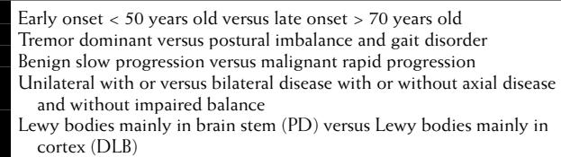

# Parkinsonism and Other Movement Disorders

Movement disorders can be broadly classified into the akinetic–rigid hypokinetic conditions in which voluntary movement is reduced and hyperkinetic conditions in which excess involuntary movements called dyskinesias are present (Table 64-1). Dyskinesias can be further classified into tremor, dystonia, tics, myoclonus, and chorea. This distinction is not absolute as, for example, in Parkinson's disease (PD), the most common akinetic–rigid syndrome, involuntary movements are often present. Akinetic–rigid syndromes are usually associated with poor mobility and difficulty with walking because of the presence of a gait apraxia.

Movement disorders are common in older age and are a significant cause of impairment, disability, and handicap.1 Once diagnosed, these disorders can often be effectively treated. These conditions often present medically in older people at an advanced stage. On an average posttake ward round, it is not uncommon in older patients to make the diagnoses of hitherto unrecognized essential tremor, parkinsonism, orofacial dyskinesia, or drug-induced movement disorder.

# **THE AKINETIC–RIGID SYNDROMES**

The akinetic–rigid syndromes are a group of disorders characterized by parkinsonism which results from the combination of akinesia, rigidity, and often, but not always, tremor (Table 64-2). Parkinsonism is often associated with impaired balance, and a gait apraxia leading to falls and impaired mobility. Levodopa-responsive parkinsonism of unknown cause that has particular clinical features, a characteristic clinical progression and Lewy body neuropathology in the substantia nigra (SN) is called *idiopathic parkinsonism* or *PD* and accounts for around 70% of cases of parkinsonism.2,3 The remaining causes of parkinsonism are due to drug-induced parkinsonism, vascular parkinsonism, and, much less frequently, multisystem degenerative conditions. These include progressive supranuclear palsy, multiple system atrophy, and corticobasal degeneration. With increasing age, not only does the risk of parkinsonism increase, but also the likelihood of parkinsonism being due to a cause other than PD increases.

# **PARKINSON'S DISEASE**

Although PD can present at any age and juvenile-onset forms are well described, it is a rare disorder outside of old age.4 Cross-sectional prevalence studies of PD and parkinsonism

|  | Table 64-1. Classification of Movement Disorders |  |  |
|--|--------------------------------------------------|--|--|
|--|--------------------------------------------------|--|--|

| Akinetic–Rigid States Parkinsonism                |
|------------------------------------------------------|
| Hyperkinetic States                                  |
| Tremor                                               |
| Chorea                                               |
| Dystonia                                             |
| Myoclonus                                            |
| Complex movement disorders                           |
| Drug-induced movement disorders (tardive dyskinesia) |

# Jolyon Meara

show at least two thirds of subjects to be over the age of 70 years. PD is usually insidious in onset and may have a long symptomatic phase before eventual diagnosis with symptoms being mistakenly attributed by patients and their physicians to the inevitability of "old age." The rate of progression in PD is strongly related to age at onset rather than to disease duration, which explains the often rapidly disabling disease seen in subjects with late-onset disease arbitrarily described as beginning after 70 years of age. Minimal signs of parkinsonism may result from normal aging changes in the basal ganglia, making the diagnosis of PD in the very elderly even more difficult.5

# **Clinical features**

Classically PD has been considered a localized disorder of motor control, which in young subjects is a reasonable assumption. However, the increasing realization of the widespread nature of neuropathology in PD, coupled with our increasing recognition of nonmotor symptoms, has now led to the concept of PD being a multisystem disorder.6 Nonmotor symptoms are increasingly common with disease progression and older age at disease onset and therefore are a major feature of PD in older subjects.7–9 Cognitive impairment, often progressing to dementia, is the most powerful factor that determines quality of life in older people with PD. Late-onset PD is probably best thought of as being primarily a dementing illness.10,11

# **Table 64-2. Causes of Parkinsonism**

## **Neuropathology**

PD is characterized by cell loss and gliosis in the SN and other pigmented brainstem nuclei that is often visible to the naked eye on sectioning the midbrain.12,13 Aging also results in cell loss in the substantia nigra, although the distribution of cell loss is very different from that seen as a result of PD.14 Surviving cells in the SN contain typical inclusions in the cytoplasm called Lewy bodies, which are now known to be largely an aggregation of a protein called alphasynuclein.15 Most cases of PD diagnosed in life are found to have Lewy bodies in the substantia nigra.16 However, Lewy body pathology in the substantia nigra does not necessarily lead to the clinical picture of PD and conversely, largely from the studies of familial parkinsonism, other pathologies not involving Lewy bodies can give rise to a clinical picture typical of PD.17,18 Lewy bodies are also found in other specific brain sites outside the brain stem including the cerebral cortex, olfactory bulb, and enteric plexi.19,20 Lewy bodies can be found in up to 10% of postmortem examinations in elderly subjects with no apparent history of parkinsonism in life (incidental Lewy body disease). It is unclear whether such individuals, if they had survived, would have developed PD or, because of protective mechanisms, were able to contain the disease process in a subclinical state.21 The role of the Lewy body in the pathology of PD is still unknown, and it is unclear whether the Lewy body represents a defense mechanism or the result of the primary disease process.

PD also involves the ascending serotonergic, noradrenergic, and cholinergic projections to the cortex and basal ganglia.22 Clinicopathologic studies have demonstrated that coexisting neuropathology within the striatum and in other areas of the brain is extremely common in elderly subjects with histologically confirmed PD.23 Braak has proposed that the primary degenerative process in PD, based on the assumption that the presence of Lewy bodies indicates neuronal loss, begins not in the substantia nigra but in the olfactory tracts, lower brain stem, and enteric nervous tissue.24 This model fits well with the increasing recognition that REM sleep disorders, hyposmia, and constipation may precede the motor symptoms of PD by several years. The proposed pattern of disease progression also indicates the potential for interaction with environmental agents via the olfactory system and gut.

#### **MOTOR FEATURES**

Akinesia is the central motor abnormality in PD that refers to a lack of spontaneous voluntary movement, slowness of movement (bradykinesia), and faulty execution of movement.25 Marsden brilliantly described akinesia as the "failure to execute automatic learned motor plans."26 Voluntary movements tend to be of low amplitude and to show increased fatigability. There is a particular difficulty with sequential and concurrent self-paced movements. Patients when asked to oppose the index finger to the thumb in a tapping motion often start with reasonably fast, large-amplitude movements but the speed and amplitude then rapidly decrease with the movement fading away. Akinesia in the lower limb is best tested by asking the patient to tap the heel of the foot on the floor as rapidly as possible—in this situation, akinesia can be heard as well as seen. Older patients often find bedside tests for akinesia difficult to execute and may perform poorly because of cognitive impairment, painful arthritis, restricted joint range, and muscle weakness. Action tremor from any cause may interfere with the quality of normal hand and finger movements, and this can make the assessment of akinesia difficult in the presence of essential or dystonic tremor.

Rigidity is an increased resistance of muscle to passive stretch felt by the examiner. Clinically, rigidity is best detected at the wrist joint. The subject is asked to relax as fully as possible while the examiner makes flexion and extension movements of the wrist joint with the subject's forearm supported. Passive movements of the head can be used to detect axial rigidity. Parkinsonian rigidity is not velocitydependent and is present to the same degree at all joint positions in flexion and extension ("lead-pipe" rigidity). Activation procedures, akin to the Jendrassik maneuver to enhance tendon jerks, can bring out "activated rigidity" that was not present before. Transient activated rigidity may be a normal finding in anxious individuals. Activated rigidity in the neck muscles may be the first sign of rigidity in PD. The presence of tremor in the upper limb due to any cause will result in a ratchet-like quality of intermittent resistance at the wrist joint called *cogwheel rigidity* that is not specific for PD.

Tremor, usually of the hand, is the presenting feature of PD in around 70% of cases. Hand tremor characteristically occurs at rest when the postural muscles are relaxed and has a frequency of around 4 to 6 Hz. In an anxious patient, postural tremor can easily be misidentified as a resting tremor. Most patients with PD manifest a range of resting, postural, and action tremors. A resting tremor of the hand involving the thumb and index finger described as "pill-rolling" and often brought out when the subject is observed walking is very suggestive of PD or drug-induced parkinsonism. Tremor usually begins insidiously in one hand before spreading to the leg on the same side. After a futher delay of sometimes a year or more, the opposite hand and leg become affected. Head and voice tremor, as opposed to jaw tremor, is unusual in PD and suggests a diagnosis of essential tremor. Rest tremor can occur in essential tremor but only when postural and action tremor is prominent. Rarely, PD can present with tremor alone (tremor dominant PD) with variable degrees of mild rigidity and akinesia found on examination. Tremor dominant PD is difficult to distinguish from essential and dystonic tremor. Subjects with a diagnosis of PD recruited into trials of neuroprotection in PD, who are subsequently found to have no evidence of nigrostriatal dysfunction on positron emission tomography (PET) and single-photon emission computed tomography (SPECT) scans, may well have dystonic tremor.

Postural balance can be assessed clinically by asking the patient to stand and then gently pushing the patient forward from behind, with the other hand in front to prevent a fall. Falls or feelings of imbalance strongly suggest the presence of impaired righting reflexes, even if this is not evident at the time of examination. Axial motor disturbances leading to gait disturbance, dysphagia, and dysarthria are a feature of late-onset PD and often respond poorly to drug treatment.

#### **NONMOTOR FEATURES**

Nonmotor symptoms, particularly hyposmia, sleep disorder, and constipation, may predate the onset of motor symptoms by many years. Nonmotor features of PD are very varied and with disease progression come to dominate the clinical picture.9,27 In late-onset PD, nonmotor features are usually advanced by the time of diagnosis and progress more rapidly than in earlier-onset disease. Autonomic system involvement leads to postural hypotension, urinary incontinence, sexual dysfunction, constipation, and abnormalities of sweating.28 The progression of PD pathology in the cerebral cortex leads to a range of neuropsychiatric and cognitive problems including dementia, psychosis, hallucinations, apathy, and depression.29,30 Sensory symptoms, usually painful in nature and involving the lower limbs, also occur and are difficult to treat successfully. A rating scale for nonmotor symptoms has recently been developed.31

Dementia and cognitive impairment are common problems in the management of PD in older subjects.32 The cause most frequently appears to be Lewy body pathology in the cerebral cortex.29 Dementia that develops a year or more after parkinsonian motor symptoms is described as PD dementia (PDD), whereas dementia present at the start of the illness is called dementia with Lewy bodies (DLB). These two conditions are generally thought to represent two ends of a spectrum of Lewy body disease.33,34 The risk of dementia in older subjects with PD is five times that of age-matched subjects without PD,11 and after 8 years of follow-up the prevalence of dementia may reach nearly 80%.10

Dysthymia, or mild depression, is fairly common in PD,7,35–37 but major depression is unusual in the absence of previous significant depressive illness. The natural history of depression/depressive symptoms in PD and the response to antidepressant drug treatment has to date been poorly studied.38 Apathy is also frequently described in subjects with PD and may be mistaken for depression.39 A range of nocturnal and daytime sleep disorders is now well described in PD and include rapid eye movement (REM) sleep behavior disorder and excessive daytime sleepiness.40

Visual hallucinations are common in PD and occur early in late-onset disease.41 Rather than simply being due to side effects from antiparkinsonian medication, visual hallucinations are now thought to directly be the result of Lewy body pathology in the ventral-temporal brain areas, indicating that the second half of the course of the disease has been reached.42,43 Visual hallucinations have been suggested as a useful marker to distinguish PD from non–Lewy body parkinsonism.43

Psychosis in PD usually occurs in older subjects with established cognitive impairment/dementia and again indicates the presence of significant cortical disease.44

Delirium in PD is also common in older subjects with cognitive impairment and is precipitated by the usual suspects commonly invoked in geriatric practice. All antiparkinsonian medications increase the risk of delirium, though this risk is greatest with anticholinergics, dopamine agonists, selegiline, and amantadine. Visual hallucinations commonly occur in conjunction with psychosis/delirium. Delirium has a remarkable but unexplained and little researched effect on motor symptoms in PD. Patients with acute delirium are often hyperactive and wander around the ward despite refusing all antiparkinsonian medication for days at a time. As the delirium lifts and medication is reintroduced, motor function again deteriorates to the previous parkinsonian state of frozen immobility.

## **Clinical diagnosis**

The diagnosis of PD is a two-stage process that is still dependent on clinical skills.45 First, the symptoms of parkinsonism need to be sought in the history and the signs of parkinsonism established by clinical examination. Progressively small handwriting (micrographia) with the written word disappearing into a shaky line is strongly suggestive of parkinsonism, though it is surprising how few people write letters by hand today. Difficulty turning over in bed is also a good clue to the early development of axial akinesia. A good witness account, usually from a spouse, is very useful in confirming the often rather general and nonspecific slowing down seen in older patients with PD. The gradual inability to keep up with a spouse on daily routine walks is again a useful early indication of gait disturbance and akinesia. Second, if parkinsonism is detected, consideration has to be given to what type of parkinsonism is present by applying validated clinical diagnostic criteria 23,46 (Table 64-3).

In older patients, the diagnosis of parkinsonism can be extremely difficult, even in expert hands, particularly when the clinical picture is complicated by other diseases, cognitive impairment, depression, and atypical features.47 A confident diagnosis of parkinsonism cannot always be made in older people, and sometimes a trial of levodopa therapy may be required. However, even the results of a 6-week trial of levodopa at adequate dosage (at least 600 mg daily) may be inconclusive. The use of DaTSCAN-SPECT imaging of the nigrostriatal tract using a radiolabeled tracer for the dopamine transporter may help distinguish atypical postural and action tremors in older patients leading to the correct diagnosis of PD, essential tremor, and dystonic tremor.48,49

How good are experts at distinguishing PD from other types of parkinsonism? Two important clinicopathologic brain bank studies have addressed this problem and have demonstrated that diagnostic accuracy for PD at death, when diagnostic accuracy is going to be highest, was only around 76%.23,50 Diagnostic accuracy in more recent cases

#### **Table 64-3. Guideline Diagnostic Criteria for Parkinson's Disease**

A progressive usually nonfamilial disorder with bradykinesia (slowness of initiation of voluntary movement, progressive reduction in speed and amplitude of repetitive movement, and difficulty switching smoothly from one motor program to the next) and at least one of the following: • Muscular rigidity

- Coarse 4 to 6 µHz resting tremor
- Impaired righting reflexes (not caused by primary visual, vestibular, cerebellar, or proprioceptive dysfunction)
- Absolute exclusion criteria are the following:
- Exposure to neuroleptic drugs within the year before the onset of symptoms or to MPTP
- Presence of cerebellar or corticospinal tract signs
- Past history of encephalitis lethargica or viral encephalitis with oculogyric crises
- Stepwise progression or a history of multiple strokes
- Presence of communicating hydrocephalus or a supratentorial tumor
- Presence of severe early autonomic failure
- Supranuclear gaze palsy

Modified with permission from Gibb WRG, Lees AJ. A comparison of clinical and pathological features of young and old-onset Parkinson's disease. Neurology 1988;38:1402–6.

#### **Table 64-4. Subtypes of Parkinson's Disease**

Modified from Meara J, Bhowmick BK. Parkinson's disease and parkinsonism in the elderly. In: Meara J, Koller WC, editors. Parkinson's Disease Parkinsonism in the Elderly. Cambridge: Cambridge University Press; 2000, pp. 22–63, with permission of Cambridge University Press.

referred to a brain bank was shown to have improved to around 84%.51 The use of stringent clinical diagnostic criteria can improve the specificity for correct diagnosis to over 90% but at the expense of a reduced sensitivity of around 70% as true but clincally atypical cases are excluded.

## **Clinical subtypes**

Clinical observation suggests that subtypes of PD exist, though surprisingly little scientific study of this phenomenon has been undertaken (Table 64-4).46,52,53 Late-onset disease tends to progress more quickly than early-onset disease (symptoms before the age of 40 years) and is more often associated with cognitive impairment.54 Patients in the longitudinal DATATOP study who were classified as having rapidly progressive disease were older, had more severe postural imbalance and gait disorder (PIGD group), and exhibited less tremor at study entry than the group with slowly progressive disease. Tremor-dominant disease was associated with less disability, less cognitive impairment, and less depression compared to a group with akinetic rigidity and postural imbalance. The DATATOP analysis suggested that cognitive function and motor deterioration were relatively independent once adjustment for age had taken place.54 However, patients with late-onset disease appear to become demented sooner than patients with early-onset disease of similar duration.55 The risk of disabling levodopa-induced dyskinesias appears to be much lower in patients with late- compared with early-onset disease. Motor fluctuations are also less evident in late-onset disease with the possible exception of the end-of-dose "wearing off" of drug benefit. A further probable subtype of PD is DLB, though some authorities would still argue that this is a separate disease entity.

The clinical expression and progression of PD with age is likely to reflect the impact of additional neuropathology from vascular or Alzheimer type pathology as well as effects of cell loss because of aging.56 Indeed, vascular and Alzheimer type changes in the striatum and cortex may protect elderly subjects from levodopa dyskinesia and motor fluctuations but reduce the therapeutic response to levodopa and increase the risk of cognitive impairment/dementia.

## **Epidemiology**

PD has a strong age-associated risk, and both prevalence and incidence increase exponentially with age.57,58 Whether incidence truly falls in extreme old age is still unclear. The apparent drop in incidence in extreme old age may reflect diagnostic difficulties or limitations of case ascertainment in small populations. PD affects all racial groups and, after adjusting crude rates to a standard population and allowing for differences in study methodologies, has a fairly uniform worldwide distribution of around 110 per 100,000.57 Differences in adjusted prevalence rates may still be explained by differential survival, diagnostic bias, and variable mortality rates. Population-adjusted prevalence rates for PD in European subjects over the age of 65 years have been reported as 2.3% for parkinsonism and 1.6% for PD.59 Studies in which all eligible subjects are examined using the total census approach have shown that up to a third or more of subjects ascertained as having PD were medically undiagnosed before the study.60,61 A longitudinal study of 4341 elderly subjects initially free of parkinsonism reported an average annual incidence rate for parkinsonism of 530 per 100,000 and 326 per 100,000 for PD.62

The strong age-associated risk of PD means that over the next few decades the burden of PD worldwide will increase, particularly in the most populous regions of the Far East and China where the greatest increase in older people and incident cases of PD will occur.63 The number of people over 50 with PD is likely to double in the 10 countries with the biggest populations over the next quarter of a century.63

Parkinsonism in institutional care has received little research attention despite the fact that 15 years from diagnosis around 40% of survivors will need long-term care.9 The prevalence of parkinsonism appears to be high in hospitals, nursing homes, and residential/retirement homes.64 A survey in the United States of 5000 nursing home residents over the age of 55 years reported a prevalence for medically diagnosed PD of nearly 7%.65 A European study found that 42% of cases of PD in elderly subjects living in institutions were medically undiagnosed.66 Nursing home residents with PD tended to be more disorientated, depressed, and functionally disabled than residents without PD.67,68 Psychosis and dementia are the two main factors increasing the risk of admission to nursing homes of elderly people with PD.67,68

## **Etiology**

The cause of sporadic PD is unknown but is likely to represent interaction between environmental agents and genetic susceptibility. Potential mechanisms to explain this interaction are suggested by the Braak hypothesis of disease progression,24 the existence of environmental neurotoxins such as 1-methyl-4-phenyl-1,2,2,6-tetrahydropyridine (MPTP),69 and the occurrence of incidental Lewy body disease.

Twin studies suggested that, apart from early-onset disease, genetic mechanisms were relatively unimportant in the etiology of PD.70 However, since then rare monogenic forms of familial parkinsonism have been described, the most common relating to mutations in the *LRRK2*, *Parkin,* and *PINK1* genes.71 A total of 13 genetic loci have been reported that result in dominant and recessively inherited parkinsonism usually of early onset and often with clinical features atypical of PD. These genes are most likely to be involved in protein degradation, oxidative stress responses, and mitochondrial function. Neuropathologic findings resulting from these gene mutations are variable but consistently reveal nigral degeneration with or without Lewy bodies. Even when the clinical picture is indistinguishable from PD, as occurs in *LLRK2* mutations, the pathologic findings can be remarkably varied. Mutations at the *LLRK2* locus result in dominantly inherited PD with reduced penetrance causing an age of onset typical of PD that may account for 1% of "sporadic" cases of PD.72

|                        | Table 64-5. Drugs Used to Treat the Motor Impairment |
|------------------------|------------------------------------------------------|
| in Parkinson's Disease |                                                      |

| Group             | Drug             | Trade name                      |
|-------------------|------------------|---------------------------------|
| Levodopa          | Co-careldopa     | Sinemet 110                     |
|                   |                  | Sinemet 275                     |
|                   |                  | Sinemet-plus                    |
|                   |                  | Sinemet-S                       |
|                   |                  | Sinemet CR, Half CR             |
|                   | Co-beneldopa     | Madopar 62.5                    |
|                   |                  | Madopar 125                     |
|                   |                  | Madopar 250                     |
|                   |                  | Madopar CR                      |
|                   |                  | Madopar dispersible 62.5/125 |
| COMT inhibitors   | Entacapone       | Comtess                         |
|                   | Tolcapone        | Tasmar                          |
| MAO-B inhibitors  | Selegiline       | Eldypryl                        |
|                   |                  | Zelapar (sublingual)            |
|                   | Rasagiline       | Azilect                         |
| Dopamine agonists | Bromocriptine    | Parlodel                        |
|                   | Pergolide        | Celance                         |
|                   | Ropinirole       | Requip                          |
|                   | Cabergoline      | Cabasar                         |
|                   | Pramipexole      | Mirapexin                       |
|                   | Apomorphine      | Britaject                       |
| Miscellaneous     | Amantadine       | Symmetrel                       |
|                   | Anticholinergics |                                 |
|                   | Levodopa plus    | Stalevo                         |
|                   | entacapone       |                                 |

Several environmental agents, such as MPTP and manganese, can cause parkinsonism, but no environmental exposure that is widespread enough and persistent enough over thousands of years to cause sporadic PD has yet been found.

#### **TREATMENT OF PD**

In the United Kingdom, a wide range of drugs is available to treat the motor symptoms of PD (Table 64-5). Detailed discussion of their use can be found in recent reviews of drug therapy.72–74 Clinical guidance from the National Institute for Clinical Excellence (NICE) in the United Kingdom has also been issued.75 Worldwide, many drugs for PD are either unavailable or unaffordable. Levodopa without dopa decarboxylase inhibitors would be a cheap and effective treatment for PD, though it would result in distressing nausea and discomfort for some patients for a time until tolerance developed. No drug treatment appears to delay disease progression. Drug treatment improves, though rarely abolishes, motor impairment.

Considerable interest has been generated by the recent concept of "continuous dopaminergic stimulation" as a strategy to try to replicate physiologic dopaminergic function in the basal ganglia.76 This has been fostered by the pharmaceutical industry with the development of a range of long-acting dopaminergic drugs. The thrust of this approach is to prevent or delay the future emergence of levodopa-induced dyskinesias and motor fluctuations in atrisk subjects. For elderly people at low risk of these complications, this matter is of far less concern than obtaining the best response to drug therapy possible for the *present* time. A reasoned critique of the thinking behind much of the treatment of younger patients by neurologists has recently been proposed by Nutt.77

Naturally, especially in older subjects, drug treatment should be combined with rehabilitative approaches involving physical therapists, occupational therapists, speech and language therapists, and a range of other allied health and welfare professionals.79–81

The model of holistic care in PD has been supported by the development of the PD nurse specialist role.82 Specialist nursing rehabilitative expertise has undoubtably led to significant improvements in the care of older patients with PD, however, possibly because of study design and methodology, the results of a randomized trial of this service were disappointing.83

## **Drug treatment of motor features LEVODOPA**

The most effective and widely available drug treatment for PD remains levodopa combined with dopa decarboxylase inhibitors (co-careldolpa/co-beneldopa), and virtually all people are prescribed these drugs at some stage in their disease. Side effects of levodopa commonly include nausea and vomiting, dizziness on standing, and daytime drowsiness. Confusion and hallucinations are usually only seen in older subjects who already have evidence of cognitive impairment/ dementia. Postural hypotension should be assessed before starting levodopa. To avoid falls and injury, care needs to be taken getting out of bed and rising from the table after meals. Many older people will still be driving, so advice should be given about the risk of daytime drowsiness and the need to inform the driving authorities and motor insurers.

To minimize side effects, a "low slow" introduction of levodopa should be adopted. A suggested regime for initiating levodopa treatment in older frail subjects in whom nausea is likely to be an early problem is shown in Table 64-6. Domperidone given half an hour before each levodopa dose is useful in reducing levodopa-induced nausea. In fitter older subjects, domperidone could be omitted and levodopa started at 50 mg daily with food and increased by 50 mg each week until a dose of 200 mg three times daily is reached. Levodopa-induced side effects of disabling dyskinesias and motor fluctuations are of little relevance to older people, and there is no point in delaying levodopa treatment in this group who are often already significantly disabled by PD. Although there is no convincing evidence that levodopa accelerates disease progression, it seems sensible to use the minimum dose of levodopa that leads to an acceptable health-related quality of life for the patient. Unfortunately, many elderly subjects are unable to tolerate a maximally therapeutic dose of levodopa. Conversely, some older people are undertreated with levodopa, and the first stage in management is often to gently increase levodopa dosage and closely monitor the response. In drug-naive subjects, it is important to clearly document the response to a 6-week period of adequate levodopa treatment (ideally if achievable a minimum of 600 mg daily) as this can help to clarify the clinical diagnosis and can also give some indication of the likely degree of the future control of the disease.

Delayed controlled-release (Sinemet-CR/Madopar-CR) and dispersible formulations of levodopa are available and may be useful is selected individuals. Controlled-release preparations may help early sleep disturbance resulting from PD symptoms in the first few hours of the night.84

## **Table 64-6. Starting Levodopa in Frail Older People**

Baseline measures of disease state and lying/standing blood pressure Pretreat for 3 days with domperidone 20 µmg three times daily Start levodopa 50 µmg as co-careldopa/co-beneldopa with food three times daily, 30 minutes after taking the domperidone

- Continue for 4 days before increasing the levodopa by 50 µmg increments in divided doses every 4 days until a total daily dose of 300 µmg levodopa is reached continuing throughout with the domperidone
- Review patient to assess motor response, side effects, and postural blood pressure changes
- Continue to slowly build the daily dose of levodopa by 50 µmg increments every 4 days in divided doses as before until a total daily dose of 600 µmg is reached
- Review to assess motor response and side effects after 4 weeks of 600 µmg levodopa daily
- Adjust levodopa dose to obtain optimal benefit with the smallest dose possible
- In nonresponders increase levodopa slowly as before until limited by side effects
- Failure to respond to a dose of greater than 1.2 µg levodopa daily in the absence of malabsorption makes a diagnosis of Parkinson's disease very unlikely

Unpredictable absorption is a problem with these drugs and may account for the failure of these drugs to reduce levodopa-induced dyskinesias and fluctuations.85 Dispersible formulations of levodopa (Madopar Dispersible) have a rapid onset of action and may be used to rescue subjects from sudden "off" periods and to provide a "kick start" on getting up in the morning. Subjects with dysphagia may also benefit from dispersible formulations. Sinemet tablets can be crushed and dissolved effectively in fizzy drinks and will readily pass down a fine bore nasogastric tube.

#### **INHIBITION OF LEVODOPA METABOLISM**

The effects of levodopa can be boosted by treatment with drugs that inhibit the breakdown of levodopa by the enzymes MAO-B and COMT. Entacapone given at a dose of 200 mg with each daily dose of levodopa prevents the peripheral metabolism of levodopa by COMT and increases the uptake of levodopa in the brain. A combination tablet of levodopa and entacapone (Stalevo) is also now available. Entacapone has been shown to increase the duration of the clinical response to levodopa in patients with and without motor fluctuations.86–88 Entacapone can cause nausea and vomiting, dyskinesias, discoloration of the urine, and diarrhea. Tolcapone, previously withdrawn because of liver toxicity, is now available again in the United Kingdom for specialist-restricted use under close supervision with careful monitoring of liver function.

Endogenous and exogenous levodopa can also be enhanced by central MAO-B inhibition using selegiline or the newer rasagiline,89 which, unlike selegiline, is not metabolized to troublesome amphetamine-like metabolites. Both drugs have modest antiparkinsonian effects. The issue of potential neuroprotective effects of both these drugs is unresolved. The combination of selegiline and levodopa in older frail subjects appeared to be associated in one study with increased mortality and falls. Whether this also applies to rasagiline is unknown, but this class of drug may be best avoided in older patients with cognitive impairment or a history of falls and syncope.

#### **LEVODOPA-INDUCED FLUCTUATIONS AND DYSKINESIAS**

Chronic levodopa treatment can induce disabling motor fluctuations and dyskinesias.90,91 Sensory, psychic, cognitive, and autonomic fluctuations can also occur. The mechanisms behind these effects are poorly understood but presumably arise from the abnormal pulsatile stimulation of dopamine receptors resulting from standard drug treatment.76,92,93 Pulsatile receptor stimulation could lead to dysregulation of basal ganglia genes and proteins, such as preproencephalin and dynorphin, and the induction of abnormal neuronal discharge in the basal ganglia output nuclei. The half-life of levodopa is only 1 to 1.5 hours, and this may explain why levodopa is so commonly associated with these problems. Longer-acting dopaminergic drugs appear to be less likely to cause these problems. Recent clinical studies have shown that motor fluctuations and dyskinesias can be significantly reduced in patients treated with dopamine agonist monotherapy compared with levodopa alone as the initial treatment.94 Motor complications were also lower in a group of patients in whom levodopa was added to dopamine agonist treatment to improve efficacy compared to levodopa alone.

Clinical impressions suggest that motor fluctuations and dyskinesia are common after 5 years or so of levodopa exposure. The DATATOP study in 352 de novo patients reported a prevalence of 50% for motor fluctuations and 33% for dyskinesia after only a mean of 20 months levodopa exposure.95 However, a study in 618 patients on levodopa treatment reported motor complications in only 22% of the study group after nearly 5 years of follow-up.85 This difference may reflect methodologic differences between the two studies in the definitions of motor complications. Factors governing the risk of levodopa-induced complications appear to be the age of the patient at presentation, disease severity, and the dose and duration of levodopa treatment. Young patients presenting before 60 years old appear to be at particular risk of these problems. The risk of these problems, and much more relevantly the risk of *disabling* dyskinesias and motor fluctuations, seems to fall rapidly with increasing age of disease onset.96 Above a disease onset age of 60 years, disabling dyskinesias as a result of levodopa are rare. Several strategies can be used to treat these problems when they do arise in elderly patients.93 Amantadine has antidyskinetic effects, and more effective drugs to combat this problem are in development.

#### **DOPAMINE AGONISTS**

Dopamine agonist drugs have a limited role in older subjects in whom the risk of disabling levodopa-induced dyskinesias is very low.97,98 Dopamine agonists, with the exception of apomorphine, are less effective than levodopa, and side effects are more common, especially postural hypotension, confusion, and psychosis. Monotherapy with dopamine agonist drugs in order to delay the use of levodopa is rarely justified in older subjects, though agonists may be useful as adjunctive therapy to levodopa in carefully selected older people.98 The ergot agonist group (bromocriptine, pergolide, and cabergoline) can rarely cause pleuroperitoneal fibrosis. Pergolide and cabergoline have also recently been linked with an increased risk of regurgitant heart valves.99 Dopamine agonist treatment probably should now be restricted to nonergot agonists such as pramipexole, ropinirole, or the new transdermal delivery formulation rotigotine. The rotigotine transdermal patch may be particularly useful in patients undergoing planned or emergency surgery to maintain treatment throughout the operation and in patients unable to absorb drugs orally after bowel surgery.100

#### **APOMORPHINE**

Apomorphine is a particularly valuable but underused dopamine agonist that is administered subcutaneously by intermittent injection or continuous infusion.101,102 Apomorphine has a rapid onset of action and has a magnitude of effect similar to levodopa but of much shorter duration. Apomorphine by intermittant injection can be used to rescue patients from distressing motor (immobility, rigidity, tremor) and nonmotor (including sleep disturbance, pain, dyspnea, anxiety, depression, panic, dystonia) symptoms refractory to oral medication. Severe nausea and vomiting are commonly induced by apomorphine and can be controlled by pretreatment for a few days with oral or rectal domperidone 20 to 30 mg three times daily. Rotation of injection sites, massage of the skin before and after injection, reduction of apomorphine dose, and good injection technique can reduce the incidence of painful nodules at injection sites. Unfortunately, many older patients are unable to administer apomorphine by injection when they develop an "off" state and then rely on their spouse or partner to help out. Continuous administration by pump over the waking hours can decrease "off" time by around 50% to 70% and can also reduce levodopainduced dyskinesias 103 and improve neuropsychiatric symptoms. An effective program of apomorphine treatment really requires the expertise and commitment of a PD nurse specialist who can work in both the hospital and the community. The successful use of apomorphine often requires the support of a spouse or partner, which is not often available for single, divorced, or widowed elderly people.

Elderly frail patients with advanced disease who still appear to get reasonable benefit from their oral drugs for at least some period of the day should be considered for a trial of apomorphine therapy.102 Apomorphine can lead to hypotension and drowsiness, which can limit its use, and nonresponsive features such as dysarthria, freezing, and postural imbalance will continue to progress. After a time, the benefits of apomorphine will become outweighed by side effects, disease progression, and difficulties of administration and will lead to drug withdrawal. In our practice we have successfully managed older patients for up to 5 years on apomorphine therapy with good results over this time.

#### **DRUG TREATMENT OF NONMOTOR FEATURES**

The treatment of nonmotor features remains a major challenge, particularly since dopaminergic drugs often make these worse. Cognitive impairment, depression, anxiety, autonomic failure, and sleep disturbance can be improved in some patients by using a wide range of drug and nondrug interventions. Depression can respond well to selective serotonin reuptake inhibitors such as sertraline104 and citalopram,38 and low-dose buspirone can help anxiety. Excessive sweating may be controlled by β-blockers in some subjects.105 Postural hypotension that does not improve after simple measures can be managed by the careful use of fludrocortisone.106 Domperidone can also be useful in this situation. Levodopa-induced neuropsychiatric complications including hallucinations, delusions, and delirium may respond to atypical neuroleptic drugs such as clozapine and quetiapine started at a very low dose and slowly increased.107–109 Further research evidence is needed to determine whether acetylcholinesterase inhibitors such as rivastigmine and donepezil are useful to treat cognitive impairment in PD. Daytime drowsiness may respond to modafinil110,111 and REM sleep behavior disorder to lowdose clonazepam.112

#### **DRUG STRATEGIES IN ADVANCED DISEASE AND PALLIATIVE CARE**

With time, disabling features of PD dominate the clinical picture and do not respond to dopaminergic drug treatment. These include dementia, postural imbalance, dysarthria, and dysphagia. Falls become increasingly common, drooling is often a major source of embarrassment, and social isolation and difficulties in communication are common. At this stage in the disease, weight loss can be quite marked, appears out of proportion to the difficulties in nutrition caused by dysphagia, and occurs despite apparent adequate nutritional intake. Patients at this stage are less tolerant of dopaminergic drugs, and the insidious onset and development of cognitive impairment results in hallucinations, confusion, and psychosis. A common early sign of intolerance of levodopa is marked drug-induced drowsiness. Drug treatment at this stage is largely limited by the presence and extent of cognitive impairment. All medication needs to be reviewed, and any drugs with anticholinergic activity or known to cause confusion should be slowly withdrawn. Amantadine, selegiline, and dopamine agonist drugs tend to be poorly tolerated at this stage. Finally, if problems persist the dose of levodopa may also have to be reduced and a balance found between mental clarity and mobility.

In advanced stages of the disease, drug regimes often need to be simplified using low doses of standard formulation levodopa to try to maintain mobility as far as possible. Dispersible levodopa can be given by nasogastric tube. Severe rigidity may on occasion respond to intermittent apomorphine used at critical times of the day. Patients approaching the stage of palliative care will often be resident in nursing homes, particularly if cognitive impairment is advanced. The primary care team supported by the PD nurse specialist will need to work closely together to optimize treatment at this time. Pain can be a significant problem in some patients and again may respond to apomorphine. A clear management plan needs to be developed to deal with issues such as the use of antibiotics, the provision of artificial hydration and feeding, cardiopulmonary resuscitation, and the appropriateness of transfer to acute medical facilities.

#### **SURGICAL TREATMENT**

Neurosurgery, particularly deep brain stimulation of the subthalamic nucleus, is becoming increasingly used as a treatment option in PD.113–114 Unfortunately, it is unlikely that older patients will be suitable for neurosurgical interventions as most of these procedures primarily improve druginduced dyskinesia or improve "off" time in patients with motor fluctuations, neither of which is a common situation in patients with late-onset disease. Additionally, cognitive impairment, which is the major contraindication to neurosurgery, is frequently already present in older patients. Deep brain stimulation also requires a considerable ongoing commitment from both the patient and neurosurgical team. Furthermore, even in older patients with a good initial response, disease progression may result in any benefit from neurosurgery being short-lived.

#### **PROGNOSIS OF PD IN OLDER PATIENTS**

Patients and their families faced with the diagnosis of PD are understandably concerned about what the future holds for them in terms of keeping independent and minimizing disability. As with every chronic progressive disease, it is difficult to predict accurately an individual's prognosis. In older people the prognosis may also be determined by concurrent morbidity. Prognosis needs to be based on a detailed clinical assessment, the physician's clinical experience and judgment, and the application of research-based evidence. One large prospective clinical study of drug treatment in PD indicated that disability scores based on clinical assessment scales tended to return to pretreatment levels by 4 years of follow-up.115 This study recruited 782 patients who mostly had mild disease, though it is unclear how long symptoms had been present before study entry. The mean age of patients in this study was around 62 years old. The unified parkinson's disease rating scale (UPDRS) score of subjects requiring the addition of levodopa in the DATATOP study increased by around 7 points per year over the 3-year follow-up, most of the increase being due to deterioration in the motor subscale.95 A total of 273 (34%) out of the original 800 patients recruited in this study needed to start levodopa treatment after 1-year follow-up. Clinical features associated with more rapid disease progression and a poor prognosis include older age at onset, impaired cognitive function, dominant akinesia–rigidity, and postural imbalance.54,55 In the absence of poor prognostic features, most older patients at diagnosis could reasonably be told to expect a period of 5 to 6 years of good disease control. Deteriorating cognitive function is likely to determine healthrelated quality of life more than advancing motor impairment.

Mortality is significantly increased in older patients with PD despite optimum drug treatment, and age-specific mortality rates appear to be increasing as frailer subjects reach older age. Cognitive impairment/dementia has a powerful influence on the survival of older people with PD.116

## **Other causes of Parkinsonism**

Parkinsonism can arise from several causes (see Table 64-2), though these, with the exception of drug-induced parkinsonism, are much rarer than PD. Even though PD is the most common cause of parkinsonism, accounting overall for around 70% of cases, this proportion falls with increasing age.

#### **DRUG-INDUCED PARKINSONISM**

The most common form of secondary parkinsonism, largely the result of the use of neuroleptic (dopamine blocking) drugs in the treatment of serious mental illness, is druginduced parkinsonism (DIP), which may still be frequently overlooked in older patients.117–119 A total of 32% of a series of patients with parkinsonism referred to a neurology clinic were found to have DIP. Older patients, especially women, have increased risk of DIP and may inadvertently be prescribed neuroleptic drugs to treat dizziness (prochloperazine) and gastric upset (metoclopramide). Other non-neuroleptic drugs such as the calcium channel blocker cinnarazine, tetrabenazine, and very rarely lithium, fluoxetine, paroxetine, and amiodarone can cause DIP. Clinically, DIP is indistinguishable from PD. Over 90% of cases tend to develop within 3 months of starting the offending drug. After withdrawal of the drug, signs of parkinsonism may take several months to resolve. In some older patients the signs never resolve, and careful monitoring reveals the subsequent development of PD. Presumably, subclinical PD was "brought on" by the neuroleptic drug. The treatment of DIP involves whenever possible stopping the causative drug. When this is not possible, anticholinergic medication can help control symptoms, as can amantadine. The value of levodopa is uncertain as it can worsen the mental condition for which the neuroleptic drug may have been originally prescribed and may be ineffective because of the dopamine receptor blockade.

#### **PARKINSONISM-PLUS**

Several rare multisystem degenerative conditions, such as progressive supranuclear palsy,120,121 multiple system atrophy,122,123 and corticobasal degeneration,124,125 can present with parkinsonism. Of these, multiple system atrophy can on occasion be impossible to distinguish clinically from sporadic PD for the whole length of the natural history of the disease. The response to treatment can also be misleading as multiple system atrophy can respond well to levodopa. Warning signs suggesting the possibility of parkinsonian*plus* disease are a poor response to levodopa, poor tolerance of levodopa, striking asymmetry of motor signs, early onset of dementia, the presence of pyramidal or cerebellar signs, early onset of falls, rapidly deteriorating mobility, severe autonomic disturbance, and evidence of progressive supranuclear gaze abnormalities.

#### **VASCULAR PARKINSONISM**

Parkinsonism can result from vascular disease of the brain presenting with gait apraxia, truncal ataxia, relative sparing of the upper limb, and absence of tremor.126,127 A history of hypertension and of other vascular risk factors is often present, and brain imaging usually shows widespread deep white matter ischemic changes. Rarely, strategic infarcts within the basal ganglia can give rise to a condition indistinguishable from PD. The use of DaTSCAN-SPECT may be useful in this situation.

# **HYPERKINETIC MOVEMENT DISORDERS Essential tremor**

Essential tremor (ET) is the most common involuntary movement disorder and usually presents as a long-standing bilateral persistent postural tremor involving the hands and forearms.1,128 An action tremor is often also present. The head, voice, and legs may also be involved with decreasing frequency. In around a half of cases, a family history of similar tremor also exists, as does a temporary improvement of tremor after alcohol. Although usually annoying and embarrassing, ET can also result in severe disability and handicap. The prevalence of ET increases with age, reaching a crude figure of 39.2/1000 individuals over the age of 65 years old.128

ET is commonly misdiagnosed as PD and is also sometimes confused with dystonic and drug-induced tremor. Dystonic tremor can be easily confused with ET and tremor-dominant PD, though it tends to be more jerky in nature and is often associated with subtle dystonic posturing of the head.129 Sometimes a trial of treatment is needed to help distinguish between these two conditions. Head tremor is rare in PD, though jaw tremor is not infrequently found. The distinction between ET and PD in older subjects is made more difficult as a resting tremor can occur in ET and tremor-dominant PD can be associated with a postural rather than resting tremor. A trial of drug therapy may again be needed. In this situation, diagnostic difficulty may be resolved by the use of DaTSCAN-SPECT.48 The prevalence of PD in patients with ET appears to be slightly higher than that expected by chance alone, though this could reflect the diagnostic difficulties in relation to postural tremors.

The treatment of ET is disappointing, though some patients obtain benefit from β-adrenergic drugs such as propranolol or the anticonvulsant primidone. Side effects, especially in older subjects, limit the usefulness of these drugs. Severe cases of ET may respond to repeated botulinum toxin injections or bilateral thalamic stimulation. Primary orthostatic tremor, a fast palpable but not visible tremor of the thigh and calf, should also be recognized as a rare cause of unsteadiness on standing.130

## **Dystonia**

In older patients, dystonia most commonly presents as taskspecific dystonia such as writer's cramp, blepharospasm, torticollis, dystonic head tremor, laryngeal dystonia, and cranial dystonia. Blepharospasm commonly presents in later life and when severe may respond to botulinum toxin injections. Blepharospasm can also complicate progressive supranuclear palsy and PD. Dystonia can respond to high-dose anticholinergic medication, though older patients tolerate this poorly.

## **Chorea**

The rapid, often jerky, nonrepetitive and dancelike movements that typify chorea are not uncommonly seen in older subjects and require a diagnosis rather than the label of "senile chorea." Drugs are a common cause of this condition, particularly neuroleptics giving rise to tardive chorea. Levodopa also commonly causes choreiform dyskinesias. In older people, chorea can also result from subcortical vascular lesions. Hemiballismus, a high-amplitude form of usually unilateral chorea involving the arm and leg and occasionally the trunk, is seen in older patients as a result of infarction or hemorrhage in the region of the subthalamic nucleus. This movement disorder when severe can be life-threatening but is usually self-limiting and responds to neuroleptic drugs and tetrabenazine. Late-onset Huntington's disease must always be excluded.131 In this situation, chorea is usually associated with cognitive impairment. The diagnosis can be confirmed by genetic testing for evidence of an expanded cytosine– adenosine–guanine (CAG) repeat sequence on the short arm of chromosome 4.132 Other rare causes of chorea include systemic lupus erythematosus, neuroacanthocytosis, polycythemia rubra vera, hyperthyroidism, and electrolyte disturbances. Oro-buccal-lingual choreiform dyskinesia is not uncommon in studies of nursing home residents who have never been exposed to neuroleptic drugs, and appears to be related to loss of teeth and failure to wear dentures.133

## **Restless legs syndrome**

The condition of unpleasant deep sensory disturbances in the legs associated with irresistible leg movements on trying to get to sleep increases in prevalence with age.134,135 Subjects with these symptoms usually also have abnormal leg movements in the early stages of pre-REM sleep. Restless legs syndrome occurs in many other neurologic diseases as well as in medical conditions such as anemia and renal failure and in response to certain drugs such as lithium and tricyclic antidepressants. This condition can respond to levodopa, dopamine agonist drugs, clonazepam, and codeine.

## **Drug-induced movement disorders**

Drugs commonly cause involuntary movements, usually as a result of the indiscriminate and inappropriate use of neuroleptic drugs in older people.136 A wide range of other drugs have been linked usually by isolated case reports in the literature to involuntary movements, though it is often difficult to evaluate the clinical significance of such reports. In addition to parkinsonism and acute dystonic reactions, neuroleptics can also cause a wide range of tardive movement disorders including an intense and distressing motor restlessness called akathisia.137 Neuroleptic malignant syndrome can result from the introduction or increase in dose of a neuroleptic drug or from sudden reduction in dopaminergic drug treatment for PD.138 This syndrome consists of fever, intense rigidity, confusion, autonomic disturbance, and involuntary movements. Rigidity elevates the muscle enzyme creatinine phosphokinase, and rhabdomyolysis can develop with associated renal failure. Mortality from this condition can be high. A similar condition, the toxic serotonin syndrome, can result from the combination of a selective serotonin reuptake inhibitor with a monoamine oxidase inhibitor. Many drugs, including lithium, sodium valproate, amiodarone, tetrabenazine, amphetamine, tricyclic antidepressants, and beta agonists, can cause tremor. Chorea can result from the use of estrogens, lithium, and amphetamines, and myoclonus can result from the use of tricyclic antidepressants and chlorambucil.

## KEY POINTS

### Parkinsonism and Other Movement

Disorders

- The prevalence of essential tremor, parkinsonism, and druginduced movement disorders increases significantly with age.
- Movement disorders in older people often remain undetected and are difficult to diagnose, and individuals in whom such a diagnosis is considered should be referred for specialist assessment.
- Accurate diagnosis, comprehensive assessment, and careful documentation of the response to drug therapy and rehabilitation are key factors in the successful long-term management of these disorders.
- Delaying levodopa treatment in older patients with PD is rarely justified given the disabling nature of the condition and the low incidence of disabling levodopa-induced dyskinesias and motor fluctuations in this age group.
- PD is a multisystem degenerative disease and nonmotor features, particularly dementia and cognitive impairment, dominate the clinical picture in older subjects and largely determine quality of life.

For a complete list of references, please visit online only at www.expertconsult.com