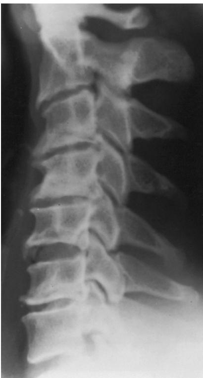
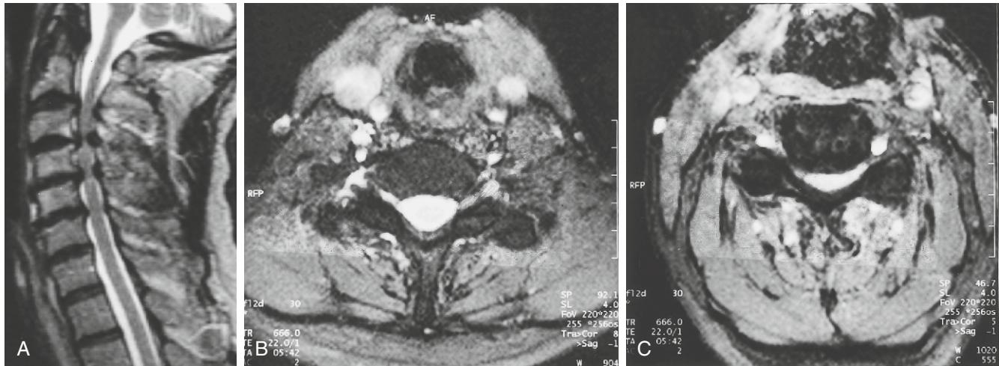
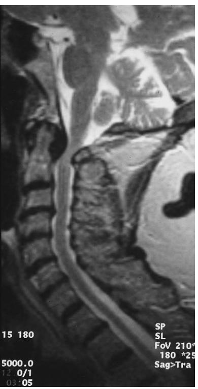
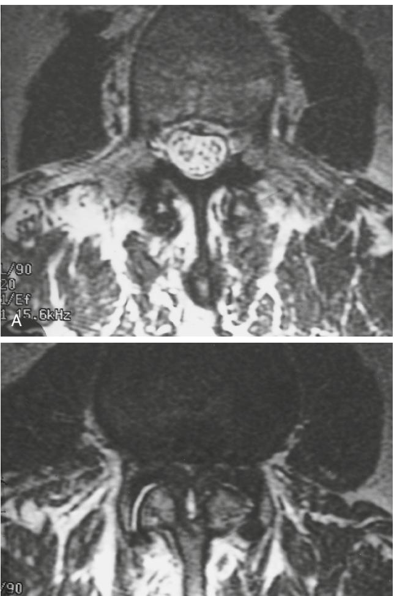

# Disorders of the Spinal Cord and Nerve Roots

Sean D. Christie Richard A. Cowie

The majority of the pathologic processes affecting the spinal cord in elderly people are related to degenerative diseases of the spinal column or to insufficiency of the cord's blood supply. However, old age does not exclude many of the disorders that are more commonly seen in other age groups. In most patients, a definite diagnosis can be made clinically by taking a directed history and performing a careful examination.

Neurologic assessment of an elderly person is sometimes made difficult by failure to obtain a clear history or by the presence of osteoarthritis of the limb joints and consecutive atrophy of the musculature, which masks weakness and reflex changes. Nonetheless, analysis of the way that a neurologic disorder develops and of the pattern of neurologic signs should provide a guide to the location of the lesion along the neural axis. A lesion can usually be localized in the cervical, thoracic, lumbar, or sacral segments before specialized neuroradiologic investigations.

## **CERVICAL RADICULOPATHY AND MYELOPATHY General issues**

The neuroradiologic sequelae of degenerative disease of the cervical spine were established in the 1950s.1 The degenerative changes of cervical spondylosis begin with desiccation and fragmentation of the intervertebral disks. As the elasticity of the annulus is reduced, the disk height diminishes. Extremes of movement are less well tolerated, and the vertebral end plates are subjected to greater stress. Secondary osteophytic spurs develop circumferentially around the disk, projecting posteriorly into the spinal canal as bony ridges. Parallel degeneration of the hypophyseal joints combines with spurs from the vertebral bodies to reduce the size of the neural foraminae. In most patients there is progressive loss of movement between vertebrae, although in some cases excessive motion between vertebrae and a degree of subluxation may develop. Pathologic changes in the ligamentum flavum cause lack of elasticity and a tendency to buckle, particularly during extension. The compressive effects of the osteophytic spurs and buckled ligamentum flavum on the spinal cord are greatest when the neck is extended.2

These changes bring about restriction of the natural motion of the spinal cord and nerve roots within the spinal canal. Repetitive compression and obstruction of the radicular arteries supplying the cord in the neural foramina may further compromise cord function. This effect is aggravated if there is occlusive vascular disease of the proximal arteries in the neck. Occasionally, acute rupture of a cervical disk can follow sudden twisting or flexion/extension movements of the neck and cause cord or nerve root compression.3 The same mechanism can also cause hemorrhage into the spinal cord (hematomyelia).

The older the population, the more these degenerative changes increase in severity and extent. It is clear from epidemiologic studies4,5 that the prevalence of degenerative changes is increased when heavy laboring work has been undertaken.

Atomic and radiologic studies have shown that the neurologic sequelae of cervical spondylosis are more prevalent when the natural size of the spinal canal and neural foramina are restricted.6 However, the presence of large osteophytic ridges and subluxation of the vertebrae aggravate the situation. The C5–C6 and C6–C7 levels are most commonly affected at the point of transition from the more mobile cervical spine to the relatively fixed section in the upper part of the thoracic spine.5,7

Clinically, there is generally loss of lordosis so that the head is held flexed and downward. However, if the natural kyphosis of the thoracic spine is exaggerated, there may be a compensatory extension of the upper cervical spine to maintain forward gaze. Most patients complain of recurrent neck pain and stiffness, together with crepitus on movement. Pain radiates to the occiput, shoulders, and scapula regions.

## **Radiculopathy**

Progressive narrowing of the neural foramina results from osteophytic ridges alongside the intervertebral disks and hypertrophy of the facet joints and causes compression and restriction of movement of the nerve root. Pain radiates down the arm in the distribution of the nerve root(s) with a deep, boring quality, aggravated by activities such as lifting and reaching. The pain is generally accompanied by paresthesiae and some sensory loss in the affected dermatomes. In some patients, sensory symptoms predominate. Muscular weakness is generally mild, but occasionally wasting can occur. The appropriate reflexes are lost.7

## **Cervical myelopathy**

Cervical spondylosis is the most frequent cause of chronic cord compression in older adults. The clinical spectrum is wide, depending on many interrelating factors and the pathogenesis of cord damage. Compression leads to atrophy of the anterior horn cells and the lateral and posterior funiculi of the cord.8 Most commonly the onset of symptoms and signs is insidious, and a clinical history can extend for many months or years before help is sought. Most frequently there is a mixed picture of lower motor neuron features in the arms, together with long tract signs below.9

In the upper limbs, complaints of numb, clumsy hands with weakness and loss of dexterity are common. Muscle wasting follows segmental anterior horn cell damage, affecting proximal muscles when compression is high in the neck or the intrinsic muscles of the hand when compression is lower. The tendon reflexes in the arms are usually lost at the segmental level of the cord lesion and are exaggerated below. An inverted radial reflex occurs when the site of compression is above the fifth cervical segment, which has been shown to be the most common in an elderly population.10

In contrast, there is commonly a marked lower limb spasticity when the patient complains of a heavy, leaden weakness and a tendency to drag the limb. Some degree of ataxia may be present with reduction of vibration and joint position sense. Many patients complain of paresthesiae and intermittent numbness in the upper and lower limbs.

Occasionally, symptoms may arise abruptly because of severe trauma or sudden extension of the neck such as after a fall. In this situation, a central cord syndrome is common, with marked weakness of the upper limbs because of anterior

Figure 67-1. Lateral cervical spine radiograph showing widespread spondylosis. Note the loss of disk height and large anterior osteophytes. This patient has a small spinal canal into which project osteophytes at the posterior margin of the C3–C4 of the 4–5 disks.

horn cell damage and a mild spastic weakness of the lower limbs as the peripheral regions of the cord are relatively spared. Frequently this syndrome is accompanied by allodynia in the upper extremities, particularly the hands. Very rarely a Brown–Séquard syndrome can be identified. These neurologic disorders can be associated with vertebrobasilar insufficiency, where symptoms are typically related to rotation and extension of the neck. As the clinical presentation of spondylotic myelopathy varies, it must be distinguished from other conditions with similar symptoms and signs, including multiple sclerosis, cerebrovascular disease, cord tumor or syrinx, normal pressure hydrocephalus, amyotrophic lateral sclerosis, and peripheral neuropathies.

#### **Investigations**

Plain radiographs of the cervical spine reveal narrowing of the intervertebral disk space with sclerosis of adjacent cortical bone. Secondary anterior and posterior osteophytes are demonstrated in Figure 67-1, together with an indication of the size of the spinal canal. Oblique radiographs allow visualization of the neural foramina. However, several authors11–13 have shown that degenerative changes increase in frequency with age, and that 70% to 90% of those over 65 years of age have radiologic abnormalities. In consequence, there is poor correlation between symptomatic and asymptomatic groups and the structural changes revealed on plain radiographs, with problems of both sensitivity and, especially, of specificity. Rarely, then, do plain radiographs alone dictate therapy.

When the clinical state suggests segmental cord or root compression and surgery is contemplated, then specialized neuroradiologic investigation is required. Magnetic resonance imaging (MRI)—which has largely replaced myelography—reveals degeneration of intervertebral disks, the size of osteophytes, and the presence and degree of cord compression (Figure 67-2). Computed tomography (CT)14,15 reveals the size and shape of the vertebral canals and the presence of extensive ligamentous calcification, but it cannot give details of vertebral displacements, disk protrusions, and corrugation of the bulging longitudinal ligament unless intrathecal

Figure 67-2. A, Lateral magnetic resonance image of the cervical spine showing compression of the spinal cord by posterior osteophytes and buckling of the ligamentum flavum. B, Transverse image of normal cervical spine reveals spinal cord surrounded by cerebrospinal fluid. C, Transverse image of the patient seen in (A) showing severe narrowing of the spinal canal and compression of the cord.

contrast medium has been injected. Myelography is now performed only when MRI is contraindicated, such as in a patient with an implanted pacemaker or neuromodulatory device or in the presence of cerebral aneurysm clips made from materials other than titanium or titanium alloy.16 Magnetic resonance imaging also allows visualization of intrinsic disorders of the spinal cord (see Figure 67-2).

#### **Management**

Patients with neck pain and radiculopathy generally respond to a treatment regimen that may include a supportive collar, restriction of upper limb and shoulder movement, and nonsteroidal antiinflammatory drugs, supplemented by opioid analgesics if necessary.17 Physical methods of treatment and the application of local heat pads may be soothing. If the symptoms are severe, a brief period of bed rest and cervical traction may provide some relief.18 Lees and Turner19 showed that 22 of 51 patients were symptom-free within a few months and generally remained symptom-free during follow-up. These authors showed that patients with radiculopathy rarely progress to a myelopathic state.

Surgery is not generally required unless there is clinical evidence of myelopathy, such as progressive sensorimotor deficits or abnormalities in bladder and bowel control attributable to spinal cord dysfunction. In selected patients, persistent radicular pain that inhibits daily activities and decreases level of function may also be a relative indication. Both anterior and posterior approaches can be used to decompress the nerve roots; each carries a good prognosis for neurologic recovery,20–22 although recovery of muscle wasting is rarely satisfactory. The decision to operate is made after taking into account the severity of the disability, its effect on the patient's quality of life, and the patient's ability to withstand surgery.

The natural history of myelopathy complicating cervical spondylosis is variable and unpredictable; many patients run a chronic course characterized by episodes of deterioration separated by periods of stability.9,19 The majority of elderly patients with cervical myelopathy will not need surgical intervention. Surgical treatment is indicated when the myelopathy interferes with daily activities, where there is a short progressive history, or when there is radiologic evidence of severe cord compression or instability. Anterior decompression of disk and osteophytic spurs is usually carried out when one or two intervertebral levels are affected, whereas laminectomy/laminoplasty is indicated for more widespread stenosis and compression of the spinal cord. In general, the prime objective of surgery has been to halt the decline in neurologic function before further damage to the cord has occurred. However, more recently studies suggest that there may be a more reliable improvement in neurologic function than previously appreciated.23

There is poor correlation between the presenting severity, the duration of the symptoms, and the outcome.6 Hukaka et al24 found that posterior decompression gave better results for more advanced myelopathy and that a short duration of symptoms was associated with better results, although these were not influenced by the age of the patient. Phillips25 suggested that patients with focal disease who underwent anterior surgery had a better outcome. However, some patients continued to deteriorate, in spite of adequate decompression, possibly because of vascular insufficiency.9 This may be related to persistent motion across the decompressed segments, and concomitant fusion procedures may reduce the incidence of postoperative neurologic decline.

#### **CORD COMPRESSION IN RHEUMATOID ARTHRITIS**

Neck pain and stiffness are common complaints in patients with progressive rheumatoid arthritis (RA). Radiation of pain to the occipital region and cutaneous numbness at the back of the head may occur when the upper cervical nerve roots are compressed. These symptoms may herald the development of atlantoaxial subluxation as a result of destruction of the transverse atlantal ligament by synovitis. There may be rotatory subluxation, and vertical migration of the odontoid into the foramen magnum of the skull (cranial settling). Atlantoaxial subluxation, which occurs in approximately 33% of patients with RA, can be asymptomatic until the slip reaches 8 to 9 mm when cord compression begins. Once myelopathy develops, most patients deteriorate and 50% die within 6 months. Approximately 20% of patients show subaxial subluxation on cervical radiography, often affecting several segments to produce "staircase" deformity of the vertebrae. Compression of the cord is common.

Most patients present with progressive deterioration of upper limb function, accompanied by tingling, numbness, LHermitte's phenomenon, gait disturbance, and possibly bladder and bowel dysfunction. It is common for these symptoms to be attributed to severe peripheral joint disease and muscle atrophy. Abnormality of spinothalamic function, hyperreflexia and hypertonia, and extensor plantar responses help differentiate the cause from peripheral nerve lesions. Compression of the trigeminal nucleus and tract at the craniocervical junction may produce facial numbness or paresthesiae. Lower cranial nerve findings may be present with cranial settling.

Radiologic assessment requires flexion and extension radiographs of the cervical spine followed by MRI, which will reveal compression or distortion of the spinal cord (Figure 67-3).

Surgical management has to be considered when there is progressive or significant atlantoaxial subluxation, or clinical evidence of increasing neurologic morbidity. As most patients have significant medical problems such as pulmonary fibrosis, anemia, atrophic skin, and the effects of prolonged steroid or other immunosuppressive therapies, there is significant risk from surgical intervention that needs to be reviewed with patients and their families. For some patients, particularly the frail, the use of a cervical collar in lieu of surgery may be the best option to manage craniocervical instability, though tolerance of use can be limited.

The surgical approach and procedure may consist of an anterior, transoral, or posterior decompression combined with internal fixation; however, the timing of these inteventions remains controversial.26

## **SPINAL CORD COMPRESSION AND THORACIC DISK PROTRUSION**

The central protrusion of a thoracic intervertebral disk is an unusual cause of cord compression, but one that occurs in older age groups as it is associated with degeneration of the

Figure 67-3. Magnetic resonance image of cervical spine, illustrating pathology attributable to rheumatoid arthritis; cranial settling, cevical stenosis, and subaxial instability.

disk annulus. Russell27 noted that 67% occurred between the eighth and eleventh interspaces. The majority of patients present with a long history of gradually progressive myelopathy where sensory and motor symptoms are equally common. However, 49% of patients complained of radicular symptoms of pain and dysesthesiae. Sometimes the onset is more rapid, leading to a flaccid paraplegia.28

The presence of a thoracic disk protrusion is generally recognized when MRI is carried out to investigate the progressive neurologic deficit. Cord compression from this source carries a poor prognosis unless surgery is performed. The results of simple decompressive laminectomy are unsatisfactory; either costotransversectomy, transpedicular, or transthoracic approach is recommended.27,29 Recent minimal access approaches30 are better tolerated and may lead to quicker postoperative recovery, particularly in an elderly population.

## **CORD COMPRESSION FROM INTRADURAL TUMORS**

Intradural extramedullary tumors cause local compression of the spinal cord and nerve roots. Meningiomas represent approximately 25% of primary spinal cord tumors, and 80% of them occur in females. They are most commonly seen in the sixth decade, rather later than for neurofibromas; 80% occur in the thoracic spine. The majority of patients complain of local or radicular pain, the significance of which often goes unrecognized for a long period until progressive spastic paraparesis, followed by sensory and bladder dysfunction, develops.31

Plain radiographs are rarely helpful, and the condition is diagnosed only by myelography or more commonly MRI.32 Results of decompressive surgery are generally good. Levy et al33 reported that one third of paraplegic patients were able to walk after tumor excision. Similar successes have been observed in septagenarians.34 Neurofibromas are slightly more common than meningiomas, but their peak incidence is in younger age groups, so they are less frequently encountered in an elderly patient.35 Radicular pain is more common, and enlargement of a neural foramen may be seen on plain radiographs if the tumor extends into the paravertebral tissues. Multiple tumors can be encountered in neurofibromatosis. As with meningiomas, surgical excision should be undertaken and carries a good prognosis for neurologic recovery. However, for the medically unfit radiosurgery is an emerging option that appears to afford long-term clinical stability.36

## **METASTATIC SPINAL TUMORS**

The most common extradural and spinal tumors to cause cord compression are those metastasizing from distant carcinomas or primary hematologic tumors. Spread may be hematogenous or via the vertebral venous plexus. Although myeloma and carcinomas of prostate and kidney seem to metastasize preferentially to the spine, in practice the most commonly encountered tumors are those that occur with the greatest frequency in the community. Therefore, primary lung, breast, kidney, and prostate tumors are seen, although in some patients the primary tumor cannot be identified. The thoracic region of the spine is most frequently involved, followed by the lumbosacral and cervical regions.

The majority of patients present with progressive walking difficulty, because of weakness and clumsiness, the significance of which may go unrecognized until the patient is no longer able to bear weight. Many patients have a history of preceding spinal pain, which should always lead to a suspicion of vertebral metastasis in a patient known to have malignant disease. The neurologic deficit may develop very rapidly, with collapse of the vertebra or occlusion of the vascular supply to the cord. An analysis of the level of the sensory deficit helps in assessing the site of the spinal disease and planning the appropriate radiologic investigations. However, plain radiographs of all of the spine and chest should be carried out and may reveal loss of outline of a pedicle, reduction in height of a vertebral body, or a soft tissue mass. MRI of the spine is the investigation of choice. However, CT may reveal evidence of bone destruction and allow percutaneous needle biopsy of the lesion.

There has been considerable debate about the value of decompressive surgery, as laminectomy alone has produced suboptimal results.37 As a result there has been considerable experience with alternate conservative therapies. Commonly steroids, dexamethasone, are pre-scribed for both their effect on vasogenic edema and to improve tumor-related pain.38,39 In the 1970s and 1980s, radiotherapy became the mainstay of treatment, and surgical intervention was primarily used as a salvage therapy if patients deteriorated during radiation. In some centers, radiation remains the initial treatment.39 However, recently there has been a resurgence in surgical interest for these patients. This has been motivated by a randomized controlled trial by Patchell et al.40 This trial compared radiation alone to surgery (circumferential decompression and stabilization) and radiation. The authors showed that the surgical group had improved bladder control and ambulation status compared to the radiation-alone group, and there was no change in survival. Improvements in ambulation and continence are now felt to be appropriate benefits to offset the risks of surgery in these palliative patients and have been reported by other groups.41 However, surgery is not indicated for all patients with metastatic epidural compression. Patients with desseminated disease and an expected survival less than 4 months, those with multiple lesions at multiple levels, those medically unfit for surgery, or those with very radiosensitive tumors (lymphoma, myeloma) may not dervive the benefits from surgery.

#### **VASCULAR DISORDERS OF THE SPINAL CORD**

The peculiar anatomic arrangement of the arterial blood supply of the spinal cord may protect it from the effects of occlusion of one feeding vessel. The anterior and posterior spinal arteries are fed by radicular arteries, which are branches of vessels arising from either the aorta or the subclavian arteries. There is generally a large feeding artery in the lower thoracic region, most commonly on the left at T10. A watershed lies at the second thoracic segment of the spinal cord, between areas supplied by thoracic vessels and those from the neck. Interruption of supply can occur in atheroma of the aorta,42 in dissecting aneurysm,43 or as a complication of aortic open and endovascular surgery.44 The extent and severity of the spinal cord neurologic deficit varies considerably, probably depending on the anatomic variation of the spinal cord vessels in the individual patient.

The syndrome of the anterior spinal artery arises when this vessel is obstructed by thrombus. The onset is sudden with pain in the back or neck and paresthesias down the arms. The posterior columns receiving a blood supply from the posterior spinal network are preserved, so that proprioception remains intact, whereas thermal and pain appreciation are impaired. In addition, a lower motor paralysis of the arms is associated with spastic paraparesis, or paraplegia. In some cases, the presence of cervical spondylosis and an osteophytic ridge has been implicated in local occlusion of the anterior spinal artery.45 This phenomenon is also recognized in the setting of thrombophlebitis secondary to epidural abscess.46

#### **SPINAL CORD INJURY**

Acute spinal cord injury (SCI) is a severe and devastating event for both patients and their families, regardless of age. However, there has been a perception that older adults fare considerably worse than their younger counterparts. A number of authors have observed an increasing proportion of older patients presenting with acute SCI, with falls (often from standing heights) as the leading mechanism of injury in contrast to motor vehicle collisions, which are more common in younger age groups.47–51 The reasons for these observations are likely multifactorial and include an aging population, alteration in bony structural support secondary to osteopenia/osteoporosis, cervical spondylosis (leading to undiagnosed myelopathic symptoms and predisposing to central cord syndrome), a more fragile ambulation status (because of altered sensory mechanisms), osteoarthritis/ decreased mobility, neurologic disorders such as Parkinson's disease or diabetic peripheral neuropathy and the effects of polypharma.50

Several authors have endeavored to reassess the outcomes of SCI in the geriatric setting to evaluate whether current treatment modalities have altered clinical outcomes. Furlan and coworkers51 found, in a retrospective review of a prospective cohort, that patients with SCI 65 years of age and older had a significantly higher mortality rate than younger patients (46.88% vs. 4.86%; p < 0.001). However, they also reported that, among survivors, age had no impact on motor or sensory outcomes. This suggests that a significant number of patients (the survivors) could benefit from aggressive treatment and with a better understanding of predictors of outcome, preferably those modifiable, the expected survivors could be identified and treated. Fassett el al49 conducted a retrospective review 412 patients over the age of 70 years treated between 1978 and 2005. They observed an increase in the incidence from 4.2% to 15.4%, and the elderly cohort as a whole tended to have less severe injuries based on the American Spinal Injury Association (ASIA) grading scale. However, the mortality rate in the elderly patients with severe neurologic impairment was uniformly higher, high enough to yield a statistical difference in mortality between the age groups. Unfortunately their data did not contain information of preinjury medical conditions. Krassioukov and colleagues47 in a previous study examined the effect that preexisting conditions had on outcomes. In their cohort the ASIA grade was similar between the young and elderly; however, the number of preexisting medical conditions was statistically greater in the geriatric group which correlated to the difference in secondary complications observed between the two groups. When this observation was taken into account there was no statistical difference in complications or mortality reported attributable solely to age. It needs to be borne in mind that this study had relatively small cohorts (28 geriatric, 30 younger) and the conclusions may differ with more statistical power. Despite this the authors advocate for an aggressive multidisciplinary approach to SCI in the elderly and caution against allowing "agism" to bias treatment.

#### **PAGET'S DISEASE**

Paget's disease is a generally progressive disorder of bone that causes neurologic sequelae of the brain, spinal cord, or peripheral nerves, depending on which bones are involved. It is important to recognize these complications, as many respond to treatment of the underlying disorder. In the spine, pagetic changes may affect one or several vertebrae. The disease is characterized by bony destruction followed by repair, which leads to flattening and expansion of the diameter of the vertebral bodies, and thickening of the pedicles and laminae. Bony projections in the vertebral canal cause spinal cord and nerve root compression. Neurologic symptoms may develop suddenly if collapse of a vertebral body occurs.

Spinal cord compression is most common in the thoracic region and is generally slowly progressive, causing a spastic weakness of the lower limbs combined with sensory symptoms and signs. Pain may be due to local bony changes, malignant degeneration, or nerve root compression. In some patients progressive myelopathy occurs, yet imaging fails to reveal direct compression of the spinal cord. In these patients, progressive ischemia may be the cause of neurologic deterioration.

When the disease affects the lumbar region, symptoms of single or multiple nerve root compression can develop, producing back pain and sciatica. When the spinal canal is constricted, neurogenic claudication may be the presenting symptom.

Surgical treatment is indicated only when medical treatment fails to control the progression of the neurologic sequelae of the condition. However, control of blood loss from the diseased bone during surgery can be troublesome.52,53

### **NEUROLOGIC COMPLICATIONS OF DEGENERATIVE DISEASE OF THE LUMBAR SPINE**

Spondylosis of the lumbar spine increases in severity and extent with advancing age, often occurring simultaneously with disease in the cervical region.4,54 Biochemical and pathologic changes are similar at both sites. Loss of disk height and the development of traction spurs and osteophytes are associated with sclerosis and enlargement of the vertebral bodies. Simultaneous changes in the facet joints occur, with destruction of articular cartilage, laxity of the joint capsule, and osteophytic enlargement of the joint surfaces.55 This process may be asymmetric, so that rotational subluxation of one vertebra on the other can develop. The lowest intervertebral disks of the lumbar spine are most commonly affected, at the point of transition from the mobile lumbar spine to the fixed sacrum.

A number of discrete neurologic conditions may complicate lumbar spondylosis.

#### **Acute nerve root entrapment**

True herniation of an intervertebral disk can occur in an elderly person and produce a pattern of symptoms and signs similar to that seen in younger patients.56 However, compared with the average adult population, elderly people have a higher incidence of motor deficits and are more likely to have a sequestrated disk nucleus. Acute root entrapment may also result from compression secondary to rapid expansion of a degenerative spinal cyst.57

#### **Chronic nerve root entrapment**

Lumbar mono- and polyradiculopathy occur in elderly people, more commonly as a result of nerve root compression in the lateral recess of the spinal canal and in the neural foramen than from disk rupture. As degeneration of the intervertebral disk advances, there is loss of disk height and formation of osteophytes that bulge into the neural foramen; hypertrophy of the facet joint further compromises its capacity. At the same time, partial subluxation of the posterior joint with upward and forward movement of the superior articular surface narrows the lateral recess of the spinal canal.58 At first extension and rotation of the spine aggravate the process, so that dynamic stenosis (Figure 67-4) may produce intermittent compression and symptoms, although, as the condition advances, permanent compression occurs.

Figure 67-4. Magnetic resonance images of (A) normal lumbar spine and (B) severe spinal canal stenosis.

B

Typically, patients complain of pain and stiffness of the back, accompanied by the insidious onset of sciatic pain. These symptoms are generally aggravated by standing or walking and relieved by rest or lying, particularly when the spine is flexed. Patients complain of paresthesias in the legs, which are also precipitated by the same types of activity. In chronic nerve root entrapment caused by stenosis, coughing and straining aggravate the pain, and nerve root stretch tests are generally negative. Some patients show mild weakness of the legs, although objective sensory deficits are rare. The progression of symptoms and signs is generally much slower than for a herniated nucleus pulposus.59–61

Nerve root entrapment may complicate degenerative spondylolisthesis. This develops when degeneration of the facet joints and laxity of the disk annulus allow the upper vertebral body to slide forward on the lower. The L4–L5 intervertebral joint is most commonly affected, but other intervertebral levels can be involved and produce sciatic pain and symptoms of nerve root compression.

#### **Neurogenic claudication**

Narrowing of the central spinal canal can develop as a result of a combination of degenerative hypertrophy of the facet joints, hypertrophy and corrugation of the ligamentum flavum, and bulging of the disk and osteophytes. As the available space in the spinal canal narrows, there is compression of multiple nerve roots of the cauda equina and its circulation. The symptoms of claudication develop. Bilateral leg pain is precipitated by walking or standing and improved with rest, especially when the spine is flexed or when the patient sits or squats.61

Patients frequently develop a stooped posture. As the distance walked increases, a heavy leaden weakness builds up in intensity, accompanied by burning paresthesias and a fear of the limb giving way.62 Sometimes neurologic signs are present only after an exercise provocation test on a treadmill.

In older adults, the clinical picture is often confused with the effects of peripheral vascular disease. Sharr et al63 reported that urinary symptoms due to a neuropathic bladder often complicate central stenosis of the spinal canal.

#### **Investigations**

Plain radiographs reveal the extent and severity of degenerative changes of the disks and facet joints. Radiography has been superseded by CT and MRI of the lumbar spine, which reveal the cross-sectional anatomy of the spinal and neural canals and can reveal the degree of degeneration of the disk. However, only MRI can adequately display detail of the neural structures.

Radionuclide scanning is generally not helpful, as increased uptake is common in areas of osteoarthritis, but it can exclude spinal infection or neoplasm.

#### **Management**

The majority of elderly patients do not require surgical decompression, and their symptoms can be controlled by analgesic and anti-inflammatory medication and modification of their activities of daily living. Rest and physical treatment, combined with restriction of spinal movement, often produce satisfactory results. However, older adults can withstand surgery well, and age alone is rarely a contraindication to operation. Surgery is indicated when sciatic pain and other symptoms significantly reduce a patient's physical capacity or cannot be controlled by medical treatment. Signs of severe nerve root compression, such as weakness or sensory loss, neurogenic claudication, and cauda equina compression, are firm indications for surgical intervention. The aim of surgery is to decompress the spinal canal and neural foramina, thus freeing the nerve roots. Getty et al64,65 obtained satisfactory results in 85% of patients after a partial undercutting facetectomy. However, low backache persists after surgery in many patients, owing to the background degenerative changes, and patients must be advised accordingly.66,67 However, this effect may be in part related to the surgical approach, as persistent back pain is not reported as commonly following minimal access surgery in the elderly.68 Approaches to the spine using minimal access surgical techniques (MAST) are becoming more commonplace and may have a particular role in the treatment of the older adult. MAST involves utilizing smaller skin incisions and working through small portals or "tubes" via a muscle splitting/sparing approach; in contrast to the traditional "open" surgical approaches, which involve stripping the paraspinal muscles off the spine to gain adequate access. MAST techniques have been shown to minimize surgical trauma and blood loss, reduce postoperative pain, and hasten mobilization/recovery. These advantages may be particularly important when treated a potentially frail population. Rosen et al68 recently described their experience utilizing a MAST approach for lumbar decompression in a cohort of 50 patients with a mean age of 81 years. They observed no mortality or significant morbidity in their cohort and showed statistical improvement in multiple validated clinical outcome scales with a mean follow-up of 10 months. In addition to MAST, other novel approaches, such as dynamic stabilization, are promising adjuncts to decompressive procedures and are intended to address the issue of concomitant back pain without the need for a surgical arthrodesis.69,70 However, all of these approaches still require the rigors of future randomized clinical trials to prove their potential merits.

## KEY POINTS

#### Disorders of the Spinal Cord and Nerve Roots

- The majority of pathologies observed in the spines of older adults relate to degenerative processes.
- Spinal cord compression in the elderly population is most frequently caused by cervical spondylosis or metastatic vertebral body tumors.
- Less common causes of cord compression in the elderly population include intraspinal tumor and thoracic disk protrusion.
- The clinical presentation of cervical myelopathy is usually either insidious gait disturbance or numb, clumsy hands.
- In patients with advanced rheumatoid arthritis, subluxation at the craniocervical junction may require surgical treatment by internal decompression and fixation.
- The incidence of spinal cord injury in the elderly is rising, and the causes and sequelae are unique in this population.
- Claudicant leg pain needs to be differentiated between neurogenic and vascular etiologies.
- Given current operating room techniques, age alone should not deter surgical intervention when indicated.

For a complete list of references, please visit online only at www.expertconsult.com