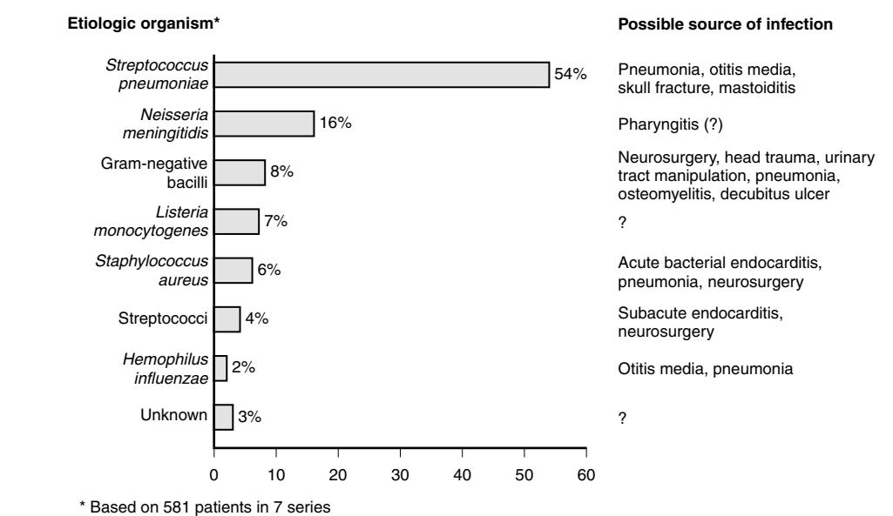

# Infections of the Central Nervous System

Steven L. Berk James W. Myers

Bacterial meningitis is a disease that presents particular challenges in the elderly patient. The mortality rate from bacterial meningitis is higher in elderly people than in younger adults. Bacterial meningitis has become a more common problem in elderly patients over the past 2 decades. In 1973, Fraser et al1 reported that the mean age of death from meningitis in Olmsted County, Minn., had gone from 11.5 years in the period 1935 to 1946 to 64 years during the period 1959 to 1970. In the latter period more than one half of all deaths from meningitis occurred in those over 60 years of age. The incidence of bacterial meningitis rose from 5 cases per 100,000 to 15 cases per 100,000.1 A Centers for Disease Control and Prevention survey performed between 1978 and 1981 showed an increasing incidence of meningitis in older patients2 as did a survey on the incidence of meningitis conducted in Rhode Island.3 In one review of 445 adults treated for bacterial meningitis at the Massachusetts General Hospital, 56% of communityacquired meningitis occurred in patients over 50 years of age.4 In this study and all previous studies, the mortality rate was much higher in older patients. The mortality rate in the Massachusetts General Hospital study was 37 in those over 60 years of age compared with 17 in younger adults. In the Rhode Island study, 55% of elderly patients died compared with an overall mortality rate of 10%.3

The increased incidence of meningitis in this age group probably is explained, in part, by the more aggressive care given to elderly patients, including more rigorous evaluation of fever, change in mental status, and coma. Nosocomial meningitis particularly related to neurosurgical procedures is also a cause of the increasing incidence of meningitis in this age group. Durand et al4 have shown that nosocomial meningitis has increased from 28% of all meningitis between 1962 and 1970 to 45% of all cases of meningitis from 1980 to 1988. Many of these cases occur in the chronically ill, frequently hospitalized elderly.

Bacteria may reach the subarachnoid space of the elderly patient by several different mechanisms.5 Elderly patients with focal infections may develop bacteremia and seed the meninges. This occurs, for example, in the elderly patient with pneumococcal pneumonia, or less frequently in the patient with pyelonephritis and gram-negative meningitis. Meningitis develops by way of direct inoculation of bacteria into the meninges such as occurs in head trauma or after a neurosurgical procedure. Elderly patients are prone to frequent falls and head injuries. *Staphylococcus aureus*, coagulase-negative staphylococci, and gram-negative bacilli are responsible for most cases of meningitis secondary to head trauma or neurosurgery. Meningitis may occur from contiguous spread of infection to the meninges as in patients with otitis media, sinusitis, or mastoiditis. This mechanism of infection is probably somewhat less common in elderly people, compared with younger adults.

In the bacteremic, elderly patient, symptoms of fever, chills, and rigors will usually be present but afebrile bacteremia in elderly people is well described. Patients with contiguous spread of infection usually complain of localized findings, such as ear or facial pain. Bacteria in the subarachnoid space will cause an inflammatory reaction in the pia and arachnoid matter that will manifest itself as neck pain and stiffness with protective reflexes that cause the Kernig and Brudzinski signs. Structures that lie within the subarachnoid space are involved in the inflammatory reaction. Pial arteries and veins may become inflamed and cranial nerve roots damaged.

A diffuse encephalopathy may occur. Abnormal mental status results from cerebral ischemia, edema, or toxic encephalopathy. Confusion, headache, or lethargy is a manifestation of this diffuse, inflammatory process. Papilledema, hydrocephalus, and other focal findings may occur as a result of pus occluding the foramina of Luschka and Magendie, resulting in increased intracranial pressure.

The clinical features of meningitis in elderly patients are more subtle than in younger adults. This is a recurring theme in almost all studies that involve older patients with meningitis.6,7 Most, but not all, studies have found that elderly patients with bacterial meningitis are less likely to have neck stiffness and meningeal signs. At the same time, older patients often have cervical spine disease and poor neck mobility, making interpretation of clinical signs more difficult. Berman et al8 found meningismus present in only 58% of elderly patients with meningitis. Gorse et al9 compared signs and symptoms of patients with meningitis over 50 years of age to those in patients under 50. Older patients had more mental status abnormalities and were more likely to have seizures, neurological deficits, and hydrocephalus. Berk,6 Roos,10 Massanari,11 and others have noted that a delay in diagnosis is frequently associated with meningitis in the elderly and this delay may explain the high mortality rate noted in this group of patients.

Elderly patients with bacterial meningitis may not have as pronounced fever or may at times be afebrile. The change in mental status that occurs in elderly people may be attributed to senility, delirium, psychosis, transient ischemia, or stroke. In the elderly patient who has undergone neurosurgery, postoperative lethargy may be mistakenly attributed to an expected postoperative course. A stiff neck in an elderly patient may not arouse the same concern that it would in a young adult.

Physical examination is a critical part of the evaluation of an elderly patient with suspected meningitis. Nuchal rigidity is reported in between 56% and 92% of elderly patients depending on the series.7 When neck stiffness is the result of meningeal irritation, the neck will resist flexion but can be rotated from side to side. A funduscopic and cranial nerve examination are mandatory to alert the clinician to associated increased intracranial pressure or brain abscess. Mental status should be carefully described and followed. Lethargy and coma are poor prognostic signs. Examination of the head should include a search for skull fracture, avulsion, or hematoma. Careful otoscopic examination is also a necessity as otitis media may be missed in the elderly patient, particularly when mental status is abnormal and a history cannot be obtained. The elderly patient may have pneumonia and concomitant meningitis. Gorse et al9 found pneumonia to be much more common in older adults with meningitis. The elderly patient may not complain of respiratory symptoms so examination of the lung may be the first clue to pneumonia. Examination of the heart is necessary to detect underlying valvular heart disease that might predispose the elderly patient to endocarditis with seeding of the meninges. Examination for costovertebral tenderness, decubitus ulcers, and petechial lesions will also provide important information in determining the source and causal agent in meningitis.

Performance of a lumbar puncture without delay is the critical element in the diagnosis of bacterial meningitis in both young and old. About 35% of elderly patients with meningitis have focal neurologic findings.9 Because lumbar puncture is contraindicated in patients with brain abscess, computed tomography (CT) or magnetic resonance imaging (MRI) will be necessary in some older patients. However, the high mortality rate from meningitis in the elderly makes time of the essence in the diagnosis and treatment of meningitis in this group. Many infectious disease experts now support the strategy of beginning empirical antibiotic therapy, pending lumbar puncture, particularly when a delay of hours is anticipated due to an imaging study.

There is very little in the literature to suggest that the cerebrospinal fluid (CSF) findings in elderly patients with meningitis differ from young adults with meningitis. Lumbar puncture will show purulent fluid with white blood cell counts between about 500 and 10,000 cu/mm. Polymorphonuclear leukocytes predominate, usually making up more than 90% of total cell count. Meningitis caused by *Listeria monocytogenes* sometimes has a mononuclear cell predominance. At least one study has shown that elderly patients with meningitis are more likely to have a lack of cellular response in CSF than younger adults.12 Those elderly patients with meningitis who have few cells in CSF but many bacteria have a poor prognosis.13 CSF glucose levels are usually low in bacterial meningitis. CSF to serum glucose ratios are usually less than 50%. Seventy percent of patients with meningitis will have a ratio less than 31%.14 Spinal fluid protein is elevated above 50 mg/dL. Very high protein levels are associated with poor prognosis. Gram stain of CSF will be positive in 60% to 90% of all patients with meningitis.14 In the study by Berman et al,8 only 50% of elderly patients with meningitis had a positive Gram stain. The Gram stain is most likely to be negative in patients who have received prior antibiotic therapy. In those patients whose Gram stain is negative, a variety of methods to detect bacterial antigen are now in common use. These include latex fixation, coagglutination, and counterimmunoelectrophoresis. The limulus lysate assay has been used to detect gram-negative meningitis, an important cause of meningitis in elderly people. Other tests such as lactic acid levels and measurement of C-reactive protein have been recommended to help distinguish bacterial from viral meningitis, but clinical decisions are rarely based on them.

Blood cultures are recommended in all patients in whom bacterial meningitis is suspected. In the study by Berman et al,8 almost one-half of all elderly patients with meningitis had concomitant bacteremia. In addition, other cultures such as sputum, urine, and wound—may be extremely helpful in determining the causal agent and source of infection.

*Streptococcus pneumoniae* is the most common organism to cause meningitis in elderly patients.5 *S. pneumoniae* was responsible for more than one half of all cases of meningitis in the elderly in several studies.15–17 The organism caused 43% of all cases in the study of Berman et al8 and 24% of cases in the study of Gorse et al.9 Gram-negative bacilli cause meningitis in elderly patients both by bacteremic spread of infection, such as in urinary tract infection or pneumonia, and as a nosocomial infection after neurosurgery.18,19 *Escherichia coli* is the most common organism to cause meningitis secondary to bacteremic spread. *E. coli* and *Klebsiella pneumoniae* are the more common gram-negative bacilli to cause meningitis after neurosurgery but more unusual organisms, particularly *Acinetobacter*20–22 have been more commonly reported. In a review of 581 cases of bacterial meningitis in elderly patients between 1967 and 1980, about 8% of cases were caused by gram-negative bacilli6 (Figure 68-1). However, more recent studies have shown gram-negative bacilli to be responsible for 20% to 25% of cases.8,9 This increase is not unexpected in light of the reported increase in nosocomial meningitis in all age groups. Gram-negative meningitis occurs at the extremes of life: in the neonate and debilitated elderly people. In a study of 158 patients with gram-negative meningitis in New York City, more than one half of the patients were over 60 years of age. Almost all of these elderly patients died.23 However, third-generation cephalosporins have replaced chloramphenicol for treatment of gram-negative meningitis with improvement in overall survival.

*Listeria monocytogenes* is also an organism more likely to cause meningitis in elderly people than the younger adult. Because this infection is T-cell mediated, it is possible that immunologic senescence of this system may explain the predisposition of elderly people to this infection. Although *Listeria* accounts for 4% to 8% of all cases of meningitis in elderly people, it is an extremely rare cause of meningitis in young healthy adults. Of 53 cases of *L. monocytogenes* meningitis in New York City, 77% of patients were older than 50 and 87% of these elderly patients died.23

Meningococcal meningitis is the most common cause of meningitis in young adults, but a less common cause of meningitis in elderly people. The incidence of meningococcal meningitis in the elderly patient population varies from one study to another, reflecting the epidemic nature of the disease. Outbreaks have occurred in nursing homes and institutional settings.24 The infection should be considered in elderly patients who have meningeal signs and have a petechial or macular rash. No focus of infection will be noted.

*S. aureus* was the most common cause of meningitis in elderly people in a Mayo Clinic study between the years 1948 and 1958.25 All cases were secondary to neurosurgery. Overall the organism is probably responsible for about 10% of cases of meningitis in older patients, either as a neurosurgical infection or part of a complicated staphylococcal sepsis secondary to pneumonia or endocarditis. Coagulase-negative staphylococci have become a more common cause of meningitis in elderly people, being associated with CSF shunts and other neurosurgical procedures.

β-Hemolytic streptococci are a relatively rare cause of meningitis in elderly people. However, this appears to be

Figure 68-1. Bacterial meningitis in elderly patients. *(Modified from Berk SL, Smith JK. Infectious diseases in the elderly. Med Clin North Am 1983;67:273–93.)*

another organism that causes life-threatening infection and meningitis at the extremes of life.26 *Hemophilus influenzae,* a cause of meningitis in children, is unusual in adults and elderly people. When *H. influenzae* does occur in older patients, it is usually a nonencapsulated organism.27 This is in contrast to children, where the type B encapsulated organism is most likely to cause infection.

The treatment of bacterial meningitis requires prompt initiation of antibiotic therapy. The antibiotic chosen must have excellent activity against the causal agent. Information from the history and physical examination in combination with a careful review of the CSF Gram stain will be the foundation on which the causal agent will be determined and the optimal antibiotic chosen. An infectious disease specialist, when possible, should be involved in the case as the mortality rate from the disease is high and the margin of error is small. The antibiotic chosen should be bactericidal for the causal agent and must diffuse across the blood-brain barrier. Table 68-1 lists the causal agent and the antibiotic generally recommended.

However, the particular epidemiology of the hospital or community of the patient will take on increasing importance in determining the antibiotic of choice. The rapid emergence of penicillin-resistant pneumococci in the United States has created some uncertainty in regard to the initial treatment of pneumococcal meningitis. Given the rising incidence of high-level penicillin-resistant organisms, empirical therapy of pneumococcal meningitis should include vancomycin and a third-generation cephalosporin.28 Pneumococci with an MIC of > 2 µg/mL are especially worrisome in that failures have been noted when these patients were treated with cephalosporin alone.29 The role of dexamethasone, rifampin, and the new fluoroquinolones for pneumococcal meningitis is unclear at this time, and infectious disease consultation is advised. In the treatment of gram-negative meningitis, the antibiotic sensitivity pattern of gram-negative bacilli at a particular hospital is also critically important. If the infection has occurred after a neurosurgical procedure, the organisms responsible for prior neurosurgical infections should

#### **Table 68-1. Antibiotic of Choice for Bacterial Meningitis**

| Streptococcus pneumoniae Streptococcus pneumoniae                       | Penicillin Vancomycin + ceftriaxone       |
|----------------------------------------------------------------------------|----------------------------------------------|
| (penicillin resistant) Staphylococcus aureus (methicillin sensitive) | Nafcillin                                    |
| Staphylococcus aureus (methicillin resistant)                           | Vancomycin                                   |
| Gram-negative bacilli                                                      | Third-generation cephalosporin (see text) |
| β-Hemolytic streptococci                                                   | Penicillin                                   |
| Listeria monocytogenes                                                     | Ampicillin                                   |
| Neisseria meningitidis                                                     | Penicillin                                   |
| Hemophilus influenzae                                                      | Ceftriaxone or cefotaxime                    |

be noted. If *Pseudomonas aeruginosa* is suspected as the causal agent, ceftazidime is the antibiotic of choice. Cefotaxime or ceftriaxone is generally used for other gram-negative bacilli including *H. influenzae*. Ampicillin is the drug of choice for *L. monocytogenes*. Oxacillin or nafcillin are drugs of choice for methicillin-sensitive staphylococci; vancomycin is the antibiotic of choice for methicillin-resistant staphylococci and most coagulase-negative staphylococci. As previously noted, ampicillin plus a third-generation cephalosporin is recommended for treatment of meningitis in elderly people when the causal agent is unknown. Although corticosteroids are now recommended in the treatment of acute bacterial meningitis in children, there is no evidence at present to establish their use in the adult or elderly patient. Elderly patients with meningitis are generally admitted to an intensive care unit, where vital signs and neurologic status can be carefully monitored. Some patients will be severely dehydrated or volume depleted, and others will be in septic shock. Colloid or crystalloid may be necessary to improve blood pressure and urine output. Inappropriate antidiuretic hormone secretion may accompany central nervous system (CNS) infections but should be self-limited if hypotonic solutions are avoided.

The comatose, elderly patient requires specialized care. The patient may need frequent suctioning, particularly if pneumonia is present. The patient should be turned frequently to prevent decubiti. A condom catheter is preferable to a Foley, unless urinary retention develops. In patients who develop relapsing or prolonged fever, a repeat lumbar puncture is necessary. Drug fever, phlebitis, urinary tract infection, and pulmonary emboli are all possible explanations for prolonged fever.

The currently available pneumococcal vaccine is routinely recommended in all patients over 65 years of age. Although there are no specific data to support the prevention of pneumococcal meningitis in the elderly, it is clear that the vaccine does decrease the incidence of serious pneumococcal respiratory infection. Because most cases of pneumococcal meningitis in older patients are caused by pneumonia as the initial infection, it is likely that a vaccination program in elderly patients would be of benefit in preventing meningitis.

# **FOCAL LESIONS, ENCEPHALITIS, AND CHRONIC MENINGITIS**

#### **Brain abscess**

A brain abscess often presents as a mass lesion with focal neurologic deficits. Since the advent of the CT scan, mortality has decreased from 30% to 50% to as low as 4% to 20%. The duration of symptoms before hospitalization usually has a mean of 15 days.30 Risk factors for adverse outcomes include a severe change of mental status on admission, neurologic abnormalities on admission, and a short duration between the first symptoms and presentation suggesting a rapid progression. Fever may be absent in 40% to 50% of patients; common symptoms such as headache, change of mental status, and focal neurologic deficits may be misdiagnosed as cerebral tumors or cerebral vascular accidents, which are very common in elderly people.

The white blood cell count is ordinarily normal to slightly elevated. A lumbar puncture, which may be dangerous, particularly in patients with focal neurologic signs, reveals nonspecific findings. Seventeen percent of patients may have a white count greater than 500, suggesting a bacterial meningitis. Cultures of the spinal fluid, however, are usually negative.30 Because 15% to 40% of patients with brain abscesses may die within 24 to 48 hours of a diagnostic lumbar puncture, this should be avoided in most cases.

The radiologic appearance of a "doughnut ring" lesion may be detectable in the majority of patients with brain abscesses. However, ring-enhanced lesions can also be seen with necrotic tumors and cerebral infarction. Surrounding edema may also be seen on CT scan and might be an indication for corticosteroids.31,32 In cases of a single abscess, the most common location is generally that of the frontal lobe or parietal lobe rather than the occipital or temporal. Sites of brain abscesses are often independent from presumed origin of infection except for the possibility of ear and sinus infections more often leading to abscesses within the frontal brain.

Generalized seizures can prompt hospitalization of many patients including older adults. Often 50% of patients with a brain abscess may have a focal neurologic sign such as a hemiparesis or focal seizure. Patients may also present with a diffuse neurologic dysfunction such as a coma, generalized seizure, or neuropsychiatric manifestations. Funduscopic examination may also reveal papilledema. In Seydoux and Francioli's study30 of 39 cases of brain abscesses, predisposing factors were not equally distributed in the different age groups in contrast to previous studies. They were more common in patients less than 50 years of age. Direct spread from a sinus or otologic focus appears to be more common with brain abscesses in younger adults, and was infrequently noted in patients older than 60 years of age. A short duration of symptoms before hospitalization also characterized patients between 20 and 60 years of age and was often associated with a poor outcome. The microbiology of brain abscesses does not appear to be significantly different between younger and older patients. Often viridans streptococcus and *Streptococcus milleri* are the most frequently isolated aerobes. *Fusobacterium* and other anaerobes were also common isolates.

Surgery is the only procedure that allows optimal microbiologic documentation. Several authors recommend medical therapy, particularly in cases in which the abscess is less than 2 cm in diameter and when the lesion is of high density, suggesting a cerebritis. Repeated aspiration and serial CT scans may be required to achieve a satisfactory response.33–35

A combination of a β-lactam agent with chloramphenicol or metronidazole generally has been recommended as standard therapy for brain abscesses. Microbiologic data obtained from a stereotaxic biopsy will be a further guide to therapy. The optimal duration of brain abscesses has been variable.36 Usually most authors recommend approximately 4 to 6 weeks of antibiotics, including the combination of parenteral and oral agents. Neurologic sequelae can be quite high, occurring in as much as 46% of cases.30

#### **Subdural empyema**

Subdural empyema may arise as a complication of a sinusitis or otitis media. Presenting symptoms can often mimic a brain abscess. A contrasted study of the CNS is indicated and neurologic drainage is mandatory. Antibiotic therapy is targeted at many of the same organisms that cause brain abscess. Length of therapy is generally several weeks with intravenous antibiotics.

## **Tuberculous meningitis**

Tuberculosis of elderly people is a serious disorder. Previously this was thought to be a diagnosis of the pediatric age group but recent reports indicate a rising incidence in elderly people.37 Tuberculous meningitis is often an insidious disease and may be especially difficult to diagnose in elderly people. Nonspecific symptoms of fatigue, anorexia, nausea, and an altered mental status may suggest dementia in an elderly patient. A miliary picture on chest x-ray may be the only feature that is useful to distinguish tuberculous meningitis from cryptococcal meningitis. Duration of symptoms may range from 2 days to 6 months. Hospitalization is often precipitated by change in mental status, headache, or fever. Meningeal signs are present in less than one half of the cases. Ocular palsies, particularly due to involvement of nerve VI, are found in 30% to 70% of cases.

CSF findings often reveal a protein level above 50 and a low glucose below 40. Acid-fast positivity varies among the studies but can range anywhere from 10% to 80% depending on how many spinal taps were performed. A chest x-ray and purified protein derivative should be routinely obtained. Several attempts have been made to develop a rapid, common, and specific method for diagnosing tuberculous meningitis.

Adenosine deaminase activity has been detected in the spinal fluid. At levels greater than 9 units/L, the test was found to be sensitive and specific. Levels can also be increased in patients with sarcoid or lymphoma. Levels appear to perhaps correlate with disease activity. Radioimmunoassay has been used for detecting a *Mycobacterium tuberculosis* antigen. The assay becomes negative after therapy.

Tuberculostearic acid, a structural component of *M. tuberculosis,* can be identified by gas-liquid chromatography and may also be useful to diagnose tuberculosis.38 Recent methodologies, such as polymerase chain reaction (PCR) testing and immunomagnetic enrichment, may also prove to be useful for cases of tuberculosis including tuberculous meningitis.39–41

Prognosis is influenced by age, duration of symptoms, and neurologic deficits. Mortality is greatest in patients younger than age 5 and older than 50 (60%). Clinical staging is often based on neurologic status: stage I—rational, no focal neurologic signs or hydrocephalus; stage II—confusion, depression, or focal neurologic deficits; stage III—stuporous or dense paraplegia or hemiplegia. Isoniazid (INH), pyrazinamide (PZA), and rifampin penetrate the blood-brain barrier to achieve adequate CSF concentrations. Multidrug-resistant tuberculosis may require several drugs.42 Many authorities recommend the adjunctive use of corticosteroids for stage II and III patients, beginning with the dose of prednisone at 80 mg/day, which may be gradually tapered over 4 to 6 weeks as guided by the patient's symptoms. If hydrocephalus is present, ventricular shunting procedures may be beneficial.

## **Cryptococcal meningitis**

Cryptococcal meningitis may present in a manner very similar to tuberculosis. Between 20% and 50% of patients with *Cryptococcus* may have no underlying disease such as human immunodeficiency virus (HIV). Spinal fluid findings are very similar to tuberculosis in that there is a lymphocyte predominance. The India ink test may be positive in 50% or more of cases. A cryptococcal antigen is often positive in 90% of cases using a rapid simple latex fixation test. A CT scan may be helpful to rule out hydrocephalus, which is not uncommon in cryptococcal meningitis.

Poor prognostic signs for cryptococcal meningitis may be related to a high CSF opening pressure, low CSF glucose, fewer than 20 white blood cells in the CSF, and high titers of cryptococcal antigen in a positive India ink, and the presence of HIV disease.

Amphotericin B is the traditional drug of choice for cryptococcal meningitis.43,44 Flucytosine can serve as a useful adjunct, particularly when trying to lower the dose of amphotericin B to prevent renal insufficiency. However, flucytosine has bone marrow suppressive toxicities. Fluconazole is particularly useful for maintenance therapy but may also be useful as an acute therapy for patients with cryptococcal meningitis as well, particularly for those patients with less poor prognostic parameters.45 Liposomal amphotericin B is also a new modality that may prove to be useful for treatment for cryptococcal meningitis. Combination therapy with fluconazole and flucytosine has also been investigated in patients with acquired immunodeficiency syndrome.

Coccidiomycosis is another common cause of chronic meningitis syndrome and a careful travel history may be an important clue to disease. Residents of the southwestern United States and Mexico appear to be at increased risk for this disease. Two thirds of the patients, however, may have no risk factors. Blacks, Filipinos, pregnant women, and patients with HIV disease appear more likely to have disseminated disease. CSF parameters are very similar to cryptococcal and tuberculous meningitis. Detection of complement fixation antibody in the CSF is specific and sensitive for the diagnosis. Amphotericin B has been the traditional drug of choice. Many experts often recommend the use of an Ommaya reservoir for intraventricular therapy. Newer data suggest that fluconazole may be helpful as an alternative to amphotericin B for long-term treatment of *Coccidioides* meningitis.46

# Summary of Management Algorithm

#### **Pneumococcal Meningitis**

- Begin empirical therapy with vancomycin and a third-generation cephalosporin
- Dexamethasone administration is generally not recommended in adults
- Modify therapy based on the organism's MIC to penicillin

#### **Herpes Simplex Encephalitis**

- Begin therapy with high-dose acyclovir pending diagnostic tests
- An abnormal EEG can be suggestive of the diagnosis
- Temporal lobe enhancement on a cranial CT or MRI is highly suggestive of the diagnosis
- A positive CSF herpes simplex PCR test can eliminate the need for a brain biopsy

# **Herpes simplex encephalitis**

Herpes simplex encephalitis is a serious infection of the CNS most commonly caused by herpes simplex virus type I. Mortality of untreated biopsy-proven cases is 60% to 80%, with fewer than 10% of the patients being left without any neurologic sequelae. This illness occurs in all age groups with an equal number of cases between the sexes. It has no seasonal association. Mortality may be higher in patients over 50 years of age.47

Patients may have an abrupt onset of personality change, altered mental status, fever, and headache. Localizing signs such as speech deficits, olfactory hallucinations, temporal lobe seizures, hemiparesis, and nasal field defects are common and may suggest the diagnosis. The spinal fluid findings are nonspecific with an elevated number of lymphocytes. An elevated number of polymorphonuclear leukocytes may be found early in the disease process. This will later change to a mononuclear site cell predominance as the disease progresses. An elevated red blood cell count can be suggestive of the diagnosis but is not required. The electroencephalogram pattern may consist of slow wave complexes at regular 2- to 3-second intervals, usually localized to the temporal lobe. CT scanning eventually becomes positive in more than 70% of the patients but MRI is more sensitive and results are abnormal earlier in the course of the disease.

The virus cannot usually be isolated from the spinal fluid but newer PCR-based methodology may be helpful in making the diagnosis.48–51 The definitive diagnosis of herpes simplex encephalitis can be made by brain biopsy and appropriate culture and histology. Effective therapy usually consists of acyclovir at a dose of 10 mg/kg every 8 hours for 10 days, which must be adjusted for renal function in the elderly patient as acyclovir can cause nephrotoxicity, particularly in patients that are dehydrated. Survivals correlate with the patient's level of consciousness at the initiation of treatment. Neurologic sequelae are higher if treatment is delayed or the patient is comatose. A high index of suspicion is often required to make the diagnosis and to begin effective therapy for herpes simplex encephalitis. Rarely herpes encephalitis patients may relapse.52,53

# **Spirochetal infections NEUROSYPHILIS**

Several studies have suggested that neurosyphilis remains an important and frequently encountered entity. An estimated two symptomatic cases of neurosyphilis occur per 100,000 patients yearly. Syphilis is often the cause of reversible dementia in an elderly patient. Although neurosyphilis is often felt to be a late manifestation of syphilis, spirochetes invade the nervous system throughout the entire course of syphilis. Syphilitic meningitis may occur at the same time as the rash of the secondary syphilis. Most patients with cerebrovascular syphilis have had a duration of approximately 5 to 10 years. This can manifest as a stroke in a young person. Elderly patients typically have a presentation of paretic neurosyphilis or tabes dorsalis. The interval between infection and symptoms often ranges from 20 to 30 years for these syndromes. Both races appear easily susceptible. Men, however, have an increased risk as compared to women. The neurologic examination may be entirely normal with neurosyphilis, and the diagnosis may only be made by an abnormal CSF examination. As the disease progresses, intellectual function can decline and psychotic changes can occur. Symptoms include irritability, fatigability, personality changes, impaired judgment, depression, confusion, and delusions. Patients may have coarse, movement-induced facial, lingular, and labial tremors. Patients also may have difficulty with distorted handwriting, and abnormal reflexes and focal findings may also occur.54 Untreated, the disorder is fatal within a few months to 3 or 4 years. Penicillin treatment can effectively reverse the CSF abnormalities and arrest the disease, but the neurologic outcome depends on the degree of structural CNS damage that had occurred at the time of therapy.55 CSF findings in general paresis include an opening pressure between 50 and 300. The cell count is usually less than 100 in 90% of the cases. The glucose may be normal or moderately reduced. The protein is greater than 100 in 25% of cases. CSF and blood serology are generally positive in greater than 95% of cases.54

Tabes dorsalis continues to be a common form of CNS syphilis, although the percentage seems to be decreasing. This disease, again, is much more common in men than in women. It has the longest incubation period, being as high as 50 years in some patients. A triad of symptoms including lightning pains, dysuria, and ataxia may be seen in patients. A triad of signs including Argyll Robertson pupils, areflexia, and a loss of proprioception are characteristic of this disorder. Lightning pains last for a few seconds to minutes at a time and usually occur in the lower extremities. These can be separated by interval-free periods of a few months. Pain sensation is often strikingly impaired compared with that of hot and cold sensation.55 Reduction or loss of ankle or knee jerks can occur in approximately 80% to 90% of patients. Pupillary abnormalities are noted in 79% of patients and consist of pupils that accommodate but do not react. In the elderly patient, diabetes can mimic tabes. Other rare causes mimicking tabes include Wernicke's encephalopathy and Charcot-Marie-Tooth disease. As the disease progresses, sensory ataxia becomes a problem. Many patients may have a positive Romberg sign. Less common abnormalities include syphilitic optic atrophy and gastric crises. Characteristic CSF findings of tabes usually include a normal opening pressure in 90% of the patients. Only 9% to 10% of patients have a cell count greater than 160. The protein is usually normal to moderately elevated. The majority of patients have an abnormal serum and CSF venereal disease research laboratory (VDRL) test. In the series by Merritt,54 completely normal findings including an unreactive CSF and blood serology occurred in 2 of the 100 cases reported. In "burned-out" tabes, the fluid may be entirely normal. Penicillin treatment should clear the CSF and arrest progression of the disease; however, findings such as urinary incontinence, lightning pains, and gastric crises may not completely respond to penicillin therapy.

An unreactive peripheral blood FTA-ABS usually excludes the diagnosis of neurosyphilis, and in most cases a CSF examination would not be warranted. Any patient with a positive blood serology for syphilis and neurologic symptoms would warrant a lumbar puncture. An abnormal CSF VDRL test would constitute proof of neurosyphilis. Patients with only an abnormal protein or cell count might also be strongly considered for penicillin therapy. In patients with signs of neurosyphilis but with an unreactive CSF (normal cells and protein), such as in "burned out" neurosyphilis, the neurologic deficit is probably due to fixed structural damage and will probably not respond to additional penicillin.55 A treponemicidal level has been assumed to be 0.3 IU/mL. Comparisons of serum and CSF penicillin levels after benzathine penicillin use suggest that benzathine penicillin may not reach adequate treponemicidal levels in the CSF. Adequate levels are achieved by adequate intravenous penicillin doses given for neurosyphilis. The present authors generally tend to treat patients with neurosyphilis with 18 to 24 million units/day for approximately 10 to 14 days. Adequate therapy is suggested by a normal spinal fluid cell count and a falling protein count at 6 months following treatment.56–59 Repeat CSF examination should be performed every 6 months for the next 2 years during which time the protein count should fall and the cell count should remain normal. The VDRL will probably also disappear during this time period or reach a low-level "serofast" state. Any increase in the cell count or major deviation from this response would require retreatment with high-dose penicillin. Neurosyphilis is often an indication to consider desensitization if the patient has a penicillin allergy. Ceftriaxone may be a reasonable alternative in some patients. Penicillin allergy would be an indication for infectious diseases and allergy consultation. Many patients who have a positive serum test and no symptoms could potentially be treated with three injections of benzathine penicillin over a 3-week period. However, this would only be warranted if the physician is sure there is no symptoms of neurosyphilis. A negative CSF would be reassuring to the patient and physician before embarking on this treatment course. Hypothyroidism, cryptococcal, and tuberculous meningitis, or other causes of reversible dementia need to be considered in the differential diagnosis of neurosyphilis.

# **Lyme disease**

The CNS effects of Lyme disease are receiving increasing attention in the literature. Lyme disease can cause a meningitis in the second stage weeks to months after the tick exposure. Bell's palsy and peripheral neuropathy syndromes are quite common. A CSF pleocytosis is often found with an elevated protein and a normal to low CSF sugar. Local CSF antibody production occurs. A positive enzyme-linked immunosorbent assay test for Lyme disease is usually recommended to be followed by a Western blot test. Ceftriaxone is generally considered the treatment of choice for the CNS manifestations of syphilis.60 An exception might possibly be the use of doxycycline for facial nerve palsy.

# KEY POINTS

# Infections of the Central Nervous System

Fifty-six percent of community-acquired meningitis occurs in patients over 50 years of age.

- Bacteria reach the subarachnoid space by three mechanisms:
- 1. Bacteremia
- 2. Head trauma and neurosurgery
- 3. Contiguous spread from sinusitis or otitis

Clinical features may be more subtle in elderly patients.

- CSF findings in elderly patients resemble those of younger adults.
- *Streptococcus pneumoniae* is the most common organism causing meningitis in elderly patients. *Listeria* is more likely to cause meningitis in older patients than in young adults.
- Pneumococci may be resistant to β-lactam therapy. The addition of vancomycin to third-generation cephalosporins is recommended initially until culture results are available.

## **Focal Lesions**

Brain abscess often presents as a mass lesion.

CSF findings are nonspecific.

Ring-enhancing lesions are detected by CT in the majority of patients.

Often viride streptococci and *Streptococcus milleri* are isolated. A combination of metronidazole and a third-generation

- cephalosporin is usually recommended.
- Subdural empyema arises as a complication of sinusitis and otitis media.

# **Tuberculous Meningitis**

# Tuberculosis

- 1. Meningeal signs are often absent.
- 2. CSF glucose levels are typically low.
- 3. Ocular palsies are common.
- 4. Acid-fast positivity varies.
- 5. Prognosis is related to clinical stage.

# **Cryptococcal Meningitis**

India ink is positive about 50% of the time.

Poor prognostic signs include a high titer of antigen and fewer than 20 WBCs/hpf in the CSF.

# **Herpes Simplex Encephalitis**

- May present as an abrupt personality change, olfactory hallucinations, or temporal lobe epilepsy.
- MRI is more sensitive than CT.
- A CSF PCR test is usually positive.

# **Spirochetal Infections**

## Neurosyphilis

- 1. Often a cause of reversible dementia.
- 2. Elderly patients have tabes dorsalis or paretic syphilis more often than younger patients.
- 3. CSF serology is usually positive.
- 4. Patients who have a positive serum FTA-ABS and an abnormal cell or protein count should be considered for therapy.

# **Lyme Disease**

Bell's palsy is common.

Ceftriaxone is the therapy of choice for all forms of CNS Lyme disease with the possible exception of facial nerve palsy.

For a complete list of references, please visit online only at www.expertconsult.com