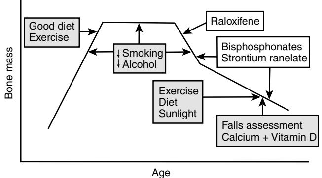
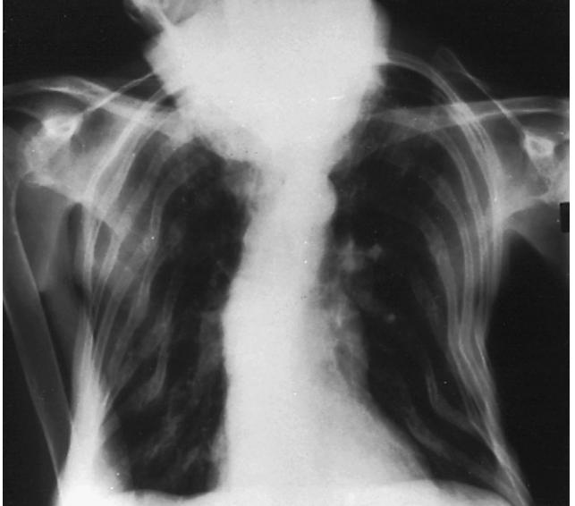
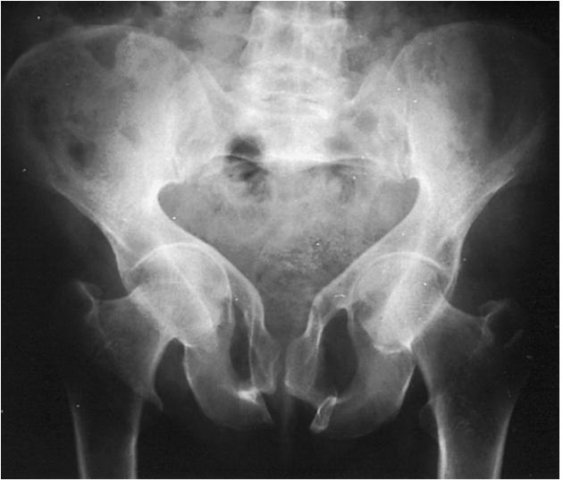
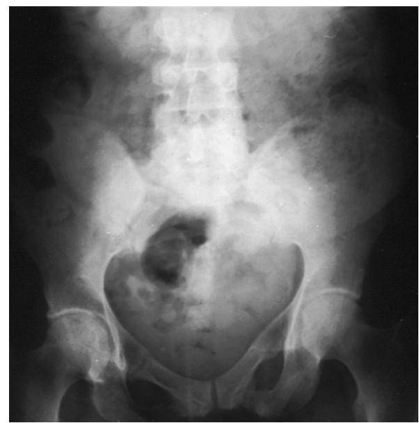
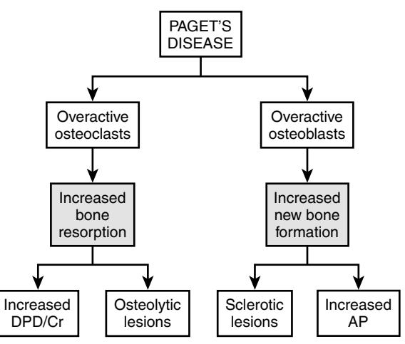
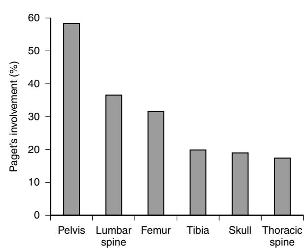

# Metabolic Bone Disease

Roger M. Francis

# **INTRODUCTION**

Bone is a living, dynamic tissue that undergoes constant remodeling throughout life. This is necessary to allow the skeleton to increase in size during growth, respond to the physical stresses placed on it, and repair structural damage due to structural fatigue or fracture. In addition to its mechanical properties, bone also plays an important role in calcium homeostasis, acting as a mineral reservoir that can be drawn on to maintain normocalcemia. The skeleton comprises two types of bone: cortical (or compact) and trabecular (or cancellous) bone. Cortical bone is predominantly found in the shafts of the long bones, whereas trabecular bone is mainly located in the vertebrae, pelvis, and the ends of long bones, where it forms a lattice-like structure within an outer shell of cortical bone. Trabecular bone has a larger surface area, undergoes greater remodeling, and is therefore more responsive to changes in calcium homeostasis than cortical bone. The respective proportion of cortical and trabecular bone varies with the anatomic site, but overall the skeleton is composed of 80% cortical and 20% trabecular bone.

The three major cell types involved in bone remodeling are osteoclasts, osteoblasts, and osteocytes. Osteoclasts are multinucleate cells derived from macrophage-monocyte precursors, which resorb bone, releasing mineral and removing degraded organic material. Osteoblasts are derived from fibroblast precursors and synthesize bone matrix or osteoid, which is subsequently mineralized around foci of crystal formation known as matrix vesicles. The matrix vesicles are extruded from osteoblasts by exocytosis and contain promoters of crystal formation such as alkaline phosphatase and pyrophosphatase. Osteocytes are mature osteoblasts that become trapped within calcified bone. These are interconnected by long dendritic processes, which may serve as mechanosensory receptors, leading to the production of paracrine factors that regulate bone resorption and formation.

Bone remodeling is initiated by a period of bone resorption lasting about 2 weeks, when osteoclasts erode an area of bone. Osteoblasts are then attracted to the resorption cavity, where over the subsequent 3 months new bone matrix is deposited and mineralized. The processes of bone resorption and bone formation are usually closely coupled, but bone formation exceeds resorption during skeletal growth, allowing the skeleton to increase in size and density. Later in life, resorption outstrips bone formation, leading to involutional bone loss. Bone remodeling may be influenced by mechanical forces applied to the skeleton, by paracrine factors, and by circulating hormones such as estrogen, testosterone, calcitonin, parathyroid hormone (PTH), and 1,25-dihydroxyvitamin D (1,25[OH]2D).

One of the major regulators of bone remodeling is the receptor activator of nuclear factor kappa B (RANK) and RANK ligand (RANKL) system. RANKL, which is produced by osteoblasts, attaches to RANK on the cell surface of osteoclasts and osteoclast precursors, leading to stimulation of osteoclast differentiation and proliferation.1 The interaction of RANKL and RANK is blocked by osteoprotegerin (OPG), a soluble decoy receptor produced by osteoblasts and marrow stromal cells.1 Studies show relationships between circulating concentrations of OPG and bone mineral density (BMD), and it is now apparent that the beneficial effects of osteoporosis treatments may be mediated in part by changes in the RANK, RANKL, and OPG system.2–4

Bone mass changes throughout life in three major phases: growth, consolidation, and involution. Up to 90% of the ultimate bone mass is deposited during skeletal growth, which lasts until the closure of the epiphyses. There is then a phase of skeletal consolidation lasting for up to 15 years, when bone mass increases further until the peak bone mass is achieved in the mid-30s. Involutional bone loss then starts between the ages of 35 and 40 in both sexes, but in women there is an acceleration of bone loss in the decade after the menopause. Overall, women lose 35% to 50% of trabecular and 25% to 30% of cortical bone mass with advancing age, whereas men lose 15% to 45% of trabecular and 5% to 15% of cortical bone.

# **OSTEOPOROSIS**

Osteoporosis is a skeletal disorder characterized by compromised bone strength, predisposing a person to an increased risk of low trauma or fragility fractures. The three major fragility fractures are those of the forearm, vertebral body, and femoral neck, but fractures of the humerus, tibia, pelvis, and ribs are also common. These fractures are a major cause of mortality, morbidity, and health and social service expenditure in older people, but this is particularly the case with hip fractures. The annual health and social service cost of fragility fractures in the United Kingdom has been estimated at £1.7 billion, of which almost 90% is attributable to hip fractures.5

There is a strong inverse relationship between bone density and fracture risk, with a two- to three-fold increase in fracture incidence for each standard deviation reduction in BMD. The risk of fracture is also determined by other skeletal risk factors, such as bone turnover, trabecular architecture, skeletal geometry, and previous fragility fracture. Nonskeletal risk factors for fracture include postural instability, physical and mental frailty, and conditions associated with falling.5,6

### **Prevalence of osteoporosis**

The World Health Organization (WHO) has quantitatively defined osteoporosis as a BMD 2.5 standard deviations or more below the mean value for young adults (T score <−2.5).7 The prevalence of osteoporosis, as defined by a T score <−2.5 at the hip, increases in white women in the United States from 8% in the seventh decade to 47.5% in the ninth decade, whereas the prevalence at the forearm, spine, or hip rises from 21.6% to 70%.7 As regards the resulting probability of fragility fractures, the lifetime risk for a 50-year-old woman in the United Kingdom is 53.2%, compared with 20.7% for a 50-year-old man.8 The risk of individual symptomatic fractures in a 50-year-old woman is 16.6% for the forearm, 3.1% for the vertebra, and 11.4% for the hip, whereas the corresponding figures for a 50-year-old man are 2.9%, 1.2%, and 3.1%.8

### **Pathogenesis of osteoporosis**

Bone mass at any age and therefore the risk of fracture is determined by the peak bone mass, the age at which bone loss starts, and the rate at which it progresses.

#### **PEAK BONE MASS**

Genetic factors account for as much as 80% of the variance in peak bone mass. Other potential determinants of peak bone mass include exercise, dietary calcium, smoking, alcohol consumption, and hormonal factors.6

#### **INVOLUTIONAL BONE LOSS**

Bone loss starts between the ages of 35 and 40 in both sexes, possibly related to impaired new bone formation as a result of declining osteoblast function. The onset of bone loss is likely to be genetically determined, and the subsequent rate of bone loss may also be influenced by genetic factors. Recent studies suggest that a number of gene polymorphisms influence BMD and fracture risk.6 The genes involved include those regulating RANKL, OPG, and the estrogen receptor gene.9 Although the individual effect of variation in these genes is relatively small, the combined impact of these is similar to other major risk factors for fracture.9,10

Bone loss increases in the decade following the menopause in women, because of the marked reduction in the circulating estradiol concentrations. Other causes of age-related bone loss include low body weight, smoking, excess alcohol consumption, physical inactivity, declining vitamin D concentrations, and secondary hyperparathyroidism.6

Body weight is an important determinant of bone density and fracture risk, as bone loss is more rapid in postmenopausal women with low body weight and individuals with osteoporotic fractures are lighter than expected. The protective effects of high body weight on bone density and fracture risk may be due to the stimulation of bone formation by greater mechanical loading, increased conversion of adrenal androgens to estrogens in fat, and the shock-absorbing properties of subcutaneous fat.

Smoking may increase bone loss by reducing the age at menopause by several years, decreasing plasma estrogen levels by increasing their metabolism and possibly depressing osteoblast function. The deleterious effect of smoking on the skeleton may also be due in part to the association with low body weight. Although alcoholism is a recognized cause of osteoporosis, the effect of modest alcohol consumption on bone density remains unclear.

The decline in physical activity with advancing age is also likely to cause further bone loss. Physical activity is important to the skeleton because the associated weightbearing and muscular activity stimulates bone formation and increases bone mass, whereas immobilization leads to rapid bone loss. The importance of physical activity is underlined by a number of studies, which show that physical inactivity is associated with an increased risk of hip fracture.

The role of dietary calcium intake in the pathogenesis of bone loss remains controversial. Although there is a relationship between dietary calcium and bone mass in adolescence, studies show little correlation between calcium intake and bone density or bone loss in postmenopausal women. Other nutrients that have been suggested as potential determinants of the rate of bone loss include fluoride, protein, and sodium, but their importance is still uncertain.

There is a reduction in circulating 25 hydroxyvitamin D (25OHD) and 1,25[OH]2D concentrations with advancing age, because of decreased cutaneous production and impaired metabolism of vitamin D. This is likely to contribute to the observed increase in circulating PTH with age. There is a weak relationship between serum 25OHD and bone density in middle-aged women, with an inverse correlation between bone density and serum PTH, suggesting that vitamin D status may influence bone loss. Other studies show that vitamin D insufficiency and secondary hyperparathyroidism are common in older patients with osteoporosis and fractures.11

#### **SECONDARY OSTEOPOROSIS**

In addition to the factors influencing the attainment of peak bone mass and subsequent involutional bone loss, there are a number of conditions that may accelerate the development of osteoporosis. Secondary causes of osteoporosis may be found in up to 30% of women and 55% of men with symptomatic vertebral crush fractures.6 The most frequently encountered are oral steroid therapy, male hypogonadism, hyperthyroidism, myeloma, skeletal metastases and the use of antiepileptic drugs.

### **Clinical features of osteoporosis**

Osteoporosis is generally considered to be asymptomatic until fractures occur. Fractures of the forearm and hip are usually easy to diagnose, but vertebral crush fractures may be more difficult to detect clinically. Only 30% of patients come to medical attention after a vertebral fracture, and there are many other causes of acute back pain.12 Classically, however, a vertebral fracture is associated with an acute episode of back pain lasting for 6 to 8 weeks before settling to a more chronic backache. The pain may radiate anteriorly but rarely radiates to the hips or legs. Individuals with vertebral fractures may also be aware of loss of height of several inches and notice the development of a kyphosis. Physical signs include a kyphosis, local tenderness over the spine, and horizontal skin creases and abdominal protrusion resulting from the loss of trunk height.

### **Diagnosis of osteoporosis**

Before the development of techniques that accurately measure bone density, osteoporosis was usually only detected after a fracture had occurred. The term *osteoporosis* was therefore reserved for the fracture syndrome resulting from reduced bone density. With the advent of bone densitometry and the development of effective treatments that decrease fracture risk, the term *osteoporosis* is increasingly used to describe reduced BMD before fractures have occurred.

Although accurate measurements of lumbar spine and femoral BMD can be made using dual energy x-ray absorptiometry (DXA), a population-based bone density screening program cannot be justified, as there is little evidence that such as strategy is effective in the prevention of fragility fractures.7 Nevertheless, an opportunistic case-finding strategy has been advocated in countries such as the United Kingdom, where a number of indications for BMD measurements are recognized.13 These include previous fragility fracture, untreated hypogonadism, oral glucocorticoid therapy, other secondary causes of osteoporosis, and radiologic osteopenia.13 Although spine BMD may be spuriously elevated in older people, because of degenerative changes and aortic calcification, femoral neck and total hip measurements are less affected by osteoarthritis.

BMD measurements may be of limited value in the investigation of frail elderly patients with hip and other fragility fractures, many of whom will have osteoporosis and should therefore benefit from treatment. Furthermore, U.K. guidelines recommend that all people over the age of 65 years who are likely to be on treatment with oral glucocorticoids for at least 3 months should be offered treatment for osteoporosis.14

BMD measurements may be expressed as standard deviation units above or below the mean value for normal young adults or relative to the mean value for control subjects of the same age, to give T and Z scores, respectively. Although the WHO definition of osteoporosis (T score <−2.5) may be useful in epidemiologic studies, it does not necessarily represent a threshold for treatment. This is important as 70% of women above the age of 80 years have a T score <−2.5, but only a proportion of these will sustain an osteoporotic fracture.7 Furthermore, although more than half of patients with hip fractures have osteoporosis, fewer than 50% of those with other fragility fractures have a T score <−2.5 on DXA measurement.15

As the value of BMD in predicting fracture risk is relatively poor, there has been growing interest in using the combination of BMD and clinical risk factors for fracture to estimate the absolute risk of fracture. The WHO has developed a fracture risk assessment tool (FRAX), which estimates the 10-year risk of fractures of the major fragility fractures and of hip fracture in particular.16,17 Country-specific algorithms use age, gender, and the presence or absence of appropriately weighted risk factors, with or without femoral neck BMD measurements, to estimate fracture risk.18 The clinical risk factors for fracture used in FRAX, which are at least in part independent of bone density, are made up of low body mass index (BMI), prior fracture after age of 50 years, parental hip fracture, current smoking, oral steroid therapy, alcohol intake > 2 units/day, and chronic conditions associated with bone loss such as rheumatoid arthritis.16–18 Guidelines are being developed that will guide clinicians on the absolute risk of fracture above which osteoporosis treatment should be considered.19

### **Investigation of osteoporosis**

As vertebral fractures may not always be easy to diagnose, spine x-rays should be considered in patients with acute back pain, loss of height, or kyphosis, to look for evidence of vertebral deformation, degenerative arthritis, or other pathology. Although spine x-rays are useful in the diagnosis of vertebral fracture, they are unreliable in the assessment of bone density. Spine x-rays may also show lytic or sclerotic lesions, which raise the possibility of neoplastic disease. Further investigations are then required, which may include isotope bone scan and magnetic resonance imaging (MRI) scan.12

In patients with vertebral fractures, causes of secondary osteoporosis should be identified by careful history, physical

### **Table 69-1. Investigations for Secondary Osteoporosis in Older People with Low Trauma Fractures or Low BMD**

| Full blood count                                                |
|-----------------------------------------------------------------|
| ESR or CRP                                                      |
| Biochemical profile                                             |
| Thyroid function tests                                          |
| Serum testosterone, sex hormone binding globulin, LH, FSH (men) |
| Serum and urine electrophoresis (vertebral fractures)           |
| Serum 25OHD and PTH                                             |

examination, and appropriate investigation (Table 69-1), because specific treatment of underlying conditions such as hyperthyroidism, hypogonadism, and primary hyperparathyroidism increases bone density by up to 15%. Underlying causes of secondary osteoporosis should also be sought in older men and women presenting with hip and other nonvertebral fractures after minimal trauma. Serum 25OHD and PTH measurements may be used to confirm the diagnosis of vitamin D insufficiency and secondary hyperparathyroidism, but these are probably unnecessary if calcium and vitamin D supplementation is planned. Routine biochemical profile is worthwhile, as hypocalcemia and hypophosphatemia may indicate possible vitamin D deficiency osteomalacia, but these measurements lack diagnostic specificity or sensitivity. Serum 25OHD and PTH measurements are also useful in the further investigation of possible vitamin D deficiency osteomalacia, which is particularly likely in housebound patients or those with previous gastric resection, malabsorption, or the long-term use of antiepileptic drugs. Investigations for secondary osteoporosis should also be performed in patients found to have a BMD below the normal range for their age (Z score <−2.0), to identify underlying causes of bone loss, which may be modified.

### **Management of osteoporosis**

All patients with fragility fractures should be given general advice on lifestyle measures to decrease further bone loss, including eating a balanced diet rich in calcium, moderating tobacco and alcohol consumption, and, if possible, maintaining regular physical activity and exposure to sunlight. As bone loss continues into old age in both men and women, the need for specific treatment should be considered in all patients with osteoporosis or fragility fractures. Although most studies of the treatment of osteoporosis have recruited few women above the age of 80 years, there is no evidence of an attenuated response to treatment with advancing age.

A number of treatments have been shown to increase BMD and decrease the risk of vertebral and hip fractures. The Royal College of Physicians has published guidelines on the management of osteoporosis,13 grading its recommendations on the levels of evidence for each therapeutic intervention (Table 69-2). Grade A recommendations are based on randomized controlled trials, whereas grade B recommendations result from controlled studies without randomization, studies with a quasi-experimental design, and epidemiologic studies. Although the grading of the strength of the recommendations based on study design is useful, this takes no account of study size, the magnitude of the treatment effect, the patient groups studied, or the other potential risks and benefits of treatment.

| Table 69-2. Effect of the Major Treatment Options on the |  |
|----------------------------------------------------------|--|
| Risk of Vertebral, Non-vertebral, and Hip Fractures      |  |

|                          | Vertebral Fractures | Non-vertebral Fractures | Hip Fractures |
|--------------------------|------------------------|----------------------------|------------------|
| Raloxifene               | A                      | ND                         | ND               |
| Alendronate              | A                      | A                          | A                |
| Risedronate              | A                      | A                          | A                |
| Zoledronate              | A                      | A                          | A                |
| Ibandronate              | A                      | (A)                        | ND               |
| Strontium ranelate       | A                      | A                          | (A)              |
| Teriparatide             | A                      | A                          | ND               |
| Calcium and vitamin D | ND                     | A                          | A                |

Grading of recommendations updated and adapted from the Royal College of Physicians Clinical Guidelines for Prevention and Treatment of Osteoporosis. Royal College of Physicians and Bone and Tooth Society of Great Britain. Osteoporosis clinical guidelines for prevention and treatment. Update on pharmacological interventions and an algorithm for management. London: Royal College of Physicians; 2000. (ND indicates that fracture reduction has not been demonstrated, whereas (A) reflects that a beneficial effect on fractures risk was only found in posthoc subgroup analysis.)

### **HORMONE REPLACEMENT THERAPY (HRT)**

Although HRT was previously used in the prevention and treatment of osteoporosis in younger postmenopausal women, the situation changed with the publication of the results of the Women's Health Initiative Study.20 This randomized controlled trial compared the effects of HRT with placebo in 16,608 postmenopausal women aged 50 to 79 years. Although this showed a reduction in colon cancer as well as vertebral, hip, and other factures, the benefits were outweighed by the increased risk of breast cancer, coronary heart disease, stroke, and thromboembolism.20 As a result of this study, HRT is no longer recommended for the prevention of osteoporosis, but it may be useful in younger postmenopausal women with osteoporosis and severe climacteric symptoms and in those unable to tolerate other osteoporosis treatments.

### **RALOXIFENE**

Raloxifene is a selective estrogen receptor modulator (SERM), which has estrogen agonist actions on the skeleton but acts as an estrogen antagonist on the breast and endometrium. The Multiple Outcomes of Raloxifene Evaluation (MORE) study in postmenopausal women with osteoporosis showed that raloxifene increased lumbar spine and femoral neck bone density by 2% to 3%, reduced the risk of vertebral fractures by 30% to 50%, and decreased the incidence of breast cancer by 76%.21,22 There is no evidence that raloxifene decreases the risk of hip or other non-vertebral fractures. The main side effect of raloxifene is hot flashes, particularly when used shortly after menopause, but there is also an increased risk of venous thromboembolism. It is generally used in younger postmenopausal women with osteoporosis who are at high risk of vertebral fractures, but whose risk of non-vertebral fractures is low.

### **BISPHOSPHONATES**

Bisphosphonates have become the treatment of choice for patients with osteoporosis, because of their proven antifracture efficacy and good safety profile. Intermittent cyclical etidronate therapy is now rarely used, because although it reduces the incidence of vertebral fractures, there are no interventional studies investigating the effect of treatment on hip fracture incidence.13 Alendronate and risedronate have been shown in large studies to increase BMD and decrease the incidence of vertebral, hip, and other nonvertebral fractures.13,23–25 These oral agents are available as daily or weekly preparations but need to be taken on an empty stomach, 30 minutes before food, to ensure that they are absorbed from the bowel. Ibandronate has also been shown to improve BMD and decrease the incidence of vertebral fractures, but although a posthoc subgroup analysis suggests that it prevents non-vertebral fractures, no reduction in hip fractures has been demonstrated.26 Ibandronate is available as a monthly oral preparation and a three-monthly intravenous injection. Annual intravenous infusions of zoledronate in women with osteoporosis have been shown to decrease the risk of vertebral fractures by 70% and hip fractures by 41%.27 A further study in patients with recent hip fracture demonstrates that annual intravenous zoledronate decreases the risk of vertebral and non-vertebral fractures but also reduces mortality by 28%.28

Although the antifracture studies with alendronate only recruited patients up to the age of 81 years, there was no evidence of any attenuation of the benefits with advancing age.29 Risedronate has been shown to decrease vertebral fractures in women above the age of 80 years,30 but although there is no definite evidence that it reduces the risk of hip fractures in women in this age group recruited on the basis of clinical risk factors for fracture,25 there is no reason to suspect it will be ineffective in elderly women with osteoporosis. Over a third of the patients in the major study of zoledronate in osteoporosis were above the age of 75 years, suggesting that it is effective even in this older age group.27

Oral bisphosphonates are generally well tolerated, but upper gastrointestinal side effects are not uncommon. Esophagitis has been reported with oral bisphosphonates, but the risk of this complication may be reduced by following the manufacturers' advice that these agents should be taken with water and recumbency avoided for 30 minutes. Intravenous bisphosphonates may cause an acute phase response, with transient flulike symptoms lasting for a few days. The severity of these symptoms may be reduced by the administration of paracetamol for 3 days starting on the day of bisphosphonate administration. Intravenous zoledronate may also cause symptomatic hypocalcemia, so it is important ensure that the patient is vitamin D replete before administering this treatment. Increased bone pain has been reported with bisphosphonate treatment but appears to be an uncommon side effect. The major antifracture study of intravenous zoledronate showed an increase in serious atrial fibrillation,27 but this was unrelated to the timing of infusion and was not found in other studies with zoledronate,28 Osteonecrosis of the jaw has been reported in patients receiving high dose intravenous bisphosphonates in malignancy, but this appears to be uncommon in patients taking lower-dose bisphosphonates for osteoporosis.31

### **STRONTIUM RANELATE**

Strontium ranelate is a dual action bone agent which reduces bone resorption and increases bone formation. A large randomized controlled trial of strontium ranelate in postmenopausal women with osteoporosis and at least one vertebral fracture showed increases in BMD of 12.7% in the lumbar spine and 8.6% in the hip after 3 years' treatment.32

About 50% of this apparent increase is spurious, because of the skeletal incorporation of strontium, which has a higher atomic number than calcium. This study also demonstrated a 41% reduction in the incidence of new vertebral fractures.32 Another large study in women with osteoporosis showed a 16% reduction in the incidence of non-vertebral fractures with strontium ranelate, but in a posthoc subgroup analysis in women aged over 74 years with low BMD (T score < −3.0), there was a 36% reduction in hip fractures.33 Recent data suggest that strontium ranelate decreases the incidence of vertebral and non-vertebral fractures in women above the age of 80 years.34 Strontium ranelate is available in powder form in sachets, the contents of which are dissolved in water. Preferably it should be taken at bedtime, at least 2 hours after eating, to ensure adequate absorption from the bowel. Strontium has been generally well tolerated in clinical trials, but reported side effects include diarrhea and an increased risk of venous thromboembolism. A severe hypersensitivity reaction associated with drug rash, eosinophilia, and systemic symptoms (DRESS) has been reported, which occurs within 3 to 6 weeks of starting treatment with strontium ranelate, but this is fortunately very rare.

### **PARATHYROID HORMONE**

The continuously high circulating concentrations of PTH found in primary and secondary hyperparathyroidism is associated with an increase in bone turnover, but bone resorption is stimulated more than bone formation, resulting in loss of bone from the skeleton. In contrast, intermittent administration of PTH stimulates bone formation more than resorption, resulting in an increase in bone mass and density. Recombinant human parathyroid hormone 1–34 (teriparatide) and parathyroid hormone 1–84 have anabolic actions on the skeleton when administered by daily subcutaneous injection. Studies show a larger increase in BMD than that observed with bisphosphonates.35-37 Teriparatide decreases the incidence of vertebral and non-vertebral fractures, but no reduction in hip fractures has been demonstrated.35 There also appears to be no attenuation of the effects of teriparatide on BMD or fracture reduction with advancing age.36 Parathyroid hormone 1–84 has also been shown to reduce the incidence of vertebral fractures.37 These agents are generally well tolerated but may cause transient mild hypercalcemia, nausea, dizziness, and headaches. As these preparations are 10-fold more expensive than bisphosphonates, their use is often restricted to patients with severe osteoporosis or those who fail to respond to bisphosphonates. There is evidence that concomitant administration of a bisphosphonate may attenuate the anabolic effect of PTH treatment,38 but there is only transient attenuation after previous treatment.39

### **CALCIUM AND VITAMIN D**

Calcium and vitamin D supplementation has been shown to reduce the incidence of hip and other non-vertebral fractures in older people living in care homes, where vitamin D deficiency and secondary hyperparathyroidism are common.40 In contrast, recent large studies cast doubt on the role of calcium and vitamin D supplementation in the primary or secondary prevention of low-trauma fractures in community-dwelling older people.11,41 Nevertheless, a recent meta-analysis shows a small reduction in hip fractures with calcium and vitamin D (relative risk 0·82, 95% confidence intervals 0·71 to 0·94), with no beneficial effect of vitamin D alone on fracture incidence.42

Calcium and vitamin D supplementation may cause abdominal bloating, other gastrointestinal symptoms, and change in bowel habit. These may account for the relatively poor compliance and persistence with supplementation, particularly with combined calcium and vitamin D preparations. Calcium and vitamin D supplementation is probably most appropriate in older people who are housebound or living in residential or nursing homes, where vitamin D insufficiency and secondary hyperparathyroidism are common.11 The National Institute of Health and Clinical Excellence (NICE) in the United Kingdom recommends that patients receiving treatment for osteoporosis should also receive calcium and vitamin D supplementation, unless the clinician is confident that the patient has an adequate dietary calcium intake and is vitamin D replete.43

### **OTHER TREATMENTS**

Calcitonin is a potent antiresorptive agent with a rapid but short-lived effect on osteoclast function. The Prevent Recurrence of Osteoporotic Fractures (PROOF) study of 1255 women with established osteoporosis showed only marginal improvements in BMD with intranasal calcitonin.44 Although there was a 36% reduction in new vertebral fractures with doses of 200 IU calcitonin daily, no significant decrease in fractures was seen with 100 or 400 IU daily.44 In view of the unconvincing data on the antifracture efficacy of calcitonin, it is generally only used when other treatments are contraindicated or not tolerated. Nevertheless, there is some evidence that the short-term use of calcitonin may be useful in the management of pain associated with acute vertebral fracture.45

Patients with established osteoporosis have lower calcium absorption than age-matched control subjects, which may be due to reduced serum 1,25[OH]2D concentrations or to relative resistance to the action of vitamin D metabolites on the bowel.46 Malabsorption of calcium in osteoporosis can be overcome by pharmacologic doses of parent vitamin D or by low doses of the active vitamin D metabolites, such as calcitriol and alfacalcidol. Studies of the effect of treatment with vitamin D metabolites on BMD and fracture incidence in established osteoporosis have produced conflicting results.46 A study comparing calcitriol with calcium supplementation in women with vertebral fractures showed a significantly lower incidence of new vertebral fractures with calcitriol, but this was because of an increase in fracture rate with calcium rather than a reduction with calcitriol.47 The inconsistent results of antifracture studies, potential risk of hypercalcemia, and the need for regular monitoring of serum calcium and renal function limit the use of vitamin D metabolites in the management of osteoporosis.

### **FUTURE TREATMENTS**

Denosumab is a monoclocal antibody directed against RANKL, which it binds with high affinity and specificity. This inhibits the stimulatory action of RANKL on bone resorption. A randomized controlled trial in postmenopausal women with low BMD showed rapid suppression of bone resorption with twice yearly subcutaneous injections of denosumab, with significant increases in BMD.48 Although the results of studies examining the effect of denosumab on fractures are still awaited, this appears to be a promising treatment for osteoporosis. Other potential antiresorptive treatments for osteoporosis include cathepsin K inhibitors49 and new SERMs such as bazedoxifene.50

Novel anabolic treatments for osteoporosis include agents that inhibit the formation or action of sclerostin, a protein produced by osteocytes that is a potent inhibitor of bone formation.51 Selective androgen receptor modulators (SARMs) are also being evaluated as potential treatments for osteoporosis.52 Calcium-sensing receptor antagonists (calcilytics) stimulate the release of PTH, so they may also prove to be anabolic treatments for osteoporosis.53

#### **FALLS ASSESSMENT**

The risk of fragility fracture is determined not only by skeletal factors, but also by nonskeletal risk factors associated with a propensity for falling.5,6 A study in older men and women presenting to hospital with a fragility fracture showed a higher prevalence of skeletal risk factors (53%) and falls-related risk factors (75%) than documented osteoporosis (35%) as defined by a BMD T score <−2.5.54 All patients with fragility fractures should therefore undergo falls assessment. Risk factors for falling are divided into intrinsic factors, including poor vision, neurologic disease and medication, and extrinsic or environmental factors, such as trailing wires, loose carpets, and ill-fitting footwear. Intrinsic causes of falls should be sought by history, examination, and review of medication, whereas extrinsic or environmental causes may be identified from the history and home visit. In older patients with unexplained falls or syncope, tilt testing may also be useful.

A number of randomized controlled trials have assessed the effect of modifying risk factors for falling, but the results have not all been consistent. A recent meta-analysis concluded that there is only limited evidence that multifactorial falls prevention programs in primary care, community, or emergency care settings are effective in reducing the number of fallers or fall-related injuries.55 Although it is logical that preventing falls will reduce the incidence of fractures, no randomized controlled trial of falls prevention has been adequately powered to examine the effect on fracture risk. Nevertheless, a recent controlled study suggests that a single visit by an occupational therapist reduces the risk of falling in older women after hip fracture.56

#### **EXTERNAL HIP PROTECTORS**

An alternative approach to fracture prevention is to decrease the impact of falls using external hip protectors, which are incorporated into specially designed underwear. A Danish study block randomized 665 elderly residents of nursing homes to receive external hip protectors or to serve as controls.57 Over the 12-month study, there was a reduction in hip fracture risk of over 50% in those using the hip protectors. In the group randomized to receive hip protectors, the only patients who fractured were not using hip protectors at the time. A systematic review has examined the effect of external hip protectors in community-dwelling older people and in those living in residential or nursing home.58 Pooled data from 11 studies in institutionalized older people, including six randomized controlled trials, showed some reduction in hip fractures (relative risk 0.77, 95% confidence intervals 0.62 to 0.97). In contrast, data from three individually randomized controlled trials in community-dwelling older people showed no reduction in hip fractures with hip protectors.58

### **CHOICE OF TREATMENT**

In considering the choice of treatment in the individual patient, a number of factors are important. These include the underlying pathogenesis of bone loss, the evidence of efficacy in any particular situation, the cost effectiveness of treatment, tolerability, and patient preference. Although hormonal treatments are likely to be more effective in younger postmenopausal women with osteoporosis, where bone loss is largely due to estrogen deficiency, the risks of HRT outweigh the potential benefits in most cases.20 Raloxifene may therefore be appropriate in younger postmenopausal women, who are at high risk for vertebral fractures. In contrast, calcium and vitamin D supplementation may be more appropriate in frail elderly people, who are likely to have vitamin D insufficiency and secondary hyperparathyroidism. Bisphosphonates are effective across a wide age range, but oral bisphosphonates may be inappropriate in individuals with cognitive impairment because of difficulties in coping with the complex instructions on administration. The use of alendronate may be precluded in older patients with hiatus hernia, esophageal disease, and peptic ulcers, because of concern about the risk of esophagitis. In patients with upper gastrointestinal disease and those with difficulty following the instructions for taking oral bisphosphonates, strontium ranelate or intravenous bisphosphonates provide alternative treatment options.

A number of factors may influence compliance and tolerability. Raloxifene is likely to aggravate hot flashes, particularly in women close to the menopause, so may be more appropriate in postmenopausal women between the ages of 55 and 70 years. Oral bisphosphonates have complex instructions for administration, which can preclude their use in unsupervised patients with cognitive impairment. Calcium and vitamin D supplements may be poorly tolerated in some individuals, because of gastrointestinal side effects and bowel symptoms.

A schematic representation of the management of osteoporosis is provided in Figure 69-1. All individuals should be given lifestyle advice on diet, exercise, tobacco and alcohol consumption, and exposure to sunlight. In younger postmenopausal women with osteoporosis at high risk of vertebral fractures, raloxifene may be useful, particularly if there is also a significant risk of breast cancer. In older women at high risk of vertebral and non-vertebral fractures, bisphosphonates are currently the treatment of choice, but strontium ranelate provides a useful alternative, particularly above the age of 80 years. In frail, housebound, or institutionalized older people, calcium and vitamin D supplementation should be considered, because of the high prevalence of vitamin D insufficiency and secondary hyperparathyroidism. In patients with a past history of recurrent falls, measures should be taken to reduce the incidence of falls. Consideration should also be given to the use of external hip protectors, especially where caregivers are available to encourage compliance with their use.

# **OSTEOMALACIA**

Osteomalacia is a generalized bone disorder characterized by an impairment of mineralization leading to accumulation of unmineralized matrix or osteoid in the skeleton.59,60 There

Figure 69-1. Schematic representation of the major therapeutic options in patients with osteoporosis of different ages, together with lifestyle measures in the shaded boxes.

are a number of causes of osteomalacia, but the majority of cases are due to vitamin D deficiency, abnormal vitamin D metabolism, or hypophosphatemia (Table 69-3).

Adequate amounts of calcium and phosphate are essential for mineralization of osteoid to proceed normally, and although vitamin D is important in the homeostasis of calcium and phosphate, the precise role of the vitamin D metabolites in mineralization remains uncertain. The major source of vitamin D is from cutaneous production, following the exposure of the precursor 7-dehydrocholesterol to ultraviolet irradiation.61 The diet provides much smaller amounts of vitamin D, but this becomes essential when cutaneous production is limited. Vitamin D itself has little biologic activity and is metabolized in the liver to 25OHD, the major circulating form of vitamin D. This undergoes further hydroxylation in the kidneys to form 1,25[OH]2D, the hormonally active metabolite of vitamin D, which regulates calcium absorption from the bowel, influences bone remodeling, and affects muscle function.61

Vitamin D deficiency osteomalacia predominantly occurs because of reduced cutaneous production of vitamin D resulting from lack of exposure to sunlight, increased skin pigmentation, or adherence to strict religious dress codes where the skin is covered.59,60 It is therefore particularly seen in the housebound elderly or Asian immigrants, particularly when the dietary intake of vitamin D is poor.62,63 Vitamin D deficiency osteomalacia is also seen with malabsorption or after gastric surgery and is related to reduced sunlight exposure, decreased absorption of vitamin D, and malabsorption of calcium or phosphate.

Antiepileptic drugs and severe liver disease are also associated with low plasma 25OHD levels and the development of vitamin D deficiency osteomalacia.59,60 Antiepileptic drugs induce liver enzymes, which metabolize vitamin D to biologically inactive polar metabolites, whereas liver disease may be associated with impaired 25 hydroxylation of vitamin D. In addition, patients with epilepsy or liver disease may be less exposed to sunlight and therefore have reduced cutaneous production of vitamin D.59,60

Renal impairment leads to the development of osteomalacia because of reduced production of 1,25[OH]2D, malabsorption of calcium, and low plasma calcium, though plasma 25OHD concentration may also be low because of reduced sunlight exposure. Hypophosphatemic osteomalacia may result from decreased renal tubular reabsorption

|                 | Table 69-3. Classification of the Major Causes |  |  |
|-----------------|------------------------------------------------|--|--|
| of Osteomalacia |                                                |  |  |

| Deficiency | Cause                                                       | Clinical Form                                                 |
|------------|-------------------------------------------------------------|---------------------------------------------------------------|
| Vitamin D  | ↓ Sunlight exposure ↓ Dietary vitamin D Malabsorption | Housebound elderly Asian immigrants Small bowel disease |
| 25OHD      | Abnormal vitamin D metabolism                            | Antiepileptic drugs Liver disease                          |
| 1,25[OH]2D | ↓ 1α-hydroxylase activity                                | Renal failure                                                 |
| Phosphate  | ↓ Tubular reabsorption                                      | Familial Tumoral Sporadic                               |
|            | Phosphate depletion                                         | Use of phosphate binders                                   |

of phosphate as in familial, tumor-associated, and sporadic cases, or from phosphate depletion associated with the use of phosphate binders.59,60

# **Osteomalacia in the elderly**

Vitamin D deficiency is the commonest cause of osteomalacia in the elderly. Renal failure is a smaller but significant cause in this age group. There is a reduction in plasma 25OHD with advancing age, which is mainly due to reduced sunlight exposure, though decreased capacity for cutaneous production, low dietary intake, poor absorption, and impaired hepatic hydroxylation of vitamin D may also contribute to this condition.61 Plasma 25OHD concentrations are lower in individuals living in residential care than in people living in the community, and they are lowest in residents of long-term geriatric wards.62 The reduction in renal function with age is associated with decreased plasma 1,25[OH]2D concentrations which may contribute to the development of osteomalacia in the elderly.61

Osteomalacia is essentially a histologic diagnosis, so there is little information on its overall prevalence in the elderly. Nevertheless, as mentioned previously, low 25OHD concentrations are common in older people, particularly in subjects who are housebound or institutionalized. As about 10% of elderly people are housebound, a significant proportion are at risk of developing osteomalacia because of absent cutaneous production of vitamin D, and several investigators have shown that osteomalacia occurs in about 4% of elderly people admitted to hospital.64,65 An early histologic study from Leeds suggested that up to 40% of patients with hip fracture have evidence of osteomalacia, but the criteria used for this diagnosis were either excess osteoid or decreased calcification fronts.66 Using the stricter diagnostic criteria of the combination of increased osteoid seam width and reduction in calcification fronts, a subsequent study from Cardiff showed osteomalacia in only 2% of patients with hip fracture.67

# **Clinical features of osteomalacia**

The presentation of osteomalacia may be variable, and the diagnosis may be easily missed in the early stages of the disease because of the vague nature of the symptoms. The patient may complain of aches and pains, aggravated by muscular contraction, but tending to persist after rest. Although there is a propensity for fracture in osteomalacia, the soft

Figure 69-2. Chest x-ray of a woman with osteomalacia, showing deformity of rib cage as a result of bone softening.

elastic bone also deforms easily, leading to kyphosis, scoliosis, and deformity of the rib cage, pelvis, and long bones. The patient may also develop a proximal myopathy, causing a waddling gait and difficulties rising from a chair or climbing stairs. Occasionally, the hypocalcemia associated with osteomalacia leads to latent tetany, with paraesthesias of the hands and around the mouth, cramps, a main d'accoucheur appearance of the hands, and positive Chvostek's and Trousseau's signs.

### **Radiology in osteomalacia**

The classic radiologic appearances of osteomalacia are relatively rare and may not be found in the early stages of the disease. Osteomalacic bone is softer than normal and so becomes easily deformed. The intervertebral discs balloon out and deform the adjacent vertebrae to give them a uniformly biconcave codfish appearance. Similar deformity may occur in osteoporosis, but the biconcavity is more regular in osteomalacia than with osteoporosis, where the extent of vertebral deformity is variable. There may be radiologic evidence of deformity of the rib cage, pelvis, and long bones (Figures 69-2 through 69-4). A characteristic finding in osteomalacia is Looser's zones or pseudofracture, which consist of a large area of osteoid. These appear as bands of decalcification surrounded by more dense bone, which occur perpendicular to the bone surface, often where nutrient arteries enter bone (see Figure 69-4). Looser's zones are seen particularly in the proximal femur, humeral neck, pubic rami, ribs, metatarsals, and the outer border of the scapula. There may also be radiologic evidence of secondary hyperparathyroidism, with subperiosteal erosions in the metacarpals or phalanges.

### **Biochemical findings in osteomalacia**

The biochemical findings in the major types of osteomalacia are shown in Table 69-4. In vitamin D deficiency osteomalacia, the plasma calcium tends to be low because of reduced calcium absorption resulting from low plasma 25OHD and

Figure 69-3. X-ray of the pelvis of a woman with osteomalacia, showing deformity of the pelvic bones as a result of bone softening.

Figure 69-4. X-ray of the pelvis of a woman with osteomalacia, showing Looser's zones in the pubic rami.

1,25[OH]2D concentrations. The hypocalcemia leads to secondary hyperparathyroidism, which in turn stimulates the renal tubular reabsorption of calcium and reduces tubular reabsorption of phosphate. Plasma phosphate is therefore often low in osteomalacia because of reduced absorption from the bowel and decreased renal tubular reabsorption. The secondary hyperparathyroidism also increases bone remodeling, which is reflected in elevation of the plasma alkaline phosphatase and other biochemical markers of bone turnover. Not all patients with vitamin D deficiency osteomalacia will have hypocalcemia, hypophosphatemia, and raised alkaline phosphatase, and these abnormalities may occur individually in the elderly with intercurrent illness, so they lack specificity in the diagnosis of osteomalacia in the elderly.68

|                 | Table 69-4. Biochemical Abnormalities in Major Types |  |
|-----------------|------------------------------------------------------|--|
| of Osteomalacia |                                                      |  |

|                           | Vitamin D Deficiency | Renal Failure | Hypophospha temic |
|---------------------------|-------------------------|------------------|----------------------|
| Hypocalcemia              | 59%                     | 63%              | 9%                   |
| Hypophospha temia      | 68%                     | 0%               | 73%                  |
| ↑ Alkaline phosphatase | 88%                     | 88%              | 27%                  |
| ↓ 25OHD                   | 80%                     | 58%              | 0%                   |
| ↓ 1,25[OH]2D              | 75%                     | 81%              | 36%                  |
| ↑ PTH                     | 90%                     | 100%             | 11%                  |

Data derived from Peacock M. Osteomalacia. In: Nordin BEC, editor. Metabolic Bone and Stone Disease, 2nd ed. Edinburgh: Churchill Livingstone; 1984, pp. 72–111.

In osteomalacia associated with renal failure, hypocalcemia is seen in the majority of cases, although the plasma phosphate is normal or high because of reduced urinary excretion of phosphate. The plasma 1,25[OH]2D is low because of impaired production by the kidneys, and the plasma 25OHD may also be reduced because of inadequate exposure to sunlight. Plasma alkaline phosphatase is raised in the vast majority of cases, whereas the serum PTH is invariably elevated.59

In hypophosphatemic osteomalacia, the major biochemical abnormality is a low plasma phosphate, though this may vary in severity. A few cases may also show hypocalcemia, low plasma 1,25[OH]2D, and elevation of serum PTH (see Table 69-4).

# **Diagnosis of osteomalacia in the elderly**

The only definite way of diagnosing osteomalacia is by histologic examination of undecalcified bone and demonstrating excess osteoid and reduced calcification fronts or mineralization rate. Histologic confirmation of the diagnosis is required in the minority of cases, however. In patients with a typical history of bone pain and muscle weakness, with radiologic evidence of Looser's zones or typical biochemical changes there is little indication for bone biopsy. When the diagnosis is less clear-cut, measurement of plasma 25OHD and serum PTH may be useful, as the combination of low plasma 25OHD and elevated PTH is a strong indicator of the presence of osteomalacia. An alternative approach is to use a therapeutic trial of vitamin D in subjects likely to have osteomalacia and to monitor any subsequent clinical and biochemical improvement.

# **Treatment of osteomalacia**

In cases of vitamin D deficiency osteomalacia, the condition will heal with ultraviolet irradiation or vitamin D treatment.61 It has been suggested that vitamin D deficiency is treated with oral 50,000 IU vitamin D weekly for 8 weeks, followed by long-term vitamin D 800 to 1000 IU daily, to prevent recurrence of vitamin D deficiency.61 Unfortunately, high-dose oral vitamin D is not always easy to obtain. Furthermore, although IM injections of 300,000 units vitamin D every 6 to 12 months provides an alternative approach to treatment, the absorption from the administered oily solution is relatively poor.69 For these reasons, many clinicians treat patients with vitamin D deficiency osteomalacia with combined calcium and vitamin D supplements, providing 1000 to1200 mg calcium and 800 IU vitamin D daily. The addition of supplemental calcium ensures that sufficient mineral is available for mineralization of the osteoid to occur.

In patients with osteomalacia associated with malabsorption, the active metabolites of vitamin D may be required, which are usually given in a dose of 1 to 4 µg daily of either alfacalcidol or calcitriol. Calcium supplements may also be required, but the serum calcium should be monitored to avoid the development of hypercalcemia. Magnesium supplements may also be necessary if hypomagnesemia is present. If malabsorption is due to bacterial overgrowth, pancreatic insufficiency, or celiac disease, appropriate treatment of the underlying disorder with antibiotic therapy, pancreatic enzyme supplements, or gluten-free diet should be instituted.

In patients with osteomalacia and renal impairment, either alfacalcidol or calcitriol should be used in a dose of 1 µg daily, together with calcium supplements as required. Serum calcium and renal function should be monitored regularly on this treatment.

Treatment of osteomalacia leads to a resolution of the proximal myopathy and any symptoms of hypocalcemia within a few weeks, although the bone pain may take longer to improve. The biochemical abnormalities also persist for up to 6 months after treatment is started, and the bone remains histologically and structurally abnormal during this time. Care should therefore be taken to avoid falls during rehabilitation, as these may easily lead to fractures of the abnormal bone. The plasma calcium and phosphate returns to normal within a few weeks, whereas the plasma alkaline phosphatase rises further on treatment and may take many months to return to normal. Serum PTH also remains elevated for up to 6 months. Ultimately, radiologic abnormalities such as Looser's zones and changes of secondary hyperparathyroidism will resolve on treatment, though deformity will persist despite the remodeling of bone.

# **Paget's disease**

Paget's disease of bone is a common condition characterized by increased bone turnover, which can involve one or more of the bones in the skeleton. Although the condition may be asymptomatic, it can cause significant morbidity in older people, including bone pain, skeletal deformity, pathologic fractures, deafness, and osteoarthritis.70

# **Prevalence of Paget's disease**

The United Kingdom has the highest prevalence of Paget's disease in the world, but there is considerable regional variation in prevalence across the country.71,72 By the eighth decade of life, up to 8% of men and 5% of women in the United Kingdom have evidence of the condition.73 Studies suggest that Paget's disease is also common in the rest of Europe and in British migrants to Australia, New Zealand, and South Africa.70,71 In contrast, the condition is rare in Scandinavia, Asia, and Africa.71 There has been a decrease in the prevalence of Paget's disease in the United Kingdom and New Zealand over the past 25 years,74,75 but this trend has not been observed in the United States or Italy.71 The reason for the decrease in prevalence of Paget's disease is unclear, but may reflect environmental changes or the immigration of people from countries with a low prevalence.71

Figure 69-5. Pathophysiology of Paget's disease of bone, with the biochemical changes in the shaded boxes.

# **Pathophysiology of Paget's disease**

Paget's disease is characterized by increased bone resorption mediated by enlarged, hyperactive osteoclasts.71 There is also an increase in osteoblastic activity and new bone formation (Figure 69-5). This is associated with biochemical changes, including increased bone resorption markers, such as urine deoxypyridinoline/creatinine (DPD/Cr) and by an elevation of alkaline phosphatase (AP). The rapid bone turnover leads to the deposition of woven bone, which is more vascular, structurally weak and prone to deformity and fracture. Inclusion bodies resembling paramyxoviruses have also been seen in affected osteoclasts,76 but their role in the pathogenesis of Paget's disease remains uncertain.71 Osteoclast precursors from patients with Paget's disease appear to be particularly sensitive to factors that stimulate bone resorption, including 1,25[OH]2D and RANKL.77 Increased circulating concentrations of RANKL have also been reported in Paget's disease, but this requires confirmation in future studies.78

The etiology of Paget's disease remains uncertain. There is a significant genetic component to the condition, as about 15% of patients have a family history of the condition. The risk of developing the condition may be up to 10-fold higher in first-degree relatives of patients with Paget's disease.71 Recent work has identified gene mutations that may contribute to the development of Paget's disease and related conditions. The most important of these is in the sequestosome 1 (*SQSTM1*) gene, which encodes for a protein involved in RANK/RANKL signaling.79 Mutations in the *SQSTM1* gene are found in 20% to 50% of cases of familial disease and 5% to 20% of cases of sporadic disease.71 A much more rare cause of Paget's disease is a mutation in the *VCP* gene, which is associated with hereditary inclusion-body myopathy and frontotemporal dementia.80

Although genetic factors may predispose to the development of Paget's disease, it is likely that other factors may influence its expression. The clustering of cases of Paget's disease within families includes spouses, so may reflect not only genetic factors but also shared environment. It has been suggested that Paget's disease may result from a slow virus infection, which either causes the disease or triggers it in a susceptible individual. As mentioned earlier, inclusion bodies resembling paramyxoviruses have been seen in affected

Figure 69-6. Skeletal involvement in 889 patients with Paget's disease. (*Data derived from Davie M, Davies M, Francis R, et al. Paget's disease of bone: A review of 889 patients. Bone 1999;24 (Supplement):11S–12S.*)

osteoclasts, but their role in the pathogenesis of Paget's disease remains uncertain. Other factors that may influence the development of Paget's disease in susceptible individuals include mechanical forces, low dietary calcium intake or vitamin D deficiency during childhood, and occupational exposure to toxins.71

# **Clinical features of Paget's disease**

Paget's disease may present at any age over 30, but is most often diagnosed in the sixth decade of life. The condition is more common in men than in women. The majority of people with radiologic evidence of Paget's disease are asymptomatic and do not come to medical attention. The condition is therefore often an incidental finding in patients having x-rays for an unrelated reason.

The bones most commonly involved in Paget's disease are the pelvis, spine, femur, tibia, and skull (Figure 69-6), although the distribution of the disease is usually asymmetrical. The extent of skeletal involvement is generally constant within an individual, with previously unaffected bones rarely becoming involved long after diagnosis. The most common presentation is with pain, which may be due to the Pagetic changes in the bone itself or to the effects of skeletal deformity on surrounding structures. The cause of bone pain in Paget's disease may be difficult to determine. It may be due to periosteal stretching, to microfractures, or to direct nerve stimulation by substances released by osteoclasts during bone resorption.

Paget's disease may also cause skeletal deformity, as the affected bones thicken, enlarge, and become more elastic. Classically, this causes frontal bossing of the skull, bowing of the long bones and deformity of the pelvis (protrusio acetabuli). Pagetic bone is more likely to fracture, and fissure fractures may also occur on the outer aspect of bowed long bones.

Thickening of the skull may cause compression of the cranial nerves, particularly the auditory nerves, resulting in deafness. Other cranial nerves are only rarely involved in Paget's disease. The increased vascularity of Pagetic bone may also result in neurologic deficit because of a "vascular steal" syndrome. Softening of the base of the skull may rarely lead to basilar invagination, causing brainstem compression. Vertebral involvement may result in crush fractures or more rarely spinal cord compression.

A major management problem is the development of secondary degenerative arthritis in joints adjacent to involved bone. This is frequently more disabling than the Paget's disease itself and will not respond to treatment of the underlying bone disease. Other complications of Paget's disease include high output cardiac failure, because of the increased vascularity of the affected bone, which although often described is rarely seen. Sarcomatous change also occurs only rarely but has a poor prognosis.81

# **Diagnosis and investigation of Paget's disease**

The diagnosis of Paget's disease is reached through a combination of clinical assessment and selected investigations. Although the history rarely leads directly to a diagnosis of Paget's disease, it is important to seek clues to other conditions that may coexist with or masquerade as it. Examination may reveal skeletal deformity, especially of the skull or long bones, which may feel warm to the touch. There may also be signs of associated degenerative arthritis. A full neurologic assessment is advisable in symptomatic patients, though abnormalities other than deafness are not often found.

The diagnosis of Paget's disease is usually confirmed radiologically. x-rays may show an increase in size of affected bones, alteration of bone texture with areas of sclerosis and lucency (see Figure 69-5), skeletal deformity, and evidence of degenerative arthritis in adjacent joints. The radiologic appearances are often said to be pathognomonic, but skeletal metastases from occult carcinoma of the prostate or breast should be considered in the differential diagnosis. Prostate specific antigen should therefore be measured in all men with probable Paget's disease. Rarely, bone biopsy may be required if the diagnosis remains uncertain.

The extent of the bone disease can be assessed by isotope bone scan, although x-rays of areas with increased uptake may be advisable, if there is any doubt about the diagnosis. Serum alkaline phosphatase and biochemical markers of bone resorption are often markedly raised in Paget's disease, reflecting increased osteoblast and osteoclast activity respectively (see Figure 69-5), so they may be used to assess the activity of the condition and its response to treatment.

# **Treatment of Paget's disease**

Treatment of Paget's disease is directed at suppressing the overactivity of osteoclasts, thereby decreasing bone turnover.82 Although calcitonin was used for several decades in the management of Paget's disease, bisphosphonates have now become the treatment of choice. These agents are generally used in patients with symptomatic Paget's disease, but their role in asymptomatic individuals is unclear. The PRISM study showed no apparent benefit of intensive bisphosphonate treatment aimed at returning alkaline phosphatase to normal, compared with those given symptomatic treatment for bone pain.71

# **BISPHOSPHONATES**

Oral antiresorptive therapy for Paget's disease became practical for the first time with the introduction of etidronate in the late 1970s. Disodium etidronate 400 mg daily decreases the biochemical markers of bone turnover by 40% to 60%.82

Unfortunately, prolonged therapy with etidronate leads to impaired mineralization, so courses of treatment should not exceed 6 months. There is also evidence that previous treatment with etidronate decreases the efficacy of subsequent courses of treatment.82

Intravenous infusions of pamidronate decrease the biochemical markers of bone turnover by 50% to 80%, resulting in prolonged remission in many patients with Paget's disease.82 Pamidronate may be given by weekly infusion of 30 mg for 6 weeks or by three fortnightly infusions of 60 mg. The intravenous route of administration avoids the potential problems of oral bisphosphonates, such as poor absorption from the bowel, the need to take medication in a fasting condition, and gastrointestinal side effects. These advantages are offset by the need for intravenous infusion and transient flulike symptoms that may follow treatment.

Oral tiludronate 400 mg daily for 3 months decreases the biochemical markers of bone turnover by at least 50% in 70% of patients.83 This may avoid the need for further treatment for at least 18 months. A comparative study in 234 patients with Paget's disease showed that significantly more responded to 3- or 6-month treatments with tiludronate 400 mg daily (60.3% and 70.1%) than to 6-month treatments of etidronate at 400 mg daily (25.3%).84 This study also showed an attenuated response to etidronate in patients who had previously received this bisphosphonate.

A North American study compared the effect of risedronate 30 mg daily for 2 months or etidronate 400 mg daily for 6 months in 123 men and women with documented Paget's disease.85 At 12 months, alkaline phosphatase decreased into the normal range in 73% of patients who had taken risedronate, compared to 18% with etidronate. Previous treatment with etidronate had no significant effect on the subsequent response to risedronate but resulted in a blunted response to further etidronate. There was a significant reduction in pain with risedronate, whereas etidronate was associated with nonsignificant improvement.

Pooled data from two identical, randomized controlled trials compared a single intravenous infusion of 5 mg zoledronate with a 2-month course of oral risedronate 30 mg daily in 347 patients with Paget's disease.86 After 6 months, alkaline phosphatase had returned into the normal range in 88.6% of patients receiving zoledronate, compared with 57.9% in the risedronate group. Although pain scores improved in both groups, there appeared to be greater improvement in quality of life with zoledronate than risedronate.86 A subsequent study followed up 296 patients who had responded to treatment with either zoledronate or risedronate for a further 18 months.87 In patients treated with zoledronate, the mean alkaline phosphatase remained in the middle of the reference range, whereas it increased in a linear fashion from 6 months with risedronate.

Although bisphosphonates decrease bone pain and reduce the activity of Paget's disease, there is currently no evidence that any treatment will prevent skeletal deformity, fractures, or other complications of the condition.71 The choice of bisphosphonates for the management of Paget's disease depends on patient preference and tolerability. Despite its low cost, etidronate should no longer be used because it is much less effective than other bisphosphonates. The main choice lies between IV zoledronate or pamidronate infusions and oral risedronate.

### **CALCITONIN**

Calcitonin has a direct, receptor-mediated action on osteoclast function. In vivo studies show that within 30 minutes of calcitonin administration, osteoclasts cease synthetic activity and begin to detach from bone. Recruitment of osteoclasts and fusion of precursor cells is also halted, resulting in a rapid reduction in bone resorption. Calcitonin has a short half-life, so osteoclast activation recommences as soon as local concentrations return to basal levels. Salmon and porcine preparations of calcitonin are also weakly antigenic, and neutralizing antibodies are formed during treatment by some patients, which may limit their long-term efficacy. Nevertheless, subcutaneous or intranasal calcitonin has proved to be useful in the management of Paget's disease, where it decreases bone pain and reduces the biochemical markers of bone turnover.82 Calcitonin is now generally only used in patients unable to tolerate bisphosphonate treatment

### **FRACTURES IN THE ELDERLY**

The mechanical properties of an individual bone are determined by the amount of bone present, skeletal architecture, and bone quality. Aging is associated with a reduction in bone mass, disruption of trabecular architecture, and an increased prevalence of disorders such as osteomalacia and Paget's disease, which adversely affect the quality of bone. Nevertheless, the risk of fracture is determined not only by skeletal factors but also by nonskeletal risk factors including postural instability, physical and mental frailty, and conditions associated with falling.5,6 It is therefore not surprising that the incidence of fractures increases with advancing age. Whereas fractures in young adults usually occur after extensive trauma, fractures in the elderly may result from minimal trauma, such as falling from standing height. The major fractures occurring in older people are those of the forearm, vertebral body, humerus, pelvis, and hip.8,88 The incidence of these fractures increases with advancing age and is higher in women than men because of their lower peak bone mass, different patterns of cortical and trabecular bone loss, smaller skeletal size, and greater risk of falls. Fractures are also more common in older residents of care homes and nursing homes than in community-dwelling people of the same age.89 This probably reflects the higher risk of falls and lower BMD in institutionalized older people compared with those living in the community.90

There is considerable geographic variation in fracture incidence around the world,91 which may reflect differences in bone mass due to race, smoking, alcohol consumption, and physical activity. The absolute number of fractures in the elderly is rising rapidly, partly because of the increasing numbers of elderly people and a rising age-specific incidence of fractures,92 If present demographic trends continue in the United Kingdom, the number of young elderly will remain reasonably constant over the next few decades, whereas the number of people over the age of 85 will increase considerably. Many of these elderly people will be frail, and therefore at greater risk of falls and fractures. There has been an increase in the age-specific incidence of fractures of the forearm, vertebral body, humerus, and hip over the past few decades,93,94 which has been attributed to the increased survival of frail individuals and secular changes in smoking, alcohol consumption, diet, and physical activity. Although the age-specific incidence of fracture may now be reaching a plateau or even declining,95 the aging population means that an increase in the absolute number of fractures is inevitable, in both the developed and developing world.96

### **Forearm fractures**

These are the most common fractures before the age of 75.8,88 The incidence rises steeply at the menopause in women and then plateaus above the age of 65, whereas the incidence changes little with age in men.97 It has been suggested that the rise in incidence at the menopause is due to an increase in postural instability and therefore falls in women at this age.98,99 The absence of a further increase in incidence of forearm fractures after age of 65 may be due to the fact that the arm is less likely to be used to break a fall in the elderly. About 50% of postmenopausal women with Colles fracture have evidence of osteoporosis at the forearm, spine, or hip.100 Forearm fractures are also associated with an increased risk of vertebral and hip fractures in both men and women.101–103

### **Vertebral fractures**

The incidence and prevalence of vertebral fractures is difficult to quantify, as many patients with this fracture do not seek medical attention.12 The European Vertebral Osteoporosis Study (EVOS) showed that the overall prevalence of vertebral deformity increased in women from 5% at the age of 50 years to 25% at 75 years, whereas the corresponding figures for men were 10% and 18%.104 The higher prevalence of vertebral deformity in young men compared with women may be due to greater exposure to trauma. There was also a large variation in the prevalence of vertebral fractures across Europe, which may reflect differences in physical activity and other lifestyle factors.105 Subsequently, the European Prospective Osteoporosis Study (EPOS) showed that the incidence of radiologically apparent vertebral fractures approximately doubles in women every 10 years, from less than 5/1000 person-years at the age of 50 years to about 25/1000 person-years by the late 1970s.106 In men, the incidence also increases with age, but at a slower rate.106

In addition to back pain, loss of height, and kyphosis, vertebral fractures may also result in loss of energy, emotional problems, sleep disturbance, social isolation, and reduced mobility.12,107 There is also an increased mortality associated with vertebral crush fractures, but this may be due to coexisting conditions associated with osteoporosis rather than the fracture itself.108 Data from the Study of Osteoporotic Fractures in the United States show that mortality increases with the number of vertebral fractures.109 It has been estimated that the acute cost of vertebral fractures in the United Kingdom is £12 million/year,110 but the real cost may be substantially higher because of the associated long-term morbidity. Patients with symptomatic vertebral fracture consult their general practitioners 14 times more than control subjects in the year following fracture,110 so they are likely to continue to use health and social service resources at an increased rate. Previous vertebral fracture increases the risk of further vertebral fractures and hip fracture.111,112 An incident vertebral fracture is associated with a 20% risk of further vertebral fracture in the next year.112

### KEY POINTS Metabolic Bone Disease

- Fractures are a major cause of excess mortality, morbidity, and health and social service expenditure in older people.
- The risk of fracture is determined by skeletal and nonskeletal risk factors.
- The incidence of osteoporosis, osteomalacia, and Paget's disease increases with advancing age, contributing to the risk of fracture in older people.
- Treatments are available for osteoporosis, which improve bone density and reduce the risk of vertebral, hip, and other nonvertebral fractures.
- In addition to the increased risk of fracture, osteomalacia, and Paget's disease may also lead to bone pain and skeletal deformity.
- The most common cause of osteomalacia in older people is vitamin D deficiency, which can be corrected by appropriate supplementation.
- Bisphosphonate treatment in Paget's disease reduces bone turnover and decreases bone pain.

# **Hip fractures**

This is the most important fracture in the elderly because it causes greater mortality, higher morbidity, and more expenditure than all other fractures combined. The incidence of this fracture rises steeply with age in both sexes, though it is considerably higher in women than men.8,88 The remaining lifetime risk of a hip fracture in a 50-year-old woman is 11.4% for the hip, whereas the corresponding figure for a 50-year-old man is 3.1%.8

The risk of hip fractures is determined not only by BMD but also by nonskeletal risk factors. Studies show an increased risk of hip fracture with causes of secondary osteoporosis, such as oral corticosteroid therapy, thyroid disease, and hypogonadism, and with conditions associated with falling, like previous stroke, Parkinson's disease, and dementia.113–117 Hip fractures are associated with a considerable mortality, particularly in individuals with multiple comorbid conditions.118 This excess mortality following femoral neck fractures has been reported to be about 17% over 5 years, though most deaths occur within 6 months of fracture.119 In addition to the excess mortality, femoral fractures are associated with considerable morbidity, with many patients becoming more immobile and more dependent. Between 25% and 50% of individuals are more dependent after fracture, with deterioration occurring more often in women over the age of 75 years, those with a poor clinical result, and those who were already dependent before fracture.120–122 It has been estimated that the average cost of hip fracture in the United Kingdom is £12,000, of which £4,800 is due to acute costs.112

For a complete list of references, please visit online only at www.expertconsult.com