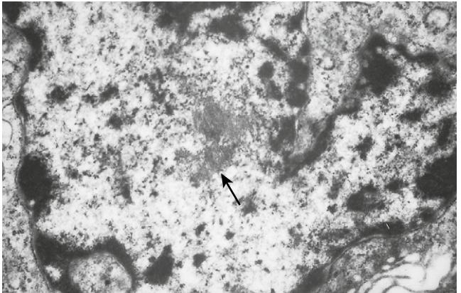
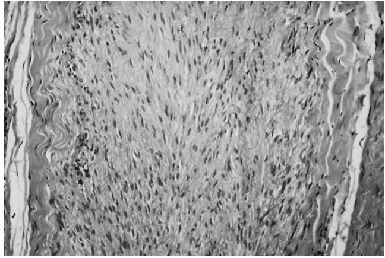
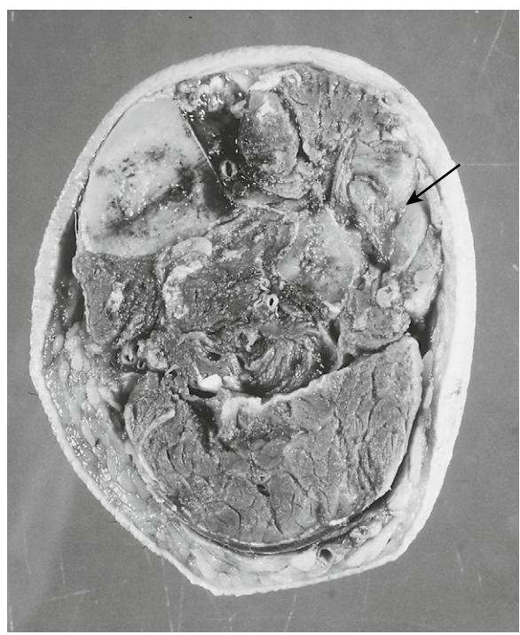
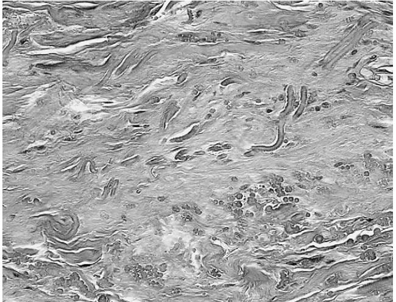
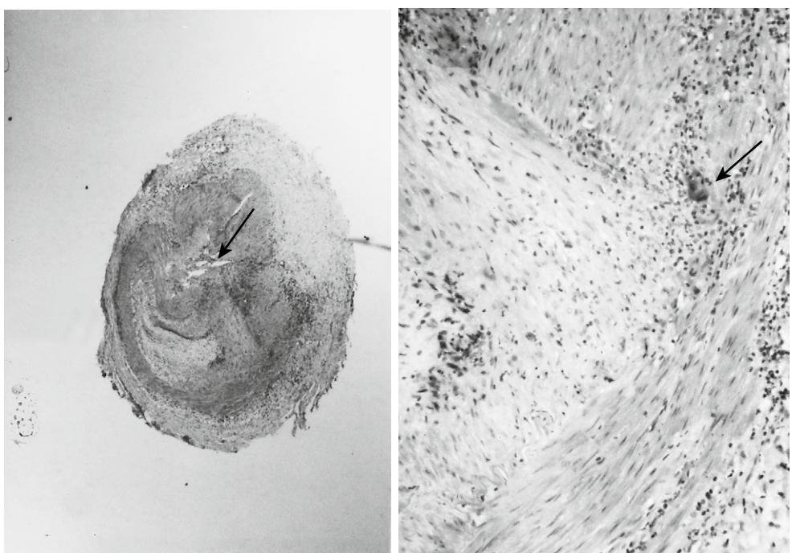

# Connective Tissue Diseases

Anthony J. Freemont

#### **INTRODUCTION**

Connective tissue is found in all the organs of the body, usually forming a supporting scaffold for the cells or blood vessels within the tissue. In addition there are tissues that are composed exclusively of connective tissue. These fall into two major groups: those consisting of cells within an extracellular, collagen-rich matrix (bone, cartilage, fibrous tissue) and those with an internalized, specialized organic "matrix" (smooth, cardiac, and skeletal muscle and fat).

With age, connective tissues change their structure and function. The detailed mechanisms underlying this are dealt with in Chapter 12, but briefly, although there are diverse specific pathogenic mechanisms driving age-related tissue events, there are a number of generic processes that explain the changes seen in most tissues. At the whole body level these include a decrease in the amount of and receptiveness to circulating cytokines and growth factors or trophic hormones (e.g., the GH/IGF-1 axis). At the tissue level these include decreased amounts of tissue (e.g., bone in osteoporosis) and failure of normal responsiveness to load (an important homeostatic element in the biology of connective tissues). At the level of the cell these processes include reduced efficiency and number of stem cells and synthetic ability of increasingly senescent end cells.1,2 And at the matrix level they are changes in the structure of matrix molecules (e.g., posttranslational cross-linking of collagen fibers by advanced glycation end products), bringing with it reduced functional efficiency.3

These changes can affect connective tissues anywhere,4 not just in those tissues that consist primarily of connective tissue. However, in the latter group the effects can be profound, leading to poor mobility, altered ability to withstand cold, metabolic syndrome,5 weakness, and an increased risk of falls, fractures, and age-associated "degenerative" diseases such as osteoarthritis and osteoporosis. As understanding of the causes of altered connective tissue function with age increases, it is becoming clearer that many of the predisposing factors are potential targets for improving quality of life in the elderly.

Diseases of three of the connective tissues—bone (Chapters 19 and 69), articular cartilage (Chapters 19 and 70), and skeletal muscle (Chapter 73)—together with some of the consequences of alterations in the connective tissue components of elements of the cardiovascular system (Chapter 14), blood (Chapters 21 and 93) and skin (Chapter 95), or disorders associated with the increasing prevalence of infection (Chapter 13) and cancer (Chapter 94) are described in detail elsewhere. This chapter concentrates on the common disorders of the connective tissues not already covered, and their associations with aging.

Once osteoporosis, osteomalacia, osteoarthritis, and sarcopenia are accounted for, the number of disorders of connective tissues that characteristically have an onset in the elderly age group (as opposed to those that accumulate throughout life but only present a significant disease burden in the elderly) is surprisingly small. The reasons why certain connective tissue diseases arise in the elderly population are not known. In this chapter, only those disorders characterized by a peak age of onset in the elderly population are discussed. Coverage cannot be exhaustive or comprehensive, but important issues and diseases affecting elderly people are highlighted.

### **NONMETABOLIC DISEASES OF BONE**

The major nonmetabolic diseases of bone affecting the elderly are fracture, osteomyelitis, and Paget's disease.

#### **Fracture**

There is a higher incidence of both metastasizing epithelial neoplasms and osteoporosis in the elderly population. Both can weaken bone to a point where fracture is more likely to occur under "normal loading," predisposing the elderly to a higher incidence of pathologic fracture.

In addition, in the elderly there is impoverished fracture healing, probably as a consequence of a complex of diminished numbers of mesenchymal stem cells, poor stem cell maturation, and abnormalities in the humoral pathways that regulate osteoblast differentiation and function.6 Poor fracture healing and an increase in the complication rate associated with fracture (e.g., thromboembolism) and illness/ surgery/immobilization (e.g., confusion, infection) make even relatively trivial fractures serious events in the elderly, with a high incidence of significant morbidity, institutionalization, and death.7

#### **Osteomyelitis**

In the general population, osteomyelitis is a bacterial infection of bone marrow that usually reaches the bone by hematogenous spread from a primary site elsewhere. It is most commonly pyogenic, and the most common causal organism is *Staphylococcus aureus.* A second and increasingly common cause of osteomyelitis is consequent on orthopedic interventions such as joint replacement and internal fracture repair.8 Joint replacement particularly is increasing in the elderly, and although the procedure is highly successful, a proportion (1% to 5%) of implant sites become infected, which is compounded in the elderly by comorbid conditions such as relative ischemia, diabetes, and reduced innate immunity. An appreciation that low-grade infection can underlie prosthesis failure in the elderly has led to a reassessment of diagnostic modalities9 and improved detection of implant-associated osteomyelitis, but diagnosis and treatment remain the most significant problems in orthopedics, particularly in the aging population.

#### **Paget's disease**

Paget's disease is a disorder of poorly understood etiology that affects one or, rarely, more than one bone.10 Paget's disease is believed to develop slowly, manifesting itself predominantly in the elderly population. Initially, perhaps in every case, there is a local decrease in bone mass, which is only later followed by the characteristic osteosclerosis. Usually, clinical features manifest themselves only in the later stages of the disease. The incidence varies widely across the world, being highest in northwest England where at postmortem as many as 10% of individuals over 70 years of age show changes attributable to Paget's disease.

Histologically there is a generalized increase in bone cell activity that, in severe cases, leads to deposition of woven bone and uncoupling of osteoblastic and osteoclastic activity. Together these two factors lead to the laying down of excessive quantities of weak bone. The bone marrow is very vascular and the normal hematopoietic marrow is replaced by fibrous tissue. By electron microscopy, osteoclasts are seen to contain structures resembling viral particles (Figure 71-1), and modern research techniques, including immunohistochemistry and in situ hybridization, have demonstrated the presence of Morbillivirus within bone cells.11 Causative links between the presence of the virus and altered osteoclast activity have given clues to the underlying biology of the disease and placed the osteoclast at the center of the disturbed bone cell biology.12 There is, however, considerable controversy over the nature of this virus, or even its existence,13 and increasingly opinion as to the cause of Paget's disease is moving toward it having a genetic basis.14

The abnormal bone matrix is weak leading to bone pain and fracture. Increased bone cell turnover predisposes to the development of primary bone malignancies, particularly osteosarcoma, fibrosarcoma, and malignant fibrous histiocytoma making Paget's disease the most common cause of primary bone malignancies in the elderly. Particularly in the elderly where there is a high incidence of impaired cardiac function, the increased vascularity within the affected bone or bones can lead to high-output cardiac failure.

Excessive bone cell activity causes an increase in the serum alkaline phosphatase and urinary collagen breakdown products. As the disease is driven by the osteoclast, symptomatic relief can be obtained by the use of drugs that suppress osteoclast function, notably bisphosphonates and calcitonin.

#### **CARTILAGE DISORDERS**

Chondroid tissues are characterized by the expression of the matrix molecules type II collagen and aggrecan and the transcription regulating gene Sox-9. The diversity of tissues expressing these genes is just beginning to be recognized with clear biologic distinctions being drawn between articular cartilage, growth plate, the cartilage of chondroid

Figure 71-1. Osteoclast nucleus containing viral inclusions *(arrow)* in Pagetic bone (×27,000).

joints (e.g., costosternal joints), nonskeletal (e.g., nasal, auricular, bronchial) cartilage, structural fibrocartilage of synovial joints, the annulus fibrosus, and nucleus pulposus of the intervertebral disk and the vitreous humor of the eye.

By far the most common symptomatic disorder of cartilage in the elderly is osteoarthritis, which is covered in Chapter 70. Other common disorders include chondrocalcinosis (deposition of calcium pyrophosphate crystals) and degeneration of the intervertebral disk.

#### **Degeneration of the intervertebral disk**

Degeneration of the intervertebral disk (IVD) is attracting increasing interest as modern molecular pathology techniques allow the biology of this predominantly human disease to be studied; advances in biologic therapies, tissue engineering, and regenerative medicine offer potential therapeutic modalities; and diskogenic back pain makes an increasingly large impact on health and the economy.

In degeneration there are profound alterations in IVD cell and matrix biology, which include decreased synthesis of aggrecan, a switch in collagen subtype production from type II to type I, increased matrix breakdown by locally produced metalloproteinases, premature cellular senescence, and cell loss through apoptosis. The current view is that these changes are driven by altered cytokine regulation in the IVD, with interleukin 1 (IL-1) and tumor necrosis factor-α (TNF-α) having central roles in the processes leading to degeneration and diskogenic pain.15 Currently, novel therapies are being developed to reverse the altered biology using cytokine modulators (such as IL-1 receptor antagonist and anti-TNF); replace the damaged tissues (particularly the nucleus pulposus, which is believed to be the seat of the altered cell biology) using disk replacements or biomaterials that have the same properties as the nucleus pulposus; or regenerate the IVD in vivo using a combination of stem cell therapy, smart biomaterials, and gene therapy.16 Until such therapies are developed for widespread use, the treatment for diskogenic back pain in the elderly remains largely symptomatic.

#### **DISORDERS OF FIBROUS TISSUE, LIGAMENTS, AND TENDONS**

Disorders of fibrous tissue, particularly the organized fibrous tissues of ligaments and tendons, are common. They include proliferations such as keloid and the fibromatoses; trauma, either to the structure itself or to its insertion into bone (the enthesis); myxoid degeneration (e.g., ganglion formation); altered balance of connective tissue components; and metaplasia. Of these, two disorders, Dupuytren's disease and traumatic enthesopathy, are particularly common in the elderly.

#### **Dupuytren's disease**

Dupuytren's disease is a disorder in which there is a nodular proliferation of fibroblasts within the palmar fascia and its digital extensions, leading to dense collagen deposition, thickening and contracture within the fascia, and permanent deformity of the adjacent finger.

Many theories have been put forward to explain Dupuytren's disease.17 They include changes induced by mast cell and epidermal chemical mediators, alterations in the vasculature, and paraneoplastic changes in DNA. None has been unequivocally accepted.

Within the palmar fascia, the fibroblastic proliferation is focal, leading to small nodules of very active fibroblasts (Figure 71-2). The nodular proliferation flits from area to area of the fascia, resulting in a generalized increase in collagen deposition. As the collagen "matures," internal fiber cross-linking leads to an overall reduction in fiber length and consequent contracture. The patient complains of a slowly progressive, painless nodule in the fascia that, as it worsens, shortens the affected area of tissue, causing further thickening and fascial contracture. Each fascial slip is attached to a finger, and the contracture leads to a permanent flexion deformity of the digit.

The clinical presentation is diagnostic, as are the biopsy appearances. Surgical excision is the treatment of choice, but the potential progression of the disease is not affected.18

#### **Traumatic enthesopathy**

Enthesopathy is the name given to a disparate group of disorders that occur at the entheses. The most striking of these are the inflammatory enthesopathies, seen in ankylosing spondylitis (AS) and rheumatoid arthritis (RA). Active enthesopathic AS is not specifically a disease of elderly people, and RA is discussed in Chapter 70.

There are two other major causes of enthesopathy: hyperparathyroidism and trauma.

Although the incidence of primary hyperparathyroidism peaks in elderly women (Chapter 91), it is usually a mild form of the disease and the abnormal activity of the parathyroid glands is often brought under control by an early resetting of the homeostatic mechanisms while the serum calcium is still within the normal range. There is therefore little of the bone erosion that is seen in classical advanced disease. In more severe disease, hyperosteoclasis at the enthesis can weaken the insertion, leading to pain and ligament failure.

Age-associated changes in collagen in the ligament/ tendon and cartilage, weaken the structures in or around the entheses and lead to the increased incidence of partial or complete physical failure encountered during exercise in the increasingly fit elderly population. Trauma at the enthesis leads to a repair process, with development of painful bony outgrowths called "traction spurs," particularly at sites of maximum load—around the shoulder girdle, at the insertions of the plantar fascia and Achilles tendon into the calcaneum,19 and the long ligaments of the spine into vertebral bodies.

Figure 71-2. Cellular proliferation within a Dupuytren nodule (H&E ×200).

#### **NEOPLASMS OF CONNECTIVE TISSUE**

Although many benign and malignant connective tissue neoplasms are seen in the elderly population, only rare primary connective tissue neoplasms have their peak incidence in this age group. These are all rare and are either benign neoplasms of soft connective tissues or malignant neoplasms of soft connective tissues or bone. The group includes benign neoplasms of soft tissues (spindle cell/pleomorphic lipoma, atypical fibroxanthoma, elastofibroma, cellular angiofibroma), malignant neoplasms of soft tissues (pleomorphic sarcomas of the group that used to be known as malignant fibrous histiocytoma but is now recognized as a spectrum of pleomorphic malignancies that have a similar histologic pattern but different immunophenotype [Figure 71-3], pleomorphic liposarcoma, undifferentiated pleomorphic sarcoma with giant cells, myxofibrosarcoma, and fibrosarcoma), and malignant neoplasms of bone (Pagetic sarcoma, chondrosarcoma).

#### **Elastofibroma**

One of these, elastofibroma, is particularly interesting in view of the highly significant age-associated changes that occur in the connective tissue matrix molecule elastin.20–22

Elastofibroma is a benign, slow-growing tumor found mainly in the subscapular area in elderly women. It consists of fibrous tissue containing large numbers of elastin fibers. These can be recognized in conventionally stained sections (Figure 71-4), but stains for elastin are characteristic and show exactly how much elastin is present within the tumor.

The etiology is unknown. There is some evidence that it may be associated with trauma, but the evidence for this is far from convincing and a familial incidence could point

Figure 71-3. Macroscopic image of a pleomorphic sarcoma (*arrow*) in the lower leg. Diameter approximately 5 cm.

Figure 71-4. H&E stained section of an elastofibroma. Note the wormlike and somewhat ragged edged elastin fibers viewed from the side on in the upper part of the figure and from the end on in the lower part (×300).

toward a genetic predisposition. There have been studies showing recurrent DNA gains at bands Xq12-q22 and 19,23 and clonal chromosomal changes have been reported.

Whatever else, the major feature of these tumors is the presence of abnormal elastin. Immunohistochemical, electron microscopic, and molecular studies have shown that the elastin fibers differ only slightly in amino acid composition from normal elastin.24 The changes seem to have resulted from abnormal synthesis rather than some sort of abnormal degradation. The changed amino acid composition leads to morphologic changes in the elastin fibers such that under the electron microscope they appear as irregular, somewhat fernshaped aggregates of electron-dense material surrounded by and incorporating microfibrils and collagen fibers. Whether this has any relationship to or bearing on the recognized age-associated abnormalities in elastin fiber structure, which have been described as being the one factor that will prevent extreme longevity in humans, is unknown,25 but examination of these tumor cells that are actively overproducing abnormal elastin may be one route to gaining a better understanding of the altered biology of elastin in the elderly.

#### **IMMUNE-MEDIATED CONNECTIVE TISSUE DISORDERS**

This group of clinicopathologic entities is characterized by an immune response against "self-antigens," leading to damage to "connective tissues" and blood vessels in multiple organs, notably joints, skin, glomeruli, and large and small blood vessels. Pathogenetically, all of these disorders exhibit immune complex deposition, or formation, within affected organs (usually on basement membranes) and consequent tissue damage. The intriguing thing about these disorders is that the balance of the organs affected by the disease process varies from condition to condition, so that in rheumatoid arthritis the joints are most commonly and severely affected, whereas in polyarteritis nodosa it is the blood vessels, and in systemic lupus erythematosus it is the skin and kidney. Like all autoimmune diseases, they most commonly present in young adult women. Only giant cell arteritis and polymyalgia rheumatica stand out as being disorders predominantly of the elderly.

#### **Giant cell arteritis and polymyalgia rheumatica**

Giant cell arteritis is a relatively uncommon disorder (approximately 1:1000 over 60 years) manifesting as an arterial vasculitis with a predilection for the arteries of the head, particularly the external carotid and the retinal branch of the internal carotid arteries, of elderly women (F:M = 3:1).26 The American College of Rheumatology has proposed diagnostic criteria.

Early in the disorder there is a leukocytoclastic vasculitis, so called because the vessel wall contains viable polymorphs and polymorph debris, evidence of complement activation, and generation of toxic polymorph products. Not only do polymorphs perish in this environment, but so too do the smooth muscle cells of the arterial wall, leading to segmental mural necrosis. Later the distinctive picture of chronic inflammation with giant cells within the wall of the vessel appears. The giant cells are of two types: immunecompetent cells, primed to an unknown antigen; and foreign-body type cells that are phagocytosing the internal elastic lamina (Figure 71-5). Thrombus formation is commonly seen. The disease has a focal distribution within the vessel and, in any one location, a short time course. After the inflammation has spontaneously settled, the vessel wall undergoes fibrosis. Extensive fibrosis can be used to indicate earlier destructive inflammation, even in the absence of active inflammation. Care must be taken in interpreting this feature as fibrosis and segmental loss of the internal loss of the internal elastic lamina is a "normal" finding in the elderly population.

The etiology of the vasculitis is not known. There is familial aggregation and association with HLA-DR4. In the serum there are raised levels of IgG, total complement, C3, and C4. Circulating immune complexes have been demonstrated in up to 90% of patients. They have also been seen attached to the internal elastic lamina, perhaps by absorbance. Whether the key role of the elastic lamina in immune complex absorption and its recognition by multinucleate macrophages is another manifestation of the importance of abnormal elastin synthesis in age-associated disorders of connective tissues is not known, but it is certainly intriguing.27

#### **POLYMYALGIA RHEUMATICA**

The localized disorder giant cell arteritis is associated with a generalized condition known as polymyalgia rheumatica. It is characterized by low-grade fever, weight loss, ill-defined pain, malaise, fatigue, and stiffness in the shoulder girdle, upper arms, and neck. Movement accentuates the pain, which is at its worst at night. Affected joints, particularly the knees and sternoclavicular joints, are actively inflamed. There is an increase in the number of cells within the synovial fluid and a normochromic, normocytic anemia. The erythrocyte sedimentation rate (ESR) is very high but there is no leukocytosis. Tests for autoantibodies are negative. It responds to steroids.

#### **METABOLIC DISORDERS**

Prominent among the metabolic disorders affecting connective tissues in the elderly are disorders in which crystals and abnormal proteins accumulate in the tissues.

Figure 71-5. Artery from a patient with giant cell arteritis. The left panel shows virtual occlusion (*arrow*) of the lumen (H&E, ×10). The right panel shows inflammation including giant cells (*arrow*) in the wall (H&E, ×150).

### **Crystal deposition disease**

The main symptomatic crystal deposition diseases affecting the elderly are gout and pseudogout.28

Gout is caused by the precipitation of crystals of monosodium urate in joints. Uric acid, from which urates are formed, is a breakdown product of purine metabolism. Most is excreted by the kidney. Alteration in uric acid excretion, either idiopathic or secondary to diuretic therapy, leads to an increase in monosodium urate in the blood and extracellular fluid and its precipitation in the tissues. Cartilage, particularly articular fibrocartilage and nonarticular hyaline cartilage, and subcutaneous connective tissue are the most common sites of its accumulation. Here aggregates of the crystals induce a macrophage response. These "tophi" may ulcerate. In elderly people, tophaceous or nontophaceous gout occur most commonly consequent upon an idiopathic decrease in urate excretion, generalized deterioration in renal function, or the use of certain diuretics. Therapy can be challenging in the elderly.29

Pseudogout is one of three manifestations of deposition of calcium pyrophosphate crystals in the elderly. The first is chondrocalcinosis, a disorder in which the crystals are deposited in articular tissues, mainly fibrocartilage. Despite being extremely common over the age of 70, it is generally not symptomatic. The second is in osteoarthritis in which calcium pyrophosphate crystals are a common finding in cartilage and synovial fluid and where they are believed to have some pathogenic role in disease progression. The third is pseudogout in which the presence of crystals in the synovial fluid leads to an acute crystal arthritis similar to gout.

#### **Accumulation of abnormal proteins**

Two conditions, diabetes and amyloidosis, cause abnormal proteins to accumulate in the elderly at least in part because the molecules are not as readily degraded as their normal counterparts. In terms of connective tissues, the most significant effects are alteration in structural proteins and thickening of vascular basement membranes leading to altered tissue nutrition. In diabetes a major cause of abnormal proteins to form is hyperglycemia, which leads to the production of advanced glycation end products (AGEs) that in turn induce cross-linking of collagens and other connective tissue matrix molecules.30 In amyloidosis, tissue dysfunction is caused by deposition of molecules that have changed from their conventional structure of an α helix to a β pleated sheet. The greatest interest in amyloids in the elderly has focused on neurodegeneration-associated amyloid deposition in the brain, but amyloids are far more widely spread in the aging

## KEY POINTS

#### Connective Tissue Diseases

- Age-associated disorders of connective tissues are among the most important for determining quality of life in the elderly.
- Connective tissue cells and matrices change structure or function markedly with increasing age. In particular AGE-induced cross-linking and cellular senescence affect tissue function.
- Connective tissue diseases restricted to the elderly population are rare as most connective tissue disorders are ones in which the incidence in the elderly is similar to that in other adults, or are present in the elderly following asymptomatic progression over many years.
- Most of the key connective tissue diseases affecting the elderly are among the most important diseases in the world.
- Elastin is a key matrix molecule for determining pathologic processes in the elderly.
- To fully understand connective tissue diseases in the elderly requires an understanding of the biology of the aging cell and matrix molecules.

population, with one estimate of the incidence of senile systemic amyloidosis (SSA) as 25% of those over 80.31 In SSA the major component of the amyloid (AS amyloid) is derived from normal transthyretin (prealbumin). The most common site for age-associated amyloids to accumulate in connective tissues in the elderly is in and around joints and in the walls of arteries. In these sites it is generally benign, but there is an association with osteoarthritis.

#### **SUMMARY**

The connective tissues are the most abundant tissues in the body. Diseases of connective tissue can occur at any time of life and most present first during middle age. Some are specific to the elderly population, including Paget's disease of bone, Dupuytren's disease, elastofibroma, pleomorphic sarcoma, giant cell arteritis, and senile amyloid, discussed here; osteoporosis, osteoarthritis, and vascular disease, which are among the most common noninfective diseases in the Western world, are discussed in other chapters.

For a complete list of references, please visit online only at www.expertconsult.com