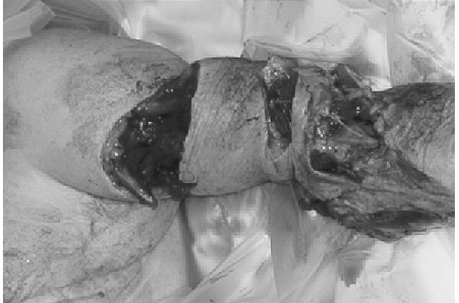
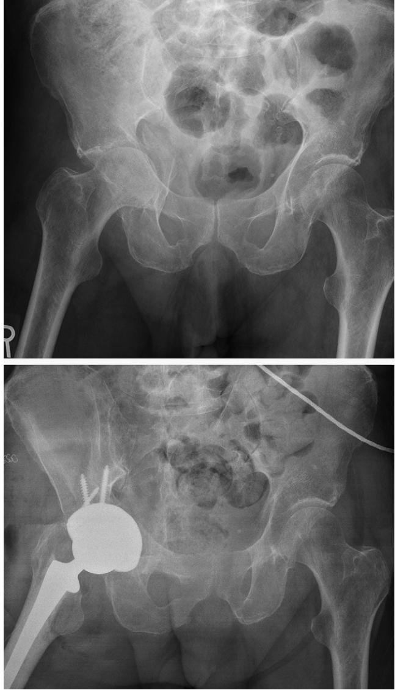
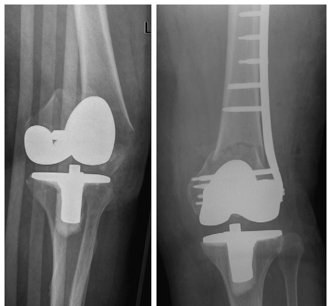

# Orthopedic Geriatrics

Robert Victor Cantu Kenneth J. Koval

## **INTRODUCTION**

Orthopedic care of geriatric patients presents unique challenges. Geriatric patients often have multiple medical comorbidities that affect decisions regarding timing and type of surgery. Bone quality is often substantially inferior to that of younger patients, and many older patients have preexisting arthropathies, making fixation more challenging and sometimes making arthroplasty the favored treatment. Coordination of care with an internal medicine or geriatric team is often helpful to provide the best outcome and to minimize complications. This chapter addresses many of the challenges the orthopedist must deal with when caring for geriatric patients.

## **Osteoporosis**

The World Health Organization has defined osteoporosis as a bone mineral density (BMD) value of 2.5 standard deviations or more below the young adult mean.1 Patients with known osteoporosis are at a substantial risk for fracture. The majority of patients with a fragility fracture involving the spine, hip, wrist, or proximal humerus, however, do not meet the BMD definition of osteoporosis.2 This fact can make it difficult to know which patients should receive pharmacologic treatment to prevent the risk of fracture. This finding also suggests that patients who have had a single fragility fracture should receive treatment for osteoporosis, even if their BMD is not 2.5 standard deviations below the mean.

Despite improvements in pharmacologic treatment, osteoporosis continues to afflict millions of aging Americans and people worldwide. Fragility fractures result in pain, disability, and medical complications and affect as many as 1 in 3 women and 1 in 12 men during their lifetime. It is estimated that worldwide, 323 million people suffer from osteoporosis, and that number is projected to be 1.55 billion by the year 2050.3 It has been predicted that the number of hip fractures in the year 2050 will be 6.3 million.3 The medical expenses following fragility fractures are substantial.4 The annual cost of osteoporosis and fragility fractures in Europe is estimated at 13 billion euros.4 The majority of that cost results from hospitalization after fracture.

Patients who have sustained a single fragility fracture have a 1.5 to 9.5 times higher risk of sustaining a second fracture than do those who have never had a fracture.5 One study found 20% of patients had a second fracture within 1 year.6 Despite this risk, many patients who have had a fragility fracture are not started on preventive medication. In one study, only 7% of patients admitted with a fragility fracture were receiving osteoporosis treatment.3 Surprisingly, this number only increased to 11% at the time of discharge. At a minimum, patients should be started on calcium and vitamin D after sustaining a fragility fracture. Antiresorptive medications should also be considered.

Osteoporosis has a dramatic effect on fracture fixation. Traditional nonlocked plates and screws may not achieve adequate purchase in osteoporotic bone. Intramedullary implants or locked plates should be considered to improve fracture fixation and maintain alignment.7 Augmentation of

bone with methylmethacrylate cement can enhance screw purchase, but care must be exercised to prevent extravasation into the soft tissues or into the fracture site. In elderly osteoporotic patients, certain fractures may be better treated with arthroplasty rather than open reduction internal fixation.

Several authors have looked at the costs of trying to screen for osteoporosis and institute antiresorptive treatment before the onset of a fragility fracture.8–11 A study in Australia looked at 1224 women 50 years old and older and categorized them into age groups.12 Dual-energy x-ray absorptiometry (DEXA) scanning was performed on all women, and the percentage with osteoporosis was 20% in the 50–59 age group, 46% in the 60–69 age group, 59% in the 70–79 age group, and 69% for those older than 80 years. It was estimated that if all women over 50 years of age were started on antiresorptive medication the risk of fracture would decrease by 50% in those with osteoporosis and by 20% in those without. They calculated the cost per fracture averted in the 50–59 age group at \$156,400 and in the over-80 group at \$28,500. It was concluded that treating all women over age 50 with antiresorptive medication was not financially feasible. The authors also concluded that for women over 60 years of age with osteoporosis, instituting antiresorptive therapy would decrease fragility fractures by 28% and was cost effective.12

## **GERIATRIC TRAUMA**

Patients older than 65 years of age account for 28% of all fatal injuries in the United States, although they represent only 12% of the population.13,14 Additionally, the population over 65 years of age is the fastest growing segment in the United States. Treatment of fractures in the elderly is often more complicated than in the young, healthy age group as elderly fracture patients often have preexisting medical problems that affect fracture management. One of the most common comorbidities in elderly patients is cardiopulmonary disease, which can limit their ability to tolerate surgery and participate in rehabilitation. Neurologic disorders, such as Alzheimer's disease and Parkinson's disease, are also common. Some patients have residual weakness or contractures from a previous cerebrovascular accident. Any of these disorders can affect gait and balance and limit weight-bearing restrictions that younger patients could comply with. Endocrine problems, particularly diabetes, are common in the elderly. Diabetic patients generally have vascular compromise secondary to small vessel disease and are immunosuppressed. Nonoperative treatment of select fractures may be preferred in these patients, particularly if there is a preexisting diabetic ulcer near the planned operative field.

For multiply injured elderly patients, the injury severity score (ISS) may underestimate the degree of injury. An elderly patient may present with a lower ISS than a young adult and still be unstable or even "in extremis," in the sense that minimal further insult can tip these patients past the point of recovery. At the same time, if their injuries are not rapidly stabilized, these patients may deteriorate beyond the point at which they can survive. It is this tightrope that

Figure 72-1. Grade IIIC humerus fracture in elderly trauma patient with multiple injuries. Treatment was immediate amputation.

the orthopedic trauma surgeon must walk when treating the elderly patient with multiple fractures. In such cases, simple splinting or external fixation of upper extremity fractures and external fixation of lower extremity fractures may represent the best initial treatment.

Few studies have focused specifically on the impact of orthopedic injuries in elderly trauma patients.15–17 One retrospective, multicenter study attempted to define factors associated with increased morbidity and mortality rates in elderly patients who had sustained major trauma.15 Of 326 patients with an average age of 72.2 years, there was an overall mortality rate of 18.1%. Of patients who required bony stabilization, 77% had this accomplished within 24 hours of admission. The mortality rate for patients who underwent fracture stabilization within 24 hours was 11%, and for those who were fixed after 24 hours it was 18%, but this difference was not statistically significant.15 The three complications with the highest mortality rates were acute respiratory distress syndrome (ARDS) (81%), myocardial infarction (62%), and sepsis (39%).

For the elderly trauma patient with a mangled extremity, early amputation should be considered. Elderly patients may not be able to withstand the multiple surgeries required to salvage severe, open fractures, especially those with vascular insult. If a severely injured limb becomes infected, the cascade of sepsis and multiple system organ failure can proceed quickly. Although this is often a difficult decision, early amputation in the elderly patient can be a life-saving procedure (Figure 72-1).

## **ANESTHETIC CONSIDERATIONS**

One aspect of orthopedic care in the elderly that should not be underemphasized is pain control. Early stabilization of fractures is one factor in pain control. Once fractures are stabilized, there is a minimization of narcotic use, which can improve respiratory function and mental status. Patients whose fractures are stabilized and have adequate pain control can be weaned from ventilators more easily, can obtain a more upright posture, and have reduced delirium; these are all critical for survival in the elderly. Selective use of nerve blocks or catheters for continuous infusion, such as a femoral nerve block catheter following a femur fracture, can greatly aid in pain relief and minimize narcotic requirements.

## **Periarticular fractures**

Treatment of periarticular fractures in the elderly often differs from treatment in younger patients. Fractures involving the proximal humerus, elbow, hip, and occasionally the knee sometimes fare better with a joint arthroplasty rather than open reduction internal fixation (ORIF) in the elderly. Several studies have compared ORIF to joint arthroplasty for displaced femoral neck fractures in the elderly.18–20 The complication rate following ORIF, including need for revision surgery, is substantially higher than it is for the arthroplasty group. Controversy exists as to whether hemiarthroplasty or total hip arthroplasty is the best treatment. Some studies seem to show improved results with total hip arthroplasty.21,22 Dislocation rate is a concern with total hip arthroplasty, especially in patients with neurologic disorders such as Parkinson's disease or patients with hemiparesis after a stroke.

Distal humerus fractures are another example of a periarticular injury in the elderly that may have better outcomes with arthroplasty rather than ORIF. Frankle et al reported on a retrospective review of 12 patients who underwent ORIF and 12 who underwent total elbow arthroplasty for distal humerus fractures.23 The total elbow group performed better on the Mayo Elbow Performance Score with 11 (excellent) and 1 (good) compared to 4 (excellent), 4 (good), 1 (fair), and 3 (poor) in the ORIF group. Muller et al reported on their results with 49 distal humerus fractures in patients older than 65 years treated acutely with total elbow arthroplasty.24 Inclusion criteria included patients who were "high compliance" and "low demand." Average range of motion at followup (average, 7 years) was an arc from 24 to 131 degrees. A total of five revision arthroplasties were performed during the follow-up period. They concluded that the procedure is recommended when the appropriate inclusion criteria are met.

For periarticular fractures best treated with ORIF, the advent of locked plates has allowed for improved fixation, especially in patients with osteoporotic bone. Results so far have been encouraging. In one retrospective review of 123 distal femur fractures treated with the Less Invasive Surgical Stabilization (LISS) system, 93% healed without bone graft, the infection rate was 3%, and there was no loss of distal fixation.25 In a prospective study of 38 complex proximal tibia fractures treated with the LISS system, 37 of 38 healed with satisfactory alignment, there were no infections, and the average lower extremity measure (LEM) score was 88.26 Another review of 77 proximal tibial fractures treated with LISS showed 91% healed without complication.27 The overall union rate was 97% with an average time to full weight bearing of 12.6 weeks; the infection rate was 4%.

Acetabular fractures are challenging to treat at any age. Helfet et al was one of the first research teams to report on open reduction and internal fixation of acetabular fractures in the elderly.28 In their review of 18 patients age 60 or older followed for 2 years after ORIF, the mean Harris hip score was 90 points. All fractures healed, and only one patient had loss of reduction. Complications included two pulmonary emboli and one missed intra-articular fragment requiring reoperation. The authors concluded that "open reduction and internal fixation of selected displaced acetabular fractures in the elderly can yield good results and may obviate the need for early and often difficult total hip arthroplasty."28

Figure 72-2. Displaced acetabular fracture in elderly male treated with acute primary total hip arthroplasty.

More recent work has suggested primary total hip arthroplasty may be a viable option for select acetabular fractures in the elderly (Figure 72-2). To perform arthroplasty in the acute setting is challenging and may require internal fixation of the fracture to provide enough stability to hold the arthroplasty. Mears has reported on his results with this approach in 57 patients with a mean follow-up of 8.1 years and mean age of 69 years.29 The mean Harris hip score was 89, and 79% of patients had a good or excellent outcome. He concluded that this is a viable option for patients with a low likelihood of a favorable outcome with fracture treatment alone.

## **Periprosthetic fractures**

As the number of patients with total joint replacements continues to rise, so do the number of patients sustaining periprosthetic fractures. These typically occur from low-energy falls, but the bone quality around the prior implant is often of poor quality making fixation of these fractures challenging. The first step in deciding on the best treatment is to assess the stability of the prior arthroplasty implants. If the implants are

Figure 72-3. Periprosthetic distal femur fracture in osteoporotic bone treated with locking submuscular plate.

loose, then revision arthroplasty with long stem components is typically the best option. The goal is to use stems that extend beyond the fracture by at least two cortical diameters of the bone involved. If the implants are well fixed, then reducing and fixing the fracture is usually the preferred treatment. For certain fractures, such as a supracondylar periprosthetic femur fracture above a total knee replacement, intramedullary (IM) nailing may be employed, provided the knee replacement was cruciate sparing and the femoral component has an open slot for the nail. Other fractures may best be treated with plating. The techniques of plating have advanced to the point most fractures can be treated with indirect reduction to avoid devascularizing the fracture. Plates should overlap the arthroplasty implants to avoid stress risers. Locked plates have provided improved results for many periprosthetic fractures occurring in osteoporotic bone (Figure 72-3).

## **Prevention of fractures in the elderly**

The first step in prevention of fragility fractures is identifying a patient's risk factors. Some risk factors cannot be changed, such as age, family history, rheumatoid arthritis, or a history of hyperthyroidism or hyperparathyroidism. Many risk factors can be modified, however, and include avoiding cigarette smoking, sedentary lifestyle, excessive alcohol use, low body mass index, and lack of dietary calcium vitamin D. Some medications can contribute to osteoporosis, such as glucocorticoids, cyclosporin, methotrexate, heparin, and anticonvulsants.

Multiple approaches to prevent osteoporosis and fragility fractures exist. They include nonpharmacologic means such as well-balanced diet and exercise, adequate sunlight exposure, not smoking, vitamin D and calcium supplementation, and selected use of hip protectors. Adequate exercise seems to be an important modifiable factor in the prevention of fragility fractures. Exercise not only helps prevent osteopenia and osteoporosis, but it also improves balance and aids in fall prevention in the elderly. A multicenter, randomized controlled trial found that group exercise programs were beneficial in preventing falls and improving physical performance in "prefrail" elderly patients.30 Exercise does not have to be strenuous to achieve results as programs involving the principles of tai chi have been shown to be effective.

Medical treatments include the antiresorptive bisphosphonates such as alendronate, risedronate, and ibandronate. Nasal calcitonin and raloxifene have also been used to limit bone resorption. Teriparatide is an anabolic agent that improves bone density by increasing osteoblast activity. The FDA has withdrawn approval of hormone replacement with estrogen for osteoporosis prevention, except in selected postmenopausal women.31

Calcium and vitamin D are relatively inexpensive and do have benefit in the prevention of osteoporosis. The recommended doses for maximal benefit are 800 IU of vitamin D and 1000 to 1200 mg of elemental calcium. One review article recommended that three types of individuals should take vitamin D and calcium supplementation to prevent osteoporosis: (1) patients receiving glucocorticoid treatment, (2) patients with documented osteoporosis, and (3) patients at high risk for calcium or vitamin D deficiency, in particular older men and women.32

Adequate dietary protein seems to be another factor in the prevention of osteoporosis and fragility fractures. Diets deficient in protein can lead to loss of bone mass and decreased bone microarchitecture and strength.33 Elderly patients who were given a diet with increased protein following a fragility fracture were found to have decreased postfracture bone loss, increased muscle strength, and reduced medical complications during their hospital stay. One author has stated that dietary protein is "as essential" as calcium and vitamin D for bone health and prevention of osteoporosis.33 One prospective trial examined soy protein on bone health.34 Soy protein contains phytoestrogens, which are also thought to be beneficial for bone health. Patients were placed on a diet that included 35 mg of soy protein per day. At the 12-week point, the levels of serum alkaline phosphatase had significantly increased and urinary deoxypyridinolone had decreased. It was concluded that soy protein "can be effective in protecting bone mass."34

Hip protectors have been proposed as a relatively inexpensive way to limit hip fractures. A meta-analysis of the Cochrane register of controlled trials concluded that hip protectors are an "ineffective intervention" in the home setting, whereas their utility in nursing or residential care settings is "uncertain."35 The main reason for their ineffectiveness seems to be lack of compliance in using them.

## **FOLLOW-UP**

The orthopedist may be the only physician a patient sees after a fragility fracture. Close communication between the orthopedist and the patient's internist is needed to implement osteoporosis treatment after a fragility fracture. In a 2006 survey of 140 orthopedists and internists in the United Kingdom, 45% of the internists believed the orthopedist would refer the patient for osteoporosis treatment if it was indicated.36 When presented with the scenario of a 55-year-old female with a low-energy Colle's fracture, 56% of the orthopedists did not request further investigation for osteoporosis. Better awareness of patients at risk for osteoporosis and better communication between the orthopedist and internist as to who will initiate further evaluation and treatment are required to limit the growing burden of fragility fractures.

## **GERIATRIC-ORTHOPEDIC CO-CARE**

Several studies have looked at the effectiveness of co-care between orthopedics and geriatrics regarding inpatient care of elderly patients with orthopedic injuries.37–39 Most studies have focused on elderly patients with hip fractures. Previous studies have shown mixed results, but many do show some advantages. The keys to success seem to be careful targeting of the population, a proactive rather than a reactionary strategy, and attention to improving specific outcomes rather than just a general geriatric assessment.

A prospective, randomized trial was carried out on 126 patients 65 years and older admitted to a tertiary academic medical center following a hip fracture.39 Patients were randomized to either a proactive geriatrics consultation or usual care. The group receiving the geriatrics consultation had a reduction in the incidence of delirium by one third and a reduction in severe delirium by one half.39 Fisher et al conducted a study on 951 patients 60 years and older admitted with a hip fracture over a 7-year period to a single institution. For the first 3 years of the study, patients did not have routine geriatric medicine evaluation, whereas during the final 4 years, there was routine geriatrics consultation. During the second phase, significant reductions in mortality (4.7% vs. 7.7%, *p* < 0.01) and rehospitalization rates (7.6% vs. 28%) were seen.38

## **CONCLUSIONS**

Orthopedic care of the elderly presents many challenges. Poor bone quality can make the goal of stable internal fixation difficult if not impossible in some patients. Comorbid medical conditions can dictate what types of treatment a patient can tolerate. Rehabilitation of injuries may be limited because of the patient's overall physical condition. For some periarticular fractures, performing a joint arthroplasty rather than trying to reconstruct the fracture may result in a more predictable and functional outcome. Shared care between the orthopedist and the internal medicine or geriatric team seems to improve overall outcomes for many elderly patients. Communication between the orthopedist and the patient's primary care physician is needed to ensure proper osteoporosis management. Each case requires an assessment of both patient and fracture characteristics to determine the most appropriate treatment.

## KEY POINTS Orthopedic Geriatrics

- Approximately 1 in 3 women and 1 in 12 men will sustain a fragility fracture.
- Injury severity scores may underestimate degree of injury for elderly patients.
- Joint replacement may provide the best treatment for some fractures in the elderly.
- Orthopedic and geriatric co-care may improve outcomes for hip fracture patients.

For a complete list of references, please visit online only at www.expertconsult.com