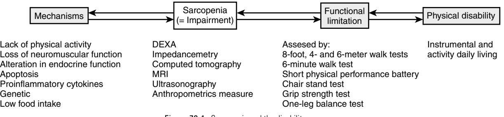

# Sarcopenia

## **DEFINITION**

Irwin Rosenberg defined sarcopenia in 1989 to describe a recognized age-related decline in muscle mass among the elderly.1 This large and supposedly involuntary loss of muscle tissue in the elderly was considered responsible in part for the age-related decline in functional capacity. Since 1989, various definitions of sarcopenia have evolved as our understanding of the aging process and the changes that occur therein progress along with improved body composition measurement techniques and the availability of large representative data sets. Despite this increasing knowledge and improved technology, a worldwide operational definition of sarcopenia applicable across racial/ethnic groups and populations lacks consensus. One current definition of sarcopenia includes a loss of muscle strength and functional quality in addition to the loss of muscle protein mass.

## **EPIDEMIOLOGY**

After 50 years of age, muscle mass is reported to decline at an annual rate of approximately 1% to 2%, but strength declines at 1.5% per year and accelerates to as much as 3% per year after age 60.2 These rates are high in sedentary individuals and twice as high in men as compared to women.3 However, men, on average, have larger amounts of muscle mass and shorter survival than women, which implies that sarcopenia is potentially a greater public health concern among women than men. The current prevalence of sarcopenia in populations varies depending on the definition used, the limitations of past epidemiologic and clinical data from small samples, and mixed information from the different measurement techniques employed. In the New Mexico Elder Health Survey, sarcopenia affects about 20% of men between age 70 and 75 years, about 50% of those over age 80 years, and between 25% and 40% of women have sarcopenia in the same age ranges.4 However, Baumgartner later recognized that these estimates, which were based on a bioelectric impedance equation, might be biased and published revised prevalence estimates based on dual-energy x-ray absorptiometry (DEXA) ranging from 8.8% in women and 13.5% men aged 60 to 69 years, and up to 16% in women and 29% in men older than 80 years.5 In a healthy elderly community-dwelling population 70 years of age and older in the French Epidemiologie de l'osteoporose (EPIDOS) study, only 10% of the women had sarcopenia6 based on the Baumgartner's index, but cut points derived from a different reference group. Using a similar definition, Janssen reported, retrospectively, that 35% of the elderly in the populationbased National Health and Nutritional Examination Survey III (NHANES III) had a moderate degree of sarcopenia and 10% a severe degree of sarcopenia.7 Findings from a separate study by Melton et al using yet another definition suggests that sarcopenia affects 6% to 15% of persons over the age of 65 years.8

## **OPERATIONAL DEFINITION OF SARCOPENIA**

Despite the recognition of the need for a consensus operational definition of sarcopenia since 19959 and the relative Yves Rolland Bruno Vellas

agreement among clinicians and epidemiologists on a theoretic definition of sarcopenia, development of a consensus operational definition useful across clinics, studies, and populations is still lacking.

## **The quantitative approach**

Baumgartner et al4 summed the muscle mass of the four limbs from a DEXA scan as appendicular skeletal muscle mass (ASM) and defined a skeletal muscle mass index (SMI) as ASM/height2 (as kg/m2). Individuals with a SMI two standard deviations below the mean SMI of a middle-age reference male and female population from the Rosetta study3 were defined as gender-specific cut points for sarcopenia. Several authors have used this definition.4,6,8 A limitation may be the ability of DEXA to distinguish water retention or fat tissue infiltration within muscle or soft tissue. There are few published data to date, however, for the impact of variation in these on sarcopenia prevalence estimates. Chen et al10 and others11 reported strong correlations (r > 0.94) between DEXA and magnetic resonance imaging (MRI) measures of skeletal muscle mass, indicating that this increasingly available method is useful for cross-sectional studies and screening. Another potential limitation is that this approach does not account for the joint effects of fat mass or body weight. Most obese adults have increased muscle mass in addition to a high fat mass but a low muscle mass in relation to their total body weight, whereas thin elderly have a high proportion of muscle mass in relation to their total body weight. Thus, the SMI potentially misclassifies the obese elderly with a high SMI and mobility and functional limitations and the thin elderly with a low SMI and none or a few mobility or functional limitations. Some investigators have taken a different approach and tried to build control for fat mass or body weight into the index, rather than adjusting statistically for these when analyzing associations with other variables.5,12

Recently, Janssen et al used data from the National Health and Nutrition Survey III to try to improve prevalence estimates in the United States. In addition, receiver operating curves were used to determine the sex-specific skeletal mass cut point below which the risk of physical disability significantly increased.7 Women whose SMI was below 5.75 kg/m2 muscle mass had an increased risk for physical disability (OR = 3.31, 95% CI; 1.91–5.73) and men whose SMI was below 8.50 kg/m2 had an increased risk for physical disability (OR = 4.71, 95% CI; 2.28–9.74). As note earlier, a limitation of current methods of measuring muscle mass in defining sarcopenia is systematic errors introduced by the age-related increase in fatty infiltration of muscle tissue. Intramuscular adipose tissue infiltration, measured by MRI13 and computed tomography (CT), improves our understanding of fat infiltration and muscle tissue impairment, but they are costly and often inaccessible. Ultrasound can accurately measure cross-sectional thicknesses and areas in subcutaneous adipose and muscles tissues,14,15 and bioelectrical impedance can provide estimates of muscle mass, but these can have large errors and are sample and population specific.16 Anthropometry has been used with limited success to detect sarcopenia in ambulatory settings. Changes in body weight loss are insufficient because an increase in fat mass can obscure a loss in muscle tissue leading to the condition referred to as *sarcopenic obesity*. 4

#### **The qualitative approach**

The main effect from a loss of muscle mass is reduced muscle strength, which is an important factor to consider in defining sarcopenia. Muscle strength is measured with simple and complex equipment. Grip strength is a simple estimator of total muscle strength but is not useful in those with hand arthritis. Leg muscle strength, assessed as maximal lower extremity muscle strength or power, is a good measure of functional status, but it is properly measured with a dynamometer (e.g., Biodex or Kin Com) by a trained technician and is strongly associated with measures of mobility.17 Including a measure of muscle strength in an operational definition is logical, as several authors have reported that muscle strength, more than muscle mass, is independently associated with physical performance.18 Moreover, different factors, such as physical activity or hormones, can underlie and contribute in varying degree to the loss of muscle strength and loss of muscle mass. The loss of muscle quality, an important component of the definition of sarcopenia, supposes an assessment of both muscle strength and muscle mass.

Muscle power is strongly related to functional limitation more than muscle mass or muscle strength.19 Muscle power is strength multiplied by speed, and it is defined as muscle work (muscle strength multiplied by a distance) divided by time. Muscle power declines considerably with aging and at a higher rate than muscle strength. A muscle power assessment is probably closer to a theoretic definition of sarcopenia than muscle strength alone, but muscle power does not include a quantitative measure. Using muscle power to define sarcopenia20 could include muscle contraction speed and a measure of muscle quality in addition to muscle strength. Defining sarcopenia on muscle strength or muscle power only has several other limitations. Osteoarthritis and other comorbidities common with old age can induce underestimates of strength and power from pain affecting individual performance. Loss of muscle strength in the upper or lower limbs can have separate causes and be associated with different outcomes. Moreover, isokinetic, isometric, concentric, and eccentric muscle strength represent different aspects of muscle strength that are probably not affected at the same level during the process of sarcopenia.

Research is needed to validate the parameters (muscle mass, muscle strength, muscle quality) that could be used to define sarcopenia. An operational definition of sarcopenia should include components that contribute to physical function, but these components may be under different mechanisms or treated by different approaches. However, estimates of the prevalence of sarcopenia in populations with complex and variable combinations of muscle mass, strength, and power measurements have not yet been proved. Moreover, a clinical tool may not be useful in epidemiology, and vice versa.

## **ETIOLOGY OF SARCOPENIA**

Multiple risk factors and mechanisms contribute to the development of sarcopenia. Lifestyle behaviors such as physical inactivity, poor diet, and age-related changes in hormones and cytokine levels are important risk factors. Postulated mechanisms include alterations in muscle protein turnover, muscle tissue remodeling, the loss of alpha-motor-neurons, and muscle cell recruitment and apoptosis.21 Genetic susceptibility also plays a role and explains individual and group differences in rates of sarcopenia. The relative influences of these factors on sarcopenia components such as muscle mass, muscle strength, and muscle quality are not well understood,22 Each factor in the etiology and pathogenesis of sarcopenia potentially contributes differently to the loss of muscle mass, strength, or quality.

## **Lack of physical activity**

Inactivity is an important contributor to the loss of muscle mass and strength at any age.23–25 Inactivity results from bed rest studies indicate that a decrease in muscle strength occurs before a decrease in muscle mass,26 and low levels of physical activity result in muscle weakness that, in turn, results in reduced activity levels, loss of muscle mass, and loss of muscle strength. Thus, physical activity should be protective for sarcopenia, but some studies suggest that the amount of protection depends on the type of activity.

#### **Loss of neuromuscular function**

The neurologic contribution to sarcopenia occurs through a loss of alpha motor-neuron axons.27 Decreased electrophysiologic nerve velocity, related to the dropout of the largest fibers, reduces internodal length and segmental demyelination occurs with the aging process,2 but the role of demyelization in sarcopenia seems minor.28 The central drive that contributes to a decrease in voluntary strength is supposed to be preserved. The progressive denervation and reinnervation process observed during aging and resulting in fiber type grouping is the potential primary mechanism involved during the development of sarcopenia. From cross-sectional findings, the decline in motor neurons starts after the seventh decade with a loss of alpha motor neurons in the order of 50%,29 and this affects the lower extremities with their longer axons more than the upper limbs.2 The reduction in alpha motor-neuron number and in motor unit numbers results in a decline in coordinated muscle action and a reduction in muscle strength. Reinnervation contributes to the final differentiation of nerve fibers and the repartition between the type I fibers (slow, oxidative fibers) and the type II fibers (fast, glycolytic fibers).

During aging, the number of satellite cells and their recruitment ability30 decrease with a greater decrease in type II than type I fibers. Satellite cells are myogenic stem cells that can differentiate to new muscle fibers and new satellite cells if activated during the process of regeneration,31 but this regeneration may lead to imbalance, and the number of type II muscle fibers may decline following damage.

#### **Altered endocrine function**

There is evidence linking age-related hormonal changes to the loss of muscle mass and muscle strength. However, controversy persists regarding their respective roles and effects on skeletal muscle in adulthood and old age.

#### **INSULIN**

Sarcopenia may be accompanied by a progressive increase in body and intramyocellular fat mass, which are associated with an increased risk of insulin resistance.8 Insulin's role in the etiology and pathogenesis of sarcopenia could be important even if its effect on muscle synthesis remains controversial.32–34 Insulin selectively stimulates skeletal muscle mitochondrial protein synthesis,35 but it is unclear if the anabolic effect of insulin on muscle synthesis is impaired with advancing age.

#### **ESTROGENS**

There are conflicting data on the effects of estrogens on sarcopenia. Epidemiologic and interventional studies suggest that estrogens prevents the loss of muscle mass,22,36 as their decline with age increase the levels of proinflammatory cytokines suspected to be involved in the sarcopenia process such as tumor necrosis factor alpha (TNF-α) and interleukin 6 (Il-6).37 Estrogens also increase the level of sex hormone–binding globulin, which reduces the level of serum-free testosterone, thus hormone replacement therapy (HRT) should decrease rather than increase muscle mass,38 Both these mechanisms may play a marginal role involving estrogen during the development of sarcopenia.

#### **GROWTH HORMONE AND INSULIN-LIKE GROWTH FACTOR 1**

Insulin-like growth factor-1 (IGF-1) and growth hormone (GH) decline with age39 and are potential contributors to sarcopenia. GH replacement therapy lowers fat mass, increases lean body mass, and improves blood lipid profile. IGF-1 activates satellite cell proliferation and differentiation and increases protein synthesis in existing fibers.40 There is also evidence that IGF-1 acts in muscle tissue by interacting with androgens,41 but there are conflicting results on its effect on muscle strength despite the apparent increase in muscle mass.42,43

#### **TESTOSTERONE**

Testosterone levels gradually decrease in elderly men at a rate of 1% per year, and epidemiologic studies suggest a relationship between low levels of testosterone in elderly men and loss of muscle mass, strength, and function. The increase in sex hormone–binding globulin levels with age results in lower levels of free or bioavailable testosterone. Clinical and experimental studies support the hypothesis that low testosterone levels predict sarcopenia with low testosterone resulting in lower protein synthesis and a loss of muscle mass.44 Testosterone induces in a dose-dependent manner an increase numbers of satellite cells, which is a major regulating factor of satellite muscle cell function.41 When administered to hypogonadal subjects or elderly subjects with low levels, testosterone45 increased muscle mass, muscle strength, and protein synthesis. Despite evidence that dehydroepiandrosterone (DHEA) supplementation results in an increase of blood testosterone levels in women and an increase of IGF-1 in men, few studies have reported an effect on muscle size, strength, or function.46

## **VITAMIN D AND PARATHYROID HORMONE (PTH)**

With aging, 25-OH vitamin D levels decline. Several cross-sectional studies have reported the association between low 1,25-OH vitamin D and low muscle mass, low muscle strength, decreased balance, and increased risk of falls.47,48 One recent longitudinal epidemiologic study reported an independent association between low serum vitamin D and sarcopenia.49 Nuclear 1,25-OH vitamin D receptor has been described in muscle cells,50 and low levels of vitamin D have been shown to decrease muscle anabolism. Low vitamin D may also influence muscle protein turnover through reduced insulin secretion. Low levels of vitamin D are associated with raised PTH, but previous studies suggest that high PTH is also independently associated with sarcopenia.22,49

## **High level of cytokines**

Chronic medical conditions, such as chronic obstructive pulmonary disease (COPD), heart failure, and cancer, are highly prevalent in elderly and are associated with an increased serum level of proinflammatory cytokines and loss of body weight, including lean mass. This condition can occur in younger adults or elderly persons and is called cachexia. This acute hypercatabolism differs from the long-term agerelated process that leads to sarcopenia. However, aging is also associated with a more gradual, chronic, increased production of proinflammatory cytokines, particularly IL-6 and IL-1, by peripheral blood mononuclear cells. There is some evidence that increased fat mass and reduced circulating levels of sex hormones with aging contribute to this age-related increase in proinflammatory cytokines that constituted catabolic stimuli.51 Thus, the aging process itself is associated with increased catabolic stimuli, but there is still a lack of evidence for the hypothesis that cytokines predict sarcopenia in prospective studies.22,52,53 Nevertheless, sarcopenia is one of the outcomes of cytokine-related aging process.54

Obesity is linked to inflammation55 and may have an important role in the process leading to sarcopenia.21 Being both obese and sarcopenic is a condition named *sarcopenic obesity.*56 Sarcopenic obesity has been reported to predict the onset of disability more than sarcopenia or obesity alone. This condition occurs in about 6% of the community-dwelling elderly and to about 29% of men and 8.4% of women over 80 years of age. It has been hypothesized that sarcopenic obesity is associated with increased fatty infiltration of muscle, but confirmatory data are lacking. Fatty infiltration of skeletal muscle is associated with reduced strength57,58 and functional status, and it is hypothesized that infiltration affects muscle function.58 These findings suggest a role of fat mass in the etiology of sarcopenia.

## **Mitochondrial dysfunction**

The role of mitochondrial dysfunction in sarcopenia is currently controversial.59 Mitochondrial function may be affected by the cumulative damage to muscle mitochondrial DNA (mtDNA) observed with aging. This may result in a reduction of the metabolic rate of muscle cell protein synthesis, adenosine triphosphate synthesis60 and finally to the death of the muscle fibers and the loss of muscle mass.61,62 However, low physical activity could be the primary reason for mitochondrial dysfunction in the elderly. Some investigators report that the decline in mitochondrial functions with aging of can be attenuated by physical activity.63 Others report that mitochondrial impairment is only partially reversed after physical training, but it does not reach the level of improvement observed in young.62,64,65

## **Apoptosis**

Accumulated mutations in muscle tissue mitochondrial DNA are associated with accelerated apoptosis of myocytes, and apoptosis may also be the link between mitochondria dysfunction and loss of muscle mass. Evidence suggests that myocyte apoptosis is a basic mechanism underlying sarcopenia,66 and muscle biopsies of older persons show differences associated with apoptosis67 compared with younger subjects. Reports also suggest that type II fibers (those fibers preferentially affected by the sarcopenia phenomenon) may be more susceptible to death via the apoptotic pathway.68

#### **Genetic influence**

Genetic factors are major contributors to variability in muscle strength and likely contribute to susceptibility to sarcopenic agents. Genetic epidemiologic studies suggest that between 36% and 65% of an individual's muscle strength,69 57% of lower extremity performance70 and 34% of the ability to perform the activities of daily living (ADL)71 are explained by heredity. Sarcopenia and poor physical performance in elderly are also associated with birth weight in both men and women independent of adult weight and height, which suggests that exposures very early in life may additionally program risk for sarcopenia in old age in genetic susceptible individuals.72,73

Few studies have explored potential candidate genes determining muscle strength. In an analysis of the myostatin pathway, a possible muscle mass regulator, linkage was observed to several areas. Several genes were implicated as positional candidate genes for lower extremity muscle strength.69,74–76 The actinin alpha 3 (ACTN3) R577X genotype is of interest, as it has been shown to influence knee extensor peak power in response to strength training as has a polymorphism in the angiotensin-converting enzyme (ACE) gene.74,77 Also, polymorphisms in the vitamin D receptor (VDR) may be associated with muscle strength because of the relationship between vitamin D and its known effect on both smooth and striated muscle.78 Polymorphisms in the VDR have been associated with sarcopenia in elderly men,79 muscle strength and body composition in premenopausal women,80 and muscle strength in older women.81

#### **Low nutritional intake and low protein intake**

Muscle protein synthesis rate is reported to be reduced 30% in the elderly, but there is controversy as to the extent to which this reduction is due to nutrition, disease, or physical inactivity rather than aging.82,83 It is recognized by some that protein intake in elders should exceed the 0.8 g/kg per day recommend intake.84 Muscle protein synthesis is also decreased in fasting elderly subjects, especially in specific muscle fractions like mitochondrial proteins,85 and thus, the anorexia of aging and its underlying mechanisms contribute to sarcopenia by reducing protein intake.

Muscle protein synthesis is directly stimulated by amino acid and essential amino acids intake,86 and protein supplementation has been explored in the prevention of sarcopenia. However, many interventional studies have not reported a significant increase muscle mass or protein synthesis with a high protein diet even when accompanied by resistance training.87–89 The lack of effect of protein intake on protein synthesis stimulation may have several explanations.38 A higher splanchnic extraction of dietary amino acids has been already reported.90 This could limit the delivery of dietary amino acids to the peripheral skeletal muscle.

#### **CONSEQUENCES OF SARCOPENIA**

Increased clinical and epidemiologic interest in sarcopenia is related to the hypothesis that age-related loss of muscle mass and strength results in decreased functional limitation and mobility disability among the elderly (Figure 73-1). Sarcopenia also plays a predominant role in the etiology and pathogenesis of frailty, which is highly predictive of adverse events such as hospitalization, associated morbidity, and disability and death.91 The annual health care cost attributable to sarcopenia is estimated at \$18 billion in the United States alone.92 Several epidemiologic cross-sectional studies have documented associations between low skeletal muscle mass and physical disability7 or low physical performance,58 with the level of disability two to five times higher in the sarcopenic groups. Sarcopenia also results in decrease in muscular strength and endurance.93 Then, we can speculate that sarcopenia is a predictor of disability in the elderly, but very few longitudinal studies7,94,95 have demonstrated that sarcopenia predicts disability and have reported little or no effect of sarcopenia on mobility disability.94,95 This weak association between sarcopenia and the risk of disability suggests that disability can result in cases of sarcopenia (see Figure 73-1).

#### **Relationship between sarcopenia and physical performance**

Part of the theoretic model for sarcopenia potentially involves the positive association between muscle mass and strength and in improved functional performance and reduced disability. The relationship between muscle mass and strength is linear,96 but the relationship between physical performance (such as walking speed) and muscle mass is curvilinear97 (Figure 73-2). Thus, a threshold defining the amount of muscle mass under which muscle mass predicts poorer physical performance and physical disability should be detectable, but a specific threshold may exist for each physical task. The relationships among strength, muscle

Figure 73-1. Sarcopenia and the disability process.

Figure 73-2. Relationship between muscle mass, muscle strength, and physical performances.

mass, and function have important implications regarding the selection of therapeutic approaches. An increase in muscle mass and strength in the healthy elderly could have little effect on a specific physical performance, but a small increase in muscle mass among sarcopenic elderly could result in a significant increase in physical performance despite a relatively small increase in muscle strength. An increase in muscle mass may have no effect on walking speed in the healthy elderly but a significant impact in very frail. However, differences in functional outcomes and population characteristics are major determinants in the success of interventional studies on sarcopenia, and these differences are attributable, in part, to these methodological considerations.

#### **Treatment and future perspectives**

Sarcopenia is treated currently with pharmacologic treatment and lifestyle interventions. Considerable evidence suggests that sarcopenia is a reversible cause of disability and could benefit from intervention, especially at the early stage of sarcopenia.98–100 However, the effects and ability of these interventions to improve function and prevent disability and reduce the age-related skeletal muscle decline in elderly are unknown.

In treatment for sarcopenia, it could be argued that improving muscle strength or muscle power is more relevant clinically for the outcomes of disability or mobility than increasing muscle mass; however, increasing muscle mass is more important for other outcomes such as protein stores or thermogenesis. The notion that muscle strength and muscle mass are differentially affected by various treatment modalities is supported by experimental and clinical findings.22 Although behavioral treatments, such as exercise, increase muscle mass and strength, pharmacologic treatments, such as growth hormone, increase mass without a significant change in strength.

#### **Physical activity**

No pharmacologic or behavioral intervention to reverse sarcopenia has proved to be as efficacious as resistance training. Muscle mass, strength, and muscle quality (strength adjusted for muscle mass) are reported to improve significantly with resistance training in older people.101 Robust evidence in several studies indicates that resistance training such as weight lifting increases myofibrillar muscle protein synthesis,102,103 muscle mass, and strength,30,89,104–109 even in the frail elderly. Strength gains result from a combination of improved muscle mass and quality and neuronal adaptation (innervations, activation pattern). However, sarcopenia is observed in master athletes who maintain resistance training activities throughout their lifetimes.110,111

The American College of Sport Medicine (ACSM) and the American Heart Association (AHA) suggested that training at a 70% to 90% of 1-RM (maximal repetition) on two or more nonconsecutive days per week was the appropriate training intensity to produce gains in muscle size and strength, even in frail elderly.112,113 Resistance training in elderly increases strength that is low in absolute terms but similar relative to muscle mass, but the increased muscle size is relatively moderate (between 5% and 10%) compared to the increase in muscle strength. Most of the increase in strength is in neural adaptation of the motor unit pathway,2 but disuse results in a rapid detraining.114 Several reports suggest that maintaining the benefits from resistance training is possible with as little as one exercise program per week.115

Whether aerobic training can reduce, prevent, or treat sarcopenia is an important practical question because resistance training is less appealing to many sedentary elders. Aerobic exercise does not contribute as much to muscle hypertrophy as resistive exercises, but it stimulates muscle protein synthesis,116 satellite cell activation, and increased muscle fiber area.117 A possible important aspect of aerobic exercises is that they reduce body fatness, including intramuscular fat, which is important for improving the functional role of muscle relative to body weight.

Leisure physical activity is not enough to prevent the decline in muscle mass,118 but aerobic and resistance activities improve balance, lessen fatigue, increase pain release, reduce cardiovascular risk factors, and improve appetite. Thus, promoting an active lifestyle can prevent the functional effects of sarcopenia, but resistance training is the best approach to prevent and treat sarcopenia, although both training modalities contribute to the maintenance and improvement of muscle mass and strength in the elderly.

#### **Nutrition**

In malnourished elderly persons, poor protein intake is a barrier to gains in muscle tissue and strength from interventions such as resistance training. Increasing protein intake in elderly and especially in frail elderly can minimize the sarcopenic process.119 However, it is not clear if protein supplementation in the absence of malnutrition enhances muscle mass and muscle strength, as protein supplementation alone or in association with physical training has proved unsuccessful.113 New approaches, based on specific nutriments, including essential amino acids (leucine),120 suggested an anabolic effect.121 It has been reported that essential amino acids stimulate protein anabolism in elderly, whereas nonessential amino acids had no effect in association to essential amino acids.86,122 The acute muscle protein synthesis in response to resistance training and essential amino acids ingestion is similar in old and young subjects but delayed in older subjects.122 In supraphysiologic concentration, leucine stimulates muscle protein synthesis,120 which may be related to a direct effect of leucine on the initiation of mRNA translation, and amino acid supplements are ineffective for muscle protein synthesis if they do not contain sufficient leucine.123 The quantity and quality of amino acids in the diet are important factors for stimulating protein synthesis, and nutritional supplementation with whey proteins, a rich source of leucine, is a possible safe strategy to prevent sarcopenia.124,125 However, caloric restriction can prevent the loss of muscle mass in animal and supposedly some human studies.126,127

The schedule of the protein supplementation is relevant to improve muscle protein synthesis. A large amount of amino acid supplementation in one meal per day is more efficient in increasing the anabolic effect than intermittent protein intake.128 The anabolic effect of protein supplementation may be maximized with a large amount of a highly efficient nutritional supplement (such as essential amino acid and especially leucine) once a day. Another way to optimize postprandial protein anabolism is to administer "fast" protein (i.e., quickly digested protein by analogy with "fast" carbohydrate concept), which is an interesting nutritional strategy.129,130 However, no randomized clinical trial actually supports the benefits of this specific approach on muscle mass synthesis.

Prevention of sarcopenia should occur throughout life. The possible influence of specific exposures at critical development periods may have a major impact on the risk of sarcopenia in old age.72,131 An adequate diet in childhood and young adulthood affects bone development, and calcium maintenance is required throughout life, thus the same appears to be a reasonable lifestyle and treatment regime for sarcopenia.

#### **Testosterone**

About 20% of men older than 60 years and 50% of men older than 80 years are considered hypogonadic.132 There are conflicting and inconclusive results of the effectiveness of testosterone therapy on muscle mass and muscle strength in elderly. Testosterone increases muscle mass and strength at supraphysiologic doses in young subjects under resistance training,133 but such dose levels are not administered in the elderly. Some interventional studies report a modest increase in lean mass and most report no increase in strength.113 For the few studies that report an increase in strength, the magnitude was lower than through resistance training. Moreover, the anabolic effect of testosterone on lean mass and strength seems weaker in the elderly than in young.113 A recent meta-analysis indicated that there is a moderate increase in muscle strength among men participating in 11 randomized studies (with one study influencing the mean effect size).134 Studies of DHEA have also reported no change in muscle strength.113

Testosterone is currently not recommended for the treatment of sarcopenia, and side effects associated with other androgens limit their use also. The potential risks associated with testosterone therapy (e.g., increased level of prostate-specific antigen, hematocrit, and cardiovascular risks) compared to the low level of evidence concerning the benefits on physical performances and function explain the actual recommendations.135 High doses of testosterone have not be given in randomized controlled trial (RCT) for fear of prostate cancer,136 and sense data from the Baltimore Longitudinal Study on Aging report a positive correlation between free testosterone blood level and prostate cancer.137

#### **Growth hormone**

GH increases muscle strength and mass in young subjects with hypopituitarism, but in the elderly, who are frequently GHdeficient, most studies report that GH supplementation does not increase muscle mass or strength,113 even in association with resistance training.113,138 GH increases mortality rate in ill and malnourished persons,139 and potential serious and

frequent side effects such as arthralgia, edema, cardiovascular side effect, and insulin resistance occur with GH supplementation.43 To date, there is little clinical research support for the use of GH supplementation in the treatment of sarcopenia. Previous observations examining the association of IGF-1 with muscle strength and physical performance in older populations provide conflicting results.140 Interestingly, in a study among obese postmenopausal women, the administration of GH alone or in combination with IGF-1 caused a greater increase in fat-free mass and a greater reduction in fat mass than those achieved by diet and exercise alone.141 However, safety issues limit the clinical applications of these findings. Some studies have found that IGF-1 correlates with risk of prostate cancer in men, premenopausal breast cancer in women, and lung cancer and colorectal cancer in both men and women.142

#### **Myostatin**

Myostatin is a recently discovered natural inhibitor of muscle growth,143 and mutations in the myostatin gene result in muscle hypertrophy in animals and in humans.144,145 Antagonism of myostatin enhanced muscle tissue regeneration in aged mice145 by increasing satellite cell proliferation. New approaches such as antagonist of myostatin drug may be relevant to the treatment of sarcopenia in the future.146–148

#### **Estrogens and tibolone**

A review on the effect of estrogen and tibolone on muscle strength and body composition149 reports an increase in muscle strength, but only tibolone appears to increase lean body mass and decrease total fat mass. Tibolone is a synthetic steroid with estrogenic, androgenic, and progestogenic activity. HRT and tibolone may both react with the intranuclear receptor in the muscle fibers,150,151 and tibolone may also act by binding androgen receptors in the muscle fibers and increasing free testosterone and GH. However, further research is needed to confirm these findings and the long-term safety of these drugs in the elderly population. In fact, no study has currently confirmed the positive findings in older persons.

#### **Vitamin D**

Vitamin D supplementation between 700 and 800 IU per day reduces the risk of hip fracture (and any nonvertebral fracture) in community-dwelling and nursing home elderly152 and the risk of falls.48 The underlying mechanism may be the increased muscle strength. Janssen et al reported an histologic muscle atrophy, predominantly type II fibers, in vitamin D deficiency.153 Whether vitamin D prevents sarcopenia remains to be proved, but the relationship of vitamin D and calcium on muscle mass and function in the elderly is another important area for research.

#### **Angiotensin II converting enzyme inhibitors (ACE inhibitors)**

Growing evidence suggests that ACE inhibitors may prevent sarcopenia.119,154,155 Activation of the renin-angiotensinaldosterone system may be involved in the progress of sarcopenia. Angiotensin II infused in rats results in muscle atrophy,146 and several mechanisms such as influences on oxidative stress, metabolic, and inflammation pathway have been suggested through epidemiologic and experimental studies. ACE inhibitor reduces the level of angiotensin II in vascular muscle cell, and angiotensin II may be a risk factor for sarcopenia through the related increase in proinflammatory cytokine production. ACE inhibitors may also improve exercise tolerance via changes in skeletal muscle myosin heavy chain composition.156 The ACE gene polymorphism also affects the muscle anabolic response and muscular efficiency after physical training.157

## **Cytokine inhibitors**

The age-related inflammation process is supposed to be an important factor in the development of sarcopenia, and antiinflammatory drugs may delay its onset and progression. Cytokine inhibitors, such as thalidomide, increase weight and lean tissue anabolism in AIDS patients.158 TNF-α produces muscle tissue atrophy in vitro. Anti-TNF-α antibodies, a treatment provided to rheumatoid arthritis patients, may also be an alternative therapeutic opportunity for sarcopenia.159 However, the benefit/risk balance of these drugs is a major limitation that has not yet been tested in sarcopenic patients. Epidemiologic data also suggest that fatty fish consumption rich in the anti-inflammatory actions of omega-3 fatty acid may prevent sarcopenia.160

## **Genes**

Many genetic factors contribute to muscle mass and strength.161,162 Treatment based on the basic physiopathology of sarcopenia can be expected in the future.163 Understanding the fundamental pathways leading to sarcopenia, such as the expression pattern of genes and proteomics, will probably determine future treatment strategies.

## **Apoptosis**

Our understanding of the mechanisms of apoptosis suggests that caspase inhibitors may represent a possible future therapy.164 Apoptosis may be reversible. For instance, exercise training reverses the skeletal muscle apoptosis and caloric restriction reduce apoptosis pathway stimulated by TNF-α. 127,165 Redox modulators such as carotenoids166 seem to be important factors in influencing loss of muscle strength, functional limitation, and disability. Interest in all these molecules is actually suggested by basic research but may be studied in future clinical researches.

## **CONCLUSION**

Improved understanding and treatment of sarcopenia would have a dramatic impact on improving the health and quality of life for the elderly, reducing the associated comorbidity and disability and stabilizing rising health care costs. However, continued research is needed to develop a consensus operational clinical definition of sarcopenia applicable in clinical management and clinical and epidemiologic research across populations. Sarcopenia is a complex multifactorial condition, the interrelated underpinnings and onset of which are difficult to detect and poorly understood. Thus, a comprehensive approach to sarcopenia requires a multimodal approach. Reducing the loss of muscle mass and muscle strength is relevant if the decrease in physical performances and increase in disability are affected. Defining target elderly populations for specific treatments in clinical trials is an important issue if the findings and their interpretation are to be inferred to other groups and populations of elderly individuals. An important clinical end point should be the prevention of mobility disability along with reducing, stopping, or reversing the loss of muscle mass, muscle strength, or muscle quality.

Currently, resistance strength training is the only treatment that affects the muscle aspects of sarcopenia. There are no pharmacologic approaches that provide definitive evidence in the ability to prevent the decline in physical function and sarcopenia. Current and future pharmacologic and clinical trials and epidemiologic studies could radically change our therapeutic approach to understanding and treating mobility disability in elderly.

## KEY POINTS

## Sarcopenia

- Definition of sarcopenia includes a loss of muscle strength and functional quality in addition to the loss of muscle protein mass.
- Sarcopenia affects about 20% of men between age 70 and 75 years, about 50% of those over age 80 years, and between 25% and 40% of women have sarcopenia in the same age ranges.
- A consensus operational definition of sarcopenia that is useful across clinics, studies, and populations is still lacking.
- Multiple risk factors and mechanisms contribute to the development of sarcopenia.
- Lifestyle behaviors, poor diet, and age-related changes in hormones and cytokine levels are important risk factors.
- The relationships among strength, muscle mass, and function have important implications in research and clinics.
- Evidence suggests that sarcopenia is a reversible cause of disability and could benefit from intervention.
- Muscle mass, strength, and muscle quality improve significantly in older people who participate in resistance training.
- No pharmacologic approaches provide definitive evidence in the ability to prevent sarcopenia.

For a complete list of references, please visit online only at www.expertconsult.com