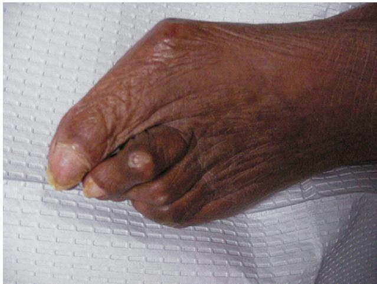
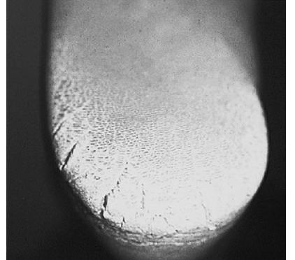

# Podiatry

CHAPTER 74 Katherine Ward Mark A. Kosinski Bryan Markinson

With population aging continuing to accelerate, particular attention must be paid to the multiple and complex disorders that impair functional independence and compromise quality of life of older adults. One of the most important and sometimes overlooked topics is that of proper foot health and function. Estimates of the prevalence of foot pain among community-dwelling older adults range between 36% and 70%, depending on definitions and populations studied.1 Foot pain can easily jeopardize an individual's ability to perform many of the important instrumental activities of daily living, including cooking, shopping, housekeeping, doing laundry, and using transportation. Even so, as few as one third of older adults with disabling foot pain report receiving professional foot treatment.2

Foot pain in older adults may be caused by changes in gait, hereditary problems, or previous foot conditions that were not treated or treated inadequately. Changes in mental status, nutritional deficiencies, systemic and local disease, hospitalization and confinement to bed, polypharmacy, and other common elderly life situations may complicate the picture.

The myriad of changes associated with aging results in a diminished homeostatic reserve, commonly manifested with loss of ambulation. The ability of an individual to remain ambulatory may be the only dividing line between institutionalization and remaining an active and viable member of society.

Proper foot care must be provided for elderly patients in an attempt to promote pain-free ambulation. The consequences of immobility in this age group (bladder infections, pulmonary problems, and venous thrombosis) certainly underscores this point. Podiatric problems are often preventable or readily treatable. Podiatric care is just part of the comprehensive and interdisciplinary nature of geriatric medicine. Of note, it is coming under the same scrutiny as other areas, with a controlled trial of a multifaceted podiatry intervention now under way.3

In this chapter, the diagnosis, treatment, and prevention of common pedal problems are discussed.

#### **ORTHOPEDIC/BIOMECHANICAL DISORDERS**

Lower extremity joint impairment and painful foot disorders also represent major causes of treatable gait disturbances. Heel pain is a common complaint of older individuals, especially as the older population exercises more. Recent weight gain, increased walking or standing activities, hard floors or surfaces, and biomechanical abnormalities are the factors that predispose to the development of plantar calcaneal pain. Plantar calcaneal spurs (diagnosed by a lateral radiograph of the foot) are often aggravated by an atrophied fat pad. Conservative treatment includes rest, stretching exercises, nonsteroidal anti-inflammatory drugs (NSAIDs), and biomechanically sound footwear, such as a sneaker or running shoe, with a thick shock-absorbing insole. Viscoelastic heel cushions or heel cups (available commercially) can be inserted into existing shoes to provide cushioning. Prescription custom-made orthoses may be indicated to support

*594*

the arch and to reduce traction of the plantar fascia from its origin on the calcaneus. Accordingly, shoe modification and orthoses are prescribed for the long term. Stretching of the Achilles tendon and plantar fascia may help diminish symptoms more rapidly. Recalcitrant cases may require a series of local injections (local anesthetic combined with a corticosteroid) into the area of maximum tenderness (usually the anteromedial tubercle of the calcaneus). Acute plantar heel pain can become a chronic condition, especially in patients who are overweight or have bilateral symptoms.4 When appropriate therapy fails to achieve expected results (especially within 3 to 6 months), one should consider systemic disease as a possible cause of heel pain. Diseases such as rheumatoid arthritis, ankylosing spondylitis, psoriatic arthritis, and Reiter's syndrome can also cause heel pain.

Another common musculoskeletal problem in elderly people, which is often misdiagnosed, is posterior tibial tendon dysfunction. Suspect this problem in a presentation of sudden asymmetry in arch height. There may be swelling and tenderness on palpation of the tendon insertion around the medial and plantar aspect of the navicular, and these findings often extend along the course of the tendon proximally behind the medial malleolus. If not already present, an actual tear or even rupture of the tendon may result. Orthotics can control minor cases, but depending on the level of activity of the patient and the degree of discomfort, custom-made braces or surgical correction may be the best option.

The joints of the feet are also prone to osteoarthritis. Diagnosed by limited and painful range of motion with or without crepitation, this condition usually responds well to conservative measures. Joint space narrowing on radiographs is often a late finding. Shoe modifications such as balanced inlay orthoses and a forefoot rocker sole angled to follow the progression of gait provide good local treatment. Topical preparations such as capsaicin (Zostrix) cream have been shown to relieve pain caused by degenerative joint disease and may augment NSAID therapy, which is the mainstay of treatment.

Joint pains from hallux valgus, hammer toes, and mallet toes are also common lower extremity problems in elderly people (see Figure 74-1; see also Color Plate 74-1). The myth that these are caused by ill-fitting shoe gear is disproven by the studies of populations in the world who typically live their lives unshod. The same incidence of these deformities occur, pointing to a more biomechanical/genetic cause. Indeed, shoes aggravate these conditions and make them painful, with the development of corns and adventitious bursae. A hammer toe is one in which there is a flexion contracture at the proximal interphalangeal joint. An extensor contracture at the metatarsophalangeal joint may coexist. A mallet toe is contracted at the distal interphalangeal joint, and a claw toe is contracted at both. The most common problem associated with these deformities is the formation of corns dorsally over areas of prominence and medial and lateral, and interdigitally. If the above-mentioned conservative measures fail to alleviate the pain, surgical correction may be considered. Foot surgery can provide improvement of function and quality of life, even in the presence of chronic illnesses. Of course, a

Figure 74-1. A bunion deformity with hammer toe of the second digit. Note preulcerative lesion over proximal phalangeal joint of second toe secondary to shoe pressure.

prudent comprehensive surgical work-up in conjunction with the primary care physician, and an anesthesiologist, would be obligatory. Fortunately, many forefoot procedures require only local anesthesia and are done on an ambulatory basis.

Your examination should always include watching the patient walk. Gait disturbances are a common sequela of age-related changes in the central and peripheral nervous systems (see Chapter 105). Features of pathologically induced gait disturbances are frequently nonspecific and overlap with those of senile ataxia, giving little clue as to the primary pathology. In Parkinson's disease and cerebellar atrophy, gait characteristics are specifically helpful in establishing the diagnosis. Shuffling and abducted gaits also produce increased stress and pressure on the soft tissues leading to dermal lesions (see Dermatology section below).

It is important to search for an underlying cause in the physical assessment because approximately 25% of gait disturbances in older adults have a treatable cause.5 Serum studies may reveal vitamin B12 deficiency, hypothyroidism, osteomalacia, or drug toxicity. Radiographic studies assist in excluding bone disease. Remember that stress fractures may not be evident at the time of injury. If signs and symptoms are consistent with fracture, treat as such and repeat the radiograph in 10 to 14 days. Computed tomography, magnetic resonance imaging, myelography, and electrophysiologic studies may offer a definitive diagnosis in cases of primary central nervous system pathology. Common causes of gait disorders include neurologic (cerebrovascular accident, dementia, Parkinson's disease, etc.), musculoskeletal (arthritis, osteoporosis, myopathy, etc.), vascular, endocrine (hypothyroidism, diabetes), psychological (depression, fear of falling), and medications. Demonstration of poor gait, difficulty with chair transfer, and a loss of balance when standing on tiptoes suggests an underlying neurologic or musculoskeletal disorder.6

#### **DERMATOLOGIC DISORDERS**

Hyperkeratotic lesions (corns and calluses) are the most common podiatric complaints of elderly people. They frequently arise in areas of increased pressure or friction and over bony prominences. Although these conditions are common among all age groups, degenerative joint disease, atrophy of the plantar fat pad, and decreased pain threshold predispose elderly people to increased frequency of complaints. Depending on their depth and severity, there may be an associated adventitious bursa formation. Treatment consists of aseptic débridement and weight or pressure dispersion. Lesions on the plantar aspect of the foot should also be treated with a shock-absorbing insert to disperse the weight-bearing forces and augment an atrophic or displaced plantar fat pad.

It is especially important to débride chronic hyperkeratotic lesions in patients with vascular or neurologic impairment because untreated lesions may give rise to soft tissue breakdown, ulcerations, and bone infection. As noted earlier in this chapter, sneakers or running shoes are ideal footgear for biomechanical and dermatologic problems. A wide and high toe box is important for preventing pressure on the digits, and abundant cushioning on the sole of the foot is required to mitigate the excessive plantar pressures that cause the hyperkeratotic lesions.

Well-cushioned shoe gear is also required to mitigate the consequences of atrophied subcalcaneal or submetatarsal fat pads. When the natural fat found on the plantar aspect of the feet atrophies, the underlying bony structures become more prominent and cause pain. When such pain occurs under the plantar aspect of the metatarsal head, it is called metatarsalgia. The complaint is frequently a callus or inflammation of the area (bursitis). Diagnosis can be made by clinical examination, and radiographs may reveal underlying bone pathology. Treatment consists of débridement of hyperkeratotic lesions with padding to disperse the weight. Long-term treatment includes the use of soft tissue supplements such as plastizote, which can be added to foot orthotics or inserted directly into the shoe.

Expensive custom-molded shoes are often unnecessary for all but the most severe foot deformities. If they are indeed indicated, they should include a high, wide toe box, a bunion last, and an extra depth feature to accommodate weight-dispersive orthoses. Surgical correction should always be considered as the last resort, after all conservative measures have failed.

Maceration and fissuring of the interspaces is another common dermatologic finding in the elderly population. Vision and dexterity loss make it difficult to examine and care for the feet, and digital deformities precipitate moisture accumulation between the toes. The dark and moist environment between the toes predisposes the area to fungal and bacterial infection, which range from a mild annoyance to a severe debilitating infection. A Wood's light can be used to detect coral red fluorescence suggestive of *Corynebacterium minutissimum*, which is usually treated with topical erythromycin. Macerated toe web spaces may also be due to a fungal or yeast infection that can be treated with ciclopirox (Loprox) or clotrimazole solution (Lotrimin, Mycelex) applied interdigitally twice daily for 2 to 4 weeks. Of course, meticulous cleaning and drying of the area while bathing is also necessary. If lamb's wool or gauze is used to separate the toes, never encircle a digit; such dressings may become constrictive and severely compromise the circulation.

Interdigital tinea pedis (described previously), inflammatory tinea pedis, and chronic dry scaly tinea pedis are the three main categories of pedal dermatophyte infections. Inflammatory tinea pedis, which is an acute vesicular eruption that has a particular predilection for the long arch, is caused by the dermatophyte *Trichophyton mentagrophytes*. It is usually severely pruritic, it may weep, and the severest of cases may require bed rest in addition to topical and/or oral antifungal therapy. The chronic form of tinea pedis, usually caused by *Trichophyton rubrum*, has a predilection for the arch as well, but is mainly confined to the lateral surfaces of the sole. Sometimes the entire plantar aspect is involved in what is classically described as a moccasin distribution. In contrast to the inflammatory type, these lesions are scaly and erythematous, and commonly display an arcuate shape.

There is also a decrease in skin hydration as aging progresses. Combined with diminished sebaceous and eccrine activity, dry, scaly, and hyperkeratotic skin often results. Peripheral heel hyperkeratosis is very common, but when fissures occur, severe pain and infection may ensue. This is a serious problem in the face of arterial insufficiency. Management includes débridement of the tissue, hydration of the skin, and avoidance of backless footwear. Chemical cautery with silver nitrate is often necessary to close a bleeding fissure. It is momentarily painful but works very effectively. Heel fissuring is more prevalent in the obese, and tends to be a chronic problem. In patients who have had total joint replacement, the presence of heel fissures should not be trivialized (see Figure 74-2).

Ulcerations of the leg, feet, and toes are also seen frequently in the geriatric population. The differential diagnosis of pedal ulcers includes arteriosclerosis obliterans, neurotrophic ulcers, chronic pernio, gout, mycobacterium tuberculosis, Raynaud's disease/phenomenon, scleroderma, and neoplasms, in addition to those caused by biomechanic, iatrogenic, or patient-induced diseases.7

Ischemic ulcers typically occur on the distal aspect of digits and over bony prominences. Symptoms include severe pain, often worse at night and relieved by dependency. They are characterized by poor granulation tissue, poor color of tissue (cyanotic, gray, or black), and poor bleeding upon débridement.

Neurotrophic ulcers commonly occur beneath pressure points or hyperkeratotic lesions. There is usually no pain because the patient is typically neuropathic. The ulcers are characterized by punched-out lesions with a red granular base and white fibrotic rim. Due to the high incidence of diabetic ulcers and their coexisting morbidity, this topic will be discussed thoroughly in a separate section within this chapter.

Venous stasis ulcerations often follow chronic stasis dermatitis, which is secondary to incompetent venous circulation in the leg, as further described in Chapter 47. Poor arterial circulation is an added risk that will impair healing and increase the chance of infection.

Treatment of these ulcers must address their cause, and therefore requires a multidisciplinary approach. An ischemic ulcer requires a vascular consult as soon as possible, with possible revascularization. Neurotrophic ulcers require weight dispersion, débridement of devitalized tissue, and use of antibiotics when appropriate. Edema can be reduced with elevation of the foot (above heart level), and with compressive boots and stockings. Individuals with a history of venous stasis ulcers should wear elastic supports daily. Wound care must be performed regularly to ensure a clean, moist granular bed of the ulcer. Aerobic and anaerobic cultures must be performed if infection is suspected, followed by the appropriate antibiotic coverage.

It is important to keep in mind that a chronic ulceration, especially if it is not responding to appropriate therapy, has the potential for malignant degeneration. This is especially true for the common venous stasis ulcer. Any suspicious ulcer should be biopsied to include the most ominous border, along with normal skin for comparison.

#### **NAIL DISORDERS**

Identification of a fungal nail infection is easily performed with a KOH prep and fungal culture. The PAS (periodic acid-schiff stain) test is also used to detect the presence of viable or degenerating fungus organisms, and its sensitivity may be higher than that of the KOH test. Mycotic nail infections tend to respond poorly to topical therapy. The advent of safer oral agents such as Sporanox (itraconazole, Janssen Pharmaceutica) and Lamisil (terbinafine hydrochloride, Novartis) may help to achieve a cure in some patients, although the success of systemic agents is directly related to the vascular supply to the nail bed. A new topical antifungal, Penlac solution, 8% (ciclopirox, Dermik Laboratories), was approved by the U.S. Food and Drug Administration in 2000, and is indicated for mild to moderate onychomycosis due to *Trichophyton rubrum*. Older patients usually do well with serial nail débridement, which not only maintains comfort but decreases the chance of soft tissue infection, infected ingrown toenails, and subungual corns or ulceration.

It is important to differentiate mycotic nail infections from nail dystrophies secondary to systemic disease, vascular insufficiency, and trauma. For example, poor nutritional status can lead to toenails that are atrophic, thin, brittle, and lackluster, with possible longitudinal ridges. Other systemic diseases associated with common nail dystrophies include diabetes mellitus, syphilis, psoriasis, Reiter's syndrome, ischemia, gout, rheumatoid arthritis, and systemic lupus erythematosus.

Although patients invariably attribute periungual pain as being secondary to an ingrown or incurvated nail, it is important to rule out ischemia as the cause of the nail pain. Ischemic changes of the digit can often mimic nail pain and mislead both patient and physician.

Nail fold infections often exhibit adjacent chronic granulation tissue. In chronic infections, it may be prudent to biopsy such Figure 74-2. Severe xerosis causing fissuring of the heels. lesions. We are aware of patients in whom Kaposi's sarcoma, amelanotic melanoma, and squamous cell carcinoma of the nail groove have given the appearance of a pyogenic granuloma.

Subungual hematomas are not uncommon in older individuals, and usually result from microtrauma secondary to improperly fitting shoe gear. However, it is prudent to consider any subungual hyperpigmented lesion a melanoma until proved otherwise. In such cases, débride the nail plate as proximal as possible: many times part of the nail can be removed to reveal subungual debris consistent with previous hemorrhage or fungal infection. If a melanotic process is suspected, a biopsy must be performed.

#### **FOOT PROBLEMS IN PATIENTS WITH DIABETES**

Neuropathy, peripheral vascular disease, and immunopathy all play a role in the development of foot pathology in patients with diabetes. These three factors, combined with the reduced vision and mobility that impair the ability of older patients to inspect and care for their feet, can have disastrous consequences. When left unrecognized and therefore untreated, many minor foot problems (such as corns and calluses) progress to ulcerations and infections, producing the well-known morbidity associated with diabetes. Risk factors for diabetic foot ulcers include sensorimotor and autonomic neuropathy, peripheral vascular disease, limited joint mobility, high plantar pressures, bony deformities, history of previous ulceration, and visual or functional impairment.

Chronic sensory neuropathy is one of the most common long-term complications of diabetes mellitus. Symptoms frequently include numbness, dysesthesia, lancinating pain, burning, and hypersensitivity. Sensory loss is typically in a stocking-glove distribution and is often of insidious onset. In its early stages, patients may be unaware that a decrease in sensorium even exists. In those patients without diabetes, pedal neuropathy may be secondary to alcoholism, a herniated nucleus pulposus, heavy metals, vitamin deficiencies, and collagen diseases, among other systemic conditions.

Sensory neuropathy is often accompanied by a motor component. In the foot of a patient with diabetes, loss of motor fibers may lead to intrinsic muscle atrophy and imbalance between flexor and extensor muscles. Clawing of the toes, prominent metatarsal heads, and anterior displacement of an already atrophied plantar fat pad may increase the patient's risk for pressure-induced lesions.8,9 Glycation of collagen leads to thickening and increased cross-linking of collagen bundles, resulting in thin, tight, and waxy skin and further restriction of joint movement.10 Dry and atrophic skin is also caused by the autonomic neuropathy, which leads to denervation of the sweat glands. Cracks and fissures violate the skin defenses, leaving the patient vulnerable to bacterial infection.

Ulcerations may be caused by an acute event or repetitive minor trauma. It has been shown that constant pressure of 5 to 7 lb/square inch over a bony prominence can cause ischemic necrosis in less than 7 hours.11 If an ulcer is indeed caused by pressure or a biomechanical problem, it will never resolve if weight is not dispersed from the affected area, regardless of how much débridement of local wound care is given.

Peripheral vascular disease is 20 times more common in patients with diabetes than in nondiabetic individuals.12

Microvascular and macrovascular disease puts the patient at risk for gangrene and ulceration by reducing the perfusion pressure where tissue ischemia occurs. Diabetic occlusive disease has a predilection for the tibial and peroneal arteries, and tends to be bilateral and multisegmental. Ankle brachial pressure index (ABPI) and pulse volume recordings may be of questionable value in assessing peripheral circulation in patients with diabetes, but they are useful if they are low.10 In general, be suspicious if the ABPI is greater than 1.0. A reading of less than 0.5 indicates serious arterial compromise and poor healing potential.

The best treatment for the foot of a patient with diabetes is patient education and thorough, frequent foot examinations. The foot examination should be a regular part of each office visit. Both shoes and socks should be removed and the feet should be checked for trophic and pretrophic skin changes, thickened or incurvated nails, and hyperkeratosis. Hemorrhage within a callus may be suggestive of ulcer formation. The interspaces should be carefully inspected for maceration or fissuring. Legs and feet should be evaluated for diabetic skin markers, such as bullous diabeticorum, diabetic dermopathy, and necrobiosis lipoidica, some of which may herald vasculopathy and retinopathy.

The neurologic examination should include evaluation of deep tendon reflexes, sharp/dull discrimination, light touch, proprioception, vibratory sensation using a 128 Hz tuning fork, and protective threshold using the Semmes-Weinstein monofilament. In fact, patients can do monofilament tests themselves. Vibratory sensation and proprioception, both carried by the posterior columns, are the first to be affected by diabetic neuropathy. Keep in mind that decreased vibratory sensation may also occur as part of normal aging. Diminished or absent knee and ankle jerk reflexes are also common with aging, and in the absence of other pathology do not require further evaluation. Autonomic neuropathy can be recognized clinically by the absence of sweating, a relatively fixed heart rate, and postural hypotension.

A palpable popliteal pulse may be an unreliable indicator of circulation in the lower extremity, as 40% of patients with diabetes having distal gangrene also have a popliteal pulse.13 Similarly, a palpable dorsalis pedis or posterior tibial pulse is an unreliable indication of circulation in the toes. Twenty percent of patients with diabetes with palpable pedal pulses have significant small-vessel disease. Temperature gradient, capillary filling time, rubor on dependency, and pallor on elevation are useful adjunctive tests for assessing distal lower extremity circulation.

The pain of diabetic neuropathy is another common complaint of patients with diabetes. It is difficult to control, especially in patients with poor glucose control. Topical capsaicin (Zostrix) applied two or three times a day may provide some relief. Tricyclic antidepressants and nonsteroidal antiinflammatories may also prove advantageous, as are new drugs on the horizon.

Patients play an important role in preventing their foot problems. The following recommendations should be made at each office visit: stop smoking, inspect feet daily for cuts and blisters, inspect the inside and outside of shoes for foreign objects, do not walk barefooted, cut toenails straight across, avoid temperature extremes on the feet, and notify a physician of any problems immediately.

## Summary of Management Algorithm

| Diabetic Foot Ulcers                                                             |
|----------------------------------------------------------------------------------|
| 1. Evaluation                                                                    |
| a. Clinical appearance                                                           |
| b. Depth of penetration                                                          |
| c. X-rays to detect                                                              |
| 1) foreign body                                                                  |
| 2) osteomyelitis                                                                 |
| 3) subcutaneous gas                                                              |
| d. Location                                                                      |
| e. Biopsy                                                                        |
| f. Blood supply (noninvasive vascular studies)                                   |
| 2. Débridement, radical                                                          |
| 3. Bacterial cultures (aerobic and anaerobic)                                    |
| 4. Metabolic control                                                             |
| 5. Antibiotics                                                                   |
| a. Oral                                                                          |
| b. Parenteral                                                                    |
| 6. Do not soak feet                                                              |
| 7. Decrease edema                                                                |
| 8. Non–weight-bearing                                                            |
| a. Bed rest                                                                      |
| b. Crutches                                                                      |
| c. Wheelchair                                                                    |
| d. Special sandals                                                               |
| e. Contact casting                                                               |
| 9. Improve circulation (vascular surgery)                                        |
| Source: Levin ME. The diabetic foot: pathophysiology, evaluation, and treatment. |

*In Levin ME, O'Neal LW, Bowker J (eds). The Diabetic Foot, 5th Ed. St Louis, 1993, Mosby Year Book, pp 17–60. Reproduced with permission.*

### **SUMMARY**

Successful patient management must extend beyond diagnosis and disease treatment and include promotion of function and prevention of decline.14 The podiatrist can be a valuable team member in the multidisciplinary approach of geriatric assessment; he or she can deliver proactive and preventive care that maintains or improves quality of life for older patients. The simple ability to ambulate comfortably is critical for our patient's feelings of overall well-being, self-esteem, and ability to interact in society. In addition, elderly people have become increasingly engaged in athletic activities, making them more prone to overuse, repetitive motion, and traumatic injuries. It is therefore necessary to prevent and treat the pedal manifestations of vascular, neurologic, musculoskeletal, and metabolic disorders to improve quality of life and ambulatory ability, while reducing pain and foot morbidity.

# KEY POINTS

| Podiatry |  |
|----------|--|
|          |  |

| Orthopedic/biomechanical disorders:      |
|------------------------------------------|
| Heel pain                                |
| Posterior tibial tendon dysfunction      |
| Osteoarthritis                           |
| Digital deformities                      |
| Pathologic gait                          |
| Dermatologic disorders:                  |
| Hyperkeratotic lesions                   |
| Bacterial infections                     |
| Tinea pedis                              |
| Xerosis/fissuring                        |
| Ulcerations                              |
| Nail disorders:                          |
| Fungal nail infections                   |
| Nail dystrophies                         |
| Foot problems in patients with diabetes: |
| Neuropathy                               |
| Ulcerations                              |
| Peripheral vascular disease              |

For a complete list of references, please visit online only at www.expertconsult.com