# Geriatric Dentistry: Maintaining Oral Health in the Geriatric Population

Andrea Schreiber Robert Glickman

## **INTRODUCTION**

Whereas dental textbooks address the management of medically compromised, older patients (generally including a review of the basic pathophysiology of a disease, the clinical signs and symptoms of the condition, common therapeutic interventions, and how either the disease itself or the medications for it might impact on planned dental care) in general, medical textbooks, even those on geriatric medicine, do not address the impact of oral health on the overall systemic health of a patient. The fact is that physicians are uniquely situated to screen elderly patients for common oral diseases.

Older adults tend to have low use rates of dental services, due perhaps to a lack of insurance coverage for these services or limited access to care secondary to infirmity. Although more than 90% of adults over the age of 75 seek medical care on a regular basis, only approximately a third of these individuals seek dental care.1

In a pilot study2 investigating the physicians' role in the diagnosis and management of oral diseases in a geriatric population, four primary care physicians and four geriatricians were asked to identify oral conditions on 30 color slides. The rate of correct diagnosis was 55%, and appropriate treatment decisions were made 70% of the time.

In another study3 performed to assess hospital physician knowledge and views concerning oral health in elderly patients, 70 respondents completed a survey and were asked to diagnose 12 different oral conditions demonstrated on clinical slides. Although 84% of respondents felt that it was important to examine the oral cavity, only 19% reported that they did so. Fifty-six percent of responding physicians did not feel confident in examining the oral cavity and 77% felt that that they had insufficient training to do so. Two of the 70 physicians (3%) were able to correctly identify all 12 oral conditions depicted in the slides.

The focus of this chapter will be on the maintenance of oral health for the geriatric patient and how physicians and dentists can ensure this goal. Topics to be covered include the definition of oral health, how oral health is measured, the changing dental needs of the geriatric population due to advances in medicine and dentistry, the impact of oral health on systemic health, recognition and management of common oral conditions in the elderly population and access to care issues for both community dwelling older adults and residents of long-term care facilities. Prevention and management of oral diseases will improve systemic along with oral health.4

# **Definition of oral health**

Any discussion concerning the maintenance of oral health as a goal, must start with a definition of the term.5 Mouradian6 defined it as "…encompassing all of the immunologic, sensory, neuromuscular and structural functions of the mouth and craniofacial complex. Oral health influences and is related to nutrition and growth, pulmonary health, speech production, communication, self-image and societal functioning." Although the author was addressing the oral health needs of the pediatric population, this definition of oral health appears to apply to the population in general and to the geriatric population in particular. Conditions that adversely affect the oral and maxillofacial complex are common and pervasive in the elderly and can affect an individual's general health and quality of life.

## **Measures of oral health and function**

Common measures of oral health include the number of teeth present in the mouth, the presence of caries (Figure 75-1, see also Color Plate 75-1) and restorations, and the presence or absence of periodontal disease (infection of the gingiva and tooth supporting structures) (Figure 75-2, see also Color Plate 75-2) and oral mucosal lesions (Figures 75-3 through 75-6, see also Color Plates 75-3 through 75-6). Many attempts have been made to quantify the effect of these parameters on oral function and the relationship of adequate oral function to an individual's quality of life. In a literature review7 focused on determining the relationship between dentition and oral function, four specific areas were investigated: overall masticatory function, aesthetics/psychosocial ability, posterior dental occlusal stability and support, and other functions, including taste and phonetics. Eighty-three articles met inclusion criteria for review. Satisfactory masticatory function was linked to the total number of teeth present—specifically 20 teeth with 9 to 10 dental contacts (upper and lower teeth in occlusion). Patients with fewer teeth and/or fewer contacts demonstrated limited masticatory function. Dental aesthetics and psychosocial satisfaction was linked to the loss of anterior teeth with variations in satisfaction noted between age groups, cultures, and socioeconomic status. Occlusal stability

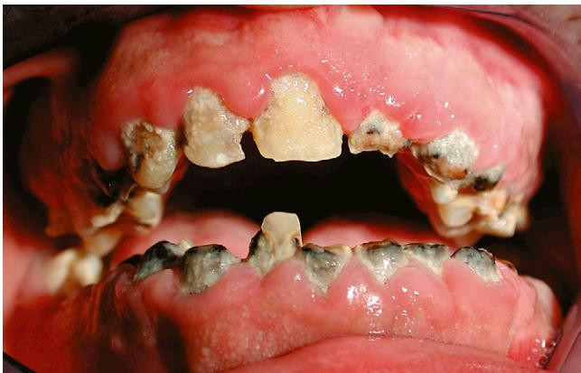

Figure 75-1. Rampant dental caries. *(Reprinted with the permission of Mirriam Robbins, DDS, New York University College of Dentistry.)*

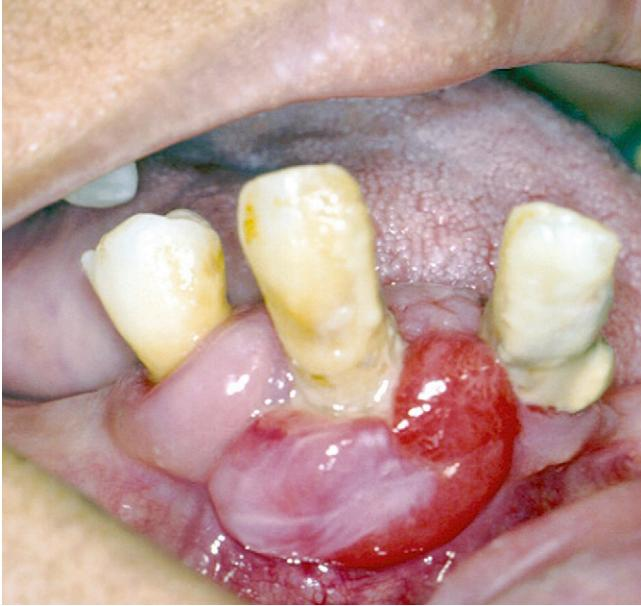

Figure 75-2. Periodontal abscess: associated with bone loss around root of tooth. *(Reprinted with the permission of Mirriam Robbins, DDS, New York University College of Dentistry.)*

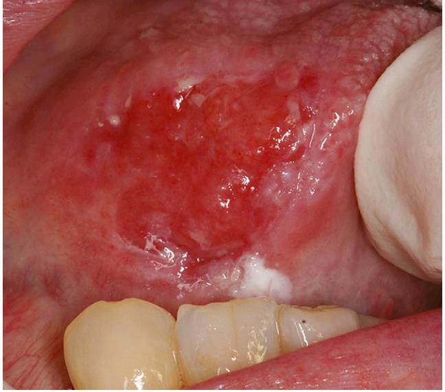

Figure 75-3. Oral dysplasias: right lateral border of tongue. *(Reprinted with the permission of Mirriam Robbins, DDS, New York University College of Dentistry.)*

was noted with three to four posterior units in individuals with a symmetrical pattern of tooth loss and five to six posterior units in those with a nonsymmetrical pattern of bone loss. Patients did not attribute a high value to either phonetics or taste. The conclusion of the authors was that the World Health Organization goal of maintaining 20 natural teeth throughout life as a means of assuring an acceptable level of oral function is supported by current literature.

Measures of oral health-related quality of life (OH-QoL) assume functional and psychosocial impacts on the quality of life but exactly what is being measured by a variety of instruments designed for this purpose still remains to be clearly elucidated.8

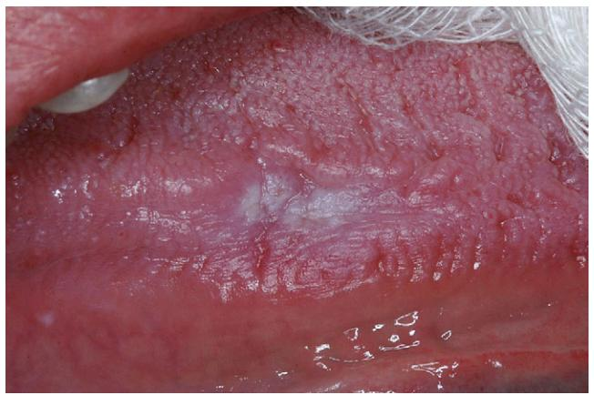

Figure 75-4. Leukoplakia or white lesion: left lateral border of tongue. *(Reprinted with the permission of Mirriam Robbins, DDS, New York University College of Dentistry.)*

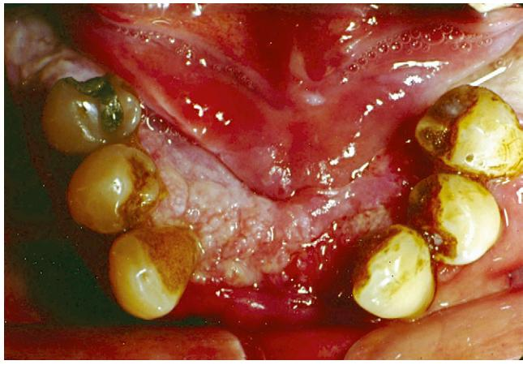

Figure 75-5. Squamous cell carcinoma: floor of mouth. *(Reprinted with the permission of Mirriam Robbins, DDS, New York University College of Dentistry.)*

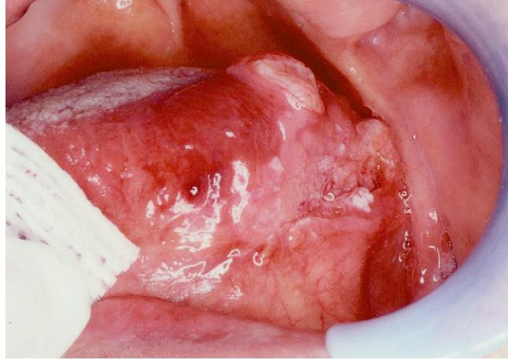

Figure 75-6. Squamous cell carcinoma: left lateral border of tongue. *(Reprinted with the permission of Mirriam Robbins, DDS, New York University College of Dentistry.)*

Many efforts are underway to verify the validity of the quality of life assessment tools used to measure the impact of oral health on quality of life, or to add subscales to current tools to aid in quantifying a qualitative question.9,10 In a survey study investigating the association between tooth loss, chewing ability, and association with oral and general health-related quality of life issues, two survey instruments were used (the Oral Health Impact Profile and the EuroQoL Visual Analogue Scale). In addition to the patient survey, functional tooth units were assessed by calibrated dentists on more than 700 Australians over the age of 50. The number of functional tooth units was positively related to chewing ability and general health, thereby reflecting the importance of oral health to general well-being.11

The aim of the Ontario Study of Oral Health of Older Adults (OSOHOA) was to document the natural history of oral diseases and disorders in older adults and to document the impact on physical, functional, and psychological wellbeing.12 This was an observational cohort study of a random sample of adults who were over the age of 50 when recruited. The study consisted of a baseline phase and 3- and 7-year follow-ups. The ability to chew was assessed using an index of six different foods. Descriptive statistics were used to measure changes in chewing ability over time. The proportions of individuals experiencing increased chewing problems rose from 24% at baseline to 33.8% over the 7-year period. An increased prevalence and severity of chewing dysfunction was most noted for edentulous patients.

Other studies have noted that approximately one third of older adults have trouble biting some foods and that this percentage increases with advancing age and number of teeth missing.13 Chewing ability or lack thereof can influence food choices and result in malnutrition in both communitydwelling and long-term care residents (Figure 75-7, see also Color Plate 75-7). Weight loss and poor nutrition in longterm care facilities have been linked to chewing problems.14,15

## **The changing need for dental care in geriatric patients**

Advances in dental research have resulted in a lower incidence of tooth loss and caries in the general population as a result of the widespread use of fluoride, patient education,

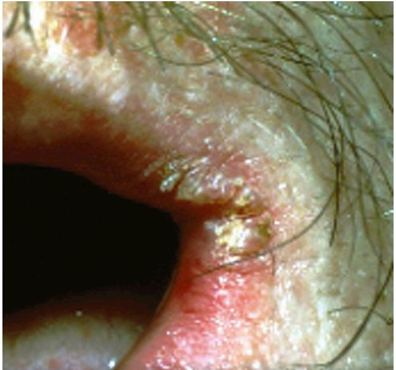

Figure 75-7. Angular cheilitis caused by loss of dentition, poor diet, and candidiasis. *(Reprinted with the permission of Mirriam Robbins, DDS, New York University College of Dentistry.)*

and dental hygiene programs.16 Simply put, people are living longer with more teeth. The fully edentulous octogenarian is and will continue to be less frequently encountered in the twenty-first century. However, edentulous patients, despite the absence of teeth, may have a host of problems that can adversely affect oral and systemic health, including denture- or nondenture-related soft tissue lesions, oral candidiasis, malnutrition from ill-fitting dentures (Figure 75-8, see also Color Plate 75-8), or lack of thereof, resorption under existing dentures (Figure 75-9, see also Color Plate 75-9), gastrointestinal problems, masticatory insufficiency, swallowing disorders, and aspiration pneumonia. They are still susceptible to mucosal diseases (Figures 75-3 and 75-4, see also Color Plates 75-3 and 75-4) and oral cancers (Figures 75-5 and 75-6, see also Color Plates 75-5 and 75-6) despite the absence of teeth. The surgeon general's report on Oral Health in America in 2000 cited 30,000 new diagnoses of

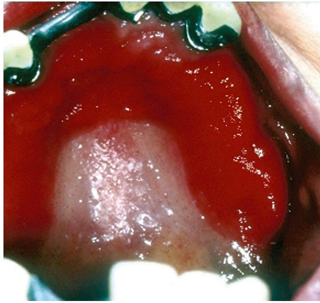

Figure 75-8. Denture stomatitis: ill-fitting denture and candidiasis. *(Reprinted with the permission of Mirriam Robbins, DDS, New York University College of Dentistry.)*

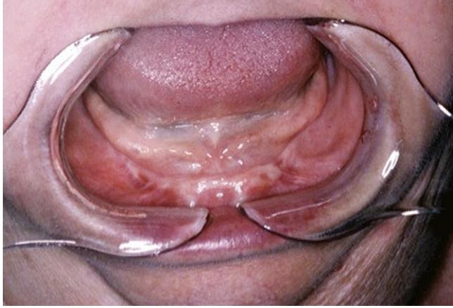

Figure 75-9. Atrophic mandible: early loss of dentition and long-term denture wear. *(Reprinted with the permission of Kenneth Fleisher, DDS, New York University College of Dentistry.)*

oral cancer each year, mainly in individuals with the median age in the sixth decade of life.17

The types of problems encountered by a dentate or partially edentulous geriatric patient may include dental caries, chronic facial pain and/or temporomandibular dysfunction, and benign or malignant lesions of the oral mucosa or jaws. Periodontal disease, an inflammatory disorder that results in alveolar bone loss and chronic tissue inflammation (Figure 75-10, see also Color Plate 75-10) is a primary cause of tooth loss in the elderly, which has been shown to have strong associations with the pathophysiology of certain systemic diseases including cardiovascular disease, cerebrovascular disease, and diabetes mellitus.18 In fact, patients with periodontal disease are up to twice as likely to develop cardiovascular disease.19 Medications taken for comorbid conditions may result in decreased salivary flow, which in turn impacts on the ability to chew, swallow, and cleanse the oral cavity. Additionally, xerostomia may be accompanied by painful or burning sensations. Finally, maxillofacial trauma as a result of gait disturbance, neuromuscular disease or in some cases elder abuse, is another factor affecting oral health in the geriatric population.5

As advances in medical research result in increasing patient life span, older adults have become the fastest growing portion of the population. In the United States, population projections indicate that by the year 2030 more than 20% of the population will be 65 years old or older.20 Since concurrent advances in dental research have resulted in less tooth loss in older adults, these patients will require an increased need for dental care in the future, most especially with the advent of dental implants leading to less reliance on conventional dentures as a primary form of treatment. Although the trend is toward less tooth loss in older adults, there are still regional demographic variations, with higher levels of edentulism in areas of lower socioeconomic status. With increased tooth retention comes the continued risk of recurrent and cervical caries. The pattern of caries differs in the geriatric versus the general population in that coronal (chewing surface) caries are less frequent than root caries. Root or cervical caries (Figure 75-11, see also Color Plate 75-11) are characterized by rapid progression and increased difficulty in restoration, often necessitating extraction (Figure 75-1, see also Color Plate 75-1).20,21

Dentists are now challenged with treating an increasing number of community dwelling older adults with chronic but stable systemic diseases, along with caring for the dental needs of the more debilitated and frail elderly with both physiologic and cognitive impairments. According to the surgeon general's report in 2000, more than 20% of homebound or institutionalized elderly require emergency dental care annually. As this population increases, so too will the need for care.17

#### **Oral health impact on systemic health**

The well established links between oral and systemic diseases have served as a "wake-up" call to improve oral hygiene and access to dental care for elderly patients in long-term care facilities.22,23 One such risk is aspiration pneumonia, which has long been recognized as a common cause of death in infirm homebound and long-term care facility residents. Bacterial pneumonia is directly linked to aspiration as a result of dysphagia and/or poor oral hygiene and the elevated numbers of respiratory pathogens within oropharyngeal secretions. Attention to improved oral hygiene is a method or strategy to decrease the incidence of bacterial pneumonia in susceptible populations.24

The main causes of community-acquired pneumonia are *Streptococcus pneumoniae* and *Haemophilus influenzae*. The organisms more frequently associated with hospital-acquired pneumonia are *Staphylococcus aureus* and *Pseudomonas aeruginosa*. Hospital-acquired pneumonia commonly occurs in the frail elderly with compromised immune systems.

Aspiration is most likely to occur in patients with functional dependence on oral care and feeding.25,26 Studies have demonstrated increased levels of bacteria in the oral secretions of institutionalized versus home-dwelling seniors.27 Aspiration occurs most frequently with feeding or during sleep. The risk of developing an infection subsequent to aspiration depends on the state of the individual's host defenses—cough reflex, mucociliary adequacy, and cellular immunity—and on the type and volume of aspirate. The

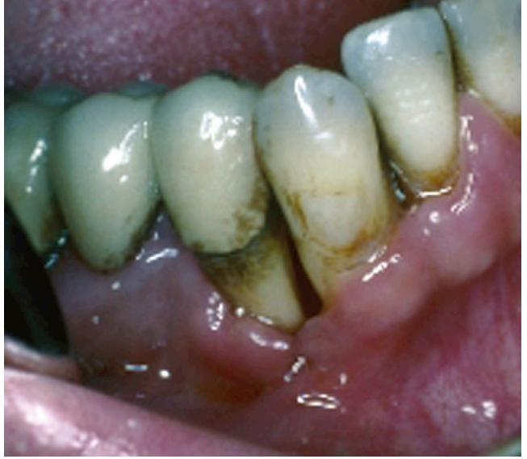

Figure 75-10. Severe periodontal bone loss. *(Reprinted with the permission of Mirriam Robbins, DDS, New York University College of Dentistry.)*

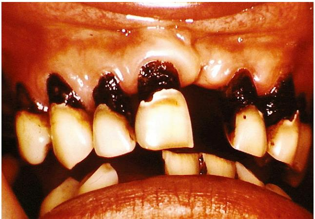

Figure 75-11. Severe cervical decay. *(Reprinted with the permission of Mirriam Robbins, DDS, New York University College of Dentistry.)*

higher the bacterial load of the aspirate and the lower the host defenses, the greater the risk.28

Oral care for functionally dependent elderly patients in long-term care facilities has been documented as being sorely lacking in numerous studies.29,30 Poor oral hygiene leads to the proliferation of dental plaque, which is a biofilm responsible for dental and periodontal disease (Figure 75-2, see also Color Plate 75-2). As the biofilm matures, organism shedding is facilitated. Reduced salivary flow in the elderly as a consequence of medications, aging, or disease may also enhance microbial growth in the oral cavity. Similarly, longterm use of broad-spectrum antibiotics may contribute to the overgrowth of certain organisms in the oral cavity.

A study by Adachi et al31 investigated the incidence of fevers greater than 37.8° C and aspiration pneumonia in the residents of two nursing homes for 2 years. Patients who received professional oral health care were compared with patients who did not. The prevalence of fevers and the rate of aspiration pneumonia was significantly lower in the patient group who received professional oral health care, than in the group who did not. It has been demonstrated that improved oral hygiene efforts in long-term care facilities has resulted in a decreased incidence of fevers and pneumonia deaths. Effects of improved oral health care on other systemic diseases, such as cerebrovascular accident, diabetes mellitus, and myocardial infarction have yet to be fully investigated.

Desvarieux et al32 investigated the relationship between periodontal disease and tooth loss with subclinical atherosclerosis. Subjects received comprehensive periodontal examination, a carotid scan, and evaluation of cardiovascular disease risk factors. A significant association was noted between observed prevalence of carotid plaque formation and the number of teeth missing. Approximately 60% of individuals missing more than 10 teeth demonstrated carotid artery plaque, and this association was greatest among patients over the age of 65. The mechanisms underlying the relationship between periodontal disease and cardiovascular disease are not well understood but are likely due to chronic bacteremia and elevated inflammatory markers. Interestingly, in a follow-up study, gender variations were noted in the relationship between periodontal disease, tooth loss, and subclinical atherosclerosis, with men being affected more frequently than women.33

The relationship between cardiovascular disease/stroke and periodontal disease has been the object of numerous studies in the last decade, most focusing on the role of inflammatory markers, such as C-reactive protein (CRP), interleukin, and tumor necrosis factor. Periodontal disease results in elevations of CRP and interleukins, but a clear link between periodontal disease and the pathogenesis has yet to be elucidated. The therapeutic implications for such an association are significant given the prevalence of periodontal disease in the general population and the relative ease with which oral hygiene improvement can be accomplished. Other risk factors for the development of cardiovascular disease, such as gender, hypertension, obesity, hyperlipidemia, and smoking, are less readily addressed and modified. Animal studies indicate that chronic infections lead to increased systemic inflammation and the accelerated development of atherosclerotic plaque.34

The results of the meta-analysis of five prospective cohort studies involving more than 85,000 patients indicated that patients with periodontal disease had a 1.14 times higher risk of developing cardiovascular disease than those patients without periodontal disease. The highest risk (1.24) was assigned to individuals with less than 10 remaining teeth. The meta-analysis of five case control studies involving more than 1400 individuals demonstrated an even higher risk of individuals with periodontal disease developing cardiovascular disease.35

#### **Issues facing community dwelling versus long-term care facility residents**

Ohrui36 studied more than 400 Japanese nursing home residents evaluating the relationship between dental status and mortality. Participants were divided into three groups: individuals with adequate dentition, edentulous individuals who wore full dentures, and individuals without adequate dentition and without dental prosthesis. All groups were followed for 5 years. The 2- and 5-year risks for mortality were greater for the functionally edentulous individuals than for the other groups. Ohrui concluded that the dental status of institutionalized elderly should be systematically evaluated and optimized.

Elderly patients with dementia may demonstrate difficulty with activities of daily life including oral care, and as such, they pose unique challenges to caregivers in the community and within institutions. Connell and McConnell37 evaluated changes in the nursing home environment that could foster improved oral health care. The changes included modification of the physical environment to compensate for cognitive defects and physical incapacity and staff instruction on cues to overcome cognitive and noncognitive deficits. Improved visual cues, single step cues, and closing doors to decrease distractions all resulted in improved oral hygiene status. Improved wheelchair access to sinks, access to mirrors, and change from conventional toothbrushes to those designed with better grip handles also resulted in improved oral hygiene.

A study of 192 nursing home residents investigating oral health status, cognitive function, and the need for dental treatment as assessed by dental professionals and nursing staff was performed by Nordenram et al.38 The results indicated that dentate status coupled with a loss of cognitive function was predictive for the need for oral treatment. The patients with the best cognitive function were found to have better chewing ability. Thirty percent of patients were found to have a functional chewing deficit based on lack of dentures, ill-fitting dentures, or poor dental status. Assessment of need by staff versus dental practitioners was compared, as clinical dental function and oral hygiene were assessed by both groups. The two groups varied widely in their assessment of the oral health status of the nursing home residents, as the dentists found that 93% of residents required oral hygiene assistance, whereas the nursing assessment was that only 11% of the population required such aid. Such disparity in findings between nursing home staff and dentists clearly indicates the need for improved training in the recognition of oral hygiene neglect and related oral health conditions.

Physical disability, cognitive impairment, or a combination of the two can result in making nursing home residents who are no longer functionally independent vulnerable to poor oral health. Numerous studies have documented the need for improved oral health care for both long-term care residents and homebound elderly. Reports of severe periodontal disease, untreated root caries, and poor oral hygiene on remaining teeth and on dentures abound in the literature. Frenkel et al39 reported that more than 70% of nursing home residents had not seen a dentist in 5 years and that more than 20% reported untreated dental problems.

Murray et al40 observed soft tissue lesions and dry mouth in 6% of their nursing home population. Oral hygiene, as measured by the amount of calculus on crowns of teeth or on dentures, increased with patient age and length of time of denture wear. Less than a quarter of nursing home patients demonstrated minimal or no calculus present.

In an article reviewing the prevalence and consequences of poor oral health care or lack of care in geriatric patients in long-term care facilities, Pino et al41 concluded that the effects on the general health and well-being of these patients was far-reaching. Poor oral hygiene or oral health neglect may result in problems that range from socially embarrassing to life threatening. Systemic complications, including deep fascial space infections, endocarditis, cavernous sinus thrombosis, and brain abscesses, are well documented in both dental and medical literature. Nutritional status, conversing, smiling, and eating are all dependent on adequate oral health.

The institutionalized elderly are not the only individuals at risk. Studies of oral health status in the United States and Europe document the need for attention to oral health care in the elderly. Tooth loss results in masticatory insufficiency that can result in swallowing and digestive disorders, in addition to poor diet due to the need to alter food choices. Periodontal disease may present clinically with erythematous, edematous gingival tissue associated with bleeding, tooth mobility, and fetid oris locally (Figure 75-2, see also Color Plate 75-2), and aspiration pneumonia and local and distant spread of infection systemically.41

In a study evaluating functional tooth number (greater or less than 10) and overall mortality in more than 500 individuals aged over 40 who were followed for 15 years, Fukai et al42 found that adults aged over 80 demonstrated increased mortality and decreased functional tooth number in comparison to the other groups. An increased risk of malnutrition was assessed on 130 community dwelling older adults in Japan using the Mini Nutritional Assessment tool (MNA). Factors affecting increasing risk of malnutrition were found to include cognitive impairment, physical disability, poor oral health status, and difficulty with meal preparation resulting in unbalanced diets. Twelve percent of participants were found to be at risk for malnutrition.43

## **Recognition and management of common oral conditions in the elderly population CARIES AND PERIODONTAL DISEASE**

Although the incidence of caries (tooth decay) is highest in children and young adults, dentate geriatric patients are not immune from the development of these lesions. To the contrary, cervical or root caries and recurrent caries under existing restorations are common in elderly dentate patients. Cervical caries tend to progress more rapidly than caries on occlusal surfaces, and restoration of teeth with cervical caries is often more difficult, leading ultimately to extraction. Partially edentulous elderly adults often alter their diets to softer consistency foods, which are high in carbohydrates and which increase the chance of caries formation, especially when coupled with inadequate home care. The CDC estimates that 30% of adults over the age of 65 have untreated caries and that 94% of adults with one or more natural teeth have experienced caries.44

Periodontal disease is a chronic inflammatory process involving the gingiva and alveolar bone, which ultimately results in gingival erythema, edema, bleeding, recession, and loss of alveolar bone resulting in tooth mobility and ultimately tooth loss.

In a study of more than 300 patients aged 65 to 95, Stabholz et al45 found that caries accounted for 30% of extractions and periodontal disease accounted for 65% of extractions performed. In another study that followed 179 geriatric patients at three long-term care facilities over a period of 30 months, a logistic regression demonstrated that the relative risk of a worsening periodontal condition or loss of teeth was twice as high for those patients not enrolled in a preventive program than for those that were.46 The benefit of an oral health preventive program in the severely frail elderly or terminal patient appears to demonstrate no significant improvement.47

#### **EDENTULISM, PARTIAL EDENTULISM, DENTURES, AND IMPLANTS**

Caries and periodontal disease, left untreated, are the primary causes of tooth loss.

Although the number of teeth present is a common tool used in evaluating oral health and masticatory function, evaluation of functional tooth units, which involves description of the arrangement and number of remaining teeth, is perhaps a more reliable tool to evaluate masticatory function in the elderly population. Hildebrandt et al48 found that a low number of functional tooth units resulted in food avoidance patterns and swallowing of coarser boluses of incompletely chewed food.

The fabrication of full or partial dentures has long been the primary method of ensuring masticatory sufficiency in adults with missing teeth. Long-term use of these prostheses often leads to resorption of alveolar bone and associated soft tissue changes including ulcerations and hypertrophic areas. This ultimately results in the need for dentures to be continuously refitted. In some cases, resorption may be so severe as to obviate the fabrication of stable prostheses. The advent of dental implants (Figure 75-12, see also Color Plate 75-12) and the ability to provide implant supported bridges and dentures have improved the masticatory capabilities, diet, and nutrition of countless adults in the last 2 decades. The greatest benefit appears to be for patients with the most ridge resorption.49 Implant supported prostheses may demonstrate secondary benefits, such as improvements in facial esthetics and lip support that complement improvements in masticatory function.50

In a survey of 125 patients, loss of function was the most common complaint of wearers of full dentures, whereas patients with fixed prostheses demonstrated fewer complaints.51

Before the advent of implants for treatment of full or partial edentulism, removable dental prostheses were the primary means of oral rehabilitative care. Full and partial dentures did and do provide for improvements in mastication, swallowing, speech, and facial aesthetics. Implant supported prostheses

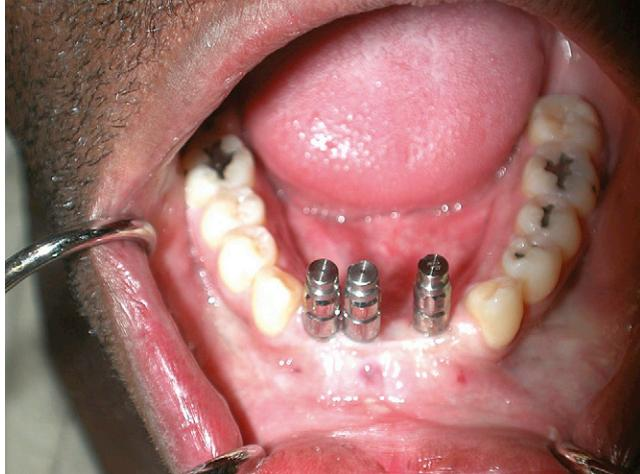

Figure 75-12. Dental implants: before fabrication of prosthesis/bridge. *(Reprinted with the permission of Mirriam Robbins, DDS, New York University College of Dentistry.)*

provide a more comfortable, functional, and stable alternative to conventional dentures. A study52 was conducted of 15 patients over 60 years of age who were treated with implant supported lower dentures and then evaluated for impact of this treatment on their quality of life. The reported benefits of this treatment included improvements in eating, speaking, and social interactions.

Dental implants to treat either full or partially edentulous conditions have become a common treatment option, with more than 90% success rate reported at 10 years. Neither advanced age nor systemic disease are absolute contraindications to implant placement.53 Some studies appear to have demonstrated an increased risk of implant failure associated with diabetes mellitus, smoking, oncologic treatments (including chemotherapy and head and neck radiation), and postmenopausal hormone therapy.54 Patients should be evaluated as candidates for implants based on the level of control of their systemic diseases, their ability to withstand surgical stress, life expectancy, and quality of life.55 Evidence of implant failure due to systemic disease is not prevalent.56

Grant and Kraut57 placed 160 implants in the maxillas and mandibles of 47 patients all aged over 79 and with a median age of 89 years. All but one of the implants healed successfully. The authors concluded that geriatric patients in stable medical condition are suitable implant patients. It appears that concerns about the success of osseointegration in elderly patients as regards to bone remodeling and resorption and decreased soft tissue response may not be entirely warranted. There is no strong body of evidence to support an increased failure rate of implants based on advanced patient age. A review of the literature regarding the success of implants in elderly patients revealed that old age, in and of itself, is not a significant concern.58 Al Jabbari59 concluded that even limitation in oral hygiene capacity in old age is not a contraindication to implant placement. Treating dentists need to first consider if the patient is in optimal condition to withstand the procedure and be less concerned about whether osseointegration is likely to occur in the elderly patient.

#### **SALIVA AND SALIVARY GLANDS**

Xerostomia may occur with medication use, chemotherapy, radiation therapy for head and neck cancer, or as a symptom of Sjögren's syndrome. Common sequelae include an inability to tolerate a dental prosthesis, difficulty swallowing, alteration of nutritional status, and increased incidence of dental caries because of changes in the dental plaque biofilm. The decreased ability to chew comfortably can result in malnutrition, and decreased enjoyment of food and the social interaction of meals.60 Dry mouth is a common complaint in the elderly, possibly secondary to polypharmacy for multiple comorbid conditions. It is more common among patients who take several medications, especially if antipsychotics are included.61

Dry mouth or xerostomia has a number of possible causes including smoking, use of alcohol or caffeinated beverages, mouth breathing, and a host of medications. Some drugs may cause the sensation of dry mouth, whereas others may result in measurable hyposalivation.62 The drugs that are most commonly implicated in dry mouth are antipsychotics, tricyclic antidepressants, β-blockers, antihistamines, and atropine.63 Advancing age and medication use were shown to be related to objective evidence of hyposalivation, whereas female gender and psychiatric issues were strongly correlated to subjective complaints of oral dryness.64

No specific medication has been singled out as being more xerogenic, but polypharmacy does increase the likelihood of dryness. Severity of dryness complaint appears to be increased with female gender and antianginal, antiasthma, and antidepressant medications.65

Drugs can affect salivary flow rate or composition by antagonizing or mimicking any of the regulatory aspects of salivation. The mechanism of action of xerogenic drugs may be due to an anticholinergic action mediated by parasympathetic (M3 muscarinic receptors) neurotransmission to the salivary glands.60 Tricyclic antidepressants have been shown to reduce salivary flow whereas selective serotonin release inhibitors do not. This lower incidence of dry mouth complaint is thought to be related to the lower anticholinergic effects of this group of medications. Approximately one quarter of patients on tricyclics develop a complaint of dry mouth. Muscarinic receptor antagonists, such as oxybutynin, which are used to treat the overactive bladder symptoms of frequency and urgency with or without incontinence, are nonspecific for the bladder and also cause dry mouth. Tolterodine demonstrates in vivo selectivity for the bladder over the salivary glands and may be a good choice for elderly patients who are taking other xerogenic medications.

Anticholinesterase inhibitors such as donepezil, used in the treatment of Alzheimer's disease, may also induce dry mouth. Many antihypertensive agents including β-blockers, ACE inhibitors, and α-methyldopa have been associated with complaints of dry mouth.

A study of 175 home-dwelling elderly patients61 who were hospitalized for an acute change in health status were compared with 252 outpatients. The parameters evaluated included medical diagnosis, prescribed medications, oral examinations, and analysis of saliva samples. Sixty-three percent of hospitalized and 57% of outpatients complained of dry mouth, whereas 13% of hospitalized and 18% of outpatients complained of burning mouth. There were no differences in the biochemical analysis of the saliva between the two groups. The complaint of dry mouth was associated with polypharmacy, whereas this was not the case for the complaint of burning mouth. Dry mouth and burning mouth were rarely reported simultaneously.

The management of dry mouth is challenging, and saliva substitutes have been the mainstay of treatment for many years along with alcohol-free mouth rinses, increased water intake, lubricating gels, and alteration of food consistency (blenderized diet). Since dentate patients diagnosed with xerostomia are prone to an increased incidence of caries, a comprehensive and aggressive caries monitoring protocol should be instituted including fluoride treatments, sealants, and use of sugar-free lubricating gum. Stimulation of salivary secretion with Yohimbine, an α2-adrenoreceptor antagonist has been somewhat effective in patients being treated with psychotropic drugs. Another strategy, for patients on multiple medications, is for physicians to evaluate the xerogenic potential of each of the mediations prescribed for an individual and to alter the medication regimen if at all possible. A persistent dry mouth may necessitate alteration of drug dose or prescription.61

#### **ORAL LESIONS**

Oral mucosa possesses an essential protective function, which is presumed to diminish with age as the tissue becomes more permeable. This theory appears to be supported by the reported increased incidence of oral lesions with advancing age.66 However, Wolff and Ship67 found that the incidence of oral mucosal lesions in healthy adult seniors was not significantly higher than that of the general population. Other factors contributing to the development of oral mucosal lesions include general health and nutrition status, medication usage, and the presence of ill-fitting dentures.

Common oral mucosal conditions of elderly denture wearers include candidiasis (Figure 75-13, see also Color Plate 75-13), epulis fissuratum (soft tissue hyperplasia), traumatic ulcers, angular cheilitis (Figure 75-7, see also Color Plate 75-7), and coated tongue. Although the majority of oral mucosal lesions appear to be benign, premalignant and malignant lesions are also present, usually in the form of

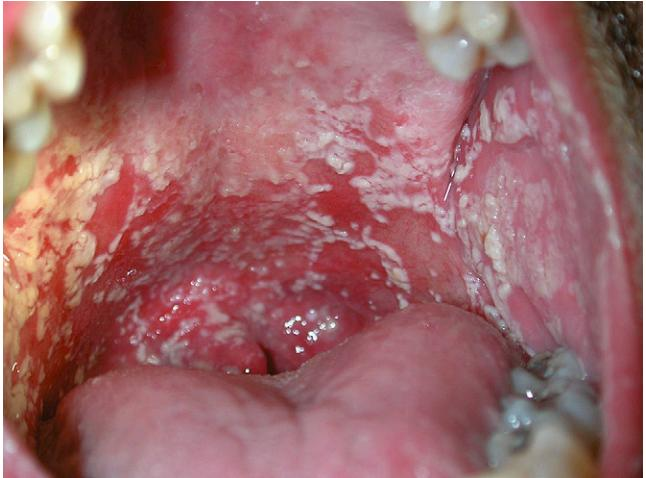

Figure 75-13. Oral candidiasis: note striae throughout indicative of fungal infection. *(Reprinted with the permission of Mirriam Robbins, DDS, New York University College of Dentistry.)*

leukoplakias (Figure 75-4, see also Color Plate 75-4), erythroplakias, and squamous cell carcinomas (Figure 75-6, see also Color Plate 75-6).

Denture stomatitis is a generally asymptomatic, inflammatory process found on mucosal surfaces underlying full or partial removable dentures (Figure 75-8, see also Color Plate 75-8), with a commonly reported prevalence of 10% to 75% of denture wearers.68 Causal factors for the development of denture-related stomatitis include trauma from ill-fitting dentures, poor oral hygiene, reduced vertical dimension (atrophy), continuous use of prosthesis, unstable occlusion, hyposalivation, and nutritional deficiency. The increased incidence of lesions was associated with a greater number of years of denture use. Interestingly, advanced age and high alcohol consumption did not correlate with incidence of these lesions.69

A retrospective study of 4098 adults, investigating the prevalence of oral lesions and association of those lesions with age, dentures, tobacco, or alcohol use, found that the overall prevalence of oral mucosal lesions appeared to be linked to risk behaviors and age. More than 27% of the male adults and 22% of the female subjects were noted to have a mucosal lesion. The use of alcohol and tobacco appeared to be linked to the incidence of leukoplakia, nicotinic stomatitis, and frictional lesions. Denture-related lesions, in the form of candidiasis and traumatic and frictional lesions, appeared to be the most prevalent.70

The incidence of oral mucosal lesions71 in a Thai population of 500 adults over the age of 60 was investigated in relationship to type of lesion, age, sex, and presence or absence of dentures. The incidence of oral mucosal lesions in this study population was 83.6%, with no significant gender difference. The incidence of oral mucosal lesions appeared to increase with advancing age and denture use. The three most prevalent oral mucosal conditions were traumatic ulcers, fissured tongue, and lingual varices. Premalignant lesions were detected in 5% of subjects, and squamous cell carcinoma was detected in less than 1% of the subjects.

In one study,72 older patients, especially females, appeared to be at increased risk of developing malignant lesions, and curiously, those who never smoked appeared to be at greater risk. Oral squamous cell carcinoma most commonly occurred on the ventral and lateral tongue, floor of the mouth, and retromolar regions.

Angular cheilitis is characterized by cracking fissures at the commissures of the lips, which may be caused by saliva accumulation in this region secondary to ill-fitting dentures, candida infections, or vitamin deficiencies (B) (Figure 75-7, see also Color Plate 75-7). Discomfort with eating and speaking are often attendant complaints. Treatment is aimed at the cause and may include topical antifungal ointments, vitamin supplements, dietary changes, and denture adjustments—or in some cases the fabrication of new dentures or implant supported prostheses.

Poor oral hygiene, immune compromise, or both can lead to an overgrowth of candida on dentures, resulting in denture stomatitis and oral-pharyngeal candidiasis (Figure 75-13, see also Color Plate 75-13). It is frequently asymptomatic and found on routine examination. On occasion, complaints of a painful or burning sensation may be elicited. Common clinical characteristics include erythema or pinpoint hyperemic areas in denture-bearing locations. Frank fungal colonies are also sometimes observed. If the affected region is limited to the denture-bearing areas, dentures should be routinely brushed and may be soaked in chlorhexidine or a dilute hypochlorite solution. In more extensive areas, oral antifungal troches are administered. Denture stomatitis may occur in up to one half of edentulous patients who wear full dentures.39

Oral cancer occurs most frequently in the older population, usually in or after the sixth decade of life, with more than 95% of cases occurring in individuals over the age of 45.17,73 These cancers account for approximately 3% of all cancers in the United States. The National Institute of Dental and Craniofacial Research estimates that more than 28,000 Americans will be diagnosed and that 7000 individuals will succumb to oral cancer this year. Oral cancer affects men more frequently than women by a ratio of approximately 2:1. Tobacco and alcohol use remain primary risk factors for the development of oral cancers, the risks increasing with increased usage of either or both substances. The 5-year survival rate remains at 59%.74

Early detection remains the key to improved prognosis. Common clinical signs and symptoms include nonhealing ulcers and areas of leukoplakia, erythroplakia, or mixed lesions. Lesions that do not resolve upon removal of a suspected irritant or within a few weeks of detection should be biopsied because histologic evaluation is necessary to determine if any dysplastic or malignant changes are evident. If a malignancy is detected, treatment is then predicated on the staging of such lesions and may involve surgical ablation, chemotherapy, radiation therapy, reconstruction with vascularized grafts, and oral rehabilitation.

## **CONCLUSION**

Compromised oral health may result in a variety of illnesses and conditions that can adversely impact an individual's quality of life or life span. Engaging in conversation, enjoying a good meal, kissing a loved one, smiling and laughing—many of life's "little pleasures"—require a functioning and esthetically acceptable dentition. The ability to engage in these activities improves socialization, self-esteem, and the quality of life of all but the most infirm and cognitively impaired individuals. Additional benefits of good oral health on an individual's systemic health include improved diet and nutrition and decreased frequency of aspiration pneumonia in the frail elderly population. The association between periodontal disease and cardiovascular disease, stroke, diabetes, and myocardial infarction may prove to have the most far-reaching health benefit.

The key to maintaining oral health in the geriatric population remains timely access to care. Community dwelling dependent seniors, homebound frail elderly, and long-term care facility residents face many more obstacles to receiving dental care than do healthy, independent seniors. Therefore, physicians play a primary and crucial role in ensuring adequate oral health of these individuals. Familiarity with common oral conditions afflicting both dentate and edentulous elderly adults is the first and most basic step in assuring improved oral health in these patients.

# KEY POINTS

Maintaining Oral Health in the Geriatric Population

**Definition of Oral Health:**

- Conditions that adversely affect the oral and maxillofacial complex are common and pervasive in the elderly and can affect an individual's general health and quality of life. Physicians are in a unique position to screen elderly patients for common oral disorders. Impact on Quality of life.
- Poor oral health and loss of teeth adversely affect nutritional status and gastrointestinal health by limiting food choices secondary to masticatory insufficiency. In addition, socialization and psychologic well-being may also be affected. Oral Health Impact on Systemic Health.
- The link between oral and systemic disease has been reinforced in recent years, specifically in relationship to cardiovascular disease. The risk of aspiration pneumonia in nursing home residents has been demonstrated to be decreased with improvements in oral hygiene care. Recognition and management of common oral diseases of the elderly.
- Improvement of oral health hinges on recognition of common conditions, including caries, periodontal diseases, partial or complete edentulism, salivary gland dysfunction, benign and malignant lesions of the mucosa, and bony structures.

For a complete list of references, please visit online only at www.expertconsult.com